# 第六章

# 中国 “十四五” 期间 “核心技术” 信息可视化设计

# 一、 课程项目背景

年 强化国家战略科技力量 是政府工作报告提出的提升科技创新能力的首要任务 国家十四五规划纲要 从整合优化科技资源配置 加强原创性引领性科技攻关 持之以恒加强基础研究 建设重大科技创新平台 个方面作出部署 强化国家战略科技力量

国家十四五规划纲要 部署了 十四五 期间科技方向 个重要内容 强化国家战略科技力量 提升企业技术创新能力 激发人才创新活力 完善科技创新体制机制 年政府工作报告部署了 年科技创新的重点工作 两者都指向 年 关键核心技术实现重大突破 进入创新型国家前列 的目标任务 科技创新被提升到了前所未有的地位 其中 在 核心技术攻关 中明确给出了攻关范围 人工智能 量子信息 集成电路 生命健康、 基因工程、 生物育种、 空天科技、 深底深海等前沿领域； 新发突发传染病和生物安全风险防控、 医药和医疗设备， 关键元器件零部件和基础材料、 油气勘探开发等领域关键核心技术。

本课程项目围绕中国 “十四五” 期间的 “核心技术” 进行信息可视化设计， 建议课时学时 建议专业为视觉传达设计方向和工业设计方向的研究生和本科生选修 项目要求从 “核心技术” 中取材， 选择不少于一种关键技术， 对其做科普信息可视化展示设计。 调研内容可从网络取材 设计手法不限 输出完整视觉效果方案 以数据可视化的方式 结合生成设计 对某一领域的数据信息作可视化设计并以视频展厅的形式做纯线上的视频效果设计。

# 二、 课程项目设计作品

［项目 1］ 植物生物育种

作品名称： 《Plant Breeding （植）》

设计者： 陈婉馨 张无为 陈嘉颖

在 国家十四五规划纲要 中 科技创新被提升到了前所未有的地位 其中 生物育种是需要进行攻关的科学核心技术之一 生物育种是利用遗传学 细胞生物学 现代生物工程技术等方法原理 培育生物新品种的过程

在植物育种 的背景下 本作品以植物与植物繁殖为主题 设计交互网页 利用信息

可视化手段对四大种类植物 种子植物 苔藓植物 蕨类植物 藻类植物 的结构特征植物350 亿年的进化史进行介绍； 利用 Processing 编程的生成语言辅以交互体验， 对目前最新的基于遗传操作的生物育种进行科普和风格化表达 该作品可应用于生物育种科普网站植物园导览设施、 互动屏幕， 以一种更直接、 更生动风趣的方式让用户了解植物的相关知识 基因对植物外形的作用 基于基因编辑的植物育种方式 项目主视觉形象如图 所示， 标志设计如图6 －2 所示。

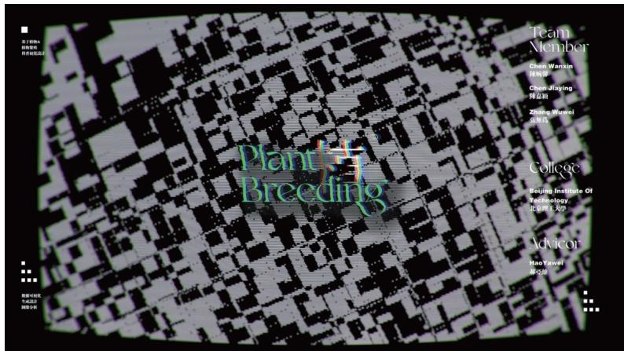  
图6 －1 植物生物育种项目主视觉形象

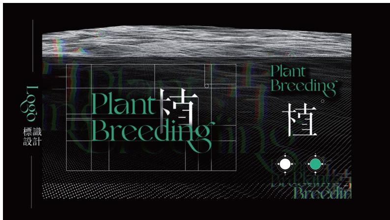  
图6 －2 植物生物育种项目标志设计

中国生物育种与国外先进水平相比仍存在一定的差距。 在粮食、 油料作物上， 中国的育种技术还是很不错的 但在园艺作物上 国内的育种除了个别项目之外 其他仍然有着十分大的差距 从科研角度上讲 植物育种是一项长期且艰巨的工作 育种科研主要集中在高校和研究机构 育种公司较少 为了让更多人了解相关知识 激发民众对植物育种的兴趣 为这项核心技术培育潜在后备人才， 学生设计了 Plant Breeding （植） 一个以植物与植物繁殖为主题的科普信息可视化的交互网站 植 网页分为首页和 个单元个单元为植物种类和科普单元 进化史单元 繁殖过程单元 个单元通过首页链接 通过首页的控件点击进入各个单元的体验部分 配色方案采用了神秘 具有探索意味的黑白色加上代表植物的绿色进行组合 插图采用了写实手绘的风格元素对植物种类 细胞结构进行

展现， 利用点的疏密来形成层次和细节， 在精细的刻画过程中不破坏整体的简洁印象。图 为项目网页模型框架 图 为插图风格

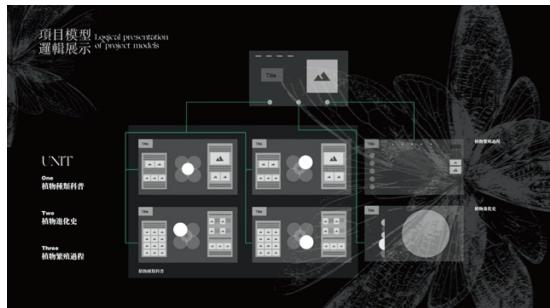  
图6 －3 植物生物育种项目网页模型框架

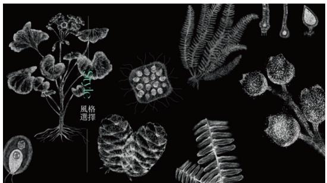  
图6 －4 植物生物育种项目插图风格

首页设计 首页设计要给体验者留下植物学初印象 在首页的静态布局设计上将 logo 主图形作为整个页面的视觉中心， 页面下方设置了 3 个 icon 点击， 当鼠标碰触到图标时会弹出相应页面的内容简介， 点击便可跳转至3 个不同单元。 主视觉图案与植物种类相关联 植物按种类分为种子植物 蕨类植物 苔藓植物和藻类植物四大类 将每一类植物的特征进行提取， 融合成了主视觉图案。 logo 的元素由代表植物繁殖的 plant breeding 和代表本项目主题的字体设计 “植” 组成。 logo 的配色沿用了网站整体的配色方案。 图 6 － 5 为首页设计图， 图6 －6 为四大类植物插图。

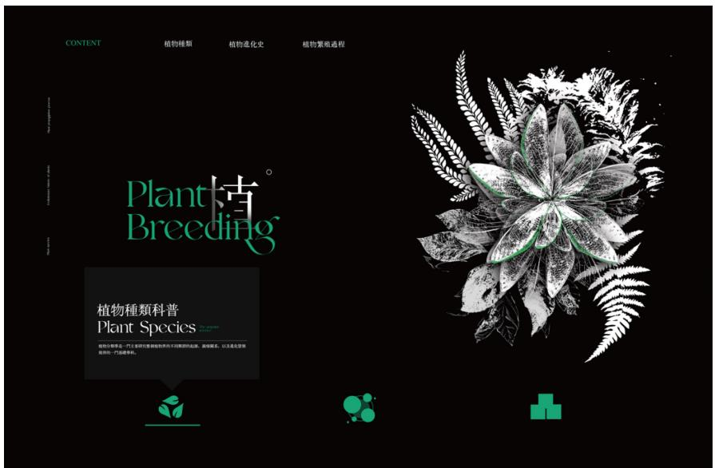  
图6 －5 植物生物育种项目首页设计

单元一 单元一是植物种类科普页 植物种类科普页对植物的分类 结构特征进行介绍 页面以主视觉图案为中心 在每种类型植物上分别设置了按钮 通过点击按钮显示对应植物种类的知识 种植物 个页面 通过主视觉图形透明度的变化来提示所显示的植物的种类。 这一阶段的可视化设计集中在对植物结构的分析、 植物的五带分布、 植物的细化分类等 文字配合插图 使版面更加丰富 也便于体验者理解 单元一植物种类科普页设计如图 6 － 7 ～ 图 6 － 10 所示。

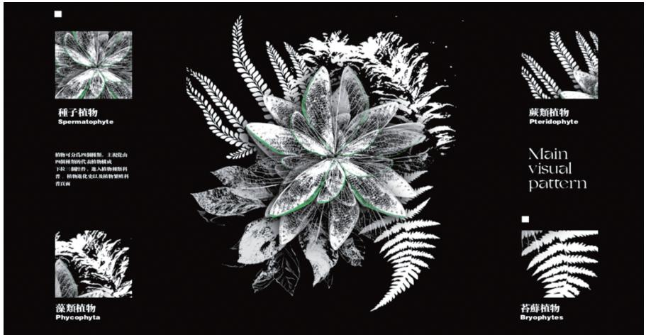  
图6 －6 植物生物育种四大类植物插图

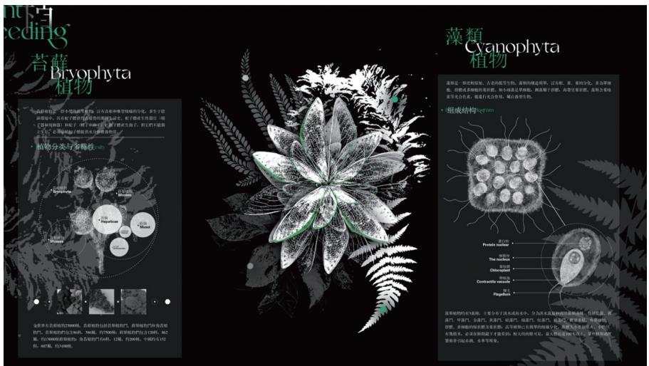  
图6 －7 植物生物育种单元一—— 植物种类科普页设计1

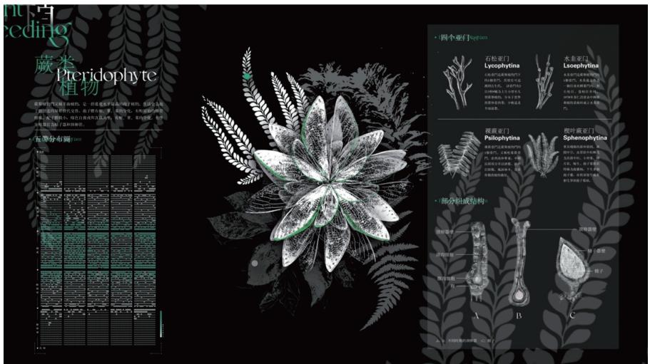  
图6 －8 植物生物育种单元一——— 植物种类科普页设计2

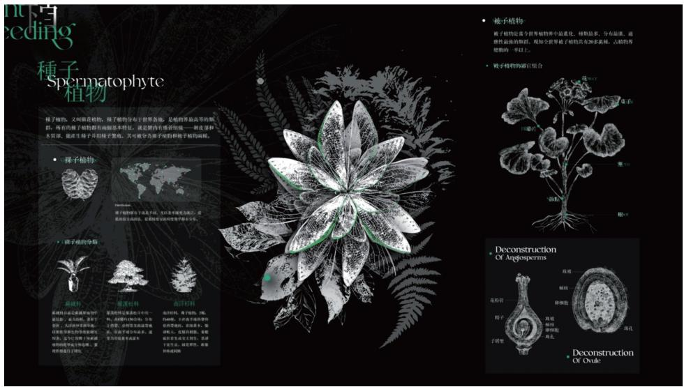  
图6 －9 植物生物育种单元一——— 植物种类科普页设计3

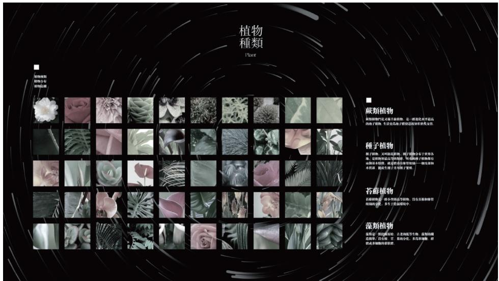  
图6 －10 植物生物育种单元一— 植物种类科普页设计4

单元二 单元二是植物进化史页面 单元二对 亿年的植物进化史进行科普主页面左侧的图像利用动画来表示植物种类变迁时代的节点 右侧是植物种类随时空变迁的变化 用户通过进度条滑动 可控制显示植物进化的演进过程 植物的进化共经历了 个时代 菌藻植物时代 蕨类植物时代 种子植物时代和被子植物时代 从 亿年前开始到亿年前 近 亿年的时间 地球上的植物仅为原始的低等的菌类和藻类 从 亿年前由一些绿藻演化出原始陆生维管植物 植物开始向陆地迈进 后历时约 亿年 许多蕨类植物由于不适应当时环境的变化相继绝灭 陆生植被的主体则由裸子植物所取代 被子植物是从白垩纪迅速发展起来的植物类群 并取代了裸子植物的优势地位 植物进化史页面对不同种类植物的出现过程进行视觉化设计 右上方的抽象圆点图形表示植物类型 中间的斜线将整体一分为二 上部分代表陆地 下部分代表海洋 中间的圆圈层代表时间 由内向外时间逐步变化 由最内层的 亿年前到最外层的 亿年前 图 为单元二植物进化史页设计

（4） 单元三。 单元三是植物繁殖过程页面。 植物繁殖过程页面展示植物育种 4?? 0 时期基于遗传操作的植物育种的关键 植物繁殖是一个非常复杂的过程 需要相对较高的专业知识 所以对于初接该领域的体验者来说 它是抽象的也是很难理解的 该页面为了直观地体现植物育种中基因与植物形态构成的关系， 将基因与植物形态结合， 用字母代表基因， 用图案代表植物形态 表达不同基因决定了植物组成部分的不同形态 为了提升交互体验 在页面左侧设置基因按钮 用户通过点击切换字母大小写 生成不同的植物形态 通过不同的基因字母生成不同图案。 根据用户的选择， 代表基因的字母从各自的按钮中显现出来， 形成不同的植物形态。 如： A 代表花瓣数量， B 代表花瓣形状， C 代表花蕊形态， D 代表根茎的弯直， E 代表叶子的形态， 等等， 不同的字母组合所生成的图案是完全不同的。 植物图案形成后， 点击页面的任意位置即可进入下一个阶段产生新的动态画面， 代表该植物的基因会汇成一束转换为埋入地面的种子， 逐步发芽生长。 生长的植物形态与用户选择的基因相关。图6 －12 为交互设想方案， 图6 －13、 图6 －14 为交互生成设计。

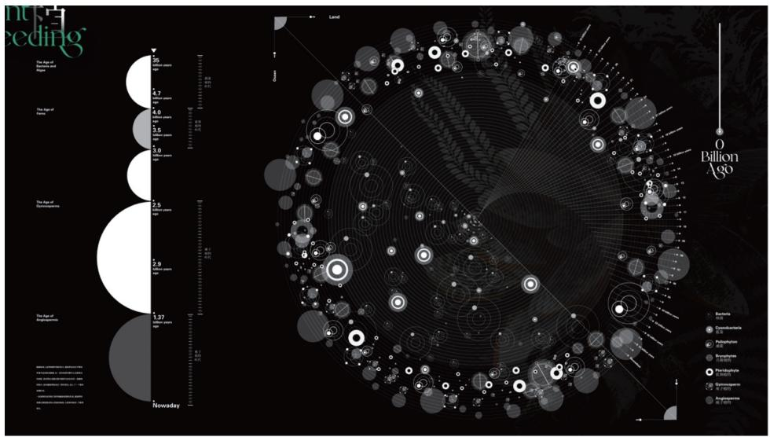  
图6 －11 植物生物育种单元二—— —植物进化史页设计

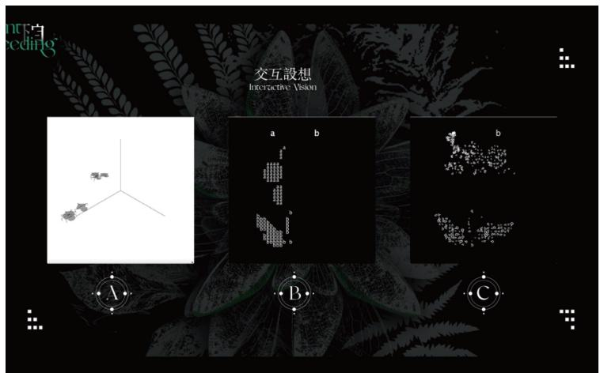  
图6 －12 植物生物育种单元三———交互设想方案

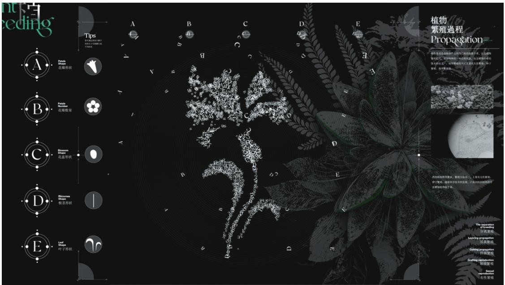  
图6 －13 植物生物育种单元三———交互生成设计1

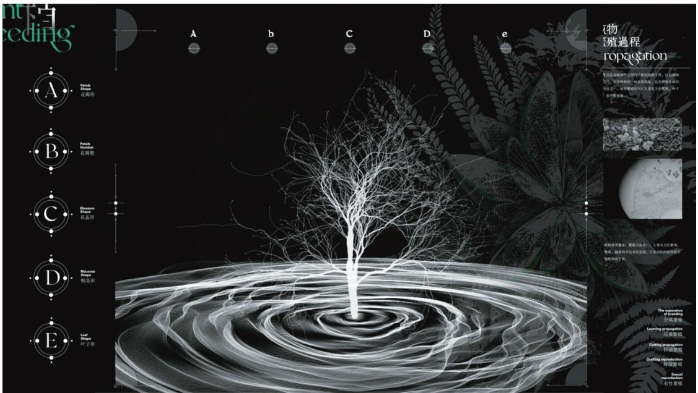  
图6 －14 植物生物育种单元三———交互生成设计2

# 项目设计制作说明

静态图像： 在 及 中绘制主视觉 信息视觉化以及其他插画元素 包括网页风格、 版面设计。

视频图像： 用 和 剪辑并制作

动态图像： 用 OpenProcessing 官网实例， 进行代码修改以及自主编写完成动态图像。

交互设计： 用 Processing 进行编程完成页面交互。

# 项目资料收集、 逻辑整理

静态图像： 在 Procreate 及 Ai 中绘制元素， 导入 Processing。

交互设计： 在 Axure 中进行页面交互模拟。

作品展示视频二维码：

# ［项目 2］ 中国疫苗及基因检测

作品名称： 《免疫攻防》

设计者： 张凯 邵美涵 江雨桐

年 世界新冠肺炎疫情全球大流行 根据全球新冠肺炎疫情实时统计数据显示 截至北京时间 年 月 日 全球新冠肺炎累计确诊病例已经超过 亿例 累计死亡病例 万例 疫情使人类生存健康和全球经济带来巨大影响 受新冠肺炎疫情影响多国经济出现下滑 为减缓疫情传播和新冠病毒的扩散 各个国家都在积极研制新冠疫苗由于缺乏对于新冠病毒以及疫苗的科学知识的了解 人们对于新疫苗存在着种种不解与担忧， 害怕注射疫苗后会给身体带来不良影响， 影响身体健康。 基于此， 学生决定以人体免疫与疫苗为主题展开科普信息可视化设计

设计内容一共包括三大部分 张科普信息可视化知识的展示海报 一套 张 移动端宣传信息图片 一个宣传视频 主视觉设计采用 立体图形 帮助人们直观地了解免疫器官及免疫细胞； 二维几何图形主要运用在流程展示、 信息图标可视化等方面， 设计清晰地展示反应过程 高效输出有效信息 海报主色调为蓝灰调 体现科技的严肃性 文字运用优设标题黑与微软雅黑两种字体 优设标题黑由黑体变换而成 无衬线 字体简洁大方 识别性更强。 本设计的目标人群： A———想要了解人体免疫系统、 免疫流程、 疫苗源的群体；B———对新冠疫苗原理及安全性存疑的群体。 信息可视化设计的主要内容主要围绕人体免疫系统和疫苗两大部分。

人体免疫系统是人体由免疫器官 免疫细胞 免疫活性物质 部分组成 作品主要展示了免疫器官 如扁桃体 胸腺 淋巴结 脾 骨髓 淋巴管等的位置及作用 免疫细胞的概念定义以及分化来由 作品还展示了保护人体健康的三大防线 第一道防线是皮肤 黏膜及其分泌物 第二道防线是体液中的杀菌物质 如溶菌酶 和吞噬细胞 第三道防线为特异性免疫 主要是免疫器官和免疫细胞借助血液循环和淋巴循环与抗原进行战斗 调研分析制作成图表型思维导图 （图6 －15）， 以方便进行后续的信息可视化图表设计。

疫苗部分首先介绍疫苗的定义 疫苗五大制备原理及流程 疫苗作用流程 并介绍了年以来的六大公共卫生事件 其次 披露了新冠疫苗的大量数据信息 主要讲述我国疫苗的研制、 制备、 接种、 出口等现状， 包括国内现批准使用的 5 家疫苗公司的三大类疫苗 以及三类疫苗的制备原理 接种流程 同时介绍了中国疫苗出口分布以及全球接种疫苗等内容。 细胞建模草图如图6 －16 所示。

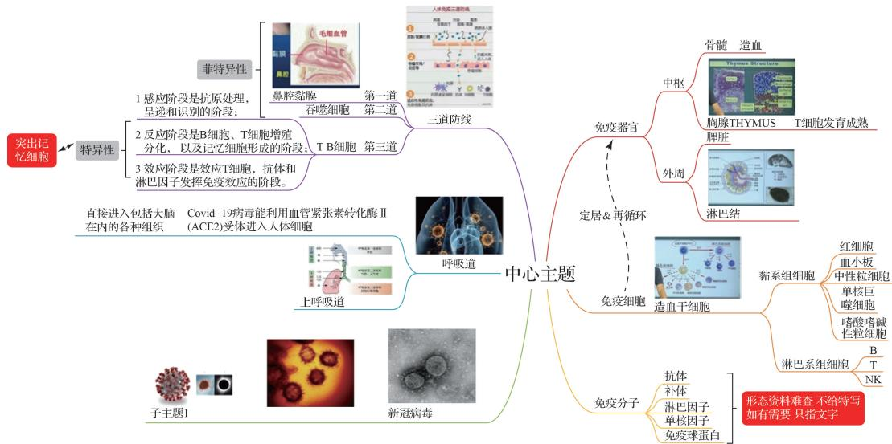  
图6 －15 《免疫攻防》 调研思维导图

# 3D、Encharts草图

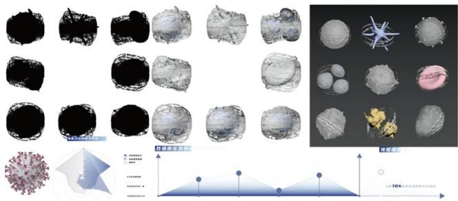  
图 6 － 16 《免疫攻防》 细胞建模草图

此项目希望能够通过科普信息可视化设计 给人们带来不一样的体验 帮助人们生动形象地了解新冠疫苗的安全性 呼吁更多的人去接种疫苗 为国家的免疫攻防贡献一份力量作品完成图如图 图 所示

# 项目设计制作说明

静态图像： 在 Ai 中绘制图像， 并修改 Echarts 文件中的颜色及形状， 用 3D max 软件进行建模 渲染图像

动态图像： 用 Echarts 官网实例进行代码修改完成动态图像， 用3D max 软件进行建模和动态制作 用花火 官网实例进行数据修改完成动态图像

视频图像： 用 剪辑和视频制作效果 用 软件进行建模和动画效果

作品展示视频二维码：

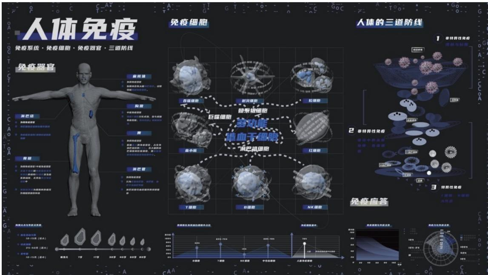  
图6 －17 《免疫攻防》 作品完成图之一

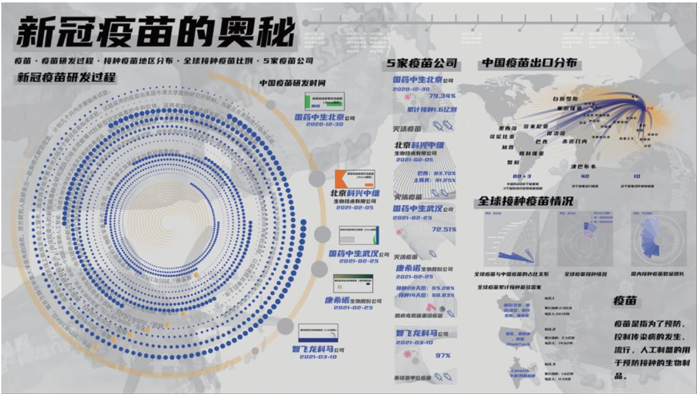  
图6 －18 《免疫攻防》 作品完成图之二

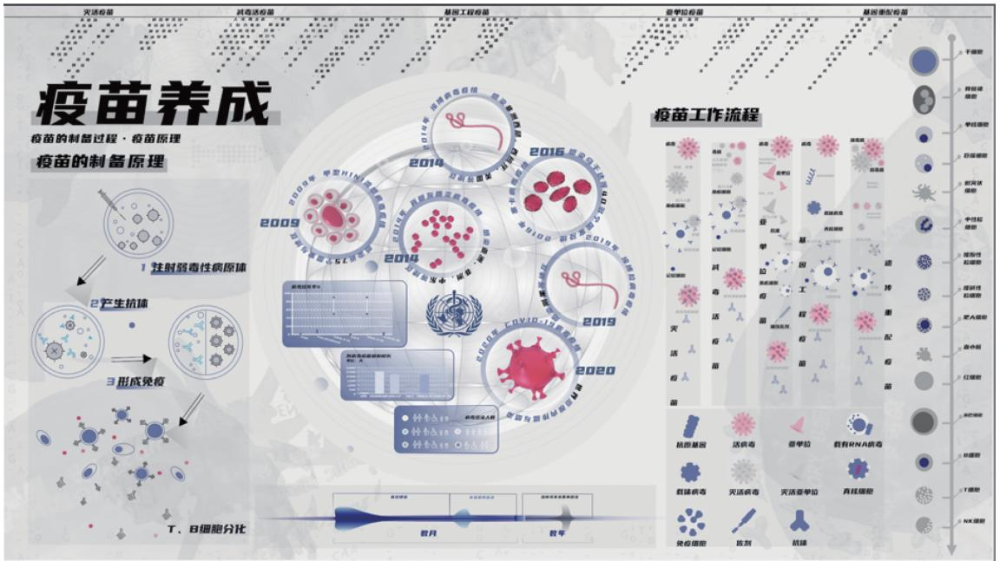  
图 6 － 19 《免疫攻防》 作品完成图之三

# ［项目 3］ 深空探测技术中 “火星探索”

作品名称： 《 “天问一号” 火星探测》

设计者： 高敏 王悦 杨慧敏

多年前 屈原在 天问 中发出了 遂古之初 谁传道之 的疑问 宇宙广大人类也从未停止对浩瀚星空的憧憬与探索。 随着2020 年7 月23 日 “天问一号” 火星探测器升空， 中国在探索宇宙的征途上又向前迈进了一步。 在 2021 年 5 月， “天问一号” 着陆火星 开展巡视探测等工作 因此 学生希望在这个时间点能够对中国探索火星的过程进行视觉可视化的呈现 以此向中国航天科技人员致敬 主页设计如图 所示

信息可视化设计主要分为三大部分 图 介绍火星 各国探索火星 中国探索火星。

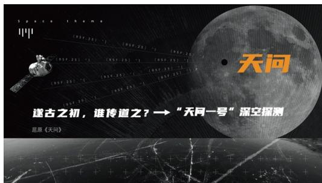  
图6 －20 《“天空一号” 火星探测》 主页设计图

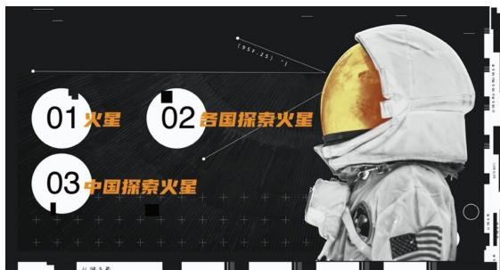  
图6 －21 《 “天空一号” 火星探测》 信息内容模块

第一部分， 介绍火星科普内容， 包括以下内容：

火星与地球数据的对比 通过色块的形式呈现火星的直径 质量 自转轴倾斜度引力 大气层 温度等

人类从肉眼观星时代到如今火星探测器时代的探索历程 以线性 剪影的方式呈现。

第二部分是各国对火星的探索 主要包括美国 俄罗斯 欧洲 日本 印度和中国 展示内容是收集与整理的世界各国探索火星数据。 此外， 对不同年份各国探索火星的次数和总次数、 成败次数和成败总次数进行了梳理； 对各国信息进行可视化的动态呈现， 用户可以点击可视化图表获取详细信息 从这些图表中 用户可以看到各国探索火星的热潮时间以及探索火星的艰险程度。

第三部分是中国对火星的探索 首先对 年中国 美国 阿联酋发射的 个火星探测器和运载器进行对比分析。 美国 “毅力号” 火星探测器于 2021 年 2 月着陆火星， 中国“天问一号” 火星探测器于2021 年5 月着陆火星， 阿联酋 “希望号” 火星探测器于2021 年实现火星环绕。 调研统计图表如图 6 － 22、 图 6 － 23 所示。

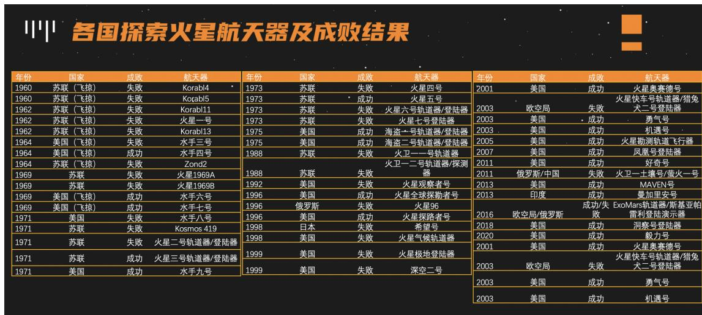  
图 6 － 22 《“天问一号” 火星探测》 调研统计图表之一

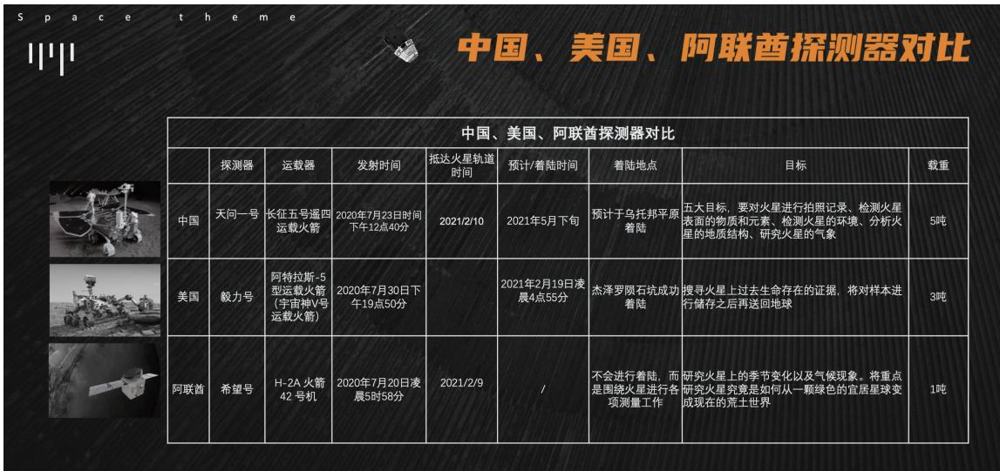  
图6 －23 《“天问一号” 火星探测》 调研统计图表2

该项目主要分析了中国 “天问一号” 探测器探索火星的数据， 用线描的形式呈现 “天问一号 探测器的组成 包括着陆器 轨道器和火星车 如图 所示 图 是天问一号 探测器的发射过程和着陆过程 包括气动减速段 降落伞减速段 动力减速段、 最终的软着陆阶段） 视觉可视化。

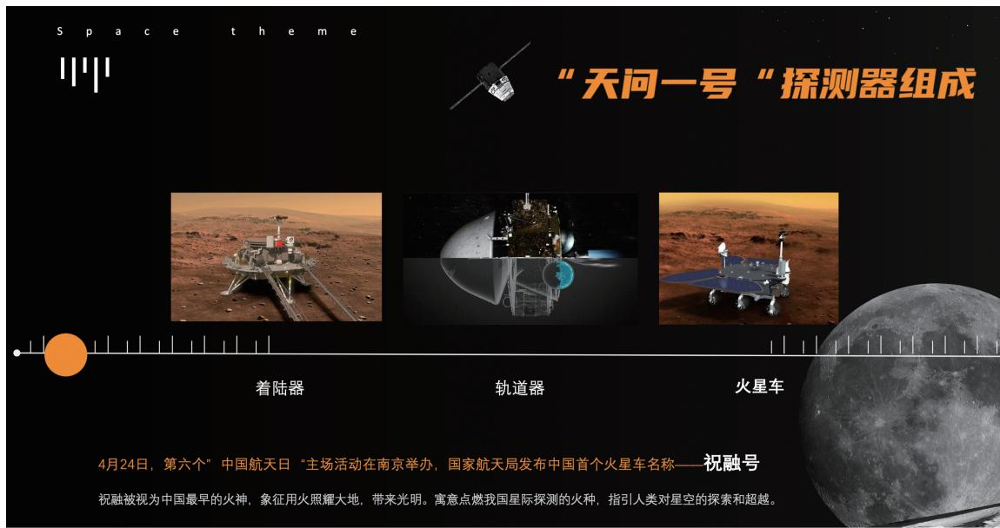  
图6 －24 “天问一号” 探测器组成

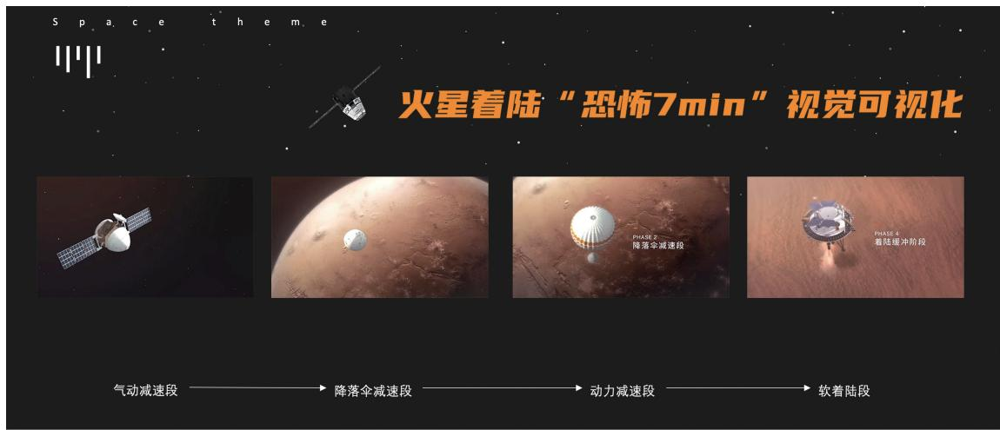  
图6 －25 火星着陆过程视觉可视化

整体色彩应用方面， 采取了黑色作为图表的背景， 寓意为浩瀚的宇宙； 主色调采用橙红色 代表火星 文字应用部分 主标题采用优设标题黑 副标题和正文采用思源黑体 设计元素部分 对于收集到的信息 主要以图表 线稿 色块的形式呈现 辅助图形有 屈原剪影以及 星空 等 另外 对每张图的信息数据通过在版面中的占比以及色彩 明度来进行层级的划分， 比如 “天问” 这个主体词以及 “天问一号” 探测器发射过程是重点呈现的部分 色彩上采用白色和橙红色 明度较高 火星介绍和各国探索火星为辅助信息 因此

降低了版面占比和明度。

“天问一号” 探测器在火星走出的每一小步， 都是中国深空探测的一大步。 “天何所沓，十二焉分 日月安属 列星安陈 相信终有一天 人类会踏足其他行星甚至其他星系 但我们仍然希望能够记住 “天问一号”， 因为它寄托着我们几千年的问天梦想， 承载着我们无穷的想象和勇气， 因此， 通过此次设计表达对火星探索的敬意。 图 6 － 26 为设计作品完成图。

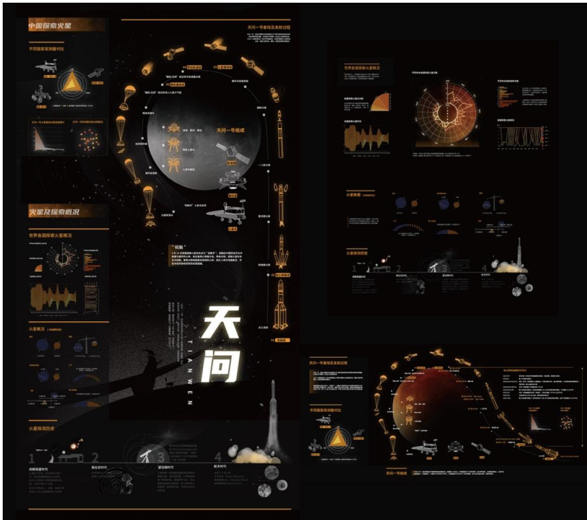  
图6 －26 《“天问一号” 火星探测》 作品完成图

# 项目设计制作说明

静态图像： 在 Ai 中完成线稿的绘制， 在 Ps 中完成整体排版。

动态图像： 用 Echarts 官网实例进行代码修改， 结合花火 Hanabi 官网完成动态图像。

视频图像： 使用 Ae 剪辑制作视频， 用 Pr 进行音乐处理。

作品展示视频二维码：

# ［项目 4］ 中国深海探测

作品名称： 《深海的勇者》

设计者： 柯一诺 贾靓琪 陈琦

人类社会的发展离不开对各种资源的开发和利用 在陆地资源逐渐枯竭的今天 人们把目光投向了深海大洋 深海资源的开发需要深海技术做支撑 深海潜水器发展技术水平是衡量一个国家深海技术的主要标志 也体现着一个国家对深海开发和利用的综合实力 载人潜水器作为一种深海运载工具 可将科学技术人员与工程技术人员以及各种电子装置与机械设备等快速 精确地运载到目标海底环境中 高效勘探测量和科学考察设备已经成为人类开展深海研究 开发和保护的重要技术手段和装备 载人潜水器与搭载人员配合 可以有效地收集信息 详细地描述周围环境 快速地在现场作出正确的反应 年 世界第一艘载人潜水器在美国诞生 自此世界各国载人潜水器技术实现突破性发展 图 为世界各国顶级作业型深海载人潜水器插图设计。

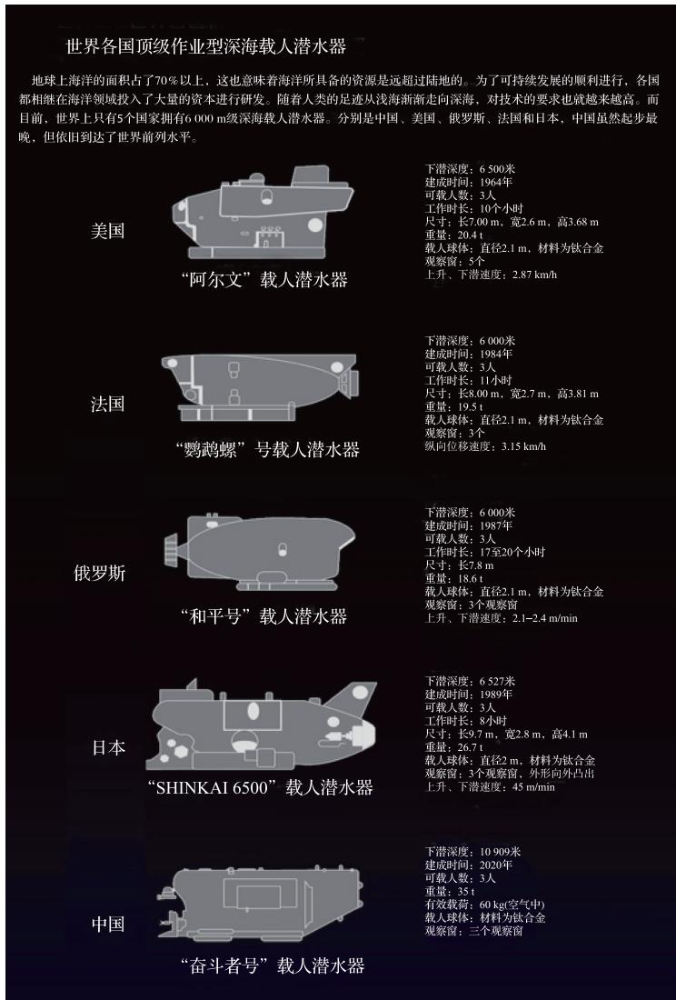  
图6 －27 世界各国顶级作业型深海载人潜水器插图设计

年 中国第一台深海载人潜水器 蛟龙号 研制成功 年 月 日 中国第二台深海载人潜水器 “深海勇士号” 载人深潜试验队在中国南海完成全部海上试验任务；2021 年， “奋斗者号” 成功交付， 完成了 21 次万米下潜科考任务。 短短 12 年的时间， 中国深海科技进入世界前列。 中国深海载人潜水器插图设计如图 6 － 28 所示。

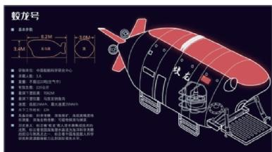

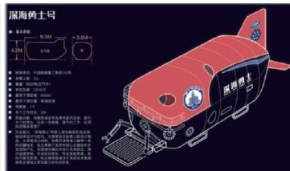

图6 －28 中国深海载人潜水器插图设计  
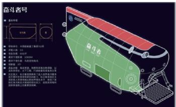  
蛟龙号 载人潜水器 深海勇士号 载人潜水器 奋斗者号 载人潜水器

青少年作为下一代社会中坚力量 独立意识逐渐完善 其情感体验从外显性 冲动性向内在文饰和理性方向发展 情感的表达更加具有社会道德感和责任感 依照青少年的心理以科普的形式对其进行科学知识的引导及培养， 使他们了解更多科学知识， 掌握科学方法， 增强民族自豪感 形成具备爱国科学家潜质的青少年群体

基于此， 该项目设计标题名为 《深海的勇者》， 以适应青少年群体的情感体验。

第一板块以 的中国三艘载人潜水器为主体 通过较为规整的立体卡通的形式吸引青少年的视觉 同时 在搭配平面图表及相关介绍使青少年对中国载人潜水器的发展脉络有了一定的认知， 并对后续章节产生兴趣。

第二板块以 制成的中心散点图为主体 通过不同的色彩代表不同的载人潜水器 清晰地表明三艘载人潜水器下潜时间及次数 同时配以 制成的平面图表 展示中国载人潜水器下潜位置 技术占比及最大下潜深度。

第三板块以宏观的角度进行结尾 立体地球作为视觉中心点 经过前面的铺垫 青少年对中国载人潜水器有了一定的认知 在此基础上将其整体视野引入进入世界范围 对世界载人潜水器的发展现状有所了解 使青少年清晰地感知 中国深海技术发展虽晚速度却很快 年的发展历程 通过中国深海科学家的努力 我国万米深潜次数和人数居世界首位 设计作品完成图如图 6 － 29 ～ 图 6 － 31 所示。

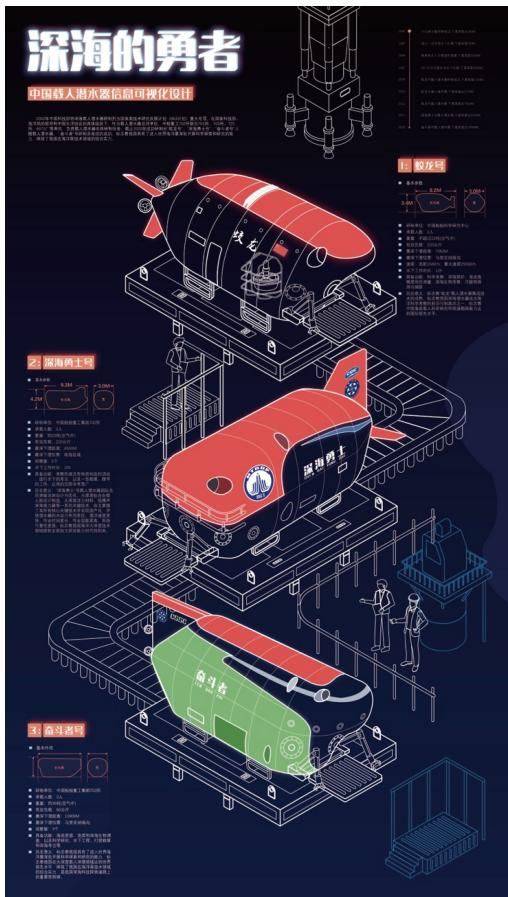  
图6 －29 《深海的勇者》 作品完成图1

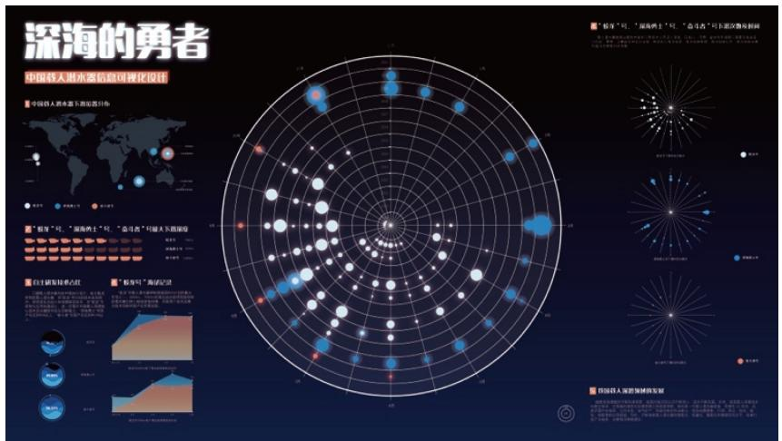  
图6 －30 《深海的勇者》 作品完成图2

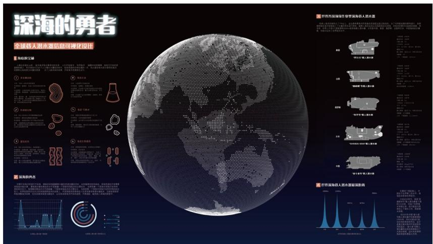  
图6 －31 《深海的勇者》 作品完成图3

作品展示视频二维码：

# ［项目5］ 生物育种海水稻种植

作品名称： 《海水稻种植》

设计者： 栾允梅 张梦圆 魏睿婕

世纪已经进入了 基因世纪 生物大发展的背后也反映了人们对于食品种类及其安全等问题的关注， “生物文盲” 以及所引发的社会舆论恐慌现象也迫切要求在全社会进行生物科普教育 传统的依托文字信息进行科普的形式显然不适合当今社会的快节奏发展 而晦涩深奥的内容也不能使大众有效接受， 因此， 学生采取了群众喜闻乐见的动画形式来讲解以遗传工程等杂交技术为基础的生物育种

海水稻是一种介于野生稻和栽培稻之间的普遍生长在海边滩涂地区具有耐盐碱的水稻海水稻比其他普通水稻具有更强的生存竞争能力， 具有抗涝、 抗盐碱、 抗倒伏、 抗病虫等能力。 在对生物育种相关知识及数据进行收集和梳理筛选后， 设计者选取了典型案例海水稻，进行相关知识的延展， 展示海水稻相关数据， 对海水稻生长阶段进行描述， 最后加入价值高度的精神宣传。 设计手段有生成设计、 信息设计、 IP 设计、 3D 场景设计等。

在视频设计部分 片头设计使用 实现 形象呈现 再由 展示动态效果完成由二维至三维的动态 IP 形象展示。 采用画外音的方式介绍相关背景。 在 IP 形象设计上 以海水稻米粒为原型 设计了 米仔 与 米妞 两个卡通形象 图 采用拟人化手法使其更加轻松和易于被人接受。

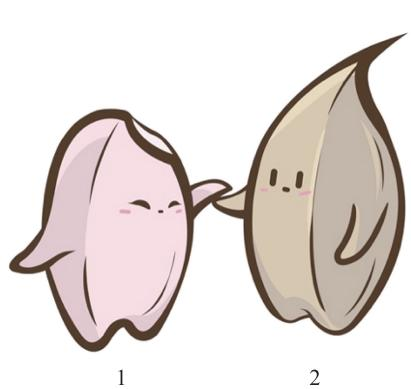

图6 －32 海水稻米粒 IP 形象设计  
  
1—“米妞”；2—“米仔”

视频片尾的 形象运用了定格动画的方式 采用手绘描绘海水稻生长过程 展现了海水稻常规育种的步骤 画风轻松且和谐统一 图

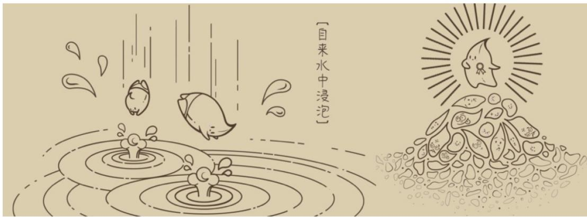  
图6 －33 《海水稻种植》 动画设计

在信息可视化设计部分 主要以海水稻的关键数据 海水稻产量和专利申请数 进行数据展示 使用 和 作为主要的辅助软件 将平面版面展示为动态数据图谱作品完成图如图 所示

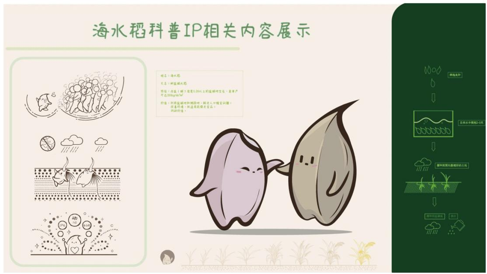  
图 6 － 34 《海水稻种植》 作品完成图

# ［项目6］ 空天科技

作品名称： 《失落的碎片》

设计者： 石依涵 刘安琦 刘畅

随着人类对太空探索技术的不断发展， 向太空发射的航天器、 火箭、 卫星等人造天体也逐步增多 加之在马斯克提出的 星链 计划背景下 太空碎片垃圾问题变得日益突出在这样的背景下， 本作品以 《失落的碎片》 为主题， 设计面向科技馆、 天文馆、 展览馆的科普展板以及相关衍生品 利用信息可视化的手段 对现存太空碎片的基本信息 轨道的碎片分布信息以及现存的碎片清理措施进行介绍 并对太空碎片的未来再利用进行探讨 从而让受众以更加客观 直观的方式对太空碎片有所了解 太空碎片现在是极难清理的垃圾 但是随着科学技术、 航天技术的发展， 太空碎片也许会变成可二次使用的实用材料。

该作品的平面展板色彩选用了蓝紫色调 表现航天器遗失在空中的失落感 视觉呈现采用水彩肌理与噪点肌理相结合的形式 具有浪漫 艺术 诗意的观感 视觉表现风格与主题《失落的碎片》 相符。 水彩肌理丰富了画面表现力， 增添了艺术氛围。 噪点笔刷的应用表现碎片与太空中的星星点点， 使画面更有空间感。 插图视觉风格如图6 －35 所示。

设计主题字体 失落的碎片 时 参考了阿尔茨海默病体的形式 横笔画为细虚线表现航天器 卫星等人造天体在探索太空 帮助人类完成太空任务之后变成太空碎片 游离于太空之中被人类遗忘 具有的失落感 竖笔画为粗斜体 表现科技的力量 主题字体设计如图 所示

信息可视化版面选用几何圆形星点叠加来展现地球 轨道和碎片之间的关系 动态视频中展现的是 从地球中心往外一层层转动 荡漾 表现碎片数量动态增长的视觉效果 主图色调与整体相统一 准确传递信息的同时又有审美效果 图 第一 二个版面中的数据大多为 数据分析之后根据数据形态进行了数据图形再设计 整体更加有设计感同时具备数据准确性

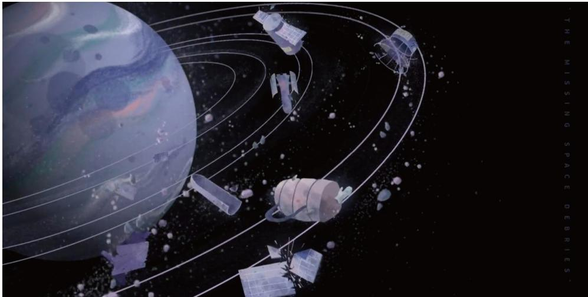  
图6 －35 《失落的碎片》 插图视觉风格

  
图6 －36 主题字体设计

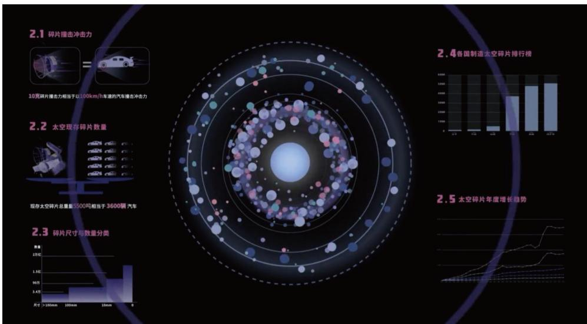  
图6 －37 《失落的碎片》 数据图形生成

第三个版面主要表达现存的太空碎片处理方式与未来虚拟回收方式模型 以及学生小组对未来利用太空碎片的可能性思辨探索 主图采用手绘的形式 将旋转的楼梯元素与废弃卫星相结合， 表现人类对太空的探索不断向前发展。 太空碎片处理方式部分的插图， 是根据欧洲航空局现存的碎片治理方式的真实图片进行的插画形式的归纳 在保证准确性的同时呼应整体调性 在太空碎片未来展望部分 主要从太空碎片用作火星移民时的建筑材料 太空碎片根据年份作为纪念性定制礼物 太空碎片作为科普素材应用展览等几方面进行了思维发散的展示 插图细节如图 图 所示

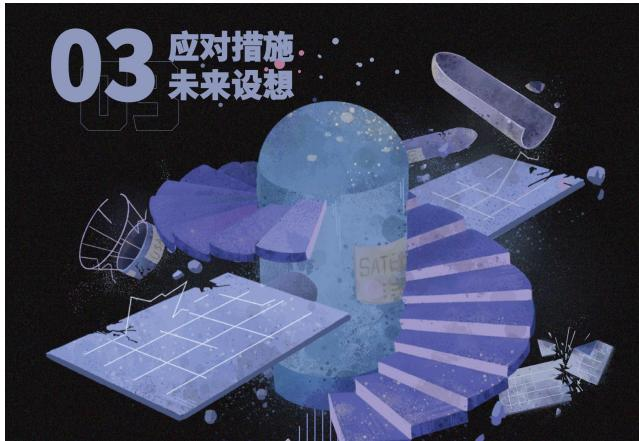  
图6 －38 《失落的碎片》 插图细节1

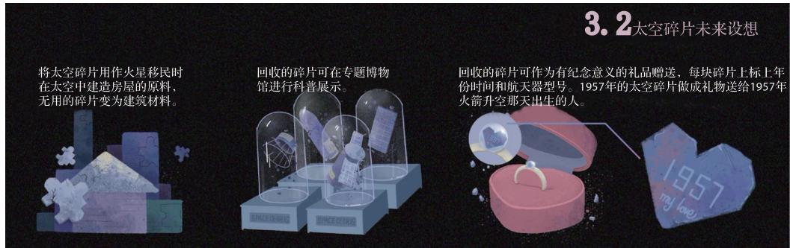  
图6 －39 《失落的碎片》 插图细节2

图 为完整设计作品完成图 设计者将该项目制作成线上虚拟展览的形式进行传播并对展览及衍生品进行了一系列的视觉设计。 展览衍生品设计如图 6 －41 ～ 图 6 －45 所示。

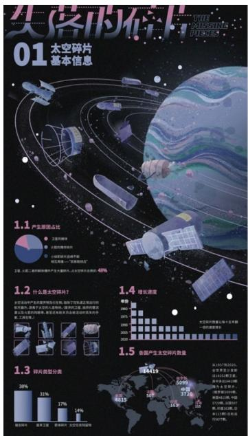

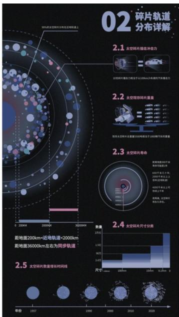

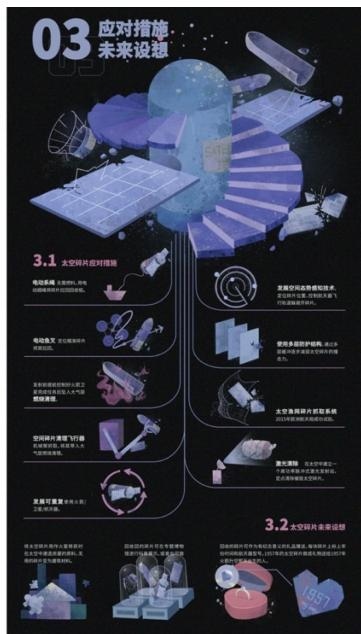  
图6 －40 《失落的碎片》 作品完成图

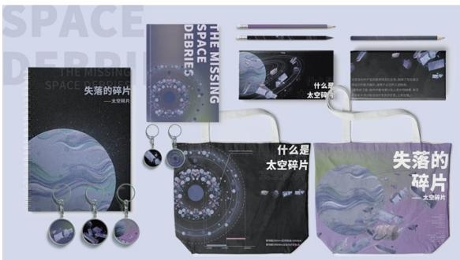  
图6 －41 《失落的碎片》 展览衍生品设计1

  
图6 －42 《失落的碎片》 展览衍生品设计2

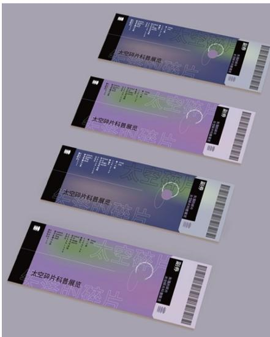  
图6 －43 《失落的碎片》 展览衍生品设计3

  
图6 －44 《失落的碎片》 展览衍生品设计4

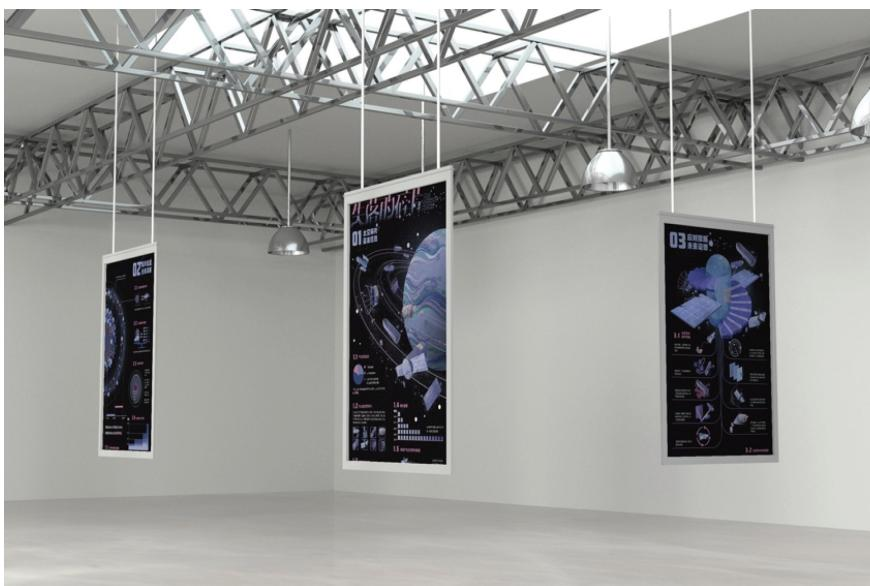  
图6 －45 《失落的碎片》 展览衍生品设计5

作品展示视频二维码：

# ［项目7］ 中国芯片制造

作品名称： 《芯片工厂》

设计者： 党林豪 李鑫禹 徐阳

工业 在信息化的基础上开启了智能化时代 芯片技术作为引领智能化发展的火车头， 从科研、 设计到生产制造， 受到人们越来越多的关注。 芯片制造是一个大难题。 中国芯片的制造能力落后于外企 国产芯片发展受限 加上近几年来受到西方的打压 我国芯片开始出现产业短板， 但这也加速了中国芯片的崛起， 人们对国产芯片充满了信心。 该设计项目组通过对芯片进行科学普及， 旨在帮助大众建立对芯片知识的基本了解， 了解国内外芯片行业发展现状

三张信息可视化展板分别展示了芯片的原理 分类 发展历程 设计制造和行业现状展板整体采用深色背景， 蓝色和紫色作为主题色， 整体风格充满动态的数字感和科技感。 视觉风格方案设计如图6 －46 所示。

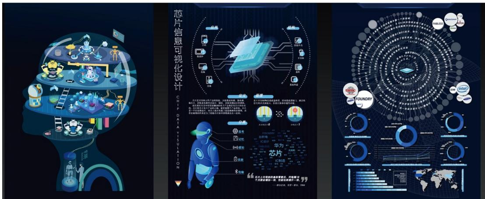  
图 6 － 46 《芯片工厂》 视觉风格方案设计

芯片概况 页 图 对芯片的定义 结构原理 分类和应用等知识做整体呈现 具体内容为了解芯片 芯片分类 芯片的结构与应用 芯片的设计流程 芯片制造 背景采用了景深式的方形设计元素， 引入观众视线。 信息内容分别置于左中右分栏中， 芯片的定义和原理以文字标签的形式呈现 芯片的分类与应用以图文结合的方式呈现

芯片工厂 页 图 着重介绍芯片的生产制造 芯片的生产工序分为四大步骤 晶圆制作 光刻蚀刻 掺杂电镀和封装测试 主视觉图像是将一个智能机器人的大脑比作芯片工厂， 以图像的形式分别在4 个层面介绍芯片的制造流程， 通过阶梯和管道将前后4个工序连接起来 最终生产出一枚智能芯片 芯片作为这个智能机器人的大脑 接受和分析人类的各种命令， 进而指导机器人的各种活动。 整体版面给人以杂志封面的视觉印象， 配有文字和词组作为点缀 将芯片产业的核心内容简单明了地表现了出来

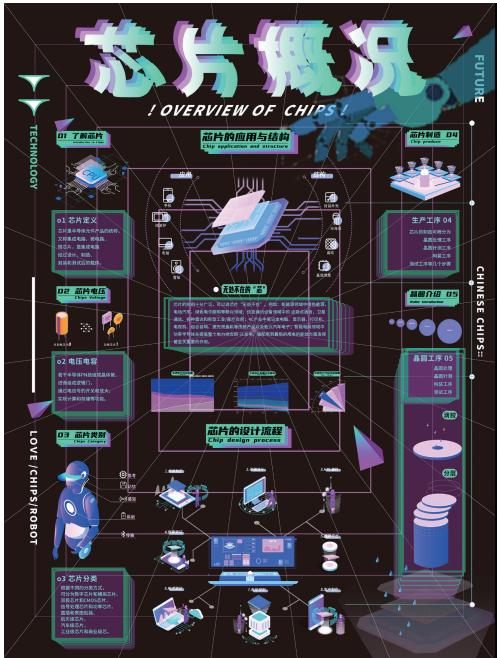  
图 6 －47 “芯片概况” 页

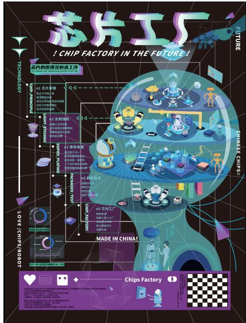  
图 6 －48 “芯片工厂” 页

“芯之历程” 页 （图6 －49） 着重介绍了芯片的发展历程和行业现状。 主视觉图像是由芯片领域的重要历史事件文字组成的关系线构成 具有继往开来的意义 在关系线的最外圈展示了芯片行业3 种主要的制造模式以及具有代表性的企业； 其余的视觉内容主要是用Echarts绘制的图表构成 对芯片行业的市场规模 设计 制造 封测等重要数据做可视化呈现

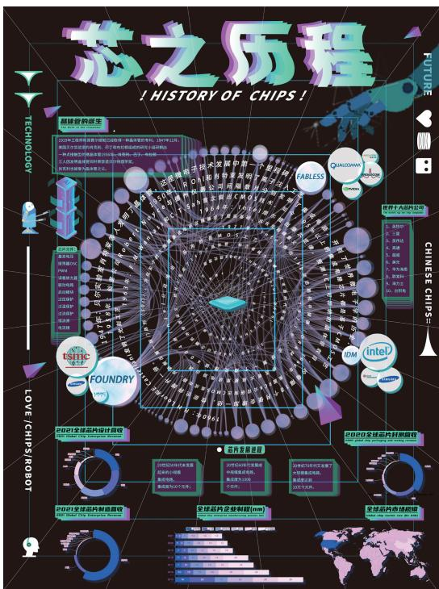  
图 6 －49 “芯之历程” 页

视频作品的片头标志字体借鉴热门电视动画短片 爱 死亡与机器人 将其改编为《爱， 芯片与机器人》， 旨在使观众通过观看本视频了解芯片与智能机器人的关系。 视频的主要内容是通过动画与音频的形式展现智能芯片的制造过程 此外 还有一些重要数据穿插其中。 整体风格平静而优雅， 是一段科普类视频。 视频的图像风格和主题色调与静态展板统一 将静态展板中无法呈现的内容进行补充 例如 图表的动画效果 生产工艺的动画效果、 智能机器人在升级前后的对比等。

作品展示视频二维码：

# ［项目 8］ 中国可燃冰探测

作品名称： 《冰火长歌》

设计者： 刘笑颜 张潇涵 王樱霓

当今世界， 环境已不断向全球人类亮出 “黄牌”， 因此， 寻找新型环保能源已成了刻不容缓的课题 地球的天气状况也频频出现中度污染 重度污染 科技工作者将煤 石油 可燃冰做了一系列对比后， 发现可燃冰作为一种理想的替代能源， 具有储量大、 埋藏浅和清洁环保等特点 并且拥有远大的利用前景 此项目的设计目的是对可燃冰进行科学普及 什么是可燃冰 可燃冰的结构特点是什么 哪里有可燃冰 为什么要研究可燃冰 利用可燃冰的主要问题有哪些？ 项目旨在宣传我国在可燃冰领域的科学成就， 提高公众珍爱地球资源、 保护地球环境的意识。

海洋特别是深海 作为战略空间和战略资源 在国家安全和发展中的战略地位日益凸显 深海探测是建设海洋强国的战略需要 我国自 年首次发现可燃冰之后 一直在勘测 研究 开采可燃冰 是继美国之后第四个通过国家级研发计划在海底钻研获得可燃冰实物样品的国家 我国准备在 年开展海上大规模可燃冰商采 未来能源之星可燃冰将为人类作出巨大贡献 本项目信息可视化设计从多方面围绕可燃冰展开 第一是可燃冰本体的科普介绍 图 第二是全球可燃冰的相关数据信息展现 图 第三是开采可燃冰的技术方法和我国 “蓝鲸 1 号” 半潜式钻井平台的展示 （图 6 － 52）。

作品展示视频二维码：

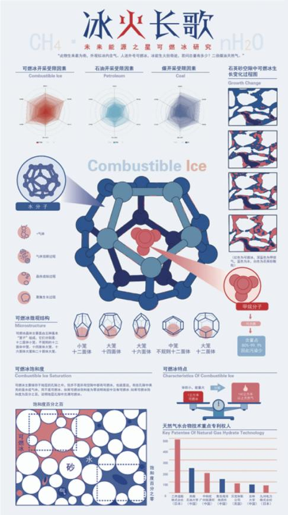  
图6 －50 《冰火长歌》 作品完成图1

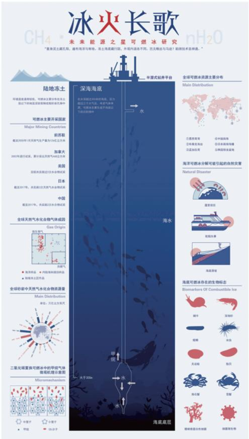  
图6 －51 《冰火长歌》 作品完成图2

# ［项目 9］ 基因检测

作品名称： 《基因密码》

设计者： 苏雨夏 吴晓 徐佳楠

本项目利用信息可视化图表和建模渲染、 插画等手法， 通过对基因检测相关知识进行科学普及 以引起大众对于基因检测的重视和了解 呼吁人们能够利用基因检测技术 尽早发现疾病， 提早预防疾病或采取有效的干预措施。

现代医学研究证明 除外伤外 几乎所有的疾病都和基因有关系 基因是 分子上的一个功能片段 是遗传信息的基本单位 是决定一切生物物种最基本的因子 基因决定人的生老病死， 是健康、 长寿之因， 是生命的操纵者和调控者。 基因检测是通过血液、 其他体液或细胞对 进行检测的技术 通过特定设备对被检测者细胞中的 分子信息作检测 分析其所含有的各种基因情况 从而使人们能了解自己的基因信息 改善自己的生活环境和生活习惯， 避免或延缓疾病的发生。

该作品设计定位是对成人进行信息科普 尤其是喜好新鲜事物的年轻一代 作品可以应用到科技 生物以及医疗相关展示的科普场景 也可以作为线上宣传科普的板块 该作品配色以蓝绿色为主， 紫粉色为辅， 整体风格上突出科技感与时尚感 （图 6 －53）。 在设计过程中选择建模渲染 采用直观立体的图像有助于细节的展现 可视化数据图表能够清晰地展现相关数据 建模立体插画能够直观地展示人体器官和医疗信息 图

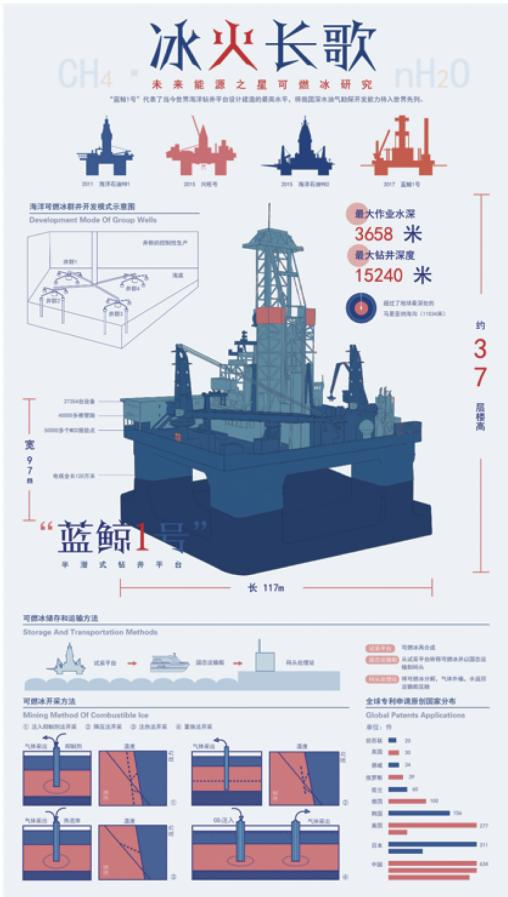  
图6 －52 《冰火长歌》 作品完成图3

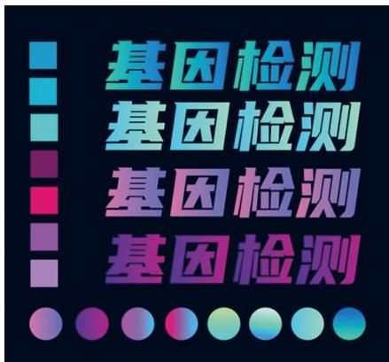  
图6 －53 《基因密码》 配色方案

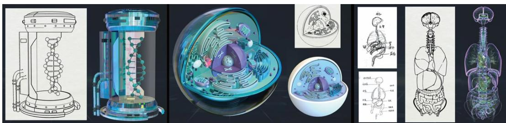  
图6 －54 《基因密码》 草图与建模

本项目分为基因密码———科普篇、 基因检测———科普篇、 基因检测———应用篇， 3 个板块。

基因密码 科普篇 主要介绍基因基本概念以及遗传病相关知识 引用遗传病相关数据， 在了解基因概念的基础上， 对遗传病有客观的认识， 即遗传病有时要经过几年、十几年甚至几十年后才能出现明显症状 也许一个看似正常的普通人身上携带着潜在致病基因， 而采取预防疾病措施是目前最为安全有效的手段 （图6 －55）。  
基因检测 科普篇 首先阐述基因检测的概念 然后对目前的基因检测技术进行系统的介绍 最后对基因技术在我国的发展状况进行梳理 数据图表显示 基因检测技术在我国的发展逐步走向成熟化 （图6 －56）。  
（3） 基因检测———应用篇： 围绕基因检测在医疗领域的应用， 重点介绍基因检测在癌

症以及在生育方面的重要作用 用可视化图表和人体模型插图展示相关数据 使普通人群对基因检测流程以及疾病数据有更加直观的认知 （图 6 － 57）。

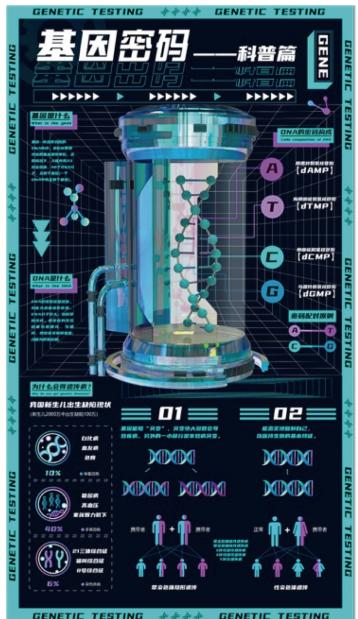  
图 6 － 55 《基因密码》作品完成图1

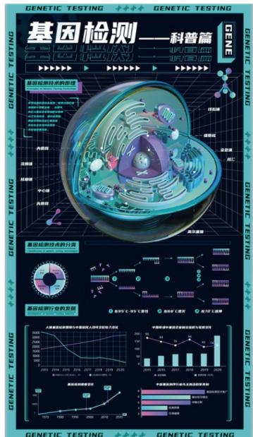  
图 6 － 56 《基因密码》作品完成图2

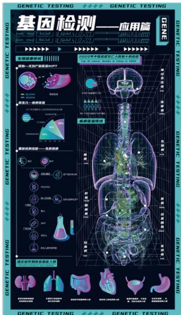  
图 6 － 57 《基因密码》作品完成图3

作品展示视频二维码：

［项目 10］ 汽车产业电动化、 智能化、 网联化发展

作品名称： 《I?? E?? N 城市漫游》

设计者： 袁若歆 宋新衡 齐帅兵

城市智能化发展迅速 智慧城市的概念已不再新奇 智能网联汽车也已成为热门词汇 该设计聚焦智慧城市背景下的汽车产业的新三化 电动化 智能化 网联化 旨在向大众科普何为智慧城市 何为汽车产业的新三化 设计者考虑到智慧城市的一系列概念为纯文字信息难以通过静态图形和数据展示 便将该部分信息引入科普动画的制作上 即以 的图形动画向用户解释新概念 该设计还涉及汽车产业新三化的数据 如 基站 自动驾驶资金投入 充电桩等一系列数据 该设计通过将动画与动态图表结合 向用户传递信息 增强用户了解新信息的交互性 增强信息的趣味性 该设计摆脱传统的科技科普信息的科幻格调 将高深难解的科技信息生活化、 趣味化， 以轻松愉快的方式向用户科学普及智能高科技知识。

调研分析图表分别为电动化、 网联化、 智能化技术栈 （技术栈， IT 专业词） （图6 －58），软硬件一体智能驾舱设计架构 图 智能化网联化协同 图 未来出行服务范围 （图 6 － 61）。

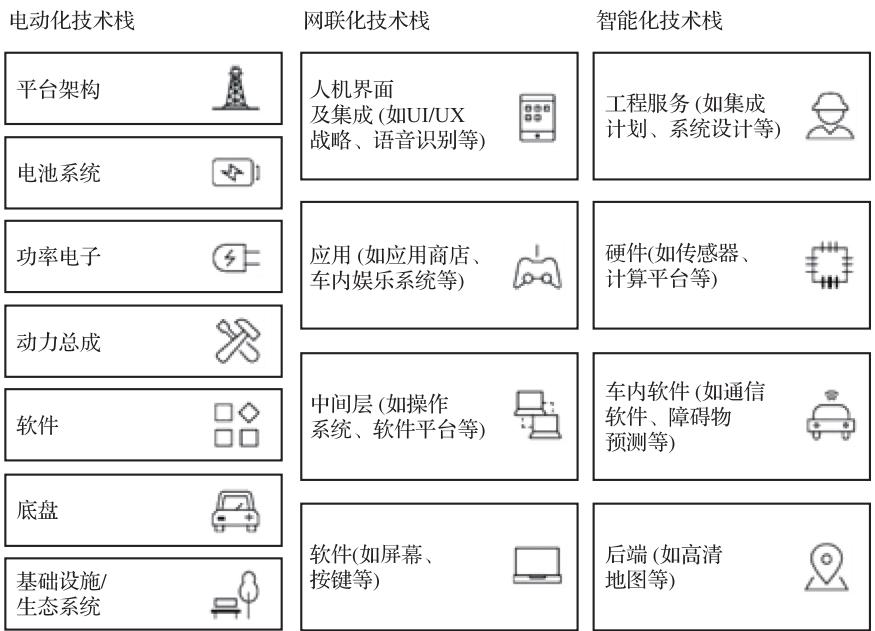  
图6 －58 《I?? E?? N 城市漫游》 电动化、 网联化、 智能化技术栈

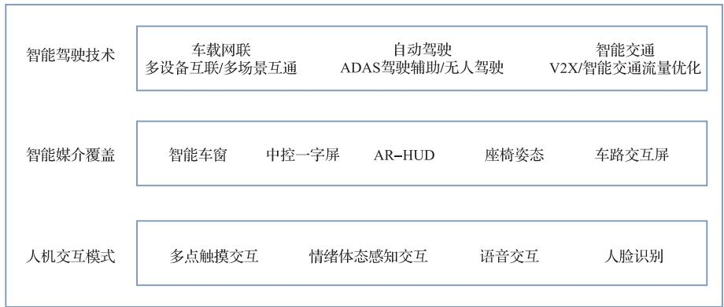  
图 6 － 59 《I?? E?? N 城市漫游》 软硬件一体智能驾舱设计架构

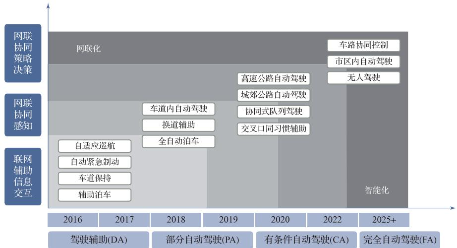  
图 6 － 60 《I?? E?? N 城市漫游》 智能化网联化协同

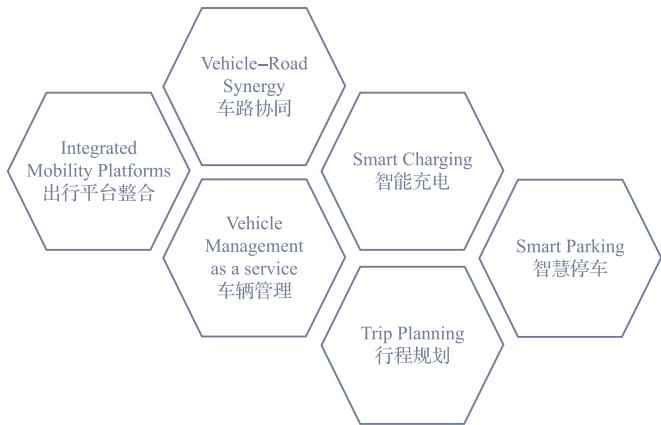  
图 6 －61 《I?? E?? N 城市漫游》 未来出行服务范围

该项目可视化设计是一款网页端交互设计 用户可以在主页面选择进入城市 点选城市的各个元素 （如智能信号灯、 自动驾驶车辆、 5G 基站、 充电桩）， 自由地了解各种信息和概念。进入城市页面 点击后还会出现城市的加载动画 点击城市元素后进入动画演示部分 用户通过动画切实了解各个元素是如何运行的。 动画结束后， 用户可以选择返回城市或者查看数据深入了解 查看数据结束后 页面自动返回主城市 供用户自由点选其他想要了解的元素

项目小组成员将该设计的原型演示制作成了视频 通过视频可以清晰地了解到该设计的运作过程和交互逻辑。 该项目设计特点如下：

趣味性 该设计为一项趣味性科普信息设计 以 卡通图形方式为用户介绍复杂的智慧城市与汽车产业新三化概念。  
生活性 该设计摆脱以往传统科技科普的深色风格 图形设计极具卡通化和生活化 降低用户理解高科技新概念的抵触心理  
（3） 交互性。 图形结合图表的设计形式将文字概念和数据信息结合起来， 为用户展示两方面的科普信息 交互方式可以使用户自由选择自己想了解的信息

信息可视化设计静态页面作品完成图如图 6 － 62 ～ 图 6 － 64 所示。

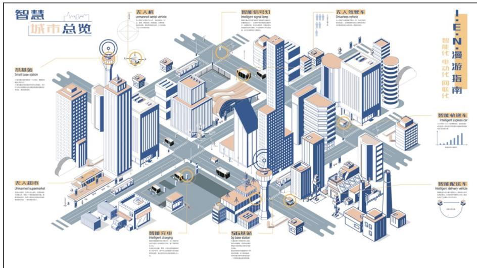  
图 6 －62 《I?? E?? N 城市漫游》 作品完成图 1

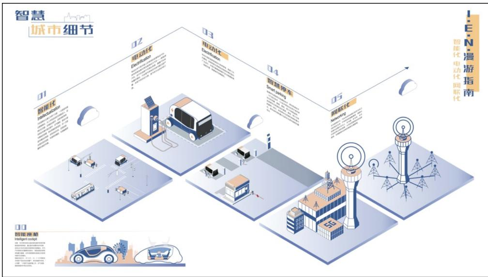  
图 6 －63 《I?? E?? N 城市漫游》 作品完成图 2

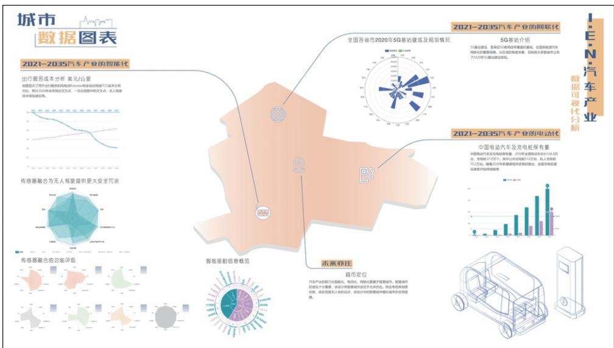  
图 6 －64 《I?? E?? N 城市漫游》 作品完成图 3

作品展示视频二维码：

［项目11］ 核能源开发与运用

作品名称： 《核能源》

设计者： 何媛媛 方耀 李双旭

开发与运用核能源是促进我国发展的重要环节 尤其是在国内清洁型能源开发技术创

新程度逐步加强的情况下 核能逐步成为国民经济和社会发展的主要应用能源形态 项目小组成员在前期调研资料收集过程中发现 公众对核电的认知还不够完全 普遍存在“谈核色变” 的现象。 因此， 为了更好地推进核科普工作， 本项目就进一步加强公众对核能源的正确认识进行设计， 从图形设计、 色彩搭配、 数据生成和信息展示 3 个方面进行详细的表达。

图形设计 图形设计具有其独特的视觉特征 即扁平化设计 扁平化设计除去冗余、 厚重和繁杂的装饰效果， 强调抽象、 极简和符号化， 使得信息具有十分清晰的条理， 能够将主要信息简洁高效地传递给观众， 从而大大提高图像的观赏性。 在 “核能源” 展板界面设计中 画面主要以圆形 矩形 线条等简单的形状和扁平化的插画 卡通形象构成 画面既通俗易懂又突出了核心信息 较为复杂的设备画面展示不便于受众理解和记忆 比如核电站、 核潜艇等。 但扁平化的图形和可爱的卡通形象设计简化了复杂的信息， 拉近了与公众的距离， 并给画面增添灵动活泼之感。 插图细节图如图6 －65、 图6 －66 所示。

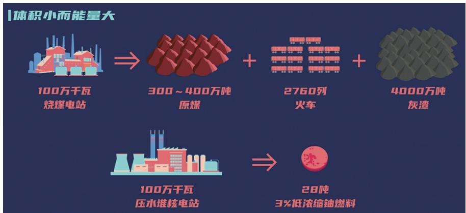  
图6 －65 《核能源》 插图细节图1

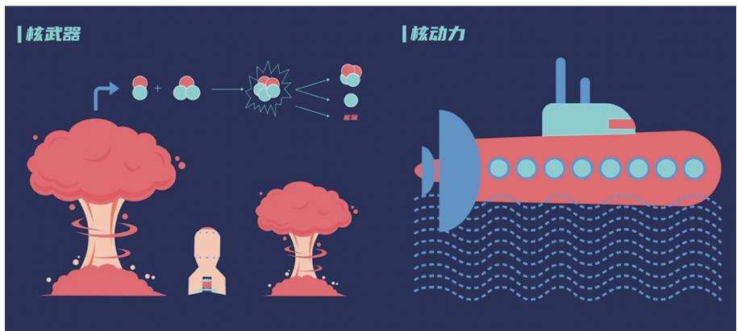  
图6 －66 《核能源》 插图细节图2

色彩搭配设计 画面采用冷色调作为背景 配以暖色调的元素 冷色调给人一种理智 冷静的感觉 能够平复人们的情绪 暖色调则代表着热情 温暖 冷色调的背景向公众传递的信息是沉稳、 可靠的， 在一定程度上能够缓解公众心中的紧张和恐惧情绪。 在冷色调的背景上放置暖色调的元素 能够起到突出 强调的作用 同时表现核能源的强大 这种

<!-- Chunk 4 End -->

<!-- Chunk 5 Start -->

方式的搭配使得画面在传递信息时更容易让观众接受， 也更容易给观众留下深刻的印象。

数据生成设计 在收集核能源的数据后 通过 软件进行数据生成 借力互联网技术 将以往难以传递的信息 以可视化 互动化的形式展现出来 大大增强了用户体验， 也展示了项目组对数据进行挖掘、 整合的能力。

考虑到普通受众的知识背景和对核电的接受程度 为了给观众留下深刻的印象 在信息科普界面中塑造了一个可爱的原子卡通形象 小核 卡通形象生动 达到了较好的传播效果。 卡通形象演变过程如图 6 － 67 所示， 卡通形象 “小核” 表情包如图 6 － 68 所示。

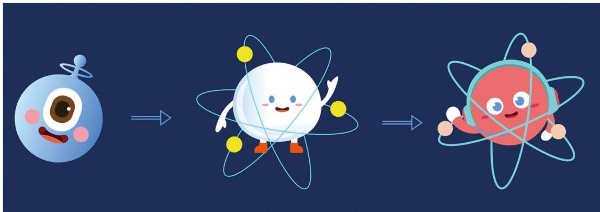  
图 6 － 67 《核能源》 卡通形象演变过程

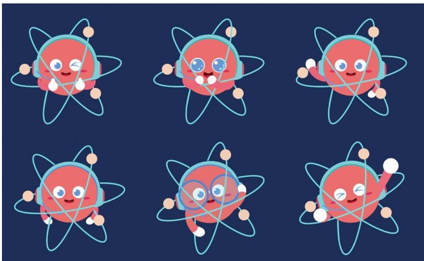  
图6 －68 《核能源》 卡通形象 “小核” 表情包

提高公众对于核能源的认识程度 将核科普知识用可视化的形式展现出来 能够收到更好的传播效果 助力我国核能源发展 作品完成图如图 图 所示 根据核能源的信息知识 项目组还设计了 交互问答游戏 通过设置问题科普核能源基础知识 增加科普信息的趣味性 交互游戏界面如图 所示

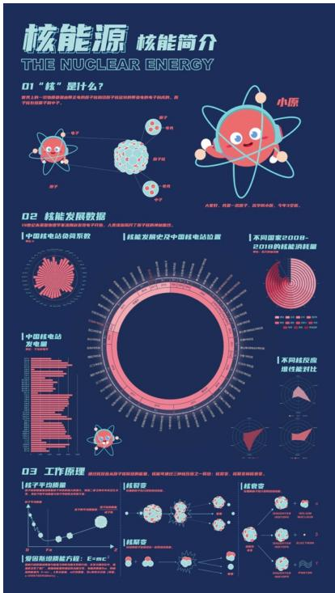  
图6 －69 《核能源》 作品完成图1

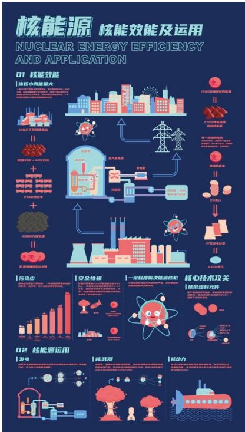  
图6 －70 《核能源》 作品完成图2

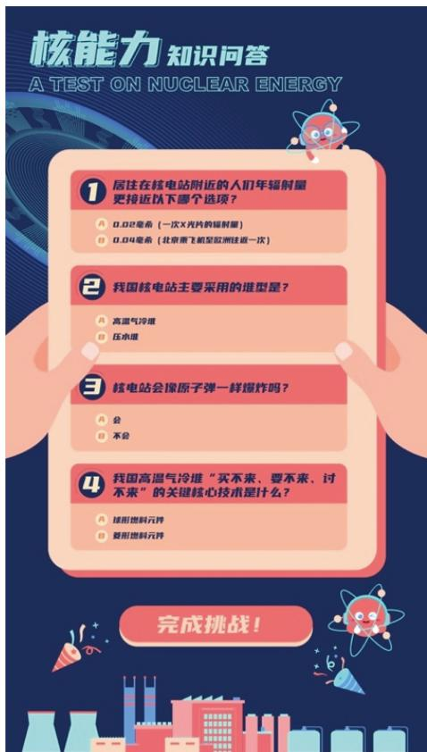  
图6 －71 《核能源》 H5 交互游戏界面

# 参 考 文 献

［1］ 伍蠡甫， 胡经之 ?? 西方文艺理论名著选编 ［M］?? 北京： 北京大学出版社， 1987??  
［2］ Stuart K Card， Jock D Mackinlay， Ben Shneiderman?? Readings in Information Visualization：Using Vision to Think ［M］?? Morgan Kaufmann Publishers， 1999??  
［3］ Edward R Tufte?? The Visual Display of Quantitative Information ［M］?? Graphics Press， 1983??  
［4］ Jock D Mackinlay?? Automating the Design of Graphical Presentations of Relational Information［J］?? ACM Transact ions on Graphics ， 1986 （2）： 110 － 141??  
［5］ 尼古拉斯·米尔佐夫． 视觉文化导论 ［M］?? 倪伟， 译． 南京： 江苏人民出版社， 2006??  
［6］ 鲁虹． 图像时代的视觉转向 ［J］?? 湖北美术学院学报 ， 2006 （2）： 4 － 12??  
［7］ 米歇尔·德·塞托． 日常生活实践 ［M］?? 北京： 北京大学出版社， 2009??  
［8］ 刘濯源． 赢在学习力 ［M］?? 沈阳： 万卷出版社， 2008??  
［9］ 张玉忠， 杨蕾． “ 图像时代” 下视觉传达无障碍设计研究 ［ J］ ?? 作家， 2009 （16）：$2 5 9 - 2 6 0 + 2 6 6 .$   
［10］ 李四达， 信息可视化设计概论 ［M］?? 北京： 清华大学出版社， 2021??  
陈超美 科学前沿图谱 知识可视化的探索 陈悦 等 译 北京 科学出版社， 2015??  
［12］ Data Visceralization： Enabling Deeper Understanding of Data Using Virtual Reality， Benjamin Lee Dave Brown Bongshin Lee Christophe Hurter Steven Drucker Tim Dwyer IEEE Transactions on Visualization and Computer Graphics January 2021 Data Visceralization： Enabling Deeper Understanding of Data Using Virtual Reality， https： ／ ／ arxiv?? org ／ abs ／ 2009?? 00059．   
［13］ http： ／ ／ www?? flowingboundary?? com ／ ．  
［14］ DataQuilt － Extracting Visual Elements from Images to Craft Pictorial Visualizations， https： ／ ／ dataquilt?? github?? io ／ dataquilt － paper?? pdf．   
［15］ Dear Pictograph － Investigating the Role of Personalization and Immersion for Consuming and Enjoying Visualizations， https： ／ ／ dl?? acm?? org ／ doi ／ fullHtml ／ 10?? 1145 ／ 3313831?? 3376348．   
［16］ 胡飞， 杨瑞 ?? 设计符号与产品语意 ［M］?? 北京： 中国建筑工业出版社， 2003??  
［17］ 柴昊， 赵跃． 非物质文化遗产信息传播策略研究： 基于 SMCR 模型的分析 ［J］． 河南大学学报 （社会科学版） ， 2020 （5） ： 141??  
［18］ 蔡孟裔． 新编地图学教程 ［M］?? 北京： 高等教育出版社， 2000??  
［19］ 地图 ［ OL］?? ［2013 － 4 － 6］ http： ／ ／ zh?? wikipedia?? org ／ wiki ／ 地图 ??  
［20］ Miles Harvey?? The Island of Lost Maps： A True Story of Cartographic Crime ［ M］?? RandomHouse， 2000??

［21］ Hsu， Mei － ling ?? The Qin Maps： A Clue to Later Chinese Cartographic Development ［ J］．Imago Mundi ?? 1993 （45）： 90 － 100??  
［22］ 孙皓琼． 图形对话———什么是信息设计 ［M］?? 北京： 清华大学出版社， 2011??  
［23］ 树形图 ［OL］?? ［2013 － 4 － 26］ http： ／ ／ baike?? baidu?? com ／ view ／ 4587358?? htm??  
［24］ typeisbeautiful ［OL］ http： ／ ／ www?? typeisbeautiful?? com ／ 2010 ／ 10 ／ 2987．  
［25］ 伦敦地铁线路图 ［OL］?? ［2013 － 4 － 26］ http： ／ ／ zh?? wikipedia?? org ／ wiki ／ 地铁线路图 ??  
［26］ 唐纳德·A． 诺曼 ?? 设计心理学 ［M］?? 北京： 中信出版社， 2010??  
［27］ Benjamin B?? Bederson ， Ben Shneiderman ?? The Craft of Information Visualization ［ M］．Elsevier， 2003??  
［28］ https： ／ ／ www?? informationisbeautifulawards?? com ／ showcase ／ 483 － creative － routines．  
［29］ https： ／ ／ www?? nikon?? com ／ about ／ sp ／ universcale ／ scale?? htm．  
［30］ Grave M， Lelous Y， Duce D A， et al?? Visualization in Scientific Computing ［J］?? ComputerGraphics ＆ Applications IEEE， 1987， 7 （10）： 69 － 69??  
［31］ 斯彭斯?? 信息可视化交互设计 ［M］?? 北京： 机械工业出版社， 2012??  
［32］ http： ／ ／ www?? project － ukko?? net ／ map?? html＃．  
［33］ https： ／ ／ echarts?? apache?? org ／ zh ／ index?? html．  
［34］ https： ／ ／ www?? aliyun?? com ／ ？ utm＿content $=$ se＿1008364713．  
［35］ 上海美术学院团队 ?? 《解构藏文》 ［EB ／ OL］?? https：／ ／ v?? qq?? com ／ x ／ page ／ t3263rg503z?? html．  
［36］ 江南大学团队 ?? 《 数据可视化 人工智能艺术 短视频扶贫 Invisible Pixel》 ［ EB ／ OL］．https： ／ ／ www?? bilibili?? com ／ video ／ BV1fq4y1j7QY？ spm＿id＿from ＝ 333?? 999?? 0?? 0．  
［37］ https： ／ ／ weibo?? com ／ ttarticle ／ p ／ show？ id ＝ 2309404411030812885019．  
［38］ https： ／ ／ www?? schwochow?? de ／ favourite － projects ／ ．  
［39］ https： ／ ／ www?? lucasinfografia?? com ／ CONTACT．  
［40］ https： ／ ／ www?? behance?? net ／ gallery ／ 17724313 ／ 3D － World － Cup － Dataviz － Ball．  
［41］ https： ／ ／ yifangbao?? me ／ polimivis?? html．  
［42］ https： ／ ／ yifangbao?? me ／ flower?? html．  
［43］ http： ／ ／ www?? scicom － lab?? com ／ portfolio － items ／ explore － the － ocean ／ ．  
［44］ https： ／ ／ multimedia?? scmp?? com ／ ．  
［45］ https： ／ ／ www?? nationalgeographic?? com ／ ．  
［46］ https： ／ ／ web?? northeastern?? edu ／ naturalizing － immigration － dataviz ／ ．

<!-- Chunk 5 End -->

