# 实践指南：视觉感知与双轨映射工坊

> **课程**：信息可视化 · 第 1 周  
> **主题**：认知外显——视觉感知与自然语言建模  
> **实践课时**：2 课时（约 100 分钟）

---

## 1. 核心目标

本实践指南覆盖第一周全部实践环节，旨在通过亲手操作与体感对比，深刻内化以下核心认知：

- **统计摘要的致命盲区**：为什么相同的均值、方差与相关系数，可能隐藏着截然不同的数据真相。
- **前注意处理的并行力量**：体验颜色、大小、方向等视觉通道如何在毫秒级接管注意力，以及联合搜索如何瞬间瓦解这种能力。
- **坏图表诊所**：识别并解剖现实中常见的可视化"病理图表"——意面图、3D 饼图、截断 Y 轴、彩虹色阶、红绿无障碍灾难、以及信息密度崩溃的仪表板。
- **格式塔修复术**：运用图底分离（Figure-Ground）、空间分区（Proximity）、零基线（Zero Baseline）等原则，对上述病理图表执行"外科手术"式重构。
- **双轨映射实战**：通过 RAWGraphs 零代码 GUI 制造"极限崩溃"体验，再以 Vibe Coding 高阶 Prompt 驱动 AI 进行算法降噪重构，切身感受前端渲染极限与高层心智建筑的本质差异。

---

## 2. 课前预热：为什么我们需要可视化？

**对应教学模块**：M01 破冰  
**位置**：`practices/materials/W01/` 目录下的资产

### 2.1 统计学撒谎：极客数据“盲盒刮刮乐”体验

我们要认识的第一个反直觉概念是：“永远不要在没看到图表前，轻信冰冷的统计数字”。在这个环节，我们将使用著名的 **“恐龙变形记（Datasaurus Dozen）”** 数据集，也就是统计学界鼻祖《安斯库姆四重奏》的终极疯狂进阶版，进行一场全班协同的盲盒游戏。

**📖 传说背景：这只恐龙是怎么诞生的？为什么要做这种无聊的把戏？**
故事的起源在2016年。知名信息可视化专家 Alberto Cairo 为了告诫学生们“不要盲信摘要数字，一定要坚持画图”，亲手捏造了一组数据——这组数据的 X/Y 均值和方差看起来无比正常、平平无奇，但只要你将它画成散点图，图纸上就会跳出一只咆哮的霸王龙（The Datasaurus）！当时这一创意在学术圈轰动一时。
然而，Autodesk 公司的研究员拿到这头恐龙后，提出了一个极其疯狂的极客猜想：“如果我们写一段算法，强迫这群恐龙散点，在保证均值、方差等指标**绝对不变**的前提下，疯狂游走变形，会变成怎样？”
经过他们漫长的算法逼近，一头恐龙竟然生生被扭曲成了一颗五角星、一个十字靶心、甚至一个圆圈——足足 13 组荒诞的图形，但它们算出的客观统计指标竟然**分毫不差**！

**🤔 很多同学会问：把数字强行拼成这种“毫无意义的图形”有什么用？真正的数据又不会长成恐龙！**
没错，现实业务中的数据绝对不可能长成恐龙或五角星，这些全部都是科学家刻意生成的“假数据”。
**但这恰恰是一场针对现代人的“极限压力测试”与隐喻实验！**
它的真正意义是向世人证明：**数学公式（如平均值、方差）存在着深不可测的盲区。**
如果连一头巨大的恐龙、一颗规整的靶心，在简单的“平均值”公式检测下都能做到完美隐身，让你误以为它们是“普普通通的正常数据”；那么在现实中，那些**更加隐蔽的商业陷阱**，岂不是轻而易举就能把你骗得倾家荡产？

**🎯 盲盒实操流程：**

1. **领取神秘盲盒**：请通过以下入口进入本次**「腾讯在线联机表格」**协同游戏：
   - **文档链接**：[【企微文档】Datasaurus_for_Tencent_Docs](https://doc.weixin.qq.com/sheet/e3_AcQAogZfAOkSG3ZchdMI3TKqS0Yff?scode=AGYAEgcDAA4XBnGzHrAcQAogZfAOk&tab=000001)
   - **扫码直达**：  
     
     *(注：教师后备使用的备用源文件路径为 `practices/materials/W01/Datasaurus_for_Tencent_Docs.xlsx`)*

   进入文档后，你会发现表格底部有 5 个不同的数据子表（Sheet），分别被命名为“神秘盲盒_1号”到“5号”。请每个同学或小组任意抢占一个盲盒表单。

2. **第一重欺骗（均值陷阱）**：
   - 如果只看数据报表：这密密麻麻的数字其实是**“X: 当月累计发稿量(篇)”** 与 **“Y: 粉丝转化率(%)”**。
   - 分别在空白处输入精确计算公式 `=AVERAGE(A2:A143)` 与 `=AVERAGE(B2:B143)` 来收割这 142 个账号样本的平均数。
   - **你被蒙蔽的第一反应**：你和周围同学对完答案会发现，所有盲盒的 X 均值全是 **`54.26`**，Y 均值全是 **`47.83`**。单看报表，大家一定会误以为：“这是五组水平一模一样、表现十分稳定的创作者团队。”

3. **第二重揭秘（插入散点图）**：
   - 现在，请**框选 A1 到 B143** 的整片数据区域（包含表头）。
   - 点击腾讯文档顶部的：**`插入 -> 图表 -> 散点图`**。
   - 下一秒，你会看到极度荒谬的画面：一头恐龙或满天星光砸在了你的业务报表上。

4. **第三重震撼与异常追问（全班巡视与反思）**：
   - 请四处走动，看看周围小组的屏幕：虽然平均数字**分毫不差**，但在可视化的还原下，有人那里是霸王龙，有人是五角星，有人是一组被撕裂的离散块！
   - 参考下方全部数据集的变异网格：

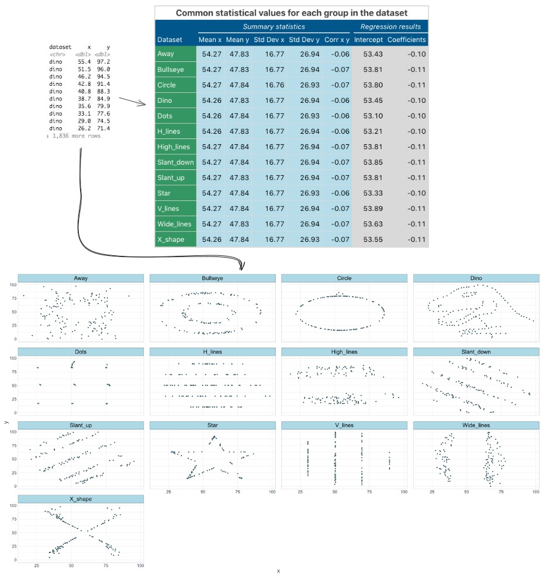

**💡 认知沉淀：这只假恐龙，教了我们哪些看“真数据”的规矩？**

- **异常形态影射了什么样的业务灾难？**
  虽然恐龙是假的，但在散点图中那些**“十字交叉、或分离的族群（away）”**，在现实中却比比皆是。这种图形在现实中叫**严重的两极分化（双峰分布）**！
  它暗示这 142 个账号根本不像平均说的那样“大家都很平庸”。事实可能是：一批是“发疯狂发稿但零涨粉”的废号底座，另一批则是“偶尔发稿却一飞冲天”的欧皇巨星。
  这种时候，“均值”扮演了一个残忍的抹平机器，它粉饰太平，把剧烈的业务断裂强行缝合成了一个虚伪的数字。如果不画图，你拿着这虚伪的平均数字去分配未来的投放预算，你的投资就会血本无归。

- **真正“健康有规律”的数据，应该长什么样？**
  如果这五家 MCN 机构的账号真的是“表现平稳、一分耕耘一分收获”，那他们真实的可视化图形，绝不该是一团散沙或恐龙，而应该是一道**从左下角斜向右上角紧密聚集的“对角回归带”**（正线性相关聚集）。
  **只有当你先用眼睛看到了这种纯粹的聚集趋势，你去计算“平均数”和“相关系数”才是有真正价值的！**

- **最终结论（艺术生的防骗法则）**：
  这个盲盒实验并不是教我们如何去“抓假数据”，而是要刻下一个铁律：**永远不要用几秒钟算出的统计数值下定论**。统计本质上是极其残忍的维度降维剥夺，它漏出的空隙连恐龙都藏得下。
  数字媒体艺术同学学习首要法则即是：**在谈论任何业务结果前，必须先把数据画出来（可视化）！** 用人眼的形态直觉，击穿一切数字谎言。

---

## 3. 前注意处理互动诊疗室

**对应教学模块**：M03 视觉系统——你的认知外接显卡  
**目标**：通过亲身体验，验证前注意并行处理通道的暴力弹出效应与失效条件。

### 3.1 Phase 1：数字矩阵寻"3"挑战

**规则**：在下方这张 15×25 的纯数字矩阵中，请在 **10 秒内** 数出所有数字 "3" 的个数。

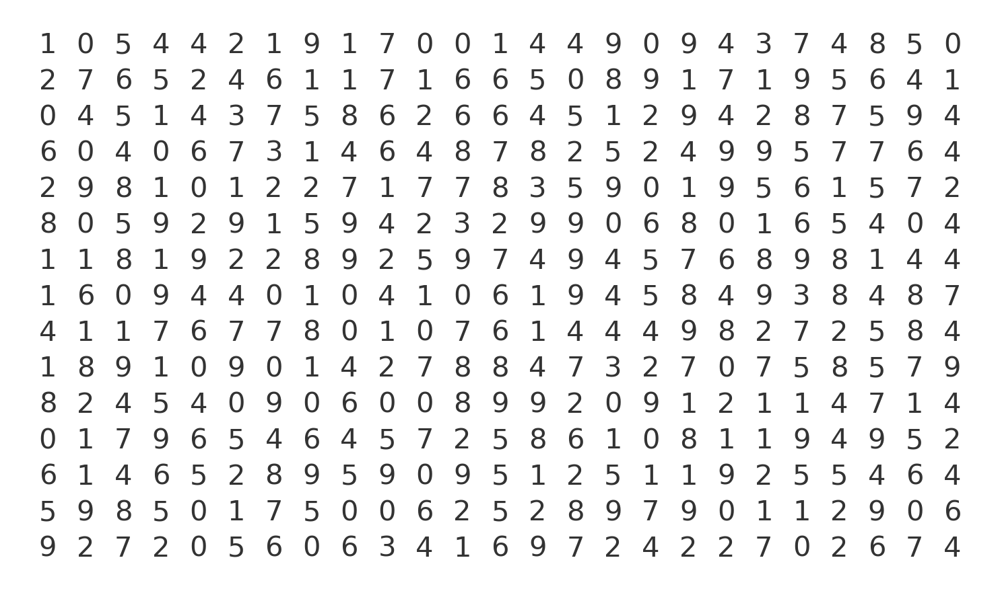

> **痛点体验**：你是否经历了痛苦的逐行逐列扫描？这就是经典的**串行搜索 (Serial Search)**——当所有元素在颜色、大小、形状上完全同质化时，大脑被迫一个一个检查，效率极其低下。

现在请看同一张矩阵的高亮版本：

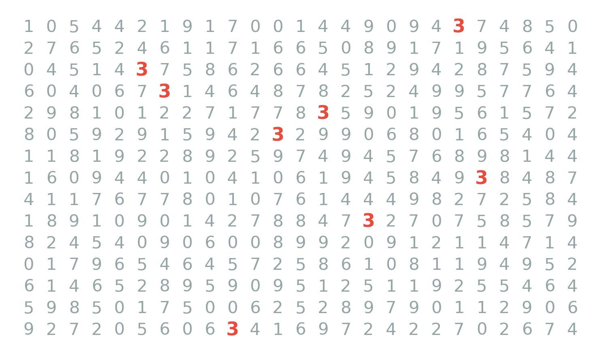

> **"啪"的一声**：所有的 "3" 以红色粗体瞬间弹出！你甚至不需要刻意去找，它们就像荧光弹一样击穿了你的视网膜。这就是**前注意弹出效应 (Pre-attentive Pop-out)**——颜色通道是人类视觉系统中最强大的并行检索武器。

请依次观察以下几张图中隐藏的"异类"元素，体会不同前注意阵营是如何触发你视网膜的极速报警动作的：

| 通道开关 | 图示 (占位符) | 极速弹出体验 |
|------|------|------|
| **色彩阵营 (色相变异)** | 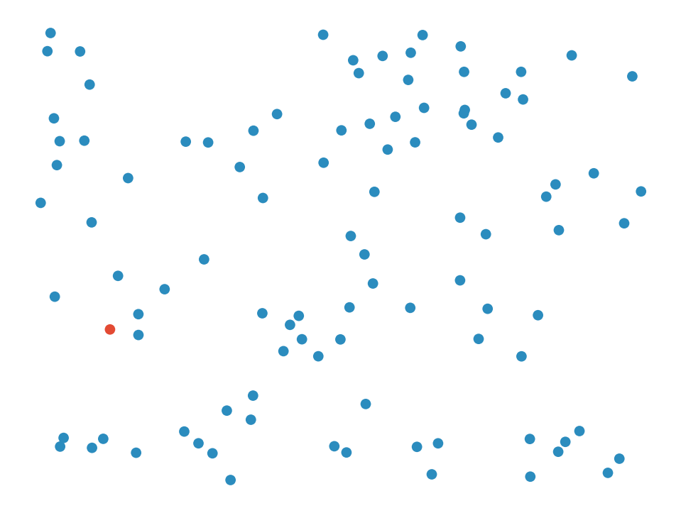 | 在一片死寂的深蓝色点阵汪洋中，那一颗正红色的圆点，是否像闪电般直接刺伤了你的视网膜？ |
| **形态阵营 (尺寸突变)** | 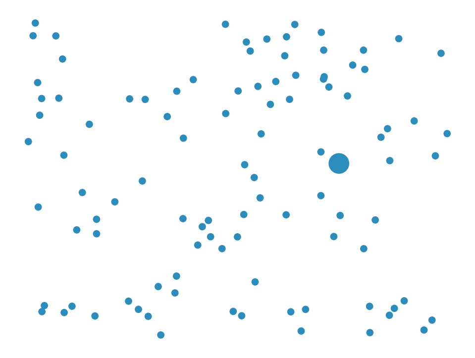 | 在上百个微小如尘埃的等大圆点中，那颗体积极度膨胀的巨大星球，是否根本无需寻找就暴力跃出？ |
| **形态阵营 (形状截断)** |  | 全是柔和平滑的圆形阵列里，突然硬生生砸进一个边缘极其锐利、带有折角的方块阵营异类，是否显得格格不入？ |
| **形态阵营 (方向逆折)** | 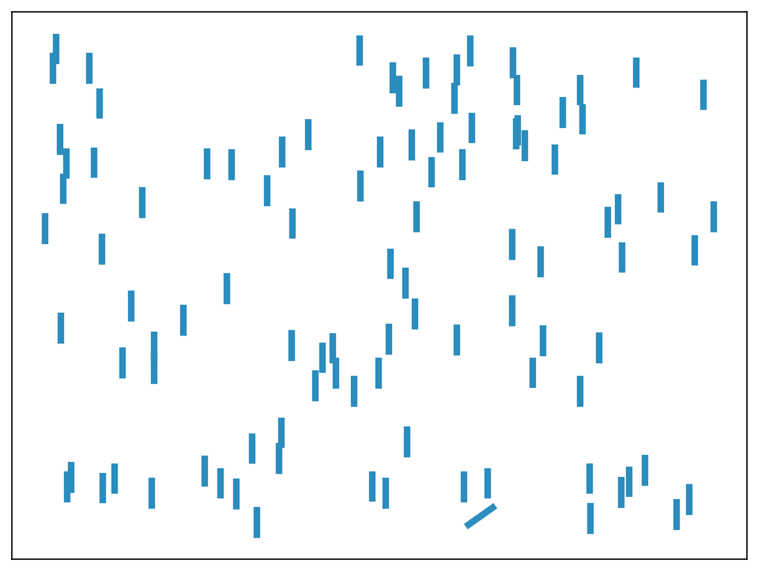 | 在几百根如同树木般整齐划一垂直向上的平行线段中，那一根强行被拗断成 45 度交错逆角的线条，是否瞬间引爆了你的视觉纠错强迫症？ |

> **理论收网**：颜色、大小与方向都是独立的前注意通道。只要目标在**单一维度**上与背景产生强烈对比，大脑就能在约 200ms 以内完成**并行扫描**，且不受干扰元素数量的影响。

### 3.3 Phase 3：联合搜索的崩塌

现在请看下方这张图——你的任务是找到其中所有的 **"红色圆形"**：

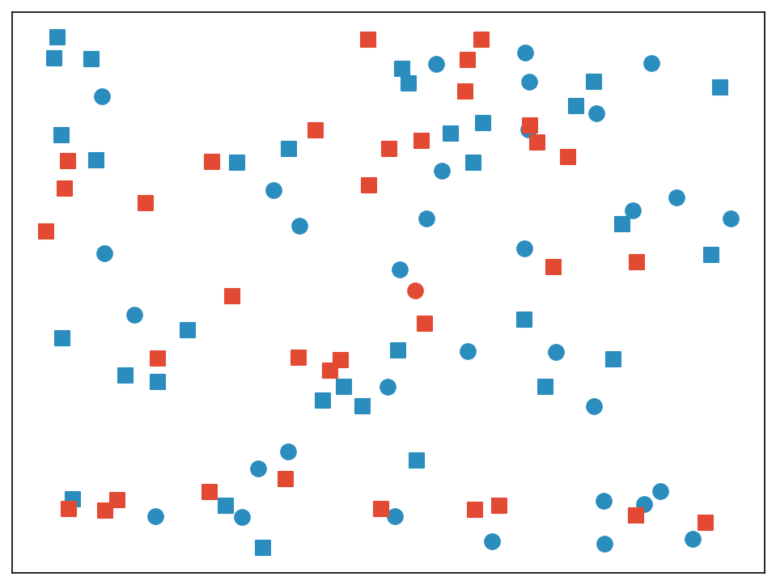

> **认知宕机**：当你需要同时在两个维度（颜色 + 形状）上筛选目标时，弹出效应彻底失效！大脑被迫重新退化为逐元素的串行扫描模式。这就是**联合搜索 (Conjunction Search)** 的代价。

再看这张"散落圆点计数"测试：

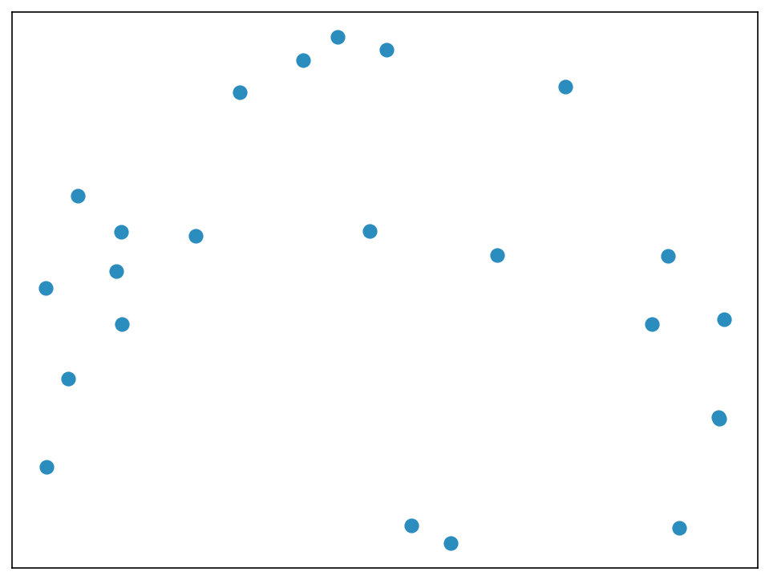

> **设计法则**：如果你要让观众一眼看见重点，**永远不要让两个不同的前注意通道在同一图表中无谓地打架**。保留背景收敛，才能让亮点显形。这就是作为“聚光灯报警器”的前注意机制的**核心霸权——极端排他法则**。

### 3.4 Phase 4：课中狂想（理论碰撞）

> **🤔 进阶反思题：如果前注意（聚光灯）被格式塔（秩序法官）劫持？**
> 
> 现在大家闭眼想象一个极其常见的制图场景：你在散点图中用极其刺眼的红色标出了几个代表“异常崩溃”的数据圆点（前注意的暴力弹出），这也是我们刚才做的寻找红圆点。但是，这个时候你觉得不够醒目，顺手在制图软件里画了一个**有着浅灰色底色的全封闭矩形大边框**，把这几个原本散落的红色圆点死死地“圈地为牢”框在了一起。
> 
> **请问，这个“额外画一个框”的动作：**
> A. 它是对前注意通道的进一步加强？
> B. 不！它是唤醒了我们下节课要讲的、更加霸道的高级思维力量——**“格式塔秩序法官（同域原则 Common Region）”**。用物理的边界框线强行收编重组了这些碎片的阵营！
> 
> *（提示：前者靠万绿丛中一点红的本能反差报警，后者靠绘制排版框架来建立秩序逻辑。这个举动，恰恰跨越了视网膜本能与大脑皮层高级排版之间的那道生物分界线。）*
---

## 4. 坏图表专项诊所：格式塔病理标本解析

**对应教学模块**：M04 格式塔原则——大脑的"找规律"强迫症
**目标**：彻底摒弃通道和数据映射的杂音，在 **“群组缝合 (Grouping)”**、**“图底层级 (Hierarchy)”**、**“视觉完形 (Closure/Simplicity)”** 以及面向交互动效的 **“动态协同 (Common Fate)”** 这四大纵深心智维度上，对现实中的可视化反模式进行降维打击，建立严谨的格式塔病理直觉。

### 4.1 病历 A：彻底失控的意面图 (Spaghetti Chart)

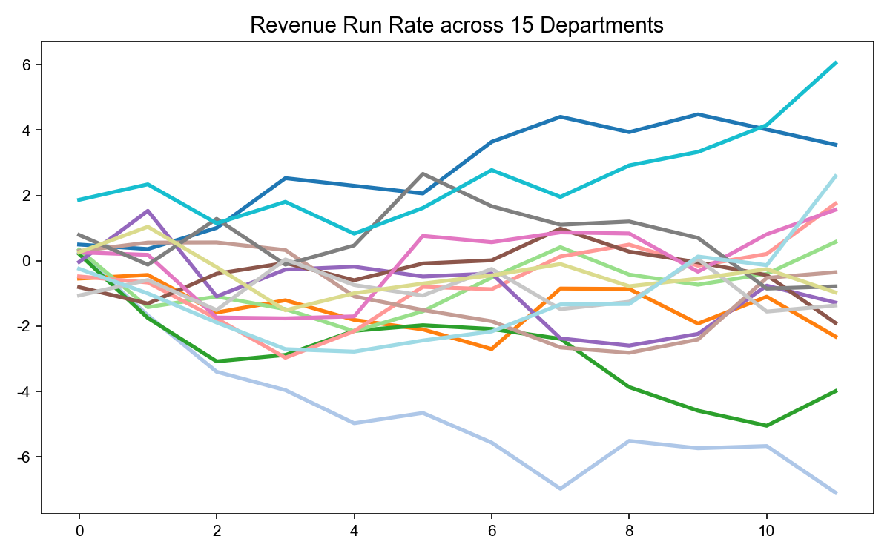

- **主治维度**：【图底层级】 (Hierarchy / Figure-Ground)
- **病因**：15 条色彩极度相似、且全被强行提拔为“视觉主体强色”的折线在同一张 2D 坐标系内死死纠缠，互不退让。
- **症状**：你根本无法追踪任何一条线的趋势走向；所有的线条都在拼命争夺大脑皮层的有限注意力资源，画面毫无主次，等于一团废纸。
- **处方**：执行极端的纯粹降噪幽灵化——将暂不需要追踪的 14 条线统统降维让渡为极度微弱的浅灰色（打入 Background 背景死牢），仅把唯一需要对焦的关注标的高亮为实心的红色（提拔为绝对的 Figure 主角）。

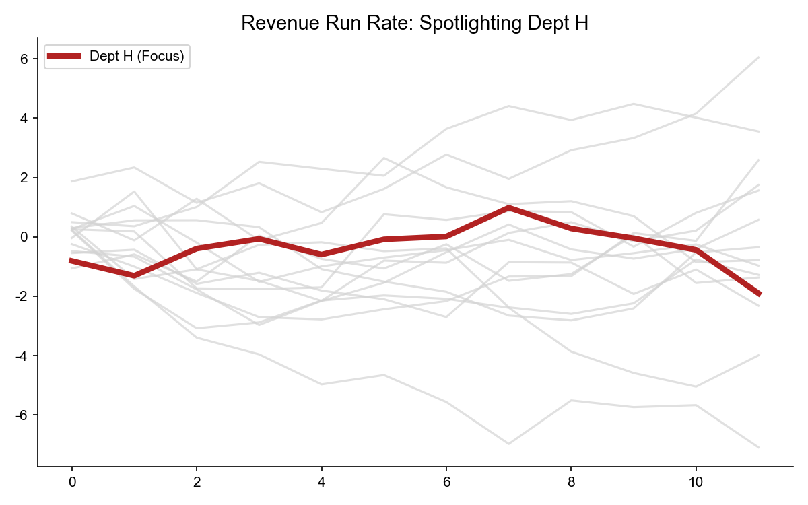

### 4.2 病历 B：支离破碎的爆炸切片饼图

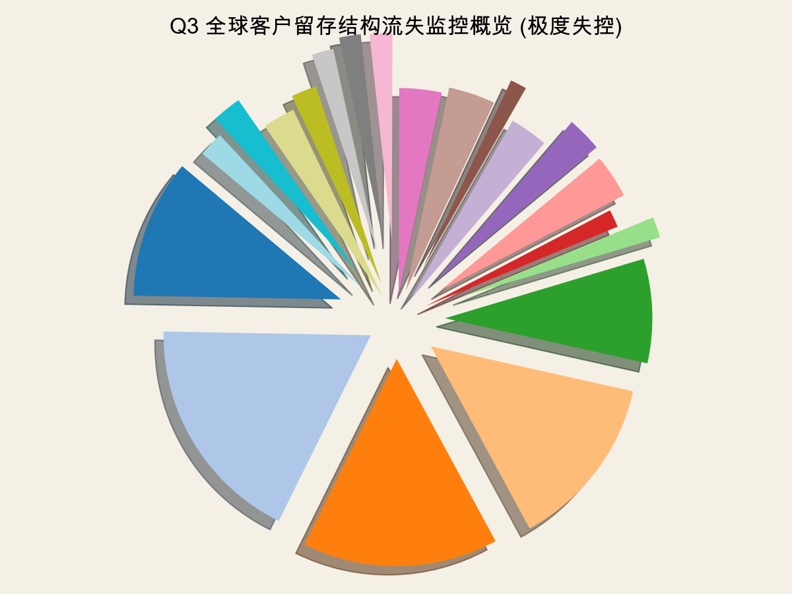
*(注：抛除其他透视畸变不谈，这张图单从**数据网格切割倾向**上已经完全犯了格式塔死罪)*

- **主治维度**：【视觉完形】 (Closure / Simplicity)
- **病因**：一个原本应该是整体的数据蛋糕，被设计师强行粉碎引爆成了好几十瓣大小不一、且互相往外放射剥离的独立碎片。
- **症状**：极度违背大脑天生追求“平滑连续、极简且规则（Prägnanz）”的完形避错本能。满地零散的细小碎片会导致读图者的心智分类耗能呈指数暴增，产生直觉排斥。
- **处方**：向大脑对“简单对称性”的偏好妥协。强行收拢极度断裂的心智长尾（果断将一众 3% 以下的微小碎片合并为单个灰色的“其他”区块），剔除爆裂间隙，将其归纳为仅容纳 3-5 个核心对比阵营的干净半透明环形阵列。

*(修复参考效果：长尾归并后的极简规整完形)*
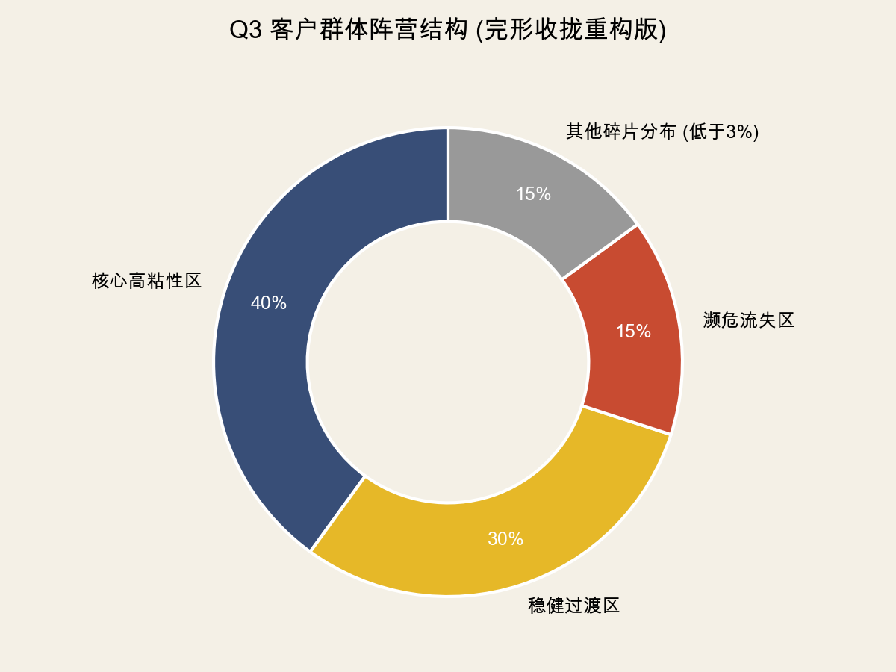

### 4.3 病历 C：反人类的卡片散落大盘排版

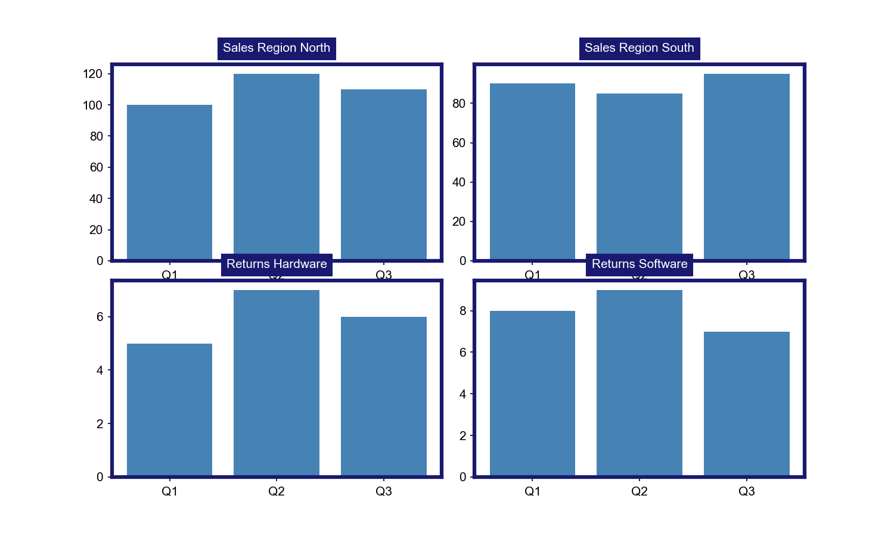

- **主治维度**：【群组缝合·基础】 (Grouping / Proximity & Similarity)
- **病因**：属于同一个核心业务链的“销售额”和“退货预警”被远远流放到了显示器的对角线两端；而原本该互斥的两个边缘指标卡却紧靠在一起。
- **症状**：极度误导性的排版物理空间缝隙，使得大脑在极速扫视时疯狂建立着错误的逻辑锁链，把没关系的事情强制判为了因果关系。
- **处方**：物理防区封锁管控。对齐！再对齐！把同类卡片统统拖到同一个像素坐标空间内强制互相吸附贴紧（邻近定律），并通过显性拉开的外边距鸿沟切断它们与其他业务族的关联。

*(修复参考效果)*
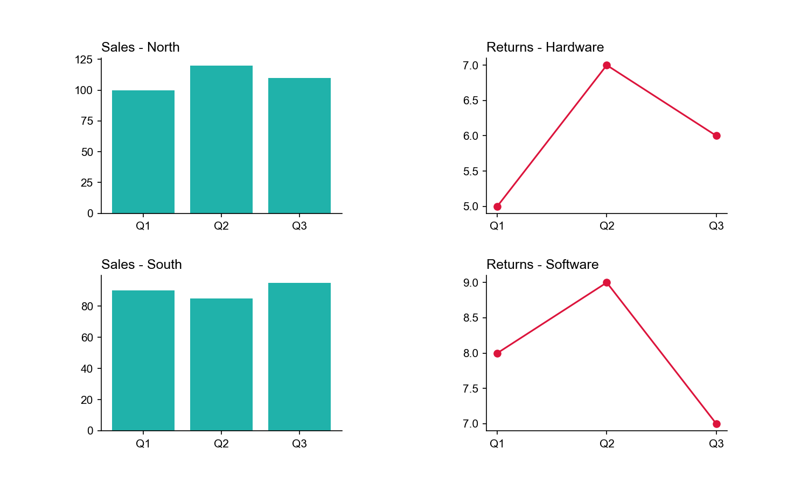

### 4.4 病历 D：被极权推翻的排版法则与多维关联嵌套

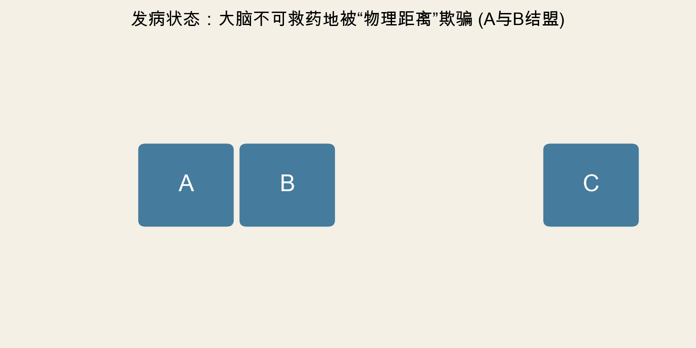
*(在这个极简对照组中，图表 A 和 B 因为物理距离极近，大脑在 200 毫秒内瞬间认定它们是一伙的；而 C 被孤立了)*

- **主治维度**：【多维数据编码映射】 (Multi-dimensional Grouping / Common Region & Connectedness)
- **病因**：在极其复杂的真实业务中，设计师常陷入二维画布排版局限的死胡同。比如：毫无业务关联的 A 和 B 因为显示器宽度被迫挤在了一起；而真正有因果往来的 B 和 C 却被隔散两端。如果我们什么都不干，依靠排版产生的心智距离就会变成业务误解的灾难。
- **处方（手段即信道维度）**：祭出格式塔的最高级武力裁决机制！**画框和连线绝对不仅仅是用来“拯救排版”的急救药**。基于你对格式塔法则强权级别的精准洞察，它们其实是可以在同一张图上并行运转的**独立映射信道（手段等于维度）**：
  1. **第一维·实体基座（利用距离法则）**：保留 A 和 B 短兵相接的排版不挪动。这代表最底层的物理属性（比如 A 和 B 被部署在广州的同一个物理机柜）。
  2. **第二维·逻辑特权（利用同域结界）**：彻底无视一维距离！在相隔超远的 B 和 C 底下垫上一个巨大的浅灰底色色块将它们“圈防”。同域法则会瞬间覆盖距离影响，代表更高阶的关联属性（比如 B 和 C 都在同一个虚拟安全防火墙内）。
  3. **第三维·即时因果（利用连通血脉）**：最后不仅画框，甚至可以用一条极其明晃晃的红色实体线把 B 和 C 纵贯相牵。连通法则代表着最不可抗拒的因果逻辑（比如 B 正在向 C 进行高危数据的实时熔断报警与传输）。

*(修复参考效果：哪怕 A 和 B 几乎脸贴脸，但连线和画框无情瓦解了二维排版！我们在同一套视觉里，不冲突地嵌套了物理、安全、数据流三套截然不同的业务架构关系)*
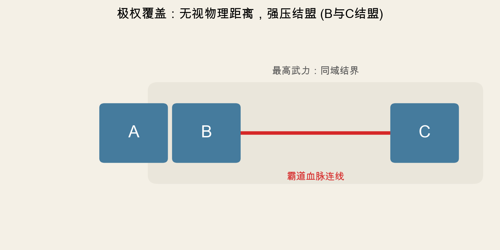

### 4.5 病历 E：群魔乱舞的炫技式延迟入场加载 (新增)

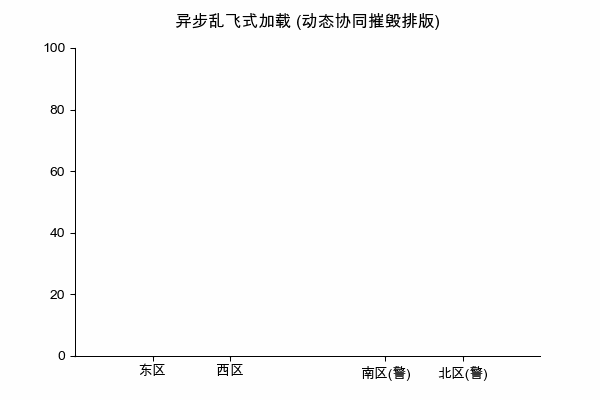

- **主治维度**：【动态协同】 (Motion / Common Fate)
- **病因**：当大屏上的数据进行切换刷新时，为了追求所谓酷炫的 UI 动效，让原本属于同一个业务分类的柱状图或卡片，采用了极其错落的、不同速度甚至不同方向（左入/底穿）的渐次逐帧漂移乱飞入场。
- **症状**：**动态协同优先级会秒杀静态排版**。哪怕你之前把它们排得再整齐，只要此时“销售区”的一半卡片和“库存区”的一半卡片在用同一个速度往上浮动，大脑就会瞬间认为这新凑到一起的两者才是一伙的。静态建立的群组认知瞬间被割裂摧毁。
- **处方**：执行严格的同频共振动效编排（Choreography）。确保必须归并为一组的数据元素同生共死（采用完全一致的速度、轨迹、起步与停止时间阈值进行进入和出场）。

*(修复参考效果：同级数据的群组同步入场)*
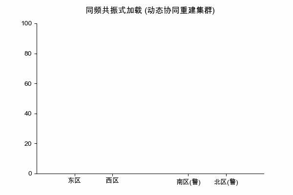

---

## 5. 课堂工坊：双轨映射实战

**对应教学模块**：M06 双轨映射大工坊  
**时长**：60 分钟

### 5.1 课题背景

我们将对 **Spotify 2025 年全球热单音频特征数据** 开始解剖，重点分析 `Valence`（正向情绪度：0 为绝对抑郁，1 为极度欢快）与 `Energy`（音频能量：0 为极低声频，1 为爆炸重金属）的散点矩阵关联。

### 5.2 Track A：GUI 极限崩溃体验（RAWGraphs 零代码模式）

按以下步骤操作：

**Step 1** — 打开 [RAWGraphs 2.0](https://rawgraphs.io/)，将课件提供的 Spotify 样本 CSV 数据粘贴入数据面板。

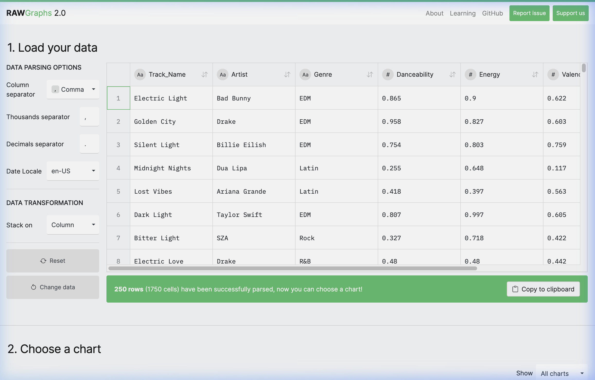

**Step 2** — 确认数据解析成功（250 行数据，1750 个单元格），滚动到 "Choose a chart"。

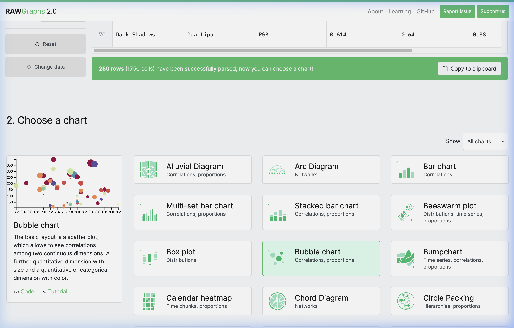

选择 **Bubble Chart** 气泡图类型：

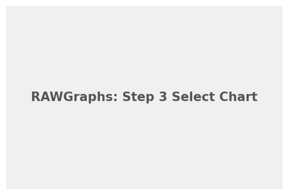

**Step 3** — 在 Mapping 面板进行维度映射：
  - `Valence` → X Axis
  - `Energy` → Y Axis
  - `Stream_Count` → Size（气泡大小）
  - `Genre` → Color（颜色编码）

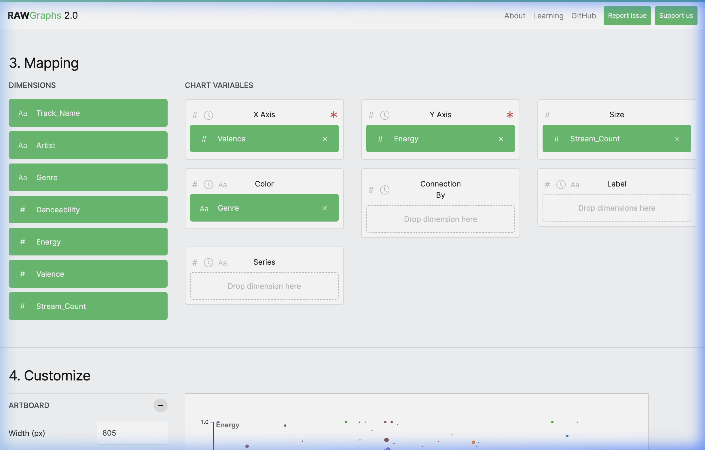

**Step 4** — **制造灾难体验**：在 Customize 面板中，将 "Max diameter" 强制拉大至 **60** 像素。

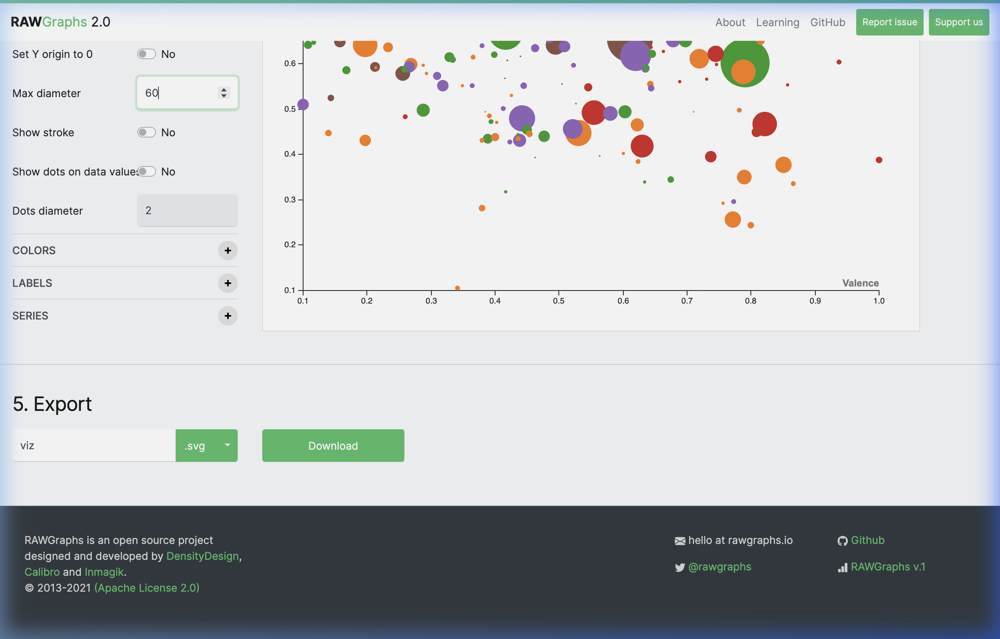

**Step 5** — **体验痛点**：观察上百个巨型气泡色块暴力重叠造成的"认知拥堵"，感受浏览器 DOM 引擎在面对海量高频矢量图节点刷新时濒临卡死崩溃的物理极限（Display Capacity）。切身体会混乱堆叠的像素是如何将数据规律彻底掩埋的。

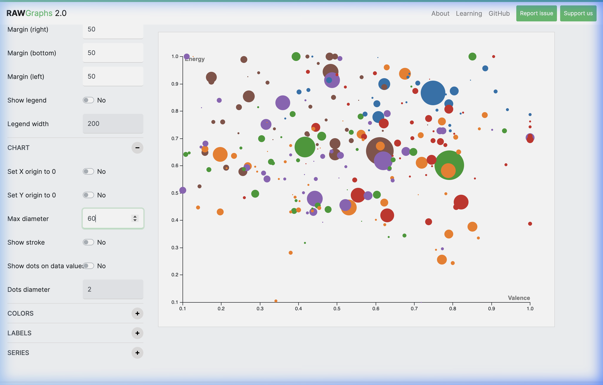

### 5.3 Track B：黑盒降噪直出（AI Sandbox 高阶指令驱动）

> **⚠️ 工具选择**：请使用支持**沙箱 Python 执行**的对话平台，强烈推荐首选 **智谱清言 (GLM) "数据分析"模式**。由于其支持直接运行 Python 与前端图表渲染，最适合做大规模数据 Vibe Coding。不再推荐 Kimi 探索版，其速度较慢且偶尔渲染失败。

**Step 1** — **环境初始化与数据连接**：
打开智谱清言（chatglm.cn），在左侧工具栏或智能体列表中启动 **“数据分析”**。
点击别针（附件）按钮，上传我们的目标样本数据集 `/shared_assets/sample_spotify_2025.csv`。

**Step 2** — **拒绝盲目交互**：
请绝对摒弃"帮我画个图"这种毫无营养的交互，这只会得到一张拥有默认配色及无用坐标网格的废图。
我们需要把 AI 当作无情的底层渲染引擎，将我们的业务逻辑、降噪诉求一次性锁死，逼迫模型释放在沙箱中完整的绘制能力。

**Step 3** — **注入高阶 Prompt 架构**：
将我们已验证跑通的“三层极简指令架构”完整复制并作为 Prompt 发射，强制其放弃默认丑陋的代码模块：

> "你现在是一位顶尖极简数据新闻架构师。这是包含 Valence 和 Energy 的 Spotify 音乐特征数据。我们需要看清高播放量单曲在 Valence(X轴) 与 Energy(Y轴) 散点图中的聚集阵列。必须采用极简墨水原则：对于 Streams 累计播放量低于 1 亿次的单曲，作为底座，全部强制进行灰度幽灵虚化（减小点的大小和透明度）；对于头部 10% 的超级热单，精准赋予刺眼的正红色(#E11D48)进行高亮点刺（增大尺寸）。增加 alpha 通道，全局底色切换为纯净深海暗夜模式 Dark Mode (#0D1117)，务必去除所有杂乱的背景网格线和图框边缘。请用 Python 画出来。"

**Step 4** — **沙箱重构最终确认件**：
无需多次拉锯对话，在高阶指令压制下，支持沙箱环境的智谱数据分析模式能够在一次执行闭环内，剥去所有杂乱网格线和图框包袱，根据数据底座产出极简红灰图。

*(我们录制的一镜到底的验证级生成全纪录)*

**最终静态成品**：可以直接下载网页生成的图片成品用于后续的组装——
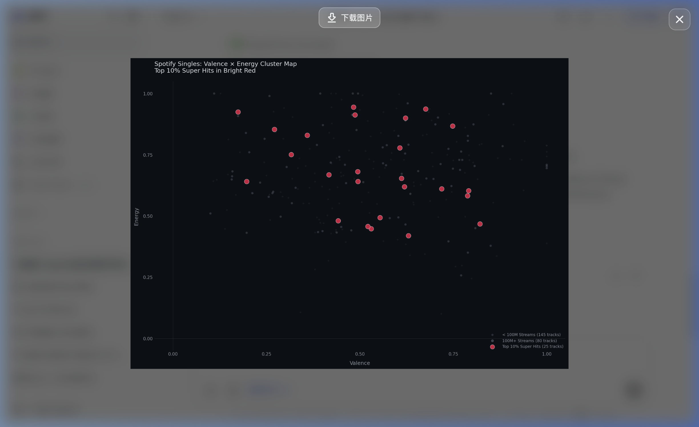

> **反思**：经过真实的、自动化沙箱的运行（见上方动图），你彻底剥去了拖沓的多模块网页交互。你现在的身份从"点鼠标操作软件的操作员"，升级为了用自然语言调动"代码探针与算力引擎的指挥官"。在这个极简流程中，心智 100% 聚焦在"审美裁决"与"格式塔重构"上。这就是能够进行高阶心智建筑的 **Vibe Coding 数据降噪范式 (`vibe_coding`)**。

---

## 6. 课后极客作业：野外猎杀与格式塔处方

### 6.1 学习目标

通过本作业，你将独立完成从"发现问题"到"解决问题"的完整闭环：

1. **诊断迁移**：能在真实世界中识别可视化病理图表，并用课堂学到的格式塔词汇精准定性。
2. **处方执行**：能通过自然语言 Prompt 驱动 AI 对病理图表实施降噪重构。
3. **审计自觉**：能对 AI 产出的图表进行数据诚信审查，警惕截断 Y 轴、彩虹色阶等欺骗陷阱。

### 6.2 产出要求

#### ① 野外猎杀：捕获一张真实的病理图表

从你日常接触的信息源（新闻报道、社交媒体、公司报告、游戏数据面板……）中，找到 **一张你认为存在严重可视化问题的真实图表**，截图保存。

> **为什么不是"自己故意做一张烂图"？** 课堂工坊里你已经亲手体验过 RAWGraphs 的崩溃极限了。刻意制造混乱不需要任何判断力；而从铺天盖地的真实信息中**辨认出伪装成"正常"的病理图表**，才是你作为设计师真正需要修炼的眼力。

#### ② 格式塔病理诊断书

针对你捕获的病理图表，撰写一份 **约 200 字** 的诊断，必须包含：

- **主治维度**：明确指出该图表违反了哪条格式塔原则（图底层级 / 群组缝合 / 视觉完形 / 动态协同），引用课堂 Section 4 对应病历的术语。
- **病因与症状**：这张图具体在哪里出了问题？它对读者的认知造成了什么误导？
- **处方方向**：你打算从哪个视知觉维度（颜色、透明度、大小、间距……）下手修复？

#### ③ AI Vibe 修复成品

使用课堂学过的 Vibe Coding 方法（智谱清言 / Kimi 等支持沙箱 Python 的 AI 平台），通过自然语言 Prompt 对病理图表实施降噪重构，输出一张修复后的极简渲染图（PNG）。

> **关键要求**：你的 Prompt 中必须体现格式塔处方意图（例如"将次要数据幽灵化为浅灰底座""用同域色块归组同类指标"），而非简单地说"帮我画个好看的图"。

#### ④ 审计判官检查清单

在提交前，对你的 AI 修复成品逐项自查：

- [ ] Y 轴是否从零开始？（排除截断欺骗）
- [ ] 色彩编码是否对色觉障碍友好？（排除红绿无障碍灾难）
- [ ] 图例与标注是否清晰完整？（排除信息缺失）
- [ ] AI 是否擅自编造了不存在的数据点？（排除幻觉伪造）

如有任何一项未通过，请在诊断书末尾说明你发现了什么问题、如何修正的。

### 6.3 提交规范

将以下三件套打包提交：

1. **病理原图截图**（你从野外捕获的真实图表）
2. **AI 修复成品**（PNG）
3. **格式塔诊断书**（约 200 字，含病因、处方、审计自查结果）
