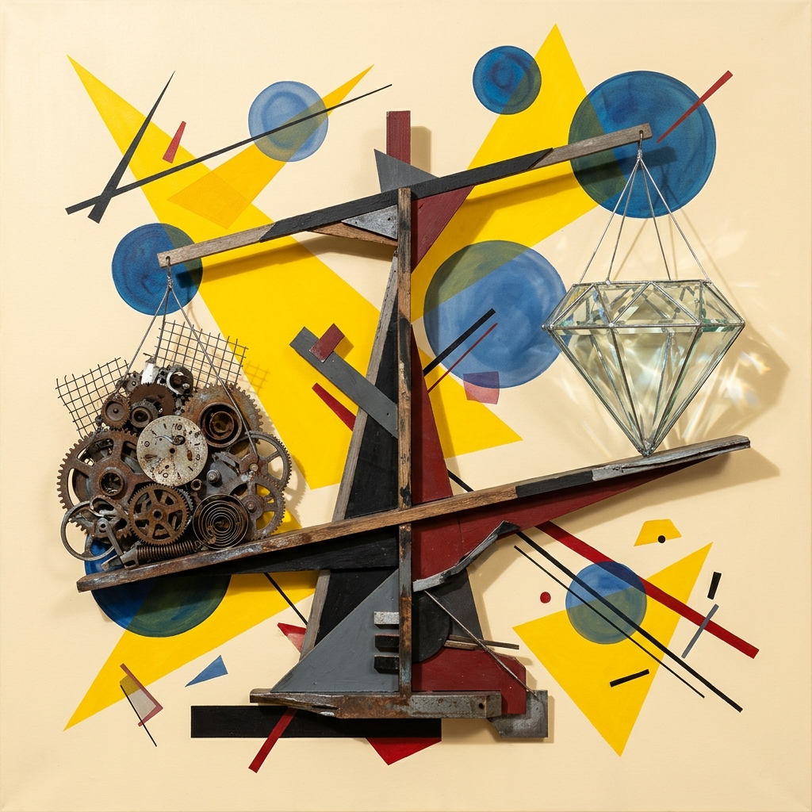

## Module 0: 课程导览 (15 分钟)
<!-- BUDGET: 2700 chars | LECTURE: 15m | ACTIVITY: 0m | SLIDES: ≥5 | STATUS: done -->

> [TEACHING MOMENT]
> 本模块为首周课程开篇环节，介绍课程总体概况、8 周学习主线、工具生态与评估方式。

> [VISUAL]
> *   **Slide**: `S00_Course_Overview`
> *   **Layout**: `Title`
> *   **Scene**: 深色背景，展示三个极具反差的并贴：左侧是原始洞穴壁画，中间是现代复杂地铁线路图，右侧闪烁着 UI/UX 数据可视化大后台界面。标题"信息可视化设计：从远古生存到新读图时代"。
> *   **Text**: "信息可视化设计：打通新读图时代的核心赛道"
> *   **Asset**: 

各位数字媒体艺术专业的同学，大家早上好。欢迎来到《信息可视化设计》的课堂。

在接下来十五分钟的课程导览里，我们要先搞懂三个问题：可视化是什么？我们为什么要学？以及，它和你们未来的饭碗有什么关系？

> [VISUAL]
> *   **Slide**: `S00_Carrier_Evolution`
> *   **Layout**: `Comparison`
> *   **Scene**: 达达拼贴对比：左侧是一摞泛黄的旧式纸质账本与打孔纸卡的黑白剪影，被砖红锐角三角切割、压扁；右侧是一面由密密麻麻的发光数据流、圆形读数仪表、波动曲线构成的巨大信息瀑布墙，普鲁士蓝同心环与芥末黄尖角悬浮其上，呈现出对观者的迎面倾覆压迫感。两侧以极细黑色张力线连接。
> *   **Text**: "信息载体的进化"
> *   **Asset**: 

在这个互联网和大数据爆炸的“新读图时代”，我们每天都被海量的信息包围。你们去看看现在的数字产品——不管是你们天天刷的健康运动 App 数据、挤地铁时看的动态线路图、还是那些互联网大厂 UI/UX 设计师每天都在死磕的电商后台销量监控大屏。图表，早已经从过去刻板的“记录工具”，变成了互联网时代“信息传播的必备载体”。

> [VISUAL]
> *   **Slide**: `S00_Visual_Preference`
> *   **Layout**: `Split`
> *   **Scene**: 达达拼贴：表现“文字疲劳与视觉霸权”。左侧是沉重且正在崩塌的密集灰色账本与被撕碎的空洞文档残骸，象征令人失去耐心的长篇累牍；右侧是代表纯粹视觉注意力的巨大张开的眼睛（黑白老照片剪影），伴随着锋利的芥末黄锐角三角形，暴烈地刺破并切割左侧的单调纸堆。高对比度的构图展现了消费者对长标题和文字丧失耐心，进而被更具冲击力的视觉符号瞬间俘获的张力感。
> *   **Text**: "新读图时代：注意力争夺战"
> *   **Asset**: 

消费者在丧失读长文的耐心，他们更倾向于“读图”。对于我们在座的数字媒体专业学生来说，如果你看不懂数据、不会用视觉去转译复杂信息，你将直接错失 UI/UX 体验设计、数据新闻、甚至是新媒体运营等最核心的高薪就业赛道。

但是，请千万不要误会。这门课**绝对不是**仅仅教你怎么去“美化”一张 Excel 图表，更不是一套教你“讨好老板视觉”的表面装潢课。如果仅仅是为了好看，那叫平面插画，不叫信息可视化。

> [VISUAL]
> *   **Slide**: `S00_DIKW_Model`
> *   **Layout**: `Split`
> *   **Scene**: 智慧升维：层次化的几何金字塔。底层是杂乱的复古数据登记表碎片；中层是相互连接的精密黑线与色块；顶点是一枚发光的芥末黄三角形，象征智慧的内核。
> *   **Text**: "DIKW 模型：Data 到 Wisdom 的升维战役"
> *   **List**:
>     - "Data -> Information：通过逻辑排列形成信息"
>     - "Information -> Knowledge：通过建立关系沉淀知识"
> *   **Asset**: 

> [PHILOSOPHY: DIKW 知识金字塔模型的升维战役]
> 郝亚维教授在《信息可视化设计》开篇就一针见血地引用了钟义信的论述：“信息不等同于数据，数据只是一种记录形式的形式”。这背后隐藏着信息科学中最著名的 DIKW 模型（Data-Information-Knowledge-Wisdom）。
> 
> 正如我们在这张幻灯片的左右布局中所看到的，文字部分为我们理清了它们自下而上的动态演化关系：
> 首先，是从 Data 到 Information。数据本身只是几十万行冰冷无序的记录，只有把它们通过逻辑进行排列重组，才会形成有意义的信息；
> 接着，是从 Information 到 Knowledge。当这些孤立的信息彼此之间产生联系、建立起结构化的关系以后，它就形成了知识，甚至跃升为指导决策的智慧（Wisdom）。
>
> 我们的专属任务，不仅仅是画图表，而是用视觉语言清晰地展现这种逻辑排列与关系建立的过程。去砸碎底层冰冷的数据壳，把藏在里面的智慧内核掏出来。

为了实现这一伟大的“升维提炼”，我们将贯穿使用这门课最重要的理论圣经——英属哥伦比亚大学 Tamara Munzner 教授在《Visualization Analysis & Design》提出的 **What-Why-How 分析框架**。
在接下来的 8 周里，面对任何图表，你都要能像精密仪器一样发出灵魂三问：
1. **What（什么数据）**：用户看到的是分类数据、有序数据还是地理空间张量？
2. **Why（为什么看）**：用户的核心任务是去“发现异常”、“对比趋势”还是“享受审美体验”？
3. **How（如何构图）**：你最终挑选了哪种视觉通道（颜色、位置、尺寸）来进行编码映射？这三位一体的铁三角，是你未来所有高阶设计的地基。

信息可视化，毫无疑问是一门关乎降维防震、消除不确定性，甚至决定系统生死的严肃科学。为了让大家具象化地理解它的硬核厚度，我们必须回溯一下历史。

> [STORY TIME: 从拉斯科洞穴到数据的弥天大谎]
> [知识源: 可视化设计史（Tufte, Friendly & Denis） + 核心认知铺垫，对应课程大纲 Objective 1]

> [VISUAL]
> *   **Slide**: `S00a1_Origin`
> *   **Layout**: `Image_Right`
> *   **Scene**: 展示史前旧石器时代的洞穴壁画（精准参照郝亚维图1-1与图2-1：美索不达米亚洞窟壁画）。
> *   **Text**: "起源：最早的生存数据图表"
> *   **Asset**: 

人类的第一个信息可视化设计师是谁？是大约两万年前，旧石器时代的原始猎人。

在法国西南部的拉斯科洞穴里，猎人们用木炭画下了野牛。过去人们以为那只是艺术涂鸦。但现代人类学给出了全新定义：那是人类最早的生存数据大屏。动物旁边的打点符号，是记录季节更替的最古老图表。先民们把大脑无法承载的求生规律，转化成了直观的“视觉符号”，让部落后代一目了然。这就是可视化的起源本质：**通过图形与文字的融合，把抽象经验固化为具体知识。**

> [VISUAL]
> *   **Slide**: `S00a2_Enlightenment`
> *   **Layout**: `Image_Right`
> *   **Scene**: 展现19世纪数据可视化的爆发期。左侧为现代数据分析先驱约翰·斯诺医生的历史肖像，右侧展示其著名的 1854 年伦敦宽街霍乱爆发数据分布地图。该图表用点状分布直接揭示水源污染，呼应了数据视觉对抗霍乱的启蒙精神。
> *   **Text**: "启蒙：约翰·斯诺医生与挽救生命的数据地图"
> *   **Asset**: 

到了 19 世纪。现代数据分析先驱——约翰·斯诺医生，并没有把这门手艺当成画画，而是用它拯救了成千上万人命。面对伦敦的霍乱大爆发，整个社会一筹莫展。斯诺医生拿出一张伦敦地图，把每一例死亡病例的位置，用黑点标记在图上。

等地图画出，答案不言自明。所有的死亡密集区，都精准地围绕着宽街的一口公共水泵。不需要显微镜，只需凭借这张二维平面的黑点分布图。他直接推翻了当时“霍乱通过空气传播”的学术共识，成功锁定了水源污染。这就叫做，用数据拯救生命。

> [VISUAL]
> *   **Slide**: `S00a3_Modern_Era`
> *   **Layout**: `Statement`
> *   **Scene**: 围绕“数字的谎言”这一核心意象。达达主义拼贴：严密对齐的统计数据表格表面正在碎裂或被撕开，底下暴露出充满野性、完全不同的散点图隐喻（隐晦预告下一节课的数据恐龙案例）。运用高对比度的普鲁士蓝和芥末黄，强化“纯统计数据的欺瞒”与“视觉揭穿真相”的戏剧张力。
> *   **Text**: "现代：戳破数字的弥天大谎"
> *   **Asset**: 

百年后的今天，我们面对的不再是去找一个具体的水泵。而是交易所里每秒跳动百万次的数据洪流中，成千上万个伪装成客观指标的数字谎言。

你可能会问：今天算力这么强，敲个公式求出平均值就行了，为什么还要亲自画图？因为，就像我们看到的破碎表格一样，纯粹的数字是会撒谎的。在接下来的破冰课里，我会向大家展示一个经典案例。如果你只信奉那些看似严谨的统计指标，拒绝用眼睛亲自去观察图表。数据底层的结构性盲区，就会在未来的商业决策中导致致命误判。

这就是本课程的核心底座：在这个信息过载的时代，用视觉戳破数字的谎言，用图表掌控运转的复杂！

> [VISUAL]
> *   **Slide**: `S00b_Theory_Intro`
> *   **Layout**: `List`
> *   **Text**: "第一阶段：理论筑基 (W01-W04)"
> *   **List**:
>     - "先给大脑做认知层的手术升级"

这门课程总共 8 周，分为两个界限分明但又紧密相连的阶段。

我们要聊的前半程，也就是第 1 周到第 4 周，叫做"理论筑基"。在这里，我们绝对不会一上来就像传统的计算机软件班那样，直接把大家扔进代码编辑器里去死背语法，教你怎么敲一行行的底层 JavaScript 代码。相反，我们要先给大脑做"认知层"的深度手术升级。

第一周和第二周，我们会深入脑神经科学与视觉心理学的最前沿交叉领域，探讨视觉感知和符号隐喻。

> [VISUAL]
> *   **Slide**: `S00b_W1_W2_Perception`
> *   **Layout**: `List`
> *   **Text**: "W01 - W02：视觉感知与隐喻映射"
> *   **List**:
>     - "前注意处理机制：200 毫秒的视觉本能反应"
>     - "格式塔法则：排版中的重力法则与知觉统治力"
>     - "通道有效性：为何死死避免彩虹色表？"

你们会极其细致地学到人类视网膜的“前注意处理机制”，了解格式塔法则（Gestalt principles）在图表排版中犹如重力法则一般的统治地位，弄清楚到底是什么底层物理机制决定了一张图表能不能让人在 200 毫秒内一眼看懂。为什么要在折线图的末尾加数值标签而不是画冗余的图例？为什么要死死避免使用刺眼的彩虹色表而必须换用具有知觉均匀性的离散色带？这些都不是为了图个好看的艺术选择，而全都是冰冷且极其严肃的生理学与视觉心理学法则所决定的唯一最优解。

到了第三周，我们将穿过表象，潜入深海——去摸底"看不见的冰山"，也就是数据素养与数据清洗的残酷世界。

> [VISUAL]
> *   **Slide**: `S00b_W3_TidyData`
> *   **Layout**: `List`
> *   **Text**: "W03：数据素养与 Tidy Data"
> *   **List**:
>     - "看不见的冰山：数据清洗决定 80% 胜局"
>     - "Tidy Data 范式：像外科手术般精准解剖非规范信息"
>     - "二元映射矩阵：构建大模型能吞吐的高质量数据基座"

很多外行的同学有一种极其天真的错觉，觉得信息可视化就是“画图”，觉得只要有数据丢进工具里就能自动生成酷炫的大屏。错！而且是大错特错！一个顶级数据可视化工程成败的 80%，往往在你开始画第一根线之前的“数据清洗”那一刻就已经被彻底决定了。在这里，我们会学习一种被无数数据科学家奉为圭臬的范式——Tidy Data（整洁数据规范）。我们会学习如何将现实世界中极其杂乱无章、残缺不全的原始脏数据残骸，像外科手术一样精准解剖、抽象并重构为计算机喜欢、更是大语言模型能极其高效吞吐理解的标准二元映射矩阵。如果没有建立这层坚如磐石的高质量数据基座，哪怕你的图表画得再花哨、再绚烂，也只是海市蜃楼、不堪一击的虚伪空中楼阁。

而第四周，是我们的核心技术分水岭，也是大浪淘沙的分界点。当你们掌握了认知心理与数据素养之后，我们会正式引入当今业界两把极其锋利的武器：

> [VISUAL]
> *   **Slide**: `S00b_W4_Frameworks`
> *   **Layout**: `Comparison`
> *   **Text**: "W04 分水岭：高低阶框架的语言驱动策略"
> *   **List**:
>     - "ECharts (斩马刀)：开箱即用，最强声明式配置巅峰"
>     - "D3.js (狙击枪)：极客级原生引擎，像素级指令操控"

第一把，是国产开源底座的绝对骄傲、代表着最强声明式配置选项卡范式巅峰的 ECharts；而第二把，则是被全球公认为可视化领域毫无争议封神之作的底层原生指令式物理引擎框架——D3.js。在这周里，我会向大家毫无保留地展示，面对不同压力量级商业场景和定制化视觉需求的极端环境时，高阶开箱即用框架和低阶硬核像素级操控框架的差异化应用战略地图，让你们真正明白什么时候该用斩马刀，什么时候必须上狙击枪。

> [VISUAL]
> *   **Slide**: `S00c_Practice_Intro`
> *   **Layout**: `List`
> *   **Text**: "第二阶段：创作冲刺 (W05-W08)"
> *   **List**:
>     - "超越图表，唤醒数据的情绪"

熬过了理论筑基，后半程的第 5 周到第 8 周，我们将进入激动人心的"创作冲刺"阶段。这时候，我们不再局限于规规矩矩的柱状图和折线图了。

第五周，我们将跨入"生成艺术"的领域。我们会学习网络拓扑，学习力导向图。

> [VISUAL]
> *   **Slide**: `S00c_W5_GenerativeArt`
> *   **Layout**: `List`
> *   **Text**: "W05：数据情绪与生成艺术"
> *   **List**:
>     - "网络拓扑与关系数据映射"
>     - "力导向图：物理引擎下的粒子引力与斥力"
>     - "数据生命体：将集体情绪变为极具张力的动态结构"

你们将学会如何利用 D3 的物理引擎来模拟粒子的引力和斥力，从而把某种集体的社会情绪、或者是错综复杂的人物关系，变成一幅极具张力的动态数字生命体。

第六周，我们将学习现当代数据新闻中最主流的交互形式——滚动叙事，也就是 Scrollytelling。

> [VISUAL]
> *   **Slide**: `S00c_W6_Scrollytelling`
> *   **Layout**: `List`
> *   **Text**: "W06：滚动叙事 (Scrollytelling)"
> *   **List**:
>     - "成为数字导演，控制电影运镜般的数据过渡。"

你们不再是画一张静态图，而是成为一名数字导演，安排读者在滑动鼠标滚轮时，数据图表如何像电影运镜一样完成平滑过渡和展开。

而第七周和第八周，全部用来开展你们的期末综合项目。

> [VISUAL]
> *   **Slide**: `S00c_W7_W8_Final_Project`
> *   **Layout**: `List`
> *   **Text**: "W07 - W08：综合项目实战与部署"
> *   **List**:
>     - "议题调研：传统文化保护、生态治理、弱势群体..."
>     - "全链路开发：从底层清洗到前端艺术封装"
>     - "上线开源：部署至 Vercel / GitHub Pages，公开展出"

我们需要你们从宏大的社会或文化议题出发，也许是中国传统文化的数字化保护，也许是生态环境治理，或者是特定社会群体的数据生存状态。你们需要经历完整的独立调研、原型设计、编程实现、视觉封装，直到最终将作品部署到 Vercel 或者 GitHub Pages 上，向全世界公开展示你们的数据洞察。

> [VISUAL]
> *   **Slide**: `S00d_Toolchain_And_Vibe`
> *   **Layout**: `Split`
> *   **Scene**: 左侧展示传统程序员对着满屏密密麻麻的 JavaScript API 苦思冥想的场景。右侧展示新时代的 Vibe Coding 范式：一个人正在轻松地用自然语言向大模型提示词，瞬间从 Tidy Data 渲染出高定数据艺术品。
> *   **Text**: "技术底座的颠覆：迎接 Vibe Coding 范式"
> *   **Asset**: 

听到这里，肯定有些同学可能已经开始头皮发麻、甚至在心里打退堂鼓了：“老师，我是艺术生啊，我是来学设计的，我从来没背过算法，更不会写代码！你刚才又是 D3.js 又是数据清洗、算法映射的，这期末大作业该不会是要逼着我们去写几万行 C++ 或者 JavaScript 底层代码吧？我会挂科的！”

别怕。不仅不用怕，而且你们赶上了人类科技史上最好的一个风口。这就是我们这门课在 2026 年的今天，敢于彻底摒弃古典手写代码教学法，进行的一场具有核爆级威力巨大改革的核心原因——我们要全面、毫无保留地引入一种被称为 **Vibe Coding（直觉编程）** 的颠覆性全新工作范式。

我们会在第四周专门划出一个大模块详细拆解、演练这个杀手锏话题。现在，站在这门课的起跑线上，你们只需要死死记住一件事：在 Software 3.0 这个全面拥抱大语言模型的全新纪元，你们绝对不需要、也不应该把宝贵的青春浪费在亲自去死记硬背那几万行繁文缛节的 D3 函数语法里。你们要做的唯一一件事，是学会如何用一种融合了人类极其精确的高级架构思维，并且死死卡着底层数学映射逻辑的严谨现代“自然语言”，去指挥 Cursor、Claude 或者是 Kimi 这样的全知界域超级 AI 代理，让它们像最任劳任怨的奴才一样替你瞬间吐出海量且高度可靠的生涩代码。在新的 Vibe 范式下，只要你会用中国话清晰且极度苛刻地描述“什么字段映射到了什么视觉通道上，极值要呈现怎样的突变反应”，那几千行的配置库大厦就会在数秒内于云端自动平地拔起。

但这绝不是一张免死金牌，更不是躺平的借口。请全体打起十二分精神听好：不需要你亲自用键盘把代码一个个字母抠出来敲进去，**绝不等于你可以做个对底层技术原理一无所知的文盲！** 
恰恰相反，当 AI 代理一秒钟把一万个数据气泡以极其华丽赛博的动效砸在屏幕上，但因为坐标比例尺的对数映射崩盘而导致数据结论严重南辕北辙时；当 SVG 矢量图形的复杂 Z-index 层级互相倾轧遮挡，掩盖了最致命的商业暴雷异常点时——如果你脑子里从来没有上溯理解过什么叫数据隐喻、什么叫色彩的格式塔灾难，你连怎么抓住 AI 的领子去骂它、指出它错在哪里的词汇库都不具备！你连一张及格的 Prompt（提示词）处方单都开不出来，更别提去镇压并纠正它的“幻觉”错误了。在这场“人机双轨博弈”的大熔炉里，如果你只是个图表粉刷匠，你不仅驾驭不了机器，你甚至会变成被它用虚假的绚丽动画直接洗脑吞噬的提线木偶。

所以，请各位重新校准你们对这门课的心理预期目标：这门课，本质上是在用最高效的手段，培养你们成为具备全局统筹威权的数据**可视化最高架构师**和具备鹰眼般的**视觉核验测试督导员**。你要学会做最高昂贵的宏观数据设计决策分配，把脏活累活的底层代码体力全丢由不知疲倦的机器去完成。

> [VISUAL]
> *   **Slide**: `S00e_Assessment`
> *   **Layout**: `List`
> *   **Scene**: 评分构成一目了然。
> *   **Text**: "成绩构成与提交规范"
> *   **List**:
>     - "平时实验 40%：每周课堂实践产出 + 课后作业"
>     - "期末作品 60%：完整的数据可视化叙事项目"
>     - "提交渠道：学习通（实验报告） + GitHub/Vercel（期末部署）"
> *   **Asset**: 

最后说一下评分。这门课的成绩构成非常简洁：平时实验占 40%，期末作品占 60%。平时实验就是每周的课堂产出和课后作业。期末作品是你们的大工程——一个从数据调研到前端部署的完整可视化叙事项目。我们会在第七周正式启动这个项目。

好的，路线图聊完了。现在让我们正式进入今天第一周的核心议题。我要先问大家一个看似简单，但实际上非常致命的问题。

---
