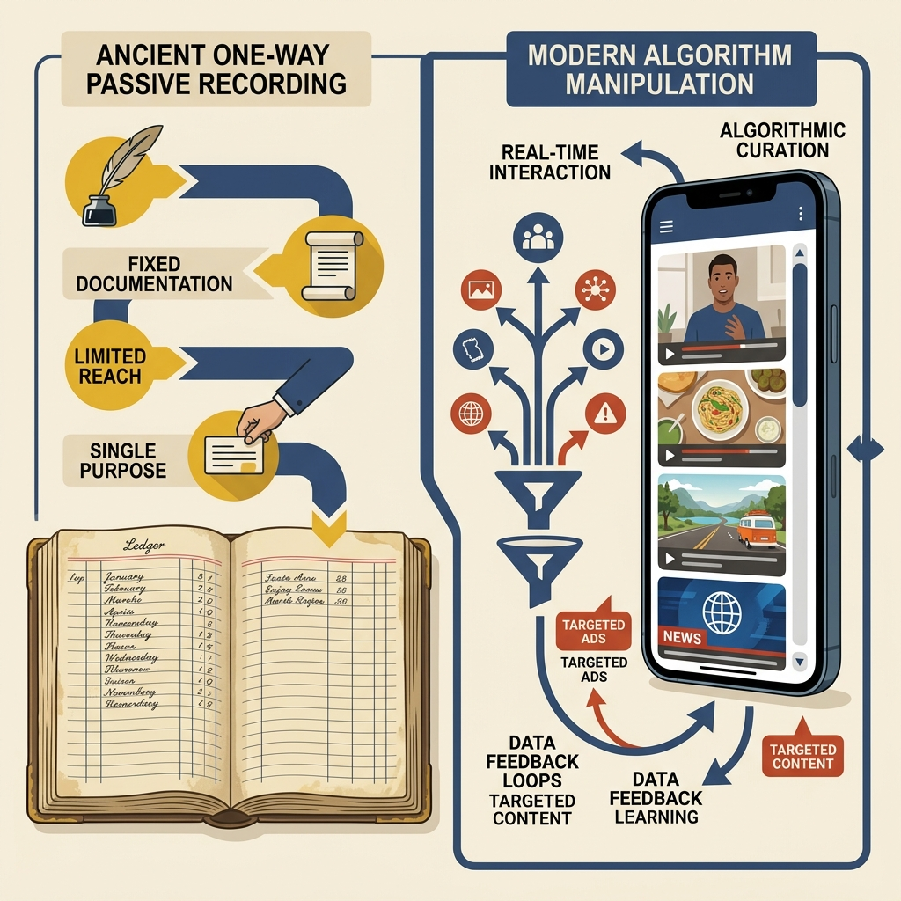
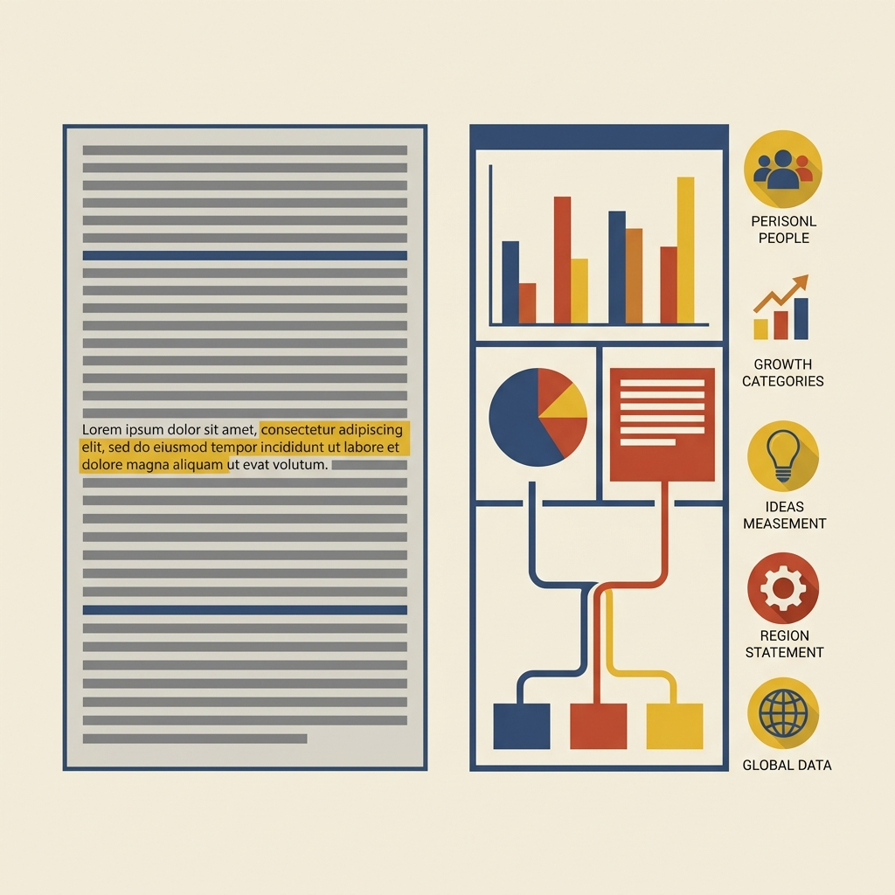
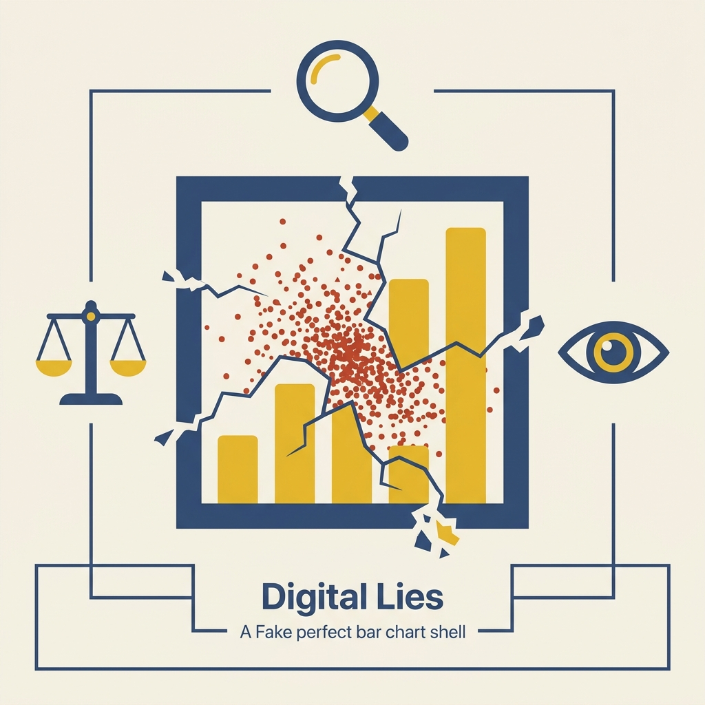
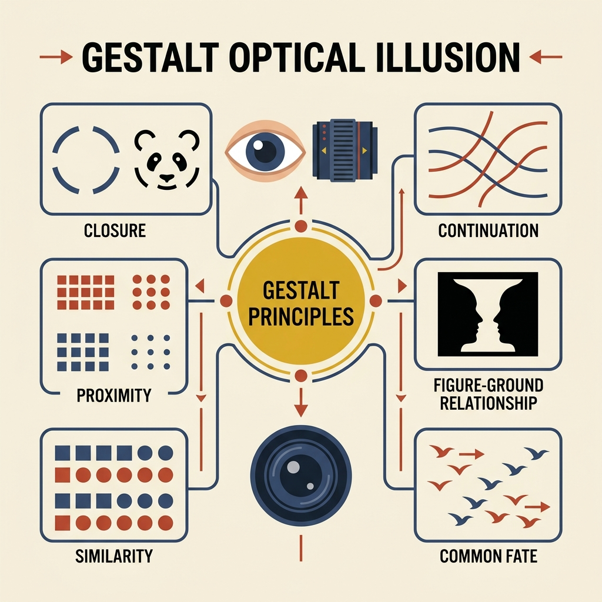
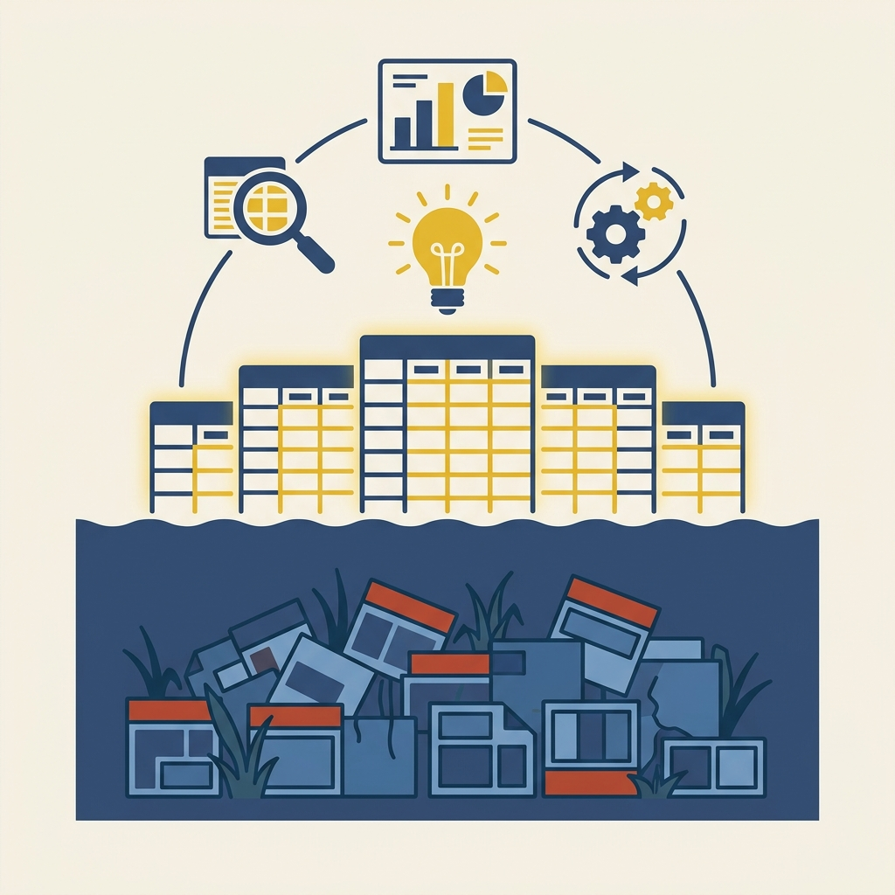
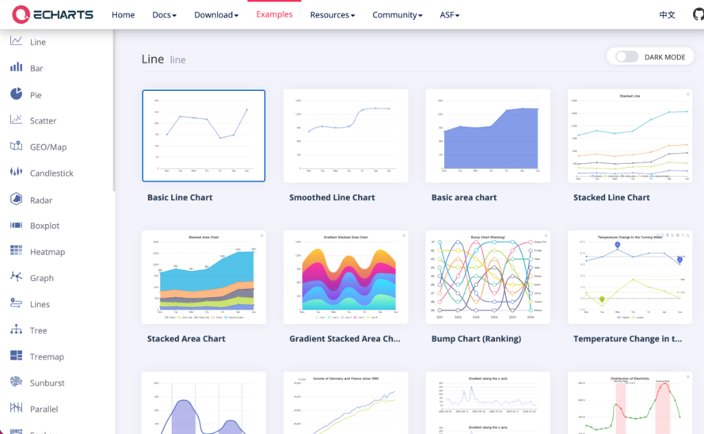
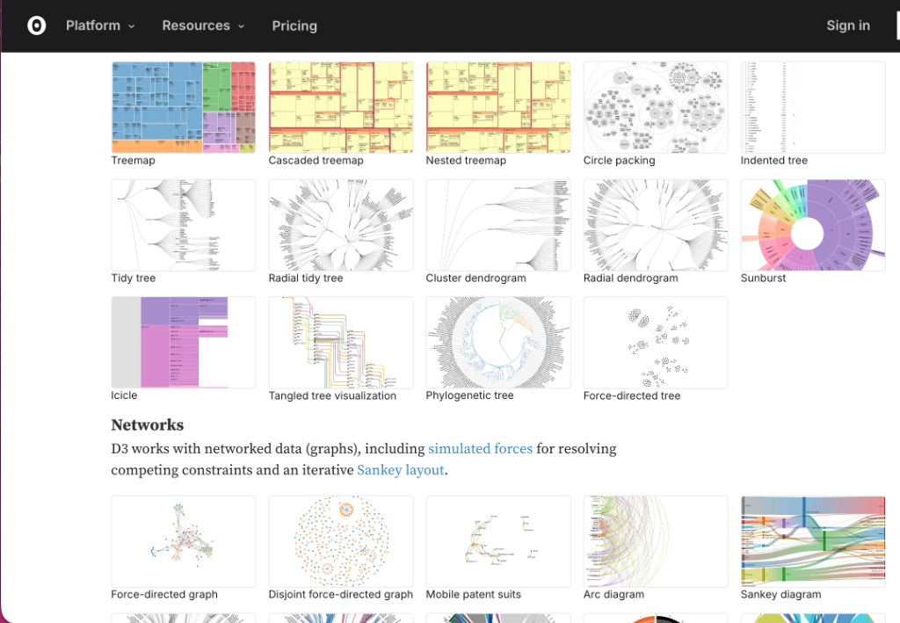
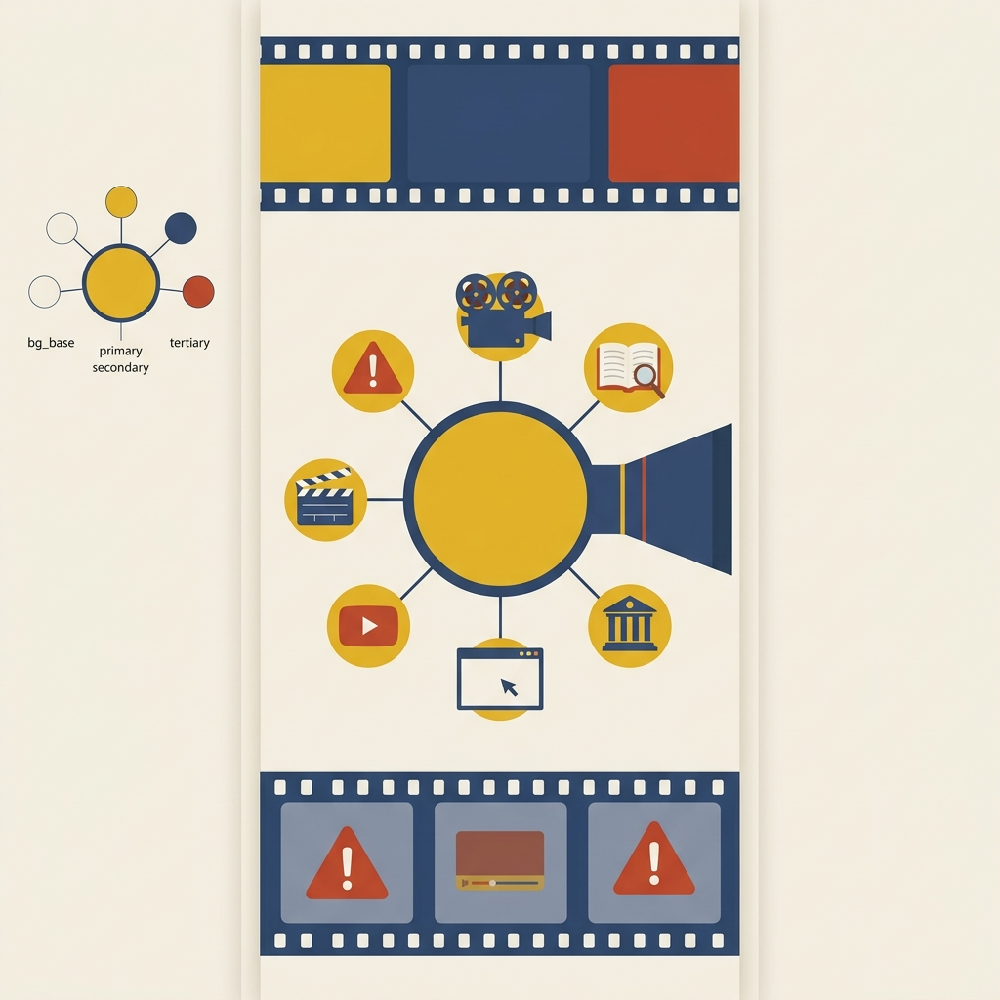
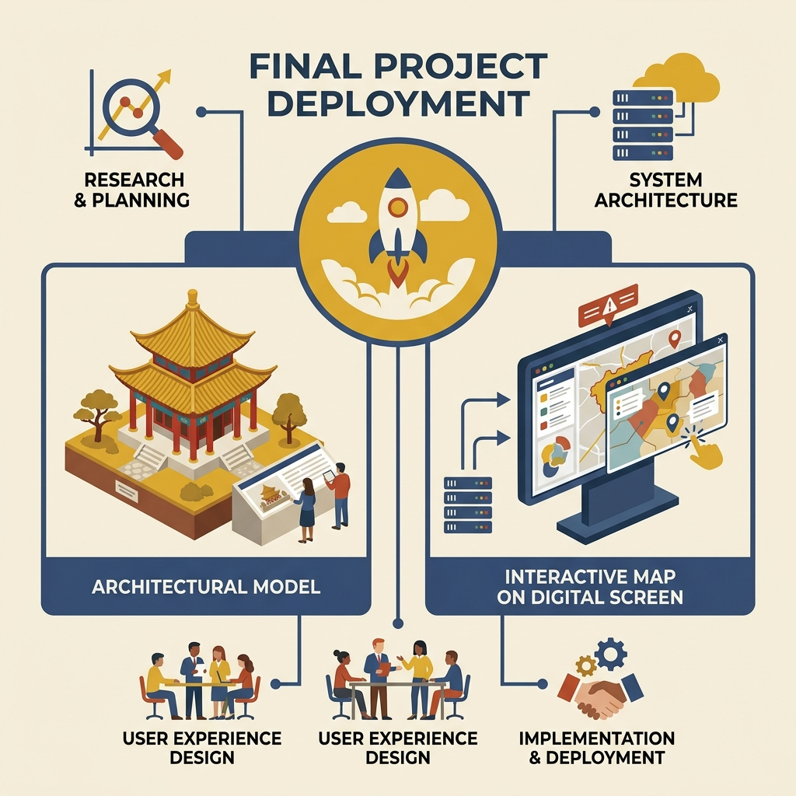
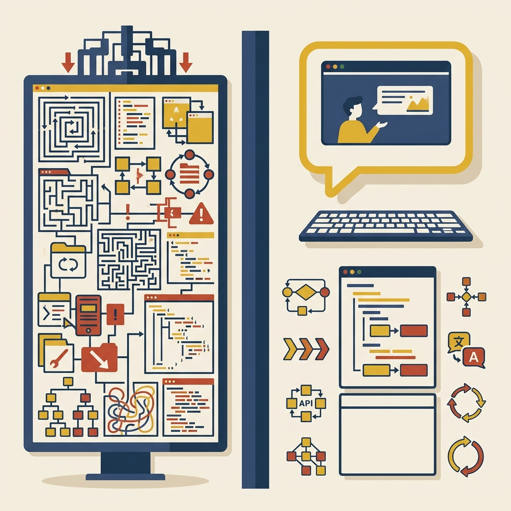

## Module 0: 课程导览 (15 分钟)
<!-- BUDGET: 4500 chars | LECTURE: 15m | ACTIVITY: 0m | SLIDES: ≥5 | STATUS: done -->

### 一、 载体演进：信息可视化打通读图时代

> [TEACHING MOMENT]
> 本模块为首周课程开篇环节，介绍课程总体概况、8 周学习主线、工具生态与评估方式。

> [VISUAL]
> *   **Slide**: `S00_Course_Overview`
> *   **Layout**: `Center`
> *   **Scene**: 深色背景，展示三个极具反差的视觉并置拼接：左侧是原始洞穴壁画，中间是现代复杂且密集的地铁线路图，右侧是充满科技感与数据流光的现代 UI/UX 大屏界面。无任何文字。
> *   **Text**: "信息可视化设计：打通新读图时代的核心赛道"
> *   **Asset**: 

各位**数字媒体艺术专业**的同学，大家早上好。欢迎来到《信息可视化设计》的课堂。

<!-- TRANSITION: 从理论到实践 -->

在接下来十五分钟的课程导览里，我们要先搞懂三个问题：**可视化是什么？我们为什么要学？**以及，它和你们未来的饭碗有什么关系？

你们去看看现在的数字产品——正如这张大屏上并置的三个跨时代画面：无论是原始先民画在岩洞上的狩猎壁画，还是你们每天挤地铁时紧盯的动态线路图，亦或是互联网大厂 UI/UX 设计师每天都在死磕的电商后台销量监控大屏。**图表，早已经从过去单纯的“刻板记录工具”，变成了贯穿人类文明、特别是现在这个互联网新时代的“信息传播必备载体”**。

> [VISUAL]
> *   **Slide**: `S00_Carrier_Evolution`
> *   **Layout**: `Comparison`
> *   **Scene**: 达达拼贴风格：左侧是一摞泛黄的纸质账本，象征古老的单向被动记录；右侧是奔流的数字瀑布与发光算法节点，象征现代算法的隐秘操纵。两者形成强烈视觉冲撞。
> *   **Text**: "信息载体的进化"
> *   **List**:
>     - "过去：纸质账本 → 单向被动记录"
>     - "现在：数字瀑布 → 双向算法操纵"
> *   **Asset**: 

而伴随着载体的演进，信息与人类的关系正在发生更深远的转变。过去，我们的祖父辈用一摞摞纸质账本来**单向且被动地**记录社会流转，账本记完了就静静躺在抽屉里，它不会主动来干涉你；
但今天，作为数字媒体艺术专业的学生，大家每天都在高频刷着小红书的瀑布流和抖音的短视频。你们必须意识到，当数字技术接管一切后，数据的记录早已经变成了一种极具侵入性的**双向互动**。你在屏幕前多停留的半秒钟、双击点下的每一个赞，都被后台抽离成了精准的数据节点。算法就像一个极其聪明的“隐形策展人”，吞噬你的偏好数据后，反手就把为你“量身定制”的视觉内容与种草图文精准投喂到你的主页，潜移默化地左右着你的审美趣味、注意力去向，甚至是你的消费决定。

> [VISUAL]
> *   **Slide**: `S00_Visual_Preference`
> *   **Layout**: `Split`
> *   **Scene**: 达达拼贴风格：左侧是密密麻麻令人窒息的灰暗文字块，右侧是鲜艳几何图形与高对比度色彩区块瞬间点亮视觉神经，象征从文字阅读到读图时代的转变。
> *   **Text**: "新读图时代：注意力争夺战"
> *   **Asset**: 

面对这种密集的数据墙，消费者自然会感到对长段文字的抗拒。他们正在丧失耐心，本能地转向瞬间能被大脑皮层感知的 **“图形”**。

既然如今的商业体系全都在用更具隐蔽性的**算法视觉**去操弄大众心智，那么对于在座的数字媒体专业学生来说，结论就非常残酷了：如果你看不懂数据、不会用视觉去对抗和转译复杂信息，你迟早沦为这盘数字版图上的被动炮灰，更将直接错失 UI/UX 体验设计、**数据新闻**、新媒体运营等最核心的高薪就业赛道。

但是，请不要误解。这门课**并不仅是**教你怎么去“**美化**”一张 Excel 图表，或者教你一套没有内核的**界面装潢术**。如果仅仅为了修饰视觉，那属于基础美工的范畴，不叫信息可视化。

> [VISUAL]
> *   **Slide**: `S00_DIKW_Model`
> *   **Layout**: `Split`
> *   **Scene**: 智慧升维：层次化的几何金字塔。底层是杂乱无序的复古数据登记表碎片；中层是相互连接的精密黑线与色块；顶点是一枚发光的芥末黄三角形，象征提炼出的核心智慧。
> *   **Text**: "DIKW 模型：Data 到 Wisdom 的升维战役"
> *   **List**:
>     - "Data -> Information：通过逻辑排列形成信息"
>     - "Information -> Knowledge：通过建立关系沉淀知识"
> *   **Asset**: 
> **Source**: `Locked` -- AI概念图完全适用于抽象模型图解，无需寻找真实物理照片

> [PHILOSOPHY: DIKW 知识金字塔模型的升维战役]
> 郝亚维教授在《信息可视化设计》开篇就一针见血地引用了钟义信的论述：“信息不等同于数据，数据只是一种记录形式的形式”。这背后隐藏着信息科学中最著名的 DIKW 知识升维模型架构。
> 
> 正如我们在这张幻灯片的左右布局中所看到的，文字部分为我们理清了它们自下而上的动态演化关系：
> 
> 首先，是从 Data 到 Information。数据本身只是几十万行冰冷无序的记录，只有把它们通过逻辑进行排列重组，才会形成有意义的信息；
> 
> 接着，是从 Information 到 Knowledge。当这些孤立的信息彼此之间产生联系、建立起结构化的关系以后，它就形成了知识，甚至跃升为指导决策的智慧（Wisdom）。
>
> 我们的专属任务不仅是绘制图表，更是用视觉语言清晰展现逻辑与关系的构建过程——我们要学会主动出击，不仅要击穿冰冷数字带有迷惑性的防御外壳，更要从被层层算法遮蔽的迷雾中夺回对现实世界的解释权，提炼出清醒而稀缺的智慧内核。

> [VISUAL]
> *   **Slide**: `S00_What_Why_How`
> *   **Layout**: `List`
> *   **Scene**: 一台具有高科技感的 X 光透视扫描仪正在扫描一张复杂的数据图表，透视出其底层的编码结构。采用建构主义达达拼贴的几何风格。
> *   **Text**: "What-Why-How 分析框架"
> *   **List**:
>     - "What：什么数据 (如分类、有序、地理张量)"
>     - "Why：为什么看 (核心任务：异常、趋势、分布)"
>     - "How：如何构图 (视觉通道映射：颜色、位置、尺寸)"
> *   **Asset**: 

为了实现这种升维，我们将贯穿使用本课程的核心理论——英属哥伦比亚大学 Tamara Munzner 教授在《Visualization Analysis & Design》提出的 **What-Why-How 分析框架**。

在这里，大家**完全不需要死记硬背这些理论名词**，只要先建立一个直观的印象：这就相当于我们发给大家用来诊断一切图表好坏的“**X光透视机**”。在接下来的 8 周里，只要掌握了这个框架，面对任何复杂的图表大屏，你都能像外科医生一样发出灵魂三问：

1. **扫描 What（装了什么数据）**：一秒扒开图表的炫酷外衣，看透它底层到底塞的是什么数据；是分类数据、有序数据还是地理空间张量？
2. **追问 Why（为什么看）**：看穿这堆数据背后的意图，到底是为了“发现异常”，还是为了忽悠观众？
3. **解剖 How（耍了什么把戏）**：破解设计者到底是用了颜色、位置还是尺寸的障眼法来进行视觉编码的。

这三位一体的铁三角，将是你们未来用来对抗数据谎言、做高阶设计的终极武器。

信息可视化，显然是一门关乎**降低认知门槛、消除不确定性**，甚至决定系统生死的严肃科学。为了让大家具象化地理解它的重要性，我们必须回溯一下历史。

> [STORY TIME: 从拉斯科洞穴到数据的弥天大谎]
> [知识源: 可视化设计史（Tufte, Friendly & Denis） + 核心认知铺垫，对应课程大纲 Objective 1]

> [VISUAL]
> *   **Slide**: `S00a1_Origin`
> *   **Layout**: `Split`
> *   **Scene**: 展示史前旧石器时代的洞穴壁画（精准参照郝亚维图1-1与图2-1：美索不达米亚洞窟壁画）。
> *   **Text**: "起源：最早的生存数据图表"
> *   **Asset**: 

**绘制原始生存数据大屏**：人类的第一个信息可视化设计师是谁？是大约两万年前，旧石器时代的原始猎人。

在法国西南部的**拉斯科洞穴**里，猎人们画下了野牛。过去人们以为那只是艺术涂鸦。但现代人类学给出了全新定义：那是人类早期的**生存数据大屏**。动物旁边的打点符号，是记录季节更替的最古老图表。先民们把大脑难以长期保存的繁杂规律，转化成了直接的“视觉符号”，传授给部落后代。这就是可视化的起源：**通过图形与文本符号的紧密结合，把抽象经验固化为具体知识，借此在环境混沌中，显著提升了族群对自然资源的掌握能力。**

> [VISUAL]
> *   **Slide**: `S00a2_Enlightenment`
> *   **Layout**: `Split`
> *   **Scene**: 展现19世纪数据可视化的爆发期。左侧为古典肖像剪影，右侧展示由无数密集黑点构成的抽象城市街道分布图，揭示隐藏的危机源头。无文字。
> *   **Text**: "启蒙：约翰·斯诺医生与挽救生命的数据地图"
> *   **Asset**: 

到了 19 世纪。现代数据分析先驱——**约翰·斯诺医生**，并没有把这门手艺当成画画，而是用它拯救了成千上万人命。面对伦敦的**霍乱大爆发**，整个社会一筹莫展。斯诺医生拿出一张伦敦地图，把每一例死亡病例的位置，用黑点标记在图上。

等地图画出，答案不言自明。所有的死亡密集区，都精准地围绕着宽街的一口**公共水泵**。不需要显微镜，只需凭借这张二维平面的**黑点分布图**。他直接推翻了当时“霍乱通过空气传播”的学术共识，成功锁定了水源污染。这就叫做，**用数据拯救生命**。

> [VISUAL]
> *   **Slide**: `S00a3_Modern_Era`
> *   **Layout**: `Center`
> *   **Scene**: 围绕数字谎言核心意象。达达主义拼贴：严密对齐的统计数据表格表面正在碎裂，底下暴露出充满野性、完全不同的散点图隐喻。高对比度色彩。无文字。
> *   **Text**: "现代：戳破数字的弥天大谎"
> *   **Asset**: 

百年后的今天，我们面对的不再是去找一个具体的实体水泵。而是面对着由**算法画像**和**推荐引擎**构建的数字洪流。在这其中，隐藏着成千上万个被打扮成"**客观中立**"模样的**数字谎言**。

你可能会问：现在算力这么强劲，我们敲个公式求出平均值、让人工智能帮我们直接做决策不就行了，为什么还要亲自折腾图表？答案正如刚才所言：当数据记录变成**单向信息控制**时，纯粹的数字是带有特定决策意图的。如果你不加批判地盲信那些看似客观的图表，那么被隐藏的数据特征必将误导你的决策。

这就是本课程想让大家建立的核心认知：在这个信息过载且充满算法干预的时代，我们必须建立**视觉化分析**的能力——用图表工具去还原被包装的客观数据规律，并重新掌握对数字世界的专业判断力！

> [ACTIVITY] Type: QA | Duration: 1min | Desc: 提问互动：结合刚才的例子，你认为日常生活中最忽悠人的数据谎言形式是什么？

### 二、 理论筑基：感知与素养决定可视化成败

> [VISUAL]
> *   **Slide**: `S00b_Theory_Intro`
> *   **Layout**: `Center`
> *   **Scene**: 深色学术背景，一颗几何化的大脑模型，表面覆盖精密数据网格和发光节点，象征认知层升级与理论筑基。
> *   **Text**: "第一阶段：理论筑基 (W01-W04)"
> *   **Asset**: 
> *   **List**:
>     - "先给大脑做认知层的手术升级"

这门课程总共 8 周，分为两个**界限分明但又紧密相连**的阶段。

我们要聊的前半程，也就是第 1 周到第 4 周，叫做"**理论筑基**"。在这里，我们并不会像传统的计算机速成班那样，直接把大家扔进代码编辑器里背诵底层语法。相反，我们要先给大脑做"认知层"的基础概念升级。

第一周和第二周，我们会深入**脑神经科学与视觉心理学**的最前沿交叉领域，探讨视觉感知和符号隐喻。

> [VISUAL]
> *   **Slide**: `S00b_W1_W2_Perception`
> *   **Layout**: `Center`
> *   **Scene**: 深色背景下，一只充满未来感的机械眼球或聚焦透镜，前方漂浮格式塔原理的抽象几何图形（如趋近圆点、对比色块），象征视觉感知法则。
> *   **Text**: "W01 - W02：视觉感知与隐喻映射"
> *   **Asset**: 
> *   **List**:
>     - "视觉本能：什么决定了图表的“一眼看懂”？"
>     - "排版法则：用心理学精准牵引观众视线"
>     - "色彩科学：打破凭直觉配色的艺术盲盒"

你们会了解到大脑最本能的**视觉习惯**，弄清楚到底是什么规律决定了一张图表能不能让人在零点几秒内毫不费力地看懂。比如，折线图上的文字标签到底贴在哪里，最符合人类扫视的本能？为什么我们要尽量避免大面积使用花哨且刺眼的演示级色彩？在这里大家会发现，图表的排版和配色早就不是什么单纯靠灵感去猜的“艺术选择”，而是有着严谨的生理学和视觉心理学依据的**科学法则**。我们要教你的，就是怎么像拿手术刀一样，用这些法则去精准牵引用户的注意力。

到了第三周，我们将穿过表象，潜入深海——去摸底"看不见的冰山"，也就是**数据素养与数据清洗**的残酷世界。

> [VISUAL]
> *   **Slide**: `S00b_W3_TidyData`
> *   **Layout**: `Center`
> *   **Scene**: 幽暗深邃的背景，上方是一块整洁发光的数据立方体，下方是庞大混乱的由无数碎片构成的冰山，象征数据清洗的底层重要性。
> *   **Text**: "W03：数据素养与 Tidy Data"
> *   **Asset**: 
> *   **List**:
>     - "看不见的冰山：数据清洗决定 80% 胜局"
>     - "Tidy Data 范式：像外科手术般精准解剖非规范信息"
>     - "二元映射矩阵：构建大模型能吞吐的高质量数据基座"

部分初学的同学可能有一种错觉，认为信息可视化就是“画图”，只要把数据丢进去就能自动生成大屏。其实不然。一个专业数据可视化工程的成败，往往在你画第一根线之前的“数据预处理”阶段就已经注定了。

在这里，我们会学习业界公认的规范——**Tidy Data**（整洁数据）。我们会学习如何将现实世界中杂乱无章、残缺不全的数据，像外科手术一样精准解剖并重构为程序所需、且大语言模型能高度理解的标准**二元映射矩阵**。如果没有建立这层稳固的结构化基座，接下来的任何炫彩图表渲染，都只是缺乏地基的积木模型。

而第四周，是技术实战的分水岭。当你们掌握了认知心理与数据素养之后，我们会正式引入当今业界**两把主力生产工具**：

> [VISUAL]
> *   **Slide**: `S00b_W4_ECharts`
> *   **Layout**: `Center`
> *   **Scene**: 展示 ECharts 的真实 UI 界面（官方画廊），展现其开箱即用的声明式配置图表大纲。
> *   **Text**: "ECharts (斩马刀)：最强声明式配置巅峰"
> *   **Asset**: 
> **Source**: Apache ECharts 官方图表库截图

第一把，是代表着现代**声明式配置引擎**优秀典范的开源图表引擎 ECharts；

> [VISUAL]
> *   **Slide**: `S00b_W4_D3js`
> *   **Layout**: `Center`
> *   **Scene**: 展示 D3.js 原生且极具扩展性的官方组件库画廊（包括层级树映射与各类网络图生态）。
> *   **Text**: "D3.js (狙击枪)：原生指令式物理引擎"
> *   **Asset**: 
> **Source**: D3.js 官方力导向图示例截图

而第二把，则是被全球公认为可视化领域毫无争议代表作的底层**原生指令式物理引擎**框架——D3.js。在这周里，我会向大家展示这两种框架的差异化应用场景，让你们明白什么时候该用 ECharts 这把斩马刀，什么时候必须上 D3 这种狙击枪。

除此之外，我们还会在本周五的工坊中，提前带大家体验一种极具颠覆性的全新智能工作流——基于大模型的 **Vibe Coding（直觉编程）**。这究竟是降维打击的捷径，还是危险的视觉陷阱？我们到时见分晓。

> [VISUAL]
> *   **Slide**: `S00_D3js_Preview`
> *   **Layout**: `Full`
> *   **Asset**: 
> *   **Source**: `Video` — YouTube: D3.js in 100 Seconds
> *   **Duration**: `2m 20s`
> *   **TimeCategory**: `activity`
> *   **Scene**: 直观展示 D3.js 原生指令式引擎强大的图表绘制能力与交互潜力。

### 三、 创作冲刺：从静态图表迈向动态全链路

> [VISUAL]
> *   **Slide**: `S00c_Practice_Intro`
> *   **Layout**: `Center`
> *   **Scene**: 深色背景中，一组由无数发光粒子构成的动态能量流冲破传统的静态图表框架，向四周绽放出充满生命力的有机线条。
> *   **Text**: "第二阶段：创作冲刺 (W05-W08)"
> *   **Asset**: 
> *   **List**:
>     - "超越图表，唤醒数据的情绪"

熬过了理论筑基，后半程的第 5 周到第 8 周，我们将进入激动人心的"创作冲刺"阶段。这时候，我们不再局限于规规矩矩的柱状图和折线图了。

第五周，我们将跨入"**生成艺术**"的领域。我们会学习网络拓扑，学习**力导向网络**。

> [VISUAL]
> *   **Slide**: `S00c_W5_GenerativeArt`
> *   **Layout**: `Center`
> *   **Scene**: 错综复杂的力导向网络结构图，成百上千个发光节点在引力和斥力作用下形成有机的星系状拓扑结构，展现数据的情绪。
> *   **Text**: "W05：数据情绪与生成艺术"
> *   **Asset**: 
> *   **List**:
>     - "网络拓扑与关系数据映射"
>     - "力导向网络：掌控引力、斥力与碰撞机制"
>     - "交互式关系图：将错综复杂的流向映射为动态网络"

你们将学会如何指挥 D3.js 的底层力导向引擎（Force-Directed Graph），掌握其背后的引力、斥力与碰撞参数控制逻辑。从而把诸如《权力的游戏》中几百个角色的家族结盟与背叛，或者是某个庞大系统内部错综复杂的资金流向，转化为一个会随你鼠标交互而产生动态集结与排斥的复杂关联网络。

第六周，我们将学习现当代数据新闻中最主流的交互形式——**滚动叙事 (Scrollytelling)**。

> [VISUAL]
> *   **Slide**: `S00c_W6_Scrollytelling`
> *   **Layout**: `Center`
> *   **Scene**: 一条由层层叠加的数据面板形成的光学长廊，像电影胶片一样向后滚动退移，象征滚动叙事的沉浸感与运镜。
> *   **Text**: "W06：滚动叙事 (Scrollytelling)"
> *   **Asset**: 
> *   **List**:
>     - "成为数字导演，控制电影运镜般的数据过渡。"

你们不再是画一张静态图，而是成为一名**数字导演**，安排读者在滑动鼠标滚轮时，数据图表如何像电影运镜一样完成平滑过渡和展开。

而第七周和第八周，全部用来开展你们的**期末综合项目**。

> [VISUAL]
> *   **Slide**: `S00c_W7_W8_Final_Project`
> *   **Layout**: `Center`
> *   **Scene**: 俯瞰视角的城市地貌图，城市建筑由发光的数据块构成，中心正在升起一个巨大的金字塔形数字节点，象征最终项目的全链路部署。
> *   **Text**: "W07 - W08：综合项目实战与部署"
> *   **Asset**: 
> *   **List**:
>     - "议题调研：传统文化保护、生态治理、弱势群体..."
>     - "全链路开发：从底层清洗到前端艺术封装"
>     - "上线开源：部署至 Vercel / GitHub Pages，公开展出"

我们需要你们从宏大的社会或文化议题出发，也许是中国传统文化的数字化保护，也许是生态环境治理，或者是特定社会群体的数据生存状态。你们需要经历完整的独立调研、原型设计、编程实现、视觉封装，直到最终将作品部署到 Vercel 或者 GitHub Pages 上，完成**全链路开发部署**，向全世界公开展示你们的数据洞察。

> [VISUAL]
> *   **Slide**: `S00d_Toolchain_And_Vibe`
> *   **Layout**: `Split`
> *   **Scene**: 达达拼贴风格：左侧是面对满屏冰冷代码感到疲惫的传统程序员身影，右侧是一束明亮光流直接将自然语言转化为悬浮的立体图表。
> *   **Text**: "技术底座的颠覆：迎接 Vibe Coding 范式"
> *   **Asset**: 

听到这里，肯定有些同学可能已经开始头皮发麻、甚至在心里打退堂鼓了：“老师，我是艺术生啊，我是来学设计的，我从来没背过算法，更不会写代码！你刚才又是 D3.js 又是数据清洗、算法映射的，这期末大作业该不会是要逼着我们去写几万行 C++ 或者 JavaScript **底层代码**吧？我会挂科的！”

### 四、 范式跃迁：直觉编程重塑设计架构思维

别怕。你们赶上了好时候。这门课在 2026 年的今天，全面引入了一种叫做**直觉编程（Vibe Coding）**的新工作范式。我们会在第四周专门拆解这个话题，现在你们只需要记住一件事：**你不需要去死记硬背 D3 的函数语法。** 你要做的，是学会用精确的自然语言——清晰地描述"什么字段映射到什么视觉通道、极值该呈现怎样的突变反应"——去指挥 Cursor、Claude 这类 AI 编程代理，让它们替你生成代码。

> [VISUAL]
> *   **Slide**: `S00_Vibe_Coding_Synergy`
> *   **Layout**: `Split`
> *   **Scene**: 左侧是机器光流（代表 AI 快速生成大量图表）；右侧是戴着眼镜的思考者在审视和调整光流的路径，象征人机协同的新范式。无文字。
> *   **Text**: "Vibe Coding 时代的架构师思维"
> *   **List**:
>     - "底层代码：交给机器与大模型生成"
>     - "设计决策：人类负责格式塔、信噪比与视觉逻辑把控"
> *   **Asset**: 

但这不是躺平的借口。**不用亲手写代码，绝不等于你可以对视觉逻辑一无所知。**

举个具体场景：AI 一秒钟把一万个数据气泡砸在屏幕上，但因为**视觉权重失衡**，把本该触发警报的亏损指标渲染成了喜庆的暖色调；又或者炫酷的粒子特效喧宾夺主，把最关键的异常数据点淹没在视觉噪音里。这时候，如果你不懂什么叫色彩的**格式塔冲突**、不懂信噪比原则，你连 AI 错在哪里都说不出来，更开不出一张有效的修正 Prompt。

所以请校准预期：这门课的目标，是把你们培养成数据**可视化架构师**和**视觉质量督导员**——你负责做设计决策，底层代码交给机器。

> [ACTIVITY] Type: QA | Duration: 1min | Desc: 提问互动：如果 AI 能一键帮你写出所有图表代码，作为数字媒体设计师，你的核心竞争力究竟还剩什么？

### 五、 考核机制：实战产出驱动最终能力评估

> [VISUAL]
> *   **Slide**: `S00e_Assessment`
> *   **Layout**: `Split`
> *   **Scene**: 极简学术底座，展示一个抽象的天平结构。天平的两端分别放置着代表实验过程的精密齿轮和代表最终项目的璀璨钻石，达到完美的平衡。
> *   **Text**: "成绩构成与提交规范"
> *   **List**:
>     - "平时实验 50%：每周课堂实践产出 + 课后作业"
>     - "期末考查 50%：完整的数据可视化叙事项目"
>     - "提交渠道：学习通（实验报告） + GitHub/Vercel（期末部署）"

最后说一下评分。这门课的成绩构成非常平衡：平时实验占 **50%**，期末作品占 **50%**。平时实验就是每周的课堂产出和课后作业，强调过程性评价。期末作品则是你们的大工程——一个从数据调研到前端部署的完整可视化叙事项目。我们会在第七周正式启动这个项目。

好的，路线图聊完了。现在让我们正式进入今天第一周的核心议题。我要先问大家一个看似简单，但实际上非常致命的问题。

---
