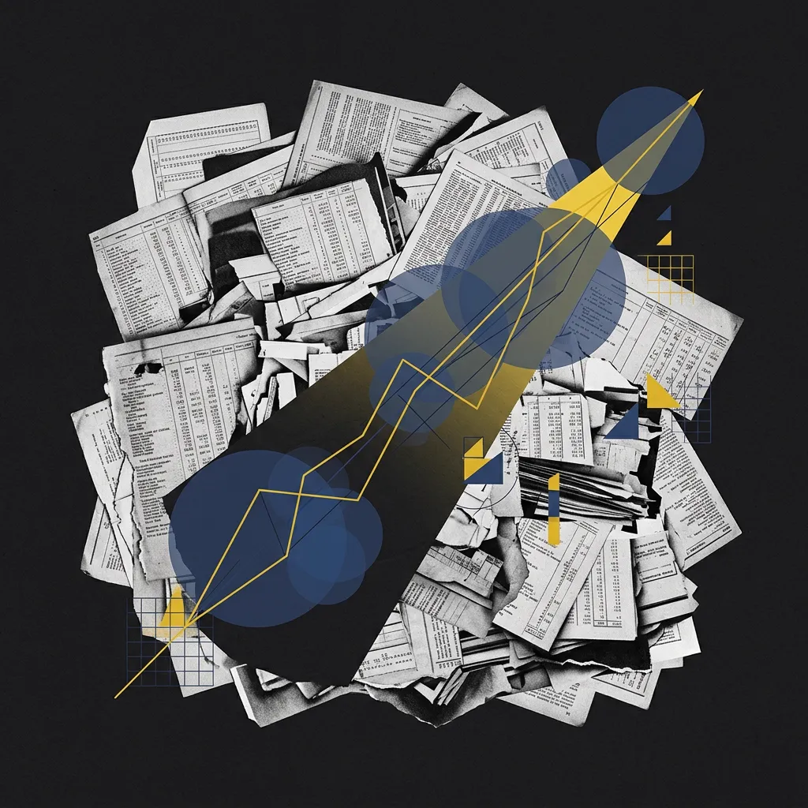
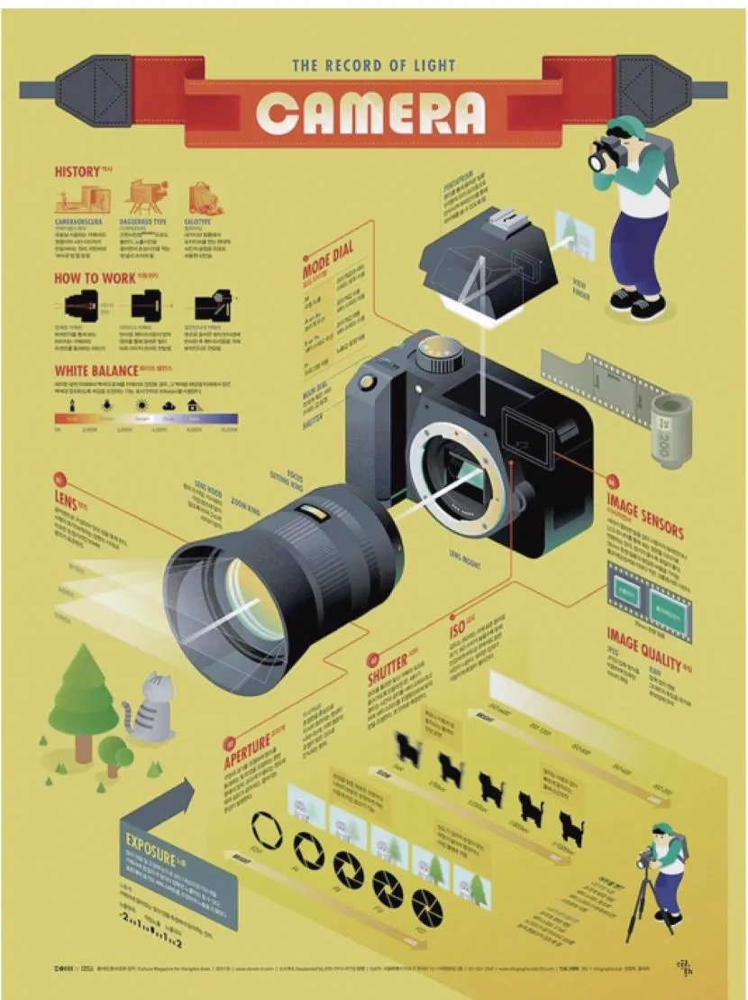
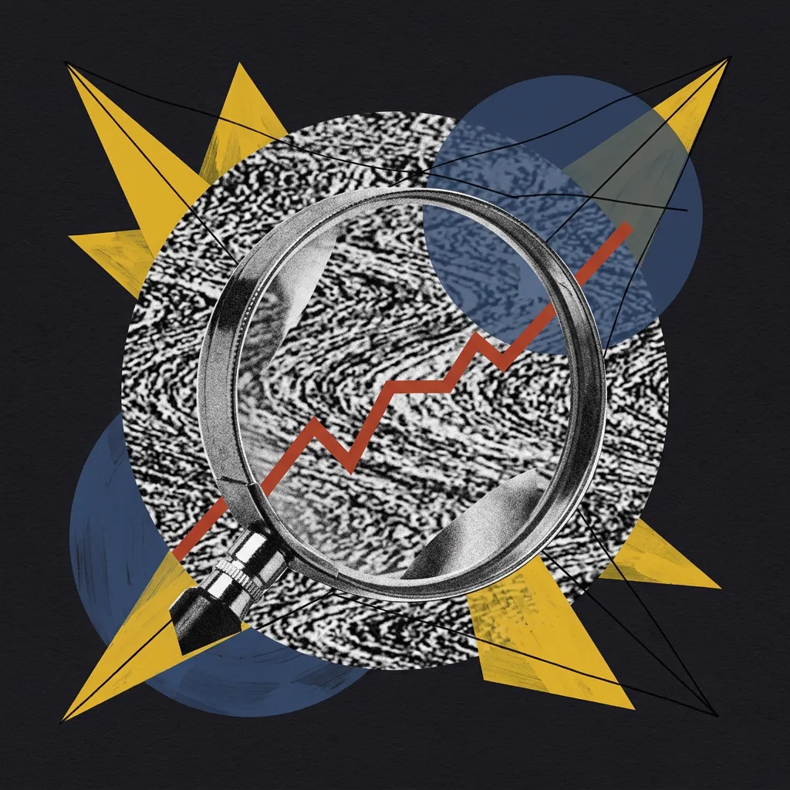
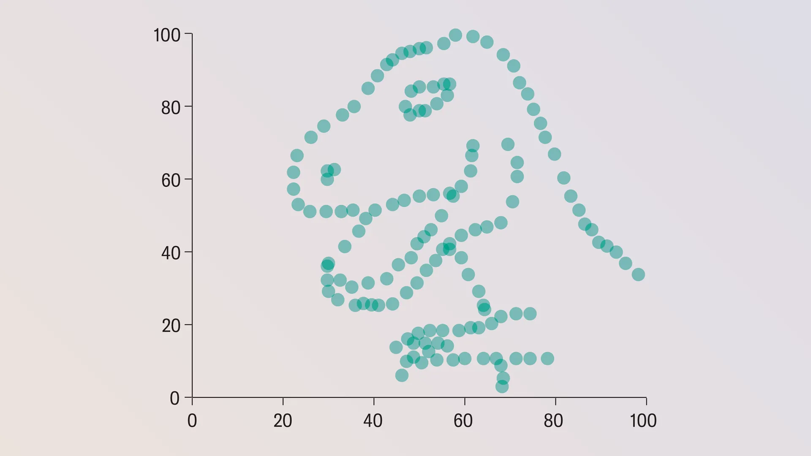
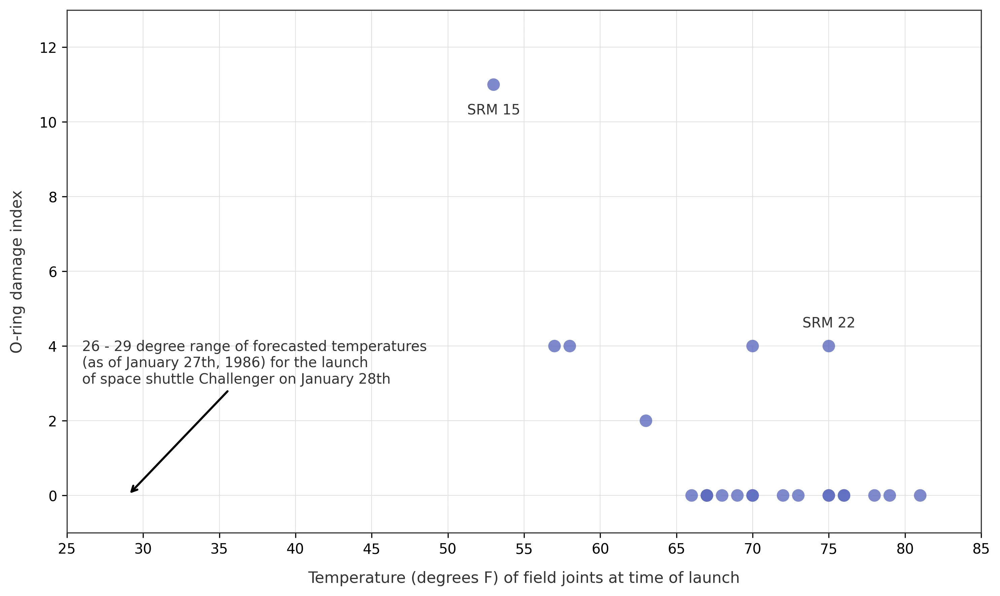

## Module 1: 我们为什么需要可视化？ (25 分钟)
<!-- BUDGET: 2700 chars | LECTURE: 15m | ACTIVITY: 10m | SLIDES: ≥5 | STATUS: done -->

### 1.1 概念溯源：可视化直击认知映射痛点

> [VISUAL]
> *   **Slide**: `S01_Opening_Question`
> *   **RenderMode**: `pedagogical`
> *   **Layout**: `Center`
> *   **Scene**: 深色背景。左侧是堆积如山、令人窒息的旧式纸质账本与打印报表（代表原始数据的沉重感），右侧是一束穿透纸堆的光，投影出一个极其清晰、极简的几何折线图表。
> *   **Keywords**: paper ledgers, printed reports, glowing geometric chart
> *   **Text**: "如果数据已经给出了答案，为什么还要画图？"
> *   **Asset**: 

我们为什么需要可视化？

这个问题看似简单："因为图表美观"或"因为便于汇报"。但这并非核心答案。信息可视化设计之所以是一门基础认知学科，而不仅是"**美化数据**"的装饰手段，是因为它解决的是信息本体与人类视觉系统的**映射问题**。

但在回答“为什么需要画图”之前，我们首先需要回答一个前提追问：**究竟什么是“信息”？**

大家想一想，你每天看手机屏幕上滚动的**股市大盘**、Excel 里密密麻麻的**月度营收总表**。那些是**信息**吗？

> [VISUAL]
> *   **Slide**: `S01d_Shannon_Entropy`
> *   **Layout**: `Video`
> *   **Scene**: 珍贵的黑白历史纪录片影像：克劳德·香农与采访者面对面。他抛起一枚硬币，用最直观的“正反”二元选择，向毫无信息学背景的普罗大众生动讲述消除未知、产生“比特”的过程。
> *   **Text**: "「信息，是对不确定性的消除量」 —— 克劳德·香农 (1948)"
> *   **Asset**: 
> *   **Duration**: `00:02:17`
> *   **TimeCategory**: `Archival Footage`
> *   **Source**: YouTube: "Claude Shannon Explains Information Theory" (Documentary Snippet)

> [TEACHING MOMENT: 借香农的“硬币与乱码”推演可视化本质]
> “同学们，刚才香农老爷子讲了两个反直觉的例子：**两面都是正面的假币没有信息量**，而**毫无规律的乱码反倒比莎士比亚的名著信息量更大**。为什么？因为信息不等于意义，信息的本质仅仅是**对未知和不确定性的消除**。”

只有理解了香农的这个底层定义，我们才能明白信息和原始数据的区别。

信息论专家**钟义信**教授也曾指出：“信息不等于信号”。那些堆积在数据库里的原始记录，仅仅是承载信息的“**物理载体**”。如果没有经过组织，它们就像散乱的砖头，本身不具备结构化的意义。

> [VISUAL]
> *   **Slide**: `S01a_What_Is_Information`
> *   **RenderMode**: `pedagogical`
> *   **Layout**: `Grid`
> *   **Scene**: 视觉隐喻“从数据到知识”的降熵过程：从左侧散乱堆叠的旧式打孔卡片（无序的数据/信号），中间是整齐归档的文件柜抽屉（结构化信息），右侧是复古的测量指南针（提取的知识与规律），画面呈现从压抑的混乱到有呼吸感的秩序的强烈对比。
> *   **Keywords**: chaotic punch cards, filing cabinet drawer, vintage surveyor compass
> *   **Text**: "信息本体论：香农、谢卓夫与钟义信的跨界共识"
> *   **List**:
    - "克劳德·香农：信息是『对不确定性的消除量』。"
    - "钟义信：信号 ≠ 信息。信号只是信息的承载者容器。"
    - "谢卓夫：处理数据、赋予意义、转化为知识。"
> *   **Asset**: 

正如幻灯片中交互设计先驱**谢卓夫（Nathan Shedroff）**所指出的，设计的最终使命是将数据转化为知识。但如何才能高效地完成这一跃升？**信息可视化设计的核心价值，正是极大地加速我们获取和理解知识的效率。**面对庞大的原始数据，如果仅靠人脑逐行阅读，认知负荷将极其高昂。而通过**梳理、过滤和视觉表征**，可视化能让数据背后的结构与规律瞬间显现，帮助我们在最短的时间内完成从“数据”到“知识”的提取。

### 1.2 视觉降熵：图形设计消除数据不确定性

香农指出的“消除不确定性”，正是解释我们“为什么要画图”的终极答案。

当我们作为设计师面对几十万行的原始销售或用户数据时，这些数据对人脑来说就像香农口中“毫无规律的乱码”——它的系统无序程度较高（认知熵大），充满了不确定性：“营收是增长了还是断崖下跌？”、“核心用户群体到底是哪些？”。面对纯**数字报表**，我们的大脑很难快速建立预判。

> [VISUAL]
> *   **Slide**: `S01c_Infographic_Magic`
> *   **Layout**: `Split`
> *   **Scene**: 直观的视觉对比。左侧铺满杂乱无章的数码相机电子元件物料单与几百行枯燥参数说明。右侧展示韩国著名设计师张圣焕的经典案例（对标郝亚维《信息可视化设计》第一章图1-3）：一张被精细解剖、零件分离悬浮在空中的单反相机“爆炸式拆解图”。
> *   **Text**: "设计的魔力：化繁为简，瞬间击穿认知门槛"
> *   **Asset**: 

> [知识源: 郝亚维《信息可视化设计》第一章 图1-3 张圣焕单反相机信息图]

大家看屏幕右侧。这是韩国设计师**张圣焕**团队为单反相机绘制的**全景爆炸拆解图**。

如果面对数百页的纯文本装配说明，多数人会感到认知抗拒。但这幅图表精准地消除了“乱码般”的物理结构不确定性，降低了理解门槛。即使缺乏光学工程背景，复杂的机械结构也能通过视觉语言直接呈现，帮助我们在脑海中完成三维组装，从而快速建立理解。

> [VISUAL]
> *   **Slide**: `S01e_Cognitive_Entropy_Reduction`
> *   **RenderMode**: `pedagogical`
> *   **Layout**: `Center`
> *   **Scene**: 深色背景下的“降噪引擎”。左侧是漫天飞舞的静电雪花与杂乱的白噪波纹，中间通过一个带有厚重视效的玻璃透镜（映射过滤），右侧折射出一条具有生命力的清晰红色折线。
> *   **Keywords**: static snow, thick glass lens, clear red line graph
> *   **Text**: "信息可视化：人类认知降熵引擎"
> *   **Asset**: 

因此，**信息可视化设计**实质上就是一次“认知降熵”：设计师利用人脑对空间、颜色和几何形状的敏锐直觉，将隐藏在原始数据背后的宏观趋势提取出来。一条简单的折线或是一张对比强烈的柱状图，都能让复杂的业务数据变得一目了然。

当一张结构清晰的仪表盘呈现在眼前时，观看者的分析过程直接跨越了缓慢的逐行阅读，瞬间看懂了数字背后的业务现状。只有疑问在观看图表的瞬间得到解答，我们才真正完成了“将数据转化为信息”的过程。

### 1.3 均值陷阱：盲信统计模型诱发决策灾难

> [ACTIVITY]
> *   **Type**: `Warm-up`
> *   **Duration**: `10min`
> *   **Desc**: 数据探索：均值盲盒刮刮乐
> 
> 1. **分发数据**：向全班发送包含 1 个“正常示例”和多个“神秘盲盒”数据集的在线表格链接。每组包含日期、X（如投放量）和 Y（如转化率）三列。
> 2. **统计验算**：要求大家仅针对 X 和 Y 列使用电子表格公式计算各数据集的均值与方差，发现竟然达到了小数点后两位的**绝对一致**（X均值=54.26，Y均值=47.83）。
> 3. **基线演示**：教师带头或邀请第一组，**只选中 X 和 Y 两列**为“正常示例_业务趋势”工作表画出『散点图』。图表呈现出一个完美的正相关向上趋势。教师总结：“看，散点图印证了数学规律，这就是符合我们日常直觉的业务报表。”
> 4. **形成错觉**：教师顺势发问：“既然这几个神秘盲盒的底层统计数据跟正常业务一模一样，大家猜猜画出来的图是不是也长这样？”
> 5. **视觉揭秘**：教师下达解密指令，各组为自己的盲盒一键插入『散点图』。（**注意：务必提醒学生不要全选数据，如果误选日期列会生成折线图彻底破坏活动效果！**）图表生成的瞬间，有的组刮出了一只霸王龙，有的组刮出了五角星、同心圆——强烈的反差引起全场哗然。

为什么各个小组算出的**平均数**和**方差**完全一样，画出来的**散点图**却有的是霸王龙，有的是五角星？

> [STORY TIME: 恐龙的极限变异与数字谎言]

> [VISUAL]
> *   **Slide**: `S02b_2_Alberto_Cairo`
> *   **Layout**: `Split`
> *   **RenderMode**: `real`
> *   **Scene**: 左侧是 Alberto Cairo 教授的经典霸王龙图表，右侧是传统冰冷的均值和方差统计公式，形成了强烈的反差。
> *   **Text**: "Alberto Cairo 的霸王龙警告"
> *   **Asset**: 

其实早在 1973 年，统计学家安斯库姆就用著名的“四重奏”图表警告过这种“均值幻觉”。但为了给今天那些只看数据报表、不看图形验证的决策者们敲响更响亮的警钟，数据可视化专家 Alberto Cairo 专门制作出了大家刚才在“盲盒”中刮出的那只霸王龙。

著名设计软件公司 **Autodesk** 的研究员做了一个有趣的实验：在保持“均值”和“方差”等数学指标死死不变的前提下，让算法随意挪动数据点，看看能拼出什么图形？

请看大屏幕。

> [VISUAL]
> *   **Slide**: `S02a_Datasaurus_Animation`
> *   **Layout**: `Video`
> *   **Scene**: 在漆黑的屏幕中，成百上千的数据点规律地散开又聚拢。一只霸王龙被算法变形扭曲到了 13 种例如五角星、同心圆等组合。
> *   **Text**: "Datasaurus Dozen 推演：死守均值，极限变异"
> *   **Asset**: 
> *   **Asset (AI fallback)**: 
> *   **Source**: Autodesk Research CHI 2017 (Fair Use for Education)

（播放动画）大家看到了吗？在几秒钟内，霸王龙散开并重组成你们刚才刮出的五角星、同心圆或交叉线。这就是著名的 **"Datasaurus Dozen"（恐龙十二变）** 数据集。在这 13 种截然不同的形状切换中，关键数学指标**始终纹丝不动**。

这说明，单一的数学指标极易掩盖真实的分布风险。

这绝非仅仅是场数字游戏。仅仅依靠数据表格进行粗暴的统计验证，曾真实地给人类探索太空的历史带来过血的教训。

> [VISUAL]
> *   **Slide**: `S02c_Challenger_Tables`
> *   **RenderMode**: `pedagogical`
> *   **Layout**: `Center`
> *   **Scene**: 深色背景下，一张充满年代感的残破黑白传真纸悬浮在画面中央，纸面上密密麻麻印满了按时间排序的毫无规律的枯燥测试参数（表格）。表格的横纵网格被刻意强化，宛如一个束缚认知的牢笼。
> *   **Text**: "灾难的源头：看不见相关性的数据流水账"
> *   **Asset**: 

> [CASE STUDY: 被表格隐瞒的死亡温度——挑战者号灾难]
> 1986 年，美国挑战者号航天飞机在升空 73 秒后解体，7 名宇航员罹难。这一重大事故的直接工程诱因，是助推器上的**橡胶 O 型环（O-ring）**在罕见低温下失去了弹性导致密封失效。但更令人震撼的是它背后的“可视灾难”。

多年后，信息可视化先驱**爱德华·塔夫特（Edward Tufte）**在其著作《Visual Explanations》中对该事故做出了教科书级的痛心复盘。

事发前一晚，佛罗里达州气温迎来了**极寒温度**，气温降到了打破记录的 29 华氏度（零下1度）。火箭工程师感到了不安，他们彻夜试图说服 NASA 取消发射计划。然而，他们用于供 NASA 高层决策的数据，仅仅是一堆按时间流水账排列的测试汇总表。官员们盯着那些繁碎的数字，人类视觉系统天生无法从“密集的网格”里立刻进行跨列计算，最终以“当前数据不足以证明严寒与事故有关联”为由，强行批准了次日的发射。

> [VISUAL]
> *   **Slide**: `S02c_Tufte_Mapping_Real`
> *   **Layout**: `Full`
> *   **Scene**: 爱德华·塔夫特的 O 型环损伤散点图（真实历史数据与复原图表）。
> *   **Text**: "生死攸关的映射：塔夫特的 O 型环损伤散点图"
> *   **Asset**: 

塔夫特指出，如果当时的工程师稍微转换思路，不使用表格堆砌参数，而是把数据画成一张最基础的**散点图**：以气温为横轴，O 型环损坏程度为纵轴，情况将完全不同。在这个过程中，“气温”和“损害度”不再是孤立的数字字符，而是被**映射（Mapping）**成了人眼最敏感的坐标空间位置。

> [VISUAL]
> *   **Slide**: `S02c_Tufte_Scatterplot`
> *   **Layout**: `Center`
> *   **RenderMode**: `pedagogical`
> *   **Scene**: 彻底摆脱表格，展示一张极具冲击力的警示散点图。横向坐标轴上，在极度靠左侧的位置，一条醒目的高亮红色虚线像利剑一样垂直对准极寒的“29°F”。而在红色警示线的边缘，所有代表历史事故的数据黑点密集聚集在一起，构成了一个触目惊心的死亡禁区。
> *   **Text**: "一秒看透生死规律：这就是可视化的拯救"
> *   **Asset**: 

图表画出来的瞬间，在场所有人都会在一秒钟内看见一个令人心惊的趋势——历史上所有发生过损伤记录的黑点，全部集中在低温区域的侧方。这张散点图会变成锋利的**警告标**：在 29°F 的环境下发射，故障率将呈现**指数级飙升**。

遗憾的是，会议室里没有散点图，只有堆砌的文本表单。人类视觉计算系统天生不擅长从大量横纵坐标系表格中瞬间提取**两组变量的相关性**，繁文缛节掩埋了事实，酿成了悲剧。由此可见，作为数据挖掘者或分析师，仅仅罗列数字计算均值绝不是尽责的终点，我们必须将其映射为人类直视的图形规律。

挑战者号因为轻视图形丢掉了 7 条人命。即使到了 2021 年的 AI 时代，美国房产巨头 Zillow 同样因为迷信全国均值算法，而忽视了局部街区的热力分布异变，付出了 5 亿美元的血本无归。

不论技术如何跃升，可视化的铁律从未改变：

> [TEACHING MOMENT]
> 这正是我们在新读图时代必须牢记的血泪教训：无论人工智能和预测算法多么精妙，它们最终输出的统计指标，永远不能完全替代人类对原始数据全景图谱的视觉洞察。**算法给你均值，但可视化给你真相的形状。**

> [VISUAL]
> *   **Slide**: `S05_Core_Principle`
> *   **Layout**: `Split`
> *   **Scene**: 黑色背景上用大号白色衬线字体排列的一句话，庄重如碑文。
> *   **Text**: "\"永远先看图。\" (Always Graph the Data.)"
> *   **Asset**: 

从悬念般的均值体验，再到历史上的警告与算法的高能展现，这就完美确立了我们这门课毋庸置疑的第一条**铁律**：

**永远先看图。**

> [TEACHING MOMENT]
> **可视化的第一性原理**
> 任何统计指标（如平均数、方差），本质上是对数据的**有损压缩**。为了得出精简的结论，它们抛弃了数据内部的形状、分布和异常变化。而经过可视化，这些被数学公式抹平的关键**特征和异常信号**会被重新还原，将隐藏规律变回人们肉眼能直接看懂的图像。

既然确定了哪怕最基础的数据也必须要被“画出来”，随之而来的深层问题是：承担“辨识图像”任务的人类视觉系统，在处理信息时自身有哪些不可逾越的物理计算限制？

> [ACTIVITY] Type: QA | Duration: 1min | Desc: 提问互动：结合挑战者号的惨痛教训，请用一句话向非专业人士解释“为什么平均数会撒谎”？

---

