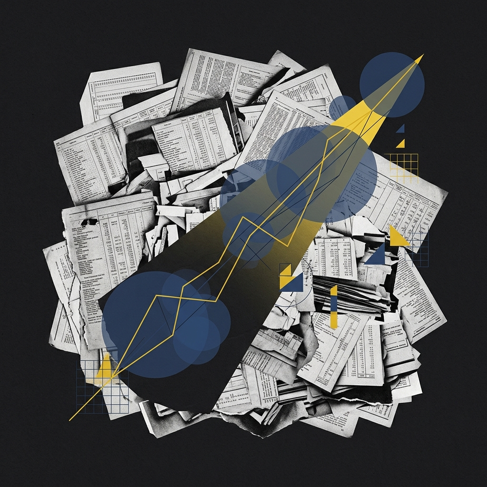
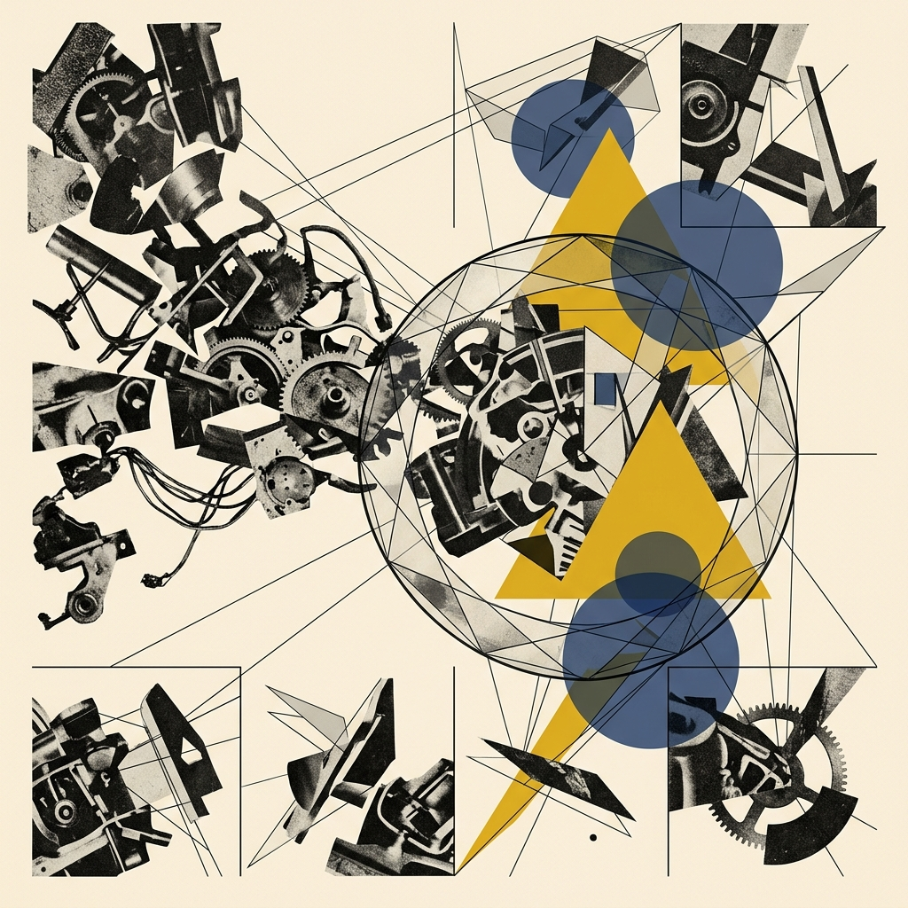
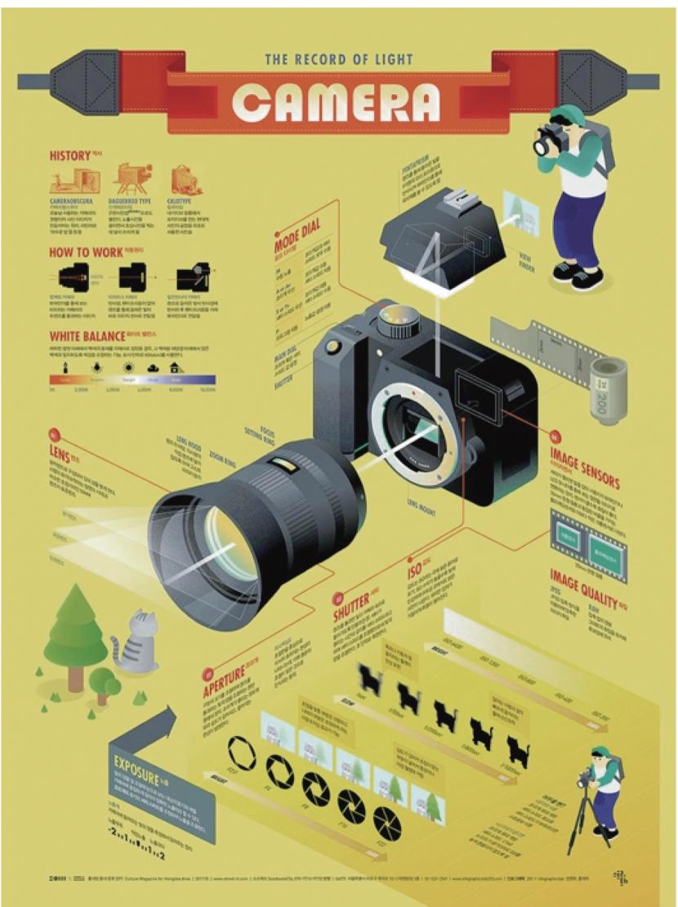
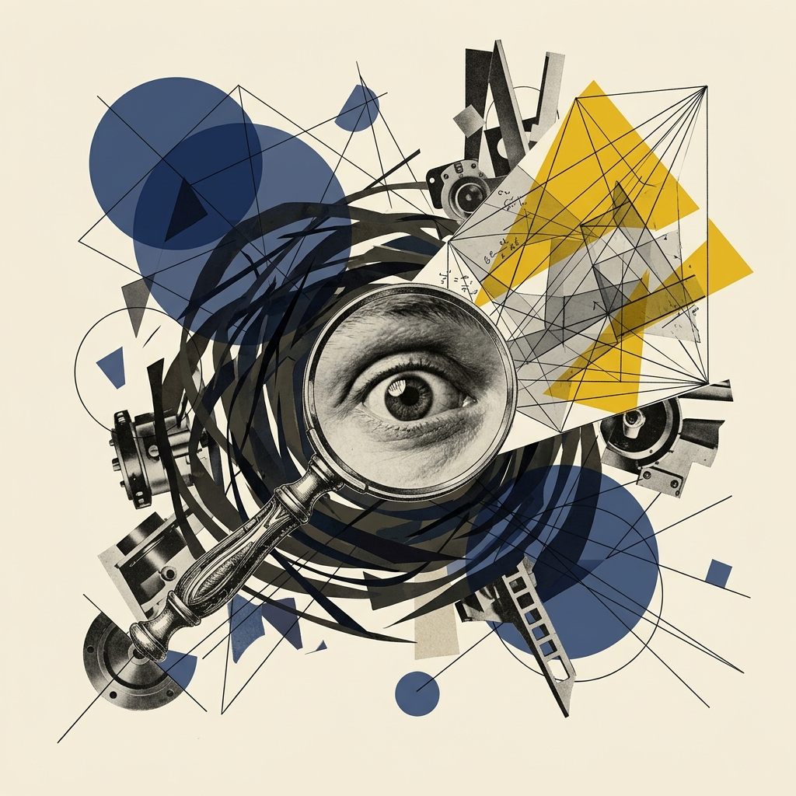

## Module 1: 破冰——我们为什么需要可视化？ (25 分钟)
<!-- BUDGET: 2700 chars | LECTURE: 15m | ACTIVITY: 10m | SLIDES: ≥5 | STATUS: done -->

> [VISUAL]
> *   **Slide**: `S01_Opening_Question`
> *   **Layout**: `Title`
> *   **Scene**: 深色背景，中心一个巨大的问号由发光粒子组成。问号旁边是一串快速闪过的数字矩阵，暗示数据的洪流。
> *   **Text**: "如果数据已经给出了答案，为什么还要画图？"
> *   **Asset**: 

我们为什么需要可视化？

这个问题听起来太简单了，对吧？"因为图表好看啊""因为领导喜欢看 PPT 啊"。不，这些都不是答案。信息可视化设计之所以是一门严肃的设计学科，而不仅仅是一种"美化数据"的装饰手段，是因为它解决的是一个非常深层的认知系统与本体论问题。

但在彻底回答“为什么需要画图”之前，我们必须先直切要害，回答一个极其硬核的前提追问：**究竟什么是“信息”？**

大家想一想，你每天看手机屏幕上滚动的股市大盘、Excel 里密密麻麻的月度营收总表。那些是信息吗？不！我国著名信息论专家**钟义信**教授曾一针见血地指出：“信息是不等于信号的”。那些堆砌在数据库里的杂乱原始记录，仅仅只是承载信息的“物理信号容器”，它们像一块块冷冰冰的散乱砖头，其本身毫无“意义架构”。

> [VISUAL]
> *   **Slide**: `S01a_What_Is_Information`
> *   **Layout**: `Cards`
> *   **Scene**: 在深色背景中，展现代表不同视角的三位学者的观点名片卡。背后的视觉是一条从“混沌代码与杂乱信号”凝聚收缩为“发光多面体规律结晶”的粒子流体动画，极其震撼地表现降熵过程。
> *   **Text**: "信息本体论：香农、谢卓夫与钟义信的跨界共识"
> *   **List**:
>     - "钟义信：信号 ≠ 信息。信号只是信息的承载者容器。"
>     - "谢卓夫：处理数据、赋予意义、转化为知识。"
>     - "克劳德·香农：信息是『对不确定性的消除量』。"
> *   **Asset**: 

那么，怎么才能把原始砖头变成坚固的房屋，把乱码信号变成有价值的信息？美国顶级用户体验大师**Nathan Shedroff（谢卓夫）**极其清晰地区分了“数据”、“信息”和“知识”这三个演进层级。他认为：信息是一定具有特定结构和条理的内容组合；而信息可视化设计师的核心魔力，就是在这片庞大数据信号的汪洋大海中，通过**有目的的梳理、过滤和视觉表征打磨**，让数据产生结构并暴露出规律，从而真正提纯出能够被人脑极速吸收的“知识与意义”。这就如同魔法点石成金。

> [VISUAL]
> *   **Slide**: `S01b_Infographic_Magic`
> *   **Layout**: `Split`
> *   **Scene**: 极其震撼的视觉对比。左侧铺满杂乱无章的数码相机电子元件物料单与几百行枯燥参数说明。右侧展示韩国著名设计师张圣焕的经典案例（对标郝亚维《信息可视化设计》第一章图1-3）：一张被精细解剖、零件极其优雅悬浮分离在空中的单反相机“爆炸式拆解图”。
> *   **Text**: "设计的魔力：化繁为简，瞬间击穿认知门槛"
> *   **Asset**: 

> [知识源: 郝亚维《信息可视化设计》第一章 图1-3 张圣焕单反相机信息图]

大家看屏幕右侧。这是韩国设计师**张圣焕**团队为单反相机绘制的“爆炸拆解图”。

如果让你去读几百页的纯文字说明书，也就是去阅读最基础的“物理信号集合”，绝大多数人都会立刻放弃。但这幅视觉图表，抹平了认知门槛。哪怕你对光学工程一无所知，只要扫一眼这张全景展开图。相机错综复杂的机械逻辑，光圈与感光元件的联动机制，就会顺着直观的视觉语言，瞬间在你脑海里组装成形。

这种跨越障碍的视觉表达，精确呼应了 1948 年，**克劳德·香农（Claude Shannon）**对信息论的底层定义。香农指出：**“信息，是对不确定性的消除量。”**

这句话，直指我们为什么要画图的核心。想象一下，当你面对多达十万行的年度销售明细表。你的大脑里充满了巨大的“不确定性”：今年到底是盈利还是亏损？哪怕一块业务是中流砥柱？哪个月份断崖式下跌？对着密密麻麻的数字，你其实一无所知。

但如果数据架构师，为你画出一张结构严密、红绿分明的可视化仪表盘。答案就会借由直观的图表，直接映射进你的视网膜。你心里的所有疑问和悬念，在看到画面的毫秒之间，彻底消融。

这就是香农指出的境界。在那一微秒里，庞大而混沌的不确定性，被瞬间清零。在这个认知豁然开朗的时刻，你终于在意识深处，真正“看到了信息”。

> [ACTIVITY]
> *   **Type**: `Blind Box / Ice-breaker`
> *   **Duration**: `10min`
> *   **Desc**: **数据盲点试验：极限盲盒刮刮乐**。
>     1. **盲盒派发**：大屏幕放出带二维码的腾讯文档链接（即 `Datasaurus_for_Tencent_Docs`），要求每组随便选一个底栏的“神秘盲盒”。
>     2. **计算验算**：让全班对 X(发稿量) 和 Y(粉丝转化率) 两列使用 `=AVERAGE()`。结果让大家惊奇发现：所有盲盒的均值结果绝对一致（都是 54.26 和 47.83），让学生确信业务表现一模一样。
>     3. **散点揭秘**：大家全选数据并一键插入散点图。屏幕上瞬间爆出恐龙、五角星、靶心等极端抽象符号，全场惊呼被骗。
>     4. **反转铺垫**：这不仅是一场恶作剧骗局，它是一次为你洗脑的极限大推演。

（教师走到台前，利用现场的惊呼声停顿）
经历了刚刚的盲盒刮刮乐体验，我想大家的认知已经被彻底震碎了。这就带来了一个非常令人头皮发麻的问题：为什么两列看上去完全没有异常、连电脑帮你算出的平均数都一模一样的“标准业务数据”，画出来之后，竟然是一头正对着你咆哮的恶龙，或者是一颗极其夸张的五角星？

> [STORY TIME: 这只恐龙是怎么诞生的？它有什么用？]
> [知识源: anscombe-quartet-show-data note]

有些同学肯定会问我：“老师，你逗我们玩呢？现实里的业务数据怎么可能变成一只恐龙？”
你们问得非常棒。现实里的数据绝对不会恰好排列成恐龙或者五角星。你们刚刚经历的，其实是数据分析界极其著名的一场“黑客极限压力测试”。

事情要回到 2016 年。当时信息可视化专家 Alberto Cairo 教授为了向学生证明“不画图就会被骗”，他极其煞费苦心地纯手工凑出了一组数据——这组数据在后台算出的均值公式完美无缺，但只要你一画成散点图，就会出现刚刚大家抽到的“一头霸王龙（Datasaurus）”。这在当时就已经让整个学术圈倒吸了一口冷气。

但更为疯狂的事情还在后面！Autodesk 公司的几位极客工程师看到了这只恐龙，他们提出了一个简直是丧心病狂的挑战：“如果我们写一段最高级的‘模拟退火算法’，用电脑强迫这只恐龙彻底变形！但我们同时在这个算法上套上枷锁——这堆数字无论怎么游动，它们的宏观统计指标绝对一丁点都不准变！最后会变出什么怪物？”
于是，经过极其漫长而残忍的百亿次黑盒碰撞，那头曾经的霸王龙，硬生生地被极限扭曲成了你们刚刚抽到的五角星、同心圆、交叉线……整整 13 组截然不同的、荒诞不经的图形！但是！只要你拿着这13份表格，去跑任何一个大数据分析软件，它们在小数点后两位的平均值、方差甚至皮尔逊相关系数，分毫不差，全都判定它们是“同一组数据”！

**这就是这场疯狂实验的致命隐喻。**
它是为了残酷地向世人敲响警钟：如果连一只这么庞大的恐龙，或者如此锋芒毕露的五角星！都能在简单粗暴的“平均数公式”的照妖镜下**完美死角隐形**，瞒天过海！那你凭什么觉得，现实中那些比恐龙还要狡猾、还要复杂的“真实商业雷区”，就能被几个轻飘飘的统计指标抓出来？

如果明天去实习，你的老板丢给你一份上百万行的真实 MCN 短视频业务报表。那里面实际上掩埋着极度撕裂的“两极分化”——一半是每天发烂梗但无人遇津的“零涨粉僵尸号”，另一半是不怎么发文但发一篇爆十万粉的“欧皇号”。在散点图上，这原本是一个极度痛苦的“十字断裂分布”。
但你却没有画图，你像个账房先生一样，自信地敲了一个 `AVERAGE` 平均数函数，电脑马上告诉你：“全公司平均日更 54 篇，涨粉 47%”。你瞬间觉得：哇，全公司处于完美的居中稳定态阵列。你得意地把这个极其平滑的、“粉饰太平”的假趋势汇报给老板。老板拍着大腿砸下重金倾其所有……结果呢？下个月业务全线断崖式雪崩。你连死都不知道是怎么死的！

> [VISUAL]
> *   **Slide**: `S02_Datasaurus_Dozen_Grid`
> *   **Layout**: `Split`
> *   **Scene**: 左侧展示刚才大家抽出来的 Datasaurus Dozen 终极怪物网格，右侧展示 1973 年统计学界祖师爷提出的“安斯库姆四重奏”(Anscombe's Quartet)。
> *   **Text**: "安斯库姆四重奏与恐龙变形记：唯有视觉，死击真相"
> *   **Asset**: 

大家看屏幕右侧，其实早在半个世纪前的 1973 年，伟大的统计学家安斯库姆，就已经用四张图形指出过这个足以毁灭华尔街的警钟。学界把它称为**“安斯库姆四重奏”(Anscombe's Quartet)**。到了今天大数据时代，它更是血淋淋地进化成了刚刚玩弄大家的超级怪兽。

什么是统计归纳？只要你求了平均数，求了方差，这就是一次**极其残忍的维度剥夺与有损压缩**。不管原先数据的肌理多么饱满，都被平均数这台暴力除法机器死死地拍成了一张纸。
如果刚刚那五家公司的运营生态真的是绝对健康、一分耕耘一分收获的。那你们在这个表格屏幕上刮出来的，本该是一簇极其漂亮、从左下角斜向右上角紧密收敛的对角线星云！只有在那种纯粹收敛的形态下，均值和相关系数才具备真正的公理价值。

> [VISUAL]
> *   **Slide**: `S05_Core_Principle`
> *   **Layout**: `Quote`
> *   **Scene**: 黑色背景上用大号白色衬线字体排列的一句话，庄重如碑文。
> *   **Text**: "\"永远先看图。\" (Always Graph the Data.)"
> *   **Asset**: 

所以，我们这门课的第一条铁律，同时也是整个可视化学科的奠基性公理，只有五个字：

**永远先看图。**

可视化的核心价值不是让数据"好看"，而是让人看到**模式、异常和关系**——这些是统计数字永远无法传达的。可视化存在的意义之一，是帮助你探索数据以发现那些你从来没有预料到的模式；意义之二，是在你使用了某个数学模型之后，帮助你评估这个模型是否真的拟合了数据的真实结构。

好的。那么既然我们已经达成了一个共识——数据必须被"看见"才能被理解——接下来的问题就更加深入了：为什么是用"看"的？人类那双眼睛到底有什么特殊的？为什么不是"听"数据，或者"摸"数据？我们的视觉系统，到底是一台什么样的机器？

---
