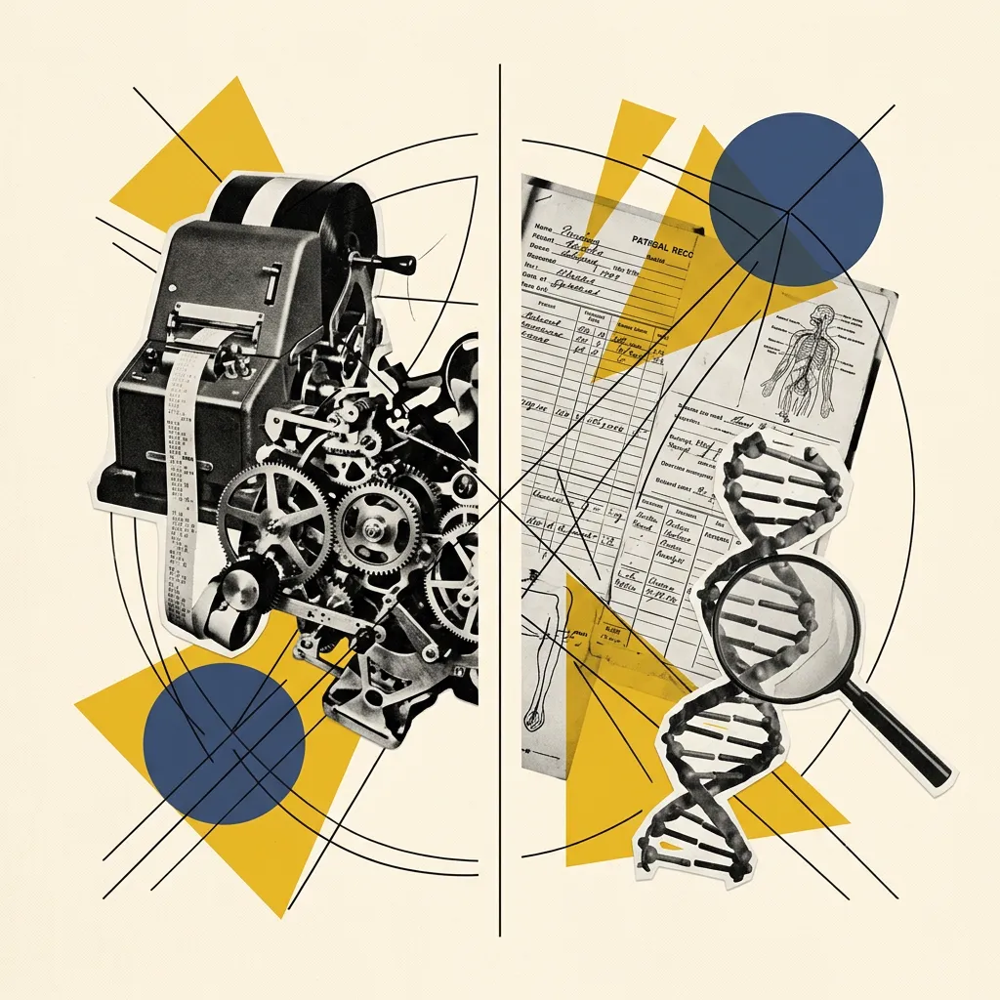
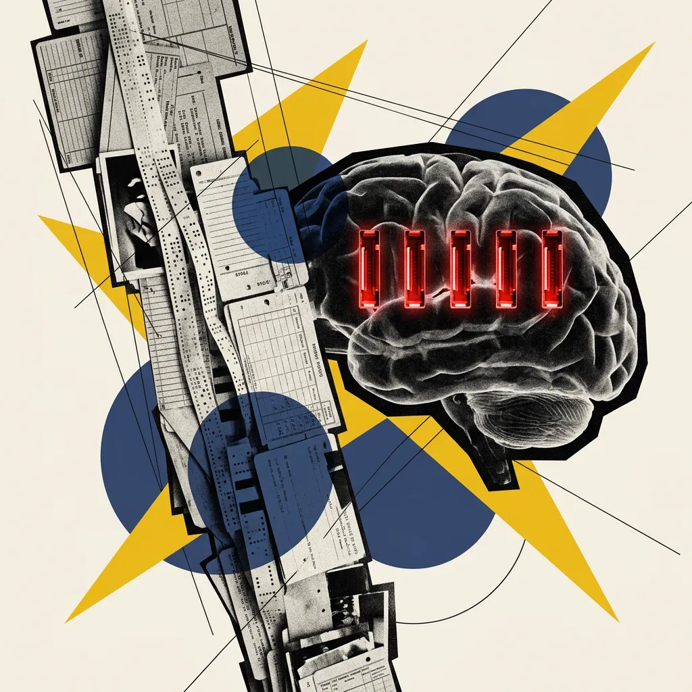
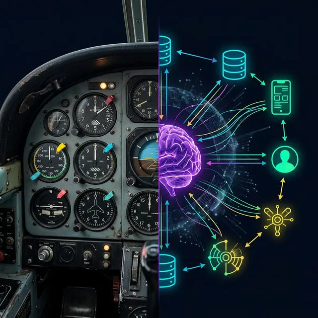
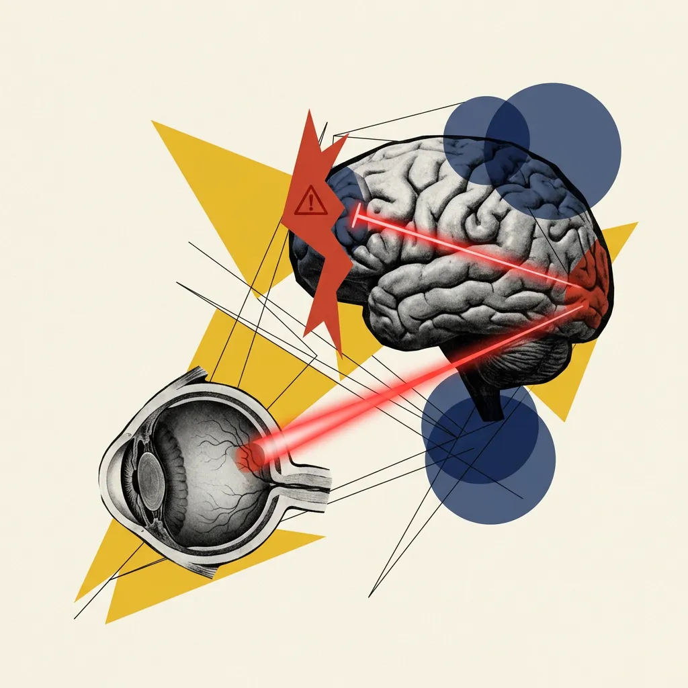
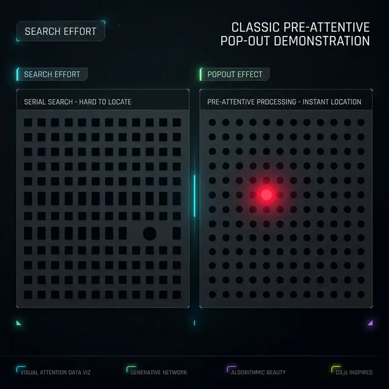
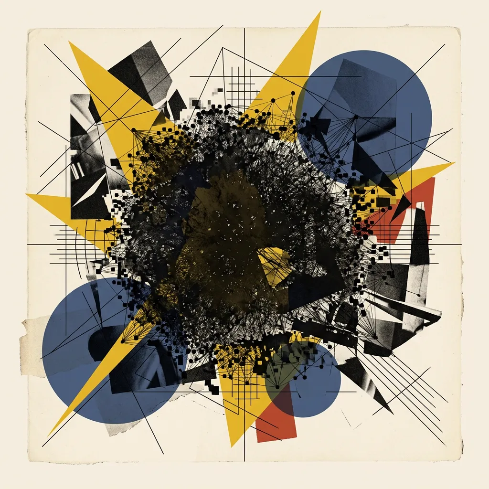

## Module 3: 视觉系统——你的认知外接显卡 (55 分钟)
<!-- BUDGET: 8100 chars | LECTURE: 45m | ACTIVITY: 10m | SLIDES: ≥15 | STATUS: done -->

### 3.1 第一追问：为何需要“人在回路”？

> [TEACHING MOMENT]
> 本模块是本周的理论核心。通过 Munzner Ch1 的四大追问（为何需要人在回路？为何用外部表征？为何依赖视觉？资源限制有哪些？），引导学生理解可视化不是美化手段，而是认知放大器。辅以郝亚维的"思维可视化"视角，构建完整的理论框架。

> [VISUAL]
> *   **Slide**: `S06_HumanInLoop_Title`
> *   **Layout**: `Center`
> *   **Scene**: 深色背景，中央是一个巨大的循环图标：人脑 → 眼睛 → 数据 → 电脑 → 人脑。代表"人在回路"的核心概念。图标周围有微弱的粒子光线流动。
> *   **Text**: "第一个问题：为什么计算机不能替代你？"
> *   **Asset**: 

我们已经确立了一个根基结论——数据必须被看见。但随之而来的问题是：在人工智能和大语言模型如此强大的今天，为什么还需要人类去"看"数据？让机器自动分析不就好了吗？

这是进入可视化底层原理前必须回答的灵魂拷问。先看一个**高频交易**的场景。

> [VISUAL]
> *   **Slide**: `S06b_High_Frequency_Trading`
> *   **Layout**: `Full`
> *   **Scene**: 密密麻麻的服务器机房，闪烁的绿色灯光，代表高频交易的毫秒级决策。没有任何人为干预的系统。
> *   **Text**: "毫秒级自动化交易：算法唯一称王的极速领域"
> *   **Caption**: "毫秒级的确定性反馈：自动化唯一称王的领域"
> *   **Asset**: 

全球的股票市场上存在大量高频交易系统。它们每秒钟能做出数百万次交易决策，没有任何人类参与。因为人类的反应速度太慢了。在这种**规则清晰、反应速度要求极高**的场景下，可视化毫无用武之地。
> [ACTIVITY]
> *   **Type**: `QA`
> *   **Duration**: `1min`
> *   **Desc**: **场景思辨**：向学生抛出问题："如果系统本身已经完美实现了自动化，强制让人类看图表反而会带来什么副作用？"引导理解"人"作为系统瓶颈的理论。

**第二种场景：毫无头绪的探索性任务。**
Munzner 教授提出：当你面对一个连问题本身都没定义清楚的任务——比如"为什么上个月 App 留存率暴跌了？"——传统的 If-Then 程序就瘫痪了。学术上管这叫**病态定义的问题 (ill-specified problems)**，说白了就是：你甚至不知道该从哪里问起。

> [TEACHING MOMENT]
> **AI 时代的"人在回路 2.0"**
> 引导学生思考：大模型能帮你在迷雾中探路，但谁来审查 AI 探出的路是真路还是幻觉？

今天你可能会想：直接把问卷喂给大模型，让它自动出报告不就好了？确实，AI 能在几秒内生成几百个分析假设。但问题是——AI 会产生**幻觉**，有可能一本正经地给你一个完全捏造的结论。面对牵涉千万资金的商业决策，你敢不看一眼底层数据的分布，就全盘照搬 AI 吐出的结论吗？

> [VISUAL]
> *   **Slide**: `S07_IllSpecified_Problems`
> *   **Layout**: `Split`
> *   **RenderMode**: `pedagogical`
> *   **Scene**: 具象实体的对比。左半边：老式的股票自动打字机（Stock ticker tape machine）或整齐运转的齿轮组，代表前 AI 时代规则清晰的高频自动化。右半边：一堆杂乱无章的医学检验单和复杂的 DNA 模型，搭配一把寻找线索的放大镜，代表病态定义的探索性任务。
> *   **Text**: "定义清晰的问题 → 自动化 ｜ 病态定义的问题 → 人在回路 2.0"
> *   **Asset**: 

所以在 AI 时代，**"人在回路"不但没过时，反而升级了**：AI 负责在迷雾中高速探路，而你通过可视化，担当不可替代的**最终审判者**——验证 AI 的结论有没有幻觉、有没有遗漏。这就是**"人在回路 2.0"**。

> [VISUAL]
> *   **Slide**: `S07a_Variant_View_Example`
> *   **Layout**: `Screenshot`
> *   **RenderMode**: `real_asset`
> *   **Scene**: 【真实截图素材，禁止 AI 生成】Munzner 提到的生物学 Variant View 软件真实截图（或学术界真实的基因序列数据热力图/矩阵图），展示极为密集、维度庞大的突变矩阵。
> *   **Text**: "对抗无限维度组合：人类视觉作为探照灯"
> *   **Caption**: "用双眼对抗无限维度的矩阵组合"
> *   **Asset**: 

让我们看 Munzner 在教材中举的真实案例：生物学基因分析软件 Variant View。
面对包含数以百万计基因突变的 Excel 数据表时，即使是顶尖生物学家也无从下手——因为这属于**“探索性任务”**。科学家甚至不知道该寻找什么样的特定规律，自然也无法写出明确的规则或代码让计算机去自动寻找。
但 Variant View 改变了这一切：它将枯燥的数字矩阵变成了有色彩规律的视觉图谱。这时，人类展现出了目前机器无法比拟的优势——**直觉与基于经验的模式识别**。生物学家只需扫一眼图谱，就能凭借人类独有的专业经验，瞬间捕捉到异常的视觉色块，从而提出新的科学假设。
这正是**“人在回路”（Human in the loop）**的核心意义：计算机负责处理海量数据并画出图形，而人类则充当不可替代的**“最终解释器”**和**“探险家”**。可视化在此过程中，就是放大人类洞察力的**认知放大器**。

### 3.2 第二追问：为何依赖“外部表征”（认知卸载）？

> [VISUAL]
> *   **Slide**: `S08_External_Representation`
> *   **Layout**: `Comparison`
> *   **Scene**: 左侧半边是一个人苦思冥想，脑袋里冒出一团乱麻般的几千个长串数字，额头冒汗——代表"内部认知的超载"。右侧半边是同一个人面对一张清晰的热力图，眼前的乱麻变成了色彩浓重不同区块的直观映射——代表"外部表征的卸载效应"。
> *   **Text**: "外部表征 = 认知外包：把大脑的工作卸载给眼睛"
> *   **List**: 
    - "内部认知超载：大脑短期工作记忆区容量极小"
    - "外部表征卸载：将算力要求转化为直观图形判断"
> *   **Asset**: 

搞清了“人必须参与”后，第二个问题来了：为什么非要把数据画成图呢？用心算或看电子表格不行吗？不行。因为**人类大脑的工作记忆极其有限**。

Munzner 引用了认知科学支柱概念——**外部表征 (External Representation)**。它能有效增强人类能力，跨越生理局限。

> [VISUAL]
> *   **Slide**: `S08a_Millers_Law_RAM`
> *   **Layout**: `Split`
> *   **Scene**: 一张视觉对比图。左侧是一排无穷无尽向下拉伸的数据条列流（Data Stream）；右侧则是一张人类大脑的X光透视图或电路化内存芯片，但上面唯独只有 4 到 7 个红色的亮起“插槽”。
> *   **Text**: "米勒定律 (Miller's Law) 的极限：大脑内存只有 7±2 个插槽"
> *   **Asset**: 

根据米勒定律，人类的短期工作记忆（就像大脑的内存）非常有限，通常只能同时处理 **7±2 个“信息组块”**。面对几万条密密麻麻的营收数字，大脑会瞬间过载。

把你那几百万条数据画成图表，本质上就是给大脑插了一张**外接图形显卡**。这张显卡做的事情，恰恰完美契合了米勒的组块理论：它把海量的零碎数据点，打包压缩成了仅仅几个“视觉组块”——比如 3 块代表亏损的红色区域，2 条代表增长的绿色趋势线。

通过可视化，原本天文数字般的信息量，被精准压缩成了符合大脑 7±2 个插槽容量的直观色块。这就实现了**“认知卸载 (Cognitive Offloading)”**——把繁重的死记硬背任务，完美卸载到了高带宽的视觉直觉上。

> [PHILOSOPHY: 飞行员的彩色小塑料片]
> 用一个具象的航空故事深化认知卸载的概念。

> [VISUAL]
> *   **Slide**: `S08b_Cognitive_Offloading_Cockpit`
> *   **Layout**: `Split`
> *   **Scene**: 左侧照片展示上世纪老式飞机驾驶舱里的 Speed Bugs（速度游标，一种可以卡在物理仪表边缘的彩色小塑料片）。右侧文字解释分布式认知的概念。
> *   **Text**: "你的周围也是你大脑的一部分"
> *   **Asset**: 

飞行员在降落时需要记住十几个关键速度值，错一个就可能出事故。但他们不靠死记硬背——他们会把彩色的小塑料片 (Speed Bugs) 卡在仪表盘刻度上，看一眼位置就能决策。认知科学家 Hutchins 把这种"让环境替你记事"的策略叫做**分布式认知**。
一张优秀的数据图表，就是你的"彩色游标"——把记忆负担转化为极低成本的直觉判断。

### 3.3 第三追问：为何独宠“视觉通道”？（前注意机制）

> [VISUAL]
> *   **Slide**: `S09_Vision_vs_Sound`
> *   **Layout**: `Comparison`
> *   **Scene**: 左列标题"视觉感知"，展示一个包含几千个灰色圆点的散点图，其中一个荧光色的红点瞬间弹出——配注"并行处理通路 | 高带宽并行 | 前注意瞬间感知"。右列标题"其他感官 (如听觉)"，展示一个心电图节奏音效在时间轴上依次流过——配注"单线序列处理 | 低信息吞吐率 | 需要耗时等待"。
> *   **Text**: "视觉 = 高并发通道 ｜ 听觉 = 序列排队通道"
> *   **List**: 
    - "视觉并行：高带宽并发处理多点同步数据"
    - "其他感官：单线序列，受限于时间流逝"
> *   **Asset**: 

第三个问题：既然要做外部表征，为何我们只选“看”，不选“听”或“摸”？
因为五大感官中，只有视觉是**高并发的并行通道**。听觉必须随着时间单线排序流逝。这就是 Munzner 的回答：人类视觉系统连接着最高带宽的信息总线。

这引申出了核心原理：**前注意处理 (Pre-attentive Processing)**。

> [VISUAL]
> *   **Slide**: `S09a_Visual_Pathway_V1`
> *   **Layout**: `Full`
> *   **Scene**: 一张具有赛博解剖学风格的人类眼球到大脑神经通路解析图。一条红色的高速高亮轨迹代表光信号由视网膜（Retina）向初级视觉皮层（V1）传输的路径，而在它尚未到达处理理性认知的前额叶（Prefrontal Cortex）之前，就被一道写着 "200ms" 的红色闸门瞬间截断，弹出“警报（Pop-out）”标识。
> *   **Text**: "200毫秒的生理特权：前注意处理 (Pre-attentive Processing)"
> *   **Asset**: 

在你产生主观理性意识之前（约前 200 毫秒内），视觉数据就在向大脑传导的半路上被底层防线排查完毕了。它的目的就是在迷雾中瞬间定位突出的异类。

> [VISUAL]
> *   **Slide**: `S09b_Pre_attentive_Processing`
> *   **Layout**: `Full`
> *   **Scene**: 演示著名的弹出效应：左半部分是满屏细密的灰点中找一个浅灰色方块（代表极度耗能的扫描）；右半部分是一束刺眼的主角聚光灯，瞬间打在极暗场景中的一个高亮红色警示圆点上，仿佛警报拉响。
> *   **Text**: "视觉弹出效应 (Pop-out)：突破掩护的瞬间警报"
> *   **Caption**: "无意识的瞬间警报效应"
> *   **Asset**: 

这带来了**视觉弹出 (Pop-out)** 效应。在一片灰点中放一个红点，你无需逐个扫描，它会瞬间跳进视野。无论背景有多少干扰，耗费的时间都一样。

> [ACTIVITY]
> *   **Type**: `Quiz`
> *   **Duration**: `1min`
> *   **Desc**: **视觉快测：寻找孤立目标**
>     现场在大屏幕上闪现一组包含数十个红色圆圈与单蓝方块的图片，让学生举手测试找出蓝方块的时间，亲证波普效应。

经过发展，数据可视化总结了四大前注意物理通道开关，也就是我们的设计抓手：

> [VISUAL]
> *   **Slide**: `S09c_Pre_attentive_Channels_Full`
> *   **Layout**: `Grid`
> *   **Scene**: 一个严谨清晰的田字格四象限分类...
> *   **Text**: "前注意通道的四大阵营"
> *   **List**: 
    - "色彩维：色相与饱和度的强反差"
    - "形态维：尺寸突变、方向逆折与形状变异"
    - "空间维：脱离阵列规律的位置越界"
    - "动态维：本能级的高优先级跳帧预警"
> *   **Asset**: 

**1. 色彩阵营**：利用刺眼的色相或饱和度反差。红色这种颜色在进化中与火灾和果实挂钩，能秒抓眼球。不要把它滥用在装饰上。
**2. 形态阵营**：尺寸突变（极大的加粗字）、方向逆折（平行线里斜插的线段）以及边界破裂的形状变异。
**3. 空间阵营**：脱离原有二维阵列群落的异物（漂移的残点），引发位置越界感。
**4. 动态阵营**：带有绝对防备级的闪烁。这是丛林生存的底线本能，一旦闪动，必然吸引余光，应克制使用。

> [ACTIVITY]
> *   **Type**: `Practice`
> *   **Duration**: `10min`
> *   **Desc**: **视觉带宽极限测试：前注意通道唤醒**。
>     1. **Phase 1 寻找数字3**：先展示纯数字矩阵（10秒限时）经历串行检索；同矩阵中的"3"被加上红色（1秒秒懂），直指 Pop-out 效应。
>     2. **Phase 2 干扰抗压测试**：展示不同阵营的前注意弹出（色彩、形状、方向）。
>     3. **Phase 3 联合搜索崩塌**：展示颜色+形状双重维度弹出彻底失效，引出天规：永远不要让两个前注意通道在同一图表中无谓地打架。

### 3.4 第四追问：设计面临的三大物理极限

> [WARNING: 资源的铁墙：计算、人类与显示的极限]
> 切入反面论据。视觉带宽虽大，但可视化系统面临三大物理与生理墙壁。

> [VISUAL]
> *   **Slide**: `S10_Resource_Limitations`
> *   **Layout**: `Grid`
> *   **Scene**: 三张并列卡片，分别画着冒烟的 CPU、闪烁的大脑内存、密集的像素团。
> *   **Text**: "可视化设计的三大资源极限"
> *   **List**: 
    - "计算极限：超量重绘引发前端锁死"
    - "记忆极限：短时记忆被变化盲视抹除"
    - "像素极限：有限屏幕导致的视觉混叠"
> *   **Asset**: 

视觉虽强，但任何极致系统都有代价。Munzner 警告我们：所有图表系统都被**三大资源极限**所制约。

**第一，计算极限**。当你试图交互式渲染拥有千万级节点的关系网时，如果系统每次重绘卡顿数分钟，图表就废了。即使理论再优美，超出机器的前端硬件极限，也只能沦为不可用的废品。

**第二，记忆极限与变化盲视**。我们的视觉并行能力强，但**短期工作记忆容量极小**。

> [VISUAL]
> *   **Slide**: `S10b_Change_Blindness`
> *   **Layout**: `Video`
> *   **Scene**: 播放著名的变化盲视（Change Blindness）闪烁范式经典视频（Flicker Task，即闪烁飞机的实验），展示即使发生了巨大的变化，由于中间的短暂白屏打断，人类视觉也可能完全无法察觉。
> *   **Text**: "变化盲视 (Change Blindness)：易碎的短时视觉缓存"
> *   **Asset**: 
> *   **Asset (AI fallback)**: 
> **Source**: YouTube / "change blindness, the flicker task, & sensory memory - ok science"
> **Duration**: 11m16s
> **TimeCategory**: In-class Demonstration

心理学上有个残酷的现象叫**变化盲视 (Change Blindness)**。在两张图片间仅插入 80 毫秒的白屏，删掉一栋楼，你大概率也无法察觉。因为你的短期缓存被重置了。

> [VISUAL]
> *   **Slide**: `S10c_Invisible_Gorilla`
> *   **Layout**: `Video`
> *   **Scene**: 播放著名的《隐形大猩猩》选择性注意测试实验录像片段。
> *   **Text**: "“隐形大猩猩”实验 (Selective Attention Test)"
> *   **Asset**: 
> **Source**: YouTube / Bilibili "Invisible Gorilla Test"
> **Duration**: 1m31s
> **TimeCategory**: In-class Demonstration

> [STORY TIME: 众目睽睽之下的"隐形大猩猩"]
> 1999 年 Daniel Simons 的**隐形大猩猩实验**证明了选择性注意的屏蔽效应。当被试全神贯注数传球次数时，超过一半的人根本没看见从画面中央走过的大猩猩。

连画面正中央的大猩猩都能视而不见——我们的注意力资源远比想象中脆弱。再加上前面说的变化盲视（一个白屏就能抹掉视觉记忆），结论只有一个：**不要跨页挑战用户对比数据的能力！**

> [VISUAL]
> *   **Slide**: `S10d_Memory_Limit_UI`
> *   **Layout**: `Comparison`
> *   **Scene**: 左侧是对翻页式比对的恶感——用户需要凭记忆看前面的报表；右侧是现代 Dashboard 交互，把关键差值用悬停窗悬浮在同一页。
> *   **Text**: "信息密度困境：不要挑战用户的记性"
> *   **List**: 
    - "翻页灾难：跨越分页必然丢失记忆对照"
    - "同域交互：用同界面悬浮补全对比"
> *   **Asset**: 

好的数据产品会把比对要素压缩在同屏里，用优雅的补间动画规避变化盲视风险。

**第三，像素极限**。

> [VISUAL]
> *   **Slide**: `S10c_Hairball_Clutter`
> *   **Layout**: `Full`
> *   **Scene**: 数据可视化界的经典负面案例——臭名昭著的错综 "Hairball Graph"（毛线球网络图）。将高达数十万个数据图节点稠密地渲染交叠在一起，大屏的中央只有漆黑犹如泥浆般不可读的重叠废墟，连外廓都由于互相压制而溢出毛边碎像素锯齿。
> *   **Text**: "毛线球图 (Hairball Clutter)：毫无节制的全景堆叠"
> *   **Asset**: 

当你试图在一个 4K 屏幕里塞进十万个节点时，图形必定互相堆叠，沦为不可辨认的混乱——业内称为 **毛线球图 (Hairball)**。当像素无法承载时，必须转而使用局部过滤、聚合或下钻（Drill-down）交互。

> [ACTIVITY]
> *   **Type**: `QA`
> *   **Duration**: `1min`
> *   **Desc**: **理解短检测**
>     向学生快速提问：“展示今日与昨日报表数据时，做成PPT翻页与同屏半透明悬停窗，哪个更容易让人丢失视觉对照物？原因是什么？”验证学生是否掌控了“防变化盲视”原则。

### 3.5 本土视角：三大升维特征（快速总览）

前面的四大追问解答了生理层面的"为什么"——可视化为何有效。但可视化不仅是认知科学，更是一门设计艺术。本土教材《信息可视化设计》（郝亚维教授主编）从设计学角度给出了三个补充维度。

> [VISUAL]
> *   **Slide**: `S11_Three_Features`
> *   **Layout**: `Split`
> *   **Scene**: 简洁、宏大的排版版面。基于《信息可视化设计》原书图1-16的核心学术框架谱系，重绘画布以展示信息可视化设计的三大特征。
> *   **Text**: "郝亚维教授的本土视角：三大特征"
> *   **List**:
    - "思维可视化：隐性心智的具象蓝图"
    - "无障碍化：跨越认知的通用语言"
    - "多维感知体验化：从屏幕走向物理沉浸"
> *   **Asset**: 

**思维可视化**——不仅描摹外部数据，更能把大脑里隐形的思维逻辑"逆向工程"出来。回忆一下南丁格尔：她用一张玫瑰图把"士兵死于感染而非战斗"这个隐性洞察变成了肉眼可见的铁证，推动了医疗改革。

> [VISUAL]
> *   **Slide**: `S11a_Thinking_Visualization`
> *   **Layout**: `Full`
> *   **Scene**: 展现信息可视化设计作品《人是如何诞生的》（参照郝亚维图1-18），或者展现震撼的脑神经逻辑结构图《心智的结构》（参照郝亚维图1-4）。
> *   **Text**: "思维显性化重构"
> *   **Asset**: 

**无障碍化**——优良的图形是通用语言。一套高素质的看板，应该让色弱用户也能通过面积和纹理读懂信息，而不是只靠红绿色区分。

**多维感知体验化**——可视化已经突破了二维屏幕，从 AR/VR 沉浸空间到 3D 打印数据实体，让视觉输入升维成全感官的物理体验。

> [VISUAL]
> *   **Slide**: `S11c_Multidimensional_Perception`
> *   **Layout**: `Split`
> *   **Scene**: 左半边展示运用 VR 或全息技术呈现的数据沉浸空间（精细对标郝亚维图1-21）。右侧展示可触摸的数据实体艺术品（3D 打印冰山消融模型）。
> *   **Text**: "多维数据实境再现"
> *   **Asset**: 

> [PHILOSOPHY: 从数据机器到数据人文主义]
> 信息不仅是 KPI 看板，它也可以是手账、日记和散发人类温度的散文。

> [VISUAL]
> *   **Slide**: `S11c_Dear_Data_Project`
> *   **Layout**: `Full`
> *   **Scene**: Giorgia Lupi 的《Dear Data》动画短片片段：展示两位信息设计师如何用手绘图形在明信片上记录生活。
> *   **Source**: Video — YouTube: Big Bang Data: Dear Data
> *   **Duration**: `3m18s`
> *   **TimeCategory**: activity
> *   **Asset**: 

最后，让我们来看一段关于**《Dear Data》**项目的动画短片。数据艺术家 Giorgia Lupi 和好友拒绝了冰冷的数字工具，在长达一年的时间里，她们每周用纯手工绘制的图形在明信片上记录私密的生活情绪，并跨越大西洋寄给彼此。

这段影像完美诠释了“数据人文主义 (Data Humanism)”——数据从来都不是客观冷漠的数字残留，它是生命体验的切片。真正伟大的可视化设计师，懂得如何用图形去捕捉数据背后的人类体温。

> [VISUAL]
> *   **Slide**: `S12_Module2_Summary`
> *   **Layout**: `Comparison`
> *   **Scene**: 深色背景下的大型结语版面。左面蓝色勾勒成功法则；右面红色框线总结极限与天花板。
> *   **Text**: "系统重装完毕：可视化 = 认知扩展卡"
> *   **List**:
    - "✅ 全力利用：前注意机制 + 认知卸载"
    - "⚠️ 保持敬畏：控制物理与短时记忆极限"
> *   **Asset**: 

好了，我们在这个模块探究了核心骨架：为了发挥人类探究未知的直觉，我们需要让**“人在回路”**；为了缓解内存超载，我们用外部表征进行**“认知卸载”**；为了最大化带宽，我们调用了并行无意识的**“视觉前注意机制”**；同时，我们也必须对屏幕与人脑的**“资源与记忆极限”**保持敬畏。

理解了这些生理和心理基石，下一节，我们将探索大脑是如何把零散特征拼凑成整体的。
