## Module 2: 视觉系统——你的认知外接显卡 (55 分钟)
<!-- BUDGET: 8100 chars | LECTURE: 45m | ACTIVITY: 10m | SLIDES: ≥15 | STATUS: done -->

> [TEACHING MOMENT]
> 本模块是本周的理论核心。通过 Munzner Ch1 的四大追问（为何需要人在回路？为何用外部表征？为何依赖视觉？资源限制有哪些？），引导学生理解可视化不是美化手段，而是认知放大器。辅以郝亚维的"思维可视化"视角、波音/Therac-25的灾难案例，构建完整的正/反面理论框架。

> [VISUAL]
> *   **Slide**: `S06_HumanInLoop_Title`
> *   **Layout**: `Title`
> *   **Scene**: 深色背景，中央是一个巨大的循环图标：人脑 → 眼睛 → 数据 → 电脑 → 人脑。代表"人在回路"的核心概念。图标周围有微弱的粒子光线流动。
> *   **Text**: "第一个问题：为什么计算机不能替代你？"
> *   **Asset**: 

好的，到此为止我们已经确立了一个根基性的结论——数据必须被看见。但紧接着一个更加深入的问题就浮出了水面：既然现在人工智能都这么厉害了，大语言模型都能写代码写论文了，那为什么我们还需要人类去"看"数据呢？让机器自动分析不就好了吗？

这是一个绝好的问题，也是我们在进入可视化底层原理前必须回答的灵魂拷问。我来给大家讲一个来自金融界的真实场景。

> [VISUAL]
> *   **Slide**: `S06b_High_Frequency_Trading`
> *   **Layout**: `Image`
> *   **Scene**: 密密麻麻的服务器机房，闪烁的绿色灯光，代表高频交易的毫秒级决策。没有任何人为干预的系统。
> *   **Caption**: "毫秒级的确定性反馈：自动化唯一称王的领域"
> *   **Asset**: 

现在全球的股票市场上，有大量的高频交易系统。这些系统由极其复杂的数学模型和算法驱动，每秒钟能对数百万只股票做出买入或卖出的决策。当股价触及某个预设的毫秒级阈值，系统自动下单。整个过程中，没有任何人类参与决策。为什么？因为人类的反应速度太慢了。我们的神经传导速度和硅基芯片比起来就是原始社会。即便我给你一个全息的、超级炫酷的可视化大屏，你也不可能在几毫秒内对一百万只股票做出判断。

所以，在这种规则极端清晰、反应速度要求极高的场景下，数据可视化工具完全没有用武之地的。

但是，请注意这个巨大的"但是"——当我们退后一步，去看更宏观、更模糊的问题时，情况就发生了两极反转。比如说，当数据科学家需要决定**使用哪一种交易算法**，或者需要**评估一个机器学习模型在过去的三个月中是否发生了严重的规律衰退**时，你敢在完全不看任何图表分布的情况下，仅仅依靠系统给出的一个“通过”信号，就把几千万美元的资金池交给它吗？绝不敢。

> [VISUAL]
> *   **Slide**: `S07_IllSpecified_Problems`
> *   **Layout**: `Split`
> *   **Scene**: 左半边展示一个清晰的问题：股价预警阈值判断——以简洁的流程图表示，箭头从"数据"直接指向"自动决策"，人脑图标打了叉。右半边展示一个模糊的问题：癌症基因变异的影响评估——以胶着的问号云团表示，箭头从"数据"经过"人脑"的放大镜再指向"假设"和"发现"。
> *   **Text**: "定义清晰的问题 → 自动化 ｜ 病态定义的问题 → 人在回路 (Human in the loop)"
> *   **Asset**: 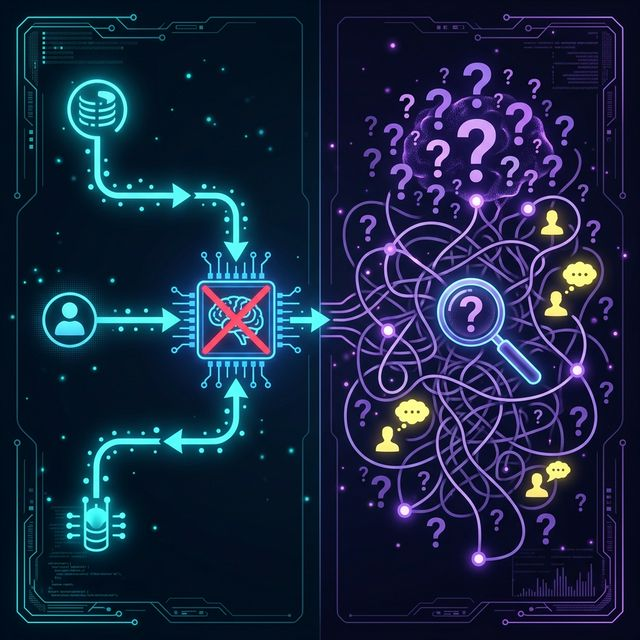

Munzner 教授在她的教科书里提出了一个非常精辟而且影响深远的概念，她把它叫做**"病态定义的问题" ill-specified problems**。

这种问题的特点是什么？它的特点是：人们在开始探索数据之前，甚至不知道自己应该问什么问题。他们面对的是几十万个可能的维度，但完全不知道哪条路是对的。大家看屏幕左侧，如果条件明确，数据可以直接流向自动化决策。但请看右侧，那团胶着的问号云团代表了未知，数据必须经过人脑这把极具创造力的“放大镜”，才能生成有价值的新假设和新发现。在这个不断试错和迭代的过滤过程中，各种机器学习模型和自动化算法仅仅只负责高效地呈现出海量数据的客观复杂状态，而唯有人类专家那独有的行业先验经验、敏锐直觉，以及对实际商业场景的深刻逻辑理解，才是最终能够彻底拨开这团庞大的模糊问题迷雾、并精准斩获出最终商业真理的那股最不可或缺的决定性核心力量。

> [VISUAL]
> *   **Slide**: `S07a_Variant_View_Example`
> *   **Layout**: `Screenshot`
> *   **Scene**: Munzner 提到的生物学 Variant View 软件截图（或相似的基因序列数据图表），展示大量排列组合下的突变情况。
> *   **Caption**: "用双眼对抗无限维度的矩阵组合"
> *   **Asset**: 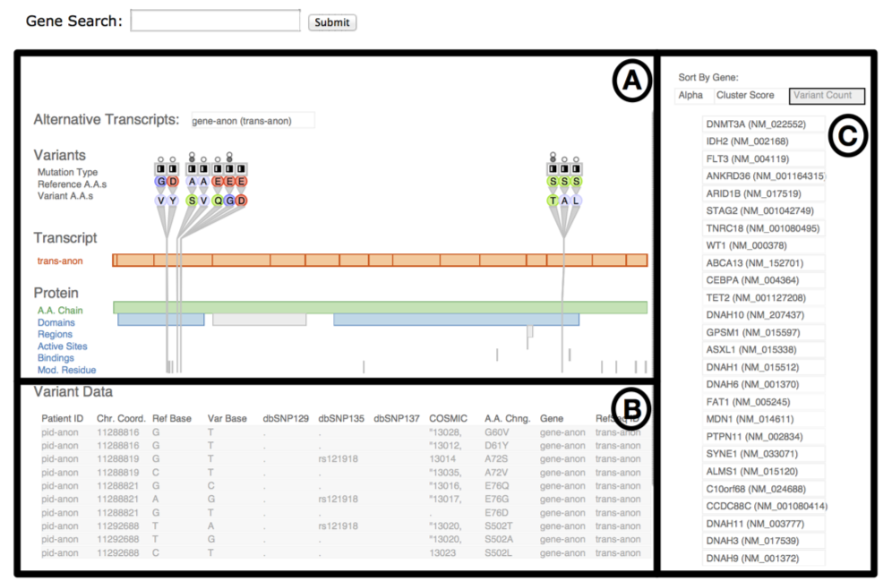

她在书中展示过一个生物学领域的可视化工具，叫做 Variant View。这个工具帮助顶级的生物学家研究 DNA 序列变异与特定疾病类型的关系。你们要明白，这些科学家在日常工作中已经大量依赖超级计算机的自动验算了，但“癌症基因组研究”这件事——至少在当前和可预见的未来内——根本不可能完全自动化。研究者需要不断地在海量数据中生成新的假设、检验旧的假设、甚至去发现那些连他们自己都完全没有意料到的异常规律。

这些事只有人类的眼睛加上充满直觉的碳基大脑才能做到。因此，**可视化存在的第一层价值，就是在问题本身尚未被清晰定义的时候，充当人类探索未知的感官放大器。这就是我们常说的“人在回路”（Human in the loop）。**

> [CASE STUDY: 波音 737 MAX 的隐藏模型灾难]
> 探讨如果不做“认知外显”并将人类完全踢出回路，在复杂系统中会导致怎样致命的后果。

> [VISUAL]
> *   **Slide**: `S07b_Limits_Of_Automation`
> *   **Layout**: `Image`
> *   **Scene**: 新闻纪实图片，并列展示埃塞俄比亚航空与狮航的空难残骸，以及波音 737 MAX 的驾驶舱仪表盘（特写 MCAS 系统并未给出的警告灯）。
> *   **Caption**: "当自动化剥夺了人类的知情权：波音 737 MAX 与 MCAS 灾难"
> *   **Asset**: 

为了深刻理解“人在回路”中“人”必须能够看见系统状态的重要性，我想给大家引入一个非常惨痛的跨学科案例：这是工业设计史和系统工程史上最黑暗的章节之一——波音 737 MAX 客机坠毁事件。

2018年和2019年，两架全满载的波音 737 MAX 客机在起飞后不久相继坠毁，总共导致 346 人丧生。事后的调查震惊了全球。导致这两场空难的罪魁祸首，并不是引擎爆炸或机翼折断，而是一个隐蔽的软件系统，叫做 MCAS（机动特性增强系统）。

波音在设计这架飞机时，为了弥补新发动机带来的空气动力学缺陷，悄悄在后台加入了一段算法。一旦系统判定飞机机头仰角过高，MCAS 就会自动接管，强行把机头往下压。

这听起来像是一个很聪明的自动化系统，对吧？代替人类做决定，防止飞机失速。但最致命的设计失误在于：**波音向飞行员隐瞒了这个系统的存在。**

> [VISUAL]
> *   **Slide**: `S07c_Mental_Model_Deception`
> *   **Layout**: `Comparison`
> *   **Scene**: 交互设计大师 Alan Cooper 的三层模型解析。左列显示“工程模型”（MCAS自动压低机头）。右列显示“用户心智模型”（飞行员以为这是一架普通的没有隐藏后门的737客机）。中间显示被切断的“表现模型”（仪表盘上根本没有 MCAS 激活的视觉提示）。
> *   **Text**: "致命的模型错位：隐藏的工程黑盒"
> *   **Asset**: 

在这个复杂的航空系统中，波音剥夺了人类飞行员的“视觉感知”。

在著名的交互设计著作《About Face》中，Alan Cooper 提出了产品设计的三大模型：底层的工程模型、用户脑海中的心智模型，以及用来沟通两者的“表现模型”——也就是我们的视觉界面。

在波音的案例中，界面的“表现模型”撒了谎。工程模型正在发疯似的要把飞机往海里拉，但飞机仪表盘这块最核心的“数据可视化面板”上，没有任何一个视觉图标告诉飞行员“MCAS 当前正在疯狂介入”。飞行员的心智模型完全崩溃了，他们用尽全力拉起操纵杆，拼命对抗那个隐形的幽灵，直到坠毁也未能理解系统到底在偷偷做什么。

这是一个血与泪的教训。当系统高度复杂时，将关键的底层状态转化为清晰可见的可视化信号，保障“人在回路”的监督权，不是为了图表好看，而是为了保命。可视化，就是破除“黑盒”的那把手术刀。

波音公司的系统架构师剥夺了飞行员不可撤销的最高系统知情权。在这生死存亡的五分钟内，隐藏的 MCAS 系统不断把机头往下压，然而在飞行员面前至关重要的仪表盘（表现模型）上，却没有任何一个哪怕是几像素红色的闪烁警报。没有光，没有警示符，什么都没有。

> [VISUAL]
> *   **Slide**: `S07d_MCAS_Silent_Death`
> *   **Layout**: `Split`
> *   **Scene**: 左侧是波音仪表盘的无警报状态实拍，右侧用红色大字标记“零视觉反馈下的搏斗”。
> *   **Text**: "当底层工程脱离了表现模型，系统就变成了杀人盲区"
> *   **Asset**: 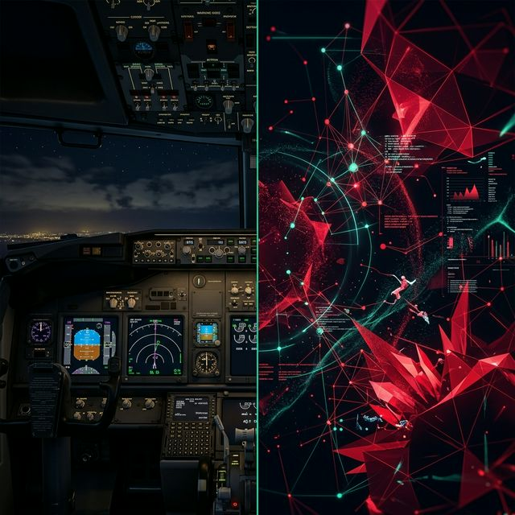

面对复杂黑盒系统，“人在回路”并且保持最高视觉监督权限，不仅仅是为了图表花哨，而是保命的最后底线。当自动化陷入癫狂，只有极其直白的视觉可视化警示面板，才能像锋利的手术刀一样划破盲区，让人类大脑重夺控制权。

> [VISUAL]
> *   **Slide**: `S08_External_Representation`
> *   **Layout**: `Comparison`
> *   **Scene**: 左侧半边是一个人苦思冥想，脑袋里冒出一团乱麻般的几千个长串数字，额头冒汗——代表"内部认知的超载"。右侧半边是同一个人面对一张清晰的热力图，眼前的乱麻变成了色彩浓重不同区块的直观映射——代表"外部表征的卸载效应"。
> *   **Text**: "外部表征 = 认知外包：把大脑的工作卸载给眼睛"
> *   **Asset**: 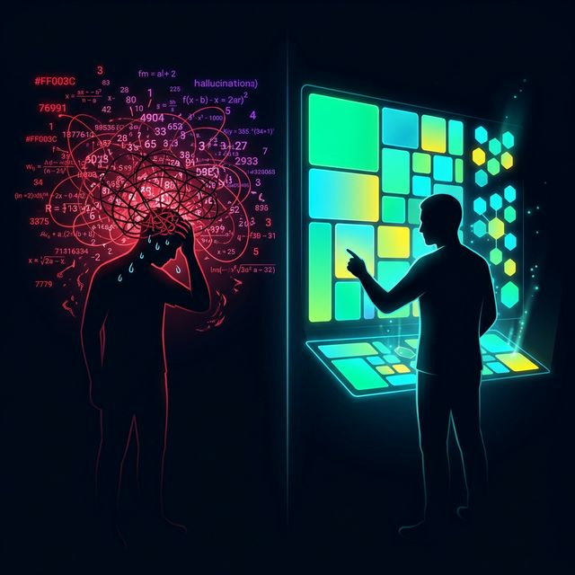

好，梳理清了“人必须参与”的必要性，那第二个核心追问来了：我们为什么非要把数据画成一张图出来呢？我在脑子里心算、或者用电子表格看满屏字幅不行吗？

答案是：绝对不行。因为你的脑子内存是不够用的。

Munzner 引用了认知科学中一个支柱级概念——**外部表征 External Representation**。她的原话非常干练且准确：外部表征能够几何级地增强人类的能力，让我们超越自身内部认知和短期记忆的生理局限。

用大家更熟悉的硬件语言来说就是：人类大脑的 CPU 虽然很强，计算逻辑精妙，但缓存，即 **Cache**，和内存，即 **RAM** 却小得可怜。心理学的经典研究早就证明，人类的短期工作记忆只能同时容纳 4 到 7 个信息组块。

把你那几万条交叉引用的营收记录画成图表，本质上就是给大脑插了一张外接的高级图形显卡。你不需要在大脑里死记硬背几千万个坐标位置对应的值，你只需要用眼睛去全局扫描、去对比色块大小、去发现异常的毛刺。

这就是**“认知外包”**——我们把原本最繁重、最消耗心力的海量数据存储与比对工作，从大脑的颞叶和海马体中，剥离、卸载到了我们进化了几百万年的视觉系统上。

> [PHILOSOPHY: 分布式认知与飞行员的提示卡]
> 以 Edwin Hutchins 的理论深化认知卸载的价值。

> [VISUAL]
> *   **Slide**: `S08b_Cognitive_Offloading_Cockpit`
> *   **Layout**: `Split`
> *   **Scene**: 左侧照片展示上世纪老式飞机驾驶舱里的 Speed Bugs（速度游标，一种可以卡在物理仪表边缘的彩色小塑料片）。右侧文字解释分布式认知的概念。
> *   **Text**: "你的周围也是你大脑的一部分"
> *   **Asset**: 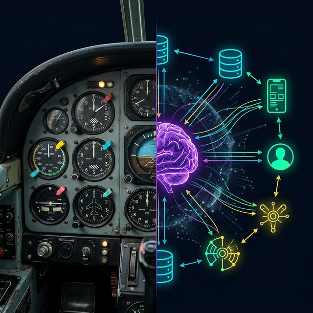

加州大学圣地亚哥分校的认知科学家 Edwin Hutchins 教授，提出过一个震撼学界的理论，叫“分布式认知”。他花了很多时间去观察军舰领航员和客机飞行员是怎么工作的。

他发现了一个惊人的事实：飞行员在极度多头绪的任务中，从来不光靠自己的脑袋去记那些起飞和降落的关键速度数据。如果在仪表盘外侧用几个彩色的物理塑料小游标（叫做 Speed bugs）卡在特定的刻度上，飞行员看一眼那个彩色塑料片的位置就能做决策，完全不用在脑海里背诵那一页页的飞行手册页码。

Hutchins 认为：我们的大脑从来不是孤立工作的，人类其实早就学会了把认知过程分布在我们周围的物理和视觉空间中。一张优秀的数据图表，就是那个卡在你视野里的高级“彩色游标”，它将繁重的记忆负担转化为了几乎零成本的视觉直觉判断。

> [VISUAL]
> *   **Slide**: `S09_Vision_vs_Sound`
> *   **Layout**: `Comparison`
> *   **Scene**: 左列标题"视觉感知"，展示一个包含几千个灰色圆点的散点图，其中一个荧光色的红点瞬间弹出——配注"并行处理通路 | 高带宽并行 | 前注意瞬间感知"。右列标题"其他感官 (如听觉)"，展示一个心电图节奏音效在时间轴上依次流过——配注"单线序列处理 | 低信息吞吐率 | 需要耗时等待"。
> *   **Text**: "视觉通道 = 万兆并行的光纤网络 ｜ 其他感官 = 56K 拨号上网"
> *   **Asset**: 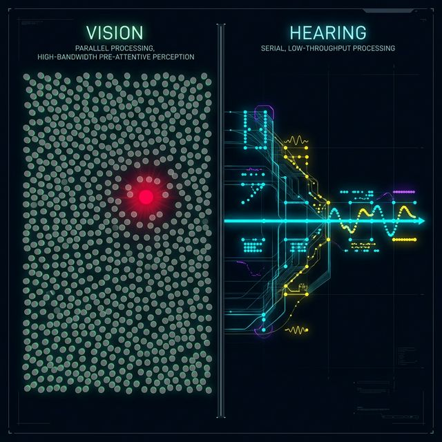

顺着往下想，我们人有视觉、听觉、嗅觉、味觉和触觉五种主流感官。既然要做外部表征，为什么几千年来人类几乎只选择了“看”数据，而不是去“听”或者“摸”数据呢？

大家可以看屏幕左右两侧的对比。左侧的万兆光纤线路代表了我们的视觉，它能极其高效地处理整个视网膜并行传来的海量信息点；而右侧代表听觉的单线序列处理，就像老式56K拨号上网，信息必须排着队随时间流逝向你传递。这种吞吐率的巨大鸿沟，决定了只有视觉才能承担起“高带宽并行”的数据接收重任。这就是Munzner教授给出的基于生理学铁证的回答：**因为人类视觉系统连接着大脑皮层中最高带宽的信息总线。**

这就引申出了本周最重要的一个心理学专有名词：**"前注意处理" Pre-attentive Processing**。

如果我们用一个绝对精准的隐喻来定义它：它就是你**视网膜底层的“聚光灯与强力报警器”**。
我们的视觉系统非常神奇，大量密集的底层视觉信息在我们的大脑产生主观意识、也就是“你觉得你看到了”之前（大约在200毫秒内），就已经在视网膜和初始视觉皮层被这盏无意识的探照灯并行扫射完毕了。它的目的极其功利且单一：在毫无秩序的迷雾中，**暴力且极速地定位异类**。

> [VISUAL]
> *   **Slide**: `S09b_Pre_attentive_Processing`
> *   **Layout**: `Image`
> *   **Scene**: 演示著名的弹出效应：左半部分是满屏细密的灰点中找一个浅灰色方块（代表极度耗能的扫描）；右半部分是一束刺眼的主角聚光灯，瞬间打在极暗场景中的一个高亮红色警示圆点上，仿佛警报拉响。
> *   **Caption**: "聚光灯的暴力美学：无意识的瞬间强警报效应"
> *   **Asset**: 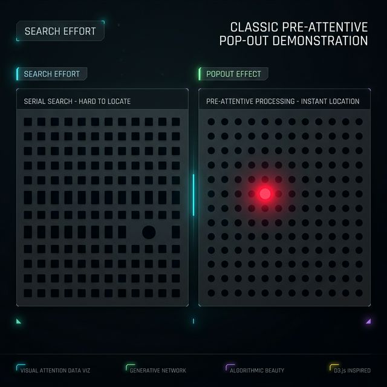

最经典的体验叫做**视觉弹出 Pop-out**。想象你在一片几千个灰色圆点的汪洋大海中，放了一个极其刺眼的红色圆点。此时你需要像看电子表格那样，第一行第一列，第一行第二列……一个接一个顺序看过去才能找到它吗？完全不需要！那个红点会触发底层报警器，"啪"地一下、以极具侵略性的方式跳进你的视野。

更不可思议的是，无论这片大海里是十个灰白点还是一百万个点，你扫出那颗红点耗费的时间几乎是完全一样的。这种极其强悍的防干扰抗拖延特性，就是前注意“无意识全图暴击”的恐怖算力。

而在数据可视化的百年发展中，顶级的架构师们已经彻底穷尽了能够唤醒这个报警器的所有物理通道开关。它们被严密地划分为四大阵营：**颜色、形态、空间与运动**。

> [VISUAL]
> *   **Slide**: `S09c_Pre_attentive_Channels_Full`
> *   **Layout**: `Grid`
> *   **Scene**: 一个严谨清晰的田字格四象限分类图，配以极简的图形示例：象限1【色彩阵营】：同种颜色不同饱和度、完全相斥的色相。象限2【形态阵营】：圆中的方形（形状）、平行中的横折线（方向）、长宽比变异。象限3【空间位置】：脱离平面的 2D 位移（散点图的基础）。象限4【运动阵营】：静态中突然闪烁或带有轨迹运动的警报粒子。
> *   **Text**: "唤醒报警器的四把钥匙：前注意通道的完整阵营全景"
> *   **Asset**: 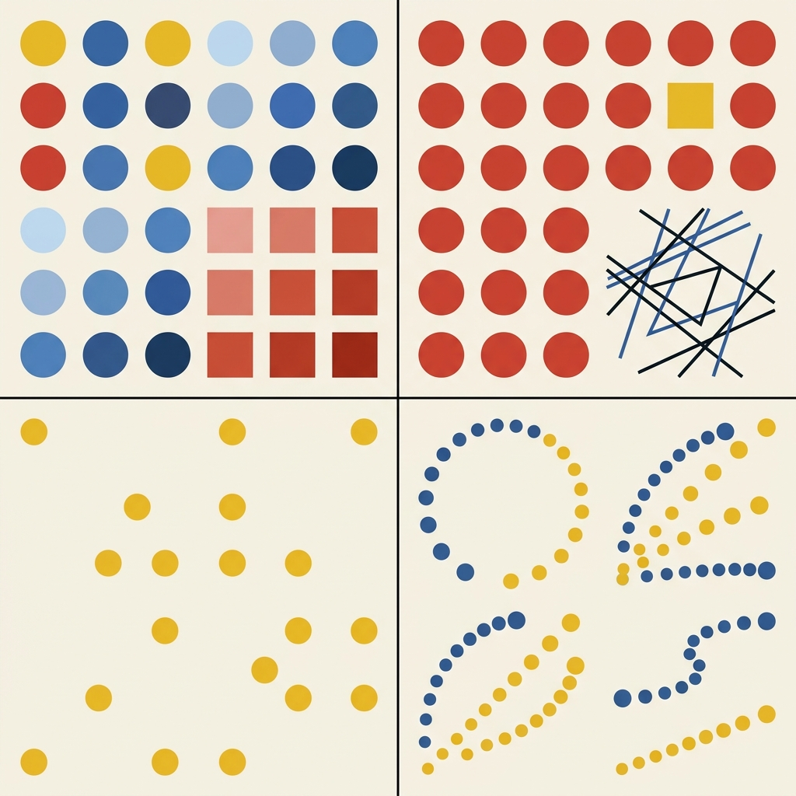

**第一王权阵营：色彩 (Color)**。包含刺眼的**色相变异**（整齐黯淡灰色集群里爆发的红柱子）与**饱和度反差**。由于视觉传导的特权，任何运维工程师都会被屏幕上那唯一一格代表服务器熔断的鲜艳大红块“烫”到视网膜。

**第二隐蔽阵营：形态 (Form/Shape)**。除颜色外，这里是最常用的图表“暗器匣”。比如**尺寸突变**（满版小字里跳出一个体量恐怖的加粗大字），比如**方向逆折**（几万根向上平行线段里，强行拗弯呈 30 度逆角的红线），以及**形状变异**（全圆形阵列里的尖锐方块）。在大脑解析数据意义前，它们已经劫持了视线。

**第三基础阵营：空间位置 (Spatial Position)**。人类对于物体在平面 2D 上的脱离和偏移高度敏感，这其实构成了整个世界上所有散点地图的底层物理感官基础。即使形状和颜色都一样，只要位置越界了，那也是刺耳的报警。

**最高压迫阵营：运动与闪烁 (Motion & Flicker)**。这是生物在几十万年充满掠食者的丛林里生存下来的终极本能——防备视野余光里任何突然乱窜或跳帧的活物。在静态的复杂数字大屏网页里，只要一样元素在抽搐闪动，你哪怕不想看也必须转头看。它是绝不可滥用的、最高级别的核按钮。

> [ACTIVITY]
> *   **Type**: `Practice`
> *   **Duration**: `10min`
> *   **Desc**: **视觉带宽极限测试：前注意通道唤醒**。
>     1. **Phase 1 寻找数字3**：先在大屏展示纯数字矩阵（10秒限时），让全班经历痛苦的串行检索；翻页后，同矩阵中的"3"被加上粗体与红色（1秒秒懂），直指颜色通道的暴力弹出效应（Pop-out）。
>     2. **Phase 2 干扰抗压测试**：展示不同阵营的前注意暴力弹出（色彩色相、体量大小、形状截断、方向逆折等）。
>     3. **Phase 3 联合搜索崩塌**：展示单一颜色弹出与联合属性阻碍（颜色+形状双重维度要求时，弹出彻底失效），通过视觉宕机的切肤之痛引出天规：极端排他法则——永远不要让两个不同的前注意通道在同一图表中无谓地打架，保留背景收敛才能让亮点显形。
>     4. **Phase 4 课中狂想（理论碰撞）**：提出反思题：“如果在散点图中用刺眼的红色标出了几个圆点，接着顺手画了一个浅灰色全封闭边框把它们圈起来。请问这个画框的动作是对前注意通道的进一步加强吗？”引导学生认识到这不是增强本能报警，而是唤醒了下一节课要讲的更加霸道的高级力量——格式塔“同域原则（Common Region）”，从而完美切入中枢秩序法官的学习。

你们想想看，如果强行用声音来传达刚才同等体量的信息呢？那绝对是个噩梦。因为无论声音多丰富，它都是时间的单向流动。你必须按先后顺序一点一滴地听完。声音是一条脆弱的细车道，根本无法做到千人千面的“同时弹出并行感知”。

所以你看，哪怕是最高深莫测的数据可视化，到了最底层的地基，也是在极其功利地压榨我们身体上带宽最大的一条生理光纤——眼睛。

> [WARNING: 资源的残酷铁墙：计算、人类与显示的极限]
> 开始切入反面论据。任何伟大的能力都有代偿，视觉带宽虽然大，但我们在构建可视化时，面临着无法逾越的物理与生理墙壁。

> [VISUAL]
> *   **Slide**: `S10_Resource_Limitations`
> *   **Layout**: `Cards`
> *   **Scene**: 三张并列卡片，分别画着冒烟的 CPU 服务器（计算极限）、一个短路的金鱼大脑（人类认知极限）、以及一个密密麻麻全是像素点重叠发黑的屏幕（显示屏像素极限）。
> *   **Text**: "可视化设计的三大资源死线 (Resource Limitations)"
> *   **Asset**: 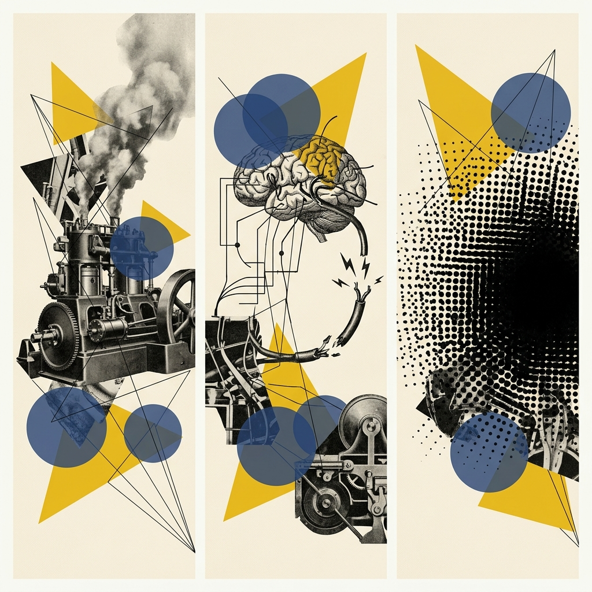

到了这里，如果只停留在“人类视觉天下无敌”，那我其实是在误导大家。任何极致的系统都有致命的弱点，一个负责任的专业设计课堂必须讲透背后的阴暗面。

在《Visualization Analysis & Design》中，Munzner 教授发出了严厉的警告：无论你的工具多先进，所有数据可视化系统都死死卡在**三大类资源限制**的瓶颈里。

**第一，计算能力的极限 (Computational Capacity)**。数据集永远比你想象的膨胀得快。当你要交互式地在大屏上展示一个拥有上亿个节点的关系网时，如果系统每次重绘需要卡顿好几分钟，那这种可视化就是彻底失败的。你必须拥有能在零点几秒内完成内存调度和算法布局的底层硬核架构。

**第二，人类认知的极限 (Human Perceptual and Cognitive Capacity)**。这就是我要给你们泼的最冷的一盆水。人类视觉的瞬间并行处理能力虽然堪图万兆光纤，但我们的工作记忆简直比金鱼好不了多少！

> [VISUAL]
> *   **Slide**: `S10b_Change_Blindness`
> *   **Layout**: `Image`
> *   **Scene**: 展示 Simons 的那个著名的“看不见的大猩猩”实验和另外一张测试图片：两张几乎完全相同的街景图片交替闪现，中间被一个持续 80 毫秒的灰白空白帧打断。尽管两张图中远端大楼有非常明显的缺口变化，但由于中间有白帧切断，几乎所有第一次看到该画面的人都盯着其他地方发愣，完全看不出哪里变了。
> *   **Text**: "变化盲视 (Change Blindness)：你的短时视觉缓存是极度易碎的"
> *   **Asset**: 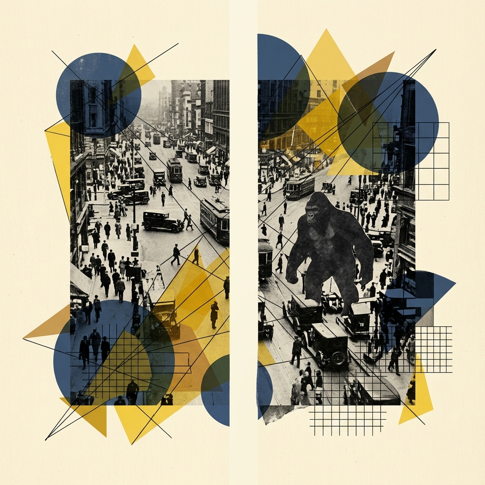

心理学里有个极其残酷的现象叫做**变化盲视 (Change Blindness)**。就像屏幕上的这两张图，即使是最基础的画面，只要我用 80 毫秒的白屏稍微打断你一下你的视线，然后把画面里一栋楼硬生生给删掉，你大概率根本看不出来。因为你的大脑根本就没有把那栋楼存入你的短期视觉内存里！这意味着，我们绝不能指望用户靠跨页翻动去记住复杂的数据规律。最高效的做法，是把你要对比的东西，老老实实地全部画在同一个屏幕的同一个视野里。

**第三，显示器的极限 (Display Capacity)**。既然你要把所有东西都塞在一个屏幕里看，那就迎来了最后一面死墙：你的屏幕像素是有限的。当你试图在 4K 屏幕上强塞进十万个数据气泡时，它们就会互相堆叠、重影，最终变成一坨恶心的黑色泥浆。这就是**信息密度 (Information Density)** 与**视觉杂乱 (Clutter)** 的生死博弈。如果屏幕塞不下，我们就必须祭出交互、过滤和聚合这些更为高级的妥协兵法。

> [STORY TIME: 众目睽睽之下的"隐形大猩猩"]
> 1999 年，认知心理学家 Daniel Simons 做了两组震惊了整个心理学界和脑神经科学界的经典人类盲视极限测试实验。大家在很多通识课里最熟悉的可能是那个著名的“无形大猩猩”实验：当大屏幕上播放几个人在快速传篮球，并且研究人员要求你全神贯注去死死盯住并计算他们到底互相传了多少次球时。在这长达几十秒的紧张计数过程中，一个穿着极其显眼、毛发浓密巨大黑色毛绒大猩猩套装的成年人，竟然就这么堂而皇之、大摇大摆地从整个屏幕镜头的正中间晃晃悠悠走过去，不仅停了下来，甚至还极其嚣张地捶胸顿足面对镜头示威了好几秒然后才慢吞吞走开。但极度令人脊背发凉的残酷核心事实是：在实验结束后的问卷调查中，居然有高达惊人的 50% 以上在场的受试者，在被问起有没有看到异常时指天发誓坚决宣称：从来没见过什么见鬼的大猩猩！
> 
> 除此之外，还有一个与我们在大屏报表中处理数据前后轮换状态时同样极度致命的深层脑神经缺陷病症，它被 Munzner 教授以极其极其郑重警告的态度隆重单列在可视化圣经级别的教科书中最显赫的位置中。它的学名叫作**极度残酷的变化盲视 Change Blindness错觉灾难**。

它的原理是这样的：如果我把一张图表 A 切换到极度相似但略有修改的图表 B，如果中间我不给你加哪怕一点点平滑的过渡动画，而是粗暴地闪了一帧白屏，或者你刚好眨了一下眼，哪怕图表上消失了一根非常粗大的柱子，由于你刚才那一瞬间注意力不在那一块区域……你极有可能会完全无视这个变化。

> [VISUAL]
> *   **Slide**: `S10b_Memory_Limit_UI`
> *   **Layout**: `Comparison`
> *   **Scene**: 左侧是对翻页式比对的恶感——用户需要凭记忆看前面的报表；右侧是现代 Dashboard 交互，把关键差值用悬停窗悬浮在同一页。
> *   **Text**: "信息密度困境：不要挑战用户的记性"
> *   **Asset**: 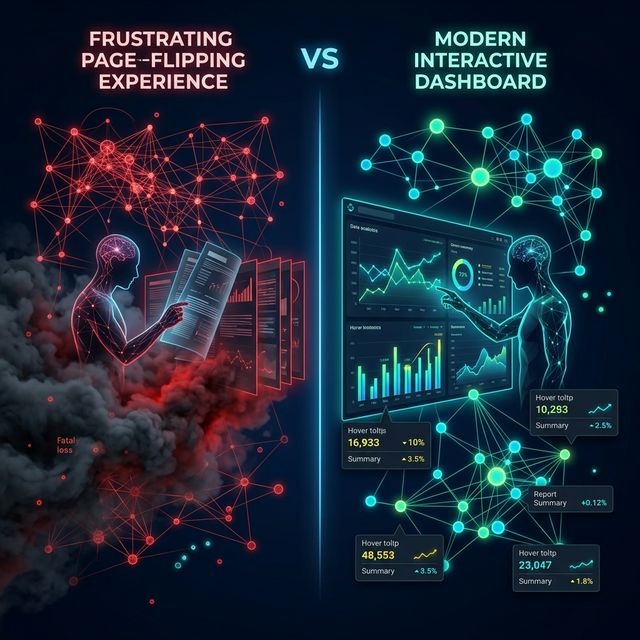

Munzner 冷酷地指出了这个事实："我们在视觉工作记忆中能够留存并对比的信息量，少得令人绝望。" 你的眼睛是一台高速的并行扫描仪不错，但它的硬盘存储空间极度稀缺。一旦失去持续聚焦的锚定物，刚看过的细节就会瞬间烟消云散。

这给所有的信息可视化设计师下达了一道极其严厉的通牒——**信息密度困境**。

你不能指望观众跨越好几页 PPT 或者几个屏幕滚动的画面，去比对前后的两组数据柱子！他们绝对、必定会忘记前一页的柱子多高。这就是为什么好的数据产品都会尽可能把一切强相关的对比要素压缩在一个画面里，或者用无比丝滑的形变补间动画（Morphing）来牵引用户的眼睛，不给“变化盲视”任何作案机会。

> [CASE STUDY: Therac-25 医疗辐射惨案中的界面盲视]
> 从变化盲视延伸到 UI 反馈遮蔽所导致的系统灾难。

> [VISUAL]
> *   **Slide**: `S10c_Therac_25_Tragedy`
> *   **Layout**: `Split`
> *   **Scene**: 以红色警示风格展示 1985 年著名的加拿大 Therac-25 放射线疗愈机事件。画面包含那极其简陋且反人性的旧式单色 CRT 终端屏幕界面，以及突出的那句冰冷的“Malfunction 54”报错字样。
> *   **Text**: "被蒙蔽的警报：当你对死亡弹窗习以为常"
> *   **Asset**: 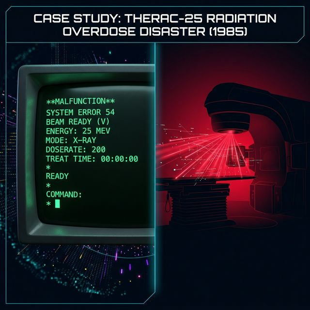

变化盲视如果我们稍微把它泛化到所有的危险反馈界面上，它还会演化成另一种恐怖的灾难：习惯性视盲。

大家可以了解一下软件工程界的一桩著名历史惨剧——二十世纪八十年代加拿大的 Therac-25 医疗放疗仪事故。由于软件由于设计了带有竞态条件的死锁并发 Bug，这台本该治病救人的机器对至少 6 位患者输出了高达致死量一百倍以上的极强辐射，最终导致严重伤残乃至数人死亡。

除了令人发指的代码逻辑极度错误外，它的终端反馈界面更是起到了罪恶的帮凶作用。

这台机器经常因为操作极快而导致微小故障跳出警示词。但在可怕的医疗现场，哪怕发生了内部系统致死性的硬件偏转失控，护士盯着的屏幕上依然闪烁着一个极其含糊、冷硬的代码：“Malfunction 54”（故障 54）。而下面还有一个熟悉的提示词让你可以选择按 "P"（Proceed 继续）强行跳过。

因为这套系统平时报错太频繁，加上界面的警示没有任何视觉量级上的变化（无论是断网还是可能致死的辐射过载，看起来排版都长得一模一样）。操作员早就在潜意识里完全屏蔽了错误信息的真实涵义，他们养成了肌肉记忆下意识按下了"P"键强行执行。

在这个充满鲜血的案例里，由于系统没有构筑出让不同风险等级“跳出并打破盲视”的多层次视觉设计，“人在回路”彻底成了让错误合法通过的手工肉盾。我们这专业，是真的关乎生死命脉的。

> [VISUAL]
> *   **Slide**: `S11_Three_Features`
> *   **Layout**: `List`
> *   **Scene**: 简洁、宏大的排版版面。基于《信息可视化设计》原书图1-16的核心学术框架谱系，重绘画布以展示信息可视化设计的三大特征。
> *   **Text**: "郝亚维教授的中国视角：信息可视化的三大特征"
> *   **List**:
>     - "思维可视化：让内心不可见的认知具象化"
>     - "无障碍化：跨域文化、打破认知歧视的语言"
>     - "多维感知体验化：从二维屏幕向空间交互进阶"
> *   **Asset**: 

在深刻剖析并吸收了这一系列基于西方认知科学视角的严酷现实与机制后，我觉得非常有必要拉回我们自己的语境，补充一个同样深邃的本土学者视角。

这门课程的另一本基石教材，也就是由中国传媒大学的郝亚维教授等人撰写的《信息可视化设计》，在其第一章中提出过一份极具中国叙事特色且非常有人文高度的三大总结。

首当其冲的特征叫**思维可视化**。

> [VISUAL]
> *   **Slide**: `S11a_Thinking_Visualization`
> *   **Layout**: `Image`
> *   **Scene**: 展现信息可视化设计作品《人是如何诞生的》（参照郝亚维图1-18），或者展现震撼的脑神经逻辑结构图《心智的结构》（参照郝亚维图1-4），作为将极度抽象和系统性心智进行“深度显性化”的绝佳认知蓝图插图。
> *   **Caption**: "将大脑皮层的隐性风暴具象为实体蓝图"
> *   **Asset**: 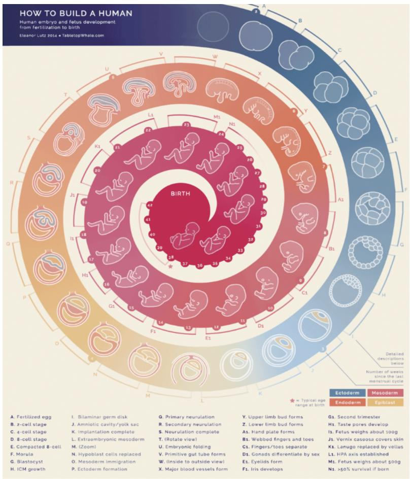

郝教授不仅把它看成对外部数字描图的作用，更将其视作是对人类内部精神活动的复写。有时候你画草图、梳理庞杂的思维导图、甚至在一块白板上把各个要点用复杂的连线串联聚合起来，那一瞬间你做的不只是向外传递，更是在反问自己的大脑：“哦，原来我内心潜意识是这种逻辑结构吗？”它是一种对隐性知识深度发掘的逆向工程。

> [STORY TIME: 一份拯救了英国常备军的绝密数据图]
> 但是，如果思维可视化仅仅停留在“把脑海里的东西画出来”，那它充其量不过是大号的草稿纸。当一份思维的外部表征凝聚了前所未有的洞察力时，它甚至拥有扭转国家历史走向、挽救数万人生命的恐怖能量。

> [VISUAL]
> *   **Slide**: `S11a_Nightingale_Rose`
> *   **Layout**: `Split`
> *   **Scene**: 左半边是一张密密麻麻、让人毫无阅读欲望的霍乱死亡人数月报表（黑白，布满灰尘的历史档案）。右半边是南丁格尔那张名垂千古的“东方军队死亡原因统计图（南丁格尔玫瑰图）”，蓝色的巨大面积犹如致命的花瓣一样刺眼。
> *   **Text**: "南丁格尔玫瑰图：当统计表变成挽救生命的武器"
> *   **Asset**: 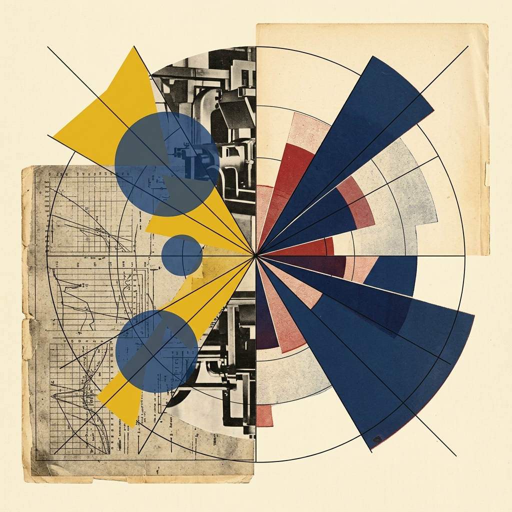

大家应该都听过弗罗伦斯·南丁格尔（Florence Nightingale）的名字，她是近代护理学的先驱。但很多人不知道的是，她其实是整个人类历史上最伟大的统计学家和数据可视化大师之一。

1854 年的克里米亚战争爆发。当时的英国军方对士兵死亡的认知非常傲慢：他们理所当然地认为，士兵死于战争，主要是因为在前线打仗被子弹打死、被炮弹炸死的。因此面对高达惊人的 42% 的前线死亡率，军方甚至觉得这不可避免，拒绝往后方医院投入更多医疗和卫生物资。

南丁格尔在前线战地医院收集了长达两年的数据，她发现了一个极其恐怖的真相。但是面对昏庸僵化的英国议会和陆军后勤部，如果你只甩给他们一本写满数字枯燥乏味的统计报表，那些傲慢的官员根本看都不会看一眼。在那个完全没有 PPT 的年代，南丁格尔做了一件跨时代的天才之举：她利用一种极坐标面积图（也就是后来著名的“玫瑰图”）把死亡数据“思维可视化”了。

在一朵看似美丽但实则滴血的图表中，红色的面积代表死于前线战伤的人数，黑色的面积代表死于不可控其他因素的人数，而那片如同巨大冰冷阴影般包裹着花蕊的庞大蓝色面积——它以一种绝对暴力、绝对无视反驳的视觉统治力直接糊到了国会议员的脸上。那个蓝色的面积代表：因为战地医院卫生条件恶劣、水源污染而死于可预防传染病（如伤寒和霍乱）的人数。

蓝色的面积是红色的无数倍。

> [VISUAL]
> *   **Slide**: `S11a_Nightingale_Impact`
> *   **Layout**: `Title`
> *   **Scene**: 深色背景下，那朵蓝色的致命玫瑰成为画面的绝对重心，下方用鲜红色的粗糙字体刻下南丁格尔那句震撼的论断。
> *   **Text**: "『我们的士兵，是被我们自己的医疗体制杀死的。』"
> *   **Asset**: 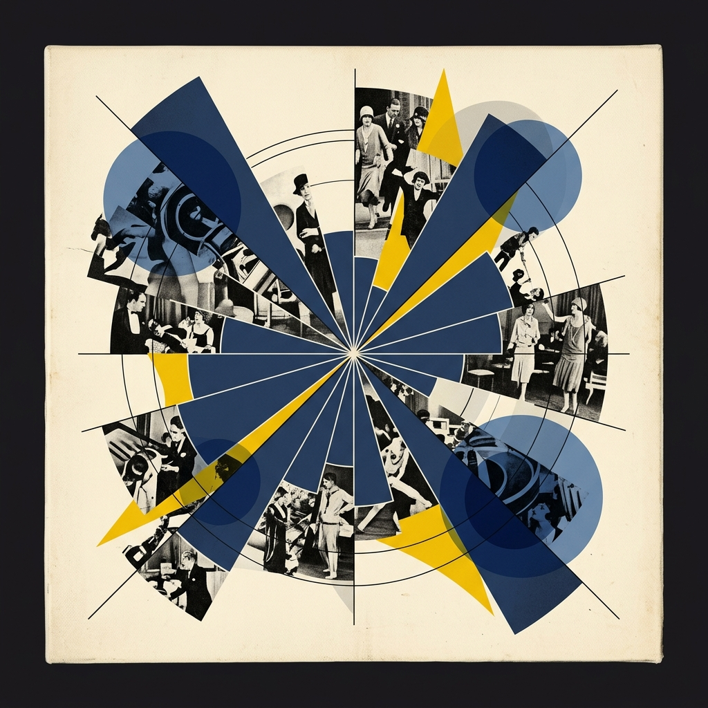

这不是一张图，这是一张无可辩驳的死亡判决书！在绝对巨大的蓝色视觉冲击面前，任何官僚主义的掩饰都变得苍白无力。这张极度震撼思维底层的报表不仅迫使维多利亚女王设立了皇家军队健康委员会，甚至直接催生了现代军队的卫生系统，由此挽救了无数英国士兵的生命。

所以，这才是我们在高级课堂里谈论“思维可视化”的极高终局：**它不只是把复杂的事情画清楚，它是那把能瞬间刺穿人类傲慢认知盲区的手术刀。就像前面的 Therac-25 因为一个盲区的界面杀死了病人，南丁格尔则用一张充满视觉暴力的面积图，把数以万计的人从死神手里抢了回来。**

其二，**无障碍化 (Accessibility)**。

> [VISUAL]
> *   **Slide**: `S11b_Accessibility_Universal_Language`
> *   **Layout**: `Comparison`
> *   **Scene**: 展示对色弱群体无障碍优化的设计，比如利用形状+纹理替代单纯的红绿灯提示。
> *   **Text**: "跨越歧视的通用桥梁：从红绿盲讲起"
> *   **Asset**: 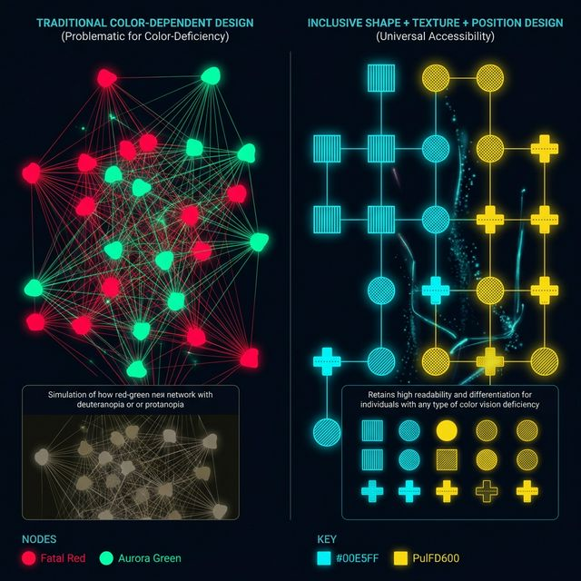

这是我们在面对大众传媒时最重要的伦理之一。图形隐喻是可以打破文字壁垒甚至文化歧视的通用语言。一套极其出色、去除了极客傲慢的高素质可视化防疫数据看板，即便是没有受过深层高等教育的用户，或者有轻度认知障碍使用辅具的老年人，也能在红绿色的简单冷暖比对或面积极度悬殊的色块冲击里读懂何处危险。它是一座真正抹平信息落差的超级桥梁。

但仅仅是解决“部分群体的色弱”就足够了吗？远远不够。我必须在这里极其严肃地拓宽大家关于“无障碍设计”的全部认知边界。

> [CASE STUDY: 微不足道的按钮与极端的包容]
> 我们来聊一个关于微软与智能交互设备的故事。

> [VISUAL]
> *   **Slide**: `S11b_Inclusive_Xbox_Controller`
> *   **Layout**: `Split`
> *   **Scene**: 左边是一对普通的游戏手柄，拥有二十多个高低不同的按钮、摇杆和肩键，需要全部十根健全且灵敏的手指协同。右边是微软那块如白玉般平整、长得完全不像手柄的 Xbox Adaptive Controller，带有两个巨大无比的黑色黑胶唱片型按键。
> *   **Text**: "为极端用户设计，就是为所有人设计"
> *   **Asset**: 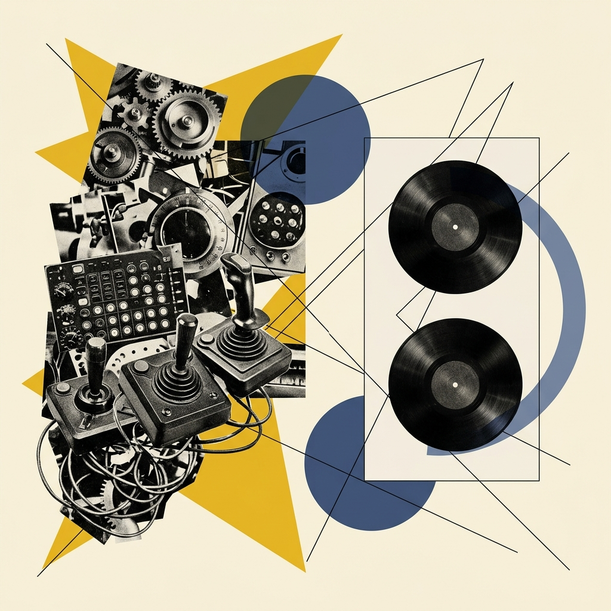

2018年，微软工业设计团队做了一件极其颠覆常理的事。常规的游戏手柄（比如你们手里的 PS5 或 Xbox 手柄）是工程美学的极致——它假设每一个玩家都拥有完美健全的双手和灵活的十根指头。但这对于那些患有脑瘫、肌肉萎缩侧索硬化症（ALS）、或者是缺肢的残障玩家来说，那些分布得极其紧密的摇杆和触发器简直就是一堵将他们与世界彻底隔离的高墙。

微软于是推出了 Xbox Adaptive Controller——自适应控制器。这根本就不像是一个常规的手柄，它只有两个极大极大的按键。更加疯狂的设计在于，团队在控制器的背部留下整整 19 个高度定制化的通用 3.5mm 接口孔阵列！这意味着不管你是用脚踏板、嘴吹管、下巴摇杆还是视线追踪器，你都能把它当成一个“插座”将其接入系统。

在设计圈里有一条真理：**“When you design for the edge cases, you design for everyone.”（当你为极端的边缘情况设计时，你同时也造福了所有人）。**

这不仅仅是硬件工业设计的使命，更是我们在信息可视化与前端系统架构中绝对不能退让的底线。

> [VISUAL]
> *   **Slide**: `S11b_Digital_Divide_Pain`
> *   **Layout**: `Image`
> *   **Scene**: 一张具有强烈纪实风格的暗色调照片素材：一位白发苍苍的老奶奶在银行大堂里，被好几个年轻人甚至亲属无奈地高高抱起，颤颤巍巍地去凑近那台只有半人高、挂在墙上的“高级 AI 人脸机器”。
> *   **Caption**: "数字鸿沟 (The Digital Divide)：当被剥夺者失去并行交互权"
> *   **Asset**: 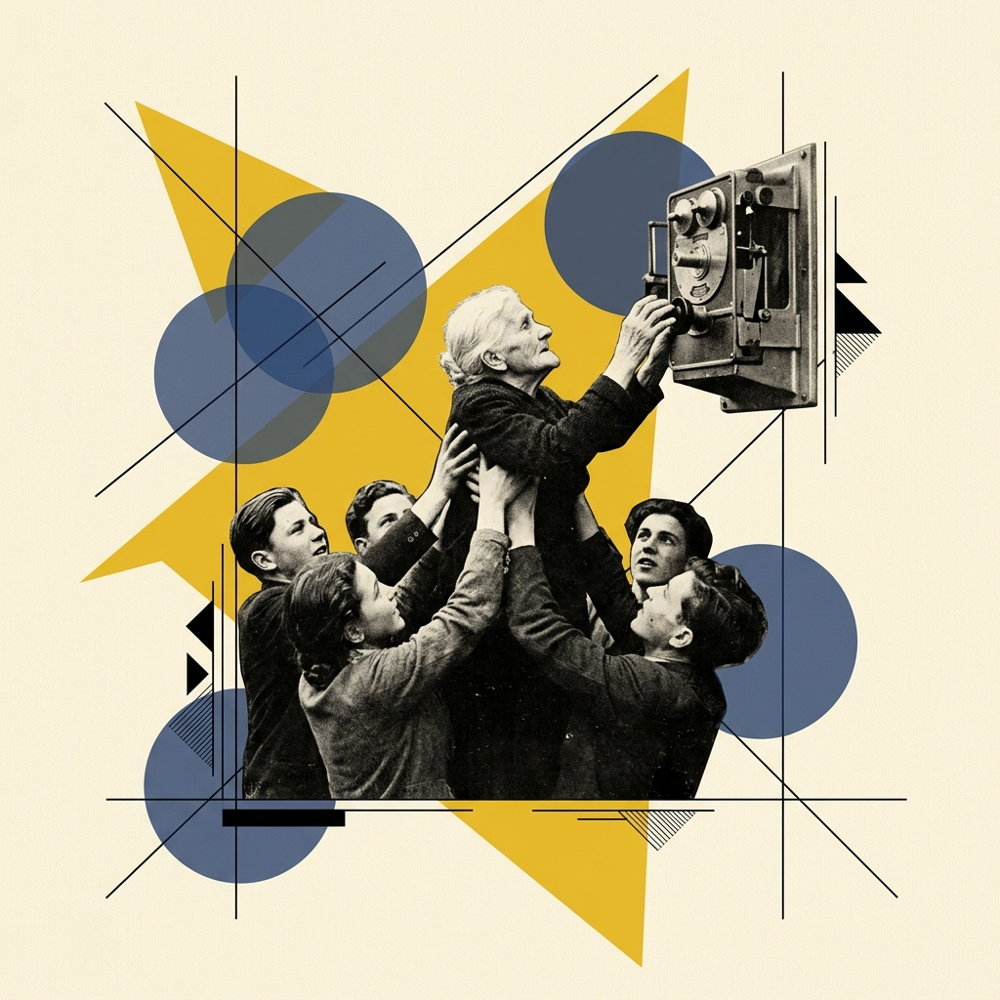

在中国极其庞大且剧烈的数字化转型运动中，我们创造了一个没有现金、没有纸质车票、没有任何人工查验的超级赛博朋克社会。在这个光鲜亮丽的高效时代背后，埋葬了无数边缘人群的无声重叹。前几年在湖北某个地市，一位九十多岁的高龄老太为了激活社保卡，硬生生地被家人在银行抱起来，悬空抵在那台冰冷的人脸识别系统前面。

这就叫做我们要竭力避免的**“数字鸿沟（Digital Divide）”**。优秀的系统，乃至优秀的可视化大屏，绝对不能是一场充斥着极客傲慢的技术狂欢。我们在设计任何数字服务或者数据平台时，必须去构建**平行交互通道（Parallel Interaction Paths）**。在彻底切断所有旧路径之前，留出一部分包容性的通道。

请永远牢记：不要仅仅把看你图表的人当作数据漏斗里的“User（用户）”，他们是一个个拥有尊严的“People（人）”。这是人因工程与包容性设计的最高戒律。

其三，**多维感知体验化 (Multidimensional Perception)**。

> [VISUAL]
> *   **Slide**: `S11c_Multidimensional_Perception`
> *   **Layout**: `Split`
> *   **Scene**: 左半边展示运用 VR 或全息技术呈现的数据沉浸空间（精细对标郝亚维图1-21 运用VR技术的埃菲尔铁塔模型数据透视）。右侧展示可触摸的数据实体艺术品（3D 打印冰山消融曲线模型）。
> *   **Caption**: "多维感知：从 VR 虚拟沉浸到亲手抚摸实体数据"
> *   **Asset**: 

可视化已经不仅仅是把你困死在 2D 平面上。大家回想一下冬奥会开幕式或者诸多的新媒体数据展，它是光影流动的，它会利用大屏幕的景深，会使用增强现实 AR。

更前卫的甚至开始玩**有形数据 (Tangible Data)** 或数据实体化——你可以在美术馆里真实地去触摸那些根据百年来的海洋酸化度数据与气候变暖坐标轴用 3D 打印车床切削出的巨大冰山雕塑。这就把原本只局限在视神经内的信息输入，反向升维成了物理维度的空间沉浸式体验。这就引入我们这门课走向最深层面时的另一个灵魂支柱——如何让数据脱离死板的业务轴，走向浪漫的人文艺术？

> [PHILOSOPHY: 从数据机器到数据人文主义]
> 信息不一定只是 KPI 分析大屏，它也可以是手账、是日记、是极具隐私和人类温度的散发着墨香的浪漫散文。

> [VISUAL]
> *   **Slide**: `S11c_Dear_Data_Project`
> *   **Layout**: `Split`
> *   **Scene**: 著名数据艺术家 Giorgia Lupi 的《Dear Data》项目实拍：两张极度精美、纯手工绘制的明信片。左侧是由五彩斑斓的针管笔手绘点阵构成的一周情绪流水账，右侧是复杂的墨水图谱，记录着一位朋友在异国的饮食与思念轨迹。
> *   **Text**: "数据人文主义 (Data Humanism)：找回图表背后的灵魂"
> *   **Asset**: 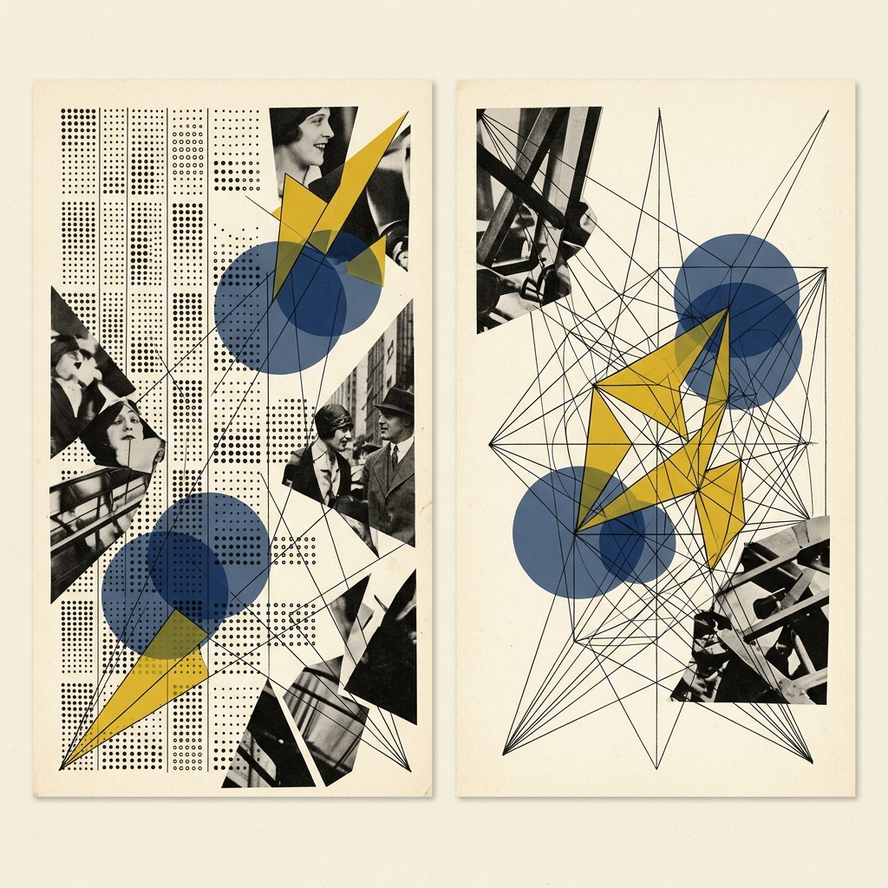

刚才我们在第一特征和引子部分提到的所有案例不是波音坠机杀人就是霍乱死亡率，似乎数据可视化就是一个高度冰冷的分析机器。但美国籍意大利裔的著名数据艺术家，也是 Pentagram 五角设计的合伙人 Giorgia Lupi 教授给出了一个极其温柔的答案：**数据人文主义 (Data Humanism)**。

她发起了一个震惊设计界的项目叫《Dear Data》。在那一整年里，她和驻扎在异国的一位设计师挚友，拒绝使用任何数字网络工具，只通过数据沟通。每一周她们各自设定一个主题，比如“记录这周我说过的所有的脏话”、“这周我对伴侣抱怨的所有琐事”或者“这周我每天盯着天花板发呆的时刻”。她们不使用任何高大上的 Python 或 Tableau，而是用五颜六色的水彩、针管笔在普通的明信片上，用极其复杂的自创绝美图形符码把这些微小的情感片段“绘制”成了数据图，然后越过大西洋寄给对方。

她在一期著名的 TED 演讲里说到：我们一直以来都搞错了，数据其实从未存在过在这个物理宇宙里。真实存在的是你我身上活生生发生的故事，而数据仅仅是为了描述这些微末故事，人类强行发明出来的一种干瘪的提款机工具。当我们用高科技代码把数据无情地榨取剥离之后，它就丧失了温度。而真正伟大的数据设计师，要懂得去重新捕捉隐藏在那一个个孤寂的点线面之后，那些不完美、混乱却极度动人的生命之轮。

这种充满人性的笔触和残缺的手工感，让数据第一次散发出了人类的体温。这就是多维体验进入艺术领域的巅峰境界，也是我们本周的大专题《范式革命与生成的艺术》背后的驱动核心和最后归宿。

> [VISUAL]
> *   **Slide**: `S12_Module2_Summary`
> *   **Layout**: `Comparison`
> *   **Scene**: 深色背景下的大型结语对比版面。左面用明朗的蓝色勾勒成功法则；右面用警示的红色框线总结极限与天花板。
> *   **Text**: "系统重装完毕：可视化 = 认知宽带扩展卡"
> *   **List**:
>     - "✅ 全力利用：并行前注意机制 + 释放颞叶记忆卸载负荷"
>     - "⚠️ 绝对敬畏：严控界面盲视死角 + 尊重有限注意力"
> *   **Asset**: 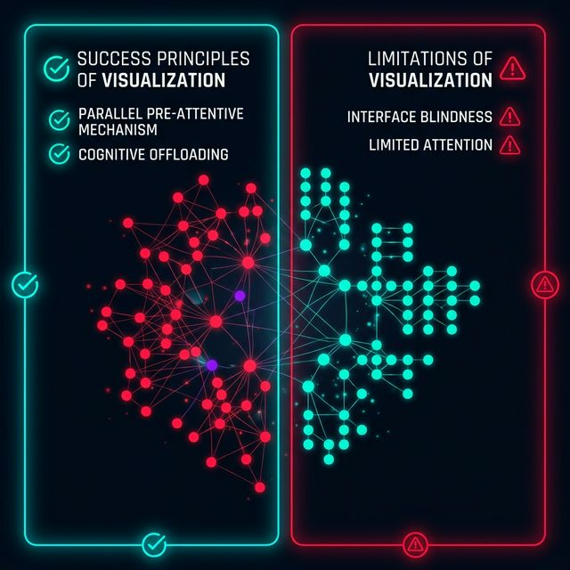

好了，各位同学。请在这一刻把你们学过的一切做个封装。

我们在这个模块深入探究了所有的核心骨架：
“病态问题”与避免波音事故的危机逼着我们必须让“人在回路”。为了让人发挥能量不被算崩溃，我们才引入“外部表征”做记忆显卡的卸载。为了让这张显卡吞吐量最大化，我们毅然选择了大脑最极致的一条万兆光纤即“视觉并行通道”。同时，面对毫无感情的“失明瞬间”，我们又必须克制贪欲，不去引爆混乱。

这些枯燥但极其深刻的心理教条，就是撑起之后我们一切高阶架构和花哨代码的最底层逻辑之核。

当我们弄清楚机器的眼睛和我们的眼睛到底存在多大区别后，下一个亟待探索的深海问题就是——我们的大脑是怎么把一盘散沙拼在一起的？
