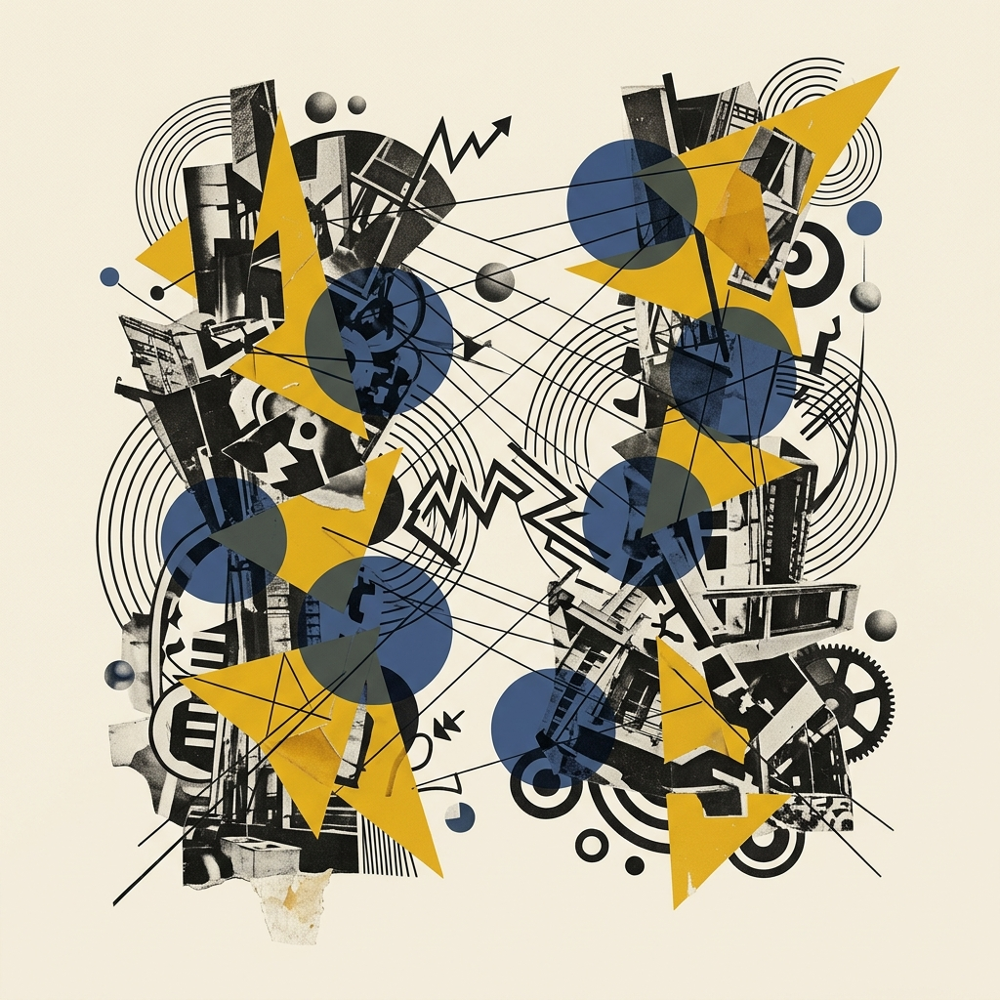
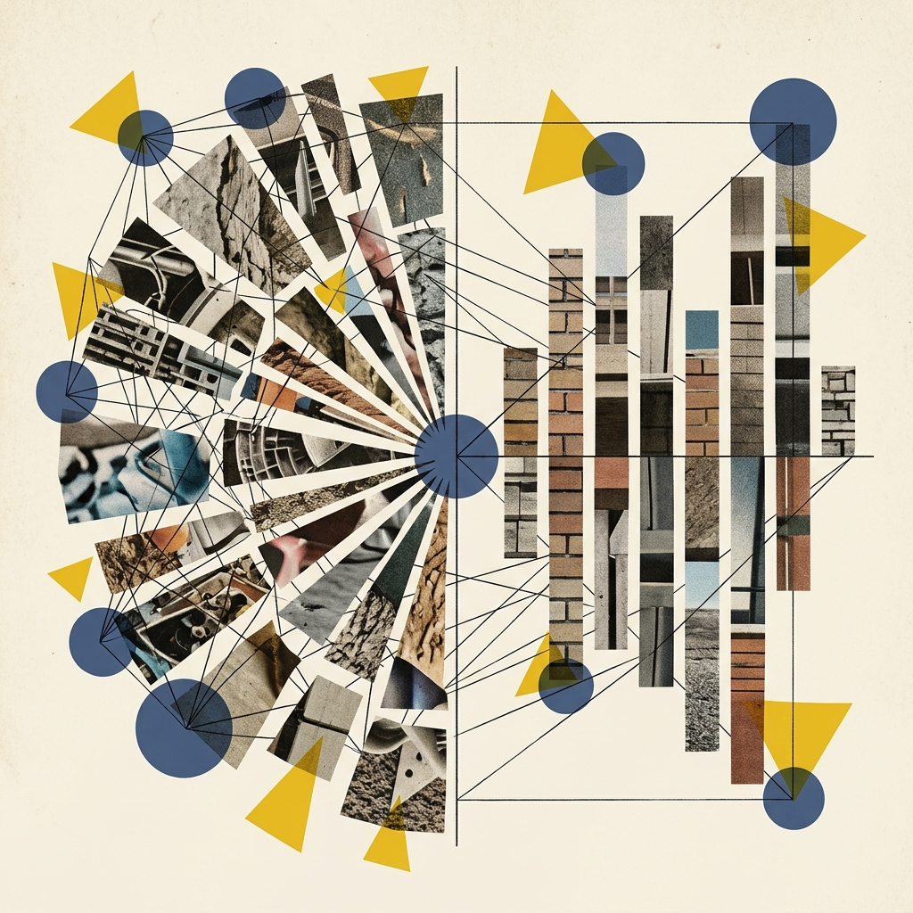
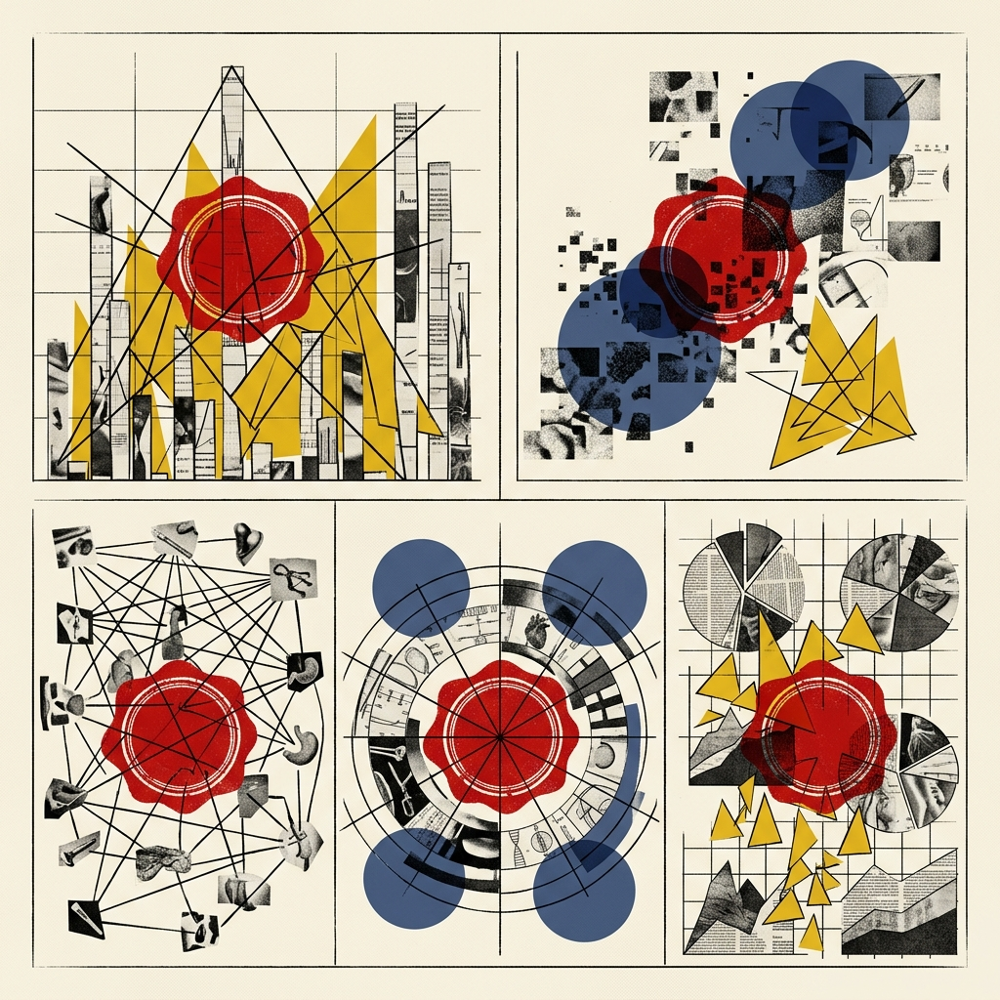

## Module 4: 格式塔原则——大脑的"找规律"强迫症 (35 分钟)
<!-- BUDGET: 4500 chars | LECTURE: 25m | ACTIVITY: 10m | SLIDES: ≥7 | STATUS: resolved -->

> [TEACHING MOMENT]
> 本模块介绍格式塔七大原则。不要只罗列干巴巴的概念，要用郝亚维教材中的经典图例和实际的"设计灾难"来反证。重点讲解大脑如何自动完成分组和闭合。

### 4.1 课前引言：视觉心智框架模型构建

> [VISUAL]
> *   **Slide**: `S13_Gestalt_Intro`
> *   **Layout**: `Full`
> *   **Scene**: 左侧是格式塔学派三位代表人物的...
> *   **Text**: "格式塔心理学：不仅是看到形状，更是看到整体"
> *   **Asset**: 

请大家在脑海里牢牢建立起这套全新的**视觉心智框架模型**。这是我们后续去解构一切复杂**数字隐喻**、展开高阶**数据抽象表征**时所必须依赖的**底层基石**。

<!-- 知识源: 郝亚维 §四(四)1 "格式塔原理" L322-328 -->

### 4.2 秩序法官：大脑皮层强行缝合视觉碎片

> [VISUAL]
> *   **Slide**: `S13a_Pre_vs_Gestalt_Transition`
> *   **Layout**: `Split`
> *   **Scene**: 左侧表现视网膜前注意机制：极暗的海底，一束刺眼的单束“聚光灯”锁死一个红色发光水母（代表无意识的异类报警/抓取）。右侧表现中枢格式塔机制：半透明发光的大脑皮层图像上，像建筑搭图纸一样，用发光的几何“排版骨架”和蓝色连线，硬生生把虚空中飘散的无数光点强行缝合组装成了一只有形状的猛兽（代表建立秩序与层级）。
> *   **Text**: "根本区别：左边是报警器，右边是秩序法官"
> *   **Asset**: 

刚才我们在讲前注意机制时，把它生动地比作了一盏无意识扫射的“聚光灯与强力报警器”，专门在一盘散沙中帮你极速抠出刺眼的异类。但这远远不够！如果在你的图表上全是几百个孤立弹出的红点和长棍，没有任何层级结构，大脑依然会完全崩溃。这就轮到另外一股伟大的中枢力量接管战场了。

在 20 世纪初，德国的三位心理学家创立了**格式塔学派 Gestalt**。如果前注意的是聚光灯，那么格式塔就是深藏在你大脑皮层深处的那位患有严重找规律强迫症的**“排版骨架与秩序法官” (The Skeleton & Order Judge)**。

"Gestalt" 这个德语词的意思就是"形状"或"形式"。他们发现，面对信息爆炸的混乱世界，你的大脑为了节省高昂的**认知算力和能量**，会本能地抗拒杂乱无章。它会主动、甚至强势地，将无数彼此原本没有瓜葛的碎片，通过**知觉分组**，强行在思维的暗房里“拼凑缝合”成一个有意义的整体结构网。

> [VISUAL]
> *   **Slide**: `S13b_Dalmatian_Illusion`
> *   **Layout**: `Center`
> *   **Scene**: 经典的斑点狗视错觉图。黑白错乱的斑块中，隐藏着一只正在低头嗅探的斑点狗。
> *   **Text**: "无中生有的斑点狗"
> *   **Asset**: 

你们看屏幕上这张经典的斑点狗错觉图——在纯粹视网膜的眼里，那只不过是互不相关的**离散黑点**，但在**格式塔秩序法官**的审判下，大脑瞬间动用隐形的**排版骨架**，把黑点"缝合"出了一只实体的斑点狗！

前人总共总结出了经典与衍生的多项原则。它们至今犹如铁律般统治着全球**数据看板搭建**的核心规范。

> [VISUAL]
> *   **Slide**: `S14_Gestalt_Proximity`
> *   **Layout**: `Split`
> *   **Scene**: 在一张极简的白色画布上，十六个纯黑色的墨点被精准地划分为四组竖直的行列，强烈的视觉距离差异将它们硬生生地切割开来，完美呈现空间距离剥夺视觉感知的物理规则。
> *   **Text**: "靠近性：距离产生美，也产生『伙』"
> *   **Asset**: 

<!-- 知识源: 郝亚维 §四(四)1 L330-337 + gestalt-principles-vis note -->

### 4.3 靠近性原则：基于底层距离感构建物理结盟

第一条原则叫做**靠近性原则 Proximity**。这是人类视觉中最底层的、也最强大的一种**分组力量**。

大家看屏幕左侧的这张图。本来，这仅仅只是 16 个等距排列的小黑圆点，在你们的眼里它们最初构成的是一个均匀的、没有任何内部纹理或结构的**整体正方形方块**。但是，当我们在排版时仅仅稍微动手脚，把垂直方向上列与列之间的距离放宽一点点，哪怕只有几个像素的改变——奇妙的事情发生了！

你的大脑瞬间接管了你的视觉皮层，它蛮横地、强制性地告诉你："停下！这不再是一个完整的方块了，这是四根**独立的柱子**！" 这就是靠近性原则的强大统治力：在人类的感知领域中，两个互不相关的元素在物理空间上越是**接近**，它们就越有可能被我们的大脑强行"缝合"、"捆绑"在一起，被视为一个**难以分割的整体组块**。

> [VISUAL]
> *   **Slide**: `S14a0_Proximity_Evolution`
> *   **Layout**: `Split`
> *   **Scene**: 左侧是原始草原上隐蔽在草丛中的相近黄黑斑点（暗示猎豹）；右侧是现代电商 APP 中依靠微小间距划定商品区块的极简排版界面。
> *   **Text**: "底层本能：越靠近，越是致命的集体"
> *   **Asset**: 

一种直觉的进化心理学解释是，在原始环境中，隐蔽的相近斑点可能意味着猎食者——大脑必须瞬间将它们合并为预警信号。因此，靠近性原则正是这种底层求生本能在视觉神经中的遗留。

> [VISUAL]
> *   **Slide**: `S14a_Supermarket_Trap`
> *   **Layout**: `Split`
> *   **Scene**: 左侧是普通意面，右侧是紧挨着它的高价进口意面酱。红色的连线表示消费者潜意识中的“天然搭配”错觉。
> *   **Text**: "空间距离即逻辑绑定：商业阵营陷阱"
> *   **Asset**: 

> [LIFE CONNECT: 超市货架的靠近性陷阱]
> 这就是为什么超市把高利润的进口酱汁紧贴打折意面摆放——靠近性原则让你潜意识觉得它们是天然搭配。距离近在人脑中直接等同于逻辑强关联，这也是现代商业对视觉认知规律的隐蔽利用。

> [VISUAL]
> *   **Slide**: `S14a2_Proximity_in_Charts`
> *   **Layout**: `Comparison`
> *   **Scene**: 左右两张柱状图的对比。左侧的图表，X轴标签和柱子的距离相等，导致无法对应；右侧通过拉开组间距、收紧组内距，形成清晰的阵营。
> *   **Text**: "数据战场上的阵营划分：留白即边界"
> *   **List**:
>     - "错误阵营：标签等距导致对应失效"
>     - "正确阵营：收紧组内距并拉开组间距"
> *   **Asset**: 

**回到数据战场，靠近性原则是不可逾越的排版天条。** 比如在一个密集的柱状图中，如果底部文字标签稍微偏离了原本对应的柱子，反而靠近了无关的相邻柱子，观众张冠李戴的概率将是极高的。

受众无法单纯依靠理性去分析哪条线对应哪个词，你必须在物理空间上将它们**紧密绑定**。相关的元素，必须贴近；不相关的元素，必须用夸张的留白推开。如果违背这个原则，你就是在对用户的视觉系统实施**认知折磨**。所以，**留白**绝不仅仅是为了排版呼吸感，它更是为了在数据阵列中强制划定**阵营边界**。

> [TEACHING MOMENT]
> 敲黑板强调：格式塔并非玄学，而是能切实指导我们切分画布的核心物理法则。引导学生回想上述被商业力量滥用的“阵营捆绑”。

### 4.4 相似性原则：穿越空间距离的视觉标签归类

> [VISUAL]
> *   **Slide**: `S14b_Gestalt_Similarity`
> *   **Layout**: `Center`
> *   **Scene**: 教材图例：纯粹的圆形和方形交替排列阵列。
> *   **Text**: "相似性：换个马甲我也认识你"
> *   **Asset**: 
> *   **Source**: `Textbook` — 郝亚维《信息可视化》图 1-27

第二条规则是**相似性原则 Similarity**。

请大家再次把注意力集中到屏幕左边，现在，我们把所有独立形状元素之间的物理间距调整得完全一样了。前面刚刚大展神威的靠近性原则在这里完全失效了。

但是，当这些排列考究的图形变成正方形和圆形相互交错的阵列时，你的眼睛依然没有被欺骗，它会立刻越过均等的空间距离，把同样形状的东西强行归为一类。在这个瞬间，系统向你大声呐喊："这是一排圆的，那是一排方的！" 这向我们揭示了另一个人脑认知的捷径：当元素在空间距离上无法区分时，大脑就会开始疯狂寻找它们在外观属性上的共同点——比如形状、颜色、大小、或是表面纹理的走向。

> [VISUAL]
> *   **Slide**: `S14c_Basketball_Analogy`
> *   **Layout**: `Full`
> *   **Scene**: 篮球赛场纯净版上帝俯角视角。深色木板球场上完全去除了外围干扰线、观众和裁判，仅保留由 10 名高度抽象化的人物模型。这 10 个角色由于穿着高亮度纯色球衣（5 位纯亮黄色，5 位纯翠绿色），在动态穿插中形成了非常抢眼的颜色分类阵营。
> *   **Text**: "相似性原则：用颜色在混乱中切分阵营"
> *   **Asset**: 
> *   **Prompt**: 按照 Academic Minimalist 风格，生成一张纯正的、极简的“上帝俯拍视角”篮球比赛静态概念图。强行将背景抹成无杂质的深色纯净球场外观，剔除所有边线、观众席与裁判，画面中只出现 10 名抽象化的球员。必须着重强化 5 人穿着鲜艳的高亮度纯黄球衣，另 5 人穿高亮度纯绿球衣。即使他们站位杂乱交织，依然能引发强烈的视觉色彩阵营效应。

> [DID YOU KNOW: 为什么对抗性竞技体育必须穿差异巨大的颜色？]
> 在混战的篮球赛场上，主教练能在半秒钟内看清局势，正是依赖**相似性原则**。只要场上球员的球衣有显眼的色块共性，大脑就能在毫秒级时间内将这群庞然大物瞬间切分为两个各自为战的阵营。

> [VISUAL]
> *   **Slide**: `S14d_Color_Encoding`
> *   **Layout**: `Center`
> *   **Scene**: 一张密布着上万个数据点的散点图。点位杂乱无章，但通过使用红色和蓝色的鲜明区分，瞬间展现出了隐藏的两个集群聚类。
> *   **Text**: "色彩编码：在混乱星空划定类属边界"
> *   **Asset**: 

在高度复杂多维的数据可视化工程中，相似性是我们手中最强大的**数据表征**和**属性编码工具**。当我们需要在一张密密麻麻、如同星空般浩瀚的散点图上，去表达成千上万个离散数据点的归属类别时，我们无法把同类数据强行拉到一起（因为 X/Y 位置坐标通常要用来表示最重要的数值关联关系）。

这时候，我们就可以用相同的亮眼颜色、相似的交叉纹理、或者特定的符号形状，来强烈地暗示这些散落各处、互不相连的数据点，在逻辑深处其实是**同类的**。**色彩编码**作为可视化四大通道中使用最为广泛的一个，本质上就是对大脑**相似性原则**最直接、最粗暴、但也最有效的视觉榨取机制。

> [TEACHING MOMENT]
> 此处可通过快速反问全班：“如果物理空间不够让你并排，你该用什么绝招？”，进而刻意停顿，给予大脑 5 秒钟消化由距离转为相似标签的缓存时间。

> [VISUAL]
> *   **Slide**: `S15_Kanizsa_Triangle_And_Space`
> *   **Layout**: `Split`
> *   **Scene**: 高度压抑的暗影背景中，漂浮着三个被残忍切角的吃豆人般的黑色圆饼。虚空中没有任何实体线条，但空白地带却如同海市蜃楼般闪耀着一个锐利的倒立纯白三角形。
> *   **Text**: "闭合性：大脑是一个疯狂的脑补大师"
> *   **Search**: `Kanizsa Triangle illusion ; Suzhou Museum I.M.Pei architecture whitespace`
> *   **Asset**: 

<!-- 知识源: 郝亚维 闭合性 L338-352 -->

### 4.5 闭合与留白：受众脑补完成幻像残影

接下来的这条原则极具东方传统的哲学意味，它从神经科学的角度毫不留情地证明了一点：我们引以为豪的大脑不仅会寻找规律，它甚至还会肆无忌惮地**"捏造事实"**。第三条，也是学界公认最神奇、最难以防范的一条，叫做**闭合性原则 Closure**。

请大家集中注意力，紧盯着屏幕左边这张图看上几秒钟。现在请告诉我，你们刚刚在这张图里清楚地看到了什么东西？我相信，此时这间教室里的所有人，心里都会浮现出一个无比笃定的答案：我刚才看到了一个**纯白色的倒三角形**，它正狂妄地盖在三个看起来软趴趴的黑色圆饼上面。

> [VISUAL]
> *   **Slide**: `S15_Kanizsa_Triangle_Zoom`
> *   **Layout**: `Center`
> *   **Scene**: 局部放大 Kanizsa 错觉图中“不存在的边界”，展示物理空间中绝对的空白，隐喻大脑的凭空脑补。
> *   **Text**: "无中生有的边界：物理空间的绝对空白"
> *   **Asset**: 

但如果此时此刻，我让在座的各位拿出一把世界上最精准的电子卡尺，去逐寸测量屏幕上的发光像素点，你们能找到哪怕半根属于那个白色的倒三角形本身的**边界实体线条**吗？完全没有。这张被心理学界研究了近乎百年的经典图例上，切切实实只印着三个被齐刷刷切掉一角的黑圆饼。那个依然在你视网膜残影中闪闪发光、有着锐利边缘的纯白色倒三角形，完全是你自己大脑私自加工生产出来的**"精密幻觉"**。

> [VISUAL]
> *   **Slide**: `S15a_Kanizsa_Brain_Mechanism`
> *   **Layout**: `Center`
> *   **Scene**: 在刚才的 Kanizsa 错觉图上叠加动画：用虚线标出大脑自动脑补的张力线，解释认知失调的自我修复。
> *   **Text**: "认知失调的自我修复：大脑排斥未闭合的不确定性"
> *   **Asset**: 

为什么高级神经中枢会呈现如此非凡的反应？根本原因在于，人类的脑神经回路十分排斥那些残缺不全的几何图形和未闭合的不确定性信息。当它在解析视觉信号时看到了这种具有强烈向心收敛趋势、但却在关键物理连接处发生断裂的残缺信息时，它会觉得异常的焦虑和难受。

为了平息这种**认知失调带来的巨大痛苦**，你的大脑果断地动用了积累的三维空间常识，自动在那些原本空无一物的虚空中，强行为你勾勒出了虚拟的视觉张力线，自动帮你把这个摇摇欲坠的图形结构做了一次完美的心理闭合。

> [VISUAL]
> *   **Slide**: `S15a_Closure_Cases`
> *   **Layout**: `Split`
> *   **Scene**: 苏州博物馆的极简粉墙线条与 FedEx 标志中隐藏的负空间箭头对比。
> *   **Text**: "闭合幻觉：跨界设计的顶级艺术"
> *   **Asset**: 

无论是贝聿铭苏州博物馆用极简线条勾勒出的江南水墨长卷，还是 FedEx 标志里利用负空间构筑的隐藏箭头，皆是利用了留白的闭合幻觉。真正高超的设计师，永远不会事无巨细地塞满画布，而是给出核心的**认知锚点**，将剩下的视觉构建留给观众充满想象力的大脑去**"脑补"完成**。

> [VISUAL]
> *   **Slide**: `S15c_UI_Whitespace`
> *   **Layout**: `Split`
> *   **Scene**: 对比两种 UI 界面：一种是充满了黑色沉重边框和表格线的旧式仪表盘；另一种是采用无界设计、仅靠留白和对齐就产生隐形边界的现代苹果风格 UI。
> *   **Text**: "无界设计的核心机制：信任大脑的补全算力"
> *   **Asset**: 

在日常打交道的数据可视化工作乃至移动端 UI 界面设计中，闭合性原则都是现代极简主义风格稳固的**视觉基石**。这意味着，你根本不需要像个守财奴一样给图表的边边角角画满沉重死板的黑色边框，也不需要在图表背景里铺满如同苍蝇网一样的各种刻度辅助线。

只要你对数据图形元素的空间排列足够**得当一致**，只要数据的内在趋势指向足够**明确清晰**，观众那个贪婪的大脑会自动启动认知修正程序，帮你把剩下的边界框线、辅助趋势线在思维的暗房里补全。这就是为什么现在的苹果系统设计或者高级商业数据产品经常采用所谓的**"无界留白"设计**，感觉异常通透且高级。这不仅是为了现代审美，更是数据设计师对人类视知觉补偿机制的一次深度运用。

> [TEACHING MOMENT]
> 提醒学生，闭合性的本质是“脑梗阻的自我修复补全”。优秀的无界设计不是偷工减料，而是对受众大脑视觉完形算力的高度信任。

> [ACTIVITY]
> *   **Type**: `Quiz`
> *   **Duration**: `2min`
> *   **Desc**: **“残影”挑战**
>     给出现实中被沉重的边框与网格线滥用的图表界面，邀请同学们尝试用“无界留白”与“靠近对齐”的手法在草图上修正它，重构出清爽的隐形边界。

### 4.6 连续性原则：磁悬浮列车式的顺畅视线巡回

> [VISUAL]
> *   **Slide**: `S16_Gestalt_Continuity_Intro`
> *   **Layout**: `Full`
> *   **Scene**: 一列高速行驶的磁悬浮列车顺滑地通过一个巨大的圆弧形轨道，强调“物理轨迹不可瞬间折断”的视觉惯性。
> *   **Text**: "连续性：视知觉系统对顺滑度的自然追求"
> *   **Asset**: 

回顾完神奇的闭合现象之后，我们来看看另一条与之密切相关的准则——第四条原则：**连续性原则 Continuity**。

如果说闭合性是大脑在修补漏洞，那么连续性则是视知觉系统对**视觉顺滑度**的一种自然追求。人类的视觉系统反感突然的、生硬的物理轨迹折断，它总是带着一种强烈的惯性倾向，沿着当前平滑的几何轨迹线段连贯看下去。这就好比是一列正在做高速贴地飞行的**磁悬浮列车**，它在物理层面上无法在瞬间完成一百八十度的锐角转向。

> [VISUAL]
> *   **Slide**: `S16_Gestalt_Continuity_Tube`
> *   **Layout**: `Split`
> *   **Scene**: 一张震撼的地下铁交通网络图被铺开，原本弯曲杂乱的地理经纬被设计大师拉直，满屏交织着横平竖直与完美的四十五度角斜线，切分成顺滑的矩阵视界。
> *   **Text**: "顺流而下的惯性与哈里·贝克的巅峰重构"
> *   **Asset 1**: 
> *   **Asset 2**: 
> *   **Asset 3**: 
> *   **Prompt**: 按照 Academic Minimalist 风格重绘融合了哈里·贝克经典伦敦地铁纯直+45度角风格特征的高复杂换乘示意图，展示多条鲜艳颜色的轨迹线在交点处如何平滑顺畅穿插。

这正如我们在第二节课（M02）介绍哈里·贝克伦敦地下铁线路图时所见，他惊人地利用了人类**连续性的视觉习惯**。他果断把原本扭曲的地理走势全部拉直，统一为水平、垂直与 45 度角。只要每条地铁线的走向在经过交叉节点前后保持**直线的延续**，眼睛依然能够顺滑地追踪目标路线，而不会在复杂的交叉处被生硬的锐角拐偏。这就是基于格式塔认知的**删繁就简法则**！

> [VISUAL]
> *   **Slide**: `S16a0_Continuity_Chart`
> *   **Layout**: `Comparison`
> *   **Scene**: 左侧是断裂破碎的柱状图，右侧是如丝带般平滑相连的河流图 (Streamgraph)。
> *   **Text**: "顺滑的磁悬浮：为什么我们需要平滑曲线？"
> *   **List**:
>     - "断裂阵列：强行打破视觉惯性，增加比对负荷"
>     - "平滑流淌：顺应眼球平滑移动的连续性预测"
> *   **Asset**: 

这也从生物几何感知角度解答了一个可视化新手的常见疑问：为什么在展示大跨度的股票时间序列、全境宏观气温曲率、或长周期的人口结构演变时，连绵起伏的**光滑数据折线图**，或是像水流一样的平滑**面积河流图 (Streamgraph)**，由于没有断点，永远比网格纸上互相绝缘的柱状阵列好读得多？

因为那些被平滑连载拉长的图元线条，完美地契合了人类眼球平移滑动的**视觉阅读惯性**，从而极大降低了受众大脑捕捉大周期宏观趋势的**认知负荷**。

### 4.7 降维武器：同域与连通构建绝对物理结盟

> [VISUAL]
> *   **Slide**: `S16_New_Gestalt_Intro`
> *   **Layout**: `Center`
> *   **Scene**: 两根极简单的几何立柱交织在一起，代表新时代降维法则的引入。
> *   **Text**: "压倒一切的新法则：画地为牢与血脉连线"
> *   **Asset**: 

在这前四条基础法则之上，现代信息可视化架构尤其推崇两种具备压倒性力量的新格式塔衍生原则——**同域 (Common Region)** 和 **连通原则 (Connectedness)**。

> [VISUAL]
> *   **Slide**: `S16a_CommonRegion`
> *   **Layout**: `Full`
> *   **Scene**: 数据仪表盘切片概念图：在一个被轻微边框包围的长方形区域内放置了各种杂乱形状和颜色不一的几何形态，强烈暗示了“同域”阵营划分。
> *   **Text**: "同域法则：画地为牢的物理区隔"
> *   **Asset**: 

第五条，**同域原则 (Common Region)**。无论前面的靠近性或者相似性如何排布，现在只要我在画布上通过画出浅灰细边框的独立封闭矩形区域，把一群杂乱的数据元素全部划定在这个框里。你的大脑立马就会无视它内部的差异，把它们认定为同一个阵营。

这也是为什么现代通透的商业 BI 看板，永远都在使用一张张圆角“卡片”来排布异构指标的原因。这是一种简单粗暴但极为高效的**物理区隔策略**。

> [VISUAL]
> *   **Slide**: `S16b_Connectedness`
> *   **Layout**: `Full`
> *   **Scene**: 复杂的散点极简阵列。其中两个颜色、大小均不相同且相隔极远的散点，被一条纤细锐利的直线连接在一起。
> *   **Text**: "连通法则：跨越时空的血脉连线"
> *   **Asset**: 

第六条，**连通原则 (Connectedness)**。这是格式塔派系优先级与约束力最高的规则之一：只要有一条实体的线把图表上原本相隔极远的两个图形连接在一起——哪怕它们颜色完全不同、中间隔着几百个其他圆点，连通性原则就会瞬间击溃其他所有法则（包括颜色相似性和物理靠近性）。

我们的大脑会产生一种无可置疑的极强纽带认知：“它们必须就是强关联的一家人。”这也是人类在绘制社交拓扑网络图和物流路由图时的终极依赖。

在处理完了所有节点的直接关联之后，最后的三个经典原则将进一步拉高视野，探讨全局画面的层级构建与运动属性。

> [VISUAL]
> *   **Slide**: `S16b_Figure_Ground_Symmetry`
> *   **Layout**: `Split`
> *   **Scene**: 著名的心理学鲁宾之杯视错觉图，强对比的黑白极简画面。视线在『对视的两人脸剪影』与『中间的纯白高脚杯』之间跳跃，大脑面临着优先级拉扯审判。
> *   **Text**: "层次与秩序的博弈：在这张画布上，究竟谁才是真正的主角？"
> *   **Asset**: 

<!-- 知识源: 郝亚维 L354-371 -->

### 4.8 层级法庭：全局运动追踪与视觉对称裁决

第七条原则是**主体与背景 Figure-Ground**。
大家看左侧屏幕上著名的"鲁宾之杯"。当你把中间白色看作酒杯时，它是**"主体"**，黑色是**"背景"**；当你把黑色看成对视的两个人脸时，黑边变成了"主体"。你的大脑无法同时看清两者，它必须在一毫秒内做出裁决：**主角是谁？陪衬是谁？**

在商业智能，简称 **BI 数据可视化实战**中，这个原则决定了一张图表的成败。数据图形本身（比如折线、柱子）必须明确地成为"主体"。而那些辅助阅读的元素——比如坐标轴、网格线或背景色——必须被果断地降级为**"背景"**。

这就要求使用深浅灰度对比、极低透明度等手法降低网格线的存在感。如果不加节制地使用粗黑网格线，甚至加入花哨的底纹背景，就会发生灾难性的**"喧宾夺主"**，观众的大脑就会混乱，分不清到底该看数据还是该看背景。

> [VISUAL]
> *   **Slide**: `S16b1_Symmetry_Rule`
> *   **Layout**: `Center`
> *   **Scene**: 左半边是切成三十份、大小不一的混乱饼图；右侧是规整、对称分布的条形图。
> *   **Text**: "简单对称性：大脑是极度节能的机器"
> *   **Asset**: 

第八条原则是**简单对称性 Simplicity/Symmetry**。
我们的大脑在处理复杂信息时很**"节能"**，它天生偏爱那些对称、规则、简单的几何图形，因为处理它们的**认知成本低**。如果面对一张零碎复杂的图表，大脑会本能地**抗拒和排斥**。

这直接解释了，为什么对于一个平淡无奇的数据切片，如果被你强行切成了几十瓣大小不一的**破碎饼图**，观众连一眼都不会多看。与其挑战人类基因里对"难以预测复杂性"的抵触，不如顺应大脑偏爱规则的自然期望。

> [VISUAL]
> *   **Slide**: `S16c_Common_Fate_Motion`
> *   **Layout**: `Full`
> *   **Scene**: 在黑色屏幕背景上散落着数以百计...
> *   **Text**: "共同命运：不仅要长得像，还要去向相同"
> *   **Asset**: ▶️ [椋鸟群飞行片段](../public/videos/S16c_Common_Fate_Motion_real.webm)
> *   **Asset (AI fallback)**: 
> *   **Source**: Bilibili BV1284y177yc, 真实生态纪实影像
> *   **Resource**: ../public/textbook/图1-32_图1_－32_共同命运原则图例.jpg <!-- TODO: 教材扫描件待补充 -->
> *   **Prompt**: 按照 Academic Minimalist 风格生成一张 Split 左右对比图：左侧是天空中朝着同一方向同步飞行的候鸟群，右侧是高速公路上车流的粒子运动可视化，强调学术图中“相同运动方向即被视为同类分组”的共同命运属性。

最后，第九条，也是唯一探讨运动的一条：**共同命运原则 Common Fate**。
如果你看着天空中乱飞的鸟群，只要其中十几只鸟同时在一个方向上加速，大脑就会立刻判定："这十几只鸟属于**同一个团队**"。

在交互式的网页可视化和动效设计中，共同命运是灵魂。如果成百上千个散点图中的数据点，有几十个点以相同的速率一起飞行汇聚，你根本不需要画任何连线或者标注，观众会瞬间明白它们构成了一个**数据类群**。这就是**动态组块**的视觉魔法。

> [TECH NOTE: 本质即“视觉聚类” (Visual Clustering)]
> 后端算法（如 K-Means）负责在多维空间里计算“数据簇”；而前端图表只需利用**共同命运**让散点同向移动，人脑生理上的格式塔机制就会在一毫秒内自动完成**“视觉聚类”**。这是对枯燥算法有效的视觉转译。

> [VISUAL]
> *   **Slide**: `S16c2_Bad_Chart_ER`
> *   **Layout**: `Grid`
> *   **Scene**: 五张典型的负面设计图表以九宫格排布，上面印着红色的“病历”印章，模拟图表急诊室的现场。
> *   **Text**: "图表急诊室 (Bad Chart ER)：诊断格式塔病理"
> *   **List**:
>     - "病历A：失控的意面图 (图底层级违规)"
>     - "病历B：支离破碎饼图 (违背视觉完形与对称)"
>     - "病历C：反人类散落排版 (违背靠近性)"
>     - "病历D：错误多维嵌套 (违背同域与连通)"
>     - "病历E：群魔乱舞入场 (违背动态协同)"
> *   **Asset**: 

> [ACTIVITY]
> *   **Type**: `Discussion`
> *   **Duration**: `10min`
> *   **Desc**: **"图表急诊室" (Bad Chart ER)：诊断病理标本并开具重构处方 (Prompting)**。
>     1. 教师在屏幕依次展示五大“病历图表”：[病历 A] 失控的意面图（主治：图底层级）；[病历 B] 支离破碎的爆炸切片饼图（主治：视觉完形）；[病历 C] 反人类的卡片散落大盘排版（主治：群组缝合/邻近性）；[病历 D] 依赖距离产生错误认知与多维关联嵌套（主治：同域与连通机制）；[病历 E] 群魔乱舞的延迟入场加载（主治：动态协同）。
>     2. 引导学生（口头抢答或弹幕）完成诊断，必须用这节课学到的格式塔术语**精准定性**，并指出它对读者的认知造成了什么误导。
>     3. **处方撰写**：要求学生利用初阶的 SPACE 脚手架 (Role + Context + Task + Constraints)，结合病理诊断写出一句能直接指挥黑盒 AI “直接在对话框画出大图”的**降噪重构提示词**，建立将格式塔认知转化为 AI 自然语言调度的操作习惯。

这七大原则，将陪伴你们整个**可视化设计**的职业生涯。但当我们掌握了脑神经如何解析点线面之后，面临的更严峻问题是：在海量的数据和庞杂的代码实现中，我们该如何避开**"工业垃圾"**，找到那唯一正确的设计解，**避免未知的幻觉混乱**？

> [ACTIVITY]
> *   **Type**: `QA`
> *   **Duration**: `1min`
> *   **Desc**: **小结抢答**
>     回顾所有的原则，哪个原则属于格式塔的最高优先级武器？为什么？

> [VISUAL]
> *   **Slide**: `S16d_Gestalt_Summary`
> *   **Layout**: `Grid`
> *   **Scene**: 九宫格版面，浓缩复盘今天讲授过的核心格式塔：靠近、相似、闭合、对称等，用几何极简图形示意。
> *   **Text**: "格式塔七则总结：掌控视觉重心的无形之手"
> *   **List**:
>     - "靠近: 距离定阵营"
>     - "相似: 马甲寻同类"
>     - "闭合: 脑补残影线"
> *   **Asset**: 

这就是我们今天讲授的最核心**认知法则**。请各位将这九宫格里的靠近、相似、闭合等几何与认知规律深深印在脑海中。它们是设计背后的**无形之手**，不仅能帮助你精准确立图表的视觉重心，更能指引你跨越海量数据表达的混沌，最终达成逻辑、功能与艺术美学的高度融合。

今天我们掌握了大脑如何自动**"解读"视觉元素**——从前注意弹出到格式塔分组，你们已经初步理解了人类视觉"解码"信息的底层机制。但有一个更深层的问题我们还没触碰：这些视觉元素最初是如何被**"编码"**出来的？

> [VISUAL]
> *   **Slide**: `S16e_Information_Communication_Model`
> *   **Layout**: `Full`
> *   **Scene**: 庄重极简地重制展现经典的信息传播交流完整图谱（严谨还原郝亚维原书图1-33），展示出信源 -> 编码 -> 信道 -> 解码 -> 信宿 -> 反馈回路的连贯逻辑线条。
> *   **Text**: "可视化的终极本质：一场严密的视觉编码与传播流动"
> *   **Asset**: 

在我们的另一本基石教材《信息可视化设计》中，郝亚维教授借用传播学的经典全链路框架，精准地指出：可视化的本质就是建立**“信源、编码、信道、解码、信宿”**的全生命周期信息流回路。你这周努力去设计格式塔结构，不过是为了让受众在“解码”这一步走得更加顺畅。

那么更关键的前置问题来了：你作为“信源”，究竟该如何完成第一步的**“编码”**？因此，随着后续深水区课程之旅的扬帆起航，大家务必要时刻铭记这些底层的**神经科学基石**。你们将学习像分配有限资源那样，把抽象的高维数据体系，准确无误地映射到形状或色彩这些直观视觉参数之上。不要试图挑战观众大脑里那些百万年进化形成的默认铁律，去顺应它们，去利用它们！只有这样，你的作品才不会沦为数字废墟，而能成为直击人心的真理之梯。

---
