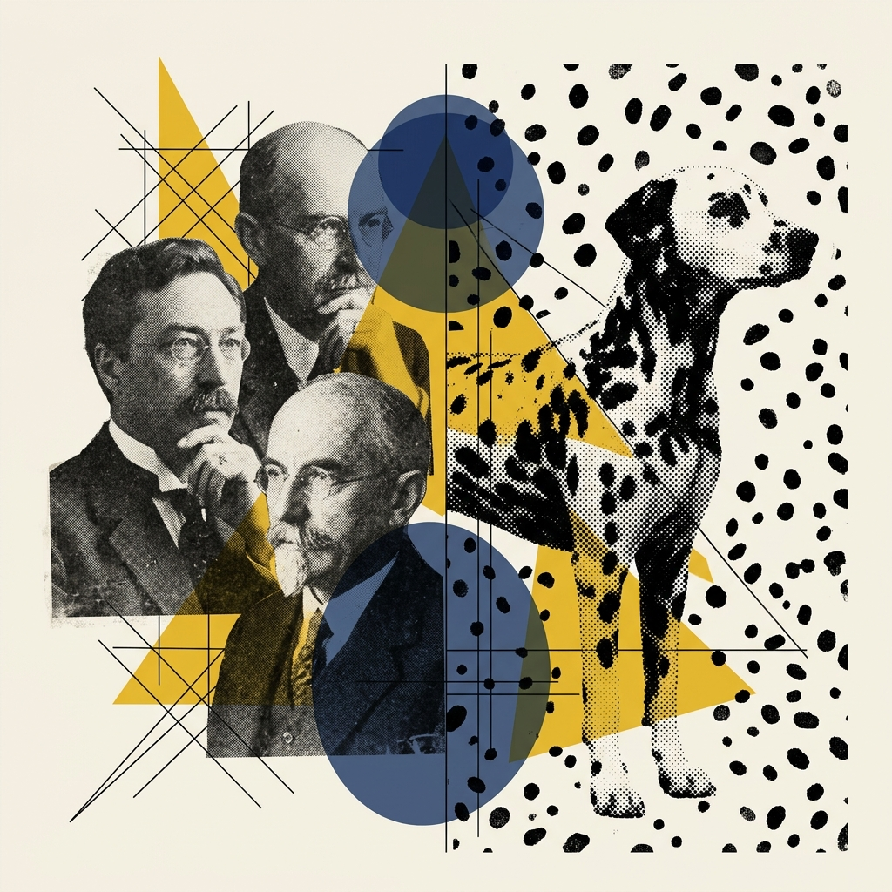
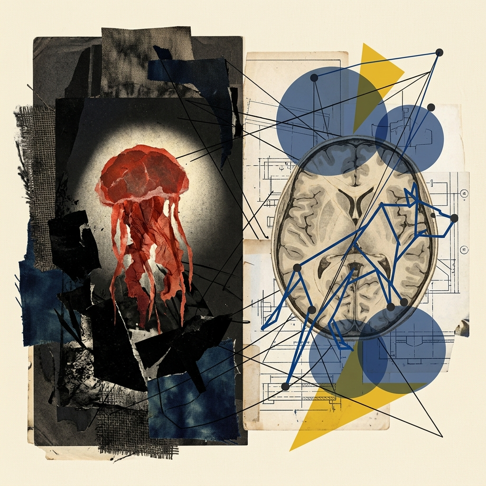
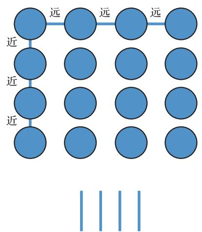
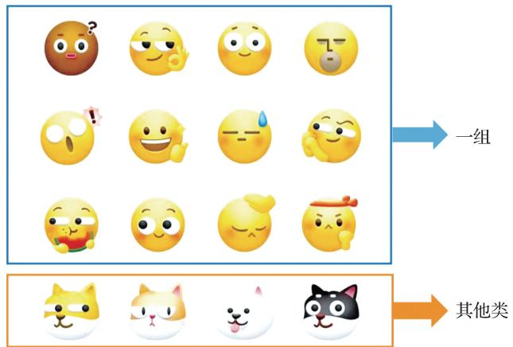
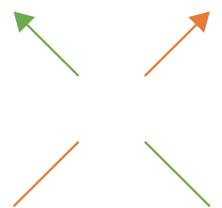
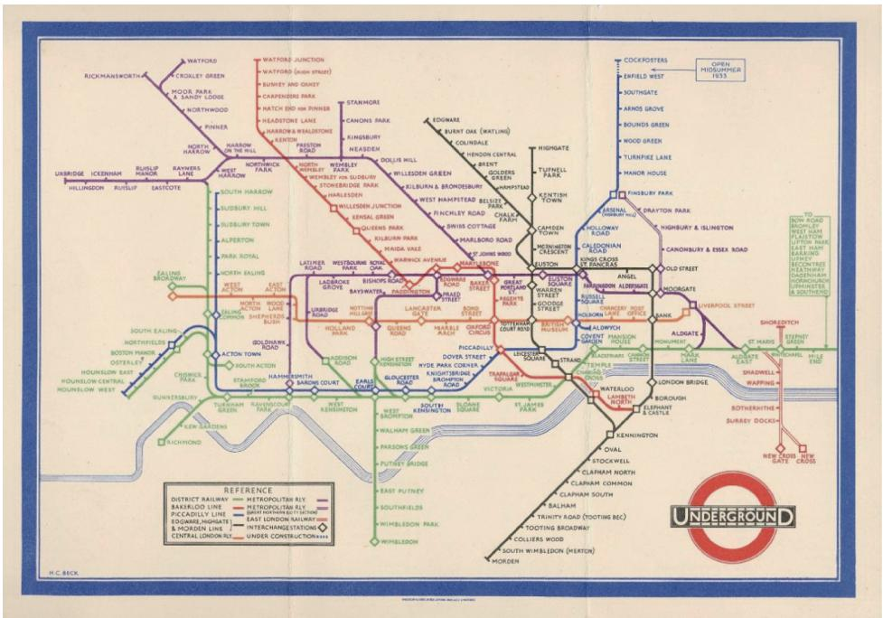
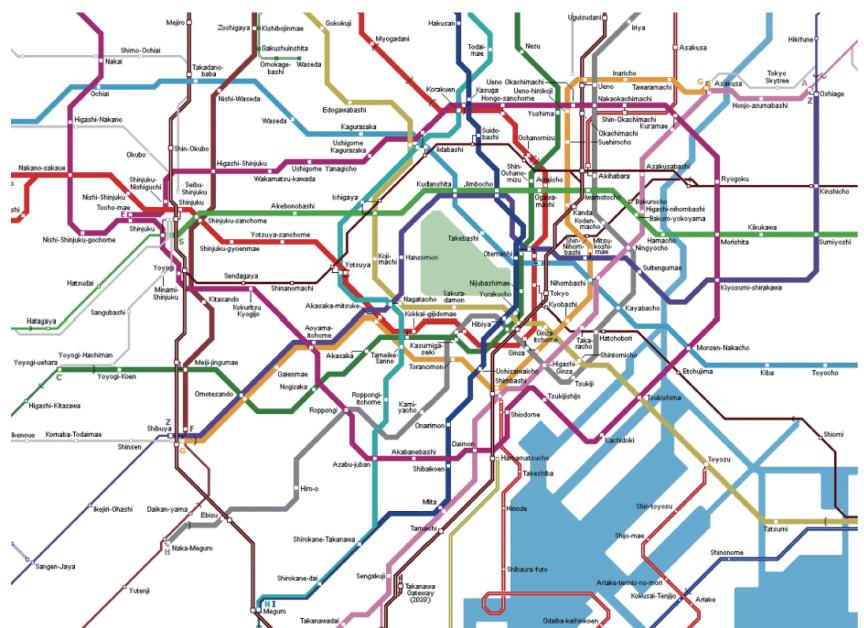
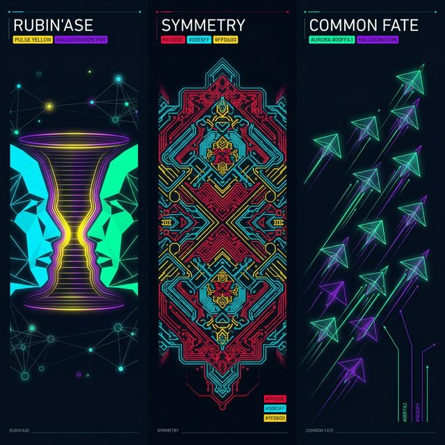
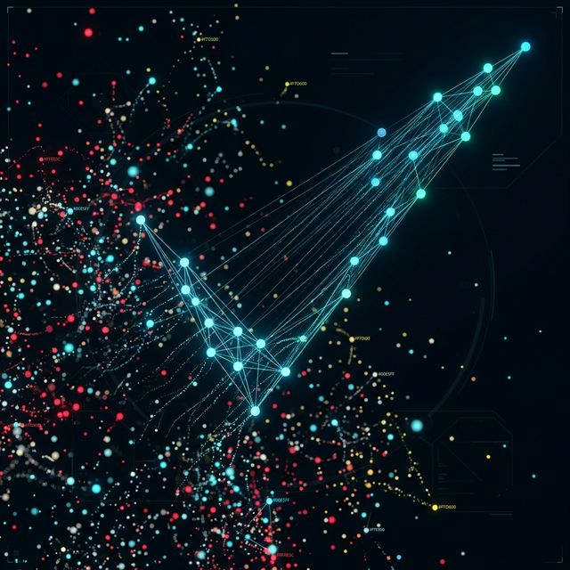
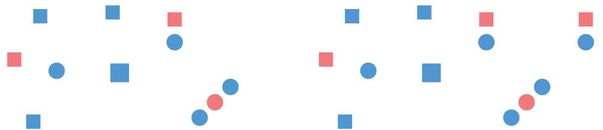

## Module 3: 格式塔原则——大脑的"找规律"强迫症 (35 分钟)
<!-- BUDGET: 4500 chars | LECTURE: 25m | ACTIVITY: 10m | SLIDES: ≥7 | STATUS: resolved -->

> [TEACHING MOMENT]
> 本模块介绍格式塔七大原则。不要只罗列干巴巴的概念，要用郝亚维教材中的经典图例和实际的"设计灾难"来反证。重点讲解大脑如何自动进行分组和闭合。

> [VISUAL]
> *   **Slide**: `S13_Gestalt_Intro`
> *   **Layout**: `Full`
> *   **Scene**: 左侧是格式塔学派三位代表人物的黑白照片（魏特海默、柯勒、考夫卡）。右侧是一张由很多不连接的小黑点组成的斑点狗照片（经典的格式塔错觉图）。
> *   **Text**: "格式塔心理学：不仅是看到形状，更是看到整体"
> *   **Asset**: 

[知识源: 郝亚维 §四(四)1 "格式塔原理" L322-328]

> [VISUAL]
> *   **Slide**: `S13a_Pre_vs_Gestalt_Transition`
> *   **Layout**: `Split`
> *   **Scene**: 左侧表现视网膜前注意机制：极暗的海底，一束刺眼的单束“聚光灯”死死咬住一个红色发光水母（代表无意识的异类报警/抓取）。右侧表现中枢格式塔机制：半透明发光的大脑皮层图像上，像建筑搭图纸一样，用发光的几何“排版骨架”和蓝色连线，硬生生把虚空中飘散的无数光点强行缝合组装成了一只有形状的猛兽（代表建立秩序与层级）。
> *   **Text**: "根本区别：左边是报警器，右边是秩序法官"
> *   **Asset**: 

### 一、 秩序法官：大脑皮层那不容置疑的“强行缝合”机制

刚才我们在讲前注意机制时，把它极其形象地比作了一盏无意识扫射的“聚光灯与强力报警器”，专门在一盘散沙中帮你极速抠出刺眼的异类。但这远远不够！如果在你的图表上全是几百个孤立弹出的红点和长棍，没有任何层级结构，大脑依然会彻底崩溃。

这就轮到另外一股极其伟大的中枢力量接管战场了。在 20 世纪初，德国的三位心理学家创立了**格式塔学派 Gestalt**。如果前注意的是聚光灯，那么格式塔就是深藏在你大脑皮层深处的那位患有严重找规律强迫症的**“排版骨架与秩序法官” (The Skeleton & Order Judge)**。

"Gestalt" 这个德语词的意思就是"形状"或"形式"。他们发现，面对信息爆炸的混乱世界，你的大脑为了节省高昂的认知算力和能量，会本能地抗拒杂乱无章。它会极其主动、甚至极其霸道地，将无数彼此原本没有瓜葛的碎片，通过**知觉分组**，强行在思维的暗房里“拼凑缝合”成一个有意义的整体结构网。

你们看刚才那张斑点狗错觉图——在纯粹视网膜的眼里，那就是一堆毫无关联的黑点，但在“格式塔秩序法官”的审判下，大脑瞬间动用隐形的排版骨架，把黑点"缝合"出了一只正在闻地面的实体斑点狗！

前人总共总结出了经典与衍生的多项原则。它们至今统治着全球数据看板搭建的绝对规范。

> [VISUAL]
> *   **Slide**: `S14_Gestalt_Proximity`
> *   **Layout**: `Split`
> *   **Scene**: 左侧展示"靠近性原则"图例（来自郝亚维图1-26）：四行四列等距排列的小圆点，然后当列间距缩小时，视觉自动分为四"列"；或者行间距缩小分为四"行"。右侧是超市货架的陈列实景照片，相近的商品摆放在一起。
> *   **Text**: "靠近性：距离产生美，也产生『伙』"
> *   **Asset**: 

[知识源: 郝亚维 §四(四)1 L330-337 + gestalt-principles-vis note]

### 二、 靠近性原则：基于底层距离感构建物理结盟

第一条原则叫做**靠近性原则 Proximity**。这是人类视觉中最底层的、也最强大的一种分组力量。

大家看屏幕左侧的这张图。本来，这仅仅只是 16 个等距排列的小黑圆点，在你们的眼里它们最初构成的是一个均匀的、没有任何内部纹理或结构的整体正方形方块。但是，当我们在排版时仅仅稍微动手脚，把垂直方向上列与列之间的距离放宽一点点，哪怕只有几个像素的改变——奇妙的事情发生了！你的大脑瞬间接管了你的视觉皮层，它蛮横地、强制性地告诉你："停下！这不再是一个完整的方块了，这是四根独立的柱子！" 这就是靠近性原则的绝对统治力：在人类的感知领域中，两个毫无关联的元素在物理空间上越是接近，它们就越有可能被我们的大脑强行"缝合"、"捆绑"在一起，被视为一个不可分割的整体组块。

为什么会产生这种现象？在充满伪装和极度危险的野生环境中，早期人类能够迅速判断哪些错综复杂的斑点属于同一个猎物或掠食者，是一项关乎生死的本能技能。如果视野中有一小簇距离相近的黄黑色斑点，你的大脑绝对不能去慢条斯理地逐一分析每一块斑点是什么，它必须瞬间跳过细节，把这些物理上彼此靠近的斑点合并成一个宏观预警信号。因此，靠近性原则就是这种底层生还本能在我们视觉神经系统中的深刻遗留。

> [LIFE CONNECT: 超市货架的靠近性陷阱]
> 我们把视线转到现代场景——屏幕右侧的超市货架图。为什么大型超市里，那些单价高昂、利润极其丰厚的全进口高级意料酱汁，总是紧紧贴着最普通的、打折促销的平价意面摆放？
> 这并非巧合。因为当你的眼睛在迅速扫描货架时，"靠近性原则"会让你潜意识里觉得：既然它们摆得这么近，那它们必然是天然的搭配组合。距离近，在人脑中就直接等同于逻辑上的强关联。这就是现代商业在肆意利用你百万年进化出的底层视觉认知规律，默默地挥发着消费暗示的作用。

在我们将这种机制应用到信息和数据可视化设计中时，这一条原理绝对是不可触犯的天条。比如在一个包含十几个类别的分组柱状图里，如果图表底部的文字标签排布得离原本对应的柱子稍微远了一点，反而离旁边那个不相干的柱子距离差不多，观众看错行、张冠李戴的概率绝对是惊人的。观众无法单纯依靠理性去分析哪条线对应哪个词，你必须在物理距离上把它们死死绑定。相关的元素，必须贴近；不相关的元素，必须用夸张的留白推开。如果违背这个原则，你就是在对用户的认知系统进行一种隐蔽的认知折磨。所以，留白不仅是为了所谓的版面好看，它更是为了在数据的战场上清晰地划定阵营边界。

> [VISUAL]
> *   **Slide**: `S14b_Gestalt_Similarity`
> *   **Layout**: `Split`
> *   **Scene**: 左侧展示"相似性原则"图例（来自郝亚维图1-27）：圆形和方形交替排列，即使间距相同，视觉自动按形状分组。右侧是两队穿着鲜明不同颜色球衣的篮球队员在混战中的俯视图。
> *   **Text**: "相似性：换个马甲我也认识你"
> *   **Asset**: 
> *   **Prompt**: 按照 Academic Minimalist 风格生成一张 Split 左右对比图：左侧展现格式塔相似性原理（方形与圆形交替），右侧展现俯瞰视角的篮球赛场，两队球员穿着反差极大的亮色球衣形成明显的视觉分组。

### 三、 相似性原则：穿越空间距离的视觉标签归类

第二条规则是**相似性原则 Similarity**。

请大家再次把注意力集中到屏幕左边，现在，我们把所有独立形状元素之间的物理间距调整得完全一样了。前面刚刚大展神威的靠近性原则在这里彻底失效了。但是，当这些排列考究的图形变成正方形和圆形相互交错的阵列时，你的眼睛依然没有被欺骗，它会立刻越过均等的空间距离，把同样形状的东西强行归为一类。在这个瞬间，系统向你大声呐喊："这是一排圆的，那是一排方的！" 

这向我们揭示了另一个人脑认知的捷径：当元素在空间距离上无法区分时，大脑就会开始疯狂寻找它们在外观属性上的共同点——比如形状、颜色、大小、或是表面纹理的走向。

> [DID YOU KNOW: 为什么对抗性竞技体育必须穿差异巨大的颜色？]
> 想象一下 NBA 季后赛生死战的最后一节，整整十个身高两米多、肌肉虬结的职业篮球运动员在一个极度狭小的半场空间内，展开了眼花缭乱的快速挡拆、无球穿插跑动和换防。双方主教练站在场边，他是如何在不到半秒钟的电光石火间，瞬间看清整个混乱局势的？
> 他依靠的绝对不是去费力辨认每一个球员的面孔或球衣号码。他高度依赖的，正是**相似性原则**。只要场上球员的球衣颜色哪怕只有一块显眼的色块共性（比如湖人金和凯尔特人绿），教练、裁判甚至看台上的球迷们的大脑，就会在毫秒级的时间内，把这群混战在一起的庞然大物像切豆腐一样整齐地劈成两个各自为战的严格阵营。

在极其复杂多维的数据可视化工程中，相似性是我们手中最强大的数据表征和属性编码工具。当我们需要在一张密密麻麻、如同星空般浩瀚的散点图上，去表达成千上万个离散数据点的归属类别时，我们根本不可能把同类数据强行拉到一起（因为X/Y位置坐标通常要用来表示最重要的数值关联关系）。这时候，我们就可以用相同的亮眼颜色、相似的交叉纹理、或者特定的符号形状，来强烈地暗示这些散落各处、互不相连的数据点，在逻辑深处其实是同类的。色彩编码作为可视化四大通道中使用最为广泛的一个，本质上就是对大脑相似性原则最直接、最粗暴、但也最有效的视觉榨取机制。

> [VISUAL]
> *   **Slide**: `S15_Kanizsa_Triangle_And_Space`
> *   **Layout**: `Split`
> *   **Scene**: 左半边展示经典的"卡尼萨三角"（Kanizsa Triangle）错觉图（来自郝亚维图1-29）：三个缺口的黑色吃豆人圆饼指向中央，排列出三个顶点，中间没有任何线条，但人们会清晰地看到一个倒立的白色发光三角形。右侧展示贝聿铭设计的苏州博物馆的极简留白空间。
> *   **Text**: "闭合性：大脑是一个疯狂的脑补大师"
> *   **Search**: `Kanizsa Triangle illusion ; Suzhou Museum I.M.Pei architecture whitespace`
> *   **Asset**: 

[知识源: 郝亚维 闭合性 L338-352]

### 四、 闭合性原则与留白法则：由受众脑补补画完成的幻像残影

接下来的这条原则极具东方传统的哲学意味，它从神经科学的角度毫不留情地证明了一点：我们引以为豪的大脑不仅会寻找规律，它甚至还会肆无忌惮地"捏造事实"。

第三条，也是学界公认最神奇、最难以防范的一条，叫做**闭合性原则 Closure**。

请大家集中注意力，死死盯着屏幕左边这张图看上几秒钟。现在请告诉我，你们刚刚在这张图里清楚地看到了什么东西？我相信，此时这间教室里的所有人，心里都会浮现出一个无比笃定的答案：我刚才看到了一个纯白色的、甚至感觉它的局部亮度比周围背景底色还要高出一个层级的倒三角形，它正狂妄地盖在三个看起来软趴趴的黑色圆饼上面。

但如果此时此刻，我让在座的各位拿出一把世界上最精准的电子卡尺，去逐寸测量屏幕上的发光像素点，你们能找到哪怕半根属于那个白色的倒三角形本身的边界实体线条吗？完全没有。这张被心理学界研究了近乎百年的经典图例上，切切实实只印着三个被齐刷刷切掉一角的黑圆饼。那个依然在你视网膜残影中闪闪发光、有着锐利边缘的纯白色倒三角形，彻彻底底完全是你自己大脑私自加工生产出来的"精密幻觉"。

为什么高级神经中枢会呈现如此不可思议的反应？根本原因在于，人类的脑神经回路极其恐惧那些残缺不全的几何图形和未闭合的不确定性信息。当它在解析视觉信号时看到了这种具有强烈向心收敛趋势、但却在关键物理连接处硬生生断裂的残缺信息时，它会觉得异常的焦虑和难受。为了平息这种认知失调带来的巨大痛苦，你的大脑果断地动用了积累的三维空间常识，自动在那些原本空无一物的虚空中，强行为你勾勒出了虚拟的视觉张力线，极力帮你把这个摇摇欲坠的图形结构做了一次完美的心理闭合。

> [PHILOSOPHY: 建筑学中的闭合与留白——贝聿铭的格式塔]
> 让我们跳出平面的数据图表，看看空间的艺术。屏幕右边是当代建筑巨匠贝聿铭先生生前的绝笔之作——著名的苏州博物馆新馆。
> 任何一个去实地参观过的人都会被一种极具震撼力的纯粹感所击中。在建筑群的墙面上是大面积没有任何多余雕饰的粉色白墙。作为现代主义大师，贝老在这里极其克制，他仅仅通过在墙体边缘、屋脊转角处，洗练地布置了几段几何形状极简的深灰色花岗岩线条。奇迹在于，就是这几根看起来孤立、断续的灰色线条，配合着纯白留白，硬生生地让漫步其中的人，脑海里不由自主地拼凑出了一副巨大、完整、连绵不绝的江南传统水墨山水长卷。
> 但这真的是没有代价的吗？这绝对构成了跨越学科界限的闭合性原则被运用到极致的顶级艺术。

> [VISUAL]
> *   **Slide**: `S15b_Negative_Space_Art`
> *   **Layout**: `Full`
> *   **Scene**: 经典的负空间设计海报（如联邦快递 FedEx 的隐藏箭头，或者是 WWF 熊猫标志）。
> *   **Text**: "负空间法则：用『没有画出来的东西』去构建整体"
> *   **Search**: `Fedex logo hidden arrow Gestalt closure example`
> *   **Asset**: 

真正高超的设计师，永远不会事无巨细地把所有的废话塞满画布。，他们只负责极其吝啬地给出最核心的认知锚点。剩下的最激动人心的视觉构建工作，他们优雅地退后半步，彻底交给观众充满想象力的大脑去"脑补"完成。

在日常打交道的数据可视化工作乃至移动端 UI 界面设计中，闭合性原则都是现代极简主义风格不可动摇的视觉基石。这意味着，你根本不需要像个守财奴一样给图表的边边角角画满沉重死板的黑色边框，也绝对不需要在图表背景里铺满如同苍蝇网一样的各种刻度辅助线。只要你对数据图形元素的空间排列足够得当一致，只要数据的内在趋势指向足够明确清晰，观众那个贪婪的大脑会自动启动认知修正程序，帮你把剩下的边界框线、辅助趋势线在思维的暗房里补全。这就是为什么现在的苹果系统设计或者高级商业数据产品经常采用所谓的"无界留白"设计，感觉异常通透且高级。这绝不仅仅是为了现代极简审美，这是数据设计师对人类大脑底层认知冗余补偿机制的一次华丽运用和深度信任。

> [VISUAL]
> *   **Slide**: `S16_Gestalt_Continuity`
> *   **Layout**: `Split`
> *   **Scene**: 左半边展示简单的连续性原则纯学术图例（对标郝亚维图1-28）。右侧并列展示被誉为信息设计史巅峰里程碑的哈里·贝克版伦敦地铁图（对标郝亚维图2-35），以及东京地铁交通地图（对标郝亚维图2-37），展现极致提纯的水平垂直及 45 度直线如何化解视觉断裂危局。
> *   **Text**: "连续性：顺流而下的惯性与哈里·贝克的巅峰重构"
> *   **Asset 1**: 
> *   **Asset 2**: 
> *   **Asset 3**: 
> *   **Prompt**: 按照 Academic Minimalist 风格重绘融合了哈里·贝克经典伦敦地铁纯直+45度角风格特征的高复杂换乘示意图，展示多条鲜艳颜色的轨迹线在交点处如何平滑顺畅穿插。

### 五、 连续性原则：磁悬浮列车式的顺畅视线巡回

回顾完神奇的闭合现象之后，我们来看看另一条与之密切相关的准则——第四条原则：**连续性原则 Continuity**。

如果说闭合性是大脑在修补漏洞，那么连续性则是视知觉系统对视觉顺滑度的一种近乎严苛的强迫症追求。人类的视觉系统极其反感突然的、生硬的物理轨迹折断，它总是带着一种巨大的视觉防冲撞惯性，强烈地倾向于沿着当前平滑的几何轨迹线段一直盯下去、看下去。这就好比是一列正在做高速贴地飞行的磁悬浮列车，它在物理层面上绝不可能在零点一秒的极短刹那间完成一百八十度的原地锐角掉头转向。

日常生活中最贴切的经典例子就是屏幕上这张令人看了头皮发麻的现代大都会地铁线路图。它的史诗级鼻祖，正是诞生于 1933 年、由绘图员哈里·贝克首创的伦敦地下铁线路图（如右图所示）。哪怕是像处于东京新宿或者本国一线城市这种级别错综复杂的超级大运量立体换乘枢纽，五六条代表不同运行路线的一团乱麻般、有着各种不同鲜艳色彩编码的复杂线段交织堆叠。但哈里·贝克惊人地利用了人类大脑的连续性视觉习惯，他生硬且狂妄地把原本歪曲扭曲的地理走线，全部强行拉直并统一规定成了水平、垂直与绝对完美的 45 度对角线。奇妙的是，只要每条地铁线的走向路径在经过这个混沌交叉节点前后能够继续保持固有的直线轨道延续，你的眼睛依然能够仿佛拥有了 X 光透视挂件一般，极其顺理成章地沿着它当前的轨道切线，丝般顺滑地直接追踪出你该乘坐的那条回家路线，而绝不会在复杂的交叉处被生硬的锐角节点拐骗。这就是基于格式塔认知的殿堂级删繁就简法则！

这也从最根本的生物几何感知角度解答了一个可视化新手的常识疑问：为什么在展示长周期的股票涨跌大牛熊时间趋势序列、一整年的全境宏观气温连续爬升曲率、或是长达几十年的国家宏观人口结构变化周期趋势时，连绵起伏的光滑数据折线图或是那些像水流一样波澜壮阔、极具视觉冲击力的平滑面积河流图，即 **Streamgraph** ，由于没有产生断点，永远都要比我们在网格纸上一根根孤立地戳在那里的、各自完全割裂断开的柱状图阵列好读整整一到两个认知理解数量级差？因为那些平滑连续延展拉长的细长线条数据墨迹，极其完美地契合了人类眼球平移那种"一泻千里顺流而下"的高速扫视视觉阅读惯性，从而戏剧性地将受众大脑在此捕捉宏观发展大周期趋势大方向的认知计算时间成本被大幅狠狠地压缩剥离到了某种极限低值。

> [VISUAL]
> *   **Slide**: `S16_New_Gestalt_Intro`
> *   **Layout**: `Center`
> *   **Scene**: 两根极简单的几何立柱交织在一起，代表新时代降维法则的引入。
> *   **Text**: "压倒一切的新法则：画地为牢与血脉连线"

### 六、 新型降维双重武器：画地为牢的物理同域与血脉羁绊连接

在这前四条经典的“基础缝合”法则之上，现代信息可视化架构尤其推崇两种具备极其蛮横、绝对压倒性力量的新生代格式塔衍生原则——**同域 (Common Region)** 和 **连通原则 (Connectedness)**。

> [VISUAL]
> *   **Slide**: `S16a_CommonRegion`
> *   **Layout**: `Full`
> *   **Scene**: 数据仪表盘切片概念图：在一个被轻微边框包围的长方形区域内放置了各种杂乱形状和颜色不一的几何形态，强烈暗示了“同域”阵营划分。
> *   **Text**: "同域法则：画地为牢的物理区隔"
> *   **Asset**: 

第五条，**同域原则 (Common Region)**。无论前面的靠近性或者相似性讲得多天花乱坠，现在只要我在画布上极其粗暴地圈出一个有着微弱底色或者浅灰细边框的独立封闭矩形区域，把其中一群极度丑陋且颜色千奇百怪的数据元素全部“画地为牢”锁在这个区域里。你的大脑立马就会无视它内部一切杂乱和抗争，把它们死死地认定为同一个阵营。这也是为什么你翻看现今所有主流极其通透的商业 BI 看板大盘时，它们永远都是用一张张圆角“卡片”去排布各种不同类型的指标块的原因。这就是绝对粗暴但极度好用的物理区隔强加法。

> [VISUAL]
> *   **Slide**: `S16b_Connectedness`
> *   **Layout**: `Full`
> *   **Scene**: 复杂的散点极简阵列。其中两个颜色、大小均不相同且相隔极远的散点，被一条极其纤细锐利的张力直线直接死死连接在一起。
> *   **Text**: "连通法则：跨越时空的血脉连线"
> *   **Asset**: 

第六条，**连通原则 (Connectedness)**。这是格式塔派系杀伤力最顶尖的热核武器规则：只要有一条实体的线把图表上原本离着十万八千里远的两个图形连接在一起——对不起，哪怕它们颜色完全不同、中间隔着几百个其他圆点，只要有了这根实体的牵引线，连通性原则就会瞬间击溃其他所有法则（包括颜色相似性和物理靠近性）。我们的大脑会产生一种无可置疑的极强纽带认知：“它们必须就是强关联的一家人。”这也是人类在绘制社交拓扑网络图和物流路由图时的终极依赖。

在处理完了所有节点的强行关联之后，最后的三个经典原则将彻底拔高视野，探讨全局画面的层级构建与运动属性。

> [VISUAL]
> *   **Slide**: `S16b_Figure_Ground_Symmetry`
> *   **Layout**: `Comparison`
> *   **Scene**: 左侧：著名的格式塔两可图形——鲁宾之杯（Rubin vase, 郝亚维图1-30），你可以把它看作是一个具有西洋风格的高脚白色酒杯，也可以在下一秒瞬间将其翻转识别为两张在黑色背景中相互对视的人脸侧影。右侧：简单对称性（郝亚维图1-31），展现人类对对称和谐模式的极端偏爱，比如完整的、分割均匀的圆环数据图表对抗那些比例杂乱、极度破碎的不规则饼图碎片。
> *   **Text**: "层次与秩序的博弈：在这张画布上，究竟谁才是真正的主角？"
> *   **Asset**: 

[知识源: 郝亚维 L354-371]

### 七、 层级秩序法庭：全局运动追踪、视觉对称平衡与背景退让

第七条原则是**主体与背景 Figure-Ground**。
大家看左侧屏幕上著名的"鲁宾之杯"。当你把中间白色看作酒杯时，它是"主体"，黑色是"背景"；当你把黑色看成对视的两个人脸时，黑边变成了"主体"。你的大脑无法同时看清两者，它必须在一毫秒内做出裁决：主角是谁？陪衬是谁？

在商业智能，简称 **BI** 数据可视化实战中，这个原则决定了一张图表的成败。数据图形本身（比如折线、柱子）必须毫无疑问地成为"主体"。而那些辅助阅读的元素——比如坐标轴、网格线或背景色——必须被果断地降级为"背景"。这就要求使用深浅灰度对比、极低透明度等手法降低网格线的存在感。如果不加节制地使用粗黑网格线，甚至加入花哨的底纹背景，就会发生灾难性的"喧宾夺主"，观众的大脑就会混乱，分不清到底该看数据还是该看背景。

第八条原则是**简单对称性 Simplicity/Symmetry**。
我们的大脑在处理复杂信息时极其"节能"，它天生偏爱那些对称、规则、简单的几何图形，因为处理它们的认知成本最低。如果面对一张零碎复杂的图表，大脑会本能地抗拒和排斥。

这极其直接地解释了，为什么对于一个平淡无奇的数据切片，如果被你强行切成了几十瓣大小不一、颜色杂乱的极度破碎饼图，观众连一眼都不会多看。与其挑战人类基因里对"不可预测复杂性"的抵触，不如顺应大脑偏爱规则的自然期望。

> [VISUAL]
> *   **Slide**: `S16c_Common_Fate_Motion`
> *   **Layout**: `Full`
> *   **Scene**: 在黑色屏幕背景上散落着数以百计杂乱无章的发光粒子。讲师点击播放后，其中一小批特定点群突然步调一致地向屏幕右上角同步飞行（动作参考郝亚维图1-32共同命运原理模型）。同时展示大雁"人"字形迁徙阵列快照。
> *   **Text**: "共同命运：不仅要长得像，还要去向相同"
> *   **Asset**: 
> *   **Resource**: ../public/textbook/图1-32_图1_－32_共同命运原则图例.jpg <!-- TODO: 教材扫描件待补充 -->
> *   **Prompt**: 按照 Academic Minimalist 风格生成一张 Split 左右对比图：左侧是天空中朝着同一方向同步飞行的巨大候鸟群，右侧是高速公路上车流的粒子运动可视化，极其强调学术图1-32中“相同运动方向即被视为绝对同类分组”的共同命运属性。

最后，第九条，也是唯一探讨运动的一条：**共同命运原则 Common Fate**。
如果你看着天空中乱飞的鸟群，只要其中十几只鸟同时在一个方向上加速，大脑就会立刻判定："这十几只鸟属于同一个团队"。

在交互式的网页可视化和动效设计中，共同命运是灵魂。如果成百上千个散点图中的数据点，有几十个点以相同的速率一起飞行汇聚，你根本不需要画任何连线或者标注，观众会瞬间明白它们构成了一个数据类群。这就是动态组块的视觉魔法。

> [ACTIVITY]
> *   **Type**: `Discussion`
> *   **Duration**: `10min`
> *   **Desc**: **"图表急诊室" (Bad Chart ER)：诊断病理标本并开具重构处方 (Prompting)**。
>     1. 教师在屏幕依次展示五大“病历图表”：[病历 A] 彻底失控的意面图（主治：图底层级）；[病历 B] 支离破碎的爆炸切片饼图（主治：视觉完形）；[病历 C] 反人类的卡片散落大盘排版（主治：群组缝合/邻近性）；[病历 D] 依赖距离产生错误认知与多维关联嵌套（主治：同域与连通机制）；[病历 E] 群魔乱舞的炫技式延迟入场加载（主治：动态协同）。
>     2. 引导学生（口头抢答或弹幕）完成诊断，必须用这节课学到的格式塔术语精准定性，并指出它对读者的认知造成了什么误导。
>     3. **处方撰写**：要求学生利用初阶的 SPACE 脚手架 (Role + Context + Task + Constraints)，结合病理诊断写出一句能直接指挥黑盒 AI “直接在对话框画出大图”的降噪重构提示词，建立将格式塔认知转化为 AI 自然语言调度的意识闭环。

这七大原则，将陪伴你们整个可视化设计的职业生涯。但当我们掌握了脑神经如何解析点线面之后，面临的更严峻问题是：在海量的数据和庞杂的代码实现中，我们该如何避开"工业垃圾"，找到那唯一正确的设计解？

避免不可知的幻觉混乱，找到正确的唯一解答。

> [VISUAL]
> *   **Slide**: `S16d_Gestalt_Summary`
> *   **Layout**: `Grid`
> *   **Scene**: 九宫格版面，浓缩复盘今天讲授过的核心格式塔：靠近、相似、闭合、对称等，用几何极简图形示意。
> *   **Text**: "格式塔七则总结：掌控视觉重心的无形之手"
> *   **Asset**: 

这就是我们今天讲授的最核心认知法则。请各位将这九宫格里的靠近、相似、闭合等几何与认知规律深深印在脑海中。它们是设计背后的无形之手，不仅能帮助你精准确立图表的视觉重心，更能指引你跨越海量数据表达的混沌，最终达成逻辑、功能与艺术美学的高度统一闭环。

今天我们掌握了大脑如何自动"解读"视觉元素——从前注意弹出到格式塔分组，你们已经初步理解了人类视觉"解码"信息的底层机制。但有一个更深层的问题我们还没触碰：这些视觉元素最初是如何被"编码"出来的？

> [VISUAL]
> *   **Slide**: `S16e_Information_Communication_Model`
> *   **Layout**: `Full`
> *   **Scene**: 庄重极简地重制展现经典的信息传播交流大闭环图谱（严谨还原郝亚维原书图1-33），展示出信源 -> 编码 -> 信道 -> 解码 -> 信宿 -> 反馈回路的无缝闭环逻辑线条。
> *   **Text**: "可视化的终极本质：一场严密的视觉编码与传播流动"
> *   **Asset**: 

在我们的另一本基石教材《信息可视化设计》中，郝亚维教授借用传播学的经典全链路框架，极其犀利地指出：可视化的本质就是建立“信源、编码、信道、解码、信宿”的全生命周期信息流回路。你这周拼尽全力去设计格式塔结构，不过是为了让受众在“解码”这一步走得更加顺畅无阻。

那么更为致命的前置问题来了：你作为“信源”，究竟该如何完成第一步的致命“编码”？下周，我们就将正式跨入本学科极其硬核的进阶领域：视觉通道编码与映射理论。你们将学习如何像分配有限弹药一样，将抽象高维的数据体系，完美且精准无误地挂载映射至形状、色彩等视觉通道之上。

---
