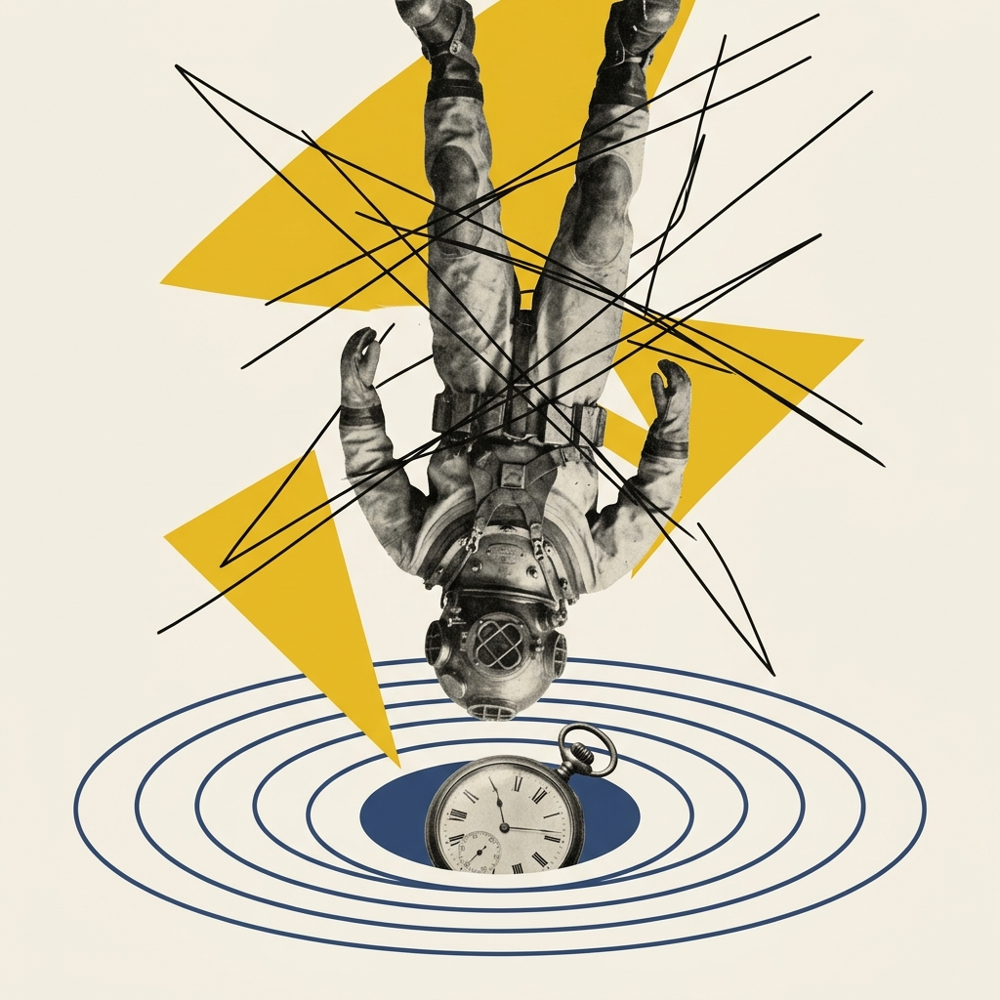
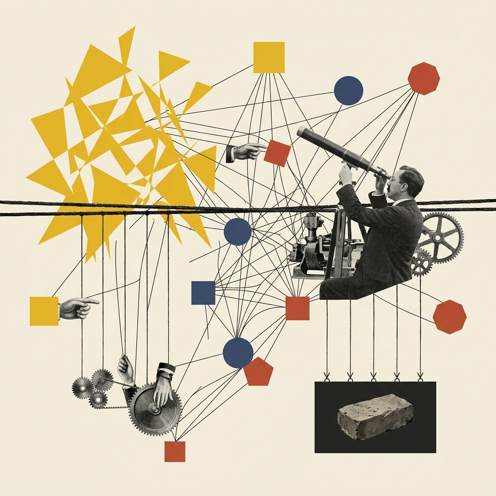
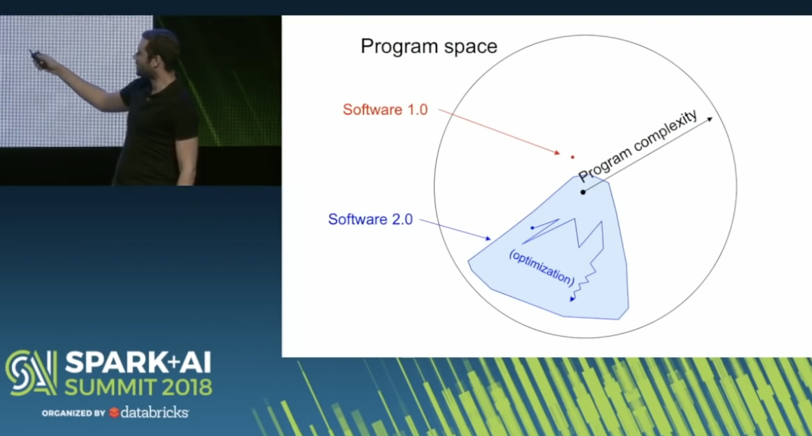
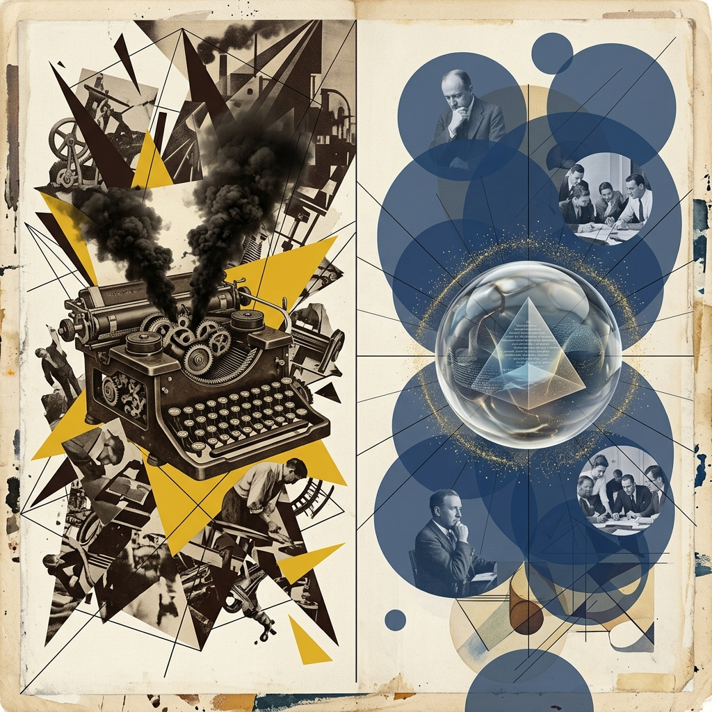
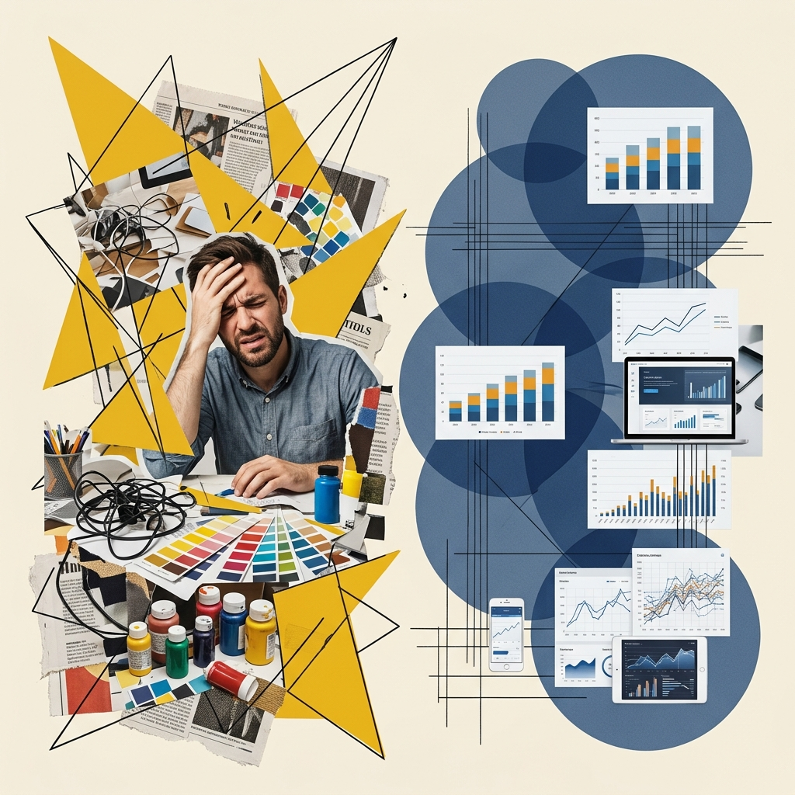
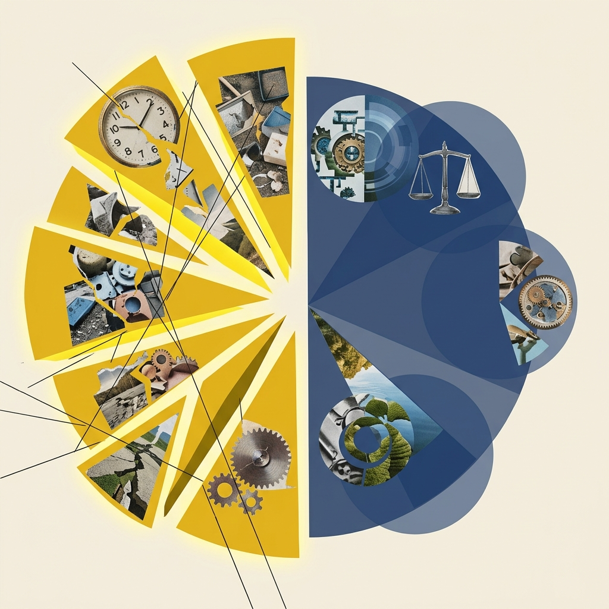
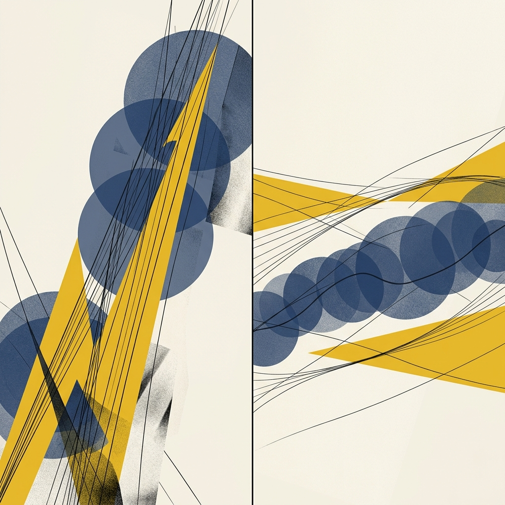

## Module 5: 范式革命——Vibe Coding 与生成的艺术 (20 分钟)
<!-- BUDGET: 3600 chars | LECTURE: 20m | ACTIVITY: 0m | SLIDES: ≥5 | STATUS: done -->

> [TEACHING MOMENT]
> 本模块是从理论过渡到实战落地的桥梁。核心逻辑：为什么做图难（设计空间太大）→ 为什么变快了（AI 极速生成扩展了空间）→ 为什么更危险了（AI 的数据失真幻觉与误导）。最后通过强任务驱动的 Activity，让学生体验并建立审查代码和图表的批判性思维。

### 5.1 课前引言：设计搜索空间模型构建

> [VISUAL]
> *   **Slide**: `S17_Vibe_Coding_Intro`
> *   **Layout**: `Full`
> *   **Scene**: 人类设计师不再握着画笔，而是像交响乐指挥家一样，面对着全息的数据粒子流发号施令，代表着 Vibe Coding 的全新心智框架。
> *   **Text**: "范式革命：从画图工到数据交响乐指挥家"
> *   **Asset**: 

请大家在脑海里建立起这套关于**设计搜索空间**的心智模型。它将帮助我们在后续面对复杂数据时，理解为何我们常常陷入平庸妥协，以及如何借助新范式破局。

<!-- 知识源: Munzner §1.11 L160-173 完全详解扩展 -->

### 5.2 探索困局：受限于算力的平庸妥协

同学们，此前的理论模块我们从生理结构讲到了格式塔认知。现在，我们要面对一个残酷的实战问题：当你拿到一份复杂的数据，怎么才能做出一张让评委和客户眼前一亮的**可视化作品**？

为了解释这个痛点，加拿大不列颠哥伦比亚大学的 Tamara Munzner 教授提出了**设计搜索空间 (Design Search Space)** 理论。

> [VISUAL]
> *   **Slide**: `S17_Design_Space`
> *   **Layout**: `Split`
> *   **Scene**: 表现“深海寻宝”与“设计搜索空间漏斗”。
> *   **Text**: "深海寻宝：广阔的设计搜索空间"
> *   **List**:
    - "1. 可能空间: 浩瀚汪洋，客观存在的所有视觉可能性总和。"
    - "2. 知识空间: 你的潜艇级别（受限于你目前掌握的代码能力工具）。"
    - "3. 备选空间: 氧气即将耗尽（死线逼近），你无力瞎逛，只真实测试了 3 块礁石。"
    - "4. 选定方案: 最终向上交付的结果，被迫拿最后一块平庸贝壳交差。"
> *   **Asset**: 

想找出一个绝佳的图表方案，就像是大海捞针。请看屏幕右侧这个不断收缩的“倒漏斗”模型：

*   **1. 可能空间 (Possible Space)**：世界上客观存在的所有视觉组合的总和。
*   **2. 知识空间 (Knowledge Space)**：受限于你当前掌握的工具技能（如不会代码交互），限制了可用的手段。
*   **3. 备选空间 (Considered Options)**：受限于时间精力，你真实测试和比对过的少数几种方案。
*   **4. 选定方案 (Selected Solution)**：最终由于死线逼近和渲染瓶颈，被迫向上交付的平庸妥协方案。

> [VISUAL]
> *   **Slide**: `S17b_Bounded_Rationality_Philosophy`
> *   **Layout**: `Flow`
> *   **Scene**: 康定斯基与达达主义的“有限理性”视觉碰撞。画面表现一位设计师在无数飘忽不定的碎片（代表无尽的视觉可能性）中挣扎，最后被迫抓住一块朴素的积木。
> *   **Text**: "为什么总是向平庸妥协？因为工具卡住了你的手脚"
> *   **Asset**: 

因为精力和技术边界有限，面对复杂数据，我们往往摸到一个及格方案就立即接受。这种受限于工具的**妥协窘境**正是传统创作的软肋。打破这种尴尬，意味着一场极速的创作革命。

> [VISUAL]
> *   **Slide**: `S18_Software_Evolution`
> *   **Layout**: `Center`
> *   **Scene**: 前 OpenAI 科学家 Andrej Karpathy 的经典原声演讲截图。他正站在大屏幕前展示“程序空间”拓扑图，讲述 Software 2.0：人类不再需要逐行死磕代码，而是去划定一个范围，让算法引擎自己去寻找极好的表现形式。
> *   **Text**: "软件 2.0 时代：把搬砖的苦活交给机器"
> *   **Asset**: 
> *   **Asset (AI fallback)**: 
> **Source**: Locked -- 人工选定的全景演讲截图，Andrej Karpathy (YouTube)

我们必须牢牢把握这一**范式转移的力量**，它将深刻重塑你们的**创作习惯**。

<!-- 知识源: vibe-coding-paradigm 最新前沿调研 2025 -->

### 5.3 核心突破：直觉编程重塑创作范式

这正是过去两年发生的颠覆性效率转变——**Vibe Coding（直觉编程）** 方法论。

前 OpenAI 科学家 Andrej Karpathy 把这种飞跃称之为“**Software 2.0 (软件 2.0)**”。我们在视频里看到，过去无论是程序员去攻克每一行枯燥的代码，还是设计生在屏幕上拖拽每一个坐标轴、连错一根线就要重头再来，这都在做 1.0 时代繁重繁琐的**底层物理执行**。

而在 Vibe Coding 的 2.0 语境下，情况变了！你不再需要去死记硬背复杂的专业软件工具或查阅说明书。你是直接通过“**日常口语对话的指令（提示词）**”与 AI 搭档，只专注输出你想要的**美感要求和最终目标**，纯粹的体力活全丢给机器解决。

> [VISUAL]
> *   **Slide**: `S18b_Workflow_Comparison`
> *   **Layout**: `Comparison`
> *   **Scene**: 1920年代的老旧打字机与充满液态光泽的现代悬浮水晶球的并置对比。左侧（手绘画图）表现深沉压抑的暗褐色调，繁复的机械齿轮因为卡壳而冒出浓重的黑色烟雾；右侧（直觉编程）则是明亮通透的普鲁士蓝色调，一段纯粹的自然语言映射在半透明的棱镜上，四周散发着高效流动的金色粒子。
> *   **Text**: "范式转换：痛苦的底层执行 vs 畅快的直觉发号施令"
> *   **List**:
    - "❌ **手工作坊 (Hand-Crafting)**: 底层物理执行耗时极长，脑力被软件操作掏空。"
    - "✅ **直觉指导 (Vibe Coding)**: 专注统筹大局与美感目标，分钟内探索高阶方案。"
> *   **Asset**: 

> [CASE STUDY: 传统制作 vs 直觉指导的火花碰撞]
> 让我们来看一个典型场景对比。假设期末作业，老师给你一份“包含十年全球气温变化”的巨量数字表格，让你做一个可以互动的彩色气温动画。
> 
> 采用**传统工作流**：
> 1. 受限于 DOM 渲染和手工排版，你耗费一天时间在取色器和对齐网格里打转，大脑被枯燥的软件操作掏空。
> 2. 最终只能产出基础静态图，根本无暇思考：**这张图真的讲好了一个有感染力的故事吗？**
> 
> 切入 **Vibe Coding（直觉编程）**：
> 你化身为**美术指导 (Art Director)**。
> 
> 只需敲下一行字：“换一版厚重的工业风，突出温度峰值的颜色冲突”，几秒钟后，引擎便能从浩瀚的设计空间中瞬间捞出你原本无力尝试的高阶动效变体，迭代成本趋近于零。

> [VISUAL]
> *   **Slide**: `S18c_Vibe_Coding_Speed`
> *   **Layout**: `Comparison`
> *   **Scene**: 左右分屏：左侧显示苦闷的设计师面对复杂的调色盘；右侧显示几行自然语言文本瞬间生成多个高质量的数据可视化变体矩阵。
> *   **Text**: "迭代的魔法：将操作成本归零"
> *   **List**:
    - "传统工作流：被面板困死的操作工"
    - "直觉编程 (Vibe Coding)：用指令驱动的高效美术指导"
> *   **Asset**: 

> [ACTIVITY]
> *   **Type**: `QA`
> *   **Duration**: `2min`
> *   **Desc**: **认知假说碰撞**
>     抛出问题：既然 Vibe Coding 这么强大，无论做多复杂的图表都有大模型代劳，是不是意味着我们在座各位这学期辛辛苦苦学的“信息可视化理论”瞬间变成废纸了？未来大家只用动动嘴皮子就能躺着下班了吗？（这直接引出下一节：为什么基础理论，在智能时代反而是你唯一的防身武器）

### 5.4 海市蜃楼：警惕数据畸变的视觉谎言

然而，当 AI 极速迎合需求时，一场危机也随之而来。制作精美图表的硬件门槛消失了，但 AI 为你端出的，往往不再是严谨的数据真相。华盛顿大学的可视化研究学者 Michael Correll 将这种包装精美但本质谬误的产物称为**视觉谎言（Visualization Mirages）**。

> [VISUAL]
> *   **Slide**: `S19_The_Catch_Simons`
> *   **Layout**: `Split`
> *   **Scene**: 表现“可视化海市蜃楼”的认知冲突。画面中心是一架老式变焦镜头，镜头外明明只是一颗微小的碎石子，但通过带有扭曲效应的黄色放大透镜，这颗小石子在画面上被荒诞地拉伸成了一座巍峨陡崖。通过比例错乱隐喻机器引擎的“数据畸变”。
> *   **Text**: "美丽的毒药：被 AI 喂养的视觉谎言"
> *   **List**:
    - "若不审查逻辑就全盘接受，那是一种盲目的自杀。" —— Simon Willison
    - "Vibe Coding 撤销了你搬砖的辛苦，但也把审查真相的重担全部扔给了你。"
> *   **Asset**: 

<!-- 知识源: vibe-coding-paradigm note 挑战与 AI 幻觉 -->

与此同时，知名 AI 研究者 Simon Willison 也严厉警告说：对大模型瞬间生成的华丽结果无脑照单全收，必将引发严重的信誉翻车。大模型缺乏对物理比例和商业常识的深刻理解，容易在以下两类陷阱中污染**数据真相**：

> [CASE STUDY: 陷阱一：伪美学偏见——“赛博朋克 3D 饼图灾难”]
> 假设你想做一张咱们专业内部历届学生男女比例的可视化。为了让期末展示拉风一点，你在跟 AI 搭档时随意提要求：“画面感要有赛博朋克科幻感，图表立体厚重一点。”
> 
> 5 秒钟后，机器自作聪明地为你端出了一个带霓虹光效的巨大 **3D 甜甜圈图**，而且在画面上酷炫地仰角倾斜了 45 度。
> 
> 乍一看是不是很酷炫？但是同学，这破坏了数据原本承载的意义！因为把 2D 平面图拉伸成 3D 视角后，受透视畸变原理影响，靠外圈镜头最近的小分块（其实真实数据只有 15% 占比），在视觉感知面积上，看起来竟然比远处的最大分块（根据大纲设定占比）还要巨大！
> **大模型只管满足你随口提的一句“赛博朋克”审美的字面意思，却冷血地谋杀了“严谨展示数据比例对比”的核心职责。** 它加上的那些花俏边框和深邃光影，都在疯狂挤占观众感知核心数字的注意力。

> [VISUAL]
> *   **Slide**: `S19a_Cyberpunk_3D_Pie`
> *   **Layout**: `Comparison`
> *   **Scene**: 强烈对比图：左边是炫酷、倾斜的 3D 发光饼图，视觉上小份额显得更大；右侧是朴素严谨的 2D 平面饼图或条形图，真实呈现客观比例。
> *   **Text**: "伪美学偏见：透视畸变谋杀了数据真相"
> *   **List**:
    - "被扭曲的 3D 谎言：近大远小摧毁客观比例"
    - "严谨的 2D 真相：让数据回归客观的平视映射"
> *   **Asset**: 

更要命的，是**数学基座**上偷偷摸摸的修改：

> [CASE STUDY: 陷阱二：涨粉神话的假象 (被截断的坐标轴)]
> 你给某校园社团做官方账号运营。月末盘点，粉丝数从月初的 10,000 人涨到了 10,050 人（微增 50 人）。你想做一张增长折线图，吩咐 AI：“画个动态增长曲线，画面排版要显得结构紧凑、丰满冲击力一点！”
> 
> 结果折线图呈现出惊人的 80 度陡坡，微小的增长在视觉上被夸大成了流量神话。
> 
> 这个谎言藏在 Y 轴的数字里：为了达到构图紧凑的要求，AI 引擎私自执行了具有高度欺骗性的**“截断 Y 轴（Y-Axis Truncation）”**操作。它抛弃了图表必须“从 0 刻画”的常识公理，将 Y 轴起点偷偷定在 10,000。如此一来，起伏平缓的真实数据波浪，在视觉上被直接拉长拉陡，造成了严重误导。

> [VISUAL]
> *   **Slide**: `S19b_Truncated_Y_Axis`
> *   **Layout**: `Split`
> *   **Scene**: 左右对比同一份微增数据：左侧是 Y 轴起点为 10000 的“火箭升空”陡峭折线图；右侧是 Y 轴正常从 0 开始的平缓波纹折线图。
> *   **Text**: "截断坐标轴：私自篡改地平线的比例欺诈"
> *   **Asset**: 

在 AI 时代，机器只是为了满足“排版紧凑”的表面要求，便悄无声息地制造了视觉上的**虚假繁荣**。

### 5.5 审计员出击：以认知常识审查机器引擎

当拼贴制图的**技术门槛**瞬间清零，咱们信息可视化这门“硬核基础理论”的含金量非但没跌价，反倒成了未来你在职场保底保命的最后一道**认知防鲨网**。

> [VISUAL]
> *   **Slide**: `S19c_Auditor_Mindset`
> *   **Layout**: `Center`
> *   **Scene**: 一个坚定的人物剪影站在巨大的由 0 和 1 构成的数据瀑布前，手里握着一把红色的“审计印章”。
> *   **Text**: "从底层执行到心智裁决：用认知常识审查机器引擎"
> *   **Asset**: 

只要你敢与大模型共舞，请永远把下面这句话刻在脑子里：**机器确实能极快地为你渲染出一张张炫目的高级表皮。但面对底层的空间度量、光影引致的心理偏倚以及数据求真纪律时，它依然像个初学者。**

**假若你自身没有掌握前三节课学的“格式塔原理”等认知铁律做防弹衣，不去充当一个严谨的审计员（例如明确指令：“所有柱状图坐标必须从零开始！”或者“拒绝使用含有角度欺骗的 3D 饼图！”），那么很快，你一定会被那个表面华美但内里失真的数据虚像所误导。在严肃的对外展示台面上，为机器引擎的谬误盲目背书，会严重损害你的专业信誉。**

> [VISUAL]
> *   **Slide**: `S19d_Auditor_Action`
> *   **Layout**: `Split`
> *   **Scene**: 机器渲染出的炫目但失真的图表，与人类设计师冷静审视、一针见血的红色修改批注形成的对比张力。
> *   **Text**: "成为美与确切的最终裁决者"
> *   **Asset**: 

有了跨时代的工具，你不再是当年那个因为一点排版挪移而熬到脱发、累死累活的图库装配工了；你蜕变成了能够决定什么是“美与确切”的**审查与裁决者**。你能够一眼看破绚烂虚饰下埋伏的**数据畸变雷区**。

### 5.6 生成的艺术：当数据跳出坐标系，成为审美的画布

> [VISUAL]
> *   **Slide**: `S20_Generative_Art_Intro`
> *   **Layout**: `Split`
> *   **Scene**: 左侧是一张极其枯燥的 Excel 股票数据波动表；右侧是基于同一份数据，利用代码（如 p5.js 或 Shader）生成的如同呼吸般闪耀的粒子星云艺术图。
> *   **Text**: "生成的艺术 (Generative Art)：跳出坐标系的数据狂想"
> *   **Asset**: 

既然大家已经具备了清醒的“审计员”心态，不再轻易被机器的劣质幻觉所欺骗，那么我们终于可以安全地解开 Vibe Coding 的最后一层封印——**生成的艺术 (Generative Art)**。这也是我们这个模块标题中极其浪漫的后半句。

过去，受限于繁重的手工绘图，设计师绝大部分的精力都耗费在如何把柱状图对齐、如何把折线画平滑上。而现在，由于 AI 的极速接管，那些枯燥的“标准化”表达成本降为了零。这就倒逼我们去思考一个极具野心的问题：如果不再追求纯粹的业务指标展示，数据还能变成什么？

答案是：**数据可以脱离坐标轴，成为一种拥有体温的数字生命体。**

> [CASE STUDY: Refik Anadol 与机器的梦境]
> 我们来看当今最具代表性的数据艺术家 Refik Anadol 的作品。他没有用常规的折线图去展示数据，而是将纽约现代艺术博物馆（MoMA）过去 200 多年的所有馆藏艺术品影像数据、超过 13 万张图片，全部喂给了机器学习模型。
> 

> [VISUAL]
> *   **Slide**: `S20a_Refik_Anadol_MoMA`
> *   **Layout**: `Full`
> *   **Scene**: Refik Anadol 在 MoMA 的震撼数字装置《Unsupervised》。大屏幕上是不断翻滚、如液态颜料般流动的生成式艺术模型。
> *   **Text**: "Refik Anadol《Unsupervised》：让机器去梦见 200 年的艺术史"
> *   **Asset**: 
>
最终在巨大的展厅里，呈现出的是一面如同拥有呼吸一般、不断变幻着形态与色彩的液态数字瀑布。这就是《Unsupervised》（无监督）。他将人类两百年的美学积淀，变成了一种宏大的视觉流体。在这里，你不需要去看懂精确的数值刻度，你只需要站在大屏幕前，去**感受**数据带来的压倒性的情感震撼。

这就是**生成艺术**的核心魅力：利用算法的不可预见性，将冰冷的结构化数据，转化为极具感染力的感官体验。在 Vibe Coding 的加持下，你们只需要输入几行充满诗意的提示词，定义好色彩的基调与粒子的运动物理法则，机器就能瞬间在屏幕上绽放出千万种不可思议的视觉变体。

在这个全新的创作范式里，图表不再仅仅是对客观世界的**测量**，它升华为了对客观世界的**表达**。这正是技术赋予我们的最高特权：从枯燥的数据操作工，蜕变为用代码与数据作画的新时代数字艺术家。

好，所有的理论干粮终于啃完了！接下来，咱们立刻切换进**一线火线对抗状态**！我们要靠刚到手的 Vibe 技能，亲自去拆掉那些被抛光的骗局盲盒，去体验用数据作画的魔力！

> [VISUAL]
> *   **Slide**: `S20_Vibe_Demo_Activity`
> *   **Layout**: `Center`
> *   **Scene**: 实战大工坊的沉浸式视觉冲突。一...
> *   **Text**: "【大工坊实战揭幕】：用你刚学到的 Vibe Coding 揪出 AI 的视觉谎言"
> *   **Asset**: 

这就是我希望在进入实战工坊前，给到大家最真诚的忠告：面对智能引擎，你要做清醒的**设计架构师**，而不是被机器操控的**执行工具**。

> [TEACHING MOMENT: 认知理论是你不被取代的终极壁垒]
> 我们刚才讲解大模型错误时，使用的判断依据全部来自前几节课。这其实与我们前面学习的视觉通道映射与格式塔心理学有着紧密的深层绑定。格式塔理论强调人类大脑善于在混乱中寻找规律，而直觉编程的本质，恰恰是要求设计师跳出具体的单个节点连线，站在更高的全局统计学视角去向机器设定这些规律要求。
> 
> 当你可以仅凭几句自然语言指令，就瞬间调度成百上千的数据图元位置时，你用来指挥引擎的基础算法，其实就是“接近性”、“连通性”和“共同命运”等认知原则。
> 
> 如果你不懂这些认知原理，你的提示词将变得没有灵魂，只是在盲目堆砌渲染特效，AI 生成的最终效果也必然是一盘结构崩塌的虚幻散沙。因此大家必须警醒：在生产力爆炸的今天，算法工具和前端图表引擎的语法版本会飞速更迭过时，但深植于人类大脑灰质层里的格式塔认知与空间隐喻原理却是跨越千年的持久基座。
> 
> 掌握“视觉是如何影响大脑处理信息”的客观物理规律，才是大家在未来工具无限迭代的浪潮中，始终保持专业权威性、避免被自动化廉价劳动力所取代的核心职业壁垒。

