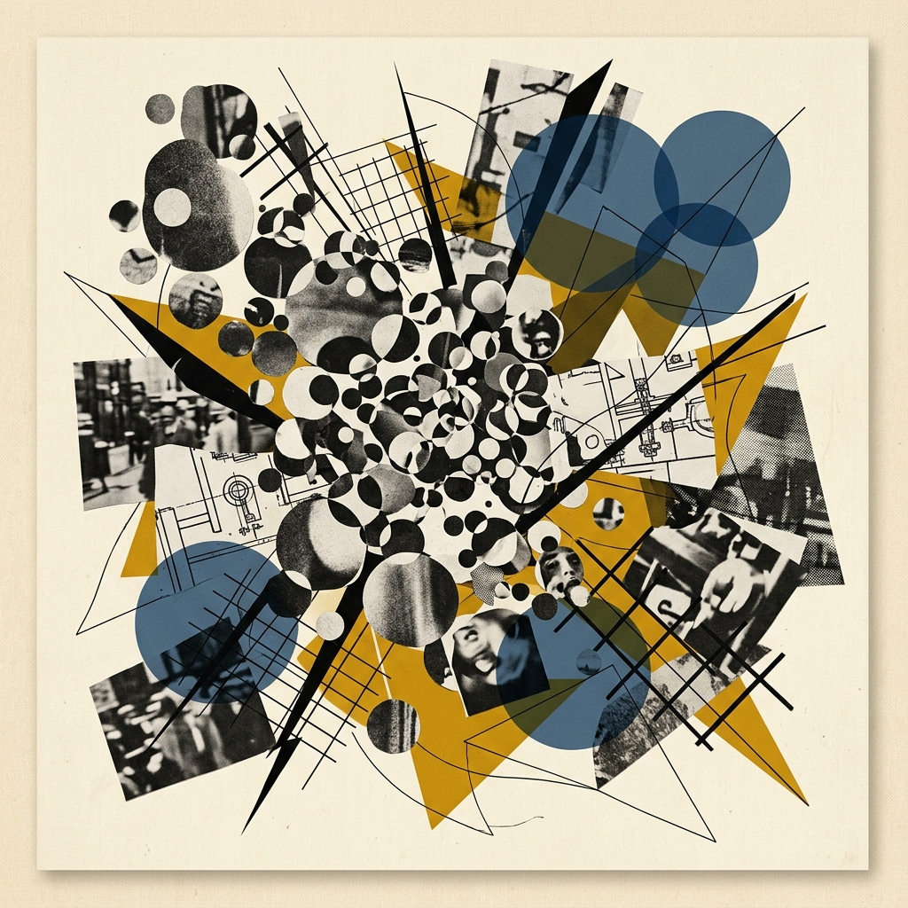
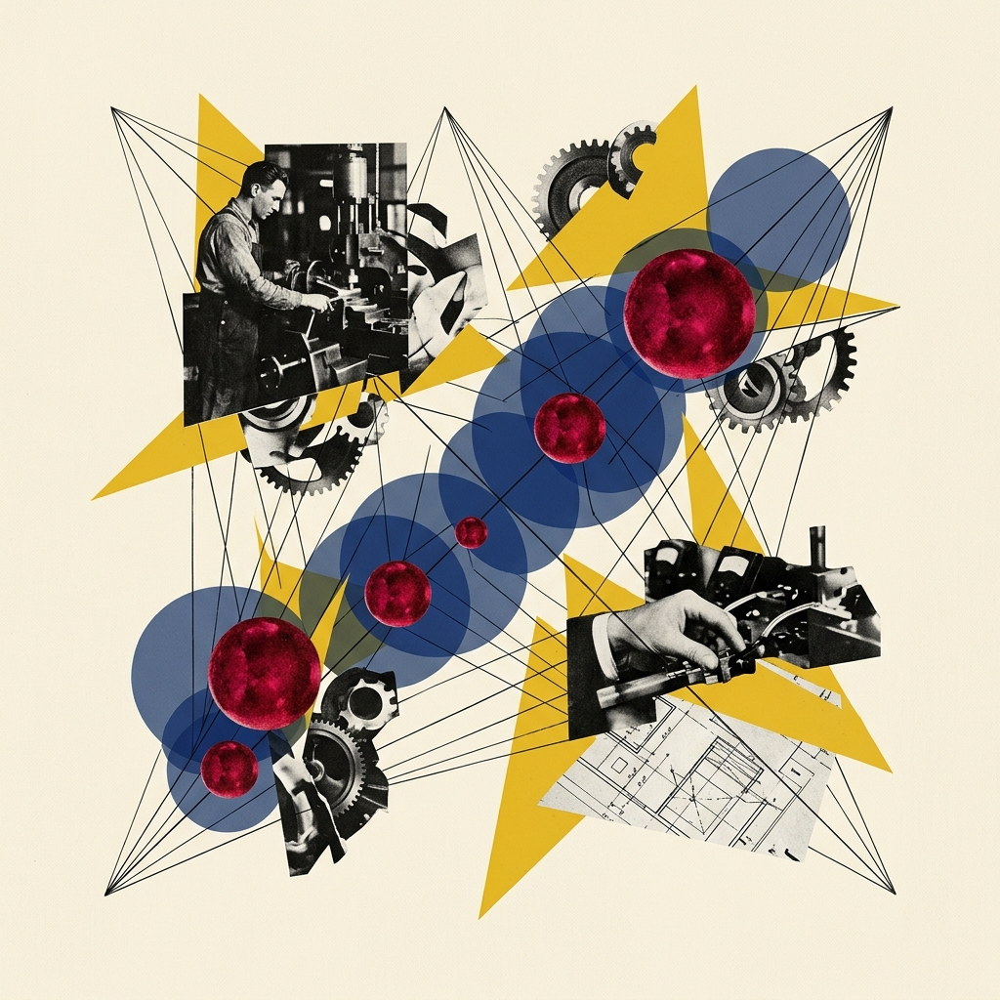
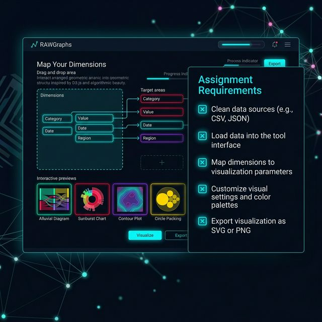

## Module 6: 双轨映射大工坊：让数据说话 (75 分钟)
<!-- BUDGET: 0 chars | LECTURE: 15m | ACTIVITY: 60m | SLIDES: ≥4 | STATUS: done -->

### 6.1 双轨对撞：跨越 GUI 崩溃向高阶黑盒重定向

> [TEACHING MOMENT]
> 本模块包含纯实践环节与课程结语，完美承接 course.yaml 中的实践比重，落实《实践指南》。让学生通过 RAWGraphs 零代码拖拽与 AI Vibe 黑盒渲染，真真切切感受前端算力极限与高阶提示词降噪的作用。

> [VISUAL]
> *   **Slide**: `S21_Workshop_Overview`
> *   **Layout**: `Center`
> *   **Scene**: 左侧是密集的 RAWGraphs 崩溃数据节点，右侧是极简高亮的黑盒输出图表，形成强烈对比。
> *   **Text**: "双轨映射实战：GUI 崩溃的脆弱性 vs 黑盒算法的降噪霸权"
> *   **Asset**: 

接下来进入实战工坊。我们将对 **Spotify 2025 全球热单音频特征分析** 的底层数据展开极限界剖。

> [ACTIVITY]
> *   **Type**: `Workshop`
> *   **Duration**: `60min`
> *   **Desc**: **双轨大工坊：RAWGraphs 拖拽 vs AI Vibe 直出**
>     - **Step 1 准备**：分发“2025年 Spotify 全球热单音频特征分析”CSV数据。
>     - **Step 2 Track A (RAWGraphs 拖拽体验极限)**：学生将 Valence 映射到 X 轴，Energy 映射到 Y 轴，流派映射颜色，播放量映射大小（强制气泡放大至 60px）。**目的**：观察普通浏览器 DOM 引擎在渲染上万个巨型节点时产生的前注意拥堵与性能崩溃，印证 Display Capacity 资源极限。
>     - **Step 3 Track B (Vibe 指令驱动重构)**：学生使用 AI 高级数据分析端，套用“三层架构 Prompt”进行图表重写：
>       - (1) 角色背景：“你是顶尖数据架构师，处理 Spotify 情绪特征库。”
>       - (2) 核心目标：“展现高播放量单曲在 Valence/Energy 散点中的聚集阵列。”
>       - (3) 美学约束：“采用极简墨水原则。低播放单曲全部灰度虚化，头部 10% 热单赋予高饱和正红色聚焦高亮。”
>     - **Step 4 迭代调优 (Iterative Vibe Check)**：引导学生通过对话微调：“增加透明度层叠”、“切换暗黑深海底色”、“去除杂乱网格线”，体验如何将精力集中于格式塔统筹而非底层排版操作。

> [TEACHING MOMENT]
> 活动结束后，课程进入收尾 (15分钟) 和布置实践指南中的课后任务。

**Pause: 3s**

### 6.2 阵痛复盘：跨越底层蓝领向云端心智裁决跃迁

好，今天的破冰工坊时间马上就要到了。各位刚才的对比演练应当带给了你们两个刻骨铭心的**体验痛点**：

> [STORY TIME: 实习生汇报与 DOM 劫难]
> 曾有数据分析实习生，在向总监汇报时为了炫技，执意用前端图表库在普通浏览器内毫无删减地强行渲染包含十万个气泡的散点图。结果密集的数据节点瞬间挤爆了内存池，导致汇报大屏直接白屏死机。
> 这印证了无视格式塔降噪法则、强行挑战 **Display Capacity 资源极限**所必须付出的性能与视觉代价。

> [VISUAL]
> *   **Slide**: `S21ba_GUI_Pain`
> *   **Layout**: `Full`
> *   **Scene**: RAWGraphs 中几千个气泡疯狂重叠在一起导致的视觉泥浆灾难。
> *   **Text**: "痛点法则一：GUI 时代 DOM 渲染的脆弱崩溃"
> *   **Asset**: 

第一种痛点，是当你像个传统工具劳工一样在可视化界面里生拉硬拽时体会到的**认知拥堵和浏览器 DOM 极限崩溃**；

> [VISUAL]
> *   **Slide**: `S21bb_Agent_Architecture`
> *   **Layout**: `Full`
> *   **Scene**: 经过自然语言调度后，处理出的处于深色背景上的极为干练的降噪气泡图，局部高亮如红宝石般醒目。
> *   **Text**: "痛点法则二：将心智拔高为架构与审美裁决"
> *   **Asset**: 

而第二种痛点，则是当你不懂用**格式塔法则**进行**图底退让**和**重点弹出**的心智设计时，大模型也只会吐出缺乏焦点的**图表垃圾**。

这印证了我们在模块 M05 中的结论：在这个范式革命的时代，决定你不可替代性的，不再是掌握某种画图软件的操作熟练度，而是你作为审查和裁决者的底层视知觉修养！

### 6.3 课后行动：真实世界的病灶猎杀与格式塔处方

最后，请大家打开我们在课程仓库的 `practice_guide.md`，那里有你们这周要自行突破的课后极客小作业——**野外猎杀与格式塔处方**。

> [VISUAL]
> *   **Slide**: `S22_Homework_Assignment`
> *   **Layout**: `Split`
> *   **Scene**: 界面上排列着一个放大镜对准真实世界杂乱新闻网页的侦探式图标，旁边展示着包含红笔圈出病灶的真实图表截图与极简的 AI 重构版对比。
> *   **Text**: "课后极客作业：野外猎杀真实图表与靶向格式塔处方"
> *   **List**:
    - "1. 野外猎杀：从日常媒体或报告捕获一张真实的病理图表并截图。"
    - "2. 病理诊断：输出约 200 字诊断书（主治维度、病因、处方方向）。"
    - "3. 靶向修复：用 Vibe Coding (Prompt) 驱动 AI 实施降噪重构并输出高清成品。"
    - "4. 审计校验：执行判官检查清单，排查截断 Y 轴、彩虹色阶、幻觉伪造等。"
> *   **Asset**: 

在这个任务中，请你们从日常接触的真实信息源中，猎捕**一张存在严重可视化问题的图表**。写一份约 200 字的诊断，指出它违背了课堂上讲过的哪条原则，并给出处方方向。

接着，运用格式塔降噪法则，向大模型下达准确的**降噪重构指令**，将其转化为一幅**高信噪比的视觉产物**。

同时，永远不要忘记你作为“**审计员**”的职责，必须对 AI 输出的图表执行自检：Y轴是否截断？色彩编码是否清晰？有没有擅自编造虚假数据产生**海市蜃楼**？

大家需要打破所谓的“**伪美学偏见**”，发挥你们的**批判性审查**能力，完成从病灶诊断、AI 降噪重构到交叉审计的核心流程！

> [ACTIVITY]
> *   **Type**: `QA`
> *   **Duration**: `1min`
> *   **Desc**: **下课前终极抢答**
>     谁能用一句话总结大家今天的破冰体悟：当 AI 已经能一秒钟暴风画图时，我们在座各位信息可视化架构师不可替代的核心壁垒究竟是什么？（答：从绘制代码蓝领彻底跃迁为心智架构裁决与审计判官）

**当心你的判断！**下课。
