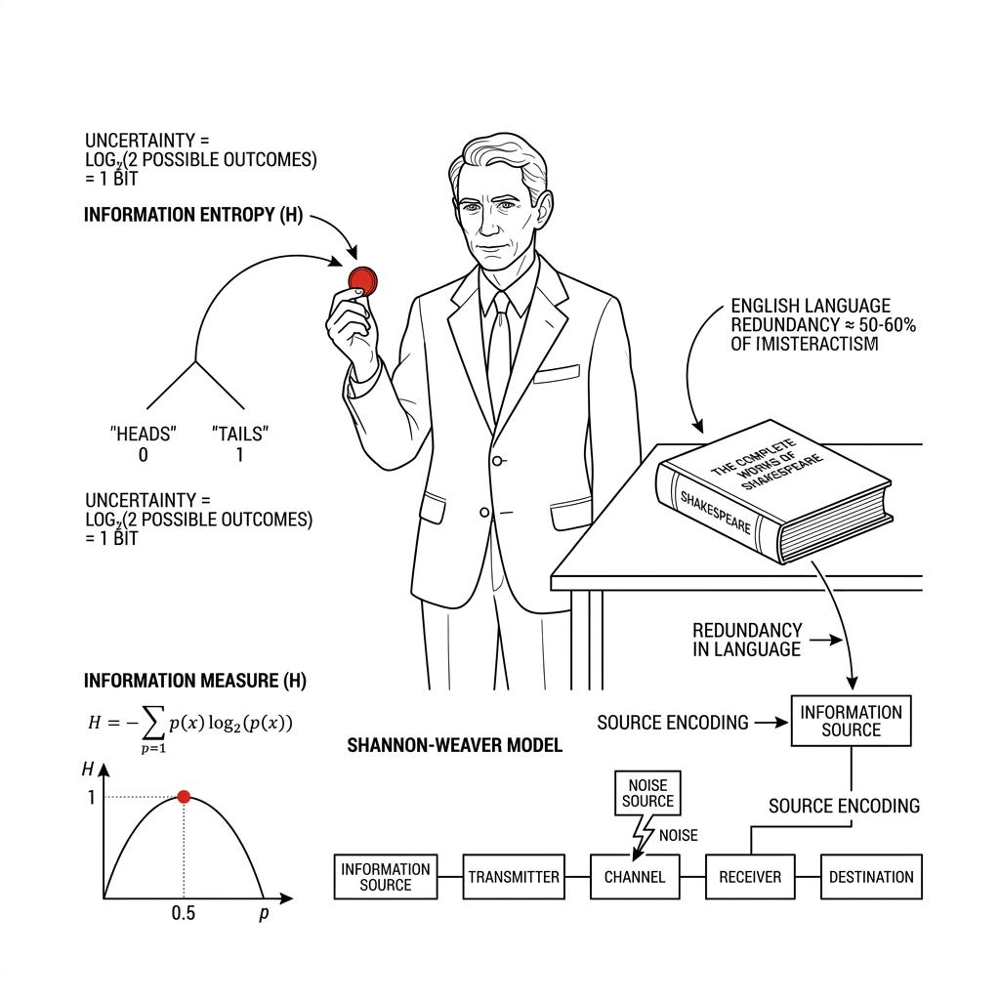
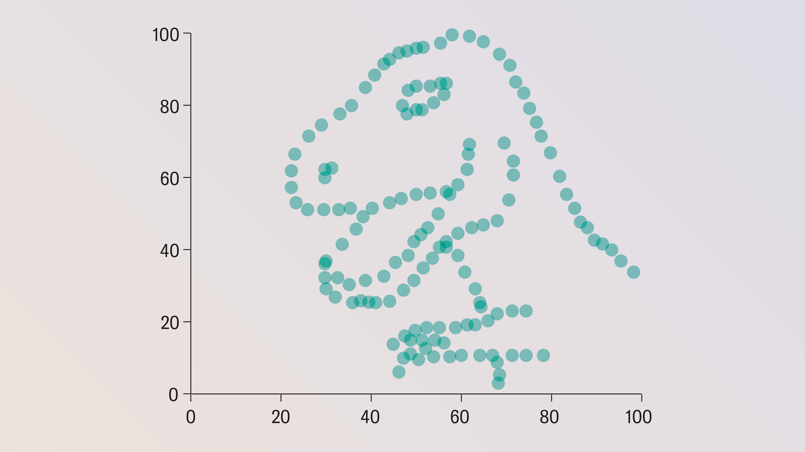
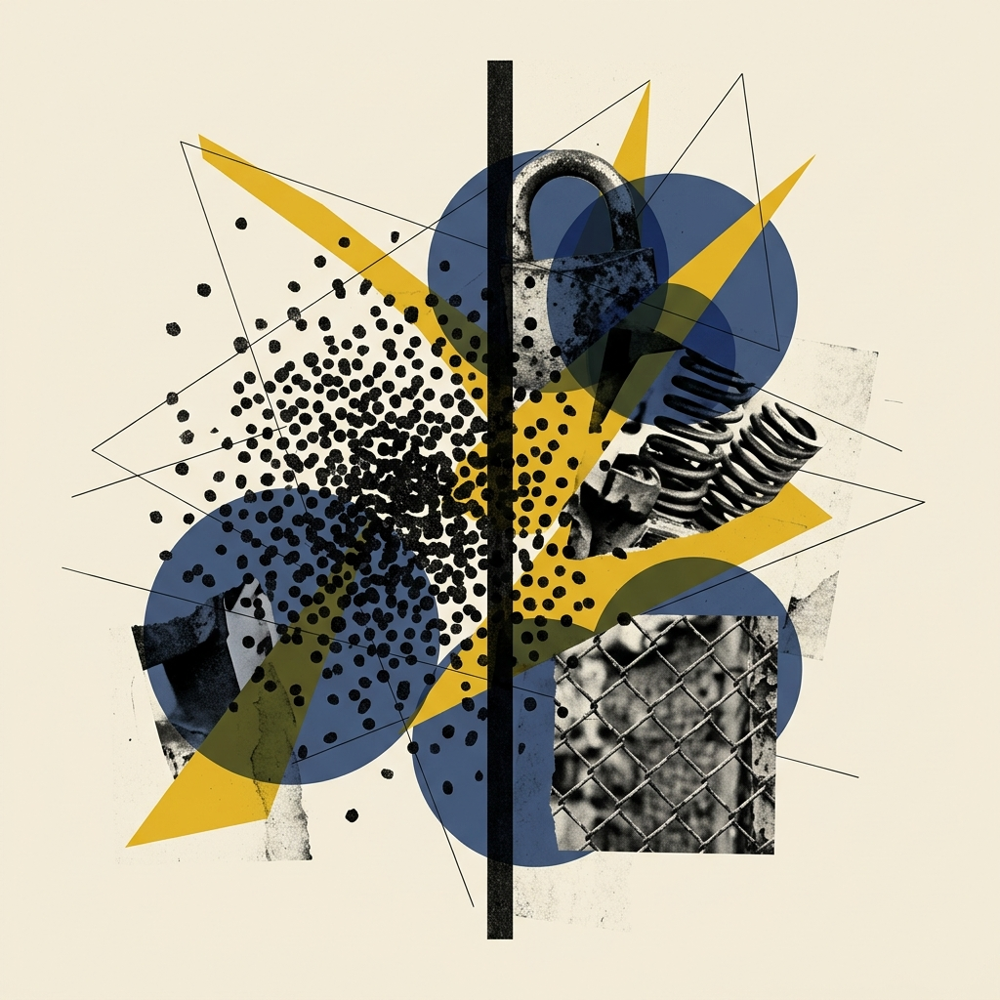
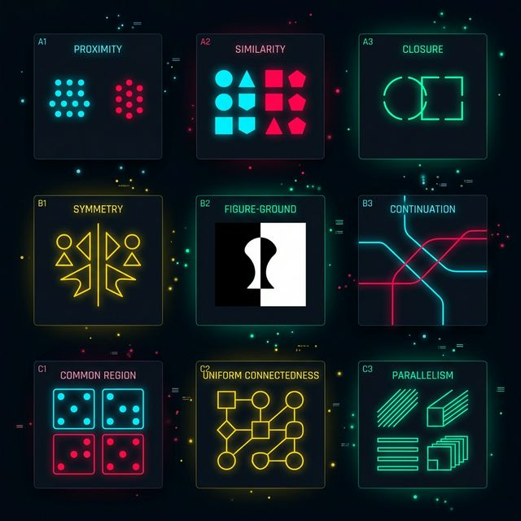
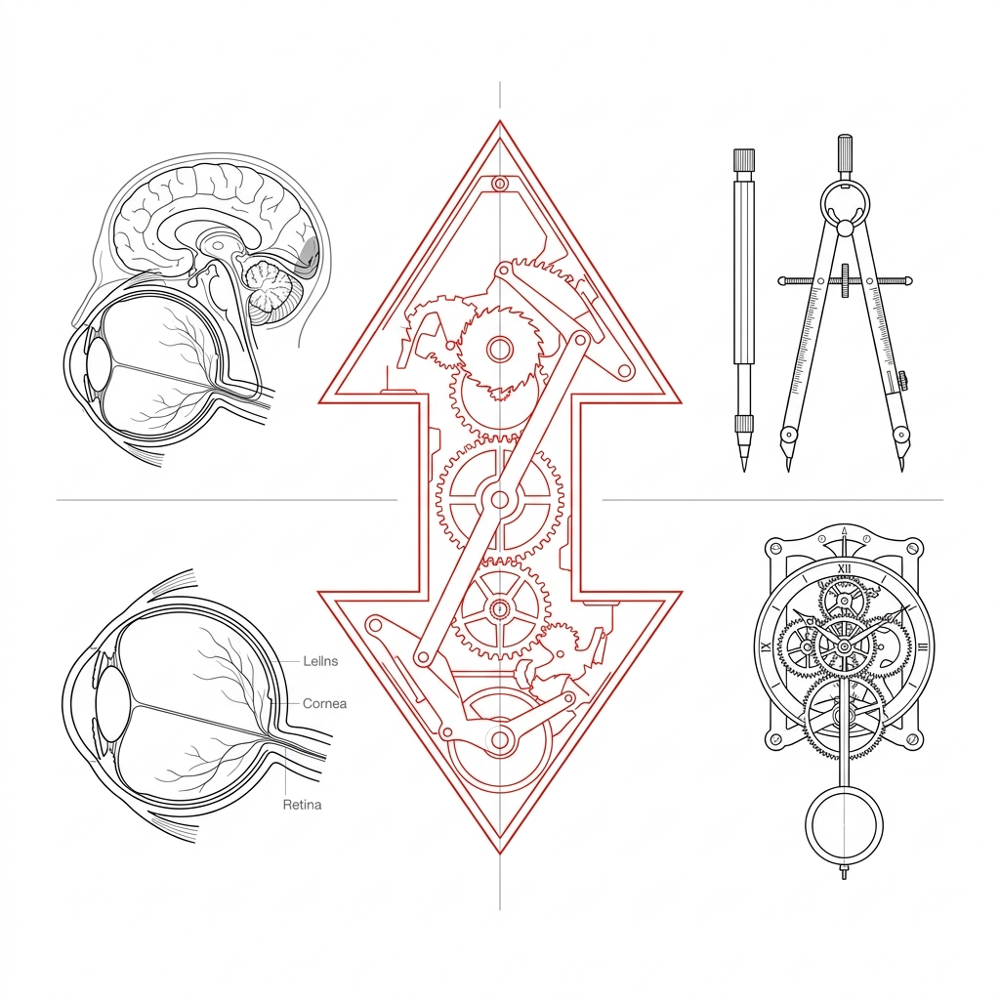

# W02 不仅是数据，更是隐喻：构建符号的艺术表达

> [!NOTE]
> 课程：**Information Visualization（信息可视化）**
> 学时详见大纲 课时 (理论 2.5 + 实践 2.5)
> 授课模式：Lecture + Workshop
> 核心理论库：`hao-ch3-chart-types`, `ch05-marks-channels`, `ch06-rules-encoding`, `marks-channels-effectiveness`, `channel-accuracy-separability`, `data-ink-ratio-anti-patterns`, `ch10-map-color`

---

## Module 0: 认知重启——W01 核心知识复盘与测验
<!-- BUDGET: open | STATUS: done -->

<!-- STAGE NOTE: 复习/认知重启（不限时长） -->

> 本模块为 W02 开篇复盘环节，系统唤醒 W01 M00-M02 的核心理论基石（香农信息论、降熵引擎、演进六大时代、前注意机制、格式塔），并通过大量复习习题巩固记忆。最后翻转视角——从"大脑如何被动解码"过渡到"设计师如何主动编码隐喻"。

### 0.1 香农的硬币：信息的本质是消除不确定性

> [VISUAL]
> *   **Slide**: `S00_Review_Shannon_Anchor`
> *   **Asset**: 
> *   **Layout**: `Center`
> *   **Scene**: 香农和一个硬币，以及一本莎士比亚。
> *   **Text**: "「信息，是对不确定性的消除量」 —— 克劳德·香农 (1948)"

同学们，上周我们的旅程，从一枚硬币开始。

还记得那段珍贵的黑白影像吗？信息论之父克劳德·香农，用一个最朴素的实验颠覆了所有人的直觉：一枚**两面都是正面的假币**，无论你抛多少次，结果都毫无悬念——所以它的信息量是**零**。而一枚公平的硬币，每一次落地都在帮你消除一份"到底是正还是反"的**不确定性**。

这个定义，是我们整门课程的**哲学根基**。我们还学到了钟义信教授的警告："**信号不等于信息**"——那些堆积在数据库里的原始记录，仅仅是承载信息的物理载体。只有经过组织和视觉呈现，它们才能升维为知识。

> [TEACHING MOMENT: 认知锚定]
> "我们这门课的终极使命，就是用视觉设计来**消除数据中的不确定性**。今天复盘的每一个知识点，都是这句话的展开。"

来，我们先做第一道复习快测，看看大家对香农信息论的掌握程度。

> [ACTIVITY]
> *   **Type**: `Quiz`
> *   **Duration**: `2min`
> *   **Desc**: 复习快测 Q1：香农信息论的核心定义
> *   **Q**: 根据香农的信息论，以下哪种情况所包含的"信息量"最大？
> *   **Options**: A. 明天太阳照常升起（几乎确定的事件） | B. 一枚公平硬币落地后是正面（50% 概率） | C. 掷骰子恰好掷出6点（约 16.7% 概率） | D. 两面都是正面的假币被抛出后是正面（100% 确定）
> *   **Answer**: `C`
> *   **Explain**: 信息量与不确定性的消除量成正比。事件概率越低，其发生后所消除的不确定性越大，信息量也越大。D 项（确定事件）信息量为零，A 项接近零，B 项为 1 比特，C 项约 2.58 比特。

### 0.2 降熵武器库：均值会撒谎，表格会杀人

> [VISUAL]
> *   **Slide**: `S00_Review_Entropy_Engine`
> *   **Asset**: 
> *   **Layout**: `Split`
> *   **Scene**: 降熵引擎概念图——左侧是漫天飞舞的静电雪花与杂乱的白噪波纹，中间通过厚重的玻璃透镜（映射过滤），右侧折射出一条清晰的红色折线。
> *   **Text**: "认知降熵引擎：可视化的本质"

上周，我们从香农的硬币出发，揭示了可视化的本质——它是一台**认知降熵引擎**。就像屏幕上这张图所展示的：把漫天飞舞的静电雪花，通过视觉透镜折射成一条清晰的红色折线。

> [VISUAL]
> *   **Slide**: `S00_Review_Datasaurus`
> *   **Asset**: 
> *   **Layout**: `Split`
> *   **Scene**: 左侧是 Alberto Cairo 教授的经典霸王龙图表，右侧是传统冰冷的均值和方差统计公式，形成强烈的反差。
> *   **Text**: "恐龙十二变：均值是数据的有损压缩"

我们用了两个震撼案例来锤实这个信念。第一个，**恐龙十二变 (Datasaurus Dozen)**：13 组数据在数学上均值和方差完全相同，画出来却有的是恐龙、有的是星星——证明统计指标是对原始数据的**有损压缩**，光看均值你永远无法发现真相的形状。

> [VISUAL]
> *   **Slide**: `S00_Review_Challenger`
> *   **Asset**: 
> *   **Layout**: `Split`
> *   **Scene**: 塔夫特为挑战者号灾难复盘绘制的 O 型环损伤散点图——横轴气温，纵轴损伤程度。一条醒目的红色虚线垂直对准 29°F 极寒温度，所有历史事故黑点密集聚集在低温侧。
> *   **Text**: "挑战者号：表格掩埋了 7 条人命"

第二个更残酷。1986 年，挑战者号航天飞机升空 73 秒后解体，7 名宇航员罹难。塔夫特事后复盘指出：如果当时的工程师不是把 O 型环测试数据堆在流水账表格里，而是画成一张散点图，所有人都能一秒看见低温与故障率之间致命的相关性——**表格掩埋了真相，散点图本可以拯救生命**。

这两个案例共同铸就了我们的第一条铁律：**永远先看图。**

但我们也学到了，视觉系统虽强，它面临着三大资源天花板——计算机的前端渲染极限、人类短期记忆只有 **7±2 个插槽**（米勒定律）、以及屏幕像素的物理上限。

现在来做第二组复习快测。

> [ACTIVITY]
> *   **Type**: `Quiz`
> *   **Duration**: `2min`
> *   **Desc**: 复习快测 Q2：降熵铁律——为什么永远先看图？
> *   **Q**: Autodesk 研究员制作的 Datasaurus Dozen（恐龙十二变）数据集，其核心教学意义是什么？
> *   **Options**: A. 证明散点图比折线图更适合展示相关性 | B. 证明统计指标（均值、方差）是对数据的有损压缩，可能掩盖截然不同的分布形状 | C. 证明 AI 算法可以自动生成任意形状的数据集 | D. 证明数据越多，图表越准确
> *   **Answer**: `B`
> *   **Explain**: 恐龙十二变的 13 组数据具有完全一致的均值和方差，但绘制为散点图后呈现出恐龙、星星、圆环等截然不同的形状。这证明了单一的数学指标会"抹平"数据的真实分布特征——因此，永远先看图。

> [ACTIVITY]
> *   **Type**: `Quiz`
> *   **Duration**: `2min`
> *   **Desc**: 复习快测 Q3：挑战者号灾难的可视化教训
> *   **Q**: 1986 年挑战者号航天飞机灾难中，工程师未能说服 NASA 取消发射的关键原因是什么？
> *   **Options**: A. 当时的计算机算力不足以处理数据 | B. 工程师使用了按时间排序的流水账表格，人类视觉系统无法从中提取两组变量的相关性 | C. O 型环测试数据被刻意篡改 | D. 当天的气温实际上并不算极端
> *   **Answer**: `B`
> *   **Explain**: 塔夫特在《Visual Explanations》中复盘指出，工程师提供的是按时间排列的参数汇总表，而非将气温与损伤度映射为散点图。人脑天生不擅长从密集网格中跨列提取相关性，导致决策失误。

### 0.3 演进脉络：从洞窟壁画到交互大屏的六大时代

> [VISUAL]
> *   **Slide**: `S00_Review_Nightingale`
> *   **Asset**: 
> *   **Layout**: `Split`
> *   **Scene**: 南丁格尔 1858 年的经典极坐标玫瑰图——巨大的深蓝色区块代表"死于可预防传染病的人数"，极少面积的正红色代表"死于战斗的人数"，面积反差触目惊心。
> *   **Text**: "南丁格尔的玫瑰图：可视化推动公共卫生改革"
> *   **Source**: `External` — Wikimedia Commons, Public Domain / Florence Nightingale Rose Diagram (1858)

上周我们还横向梳理了信息可视化的**六大演进时代**。从旧石器时代的洞窟壁画（最早的视觉外存），到印加帝国的结绳记事（Quipu，首次多维物理编码），到托勒密的坐标地图和达芬奇的精密城镇图（数学介入空间降维），再到普莱费尔首创折线图和饼图，南丁格尔用玫瑰图推动医疗改革，米纳德用一张图折叠了拿破仑东征的 **6 个维度**。

> [VISUAL]
> *   **Slide**: `S00_Review_Minard`
> *   **Asset**: 
> *   **Layout**: `Full`
> *   **Scene**: 查尔斯·米纳德绘制的拿破仑东征图——线条宽度代表军队人数，走向对应地理经纬度，棕色与黑色区分进攻与撤退，下方折线记录撤退时的严寒气温。
> *   **Text**: "米纳德的六维战争图：有史以来最好的统计图表"
> *   **Source**: `Textbook` — 郝亚维《信息可视化》图 2-21

贯穿这六大时代的核心规律始终如一：**降维映射——把人类无法直接感知的抽象信息，映射为视觉系统能高效处理的空间关系。**

我们还学习了 20 世纪的两大关键突破：奥托·纽拉特的 **Isotype 通用视觉语言**（今天所有手机 APP 图标的原型），以及哈里·贝克的**伦敦地铁拓扑图**——他放弃了真实地理距离，仅保留站点间的连接次序，极大降低了百万通勤者的认知负荷。

来做一组演进脉络的复习测验。

> [ACTIVITY]
> *   **Type**: `Quiz`
> *   **Duration**: `2min`
> *   **Desc**: 复习快测 Q4：可视化演进——南丁格尔玫瑰图
> *   **Q**: 南丁格尔的极坐标玫瑰图之所以能推动英国医疗改革，其核心视觉策略是什么？
> *   **Options**: A. 使用了当时最先进的彩色印刷技术 | B. 用深蓝色与红色区块的面积反差，直观展示"死于传染病"远多于"死于战斗"的事实 | C. 在图表中加入了大量文字注释 | D. 采用了三维立体效果增强视觉冲击力
> *   **Answer**: `B`
> *   **Explain**: 南丁格尔用面积编码数量，巨大的蓝色扇区与极小的红色扇区形成了触目惊心的视觉反差，让非专业人士一眼就能理解"可预防疾病才是真正的杀手"，从而直接推动了英国随军医疗制度改革。

> [ACTIVITY]
> *   **Type**: `Quiz`
> *   **Duration**: `2min`
> *   **Desc**: 复习快测 Q5：米纳德的拿破仑东征图
> *   **Q**: 塔夫特誉为"有史以来最好的统计图表"的米纳德拿破仑东征图，在一张二维纸面上同时折叠了几个维度的数据？
> *   **Options**: A. 3 个维度（军队人数、地理位置、时间） | B. 4 个维度（军队人数、经度、纬度、温度） | C. 6 个维度（军队人数、地理经度、地理纬度、行军方向、时间、气温） | D. 8 个维度
> *   **Answer**: `C`
> *   **Explain**: 米纳德在图中用线条宽度编码军队人数，线条走向对应地理经纬度，棕色与黑色区分进攻与撤退方向，下方折线同步记录撤退时的严寒气温，文字标注了时间与地点。共计 6 个维度。

> [ACTIVITY]
> *   **Type**: `Quiz`
> *   **Duration**: `2min`
> *   **Desc**: 复习快测 Q6：哈里·贝克的伦敦地铁图
> *   **Q**: 1931 年哈里·贝克重绘伦敦地铁路线图时做出了一个"违反常理"的设计决定。以下哪项最准确地描述了他的核心策略？
> *   **Options**: A. 增加更多地标建筑的标注以帮助乘客定位 | B. 完全放弃真实地理距离，仅保留站点间的拓扑连接次序，用垂直/水平/45度角拉直线路 | C. 使用三维透视效果展示地下隧道结构 | D. 按照实际里程等比例缩放所有线路
> *   **Answer**: `B`
> *   **Explain**: 贝克提取了乘客的核心需求——"还要过几站"和"在哪里换乘"，大量剔除了与换乘无关的地理干扰信息。这是拓扑降维法则的经典应用，极大降低了认知负荷。

### 0.4 感知双引擎：前注意弹出 + 格式塔秩序法官

> [VISUAL]
> *   **Slide**: `S00_Review_Dual_Engine`
> *   **Asset 1**: 
> *   **Asset 2**: 
> *   **Layout**: `Grid`
> *   **Scene**: 左右并排复现 W01 的两大视觉引擎——左侧是前注意弹出效应（灰点海中的刺眼红点），右侧是格式塔九宫格总结（靠近/相似/闭合等）。
> *   **Text**: "你的视觉认知双引擎"
> *   **List**:
> *     - 前注意：200ms 内无意识捕获异类
> *     - 格式塔：强迫大脑把碎片缝合成秩序

降熵引擎之所以能工作，靠的是大脑里两套强大的视觉底层机制。

第一套，**前注意处理机制**。还记得那张灰点海洋中一个刺眼红点瞬间弹出的图吗？在你产生理性意识之前的 **200 毫秒**内，视觉数据就已经在向大脑传导的半路上被底层防线排查完毕了。这是你与生俱来的**生理特权**——无需逐个扫描，异类会自动跳进视野。我们还学习了前注意的四大阵营：色彩、形态、空间和动态。

第二套，**格式塔秩序法官**。前注意机制负责"报警"，但如果图表上全是几百个孤立弹出的红点，大脑依然会崩溃。格式塔接管了战场：通过靠近、相似、闭合、连通等铁律，强制把零散碎片"缝合"成有意义的阵营和层级。我们还用"斑点狗错觉"和"鲁宾之杯"亲眼见证了大脑的"脑补"能力。

来做最后一组关于感知机制的复习测验。

> [ACTIVITY]
> *   **Type**: `Quiz`
> *   **Duration**: `2min`
> *   **Desc**: 复习快测 Q7：前注意机制的本质
> *   **Q**: 以下关于"前注意处理 (Pre-attentive Processing)"的描述，哪一项是正确的？
> *   **Options**: A. 它需要观察者有意识地逐个扫描视觉元素 | B. 它在约 200 毫秒内自动完成，无需理性意识介入，且处理速度不受背景干扰数量影响 | C. 它只对颜色差异敏感，对形状和大小差异无效 | D. 它是一种后天习得的文化技能，非洲部落的人不具备此能力
> *   **Answer**: `B`
> *   **Explain**: 前注意处理是一种生理层面的无意识视觉快速扫描机制，在意识介入前（约 200ms 内）就能完成异类目标的捕获。其特征是处理速度与干扰项数量无关——无论背景有 10 个还是 10000 个灰点，找到那个红点的时间几乎相同。

> [ACTIVITY]
> *   **Type**: `Quiz`
> *   **Duration**: `2min`
> *   **Desc**: 复习快测 Q8：格式塔靠近性原则
> *   **Q**: 在一张数据图表中，X 轴下方的文字标签本应对应右侧的柱子，但由于排版失误，标签在物理位置上更接近了左侧无关的柱子。根据格式塔原则，观众最可能出现的认知反应是？
> *   **Options**: A. 观众会理性分析，正确对应到右侧柱子 | B. 观众的大脑会依据靠近性原则，将标签与左侧柱子强行"绑定"，造成张冠李戴 | C. 观众会忽略标签，直接看柱子高度 | D. 观众会要求设计师重画
> *   **Answer**: `B`
> *   **Explain**: 格式塔靠近性原则是人类视觉中最底层、最强大的分组力量——空间距离越近，大脑就越会将两个元素强行"缝合"为同一组块。因此，相关元素必须在物理空间上紧密绑定，不相关的元素必须用夸张的留白推开。

> [ACTIVITY]
> *   **Type**: `Quiz`
> *   **Duration**: `2min`
> *   **Desc**: 复习快测 Q9：格式塔闭合性原则
> *   **Q**: 经典的 Kanizsa 三角错觉图中，只画了三个被切角的黑色圆饼，但观众却强烈感受到一个"不存在的白色三角形"。这体现了格式塔的哪一条原则？
> *   **Options**: A. 靠近性原则——三个圆饼距离很近所以被归为一组 | B. 相似性原则——三个圆饼形状相同所以被归为一类 | C. 闭合性原则——大脑排斥未闭合的不确定性信息，强行在虚空中脑补出完整的边界线 | D. 共同命运原则——三个圆饼朝同一方向运动
> *   **Answer**: `C`
> *   **Explain**: 闭合性原则揭示了大脑对残缺图形的"自我修复"能力。当视觉信号呈现出强烈的收敛趋势但在关键处断裂时，大脑会强行在虚空中勾勒出虚拟的张力线来完成"心理闭合"。这也是现代 UI "无界留白"设计的神经科学基础。

### 0.5 视角翻转：从被动解码到主动编码

> [VISUAL]
> *   **Slide**: `S00_Review_Dear_Data`
> *   **Layout**: `Video`
> *   **Asset**: 
> *   **Source**: `Video` — YouTube: Big Bang Data: Dear Data
> *   **Duration**: `3m18s`
> *   **TimeCategory**: `activity`
> *   **Scene**: Giorgia Lupi 的《Dear Data》动画短片：展示两位信息设计师如何用手绘图形在明信片上记录生活。
> *   **Text**: "数据人文主义：用手绘图形传递生命的温度"

上周，我们看过了这段温暖的视频——Giorgia Lupi 的《Dear Data》项目。让我们再看一遍，唤醒那份感动。两位数据艺术家拒绝了冰冷的数字工具，用手绘图形在明信片上记录私密的生活情绪，跨越大西洋寄给彼此。它告诉我们：数据不仅是冰冷的 KPI 看板，更可以承载**人类的体温**。

> [VISUAL]
> *   **Slide**: `S00_Review_Bridge_to_W02`
> *   **Layout**: `Center`
> *   **Asset**: 
> *   **Scene**: 极简线框图解：一个表示视点翻转的巨大机械箭头。箭头一侧是人眼与大脑认知加工的精密线框剖面图（代表被动解码），另一侧是代表主动设计的制图圆规和机械时钟结构（代表主动编码与时空）。中央的翻转核心枢纽以瑞士红高亮。
> *   **Text**: "翻转视角：从解码者到编码者"

好，复盘到此。让我们做一次**视角翻转**。

上周，我们一直在研究大脑如何**被动**地接收和解码视觉信号——前注意帮你抓异类，格式塔帮你建秩序。但从这一刻起，我们要**主动出击**。

问题不再是"大脑看到了什么"，而是——**"我要让大脑看到什么？"**

> [TEACHING MOMENT: 视角翻转]
> "上周你学会了大脑如何'看见'，这周你要学会**让大脑看到你想让它看到的东西**。欢迎进入时空隐喻的世界。"

**(Pause: 3s)**

---
