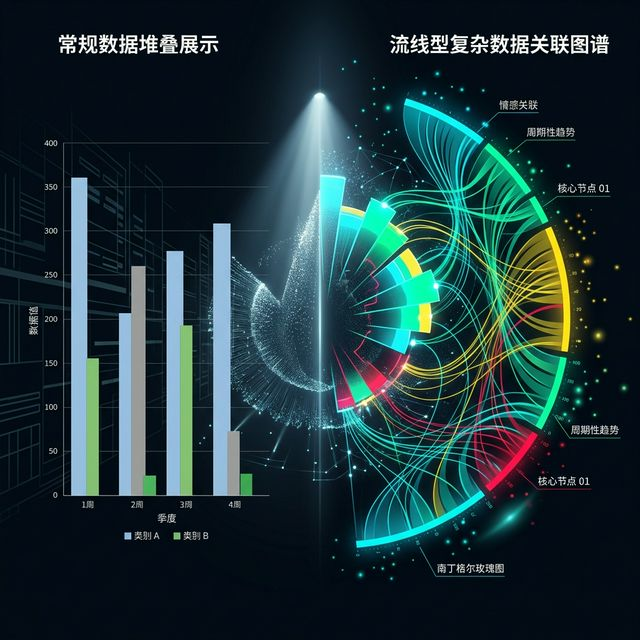
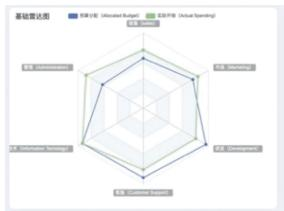
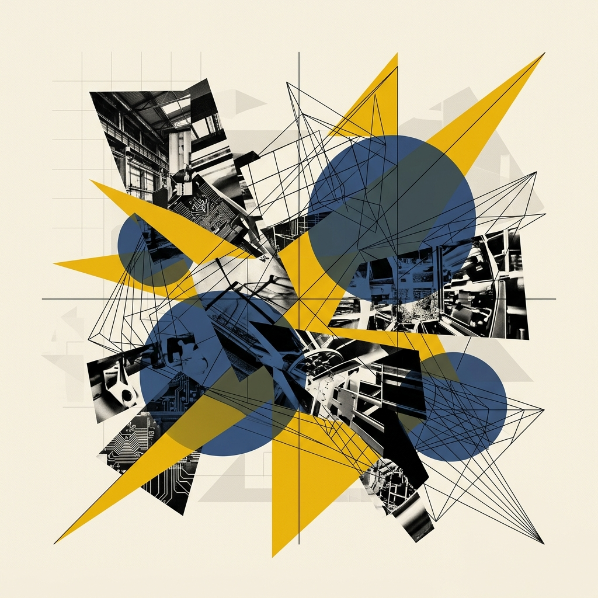
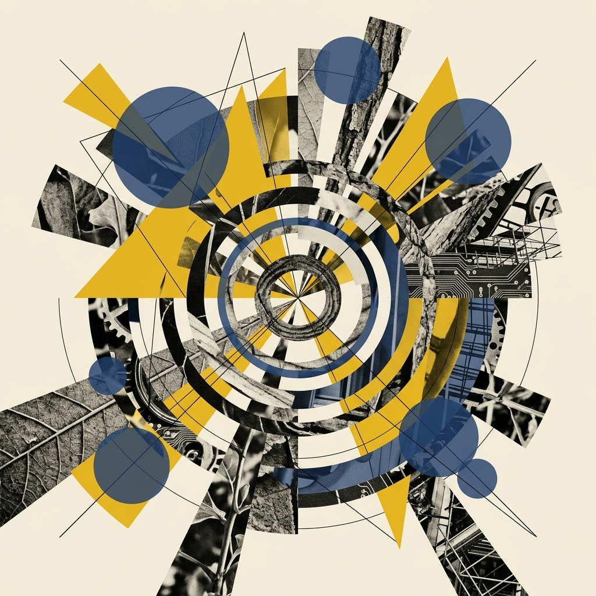
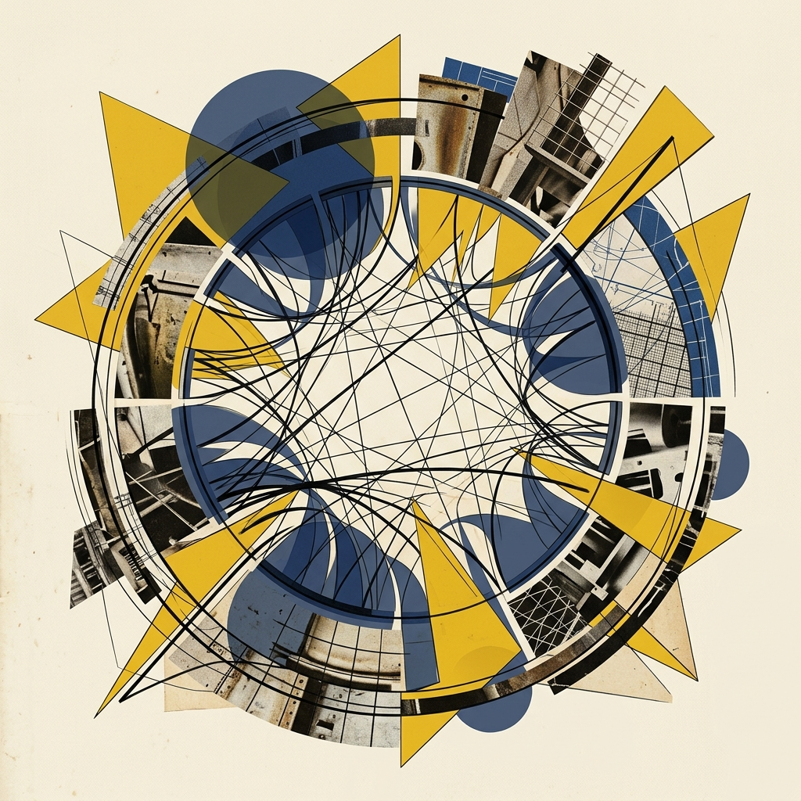
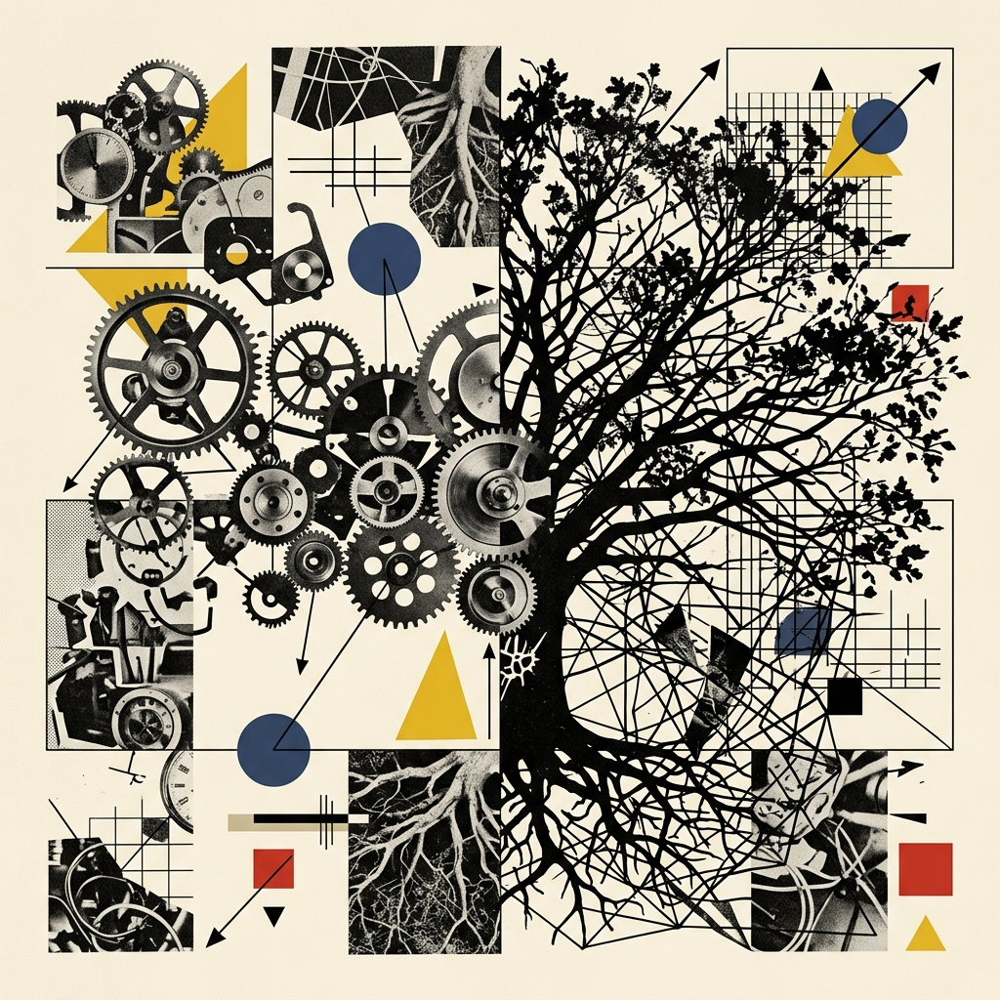
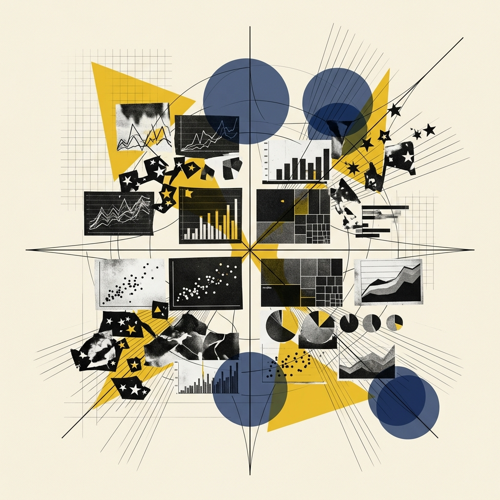
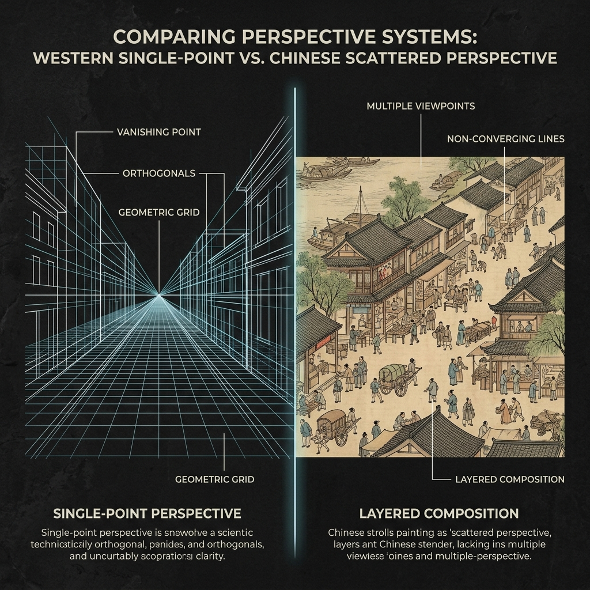
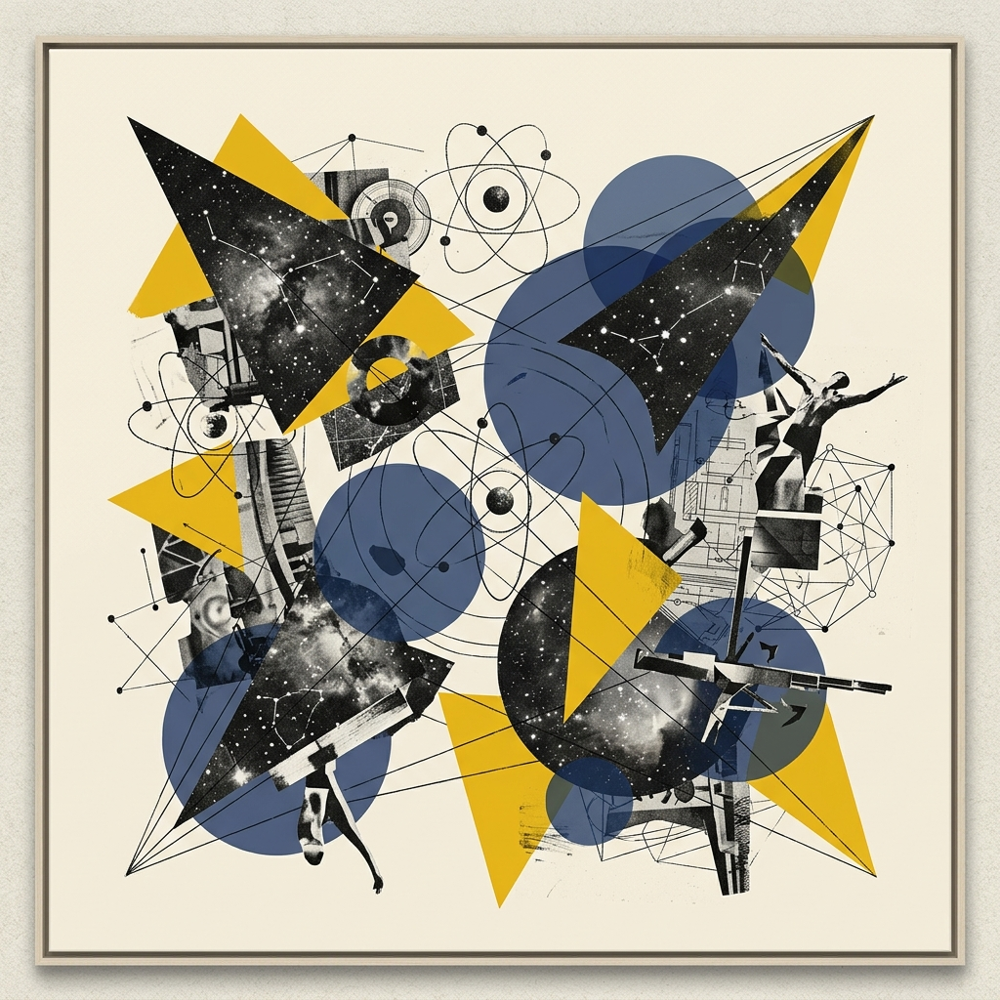

## Module 1: 跳出模板——寻找数据的时空隐喻 (30 分钟)
<!-- BUDGET: 1800 chars | SLIDES: ≥4 | STATUS: done -->

<!-- STAGE NOTE: 复习/导入 -->

> 本模块承接 W01 视觉感知与格式塔理论（**知识目标 1 回链**：数据可视化与视觉编码的基本理论），通过回顾上周实践引入本周核心议题：视觉隐喻与符号编码。

> [VISUAL]
> *   **Slide**: `S01_Title_W02`
> *   **Asset**: 
> *   **Layout**: `Center`
> *   **Scene**: 深邃的背景中，一半是生硬的 Excel 默认柱状图，另一半是充满流线和情感的南丁格尔玫瑰图与复杂的弦图交织，形成强烈的机械与有机的视觉对比。
> *   **Text**: "不仅是数据，更是隐喻"

### 1.1 破除模板思维：从刻板图表回归叙事直觉

上周，我们通过手动描绘安斯库姆四重奏，深刻体会到了人类视觉系统的**前注意处理能力**，也体验了 RAWGraphs 在零代码环境下的极速探索。

但在今天这节课，我们要按下一个**认知暂停键**。

在这个"一键生成图表"、大语言模型争相斗艳的 AI 时代，技术永远走在前面，而我们需要找回作为"人"的**叙事直觉**。

在动手敲代码前，请闭上眼睛思考：当你面对庞杂的数据时，脑海里跳出的第一个念头，是不是"我该用柱状图还是折线图"？这就是典型的**工具导向思维**。

如果是，那么你已经被软件工程师写下的**标准模板**锁死了。你的思维带宽被压缩在了那几个可怜的下拉菜单里，失去了**视觉隐喻重塑**的可能。

> [VISUAL]
> *   **Slide**: `S02_Metaphors_in_Vis`
> *   **Asset**: 
> *   **Layout**: `Split`
> *   **Scene**: 左侧展示传统财务报表的折线图面板（冰冷、机械，带有默认的灰色网格线）；右侧展示《信息可视化设计》中提到的流柱图和雷达图（有机、呈现出能量流动或牵制的生态感）。
> *   **Caption**: 设计不是纯粹的工程计算，它是为数据寻找最匹配的隐喻外衣。
> *   **Text**: "寻找最匹配的隐喻外衣"

### 1.2 时空隐喻：洞察图表底层的深度心理画框

正如大家在屏幕左右两侧看到的对比，左侧的折线图冰冷机械，右侧的流柱图则充满有机感。在《信息可视化设计》这本书的第三章中，作者郝亚维提出了一个非常核心且极具启发性的观点：**图表类型的选择，本质上是在寻找一种时空隐喻**。这绝不是单纯的美学风格差异，而是直接关乎于人类视知觉信息获取效率的认知科学基础。

图表不仅仅是承载数字的容器。每一种几何形状的展开方式，都在无意识中调动着观众关于空间、时间、流动或对立的记忆。

我们来举几个具体的例子：

> [VISUAL]
> *   **Slide**: `S02b_Metaphor_Examples`
> *   **Asset**: 
> *   **Resource**: 
> *   **Source**: Textbook
> *   **Layout**: `Grid`
> *   **Scene**: 在网格中呈现各种不同的生活隐喻。例如左侧是“木桶”和雷达图的叠影，右侧是“河流”与桑基图的交织。
> *   **Text**: "寻找最贴切的时空隐喻：约束与流动"
> *   **List**:
> *     - 木桶理论：牵制与平衡 (雷达图)
> *     - 历史长河：流动与交织 (桑基图)

当你选用**雷达图（蜘蛛网图）**时，你并不是在简单地画一个多边形或在坐标轴上标点。你是在向观众隐喻一种"不同能力维度之间的相互牵制与平衡"。由于它的各个轴线是从一个中心点向外辐射的，这意味着每一个指标的增长都在试图拉扯整个形状的面貌。这就是我们在游戏角色设计或企业综合信用评价中最常用它的原因，因为它本质上是一个"木桶理论"的视觉化。

> [VISUAL]
> *   **Slide**: `S02b2_Metaphor_Sankey`
> *   **Asset**: 
> *   **Resource**: 
> *   **Source**: Textbook
> *   **Layout**: `Center`
> *   **Scene**: 流柱图和桑基图，展示能量交织与流动的动态视觉。
> *   **Text**: "桑基图：能量与物质的交织流动"

我们再来看**流柱图（河流图）**或者**桑基图**。为什么在展示能源消耗、材料回收或是用户网页访问路径时，我们首选桑基图？因为桑基能量分流图不仅仅是展示出入口的数字大小。它通过那些互相纠缠、分叉又汇合的彩色条带，向观众隐喻了"历史长河中能量或物质的交织流动"。宽窄代表了通量，颜色的汇聚代表了演变。

> [VISUAL]
> *   **Slide**: `S02b3_Metaphor_Sunburst`
> *   **Asset**: 
> *   **Layout**: `Center`
> *   **Scene**: 旭日图，从圆心向外层层辐射，像一棵大树的年轮或枝叶分布。
> *   **Text**: "旭日图：由内而外的层级剥离"

再举一个例子：**旭日图**。这种从圆心向外辐散开去的多层环形结构，你觉得它在暗示什么？它在暗示"层级"——从最内层的根结点，到第二环的分类，到第三环的子分类，就像一棵大树从主干分出枝丫，又从枝丫分出细叶。它隐喻的是"一切复杂的整体，都可以被层层剥开来观察"。这种"由内而外层递展开"的空间逻辑，恰好与人脑中"从整体概览到细节钻取"的认知路径完美吻合。

> [VISUAL]
> *   **Slide**: `S02b4_Metaphor_Chord`
> *   **Asset**: 
> *   **Layout**: `Center`
> *   **Scene**: 和弦图，圆环上各个节点间连线纵横交错，线条粗细展示关联强度。
> *   **Text**: "和弦图：复杂系统的支配性力量通道"

而**和弦图**呢？想象你把所有的数据节点均匀地摆放在一个圆环上，然后在它们之间拉出一条条粗细不等的弧线带。这种结构隐喻的是"万物之间的关联强度"——谁跟谁之间的贸易额最大？哪两个学科之间的论文引用最频繁？那些最宽最粗的弧带，就是关系最紧密的纽带。和弦图不仅仅是在画连线——它是在用几何圆的完美对称结构，向观众揭示一个复杂系统内部那些隐秘的、支配性的力量通道。

这就像是在拍电影。顶级导演从不问自己"这场戏我该用单纯的 35mm 定焦镜头还是 200mm 长焦镜头"。导演问的是："我想让观众感受到一种压抑的幽闭感，还是想要呈现出在这片荒野上的极度孤独感？"我们可以从将电影叙事与数据结构相融合的先锋视角中汲取跨学科的灵感。

在信息可视化设计里，我们要跳出单纯的"数据展示"，让这种时空隐喻为主旨服务。我们不是在画线，我们是在讲故事。

> [VISUAL]
> *   **Slide**: `S02d_Four_Metaphor_Networks`
> *   **Asset**: 
> *   **Layout**: `Grid`
> *   **Scene**: 四宫格展示四大核心隐喻象限，对应 RAWGraphs 中的分类模板地图。
> *   **Text**: "解构图表库：所有现成模板都在这两张隐喻网中"
> *   **List**:
> *     - #1 时间之渊 (Time series)
> *     - #2 引力与纽带 (Networks & Correlations)
> *     - #3 俄罗斯套娃 (Hierarchies)
> *     - #4 聚落与领地 (Distributions & Proportions)

我们要建立一套**隐喻坐标系**。为了在这个充斥海量模板的时代保持清醒，我们必须把那些令人眼花缭乱的复杂图表分门别类地归纳进四副“隐喻画框”里。任何一种深层次的商业或社会分析需求，其可视化的物理落脚点必然落入以下四大时空生态：
1. **时间之渊**——也就是英文中的 Time series：隐喻不可逆的线性流逝。无论是折线图还是流柱图，本质都是在水平空间维度上用向右的线性延伸，隐喻时间的演进。
2. **引力与纽带**——也就是网络与相关性：隐喻群体社会的网络连接与内在牵制。当你需要表达数据间的强弱关联时，请果断启用散点图（用距离逼近隐喻正负相关性）或和弦图（用线条的粗细隐喻实体间的交互流量）。

> [VISUAL]
> *   **Slide**: `S02d2_Metaphor_Hierarchies_Distributions`
> *   **Layout**: `Split`
> *   **Scene**: 左侧展示俄罗斯套娃般层层包裹的树图，右侧展示如同群岛般分布的小提琴图和散点聚落。
> *   **Text**: "层级包含与聚落分布"
> *   **List**:
> *     - #3 俄罗斯套娃 (Hierarchies)
> *     - #4 聚落与领地 (Distributions & Proportions)

3. **俄罗斯套娃**——代表层级关系：隐喻庞大组织的层层剥离与从属关系。从树图的面积切割，到圆形包装图的细胞堆积，本质都在利用“物理包含”这一直观的空间隐喻。
4. **聚落与领地**——代表分布与占比：隐喻势力份额的划分或群居生态位。饼图或小提琴图其实都是在特定区域切割版图，从而建立起群体分布落差的直觉判断。

> [VISUAL]
> *   **Slide**: `S05b_Metaphor_Coordinate_System`
> *   **Asset**: 
> *   **Layout**: `Center`
> *   **Scene**: 一个发光的隐喻坐标系，将无数细碎的图表类型像繁星一样归拢到四大象限中。
> *   **Text**: "洞悉无形的隐喻网"

只要你如同鹰眼般洞悉了这四张无形的隐喻网，你就不需要在工具库成百上千个所谓的“高级组合酷炫 Chart”大名单迷宫里晕头转向了。

### 1.3 文化自觉：定焦透视与流动叙事长卷的碰撞

> [CASE STUDY: 中西视觉叙事传统的深层差异]
> 说到隐喻与叙事，我们必须意识到：不同文化背景下的视觉信息传达，建立在截然不同的认知哲学之上。
>
> [VISUAL]
> *   **Slide**: `S02e_Culture_Perspective`
> *   **Asset**: 
> *   **Layout**: `Split`
> *   **Scene**: 左侧展示西方典型的单点透视坐标系，右侧展示《清明上河图》的局部，隐喻一种流动的散点透视叙事。
> *   **Text**: "定焦透视 vs 流动叙事长卷"
>
> 在西方文艺复兴之后的视觉传统中，透视法——即 Perspective，主导了信息图形的构造方式——单点视角、固定观察者、时间被冻结在一个瞬间。这直接催生了我们今天熟悉的笛卡尔坐标系图表。
> 但中国传统视觉叙事走了完全不同的路。北宋张择端的《清明上河图》长达 5 米，采用"散点透视"——观者的视角是流动的，从城外到城内，时间和空间在一幅画卷中连续展开。这种"横卷叙事"与我们下几周将要学习的 Scrollytelling（滚动叙事）在底层哲学上惊人地一致：都是以空间的线性展开来承载时间的流逝。

> [VISUAL]
> *   **Slide**: `S02e2_YuGong_Map`
> *   **Layout**: `Center`
> *   **Scene**: 展示裴秀的《禹贡地域图》复原或古代中国地图的网格计里画方系统，与现代数据网格产生跨越时空的视觉呼应。
> *   **Text**: "文化审美自觉：寻找中国视觉语言"

更早的例子还有裴秀的《禹贡地域图》（公元 3 世纪），这是世界上最早的系统化地理信息可视化实践之一，比西方的等比例地图早了近千年。
作为数字媒体艺术的学生，我们不应盲目套用西方图表范式。在选择视觉隐喻时，要有**文化审美自觉**——理解不同叙事传统的优势，并在当代数据可视化实践中探索属于中国视觉语言的独特表达。

> [ACTIVITY]
> *   **Type**: `Discussion`
> *   **Duration**: `20min`
> *   **Desc**: **"走错片场的隐喻"——破冰纠错讨论。**
> **执行流程**：在大屏幕上随机展示 3 张在真实商业环境或新闻报道中"用错隐喻"的灾难图表。
> 例如：用雷达图来展示一个人从 1 岁到 50 岁的身高流变；用平行的折线图来展示某企业下辖六个毫无关联的独立子公司的今年利润额。
> 让同学们当场指出：这些图表为什么看起来"很怪"？它们在潜意识里向观众传递了什么错误的时空关联假象？通过这个 20 分钟的抢答热身，彻底摧垮大家之前脑海中根深蒂固的"只要能把数据画出来用什么图都可以"的理科生惯性思维。

**(Pause: 3s)**

### 1.4 视觉语言同构：用图形直接映射数据实体

> [CASE STUDY: 隐喻的天花板——Meta-Art (视觉语言同构)]
> 既然我们懂得了破除模版、寻找隐喻，那么隐喻的最高境界是什么？是“形神合一”。
>
> [VISUAL]
> *   **Slide**: `S02b2_Frames_of_Mind_Meta_Art`
> *   **Asset**: 
> *   **Layout**: `Comparison`
> *   **Scene**: 左侧展示一张使用 ECharts 默认皮肤生成的普通方形树图 (TreeMap)，右侧并排展示 Alberto Lucas López 的《Frames of Mind》中那些被画成如立体主义碎玻璃般不规则的面积区块组合。
> *   **Text**: "Meta-Art：最高维的视觉隐喻"
> *   **List**:
> *     - 传统模板: 冷冰冰的无机质矩形
> *     - Meta-Art: 与客观实体同构的精神图腾
>
> 看看国家地理这件斩获无数大奖的作品《Frames of Mind》。设计师要对毕加索一生的 8000 件作品进行面积矩形的树图——即 TreeMap 分类可视化。如果用传统的思路，我们会像屏幕左边那样，生成一堆冷冰冰、毫无生气的规整矩形方块（面积通道）。
> 但设计师做了一件惊世骇俗的事。他提取了毕加索标志性的“立体派线条”作为数据的载体边框。如果你的数据对象是毕加索，那么最顶配的视觉通道，绝对不是纯粹无机质的长方形，而是能够直接隐喻其精神内核的视觉图腾。这不仅呈现了数据结构的严谨隐喻，甚至在**视觉外观层面上彻底与被观测的客观实体发生了同构**。这，就是“Meta-Art（视觉语言同构）”的巅峰。教导我们这样一个真理：隐喻不仅在“形”，更在骨血里的“神”。

**(Pause: 3s)**

> [VISUAL]
> *   **Slide**: `S02c_Transition_Grammar`
> *   **Asset**: 
> *   **Layout**: `Center`
> *   **Scene**: 画面中央是一个巨大的闪烁问号，背景由模糊的各种图表碎片（柱状图、散点图、桑基图的局部）组合而成，形成一种"拆解与重组"的视觉暗示。
> *   **Text**: "隐喻背后的原子语法是什么？"

### 1.5 原子语法：重组神秘隐喻的视觉元素周期表

如果同意这个观点，那么接下来的问题就是：隐喻是如何被拆解并最终独立构建出来的？正如屏幕上这些模糊且破碎的图表局部一样，每一种复杂的隐喻效果，其实质都是由某几个极其基础的**视觉原子**——形状、位置、方向、颜色、大小——被精心设计与重新组装而成的。

为了掌控这种视觉魔法，你必须首先了解法术元素的周期表。这就需要我们熟练掌握可视化的"**原子语法**"。

> [TEACHING MOMENT: 视觉魔法的真谛]
> "图表从来不只是数据的容器，它们是**思想的时空隐喻**。破除下拉菜单的**模板崇拜**，才能真正驾驭视觉编码。"

---

