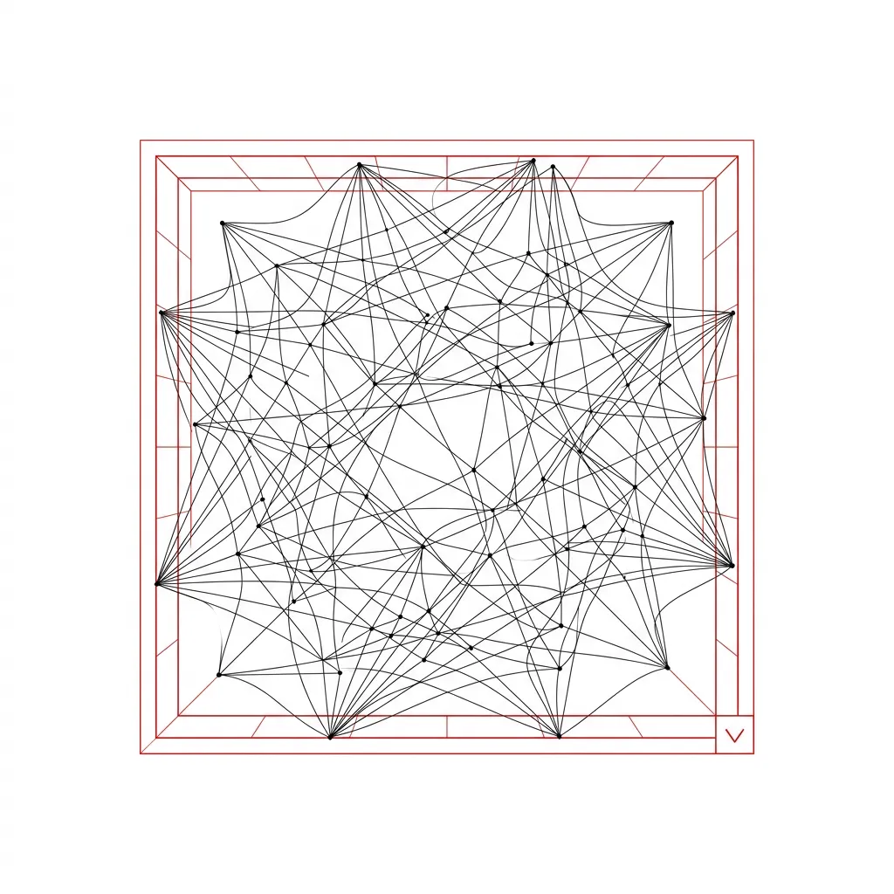
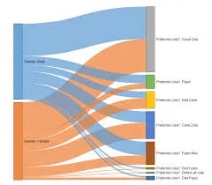
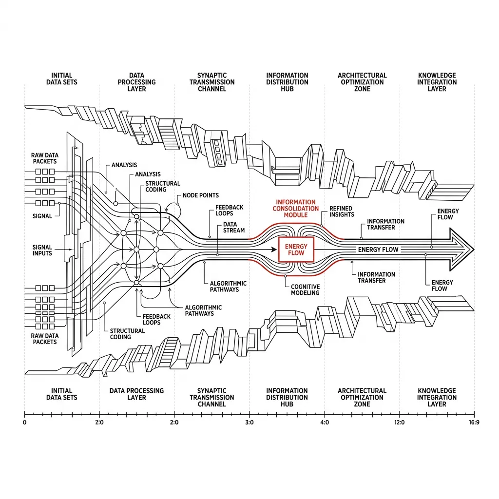
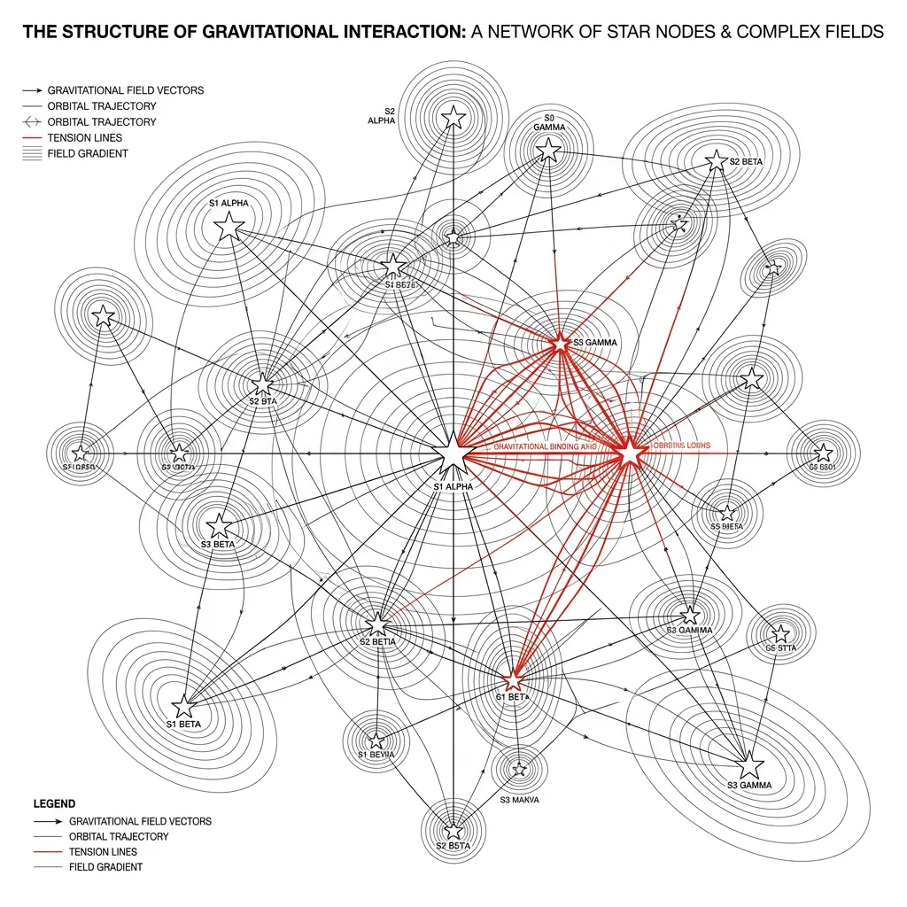
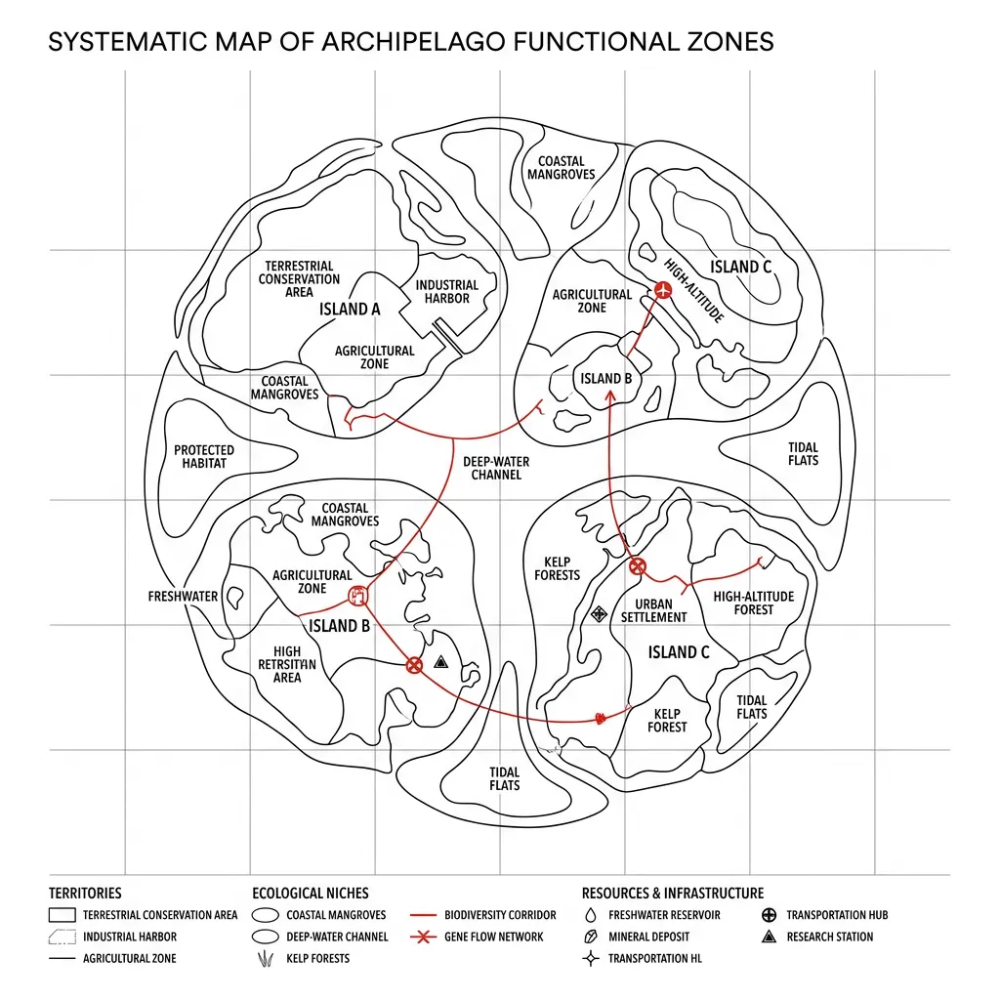
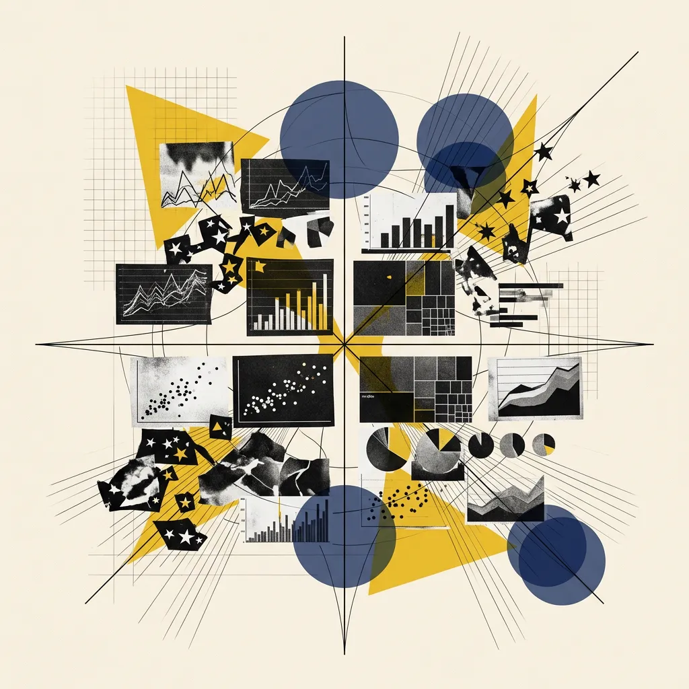
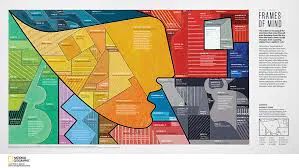

## Module 1: 跳出模板——寻找数据的时空隐喻 (30 分钟)
<!-- BUDGET: 1800 chars | SLIDES: ≥4 | STATUS: done -->

<!-- STAGE NOTE: 主体理论导入（复习环节已在 M00 完成） -->

> 本模块承接 M00 认知重启与 W01 视觉感知理论（**知识目标 1 回链**：数据可视化与视觉编码的基本理论），正式进入本周核心议题：视觉隐喻与符号编码。

### 1.1 破除模板思维：从刻板图表回归叙事直觉

> [VISUAL]
> *   **Slide**: `S01_Title_W02`
> *   **Asset**: 
> *   **Layout**: `Center`
> *   **Scene**: 极简线框图解，展示了代表复杂、多维数据的有机网状结构被强制压缩进一个带有典型『下拉菜单』界面特征的僵硬方块中。通过结构化的机械约束暗示思维带宽的压缩，作为模板象征的『下拉菜单选框』被标注为视觉焦点。
> *   **Text**: "破除模板的牢笼：警惕『工具导向』思维"

刚才我们在 M00 中完成了 W01 的认知重启——从香农的硬币到降熵引擎，再到前注意弹出和格式塔秩序法官。现在，带着这套完整的视觉感知武器库，我们要正式进入 W02 的核心战场。

但在今天这节课，我们要按下一个**认知暂停键**。

在打开 Illustrator 画板或点开生成工具前，请闭上眼睛思考：当你面对庞杂的数据时，脑海里跳出的第一个念头，是不是"我该用柱状图还是折线图"？

如果是，请看屏幕——这就是典型的**工具导向思维**。你已经被软件工程师写下的**标准模板**锁死了。

**这就像是在拍电影。**顶级导演从不问自己"这场戏我该用 35mm 定焦还是 200mm 长焦"。导演问的是："我想让观众感受到压抑的幽闭感，还是广阔荒野上的极度孤独感？"

在信息可视化设计中，图表类型就是我们的"镜头"。正如画面中这个被强行塞进下拉菜单的复杂网络一样，一旦陷入"选图表"的工具思维，你的认知带宽就被压缩在了可怜的下拉选项里，彻底失去了**视觉隐喻重塑**的可能。在这个 AI 时代，我们要跳出"数据展示"，让数据为**时空隐喻**服务。我们不是在画线，我们是在讲故事，必须找回作为"人"的**叙事直觉**。

> [VISUAL]
> *   **Slide**: `S02a_Giorgia_Lupi`
> *   **Layout**: `Video`
> *   **Asset**: 
> *   **Source**: `Video` — TED: How we can find ourselves in data | Giorgia Lupi
> *   **Duration**: 11:14
> *   **TimeCategory**: `activity`

> [TEACHING MOMENT: 数据人文主义——找回人的叙事直觉]
> 刚才我们提到，我们要找回作为“人”的叙事直觉。但具体应该怎么做？为了彻底打破大家对柱状图和饼图的刻板依赖，我们现在来观看一段来自著名先锋数据艺术家 Giorgia Lupi 的长达 11 分钟的 TED 演讲：《如何在数据中找到我们自己》。
> 
> **与知识点的关联：**
> 演讲中她提出了“数据人文主义 (Data Humanism)”这一核心概念。这正是“跳出模板”的终极体现：数据不再是冷冰冰的几何统计，而是充满人性温情、不完美且极具个性的隐喻涂鸦。这与我们即将要探索的“为数据寻找最匹配的隐喻外衣”的理念完美契合。
> 
> **视频内容简介：**
> 在这 11 分钟里，Giorgia Lupi 将向我们展示她是如何将自己每天的日常细节、情绪甚至病历，画成极度感性且没有标准模板的“数据艺术”的。请大家在观看时，彻底抛弃“什么数据用什么标准图表”的束缚，感受纯粹隐喻的力量。

### 1.2 时空隐喻：洞察图表底层的深度心理画框

正如大家在屏幕左右两侧看到的对比，左侧的折线图冰冷机械，右侧的流柱图则充满有机感。在《信息可视化设计》第三章中，作者郝亚维提出了一个核心观点：**图表类型的选择，本质上是在寻找一种时空隐喻**。这并非单纯的美学差异，而是关乎大脑能否用最快的速度、最准确地看懂数据。

**图表不仅仅是承载数字的容器。因为屏幕是二维平面的，我们只能用形状、长短、距离这些“空间属性”，去表现抽象的数字大小**。每一种几何形状的展开方式，本质上都是在切分空间、分配距离或折叠时间，从而无意识地调动观众在现实物理世界中积累的生存经验。

我们来举两个直观的例子：

> [VISUAL]
> *   **Slide**: `S02b_Metaphor_Examples`
> *   **Asset 1**: 
> *   **Asset 2**: 
> *   **Asset 3**: 
> *   **Source**: Textbook + Web
> *   **Layout**: `Grid`
> *   **Scene**: 三列并排展示隐喻三部曲——左列：游戏角色能力六边形雷达图（多维边界）；中列：企业多维竞争力雷达图（商业边界）；右列：桑基图（流动与分叉）。三者共同构成"时空隐喻"的光谱。
> *   **Text**: "寻找最贴切的时空隐喻：边界与流动"
> *   **List**:
> *     - 游戏能力面板：角色的综合战斗力边界
> *     - 企业雷达图：多维空间的商业护城河
> *     - 桑基图：能量在长河中的分叉与汇合

当你选用**雷达图**时，你是在多维空间中向外扩张以划定“能力的边界”，正如我们在游戏里常看到的角色能力六边形面板，通过各顶点的连线围合，直观地展现出角色的“综合素质边界”。而当你选用**桑基图**时，则是将“时间的流逝”凝固在“自左向右的连带宽度”中，隐喻能量在长河中的分叉与汇合。

**【阶段小结：隐喻消化】**
在进入四大时空生态前，先总结上述案例的核心隐喻：
- **雷达图（多维边界隐喻）**：将多维变量映射为放射状轴线，由连线围合的"面积"直观展现多维度的能力边界与饱满程度。
- **桑基图（时间流动隐喻）**：将数据转化为主干与支流，利用横向跨度和连带宽度，生动呈现"能量、物质在流转过程中的分叉与汇合"。

**【随堂快测】** 请根据隐喻直觉，完成以下案例单选题：

> [ACTIVITY]
> *   **Type**: `Quiz`
> *   **Duration**: `1.5min`
> *   **Desc**: 随堂快测 Q1：雷达图的边界隐喻
> *   **Q**: 假设你要向投资人展示初创公司在"技术、市场、资金、团队"等维度的综合竞争力，且想强调"各维度发展均衡、护城河宽广"，最能唤起该隐喻的图表是？
> *   **Options**: A. 折线图（隐喻时间推移的发展趋势） | B. 桑基图（隐喻不同部门资源的流向与汇集） | C. 雷达图（隐喻多维空间的竞争力边界与饱满度） | D. 散点图（隐喻团队特征的聚落分布）
> *   **Answer**: `C`
> *   **Explain**: 雷达图通过多向外扩围合而成的饱满面积，最能直观体现"发展均衡、多维能力出众"的综合边界。

> [ACTIVITY]
> *   **Type**: `Quiz`
> *   **Duration**: `1.5min`
> *   **Desc**: 随堂快测 Q2：桑基图的流转隐喻
> *   **Q**: 环保机构想向公众科普"城市家庭自来水是如何分配到餐饮、洗浴等用途，并最终排入下水道的"，最契合该叙事隐喻的图表是？
> *   **Options**: A. 饼图（隐喻静态的水量领地划分） | B. 桑基图（隐喻物质在时间跨度上的分流与汇合） | C. 树状图（隐喻水资源的类目嵌套层级） | D. 雷达图（隐喻各类用水量之间的相互牵扯）
> *   **Answer**: `B`
> *   **Explain**: 桑基图自左向右的连带流动性，能完美还原"水流分叉"和能量流转的物理直觉。

这向我们揭示了一个真相：**决定图表形态的，从来不是冰冷的数据，而是你想传递的时空隐喻。**

> 💡 **学术锚点 (Academic Anchor)**
> 这里的底层分类逻辑并非主观臆造，而是深度映射了华盛顿大学可视化实验室（D3.js 创始团队）在经典著作《A Tour through the Visualization Zoo》中提出的数据结构分类，以及工业界著名的 Andrew Abela 图表选择器象限。

为了帮助大家摆脱枯燥的统计学名词，在海量图表模板中保持清醒，我们将这套极其正统的可视化分类法，转化为更易感知、充满画面感的四大“时空生态”：

> [VISUAL]
> *   **Slide**: `S02d1_Metaphor_TimeSeries`
> *   **Layout**: `Center`
> *   **Scene**: 抽象的数字峡谷，发光能量流从左侧向右侧深渊不可逆转地流淌、延伸，体现出时间的线性流逝。
> *   **Keywords**: 数字峡谷, 能量流
> *   **Asset**: 
> *   **Text**: "时空生态 #1：时间之渊"

1. **时间之渊 (Time series)**：当你拿到一份带有“年份”或“日期”的时间轴数据时，在脑海中请想象一条从左向右不可逆转流淌的河流。在可视化的画布上，水平方向的延伸就是时间流逝的物理证据。比如最常见的**折线图**，那条起伏的线索就是岁月留下的心电图；再比如前文提到的**桑基图**和**流柱图**，不同颜色的色块从左到右变宽或变窄，完美隐喻了历史长河中不同势力的涨潮与退潮。理解了这个隐喻，你就知道只要是讲“演变”的故事，就必须在横向上拉开空间。

> [VISUAL]
> *   **Slide**: `S02d2_Metaphor_Networks`
> *   **Layout**: `Center`
> *   **Scene**: 在深邃的空间中，发光的星云聚集成群落，同时部分星体或节点通过引力带相互连接，形成复杂的网络，体现内在的规律与关联。
> *   **Keywords**: 星云聚落, 纽带网络
> *   **Asset**: 
> *   **Text**: "时空生态 #2：关联与网络"

2. **关联与网络 (Correlations & Networks)**：如果数据讲的是“谁和谁有关系”、“谁影响了谁”，请把它想象成宇宙中聚集的星云或相连的星系。在画布上，怎么表现关系紧密？用**距离**。比如**散点图**，当点像星云一样密集地聚集在一条带状区域时，代表它们之间存在着某种强烈的规律或相关性（也就是物以类聚）；怎么表现交流频繁？用**通道**。比如**和弦图**，圆环之间拉出粗细不一的彩色连接带，就像城市之间车流不息的高速公路。你在设计这类图表时，核心任务就是画出数据的“集群趋势”或“网络连带”。

> [VISUAL]
> *   **Slide**: `S02d3_Metaphor_Hierarchies`
> *   **Layout**: `Center`
> *   **Scene**: 一个极其精密、层层包裹的机械俄罗斯套娃结构，内部空间层层向内无限嵌套，光线穿透多层半透明外壳，体现层级与包含关系。
> *   **Keywords**: 俄罗斯套娃, 嵌套外壳
> *   **Asset**: 
> *   **Text**: "时空生态 #3：俄罗斯套娃"

3. **俄罗斯套娃 (Hierarchies)**：遇到“公司架构”或者“生物门纲目科属种”这种大类包小类的层级数据时，抛弃干瘪的树状连线，去借用“大盒子装小盒子”的物理包含感。比如**树图 (TreeMap)**，你先画一个代表总公司的大方块，然后再用刀把它切分成几个代表部门的小方块；再比如前文提到的**旭日图**或者**圆形包装图 (Circle Packing)**，就像一个巨大的母体细胞里面裹着无数个子细胞或层层剥离的年轮。这种“大空间包裹小空间”的隐喻，能让观众不用看任何文字，一眼就明白谁是老大、谁是从属。

> [VISUAL]
> *   **Slide**: `S02d4_Metaphor_Distributions`
> *   **Layout**: `Center`
> *   **Scene**: 俯瞰视角的发光群岛或细胞聚落，各个板块在海洋中划分出大小不一、形状各异的领地生态位。
> *   **Keywords**: 发光群岛, 领地生态位
> *   **Asset**: 
> *   **Text**: "时空生态 #4：聚落与领地"

4. **聚落与领地 (Distributions & Proportions)**：当你要比较“谁占的份额大”或者“大家在整体里是怎么分布的”时候，把它想象成几大家族在地图上划分地盘。比如最古老的**饼图**，本质上就是大家在切同一个披萨，切下来的**面积**大小就是领地的绝对权力；再比如我们最初提到的**雷达图**，它在不同能力维度上向外扩张所围成的**面积**，本质上也是在多维空间中划分能力边界，同样属于“领地”的变体；还有**小提琴图**，那些中间胖、两头瘦的奇特形状，就像是不同部落在山谷里聚集的人口密度图。你在做这类设计时，本质上是在用屏幕的二维面积，给不同维度的数据分配“领土”。

> [VISUAL]
> *   **Slide**: `S05b_Metaphor_Coordinate_System`
> *   **Asset**: 
> *   **Layout**: `Center`
> *   **Scene**: 一个发光的隐喻坐标系，将无数细碎的图表类型像繁星一样归拢到四大象限中。
> *   **Text**: "洞悉无形的隐喻网"

只要你洞悉了这四张无形的隐喻网，就不会再迷失于工具库中成百上千种图表类型的迷宫里。

> [VISUAL]
> *   **Slide**: `S02d5_Refik_Anadol`
> *   **Layout**: `Video`
> *   **Asset**: 
> *   **Source**: `Video` — TED: Art in the age of machine intelligence | Refik Anadol
> *   **Duration**: 12:02
> *   **TimeCategory**: `activity`

> [TEACHING MOMENT: 空间的极致折叠——数据流体雕塑]
> 当我们将“数据的时空隐喻”推向物理世界的极限，会发生什么？让我们用接下来的 12 分钟，观看顶级新媒体艺术家 Refik Anadol 的震撼 TED 演讲：《机器智能时代的艺术》。
> 
> **与知识点的关联：**
> 刚才我们学习了四大“时空生态”。而 Refik Anadol 直接将几百万份档案和气象数据投喂给 AI，并将其化作建筑物外墙上流动的巨型三维空间雕塑。他把原本只存在于二维平面的数据隐喻，彻底升维成了一种可以身临其境感受的真实空间建筑。这是对“时空生态（聚落与领地）”最极致的视觉呈现。
> 
> **视频内容简介：**
> 在这段全长 12 分钟的演讲中，Refik Anadol 将带我们领略他是如何将建筑立面变成画布，让数据如同流体一般在真实的物理空间中涌动的。这不仅是一场视听震撼，更是对“如何用空间隐喻数据”的最高维度的艺术启发。

> [ACTIVITY]
> *   **Type**: `Discussion`
> *   **Duration**: `10min`
> *   **Desc**: **"走错片场的隐喻"——破冰纠错讨论。** 大屏幕随机展示 3 张"用错隐喻"的图表（例如：用雷达图展示个人的身高流变），让同学们指出这些图表向观众传递了什么错误的时空关联假象。

**(Pause: 3s)**

### 1.3 视觉语言同构：用图形直接映射数据实体

> [CASE STUDY: 隐喻的天花板——Meta-Art (视觉语言同构)]
> 既然我们懂得了破除模版、寻找四大象限的隐喻，那么隐喻的最高境界是什么？是“形神合一”。
>

> [VISUAL]
> *   **Slide**: `S02b2_Frames_of_Mind_Meta_Art`
> *   **Asset**: 
> *   **Layout**: `Comparison`
> *   **Scene**: 左侧展示一张使用常规图表软件默认设置生成的普通方形树图 (TreeMap)，右侧并排展示 Alberto Lucas López 的《Frames of Mind》中那些被画成如立体主义碎玻璃般不规则的面积区块组合。
> *   **Text**: "Meta-Art：最高维的视觉隐喻"
> *   **List**:
> *     - 传统模板: 冷冰冰的无机质矩形
> *     - Meta-Art: 与客观实体同构的精神图腾
>
看看国家地理斩获无数大奖的可视化作品《Frames of Mind》。设计师 Alberto Lucas López 要对毕加索的 8000 件作品进行面积矩形的树图 (TreeMap) 分类可视化。如果用传统思路，我们会像屏幕左侧那样，生成一堆生硬的矩形方块（用面积编码数值）。
但这名设计师提取了毕加索标志性的**立体派线条**作为载体边框。如果你的数据对象是毕加索，那么最佳的视觉表达方式，不是长方形，而是能够直接隐喻其精神内核的视觉图腾。这不仅呈现了严谨的数据结构，更在**视觉外观上与客观实体发生同构**。这就是“**Meta-Art（视觉语言同构）**”。

**【⚠️ 认知警示：Meta-Art 的实操边界】**
这幅图极其震撼，但我要向各位坦白它的局限性：**人类肉眼对不规则图形的面积判断是极其不准确的**。
这是一种用“部分精确度”换取“极致视觉冲击力”的做法。大家在后续实战中必须明确自己的设计场景：
- 🚫 如果你在做需要快速读取精准数据的**企业大屏/业务看板 (Dashboard)**，严禁使用这种不规则图形，老老实实用标准矩形树图。
- ✅ 如果你在做侧重品牌传播的**信息图表海报 (Infographics)** 或**数据艺术 (Data Art)**，Meta-Art 才是你的核武器。

> [VISUAL]
> *   **Slide**: `S02b3_David_McCandless`
> *   **Layout**: `Video`
> *   **Asset**: 
> *   **Source**: `Video` — TED: The beauty of data visualization | David McCandless
> *   **Duration**: 18:17
> *   **TimeCategory**: `activity`

> [TEACHING MOMENT: 看见无形——数据作为新的叙事媒介]
> 既然我们懂得了“形神合一”的 Meta-Art，那么作为数字媒体艺术的学生，我们究竟能用这种全新的媒介做些什么？接下来，我们将用 18 分钟的时间，完整观看信息图表大师 David McCandless 的经典 TED 演讲：《数据可视化之美》。
> 
> **与知识点的关联：**
> 这场演讲深刻诠释了“视觉语言同构”的终极意义。David McCandless 展示了如何通过巧妙的隐喻，将枯燥的百亿美元赤字、政治光谱等极其复杂的无形概念，转化为一目了然、极具美感且发人深省的视觉风景。这就如同毕加索树图一样，用恰当的隐喻外观（Meta-Art），让冰冷的数字带上了人文关怀的滤镜。
> 
> **视频内容简介：**
> 在这 18 分钟的大师课里，我们将看到大量打破常规的惊艳之作。David McCandless 会向我们证明，数据可视化不仅仅是理工科的统计工具，它更是 21 世纪最强有力的叙事媒介和艺术形式。这也是我们在进入下一个模块学习“原子语法”之前，需要建立的最核心的宏观信仰。

**(Pause: 3s)**

> [VISUAL]
> *   **Slide**: `S02c_Transition_Grammar`
> *   **Asset**: 
> *   **Layout**: `Center`
> *   **Scene**: 画面中央是一个巨大的闪烁问号，背景由模糊的各种图表碎片（柱状图、散点图、桑基图的局部）组合而成，形成一种"拆解与重组"的视觉暗示。
> *   **Text**: "隐喻背后的原子语法是什么？"

### 1.4 原子语法：重组神秘隐喻的视觉元素周期表

上一节我们欣赏了 Meta-Art 的巅峰，它用极致的隐喻打破了方形图表的刻板印象。但这是否意味着可视化是一门纯粹感性、无法拆解的玄学？

> [ACTIVITY]
> *   **Type**: `Quiz`
> *   **Duration**: `3min`
> *   **Desc**: 视觉原子识别测验
> *   **Q**: 在刚才的毕加索风格树图中，虽然外轮廓被打破，变成了不规则的多边形碎片，但它本质上是通过哪一种“视觉原子”来让你精确感知到某类作品数量多少的？
> *   **Options**: A. 色块的明暗深浅 | B. 碎片的几何形状 | C. 碎片的面积大小 | D. 碎片的空间位置
> *   **Answer**: `C`
> *   **Explain**: 在这幅作品中，形状（立体派轮廓）用于构建时空隐喻，而真正负责对分类数量进行量化编码的，依然是每个碎片所占据的“面积大小”。再颠覆的设计，底层也必须依赖准确的视觉原子。

这道快测揭示了一个真相：**再复杂的视觉魔法，也是基础元素的组合。**就像《Frames of Mind》中那些毕加索风格的立体派碎片，看似打破了常规几何的限制，但依然逃不开对**形状**（立体派轮廓）和**大小**（面积编码数量）的重新组装。

接下来的问题就是：隐喻是如何被系统性地拆解并重新构建出来的？正如屏幕上这些模糊且破碎的图表局部一样，每一种复杂的隐喻效果，其实质都是由某几个极其基础的**视觉原子**——形状、位置、方向、颜色、大小——被精心设计与重新组装而成的。

为了掌控这种视觉魔法，你必须首先了解法术元素的周期表。这就需要我们熟练掌握可视化的"**原子语法**"，并平滑过渡到下一模块关于“标记与通道”的系统学习。

> [TEACHING MOMENT: 视觉魔法的真谛]
> "图表从来不只是数据的容器，它们是**思想的时空隐喻**。破除下拉菜单的**模板崇拜**，才能真正驾驭视觉编码。"

---
