## Module 2: 原子语法——**Marks（标记）** 与**Channels（通道）** (55 分钟)
<!-- BUDGET: 4200 chars | SLIDES: ≥10 | STATUS: revision -->

### 2.1 掌握核心：解构视觉双星与底层原子

> [VISUAL]
> *   **Slide**: `S02_Visual_Atoms_Comparison`
> *   **Layout**: `Split`
> *   **Scene**: 左右分栏对比视图。左侧展示微信运动步数排行榜的极简界面，通过1D线条（柱状图）长度映射数字大小；右侧展示《纽约时报》美国新冠风险评估地图，通过2D版图的面标记和颜色深浅映射极高风险地域。两者的强烈对比展示了从日常图表到史诗级数据叙事，其底层构件其实是相同的视觉原子。
> *   **Asset 1**: 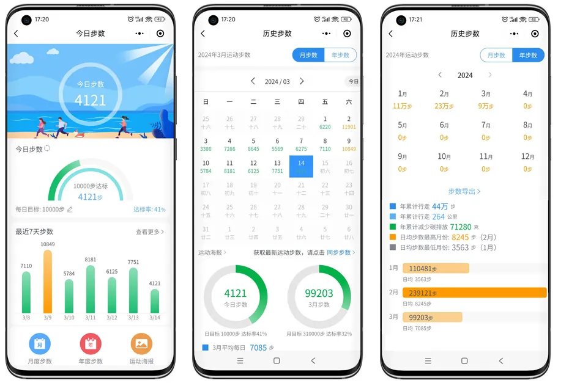
> *   **Asset 2**: 
> *   **Source**: `External`
> *   **Text**: "视觉原子的力量：从微信步数到全景地图"

上一节我们说过，要跳出模板思维，用隐喻的眼光重新审视图表。但隐喻说到底只是"我想表达什么"的思维框架——它没有告诉你**怎么把这个隐喻拼出来**。现在，我们要拆开引擎盖，看看隐喻的底层零件。

可视化的世界看似千变万化，从微信步数的柱状图，到大屏幕上这张《纽约时报》美轮美奂的全球疫情流动地图，所有这些复杂的呈现，如果你把它们放到理论的显微镜下，拆到底只有两样东西。

> [VISUAL]
> *   **Slide**: `S03_Marks_Channels_Intro`
> *   **Asset**: 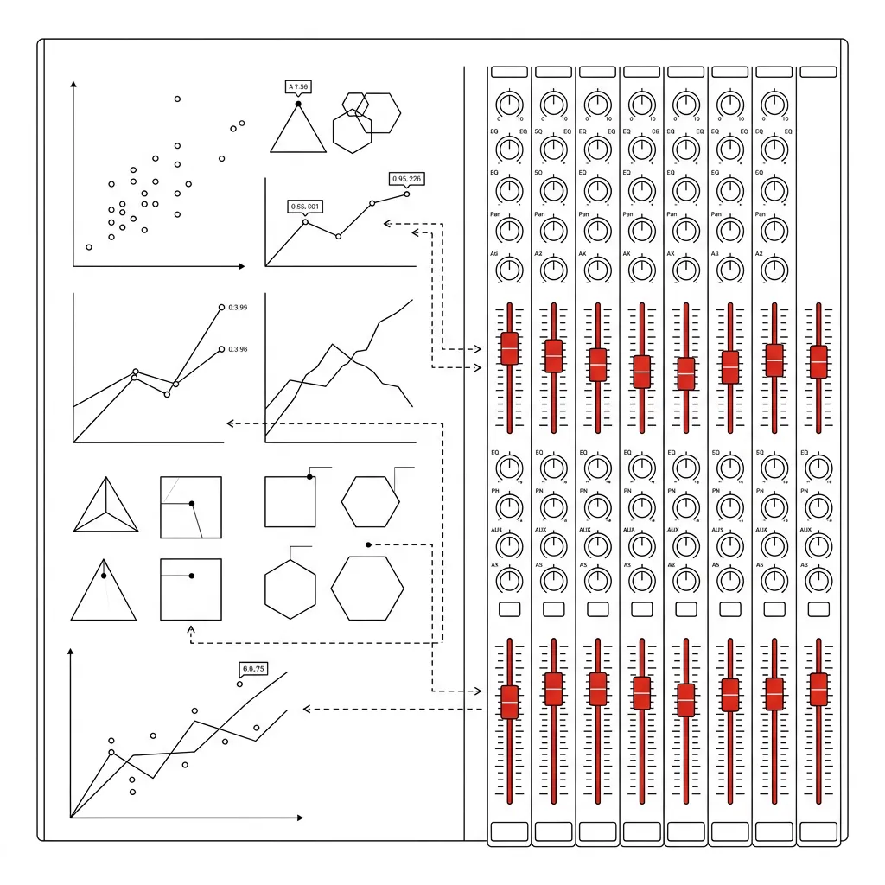
> *   **Layout**: `Grid`
> *   **Scene**: 一张充满科技感的"数据可视化控制台"设计图。画面左侧的全息投影中悬浮着基础几何图形（点、线、多边形面），即"Marks"；右侧则是一个带有色彩、大小、位置推子和旋钮的调音台式控制面板，即"Channels"。面板上的推子射出光束，直接连接并控制左侧的几何图形，精准传达出"通道控制标记"的核心逻辑。
> *   **Text**: "视觉编码的独立基石：从抽象数据到具象图形的桥梁"
> *   **List**:
> *     - Marks: 构成图表的几何原子骨架
> *     - Channels: 控制原子的视觉外观旋钮

这两样东西，就是 **Marks（标记）** 和 **Channels（通道）**。它们就像是一套高度精密的几何控制台，这两个互不干扰的基础维度组合在一起，就像控制台上的图层和推子，决定了你是否能够精准地把抽象冰冷的数字，无损且高效转化为屏幕上那些鲜活的视觉构件。

### 2.2 拆解视觉语法：定义标记与通道的面貌

#### 2.2.1 标记 (Marks)：承载数据的肉身

> [VISUAL]
> *   **Slide**: `S03b_Marks_Hierarchy`
> *   **Asset**: 
> *   **Source**: Textbook
> *   **Layout**: `Split`
> *   **Scene**: 从左到右的几何属性阶梯图：0D 点（标注"自由度：最高"）→1D 线（标注"自由度：中等，长度已被占用"）→2D 面（标注"状态分化：自由缩放 vs 空间锚定"），展示不同标记在承载数据时的物理约束。
> *   **Text**: "标记的几何层级：从自由到约束"
> *   **List**:
> *     - 0D 点：无几何束缚
> *     - 1D 线：单维度约束
> *     - 2D 面：自由缩放或全几何锚定

**Marks（标记）** 是图表中的几何实体（肉身）。在二维屏幕平面上，它们分三个维度层级：
1. **点（0D Points）**：作为基础标记，它本身不占物理面积，你可以尽情地赋予它任何形状、任何颜色，或者人为设定它的大小。在散点图中，每一个数据条目就是一个点。
2. **线（1D Lines）**：当线作为网络图中的“连接线”时，它的长度通常由两端节点的位置决定；但当线独立存在时（例如柱状图），它的长度本身就可以用来映射数据大小。
3. **面（2D Areas）**：在设计软件（如 Figma）里，你画的一个矩形或圆形就是一个“面”。它可以自由缩放（如气泡图），也可以被客观物理边界锚定（如地图上的国家版图）。

理解了标记的三种几何形态后，我们再来看标记的另一个分类维度——它在图表中扮演的**角色**。除了作为独立存在的**节点项目 (Items)**，标记还可以作为**链接 (Links)** 存在。

> [VISUAL]
> *   **Slide**: `S03b2_Items_and_Links`
> *   **RenderMode**: `pure`
> *   **Asset**: 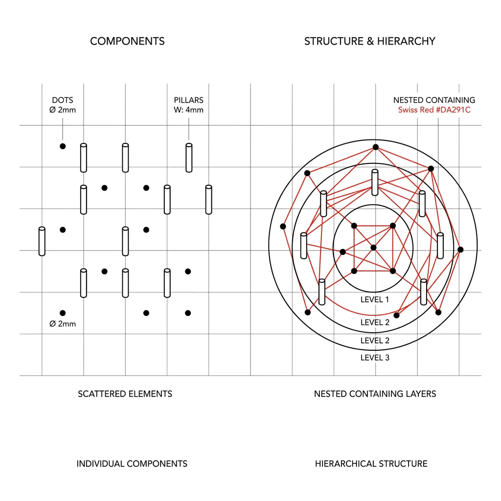
> *   **Layout**: `Split`
> *   **Scene**: 左侧展示零散的点与柱子（Items），右侧展示将它们串联起来的网状线条（Connection）与层叠的嵌套面（Containment，如代表文件层级的树图）。
> *   **Text**: "标记的网络功能：表达个体 vs 表达关系"
> *   **List**:
> *     - Items (节点项目): 零散的点与柱状
> *     - Connection (连接链接): 串联点的网状线
> *     - Containment (包含链接): 层叠嵌套的面 (如树图结构)

链接标记专门用来展示节点之间的关系，分为两类：
一是**连接 (Connection)**，使用线来展示成对的关系（如网络拓扑图）；
二是**包含 (Containment)**，使用面的嵌套来展示层级关系（如树图）。

#### 2.2.2 通道 (Channels)：操控躯体的提线

> [VISUAL]
> *   **Slide**: `S03c_Channel_Metaphor`
> *   **RenderMode**: `pedagogical`
> *   **Asset**: 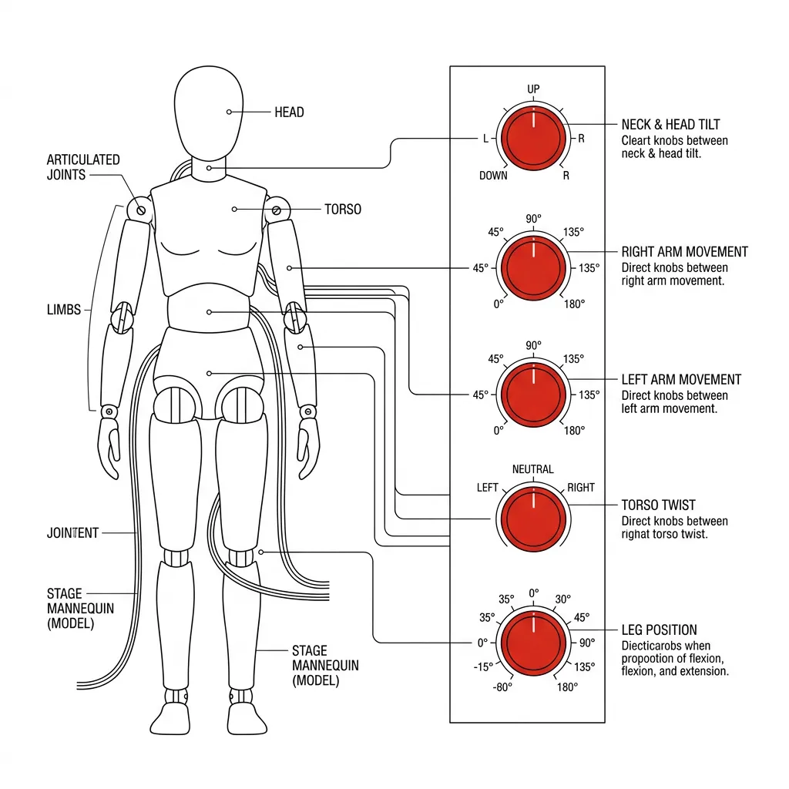
> *   **Layout**: `Center`
> *   **Scene**: 类似 Figma 或设计软件的 UI 界面。画布中央悬浮着基础的矢量几何节点（点、线、面，代表 Marks），右侧是带有数值联动效果的属性控制面板（代表 Channels）。属性面板中的 Fill 颜色拾色器、X/Y 坐标数值、Stroke 粗细等选项正射出光束，精准控制着画布中央几何图形的对应属性。
> *   **Text**: "通道：操控几何原子的属性面板"
> *   **Keywords**: 属性控制面板, 几何节点

大家可以把"标记"想象成你在 Figma 画布上绘制的**图形实体本身**（比如一个圆）。而这个圆在画布上是什么颜色？被放置在 X 轴的哪个坐标？在右侧属性面板里它的长宽数值（面积大小）是多少？这些在控制面板里、用以修饰图形外观、并且随数据变量产生起伏变化的控制选项，就是 **Channels（通道）**。**简而言之：图形实体是 Marks，改变它的属性值就是运用了 Channels。**

而在认知心理学的阵营里，通道分为两种根本不同的感官模态：

> [VISUAL]
> *   **Slide**: `S03c1_Identity_Channels`
> *   **RenderMode**: `pedagogical`
> *   **Layout**: `Center`
> *   **Scene**: 展示“身份通道”的分类图解（纯白背景，瑞士红点缀）。通过不同的几何形状（圆、方、三角）对元素进行无序归类。
> *   **Asset**: 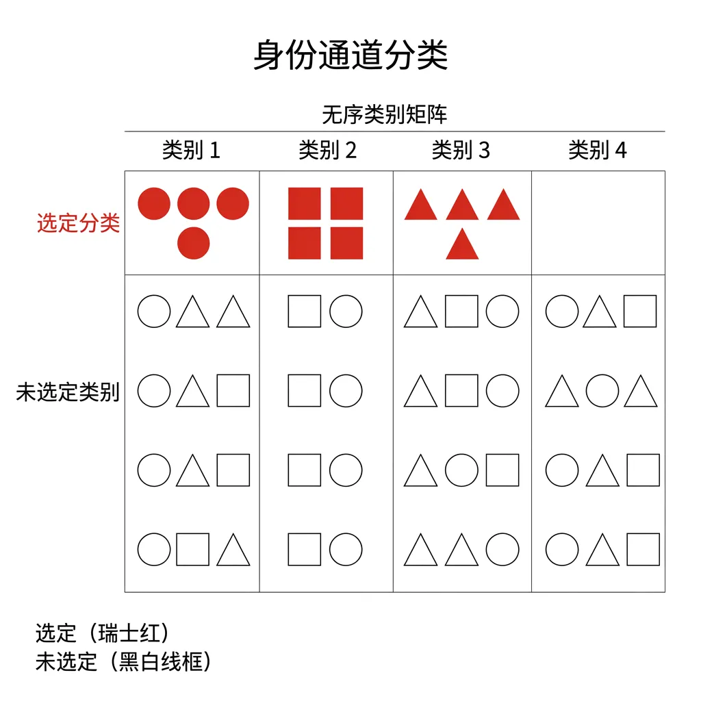
> *   **Source**: `AI_Gen`
> *   **Text**: "感官模态之一：身份通道"

第一是**身份通道 (Identity Channels)**。它负责回答“这是什么”或“它属于哪一类”。人类天生用它来映射**无序的分类数据**，例如不同的形状、或是不同的颜色色相。

> [VISUAL]
> *   **Slide**: `S03c2_Magnitude_Channels`
> *   **RenderMode**: `pedagogical`
> *   **Layout**: `Center`
> *   **Scene**: 展示“量化通道”的刻度图解。通过柱状图的长度递增和气泡图面积的扩大，直观表示数值大小的有序排列（最大数值用瑞士红高亮）。
> *   **Asset**: 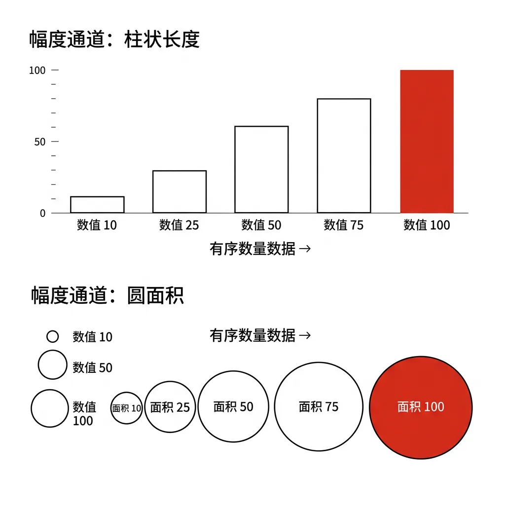
> *   **Source**: `AI_Gen`
> *   **Text**: "感官模态之二：量化通道"

第二是**量化通道 (Magnitude Channels)**。它负责回答“有多少”或“谁大谁小”。人类天生用它来映射**有序的定量数据**，例如线条的长度、颜色的明暗深浅、或者是面积的大小。

为了彻底理解这两者的底层分野，我们来看一个横跨两界的特殊属性——**“空间”**。

> [VISUAL]
> *   **Slide**: `S03c3_Space_Duality`
> *   **RenderMode**: `pedagogical`
> *   **Layout**: `Split`
> *   **Scene**: 左侧展示“空间区域（分类）”：画面被粗略划分为左半区和右半区，代表不同的阵营；右侧展示“空间位置（量化）”：带有X/Y轴刻度的精确网格坐标系，标出了某个数据点的确切数值。
> *   **Asset**: 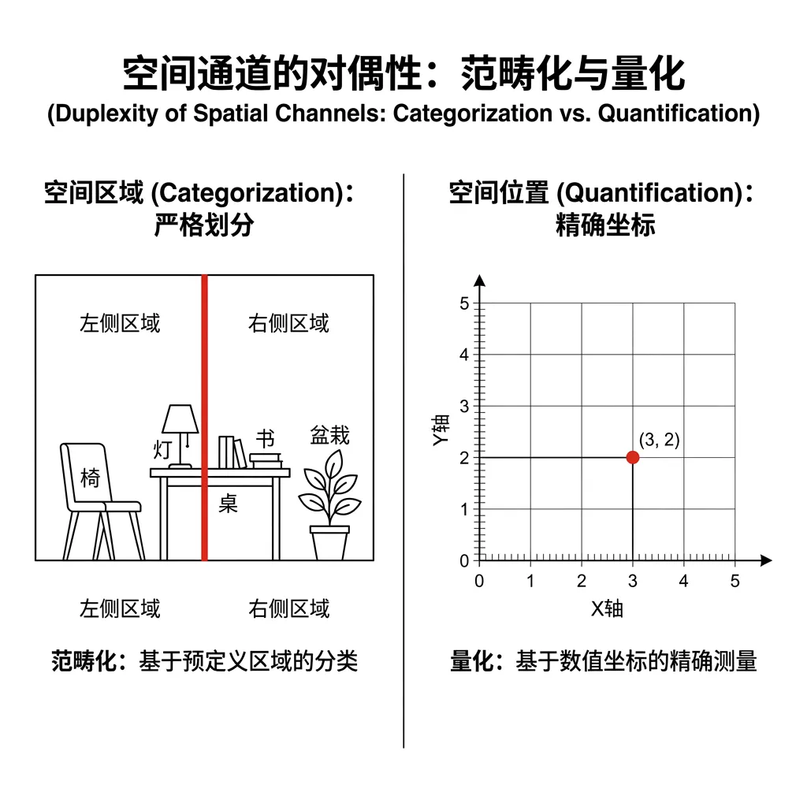
> *   **Source**: `AI_Gen`
> *   **Text**: "空间的双重属性：区域（分类） vs 坐标（量化）"

在图表中，空间有着完全不同的两种用法：
- 当空间作为**身份通道**时，它表现为**“空间区域 (Spatial Region)”**。用设计软件的逻辑来说，这就像是在画布上把元素放进不同的**画板或分组（Frame / Group）**里（比如左半区和右半区），这仅仅代表了类别归属，没有数值大小之分。
- 当空间作为**量化通道**时，它表现为带有公共刻度的**“空间位置 (Spatial Position)”**。这就像是把元素严格对齐到带有 X 轴和 Y 轴的**精确坐标系**上，这个坐标提供了可以被精确读取的定量数值。

在画布上把元素分堆隔离就是分类，把元素按坐标系排好就是量化。理解了这一点，你就掌握了视觉通道最核心的底层逻辑。

> [VISUAL]
> *   **Slide**: `S03c_Five_Dim_Scatter`
> *   **Asset 1**: 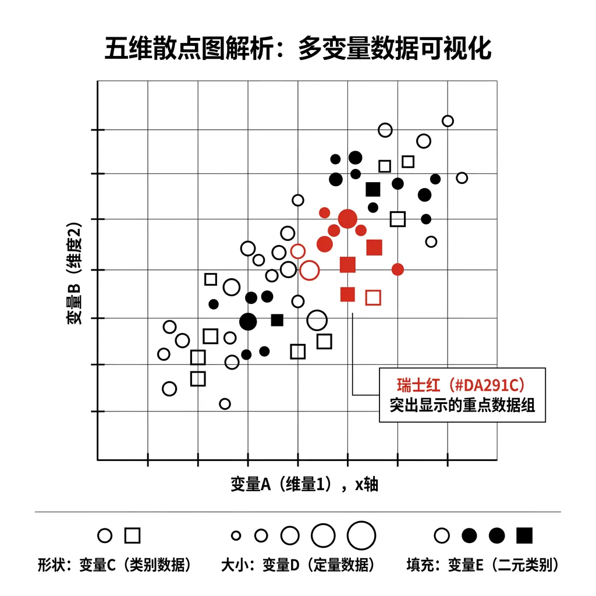
> *   **Source**: `AI_Gen`
> *   **Layout**: `Split`
> *   **Scene**: 展示一张极致纯净的五维数据散点图解（纯白背景，精确细线）。散点在 X 轴和 Y 轴上排布（代表年龄与收入）；散点本身包含不同的形状（圆形与方形代表学历类别），不同的面积大小（代表健康评分），以及黑白线框与瑞士红高亮的颜色对比（代表性别）。整体呈现 Edward Tufte 风格的极简学术图表感，彻底剔除所有纸张纹理与装饰噪音。
> *   **Text**: "原子的组合：一颗点，五个通道映射五维世界"
> *   **List**:
> *     - 1. 位置 X 轴：映射 年龄 (定量属性)
> *     - 2. 位置 Y 轴：映射 收入 (定量属性)
> *     - 3. 颜色色相：映射 性别 (定性通道)
> *     - 4. 面积大小：映射 健康评分 (定量属性)
> *     - 5. 形状标记：映射 学历 (定性通道)

这就是这套原子语法结合的力量：你只需在二维平面上放置一颗最基础的、完全不受几何约束的 0D 散点，并通过不断叠加量化通道和定性特征，就能瞬间在二维屏幕上，把高维数据清晰地表达出来。

> [ACTIVITY]
> *   **Type**: `Quiz`
> *   **Duration**: `2min`
> *   **Desc**: 原子语法判别
> *   **Q**: 客户要求在一张世界地图上，展示各国不同类型发电厂（火电、水电、核电、风电）的分布。如果我们要在地图上标注发电厂，应该选择哪种组合？
> *   **Options**: A. 用 2D 面标记覆盖国家版图，用面积大小通道表示发电厂类型。 | B. 用 0D 点标记放置在特定坐标，用不同颜色色相通道表示发电厂类型。 | C. 用 1D 线标记连接各国首都，用长度通道表示发电厂类型。
> *   **Answer**: `B`
> *   **Explain**: 发电厂的类型是无序的分类数据，根据法则，必须使用"身份通道"（如颜色色相）来映射。面积大小是量化通道，用来映射分类数据会产生虚假的"谁大谁小"暗示。地图本身的地理坐标已经占用了几何坐标通道，因此只能在具体位置放置 0D 的点标记，并赋予其色相变化。面标记被地理锚定，而线标记用于表示关系连接，均不适用此场景。

> [VISUAL]
> *   **Slide**: `S03_TED_Map_Distortion`
> *   **Layout**: `Video`
> *   **Asset**: 
> *   **Source**: `Video` — TED-Ed: Why every world map is wrong
> *   **Duration**: 04:58
> *   **TimeCategory**: `activity`

> [TEACHING MOMENT: 空间的绝对霸权与地图谎言]
> 刚才的测验告诉我们：绝对不能在已经被地理坐标“霸占”的地图上随意使用“面积大小”通道。但为什么“空间位置”和“面积”在这个场景下如此敏感且危险？为了让大家从更宏大的制图学维度理解这一点，我们接下来观看一段由顶级教育频道 TED-Ed 制作的科普短片：《为什么每一张世界地图都是错的》。
> 
> **为什么要看这个视频？（与知识点的关联）：**
> 在数据可视化中，空间坐标（地图）是最强力的量化通道。但在现实的 3D 地球映射到 2D 屏幕的过程中，由于“墨卡托投影”等数学机制，地图本身的“面积”就已经被严重扭曲了（例如格陵兰岛在地图上看起来和非洲一样大，其实非洲比它大 14 倍）。如果你在原本就已经面积畸变的“空间面”上，再叠加一个“大小通道”来表示数据，无异于在谎言之上叠加谎言。
> 
> **视频内容简介：**
> 这段 5 分钟的全尺寸动画，向我们展示了几百年来制图师是如何在“形状精确”和“面积精确”之间艰难取舍的。看懂了这个视频，你就会深刻理解为什么在处理带地理属性的数据时，必须对“面积”和“空间”怀有敬畏之心——老老实实用 0D 点和身份色相（颜色），才是最安全、最诚实的选择。

### 2.3 遵循物理铁律：表达性与有效性原则

> [VISUAL]
> *   **Slide**: `S04_Expressiveness_Effectiveness`
> *   **RenderMode**: `pedagogical`
> *   **Layout**: `Split`
> *   **Scene**: 左右分栏的教学图解。左侧代表"表达性（类型匹配拼图）"：分类数据（圆、三角、方形）箭头指向身份通道面板（色相色板），连续数据（递增柱状图）箭头指向量化通道面板（大小梯度圆圈），红叉标记错误的交叉连接；右侧代表"有效性（阶级排名阶梯）"：顶部瑞士红高亮的空间坐标轴图标（#1 最有效），中部面积圆圈，底部明度渐变条（最末位）。纯白背景，Edward Tufte 极简线框风格。
> *   **Asset**: 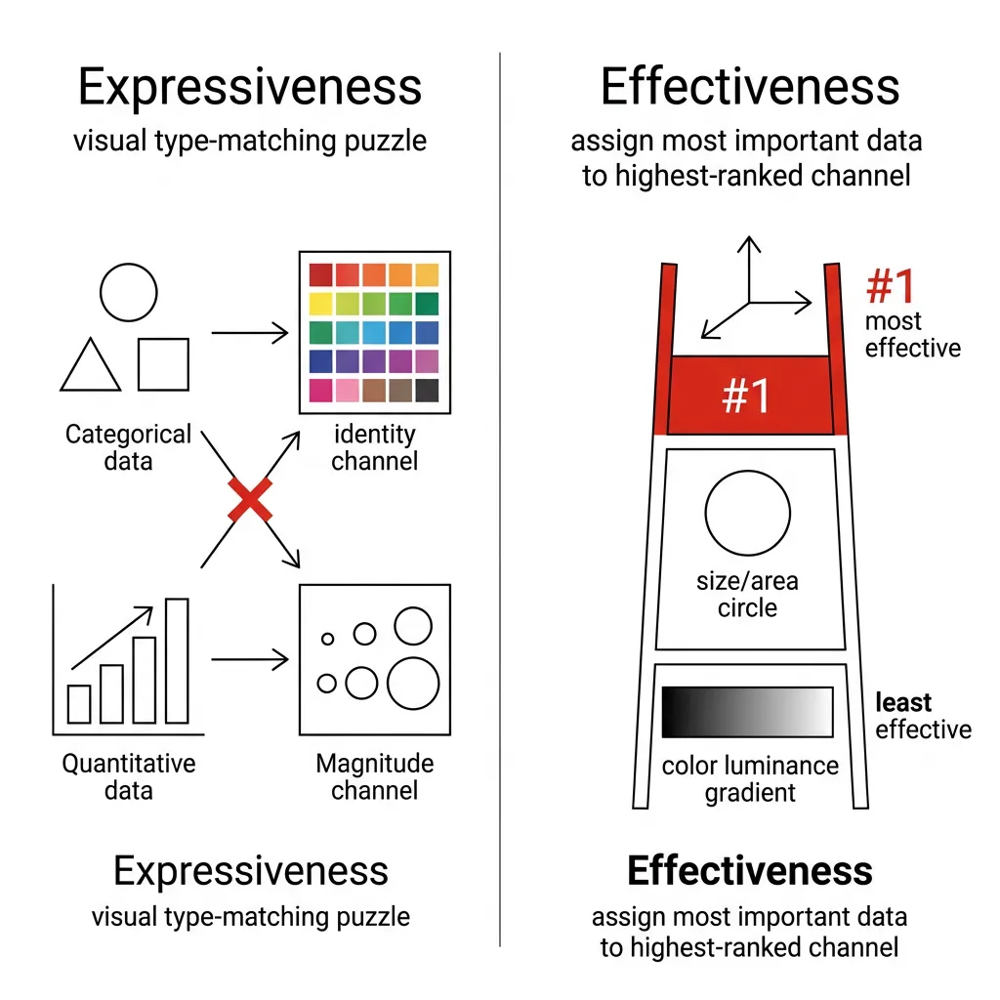
> *   **Source**: `AI_Gen`
> *   **Text**: "法则降临：表达性与有效性"

既然通道是图表外观的控制旋钮，那我们能随意把任何数据挂载到任何旋钮上吗？绝不能。设计视觉编码必须遵循两个不可逾越的核心原则：**表达性 (Expressiveness)** 和 **有效性 (Effectiveness)**。

> [VISUAL]
> *   **Slide**: `S04_TED_Synesthesia`
> *   **Layout**: `Video`
> *   **Asset**: 
> *   **Source**: `Video` — TED-Ed: What color is Tuesday? Exploring synesthesia
> *   **Duration**: 03:56
> *   **TimeCategory**: `activity`

> [TEACHING MOMENT: 视觉原子的生理起源与联觉]
> 在正式进入严苛的“表达性”与“有效性”法则之前，我想请大家先暂停一下工具层面的思考。我们经常会问：到底是谁规定了“颜色代表类别”而“大小代表数值”？这种通道与数据的匹配，是某位设计师拍脑袋决定的吗？
> 
> 为了回答这个问题，我们来观看一段来自 TED-Ed 的科普长片：《星期二是什么颜色？探索联觉》。
> 
> **为什么要看这个视频？（与知识点的关联）：**
> 这段视频探讨了“联觉（Synesthesia）”——一种感官跨界的神经生理现象。著名抽象派先驱康定斯基（Wassily Kandinsky）就是一位典型的联觉者，他能“听”到色彩，“看”到声音，并将这种跨感官的本能升华为包豪斯著名的“点线面”理论。在可视化原子语法中，“数据”就是那看不见的声音，“通道”就是看得见的色彩和形状。理解了联觉，你就会明白：特定的通道（如色相）映射特定的数据（如分类），并非人为规定，而是顺应我们大脑神经元底层的交叉连接机制。
> 
> **视频内容简介：**
> 这段约 4 分钟的唯美动画，深入解析了极少数人是如何在视觉、听觉和触觉之间建立物理连接的。它将帮助我们从神经生物学的维度，理解视觉语法（Marks 和 Channels）为何能如此深刻且本能地影响我们的认知。

#### 2.3.1 表达性原则：数据特征与通道类型的匹配法则

> [VISUAL]
> *   **Slide**: `S04a1_Expressiveness_Rule`
> *   **RenderMode**: `pedagogical`
> *   **Layout**: `Grid`
> *   **Scene**: 一个 2x2 的图解矩阵。上半部分展示无序分类数据（如苹果、香蕉）：正确映射到不同形状的几何图标，并用红叉标出错误的“映射到不同大小圆圈”；下半部分展示有序连续数据（如温度计）：正确映射到不同大小的圆圈，并用红叉标出错误的“映射到不同形状的几何图标”。
> *   **Keywords**: 分类映射形状, 连续映射大小
> *   **Asset**: 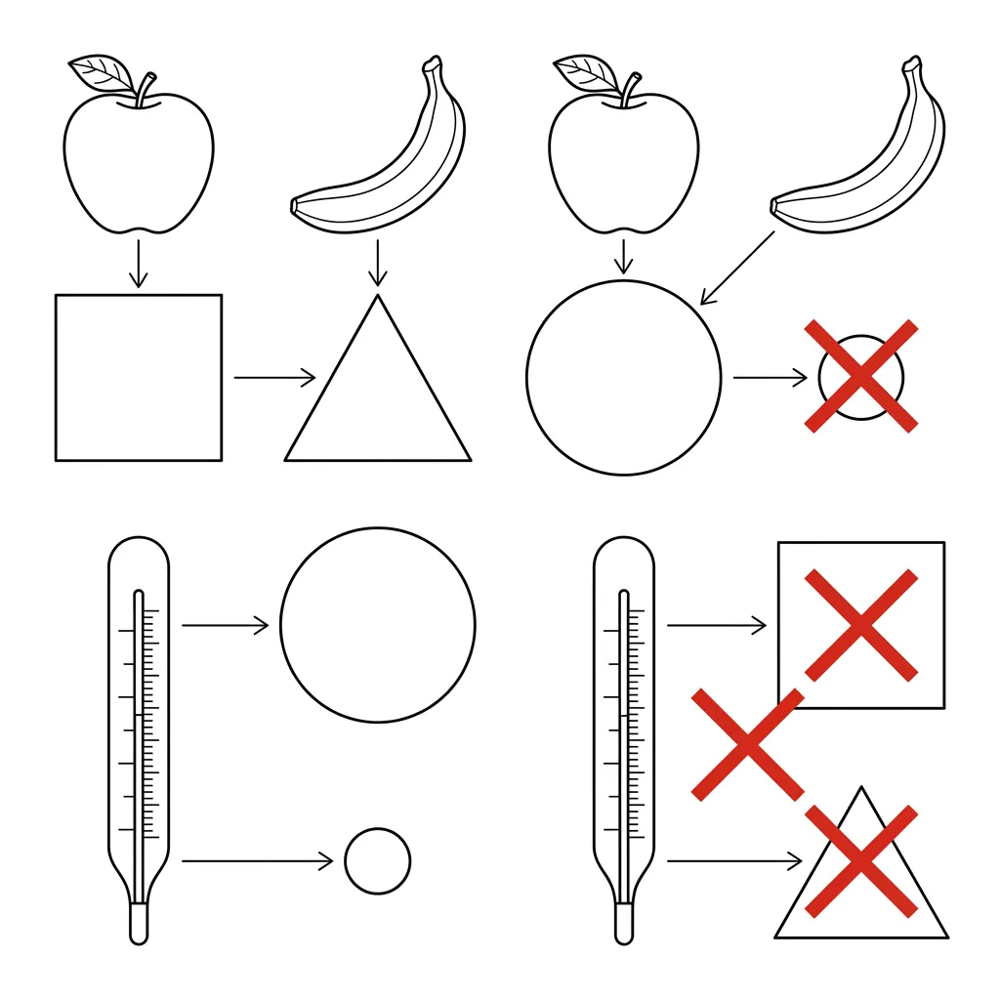
> *   **Source**: `AI_Gen`
> *   **Text**: "表达性原则：分类用身份通道，连续用量化通道"

**表达性原则**意味着：视觉编码必须且仅能表达数据集中的底层信息属性。
- **无序数据/分类数据** 切忌用带有顺序暗示的定量属性（如大小、长度）来呈现。
- **有序数据/连续数据** 必须使用产生内在大小感知的映射手段。

> [VISUAL]
> *   **Slide**: `S04a2_Beverage_Map_Fail`
> *   **RenderMode**: `pedagogical`
> *   **Layout**: `Comparison`
> *   **Scene**: 左侧是错误的"新饮料分布地图"（四个大小不一的圆圈，其中青柠汽水的圆圈被突出标大，带有问号），右侧是正确的修改版（四个相同大小但不同颜色的圆圈，清晰区分四款饮料）。
> *   **Keywords**: 错误大小气泡, 正确颜色气泡
> *   **Asset**: 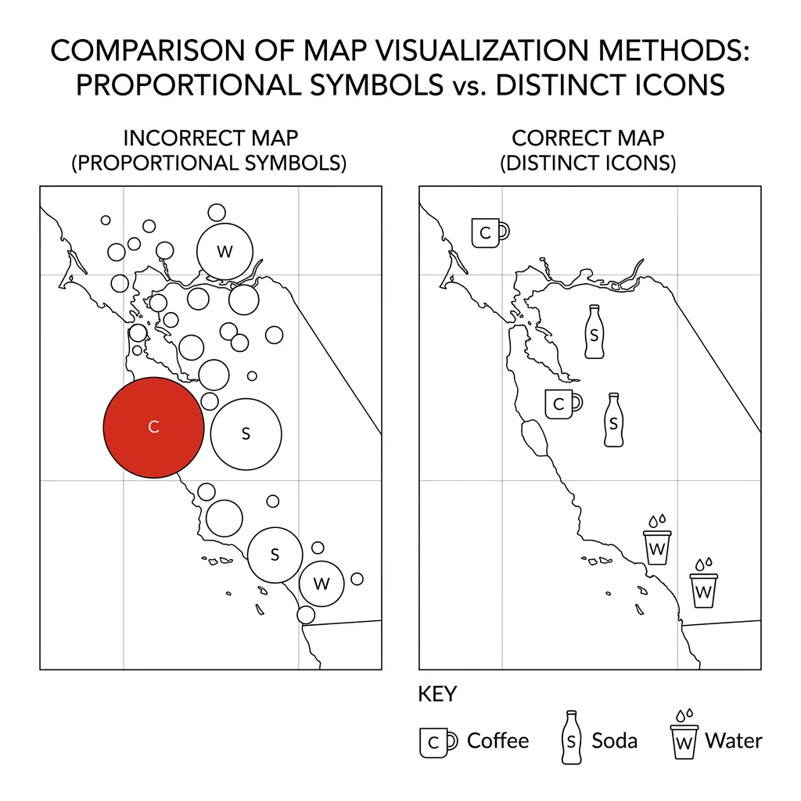
> *   **Source**: `AI_Gen`
> *   **Text**: "日常翻车：用大小代表分类引发的认知噪音"

违背这条法则会发生什么？先来看一个日常级别的翻车。想象你的甲方是一家快消品牌，要求你做一张展示"四款夏季新饮料"（青柠汽水、冰美式、乌龙茶、西瓜汁）在门店地图上的分布。如果你为了所谓的设计感，把这四款饮料画成四种不同大小的圆圈来标注——注意，"饮料种类"是纯粹的**无序分类数据**，而面积是**定量属性**。观众在地图上看到大圆和小圆，下意识的反应不是"这是四种平行的饮料"，而是会困惑："青柠汽水为什么比冰美式'大'三倍？是它的销量更高，还是杯子更大？" 看，仅仅是通道选错了，不仅增加了认知噪音，还制造了虚假的数据暗示。

> [VISUAL]
> *   **Slide**: `S04a3_Redundant_Encoding`
> *   **RenderMode**: `pedagogical`
> *   **Layout**: `Comparison`
> *   **Scene**: 左侧展示错误的重复编码（四个货架格子里放着瓶子，不仅位置被分开，瓶身还画蛇添足地画上了四种复杂的纹理图案，被红叉标出）；右侧展示正确的极简编码（四个格子里放着纯白统一的无纹理瓶子，让“空间区域”独自承担分类任务）。
> *   **Keywords**: 货架, 饮料瓶
> *   **Asset**: 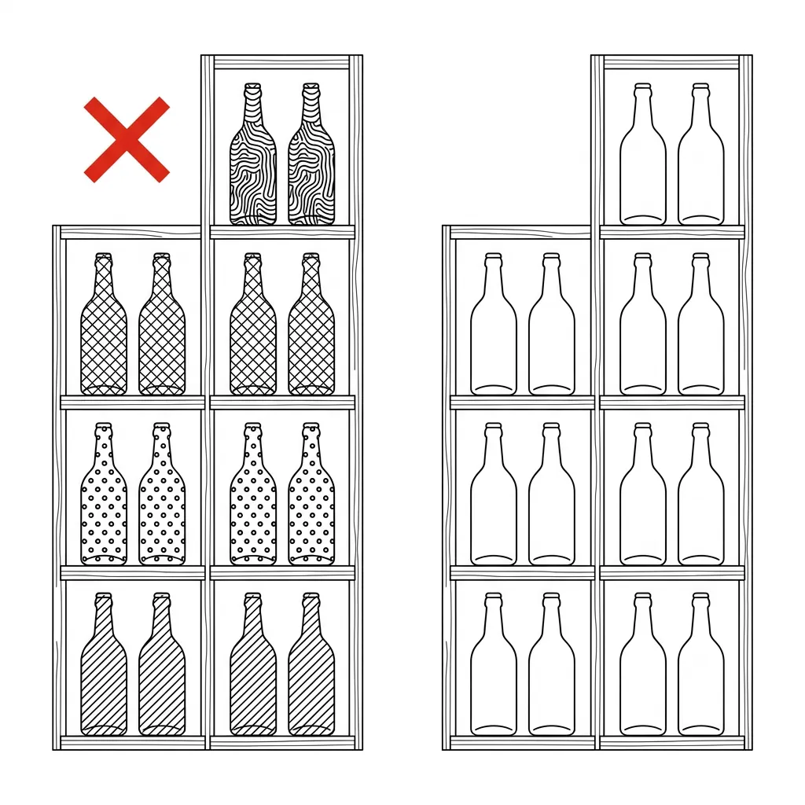
> *   **Source**: `AI_Gen`
> *   **Text**: "重复编码：画蛇添足的视觉噪音"

> **特别辨析：警惕重复编码**
> 还有一种常见错误，叫做**重复编码 (Redundant Encoding)**。如果饮料种类已经通过其他通道（比如在不同货架的**空间区域**）完全分开了，你再多此一举地给它们涂上四种不同的颜色。这不仅没有增加任何新信息，还会让大脑下意识去寻找这四种颜色背后根本不存在的"新意义"，徒增无谓的认知噪音。这也是表达性原则所不允许的。

这只是商业层面的小事故。但在某些领域，数据类型与通道类型的错配会是**致命的**。

在看接下来的案例之前，我先给大家埋一个理解的种子：为什么色相不能用来编码连续数据？简单来说，人眼对不同颜色的**亮度感知天生就是不均匀的**——黄色在你眼里天然比蓝色更"亮"，绿色和红色的明暗感受也完全不在一个档位上。当你把这些亮度忽高忽低的颜色排成一条彩虹去映射一段**平滑渐变**的连续数值时，亮度的跳跃就会被大脑误读为数据的断裂。下一节课我们会用 Stevens 定律详细拆解这个感知机制，但现在你只需要牢记一条铁律：**色相用于分类，明度用于连续**。接下来这个案例会告诉你，违反它的代价有多沉重。

> [VISUAL]
> *   **Slide**: `S04b_Expressiveness_Disaster`
> *   **Asset**: 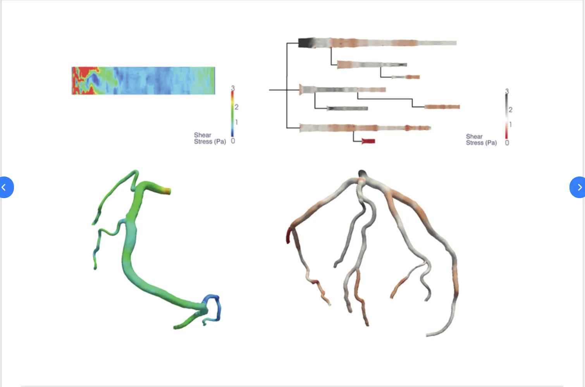
> *   **Source**: Web Source
> *   **Layout**: `Full`
> *   **Scene**: 展示哈佛医学院论文原图的 2x2 对比矩阵。左侧是彩虹色带渲染的血管（色彩突兀断裂），右侧是红灰单色渐变渲染的血管（平滑连续）。
> *   **Text**: "违背表达性原则：生与死的图表"

这四张血管造影原图，残忍地展示了违背"表达性原则"的致命代价。长久以来，很多医疗诊断软件为了追求所谓"热成像"的视觉冲击力，强行使用**左侧的"彩虹色带（连续的色相变化）"**来映射血管内部连续的血压数值梯度。
要知道，**色相本质是分类的身份通道**，它在人类基因里的作用是区分苹果和香蕉的不同，而不是判断谁比谁更重。强行用它来渲染连续的数值压力，人眼就会在红、黄、绿色的交界处，看到根本不存在的、尖锐的"视觉断层"。原本平滑的压力变化，在医生眼里变成了突兀的截断。这直接导致专科医生对危险动脉瘤病灶的识别率暴跌至 **39%**！这不是设计不好看，这是在杀人。

而当哈佛大学 Borkin 团队（2011 年发表于 *IEEE TVCG*）顶住压力拨乱反正——坚持表达性原则，改用右侧的**单色红灰明度渐变（Luminance，这才是正宗的定量属性）**后，明暗梯度的深浅完美契合了血管内真实的平滑压力分布。没有了伪造的色彩断层干扰，医生的诊断准确率当即飙升至 **91%**。在严肃的数据可视化中，颜色绝不是让你用来挥洒的装饰涂料。必须克制你的感性美学冲动，严格遵守底层的物理辨识规律，因为你手里的图表，可能决定着他人的生死。

> [ACTIVITY]
> *   **Type**: `Quiz`
> *   **Duration**: `2min`
> *   **Desc**: 表达性原则应用
> *   **Q**: 你的团队正在设计一款天气App，需要在地图上用颜色展示各个城市当天的连续气温变化（从 0℃ 到 40℃ 的平滑过渡）。实习生建议使用“彩虹色带”（红橙黄绿青蓝紫）来映射气温的高低。根据"表达性原则"，这种做法为什么会引发严重的认知偏差？
> *   **Options**: A. 因为彩虹色带太花哨，不符合现代极简的设计趋势。 | B. 气温是平滑连续的定量数据，而彩虹色的“色相”是离散的身份通道。人眼感知不均匀，会产生虚假的“色彩断层”，导致气温变化被误读。 | C. 应该使用不同大小的气泡来表示气温高低，地图上不能用颜色。
> *   **Answer**: `B`
> *   **Explain**: 气温是典型的连续型定量数值。色相天生用于分类（区分苹果和香蕉），而非量化（谁比谁大）。对于连续渐变的定量数据，必须使用“明度渐变”（如单色红灰渐变）这类量化通道，才能契合真实的物理分布。这是哈佛医学院血管造影案例给我们留下的血的教训。

#这里要特别提醒：**颜色从来不是数据的调色盘**。它是一个非常危险的通道。如果在不必要的地方滥用颜色，不仅会制造认知噪音，甚至会导致灾难性的后果。

### 2.4 有效性原则：通道阶级排名与生理机制

光遵守表达性原则还不够。当你同时拥有多个可以表达连续数值的定量属性时（比如：你可以用柱子的长度来表示销售额，也可以用圆圈的面积，甚至可以用颜色的明暗深浅），你应该选哪一个？

而在有效性原则下，每一类通道都有着其**稳固的阶级排名**。最重要的属性应分配给排名最高、最有效的通道。

> [VISUAL]
> *   **Slide**: `S04_Channel_Effectiveness`
> *   **Resource**: 
> *   **Source**: Textbook
> *   **Layout**: `Grid`
> *   **Scene**: 展示 Tamara Munzner 理论中通道的视觉效能硬性排序梯队。左列为最强的量化通道（对齐位置打头阵）；右列为身份通道（空间区域和色相打头阵）。
> *   **Text**: "通道阶级排名：论资排辈的视网膜规律"
> *   **List**:
> *     - 量化属性榜首：对齐的空间位置 (Position on common scale)
> *     - 量化属性榜末：面积 / 体积 / 颜色明度
> *     - 身份通道榜首：几何区域 (Spatial region) 
> *     - 身份通道次席：颜色色相 (Color hue)

请特别注意这张榜单，**空间类通道**（在量化榜单中是精确的**几何位置**，在身份榜单中是粗略的**几何区域**）双双拔得头筹。这意味着你把什么数据映射给空间（如排布在左半区还是右半区，或者精确在 X 轴和 Y 轴），将深刻主导观众对数据的心理模型。这也就是为什么在绝大多数有效的数据可视化中，几何位置永远被用来映射最重要、最核心的变量。

而在榜单的另一端，**面积、体积和颜色明度**则依次垫底——它们是定量手段中对于"精确数值比例"最"迟钝"的感知器（人眼很难看出一种灰色恰好是另一种灰色的两倍深）。

> **(等等，既然明度垫底，为什么前面的哈佛血管图不用排名第一的位置通道？)**
> 原因很简单：血管本身的物理形状已经霸占了"几何坐标"和"面积"通道，留给数据编码的空间只剩下了颜色。而在所有能表示连续数值的通道里，**单色明度渐变**是唯一不会产生视觉断层的存在。明度虽然在精确读取上排名垫底，但它不占用额外的空间。在受限的三维现实中，它是挽救生命的"最优妥协解"。

为什么面积也如此靠后？为什么体积比面积还糟？这背后藏着一条冰冷的心理物理学定律——我们下一节就来揭开它。

> [VISUAL]
> *   **Slide**: `S05_CrashCourse_Perception`
> *   **Layout**: `Video`
> *   **Asset**: 
> *   **Source**: `Video` — Crash Course: Perceiving is Believing
> *   **Duration**: 10:00
> *   **TimeCategory**: `activity`

> [TEACHING MOMENT: 视觉感知的欺骗性与格式塔]
> 通道的阶级排名（为什么坐标是王者，面积垫底），其根源在于人类视觉系统的“局限性”与“捷径”。为了从生理学层面彻底打通这条底层逻辑，我们将利用接下来的 10 分钟，观看由全球顶级科普频道 Crash Course 带来的重量级长片：《眼见为实？视觉感知的欺骗》。
> 
> **为什么要看这个视频？（与知识点的关联）：**
> 无论是南丁格尔用面积图夸大死因造成的视觉震撼，还是哈佛医学院由于错用彩虹色相导致的医疗事故，其元凶都是人类大脑中名为“格式塔（Gestalt）”的自动补全机制。理解了我们的大脑是如何在 3D 世界中判断深度、形状和大小的（以及这些判断有多容易被欺骗），你就能真正敬畏“通道效能排名表”，并在未来的设计中克制滥用无效通道的冲动。
> 
> **视频内容简介：**
> 在这 10 分钟内，知名科普作家 Hank Green 将带我们经历一场视觉错觉的洗礼。视频详细解剖了人眼对大小恒常性、深度线索的误判，以及格式塔原则是如何强行让我们看到“本不存在的事物”。这是一场极具分量的知识轰炸，请大家清空大脑，享受这段认知换气时间。

> [CASE STUDY: Gapminder 的架构思路]

> [VISUAL]
> *   **Slide**: `S05_Gapminder_Base`
> *   **Asset**: 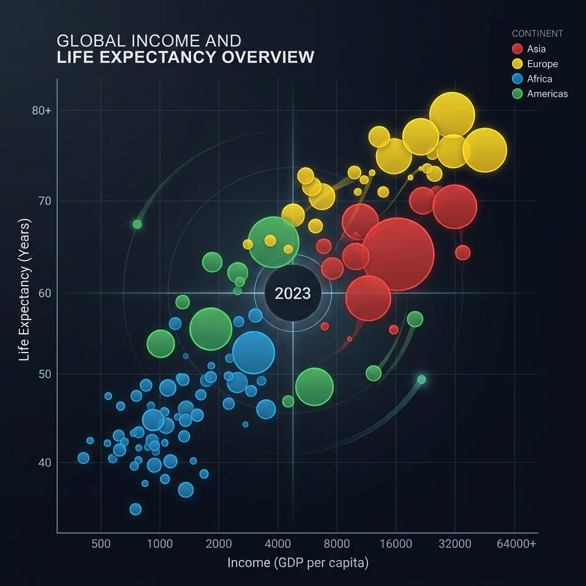
> *   **Layout**: `Center`
> *   **Scene**: Gapminder 经典气泡图。X轴人均GDP，Y轴预期健康寿命，气泡大小代表人口，颜色代表大洲，带有多条气泡随时间移动的轨迹。
> *   **Text**: "遵守铁律：Gapminder的五维交响乐"

已故统计学家 Hans Rosling 的经典 Gapminder 动图，就是遵循排名法则的教科书级实践。
他将最重要的两个定量指标【人均GDP】与【预期健康寿命】，全部分配给量化排名第一的**双轴坐标位置**。对于分类数据【国家所属的大洲】，赋予其高优身份通道**颜色色相**。次要的定量数据【人口规模】，退而求其次使用了**面积通道**。而为了呈现历史变迁，他启用了**运动通道**。这套严密遵守效能梯队的架构，成就了不朽的经典。

> [CASE STUDY: 撕碎名字迷信——解剖气泡图 (Bubble Chart)]

> [VISUAL]
> *   **Slide**: `S03c2_Bubble_Chart_Anatomy`
> *   **Asset**: 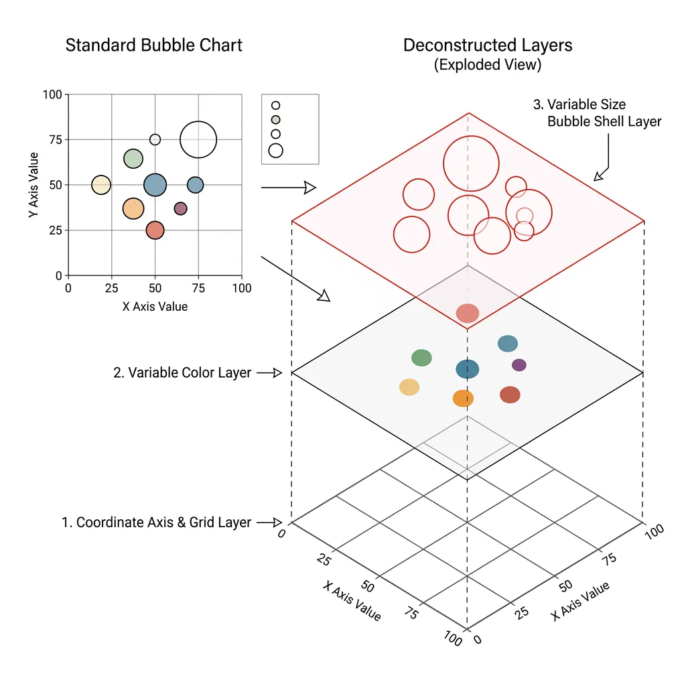
> *   **Layout**: `Split`
> *   **Scene**: 左侧展示一个标准气泡图；右侧将其拆解为三层透明度叠加的图层——底层的 X/Y 坐标轴（量化位置）、漂浮的颜色层（身份色相）、以及最上层不同膨胀程度的外壳（量化面积）。
> *   **Text**: "解剖气泡图：撕碎流行的外衣"

现在让我们用刚学到的通道阶级排名，直接把初阶工具库里著名的"高级图表"——气泡图进行结构剖析。

大众往往将其视为"一种名为气泡图的高级样式"，认为套用即可提升专业度。但在标记与通道的显微镜下，气泡图的底层结构一览无遗：它仅仅是一颗**0D 点**作为基础标记，X/Y 轴的**空间坐标通道**被用来映射强弱相关性，**面积通道**被吹胀以隐喻第三个连续变量（如人口规模），而**颜色色相通道**则用于标识分类变量（如大洲）。这就是图表生成的核心原理。

一旦看透这一层，如果"面积通道"因为数值落差悬殊导致小气泡在视觉上几乎消失为一个像素点，你可以果断干预——不要去强行硬凑，在处理真实数据时，可以直接放弃气泡图换回条形图，或者在专业数据工具中为坐标轴开启**对数缩放 (Log Scale)**。不再迷信所谓的"图表名称"，你就能真正掌控底层语法，实现设计自由。

### 2.5 驾驭原子力量：实现架构师的三重跃迁

> [VISUAL]
> *   **Slide**: `S05c_Nightingale_Rose`
> *   **Asset**: 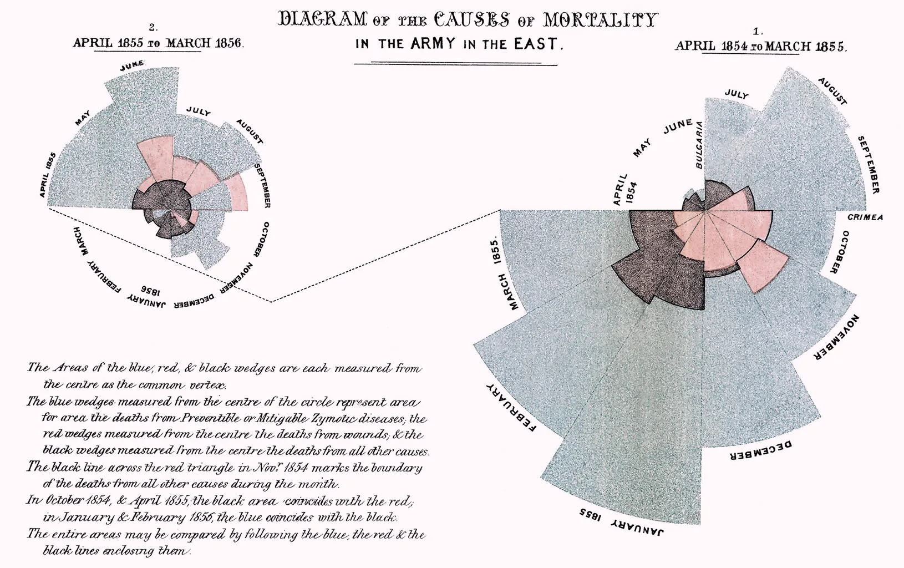
> *   **Source**: Web Source
> *   **Layout**: `Full`
> *   **Scene**: 佛罗伦萨·南丁格尔经典的极坐标面积图（鸡冠花图），标记了不同颜色代表的不同死因，展现着挽救生命的巨大视觉震撼。
> *   **Text**: "南丁格尔的玫瑰战争：改变国家历史的图表"

> [STORY TIME: 南丁格尔的玫瑰战争]
> 1858 年，佛罗伦萨·南丁格尔在克里米亚战争结束后，将士兵的死亡原因编码成一张前所未有的视觉图表——"鸡冠花图（极坐标面积图）"。她用扇区面积映射死亡人数，用蓝、红、黑三色区分死因（可预防疾病、战伤、其他）。随后，她私印了 2000 份报告分发给皇家卫生委员会成员和政界要员，用这张图表有力推动了英国军队医院的卫生改革。标记与通道的力量，远比你想象的更加真实。
> 有同学可能会问：面积通道不是在阶级排名中垫底吗？南丁格尔用它岂不是"违背了底线铁律"？
> 
> 铁律确实是铁律，但这需要你分清当前的图表究竟是用于“分析”还是“叙事”。
>
> 前文所说的“不可逾越的物理铁律”和效能排名，是针对**“分析型图表（求精确与求真）”**的核心底线。如果你在做仪表盘，有效性排名的本质就是人眼读取数值的“精确度”，你必须死守铁律。
>
> 但南丁格尔制作的是**“叙事型图表（求游说与求感）”**。她的目标不是让政客做精确的数学算术题，而是要用巨大悬殊的视觉落差"吓醒"他们。这并不是说她拥有无视规则的特权，而是她基于传播目标，**战略性地让渡了数据的读取精度，换取了强烈的情绪冲击力**。理解了分析与叙事的场景边界，你才算是真正驾驭了铁律。

当我们从哈佛医学院的血案走到南丁格尔的玫瑰，你会发现学习这套原子语法，最终能带给你三个非常务实的能力提升：

**1. 不受限：摆脱模板束缚**
学会把点线面和颜色大小像搭乐高一样拆解组合，根据数据特性构筑属于自己的新图表。

**2. 守底线：不制造视觉谎言**
掌握“表达性”与“有效性”，守住不骗人的底线，让你的设计经得起学术和现实的推敲。

**3. 强沟通：掌控生成式 AI 的密码**
在 AI 时代，告别模糊的提示词。你可以精确下达指令：*"锁定空间坐标通道，把颜色色相重置映射为社会阶层，并用面积通道映射利润额。"* 瞬间掌控机器的画笔。

> [TEACHING MOMENT: 带走三件事]
> 今天我们掌握了原子语法的核心：**标记是几何实体**（图元本身），**通道是视觉旋钮**（长宽、位置、颜色等属性），而**表达性和有效性是匹配铁律**。当你能用原子的眼光拆解每一个视觉元素，你就真正获得了设计的自由度。

但仅仅知道通道的排名还不够——为什么坐标位置是王者、面积是末座？下一节我们将用认知心理学实验来揭秘这些排名背后的**生理物理学铁证**。

**(Pause: 3s)**

---
