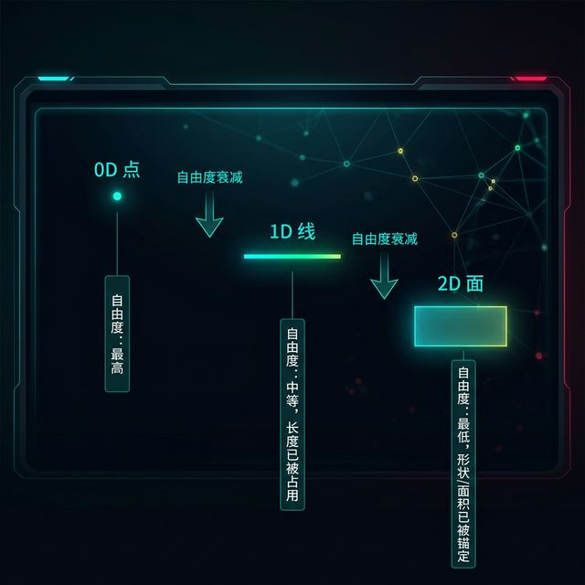
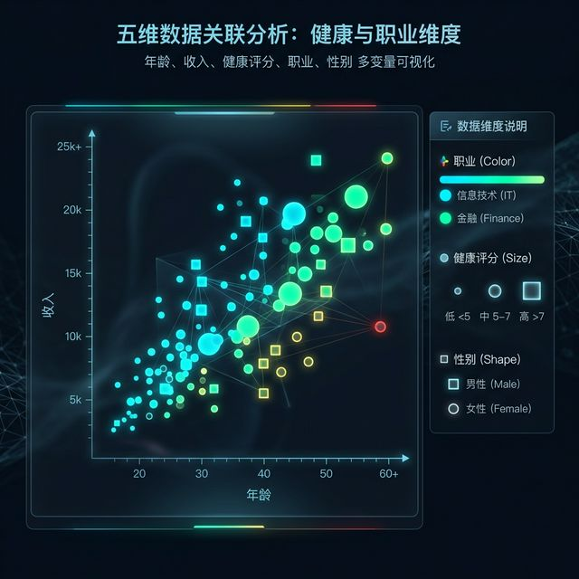
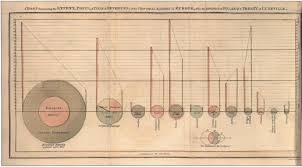
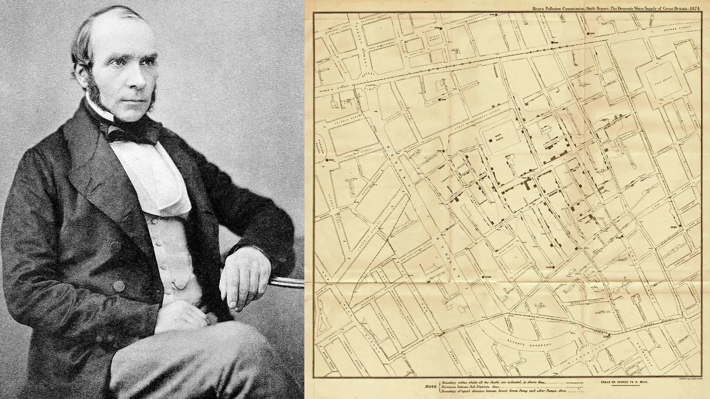
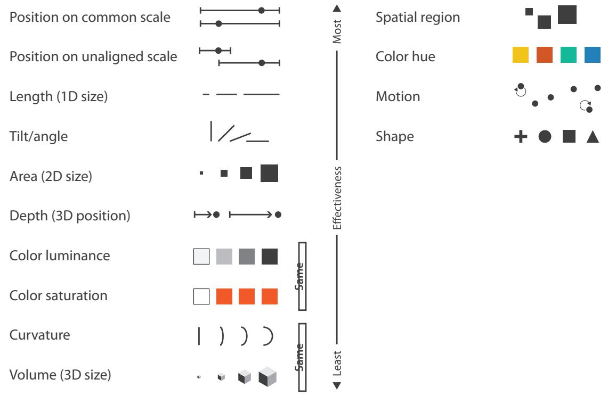
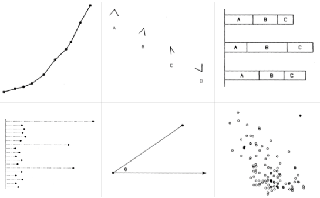
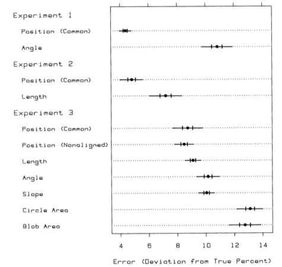
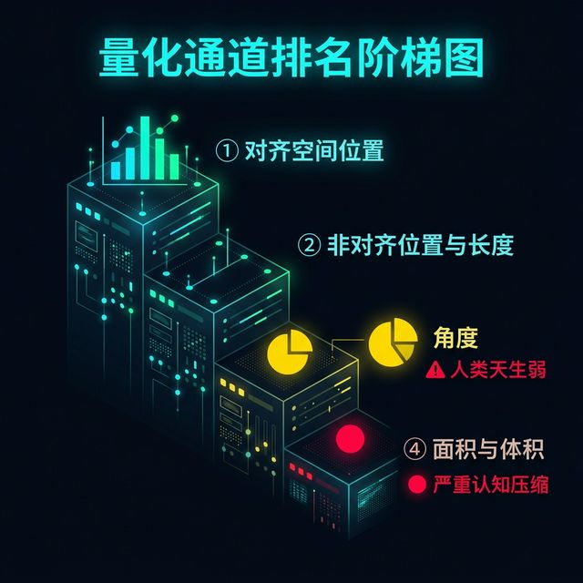

## Module 2: 原子语法——**Marks（标记）** 与**Channels（通道）** (70 分钟)
<!-- BUDGET: 4500 chars | SLIDES: ≥9 | STATUS: done -->

> [VISUAL]
> *   **Slide**: `S02_NYT_Covid_Map`
> *   **Asset**: 
> *   **Layout**: `Full`
> *   **Scene**: 展示《纽约时报》2021年1月28日头版刊登的美国新冠风险评估地图截图。整个美国版图各郡县（2D面标记）被不同深浅的红色、紫色和橙色（颜色通道）填充，直观并强烈地映射极高风险级别的地域，右侧附有新闻正文。这张地图展示了底层空间标记结合颜色通道实现的一目了然的数据表达。
> *   **Text**: "标记与通道的力量：《纽约时报》新冠疫情地图"

### 2.1 视觉双星：支撑所有图表运转的底层原子

可视化的世界看似千变万化，从微信步数的柱状图，到《纽约时报》美轮美奂的全球疫情流动地图，所有这些复杂的呈现，如果你把它们放到理论的显微镜下，拆到底只有两样东西。

> [VISUAL]
> *   **Slide**: `S03_Marks_Channels_Intro`
> *   **Asset**: 
> *   **Layout**: `Grid`
> *   **Scene**: 界面设计得像飞机的驾驶舱。左侧是基础几何图形（点、线、面），被标记为"Marks"；右侧是一系列控制旋钮、推子与表盘（位置、颜色、大小、形状等），被标记为"Channels"，呈现出一种高度可控的机械质感。
> *   **Text**: "可视化的元素周期表：从抽象数据到具象图形的桥梁"

**这是我们在向 AI (比如 ChatGPT 或是 Claude) 描述可视化需求时，必须熟练使用的核心专业词汇**。掌握了它们，你就掌握了控制 AI 画笔的终极密码。

这两样东西，就是 **Marks（标记）** 和 **Channels（通道）**。它们就像是一套高度精密的几何控制台，决定了你是否能够精准地把抽象冰冷的数字，无损且高效转化为屏幕上那些鲜活的视觉构件。

### 2.2 几何标记：承载数据的肉身与自由度枷锁

> [TECH NOTE: 标记的几何层级]
> **Marks（标记）** 是几何原子。在二维屏幕平面上，它们分三个维度层级：
>
1. **点 (零维 / Points)**：它是最自由的。从数学意义上讲，它不占面积，没有长宽限制。正因如此，你可以尽情地赋予它任何形状、任何颜色、或者人为设定的大和小。在散点图中，每一个数据条目就是一个点。
2. **线 (一维 / Lines)**：线是有约束的。它的长度已经被它的存在本身"占用"了（用于连接起点和终点）。因此，你能调整的只剩下它的线宽以及它的颜色。在关系图或者折线图中，线是连接网络的主力。
3. **面 (二维 / Areas)**：如果你画的是一个国家地图的版块，那它就是个面。它的尺寸和形状已经被地理边界死死绑定了。你几乎无法再去改变它的大小来代表其他含义，你能动用的只有它的填充颜色或纹理。

> [VISUAL]
> *   **Slide**: `S03b_Marks_Hierarchy`
> *   **Asset**: 
> *   **Layout**: `Full`
> *   **Scene**: 从左到右的几何递进阶梯图：0D 点（标注"自由度：最高"）→1D 线（标注"自由度：中等，长度已被占用"）→2D 面（标注"自由度：最低，形状/面积已被锚定"），每一级之间用向下的箭头标注"自由度衰减"。
> *   **Text**: "标记的几何层级：从自由到约束"

更进一步，如果你翻开底层教材，标记还可以被划分为**项目标记 (Items)** 和**链接标记 (Links)**。
所谓项目标记，就是那些孤立存在的个体单元——屏幕上的一个点、一根柱子、或者一个区块。而**链接标记**则专门用来展示它们之间的羁绊。连接 (Connection) 时我们用线（例如网络拓扑图的连线），包含 (Containment) 时我们用嵌套的面（例如旭日图或者树图的面层叠）。
在这里，大家必须记住一个致命的约束：虽然线 (1D) 拥有自由的宽度可以用来编码附加属性（比如用线的粗细表示车流量），但人类眼睛对**线宽可辨别步级极限 (Bins)** 只有可怜的 3 到 4 级。也就是说，你可以分清极细、正常、极粗，但绝别指望观众能通过线宽肉眼看出交通量是 480 辆还是 510 辆！当你企图把连续不断的一长串浮点数塞进一条连线的宽度里时，你其实已经把通道阻塞撑爆了。

大家可以把"标记"想象成舞台上的演员。演员本身是骨骼和肉体，是图表的承载物。

但他们穿什么颜色的衣服登场？他们是胖还是瘦？他们站在舞台中央的左侧偏南 30 度位置，还是紧紧挤在角落里？说话声音是大是小？这些用以修饰他们、并且随数据变量产生起伏变化的属性，就是 **Channels（通道）**。

**(Pause: 2s)**

### 2.3 视觉通道：操控数据躯体的控制提线缆绳

举个例子，假设我们拿到了一份包含五个变量的数据集：某地区 500 个不同用户的【年龄】、【收入】、【职业】、【健康评分】和【性别】。
如果使用最基础的点标记（Point），由于点是 0D 的，极度自由，我们可以瞬间挂载极其丰富的信息：

> [VISUAL]
> *   **Slide**: `S03c_Five_Dim_Scatter`
> *   **Asset 1**: 
> *   **Asset 2**: 
> *   **Layout**: `Split`
> *   **Scene**: 画面中心展示一张极具质感的、以“蔗渣”纸张纹理为底色的可视化对比图，清晰展示了年龄与收入之间的关联走势（相比旧版更具可读性）。右下角以画中画或插图形式保留了原来的五维抽象散点图作为技术参考，并标注“从抽象到直观的演进”。
> *   **Text**: "数据原子的演进：从抽象散点到直观映射"

- **位置 X 轴（通道1）**映射【年龄】。
- **位置 Y 轴（通道2）**映射【收入】。
- **颜色色相（通道3）**映射【职业】（IT 业用蓝色，金融业用绿色）。
- **面积大小（通道4）**映射【健康评分】。
- **形状（通道5）**映射【性别】（男性为正方形，女性为圆形）。

看！仅仅使用一个被疯狂赋予通道属性的点，我们就在二维平面上完成了一次五维数据的降维打击式呈现。这就是原子的力量。

> [CASE STUDY: 撕碎名字迷信——原子级解剖气泡图 (Bubble Chart)]
> 让我们趁热打铁，直接把你们在上周初阶探索课程那个工具库里觉得极其不可莫测、高大上又非常常见的“精美组合套装”按上解剖床开膛破肚——著名的 **Bubble Chart (气泡图)**。
> 在业余甲方或普通初学者眼里，这叫“一种名叫气泡图的高级流行样式”。但如果你成功植入了这节课传授的“通道与标记原子级视觉显微镜视野”，气泡图华丽的流行词外衣会被瞬间无情撕碎并扒光殆尽：

1. 解剖刀切开表皮，你会发现它的内部承载肉体**几何原子 (Mark)** 完全未变：仅仅只是一颗不能再简陋的极低阶微小粉尘 **0D 点 (Point)**。
2. 紧接着，这颗原子的 **绝对物理位置 X/Y 轴 (Position Channel 1 & 2)** 分线通道被你无情征用收编，用来分别搭载捆绑了两个不同维度的数值变量，并在二维幕布上以此来残忍揭露隐喻它们两者之间的那千古不变的“正负相关性 (Correlations)”。
3. 然后，也是最致命的一击。这颗原子的最表层外皮囊 **大小面积 (Size Channel)** 抢夺获取了这套编码规则的更高维视觉突刺指挥权，被充作气囊吹胀用来隐喻附着第三个关键属性变量的绝对“总资产吞吐量差异断层比例 (Proportions)”。

对！就这么极其纯粹简单！
顿悟这一层公式后，这就意味着：这所谓的经典款高定 Bubble chart 再也不是什么固定而神圣不容侵犯被供奉在神坛的独立不可变更物体结构！一旦你这个造物主敏锐意识到，在这个图里它的**面积通道系统**目前正在承受着极其严重乃至致命的心理认知压缩效能亏损（由于 Steven's Law 的惩罚），你作为全能全知系统指令师完全有生杀大权在代码控制层面对其进行粗暴干预换血：毫不犹豫残忍剥夺并关闭掉它的可憎面积维度映射权利通路，将这一指标变量数据紧急倒车输送改挂并转移注入到并联通道隔壁的**强烈突变色彩色阶光度 (Luminance) 阀门**身上去。这时的你，就已经宣告彻底脱胎换骨再也不仅仅是只会拖拽拉取生搬硬套某个烂大街现成命名 Chart 模板名字的可怜流水线工具操作员，而是真正冷血清醒、死死手握能够驱动宇宙语法重组创世生杀大权的高维 Vibe 指令系数据建筑架构总师！

> [LIFE CONNECT: 脑波解构大赏——用户的心理阶梯路程]
> 让我们暂停一下，请大家盯着屏幕上刚才那张五维散点图的最右上角那颗又大又蓝的正方形点。此刻，你的大脑神经在毫秒内经历了一场极其复杂的潜意识解构风暴。
> 第一毫秒，你的眼动仪锁定了它的位置，你的空间直觉立刻告诉你："位置最靠右上，这个人年纪最大、收入最高"；第二毫秒，你的视锥细胞捕捉到了冷色域蓝光，你的左脑开始归类："蓝色，他是 IT 行业的"；第三毫秒，你的前注意机制发现这颗点比周围的大出一圈："面积显著偏大，他的健康状态极好"；第四毫秒，你靠近屏幕，看清了它的直角边缘："正方形，喔，是个老爷子"。
> 一秒钟内，完全没有借助任何外部的文字标注，仅凭直觉你就从密密麻麻的五百个点里，瞬间筛选出了一个高收入、高龄、健康状态极佳的 IT 业男性标本。这就是原子的魔法组合。

> [VISUAL]
> *   **Slide**: `S04a_William_Playfair`
> *   **Asset**: 
> *   **Layout**: `Full`
> *   **Scene**: Masters series: William Playfair, the father of statistical graphics
> *   **Text**: "Masters series: William Playfair, the father of statistical graphics"

> [DID YOU KNOW: 散点图的前世今生]
> 18 世纪末至 19 世纪初（1786-1801），英国统计学家 William Playfair 发明了柱状图和饼图，但当时并没有人真正意识到"位置通道"的生死攸关。

> [VISUAL]
> *   **Slide**: `S04b_John_Snow_Cholera`
> *   **Asset**: 
> *   **Layout**: `Full`
> *   **Scene**: Historical depiction from the Victorian era setting up the context for Dr. John Snow's work mapping cholera in London.
> *   **Text**: "散点图拯救生命：1854年伦敦霍乱地图"

> [DID YOU KNOW: 散点图的前世今生]
> 直到 1854 年，伦敦医生 John Snow 在一张伦敦街道地图上，用小黑点标注了每一个霍乱死亡病例的位置——密集的黑点迅速聚集在 Broad Street 水泵周围。那张图直接说服了当局关闭了那口受污染的水泵，一场瘟疫就此被终结。这是人类历史上第一次，"空间位置通道"被用来拯救生命。

> [VISUAL]
> *   **Slide**: `S03d_Channel_Power_Summary`
> *   **Asset**: 
> *   **Layout**: `Grid`
> *   **Scene**: 极简总结卡片——中央用大号字体展示公式 "1 Mark + 5 Channels = 5 维降维"，下方配以刚才演示的五维散点图缩略图，四周环绕着五个通道图标（位置×2、色相、面积、形状），用连线指向中央的点标记。
> *   **Text**: "原子的力量：一个点，五个维度"

大家仔细看大屏幕上这张极其核心的总结图，特别是中央被五根引线拉扯的那颗点。这就是为什么我们今天绝不能停留在“选择下拉模板”的肤浅层面。在这个公式里，“1 Mark + 5 Channels”意味着你在向 AI 下达指令时，你可以对这颗点进行深度的五元解构。图中每一个环绕中央的通道图标，它们指向点的连线，都是你在干预数据的手段。这五根牢固的连线，完全构成了你在二维世界中重建高维数据宇宙的提线木偶控制绳缆。

> [VISUAL]
> *   **Slide**: `S04_Channel_Effectiveness`
> *   **Asset**: 
> *   **Layout**: `Grid`
> *   **Scene**: 展示 Tamara Munzner 理论中通道的视觉效能硬性排序梯队。左列为最强通道"空间位置"（高亮闪烁）；中列为次强次要通道（长度、面积、颜色明度等）；右列为辅助标识通道（色相、运动、形状）。
> *   **Text**: "通道也是论资排辈的——表达性与有效性"

通道，就是图表外观的控制旋钮。但如果你以为你可以随意把任何数据挂载到任何旋钮上，那就大错特错了。

### 2.4 秩序铁腕：强行越界表达引发的医疗血案

在信息可视化领域，有两位泰斗级人物 William S. Cleveland 和 Robert McGill，他们在 1980 年代做过一系列极为硬核的认知科学实验。

> [VISUAL]
> *   **Slide**: `S04_Cleveland_McGill_Experiment`
> *   **Asset**: 
> *   **Layout**: `Full`
> *   **Scene**: 展示 1984 年 Cleveland & McGill 著名的图形感知实验的测试“考卷”图例。图上包含了折线图、不同开口的 V 型、未对齐的堆叠柱状图等。这代表了图表世界的基本视觉刺激形式。
> *   **Text**: "认知科学的实验考卷：你的眼睛到底有多准？"

他们让试验者辨认上述不同视觉通道中存在的微小数据差异（比如，两段不在同一基线上的柱体到底差了百分之几？）。实验结果最终以一张精确的统计成绩单震惊了当时的图形学界：

> [VISUAL]
> *   **Slide**: `S04_Cleveland_McGill_Results`
> *   **Asset**: 
> *   **Layout**: `Full`
> *   **Scene**: 展示实验误差率（Deviation from True Percent）的统计图表。图表清晰标明了各个视觉通道的偏差表现——从顶部误差最低约 4% 的 Position（位置），到底部误差率飙升至 12-14% 的 Area（面积），呈现出断崖式的阶梯。
> *   **Text**: "揭晓成绩单：断崖式的认知误差排序"

人类在判断不同维度的图形大小时，神经系统的敏感度呈现出了极为残酷和断崖式的层级划分——你看那代表面积（Area）通道的误差率，是顶部位置（Position）通道误差率的 3 倍还多！这就是为什么这些通道并不是平等的——它们在你的视网膜和前额叶皮层里，早就被漫长的生物进化安排好了"老幼尊卑"的铁定统领秩序。

> [PHILOSOPHY: 通道的阶级性]
> 通道的使用必须遵守两大核心原则：**Expressiveness（表达性原则）**和**Effectiveness（有效性原则）**。外行最常犯的典型灾难错误，就是强行用"颜色"去衡量精确的数量大小。

表达性原则意味着：你所选用的通道，必须且只能完全匹配你手中数据的内在特征。
如果你手里是一份有序的连续数字（比如 1, 2, 3，或者由低到高的气温，这叫 **数量型 Magnitude 数据**），你必须使用能够表达大小顺序的**量化通道**（如长度、位置）。
如果你手里是一份散装的分类标签（如苹果、梨、香蕉，这叫 **分类类别型 Identity 数据**），你必须使用只能区分"是什么"的**标识通道**（如颜色色相，因为红黄蓝没有谁比谁大）。

> [VISUAL]
> *   **Slide**: `S04b_Expressiveness_Disaster`
> *   **Asset**: 
> *   **Layout**: `Full`
> *   **Scene**: 展示哈佛医学院论文原图的 2x2 对比矩阵。左侧是彩虹色带渲染的血管（色彩突兀断裂），右侧是红灰单色渐变渲染的血管（平滑连续）。
> *   **Text**: "表达性原则的代价：生与死的图表"

请看大屏幕上的这四张血管造影原图，这就是违背“表达性原则”的恐怖代价：2011年，哈佛医学院发现了一个致命的设计灾难。长久以来，医疗软件都在强行使用**左侧这种“彩虹色带（红黄绿蓝的色相变化）”**来映射血管内部连续的压力数值。

<!--（指向左侧彩虹图）-->
同学们仔细看左边，有没有发现在绿色和黄色、黄色和红色交界的地方，出现了非常生硬、锐利的线条边缘？但真实的血液压力绝不仅是从某一点突然“断崖式”突变的。**色相本质是分类通道**，强行用来渲染连续数值后，人眼就会看见这种根本不存在的“视觉假断层”。这直接导致专科医生对高危病灶的准确识别率瞬间暴跌至可怜的 **39%**！

<!--（指向右侧灰红图）-->   
而当团队仅仅将通道拨正——改用右侧这种从红到灰的**单色明度渐变（这才是原汁原味的量化通道）**后，梯度的深浅完美契合了真实的平滑压力分布，医生的诊断准确率当即飙升至 **91%**。这就是极其业余的“通道越权”所引发的真实医疗血案。

> [INTERACTIVE: 教师警示]
> 各位同学，尤其是作为具备设计背景的未来交互设计师，哈佛医学院的这桩真实血案恰恰是我们最容易踩进的陷阱。我们做设计的天性是追求画面的张力和“色彩丰富度”，很容易觉得：一张图全是纯红色渐变太单调了，我非要把它搞成五颜六色才够酷。
> 但在数据可视化领域，**颜色从来不是随意挥洒的装饰涂料，它是极其精密的数据物理载体**。当你的底层数据是连续发生大小变化的（比如压力高低、人口多少），请一定要抑制住搞花里胡哨“彩虹色”的冲动，老老实实地用单色的明度渐变。不要试图用你感性的美学直觉，去暴力对抗观众视神经的底层物理辨识规律。

### 2.5 阶级森严：刻在基因里的通道效能鄙视链

而在有效性原则下，每一类通道都有着其不可撼动的阶级排名。也就是说，当你手上的数据是极其关键的绝对核心指标时，你必须把这笔预算花在最顶尖的通道上。首先看**量化通道（衡量多少）**。在这个领域里：

1. **对齐的空间位置（Position on common scale）**，毫无悬念排名第一。这就是为什么平平无奇的**柱状图**（所有柱子都在 X 轴底部对齐）在这个星球上永远是比较数字大小最精准的王者。
2. 其次是**非对齐位置（Position on unaligned scale）**和**长度（Length）**。
3. 再其次是**角度（Angle）**（这正是为什么通常我们不推荐复杂的饼图，因为人类对角度的辨识度天生弱于长度）。
4. 最后才轮到**面积（Area）**和**体积（Volume）**。这两者经常由于心理感知压缩而造成重大认知误差，这部分我们在下个模块细讲。

> [VISUAL]
> *   **Slide**: `S04d_Magnitude_Ranking`
> *   **Asset**: 
> *   **Layout**: `Split`
> *   **Scene**: 量化通道排名阶梯图——从顶到底依次排列：①对齐空间位置（配以柱状图小图标，高亮闪烁）②非对齐位置与长度 ③角度（配以饼图小图标，标注"⚠️ 人类天生弱"）④面积与体积（标注"🔴 严重认知压缩"），整体呈递降阶梯式布局。
> *   **Text**: "量化通道排名：衡量'多少'"
> *   **List**:
> *     - #1 对齐空间位置 (Position on common scale)
> *     - #2 非对齐位置 / 长度
> *     - #3 角度 (Angle)
> *     - #4 面积 / 体积 (Area / Volume)

请大声告诉我，盯着这幅阶梯画面最顶层那个不羁并持续闪烁的高亮王冠，排名绝对第一无法撼动的主宰者是谁？是**对齐空间位置**。这就是为什么，哪怕计算机科学再如何狂飙突进更迭、甚至进入元宇宙全息虚拟数据纪元，那看起来土得掉渣、平平无奇的**经典二维柱状图（Bar Chart）**，由于底边所有排列矩阵柱子都被强横地牢牢锁死在统一的水平零基础 X 轴对齐基线上，这使得我们人类脆弱但精准的大脑视觉神经此时仅仅只需要执行极其微量极低负荷的顶部视平线平移差值比对运算，就能瞬间捕捉极其微弱的数据波涛高度差！它曾经是、现在是、且永远都将是这个星球上比较数量落差的最精准兵器！而垫底压在黑暗底层的面积与三维立体厚度呢？那仅仅是牺牲精度换来烘托氛围场景的牺牲品感应区。

再来看**标识通道（区分是什么）**。在这个领域里：
1. **空间区域（Spatial Region）**永远排名第一（比如把水果放左侧半屏，把肉类放右侧半屏，读者一秒钟内瞬间完成分类）。
2. 在同一区域内，**色相（Color Hue）**则是排名第二的区分王者。
3. 最后才是**运动模式（Motion）**和**形状（Shape）**（因为在小图形下，圆形、方形、甚至三角形很难在一瞬间被远处的眼球清晰区分）。

> [VISUAL]
> *   **Slide**: `S04e_Identity_Ranking`
> *   **Asset**: 
> *   **Layout**: `Split`
> *   **Scene**: 标识通道排名阶梯图——从上到下依次排列：①空间区域（配以左右分屏分类示意）②色相（配以红蓝绿色块）③运动/形状（配以微缩的圆方三角图标，标注"易混淆"警告），整体风格与 S04d 保持统一。
> *   **Text**: "标识通道排名：区分'是什么'"
> *   **List**:
> *     - #1 空间区域 (Spatial Region)
> *     - #2 色相 (Color Hue)
> *     - #3 运动 / 形状 (Motion / Shape)

> [CASE STUDY: Hans Rosling 的终极武器 "Gapminder 动图" 全案复盘]
> 让我们用一个载入数据新闻发展史册的殿堂级别展示神迹来为通道阶梯规则打下烙印。已故全球顶级统计学演讲大师 Hans Rosling 曾经于 TED 讲台上向亿万世人展示过一副震惊环宇的气泡散点动图。他要在有限画框内，极其狂野地同时塞入全球几百个国家的五维变迁历史庞大数据群落：【人均国民GDP】、【国民预期健康寿命】、【该国隶属的各大洲地缘】、【该国现有人口巨量规模】以及那跨越几个世纪的【时间流逝轴】。
> 请大家立刻凝视并结合对比刚刚学完的这份森严通道排行榜单，站在一位底层代码架构者的视角去深度逆向透析老爷子的手术式配置框架思路：
> 第一维大杀器与第二维命脉变量——两个最致命且无容错空间的定量考核体：【人均GDP】与【预期健康寿命】。老爷子毫不犹豫地将这两个象征国家命门的核心，重金押注并强行锁扣砸在了量化排名榜第 1 与次席的**双轴对齐二维空间坐标轴（X与Y）**基准格栅上！凭此奠定钢铁对比底座的基础。
> 第三维变数——纯绝对分类的离散数据：【国家所属各异的地缘大洲板块（欧亚非）】。他精准地抽调挂载启用了分类识别榜内极高位次的亚军标识通道方案：赋予最鲜明的纯系**色彩色相区分（Hue）**，像京剧涂染脸谱面膜一样装载于表层。
> 第四维变位——极度悬殊的次要定量数据：【国家庞大到可怖或微小若尘埃的人口总规模落差】。在对齐位置已经被占领的前提下，他只得退而求其次，使用了感知压缩但具有无与伦比气壮山河磅礴氛围压迫感的量化维度中段排名通道：**饱满膨胀的气泡表面面积量级（Area）**。靠此直接在视觉平面上压垮那些蕞尔小邦，让巨型气泡呼之欲出。
> 最后一维演化：【延绵演化的漫长时间序列里程】。作为连续流逝方向明确的终极变量流体流光，他大胆提取激进了分类领域排名第三、极易失效引人发怒但一旦操作得当则神鬼辟易的时间通道属性：直接召唤**运动延时延轨迹顺滑流亡图层（Motion）**！让一百个大大小小的国度气泡犹如培养皿细胞剧变一般横扫大屏幕。这就是极其苛刻的遵守甚至逼死表达有效性铁血强规则所组合推陈升华出来的科学逻辑与视觉绝美千古绝唱完美合体交响乐神曲！

这套由先辈与脑神经科学家趟出来的"铁律语法体系架构"，就是我们得以直接深入机器图纸底层逻辑、向未来更为先进哪怕是拥有几亿参数量的深层学习黑盒人工智能下达最精确不容置疑统属命令词组的最佳利刃接口。

> [STORY TIME: 南丁格尔的玫瑰战争]
> 1858 年，佛罗伦萨·南丁格尔用一张"鸡冠花图"（极坐标面积图）说服了英国议会拨款改善军医院卫生条件。在克里米亚战争中，她发现士兵的死亡原因大多不是战伤，而是感染。她把这个发现编码成了一张前所未有的视觉图表——用扇区面积映射死亡人数，用颜色区分死因。议员们看了一眼就沉默了。这是人类历史上第一次，一张图表直接改变了一个国家的政策，拯救了成千上万条生命。标记与通道的力量，远比你想象的更加真实。

> [ACTIVITY]
> *   **Type**: `Workshop`
> *   **Duration**: `45min`
> *   **Desc**: **通道拆解与重构实战演练**
> **操作指南与教师话术**：
> 1. （大屏亮起）“同学们，现在请看大屏幕上的这幅《南华早报》关于历年春节春运人口迁徙路径的得奖大画幅信息图。第一眼看过去，它像是一团绚丽的星云。现在，我给大家 15 分钟，两人一组，像执行一台外科手术那样去解剖它。”
> 2. “第一步，先找骨架——告诉我，图中的主体使用的是什么 **Marks**？是不是那些成千上万细不可见的 **1D 线**？”
> 3. “第二步，找旋钮——数据集中的核心变量，分别被挂载到了哪些 **Channels** 上？仔细看，出发地和目的地被挂载到了线的**空间末端位置**上；迁徙路线的拥堵度被挂载到了线的**宽度通道**上；交通方式（高铁、飞机、大巴）则被剥离出来，降级挂载到了**颜色的色相通道**上。”
> 4. （15分钟后）“好，现在开始实施反事实破坏！假设你是那个拿错了说明书的乙方设计师，你试图将非常重要的**拥堵度**指标，从强感知效能的宽度通道，撤下来，挂载到仅仅依靠**运动闪烁频率通道**上，这幅图会遭遇何种毁灭性的崩塌？是的，它将变成一个巨大的频闪光污染现场，所有老人都会出现癫痫前兆，而信息在其中已经彻底无法被阅读。”

> 5. （教师补充警示）"最后请注意一个极其重要的前提：我们刚才学过的 Munzner 通道排名，并不是放之四海而皆准的绝对铁律——它是**任务依赖（Task-dependent）**的。同一种编码通道，在'比较'任务下可能极其高效，但换到'趋势'或'关联'任务时就可能失效。UBC 的 Munzner 教授本人以及华盛顿大学的实证研究均已证明：彩色散点图在逐点比较时表现优异，但当类别增多且需要做全局趋势总结时，其效能会断崖式下跌。所以，在你下一次向 AI 下达编码指令之前，**永远先问自己：我的用户需要完成的核心分析任务（Task）是什么？**通道的选择，必须服从于任务。"

### 2.6 降维剥离：从生搬硬套向架构师法则跃迁

有了这套底层原子词汇，你就不必再像个迷茫的甲方一样对 AI 说："给我画个漂亮的统计图，高端一点的，色彩丰富一点的"。
相反，你可以像一个真正的系统架构师那样掷地有声地说："请在此次可视化中使用散点图底模，**锁定它们的对齐空间位置不变，把它们的颜色色相通道 (Hue) 重置映射为社会阶层分类，并用外显轮廓线的面积 (Area) 映射家庭年度纯利润额**。"

这就是从"外围看客"到"操盘架构师"的阶跃。

---

