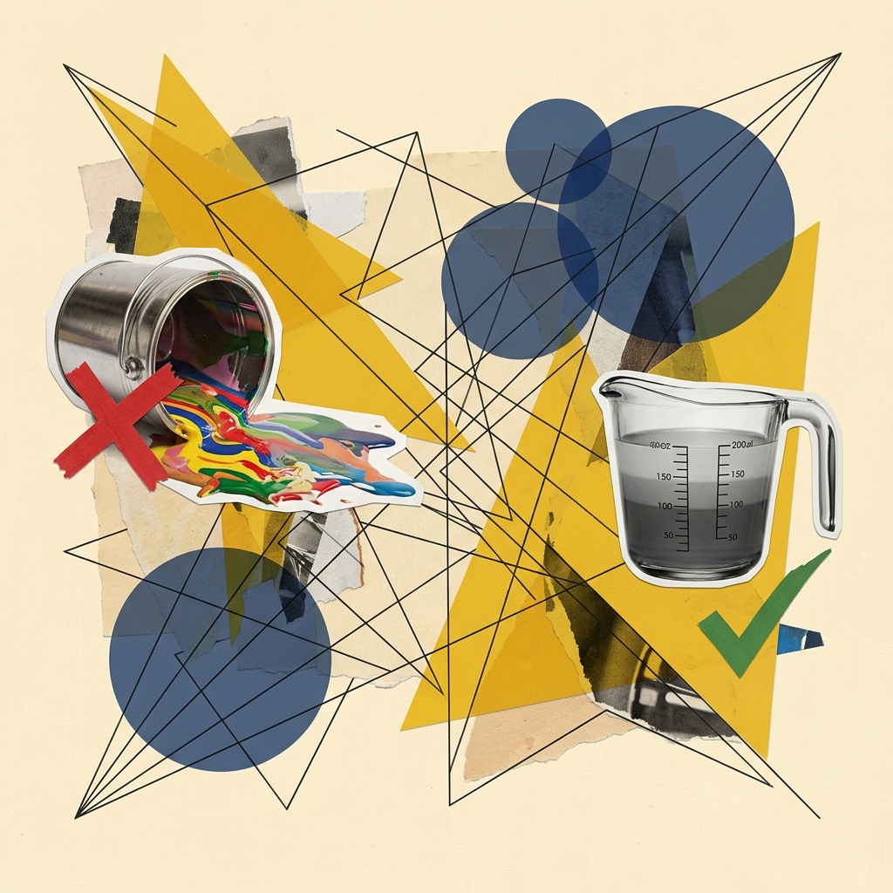

## Module 2: 原子语法——**Marks（标记）** 与**Channels（通道）** (70 分钟)
<!-- BUDGET: 4500 chars | SLIDES: ≥9 | STATUS: done -->

> [VISUAL]
> *   **Slide**: `S02_NYT_Covid_Map`
> *   **Asset**: 
> *   **Layout**: `Full`
> *   **Scene**: 展示《纽约时报》2021年1月28日头版刊登的美国新冠风险评估地图截图。整个美国版图各郡县（2D面标记）被不同深浅的红色、紫色和橙色（颜色通道）填充，直观并强烈地映射极高风险级别的地域，右侧附有新闻正文。这张地图展示了底层空间标记结合颜色通道实现的一目了然的数据表达。
> *   **Text**: "标记与通道的力量：《纽约时报》新冠疫情地图"

### 2.1 视觉双星：支撑所有图表运转的底层原子

可视化的世界看似千变万化，从微信步数的柱状图，到《纽约时报》美轮美奂的全球疫情流动地图，所有这些复杂的呈现，如果你把它们放到理论的显微镜下，拆到底只有两样东西。

> [VISUAL]
> *   **Slide**: `S03_Marks_Channels_Intro`
> *   **Asset**: 
> *   **Layout**: `Grid`
> *   **Scene**: 界面设计得像飞机的驾驶舱。左侧是基础几何图形（点、线、面），被标记为"Marks"；右侧是一系列控制旋钮、推子与表盘（位置、颜色、大小、形状等），被标记为"Channels"，呈现出一种高度可控的机械质感。
> *   **Text**: "可视化的元素周期表：从抽象数据到具象图形的桥梁"
> *   **List**:
> *     - Marks: 构成图表的几何原子
> *     - Channels: 控制原子的视觉旋钮

> [VISUAL]
> *   **Slide**: `S02b_AI_Prompt_Mapping`
> *   **Asset**: 
> *   **Layout**: `Center`
> *   **Scene**: 一个分屏展示：左侧是生涩的自然语言（"画个色彩丰富的图"），右侧是被拆解为精确的 "Marks" 和 "Channels" 指令的 AI 提示词控制台。
> *   **Text**: "掌握底层指令：向 AI 描述需求的专业词汇"

**这是我们在向 AI (比如 ChatGPT 或是 Claude) 描述可视化需求时，必须熟练使用的核心专业词汇**。掌握了它们，你就掌握了控制 AI 画笔的终极密码。

这两样东西，就是 **Marks（标记）** 和 **Channels（通道）**。它们就像是一套高度精密的几何控制台，决定了你是否能够精准地把抽象冰冷的数字，无损且高效转化为屏幕上那些鲜活的视觉构件。

### 2.2 几何标记：承载数据的肉身与自由度枷锁

> [VISUAL]
> *   **Slide**: `S03b_Marks_Hierarchy`
> *   **Asset**: 
> *   **Resource**: 
> *   **Source**: Textbook
> *   **Layout**: `Full`
> *   **Scene**: 从左到右的几何递进阶梯图：0D 点（标注"自由度：最高"）→1D 线（标注"自由度：中等，长度已被占用"）→2D 面（标注"自由度：最低，形状/面积已被锚定"），每一级之间用向下的箭头标注"自由度衰减"。
> *   **Text**: "标记的几何层级：从自由到约束"
> *   **List**:
> *     - 0D 点：无几何束缚
> *     - 1D 线：单维度约束
> *     - 2D 面：全几何锚定

> [TECH NOTE: 标记的几何层级]
> **Marks（标记）** 是几何原子。在二维屏幕平面上，它们分三个维度层级：
>
1. **点（也就是零维的 Points）**：它是最自由的。从数学意义上讲，它不占面积，没有长宽限制。正因如此，你可以尽情地赋予它任何形状、任何颜色、或者人为设定的大和小。在散点图中，每一个数据条目就是一个点。
2. **线（也就是一维的 Lines）**：线是有约束的。它的长度已经被它的存在本身"占用"了（用于连接起点和终点）。因此，你能调整的只剩下它的线宽以及它的颜色。在关系图或者折线图中，线是连接网络的主力。
3. **面（也就是二维的 Areas）**：如果你画的是一个国家地图的版块，那它就是个面。它的尺寸和形状已经被地理边界死死绑定了。你几乎无法再去改变它的大小来代表其他含义，你能动用的只有它的填充颜色或纹理。

> [VISUAL]
> *   **Slide**: `S03b2_Items_and_Links`
> *   **Asset**: 
> *   **Resource**: 
> *   **Source**: Textbook
> *   **Layout**: `Split`
> *   **Scene**: 左侧展示零散的点与柱子（Items），右侧展示将它们串联起来的网状线条与层叠的嵌套面（Links / Containment）。
> *   **Text**: "标记的两大类别：项目与链接"

更进一步，如果你翻开底层教材，标记还可以被划分为两类：**项目标记（也就是 Items）**和**链接标记（也就是 Links）**。
所谓项目标记，就是那些孤立存在的个体单元——屏幕上的一个点、一根柱子、或者一个区块。而**链接标记**则专门用来展示它们之间的羁绊。连接，即 Connection，我们用线（例如网络拓扑图的连线），包含，即 Containment，我们用嵌套的面（例如旭日图或者树图的面层叠）。
在这里，大家必须记住一个致命的约束：虽然一维的线拥有自由的宽度，但人类眼睛对**线宽可辨别的步级（Bins）**存在极低的生理极限（仅 3 到 4 级）。不要指望观众能通过线宽肉眼看出 480 辆和 510 辆的差异；当你企图把长串连续数字塞进线宽时，这个通道就已经被不可逆地**认知撑爆**了。

> [VISUAL]
> *   **Slide**: `S03b3_Channels_Metaphor`
> *   **Layout**: `Center`
> *   **Scene**: 一个聚光灯下的空舞台，逐渐走上几个灰白色的假人模型（标记），随后天降各种服饰、灯光色彩、位置调整（通道），让假人变得鲜活生动。
> *   **Text**: "通道：修饰数据的舞台提线"

大家可以把"标记"想象成舞台上的演员。演员本身是骨骼和肉体，是图表的承载物。

但他们穿什么颜色的衣服登场？他们是胖还是瘦？他们站在舞台中央的左侧偏南 30 度位置，还是紧紧挤在角落里？说话声音是大是小？这些用以修饰他们、并且随数据变量产生起伏变化的属性，就是 **Channels（通道）**。

**(Pause: 2s)**

### 2.3 视觉通道：操控数据躯体的控制提线缆绳

举个例子，假设我们拿到了一份包含五个变量的数据集：某地区 500 个不同用户的【年龄】、【收入】、【职业】、【健康评分】和【性别】。
如果使用最基础的点标记（Point），由于点是 0D 的，极度自由，我们可以瞬间挂载极其丰富的信息：

> [VISUAL]
> *   **Slide**: `S03c_Five_Dim_Scatter`
> *   **Asset 1**: 
> *   **Asset 2**: 
> *   **Layout**: `Split`
> *   **Scene**: 画面中心展示一张极具质感的、以“蔗渣”纸张纹理为底色的可视化对比图，清晰展示了年龄与收入之间的关联走势（相比旧版更具可读性）。右下角以画中画或插图形式保留了原来的五维抽象散点图作为技术参考，并标注“从抽象到直观的演进”。
> *   **Text**: "数据原子的演进：从抽象散点到直观映射"
> *   **List**:
> *     - 1. 位置 X 轴：映射 年龄
> *     - 2. 位置 Y 轴：映射 收入
> *     - 3. 颜色：映射 职业
> *     - 4. 面积：映射 健康评分
> *     - 5. 形状：映射 性别

- **位置 X 轴（通道1）**映射【年龄】。
- **位置 Y 轴（通道2）**映射【收入】。
- **颜色色相（通道3）**映射【职业】（IT 业用蓝色，金融业用绿色）。
- **面积大小（通道4）**映射【健康评分】。
- **形状（通道5）**映射【性别】（男性为正方形，女性为圆形）。

看！仅仅使用一个被赋予五个通道属性的点，我们在二维平面上完成了一次五维数据的直观映射呈现。这就是原子的力量。

> [CASE STUDY: 撕碎名字迷信——原子级解剖气泡图，即 Bubble Chart]
> 让我们趁热打铁，直接把初阶工具库里常见的、看似复杂的“高级图表”进行结构剖析——即著名的 **Bubble Chart，气泡图**。
>
> [VISUAL]
> *   **Slide**: `S03c2_Bubble_Chart_Anatomy`
> *   **Asset**: 
> *   **Layout**: `Split`
> *   **Scene**: 左侧展示一个标准的 Hans Rosling 风格气泡图；右侧将其拆解为三层透明度叠加的图层——底层的 X/Y 坐标轴位置（映射财富与寿命）、漂浮的颜色层（映射大洲）、以及最上层不同膨胀程度的面积外壳（映射人口）。
> *   **Text**: "解剖气泡图：0D点 + 位置 + 大小 + 颜色"
> *   **List**:
> *     - 1. 核心几何原子：零维的点
> *     - 2. 空间位置通道：X/Y轴映射双变量
> *     - 3. 面积通道：吹胀气囊映射第三变量
>
> 在业余甲方或普通初学者眼里，这叫“一种名叫气泡图的高级流行样式”。但如果你成功植入了这节课传授的“通道与标记原子级视觉显微镜视野”，气泡图华丽的流行词外衣会被瞬间无情撕碎并扒光殆尽：

1. 解剖刀切开表皮，你会发现它的核心**几何原子**完全未变：仅仅是一颗最基础的**零维的点**。
2. 紧接着，这颗点在屏幕上的**空间位置通道（也就是 X 轴和 Y 轴）**被征用，用来分别搭载两个不同维度的数值变量，以此来揭示这两个变量之间的正负相关性。
3. 最后，这颗点的**面积通道**被充作气囊吹胀，用来隐喻附着第三个关键属性变量（比如总资产的规模差异）。

对，就这么纯粹！

> [VISUAL]
> *   **Slide**: `S03c2_Bubble_Chart_Reconstruct`
> *   **Layout**: `Split`
> *   **Scene**: 左侧展示将气泡图的面积重置为相同大小，右侧展示用颜色明暗（Luminance）来代替面积映射第三个变量。
> *   **Text**: "脱胎换骨：架构师的底层干预"

顿悟这一层公式后，你就会明白：所谓经典的气泡图，并不是什么神圣不可变更的固定结构。一旦你意识到“面积通道”可能带来认知偏差，你完全可以在代码层面进行干预：比如关闭它的面积映射，将这个指标转移给**颜色的明度通道（也就是 Luminance）**。当你能这样思考时，你就已经脱胎换骨，不再是只会套用图表模板的流水线操作员，而是真正掌握数据映射底层语法的架构师。

> [VISUAL]
> *   **Slide**: `S03c3_Brain_Wave_Decoding`
> *   **Asset**: 
> *   **Layout**: `Center`
> *   **Scene**: 脑波解码示意图，从人眼观察到一个蓝色的、巨大的方形点开始，逐步连线分解出大脑在 1 到 4 毫秒内的认知解码过程。
> *   **Text**: "脑波解码：直觉映射的毫秒级反应"

> [LIFE CONNECT: 脑波解构大赏——用户的心理阶梯路程]
> 让我们暂停一下，请大家盯着屏幕上刚才那张五维散点图的最右上角那颗又大又蓝的正方形点。此刻，你的大脑在毫秒内经历了一场快速的视觉解码过程。
> 第一毫秒，你的眼动仪锁定了它的位置，你的**空间直觉**立刻告诉你："位置最靠右上，这个人年纪最大、收入最高"；第二毫秒，你的视锥细胞捕捉到了冷色域蓝光，你的左脑开始归类："蓝色，他是 IT 行业的"；第三毫秒，你的**前注意机制**发现这颗点比周围的大出一圈："面积显著偏大，他的健康状态极好"；第四毫秒，你靠近屏幕，看清了它的直角边缘："正方形，喔，是个老爷子"。
> 一秒钟内，完全没有借助任何外部的文字标注，仅凭**直觉映射**你就从密密麻麻的五百个点里，瞬间筛选出了一个高收入、高龄、健康状态极佳的标本。这就是**视觉原子**的组合魔法。

> [VISUAL]
> *   **Slide**: `S04a_William_Playfair`
> *   **Asset**: 
> *   **Layout**: `Full`
> *   **Scene**: Masters series: William Playfair, the father of statistical graphics
> *   **Text**: "Masters series: William Playfair, the father of statistical graphics"

> [DID YOU KNOW: 散点图的前世今生]
> 18 世纪末至 19 世纪初（1786-1801），英国统计学家 William Playfair 发明了柱状图和饼图，但当时并没有人真正意识到**位置通道**在数据映射中的生死攸关。

> [VISUAL]
> *   **Slide**: `S04b_John_Snow_Cholera`
> *   **Asset**: 
> *   **Layout**: `Full`
> *   **Scene**: Historical depiction from the Victorian era setting up the context for Dr. John Snow's work mapping cholera in London.
> *   **Text**: "散点图拯救生命：1854年伦敦霍乱地图"

> [DID YOU KNOW: 散点图的前世今生]
> 直到 1854 年，伦敦医生 John Snow 在一张伦敦街道地图上，用小黑点标注了每一个霍乱死亡病例的**空间分布**——密集的黑点迅速聚集在 Broad Street 水泵周围。那张图直接说服了当局关闭了受污染的水泵，一场瘟疫就此被终结。这是人类历史上第一次，**空间位置通道**被用来拯救生命。

> [VISUAL]
> *   **Slide**: `S03d_Channel_Power_Summary`
> *   **Asset**: 
> *   **Layout**: `Grid`
> *   **Scene**: 极简总结卡片——中央用大号字体展示公式 "1 Mark + 5 Channels = 5 维降维"，下方配以刚才演示的五维散点图缩略图，四周环绕着五个通道图标（位置×2、色相、面积、形状），用连线指向中央的点标记。
> *   **Text**: "原子的力量：一个点，五个维度"
> *   **List**:
> *     - 核心载体：1 Mark
> *     - 外观旋钮：5 Channels
> *     - 综合效能：5 维降维

大家仔细看总结图中央那颗被五根引线拉扯的点。在这个公式里，**“1 Mark + 5 Channels”**意味着你在向 AI 下达指令时，你可以对这颗点进行深度的**五元维度解构**。图中每一个环绕中央的通道图标，它们指向点的连线，都是你在干预数据的手段。这五根牢固的连线，构成了你在二维世界中重建高维数据宇宙的控制绳缆。

> [VISUAL]
> *   **Slide**: `S04_Channel_Effectiveness`
> *   **Asset**: 
> *   **Resource**: 
> *   **Source**: Textbook
> *   **Layout**: `Grid`
> *   **Scene**: 展示 Tamara Munzner 理论中通道的视觉效能硬性排序梯队。左列为最强通道"空间位置"（高亮闪烁）；中列为次强次要通道（长度、面积、颜色明度等）；右列为辅助标识通道（色相、运动、形状）。
> *   **Text**: "通道也是论资排辈的——表达性与有效性"
> *   **List**:
> *     - 最强量化：空间位置
> *     - 次级量化：长度与面积
> *     - 标识区分：色相与形状

通道，就是图表外观的**控制旋钮**。但如果你以为你可以随意把任何数据挂载到任何旋钮上，那就大错特错了。

### 2.4 秩序铁腕：强行越界表达引发的医疗血案

在信息可视化领域，泰斗级人物 William S. Cleveland 和 Robert McGill 在 1980 年代进行了一系列严密的**图形感知实验**。

> [VISUAL]
> *   **Slide**: `S04_Cleveland_McGill_Experiment`
> *   **Asset**: 
> *   **Layout**: `Full`
> *   **Scene**: 展示 1984 年 Cleveland & McGill 著名的图形感知实验的测试“考卷”图例。图上包含了折线图、不同开口的 V 型、未对齐的堆叠柱状图等。这代表了图表世界的基本视觉刺激形式。
> *   **Text**: "认知科学的实验考卷：你的眼睛到底有多准？"

他们让试验者辨认不同视觉通道中存在的微小数据差异。实验结果最终以一张精确的**统计成绩单**震惊了当时的图形学界：

> [VISUAL]
> *   **Slide**: `S04_Cleveland_McGill_Results`
> *   **Asset**: 
> *   **Layout**: `Full`
> *   **Scene**: 展示实验误差率（Deviation from True Percent）的统计图表。图表清晰标明了各个视觉通道的偏差表现——从顶部误差最低约 4% 的 Position（位置），到底部误差率飙升至 12-14% 的 Area（面积），呈现出断崖式的阶梯。
> *   **Text**: "揭晓成绩单：断崖式的认知误差排序"

人类在判断不同维度大小时，神经系统敏感度呈现出了残酷的断崖式层级——面积通道的误差率是位置通道的 3 倍！这就解释了为什么这些通道绝不是平等的，它们在视网膜和前额叶皮层里早已确立了**感知统领秩序**。

> [PHILOSOPHY: 通道的阶级性]
> 通道的使用必须遵守两大核心原则：**Expressiveness（表达性原则）**和**Effectiveness（有效性原则）**。外行最常犯的典型灾难错误，就是强行用"颜色"去衡量精确的数量大小。

> [VISUAL]
> *   **Slide**: `S04_Expressiveness_Effectiveness`
> *   **Layout**: `Split`
> *   **Scene**: 左侧天平放着“数据特征”，右侧天平放着“视觉通道”，保持平衡。
> *   **Text**: "两大核心法则：表达性与有效性"

表达性原则意味着：你所选用的通道，必须且只能完全匹配你手中数据的内在特征。
如果你手里是一份有序的连续数字（比如 1, 2, 3，或者由低到高的气温，也就是**数量型数据**），你必须使用能够表达大小顺序的**量化通道**（如长度、位置）。
如果你手里是一份散装的分类标签（如苹果、梨、香蕉，也就是**分类类别型数据**），你必须使用只能区分"是什么"的**标识通道**（如颜色色相，因为红黄蓝没有谁比谁大）。

> [VISUAL]
> *   **Slide**: `S04b_Expressiveness_Disaster`
> *   **Asset**: 
> *   **Layout**: `Full`
> *   **Scene**: 展示哈佛医学院论文原图的 2x2 对比矩阵。左侧是彩虹色带渲染的血管（色彩突兀断裂），右侧是红灰单色渐变渲染的血管（平滑连续）。
> *   **Text**: "表达性原则的代价：生与死的图表"

请看大屏幕上的这四张血管造影原图，这就是违背“表达性原则”的恐怖代价：2011年，哈佛医学院发现了一个致命的设计灾难。长久以来，医疗软件都在强行使用**左侧这种“彩虹色带（红黄绿蓝的色相变化）”**来映射血管内部连续的压力数值。

<!--（指向左侧彩虹图）-->
同学们仔细看左边，有没有发现在绿色和黄色、黄色和红色交界的地方，出现了非常生硬、锐利的线条边缘？但真实的血液压力绝不仅是从某一点突然“断崖式”突变的。**色相本质是分类通道**，强行用来渲染连续数值后，人眼就会看见这种根本不存在的“视觉假断层”。这直接导致专科医生对高危病灶的准确识别率瞬间暴跌至可怜的 **39%**！

<!--（指向右侧灰红图）-->   
而当团队仅仅将通道拨正——改用右侧这种从红到灰的**单色明度渐变（这才是原汁原味的量化通道）**后，梯度的深浅完美契合了真实的平滑压力分布，医生的诊断准确率当即飙升至 **91%**。这就是“通道越权”所引发的医疗事故。

> [VISUAL]
> *   **Slide**: `S04c_Color_Is_Not_Paint`
> *   **Asset**: 
> *   **Layout**: `Center`
> *   **Scene**: 左侧是一桶被打翻的五颜六色的油漆，上面打着红叉；右侧是精确刻度的量杯，里面装着单色渐变的液体，打着绿色的勾。
> *   **Text**: "警惕：颜色是数据载体，绝非装饰涂料"

> [VISUAL]
> *   **Slide**: `S04b2_Color_Warning_Sign`
> *   **Asset**: 
> *   **Layout**: `Center`
> *   **Scene**: 一个带有强烈警告意味的标志，上面用红色大叉划掉了一个五颜六色的渐变色盘，旁边是用单色明度渐变的正确示范图例。
> *   **Text**: "警示：克制你的感性美学直觉"

> [INTERACTIVE: 教师警示]
> 各位同学，尤其是作为具备设计背景的未来交互设计师，哈佛医学院的这桩真实血案恰恰是我们最容易踩进的陷阱。我们做设计的天性是追求画面的张力和“色彩丰富度”，很容易觉得：一张图全是纯红色渐变太单调了，我非要把它搞成五颜六色才够酷。
> 但在数据可视化领域，**颜色从来不是随意挥洒的装饰涂料，它是精确的数据载体**。当你的底层数据是连续发生大小变化的（比如压力高低、人口多少），请一定要抑制住搞花里胡哨“彩虹色”的冲动，老老实实地用单色的明度渐变。不要试图用你感性的美学直觉，去暴力对抗观众视神经的底层物理辨识规律。

> [ACTIVITY]
> *   **Type**: `QA`
> *   **Duration**: `1min`
> *   **Desc**: **快速检验理解：表达性原则判断**。抛出一个反问：“如果现在让你用颜色去映射某公司的利润具体增长了多少元，你会怎么做？”（预期答案：不能用颜色，或者必须使用单色明度渐变，严禁使用彩虹色）。

### 2.5 阶级森严：刻在基因里的通道效能鄙视链

而在有效性原则下，每一类通道都有着其不可撼动的阶级排名。当数据包含关键绝对指标时，你必须把这笔“视觉预算”花在最顶尖的通道上。

> [VISUAL]
> *   **Slide**: `S04d_Magnitude_Ranking`
> *   **Asset**: 
> *   **Layout**: `Split`
> *   **Scene**: 量化通道排名阶梯图——从顶到底依次排列：①对齐空间位置（配以柱状图小图标，高亮闪烁）②非对齐位置与长度 ③角度（配以饼图小图标，标注"⚠️ 人类天生弱"）④面积与体积（标注"🔴 严重认知压缩"），整体呈递降阶梯式布局。
> *   **Text**: "量化通道排名：衡量'多少'"
> *   **List**:
> *     - #1 对齐空间位置 (Position on common scale)
> *     - #2 非对齐位置 / 长度
> *     - #3 角度 (Angle)
> *     - #4 面积 / 体积 (Area / Volume)

首先看**量化通道（衡量多少）**。在这个领域里：

1. **对齐的空间位置——即 Position on common scale**，毫无悬念排名第一。这就是为什么平平无奇的**柱状图**（所有柱子都在 X 轴底部对齐）在这个星球上永远是比较数字大小最精准的王者。
2. 其次是**非对齐位置——即 Position on unaligned scale**和**长度——即 Length**。
3. 再其次是**角度——即 Angle**（这正是为什么通常我们不推荐复杂的饼图，因为人类对角度的辨识度天生弱于长度）。
4. 最后才轮到**面积——即 Area**和**体积——即 Volume**。这两者经常由于心理感知压缩而造成重大认知误差，这部分我们在下个模块细讲。

> [VISUAL]
> *   **Slide**: `S04d2_Bar_Chart_Supremacy`
> *   **Layout**: `Center`
> *   **Scene**: 放大展示一根对齐 X 轴的柱状图，旁边有准星刻度，凸显其作为最强通道的精确性。
> *   **Text**: "为什么柱状图永远是王者？"

请看这幅阶梯画面最顶层高亮的部分，排名绝对第一的主宰者是谁？是对齐空间位置。这就是为什么，平平无奇的柱状图至今依然无可替代。因为所有柱子都在底部的 X 轴对齐，我们的大脑神经只需要执行低负荷的顶部视平线差值比对，就能瞬间捕捉微弱的数据高度差。它是比较数量差异最精准的工具。相比之下，垫底的面积与三维体积图表，往往只能用来烘托场景氛围，而在精确数据对比上表现糟糕。

再来看**标识通道（区分是什么）**。在这个领域里：
1. **空间区域划分**永远排名第一（比如把水果放左侧半屏，把肉类放右侧半屏，读者一秒钟内瞬间完成分类）。
2. 在同一区域内，**颜色色相**则是排名第二的区分王者。
3. 最后才是**运动模式**和**形状**（因为在极小的图形下，圆形、方形很难在一瞬间被远处的眼球清晰区分）。

> [VISUAL]
> *   **Slide**: `S04e_Identity_Ranking`
> *   **Asset**: 
> *   **Layout**: `Split`
> *   **Scene**: 标识通道排名阶梯图——从上到下依次排列：①空间区域（配以左右分屏分类示意）②色相（配以红蓝绿色块）③运动/形状（配以微缩的圆方三角图标，标注"易混淆"警告），整体风格与 S04d 保持统一。
> *   **Text**: "标识通道排名：区分'是什么'"
> *   **List**:
> *     - #1 空间区域 (Spatial Region)
> *     - #2 色相 (Color Hue)
> *     - #3 运动 / 形状 (Motion / Shape)

> [CASE STUDY: Hans Rosling 的终极武器 "Gapminder 动图" 全案复盘]
> 让我们用一个载入数据可视化史册的经典案例，来为通道阶梯规则打下烙印。已故统计学家 Hans Rosling 在 TED 讲台上展示了一副震惊世界的气泡动图。他要在有限的画面内，同时呈现全球两百多个国家的五维变迁历史：【人均GDP】、【预期健康寿命】、【大洲归属】、【人口规模】以及【时间流逝】。

> [VISUAL]
> *   **Slide**: `S05_Gapminder_Base`
> *   **Asset**: 
> *   **Layout**: `Center`
> *   **Scene**: Gapminder 经典气泡图的基础帧。X 轴是收入，Y 轴是寿命，展示了基础的坐标系定位。
> *   **Text**: "五维数据的原子映射：Gapminder 的架构思路"

> 我们站在数据架构师的视角，逆向透析这幅图的通道配置逻辑：
> 首先，是两个最重要的定量指标：【人均GDP】与【预期健康寿命】。他毫不犹豫地将这两个核心数据，分配给了量化排名最靠前的通道——**双轴空间位置（X与Y轴）**，以此奠定最精准的比较基石。
> 接下来是分类数据：【国家所属的大洲】。他调用了标识通道中的高优选项，赋予其鲜明的**颜色色相区分**（比如亚洲红色，欧洲黄色等）。

> [VISUAL]
> *   **Slide**: `S05b_Gapminder_Motion`
> *   **Asset**: 
> *   **Layout**: `Center`
> *   **Scene**: Gapminder 气泡大小不一的画面，带有多条气泡随时间移动的轨迹虚线。
> *   **Text**: "面积与运动：补全宏大叙事的最后拼图"
> *   **List**:
> *     - 面积通道：映射人口规模落差
> *     - 运动通道：映射时间的流逝

> 第四维是次要的定量数据：【国家的人口规模落差】。在对齐位置已经被占用的前提下，他退而求其次，使用了**面积通道**。通过气泡大小的差异，直观呈现了人口大国与小国的规模对比。
> 最后一维演化：【时间的流逝】。为了呈现历史的变迁，他启用了**运动通道**。随着年份的推进，国度气泡犹如细胞演化般横扫屏幕。这套严密遵守通道效能梯队法则的架构，最终造就了这首数据可视化的交响乐。

这套基于实证神经科学的语法体系，使我们能够摆脱模板的束缚，向任何先进的数据可视化工具下达精确的架构级指令。

> [VISUAL]
> *   **Slide**: `S05c_Nightingale_Rose`
> *   **Asset**: 
> *   **Layout**: `Full`
> *   **Scene**: 佛罗伦萨·南丁格尔经典的极坐标面积图（鸡冠花图），标记了不同颜色代表的不同死因，展现着挽救生命的巨大视觉震撼。
> *   **Text**: "南丁格尔的玫瑰战争"

> [STORY TIME: 南丁格尔的玫瑰战争]
> 1858 年，佛罗伦萨·南丁格尔用一张"鸡冠花图"（极坐标面积图）说服了英国议会拨款改善军医院卫生条件。在克里米亚战争中，她发现士兵的死亡原因大多不是战伤，而是感染。她把这个发现编码成了一张前所未有的视觉图表——用扇区面积映射死亡人数，用颜色区分死因。议员们看了一眼就沉默了。这是人类历史上第一次，一张图表直接改变了一个国家的政策，拯救了成千上万条生命。标记与通道的力量，远比你想象的更加真实。

> [ACTIVITY]
> *   **Type**: `Workshop`
> *   **Duration**: `45min`
> *   **Desc**: **通道拆解与重构实战演练**
> **操作指南与教师话术**：
> 1. （大屏亮起）“同学们，现在请看大屏幕上的这幅《南华早报》关于历年春节春运人口迁徙路径的得奖大画幅信息图。第一眼看过去，它像是一团绚丽的星云。现在，我给大家 15 分钟，两人一组，像执行一台外科手术那样去解剖它。”
> 2. “第一步，先找骨架——告诉我，图中的主体使用的是什么 **Marks**？是不是那些成千上万细不可见的 **1D 线**？”
> 3. “第二步，找旋钮——数据集中的核心变量，分别被挂载到了哪些 **Channels** 上？仔细看，出发地和目的地被挂载到了线的**空间末端位置**上；迁徙路线的拥堵度被挂载到了线的**宽度通道**上；交通方式（高铁、飞机、大巴）则被剥离出来，降级挂载到了**颜色的色相通道**上。”
> 4. （15分钟后）“好，现在开始实施反事实破坏！假设你是那个拿错了说明书的乙方设计师，你试图将非常重要的**拥堵度**指标，从强感知效能的宽度通道，撤下来，挂载到仅仅依靠**运动闪烁频率通道**上，这幅图会遭遇何种毁灭性的崩塌？是的，它将变成一个巨大的频闪光污染现场，所有老人都会出现癫痫前兆，而信息在其中已经彻底无法被阅读。”

> 5. （教师补充警示）"最后请注意一个重要的前提：我们刚才学过的 Munzner 通道排名，并不是放之四海而皆准的绝对铁律——它是**任务依赖（Task-dependent）**的。同一种编码通道，在'比较'任务下可能极其高效，但换到'趋势'或'关联'任务时就可能失效。UBC 的 Munzner 教授本人以及华盛顿大学的实证研究均已证明：彩色散点图在逐点比较时表现优异，但当类别增多且需要做全局趋势总结时，其效能会断崖式下跌。所以，在你下一次向 AI 下达编码指令之前，**永远先问自己：我的用户需要完成的核心分析任务（Task）是什么？**通道的选择，必须服从于任务。"

### 2.6 降维剥离：从生搬硬套向架构师法则跃迁

有了这套底层原子语法，你就不必再像个迷茫的甲方一样对 AI 提需求："给我画个漂亮的统计图，色彩丰富一点的"。
相反，你可以像一个真正的系统架构师那样掷地有声地说："请在此次可视化中使用散点图底模，**锁定它们的空间位置通道，把颜色通道重置映射为社会阶层分类，并用面积通道映射家庭年度纯利润额**。"

这就是从"外围看客"到"操盘架构师"的阶跃。

---

