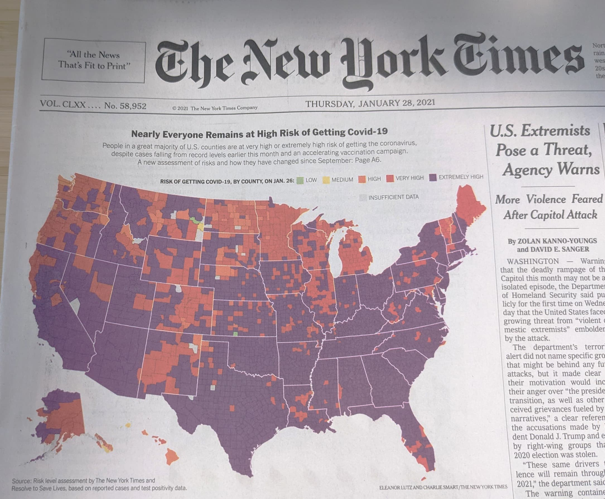
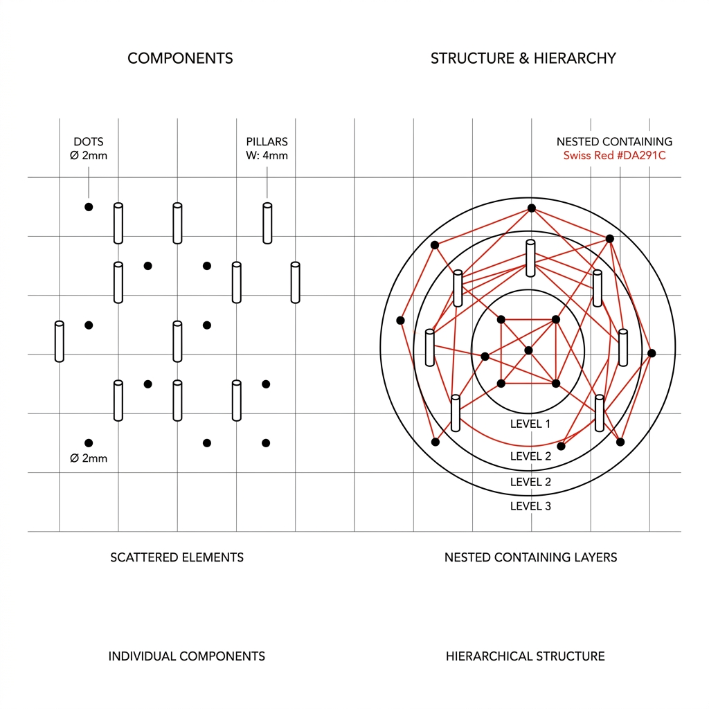
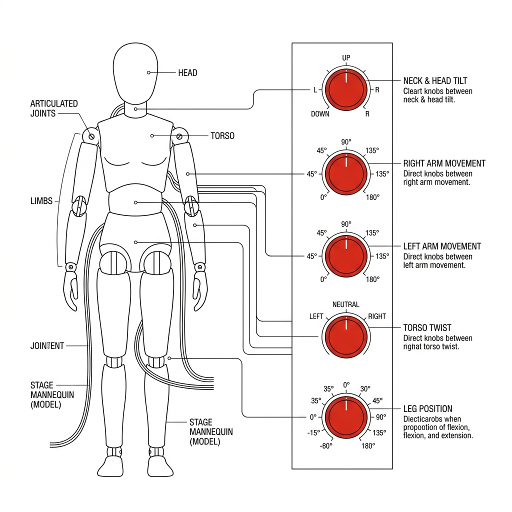
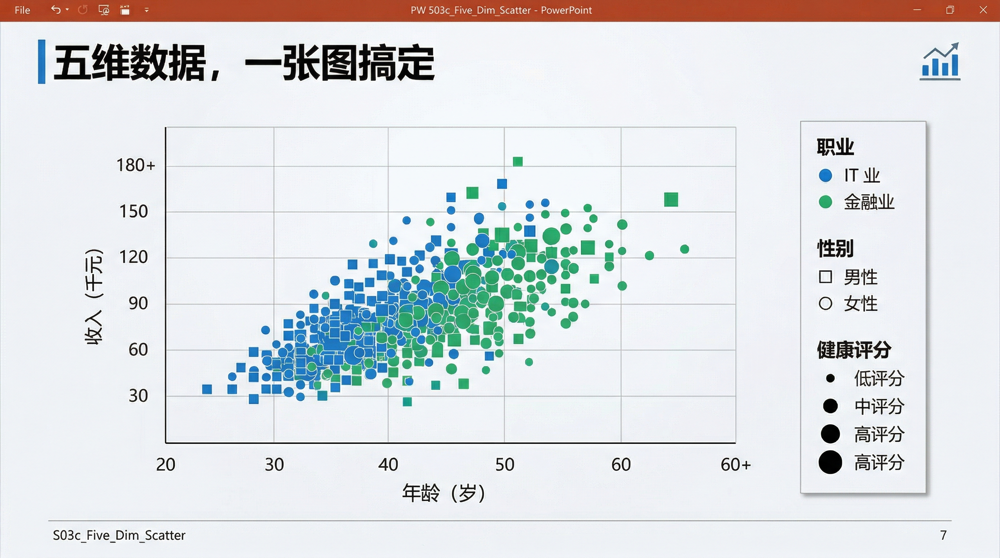
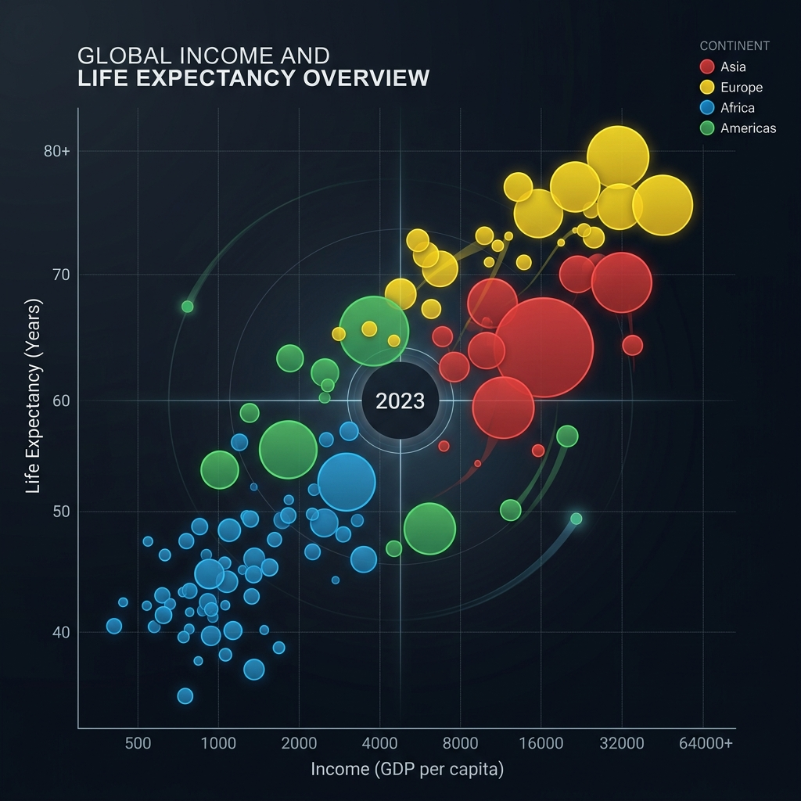
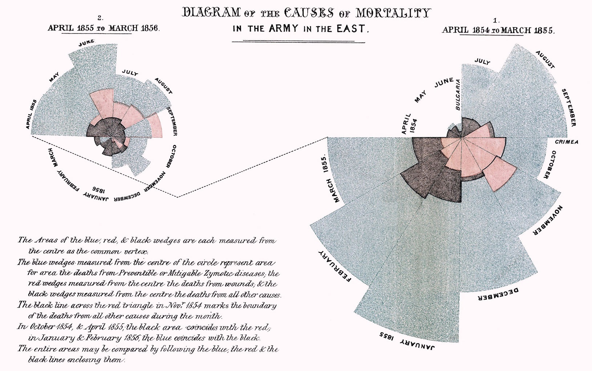

## Module 2: 原子语法——**Marks（标记）** 与**Channels（通道）** (55 分钟)
<!-- BUDGET: 4200 chars | SLIDES: ≥10 | STATUS: revision -->

> [VISUAL]
> *   **Slide**: `S02_NYT_Covid_Map`
> *   **Asset**: 
> *   **Layout**: `Full`
> *   **Scene**: 展示《纽约时报》2021年1月28日头版刊登的美国新冠风险评估地图截图。整个美国版图各郡县（2D面标记）被不同深浅的红色、紫色和橙色（颜色通道）填充，直观并强烈地映射极高风险级别的地域，右侧附有新闻正文。这张地图展示了底层空间标记结合颜色通道实现的一目了然的数据表达。
> *   **Text**: "标记与通道的力量：《纽约时报》新冠疫情地图"

### 2.1 掌握核心：解构视觉双星与底层原子

上一节我们说过，要跳出模板思维，用隐喻的眼光重新审视图表。但隐喻说到底只是"我想表达什么"的思维框架——它没有告诉你**怎么把这个隐喻拼出来**。现在，我们要拆开引擎盖，看看隐喻的底层零件。

可视化的世界看似千变万化，从微信步数的柱状图，到大屏幕上这张《纽约时报》美轮美奂的全球疫情流动地图，所有这些复杂的呈现，如果你把它们放到理论的显微镜下，拆到底只有两样东西。

> [VISUAL]
> *   **Slide**: `S03_Marks_Channels_Intro`
> *   **Asset**: 
> *   **Layout**: `Grid`
> *   **Scene**: 一张充满科技感的"数据可视化控制台"设计图。画面左侧的全息投影中悬浮着基础几何图形（点、线、多边形面），即"Marks"；右侧则是一个带有色彩、大小、位置推子和旋钮的调音台式控制面板，即"Channels"。面板上的推子射出光束，直接连接并控制左侧的几何图形，精准传达出"通道控制标记"的核心逻辑。
> *   **Text**: "视觉编码的正交基石：从抽象数据到具象图形的桥梁"
> *   **List**:
> *     - Marks: 构成图表的几何原子骨架
> *     - Channels: 控制原子的视觉外观旋钮

这两样东西，就是 **Marks（标记）** 和 **Channels（通道）**。它们就像是一套高度精密的几何控制台，两个正交的基础维度组合在一起，决定了你是否能够精准地把抽象冰冷的数字，无损且高效转化为屏幕上那些鲜活的视觉构件。

### 2.2 拆解视觉语法：定义标记与通道的面貌

#### 2.2.1 标记 (Marks)：承载数据的肉身

> [VISUAL]
> *   **Slide**: `S03b_Marks_Hierarchy`
> *   **Asset**: 
> *   **Source**: Textbook
> *   **Layout**: `Split`
> *   **Scene**: 从左到右的几何递进阶梯图：0D 点（标注"自由度：最高"）→1D 线（标注"自由度：中等，长度已被占用"）→2D 面（标注"自由度：最低，形状/面积已被锚定"），每一级之间用向下的箭头标注"自由度衰减"。
> *   **Text**: "标记的几何层级：从自由到约束"
> *   **List**:
> *     - 0D 点：无几何束缚
> *     - 1D 线：单维度约束
> *     - 2D 面：全几何锚定

**Marks（标记）** 是图像中的几何骨架。在二维屏幕平面上，它们分三个维度层级：
1. **点（0D Points）**：它是最自由的。从数学意义上讲，它不占面积，没有长宽限制。正因如此，你可以尽情地赋予它任何形状、任何颜色、或者人为设定的大和小。在散点图中，每一个数据条目就是一个点。
2. **线（1D Lines）**：线是有约束的。它的长度方向已经被它的存在本身"占用"了（用于连接起点和终点）。因此，你能调整的只剩下它的线宽以及它的颜色。
3. **面（2D Areas）**：如果你画的是一个国家地图的版块，那它就是个面。它的面积和形状已经被地理边界死死绑定了。你几乎无法再去改变它的大小来代表其他含义，你能动用的只有它的填充颜色或纹理。

理解了标记的三种几何形态后，我们再来看标记的另一个分类维度——它在图表中扮演的**角色**。除了作为独立存在的**节点项目 (Items)**，标记还可以作为**链接 (Links)** 存在。

> [VISUAL]
> *   **Slide**: `S03b2_Items_and_Links`
> *   **RenderMode**: `pure`
> *   **Asset**: 
> *   **Layout**: `Split`
> *   **Scene**: 左侧展示零散的点与柱子（Items），右侧展示将它们串联起来的网状线条（Connection）与层叠的嵌套面（Containment）。
> *   **Text**: "标记的网络功能：表达个体 vs 表达关系"
> *   **List**:
> *     - Items (节点项目): 零散的点与柱状
> *     - Connection (连接链接): 串联点的网状线
> *     - Containment (包含链接): 层叠嵌套的面

链接标记专门用来展示节点之间的关系，分为两类：
一是**连接 (Connection)**，使用线来展示成对的关系（如网络拓扑图）；
二是**包含 (Containment)**，使用面的嵌套来展示层级关系（如树图）。注意，点可以代表个体，但链接绝对不能用点来表示。

#### 2.2.2 通道 (Channels)：操控躯体的提线

> [VISUAL]
> *   **Slide**: `S03c_Channel_Metaphor`
> *   **RenderMode**: `pedagogical`
> *   **Asset**: 
> *   **Layout**: `Center`
> *   **Scene**: 舞台上站立的灰白色塑料假人模型（代表 Marks），模型身上连接着带有刻度和推子的控制面板（代表 Channels）。通过推子可以改变假人的颜色、位置和大小。
> *   **Text**: "通道：操控躯体的提线"
> *   **Keywords**: 舞台假人, 控制旋钮

大家可以把"标记"想象成舞台上灰白色的塑料假人模型。演员穿什么颜色的衣服登场？站在舞台中央还是角落？尺寸被拉大还是缩小？这些用以修饰他们外观、并且随数据变量产生起伏变化的控制旋钮，就是 **Channels（通道）**。

而在认知心理学的阵营里，通道分为两种根本不同的感官模态：

1. **身份通道 (Identity Channels)**：告诉我们某个物体"是什么"或"属于哪个类别"。（例如：形状、颜色色相、空间区域）。人类天生用它们来映射**无序的分类数据**。
2. **量化通道 (Magnitude Channels)**：告诉我们某物"有多少"。（例如：长度、明度、面积、在公共刻度上的空间位置）。人类天生用它们来映射**有序的定量数据**。

> **特别辨析**：「空间区域」（身份通道）和「在公共刻度上的空间位置」（量化通道）是两个不同的概念。前者指的是"这个数据点属于屏幕的左半区还是右半区"（类别归属），后者指的是"这个数据点在 X 轴上精确对应数值几"（定量读取）。

> [VISUAL]
> *   **Slide**: `S03c_Five_Dim_Scatter`
> *   **Asset 1**: 
> *   **Resource**: 
> *   **Source**: Textbook
> *   **Layout**: `Split`
> *   **Scene**: 画面中心展示一张极具质感的、以"蔗渣"纸张纹理为底色的可视化对比图，清晰展示了年龄与收入之间的关联走势。右下角以画中画或插图形式保留了原来的五维抽象散点图作为技术参考，并标注"从抽象到直观的演进：0D点 + 4大通道叠加强化"。
> *   **Text**: "原子的组合：一颗点，四个通道映射五维世界"
> *   **List**:
> *     - 1. 位置 X 轴：映射 年龄 (量化通道)
> *     - 2. 位置 Y 轴：映射 收入 (量化通道)
> *     - 3. 颜色色相：映射 职业 (身份通道)
> *     - 4. 面积大小：映射 健康评分 (量化通道)
> *     - 5. 形状标记：映射 性别 (身份通道)

这就是这套原子语法结合的力量：你只需在二维平面上放置一颗最基础的、完全不受几何约束的 0D 散点，并通过不断叠加量化通道和身份通道，就能瞬间在二维屏幕上，把极其抽象的高维数据清晰地表达出来。

> [ACTIVITY] Type: Quiz | Duration: 2min | Desc: 原子语法判别
> **情境**: 客户要求在一张世界地图上，展示各国不同类型发电厂（火电、水电、核电、风电）的分布。
> **题目**: 如果我们要在地图上标注发电厂，应该选择哪种组合？
> - [ ] A. 用 2D 面标记覆盖国家版图，用面积大小通道表示发电厂类型。
> - [x] B. 用 0D 点标记放置在特定坐标，用不同颜色色相通道表示发电厂类型。
> - [ ] C. 用 1D 线标记连接各国首都，用长度通道表示发电厂类型。
> **解析**: 💡 **发电厂的类型**是无序的分类数据，根据法则，必须使用"身份通道"（如颜色色相）来映射。面积大小是量化通道，用来映射分类数据会产生虚假的"谁大谁小"暗示。地图本身的地理坐标已经占用了空间位置通道，因此只能在具体位置放置 0D 的点标记，并赋予其色相变化。面标记被地理锚定，而线标记用于表示关系连接，均不适用此场景。

### 2.3 遵循物理铁律：表达性与有效性原则

既然通道是图表外观的控制旋钮，那我们能随意把任何数据挂载到任何旋钮上吗？绝不能。设计视觉编码必须遵循两个不可逾越的核心原则：**表达性 (Expressiveness)** 和 **有效性 (Effectiveness)**。

> [VISUAL]
> *   **Slide**: `S04_Expressiveness_Effectiveness`
> *   **Layout**: `Split`
> *   **Scene**: 左侧天平放着"数据特征"，右侧天平放着"视觉通道"，保持平衡。
> *   **Text**: "法则降临：表达性与有效性"

#### 2.3.1 表达性原则：数据特征与通道类型的匹配法则

**表达性原则**意味着：视觉编码必须且仅能表达数据集中的底层信息属性。
- **无序数据/分类数据** 绝对不能用带有顺序暗示的量化通道（如大小、长度）来呈现。
- **有序数据/连续数据** 必须使用产生内在大小感知的量化通道。

违背这条法则会发生什么？先来看一个日常级别的翻车。想象你的甲方是一家手机品牌，要求你做一张展示"不同型号定位"（旗舰、中端、入门）的可视化。如果你把三个型号画成大、中、小三个圆——面积是**量化通道**，它暗示的是"谁比谁多"。观众下意识的反应不是"哦这是三个类别"，而是"旗舰比入门'大'三倍，它到底大在哪？"。你看，仅仅是通道选错了，信息就已经被扭曲了。

这只是商业层面的小事故。但在某些领域，同样的错误会**致命**。

> [VISUAL]
> *   **Slide**: `S04b_Expressiveness_Disaster`
> *   **Asset**: 
> *   **Source**: Web Source
> *   **Layout**: `Full`
> *   **Scene**: 展示哈佛医学院论文原图的 2x2 对比矩阵。左侧是彩虹色带渲染的血管（色彩突兀断裂），右侧是红灰单色渐变渲染的血管（平滑连续）。
> *   **Text**: "违背表达性原则：生与死的图表"

这四张血管造影原图，残忍地展示了违背"表达性原则"的致命代价。长久以来，很多医疗诊断软件为了追求所谓"热成像"的视觉冲击力，强行使用**左侧的"彩虹色带（连续的色相变化）"**来映射血管内部连续的血压数值梯度。
要知道，**色相本质是分类的身份通道**，它在人类基因里的作用是区分苹果和香蕉的不同，而不是判断谁比谁更重。强行用它来渲染连续的数值压力，人眼就会在红、黄、绿色的交界处，看到根本不存在的、尖锐的"视觉断层"。原本平滑的压力变化，在医生眼里变成了突兀的截断。这直接导致专科医生对危险动脉瘤病灶的识别率暴跌至 **39%**！这不是设计不好看，这是在杀人。

而当哈佛大学 Borkin 团队（2011 年发表于 *IEEE TVCG*）顶住压力拨乱反正——坚持表达性原则，改用右侧的**单色红灰明度渐变（Luminance，这才是正宗的量化通道）**后，明暗梯度的深浅完美契合了血管内真实的平滑压力分布。没有了伪造的色彩断层干扰，医生的诊断准确率当即飙升至 **91%**。在严肃的数据可视化中，颜色绝不是让你用来挥洒的装饰涂料。必须克制你的感性美学冲动，严格遵守底层的物理辨识规律，因为你手里的图表，可能决定着他人的生死。

> [ACTIVITY] Type: Quiz | Duration: 2min | Desc: 表达性原则应用
> **情境**: 你的团队在做一份关于公司四个季度销售额波动的报告。实习生为了让图表"更醒目"，决定把 Q1 到 Q4 的柱子分别涂成红、黄、蓝、绿四种不同的颜色。
> **题目**: 根据"表达性原则"，这种做法为什么是错的？
> - [ ] A. 因为红黄蓝绿太刺眼，不够商务。
> - [x] B. 季度销售额是定量数据，不需要再用作为身份通道的"色相"去强制分类，这会制造无谓的认知噪音。
> - [ ] C. 应该把柱形图改为折线图，折线图才能用四种颜色。
> **解析**: 💡 柱子所在的 X 轴位置（如Q1、Q2）本身已经清晰地表明了"这是哪个季度"（空间区域身份通道）。再额外叠加不同的色相，不仅多此一举，还会让大脑下意识去寻找四种颜色背后的"新意义"，多做一次无意义的解读工作。正确的做法是用统一的品牌色即可。

#### 2.3.2 有效性与通道阶级排名

而在有效性原则下，每一类通道都有着其**不可撼动的阶级排名**。最重要的属性应分配给排名最高、最有效的通道。

> [VISUAL]
> *   **Slide**: `S04_Channel_Effectiveness`
> *   **Resource**: 
> *   **Source**: Textbook
> *   **Layout**: `Grid`
> *   **Scene**: 展示 Tamara Munzner 理论中通道的视觉效能硬性排序梯队。左列为最强的量化通道（对齐位置打头阵）；右列为身份通道（空间区域和色相打头阵）。
> *   **Text**: "通道阶级排名：论资排辈的视网膜规律"
> *   **List**:
> *     - 量化通道榜首：对齐的空间位置 (Position on common scale)
> *     - 量化通道榜末：面积 / 体积 / 颜色明度
> *     - 身份通道榜首：空间区域 (Spatial region) 
> *     - 身份通道次席：颜色色相 (Color hue)

请特别注意这张榜单，**空间位置通道 (Spatial position)** 是唯一在两类榜单中均拔得头筹的绝对王者。这意味着你把什么数据映射给空间位置（如 X 轴和 Y 轴），将绝对主导观众对数据的心理模型。

而在榜单的另一端，**面积、体积和颜色明度**则依次垫底——它们是量化通道中最"迟钝"的感知器。为什么面积如此靠后？为什么体积比面积还糟？这背后藏着一条冰冷的心理物理学定律——我们下一节就来揭开它。

> [CASE STUDY: Gapminder 的架构思路]

> [VISUAL]
> *   **Slide**: `S05_Gapminder_Base`
> *   **Asset**: 
> *   **Layout**: `Center`
> *   **Scene**: Gapminder 经典气泡图。X轴人均GDP，Y轴预期健康寿命，气泡大小代表人口，颜色代表大洲，带有多条气泡随时间移动的轨迹。
> *   **Text**: "遵守铁律：Gapminder的五维交响乐"

已故统计学家 Hans Rosling 的经典 Gapminder 动图，就是遵循排名法则的教科书级实践。
他将最重要的两个定量指标【人均GDP】与【预期健康寿命】，全部分配给量化排名第一的**双轴空间位置**。对于分类数据【国家所属的大洲】，赋予其高优标识通道**颜色色相**。次要的定量数据【人口规模】，退而求其次使用了**面积通道**。而为了呈现历史变迁，他启用了**运动通道**。这套严密遵守效能梯队的架构，成就了不朽的经典。

> [CASE STUDY: 撕碎名字迷信——解剖气泡图 (Bubble Chart)]

> [VISUAL]
> *   **Slide**: `S03c2_Bubble_Chart_Anatomy`
> *   **Asset**: 
> *   **Layout**: `Split`
> *   **Scene**: 左侧展示一个标准气泡图；右侧将其拆解为三层透明度叠加的图层——底层的 X/Y 坐标轴（量化位置）、漂浮的颜色层（身份色相）、以及最上层不同膨胀程度的外壳（量化面积）。
> *   **Text**: "解剖气泡图：撕碎流行的外衣"

现在让我们用刚学到的通道阶级排名，直接把初阶工具库里著名的"高级图表"——气泡图进行结构剖析。

大众往往将其视为"一种名为气泡图的高级样式"，认为套用即可提升专业度。但在标记与通道的显微镜下，气泡图的底层结构一览无遗：它仅仅是一颗**0D 点**作为基础标记，X/Y 轴的**空间位置通道**被用来映射强弱相关性，**面积通道**被吹胀以隐喻第三个连续变量（如人口规模），而**颜色色相通道**则用于标识分类变量（如大洲）。这就是图表生成的底层逻辑。

一旦看透这一层，如果"面积通道"因为数值落差悬殊导致小气泡在视觉上消失，你可以作为架构师果断干预——关掉面积映射，将指标差异转移给**明度通道 (Luminance)** 或高度通道。不再迷信所谓的"图表名称"，你就能真正掌控底层语法，实现设计自由。

### 2.4 驾驭原子力量：实现架构师的三重跃迁

> [VISUAL]
> *   **Slide**: `S05c_Nightingale_Rose`
> *   **Asset**: 
> *   **Source**: Web Source
> *   **Layout**: `Full`
> *   **Scene**: 佛罗伦萨·南丁格尔经典的极坐标面积图（鸡冠花图），标记了不同颜色代表的不同死因，展现着挽救生命的巨大视觉震撼。
> *   **Text**: "南丁格尔的玫瑰战争：改变国家历史的图表"

> [STORY TIME: 南丁格尔的玫瑰战争]
> 1858 年，佛罗伦萨·南丁格尔在克里米亚战争结束后，将士兵的死亡原因编码成一张前所未有的视觉图表——"鸡冠花图（极坐标面积图）"。她用扇区面积映射死亡人数，用蓝、红、黑三色区分死因（可预防疾病、战伤、其他）。随后，她私印了 2000 份报告分发给皇家卫生委员会成员和政界要员，用这张图表有力推动了英国军队医院的卫生改革。标记与通道的力量，远比你想象的更加真实。
> 有同学可能会问：面积通道不是在阶级排名中垫底吗？南丁格尔用它岂不是"选错了通道"？恰恰相反——这正是**战略性通道选择**的经典范例。面积通道虽然精度低（Stevens 幂定律告诉我们人眼会压缩面积差异，这一点下节课会详细拆解），但它有一个独特优势：**极端数据之间的落差仍然触目惊心**。南丁格尔要的不是让政客精确读出数字，而是让他们瞬间感知到"能预防的死亡远远多于战场上的死亡"这一核心论点。她的成功印证了：理解通道的局限，才能更好地驾驭它——而不是被排名表束缚手脚。

当我们从哈佛医学院的血案走到南丁格尔的玫瑰，你会发现学习这套原子语法的**终极用意**所在，你将完成**三重身份的跃迁**：

**1. 打破模板崇拜的"造物主"**
把点线面和颜色大小像搭乐高一样拆解组合，摆脱模板的束缚，根据数据特性构筑新图表。

**2. 捍卫认知边界的"守夜人"**
表达性与有效性这两道法则，就是你设计的底线和天花板。

**3. 人机对话的"系统指挥官"**
面对再复杂的流行图表，这套语法都是你的视觉显微镜，瞬间将其透视。在生成式 AI 时代，这是精准控制机器画笔的终极密码：
*"在此次可视化中，**锁定它们的空间位置通道**，把**颜色色相通道**重置映射为社会阶层分类，并用**面积通道**映射家庭纯利润额。"*

> [TEACHING MOMENT: 带走三件事]
> 今天我们掌握了原子语法的核心：**标记是几何骨架**（点、线、面），**通道是视觉旋钮**（身份通道映射分类、量化通道映射数值），而**表达性和有效性是不可逾越的铁律**。当你能用原子的眼光拆解每一个视觉元素，你便不再是模板的使用者，而是视觉隐喻的创造者。

但仅仅知道通道的排名还不够——为什么空间位置是王者、面积是末座？下一节我们将用认知心理学实验来揭秘这些排名背后的**生理物理学铁证**。

**(Pause: 3s)**

---
