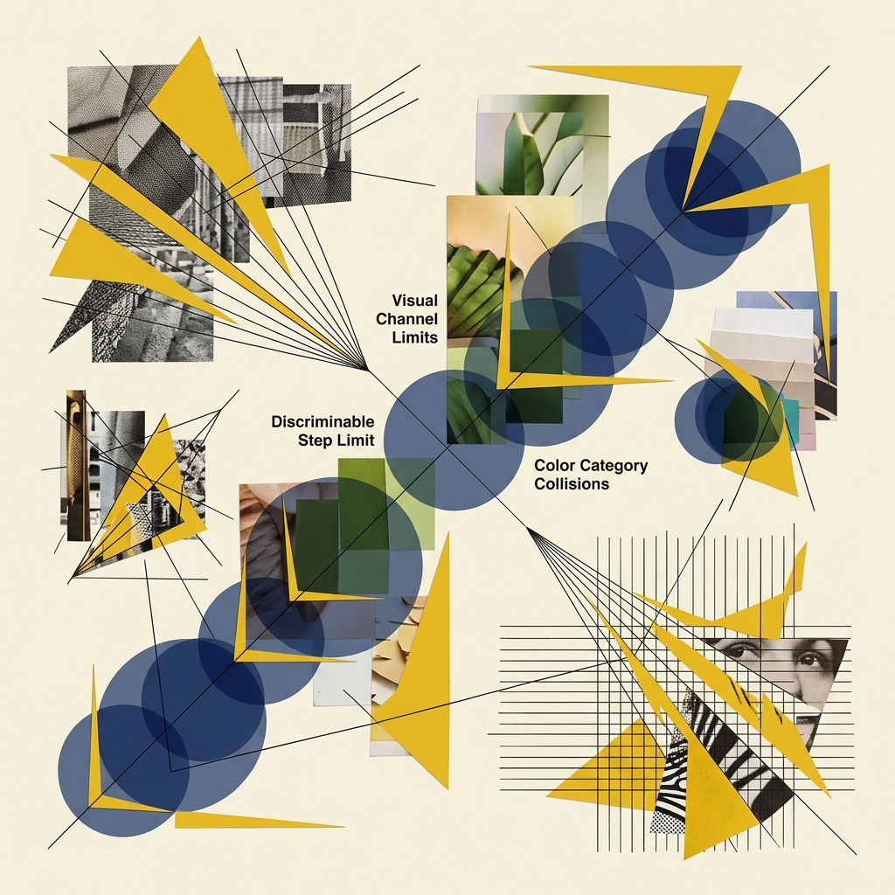
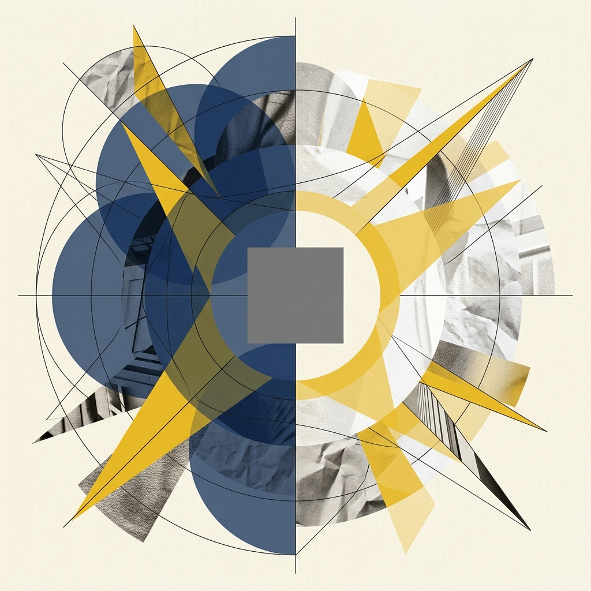
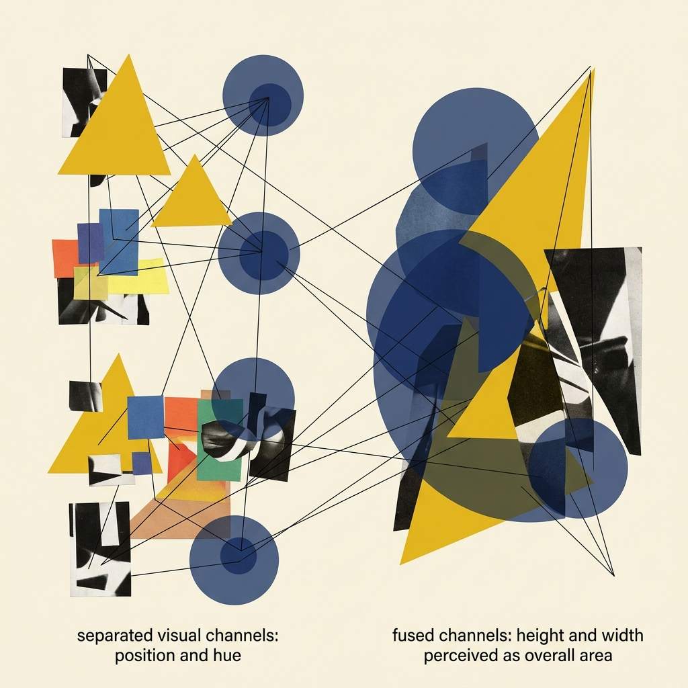
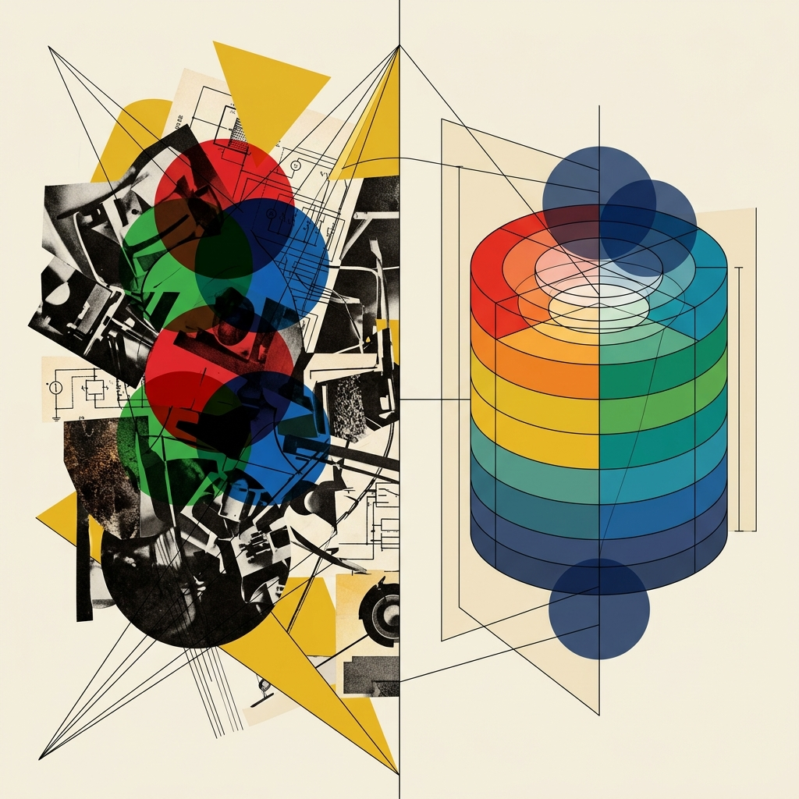
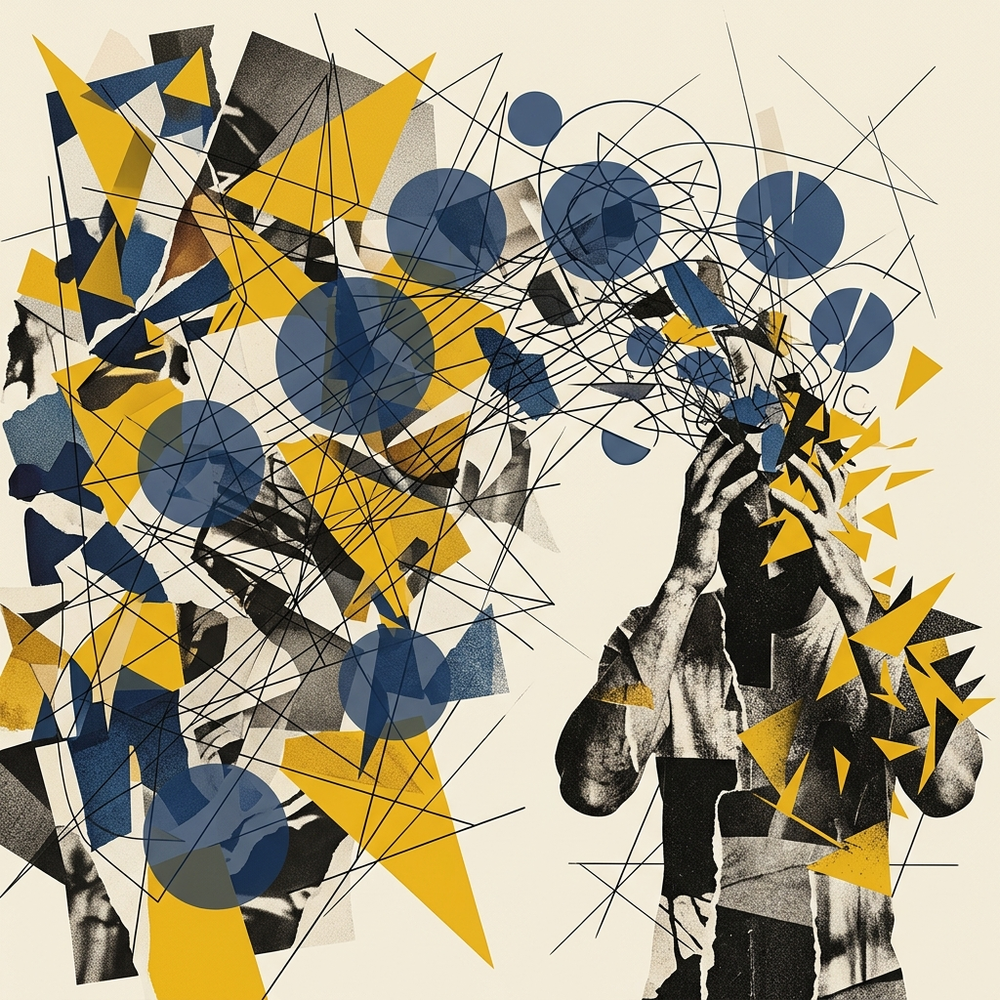
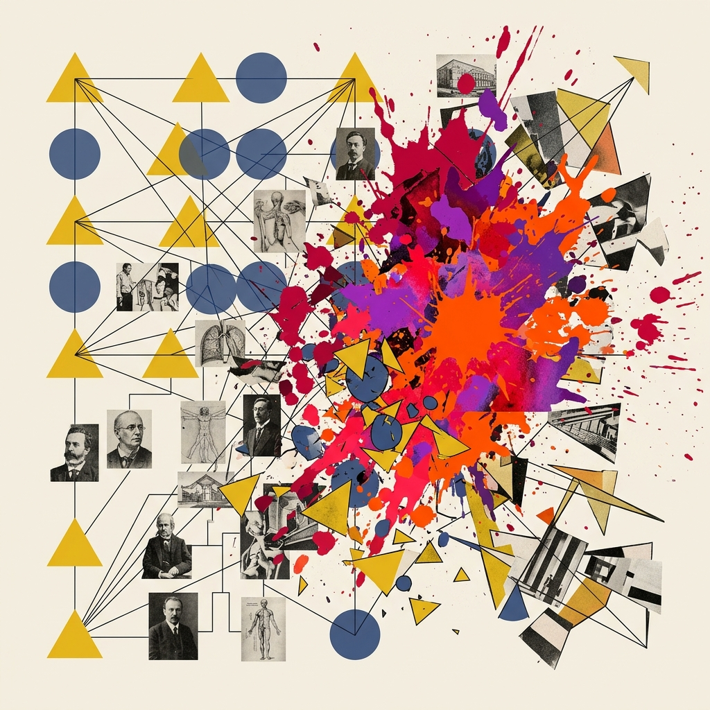
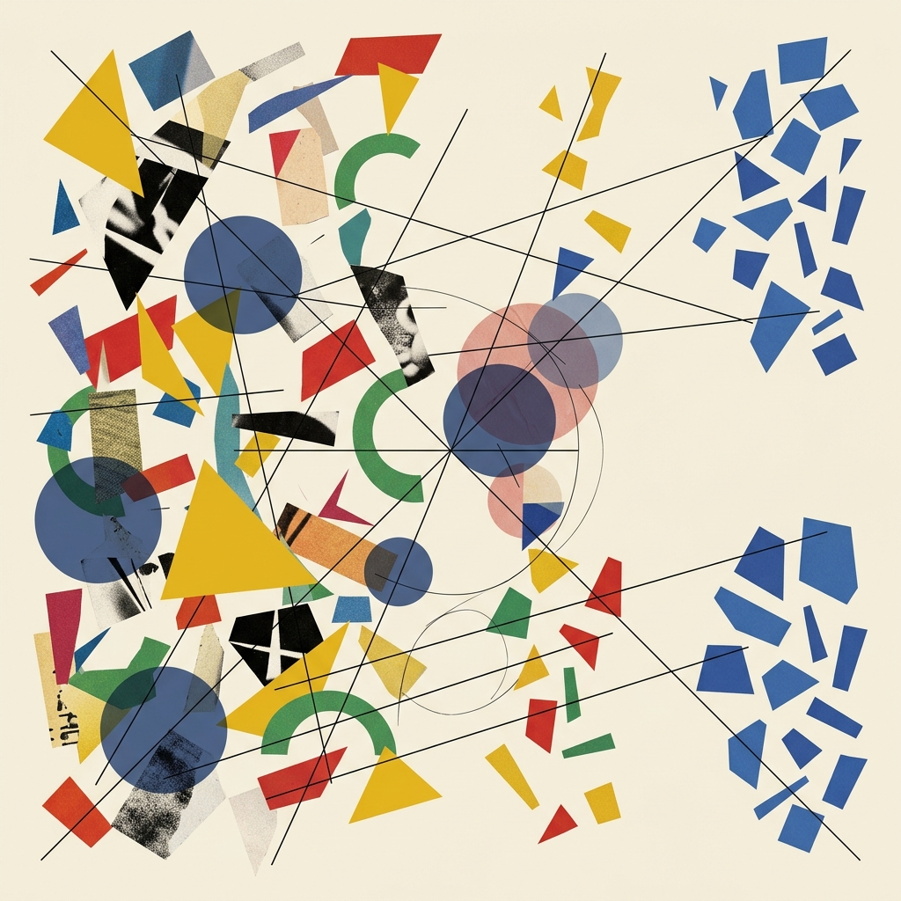
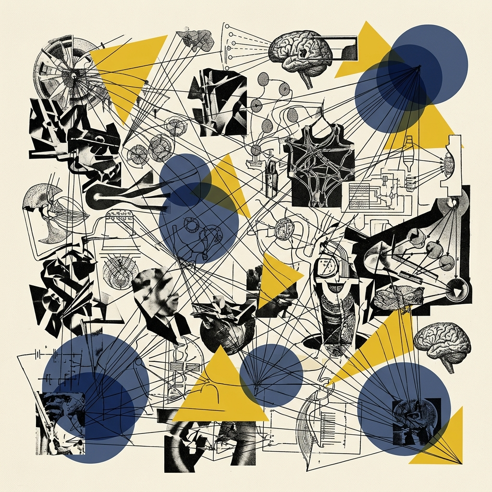
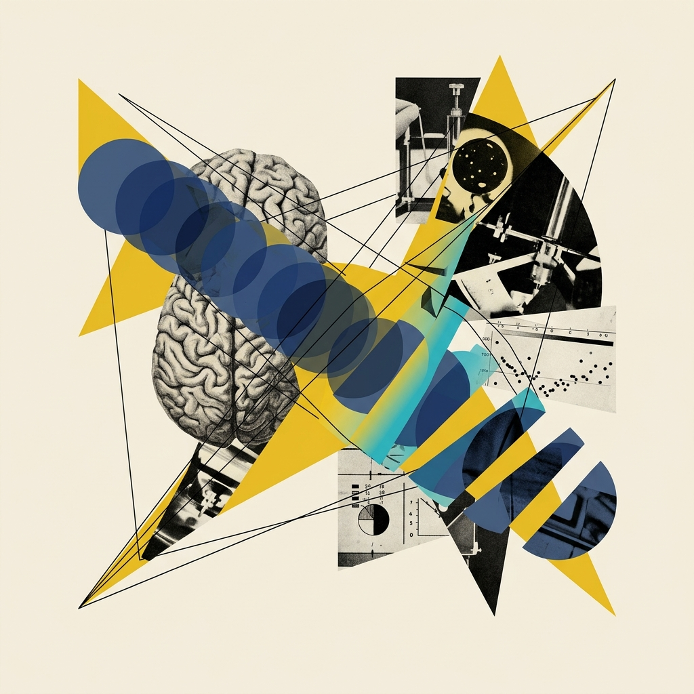

## Module 3: 视觉偏差的陷阱——心理学精度与视觉弹出 (20 分钟)
<!-- BUDGET: 5400 chars | SLIDES: ≥10 | STATUS: done -->

> [VISUAL]
> *   **Slide**: `S05_Channel_Accuracy`
> *   **Asset**: 
> *   **Layout**: `Split`
> *   **Scene**: 直观的图形对比实验。左半屏：三条黑色的直线，长度分别为 1 厘米, 2 厘米, 4 厘米，呈递增阶梯；右半屏：三个红色的实体圆，面积参数由于计算被严格设定为 1, 2, 4 倍递增。
> *   **Text**: "心理物理学定律：你以为的两倍，真的是两倍吗？"

### 3.1 Stevens定律：诚实长度与撒谎面积

既然前面提到通道有着森严的排名，那么这个排名是谁制定的？答案是：数百万年进化出来的人类视觉系统底层的物理和心理神经法则。这也是为什么可视化设计绝不仅仅是美工排版，它是彻头彻尾的认知科学。

请大家盯着屏幕左边。如果线段 A 刚好是线段 B 的两倍长，你的视神经反馈给大脑的信号会毫不犹豫地判定：A 确实等于 2B。因为**长度通道的感知响应，完美符合真实的物理数值增长**。这在心理物理学里被称为 **Stevens 幂定律（Stevens' Power Law）** 中的线性响应。对于一维的长度，其感知系数是 1.0。

> [VISUAL]
> *   **Slide**: `S05b_Stevens_Power_Law`
> *   **Asset**: 
> *   **Resource**: 
> *   **Source**: Textbook
> *   **Layout**: `Split`
> *   **Scene**: 左图展示长度感知曲线——X轴为物理刺激量，Y轴为感知量，曲线近乎完美的45度对角线（系数1.0）；右图展示面积感知曲线——同样的坐标系，曲线明显下凹（系数0.7），两条曲线之间的阴影区域标注为"认知盲区"。
> *   **Text**: "Stevens 幂定律：长度是诚实的，面积在撒谎"

除了面积被严重压缩之外，这个定律同样向我们揭示了另一个极端：**饱和度（Saturation）的超线性放大效应**。当颜色饱和度在物理属性上仅仅增加了一丁点，人类的肉眼却会觉得它剧烈地变得非常刺眼（感知系数 n > 1.0）。这就解释了为什么当我们在图表中滥用高饱和纯色去编码微弱数值增量时，整个版面会显得突兀刺眼且具有侵略性。因此，通道不仅有阶级，它们各自的油门灵敏度还完全不一样！

> [VISUAL]
> *   **Slide**: `S01b_Saturation_Trap`
> *   **Asset**: 
> *   **Layout**: `Center`
> *   **Scene**: 饱和度超线性放大效应示意图。
> *   **Text**: "饱和度的超线性放大效应"

但是，现在请看大屏幕右侧 S05b 中对比的这三个圆。虽然我在后台生成代码时，严格将最右边圆的面积设定为最左边小圆的纯数学 4 倍。但如果我不告诉你这个前提，只让你凭直觉扫一眼，大部分人的判断可能是："这个大圆看起来只比小圆大了一倍半多一点吧。"

这是一个关键的生理限制：**人类的神经系统天生会严重低估面积和体积的差异**。
根据 Stevens 定律测算，人类对面积差距的**心理膨胀系数**仅为 0.7 左右，而对 3D 深度体积的感知系数更是低至 0.6 以下甚至难以量化。我们在看立体的方块或球体时，如果它实际上变大了十倍，你的大脑往往只会感觉到它变大了六倍甚至更低。

> [VISUAL]
> *   **Slide**: `S05c_Area_Volume_Illusion`
> *   **Asset**: 
> *   **Layout**: `Full`
> *   **Scene**: 三组红色实体圆的对比展示——上方标注实际面积比 1:2:4，下方用虚线圈出人脑感知的等效面积比约 1:1.4:2.5，两组数字之间用醒目的黄色闪电符号标注"心理压缩系数 0.7"。
> *   **Text**: "Stevens 定律实证：你的大脑在骗你"

这就意味着一个严重的隐患：如果你在制作一期有关全球各大洲财富差异的数据新闻时，轻率地选择用"金块的 3D 体积或者地理气泡占据的巨大面积"去直接映射庞大的财富差值，那么，超级富翁和底层平民在图表上的视觉断层，将会被读者的大脑自动大幅度**认知压缩**。
**视觉欺骗的代价**是惨重的：你以为你客观地呈现了 100 倍的差距，但观众眼里体验到的痛楚可能只有 10 倍。这在具有强烈公共社会属性的纪实叙事中，由于选用的通道随意且业余，你已经在潜意识里实施了**新闻蒙蔽**。

> [VISUAL]
> *   **Slide**: `S05c2_Volume_Deception`
> *   **Layout**: `Center`
> *   **Scene**: 一个巨大的 3D 立方体代表巨额财富，旁边放着一个很小的立方体。由于 3D 透视和体积压缩效应，两者的视觉差距远小于实际数值差距。
> *   **Text**: "3D 体积的视觉谎言"

> [DID YOU KNOW: "面积即欺骗"的新闻丑闻]
> 2015 年某知名商业媒体用 3D 气泡图展示科技公司市值，苹果的气泡面积看起来仅比小米大两三倍，而实际市值差距超过 20 倍。该图被可视化社区大量截图批评，成为教科书级别的"Stevens 定律犯罪现场"。这起事件至今仍被 Munzner 和 Tufte 的学生们当作反面教材在课堂上反复鞭尸。

> [VISUAL]
> *   **Slide**: `S05d_Wealth_Bubble_Lie`
> *   **Asset**: 
> *   **Layout**: `Full`
> *   **Scene**: 一张全球财富气泡地图案例——最大气泡（代表美国）与最小气泡（代表某发展中国家）之间，用红色标注线分别标出"视觉感知落差：×3"和"真实数值落差：×100"，形成触目惊心的反差警示。
> *   **Text**: "你以为的 3 倍差距，实际是 100 倍——面积通道的认知陷阱"

### 3.2 韦伯定律：在盲区实施相对差异的视觉手术

既然通道的感知精度差异这么大，那么是不是我们所有数据全用位置和长度来展示就一劳永逸了？抱歉，这里还有一条如同铁律般的**可辨别性约束**。每个通道能提供给我们的“**可辨别步级极限（也就是 Bins）**”是非常有限的。
刚才我们提到线宽只有 3-4 步可被肉眼区分，那么大名鼎鼎的**颜色色相通道**呢？在没有特定背景比对独立存在的情况下，普通人不经过专业训练最多只能轻松区分大约 6 到 12 种色彩（比如区分红、橙、黄、绿、青、蓝、紫、粉）。这就是我们在做饼图或者多折线图时，类别序列一旦超过十二个，图例颜色就难免开始发生严重撞车打架从而变成色彩泥潭的根源。
铁律是：你企图在图表上编码表达的值的数量级，**不能超过**该选定通道自身所能承受的最大步级数。一旦发生越界，必须果断降维聚合，或者转手换别的通道！

> [VISUAL]
> *   **Slide**: `S02b_Webers_Law_Definition`
> *   **Asset**: 
> *   **Resource**: 
> *   **Source**: Textbook
> *   **Layout**: `Center`
> *   **Scene**: 展示通道可辨别步级极限的图示，展示颜色分类撞车。
> *   **Text**: "通道的可辨别步级极限 (Bins)"

> [TEACHING MOMENT: 韦伯定律与相对差异]
> 这里还要引入另外一位心理学家发现的**韦伯定律（Weber's Law）**：人类感知的，是两者的**相对百分比差异**，而不是**绝对数值差异**。
> 如果长城加高一米，你根本看不出来；哪怕你家天花板加高一米，你会明显觉得房子好宽敞。同样是一米，基数不同，刺激完全不同。
> 
> > [VISUAL]
> > *   **Slide**: `S02b2_Webers_Base_Illusion`
> > *   **Layout**: `Split`
> > *   **Scene**: 左侧画着长城增加1米的对比（几乎无感），右侧画着天花板增加1米的对比（极其明显）。
> > *   **Text**: "韦伯定律：人类感知的是相对差异"
>
> 在可视化里，如果我们要拿两根分别代表一万五千亿GDP和一万五千零一亿GDP的巨大柱子做对比，由于它们自身的基数非常庞大，那微小的顶部落差将完美地隐没在韦伯定律的盲区里，肉眼难以察觉！
> 此时作为老手，你应该立刻停止使用绝对底端对齐柱状图，果断切换为以基准线（如去年的平均水平）为零点的**发散性误差偏离图**。强行放大那一亿的落差，这是高级数据分析师破局认知的核心手段。

> [VISUAL]
> *   **Slide**: `S05e_Weber_Diverging_Bar`
> *   **Asset**: 
> *   **Layout**: `Split`
> *   **Scene**: 左半屏：两根近乎等高的巨大柱子（一万五千亿 vs 一万五千零一亿），顶部差异肉眼不可辨，上方标注"韦伯盲区"；右半屏：切换为发散性误差偏离图后，以去年均值为零点基线，那一亿的差异被显著放大为清晰可见的偏差条。
> *   **Text**: "破局韦伯盲区：用发散图放大微小差异"

大家请看屏幕动效。假设这两根高大的柱子代表的是国内两家巨头在双十一狂欢节中的**总交易额（GMV）**。左侧是一万五千亿，右侧是一万五千零一亿。
在传统的**绝对值柱状图**中，这一亿的差距由于一万五千亿的巨大底座基数，直接隐没在了视觉盲区里！老板看了一眼，只会觉得大家打成了平手。
这就是典型的**视觉韦伯盲区**。在这个盲区下，微小但关键的差距被绝对基数淹没了。作为一名高阶分析师，你必须掌握**基准线重置**的破局手段。

> [VISUAL]
> *   **Slide**: `S05e2_Baseline_Reset`
> *   **Layout**: `Center`
> *   **Scene**: 一个动态演示过程：镜头迅速下降，截断柱子底部那巨大的 1.5万亿 冗余基座，将坐标系原点重置在去年的平均值上，从而在视觉上极度放大了顶部的偏差微小变化。
> *   **Text**: "基准线重置：高阶分析师的破局手段"

看右边：果断舍弃绝对坐标。将去年的平均基准 GMV 设置为水平中部的 0 点基线，构建**发散性误差偏离图**。瞬间，那个原本难以察觉的 1 亿人民币差距，就会被显著放大为一根清晰可见的偏差条柱。这不仅是图表技巧的破局，更是高阶分析诊断能力的体现。

> [VISUAL]
> *   **Slide**: `S05f_Checker_Shadow_Illusion`
> *   **Asset**: 
> *   **Resource**: 
> *   **Source**: Textbook
> *   **Layout**: `Split`
> *   **Scene**: 左侧展示经典的阴影棋盘错觉图，A格（位于亮部看似深灰色）和B格（位于阴影中看似浅灰色）分别被明显标出；右侧是用一条纯色带连接A格和B格，证明它们在色值上是完全相同的纯灰度颜色。
> *   **Text**: "相对判断的代价：色彩被环境劫持"

不仅是比较长度，**韦伯定律所揭示的这套“人类只做相对判断而不是绝对判断”的神经错觉机制，在色彩学上更为恐怖**。请看大屏幕上这幅最著名的能把大猩猩和博士生全部耍得团团转的**阴影棋盘错觉（Checker shadow illusion）**。你们眼中这截然不同的A格与B格，其实它们的RGB物理底色是处于同一色值的纯灰度区块。仅仅因为旁边站着不同的明暗格子背景和那片圆柱体带来的阴影包裹覆盖，你的大脑就会发誓其中一个格子必然比另外一个深邃黑得多！

看右边，当我们用一条纯色带把它们连接起来时，谎言不攻自破。这种"色彩数值被相对视觉环境劫持"的特征要求我们，在运用色彩去给关键数据映射编码时，所有比较的底座或底层背景环境务必保证高度统一、纯净且客观！

> [VISUAL]
> *   **Slide**: `S03b_Color_Relativity`
> *   **Asset**: 
> *   **Resource**: 
> *   **Source**: Textbook
> *   **Layout**: `Center`
> *   **Scene**: 一张强调环境光和背景色彩如何改变中心色块感知的错觉图。
> *   **Text**: "相对判断：色彩被环境劫持"

> [ACTIVITY]
> *   **Type**: `QA`
> *   **Duration**: `1min`
> *   **Desc**: **快速检验理解：韦伯定律应用**。提问：“如果要对比两家万亿级公司的微小利润差异，应该用什么图表？”（预期答案：发散性误差偏离图/重置基准线，而非绝对值柱状图）。

### 3.3 检索崩塌：被融合通道炸毁的车载极速警报

除了对绝对参数的不敏感与相对判断带来的错觉泥潭，通道编码还有一个更深层的技术误区，也是初涉交互设计的学生最容易掉进去的陷阱：为了形式感滥用叠加通道属性所导致的"信息过载"。

> [VISUAL]
> *   **Slide**: `S06_Visual_Popout_Failure`
> *   **Asset**: 
> *   **Resource**: 
> *   **Source**: Textbook
> *   **Layout**: `Grid`
> *   **Scene**: 展示一系列前注意处理（Pre-attentive processing）的极限压力测试演示动图。
>   - 左上：上百个蓝色实心圆点中，静静地躺着唯一一个红点。（几乎无视延迟，秒级识别）
>   - 右上：一堆蓝色方块中，混入了一颗蓝色的圆圈图形。（同样秒级识别）
>   - 左下：蓝颜色的实心圆与红颜色的方块按照随机网格大量混合分布。（开始费眼）
>   - 右下：终极挑战——在此前蓝圆+红方的乱局中，我要求你找出唯一的一颗**红色的圆形**。（认知系统崩溃瘫痪）
> *   **Text**: "**Visual Popout（视觉弹出）** 的死亡边界与结合检索陷阱"
> *   **List**:
> *     - 颜色特征检索: 秒级弹出
> *     - 形状特征检索: 秒级弹出
> *     - 结合检索 (颜色+形状): 认知瘫痪

大家还记得第一周我们讲过的人体自带的"视觉光线外接显卡"——前注意处理吗？一个红色的斑点，可以在一堆蓝色的汪洋海洋中瞬间"跳跃"出来，这叫做高度专注的 **Visual Popout（视觉弹出）**。这是一种所谓的"特征检索"，不管画面里的干扰对象是 10 个还是 10,000 个，你发现那个红点的时间几乎都是恒定的，因为它们是由你的神经系统视网膜大片区底层做全画幅无差别大规模并行计算处理出来的。

但在这个幻灯片右下角的象限，安妮·特瑞斯曼的特征整合理论为我们敲响了警钟。

> [VISUAL]
> *   **Slide**: `S06_Popout_Parallel_Processing`
> *   **Layout**: `Split`
> *   **Scene**: 左半屏展示"特征检索"的瞬间完成动画，配以"多核心 GPU 并行计算"的隐喻；右半屏展示"结合检索"缓慢的逐点扫描动画，配以"单线程 CPU 串行处理"的隐喻。
> *   **Text**: "视觉显卡宕机：从并行计算到串行扫描"

如果我想让你在一大堆蓝色的圆形、红色的方形海量杂波中，找出一个同时必须具备两个特定通道属性的目标——也就是一个**红色的圆形**，会发生什么？

突然之间，你大脑里的这片"超级显卡"宕机了。你失去了并行计算的能力，退化到了老式的单线程串行模式。你必须强迫眼球挨个扫过每一个图形："这个是红的，不对，是方的；这个是圆的，不对，它是蓝的……"
这就叫做**结合检索**，这会带来海量的运算负荷。

> [VISUAL]
> *   **Slide**: `S06b_Conjunction_Search_Demo`
> *   **Asset**: 
> *   **Layout**: `Full`
> *   **Scene**: 模拟眼球轨迹扫描路径的对比动线图——左侧"特征检索"模式下眼球直接跳到目标（一条直线箭头）；右侧"结合检索"模式下眼球被迫逐个扫描（密密麻麻的 Z 字形折线路径），路径长度增加了 20 倍以上。
> *   **Text**: "从闪电直击到地毯搜索——结合检索的代价"

仔细看屏幕，让我们弄清楚结合检索是如何消耗注意力的。
在左边的画面里，我们模拟了眼动仪在执行"特征检索"（找红点）时的追踪路径：那是一条干脆的直线！你的眼球根本不需要扫描旁边蓝色的杂波，瞬间就能直奔标靶。这是进化赋予我们的直觉反射，用来快速识别草丛中异色的危险信号。

> [VISUAL]
> *   **Slide**: `S06b2_Eye_Tracking_Cost`
> *   **Layout**: `Center`
> *   **Scene**: 眼动仪热力图，对比直线突击与 Z 字地毯式搜索的认知耗时。
> *   **Text**: "结合检索：读者的耐心如何流失"

但请看向右半屏，这片被叠加了两个要求（红色且圆形）的搜索区域，触发了低效的**结合检索（Conjunction Search）**。红色与形状的结合打破了那套直觉反射回路，迫使视神经进行低效、呈 Z 字型折线的逐个扫描。
这会带来几十倍的耗时落差，读者的耐心在这一段漫长的找寻过程中会迅速流失。所以请记住：**视觉弹出效应非常强大，但每一次你必须且只能使用一种独立不干扰的首要特征！**不要试图同时叠加颜色、运动和形状来挑战读者的视觉极限。

> [VISUAL]
> *   **Slide**: `S04b_Conjunction_Search_Cost`
> *   **Asset**: 
> *   **Resource**: 
> *   **Source**: Textbook
> *   **Layout**: `Split`
> *   **Scene**: 左侧是分离的通道组合（位置+色相），右侧是融合的通道（高度+宽度被感知为整体面积）。
> *   **Text**: "通道的分离与融合"

我们为什么会在视觉上发生认知过载？这涉及到更底层的一个关键交互评价指标——**通道的可分离性 (Separability) 与融合性 (Integrality)**。
比如你使用**位置 + 色相**（在散点图右上角画一个红色的点），这是非常优秀的**可分离通道组合**；你的大脑可以顺畅地将这两个属性分开读取剥离分析：“恩，这是一个利润较高（位置右上）的电子产品类别（红色）。”
但如果你使用**宽度 + 高度**呢？这就构成了一个棘手霸道的**整合融合通道对**。你的底层视神经在零点几秒内会强势暴力介入，直接把一维的宽度和一维的高度粗暴融合成为了一个直觉上的二阶面积属性：“这就是一个大块头！”你很难再顺利地从脑海中倒向逆推出它最初精确的绝对宽高明细落差比例数值了。

> [VISUAL]
> *   **Slide**: `S06b3_RGB_vs_HSL`
> *   **Asset**: 
> *   **Layout**: `Split`
> *   **Scene**: 左侧展示 RGB 混色模型（机器视角的红绿蓝通道叠加，难以直觉拆解）；右侧展示 HSL 圆柱体模型（人类直觉视角的色相、饱和度、亮度维度，符合人类对色彩的自然认知）。
> *   **Text**: "RGB 的机器视角与 HSL 的直觉维度"

> [WARNING: 永远避开 RGB 融合代码陷阱]
> 提到难以分离的通道典型问题是大家常常在 CSS 里使用的 `RGB` 或 `CMYK` 十六进制值。这三个颜色基向量通道是难以在视觉认知中独立分解的。你不能指望读者能从一块屏幕上的紫色像素点里，人工分离并且倒推出："哦，我看见了 30% 的红和 70% 的蓝，所以 A 商品代表利润 30% 而 B 商品代表 70%"。这就是为什么我们在定义高级系统色彩数据通道时，建议放弃前端开发习惯使用的 `RGB/HEX` 模型，而全面切入到与人类直觉认知直接挂钩的 `HSL`（色相/饱和度/亮度）空间！

> [WARNING: 通道干扰导致的体验问题]
> 为什么会这样？认知心理学给我们的铁律就是：**人类的视觉系统在绝大多数场景下，一次仅能毫不费力的依赖唯一一条最强显式独立通道来发起弹出效应。**
> 当你为了让图表显得“丰富”，而同时叠加三个通道属性（比如用渐变区分品类，用形状映射重要度，还用线条粗细映射时间）时，过度的视觉刺激会导致视觉弹出机制失效，图表的可读性将大幅下降。

> [VISUAL]
> *   **Slide**: `S06b4_Cognitive_Overload_Warning`
> *   **Asset**: 
> *   **Layout**: `Center`
> *   **Scene**: 展示一张由于过度叠加（颜色+形状+阴影+动画）而导致“视觉弹出机制失效”的图表，旁边配有“脑力超载”的警示插画。
> *   **Text**: "通道叠加悖论：越丰富，越难读"

所以，给所有交互设计师的核心建议是：**克制**。不要将所有可用的样式属性同时叠加在一张严肃的数据图表中。

> [ACTIVITY]
> *   **Type**: `QA`
> *   **Duration**: `1min`
> *   **Desc**: **快速检验理解：检索过载**。提问：“如果你试图让观众在一群蓝色圆圈和正方形中找出一个红色圆圈，这会触发什么反应？”（预期答案：结合检索/串行扫描，导致注意力瘫痪）。

既然提到了颜色导致的认知问题，我们需要深入了解**颜色映射通道控制**的核心原则。

> [VISUAL]
> *   **Slide**: `S06c_Color_Section_Header`
> *   **Asset**: 
> *   **Layout**: `Center`
> *   **Scene**: 章节转场画面——深邃黑色背景上，一滴鲜红的墨水正在缓慢扩散开来，形成不规则的有机形态。画面中央以冷峻的无衬线字体写着核心议题标题。
> *   **Text**: "颜色：最危险的通道"

大家请看大屏幕此刻的转场。黑色背景中，一滴红色的墨水正在屏幕中央无规则地扩散。
如果说位置、长度和大小是我们手里高度精确的游标卡尺，那颜色就是充满不可预知性的变数。使用得当，它能在一秒钟内让画面焕发出生机；使用不当，它会摧毁你精心编排的信息层级。
因此，我们在设计时必须建立**色彩克制法则**。颜色是充满变数的最强通道，滥用它会摧毁信息层级，让图表的基础逻辑失效。

> [VISUAL]
> *   **Slide**: `S05b_Color_Priority`
> *   **Asset**: 
> *   **Layout**: `Center`
> *   **Scene**: 展示色彩对信息层级的破坏力。
> *   **Text**: "色彩克制法则"

### 3.4 空间分布：天然的视觉分组机制

在进入色彩大门之前，我再补充一句关于大脑的**分组机制**。根据格式塔理论与神经机能，如果我们将分类属性的威力进行排序，最强的是**包含关系**的圈定结构，其次是**连线关系**的绑缚。但在相似性自动分组里，**空间区域位置**的天然无形分割能力，优于所有颜色和形状等表面视觉标记点。这就是为什么当我们在设计系统界面时，第一直觉永远必须是在屏幕上清晰划出“左侧导航区”与“右侧内容域”，而不是试图用微弱的颜色甚至形状去区分它们。把最高效的分组特权，永远留给无形的空间区域。

> [VISUAL]
> *   **Slide**: `S06c2_Spatial_Grouping`
> *   **Asset**: 
> *   **Layout**: `Split`
> *   **Scene**: 左半屏展示颜色各异但混杂在一起的散点图；右半屏展示颜色统一，但通过明显的空间留白划分为左右两个独立区域的散点图。
> *   **Text**: "空间分组 vs 色彩分组：显著的效能差距"

然而，现实中图表面积永远狭小且受限。当我们必须进行信息分流时，颜色往往成为必要的辅助通道。

> [VISUAL]
> *   **Slide**: `S06b_Color_Assistance`
> *   **Asset**: 
> *   **Layout**: `Center`
> *   **Scene**: 在拥挤的布局中，色彩作为最后的分流手段被克制地使用。
> *   **Text**: "颜色的辅助分流作用"

### 3.5 色阶禁忌与人道防线

> [VISUAL]
> *   **Slide**: `S06d_Three_Colormaps`
> *   **Asset**: 
> *   **Resource**: 
> *   **Source**: Textbook
> *   **Layout**: `Grid`
> *   **Scene**: 三列并排展示色阶类型：左列为顺序色阶（从淡天蓝渐变到深海军蓝，下方标注"单向强度"）；中列为发散色阶（暗蓝→白灰→深红，中间标注零点基线）；右列为分类色阶（7个离散独立色块，下方标注"≤7-8种"警告）。
> *   **Text**: "Munzner Ch10: 三大色阶适用边界"
> *   **List**:
> *     - 顺序色阶 (Sequential)
> *     - 发散色阶 (Diverging)
> *     - 分类色阶 (Categorical)

> [TECH NOTE: 颜色映射的色阶选择与禁忌——Ch10 核心要义]
> **知识节点**: `ch10-map-color`
> Munzner 在第十章中将颜色的使用严格剥离为三大色阶类型，每一种都有其适用的场景：
>
> 1. **顺序色阶（Sequential Colormaps）**：从浅色过度到较深的颜色，这条跑道专用于去表达**从低值到相对高值的纯粹单向量化强度提升**。例如各省份人均收入热力图地图。
> 2. **发散色阶（Diverging Colormaps）**：从一个冰冷的对比色，中间安全地穿过一段完全呈现中性苍白的地带（零点基线），再一路飙升到另外一个强烈的对比色（如经典的暗蓝→白灰→深红）。这条跑道天生专用于表达**围绕着某一确定基准零点展开的对称型盈亏或冷暖偏差数据**。比如企业的净利润正负情况或者全球年度平均气温异常指数偏移量。当你用错时意味着隐没了基线的震慑力。
> 3. **分类色阶（Categorical Colormaps）**：这批由绝对离散独立色相团拼凑成的组合（如西红柿红、天青蓝、抹茶绿、暖黄），是专用于向观众脑波发出**无内在强相关比较意图的标签分类归属暗示**的工具。需要注意：受制于短时工作记忆限制，图例的类别数不应超过 7-8 种！否则哪怕是具有高分辨精度的人类眼球也会在面对过多类别时发生视觉混淆。

>
> 此外，具有误导性且经常被程序员误踩的，是**彩虹色阶（Rainbow Colormap）**。之所以被学术研究界禁用，是因为在红黄绿青蓝靛紫的自然光谱排列里，人眼对黄色和中间那抹青蓝过渡区段的**明度（也就是 Luminance）**与饱和度的感知是极不均匀的。这会人为地在画面中生造出一道底层数据根本不存在的"断层伪边界"。

更重要的是，同理心也是我们对数字世界必须抱有的温柔。全球大概有近 8% 的男性存在一定程度的色觉感知缺陷，主要是红绿色弱。如果在一场关乎灾情预警避难的可视化设计中，你仅仅依靠高饱和度的红色和绿色去区分安全与危险信息，那这几千万的观众将无法获取求生指南。请务必在你的颜色框架设计里，自觉引入对视障群体友好的 **ColorBrewer 专业验证调色板**解决方案。这也是评价专业设计师底线操守的一把标尺。

> [VISUAL]
> *   **Slide**: `S07b_Rainbow_Colormap_Trap`
> *   **Asset**: 
> *   **Resource**: 
> *   **Source**: Textbook
> *   **Layout**: `Split`
> *   **Scene**: 展示彩虹色阶中黄青过渡区造成的伪边界。
> *   **Text**: "禁忌：彩虹色阶的明度断层"

> [STORY TIME: 彩虹末日——NASA 如何弃用 Rainbow Colormap]
> 2014 年 NASA 气候数据发布后，科学家发现使用**彩虹色阶**的海温图中出现了两条"异常温度断层"。经排查证实，这些断层纯属色阶不均匀产生的**视觉假象**。此事件直接推动了**感知均匀色阶 Viridis** 的诞生。从此，"永远不要用彩虹"成为了数据科学界的第一戒律。

> [VISUAL]
> *   **Slide**: `S06e_Accessibility_ColorBrewer`
> *   **Asset**: 
> *   **Layout**: `Split`
> *   **Scene**: 左半屏展示同一张热力图在红绿色盲模拟滤镜下的失效效果（关键区域完全无法区分）；右半屏展示应用 ColorBrewer 无障碍调色板后的清晰效果，两张图下方分别标注"8% 男性看到的世界"和"无障碍设计后的世界"。
> *   **Text**: "色觉缺陷不是少数人的问题——它是设计师的职业道德底线"

请大家看大屏幕上这组强烈的**色盲模拟对比画面**。
在左边这张模拟了**红绿色盲滤镜**的气象预警热力图中，高饱和度的红色预警与绿色草原，变成了一片难以分辨的暗褐与土黄色块。如果这是地震安全避难指引，那我们在无意中就切断了几千万人的**生命通道**。
这就引出了可视化的第二条红线：**无障碍设计的道德底线**。技术从业者若缺乏同理心，在关键预警系统中的失误将造成严重的后果。
对比右侧，我们引入了科学验证的 **ColorBrewer 安全色阶**。在这套体系下，深蓝与苍黄的明度及饱和度落差完美地扛起了区分重任，确保了在滤除红绿波段后，信息依然畅通无阻。这不仅是专业能力的体现，更是设计师必须坚守的防线。

自从 2014 年 NASA 海温数据在彩虹色阶下暴露出“截断式气温断裂假象”之后，科学界便将此类**无障碍色谱验证**纳入了终极标尺。

> [VISUAL]
> *   **Slide**: `S06f_ColorBrewer_Simulator_Tools`
> *   **Asset**: 
> *   **Layout**: `Grid`
> *   **Scene**: 界面工作流演示。上方展示 ColorBrewer 网站界面，鼠标正在勾选 "colorblind safe"（色盲安全）选项并生成出一组发散色阶；下方展示安装在浏览器或 Figma 中的色盲滤镜模拟器插件界面，正在对一幅图表执行一键灰度与红绿色盲视效检查。
> *   **Text**: "防雷神器：ColorBrewer 与色盲模拟器"
> *   **List**:
> *     - 开启色盲安全验证
> *     - 插件执行一键单色检查

既然如此危机四伏，我们如何在执行交付过程中排开所有的设计误区？手段简单而直接，答案就在大家头顶的演示画面中。

> [INTERACTIVE: 工具约束与底线操守]
> 大家今后出入任何项目组，请切记将 **ColorBrewer (colorbrewer2.org)** 加入硬性依赖白名单。这是可视化界泰斗团队为安全地图学专门研发的神级色板库，对各类色觉障碍人群十分友好。
> 当你构建分类或发散色阶时，只需勾选 "colorblind safe"。它会直接为你划定经过验证的安全色域池，强行规避明度断层漏洞，并输出安全的高级 Hex 或 RGB 代码。
> 同时，我向所有人提出强制要求：请在操作系统、Figma 或浏览器中，永远安装一款色盲模拟器插件（Colorblind Simulator）。务必养成在交付汇报前，主动切换色盲视角的职业习惯。
> 去直视你的成果。如果在褪去彩色伪装的单色通道里，或者在红绿色盲的光谱中，它依然能让人清晰读懂数据逻辑，你才算完成了一件合格的作品。

---

