## Module 3: 视觉偏差的陷阱——心理学精度与视觉弹出 (25 分钟)
<!-- BUDGET: 4500 chars | SLIDES: ≥10 | STATUS: revision -->

> [VISUAL]
> *   **Slide**: `S05_Channel_Accuracy`
> *   **Asset**: 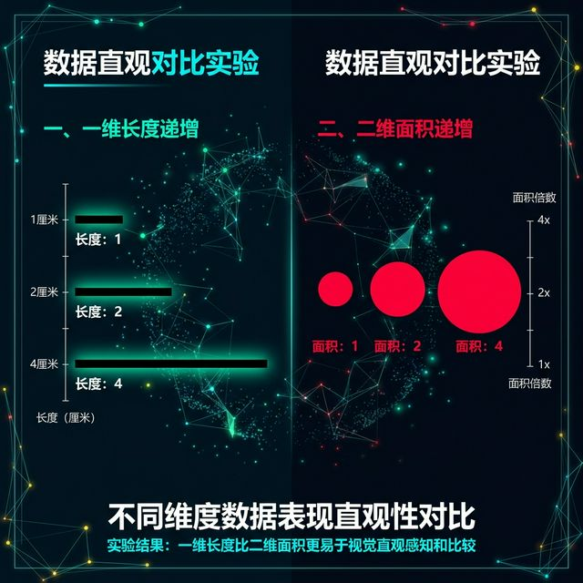
> *   **Layout**: `Split`
> *   **Scene**: 直观的图形对比实验。左半屏：三条黑色的直线，长度分别为 1 厘米, 2 厘米, 4 厘米，呈递增阶梯；右半屏：三个红色的实体圆，面积参数由于计算被严格设定为 1, 2, 4 倍递增。
> *   **Text**: "心理物理学定律：你以为的两倍，真的是两倍吗？"

> [TEACHING MOMENT: 本节路标]
> 上一节我们拿到了通道的阶级排名表——空间位置是王者，面积和颜色垫底。但排名本身不是某位教授的拍脑袋臆想，它是数百万年进化刻进你视神经的**生理物理学铁证**。接下来 25 分钟，我们要做三件事：**①揭露感知精度的谎言** ②**击穿相对判断的盲区** ③**拆解视觉弹出的死亡边界**。掌握了这三道陷阱，你才真正有资格去选择通道——而不是被通道所选。

### 3.1 Stevens 定律实战：诚实长度与撒谎面积

> [VISUAL]
> *   **Slide**: `S05b_Stevens_Power_Law`
> *   **Asset**: 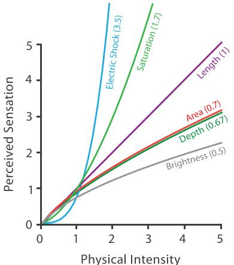
> *   **Resource**: 
> *   **Source**: Textbook
> *   **Layout**: `Split`
> *   **Scene**: 左图展示长度感知曲线——X轴为物理刺激量，Y轴为感知量，曲线呈标准的45度对角线（系数1.0）；右图展示面积感知曲线——同样的坐标系，曲线明显下凹（系数0.7），两条曲线之间的阴影区域标注为"认知盲区"。
> *   **Text**: "Stevens 幂定律：长度是诚实的，面积在撒谎"

请大家盯着屏幕左边。如果线段 A 刚好是线段 B 的两倍长，你的视神经反馈给大脑的信号会判定：A 确实等于 2B。长度通道的感知响应是 1 比 1 的——物理上涨了两倍，你看到的也正好是两倍。在心理物理学中，这被称为 **Stevens 幂定律（Stevens' Power Law）** 中的线性响应——心理学家用“感知系数 1.0”来表述这种“所见即所得”的理想状态。

但现在请看右侧这三个圆。虽然我在后台将最右边圆的面积设定为最左边小圆的数学 4 倍，但如果你凭直觉扫一眼，大部分人的判断会是："这个大圆看起来只比小圆大了一倍半多一点吧。"

这就是通道排名表中面积垫底的**生理铁证**：**人类的神经系统倾向于低估面积和体积的差异**。Stevens 定律测算表明，你的大脑会自动把面积差异打七折——数学上翻了一倍的面积，你感觉只大了七成（心理学家用“感知系数 0.7”来表述这个“打折率”）。而对 3D 体积的压缩更为明显，感知系数低至 0.6 以下。你的大脑看到一个实际变大了十倍的球体，往往只会感觉它变大了六倍。

> [VISUAL]
> *   **Slide**: `S05c_Area_Volume_Illusion`
> *   **Asset**: 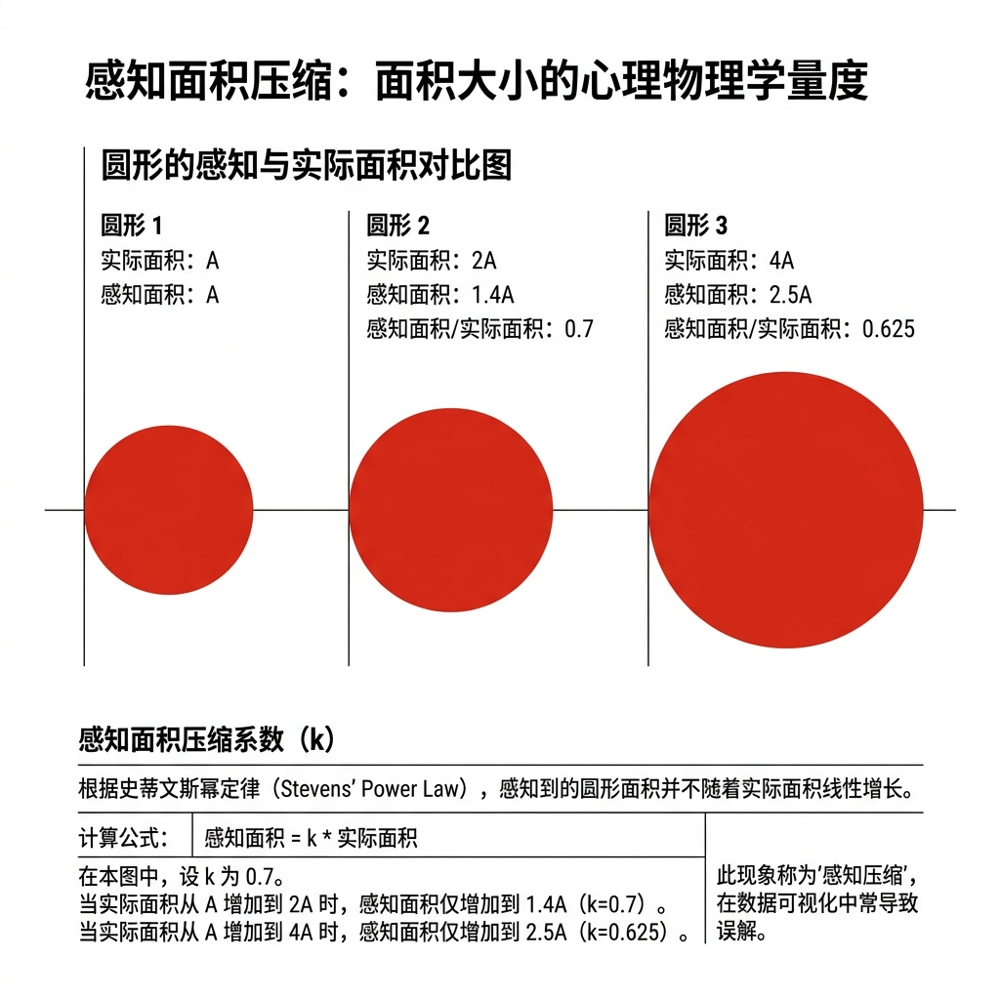
> *   **Layout**: `Full`
> *   **Scene**: 三组红色实体圆的对比展示——上方标注实际面积比 1:2:4，下方用虚线圈出人脑感知的等效面积比约 1:1.4:2.5，两组数字之间用醒目的黄色闪电符号标注"心理压缩系数 0.7"。
> *   **Text**: "Stevens 定律实证：你的大脑在骗你"

这个定律的实战后果是什么？假设你在制作一期关于全球各大洲财富差异的数据新闻，轻率地选择用"金块的 3D 体积"或"地理气泡占据的巨大面积"去直接映射庞大的财富差值——超级富翁和底层平民在图表上的视觉断层，将被读者的大脑自动大幅度**认知压缩**。你以为你客观地呈现了 100 倍的差距，但观众体验到的可能**只有原来的十几二十倍**。在纪实叙事中，由于通道选择不当，你已经在潜意识里造成了**无意识的视觉误导**。

> [VISUAL]
> *   **Slide**: `S05d_Wealth_Bubble_Lie`
> *   **Asset**: 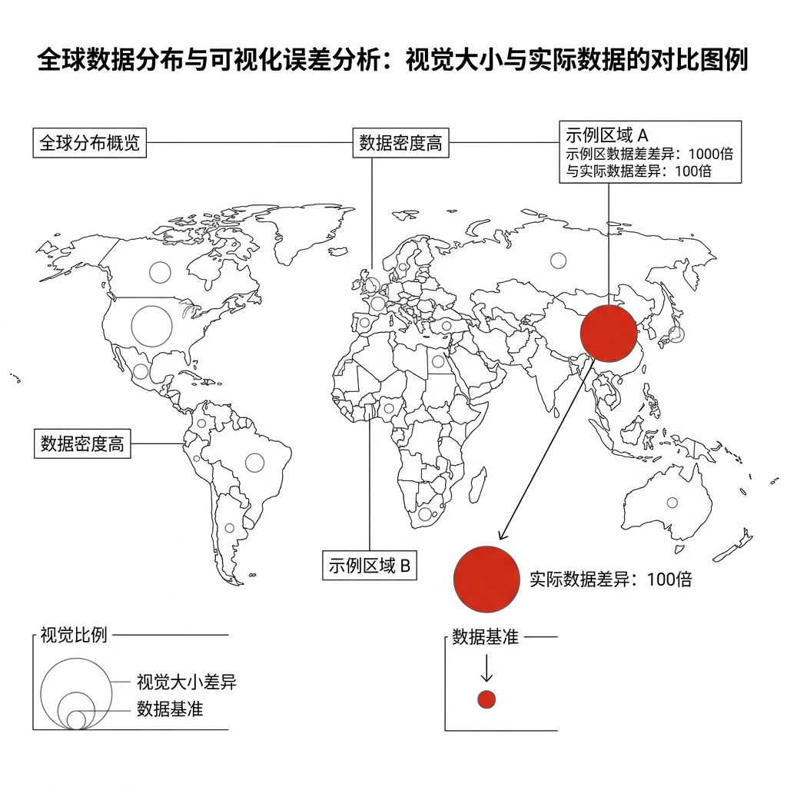
> *   **Layout**: `Full`
> *   **Scene**: 一张全球财富气泡地图案例——最大气泡（代表美国）与最小气泡（代表某发展中国家）之间，用红色标注线分别标出"视觉感知落差：×3"和"真实数值落差：×100"，形成触目惊心的反差警示。
> *   **Text**: "你以为的 3 倍差距，实际是 100 倍——面积通道的认知陷阱"

除了面积被压缩，Stevens 定律还揭示了另一个方向：**饱和度（Saturation）的超线性放大效应**。当颜色饱和度在物理属性上仅仅增加一点，人类的肉眼却会觉得它变得过于刺眼（感知系数 n > 1.0）。这解释了为什么在图表中滥用高饱和纯色去编码微弱数值增量时，整个版面会显得突兀且具有侵略性。

> [VISUAL]
> *   **Slide**: `S01b_Saturation_Trap`
> *   **Asset**: 
> *   **Layout**: `Split`
> *   **Scene**: 双联反差图。左侧是用柔和色阶展示的正常柱状图；右侧是滥用极高饱和度霓虹色编码微弱数值增量的翻车图，画面刺眼且夸张，直观展示“暴走狂飙档”的破坏力。
> *   **Text**: "饱和度的超线性放大效应：不要用高纯色放大微小差异"

所以，**通道不仅有阶级，它们各自的油门灵敏度还完全不一样**——长度是线性的匀速档，面积是迟钝的低速档，饱和度是敏感的高速档。选错了档位，你的信息就会被大脑的感知引擎扭曲。

### 3.2 韦伯定律实战：在盲区里实施视觉手术

刚才 Stevens 定律告诉我们"通道的油门灵敏度各不相同"。现在还有第二道陷阱——即便你选对了通道，数据本身的**基数**也会让感知失灵。

> [VISUAL]
> *   **Slide**: `S02b_Webers_Law_Definition`
> *   **Asset**: 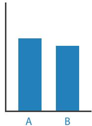
> *   **Resource**: 
> *   **Source**: Textbook
> *   **Layout**: `Center`
> *   **Scene**: 展示韦伯定律的核心公式与直观示意。
> *   **Text**: "韦伯定律：人类感知的是相对差异"

**韦伯定律（Weber's Law）** 告诉我们：人类感知的是两者的**相对百分比差异**，而不是**确切数值差异**。如果长城加高一米，你根本看不出来；但你家天花板加高一米，你会明显觉得房子好宽敞。同样是一米，基数不同，感知天差地别。

> [VISUAL]
> *   **Slide**: `S02b2_Webers_Base_Illusion`
> *   **Asset**: 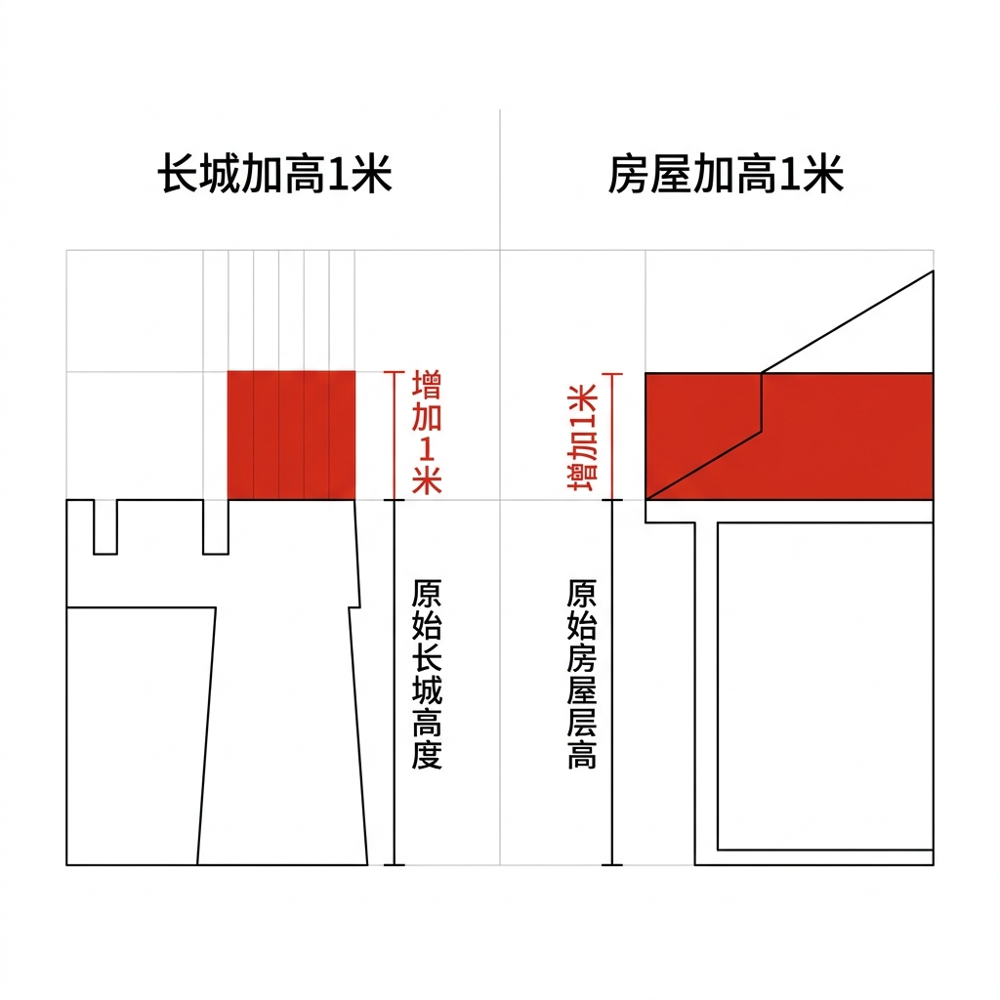
> *   **Layout**: `Split`
> *   **Scene**: 左侧画着长城增加1米的对比（几乎无感），右侧画着天花板增加1米的对比（非常明显）。
> *   **Text**: "韦伯定律：人类感知的是相对差异"

在可视化实战中，这意味着什么？请看大屏幕。假设这两根高大的柱子代表的是某电商巨头双十一的**总交易额（GMV）**。左侧是管理层定下的目标：一万五千亿，右侧是最终的实际业绩：一万五千零一亿。在传统的**常规数值柱状图**中，这一亿的超额业绩由于一万五千亿的巨大底座基数，隐没在了**韦伯盲区**里！老板看了一眼，只会觉得刚好达标，没有惊喜。

> [VISUAL]
> *   **Slide**: `S05e_Weber_Diverging_Bar`
> *   **Asset**: 
> *   **Resource**: 
> *   **Source**: Textbook
> *   **Layout**: `Split`
> *   **Scene**: 左半屏：两根近乎等高的巨大柱子（标注“目标: 15000 亿”和“实际: 15001 亿”），顶部差异肉眼难辨，上方用红色虚线框标注“韦伯盲区”；右半屏：切换为发散性误差偏离图，以 15000 亿的目标值为零点基线，那一亿的超额业绩被显著放大为清晰可见的偏差条。整体风格为商业数据新闻设计感，而非教材学术图。
> *   **Text**: "破局韦伯盲区：用发散图放大微小差异"

作为高阶分析师，你的**破局手段**是什么？果断舍弃硬性坐标！将 15000 亿的战略目标设定为水平中部的 0 点基线，构建**发散性误差偏离图**。瞬间，那个原本难以察觉的 1 亿超额业绩，就会被显著放大为一根清晰可见的偏差条柱。这不仅是图表技巧，更是分析思维的体现——**永远追问：我的基线在哪里？**

除了韦伯定律带来的**数值基数**盲区，还有一种更隐蔽的相对判断——**物理环境的色彩劫持**（色彩恒常性）。

> [VISUAL]
> *   **Slide**: `S05f_Checker_Shadow_Illusion`
> *   **Asset**: 
> *   **Resource**: 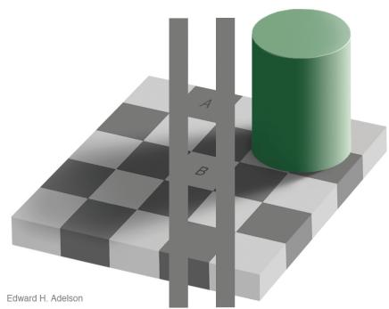
> *   **Source**: Textbook
> *   **Layout**: `Split`
> *   **Scene**: 左侧展示经典的阴影棋盘错觉图，A格（位于亮部看似深灰色）和B格（位于阴影中看似浅灰色）分别被明显标出；右侧是用一条纯色带连接A格和B格，证明它们在色值上是完全相同的纯灰度颜色。
> *   **Text**: "环境的相对判断：色彩被阴影劫持"

请看这幅经典的**阴影棋盘错觉（Checker Shadow Illusion）**——你眼中不同的 A 格与 B 格，其实它们的 RGB 物理底色处于同一色值。仅仅因为旁边站着不同明暗格子与那片阴影，你的大脑就会认定其中一个格子比另一个深得多！

当我们用一条纯色带把它们连接起来时，谎言不攻自破。这种"**色彩被相对视觉环境劫持**"的特征要求我们：在运用色彩编码关键数据时，所有比较的**底层背景环境**务必保证高度统一、纯净且客观！

> [ACTIVITY]
> *   **Type**: `QA`
> *   **Duration**: `1min`
> *   **Desc**: **快速检验理解：韦伯定律破局**。提问："如果要对比某万亿级电商巨头今年与去年的微小利润差异，应该用什么图表？为什么直接用传统柱状图对比会失效？"（预期答案：发散性误差偏离图/重置去年的利润为零点基线——因为韦伯定律告诉我们，巨大的基数会让微小差异隐没在感知盲区中）。

### 3.3 视觉弹出的死亡边界：从闪电直击到地毯搜索

Stevens 揭露了精度陷阱，Weber 揭露了盲区陷阱。第三道陷阱更加隐蔽——它不在数值精度上，而在**注意力机制**上。还记得第一周我们提到过，人类视觉系统底层有一套不需要意识参与的"自动扫描雷达"吗？它能在几十毫秒内完成对整个画面的并行扫描——这就是**前注意处理（Pre-attentive Processing）**。

> [VISUAL]
> *   **Slide**: `S06_Visual_Popout_Failure`
> *   **Asset**: 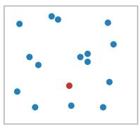
> *   **Resource**: Textbook
> *   **Layout**: `Grid`
> *   **Scene**: 展示一系列前注意处理的极限压力测试。
> *   **Text**: "**Visual Popout（视觉弹出）** 的死亡边界与结合检索陷阱"
> *   **List**:
> *     - 颜色特征检索: 秒级弹出
> *     - 形状特征检索: 秒级弹出
> *     - 结合检索 (颜色+形状): 认知瘫痪

请看大屏幕四个象限的测试：
- **左上**：上百个蓝色实心圆中，唯一一个红点——你的眼球瞬间锁定。不管画面里有 10 个还是 10,000 个干扰蓝点，发现红点的时间几乎恒定。这就是 **Visual Popout（视觉弹出）**，它是由视网膜底层大规模并行计算处理完成的，就像一块 GPU 显卡同时处理所有像素。
- **右上**：一堆蓝色方块中，混入一颗蓝色圆圈——同样秒级弹出。
- **左下**：蓝色圆形与红色方块按随机网格大量混合——干扰增加，开始费眼。
- **右下**：终极挑战——在蓝圆 + 红方的混合阵列中，找出唯一一颗**红色的圆形**。

> [VISUAL]
> *   **Slide**: `S06b_Conjunction_Search_Demo`
> *   **Asset**: 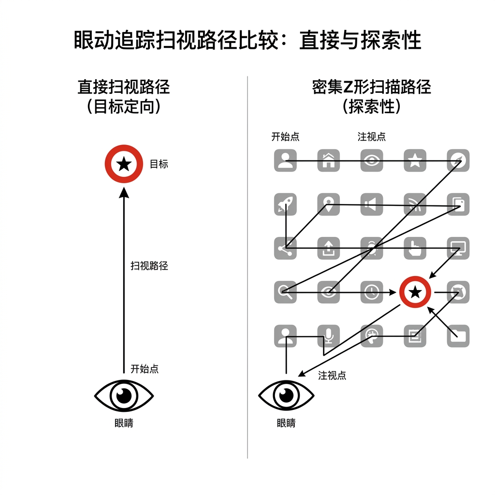
> *   **Layout**: `Full`
> *   **Scene**: 模拟眼球轨迹扫描路径的对比动线图——左侧"特征检索"模式下眼球直接跳到目标（一条直线箭头）；右侧"结合检索"模式下眼球被迫逐个扫描（密密麻麻的 Z 字形折线路径）。
> *   **Text**: "从闪电直击到地毯搜索——结合检索的代价"

右下角发生了什么？突然之间，你大脑里的"超级显卡"宕机了。你失去了并行计算的能力，退化到了老式的单线程串行模式。你必须强迫眼球挨个扫过每一个图形："这个是红的，不对，是方的；这个是圆的，不对，它是蓝的……"

认知心理学将这种现象称为**结合检索（Conjunction Search）**。当观众被要求同时匹配两个通道属性时，前注意处理的并行弹出机制失效，大脑切换为逐点扫描的串行模式，认知耗时呈线性增长。

> [VISUAL]
> *   **Slide**: `S04b_Conjunction_Search_Cost`
> *   **Asset**: 
> *   **Resource**: 
> *   **Source**: Textbook
> *   **Layout**: `Split`
> *   **Scene**: 左侧是分离的通道组合（位置+色相），右侧是融合的通道（高度+宽度被感知为整体面积）。
> *   **Text**: "通道的分离与融合"

为什么多特征检索会让人脑宕机？这涉及通道底层的物理结构——有些通道天生就无法分开。这就是**可分离性（Separability）与融合性（Integrality）**。

比如你使用**位置 + 色相**（在散点图右上角放一个红色的点），这是非常优秀的**可分离通道组合**。你的大脑可以顺畅地分别读取："这是一个利润较高（位置右上）的电子产品类别（红色）。"但如果你使用**宽度 + 高度**呢？你的底层视神经会直接将一维的宽度和高度粗暴融合为一个二阶面积属性——"这就是一个大块头！"你很难再逆向拆解出它精确的宽高比例了。

所以请记住铁律：**视觉弹出效应非常强大，但每次你只能使用一种独立的首要特征！** 

这里有一个容易混淆的陷阱：如果你把同一个核心数据（比如销售额）**同时**用红色和巨大的圆形表现，这叫**冗余编码**，是好设计，它能强化信息！但如果你为了让图表显得"丰富"，试图用红色代表性别，用大小代表年龄，用形状代表地区（妄图让不同变量强占不同的特征），你的观众的大脑就会产生认知过载。

过度的多变量结合检索会导致弹出机制失效，图表的可读性将下降。给所有设计师的核心建议是：**克制**。这类多通道叠加是你未来需要**识别和避免**的反面模式，不要求你现在能动手实现。

> [ACTIVITY]
> *   **Type**: `QA`
> *   **Duration**: `1min`
> *   **Desc**: **应用题：结合检索陷阱**。提问："在用户画像散点图中，如果你同时用形状代表性别（圆形/三角形）、用颜色代表年龄段（蓝色/红色）。当老板让你立刻找出所有的‘年轻女性’（红色三角形）时，你的视觉体验会发生什么？"（预期答案：视觉弹出效应失效。大脑会被迫进入逐点扫描的‘结合检索’模式，在所有的红色干扰物和三角形干扰物中费力筛选，耗时大幅增加）。

### 3.4 颜色：最危险的通道

既然弹出效应依赖单一通道，而颜色又是弹出效果最强烈的身份通道之一——那颜色岂不是万能的？恰恰相反，颜色是所有通道中**具有挑战性的**。它拥有极强的视觉吸引力，但也伴随诸多使用限制。

> [VISUAL]
> *   **Slide**: `S06c_Color_Section_Header`
> *   **Asset**: 
> *   **Layout**: `Center`
> *   **Scene**: 章节转场画面——深邃黑色背景上，一滴鲜红的墨水正在缓慢扩散开来。画面中央以冷峻的无衬线字体写着标题。
> *   **Text**: "颜色：最危险的通道"

#### 3.4.1 三大色阶与适用边界

> [VISUAL]
> *   **Slide**: `S06d_Three_Colormaps`
> *   **Asset**: 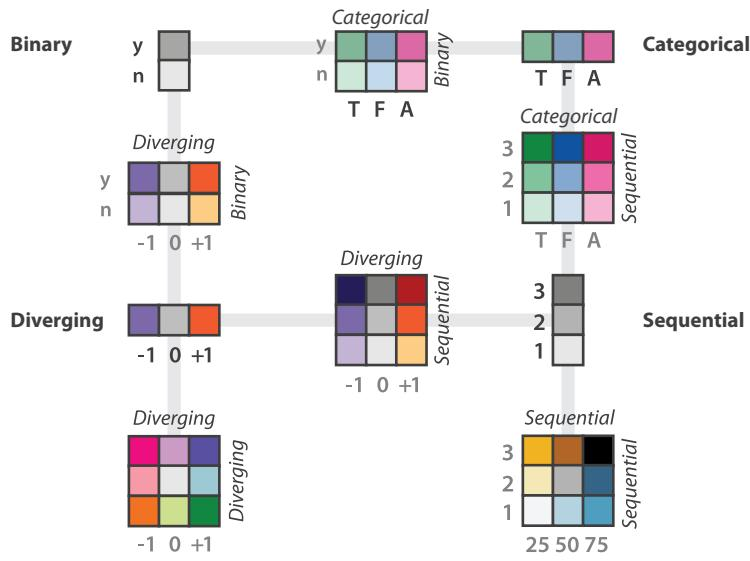
> *   **Resource**: 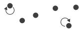
> *   **Source**: Textbook
> *   **Layout**: `Grid`
> *   **Scene**: 三列并排展示色阶类型：左列为顺序色阶（从淡天蓝渐变到深海军蓝，下方标注"单向强度"）；中列为发散色阶（暗蓝→白灰→深红，中间标注零点基线）；右列为分类色阶（7个离散独立色块，下方标注"≤7-8种"警告）。
> *   **Text**: "Munzner Ch10: 三大色阶适用边界"
> *   **List**:
> *     - 顺序色阶 (Sequential)
> *     - 发散色阶 (Diverging)
> *     - 分类色阶 (Categorical)

Munzner 在教材第十章中将颜色的使用严格剥离为三大色阶类型：

1. **顺序色阶（Sequential）**：从浅到深的单向渐变，专用于表达**从低到高的纯粹量化强度**。例如各省人均收入热力图。
2. **发散色阶（Diverging）**：从冷色穿越中性白/灰到暖色，专用于表达**围绕基准零点的对称偏差**。例如企业盈亏或全球气温异常偏移。用错意味着隐没了基线的震慑力。
3. **分类色阶（Categorical）**：由离散独立色相组成，专用于**无内在排序的标签归属暗示**。注意：受短时工作记忆限制，分类数**不应超过 7-8 种**，否则视觉混淆难以避免。

#### 3.4.2 彩虹禁忌：明度断层的视觉假象

> [VISUAL]
> *   **Slide**: `S07b_Rainbow_Colormap_Trap`
> *   **Asset**: 
> *   **Resource**: 
> *   **Source**: Textbook
> *   **Layout**: `Split`
> *   **Scene**: 展示彩虹色阶中黄青过渡区造成的伪边界。
> *   **Text**: "禁忌：彩虹色阶的明度断层"

还有一个让许多非设计背景的使用者甚至软件默认设置频频翻车的雷区：**彩虹色阶（Rainbow Colormap）**。在红黄绿青蓝的光谱排列中，人眼对黄色和青蓝过渡区段的**明度感知极不均匀**，会人为地在画面中制造出底层数据根本不存在的"断层伪边界"。

> [STORY TIME: 为什么科学界封杀了彩虹色阶]
> 长期以来，气候学家在使用彩虹色阶绘制海温图时，反复发现地图上出现强烈的"异常温度断层"边界。排查证实这些断层纯属色阶明度不均匀产生的**视觉假象**——数据本身是连续平滑的，只是黄色与青蓝色交界处的亮度突变欺骗了人眼。此类事件是推动感知均匀色阶 **Viridis**（由 Stéfan van der Walt 与 Nathaniel Smith 设计，2015 年成为 Matplotlib 默认色阶）诞生的重要背景。从此，"避免使用彩虹色阶"成为了数据科学界的重要原则。

#### 3.4.3 人道防线：8% 的人看不见你的红绿

> [VISUAL]
> *   **Slide**: `S06e_Accessibility_ColorBrewer`
> *   **Asset**: 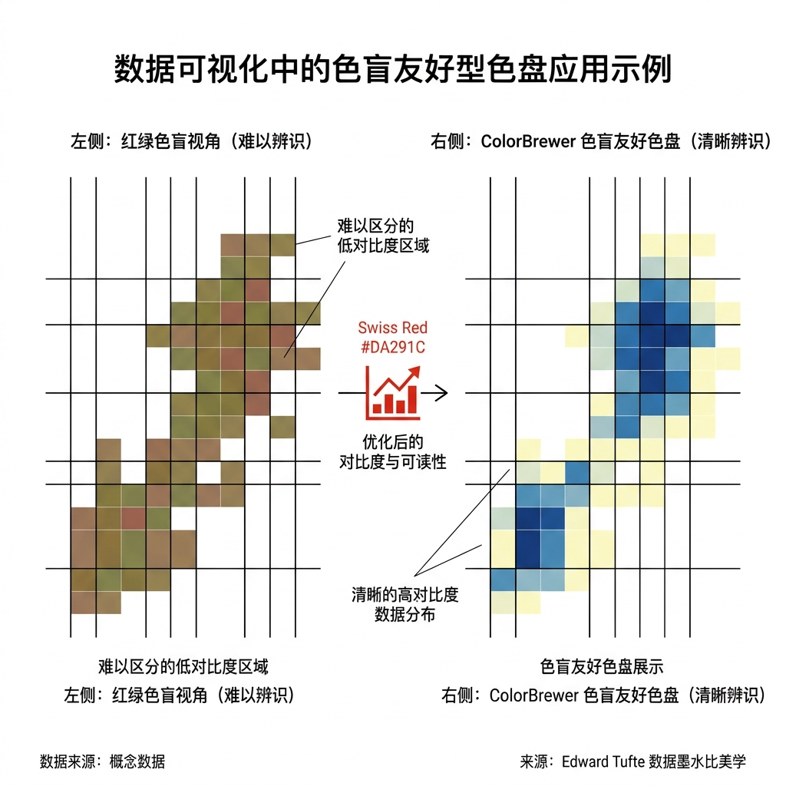
> *   **Layout**: `Split`
> *   **Scene**: 左半屏展示同一张热力图在红绿色盲模拟滤镜下的失效效果；右半屏展示应用 ColorBrewer 无障碍调色板后的清晰效果，分别标注"8% 男性看到的世界"和"无障碍设计后的世界"。
> *   **Text**: "色觉缺陷不是少数人的问题——它是设计师的职业道德底线"

全球大概有近 8% 的男性存在一定程度的红绿色觉缺陷。如果在灾情预警的可视化设计中，你仅仅依靠红色和绿色去区分安全与危险信息，那几千万观众将无法获取求生指南。

请看大屏幕上这组**色盲模拟对比**。左边这张模拟了红绿色盲滤镜的气象预警图中，高饱和度的红色预警与绿色草原变成了一片难以分辨的暗褐色块。右侧引入了 **ColorBrewer 安全色阶**后，深蓝与苍黄的明度落差完美扛起了区分重任。

> [VISUAL]
> *   **Slide**: `S06f_ColorBrewer_Simulator_Tools`
> *   **Asset**: 
> *   **Layout**: `Grid`
> *   **Scene**: 上方展示 ColorBrewer 网站界面勾选"colorblind safe"选项；下方展示色盲滤镜模拟器插件界面。
> *   **Text**: "防雷神器：ColorBrewer 与色盲模拟器"
> *   **List**:
> *     - 开启色盲安全验证
> *     - 插件执行一键单色检查

> [TEACHING MOMENT: 工具约束与底线操守]
> 今后出入任何项目组，请将 **ColorBrewer (colorbrewer2.org)** 加入硬性依赖白名单。构建分类或发散色阶时，只需勾选"colorblind safe"，它会直接输出经过验证的安全色域。
> 同时，请在 Figma 或浏览器中安装色盲模拟器插件。养成交付前主动切换色盲视角的职业习惯——如果在褪去彩色伪装的单色通道里，你的图表依然能让人清晰读懂数据逻辑，你才算完成了一件合格的作品。

> [TEACHING MOMENT: 带走三件事]
> 这一节我们拆解了通道排名背后的三道认知陷阱：**Stevens 定律**告诉你面积在撒谎、饱和度在暴走；**韦伯定律**告诉你巨大基数会吞噬微小差异，必须重置基线破局；**视觉弹出**告诉你单通道是闪电，多通道叠加是泥潭。而颜色——这个最诱人的通道——拥有三大色阶边界、彩虹禁忌和 8% 人群的无障碍红线。记住：**克制，是通道大师的第一美德。**

接下来，我们将从"选对通道"走向"删减噪声"——Edward Tufte 的数据墨水比法则，将教你用外科手术刀般的精准，剔除图表中一切不为数据服务的视觉垃圾。

**(Pause: 3s)**

---

