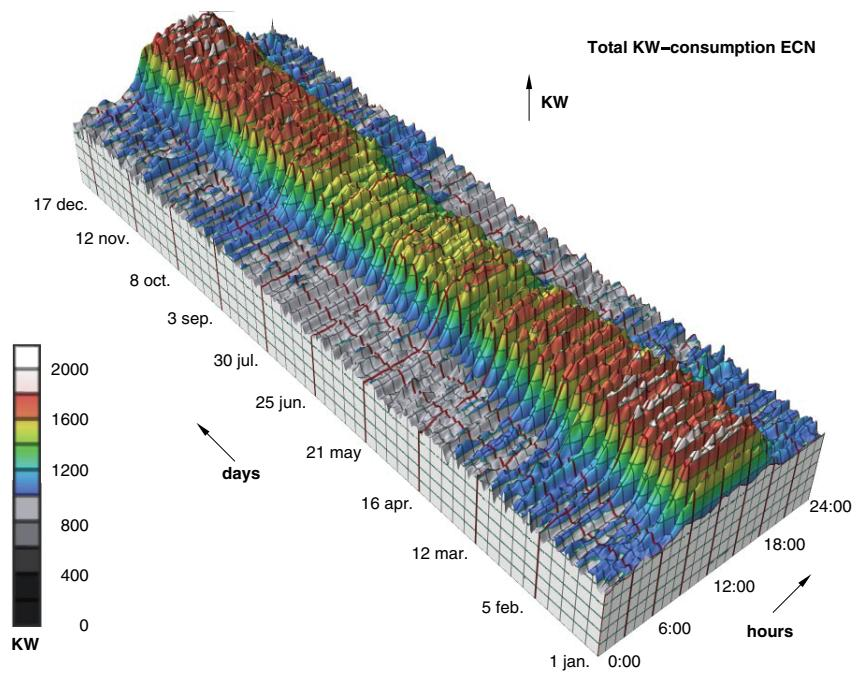
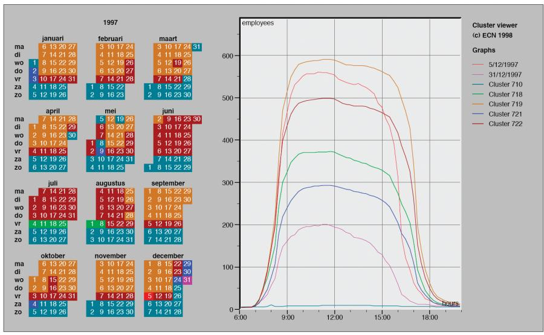

## Module 4: 删减的艺术——数据墨水与抵制伪 3D 的诱惑 (45 分钟)
<!-- BUDGET: 2700 chars | SLIDES: ≥5 | STATUS: done -->

> [VISUAL]
> *   **Slide**: `S07_Data_Ink_Ratio`
> *   **Asset**: 
> *   **Layout**: `Split`
> *   **Scene**: 呈现一幅强烈的"断舍离"式对照画面。左侧是一个带有巨大 3D 深度的厚重饼图，图表后方漂满黑色的加粗网格线，甚至刻意增加了投影光晕与华丽渐变背景。右侧则是剥离一切伪装后，用克制的细线及浅灰作为辅色、仅以纯色主体高亮数据走势的极简当代设计。
> *   **Text**: "黄金法则：**Data-Ink Ratio（数据墨水比）**"

### 4.1 视觉断舍离：无情删减的数据墨水法则

信息设计界有一位泰斗级人物，Edward Tufte。他在 1983 年撰写了《定量信息的视觉展示》。在其中，他提出了一个至今仍然被数据团队奉为圭臬的概念：**数据墨水比（Data-Ink Ratio）**。

大家请看大屏幕上这幅强烈的左右对照画面。左侧那个充斥着重度 3D 投影、粗黑网格背景和渐变光晕的厚重图表，正是 Tufte 极力反对的反面教材；而右侧，剥离了虚假的三维伪装，仅仅使用极简细线和纯色高亮核心数据走势，展现出冷峻的精算设计之美。

> [VISUAL]
> *   **Slide**: `S01b_Edward_Tufte_Intro`
> *   **Asset**: 
> *   **Layout**: `Center`
> *   **Scene**: Edward Tufte 经典著作《定量信息的视觉展示》封面及其极简哲学名言。
> *   **Text**: "数据可视化先驱：Edward Tufte"

所以它的定义非常冷酷无情：
**图表中用于绘制核心数据的墨水总量 / 打印整张图表所耗费的总墨水总量 = 数据墨水比**。
这个除法得出的数值，应当**尽可能高**——这意味着你正在铁腕剔除一切不为数据服务的视觉噪声。但请注意，它的终极目标并非盲目追求数学极限上的理想 1.0。因为在真实的受众场景中，某些看似"非数据"的元素（如辅助参考线、关键标注、冗余色彩编码）恰恰承担着降低读者认知负荷的关键使命。

Semantic Scholar 上多项认知科学实证研究已表明：**过度删减反而会增加认知负荷**，而在简单数据集中适度保留的 Chartjunk 甚至能提升信息记忆度。所以，DIR 的正确追求是：**尽可能高，但底线永远是可读性与任务完成度**。

> [VISUAL]
> *   **Slide**: `S07b_DataInk_Formula`
> *   **Asset**: 
> *   **Layout**: `Center`
> *   **Scene**: 画面中央以超大号字体展示公式 "Data Ink ÷ Total Ink → 1.0"，下方配以一条从 0 到 1 的渐变进度条，左端标注"全是垃圾"（深红），右端标注"纯净"（翠绿），当前指针停在约 0.85 位置，旁边标注"优秀设计的起点"。
> *   **Text**: "数据墨水比：一个公式统治所有图表"

换个更通俗的说法解释：此时此刻幻灯片上印出的每一滴墨水、屏幕上亮起的每一个数字或 CSS 渲染出的每一个像素，都必须且仅为了**展示数据波动本身**而服务。否则，它就是一种视觉污染，Tufte 将之称为**图表垃圾（也就是 Chartjunk）**。

Tufte 给出的操作规范就是**无情地删减（Erasing）**：
如果你擦掉图表上的某个装饰性元素（比如这厚黑粗壮的主坐标轴内边框、这无任何实际意义为了好看而上的背景渐变大阴影，或是那些横贯画面、每一格都显得多余的次级背景辅助线），擦除之后你发现，这份图表传达的数量大小与趋势信息并没有发生哪怕一丝一毫的折损减少——那就**果断删掉它**，不要有半点犹豫！

> [VISUAL]
> *   **Slide**: `S07c_Erasing_Steps`
> *   **Asset**: 
> *   **Layout**: `Grid`
> *   **Scene**: 四宫格渐进式删减演示：①原始图（满版装饰、厚边框、背景渐变、密集网格线）②擦除外边框 ③擦除背景网格线 ④最终极简版（仅剩纯净的数据走势线与最少量的标注文字），每一步都用红色虚线圈出被删减的元素。
> *   **Text**: "Tufte 的删减四步法：擦掉一切不传达数据的墨水"
> *   **List**:
> *     - 1. 原始图 (图表垃圾堆积)
> *     - 2. 擦除无意义外边框
> *     - 3. 擦除沉重网格线
> *     - 4. 最终极简数据走势

> [VISUAL]
> *   **Slide**: `S02b_Four_Chartjunks`
> *   **Asset**: 
> *   **Layout**: `Grid`
> *   **Scene**: 四宫格展示四大图表垃圾：粗黑网格线、渐变底色、冗余边框、伪三维立体。
> *   **Text**: "Tufte 抨击的图表垃圾四大常客"
> *   **List**:
> *     - 1. 沉重网格线
> *     - 2. 无意义底色
> *     - 3. 冗余边框
> *     - 4. 伪三维立体

具体来说，Tufte 在书中抨击的图表垃圾有四大常客：
第一是**沉重网格线**。网格线应该只是若有若无的背景音。但在新手作品中，它们常常又粗又黑密集交织，变成了囚禁数据曲线的铁笼。试着把网格线改为低透明度虚线，释放图表的**呼吸感**。
第二是**无意义底色**。很多同学害怕画面"空"，喜欢给图表加上渐变背景。这不仅不能增加严谨度，反而会稀释**核心数据走势**的对比度。
第三是**冗余边框**。一个折线图外部没必要再套上厚重的矩形边框，屏幕本身就是天然的**物理边界**。
第四是**伪三维立体**。这是我们接下来要重点讨论的灾难区。

> [VISUAL]
> *   **Slide**: `S07c2_Excessive_Minimalism`
> *   **Layout**: `Center`
> *   **Scene**: 一张被删减得只剩下一条起伏曲线的图表（连坐标系和刻度都删了），就像飘在空中的一根风筝线，让人完全无法判断数值大小和意义。
> *   **Text**: "警惕：过度删减导致视觉锚点丧失"

当然，删减法则也有它的边界。我必须警告大家警惕**过度的极简主义**！如果为了追求留白而擦掉了所有刻度和参考线，读者将瞬间失去**视觉锚点**。起伏的折线变成了无根之水，图表将丧失可读性。

### 4.2 认知护城河：必要冗余下的心智底线

> [VISUAL]
> *   **Slide**: `S07c3_Redundancy_Defense`
> *   **Layout**: `Split`
> *   **Scene**: 左侧显示在复杂噪音背景下，一条加粗并带有高亮阴影轮廓的主数据线（必要冗余）；右侧则是在纯净背景下的一条极细数据线。说明不同环境需要不同的冗余策略。
> *   **Text**: "认知护城河：建立必要的冗余"

> [TEACHING MOMENT: 必要冗余——DIR 的辩证法]
> 我们必须诚实地面对一个事实：Tufte 的数据墨水比诞生于 1983 年的印刷时代，当时油墨有物理成本。但在今天的屏幕时代，"墨水"几乎零成本，而**读者的认知带宽（也就是 Cognitive Bandwidth）才是真正稀缺的资源**。
> 认知科学家 Bateman 等人在 2010 年发现：在简单数据集中，保留一定程度的视觉装饰非但没有降低效率，反而显著提升了读者对数据的**长期记忆度**。瑞士研究团队也指出：对关键数据点添加的冗余标注——虽然在纯数学意义上降低了数据墨水比——却能在高噪声环境下为读者提供**认知锚点**，实质上加速了信息获取。
> 所以，我们在这间教室里建立的准则不是"DIR = 1.0 = 完美"，而是：**DIR 应尽可能高，但底线永远是可读性与受众的任务完成度。必要的冗余不是垃圾，它是为特定受众精心设计的认知辅助。**

> [VISUAL]
> *   **Slide**: `S07c4_Cognitive_Bandwidth_Metaphor`
> *   **Asset**: 
> *   **Layout**: `Center`
> *   **Scene**: 一个沙漏或者管道隐喻，表示读者的“认知带宽”是极其有限且宝贵的资源，而“屏幕墨水”则是廉价的。
> *   **Text**: "DIR 辩证法：认知带宽才是真正的稀缺资源"

所以在真正的工程实践设计中，我们要的是数据墨水比尽可能高的克制美德，但不能为了追求删减的视觉快感而盲目删减，从而导致作品跌破那条名为【可读性】的及格生命底线。

判断一个元素该不该删的终极标准，不是"它是否是数据本身"，而是**"删掉它之后，我的目标受众完成分析任务的速度和准确度是否受损？"**如果答案是肯定的——留下它，哪怕 Tufte 本人站在你面前也不要犹豫。

> [ACTIVITY]
> *   **Type**: `QA`
> *   **Duration**: `1min`
> *   **Desc**: **快速检验理解：可读性底线**。提问：“如果为了把数据墨水比提升到 1.0，我们直接把折线系的 Y 轴坐标刻度完全抹掉，这符合 Tufte 的原则吗？”（预期答案：不符合，过度删减会导致读者丧失视觉锚点，底线是任务完成度）。

### 4.3 虚假深渊：伪3D透视造成的造假掩饰

> [VISUAL]
> *   **Slide**: `S07d_3D_Pie_Sins`
> *   **Asset**: 
> *   **Source**: `AI_Gen`
> *   **Resource 1**: 
> *   **Resource 2**: 
> *   **Layout**: `Split`
> *   **Scene**: 列表式展示 3D 饼图三宗罪，每条配以简洁示意图：①Occlusion（遮挡）——前方扇区投影吃掉后方数据；②Perspective Distortion（透视失真）——近大远小导致比例骗局；③深度算力浪费——大脑被迫反推真实角度。
> *   **Text**: "3D 饼图的三宗罪"
> *   **List**:
> *     - 第一宗: Occlusion（遮挡）
> *     - 第二宗: Perspective Distortion（透视失真）
> *     - 第三宗: 深度感知算力浪费

> [CASE STUDY: 3D 饼图与无根据阴影的三宗罪]
> 在所有的低效设计中，对于掌握 3D 渲染能力的同学来说，最容易掉进的陷阱就是盲目追求"立体炫酷"。最典型的反面案例，就是**加厚版的 3D 饼图**。
> 我们来根据刚才学过的理论，历数一下滥用 3D 图形的几大罪状：
> 
> 首先，第一宗罪是**遮挡（也就是 Occlusion）**。前方数据的立体厚度投影，会严严实实地挡住后方较小的扇区数据。真实的信息就这样在华丽的灯光下凭空蒸发了。

> 
> 其次第二宗罪，叫**透视失真（也就是 Perspective Distortion）**。在带有俯视视角的透视中，如果一个占据 10% 份额的小切片被放置在镜头最前端，由于近大远小原理和厚度加持，它看起来可能比位于远端占据 30% 份额的切片还要庞大。这在财务报表或新闻传播上，等同于利用视觉错觉实施数据误导！
> 
> 第三，它无故消耗人类宝贵且并不怎么精准的深度感知脑算力。你逼迫你的观众把脑力浪费在反向推算透视变形前的真实扇形夹角角度上。

所以，在学术界，Munzner 教授所列的八大经验法则中，第一条铁律也是核心原则便是：**No Unjustified 3D（没有正当理由，不使用虚假 3D）**。

这就是**数据伪装的底线**。除非你正在展示波音客机的物理气流分布，否则，在处理金融或社会等无实际三维结构的数据时，试图用厚重的 3D 阴影来堆砌"高大上"是不专业的。**不应使用无意义的立体透视**。

> [VISUAL]
> *   **Slide**: `S07e2_Justified_3D_Example`
> *   **Layout**: `Split`
> *   **Scene**: 左侧是一个表示金融数据的伪 3D 柱状图（被打红叉），右侧是波音客机的物理气流 3D 分布图（被打绿勾）。
> *   **Text**: "什么是'有正当理由的 3D'？"

### 4.4 架构金线：眼动战胜记忆与黑白试炼

除了向虚假 3D 猛烈开火，Munzner 的八大人机交互法则中还有几根核心原则，贯穿了当代最顶级企业与科研机构的设计规范标准：

> [VISUAL]
> *   **Slide**: `S07d2_Eyes_Beat_Memory`
> *   **Asset**: 
> *   **Layout**: `Split`
> *   **Scene**: 左侧是需要不断来回翻页才能看完的四张跨屏单线趋势图，下方标注“大脑缓存仅几秒，逐渐流失”；右侧是直接并排铺开的四宫格小多图 (Small Multiples)，观者视线只需横向微小移动即可瞬间完成全局比对。
> *   **Text**: "法则二：Eyes Beat Memory（眼动战胜脑记）"

其一是大家屏幕上看到的 **Eyes Beat Memory（眼动战胜脑记）**。如果你的数据洞察涉及到几组复杂的时间趋势对比，永远不要像左侧那样把它们拆分到需要不断翻页的多张幻灯片上。因为人类的短时视觉工作记忆缓存只有区区几秒钟，一旦翻到下一页，前一页的波峰波谷细节就会在脑海中消散。你必须像右侧案例一样，在同一个物理画幅内，使用高密度的**小多图并置（也就是 Small Multiples）**排版。让用户的眼球只需微微左右平移，就能在同一视野内看清所有数据曲线的对比关系。

> [VISUAL]
> *   **Slide**: `S07d3_Black_and_White_Test`
> *   **Asset**: 
> *   **Layout**: `Split`
> *   **Scene**: 左侧是一张绚丽刺眼但色层混乱的高饱和度彩图；右侧是给该图执行一键去色提取后展现出的黑白灰阶图，图中原本依靠红绿色差强行区分的关键分类由于明度非常接近，在灰阶下融成一团难以辨认的灰度，上方印有一个醒目的“FAIL”红色印章。
> *   **Text**: "法则三：Get It Right in BW（黑白炼狱测试）"

其二是 **Get It Right in Black and White（黑白炼狱测试）**。这是一手能检验基础设计是否扎实的测试。当你对着屏幕上色彩斑斓的图表沾沾自喜时，请试着按下一键去色的黑白滤镜。如果图表褪去色彩后，你原本试图用红绿高亮突出的关键数据，因为明暗对比度不足而与四周的浅灰色杂音糊成一团……那么你必须承认：之前的颜色调配只是掩盖了基础视觉层级薄弱的粉饰。优秀的图表，在褪去所有色彩的黑白灰阶下，依然能够清晰地向读者传达视觉重点。这才是真正的工程硬骨。

> [VISUAL]
> *   **Slide**: `S07d4_Function_Resolution`
> *   **Asset**: 
> *   **Layout**: `Split`
> *   **Scene**: 左侧展示"功能优先"：一个标签清晰、坐标精确的极简折线图 vs 一个炫酷但难以阅读的赛博朋克风图表；右侧展示"分辨率优先"：4K 高密度平面仪表盘 vs 低分辨率发糊的 VR 数据头显。
> *   **Text**: "法则四与五：功能优先与分辨率至上"
> *   **List**:
> *     - Function First（功能优先，形式其次）
> *     - Resolution over Immersion（分辨率至上）

其三是 **Function First, Form Next（功能优先，形式其次）**。不要把它当成提交丑陋图表的免死金牌！它的真谛是：如果连图表的精确坐标系和标签可读性都没有保住，去叠加任何花哨的生成艺术形式都是本末倒置。只有在功能被坚实守住的极简地基之上，形式的美感才能真正发挥作用。

其四是 **Resolution over Immersion（信息分辨率大于沉浸感）**。现在市面上流行用 VR 头显去观看三维数据流。但请面对现实痛点：目前的头显设备往往受限于像素密度。你原本可以在 4K 巨幕上，一眼看尽上万个散点数据，而在低分辨率的沉浸设备中，你连坐标刻度都无法聚焦看清。所以在海量数据检阅面前，高清晰度的二维平面显示，目前依然凌驾于任何虚幻的三维沉浸噱头之上。

> [DID YOU KNOW: Tufte 的"最少即最多"哲学]
> Edward Tufte 被称为"数据可视化的达芬奇"。他自费出版了四本经典著作——因为没有出版社敢赌——结果大卖超 200 万册。他的核心哲学只有六个字："Above all else, show the data." 在他位于康涅狄格州的私人领地上，他亲手设计了一座雕塑花园，其中每件作品都是"用最少的材料传达最多信息"的物理隐喻。

> [VISUAL]
> *   **Slide**: `S07e_No_Unjustified_3D`
> *   **Asset**: 
> *   **Source**: `AI_Gen`
> *   **Resource 1**: 
> *   **Resource 2**: 
> *   **Layout**: `Split`
> *   **Scene**: Munzner 经典引言卡片——画面中央用大号无衬线字体展示 "No Unjustified 3D"，背景是一个被巨大红色叉号划掉的厚重 3D 饼图残骸，四周散落着被"删减"击碎的阴影碎片。
> *   **Text**: "Munzner 铁律第一条"

请牢记屏幕右侧 "No Unjustified 3D" 的箴言。这是可视化领域必须坚守的**设计底线**。画面中被划掉的 3D 饼图暴露了华丽阴影下**立体遮挡**的隐患。当你们试图堆砌景深来满足炫技心理时，后方关键的数据变数已被物理抹除。数据不允许被虚假的**美学包装**所掩盖。

### 4.5 驾驭恶龙：给AI实施极简减噪除垢手术

> [ACTIVITY]
> *   **Type**: `Workshop`
> *   **Duration**: `30min`
> *   **Desc**: **"逼迫 AI"——大模型提示词抗震压力测试。**
> 
> **执行流程与具体指导台词**：此工作坊旨在揭秘当前市面上 LLM（大语言模型）在生成代码时的常见审美陷阱与降维打击操作法。

> [VISUAL]
> *   **Slide**: `S07f_AI_Prompt_Battle`
> *   **Asset**: 
> *   **Layout**: `Split`
> *   **Scene**: 双屏对比画面。左屏显示“对照组”充满外行口语的短提示词与它生成出的带有阴影和网格线的丑陋 3D 柱状图；右屏显示“核心组”的结构化提示词（明确禁止 3D、禁用网格、要求灰阶高亮）与最终生成出的极简专业统计图。
> *   **Text**: "大模型提示词抗震压力测试"
> *   **List**:
> *     - 1. 对照组：外行口语化 Prompt
> *     - 2. 核心组：架构师级约束 Prompt
> *     - 3. 部署对比：审美的降维打击
> 
> 1. （向全班下发一份含有噪点但具备典型特征的企业季度销售真实数据集）。
> 2. （教师大屏演示）：将课堂一分为二。**对照组**用一种散漫、口语化、外行客户式的 Prompt 去指挥 ChatGPT/Claude 输出 ECharts 等前端图表代码：“帮我画一张 2024 年四个季度不同产品线销售数据的统计图，要求看着高大上一点、霸气一点，最好有明显的立体感和强烈的炫酷色彩。”
> 3. （静待 10 秒钟出图，嘲讽粗陋的结果。）
> 4. **核心组**则上台，祭出本节课的王牌——"数据墨水比与通道克制"法则，展开精确的指令 Prompt 设计：“基于上述同一份数据，使用 ECharts 绘制一张水平的 Grouped Bar Chart（分组柱状图）。**首要强制规则：禁止任何形式的伪 3D 效果透视映射与阴影背景投影属性**。**次要强制规划：实施极简化清理**，移除所有 Y 轴内横向网格刻度网格线（令 `splitLine.show: false`），去除外发光环境包围框线。整体色彩仅准予使用统一的低饱和、高明度的性冷淡灰阶（Grey scale）作为背景色底衬，而后单独挑出并将第四季度增速最猛的代表性明星产品数据长条，利用通道强制分离法，填涂为高亮警示警戒橙红色作为全画面的唯一视觉突击点核心。”
> 5. 两组各自将最终生成出的代码复制并部署在本地浏览器中运行渲染。大屏幕做左右震撼同框对比展示！
> 
> 这个现场对比向我们证明：哪怕你手握再强大的 AI 工具，如果你作为操盘手，脑海中没有"数据墨水比"和"通道约束"的架构意识，不对 AI 施加专业干预——那么，AI 输出的永远只会是那些缺乏呼吸感、充斥着网格线与阴影的半成品图表。
> 这向我们揭示了**技术双刃剑的真面目**。掌握高级渲染（如 C4D）能让视觉表现超越常人，但这极易诱发**特效成瘾**。只有带着冷酷的**删减准则**支配 AI 与渲染管线，将“Above all else, show the data”铭记于心，你才能真正掌控数字信息的主权，蜕变为合格的系统架构师。

---

