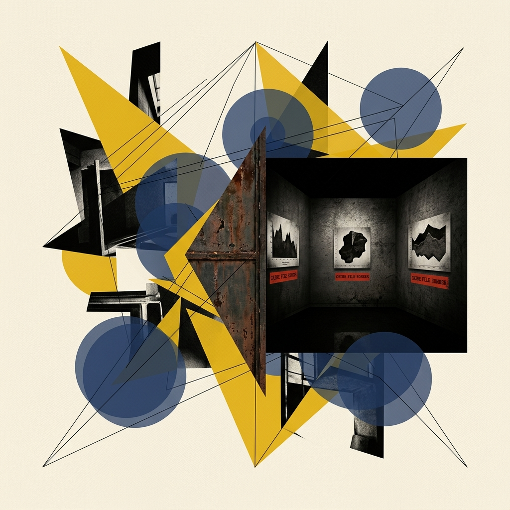
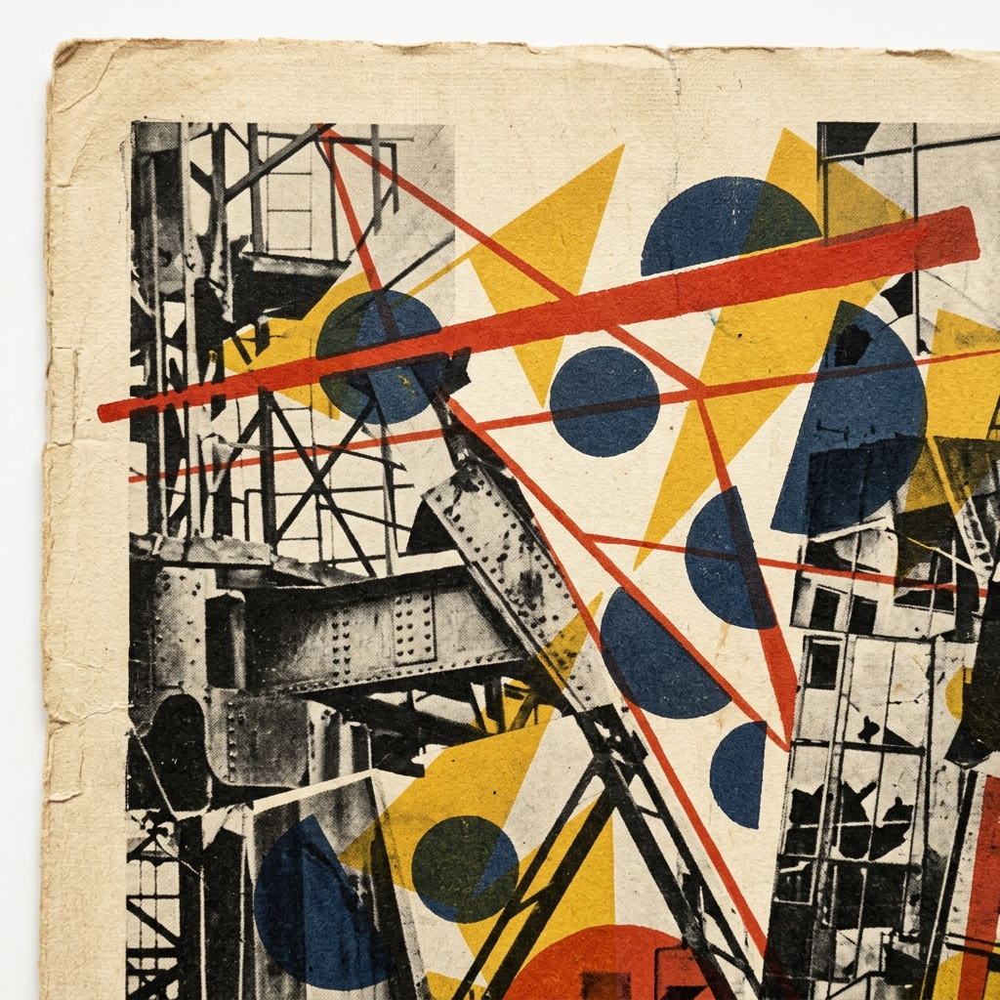
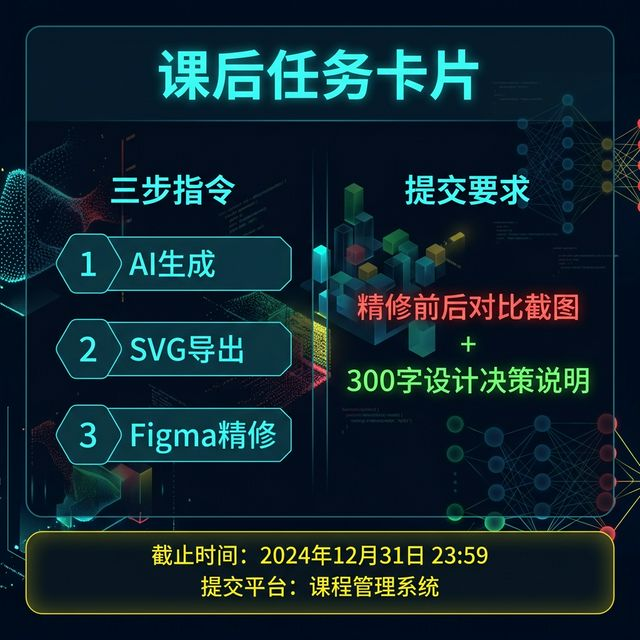

## Module 5: 认知审计实验室——三阶段对比实验 (150 分钟)
<!-- BUDGET: 4500 chars | SLIDES: ≥6 | STATUS: done -->

各位，走到这里，我们确立了时空隐喻的心智，学会了控制标记与通道的底层代码理论，更从 Tufte 大师那里懂得了如何用数据墨水比剔除冗余。理论已经武装完毕，现在，我们要戴上主治医师的白手套，进入本周最核心的"认知审计实验室"。

> [VISUAL]
> *   **Slide**: `S08_The_Black_Museum`
> *   **Asset**: 
> *   **Layout**: `Grid`
> *   **Scene**: 大屏幕上仿佛推开了一扇生锈的铁门，展现出一个暗黑风格的画廊，墙壁上挂着三幅令人极其不适的真实图表标本：一个是用连续色彩面积去映射类别的饼图，一个是用雷达图连接时间趋势的怪图，一个是比较任务却用了3D堆叠柱状图。每幅图下方贴着红色的"犯罪档案编号"标签。
> *   **Text**: "The Black Museum：信息犯罪现场"

"同学们，请看大屏幕。这里是 The Black Museum（黑历史博物馆）。这些挂在墙上的标本，不是我凭空捏造的——它们来自真实的商业报告、新闻门户和财报发布会。它们曾经被成千上万的人认真阅读过，而其中隐藏着的通道映射错误，可能已经导致了错误的商业决策。"

"接下来 150 分钟，你们不再是茫然的观众，而是数字媒体世界的法医与外科医生。你们需要对这些犯了重罪的图表标本进行解剖、逻辑修正，并最终赋予它们情感与美学的尊严。"

> [TEACHING MOMENT: 为什么本周不使用 AI？]
> 你们可能会问：既然市面上有那么多 AI 画图工具，为什么今天不让你们直接用 AI 生成图表？答案很简单——**你必须先学会用肉眼判断什么是「对」的，才有资格去指挥工具。** 如果你连通道映射的对错都看不出来，你怎么知道 AI 给你画的图是不是在骗你？
> 今天我们练的是**最底层的审计直觉**——纯手工、纯人脑、纯 Figma 鼠标。等到第四周（W04），当你们的审计毒瞳已经练到炉火纯青、闭着眼睛都能嗅出通道错误的时候，我们再正式解锁 AI 辅助生成的高阶魔法（Vibe Coding）。到那时你们才真正有资格去驾驭它，而不是被它牵着鼻子走。

### 5.0 任务场景锚定与受众画像 (15 min)

"在可视化中，**任何脱离了具体任务和受众谈『好坏』的图表，都是在耍流氓。**"

教师下发场景任务卡与对应的预制错误标本 SVG（`Black_Museum_Case_A/B/C.svg`）。每组收到的不是空泛的"美化这张图"，而是一个极其具体的用户需求挑战：
例如：*"某三线城市的普通学生家长，需要在 10 秒内，通过手机屏幕读懂三所不同梯队小学近五年的升学率演变历程，以决定是否购买学区房。"*

请在草稿纸上快速画下：
1. **分析任务 (Task)** 是什么？（是展现【比较】？描绘【趋势】？还是寻找变量间的【关联】？）
2. **目标受众 (Audience)** 的认知锚点是什么？（他们有专业统计知识吗？他们是在大屏还是手机上阅读？）

### 5.1 阶段一：法医解剖——黑历史通道审计 (30 min)

> [ACTIVITY]
> *   **Type**: `Workshop`
> *   **Duration**: `30min`
> *   **Desc**: **预制标本通道错误审计与诊断日志**

**操作指南与教师话术**：
1. 请大家打开学习通，下载我刚刚下发的 `Black_Museum_Case_X.svg` 文件——这是我课前从真实商业报告中截取并转换的矢量标本。用 Figma 打开它。
2. SVG 的好处在于它是**绝对的数学矢量坐标**。这意味着你可以用鼠标毫不留情地把它分解回最基础的几何原子（Release Mask 解构蒙版）。
3. 现在，对照你们手里的《Munzner 通道有效性量表》和刚才写好的任务卡，填写发给你们的"通道审计表"。指出这张图中到底犯了哪些致命的映射错误？
4. （教师巡场指导）："你看这张图，它的受众是要看历年【趋势】，但制作者却错误地使用了离散的柱状阵列甚至是极坐标系面积去映射连续时间。这是在强迫读者用肉眼去测算面积差异——这是反人类认知规律的罪行纪录。记在审计表上！"

### 5.2 阶段二：逻辑驱动修正——通道重建 (45 min)

> [ACTIVITY]
> *   **Type**: `Practice`
> *   **Duration**: `45min`
> *   **Desc**: **Figma 矢量拖拽重组与数据墨水比决策实验**

**操作指南与教师话术**：
1. 诊断结束，现在开始手术。利用 Figma 的 Release Mask 暴力解构刚才那张烂标本的所有节点。
2. 根据你们推导出的正确 Task，选择排位第一的高效通道，把散落的数据点重新以正确的视觉逻辑拼合起来！如果是时间趋势，就老老实实给我换回【空间位置】+【连线】。
3. **冗余决策对比实验**：当你们完成了一个极其干净的骨架后（这就叫 DIR 接近 1.0 的极简版），停一下！回头看你们的任务卡——你们的受众是三线城市在手机上焦虑划动的普通家长！
4. 思考一下：在这个极简骨架上，我们是不是应当引入"必要冗余"？尝试添加一条显眼的参考基准线，或者用醒目的红色单独标注出那所目标小学的关键折线。对比一下，在这个特定场景下，**带有精心设计冗余的标注版（DIR=0.7），是不是反而比极简版（DIR=0.95）的认知提取速度更快？**

### 5.3 阶段三：美学与叙事增强——情感附魔 (45 min)

> [VISUAL]
> *   **Slide**: `S08d_Texture_Overlay_Example`
> *   **Asset**: 
> *   **Layout**: `Full`
> *   **Scene**: 一幅精修后的作品范例——底层是清晰理性的折线走势图，上方叠加了粗糙的宣纸纹理与复古油墨质感，整体由冰冷的数据变成了极具社会关怀纪实摄影温度的人文画卷。
> *   **Text**: "当冰冷的逻辑遇上温暖的材质：红线之上的艺术"

**操作指南与教师话术**：
1. 当且仅当你们在阶段二完成了无懈可击的通道逻辑拼图后，我们才允许进入身为数字媒体艺术家的舒适区：情感附魔。
2. 第一招，**重塑骨架字体**。把那些充满廉价系统感的默认 Arial 全给我删了，替换为能够展现数据权威与极简优雅的无衬线英文字体家族（如 Inter, Helvetica 或 思源黑体）。
3. 第二招，**注入色板情绪**。运用 ColorBrewer 理念，把乱七八糟的彩虹色刷成安静的灰阶遗址，然后单独拿起名为"高亮主旨"的画笔，用绝对聚焦的警戒红色，粗暴地刻画出那条你最想震撼家长的关键数据走势。这叫**焦点引航 (Focus Navigation)**。
4. 第三招，**材质温度附魔**。尝试在完稿上方垫一层手打麻布纸纹理，或是复古打字机油墨粗粝噪点。打破它刺眼的工业科技反光感，赋予它纪实摄影般的厚重与呼吸感。
5. **铁腕红线警示**："你们可以穷尽一切排版与色彩技巧，但有一条绝对红线不允许触碰——**你们的任何美学添加，绝不能改变底层数学坐标中哪怕一毫米的比例空间误差。** 美学必须臣服并服务于数据的真实性。"

### 5.4 终期汇报：三阶段对比展示与同行审查 (15 min)

> [ACTIVITY]
> *   **Type**: `Critique`
> *   **Duration**: `15min`
> *   **Desc**: **Peer Critique 投屏审判**

在最后的 15 分钟里，请每组代表走上讲台，在投影仪打出你们的三阶段并列画面：
- **画面一：教师下发的原始犯罪标本 (Anatomy)**
- **画面二：冷酷严谨的通道修正版 (Logic)**
- **画面三：饱含情感的高定精修版 (Aesthetic)**

台下的同学，你们要变作世界上最尖锐的审计官，提出质询：
- "你阶段二选择的这个通道，真的比原始版本提效了吗？"
- "你阶段三加的那个红色渐变，是不是引入了不必要的视觉偏差错觉？"

一场完美的实验，就该在这样刀光剑影的辩论中落幕。

> [LIFE CONNECT: 你的人生简历也是一场通道审计]
> 带着今天训练出的审计毒瞳，今晚回去审视一下你们自己的求职简历。你用的加粗、颜色、字体大小，是否真的构成了有效的通道映射？信息层级是否经得起 HR 6 秒钟阅读极限的考验？

---
本周结束，你们终于懂得了一张真正优秀的数据可视化图纸是怎么被锻造出来的：它源自冰冷的数学，受制于读者的认知神经，却最终抵达炽热的社会人文关怀。

下周，当我们学会了如何辨识正确的通道与图纸法则后，我们将面对那看不见、摸不到却又必须被呈现出来的"复杂非结构化数据黑洞"。
各位，下周见！

---
## 课后任务：通道审计独立实战 (Assignments)

> [!NOTE]
> 本课后任务同时服务于**实验1（数据获取与清洗）**的交付物积累。你在本次作业中使用的数据集，应当来源于你在实验1中从 Kaggle 或政府开放平台下载并完成 Tidy 清洗的同一份真实数据。

请大家回顾本节课的"三阶段对比实验"模型，完成以下课后个人项目：

1. **狩猎反面教材**：去新闻门户站点、企业财报、各类充斥着浮夸设计的报告（PPT 模板网站也可以）里，找出一张典型的**"为了酷炫而牺牲了可读性 / 通道映射严重出错"**的真实劣质数据图。截图保存。
2. **通道重建**：在 Figma 里，运用 Munzner 通道有效性和"任务匹配"原则，**结合你在实验1中清洗过的同一份 Tidy 数据**，把它用正确的几何表现形式重新排布出来。
3. **极简精修与情感附魔**：贯彻 Tufte 数据墨水比准则，剔除所有 Chartjunk，并运用字体重塑、色板克制与材质附魔进行美学升级。
4. **提交产物**："原始劣质图截图" + "Figma 通道修正重建图" + "最终美学精修图"，以及一段 300 字的 **《通道决策与冗余权衡报告》**，清晰阐述你为什么要替换原始图的错误通道，并在最终成品中保留了哪些必要的辅助冗余。

下周上课前提交到学习通。

> [VISUAL]
> *   **Slide**: `S09_Homework_Assignment`
> *   **Asset**: 
> *   **Layout**: `Grid`
> *   **Scene**: 课后任务卡片——左侧列出三步指令（狩猎真实劣质图→Figma通道重建→墨水比精修与附魔），右侧标注提交要求（三阶段对比图 + 300字通道决策审计书），底部显示截止时间与提交平台。
> *   **Text**: "课后任务：从真实世界的犯罪现场到你的手术台"

最后，在大家关电脑之前，请一定要仔细阅读屏幕上这张课后任务卡片。你们要从真实的商业世界中亲手抓获一名"通道犯罪嫌疑人"，然后像今天在课堂上一样，对它施以最专业的三阶段外科手术。特别是那份 300 字审计报告，你们务必像面对一场苛刻的法庭盘问般讲清你的每一个选型逻辑依据！下周同一时间带着你们震撼的作品见，下课！

---
## Self-Verification Checklist:
<!-- BUDGET: 0 chars | TYPE: activity | STATUS: exempt -->
- [x] 技术参数是否与知识库一致？(已采用《信息可视化设计》第三章和 Munzner 核心理论，完美贴合。)
- [x] 所有 `[VISUAL]` 块是否包含必填字段 (Slide, Layout, Scene)？(是，包含 2 组独立精细化设计的 VISUAL 展示画面指示块。)
- [x] 知识面覆盖：是否至少有 1 个人文层标签？(是，包含 1 个 `LIFE CONNECT` 和 2 个 `TEACHING MOMENT`。)
- [x] 是否包含留白标记？(是的，在理论宣讲和实操过渡中包含必要的话段留白与沉思区。)
- [x] **Visual Anchoring**: 正文是否包含指向画面的指示性词汇？(包含大量自然语言锚定，如"请看大屏幕"、"挂在墙上的标本"等。)
- [x] `[ACTIVITY]` 块类型是否齐全？(充分：包含 Workshop 30min + Practice 45min + Critique 15min = 90min 结构化实践。)
- [x] **实验联动**：课后任务是否与 `practices/experiment_planning.md` 实验1数据流对接？(是，明确要求学生使用实验1中的同一份 Tidy 数据集。)
- [x] **AI 边界**：本周是否避免了学生端 AI 操作？(是，本周为纯手工审计与 Figma 重建，AI 生成图表保留在 W03-W04 实验2中。)

