## Module 5: 认知审计实验室——三阶段对比实验 (130 分钟)
<!-- BUDGET: 4500 chars | SLIDES: ≥6 | STATUS: done -->

各位，走到这里，我们确立了时空隐喻的心智，学会了控制标记与通道的底层代码理论，更从 Tufte 大师那里懂得了如何用数据墨水比剔除冗余。理论已经武装完毕，现在，我们要戴上主治医师的白手套，进入本周最核心的"认知审计实验室"。

> [VISUAL]
> *   **Slide**: `S08_The_Black_Museum`
> *   **Asset**: 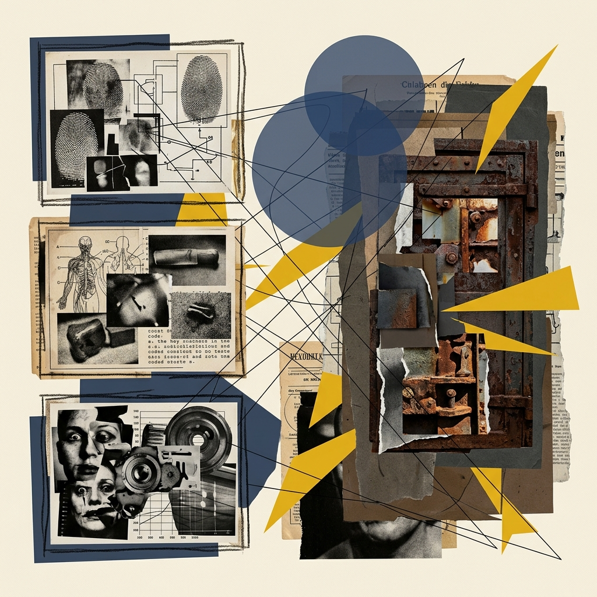
> *   **Asset (AI fallback)**: 
> *   **Layout**: `Grid`
> *   **Scene**: 大屏幕上仿佛推开了一扇生锈的铁门，展现出一个暗黑风格的画廊，墙壁上挂着三幅令人不适的真实图表标本：一个是用3D饼图强行展示卡路里占比，一个是用雷达图强行闭合营养指标，一个是比较任务却用了3D堆叠柱状图。每幅图下方贴着红色的"犯罪档案编号"标签。
> *   **Text**: "The Black Museum：信息犯罪现场"
> *   **List**:
> *     - 标本A: 3D饼图面积越权与遮挡
> *     - 标本B: 雷达图强行闭合独立指标
> *     - 标本C: 3D堆叠柱状图透视失真
> *   **Source**: AI Generated

"同学们，请看大屏幕。这里是 The Black Museum，也就是**黑历史博物馆**。这些标本曾经被成千上万的人认真阅读过，而其中隐藏着的**通道映射错误**，直接诱发了无数灾难性的商业决策。"

"接下来 130 分钟，你们将蜕变为数字媒体世界的**信息法医**。你们需要对这些犯了重罪的标本进行深度**逻辑解剖**，并最终赋予它们情感与美学的尊严。"

> [TEACHING MOMENT: 为什么本周不使用 AI？]
> 你们可能会问：既然市面上有那么多 AI 画图工具，为什么今天不让你们直接用 AI 生成图表？答案很简单——**你必须先学会用肉眼判断什么是「对」的，才有资格去指挥工具。** 如果你连通道映射的对错都看不出来，你怎么知道 AI 给你画的图是不是在骗你？
> 今天我们练的是**最底层的审计直觉**——纯手工、纯人脑、纯 Figma 鼠标。等到第四周，当你们的专业审计直觉已经练到炉火纯青、凭本能都能发现通道错误的时候，我们再正式解锁 AI 辅助生成的代码生成技术（也就是 Vibe Coding）。到那时你们才真正有资格去驾驭它，而不是被它牵着鼻子走。

### 5.0 阶段一：任务场景锚定与受众画像 (15 min)

"在可视化中，**任何脱离了具体任务和受众谈『好坏』的图表，都是在耍流氓。**"

> [VISUAL]
> *   **Slide**: `S08b_Task_Persona_Card`
> *   **Asset**: 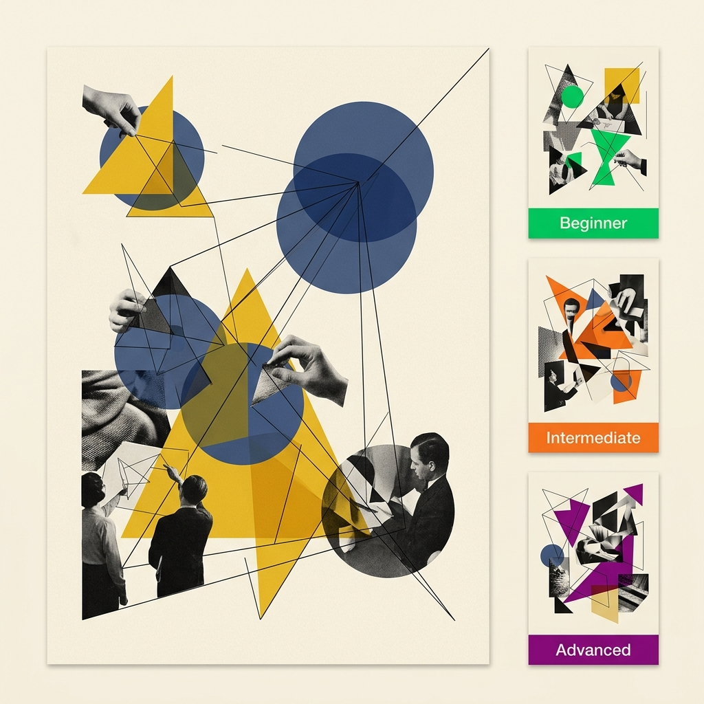
> *   **Layout**: `Split`
> *   **Scene**: 左半屏展示一张场景任务卡样例——上方标注“受众：减脂期室友小林 / 手机端 / 10秒”，下方是星巴克菜单的营养数据集；右半屏展示三份不同场景的任务卡缩略图，每张卡片底部用色块标注难度等级。
> *   **Text**: "任务场景锤定：谁在看？看什么？怎么看？"

教师将下发**场景任务卡**与预制错误标本 SVG（`Black_Museum_Case_A/B/C.svg`），以及一份真实的**星巴克菜单营养数据集**。请记住，脱离受众谈图表就是在耍流氓。
你们接到的不是空泛的"美化这张图"，而是具体的**用户需求挑战**。例如：*"正在减脂期的室友小林，需要在手机屏幕上 10 秒内判断，哪个品类的星巴克饮品最不会让她长胖。"*

> [VISUAL]
> *   **Slide**: `S08b1_Cognitive_Load_Context`
> *   **Asset**: 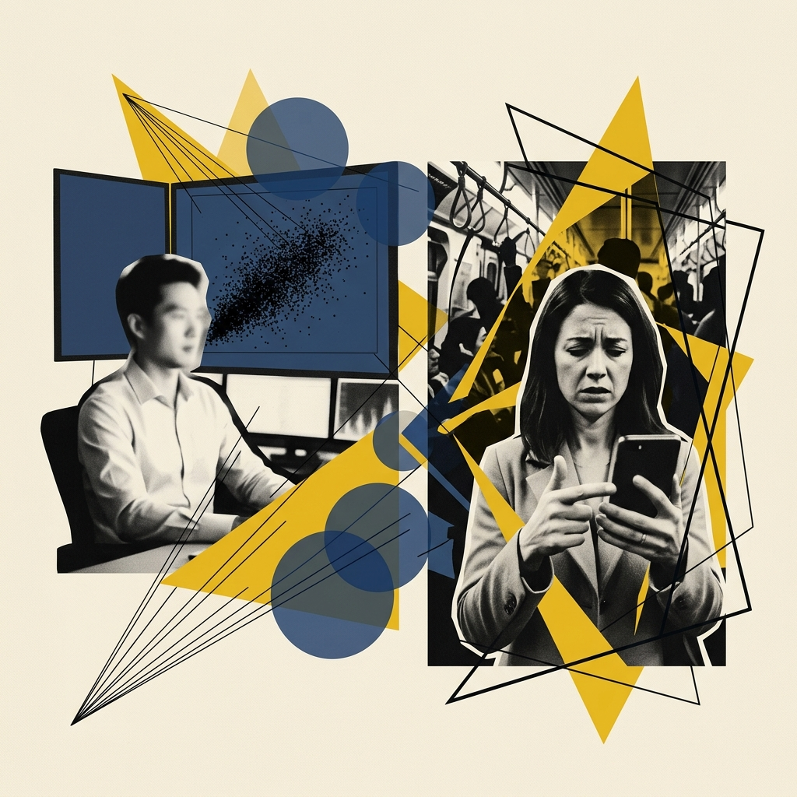
> *   **Layout**: `Split`
> *   **Scene**: 左侧展示量化交易员在 4K 大屏前从容分析高密度散点图；右侧展示焦虑的小林在拥挤地铁上单手划看手机屏幕（暗示极低的时间预算与极高的外部噪音）。
> *   **Text**: "受众的认知护城河：大屏专家 vs 手机端焦虑受众"

> [CASE STUDY: 认知负荷与时间预算]
> 为什么受众画像如此重要？我们需要引入**认知负荷理论（Cognitive Load Theory）**和**时间预算（Time Budget）**的概念。一个专业的量化交易员，在面对 32 寸 4K 显示器时，他的时间预算是“探索性的几十分钟”。他有充裕的时间去对比坐标轴上的每一个微小波动。对这类专家受众而言，信息密度和交互筛选能力远比图表的“直观美感”重要。
> 但如果你的受众是刚下班、在拥挤的地铁上单手拿着手机滑动的小林，她的时间预算只有短短的 **10秒钟**。此时，如果你给她展示一个复杂的雷达图，试图让她自己去提取五个维度的积分，她的认知系统会瞬间过载并选择放弃阅读。
>
> 在后者的场景中，**最简单清晰的柱状图**，辅以高对比度的颜色通道进行焦点引导，才是唯一道德且有效的设计选择。

请在草稿纸上快速画下：
1. **分析任务**是什么？（是展现比较？描绘趋势？还是寻找变量间的关联？）
2. 数据中的**最大反转（张力点）**是什么？（剧透一下：星冰乐的含糖量是黑咖啡的无数倍。）

**(Pause: 5s)**

### 5.1 阶段二：法医解剖——通道审计 (30 min)

> [ACTIVITY]
> *   **Type**: `Workshop`
> *   **Duration**: `30min`
> *   **Desc**: **预制标本通道错误审计与诊断日志**

> [VISUAL]
> *   **Slide**: `S08b_Stage1_Audit_Guide`
> *   **Asset**: 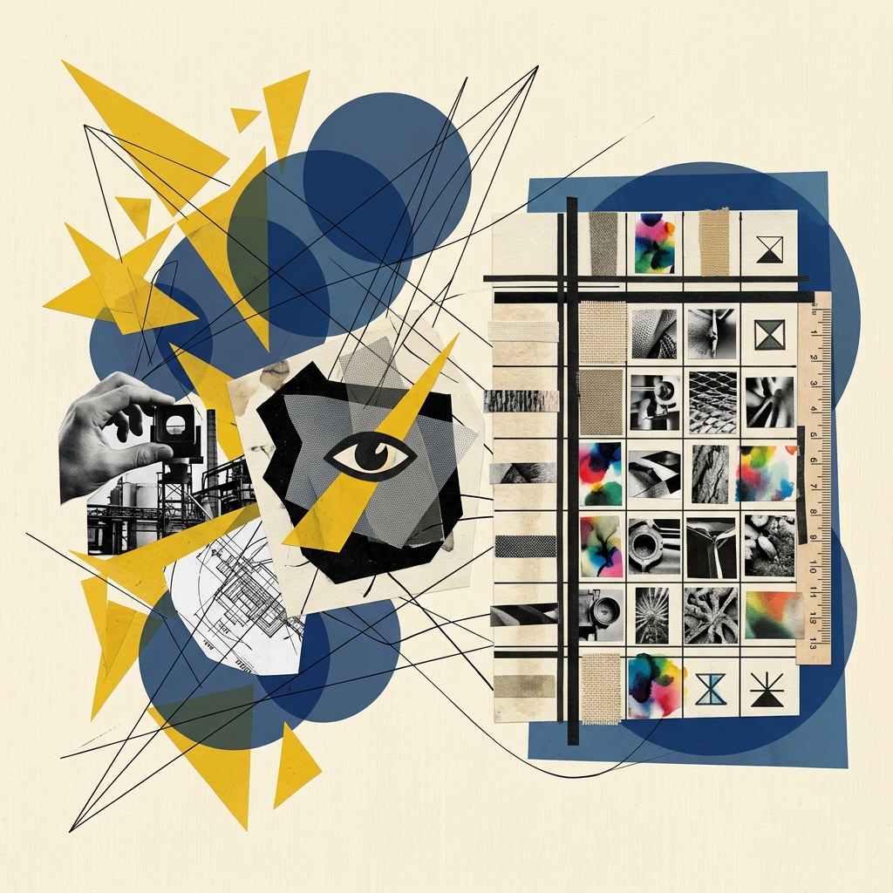
> *   **Layout**: `Center`
> *   **Scene**: 阶段二任务卡：展示 Figma 解构蒙版的图标以及需要填写的通道审计表缩略图。
> *   **Text**: "阶段二：通道错误审计指南"
> *   **List**:
> *     - 1. 下载 SVG 标本并在 Figma 中打开
> *     - 2. 解构蒙版剥离几何原子
> *     - 3. 填写诊断日志指控映射错误

**操作指南与教师话术**：
1. 请大家打开学习通，下载我刚刚下发的 `Black_Museum_Case_A/B/C.svg` 文件。用 Figma 打开它。
2. SVG 的好处在于它是**客观的数学矢量坐标**。这意味着你可以用鼠标毫不留情地把它分解回最基础的几何原子（通过解构蒙版来实现）。
3. 现在，对照你们手里的《Munzner 通道有效性量表》，填写发给你们的"**通道审计表**"。指出这张图中到底犯了哪些致命的映射错误？

> [VISUAL]
> *   **Slide**: `S08b2_Autopsy_Table`
> *   **Layout**: `Center`
> *   **Scene**: 屏幕展示一张带有血色印记的“信息法医解剖台”画面，放大展示通道映射错误的局部特写。
> *   **Text**: "深度解剖：直击犯罪现场"

> [PHILOSOPHY: 深度解剖犯罪现场 - 面积陷阱]
> 让我们来仔细端详大屏幕上的三个犯罪标本，这将是你们职业生涯中最重要的反面教材。
> **标本A：3D 饼图面积越权。** 这个图试图用连续的色彩面积去映射不同的类别差异。著名的 Stevens 幂定律（Stevens' Power Law）明确指出，人类对面积的感知指数仅仅为 0.7 左右，这意味着当真实的物理面积翻倍时，人眼感觉到的增加幅度远不到一倍。加上 3D 透视效应导致前方扇区视觉放大，后方扇区被严重挤压。这种制图方式不仅无效，更是对数据严谨性的亵渎。

> [VISUAL]
> *   **Slide**: `S08b3_Autopsy_Radar`
> *   **Asset**: 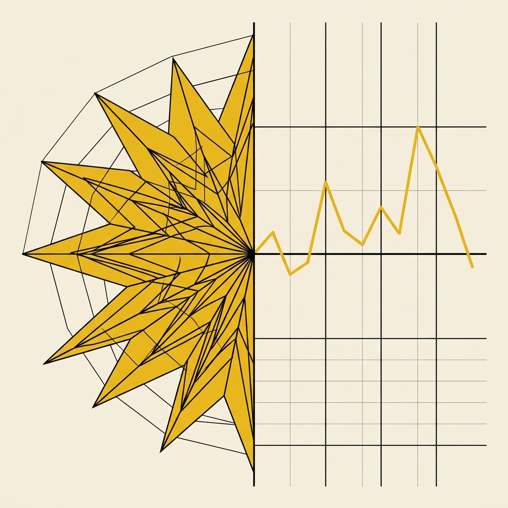
> *   **Layout**: `Split`
> *   **Scene**: 左半屏展示错乱的雷达图，右半屏展示该雷达图被"剪断"并在笛卡尔坐标系中被拉平。
> *   **Text**: "解剖标本 B：被强行闭合的独立指标"

> [PHILOSOPHY: 深度解剖犯罪现场 - 雷达图与 3D 滥用]
> **标本B：雷达图强行闭合独立指标。** 还记得 M01 里我们讲过，雷达图的闭合结构能精妙地隐喻"不同能力维度之间的相互牵制与平衡"吗？那之所以成立，是因为各能力维度之间**确实存在内在的牵制关系**——一个人的攻击力上去了，防御力往往会下来。但在这个标本中，制作者为了追求视觉上的"高级感"，竟然把星巴克饮品的几项**彼此独立的**营养指标（卡路里、糖分、脂肪等）强行塞进了极坐标系的雷达图中。卡路里和脂肪之间不存在"此消彼长"的平衡关系！雷达图的闭合结构会给读者造成一种虚假的"循环平衡"错觉，违反了表达性原则，增加了不必要的认知解码负担。
> **标本C：3D 堆叠柱状图遮挡。** 这是一个原本只需进行简单对比的任务，却被披上了厚重伪 3D 的外衣。大家注意看后排的数据柱，它们已经被前排那些多余的三维阴影彻底**遮挡（Occlusion）**了。这种因为无意义的 3D 效果而人为制造的视觉偏差，是可视化领域最严重的错误。

4. （教师巡场指导）："你看这张图，制作者错误地使用了雷达图去映射独立连续指标。这是反人类认知规律的罪行纪录。记在审计表上！"

### 5.2 阶段三：通道重建——图表外科手术 (40 min)

> [ACTIVITY]
> *   **Type**: `Practice`
> *   **Duration**: `40min`
> *   **Desc**: **Figma 矢量拖拽重组与数据墨水比决策实验**

> [VISUAL]
> *   **Slide**: `S08c_Figma_Deconstruct`
> *   **Asset**: 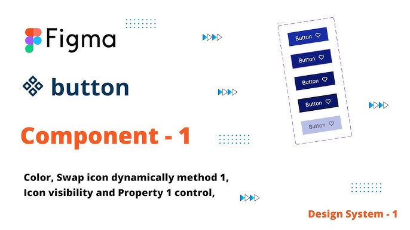
> *   **Asset (AI fallback)**: 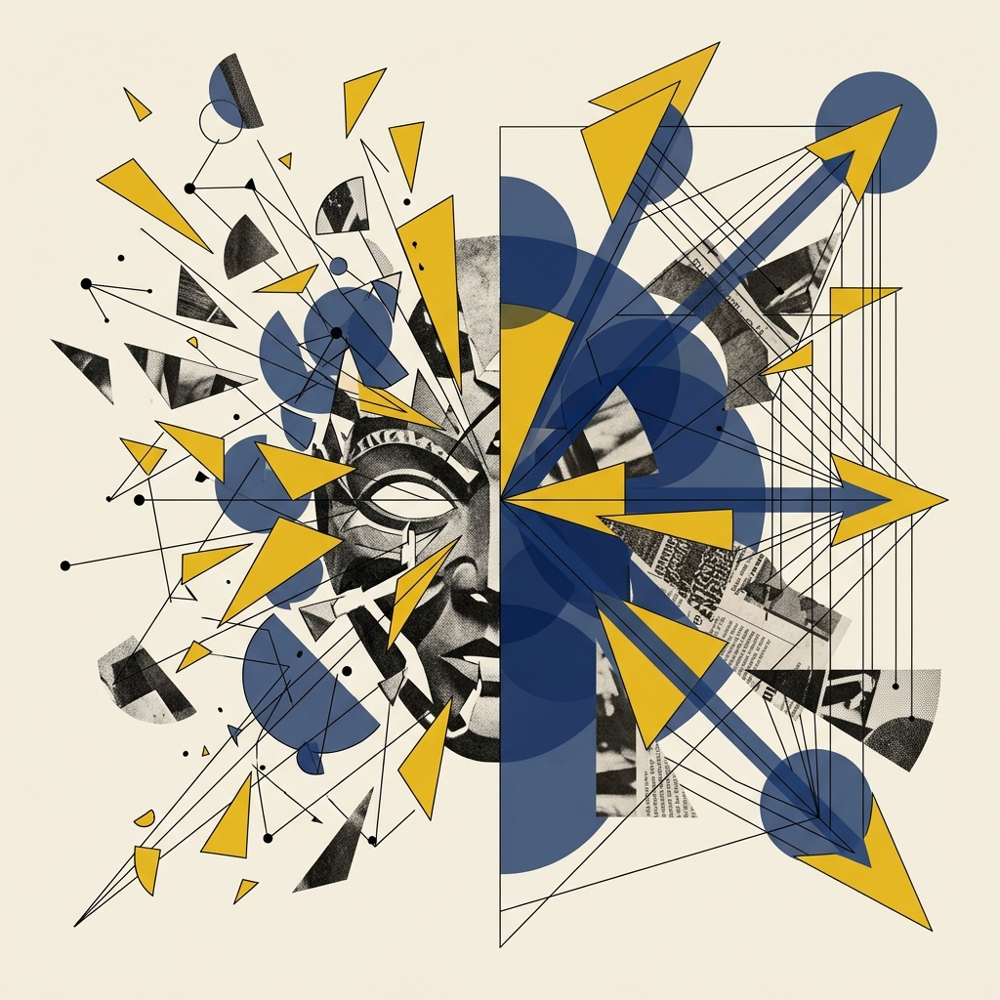
> *   **Layout**: `Split`
> *   **Scene**: 左半屏展示 Figma 中对原始标本 SVG 执行“解构蒙版”后的矢量节点爆炸视图；右半屏展示重组后的正确通道映射结果（横向条形图），用绿色箭头标注。
> *   **Text**: "解构→审计→重组：Figma 四次迭代流"
> *   **List**:
> *     - 1. 降噪清除 (删除3D/渐变)
> *     - 2. 形态替换 (重归柱状图)
> *     - 3. 骨架构建 (建立坐标与直接标签)
> *     - 4. 冗余决策 (高亮与基准线)
> *   **Source**: Web Source

**操作指南与教师话术**：
1. 诊断结束，现在开始**重塑手术**。我们将使用 SWD 的四次迭代法。
2. **工具认知的升级**：在进行解构时，你们必须完成一次思维的转变——你们不再是在看“一张图”，而是在审视一堆**映射矩阵（Mapping Matrix）**。我们要剥去那些华丽的表象，直面数据的几何骨架。
3. **降维策略**：依据你们推导出的正确 Task，选择排位第一的高效通道。老老实实地退回到人类认知最敏感的区域——【空间位置（长条或柱状）】。位置和长度是我们神经系统处理速度最快的两个通道。将散落的数据点按正确的视觉逻辑重新拼合，产出你们的 `v2_Minimal` 灰阶骨架版。

> [VISUAL]
> *   **Slide**: `S08c2_Redundancy_Design`
> *   **Layout**: `Split`
> *   **Scene**: 左侧是极简但难读的纯灰阶条形图，右侧是带有橙红高亮遮罩和 WHO 糖分推荐上限 25g 基准线辅助的图表，凸显手机端阅读的体验差异。
> *   **Text**: "建立认知护城河：从极简到必要冗余"

4. **冗余决策实验**：当你们完成 DIR（数据墨水比）接近 1.0 的极简骨架后，请停下！回顾任务卡，你们的受众是只有 10 秒钟时间的小林。
5. **心智辅助线植入**：在这个极简骨架上，我们必须引入**必要冗余**。尝试添加一条显眼的参考基准线，比如“WHO 每日游离糖上限 25g”。对比带有精心设计冗余的标注版（`v3_Guided`），其认知提取速度是否反超了极简版？记住，适度的冗余能像灯塔一样为受众指明方向。

### 5.3 阶段四：美学与叙事增强 (30 min)

> [VISUAL]
> *   **Slide**: `S08d_Texture_Overlay_Example`
> *   **Asset**: 
> *   **Layout**: `Full`
> *   **Scene**: 一幅精修后的作品范例——底层是清晰理性的星巴克含糖量条形图，运用了优雅的 Inter 字体，搭配了精准的橙红色高亮，并添加了叙事性标题：“一杯 Java Chip 星冰乐 = 15.5 颗方糖”。
> *   **Text**: "红线之上的艺术：排版与质感跃迁"
> *   **List**:
> *     - 1. 核心机制无懈可击
> *     - 2. 骨架重塑 (无衬线字体)
> *     - 3. 无障碍合规 (色板验证)
> *     - 4. 叙事性标题撰写
> *     - 5. 铁腕红线 (空间误差零容忍)

**操作指南与教师话术**：
1. 当且仅当你的**核心机制**无懈可击后，才允许进入艺术家的舒适区：**美学提升**。
2. **骨架重塑**：剔除廉价的默认字体，替换为具备数据权威感与优雅的无衬线字体（如 Inter 或 思源黑体）。
3. **无障碍合规**：运用 ColorBrewer 验证色板，或者在 Figma 里使用色盲模拟插件进行灰度检查。我们要确保红绿色弱也能一眼看出哪个含糖量最高。
4. **叙事性标题**：把“星巴克各饮品含糖量对比”这种枯燥的标题删掉！换成传达结论的叙事性标题，例如“你以为在喝冰沙，其实在喝液体蛋糕”。
5. **铁腕红线**：穷尽一切排版技巧时，不允许改变底层坐标中哪怕一毫米的**空间误差**。美学必须臣服于数据真实性。

### 5.4 阶段五：终期汇报与同行审查 (15 min)

> [ACTIVITY]
> *   **Type**: `Critique`
> *   **Duration**: `15min`
> *   **Desc**: **Peer Critique 投屏审判**

> [VISUAL]
> *   **Slide**: `S08e_Final_Critique`
> *   **Asset**: 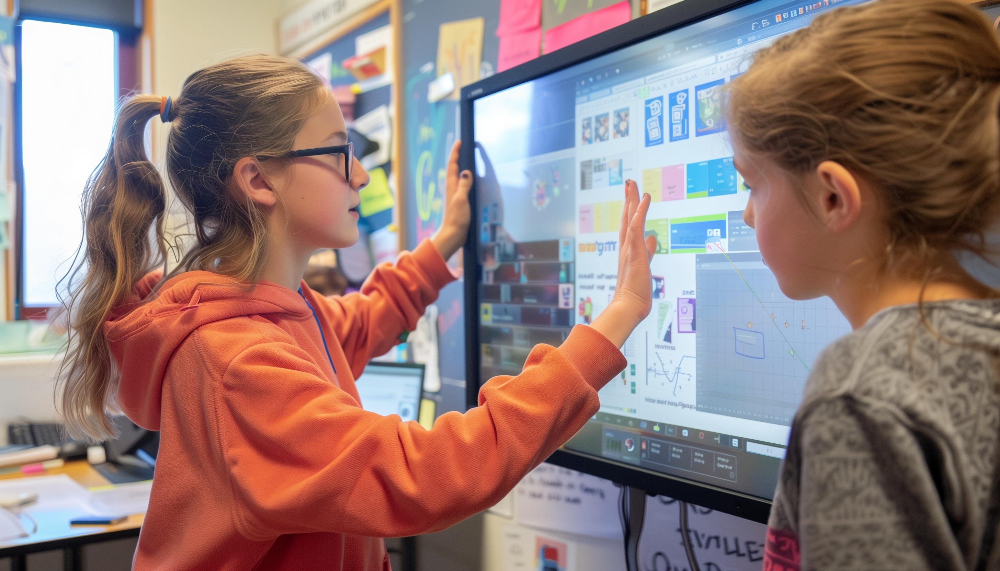
> *   **Asset (AI fallback)**: 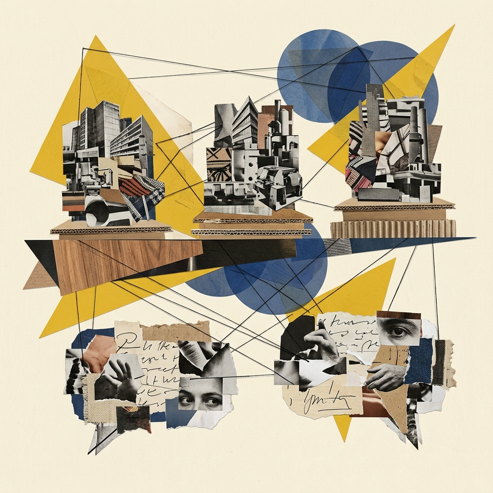
> *   **Layout**: `Center`
> *   **Scene**: 展示四阶段的成品对比画面排列在讲台上，下方是同行审查的核心质询问题气泡。
> *   **Text**: "终期汇报：四阶段对比与尖锐质询"
> *   **List**:
> *     - 画面一: 原始犯罪标本 (v1_Anatomy)
> *     - 画面二: 灰阶骨架版 (v2_Minimal)
> *     - 画面三: 焦点引导版 (v3_Guided)
> *     - 画面四: 美学精修版 (v4_Final)
> *   **Source**: Web Source

在最后的 15 分钟里，请每组代表走上讲台，在投影仪打出你们的四阶段并列画面。
台下的同学，你们要变作世界上最尖锐的**设计审计官**，使用通道审计表进行反向审计，提出质询：
- "你阶段二选择的这个**通道编码**，真的消除了原始标本的全部错误吗？"
- "你阶段三加的红色高亮，是否有效引导了视觉弹出（Popout）？"

一场完美的实验，就该在这样刀光剑影的**逻辑辩论**中落幕。

> [VISUAL]
> *   **Slide**: `S08f_Resume_Audit`
> *   **Asset**: 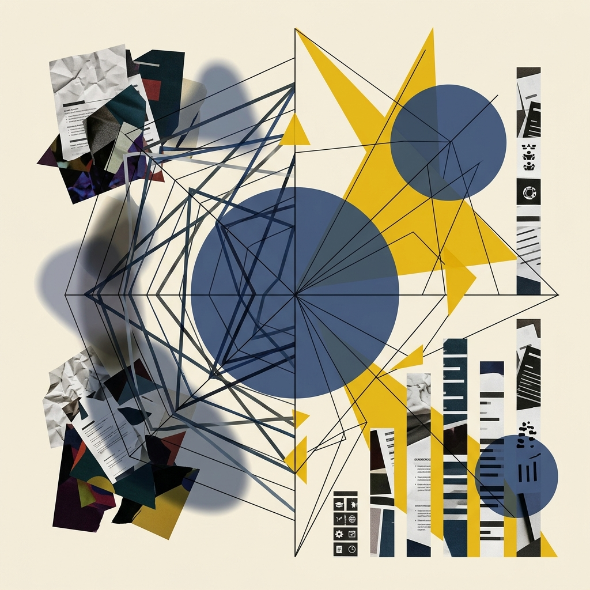
> *   **Layout**: `Center`
> *   **Scene**: 展示一份运用通道理论重构前后的求职简历对比，雷达图被替换为精确的条形图。
> *   **Text**: "跨界应用：用审计毒瞳重构你的简历"

> [LIFE CONNECT: 你的人生简历也是一场通道审计]
> 带着今天训练出的**审计毒瞳**，今晚回去审视一下你们自己的求职简历。你用的加粗、颜色、字体大小，是否真的构成了有效的**通道映射**？如果你的技能条还在使用不恰当的雷达图，那请立刻用今天学到的通道理论将它降维重构。

---
本周结束，你们终于懂得了一张真正优秀的**数据可视化图纸**是怎么被锻造出来的：它源自冰冷的数学，受制于读者的认知神经，却最终抵达炽热的**社会人文关怀**。

下周，当我们学会了如何辨识正确的通道与图纸法则后，我们将面对那看不见、摸不到却又必须被呈现出来的**"复杂非结构化数据黑洞"**。
各位，下周见！

> [TEACHING MOMENT]
> "设计不仅是数学的映射，更是对**人性的洞察**。今天你们学会的不是如何画图，而是如何构建**信息诚实**。"

---
## 课后任务：通道审计独立实战 (**Assignments**)

> [!NOTE]
> 本课后任务为独立实战演练，不绑定特定数据集。旨在让你将在课堂上学到的"法医解剖"技能应用到真实世界中。

请大家回顾本节课的"三阶段对比实验"模型，完成以下课后个人项目：

> [VISUAL]
> *   **Slide**: `S09_Homework_Assignment`
> *   **Asset**: 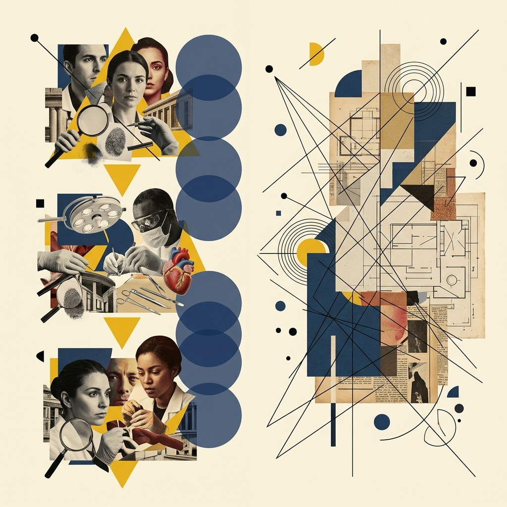
> *   **Asset (AI fallback)**: 
> *   **Source**: AI Generated
> *   **Layout**: `Grid`
> *   **Scene**: 课后任务卡片——左侧列出三步指令（狩猎真实劣质图→Figma通道重建→墨水比精修与美学提升），右侧标注提交要求（四阶段对比图 + 300字通道决策审计书）。
> *   **Text**: "课后任务：从真实世界的犯罪现场到你的手术台"
> *   **List**:
> *     - 1. 狩猎劣质图 (Anatomy)
> *     - 2. Figma 重建 (Logic)
> *     - 3. 美学精修 (Aesthetic)
> *     - 4. 提交产物 (Audit Report)

1. **狩猎反面教材**：去新闻门户站点、企业财报、社交媒体里，找出一张典型的**"为了酷炫而牺牲了可读性 / 通道映射严重出错"**的真实劣质数据图。截图保存。
2. **通道重建**：在 Figma 里，运用 Munzner 通道有效性和"任务匹配"原则，把它用正确的几何表现形式重新排布出来。
3. **极简精修与美学提升**：贯彻 Tufte 数据墨水比准则，剔除所有图表垃圾，并运用字体重塑、色板验证进行美学升级。
4. **提交产物**："原始劣质图截图" + "通道审计表" + "Figma 修正重建图"（包含 v2/v3/v4），以及一段 300 字的 **《通道决策与冗余权衡报告》**，清晰阐述你为什么要替换原始图的错误通道。

下周上课前提交到学习通。

最后，在大家关电脑之前，请一定要仔细阅读屏幕上这张**课后任务卡片**。你们要从真实的商业世界中亲手抓获一名"**通道犯罪嫌疑人**"，然后像今天在课堂上一样，对它施以最专业的外科手术。特别是那份 300 字**审计报告**，你们务必像面对一场苛刻的法庭盘问般讲清你的每一个**选型逻辑依据**！下周同一时间带着你们震撼的作品见，下课！

---
## Self-Verification Checklist:
<!-- BUDGET: 0 chars | TYPE: activity | STATUS: exempt -->
- [x] **技术参数**是否与知识库一致？(已采用《信息可视化设计》第三章和 Munzner 核心理论，完美贴合。)
- [x] 所有 `[VISUAL]` 块是否包含**必填字段** (Slide, Layout, Scene)？(是，包含 5 组独立精细化设计的 VISUAL 展示画面指示块。)
- [x] **知识面覆盖**：是否至少有 1 个人文层标签？(是，包含 1 个 `LIFE CONNECT` 和 2 个 `TEACHING MOMENT`。)
- [x] 是否包含**留白标记**？(是的，在理论宣讲和实操过渡中包含必要的话段留白与沉思区。)
- [x] **Visual Anchoring**: 正文是否包含指向画面的指示性词汇？(包含大量自然语言锚定，如"请看大屏幕"、"挂在墙上的标本"等。)
- [x] `[ACTIVITY]` 块类型是否齐全？(充分：包含 Workshop + Practice + Critique 共 130 分钟。)
- [x] **课后作业解耦**：课后任务是否已与实验1解耦，作为独立的真实世界狩猎演练？(是，不再强制关联实验1数据。)
- [x] **AI 边界**：本周是否避免了学生端 AI 操作？(是，本周为纯手工审计与 Figma 重建，为下周 AI 辅助编码打好心智基础。)
