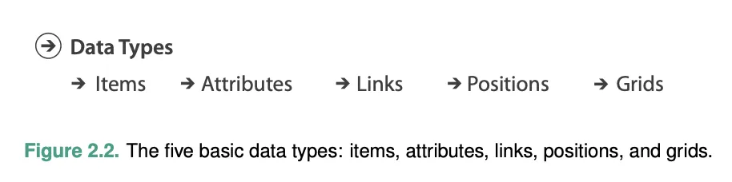
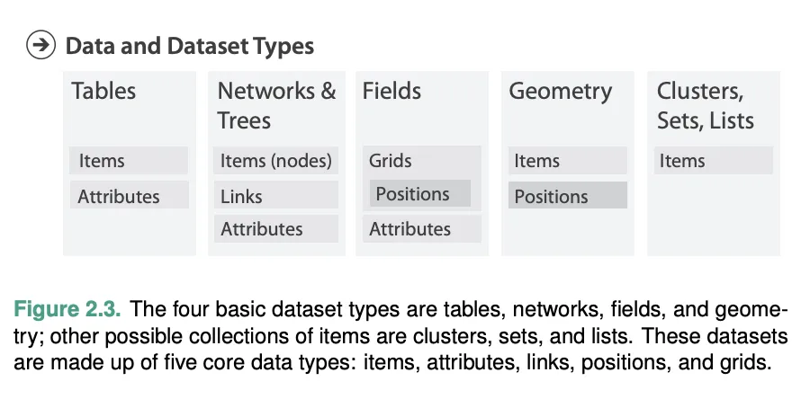
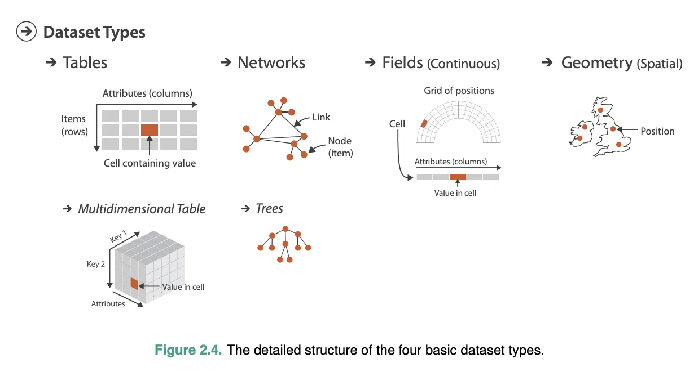
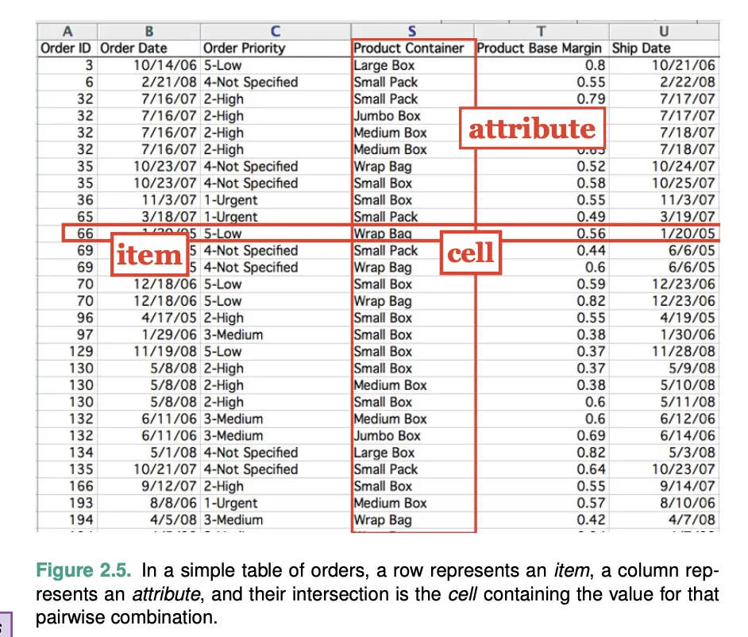
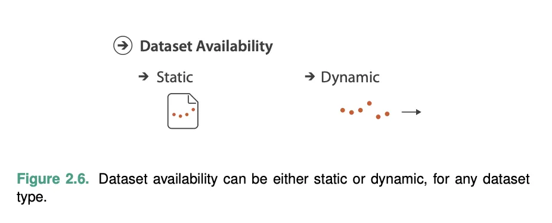

# B01: 数据抽象导论——What 框架

## 教材位置
- 原著：Tamara Munzner, *Visualization Analysis & Design*, 2014
- 章节：Chapter 2 — What: Data Abstraction
- 范围：2.1 - 2.4.6 (Lines 1 - 225)

## 核心知识提取

### 2.1 大局观 (The Big Picture)
可视化的对象可以被抽象为四种基本的数据集类型（Dataset Types）：表格（Tables）、网络（Networks）、场（Fields）和几何（Geometry）。其他的集合类型包括聚类（Clusters）、集合（Sets）和列表（Lists）。
这些数据集由五种基本的数据类型（Data Types）组合而成：条目（Items）、属性（Attributes）、链接（Links）、位置（Positions）和网格（Grids）。
数据集的可用性（Availability）可以是静态的文件（Static file），也可以是动态的流（Dynamic stream）。
属性（Attribute）的类型可以是分类的（Categorical）或有序的（Ordered）。有序的可以进一步分为序数（Ordinal）和定量（Quantitative）。属性的排序方向（Ordering direction）可以是顺序的（Sequential）、发散的（Diverging）或循环的（Cyclic）。

### 2.2 为什么数据语义和类型很重要？ (Why Do Data Semantics and Types Matter?)
- **语义 (Semantics)**：数据的真实世界含义（Real-world meaning）。例如，一个词代表名字还是城市？一个数字代表日期还是年龄？
  - *教材经典锚点*：如果没有语义，"14, 2.6, 30" 是什么？是 3D 坐标，还是 2D 坐标加权重？"Basil, 7, S, Pear" 是一只在迷宫里的老鼠记录，还是一个社区的统计？没有语义，数据只是一堆字符，这就是为什么 AI 在没有充分 Prompt 的情况下处理数据经常会"幻觉"的原因。
- **类型 (Type)**：数据的结构或数学解释（Structural or mathematical interpretation）。
  - 在数据层面（Data level）：它是条目、链接还是属性？
  - 在数据集层面（Dataset level）：这些数据类型如何组合成更大的结构（如表格、树）？
  - 在属性层面（Attribute level）：什么样的数学运算对它有意义？（如数量可以相加，但邮编相加无意义）。
- 很多时候，类型和语义可以通过语法推断，但通常需要作为元数据（Metadata）与数据集一起提供。在本书中，数据和元数据不作区分，统称为数据。

### 2.3 数据类型 (Data Types)
构成数据集的五种基本组成部分（参见 Figure 2.2）：
1. **属性 (Attribute)**：可以被测量、观察或记录的特定性质（如工资、价格、温度）。同义词：变量（Variable）。*注意：教材明确提出避免使用"维度 (Dimension)"指代数据列，因为 Dimension 被专用于指代空间位置（Spatial position）。*
2. **条目 (Item)**：离散的个体实体（如表格中的行、网络中的节点）。例如：人、股票、基因、城市。
3. **链接 (Link)**：条目之间的关系，通常在网络中出现。
4. **位置 (Position)**：空间数据，提供在 2D 或 3D 空间中的位置（如经纬度对）。
5. **网格 (Grid)**：指定连续数据采样的策略，包括单元格之间的几何和拓扑关系。

### 2.4 数据集类型 (Dataset Types)
数据集（Dataset）是任何作为分析目标的信息集合。四种基本类型由基本数据类型组合而成（参见 Figure 2.3 & 2.4）：

#### 2.4.1 表格 (Tables)
- 最常见的数据集形式，由行和列组成。
- **扁平表 (Flat Table)**：每一行代表一个数据**条目 (Item)**，每一列代表数据集的一个**属性 (Attribute)**。行列交叉的单元格（Cell）包含该组合的值。
- **多维表 (Multidimensional Table)**：具有更复杂的索引结构，需要多个键（Keys）来定位一个单元格。

#### 2.4.2 网络与树 (Networks and Trees)
- 适合指定条目之间的关系。
- 在网络中，条目通常被称为**节点 (Nodes / Vertices)**，链接 (Links / Edges) 代表两个条目之间的关系。
- 节点和链接都可以拥有相关联的属性。
- **树 (Trees)**：具有层次结构（Hierarchical structure）的网络。树没有环（Cycles），每个子节点只有一个指向它的父节点。

#### 2.4.3 场 (Fields)
- 包含与单元格（Cells）关联的属性值，代表**连续数据 (Continuous data)**。概念上有无限多个可能的值，可以在任意两个已知测量值之间进行插值（Interpolation）。
- 例子：医学扫描的组织密度、房间内的温度分布。
- **空间场 (Spatial Fields)**：单元格结构基于空间位置采样。科学可视化（SciVis）主要关注此类数据，而信息可视化（InfoVis）则关注非空间数据（设计师选择如何使用空间）。
- **网格类型 (Grid Types)**：
  - 均匀网格 (Uniform grid)：完全定期的采样，无需存储几何或拓扑。
  - 直线网格 (Rectilinear grid)：允许非均匀采样，需存储行的几何位置。
  - 结构化网格 (Structured grid)：允许曲线形状。
  - 非结构化网格 (Unstructured grid)：完全灵活，必须显式存储所有单元格的空间位置和拓扑（连接）信息。

#### 2.4.4 几何 (Geometry)
- 指定具有显式空间位置的条目形状的信息（点、线/曲线、2D 表面、3D 体积）。
- 几何数据集本质上是空间的。它们不一定具有属性（这与其他三种类型不同）。
- 在可视化语境下，纯几何数据只有在被派生（Derived）或变换时才有趣（例如从空间场生成等值线），否则属于计算机图形学（Computer Graphics）范畴。

#### 2.4.5 其他组合 (Other Combinations)
- **集合 (Set)**：无序的条目组。
- **列表 (List)**：具有指定顺序的条目组。
- **聚类 (Cluster)**：基于属性相似性的分组。
- **路径 (Path)**：网络中由链接连接的一系列有序线段。
- **复合网络 (Compound network)**：带有关联树的网络（网络节点是树的叶子，树的内部节点提供层次结构）。

#### 2.4.6 数据集可用性 (Dataset Availability)
- **静态 (Static)**：默认方法，假设整个数据集可以一次性获得（作为一个文件）。（同义词：Offline）
- **动态 (Dynamic)**：数据作为流（Stream）在可视化会话期间逐渐流入，可能增加/删除条目或更改值。（同义词：Online）

## 关键图表索引

| Figure | 教材图注 | 教材原文路径 (相对于 knowledge/textbook/Visualization Analysis & Design.../) | 已迁移路径 | 迁移状态 |
|:---|:---|:---|:---|:---|
| Fig 2.2 | 五种基本数据类型图解 (Items, Attributes, Links, Positions, Grids) | `images/8e52e2952bd0901895f8ed5305e52be3fb574c3d81cd2c428f7a29b7529b5276.webp` (L49) |  | ✅ 已迁移 |
| Fig 2.3 | 四种基本数据集类型组合图 | `images/c38b97fd5f3d90b27f2c046a543edf95a1ae3372e405f67785345ffaa9114fc8.webp` (L80) |  | ✅ 已迁移 |
| Fig 2.4 | 四种数据集类型详细结构图 (多图组合: L87-L103) | `images/9ac995de...` + `images/911c7a3b...` + `images/706cea01...` + `images/ab552197...` + `images/f6465d6c...` + `images/b6cedccd...` |  | ✅ 已迁移 |
| Fig 2.5 | 扁平表示例 (订单数据) | `images/4f110c91ba095f239fff6d1bbe676b51cb1f72978c2ed01b45555847342b8630.webp` (L124) |  | ✅ 已迁移 |
| Fig 2.6 | 数据集可用性：静态 vs 动态 | `images/27c75eece0fe13591a3f7b9afbae3f8f9ebd797cc2fd931ada7846f0db884415.webp` (L211) |  | ✅ 已迁移 |

## 易混淆概念辨析
- **Data (数据)** 在本书中既指单数也指复数，不与 Metadata（元数据）作硬性区分。
- **Item (条目) vs Node (节点)**：在表格中叫 Item (Row)，在网络中叫 Node。
- **Attribute (属性) vs Dimension (维度)**：本书中 Attribute 优先，避免使用 Dimension 指代数据列，因为 Dimension 在第 6 章专指空间位置通道。
- **Continuous (连续) vs Discrete (离散)**：场数据是连续的（可插值），表格/网络数据是离散的。
- **SciVis vs InfoVis**：空间场数据（位置由数据自带）属于科学可视化范畴；非空间数据/抽象数据（位置由设计师决定）属于信息可视化范畴。
- **Dynamic 的两层含义**：一方面指数据集的可用性（数据流 Stream，对比静态文件），另一方面指时间相关的语义（Time-varying semantics，时间作为一个 Key）。

## 与逐字稿的对照检查表

- [ ] `CHK-B01-01`: 是否向学生清晰定义了什么是 "Item", "Attribute", "Link"（避开复杂的 Grid 和 Position 如果涉及不深）？
  - 关键词: `条目`, `属性`, `链接`, `Item`, `Attribute`, `Link`
  - 预期出现模块: M01 或 M02
- [ ] `CHK-B01-02`: 是否说明了表格数据（Tables）和网络/树（Networks/Trees）的根本区别？
  - 关键词: `表格`, `网络`, `树`, `节点`, `Tables`, `Networks`
  - 预期出现模块: M02
- [ ] `CHK-B01-03`: 是否传达了元数据（Metadata）对于理解数字含义（Semantics）的重要性（用类似纯数字 vs 带表头数据的例子）？
  - 关键词: `语义`, `元数据`, `Metadata`, `Semantics`
  - 预期出现模块: M01
- [ ] `CHK-B01-04`: （可选）是否澄清了 Continuous (场) 和 Discrete (表格/网络) 数据集在插值上的区别？
  - 关键词: `连续`, `离散`, `插值`, `Continuous`, `Discrete`
  - 预期出现模块: M02
