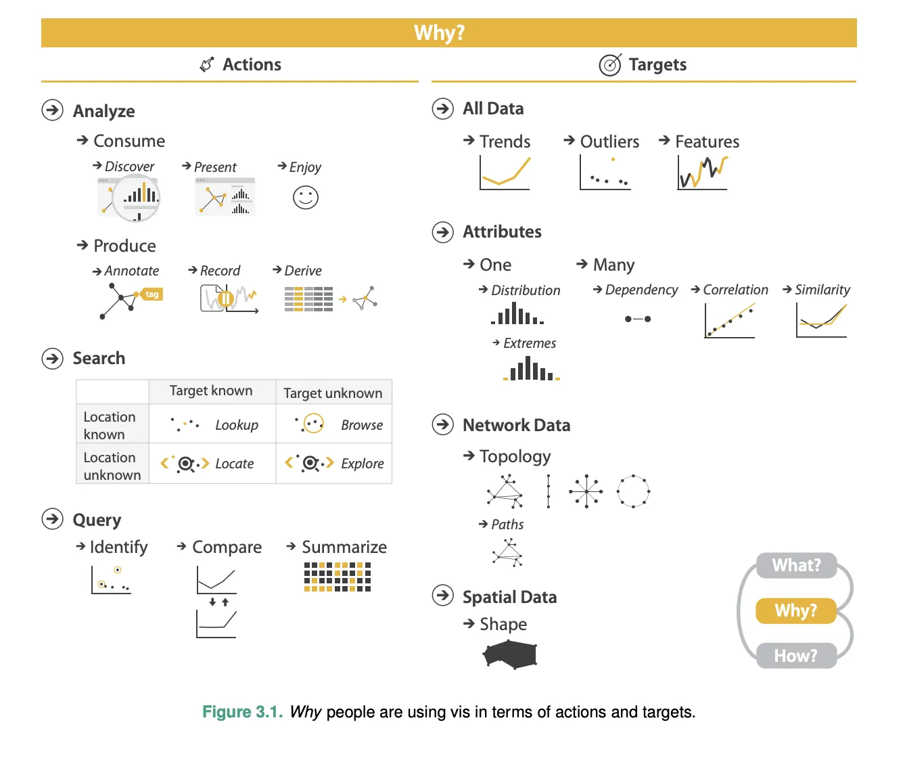
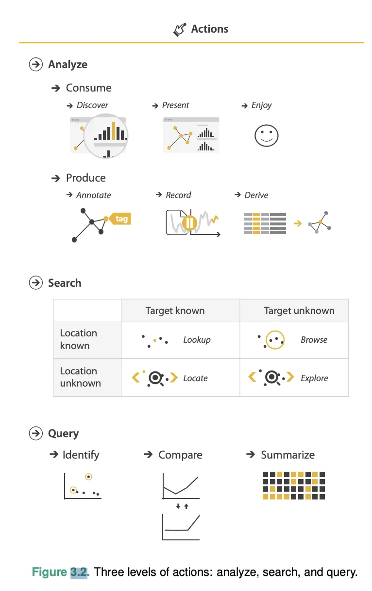
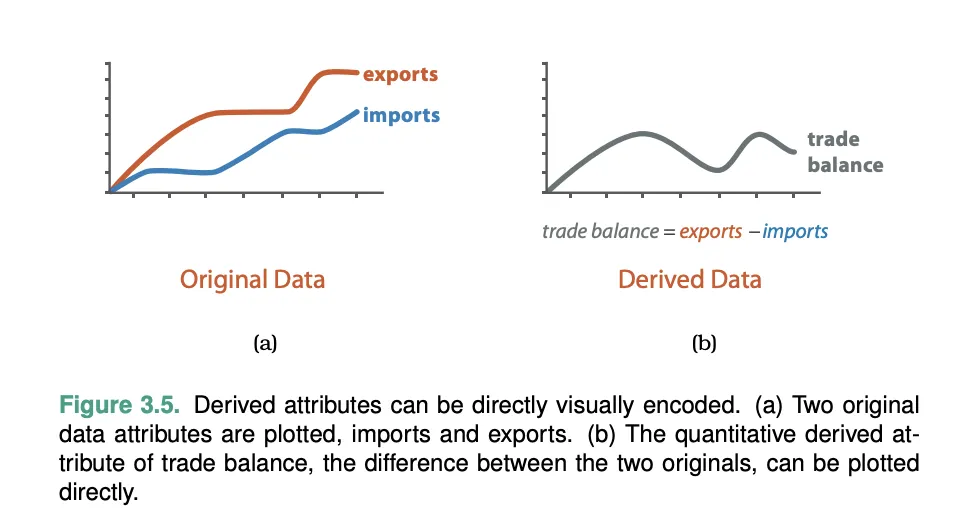
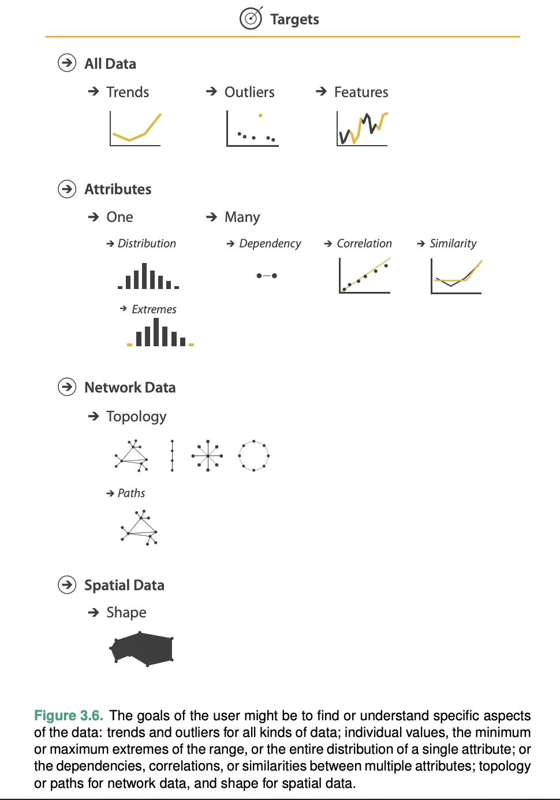
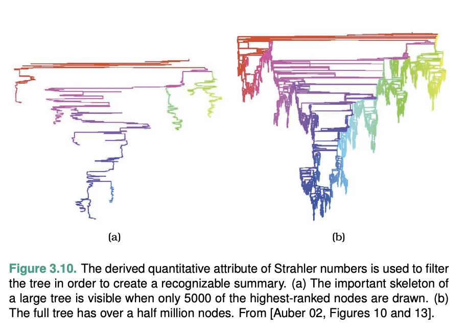

# B03: 任务抽象——Why 框架

## 教材位置
- 原著：Tamara Munzner, *Visualization Analysis & Design*, 2014
- 章节：Chapter 3 — Why: Task Abstraction
- 范围：3.1 - 3.7 (Lines 1 - 602)

## 核心知识提取

### 3.1 & 3.2 大局观与为什么要抽象化分析任务？ (The Big Picture & Why Analyze Tasks Abstractly?)
将用户目标分为**动作 (Actions)** 和 **目标 (Targets)**。
- **为什么抽象化？** 将领域特定（Domain-specific）的描述转换为抽象形式，可以揭示不同任务之间的相似性和差异。
  - *教材经典锚点*：医学专家的"对比预后（prognoses）"与生物学家的"查看组织样本是否匹配"，在各自领域听起来毫无关联，但在可视化抽象层面，它们都是 **"Compare values between two groups"（比较两组之间的值）**。抽象语言让我们能复用现有的设计模式。
- **动词与名词的结合**：抽象框架使用一小组精心挑选的词汇——动词描述动作（Actions），名词描述目标（Targets）。Why 不决定 How（目标不限定具体的视觉编码）。

### 3.3 动作的三层框架 (Three Levels of Actions)
用户目标（Actions）被分解为三个独立层级：分析（Analyze）、搜索（Search）和查询（Query）。

#### 层级 1：分析 (Analyze) - 消费 vs 生产
处于最高层，区分用户是消费现有数据还是主动生产新信息。
- **消费 (Consume)**：
  - **发现 (Discover)**：寻找之前未知的新知识，可以是为了生成新假设（Generate hypothesis）或验证现有假设（Verify hypothesis）。
  - **展示 (Present)**：将用户已经理解的特定事物有效沟通/讲述给第三方（如教学、简报、信息图表）。
  - **享受 (Enjoy)**：出于好奇心的休闲接触（如浏览博客上的数据新闻，如著名的 Name Voyager 案例）。
- **生产 (Produce)**：生成新材料，作为后续任务的输入。
  - **注释 (Annotate)**：手动为现有可视化元素添加图形或文本标签。
  - **记录 (Record)**：将可视化元素保存为持久伪影（Artifacts），如截图、书签、交互日志或图形历史记录。这对于支持**分析溯源 (Analytical Provenance)** 至关重要。
  - **派生 (Derive)**：基于现有数据元素生成新数据元素。这是一个至关重要的设计选择。**不要只是画出你得到的东西；决定正确要展示的东西，通过一系列转换创建它，然后再画出来！**（如：计算差值、从分类转经纬度、计算网络节点中心性）。

#### 层级 2：搜索 (Search) - 四象限
所有高层分析行为都需要中层的搜索作为支撑。根据目标的**身份 (Identity/Target)** 和 **位置 (Location)** 是否已知，分为四个象限：
- **查找 (Lookup)**：目标已知，位置已知。（例如：在树状图中直接找到人类所在的位置）。
- **定位 (Locate)**：目标已知，位置未知。（例如：在复杂的地图或树状图中四处寻找兔子在哪里）。
- **浏览 (Browse)**：目标未知（只知道符合特定特征），位置已知。（例如：在折线图中查看某一天所有公司的股价）。
- **探索 (Explore)**：目标未知，位置也未知。（例如：在散点图中寻找异常值，或者在时间序列中寻找异常尖峰）。

#### 层级 3：查询 (Query) - 三种粒度
找到搜索目标后，需要在三种范围（单数、复数、全部）内查询它们：
- **识别 (Identify)**：范围是单个目标（One target）。返回该目标的特征（如：加利福尼亚州的选举胜幅是多少）。
- **比较 (Compare)**：范围是多个目标（Multiple targets）。比识别更难，需要更复杂的图表支持。
- **总结 (Summarize / Overview)**：范围是所有可能的目标（All targets）。提供全局视图。

### 3.4 目标类型 (Targets)
目标（Noun/名词）是用户感兴趣的数据特定方面。

#### 适用所有数据类型 (All Data)
- **趋势 (Trends)**：数据模式的高层概括（增加、减少、峰值、高原）。
- **异常值 (Outliers)**：不符合一般背景趋势的元素。
- **特征 (Features)**：任务依赖的任何感兴趣的特定结构。

#### 针对属性 (Attributes)
- 单个属性 (One)：
  - **分布 (Distribution)**：属性所有值的整体分布模式。
  - **极值 (Extremes)**：最小值或最大值。
- 多个属性 (Many)：
  - **依赖关系 (Dependency)**：一个属性的值直接依赖于另一个属性。
  - **相关性 (Correlation)**：两个属性的值之间存在联系趋势。
  - **相似性 (Similarity)**：计算两个属性之间相似或不同的程度，允许排名。

#### 针对特定数据集
- **网络数据 (Network Data)**：**拓扑结构 (Topology)**（理解互连的整体结构）和 **路径 (Paths)**（连接两个节点的链接序列）。
- **空间数据 (Spatial Data)**：理解和比较几何**形状 (Shape)**。

### 3.5 分析与派生案例 (Derive Examples)
- **比较工具 (SpaceTree vs TreeJuxtaposer)**：同样的 What（树）和 Why（定位/识别路径），采用了不同的 How 解决方案（聚合过滤 vs 空间变形）。
- **派生类型的经典路径**：
  - *定量 -> 有序 -> 分类 (Quantitative -> Ordered -> Categorical)*：将连续的温度数值转化为"冷/暖/热"（有序），甚至直接转化为"吐司烤糊了/没烤糊"（分类二元）。
  - *分类 -> 空间 (Categorical -> Spatial)*：给定一个城市名"北京"，派生出对应的经纬度坐标，从而允许在地图上绘制。
- **派生单属性 (Strahler Number)**：为了展示几十万个节点组成的庞大树网，仅靠原始数据无法看清结构。通过计算一个**派生属性 (Derived attribute)** —— Strahler Number（衡量节点中心性/重要性），然后基于此过滤掉外围节点，保留前 5000 个核心节点，成功**总结 (Summarize)** 了整个网络的**拓扑 (Topology)**。
- **派生多属性 (流体力学空间)**：在原始 3D 物理空间视图中很难看清水流回旋区域，通过创建多个"派生空间视图"（如计算涡度与焓值的分布），特征就在派生视图中"聚集"起来，方便用户交互选择。

## 关键图表索引

| Figure | 教材图注 | 教材原文路径 (相对于 knowledge/textbook/Visualization Analysis & Design.../) | 已迁移路径 | 迁移状态 |
|:---|:---|:---|:---|:---|
| Fig 3.1 | Actions + Targets 全景映射图 | `images/09771069f26c7f7a3c67a6b06d349512125f79a13bc20021f5d75bf5927f8c2d.webp` (L400, ch06) |  | ✅ 已迁移 |
| Fig 3.2 | 动作的三层拆解：Analyze, Search, Query | `images/8338b3ad2ca06daea679c7d9deb0bee57a3b7eb45d2e7cd3b49bad11d916f37d.webp` (L45, ch07) |  | ✅ 已迁移 |
| Fig 3.5 | Derive 差值图经典案例 (贸易差额) | `images/673fa0bbb460f9b80c5ef88036f441827675459148f5c21c1e5a1d79b7f59da2.webp` (L182, ch07) |  | ✅ 已迁移 |
| Fig 3.6 | Targets 详细树状图 (Trends, Outliers, Features) | `images/c06e5416889462171602e0bb05ee392465a2be63288edf6eb3de281bf961409a.webp` (L255, ch07) |  | ✅ 已迁移 |
| Fig 3.10/3.11 | Strahler 数字派生过滤 | `images/5d354f57...` (inline ref in W03_07) |  | ✅ 已迁移 |

## 易混淆概念辨析
- **Explore (探索) vs Discover (发现)**：在本书框架中，Discover 是顶层 Analyze 动作（为了生成/验证新假设），而 Explore 是中层 Search 动作（在不知道目标身份和位置的情况下去寻找结构）。
- **Lookup vs Locate vs Browse vs Explore**：严格受二维矩阵控制：目标(已知/未知) x 位置(已知/未知)。
- **Derive (派生)** 是 Produce 的子类，这意味着修改原始数据列、清洗数据、计算差值在可视化理论中不是"前期准备"工作，而是交互式可视化分析本身的一个核心环节。

## 与逐字稿的对照检查表

- [ ] `CHK-B03-01`: 是否向学生强调了 "Why doesn't dictate how"（意图不决定呈现形式，相同的目的可以有多种不同的设计方案）？
  - 关键词: `意图`, `目的`, `How`, `Why`
  - 预期出现模块: M01 或 M03
- [ ] `CHK-B03-02`: 分析层——是否清楚讲解了 Discover / Present / Enjoy 三者的核心区别？
  - 关键词: `发现`, `展示`, `享受`, `Discover`, `Present`, `Enjoy`
  - 预期出现模块: M03
- [ ] `CHK-B03-03`: 搜索层——是否用直白的语言解释了 Lookup/Locate/Browse/Explore 的两维象限？
  - 关键词: `查找`, `定位`, `浏览`, `探索`, `Lookup`, `Locate`, `Browse`, `Explore`
  - 预期出现模块: M03
- [ ] `CHK-B03-04`: **关键点**——是否深度剖析了 Derive (派生) 的战略意义？（必须让 DMA 学生明白，遇到难以直接可视化的数据，第一步往往不是换图表，而是衍生新数据结构）
  - 关键词: `派生`, `Derive`, `差值`, `转化`
  - 预期出现模块: M03 或 M04
