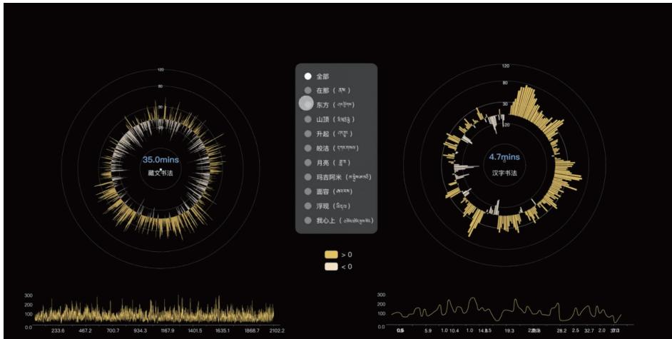
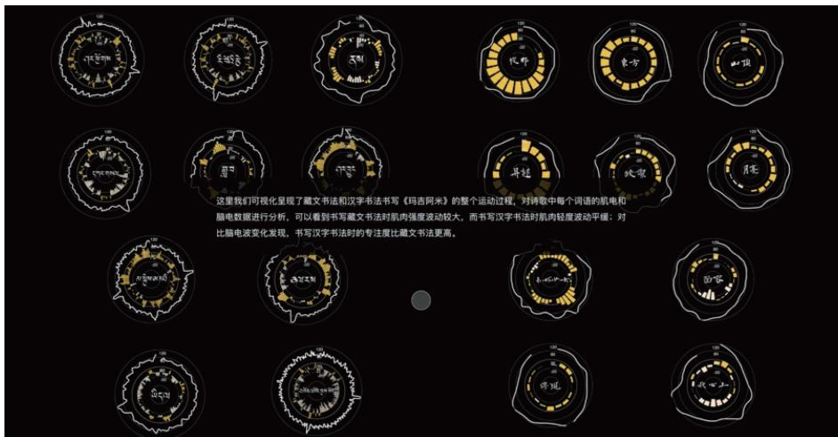
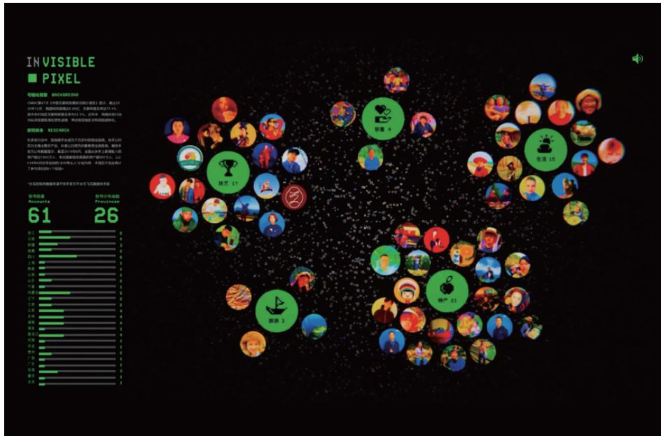
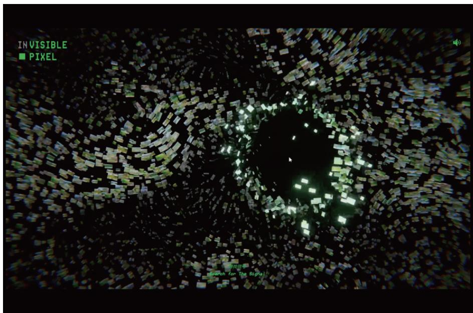
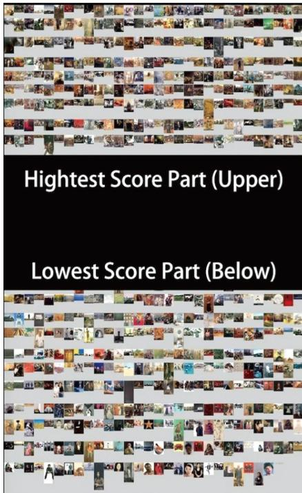
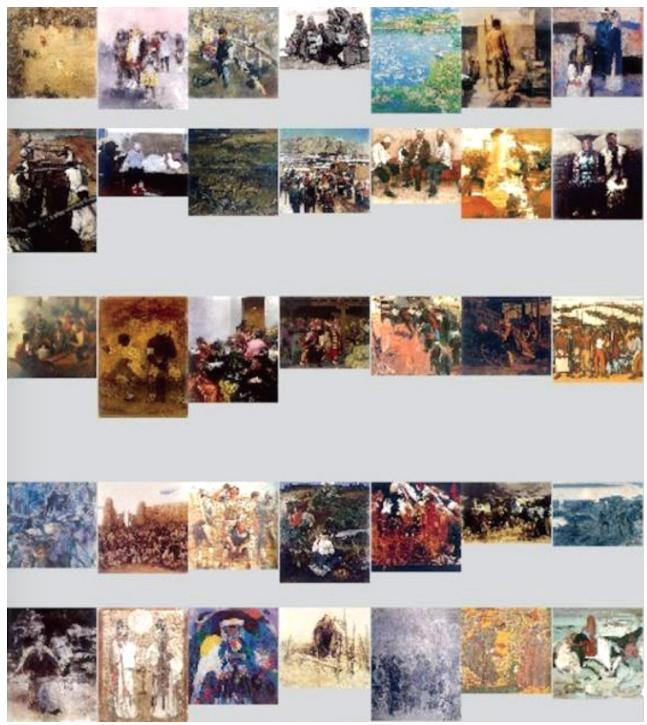
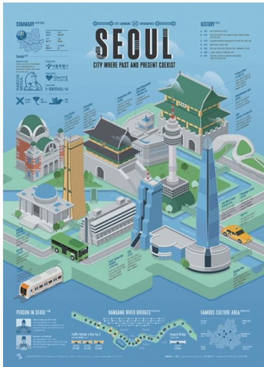
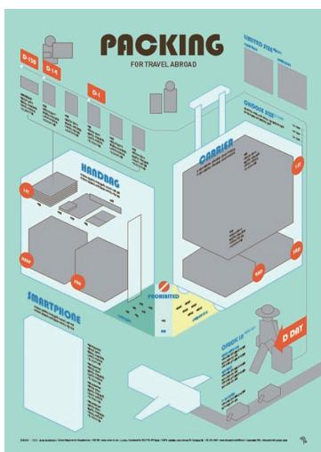

# B05: 大师作品解析与视觉隐喻

## 教材位置
- 原著：郝亚维，张博文《信息可视化设计》，2023
- 章节：第四章 — 信息可视化设计师/团队和优秀作品案例

## 核心知识提取

### 1. 中国本土信息可视化探索与文化重塑
本土团队在信息可视化中强调整合地域文化、审美价值与情感体验，体现了强烈的社会焦点与人文叙事，这与课程强调的"数据伦理"和"人文关怀"高度契合。

#### 1.1 上海大学团队：《解构藏文》
- **视觉隐喻**：采用大量可视化呈现方法对藏文进行解构，将藏文诗歌文本转化为视觉化图形。
- **设计价值**：不仅是图形的简单转化，更是引导从"单纯图形创作"向"良好信息体验"转变的典范。该作品重塑了读者对藏文及藏文化的理解，体现了数据可视化在文化传播与再造中的力量。

#### 1.2 江南大学团队：《Invisible Pixel》与乡村振兴
- **数据源与特征**：收集快手平台扶贫计划中的活跃用户及其视频描述文本。
- **叙事逻辑**：将互联网社交媒体上的私人表达转化为公共交流。运用机器算法自动生成图片，展现贫困账户群体。
- **技术实现**：结合 Unity 和 Deep-Zee（AI视觉生成），将抽取出的数据和描述文本转化为动态的数据叙事景观。
- **核心价值**：在主题知识化、情感体验方面展示了可视化为乡村振兴和精准扶贫提供决策支持的潜力。

#### 1.3 向帆团队：《Award Puzzle》(全国美展油画作品视觉化)
- **数据抽象 (What)**：将全国美展获奖油画作品构成为一个图像数据库。
- **派生属性 (Derive)**：运用人工智能图像分析（谷歌开源代码），分析提取色调、题材、画幅、获奖经历等属性，并寻找其与获奖的相关度。
- **交互隐喻 (Manipulate)**：300多张油画被抽象为彩色"斑点"。宏观上观众可以"凌空鸟瞰"斑斓的油画天地（总结 Overview），微观上可以"瞬时俯冲"观察每个作品细节（过滤/缩放 Filter/Zoom）。这是计算机技术与艺术研究结合的全新范式。

### 2. 国际大师案例：从数据到美学的转化

#### 2.1 扁平拟物与生活科普：张圣焕 (韩国)
- **核心理念**：用视觉信息打破地域和语言限制，强调结构清晰、趣味性强。
- **视觉风格**：采用拟物扁平的插图画风，详细绘制组成物品的部分与构件。
- **代表作**：《打包清单》、《紫菜包饭》、《烧酒》、韩国地图信息可视化。
- **理论映射**：通过极度清晰的组件拆解（Item/Attribute），将复杂的制作过程和生活经验平民化。

#### 2.2 插画叙事与信息分级：彼得·格兰迪 (英国) / 安娜·库阿 (西班牙)
- **彼得·格兰迪**：将枯燥的医学信息转化为简洁、优雅、富有想象力的艺术品。在《人类的身体》中运用幽默拉近受众与复杂信息的距离。
- **安娜·库阿**：强调"信息分级"与"框架串联"。主张插画必须起到解释数据的骨架作用（"图像易被理解的关键是让内容变得简单"）。作品特色包括等距视角（Isometric）、主插画的黑边线条与严谨的网格布局。

#### 2.3 建筑制图般的严谨与社会晴雨表：扬·施沃乔 (德国) / 阿尔贝托·卢卡斯 (美国)
- **扬·施沃乔**：强调数据与事实绝对相符，设计作品（如体育场馆信息图、《帆船戈奇福克》）像建筑师制图般精细，体现了严谨的数据求实精神。
- **阿尔贝托·卢卡斯**：作品《社会晴雨表》采用建筑高度（量化属性通道）作为度量社会价值的标尺。通过隐喻（人类历史上最高建筑从宗教建筑转向银行/商厦）揭示人类历史的利益发展趋势。

### 3. 动态交互与叙事架构 (复杂隐喻与社会议题)

#### 3.1 密度设计研究实验室 (DensityDesign)
- **《2015年孕产妇死亡率》**：以"鲜花"作为视觉隐喻。每片花瓣的数量对应孕产妇死亡率，动态数字花瓣的凋零呈现出生命流逝的过程，呼吁全球关注第三世界生育健康。

#### 3.2 仿生与空间映射经典案例
- **《1790—2016 年美国移民年轮》**：采用树的"年轮"生长图形指代多国人种的占比。国家是树，移民是细胞，年轮随着时间沉淀（Dendrochronology）。这种仿生隐喻极为有效地传递了时间序列数据（Time-series）与历史累积的重量感。
- **《洛杉矶及芝加哥的收入差距》**：建筑高度精确映射收入水平，直观揭示城市规划背后的贫富分化与种族隔离。
- **《塑料灾难》(国家地理)**：微塑料的密度通过极具冲击力的视觉散点分布进行表现，直接诉诸读者的环境危机感。

## 关键图表索引

| Figure | 教材图注 | 教材原文路径 (相对于 knowledge/textbook/信息可视化设计.../) | 已迁移路径 | 迁移状态 |
|:---|:---|:---|:---|:---|
| Fig 4-1/4-2 | 《解构藏文》作品 | `images/5d6b338b...` + `images/2b3bbf05...` |   | ✅ 已迁移 |
| Fig 4-4/4-5 | 《Invisible Pixel》作品 | `images/aed8d68b...` + `images/84bdf9dc...` |   | ✅ 已迁移 |
| Fig 4-7/4-8 | 《Award Puzzle》可视化界面 | `images/b61611fc...` + `images/dc8b47fa...` |   | ✅ 已迁移 |
| Fig 4-10 | 张圣焕——首尔地图信息可视化 | `images/7b0a4c9c...` |  | ✅ 已迁移 |
| Fig 4-18 | 张圣焕——《打包清单》草图及成品 | `images/07139285...` |  | ✅ 已迁移 |

## 与逐字稿的对照检查表

- [ ] `CHK-B05-01`: 经典作品逆向工程——是否支撑了 M05 工作坊中对《解构藏文》等设计的底层数据表（Item/Attribute）重构演练？
  - 关键词: `解构藏文`, `Award Puzzle`, `逆向`, `数据表`
  - 预期出现模块: M05
- [ ] `CHK-B05-02`: 人文锚点——是否整合了《孕产妇死亡率》、《社会晴雨表》等社会议题作品来支撑"数据伦理"叙事？
  - 关键词: `孕产妇`, `晴雨表`, `社会议题`, `伦理`
  - 预期出现模块: M01
- [ ] `CHK-B05-03`: 视觉隐喻分类——是否将教材中的大师作品按隐喻类型（仿生/空间映射/文化重塑）进行分类讲解？
  - 关键词: `隐喻`, `仿生`, `年轮`, `映射`
  - 预期出现模块: M01
