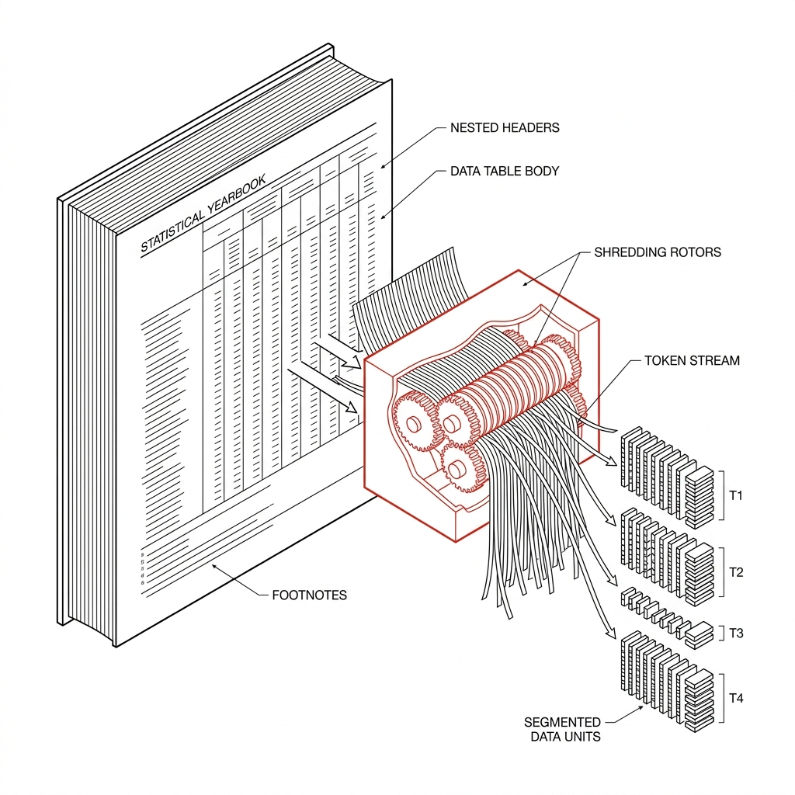

## 模块 1: 为什么你的 AI 画不出一张正常的图？ (30 分钟)
<!-- BUDGET: 4500 chars | SLIDES: ≥15 | STATUS: done -->
> [!NOTE] 核心标签回溯
> [data-ethics] [anti-tech-hegemony]

> [!NOTE] 教学备忘: 复习/导入
> 本模块回顾 W02 标记与通道编码原则，通过展示大语言模型（LLM）面对未处理原始数据时的失败案例与底层缺陷（一维 Token 序列 vs 二维空间网格），论证在 Vibe Coding 时代梳理**数据抽象**（What、Why）的必要性。

### 1.1 表皮狂热：大模型制图幻象的崩塌

> [VISUAL]
> *   **Slide**: `S01_Title_W03`
> *   **Layout**: `Center`
> *   **Scene**: 深色背景。中心是一座巨大的冰山。水面上是丰富的漂亮图表（如同上周讲的那些符合格式塔与数据墨水的图）；水面下则是庞大、复杂、布满划痕的原始数据表。
> *   **Text**: "看不见的冰山：数据洗礼与抽象建模"
> *   **Asset**: 

同学们好，在这座巨大的冰山面前，我们看到水面上丰富的漂亮图表。但这仅仅是表象，水面之下庞大且复杂的原始**数据表**，才是决定可视化成败的核心。

> [VISUAL]
> *   **Slide**: `S01a_Iceberg_Core_Illusion`
> *   **Layout**: `Concept`
> *   **Scene**: 冰山剖面特写。水面下的原始数据表格逐渐发光，隐现出错综复杂的连接线与结构关系。
> *   **Caption**: "透视底层：数据的骨骼决定了可视化的肉身。"
> *   **Text**: "透视底层：数据的骨骼决定了可视化的肉身。"
> *   **Asset**: 

各位同学，欢迎来到数据可视化核心框架体系理论的第三周。在经历了上周对视觉感知基石的探索后，今天我们将经历一次更加底层的深层思维转变。如果说通道与标记是可视化的肌肤色彩，那么今天我们要面对的，就是数据的**骨骼**与灵魂。我们将深入探讨数据本身的形态，理解如何通过解构与重组，让哪怕最混沌的原始数据重新建立秩序，完成从野生废土到精准工程件的升华。

### 1.2 灾难巡礼：未经架构师审查的坍塌

> [VISUAL]
> *   **Slide**: `S01b_W02_Review_Gestalt`
> *   **Layout**: `Split`
> *   **Scene**: 左侧重现第二周的格式塔法则图解，并且右侧展示数据墨水比的精简打磨动画。
> *   **Caption**: "从错觉到精准：用克制的图形语法构建视觉叙事。"
> *   **Text**: "从错觉到精准：用克制的图形语法构建视觉叙事。"
> *   **Asset**: 

在第二周，我们系统学习了“格式塔空间法则”和“数据墨水比原则”，探讨了如何克制地利用特定标记（Marks）和通道（Channels）这一套视觉语法，去设计出不骗人、高信噪比，且极具叙事张力的优雅图表。

现在，看看屏幕上这座巨大的冰山。请大家盯着水面之上那些闪闪发光、色彩绚丽的可视化图表。如果我现在问你们：开发出一张惊艳全球的纽约时报级别的信息图，最难的部分在哪里？很多人可能会回答：是高级审美！是复杂的 D3.js 贝塞尔曲线过渡动画！是对莫兰迪色系的精准运用！

> [VISUAL]
> *   **Slide**: `S01c_The_Aesthetics_Myth`
> *   **Layout**: `Full`
> *   **Scene**: 一名设计师对着满屏漂浮的代码特效与绚丽的调色板顶礼膜拜，却忽视了脚下正在崩塌的断层数据地基。
> *   **Caption**: "对表皮的狂热：审美与代码只是水面冰山的一角。"
> *   **Text**: "对表皮的狂热：审美与代码只是水面冰山的一角。"
> *   **Asset**: 

的确，在过去两周里学到的这些视觉语法绝对是有价值的——它们是画出好图的必要条件。但请注意，必要条件不等于充分条件。看起来，我们似乎已经掌握了让图表变美的所有魔法，对吧？然而真相是：审美和编码技巧，充其量只是这座冰山露出水面的那一小截尖角。尤其是在这个当下由 ChatGPT、Claude 和各类 Copilot 主导的氛围编程（Vibe Coding）时代，这种"我已经什么都会了"的错觉被无限放大了。很多人拿到了导师或老板丢过来的一堆堪称灾难的 Excel 数据，第一反应不是去阅读数据，而是直接把这坨长达 50MB 的乱码往大模型的对话框里一扔，满心欢喜地敲入一段口语化的**提示词工程**：“帮我把这些数据画成超级酷炫的动态散点图！”

> [VISUAL]
> *   **Slide**: `S02_The_LLM_Illusion`
> *   **Layout**: `Split`
> *   **Scene**: 左侧显示一个粗糙的提示词："拿这个Excel给我画个好看的图，最好有科技感"。右侧显示一个无尽转动的加载动画，随后吐出一大串代码，但渲染出的图表是一团黑红相间的乱码。
> *   **Caption**: "Vibe Coding 时代的错觉：以为喂进去泥土，就会自动吐出金子。"
> *   **Text**: "Vibe Coding 时代的错觉：以为喂进去泥土，就会自动吐出金子。"
> *   **Asset**: 

大家是不是觉得，只要把文件拖进去，AI 这个全知全能的神就能自动理解你的心意，不仅帮你读懂了那些充满缩写和黑话的表头，还顺便帮你排查了数据污染，最后渲染出一幅传世佳作？结果往往是灾难。当加载动画停止，你以为会看到一张洞察秋毫的**好图表**。但实际呈现的，却是一堆令人窒息的，充满着错位、折叠、甚至完全违反物理常识的**错误百出的图表**。

> [VISUAL]
> *   **Slide**: `S02b_Debugging_Workshop_Intro`
> *   **Layout**: `Grid`
> *   **Scene**: 屏幕中心打出巨大的红色警告标志，周围环绕着乱序的代码错误条目碎片。
> *   **Text**: "异常排查大研讨：揭开 AI 失控背后的隐秘病灶。"
> *   **Asset**: 

为了打破大家对 AI 的迷信，今天我们先来办一场异常排查研讨会。我们来看看，那些未经人类数据建筑师审查的原始表格，是如何把目前最聪明的大脑逼疯的。

> [VISUAL]
> *   **Slide**: `S03_AI_Plot_Failure_1`
> *   **Layout**: `Split`
> *   **Scene**: 左侧是一张原始的透视表截屏。右侧是一张被 AI 生成的柱状图，X 轴的刻度上，不仅排布着 "2019", "2020", "2021" 这样的年份，竟然在中段硬生生地插进来了 "北京市"、"上海市"、"广东省" 的**分类**标签。
> *   **Caption**: "灾难一：**维度**的物理坍塌。苹果和年份被强行排在了一起。"
> *   **Text**: "灾难一：**维度**的物理坍塌。苹果和年份被强行排在了一起。"
> *   **Asset**: 

假设你是一名刚入职的实习生，拿到了一份包含全球地震记录的 Excel 表。你没检查表的结构，直接对 AI 说：“帮我展现全球地震的空间分布热力趋势”。你期望得到一张精确标注震中位置的地图。但这堆未经处理的数据里，不仅混着各种非数值的文本，经纬度也和其他数字列穿插在一起。结果，AI 把地理坐标当成了普通数字直接做加法——出来的画面根本不是地球，而是一团完全错位的黑色图表。

> [VISUAL]
> *   **Slide**: `S03b_Merge_Cell_Catastrophe`
> *   **Layout**: `Flow`
> *   **Scene**: 展示合并单元格在读取过程中的错乱路径：视觉上的合并跨列，到了解析器中变成了平等的离哈希编码表头。
> *   **Caption**: "结构崩坏：AI 解析跨列合并单元格时的完全降维。"
> *   **Text**: "结构崩坏：AI 解析跨列合并单元格时的完全降维。"
> *   **Asset**: 

但这对于没有经过严密结构预处理的大模型来说，一旦它读取的 Excel 文件中存在跨列**合并单元格**，它的解析逻辑就会瞬间崩溃。大家在 Excel 里看到的“合并居中”非常美观，但在底层物理结构上，这种合并实际上只在左上角的第一个物理单元格内保留了文字，而其余原本被覆盖的空间全都被完全掏空，变成了空白的"幽灵格子"。程序员管这种幽灵格子叫 NaN——你可以把它想象成一个贴了标签却里面空空如也的快递箱：看起来占着位置，实际上打开全是空气。

> [VISUAL]
> *   **Slide**: `S03c_NaN_Void_Collapse`
> *   **Layout**: `Split`
> *   **Scene**: 左侧显示人类眼中的合并单元格，右侧揭示大模型读取时的空洞 `NaN`。文字如粉碎般坍塌到水平轴上。
> *   **Caption**: "致命的空洞：缺乏结构声明导致的维度物理性坍塌。"
> *   **Text**: "致命的空洞：缺乏结构声明导致的维度物理性坍塌。"
> *   **Asset**: 

当把这种带有巨大空洞的表格强行扔给大模型时，它根本不知道那些空白地带有历史遗留的合并意图。在它的视野中，只要文字出现，它就把文字拿走；而遇到成片的空白，它就直接截断数据流。原本归属于同一个省份的几十条城市数据，瞬间变成了找不到归属地址的无主孤儿，于是大模型只能把它们统统当成同级别的独立**分类**标签（Categorical Labels），然后在一条水平线上不受控制地死板平铺开来。这就是数据**维度**的物理性坍塌。

> [LIFE CONNECT] 现实隐喻：破损的快递单
> 这就好像你试图把同属一栋大楼里的三个不同的住户包裹，只凭借一份十分简略的便签打包发走。你自以为在便签最顶上写了一个巨大的“某某小区”就能统管下方所有人，但大模型这个快递分拣机器人是不讲情面的。它扫描第一份包裹时读到了地址，顺利发件；但扫到第二和第三份时，由于标签页上的跨行文字已经被抽空为空值，它只会直接把这两份包裹扔进系统死信退件箱。

> [VISUAL]
> *   **Slide**: `S03d_Metaphor_Parcel`
> *   **Layout**: `Center`
> *   **Scene**: 隐喻：破损的快递单。一个大模型机器人正在强行扫描跨行文字被抽空的包裹便签，由于找不到对应地址，将包裹粗暴丢进死信退件箱。
> *   **Caption**: "无主包裹：大模型分拣系统中的死信退件。"
> *   **Text**: "无主包裹：大模型分拣系统中的死信退件。"
> *   **Asset**: 

> [VISUAL]
> *   **Slide**: `S04_AI_Plot_Failure_2`
> *   **Layout**: `Full`
> *   **Scene**: 一张荒诞的折线图，Y 轴的刻度达到了“2.58 亿”。图的标题写着《全球重点地震带空间趋势波动图》。下方红字警示框写着：Y轴计算逻辑解析：SUM(Longtiude + Latitude)。
> *   **Caption**: "灾难二：剥夺人类定义的荒谬算术运算。"
> *   **Text**: "灾难二：剥夺人类定义的荒谬算术运算。"
> *   **Asset**: 

更恐怖的还在后面。来看第二个案例，这是典型的**计算错位**。这里有一份全球地震监测台网的原始数据，包含了发生地震的城市经度、纬度，以及里氏震级。一位产品经理急忙让大模型“帮我统计一下各个地震带整体的危害波动程度”，结果大模型自动生成的折线图，Y 轴直接飙升到了几百甚至几千万！

> [VISUAL]
> *   **Slide**: `S04b_Coordinate_Addition_Absurdity`
> *   **Layout**: `Grid`
> *   **Scene**: 动画演示：116.4°E（北京） + 74.0°W（纽约） = 虚无。地图从中间撕裂。
> *   **Text**: "坐标系相加：一场违反基本真实物理规律的数字游戏。"
> *   **Caption**: "坐标系相加：一场违反基本真实物理规律的数字游戏。"
> *   **Asset**: 

你仔细去反查底层代码，会绝望地发现它干了什么：它看了一眼这些数字，发现都是浮点数，于是它非常“聪明”地把所有地震的经度和纬度当作普通的存款余额一样，执行了无差别的求和运算！这就是最典型的**盲目求和灾难**。

> [VISUAL]
> *   **Slide**: `S04c_Categorical_vs_Quantitative`
> *   **Layout**: `Concept`
> *   **Scene**: 一道红色的光墙（天堑）将“分类属性”（如经纬度、学号）与“量化属性”（如存款余额、销售额）严格隔开。
> *   **Caption**: "核心认知错位：长得像数字的东西，未必能用来做加法。"
> *   **Text**: "核心认知错位：长得像数字的东西，未必能用来做加法。"
> *   **Asset**: 
> *   **Source**: Textbook

这就是我们这门课要紧紧咬住的一个核心数据认知错位：长得像数字的东西，未必就是可以用来做算术的。在数据科学的严格分类中，存在一条关键分水岭——**分类属性**（Categorical）与**量化属性**（Quantitative）之间不可逾越的天堑。学号、邮政编码是披着数字外衣的**分类标签**，对它们做加法毫无意义。而经纬度则更为特殊：它在数学上是**定量的**（可以计算两点之间的距离差），但它的**语义**是空间**位置 (Position)**——Munzner 教材将其定义为独立于前三者的第四种数据类型。北京的经纬度和纽约的经纬度直接相加没有物理意义，不是因为它是“分类型”，而是因为位置坐标的**语义规则**不支持简单求和——你需要的是距离公式，而不是加法。AI 系统如果得不到你“人类意志”的前置**数据结构**声明，它只要看到阿拉伯数字，默认就会调用 CPU 去执行求和求平均。

> [ACTIVITY]
> *   **Type**: `Quiz`
> *   **Duration**: `2min`
> *   **Desc**: 概念辨析：定量数值与空间语义的错位
> *   **Q**: 某数据新人在处理包含城市经纬度的记录表时，让大模型“统计各区域趋势”。大模型将经纬度列进行相加求和，导致图表纵轴数值破亿。这反映了我们在进行数据抽象时，忽视了哪个关键事实？
> *   **Options**: A. 经纬度属于序数型数据（Ordinal），只能进行等级排序，不能用来测量距离差 | B. 经纬度虽在数学上属于定量属性，但其语义是空间位置（Position），不支持无差别的算术求和 | C. 大模型无法识别文件中的跨列合并单元格，导致维度的物理性坍塌 | D. 经纬度在表格中以浮点数形式存储，导致模型自动调用了复杂的回归预测算法
> *   **Answer**: `B`
> *   **Explain**: 经纬度在数学上是可计算距离的（定量），但其核心语义是空间位置坐标。将两个地点的坐标直接相加无物理意义。AI 只会针对长得像数字的内容无差别求和，因此必须由人类架构师前置定义数据语义。（A定性错误，经纬度不是序数型；C/D均为干扰项，非本案核心诱因）

> [CASE STUDY] 被乱加的城市代码
> 在一个真实的政府开放数据可视化项目中，有开发者未做**数据抽象**，直接将包含国家统计局设定的城市六位行政区划代码（例如北京是 110000，上海是 310000）的巨型逗号分隔值表格（CSV）喂给大模型画对比图。结果，大模型为了展现“总体趋势”，错误地把这些区划代码全部当作收入总额作了暴力相加，生成了一个高达几千亿的不存在坐标总和！这不仅是图表的失败，这更是人类交出数据释义权后的逻辑溃败。

> [VISUAL]
> *   **Slide**: `S04d_Case_Study_CSV`
> *   **Layout**: `Split`
> *   **Scene**: 真实政府开放数据 CSV 截图，标注着如“110000”（北京区划码）的城市六位代码，旁边展示大模型错误相加得到的千亿级荒谬折线图。
> *   **Caption**: "释义权陷落：代码当成金额，AI 用错误加法毁灭真相。"
> *   **Text**: "释义权陷落：代码当成金额，AI 用错误加法毁灭真相。"
> *   **Asset**: 

> [PHILOSOPHY] 人文锚点：谁来决定这个数字能不能相加？
> 当你告诉 AI“这一列是城市编号，不能相加”时，你就在行使对数据的**解释权**。AI 看到的只是数字，它不知道 110000（北京区划码）和 310000（上海区划码）相加没有意义。这件事只有人类能做——你是数据的立法者，AI 只是执行法条的工具。永远不要把“这个数字意味着什么”的判断权，交给一个只会套公式的程序。

> [VISUAL]
> *   **Slide**: `S05_AI_Plot_Failure_3`
> *   **Layout**: `Split`
> *   **Scene**: 左侧是几万条日志滚动的黑色后台。右侧是典型的高密度面条图灾难：几百条颜色几乎无法肉眼分辨的杂乱线段紧紧交缠在一起，像是一团乱麻，背景还密密麻麻标满了没有意义的十六进制 User_ID 号。
> *   **Caption**: "灾难三：没有信息降噪层级的无差别物理投射。"
> *   **Text**: "灾难三：没有信息降噪层级的无差别物理投射。"
> *   **Asset**: 

最后这张图，我们在很多糟糕的 B 端管理后台上常常能见到，这就是声名狼藉的面条图，英文称作 **Spaghetti Chart** 灾难。当你把包含五万名客户行为记录的原始日志，不加任何聚类条件，直接扔给 AI 并说“帮我画出趋势”，它非常忠诚地把每一行都画成了一条独立连线。结果就是屏幕变成了一段失去任何信噪比的黑色乱麻网络。这不仅没有沉浸感，更致命的是，所有的有效信息全部被淹没在了无差别的线条叠加中。观众的视网膜会立刻发出超载警报。这是完全放弃数据意图拆解的最终惩罚，你必须在大模型渲染前先行砍掉这些无效冗余。

> [VISUAL]
> *   **Slide**: `S05b_Overplotting_Blindness`
> *   **Layout**: `Full`
> *   **Scene**: 视网膜被无数黑色细线遮蔽的特写。在黑线的深处隐约闪着红光，但完全无法看清。
> *   **Caption**: "视觉遮蔽：当数据狂澜越过承载极限，真理便潜藏在阴影之中。"
> *   **Text**: "视觉遮蔽：当数据狂澜越过承载极限，真理便潜藏在阴影之中。"
> *   **Asset**: 
> *   **Source**: Textbook

这正是第二周学过的**像素分配法则**在发出警报：当数据量超出屏幕像素的承载极限时，无差别地画每一条线，不仅传递不了任何洞察，反而会遮蔽真正重要的信息。

> [VISUAL]
> *   **Slide**: `S05c_Pixel_Overload`
> *   **Layout**: `Image`
> *   **Scene**: 屏幕像素格被无数黑线强制塞满的微观特写图，底层微小的异动红线被完全掩埋。
> *   **Caption**: "突破物理渲染极限：过载映射带来的反向视觉遮蔽与信息谋杀。"
> *   **Text**: "突破物理渲染极限：过载映射带来的反向视觉遮蔽与信息谋杀。"
> *   **Asset**: 

因为在前端代码眼里，一百根相互叠加在同一个极窄坐标位上的黑线，在视网膜的最终成像效果上，和一根单独画在那里的粗黑线没有任何色差感知上的本质区别！这就是所谓严重的视觉遮蔽（Overplotting）。这层厚重如黑泥般的数据油墨板结，会掩盖掉真正在底部微小缝隙里发生异动的报警求救信号。不经提炼便全盘照收的大画卷，形同于视觉谋杀。

> [TEACHING MOMENT] 核心金句: 数量不等于质量，堆砌不等于呈现。真正的数据素养，从懂得何时该剔除，何时该聚合开始。

> [CASE STUDY] 大模型面对合并单元格的崩溃实录
> 把一份《中国统计年鉴》的宽表——带着合并单元格、嵌套表头和中文脚注——直接扔给大模型，会发生什么？模型的 Token 序列解析器是一维的，它无法理解二维的合并结构。原本应该关联的“2010年-东部地区-GDP总额”三层结构，被拆成了互不相识的碎片。地区名被当成数值去计算，最终输出满屏红色报错。
>
> 核心教训：大模型读表格就像用手指一个字一个字地读——它看不到行列的空间关系。不先清洗结构，再强的模型也只是一条在数据迷宫里撞墙的盲蛇。

> [VISUAL]
> *   **Slide**: `S05d_Textbook_Overplotting`
> *   **Layout**: `Center`
> *   **Scene**: 教材案例实录：一本《中国统计年鉴》的复杂宽表（含嵌套表头和中文脚注）输入到大模型的 Token 序列解析器中被强行撕碎的过程。
> *   **Caption**: "盲蛇撞墙：复杂宽表进入一维解析器后的灾难性撕碎。"
> *   **Text**: "盲蛇撞墙：复杂宽表进入一维解析器后的灾难性撕碎。"
> *   **Asset**: 

### 1.3 机器视差：一维字符对多维网格的完全误读

> [VISUAL]
> *   **Slide**: `S06_The_Machine_View`
> *   **Layout**: `Split`
> *   **Scene**: 屏幕底色变为深沉的代码编辑器。一段被拆解为极小文字碎片的数据流犹如《黑客帝国》的瀑布流般单向滑落。上面覆盖着一个大语言模型正在逐字逐字往前读的闪烁光标。
> *   **Caption**: "机器视差：大模型眼中的世界，只有永远向前的一维线性长河。"
> *   **Text**: "机器视差：大模型眼中的世界，只有永远向前的一维线性长河。"
> *   **Asset**: 

如果你不作任何的数据**重塑**而直接下达画图指令，你就是在强迫一个纯粹算数引擎去理解人类社会混乱的潜规则。当我们把那些包含着五六万条未经清洗的黑匣子日志原样推进去时，就会爆发前面展示的那种面条图（Spaghetti Chart）灾祸。

> [VISUAL]
> *   **Slide**: `S06a_Poisonous_Data_String`
> *   **Layout**: `Quote`
> *   **Scene**: 一串带有星号、空值、合并占位符的序列化数据字符串，每个异常字符都被标红显示为“剧毒乱码”。
> *   **Caption**: "剧毒的数据链：隐藏的空缺与备注在单向度模型世界中的破坏力。"
> *   **Text**: "剧毒的数据链：隐藏的空缺与备注在单向度模型世界中的破坏力。"
> *   **Asset**: 

更深层的原因在于，对于一个基于自然语言符号序列的大语言模型来说，表格里多出来的合并居中、隐藏的空缺值以及夹杂在数据中的备注星号，全都是剧毒的乱码。在它的单向度逻辑世界观中，根本没有你眼中那浑然天成的格式塔表格网格结构，只存在**一维序列的破坏力**。如果不事先清理出畅通的矩阵数据通道，它唯一能给你的反应，就是像被异物卡住喉咙一般，吐出一堆完全错位的像素映射，或者是直接甩给你满屏红色崩溃退出的严重报错日志。

> [VISUAL]
> *   **Slide**: `S06b_Grid_Vs_Stream`
> *   **Layout**: `Split`
> *   **Scene**: 左边是人类大脑视觉皮层下的严整二维矩阵，闪耀着交叉十字光芒。右边是大模型算力核心中，排队等待进入 Transformer 窗口的单行无限字符串列车。
> *   **Caption**: "多维网格幻象与一维真实字流的致命鸿沟。"
> *   **Text**: "多维网格幻象与一维真实字流的致命鸿沟。"
> *   **Asset**: 

人类看表格时，会自动理解行和列的空间关系——上周学过的格式塔法则就是这个道理。但大模型读表格的方式完全不同：它像用手指从左到右、从上到下一个字一个字读课本，只能看到一串排队的文字。逗号、回车、数字，在它眼里全是平等的排队关系，没有“行”和“列”的概念，导致严重的**空间关系错位**。所以当表格里有合并单元格时，它就像读到一本被撕碎重新粘贴的书，完全不知道哪段话属于哪个段落。如果你不事先告诉它数据的属性框架，它就只能瞎猜。

### 1.4 锻造结晶：探明数据本质与任务拆解

> [VISUAL]
> *   **Slide**: `S07_Data_Shape_Concept`
> *   **Layout**: `Split`
> *   **Scene**: 左侧动画：从布满灰尘的原始矿坑里被挖出来粗糙，夹杂着大量泥土杂质的铁矿石原石，旁边标注原始死板数据（Raw Messy Data）。右侧动画：矿石被扔进高温红色高炉中熔炼锻打，最后弹射出发出寒光的精确机械齿轮，旁边标注提炼后的**数据抽象**形状（Abstracted Data Shape）。
> *   **Caption**: "未经锻造的原始数据矿石，无法驱动精美的齿轮引擎。"
> *   **Text**: "未经锻造的原始数据矿石，无法驱动精美的齿轮引擎。"
> *   **Asset**: 

因此，为了摆脱这种一抓瞎的绝境，在真正的专业数据可视化工程流中，我们存在一个不能跨越的关键环节：那就是**数据抽象**与形状重组。这绝不是你在表格软件里简单点个排序或者筛选那么儿戏。这是要在心智层面，如同法医骨骼重构般，深度审视这团没有头绪的数字组织。你必须亲自裁定它的本质属性，拔除一切干扰杂质，将其强硬锻打淬炼为大模型能够无损吞吐的纯净结晶体。

> [VISUAL]
> *   **Slide**: `S07a_Data_Autopsy`
> *   **Layout**: `Concept`
> *   **Scene**: 法医式的数字解剖图。一堆杂乱的数字在 X 光下显露出清晰的树状或图状“拓扑骨架”。
> *   **Caption**: "数字解剖：亲自裁定本质属性，淬炼为纯净结晶体。"
> *   **Text**: "数字解剖：亲自裁定本质属性，淬炼为纯净结晶体。"
> *   **Asset**: 

任何试图跨过这道工序去追求图表炫目的行径，最终只会画出一堆虚无的美丽垃圾。你对数据的重压提炼程度，直接决定了最终作品可供下钻分析的理论深度边界，这也是你与普通做图员的根本区别所在。

> [VISUAL]
> *   **Slide**: `S07b_The_Core_Questions`
> *   **Layout**: `Split`
> *   **Scene**: 两条深刻的发问像灼热烙铁一样烫印在厚重的书籍封面上。配合缓慢推进的光影特效。
> *   **Text**: "重返源头：不探明 What 与 Why，所有的 How 都是空中楼阁。"
> *   **List**: ["对象性质", "用户意图"]
> *   **Caption**: "重返源头：不探明 What 与 Why，所有的 How 都是空中楼阁。"
> *   **Asset**: 

那最底层，最决定生死的一万个为什么：“这段字符串到底是个什么（What）对象？”“客户背后的本质心愿是什么（Why）要挖掘它？”就像你拿着生锈矿石命令顶级工匠打造精良工具，结局必然是崩裂。在严防死守的现代可视化体系中，不经过深度抽象和派生**重塑**（（Derive））的表格，就是定时炸弹。熔炼必须先于展示。

> [VISUAL]
> *   **Slide**: `S08_Munzner_Framework_Intro`
> *   **Layout**: `Grid`
> *   **Scene**: 一座雅典神庙式的古典建筑，支撑金字塔顶端的三根巨大柱子模型。左侧纯蓝色的巨柱写着：What（**数据抽象** - 破译基因）；正中央红色的巨柱写着：Why（**任务抽象** - 截获意图）；右侧金色的巨柱写着：How（视觉与交互编码 - 表达万象）。底部台阶上深深地刻着 Tamara Munzner 的名字。
> *   **Text**: "Tamara Munzner的《可视化分析与设计》：重塑数据世界的三维信条。"
> *   **Caption**: "Tamara Munzner的《可视化分析与设计》：**重塑**数据世界的三维信条。"
> *   **Asset**: 
> *   **Source**: Textbook

在这门课中，我们的核心框架来自不列颠哥伦比亚大学计算机科学系教授 Tamara Munzner。她的著作《**可视化分析与设计**》定义了现代可视化的理论基石，提供了一套应对复杂数据结构的分析方法论。这不仅是本课程的纲领，更是你未来处理海量真实业务数据时的思维护甲。掌握这一框架，你将不再是只会调用图表库的画图员，而是能够洞察数据本质、引导 AI 进行精准分析的设计架构师。

好，为了检验大家是否真的明白了这个框架的优先级，我们来做个快速测验。

> [ACTIVITY]
> *   **Type**: `Quiz`
> *   **Duration**: `2min`
> *   **Desc**: 概念辨析：What与Why的优先级判断
> *   **Q**: 一位实习生拿到包含合并单元格的原始营业表，直接让大模型“画出各省份季度销量的折线图”，结果由于城市维度坍塌导致图表全盘报错。为了解决报错，他决定修改提示词，增加“极简风格”指令。根据 Munzner 框架，这一失败的根源在于他跳过了哪一层抽象？
> *   **Options**: A. 缺乏对 How 层级数据墨水比的审查 | B. 跳过了 What 层级数据本质属性的确权与重塑 | C. 未在 Why 层级定义大语言模型的人格角色 | D. 忽视了格式塔原则在坐标系构建中的应用
> *   **Answer**: `B`
> *   **Explain**: 大模型的报错是因为它无法将二维网格（合并单元格）投射为一维序列，发生了维度物理性坍塌（What 层抽象缺失）。实习生试图用修改色彩样式（How）的提示词来掩盖底层数据的结构崩坏，是典型的本末倒置。

我们来看一下后台的数据反馈。

> [VISUAL]
> *   **Slide**: `S08b_Quiz_What_Why`
> *   **Layout**: `Split`
> *   **Scene**: 一张错配诊断卡片，上半部分是城市维度坍塌的报错界面（What缺失），下半部分是试图用“极简风格”提示词（How）去强行修复的荒谬对比。
> *   **Caption**: "抽象倒挂：企图用画笔（How）去修复地基（What）的崩塌。"
> *   **Text**: "抽象倒挂：企图用画笔（How）去修复地基（What）的崩塌。"
> *   **Asset**: 

> [VISUAL]
> *   **Slide**: `S09_What_Why_How_Depth`
> *   **Layout**: `Flow`
> *   **Scene**: 一个三层的俄罗斯套娃式漏斗图，并且展示数据从真实世界依次流经 What、Why 和 How 层的过滤与映射过程。
> *   **Caption**: "编译流：没有精确的底层结构抽象，最华丽的图形语法也不过是南辕北辙的废品。"
> *   **Text**: "编译流：没有精确的底层结构抽象，最华丽的图形语法也不过是南辕北辙的废品。"
> *   **Asset**: 
> *   **Source**: Textbook

回顾前两周死命纠结的色彩搭配和标记选择，这些全都被限制在名为 How（如何呈现）的最终执行层。如果没有精准的 What（这到底是周期数据还是离散分类？），以及洞悉人性的 Why（我们画图是为了找异常还是做汇报？），你的 How 就会像打扮得花枝招展却完全指错路的向导。这就要求大家建立起一种结构化数字透视眼。当你面对密集的表格，你要能在刹那间看破它们隐藏在底层的基元属性和意图语义。

### 1.5 结构法则：用高维雷达夺回代码执刀权

> [VISUAL]
> *   **Slide**: `S10_LLM_Prompt_Hierarchy`
> *   **Layout**: `Split`
> *   **Scene**: 左侧：一个菜鸟的简陋提示词（"用这些数据画个折线图"）。右侧：展示重要的架构师级别提示词控制面板。
> *   **Caption**: "掌控大模型的结构化指令：基于学术抽象概念的结构化发令术。"
> *   **Text**: "掌控大模型的结构化指令：基于学术抽象概念的结构化发令术。"
> *   **Asset**: 

身处于这个提示词工程狂飙时代，开发速度固然被拉升，但关于数据背后的物理模型阐释权威，始终只牢牢握在人类数据架构师手中！如果不懂得底层数据的拓扑骨架，你甚至无法给 AI 编写出哪怕一条具有纠错自愈能力的结构化高级提示词。你只能像个没有主见的乞求者一样写下：“求求你把我的乱码修好画个好看的图。”然后在使用这种黑盒指令的过程中，在报错和不断扭曲的胡乱渲染中陷入无尽绝望。

> [VISUAL]
> *   **Slide**: `S10a_Prompt_Surgeon`
> *   **Layout**: `Concept`
> *   **Scene**: 手术台视图。一份精确的“结构化指令清单”正在如手术刀般精准剔除原始数据中的错误冗余。
> *   **Caption**: "手术级提示词：用底层拓扑术语向 AI 发号施令。"
> *   **Text**: "手术级提示词：用底层拓扑术语向 AI 发号施令。"
> *   **List**: ["分类标签", "时间排序", "量化数值"]
> *   **Asset**: 

相反，如果你理解了数据的底层结构，你给大模型的指令就会变得精准有效：“这份表格的第一列是城市名称，是分类标签，不能做数学运算；第二列是年份，按时间排序；第三列是 GDP 数值，可以求和比较。请删除带有‘合计’字样的汇总行，然后画一张折线图，X 轴是年份，Y 轴是 GDP，不同城市用不同颜色。”当你能清楚地告诉 AI 每一列数据“是什么”和“能做什么”时，它就会变成你手中最高效的工具。这才是真正的**结构化指令**控制。

> [VISUAL]
> *   **Slide**: `S10b_AI_Sharpshooter`
> *   **Layout**: `Full`
> *   **Scene**: 一名戴着精准定位镜的生化仿生人，即 AI，但镜头准星的红点由他身旁的人类观察手指引。
> *   **Caption**: "AI 是绝佳的神箭手，但它必须依赖人类的结构化视野去锁定真实猎物。"
> *   **Text**: "AI 是绝佳的神箭手，但它必须依赖人类的结构化视野去锁定真实猎物。"
> *   **Asset**: 

大模型就是你手中的高效工具，但这个工具需要你来指方向。只有你亲自确认了每一列数据的类型和含义，AI 才能精准执行。如果你连数据里哪些是分类标签、哪些是可计算的数值都分不清，就对着 AI 说“帮我画个图”，那等待你的必然是满屏报错。真正的核心竞争力，是你脑海中对**数据结构**的清晰理解。

> [VISUAL]
> *   **Slide**: `S11_The_Iceberg_Dive`
> *   **Layout**: `Full`
> *   **Scene**: 第一张开篇巨型冰山的动态延伸版。聚焦水面图表的镜头，发出穿戴潜水装置的下潜声响。随着幽蓝海水起伏，镜头急剧破入冰冷深渊海域，一位光影特效探险家开始逼近冰山底座——那里盘根错节生长着狂野庞大的原始数据逻辑结构基底暗礁。
> *   **Caption**: "抛弃陆地的虚荣，深潜入海：在此刻开启我们的淬火**重塑**之旅。"
> *   **Text**: "抛弃陆地的虚荣，深潜入海：在此刻开启我们的淬火重塑之旅。"
> *   **Asset**: 

这就是所谓的 What —— 它到底是什么！这是 Munzner 指出的第一阶确实法则：抛开一切图表形式的外壳，深潜到那几乎能将人冻伤的原始数据深海里。

> [VISUAL]
> *   **Slide**: `S11a_Data_Gene_Sequencing`
> *   **Layout**: `Concept`
> *   **Scene**: 基因测序仪的光芒扫过一排排杂乱数字，将它们精确分类为不同的颜色代码块，并打上不容篡改的印记。
> *   **Caption**: "基因级确权：赋予数字不可篡改的底层属性烙印。"
> *   **Text**: "基因级确权：赋予数字不可篡改的底层属性烙印。"
> *   **Asset**: 

你必须像专业基因测序中心的操作员一样，冷血、理智且毫不留情地将这堆密密麻麻如泥浆般的统计数字，执行显微镜级别的严格**分类**。你不但要识别它们是孤立存在的独立个体，还是互相交织咬合的网络链路，还要给它们的每一列数据头上打上不能篡改的物种属性基因烙印。唯有经历了这般严苛的底层清洗重塑，才能确实保证后续的图形渲染引擎不会因为吞入异物而引发灾难性的系统崩溃报错。这是你作为数字架构师压倒一切的最高职责所在。

> [VISUAL]
> *   **Slide**: `S11b_Dive_Roadmap`
> *   **Layout**: `Split`
> *   **Scene**: 潜水仪表盘上弹出的深海探测量表与下潜目标指南。
> *   **Text**: "深潜作战指南：重铸数据实体的三座里程碑。"
> *   **List**: ["基因解剖", "意图截获", "混沌熔炼"]
> *   **Caption**: "深潜作战指南：重铸数据实体的三座里程碑。"
> *   **Asset**: 

我们将全副武装地学习：如何像分子生物学家一样，给一切信息源定性确权，回答 What 难题。如何像联合国资深翻译官一样，把没有逻辑的需求，精确降频翻译为纯粹计算机行动指令，回答 Why 的动力来源。以及最核心的战役，握紧顶级数据架构师的真理之剑，将千疮百孔的野生表格，重新压缩为即使大模型也能百分百读懂解析的整洁完美**长表**结构。

探照灯已经打开，高炉的熔炼火焰正在燃烧！带好行装，向深渊进发。

**(Pause: 3s 留出安静的沉浸留白，准备过渡下个知识核心)**
