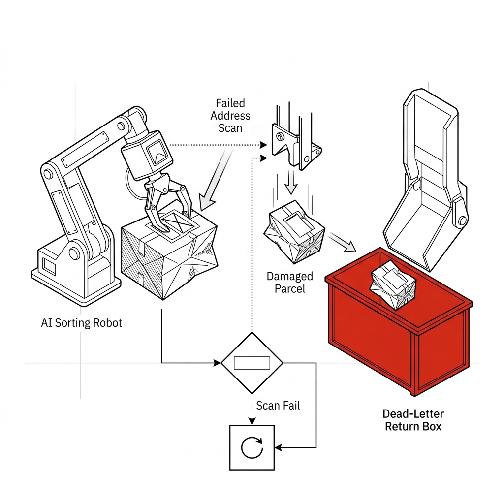
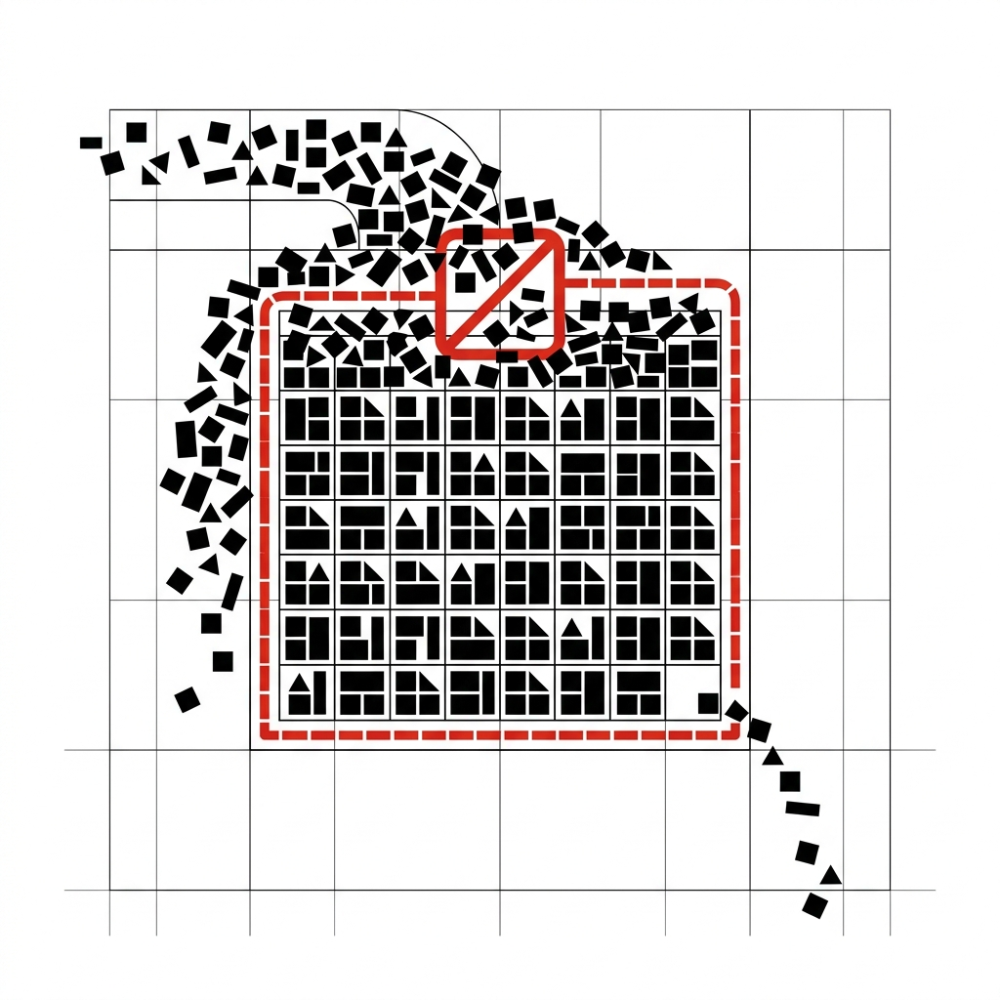
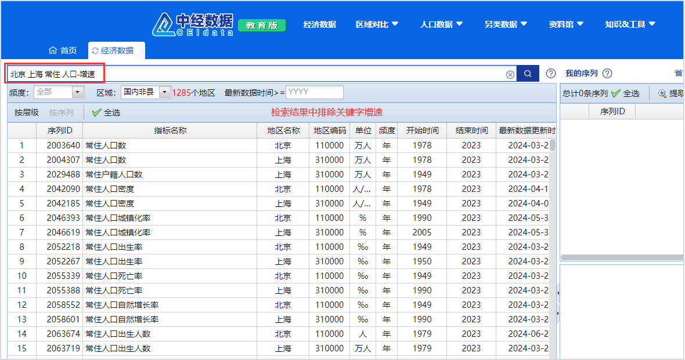
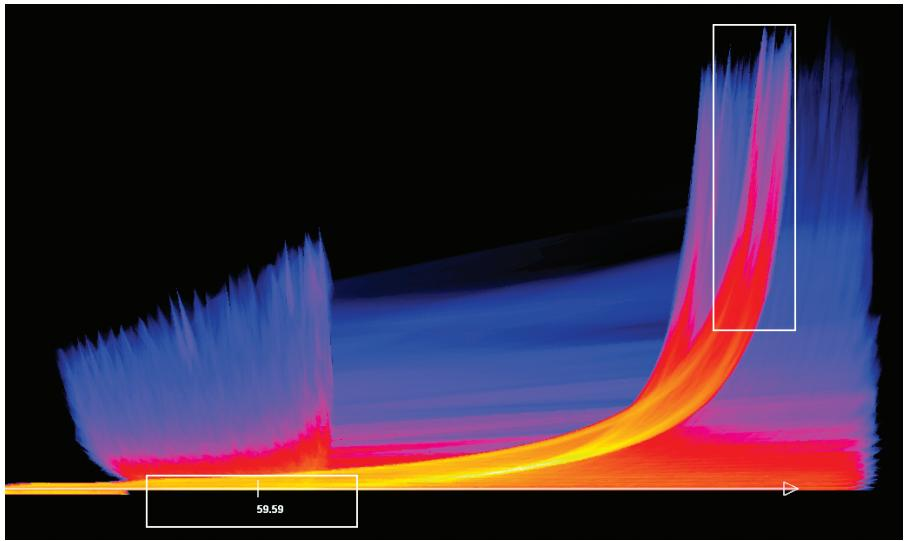
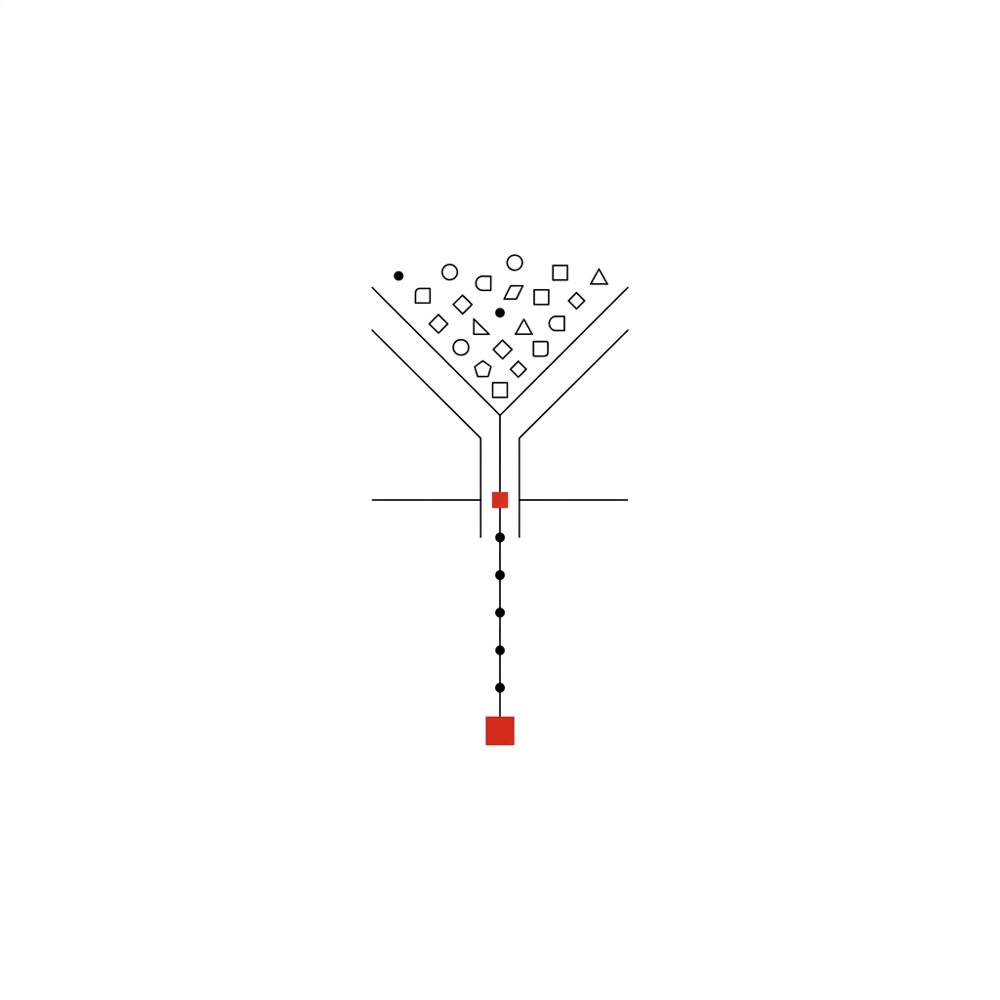
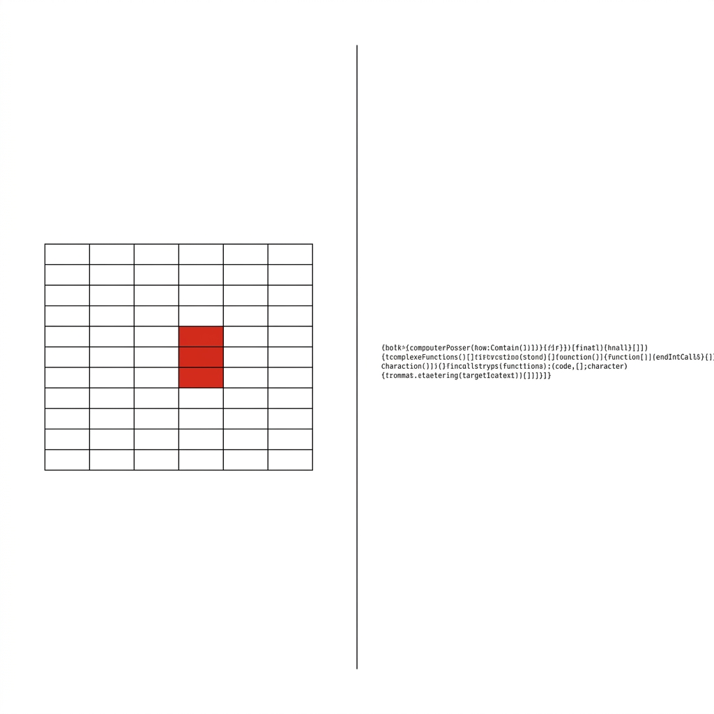
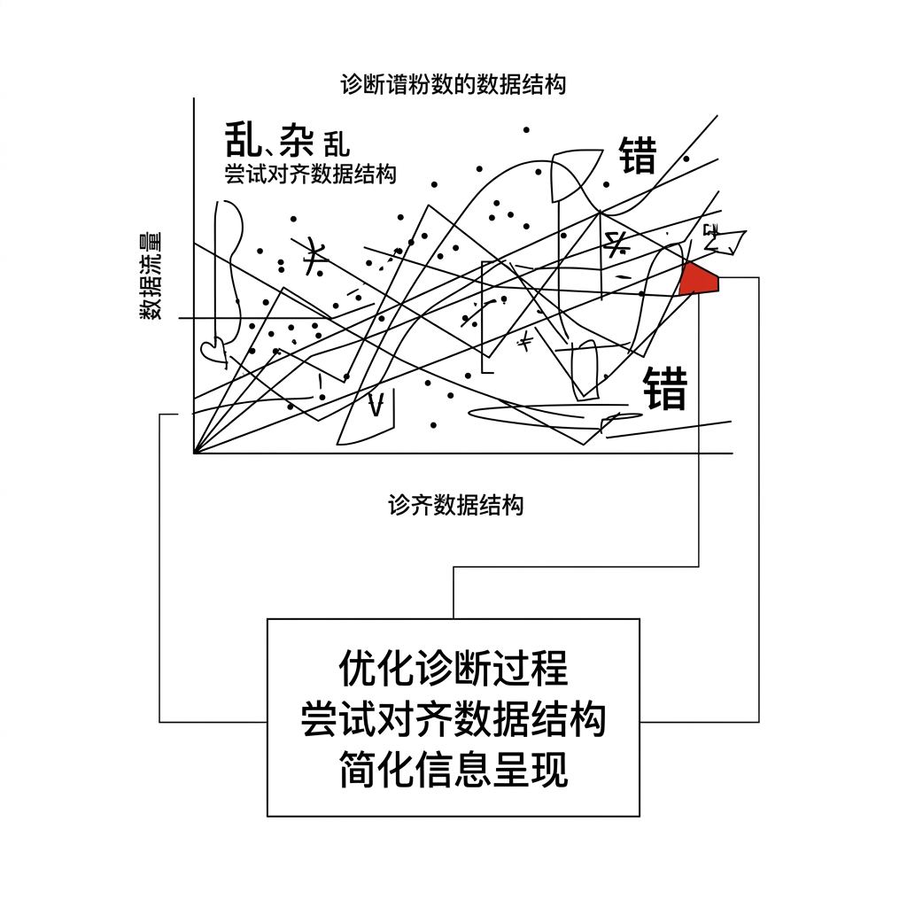
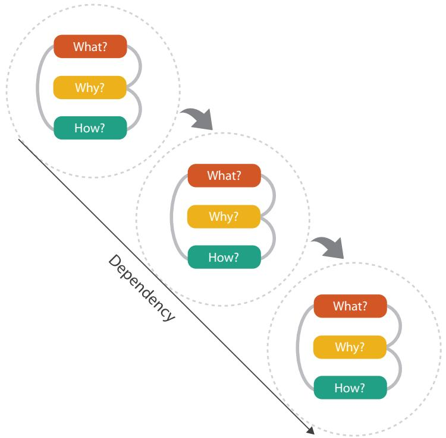

## 模块 1: 为什么你的 AI 画不出一张正常的图？ (30 分钟)
<!-- BUDGET: 4500 chars | SLIDES: ≥15 | STATUS: done -->
> [!NOTE] 核心标签回溯
> [data-ethics] [anti-tech-hegemony]

> [!NOTE] 教学备忘: 复习/导入
> 本模块回顾 W02 标记与通道编码原则，通过展示大语言模型（LLM）面对未处理原始数据时的失败案例与底层缺陷（一维 Token 序列 vs 二维空间网格），论证在 Vibe Coding 时代梳理**数据抽象**（What、Why）的必要性。

### 1.1 表皮狂热：大模型制图幻象的崩塌

> [VISUAL]
> *   **Slide**: `S01a_Iceberg_Core_Illusion`
> *   **Layout**: `Concept`
> *   **Scene**: 冰山剖面特写。水面下的原始数据表格逐渐发光，隐现出错综复杂的连接线与结构关系。
> *   **Caption**: "透视底层：数据的骨骼决定了可视化的肉身。"
> *   **Text**: "透视底层：数据的骨骼决定了可视化的肉身。"
> *   **Asset**: 

各位同学，欢迎来到第三周。上周我们学了怎么用颜色和形状来画图，那是可视化的“皮肤”。今天，我们要看看它的“骨骼”——数据。我们要学怎么把一堆乱七八糟的表格，变成能做出酷炫图表的原材料。

### 1.2 灾难巡礼：未经架构师审查的坍塌

> [VISUAL]
> *   **Slide**: `S01b_W02_Review_Gestalt`
> *   **Layout**: `Concept`
> *   **Scene**: 承接上一张冰山场景，镜头聚焦冰山露出水面在阳光下闪耀的尖角。尖角表面浮现出第二周学习的"格式塔法则"图解与"数据墨水比"的极简线条。
> *   **Caption**: "水面之上的表皮：用克制的图形语法构建视觉叙事。"
> *   **Text**: "水面之上的表皮：用克制的图形语法构建视觉叙事。"
> *   **Asset**: 

上周我们学了“格式塔空间法则”（人类怎么自动脑补图形关系）和“数据墨水比原则”（怎么去掉多余的装饰，让数据自己说话）。有了这些排版和构图技巧，做出一张神级的数据图，最难的是什么？大家可能会觉得是审美、动画或者配色。

> [VISUAL]
> *   **Slide**: `S01c_The_Aesthetics_Myth`
> *   **Layout**: `Full`
> *   **Scene**: 一名设计师对着满屏漂浮的代码特效与绚丽的调色板顶礼膜拜，却忽视了脚下正在崩塌的断层数据地基。
> *   **Caption**: "对表皮的狂热：审美与代码只是水面冰山的一角。"
> *   **Text**: "对表皮的狂热：审美与代码只是水面冰山的一角。"
> *   **Asset**: 

其实不是。审美只是冰山露出水面的一角。现在有了 AI，很多人拿到老板给的烂表格，连看都不看就扔给 AI：“给我画个超酷的散点图！”

> [VISUAL]
> *   **Slide**: `S02_The_LLM_Illusion`
> *   **Layout**: `Split`
> *   **Scene**: 左侧显示一个粗糙的提示词："拿这个Excel给我画个好看的图，最好有科技感"。右侧显示一个无尽转动的加载动画，随后吐出一大串代码，但渲染出的图表是一团黑红相间的乱码。
> *   **Caption**: "Vibe Coding 时代的错觉：以为喂进去泥土，就会自动吐出金子。"
> *   **Text**: "Vibe Coding 时代的错觉：以为喂进去泥土，就会自动吐出金子。"
> *   **Asset**: 

你以为直接扔给 AI 就万事大吉？结果往往是灾难——底层的画图工具吐出一堆错位、完全没法用的垃圾图表。

今天我们就来看看，平时我们乱写的 Excel，是怎么把最聪明的 AI 逼疯的。

> [VISUAL]
> *   **Slide**: `S03_AI_Plot_Failure_1`
> *   **Layout**: `Split`
> *   **Scene**: 左侧是一份混杂着文字备注和空白行的杂乱原始数据表。右侧原本应是一张地球表面的地震热力图，却因为底层工具强行将文字标签和时间刻度拼凑在坐标轴上，导致生成的图表完全崩坏，化作一团布满乱码的黑糊糊的线条与斑块。
> *   **Caption**: "灾难一：维度的物理坍塌。文字标签与时间刻度被强行缝合，热力图化作一团乱码。"
> *   **Text**: "灾难一：维度的物理坍塌。文字标签与时间刻度被强行缝合，热力图化作一团乱码。"
> *   **Asset**: 

假设你想让 AI 画个地震热力图。数据里却混着各种文字备注和空白行。AI 本身能看懂你的数据，但它调用的底层画图工具却非常死板。一旦数据格式混乱，底层工具读取时就会失败报错，或者像右图这样，强行把文字标签和年份凑在一起，画出来的根本不是地球，而是一团黑乎乎的乱码。

> [VISUAL]
> *   **Slide**: `S03b_Merge_Cell_Catastrophe`
> *   **Layout**: `Flow`
> *   **Scene**: 展示合并单元格在读取过程中的错乱路径：视觉上的合并跨列，到了解析器中变成了平等的离哈希编码表头。
> *   **Caption**: "结构崩坏：AI 解析跨列合并单元格时的完全降维。"
> *   **Text**: "结构崩坏：AI 解析跨列合并单元格时的完全降维。"
> *   **Asset**: 

为什么会报错？比如大家都爱用的“合并单元格”。人看着好看，但当你把这表丢给 AI 生成的代码脚本去读取时，底层的数据工具只会识别第一个格子里有字，其余被盖住的格子全变成了空值——程序员管这种空洞叫做 NaN（Not a Number）。

> [VISUAL]
> *   **Slide**: `S03c_NaN_Void_Collapse`
> *   **Layout**: `Split`
> *   **Scene**: 左侧显示人类眼中的合并单元格，右侧揭示大模型读取时的空洞 `NaN`。文字如粉碎般坍塌到水平轴上。
> *   **Caption**: "致命的空洞：缺乏结构声明导致的维度物理性坍塌。"
> *   **Text**: "致命的空洞：缺乏结构声明导致的维度物理性坍塌。"
> *   **Asset**: 

底层程序遇到 NaN 这种空值，要么报错，要么直接跳过。原本属于同一个省的城市，因为上级的单元格变成了空值，瞬间变成了找不到家的孤儿。程序只能把它们强行摊平，整个数据的层级关系瞬间就被压平全毁了。这不是 AI 的问题——AI 其实能推断出表格的意思，但它调用的传统计算引擎非常死板，遇到脏数据就必然崩溃。

> [VISUAL]
> *   **Slide**: `S03d_Metaphor_Parcel`
> *   **Layout**: `Center`
> *   **Scene**: 隐喻：破损的快递单。一个大模型机器人正在强行扫描跨行文字被抽空的包裹便签，由于找不到对应地址，将包裹粗暴丢进死信退件箱。
> *   **Caption**: "无主包裹：大模型分拣系统中的死信退件。"
> *   **Text**: "无主包裹：大模型分拣系统中的死信退件。"
> *   **Asset**: 

> [LIFE CONNECT] 现实隐喻：破损的快递单
> 这就好像你试图把同属一栋大楼里的三个不同的住户包裹，只凭借一份十分简略的便签打包发走。你自以为在便签最顶上写了一个巨大的"某某小区"就能统管下方所有人，但大模型这个快递分拣机器人是不讲情面的。它扫描第一份包裹时读到了地址，顺利发件；但扫到第二和第三份时，由于标签页上的跨行文字已经被抽空为空值，它只会直接把这两份包裹扔进系统死信退件箱。

> [VISUAL]
> *   **Slide**: `S04_AI_Plot_Failure_2`
> *   **Layout**: `Full`
> *   **Scene**: 一张荒诞的折线图，Y 轴的刻度达到了"2.58 亿"。图的标题写着《全球重点地震带空间趋势波动图》。下方红字警示框写着：Y轴计算逻辑解析：SUM(Longtiude + Latitude)。
> *   **Caption**: "灾难二：剥夺人类定义的荒谬算术运算。"
> *   **Text**: "灾难二：剥夺人类定义的荒谬算术运算。"
> *   **Asset**: 

更离谱的还在后面。第二个灾难是瞎算术。有人让 AI 画地震趋势图，结果图表的数值居然飙到了几千万！

> [VISUAL]
> *   **Slide**: `S04b_Coordinate_Addition_Absurdity`
> *   **Layout**: `Grid`
> *   **Scene**: 动画演示：116.4°E（北京） + 74.0°W（纽约） = 虚无。地图从中间撕裂。
> *   **Text**: "坐标系相加：一场违反基本真实物理规律的数字游戏。"
> *   **Caption**: "坐标系相加：一场违反基本真实物理规律的数字游戏。"
> *   **Asset**: 

原因很简单：虽然 AI 知道这是经纬度，但底层的计算工具只认数据类型标签——经度纬度都是浮点数，就顺理成章地像工资一样加起来了！这就叫底层工具的"盲目求和"。

> [VISUAL]
> *   **Slide**: `S04c1_Dead_Letter`
> *   **Layout**: `Concept`
> *   **Scene**: 死信退件箱被塞满导致系统瘫痪的视觉隐喻。
> *   **Caption**: "未分类的混沌数据：足以塞满并瘫痪任何精密计算系统的死信退件箱。"
> *   **Asset**: 

记住数据世界里一个核心的教材概念分水岭：**长得像数字的东西，不一定能做加法**。我们将数据属性分为三类：一是**“量化属性”（Quantitative）**，比如存款、销售额，这些是可以拿来做加减乘除的真实数字；二是**“序数属性”（Ordinal）**，比如衣服的 S/M/L 尺码或电影的一星到五星，它们有大小顺序但不能做精确的加减计算；三是**“分类属性”（Categorical）**，比如学号、邮政编码和经纬度，它们只是披着数字外衣的分类标签。把北京和纽约的经纬度加起来毫无意义。如果你不提前给数据定性，底层的程序就会盲目把所有数字都扔进公式里求和。

> [ACTIVITY]
> *   **Type**: `Quiz`
> *   **Duration**: `2min`
> *   **Desc**: 概念辨析：定量数值与空间语义的错位
> *   **Q**: 某数据新人在处理包含城市经纬度的记录表时，让大模型"统计各区域趋势"。大模型将经纬度列进行相加求和，导致图表纵轴数值破亿。这反映了我们在进行数据抽象时，忽视了哪个关键事实？
> *   **Options**: A. 经纬度属于序数型数据（Ordinal），只能进行等级排序，不能用来测量距离差 | B. 经纬度虽在数学上属于定量属性，但其语义是空间位置（Position），不支持无差别的算术求和 | C. 大模型无法识别文件中的跨列合并单元格，导致维度的物理性坍塌 | D. 经纬度在表格中以浮点数形式存储，导致模型自动调用了复杂的回归预测算法
> *   **Answer**: `B`
> *   **Explain**: 经纬度在数学上是可计算距离的（定量），但其核心语义是空间位置坐标。将两个地点的坐标直接相加无物理意义。底层计算工具只会针对长得像数字的内容无差别求和，因此人类在指挥 AI 时，必须前置定义数据语义，确保生成的代码中包含正确的类型声明。（A定性错误，经纬度不是序数型；C/D均为干扰项，非本案核心诱因）

> [VISUAL]
> *   **Slide**: `S04d_Case_Study_CSV`
> *   **Layout**: `Center`
> *   **Scene**: 中经数据（CEIdata）平台的真实检索界面截图。表格中同时包含了作为纯分类标签的数字（如“地区编码” 110000、“序列ID” 2003640）和真实的量化指标。
> *   **Caption**: "真实场景中的数字陷阱：业务表单里的编码往往披着可计算数字的外衣。"
> *   **Text**: "小心真实表格里的数字伪装者"
> *   **Asset**: 

> [CASE STUDY] 真实数据平台中的“伪装者”
> 观察右图“中经数据（CEIdata）”平台 2024 年更新的京沪常住人口数据检索表。在“地区名称”旁，紧跟着一列“地区编码”（北京是 110000，上海是 310000），最左侧还有一列七位数的“序列ID”。如果你把这张真实的业务数据表下载下来直接丢给 AI 或画图软件，灾难就会发生。因为在底层的程序眼里，`110000` 这个分类编码和后面表示人口数量的定量数值长得一模一样，都是“Int”类型的数字。AI 能通过上下文推断出这些是分类编码，但底层的画图程序可不会。如果不提前声明数据类型，底层工具就会把城市编码甚至序列 ID 都放进坐标轴或求和公式里，制造出一张毫无逻辑的图表。

> [PHILOSOPHY] 人文锚点：谁来决定这个数字能不能相加？
> 当你告诉 AI"这一列是城市编号，不能相加"时，你就在行使对数据的**解释权**。AI 能像人类一样秒懂这只是分类编码，但底层的计算程序看到的只是数字。你在提示词中约束 AI 时，实际是在要求它为底层工具写入正确的类型声明。你是数据的立法者，底层程序只是执行法条的机器。永远不要把"这个数字意味着什么"的判断权，交给只会套公式的底层工具。

> [VISUAL]
> *   **Slide**: `S05_AI_Plot_Failure_3`
> *   **Layout**: `Split`
> *   **Scene**: 左侧是几万条日志滚动的黑色后台。右侧是典型的高密度面条图灾难：几百条颜色几乎无法肉眼分辨的杂乱线段紧紧交缠在一起，像是一团乱麻，背景还密密麻麻标满了没有意义的十六进制 User_ID 号。
> *   **Caption**: "灾难三：没有信息降噪层级的无差别物理投射。"
> *   **Text**: "灾难三：没有信息降噪层级的无差别物理投射。"
> *   **Asset**: 

最后是著名的“**面条图（Spaghetti Chart）**”灾难。如果你把几万条原始客户数据直接扔给 AI，它写的画图脚本会老老实实把每一条数据都画成一条线。结果交织在一起，像一盘搅乱的面条，什么也看不清。

为什么会这样？这就触碰到了上周讲过的“**像素分配法则**”的物理死线：屏幕上的像素点是极其有限的。当几万条线被迫挤进几百个像素的高度时，就会发生教材中定义的灾难——“**视觉遮蔽（Overplotting）**”。

> [VISUAL]
> *   **Slide**: `S05c_Pixel_Overload`
> *   **Layout**: `Image`
> *   **Scene**: 屏幕像素格被无数黑线强制塞满的微观特写图，底层微小的异动红线被完全掩埋。
> *   **Caption**: "突破物理渲染极限：过载映射带来的反向视觉遮蔽与信息谋杀。"
> *   **Text**: "突破物理渲染极限：过载映射带来的反向视觉遮蔽与信息谋杀。"
> *   **Asset**: 

一百根黑线叠在同一个像素点上，最终呈现的只是一片死黑。这不仅没有传递任何洞察，反而构成了一场“信息谋杀”：真正在底部出现异常的红色报警信号，被这团黑线无情地掩埋了。这就是不做数据过滤，直接交给程序暴力渲染的代价。

> [VISUAL]
> *   **Slide**: `S05b_Overplotting_Blindness`
> *   **Layout**: `Split`
> *   **Scene**: 展现 Munzner 教材中关于解决 Overplotting 的真实高密度图表（Fig 13.6）。黑色背景上，密集的线条通过颜色从蓝到红/黄渐变，来标识数据高度堆叠的密度中心。
> *   **Caption**: "教材案例：即使动用高级的密度色彩映射，过载的数据依然会让画面极其拥挤。"
> *   **Text**: "视觉遮蔽的补救：与其在图形上挣扎，不如在源头过滤"
> *   **Asset**: 
> *   **Source**: Textbook

所以，面对海量数据，与其指望用复杂的色彩透明度等高级视觉技巧（如上图教材案例）去强行看清那团“毛线”，不如在源头就直接干预——用条件过滤掉噪音，只让最核心的数据上屏。

> [VISUAL]
> *   **Slide**: `S05d_Teaching_Moment`
> *   **Layout**: `Title`
> *   **Scene**: 纯净极简的白色空间中，一个象征着“提取”与“过滤”的微小几何锚点。通过大面积留白来烘托金句的文字排版。
> *   **Caption**: "数量不等于质量，堆砌不等于呈现。"
> *   **Text**: "数量不等于质量，堆砌不等于呈现。真正的数据素养，从懂得何时该剔除，何时该聚合开始。"
> *   **Asset**: 

> [TEACHING MOMENT] 核心金句: 数量不等于质量，堆砌不等于呈现。真正的数据素养，从懂得何时该剔除，何时该聚合开始。

### 1.3 机器视差：AI 为什么读不懂你的表格

> [VISUAL]
> *   **Slide**: `S06_Machine_Parallax`
> *   **Layout**: `Split`
> *   **Scene**: 左侧是人类视角下的数据：结构清晰的二维网格表格，大脑通过格式塔法则自动识别行与列的空间结构。右侧是机器解析时的底层盲区：原本二维的表格被强制压扁拉扯成一条无尽的线性字符流，底层画图工具在这条字符流中完全丧失了空间感知。
> *   **Caption**: "机器视差：人类眼中的二维空间矩阵，在机器底层只是一条无意义的线性字符。"
> *   **Text**: "机器视差：空间认知与线性字符的底层错位。"
> *   **Asset**: 

这些灾难的根源其实只有一个：**底层的传统程序和你看表格的方式完全不同**。AI 大模型其实具备和人类一样的语义理解力——它能推断出“110000 是编码不能求和”。但 AI 最终要通过生成代码来调用底层的传统画图工具，而这些工具毫无语义感知能力。我们人类看表格时，上周讲过的“格式塔法则”会帮大脑自动脑补出表格矩阵的空间结构，一眼辨认行和列。但底层程序读取数据时，只会把它看作一条永远向前的、平等的线性字符串。如果不提前清理好数据结构，底层工具就会在错乱的输入中全盘崩溃。

### 1.4 锻造结晶：探明数据本质与任务拆解

> [VISUAL]
> *   **Slide**: `S07_Data_Shape_Concept`
> *   **Layout**: `Split`
> *   **Scene**: 左侧动画：从布满灰尘的原始矿坑里被挖出来粗糙，夹杂着大量泥土杂质的铁矿石原石，旁边标注原始死板数据（Raw Messy Data）。右侧动画：矿石被扔进高温红色高炉中熔炼锻打，最后弹射出发出寒光的精确机械齿轮，旁边标注提炼后的**数据抽象**形状（Abstracted Data Shape）。
> *   **Caption**: "未经锻造的原始数据矿石，无法驱动精美的齿轮引擎。"
> *   **Text**: "未经锻造的原始数据矿石，无法驱动精美的齿轮引擎。"
> *   **Asset**: 

要让底层工具乖乖听话，必须做好一步：**数据梳理**。也就是你得确保底层工具能正确识别：这列是分类标签，还是能做加减法的数字？数据整理干净，AI 生成代码时才能给底层工具下达正确的类型指令。

> [VISUAL]
> *   **Slide**: `S07a_Data_Autopsy`
> *   **Layout**: `Concept`
> *   **Scene**: 法医式的数字解剖图。一堆杂乱的数字在 X 光下显露出清晰的树状或图状"拓扑骨架"。
> *   **Caption**: "数字解剖：亲自裁定本质属性，淬炼为纯净结晶体。"
> *   **Text**: "数字解剖：亲自裁定本质属性，淬炼为纯净结晶体。"
> *   **Asset**: 

不整理数据就想画图，做出来的只能是华丽的垃圾。你对数据梳理得越清楚，图表就能越酷炫。

> [VISUAL]
> *   **Slide**: `S07b_The_Core_Questions`
> *   **Layout**: `Split`
> *   **Scene**: 两条深刻的发问像灼热烙铁一样烫印在厚重的书籍封面上。配合缓慢推进的光影特效。
> *   **Text**: "重返源头：不探明 What 与 Why，所有的 How 都是空中楼阁。"
> *   **List**: 
>     - 对象性质
>     - 用户意图
> *   **Caption**: "重返源头：不探明 What 与 Why，所有的 How 都是空中楼阁。"
> *   **Asset**: 

画图前，先问两个问题：**“这是什么数据？（What）”**以及**“为什么要画它？（Why）”**。没想清楚，图就毁了。

> [VISUAL]
> *   **Slide**: `S08_Munzner_Framework_Intro`
> *   **Layout**: `Grid`
> *   **Scene**: 一座雅典神庙式的古典建筑，支撑金字塔顶端的三根巨大柱子模型。左侧纯蓝色的巨柱写着：What（**数据抽象** - 破译基因）；正中央红色的巨柱写着：Why（**任务抽象** - 截获意图）；右侧金色的巨柱写着：How（视觉与交互编码 - 表达万象）。底部台阶上深深地刻着 Tamara Munzner 的名字。
> *   **Text**: "Tamara Munzner的《可视化分析与设计》：重塑数据世界的三维信条。"
> *   **Caption**: "Tamara Munzner的《可视化分析与设计》：**重塑**数据世界的三维信条。"
> *   **Asset**: 
> *   **Source**: Textbook

经典的可视化框架有三大支柱：**What（数据本身）、Why（分析目的）、How（具体怎么画）**。掌握它们，你就能精准指挥 AI。

> [VISUAL]
> *   **Slide**: `S08a_DIKW_Pyramid`
> *   **Layout**: `Image`
> *   **Scene**: 第一周课程中使用的 DIKW（数据-信息-知识-智慧）金字塔模型图。
> *   **Caption**: "知识的阶梯：唯有稳固的 What (数据) 与 Why (信息)，才能托举起 How (知识)。"
> *   **Text**: "知识的阶梯：唯有稳固的 What (数据) 与 Why (信息)，才能托举起 How (知识)。"
> *   **Asset**: 
> *   **Source**: W01 课程资产

> [TEACHING MOMENT] 跨学科回响：重温 DIKW 金字塔
> 讲到这里，大家回忆一下第一周我们读郝亚维教授《信息可视化设计》教材时，提到的那个从下往上的“DIKW 数据金字塔”：
> - 最底层是杂乱无章的 **Data（数据）**：这就是你手里未经处理的原始表格，必须用 **What（数据抽象）** 去梳理出骨架。
> - 中间层是 **Information（信息）**：你需要通过 **Why（任务抽象）** 明确目标，把冰冷的数据提取成有逻辑的信息。
> - 顶层是 **Knowledge（知识）**：通过正确的 **How（视觉编码）** 画出图表，让读者一眼看懂，最终传递出洞察。
> 
> 很多新手用 AI 翻车，就是因为他们跳过了底层的“数据”与“信息”提炼，直接跳到金字塔尖，要求机器凭空给他们画出代表“知识”的美丽图表。地基不牢，金字塔自然会轰然倒塌。

> [VISUAL]
> *   **Slide**: `S08b_Quiz_What_Why`
> *   **Layout**: `Split`
> *   **Scene**: 一张错配诊断卡片，上半部分是数据解析错位导致的恶心“乱码图”（What缺失），下半部分是实习生试图用"极简风格和高级配色"提示词（How）去强行挽救的荒谬对比。
> *   **Caption**: "抽象倒挂：企图用画笔（How）去修复地基（What）的崩塌。"
> *   **Text**: "抽象倒挂：企图用画笔（How）去修复地基（What）的崩塌。"
> *   **Asset**: 

来，做个快速测验看看大家懂了没。

> [ACTIVITY]
> *   **Type**: `Quiz`
> *   **Duration**: `2min`
> *   **Desc**: 概念辨析：What与Why的优先级判断
> *   **Q**: 一位实习生把带有复杂合并单元格的数据直接扔给大模型画图，结果因为解析错位，AI 画出了一张标签重叠、极其难看的“乱码图”。实习生以为是 AI 审美不行，于是修改提示词，要求大模型“使用极简风格和高级配色重新画”。根据 Munzner 框架，这一行为的失败根源在于他跳过了哪一层抽象？
> *   **Options**: A. 缺乏对 How 层级数据墨水比的审查 | B. 跳过了 What 层级对数据结构的清理与重塑 | C. 未在 Why 层级定义大语言模型的人格角色 | D. 忽视了格式塔原则在坐标系构建中的应用
> *   **Answer**: `B`
> *   **Explain**: 图表混乱的根本原因是底层程序无法正确解析合并单元格，导致数据物理结构崩塌（What 层抽象缺失）。实习生没有去清理源数据，反而试图通过修改色彩和风格（How 层）来解决视觉上的混乱，是典型的“企图用画笔去修复地基的崩塌”，本末倒置。

> [VISUAL]
> *   **Slide**: `S09_What_Why_How_Depth`
> *   **Layout**: `Flow`
> *   **Scene**: 一个三层的俄罗斯套娃式漏斗图，并且展示数据从真实世界依次流经 What、Why 和 How 层的过滤与映射过程。
> *   **Caption**: "编译流：没有精确的底层结构抽象，最华丽的图形语法也不过是南辕北辙的废品。"
> *   **Text**: "编译流：没有精确的底层结构抽象，最华丽的图形语法也不过是南辕北辙的废品。"
> *   **Asset**: 
> *   **Source**: Textbook

上周学的颜色搭配都属于 How。如果在 What 和 Why 上摔了跟头，你的图就算画出花也是白搭。拿到表格，必须练就一眼看穿数据用处的火眼金睛。

### 1.5 结构法则：用清晰的指令夺回数据掌控权

> [VISUAL]
> *   **Slide**: `S10a_Prompt_Surgeon`
> *   **Layout**: `Concept`
> *   **Scene**: 手术台视图。一份精确的"结构化指令清单"正在如手术刀般精准剔除原始数据中的错误冗余。
> *   **Caption**: "手术级提示词：用底层拓扑术语向 AI 发号施令。"
> *   **Text**: "手术级提示词：用底层拓扑术语向 AI 发号施令。"
> *   **List**: 
>     - 分类标签
>     - 时间排序
>     - 量化数值
> *   **Asset**: 

不要对 AI 盲目求救。数据的判断权永远在你手里。
如果懂数据，你的提示词就能精准如手术刀：“第一列是城市，不准求和；第二列是年份，按时间排序。画个折线图。”只有清晰告知规则，AI 的程序才会成为你最强的助手。

> [VISUAL]
> *   **Slide**: `S11_The_Iceberg_Dive`
> *   **Layout**: `Full`
> *   **Scene**: 第一张开篇巨型冰山的动态延伸版。聚焦水面图表的镜头，发出穿戴潜水装置的下潜声响。随着幽蓝海水起伏，镜头急剧破入冰冷深渊海域，一位光影特效探险家开始逼近冰山底座——那里盘根错节生长着狂野庞大的原始数据逻辑结构基底暗礁。
> *   **Caption**: "抛弃陆地的虚荣，深潜入海：在此刻开启我们的淬火**重塑**之旅。"
> *   **Text**: "抛弃陆地的虚荣，深潜入海：在此刻开启我们的淬火重塑之旅。"
> *   **Asset**: 

这就是第一法则 What：别管花里胡哨的外壳，先看懂你的原始数据。

你要做的就是给每一列数据贴上标签：是分类还是数值？清洗干净，底层的画图程序才不会“吃错药”崩溃。

> [VISUAL]
> *   **Slide**: `S11b_Dive_Roadmap`
> *   **Layout**: `List`
> *   **Scene**: 极简纯净的白色背景下，通过严谨的网格排布呈现三个连续的知识结构节点：表示 What 的分类标签、表示 Why 的分析准星，以及最终重构完成的长表数据矩阵（Tidy Data）。
> *   **Text**: "数据重塑路线图：接下来的三座里程碑。"
> *   **List**: 
>     - What：鉴定数据类型
>     - Why：明确分析需求
>     - Tidy Data：构建规范长表
> *   **Caption**: "结构化清单：接下来的三个核心学习里程碑。"
> *   **Asset**: 

接下来重点学三件事：搞定 What（分类），搞懂 Why（需求）。最后，也是最核心的一战：像**“整理衣柜”**一样，把乱七八糟的表格，变成清爽规范的长表（**Tidy Data**），并且给每条数据配上唯一的**“快递单号”**（唯一键 **Key**）。准备好，我们发车！

**(Pause: 3s 留出安静的沉浸留白，准备过渡下个知识核心)**

