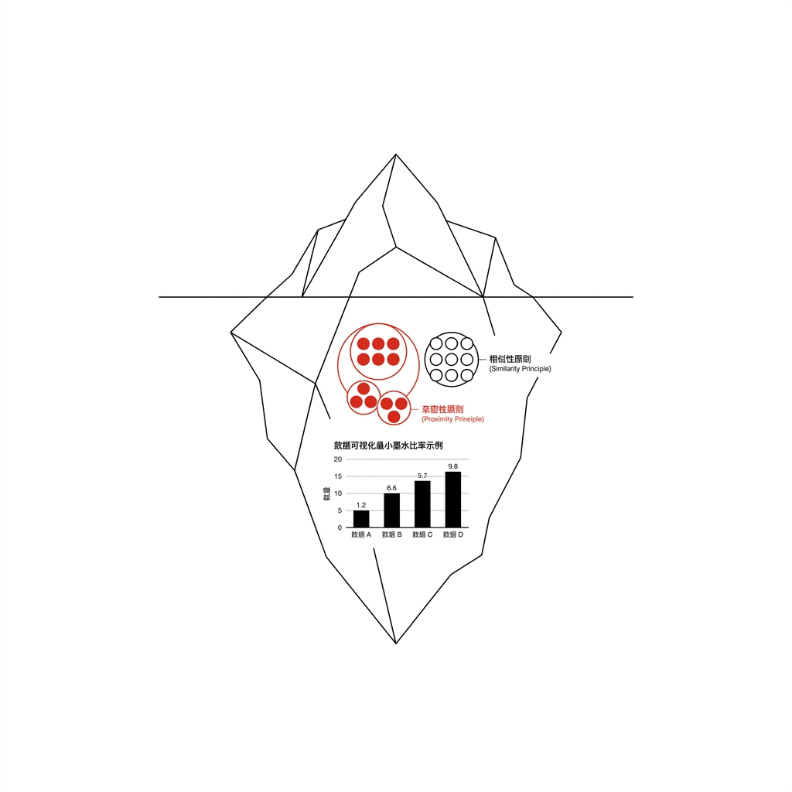
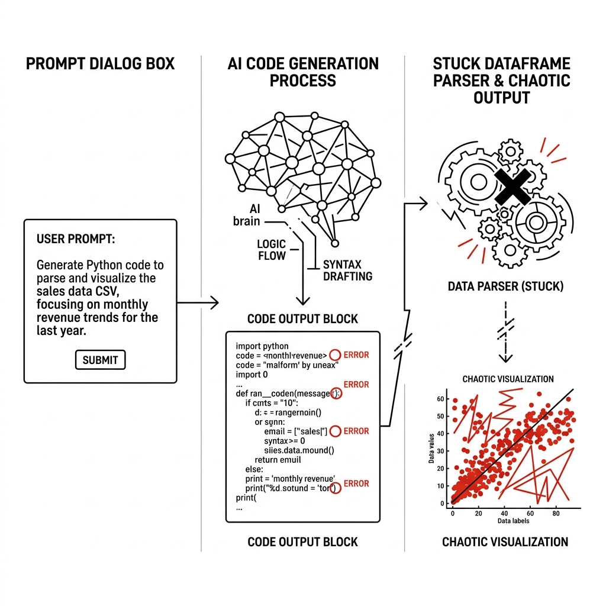
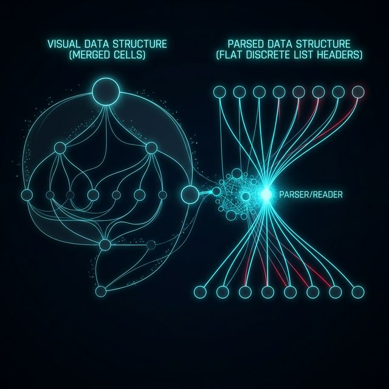
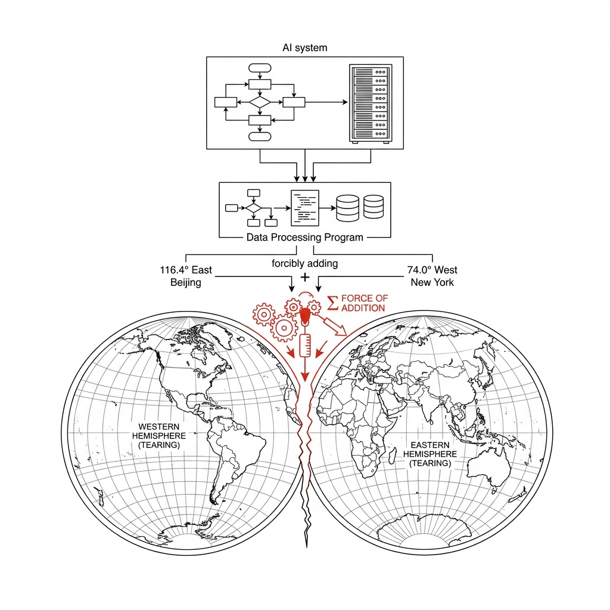
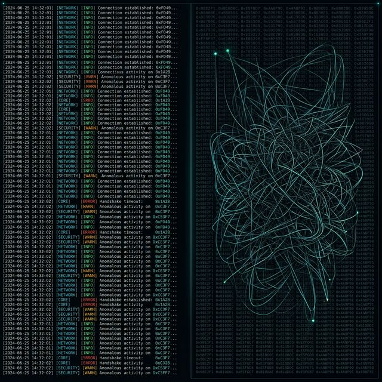
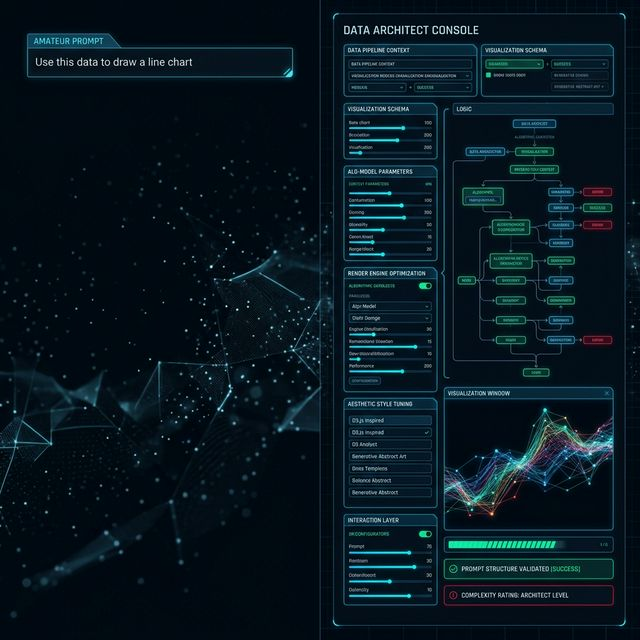

## 模块 1: 为什么你的 AI 画不出一张正常的图？ (30 分钟)
<!-- BUDGET: 4500 chars | SLIDES: ≥15 | STATUS: done -->
> [!NOTE] 核心标签回溯
> [data-ethics] [anti-tech-hegemony]

> [!NOTE] 教学备忘: 复习/导入
> 本模块回顾 W02 标记与通道编码原则，通过深入展示大语言模型，也就是 **Large Language Model** 面对未处理原始数据时的失败案例与底层缺陷（一维 Token 序列 vs 二维空间网格），系统性论证在 Vibe Coding 时代梳理数据抽象（What、Why）的终极必要性。

> [VISUAL]
> *   **Slide**: `S01_Title_W03`
> *   **Layout**: `Center`
> *   **Scene**: 深色背景。中心是一座巨大的冰山。水面上是五光十色的漂亮图表（如同上周讲的那些符合格式塔与数据墨水的图）；水面下则是庞大、错综复杂、布满划痕的原始数据表。
> *   **Text**: "看不见的冰山：数据洗礼与抽象建模"
> *   **Asset**: 

### 1.1 表皮狂热：大模型制图幻象的崩塌

各位同学，欢迎来到数据可视化核心框架体系理论的第三周。在经历了上周对视觉感知基石的探索后，今天我们将经历一次更加底层的跨维思维打击。如果说通道与标记是可视化的肌肤色彩，那么今天我们要面对的，就是数据的骨骼与灵魂。我们将深入探讨数据本身的形态，理解如何通过解构与重组，让哪怕最混沌的原始数据重新建立秩序，完成从野生废土到精准工程件的绝对升华。

> [VISUAL]
> *   **Slide**: `S01b_W02_Review_Gestalt`
> *   **Layout**: `Split`
> *   **Scene**: 左侧重现第二周的格式塔法则图解，右侧展示数据墨水比的精简打磨动画。
> *   **Caption**: "从错觉到精准：用克制的图形语法构建视觉叙事。"
> *   **Asset**: 

在第二周，我们系统学习了“格式塔空间法则”和“数据墨水比原则”，探讨了如何极其克制地利用特定标记，也就是 **Marks** 和通道，也就是 **Channels** 这一套视觉语法，去设计出不骗人、高信噪比、极具叙事张力的优雅图表。

现在，看看屏幕上这座巨大的冰山。请大家盯着水面之上那些闪闪发光、色彩绚丽的可视化图表。如果我现在问你们，开发出一张惊艳全球的纽约时报级别的信息图，最难的部分在哪里？很多人可能会回答：是极其厉害的审美！是复杂的 D3.js 贝塞尔曲线过渡动画！是对莫兰迪色系的精准运用！

> [VISUAL]
> *   **Slide**: `S01c_The_Aesthetics_Myth`
> *   **Layout**: `Full`
> *   **Scene**: 一名设计师对着满屏漂浮的代码特效、绚丽的调色板顶礼膜拜，却忽视了脚下正在崩塌的断层数据地基。
> *   **Caption**: "对表皮的狂热：审美与代码只是水面冰山的一角。"
> *   **Asset**: 

看起来，我们似乎已经掌握了让图表变美的所有魔法，对吧？尤其是在这个当下由 ChatGPT、Claude 和各类 Copilot 主导的氛围编程，也就是 **Vibe Coding** 时代，这种错觉被无限放大了。很多人拿到了导师或老板丢过来的一堆堪称灾难的 Excel 数据，第一反应不是去阅读数据，而是直接把这坨长达 50MB 的乱码往大模型的对话框里一扔，满心欢喜地敲入一段极其口语化的提示词：“帮我把这些数据画成超级酷炫的动态散点图！”

> [VISUAL]
> *   **Slide**: `S02_The_LLM_Illusion`
> *   **Layout**: `Split`
> *   **Scene**: 左侧显示一个极其粗糙的提示词："拿这个Excel给我画个好看的图，最好有科技感"。右侧显示一个无尽转动的加载动画，随后吐出一大串代码，但渲染出的图表是一团黑红相间的乱码。
> *   **Caption**: "Vibe Coding 时代的绝对错觉：以为喂进去泥土，就会自动吐出金子。"
> *   **Asset**: 

### 1.2 灾难巡礼：未经架构师审查的坍塌

大家是不是觉得，只要把文件拖进去，AI 这个全知全能的神就能自动理解你的心意，不仅帮你读懂了那些充满缩写和黑话的表头，还顺便帮你排查了数据污染，最后渲染出一幅传世佳作？结果往往是灾难。当加载动画停止，你以为会看到一张洞察秋毫的神图。但实际呈现的，却是一堆令人窒息的、充满着错位、折叠、甚至完全违反物理常识的赛博朋克垃圾图表。

> [VISUAL]
> *   **Slide**: `S02b_Debugging_Workshop_Intro`
> *   **Layout**: `Grid`
> *   **Scene**: 屏幕中心打出巨大的红色警告标志，周围环绕着乱序的代码错误条目碎片。
> *   **Text**: "异常排查大研讨：揭开 AI 失控背后的隐秘病灶。"
> *   **Asset**: 

为了打破大家对 AI 的迷信，今天我们先来办一场异常排查研讨会。我们来看看，那些未经人类数据建筑师审查的原始表格，是如何把目前最聪明的大脑逼疯的。

> [VISUAL]
> *   **Slide**: `S03_AI_Plot_Failure_1`
> *   **Layout**: `Split`
> *   **Scene**: 左侧是一张原始的透视表截屏。右侧是一张被 AI 生成的柱状图，X 轴的刻度上，不仅排布着 "2019", "2020", "2021" 这样的年份，竟然在中段硬生生地插进来了 "北京市"、"上海市"、"广东省" 的分类标签。
> *   **Caption**: "灾难一：维度的物理坍塌。苹果和年份被强行排在了一起。"
> *   **Asset**: 

比如这里，一位非常用功的分析师，试着用最新潮的工具，试图将一份涵盖了全世界每一次微小地震事件的记录表，直接喂给系统。他甚至没有检查这份表单的结构，只写下：“帮我展现全球地震的空间分布热力趋势”。他期望得到一张精确标注每次震中位置的地核脉搏图。但他完全忽略了这堆未经处理的数据中，不仅包含了各种混杂的非量度文本，甚至其经纬度也是互相穿插的。这就直接导致了系统将这些地理坐标视为普通数值执行暴力累加，出来的画面根本不是地球，而是一团彻底错位、毫无空间逻辑的黑色曲解乱阵。

> [VISUAL]
> *   **Slide**: `S03b_Merge_Cell_Catastrophe`
> *   **Layout**: `Flow`
> *   **Scene**: 展示合并单元格在读取过程中的错乱路径：视觉上的合并跨列，到了解析器中变成了平等的离散列表头。
> *   **Caption**: "结构崩坏：AI 解析跨列合并单元格时的彻底降维。"
> *   **Asset**: 

但对于没有经过严密结构预处理的大模型来说，一旦它读取的 Excel 文件中存在跨列合并单元格，它的解析逻辑就会瞬间崩溃。大家在 Excel 里看到的“合并居中”非常美观，但在底层物理结构上，这种合并实际上只在左上角的第一个物理单元格内保留了文字，而其余原本被覆盖的空间全都被彻底掏空，变成了致命的空值变量，也就是 `NaN`。

当你把这种带有巨大空洞的表格强行扔给代码解析器或者大模型时，它根本不知道那些空白地带有历史遗留的合并意图。在它的视野中，只要文字出现，它就把文字拿走，而遇到成片的空白，它就直接截断数据流。原本归属于同一个省份的几十条城市数据，瞬间变成了找不到归属地址的无主孤儿，于是大模型只能把它们统统当成同级别的独立分类标签，也就是 **Categorical Labels**，然后在一条水平线上不受控制地死板平铺开来。这就是数据维度的物理性坍塌。

> [LIFE CONNECT] 现实隐喻：破损的快递单
> 这就好像你试图把同属一栋大楼里的三个不同的住户包裹，只凭借一份极其简略的便签打包发走。你自以为在便签最顶上写了一个巨大的“某某小区”就能统管下方所有人，但大模型这个快递分拣机器人是不讲情面的。它扫描第一份包裹时读到了地址，顺利发件；但扫到第二和第三份时，由于标签页上的跨行文字已经被抽空为空值，它只会直接把这两份包裹扔进系统死信退件箱。

> [VISUAL]
> *   **Slide**: `S04_AI_Plot_Failure_2`
> *   **Layout**: `Full`
> *   **Scene**: 一张极其荒诞的折线图，Y 轴的刻度达到了“2.58 亿”。图的标题写着《全球重点地震带空间趋势波动图》。下方红字警示框写着：Y轴计算逻辑解析：SUM(Longtiude + Latitude)。
> *   **Caption**: "灾难二：剥夺人类定义的荒谬算术运算。"
> *   **Asset**: 

更恐怖的还在后面。来看第二个案例。这里有一份全球地震监测台网的原始数据，包含了发生地震的城市经度、纬度，以及里氏震级。一位产品经理急忙让大模型“帮我统计一下各个地震带整体的危害波动程度”，结果大模型自动生成的折线图，Y 轴直接飙升到了几百甚至几千万！

> [VISUAL]
> *   **Slide**: `S04b_Coordinate_Addition_Absurdity`
> *   **Layout**: `Grid`
> *   **Scene**: 动画演示：116.4°E（北京） + 74.0°W（纽约） = 虚无。地图从中间撕裂。
> *   **Caption**: "坐标系相加：一场违反基本真实物理规律的数字游戏。"
> *   **Asset**: 

你仔细去反查底层代码，会绝望地发现它干了什么：它看了一眼这些数字，发现都是浮点数，于是它非常“聪明”地把所有地震的经度和纬度当作普通的存款余额一样，执行了无差别的求和运算！

这就是我们这门课要死死咬住的一个核心数据认知错位：长得像数字的东西，未必就是可以用来做算术的。在数据科学的严格分类中，这被称为分类属性，也就是 **Categorical**，与量化属性，也就是 **Quantitative**，两者之间不可逾越的天堑。对于人类而言，经纬度是空间位置，也就是 **Position**，它是纯粹用来标定你在这个地球上唯一物理地址的名牌，绝对不能相加。北京的经纬度和纽约的经纬度加起来毫无物理意义，这就好比你把你和同桌的学号加起来求平均一样，除了制造一串不属于任何人的幽灵乱码之外，什么都得不到。但 AI 系统如果得不到你“人类意志”的前置数据结构声明，它只要看到纯碎的阿拉伯数字，默认的潜意识习惯就是调用 CPU 去狂暴地求和求平均。

> [CASE STUDY] 被乱加的城市代码
> 在一个真实的政府开放数据可视化项目中，有开发者未做数据抽象，直接将包含国家统计局设定的城市六位行政区划代码（例如北京是 110000，上海是 310000）的巨型逗号分隔值表格，也就是 **CSV** 喂给大模型画对比图。结果，大模型为了展现“总体趋势”，极其可笑地把这些区划代码全部当作收入总额作了暴力相加，生成了一个高达几千亿的不存在坐标总和！这不仅是图表的失败，这更是人类交出数据释义权后的逻辑溃败。

> [PHILOSOPHY] 人文锚点：数据治理中的反技术霸权
> 在这个核心算法可以自动补全代码、自动聚合查询的狂奔时代，坚守对“数据物理语义”的解释权，是我们作为信息可视化工程师与数字工匠的最后尊严。机器不懂社会的痛楚，不懂地理空间的限制；因此，永远不要把思考“这个数字意味着什么现实”的权力，让渡给一个盲目套用数学公式的聚合函数。你是数据的立法者，AI 只是执行法条的法警。

> [VISUAL]
> *   **Slide**: `S05_AI_Plot_Failure_3`
> *   **Layout**: `Split`
> *   **Scene**: 左侧是几万条日志滚动的黑色后台。右侧是典型的高密度面条图灾难：几百条颜色几乎无法肉眼分辨的杂乱线段紧紧交缠在一起，像是一团乱麻，背景还密密麻麻标满了毫无意义的十六进制 User_ID 号。
> *   **Caption**: "灾难三：没有信息降噪层级的无差别物理投射。"
> *   **Asset**: 

最后这张图，我们在很多糟糕的 B 端管理后台上常常能见到，这就是声名狼藉的面条图，英文称作 **Spaghetti Chart** 灾难。当你把包含五万名客户行为记录的原始日志，不加任何聚类条件，直接扔给 AI 并说“帮我画出趋势”，它非常忠诚地把每一行都画成了一条独立连线。结果就是屏幕变成了一段失去任何信噪比的黑色乱麻网络。这不仅毫无沉浸感，更致命的是，所有的有效信息全部被淹没在了无差别的线条叠加中。观众的视网膜会立刻发出超载警报。这是彻底放弃数据意图拆解的最终惩罚，你必须在大模型渲染前先行砍掉这些无效冗余。

> [VISUAL]
> *   **Slide**: `S05b_Overplotting_Blindness`
> *   **Layout**: `Full`
> *   **Scene**: 视网膜被无数黑色细线遮蔽的特写。在黑线的深处隐约闪着红光，但完全无法看清。
> *   **Caption**: "视觉遮蔽：当数据狂澜越过承载极限，真理便潜藏在阴影之中。"
> *   **Asset**: 

这严重违背了我们在第二周学习的关键像素分配法则。当未经降噪裁切的数据量直接突破了屏幕像素格的物理渲染极限时，如果只是盲目去执行无差别的百分百机械点线映射，不仅根本无法向读者传递任何有效商业或科学洞察，甚至会带来灾难性的反向遮蔽。因为在前端代码眼里，一百根相互叠加在同一个极窄坐标位上的黑线，在视网膜的最终成像效果上，和一根单独孤零零画在那里的粗黑线没有任何色差感知上的本质区别！这就是所谓极其恐怖的视觉终极遮蔽绝症，也就是 **Overplotting**。这层厚重如黑泥般的数据油墨板结，会彻底彻底掩盖掉真正在底部底层微小缝隙里发生异动和严重持续衰退的报警求救信号。不经提炼提取便全盘照收的大画卷，形同于视觉谋杀。记住这个教训：**数量不等于质量，堆砌不等于呈现**。真正的数据素养，从懂得何时该剔除、何时该聚合开始。

> [CASE STUDY] 大模型面对宽跨表结构的绝望解析日志
> 为了让大家更直观地感受这道“机器视差”的深渊鸿沟，我们可以重演一段大模型曾真实输出的灾难级别解析日志。在那间缺乏经验的外包开发室里，由于前置数据架构师的严重缺位，原始的《中国统计年鉴》宽跨大表，在连带各种恶心合并单元格、无意义脚注、以及极度冗余的中文多重嵌套表头的情况下，未经任何结构修剪和防腐处理，就直接扔给了大语言模型的文本输入核心。
>
> 当它那基于一维线性的底层 Token 序列解析器，在触及那些本该在二维空间展开的复杂合并年份栏时，当场发生了严重的维度扭曲与逻辑短路。模型完全无法同时去建立和关联横纵上下的多层从属附庸关系，它只能绝望且生硬地把它切分碾碎成了毫无因果牵绊的平行碎片序列。在它的扭曲理解里，原本应该牢固结合的“2010年-东部地区-GDP总额”这三重统摄立体结构，被无情剥离成了互不相识的字符孤岛。它甚至把地区分类属性当作了计算数值去强行拉扯。
>
> 结局自然是一连串崩溃。最终生成的底层渲染脚本发生极其致命的变量类型错位，数百条红色 Error 报错和无法成型的 SVG 图表破片瀑布般涌向控制台界面。你以为它是无所不能的多维超级神明，但必须警惕：面对那些未经整洁约束规则彻底清洗的极度杂乱无章超大宽表，大模型的智识会瞬间跌入谷底，变成一条在冰冷数据迷宫墙壁上不断盲目撞击的一维盲蛇。

> [VISUAL]
> *   **Slide**: `S06_The_Machine_View`
> *   **Layout**: `Split`
> *   **Scene**: 屏幕底色变为深沉的代码编辑器。一段被拆解为极小片段、单一维度的 Token 数据流犹如《黑客帝国》的瀑布流般滑落。上面覆盖着一个大语言模型的闪烁自回归光标。
> *   **Caption**: "机器视差：大模型眼中的世界，只有永远向前的一维线性长河。"
> *   **Asset**: 

### 1.3 机器视差：一维字符对多维网格的彻底误读

如果你不作任何的数据重塑而直接下达画图指令，你就是在强迫一个纯粹算数引擎去理解人类社会极端混乱的潜规则。当我们把那些包含着五六万条未经清洗的黑匣子日志原样推进去时，就会爆发前面展示的那种面条图，也就是 **Spaghetti Chart** 灾祸。更深层的原因在于，对于一个基于自然语言符号序列的大语言模型来说，表格里多出来的合并居中、隐藏的空缺值、和夹杂在数据中的备注星号，全都是剧毒的乱码。在它的单向度逻辑世界观中，根本没有你眼中那浑然天成的格式塔表格网格结构。如果不事先清理出畅通的矩阵数据通道，它唯一能给你的反应，就是像被异物卡住喉咙一般，吐出一堆完全错位的像素映射，或者是直接甩给你满屏红色崩溃退出的严重报错日志。

> [VISUAL]
> *   **Slide**: `S06b_Grid_Vs_Stream`
> *   **Layout**: `Split`
> *   **Scene**: 左边是人类大脑视觉皮层下的严整二维矩阵，闪耀着交叉十字光芒。右边是大模型算力核心中，排队等待进入 Transformer 窗口的单行无限字符串列车。
> *   **Caption**: "多维网格幻象与一维真实字流的致命鸿沟。"
> *   **Asset**: 

当人类瞥向一张表格时，千万年来进化出的格式塔认知模型瞬间告诉我们：横向和纵向的排列潜藏着统摄逻辑，我们是在多维空间里理解数据的。但大模型底层的架构决定了，它本质是一个自回归预测序列引擎。它看到的，是经过字符编码切分后的单维度词汇序列流。逗号、回车、数字，全是排队关系。如果你不给出清晰的属性框架和业务逻辑，它就只能按照最浅显的字面意思瞎猜。

> [VISUAL]
> *   **Slide**: `S07_Data_Shape_Concept`
> *   **Layout**: `Split`
> *   **Scene**: 左侧动画：从布满灰尘的原始矿坑里被挖出来极其粗糙、夹杂着大量泥土杂质的铁矿石原石，旁边标注原始死板数据，也就是 **Raw Messy Data**。右侧动画：矿石被扔进高温红色高炉中熔炼锻打，最后弹射出发出寒光的精确机械齿轮，旁边标注提炼后的数据抽象形状，也就是 **Abstracted Data Shape**。
> *   **Caption**: "未经锻造的原始数据矿石，无法驱动精美的齿轮引擎。"
> *   **Asset**: 

### 1.4 锻造结晶：探明数据本质与任务拆解

因此，为了摆脱这种一抓瞎的绝境，在真正的专业数据可视化工程流中，我们存在一个不可跨越的神圣领域：那就是数据抽象与形状重组。这绝不是你在表格软件里简单点个排序或者筛选那么儿戏。这是要在心智层面，如同法医骨骼重构般，深度审视这团毫无头绪的数字组织。你必须亲自裁定它的本质属性，拔除一切干扰杂质，将其强硬锻打淬炼为大模型能够无损吞吐的纯净结晶体。任何试图跨过这道工序去追求图表炫目的行径，最终只会画出一堆虚无的美丽垃圾。你对数据的重压提炼程度，直接决定了最终作品可供下钻分析的理论深度边界，这也是你与普通做图员的根本区别所在。

> [VISUAL]
> *   **Slide**: `S07b_The_Core_Questions`
> *   **Layout**: `Split`
> *   **Scene**: 两条深刻的发问像灼热烙铁一样烫印在厚重的书籍封面上。配合缓慢推进的光影特效。
> * *   **List**: ["这个对象到底是个什么，即 What性质？", "客户让我看这个图到底是为什么，即 Why？"]
> *   **Caption**: "重返源头：不探明 What 与 Why，所有的 How 都是空中楼阁。"
> *   **Asset**: 

那最底层、最决定生死的一万个为什么：“这段字符串到底是个什么，也就是 **What** 对象？”“客户背后的本质心愿为什么，也就是 **Why** 要挖掘它？”就像你拿着生锈矿石命令顶级工匠打造绝世兵器，结局必然是崩裂。在严防死守的现代可视化体系中，不经过深度抽象和派生重塑，也就是 **Derive** 的表格，就是定时炸弹。熔炼必须先于展示。

> [VISUAL]
> *   **Slide**: `S08_Munzner_Framework_Intro`
> *   **Layout**: `Grid`
> *   **Scene**: 一座雅典神庙式的古典建筑，支撑金字塔顶端的三根巨大柱子模型。左侧纯蓝色的巨柱写着：What（数据抽象 - 破译基因）；正中央红色的巨柱写着：Why（任务抽象 - 截获意图）；右侧金色的巨柱写着：How（视觉与交互编码 - 表达万象）。底部台阶上深深地刻着 Tamara Munzner 的名字。
> *   **Caption**: "Tamara Munzner的《可视化分析与设计》：重塑数据世界的三维信条。"
> *   **Asset**: 

在这个领域，我们要向现任不列颠哥伦比亚大学计算机科学系教授、可视化界的泰斗级人物 —— Tamara Munzner 致以最高的敬意。她的著作不仅定义了整个现代数据可视化的框架基石，更提出了一套彻底斩绝数据错乱分析方法论。这不仅是你这门课的最高纲领防线，更是你未来面对海量企业级报表时不致思维崩溃的底层护甲。掌握了它，你就不再是可以被随时替代的查图表画图员，而是能够掌舵大模型、具备独立数据降维打击能力的高端架构师。在这个框架下，所有的混沌都将无所遁形，所有的意图都将被严格量化和执行，这是通向可视化真理的唯一地图。

> [VISUAL]
> *   **Slide**: `S09_What_Why_How_Depth`
> *   **Layout**: `Flow`
> *   **Scene**: 一个三层的俄罗斯套娃式漏斗图，展示数据从真实世界依次流经 What、Why 和 How 层的过滤与映射过程。
> *   **Caption**: "编译流：没有精确的底层结构抽象，最华丽的图形语法也不过是南辕北辙的废品。"
> *   **Asset**: 

回顾前两周死命纠结的色彩搭配和标记选择，这些全都被限制在名为 How（如何呈现）的最终执行层。如果没有精准的 What（这到底是周期数据还是离散分类？），以及洞悉人性的 Why（我们画图是为了找异常还是做汇报？），你的 How 就会像打扮得花枝招展却完全指错路的向导。这就要求大家建立起一种结构化数字透视眼。当你面对密集的表格，你要能在刹那间看破它们隐藏在底层的基元属性和意图语义。

> [VISUAL]
> *   **Slide**: `S10_LLM_Prompt_Hierarchy`
> *   **Layout**: `Split`
> *   **Scene**: 左侧：一个菜鸟的简陋提示词（"用这些数据画个折线图"）。右侧：展示震撼的架构师级别提示词控制面板。
> *   **Caption**: "掌控大模型的降维碾压：基于学术抽象概念的结构化发令术。"
> *   **Asset**: 

### 1.5 结构法则：用高维雷达夺回代码执刀权

身处于这个提示词工程狂飙时代，开发速度固然被拉升，但关于数据背后的物理模型阐释权威，始终只牢牢握在人类数据架构师手中！如果不懂得底层数据的拓扑骨架，你甚至无法给 AI 编写出哪怕一条具有纠错自愈能力的结构化高级提示词。你只能像个毫无主见的乞求者一样写下：“求求你把我的乱码修好画个好看的图。”然后在使用这种黑盒指令的过程中，在报错和不断扭曲的胡乱渲染中陷入无尽绝望。

相反，如果你拥有了数据世界的 X 光极强透视力，你向大模型下达的指令就会如同冷酷精准的手术执刀报告一般：“提取 A 列的唯一主键；剥离 B 列的量化废弃字符并转换为高精度浮点类型；舍弃掉底部带有‘总计’字眼的伪造数据行；最后，以上述干净长表格为单一维度源，利用 D3 渲染出一幅以时间轴为底向发散开的流线图。”当你能极其流利地说出这些专业术语指令来控制流程节点时，AI 就会瞬间变成你手中最强悍的重火力机枪，配合你行云流水般干脆利落地击穿一切数据迷雾。

> [VISUAL]
> *   **Slide**: `S10b_AI_Sharpshooter`
> *   **Layout**: `Full`
> *   **Scene**: 一名戴着狙击镜的生化仿生人，即 AI，但镜头准星的红点由他身旁的人类观察手指引。
> *   **Caption**: "AI 是绝佳的神箭手，但它必须依赖人类的结构化视野去锁定真实猎物。"
> *   **Asset**: 

大模型就是你手中的超级重火力，但这挺机枪是不长眼睛的。唯有你亲自用肉眼确认了每一层数据的地基形状，才能在最后百发百中。如果你连自己弹巢里装的是实心铁球还是高爆散弹都分不清，就对着 AI 大喊开火轰炸，那等待你的必然是难以收场的全盘数据车祸报错。真正的核心竞争力，是你脑海中那一整套严丝合缝、能够彻底透视数据结构图景的高维雷达扫描系统。

> [VISUAL]
> *   **Slide**: `S11_The_Iceberg_Dive`
> *   **Layout**: `Full`
> *   **Scene**: 第一张开篇巨型冰山的动态延伸版。聚焦水面图表的镜头，发出穿戴潜水装置的下潜声响。随着幽蓝海水起伏，镜头急剧破入冰冷深渊海域，一位光影特效探险家开始逼近冰山底座——那里盘根错节生长着狂野庞大的原始数据逻辑结构基底暗礁。
> *   **Caption**: "抛弃陆地的虚荣，深潜入海：在此刻开启我们的淬火重塑之旅。"
> *   **Asset**: 

这就是所谓的 What —— 它到底是什么！这是 Munzner 指出的第一阶绝对法则：抛开一切图表形式的外壳，深潜到那几乎能将人冻伤的原始数据冰冷深渊深海里。你必须像专业基因测序中心的操作员一样，冷血、极度理智且毫不留情地将这堆密密麻麻如泥浆般的统计数字，执行显微镜级别的严格分类。你不但要识别它们是孤立存在的独立个体，还是互相交织咬合的网络链路，还要给它们的每一列数据头上打上不可串改的物种属性基底基因烙印标识。唯有经历了这般极其严苛彻底的底层清洗重塑，才能绝对保证后续的图形渲染引擎不会因为吞入异物而引发那种灾难性的系统崩溃报错。这是你作为数字架构师压倒一切的最高职责所在。

> [VISUAL]
> *   **Slide**: `S11b_Dive_Roadmap`
> *   **Layout**: `Split`
> *   **Scene**: 潜水仪表盘上弹出的深海探测量表与下潜目标指南。
> * *   **List**: ["基因解剖：破译数据特性的 What 密码", "意图截获：降维拆解用户场景的 Why 动力", "混沌熔炼：驯服杂乱宽阵的 Tidy Data 法则"]
> *   **Caption**: "深潜作战指南：重铸数据实体的三座里程碑。"
> *   **Asset**: 

我们将全副武装地学习：如何像分子生物学家一样，给一切信息源定性确权，回答 What 难题。如何像联合国资深翻译官一样，把毫无逻辑的需求，精确降频翻译为纯粹计算机行动指令，回答 Why 的动力来源。以及最核心的战役，握紧顶级数据架构师的真理之剑，将千疮百孔的野生表格，重新压缩为即使大模型也能百分百读懂解析的整洁完美长表结构。

探照灯已经打开，高炉的熔炼火焰正在燃烧！带好行装，向深渊进发。

**(Pause: 3s 留出极度安静的沉浸留白，准备过渡下个知识核心)**
