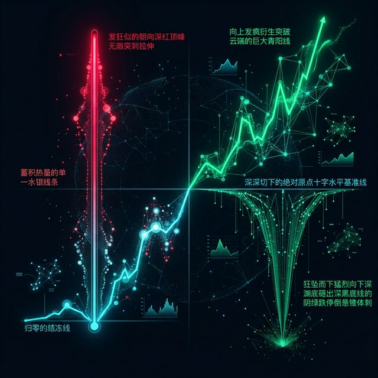

## 模块 2: What — 拆解数据的基因组 (40 分钟)
<!-- BUDGET: 5000 chars | SLIDES: ≥16 | STATUS: done -->
> [!NOTE] 核心标签回溯
> [data-abstraction-taxonomy] [hao-ch4-masterworks] [task-abstraction-framework]

我们要做的第一步，就是像分子生物学家拿到未知病毒样本一样，面对我们手头杂乱无章的数据，强制开启极其客观的成分破译。这就是 Munzner 框架的第一层：**What**（数据抽象，即 `ch02-data-abstraction` 理论模块）。

当你盯着一个 Excel 电子表格时，你看到的是满屏幕阿拉伯数字和各种莫名其妙的缩写。但在前端渲染引擎（包括 D3.js 乃至大型语言模型）眼中，世界绝对不是由电子单元格单纯构筑的。这牵涉到最底层的分类哲学。

> [VISUAL]
> *   **Slide**: `S01b_Taxonomy_Intro`
> *   **Layout**: `Grid`
> *   **Scene**: 展现 Munzner 数据抽象分类体系的庞大树状架构，从顶层的“Dataset Types”向下不断分化到“Item”和“Attribute”，颜色冷峻、学术感极强。
> *   **Caption**: "数据抽象分类地图：摒弃表面拟象，直击核心属性链条。"
> *   **Asset**: 

Tamara Munzner 在其著作中，提出了一个极其严密的数据抽象分类体系，也就是 **Data Abstraction Taxonomy**。她毫无保留地指出一个残酷事实：在动手写哪怕一行画图代码之前，你必须先把数据从上到下拆解为不可分割的明确层级：基本粒子、数据集类型、以及决定生死的属性类型。

### 1. 最小粒子：五种基本数据类型

一切现实原材料，都可以精准投射为五种最小粒子。如同物理学中的原子结构，所有的可视化图形，都不可动摇地建立在这五种粒子基岩之上。

> [VISUAL]
> *   **Slide**: `S12_Basic_Data_Types_Intro`
> *   **Layout**: `Grid`
> *   **Scene**: 显微镜下漂浮的五种几何晶体元件，代表构成数据宇宙的五种基本物理粒子。
> *   **Text**: "数据世界的五种基本粒子：构建可视化的物理原石。"
> *   **Asset**: 

Tamara Munzner 在其著作中，提出了一个极其严密的数据抽象分类体系，也就是 **Data Abstraction Taxonomy**。她毫无保留地指出一个残酷事实：在动手呼叫代码绘制出哪怕一条轴线之前，你必须先把数据从上到下拆解为不可分割的明确层级：基本粒子、数据集类型、以及决定生死的属性类型。没有这三层绝对解构步骤作为担保，任何百兆级的报表在你眼前都只是一片无意义的数字乱坟岗。这一步是将大模型从混沌中拯救出来的唯一前置安全栓。

> [VISUAL]
> *   **Slide**: `S13_Basic_Data_Types_Details`
> *   **Layout**: `Grid`
> *   **Scene**: 五张依次排列的高亮讲解卡片。分别画着：一个独立旋转的小方块，即 Item、一个小口径玻璃量杯，即 Attribute、连接两颗微粒的一根强拉力线，即 Link、一个雷达三维坐标系上的红色十字星，即 Position、一张覆盖地形的绿色等高线渔网，即 Grid。
> *   **List**: ["项，即 Item：绝对个体与本体载体", "属性，即 Attribute：数值特征外挂装备", "链接，即 Link：项与项的引力关系", "位置，即 Position：三维时空的地理烙印", "网格，即 Grid：切分拓扑空间的采样场"]
> *   **Caption**: "从个体到场：理解这五类粒子，便构建了重组数据的显微镜。"
> *   **Asset**: 

1.  **Item（项）**：它是离散存在的、具有明确边界的绝对个体。比如患者信息名单中的独立一份档案，或社交网络中的单体用户。它是整件事物的物理本体和承载者。在传统关系型数据库语言中，它就是一条神圣不可侵犯的记录记录，也就是 **Record**。
2.  **Attribute（属性）**：这是可被仪器测量、被感官观察的某个特定维度的特征数据。比如那位患者清晨被记录的血压读数、或者是记录用户的当月消费总计金额。属性永远不能脱离实体漂浮，它是死死挂载在项，也就是 **Item** 这个核心躯干上的数值增益装备。
3.  **Link（链接）**：当视界中存在哪怕两个以上的独立项，也就是 **Item**，它们之间就可能因为互动而激发出引力网络。这个引力就是链接。它描述了个体与个体间复杂的关联度。比如你我在通讯录里的互相通讯频次，或者网页彼此间交错复杂的跳转关系。有了它，世界才衍生出宏大的拓扑形态。
4.  **Position（位置）**：这是一个极其特殊的属性特权代表。它专精刻画真实物理坐标或多维空间的精确定位（如 GPS 的长维度与短维度序列）。人类大脑天生对空间位置具有最高级别的感知优先级，这一点我们在视觉感知课里已反复论证过。
5.  **Grid（网格）**：它是一种极其冷酷暴力的拓扑切分控制策略。用于规范采样连续无限存在的区域。比如气象局预测风暴，在版图上强行划分出千百个同等观测尺寸的矩形网格区；或是医学断层扫描中的体素，也就是 **Voxel** 切割断面切片矩阵。

拿到一堆不明所以的数据源，你要像审问嫌疑人一样质询：我的主角是谁？挂载了什么装备？它是否与其它的点存在羁绊牵连？这立马能判定，你是要画散点云图，还是该渲染一个超庞大的错综家族引力图谱。

### 2. 构建聚落：四大数据集类型

粒子无法独自抗衡时代，庞大的集群组合在一起，才构成了压倒性力量的数据集，也就是 **Dataset**。认定这堆数据的组合归属宗族，直接裁决了 D3 调用哪一类强大的渲染树。

> [VISUAL]
> *   **Slide**: `S14_Dataset_Types`
> *   **Layout**: `Grid`
> *   **Scene**: 被切割成四格的视点宇宙。左上角是一叠层叠千丝万缕的数字电子表阵列，即 Tables；右上角是节点如繁星、线路发光的引力星系，即 Networks；左下角是一张满是冷热光晕红蓝交错的脑部核磁横切面图，即 Fields；右下角是纯净且中空的冰冷国门折线边界，即 Geometry。
> *   **List**: ["表，即 Tables：最世俗的二维离散世界", "网络与树，即 Networks / Trees：关系的拓扑纠缠体", "场，即 Fields：不可穷尽的无缝平滑连贯时空", "几何，即 Geometry：纯粹抽离的极简外轮廓线框"]
> *   **Caption**: "洞悉你的数据集，就像挑选正确的武器应对特定的猛兽一样至关重要。"
> *   **Asset**: 

当今产生的商业和科研成果大多可归位于以下四个巨型板块阵营中：
*   **Tables（表）**：这是最简单粗暴的类型。横侧队列铺设无数个体项，也就是 **Item**，向下的列栏插满对应的丰富变量属性，也就是 **Attribute**。这里存放的，就是典型的离散记录合辑。能用普通工作簿打开的大多源自于此。但你要懂得，这是最为平庸平坦的基础形态。
*   **Networks（网络）与 Trees（树）**：一旦你的个体间产生难以斩绝的羁绊连线，也就是 **Link**，原本极度扁平的表就撑破维度爆裂开来。若从上一级向下一级辐射绝无闭合回路，这就是森严的科层属性树。如果是相互交错反噬渗透，那就是关系纠缠网络，如同巨大金融资本交叉持股的黑暗漩涡星云版图。

> [VISUAL]
> *   **Slide**: `S15_Continuous_Fields`
> *   **Layout**: `Split`
> *   **Scene**: 深层聚焦展示场，即 Fields的壮观。左侧：一台高速运转的医疗大孔径扫描仪，正生成脑切片；右侧：风洞模拟器中充斥红蓝交织的光速激波粒子气流风场压强演示。
> *   **Caption**: "场数据：你永远能在任何微小间隙，再次挖掘出全新的极小原子级数据点。"
> *   **Asset**: 

*   **Fields（连续场）**：在前两者探讨的都是离散的个体，但在高精尖学术与科学场域，连续场才是绝对的主宰。闭眼想象，表和网络就像是夜空里一颗颗分明的星辰，而场则是弥漫在整个宇宙中无处不在的暗物质网格微波背景辐射。在连续场里，不管你把网格切片切得多薄多致密，哪怕小到一个极微弱的体素，也就是 **Voxel**，你总能在这已知测出的两点虚空间隔内，借由数学物理公式无穷无尽地推导出新的过渡补完色块。这被称为高深莫测的连续不绝数据。它最高的渲染难处绝非常规的点线标记盲目叠放，而是如何编写极致丝滑、符合物理热力学严谨分布规律的计算平滑补值过渡，也就是插值运算引擎 **Interpolation** 的深渊着色策略。

> [CASE STUDY] 捕捉看不见的超级台风风暴场
> 让我们看看中国气象局是如何在超算中心内部去渲染强热带风暴涡旋风场的。气象局并不能在广阔无垠太平洋海面上的每一寸海浪上都插满物理阵列传感器探头，他们只能在离散漂泊的浮标和气象站网格上收集到星星点点的断续截断数据。但为什么每晚新闻联播里的卫星风云图，却像极了一幅流金溢彩、风暴眼清晰可见的梵高星空流动画卷？这就是场，即 Fields 的恐怖填算威力。前端高性能渲染代码获取这些离散网格的压强与风速后，并非画上一个个孤立呆板的长剑柱子，而是启动了极其复杂的张量场非线性插值逼近渲染算法，用万千极其平滑的流体粒子动画，硬生生通过算力“脑补”出了那些没有传感器的海面上每一丝狂风的走向气流暴走轨迹结构。这种无中生有、却又无比符合宏观物理真实流体动力的绝美画卷，正是场数据被高等抽象后才能赋予商业与军工工程的不可思议视觉魔法结界！
*   **Geometry（几何）**：它剥夺了万物附加的外在财产属性，只剩下最不近人情的死寂外形边境骨架线。好比丢失了 GDP 与人口说明文档后留下的一张满是空洞多边形套嵌的国家荒凉折线空白图谱 JSON 数据。

*   **Multidimensional Table（多维组合巨表）**：仅仅搞懂平坦的一维表格是远远不够的。在极具挑战甚至刀光剑影的真实高频业务世界里，数据源头极少像单行陈列的简编流水账那样仁慈。多维表通过多个定位键位的复杂深层联合封锁，犹如三维坐标系里的 X/Y/Z 轴定海神针，共同严格指定网格空间里那枚绝对唯一的交点实体数据。它的构造本质，是将不同的时间切片维度和空间横断面刻度，犹如极其厚重密集的千层堡式钢铁合金阵列一般，重重叠叠严密包裹缝合在一处。如果一个高阶数据架构师无法在脑海中瞬间拔地而起、并一眼看穿支撑这个巨大魔方运转的多重骨架核心轴线交汇点，那么他手下画出来的任何高级图表仪表盘，注定是被多重紊乱狂暴维度无情碾压揉碎后残留出的扭曲失真残影。

> [LIFE CONNECT] 随处可见的多维空间投射：一张超市的结算收据小票
> 千万不要被“多维组合”这个充满着冰冷数学与科研科幻威压感的学术前沿词汇给过度恐吓吓倒。只需随手在裤兜里掏出一张下楼随便买东西拿到的极其普通极其廉价的便利店结账热敏打印纸单据，在那一小方天地里，你凝视的正是一个极度标准严谨的多维数字空间立体魔方的底层微缩投影模型。“2024年10月4日下午三点整”（精确锁定时间轴向）、“南山区海岸城第三十字路口连锁分店”（物理空间锚点轴向）、“全麦原味无糖低脂切片面包”（销售商品所属独立 SKU 品类轴向），再加上扫描绑定的你本人专属加密白金级别会员识别代号序列。就是这看似毫不相干的四条强劲有力锁链维度轴，在这张单薄甚至快要褪色的微小纸片交点上发生了惊天动地的激烈交织碰撞约束，才最终无可争辩、极其精准无误地在这颗星球上死死碰撞锚定出了那个唯一的量化结果输出量——“应付售价总金额 15.80 元人民币”。一旦你学会如何像神一样把其中任意一条时间或空间的固化维度单独抽离解绑出来并彻底展开折叠，你就在掌心之上徒手完成了一张能监测全城商圈消费动级起伏更迭的巨大动态时序狂热热力波动分布图谱。理解多维表的精髓，就是彻底理解你该如何握紧手术刀，去冷酷无情地解剖分离然后再降维重塑眼前这个杂乱多层的立体世界。

认清你的对手！无数外行曾试着用普通条形图生搬硬套一个交差持股的复杂黑网结构，这是可笑的原生架构错配。

### 3. 最庞大且最容易踩坑的陷阱：属性变量的阶级壁垒

闯过组合大关，接下来的挑战，则是最容易诱骗资深数字工匠栽跟头的幽暗水月镜花——属性类型，也就是 **Attribute Types** 的等级界定审判。

在计算机刻板印象里，列存下的内容无非就是文字与带数点的数字这两种类型。但在这张冰冷外衣底下，数字与数字间潜藏着森严且不可违逆的可视化映射天生贵贱区隔等级。

> [VISUAL]
> *   **Slide**: `S16_Attribute_Types_Flowchart`
> *   **Layout**: `Split`
> *   **Scene**: 屏幕一分为三，展现审判：最左是独立孤岛标签的分类型游标卡尺；居中则是模糊阶层序列的宽厚标板阶梯；右侧闪耀精确定理光环的无尽绵长高精微米级度量长卷尺。
> *   **List**: ["分类型，即 Categorical：并列的名称标识无高下之分", "序数型，即 Ordinal：带偏见的模糊阶级序列", "量化型，即 Quantitative：冰冷的精确实体测量算术距离"]
> *   **Caption**: "数据审判法庭的第一条法则：它有尊卑顺序吗？它的差距能被精确称重吗？"
> *   **Asset**: 

闯过组合大关，接下来的挑战，则是最容易诱骗资深数字工匠栽跟头的幽暗水月镜花——属性类型，即 **Attribute Types** 的等级界定审判。如果说上一步区分了表和网格是宏观宇宙尺度的观测，那这里就是在对表内同一栏里的数字发起真正的灵魂定性拷问。你看到的明明都是毫无差别的阿拉伯数字 1、2、3，但它们可能是指代地区的主键代号，也可能是满意度评级的序数等级，更可能是绝对真实的物理库存重量。一旦错判了这其中的层级秩序差异，你将会面临大模型把男女代码强行相加求平均值的荒谬绝境灾难。

#### A. 平行个体的唯一归宿：分类型，即 Categorical

这类词条完全没有伦理高低或阶级从属序列。它们只提供这苍苍众生中用来互斥确认它究竟是“哪家哪派”的独立立标标识。
比方说生鲜卖场中的货架标注名称（苹果，香蕉）或是影视网里的风格流派分类签（暗黑机甲，废土纪元）。谁的大于号也指不到对方长阶上。

> [VISUAL]
> *   **Slide**: `S17_The_Numbers_Trap`
> *   **Layout**: `Grid`
> *   **Scene**: 左侧是滚动列表导出的普通高校学号排列序列："20240101", "20240102"。突然右侧红色全息警报灯炸起，大字写着警告弹窗阻断：“警示：切勿迷信单纯阿拉伯整数的高昂表亲数字伪装外衣壳！”
> *   **Caption**: "永远剥落其虚弱拟名骗局：AI私自计算汇总大都市总邮政区号，就是一场逻辑全盘崩溃！"
> *   **Asset**: 

> [PHILOSOPHY] 人文锚点：标签隐喻下的系统性统计荒谬乱象
> 注意，数字并不天然享有数值运算的主轴豁免权！你身上绑定极其紧密的“身份证编号”、“邮政六位区域划片编码代号”，或者医院病人登记系统打上的体质登记编号（例如 1 指白种皮肤，2 指偏暗黑色泽）。在 CPU 处理指令时这确实被当作纯净的长整型载体。但在现实世界语义深渊中，它们是彻头彻尾的分类独立标签。你不可抗拒更不能愚蠢去教唆你的 AI，将全班三十人的这六位长长学号相加起来做均值，这没有任何物理社会现象投射价值可言，完全是伪数据科学最典型的虚假膨胀计算灾变！

#### B. 强弱区分的裂缝：有序阶层边界，即 Ordered

但凡在这个社会体系存在明确、共识的顺位递进先后等第位置序列规约，统一定义作有序型阵列。但这里又硬划为两道绝对隔离的天堑：

> [VISUAL]
> *   **Slide**: `S18_Ordinal_Vs_Quantitative`
> *   **Layout**: `Split`
> *   **Scene**: 左侧墙体挂着四张不同夸张剪裁设计的服装码数标签（S、M、L、XL），并弹出拷问框：“L码的布料比M码多几平方厘米？”右侧是立式精确数字体测激光身高测量仪，精准打出浮点算式结果屏： “180.5cm - 160.0cm = 20.50cm”。
> *   **List**: ["序数型，即 Ordinal：主观间距阶层定位", "量化型，即 Quantitative：容忍任何代数解构的纯物理标量"]
> *   **Caption**: "看似有序列，但模糊的标签与毫厘尽察的精准量纲，完全拥有各自统治领地规制法则。"
> *   **Asset**: 

*   **Ordinal（序数型）**：它确实界定出了明显且不容破坏的长短长幼顺序，但是极度致命的是：它极其主观，且绝不会容忍你实施哪怕极其基础精确的一维距离等距度量运算差数比较。比如问及 T 恤的大中小版型。大家都明确知晓 L 总是压着 M 一头。但 L 版多出几个百分比针头布线，没有答案。又譬如你在影视打分里留下的点评三颗星或四颗星阶级划分，其中蕴藏的心路历程差距主观无比，不可等距对比强求算数代指。
*   **Quantitative（量化型）**：这不仅拥有至高无上的刻度支配权级，而且原生地赋予了前端组件执行任何形式高级加减乘除代数变换积分能力，且无论数据怎么做乘法降噪切割，都绝不会失真跑偏其物理本质指向的内核神韵。就如同一个人的身高从 180 厘米狠狠地暴降截断跌落至 160 厘米，其准确无误的落空差异就是确实存在切实的二十厘米长尺差值。它理所应当而且必须被高举作为主导纵深坐标轴点，去统御并绝对控制整盘图幅跨度网格线基准底网的最终宏大画布版图终局选择。

> [TEACHING MOMENT] 全班数据属性大审判考场
> 现在，所有同学请在脑海中虚拟全息展开提取出一份名为“全国百万级高校在校学生年度详细体测档案库”的超大千万级并行宽表。如果在坐的各位是负责清洗这张灾难级厚重数据图纸的最高权限数据架构师，请对我念出的每一列作灵魂级敲骨吸髓定性判断审判：
>
> 第一座孤岛列：**全网唯一加密学号**。它是数字，并且长得极度规整。但在计算系统里，它能相加求全班学号均值吗？不能！它只是用来贴在各个学生额头防止报错查重的唯一标识防伪标签。显然，这是纯粹且无可置辩的 **Categorical（分类型）** 标签阵营！
> 第二座高塔列：**肺活量极限吹气量测试绝对得分（精确到小数点后五位的50分满分制）**。它毫不留情地精确衡量了每一个个体肺部能够喷吐的极限气旋容量，50 分的猛汉比 25 分的体力就是要精准地翻足了整整一倍体积。因此不需要怀疑，这是不容篡改对抗绝对理性的 **Quantitative（量化型）** 神圣标杆！
> 第三座阶梯列：**本年度体育期末评定综合评级称号颁发（分别为拔尖优秀、稳定良好、勉强及格、惨痛不及格）**。这四个长短各异的评级语汇词条之间，必然存在且维系着极其森严刺眼的高下晋升阶级序列之分阶梯。但即便最强大的 AI 也无法精准回答你，一个拔尖优秀到底比稳定良好究竟多出了几个精确数字点数的肌肉组织耐受力。因此，这是不折不扣饱含了社会人类学刻板偏见凝视的 **Ordinal（序数型）** 模糊评价界层！
>
> 各位未来的数字空间建筑大师，这种犹如本能呼吸般瞬间条件反射爆发出来的层级底座定性审判本能反射能力，是在面对未知的混沌乱码深渊时，你不至于被粗糙无边际的大模型盲目狂飙运算骗出血、导致全盘图表毁约崩塌的最后、也是最为钢铁般坚固的一道认知铁幕防线阵地大坝！

#### C. 有序数据的三种狂飙流向形态：顺序延展、两极发散与循环轮回

作为统治极点的量化型长廊度量标段，依其内在的侵略导向性张力动力源，又被划定对决在两个战局方阵体系之上：

> [VISUAL]
> *   **Slide**: `S19_Sequential_Vs_Diverging`
> *   **Layout**: `Split`
> *   **Scene**: 两个极度对立的世界。左半边：象征无损蓄积热量的单一水银线条，从归零的结冻线底层发狂似的朝向深红顶峰无限突刺拉伸。右轴向：深深切下的绝对原点十字水平基准线横在正中间位置！向上发疯衍生突破云端的巨大青阳线，以及同时狂坠而下猛烈向下深渊底砸出深黑底线的阴绿跌停倒悬锥体刺！
> *   **Caption**: "顺序型大军始终向着高耸的山顶单线发起决死冲锋；而发散型的两极尖刀，则永远背对海平面疯狂地奔走对刺。"
> *   **Asset**: 

*   **Sequential（单向顺序型）**：这代表着数值只能在一维方向上无穷延展。它必须锁定一个绝对的起点位置，通常是零值冰点。在这之后，所有的数值演化都只沿着同一条轨迹攀升。例如自然界的树木年轮扩张，抑或是人类无法逆转的年龄增长。图表引擎最爱默认为此类数据调用色彩渐变柱状体系。

*   **Diverging（撕裂发散型）**：它像是一柄双刃利剑。发散型数据的终极核心，是必须在坐标系中央定下方一道基准轴——也就是核心中位标点（**Mid-Point**）。数据的全部波澜，都会沿着这条光暗交界线向着两个极端猛烈延伸。在华尔街残酷的财报赌局图幅中，零轴之上爆发着黄金的耀眼盈利，而底端深潜的则是崩盘出血的赤字。红与蓝，在此针锋相对地交织撕裂。

*   **Cyclic（无休周期型）**：这是常常由于不在一条直线路径中前进，而被大量前端开发者意外忽略遗忘掉的特殊数字螺旋大河。周期型数据的迷人之处在于，当数值向无穷大攀升触及某个设定阈值峰顶极值后，系统并不会崩溃，而是如衔尾蛇一般平滑回转！它将天衣无缝地接驳到初始的原点起石碑那里，重新开启一轮神秘的时间轮回螺旋。时钟的 24 小时绝对轮回法阵，公历记录下的十二个月份无极循环，全是它的绝佳寄托宿主。

> [VISUAL]
> *   **Slide**: `S20_Cyclic_Clock`
> *   **Layout**: `Flow`
> *   **Scene**: 以 24 小时制为结构圆盘，展示夜晚 23:59 分即将完美且无缝平滑过渡到 00:00 分的弧圈衔接图像。图示强调"绝不存在坠落崖底"的圆润与首尾接合无极大环。
> *   **Caption**: "这就是周期大河的命门。如果不强行打弯回环去完美衔接，生命的大一统循环阵列就会面临恐怖崩塌坠崖车祸。"
> *   **Asset**: 

> [LIFE CONNECT] 午夜跳崖车祸
> 假设你错误地把“一天内的订单量”当成了枯燥顺序型数据。在半夜 23:59 跨向隔天 00:00 时，折线图会绝望地砸向零点谷底。一幅触目惊心的千尺断崖大跳水图景将生生出现在画布中央。这就是对属性流向特性的致命误断。这股洪流的归途，本该是被小心端放在极坐标系统下，或者是温暖封闭的圆弧环带中。让最放纵的顶端，完美丝滑地接合初始的零点，化为永恒循环。

#### 4. 命运的齿轮枢纽：极度严苛的检索钥，即 Key 与荷载池，即 Value

剖视完数值的类型体系，接下来必须决定这些数据阵列的终极物理指配归宿：确权。我们称呼这两大主神岗位叫做：寻址检索阵列主键（**Key**），与数值被装载展现的体量池（**Value**）。

> [VISUAL]
> *   **Slide**: `S21_Key_And_Value_Semantics`
> *   **Layout**: `Grid`
> *   **Scene**: 一张薪资流水表。左侧唯一指代的工号字段顶端虚空浮动着一只代表寻址锁定权的黄金钥匙。右边总计报酬的方阵被黑铁外壳封装，呈现出内部含金体量的宝箱。
> *   **List**: ["检索键，即 Key：不容重叠的定位信标", "装载值，即 Value：长宽极大量纲沉淀物质"]
> *   **Caption**: "钥匙必须唯一地对应它所要敲开敲响的那口承载重量级数据的数字金砖大保险柜门匙孔。"
> *   **Asset**: 

在开发控制台上，你必须签署下这无情且极其冰冷判决的一笔：它到底该担当去发坐标定标指北领地的冲锋兵头领（**Key**）？还是它只能作为一节被迫被塞满装载各种数值洪流度量斤两货重附庸容量仓库池水柜箱罐车（**Value**）？
一个是定海神针铁钉。决定了我能在茫茫百万坐标表单星空汪洋里靠什么不可撼动、独一无二唯一的指纹来寻向摸寻锁定唯一的你。另一个则是回应召唤的深井阀门：当精确探针精准钻透那一片刻度地壳后，我将爆炸式解封并喷出展现它所拥有的磅礴重量数据海啸巨浪。

*   **唯一寻址定位信标列（Key）**：它的最高法则便是排他性的精确定点击穿式寻址大追踪！它就像潜底泥海最底层扎下的一束激光滑尺标记钉子。必须挑起那条杜绝全部克隆同伙与多胞胎影子克隆人的绝对唯一定位符防伪线之锁重任。只有诸如精确电子毫秒级打点唯一邮戳，员工特制终身大写标识序列号，这类大主轴宿命密码骨干才能承担起极其高危这不可饶恕被撼动的核心位置。

> [VISUAL]
> *   **Slide**: `S21b_Key_Uniqueness_Demo`
> *   **Layout**: `Comparison`
> *   **Scene**: 对比图。左面：将“学号”标记为绿色的 Key，完美对应 50 名独立学生名单；右面：将“红白蓝颜色偏好”标记为带红色警告框的错误 Key，下面一堆同学挤在一起，发生碰撞爆炸。
> *   **Caption**: "这就是找死！把高维泛指重复的烂属性字做成极重索引主轴去锁位百万系统！"
> *   **Asset**: 

然而，部分缺乏经验的架构师竟热衷于拿系统命门走钢丝。他们狂想把大颗粒、宽泛的分类选项字眼当作这座金库的核心钥匙。在设计选课系统时，如果妄图把“计算机学院”和“男生”这种含有上千人重合度的泛指属性当作主键去锁定唯一数据条目，那将是对架构最胆大包天的亵渎。

这种极度宽泛的信息缺乏排他性。当绘图引擎尝试基于这种垃圾键位去渲染独立散点时，它会发现成百上千个生命被强制折叠在同一个坐标点上互相碾压。许多图表上出现莫名其妙的“空缺”或“数据黑洞”，罪魁祸首正是主键设计的崩塌。

那么，那些真正的顶级工程师主导打造出的正面且极端强悍的主键超级防线，又该作何不败铁血姿态？在军事级地理空间定位跟踪系统和超级航海空域全局坐标追踪雷达阵列网络之中，那种追求精确到极致且绝对不允许产生哪怕微秒级延迟误判的底层主键结构设计，堪称是一整部高度浓缩的人类现代工业防撞击规章结晶。所有的飞行轰炸光点行动运行轨迹线段，绝不、也绝对不可以去依赖“波音737型号”或者“飞往某大洲定点班机通称”这类随时可能在天空中发生大规模重叠互通同类项掩盖灾祸的极度泛用型废弃脆弱标签。
支撑一整盘监控底座无边际死角的唯一核心钢铸钥匙，是那些绝对严厉而苛刻的、正不断实时疯狂跳动的动态空间经纬度双轴绝对坐标数字，再加上尾部死死咬住不放的已经精确切割直至极高频微秒级别的高纯度冷酷时间戳探测针芒戳记点印记。这种物理空间与线性时间三大绝命维度的全方位无死角多重焊死浇筑封固，在苍穹之上冷酷地编织铺开出了一张绝对滴水不漏的大型数据绝命捕捉网。当且仅当任何一个高规格商业图表监控前端渲染系统，选择将这些纯粹、干净且无可代底替代更不可能被篡改的底层冷峻物理坐标矩阵全部接纳认证为最高优先级的定位主键之后，哪怕此时此刻在这片模型中瞬时间极高密度涌入千万海量数据编队呼啸压境，中央屏幕上的所有实体数字标记红原光点，也将各自保持独立并拥有无可辩驳的自由空间席位界标，永远再无任何可能发生令人作呕的荒诞挤压碰壁甚至自相残杀崩坏吞并折叠覆灭惨剧剧本！

> [DID YOU KNOW] 赛博宇宙数据主轴的唯一终极防碰撞永恒钢印：万能唯一绝对标识符 UUID 
> 在这个任何数字和文本都在被无尽廉价一键复制粘贴翻制甚至大水漫灌制造数字垃圾的无边界赛博世界宇宙里，为了能够从根本架构物理底层上彻底终结那无休止的由于重名引发的“键值死锁重名血腥踩踏崩坏连环事故”，初代那些开辟网际拓荒的极客系统大架构师们，联手锻造打造出了一把用以对抗混乱数据熵增末日的终极大杀器武器定海神针——这就是万能唯一标识符（Universally Unique Identifier），即后端程序员必须时刻顶礼膜拜的 **UUID**。
>
> 这种堪称神迹的数据类型列，它骨子里高冷到根本不屑于去依赖任何哪怕一丝一毫具体的常规生硬现实业务逻辑含义（比如姓名/学号/身份证条码）。它是直接深入指挑调取甚至强悍触及了主机底部极其隐秘绝对锁死无暇的物理网卡机器硬件唯一地址独立出厂源信标，然后再深入交汇融合进疯狂混合调配颠覆了服务器内那不断高速高频剧烈超绝震动震荡不歇的最底层极高微秒级别时钟晶振波动暗流能量。经过几道高深散列算法的极速加密狂乱裂变狂算洗涤轰炸炼制操作后，当场凭空生硬强造捏合成一段足足长达极其恐怖具备极其可怕视觉震荡威慑力、且外在结构看起来毫无半点文字组合规律仿佛犹如外星远洋极密天书密码般几乎永远都不可能被猜测破解和复原的 128 位超大无尽长度乱码核心指令序列段符串（例如 `550e8400-e29b-41d4-a716-446655440000`）。它的核心绝对唯一超维防碰撞极权排他性达到了令人目屏息胆寒并且深感绝望战栗的数学绝对恐怖天顶星境界。有顶级超级计算机应用统计学家曾极其肃穆地论述指出，哪怕就在全球云网并网互联且大超算规模疯狂膨胀导致此时现如今的整个业界甚至陷入到了一个每秒钟足可以夸张地如同超级巨舰流水线造车船板般疯狂大批量光速倾注喷射出十几个万亿个海量此类极度泛滥重负印记的史诗级极寒庞大巨无霸算力时代，在这般近乎发狂地数字造山拔地背景之下，即使残忍无情地跨越并把无休止无限的时间观察尺度强行无限倒逼拉长并死死紧盯不放经历历尽整整一列万年的一百个春秋轮回时间大长河长波极酷折磨极限冲刷无尽洗礼考验之后，全球库区内会发生两组毫无二致的完整相同序列编码正面惨烈对撞的系统级重伤重复车祸事件极限终极灾变微小概率依然也永远不过是停留在被无情摁在冰冷牢笼极底深渊里仅仅能苟延残喘不足并且只敢甚至远远低于一个绝不会过界的百万个百亿分之一微弱下探漂浮区间范畴！当最强硬、最绝对不能妥协发生一次失算误差的金融与世界大型医疗生命级特护监控重装超重型运转系统集群，发出了它绝对要求必须不可反驳获得绝对唯一必须无限制万无一失无懈可击无漏洞的极寒苛刻主键坐标锚定底座死锁防沉终极大定位深渊铁门终极指令权限震天咆哮吼声之时，它就是这颗寂寥星球上现有多维数据网络阵列里存留着的属于数字王国世界里那唯一一道光不可争辩、处于绝对免疫一切法力豁免放行通过甚乃至于在这个法则世界中都绝对无任何人以及程序胆敢无知或有意识地去提出质疑挑战阻拦查验的至尊无上超级防爆平叛止乱的唯一主大印信真神圣无暇庇佑护身符绝空不可逾越禁令铁令。

> [CASE STUDY] 选课系统的“黑洞”现象与底层崩塌
> 让我们从真实的计算机工程血泪史中提取教训。曾经有某高校开发了一套新生抢课的可视化统计大屏，意图通过散点图动态展示各个教学楼当前涌入的学生人数。最初的开发外包团队为了省事，错误地将“课程代码”（类似 CS101）与“学生选课时间戳”简单缝合，误以为这足以构成联合主键。
>
> 灾难在开抢的那一刻降临了：系统底层的毫秒级记录仪精度严重不足，导致出现数百名学生在完全相同的同一毫秒内点击了“提交”按钮。在 D3.js 渲染引擎的严格视角中，这数百个活生生的独立学生数据，仅仅是因为主键（课程代码+残缺时间戳）完全一样，就被底层逻辑冷酷地判定为了“同一个实体的重复刷新”！
>
> 结果是令人窒息的。大屏上原本应该爆发出的数百个代表生命力的亮色学生散点，瞬间坍塌合并成了一个极度刺目的、永远不会改变位置的死亡孤点。业务方惊恐地以为系统根本没有流量涌入。实际上却是底层的 Key 设计彻底崩溃，导致大量真实数据的实体存在，被图表引擎在内存网格中直接物理抹杀、合并销毁。这段惨痛的往事告诉我们：如果没有不可撼动的唯一指代信标 Key 作为防伪锚点，你画在屏幕上的任何美丽图形，都只不过是对真实世界数据荒诞的扭曲和掩埋罢了。只有真正尊重并确立绝对唯一的 Key，图表才能诚实地呼吸。
> [VISUAL]
> *   **Slide**: `S22_Key_Value_Traps`
> *   **Layout**: `Grid`
> *   **Scene**: 模拟一个系统发生的毁灭弹窗警报崩局死结绝境界面。"Fatal Collapsed Conflict!" 红色闪光闪电覆盖乱码断层。
> *   **Caption**: "无知拿垃圾复用属性字做深锁核心阵列钢钉的下场，便是大内存崩坏被底核互相碾死倾轧。"
> *   **Asset**: 

千万别妄想在投产系统上耍花招。拿“男/女”这种宽泛的性别字段去充当千人大榜的排列主轴？D3 引擎会瞬间发出内存告警。道理很简单：当上百条记录共用同一个 Key 值，渲染器只好把它们全部折叠压进同一个坐标槽。结果，上百个本该独立闪烁的数据点，被强行挤成一团无法辨认的死灰色块。你的可视化，就在这一刻宣告数据灭绝。

> [DID YOU KNOW] 当单列无法唯一定位：复合键（Compound Keys）
> 听到这儿你可能会问：如果在巨型连锁商超的百万级交易底表里，单靠一列根本无法锁定唯一记录，该怎么办？
> 答案是复合键，也就是 **Compound Keys**。它允许引擎同时抓取多个字段——比如把“交易时间戳”、“门店编号”和“收银终端号”三者焊接在一起，组成一把联合钥匙。这三个字段单独拿出来都有重复的可能，但拼在一起后，就构成了在全表中绝对唯一的定位信标。这就好比你的身份证号：省份代码、出生日期、顺称号，任何一段都不唯一，但组合起来就是全球唯一的你。

看清了什么是 **What**，我们还要挖掘其根源意图：客户绘制它的初衷幽暗心愿究竟何在？这导向下一模块中枢审判——洞悉它的动机：为什么要这么去做？这是属于 **Why** 深究领域的严查大任。
