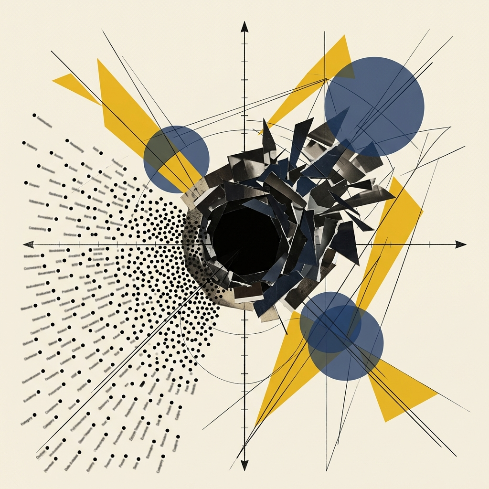
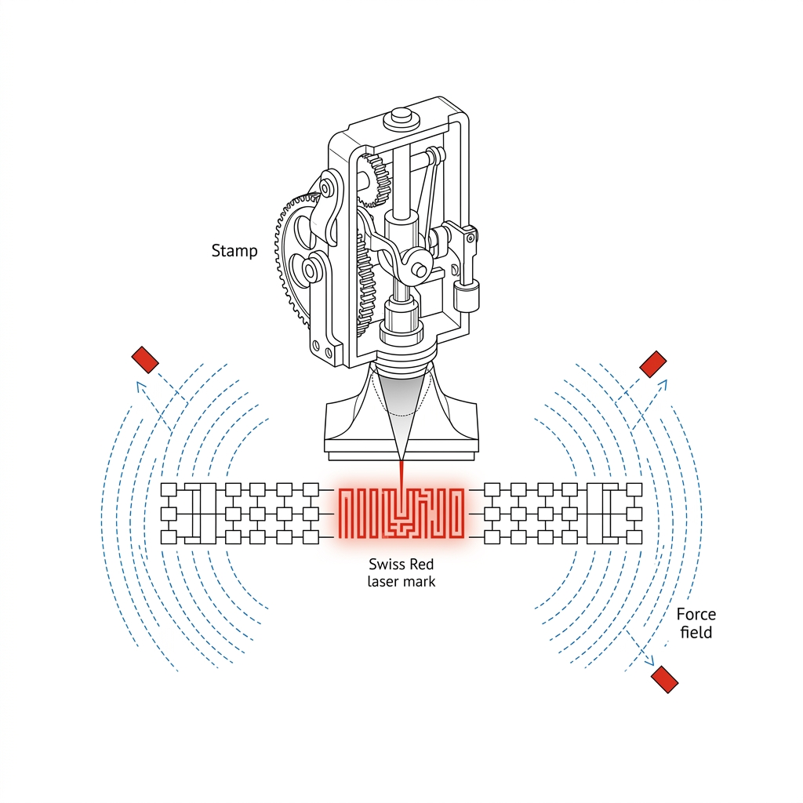

## 模块 2: What — 拆解数据的基因组 (40 分钟)
<!-- BUDGET: 5000 chars | SLIDES: ≥16 | STATUS: done -->
> [!NOTE] 核心标签回溯
> [data-abstraction-taxonomy] [hao-ch4-masterworks] [task-abstraction-framework]

我们要做的第一步，就是像分子生物学家拿到未知病毒样本一样，面对我们手头杂乱无章的数据，强制开启十分客观的成分破译。这就是 Munzner 框架的第一层：**What**（**数据抽象**，即 `ch02-data-abstraction` 理论模块）。

当你盯着一个 Excel 电子表格时，你看到的是满屏幕阿拉伯数字和各种莫名其妙的缩写。但在前端渲染引擎（包括 D3.js 乃至大型语言模型）眼中，世界确实不是由电子单元格单纯构筑的。这牵涉到最底层的**分类**哲学。

> [VISUAL]
> *   **Slide**: `S01b_Taxonomy_Intro`
> *   **Layout**: `Grid`
> *   **Scene**: 展现 Munzner **数据抽象**分类体系的庞大树状架构，从顶层的“Dataset Types”向下不断分化到“Item”和“Attribute”，颜色冷峻、学术感极强。
> *   **Caption**: "**数据抽象**分类地图：摒弃表面拟象，直击核心属性链条。"
> *   **Text**: "数据抽象分类地图"
> *   **Asset**: 

### 2.1 物理原石：五大基本数据类型构筑宇宙基底

一切现实原材料，都可以精准投射为五种最小粒子。如同物理学中的原子结构，所有的可视化图形，都不能动摇地建立在这五种粒子基岩之上。

> [VISUAL]
> *   **Slide**: `S12_Basic_Data_Types_Intro`
> *   **Layout**: `Grid`
> *   **Scene**: 显微镜下漂浮的五种几何晶体元件，代表构成数据宇宙的五种基本物理粒子。
> *   **Text**: "五种基本粒子"
> *   **Asset**: 
> *   **Source**: Textbook

Munzner 在著作中提出了**数据抽象**分类体系（Data Abstraction Taxonomy）：在写任何画图代码之前，你必须先把数据拆解为三个层级——基本粒子、数据集类型和属性类型。没有这三步，再大的报表在你面前都只是一堆无意义的数字。

> [VISUAL]
> *   **Slide**: `S13_Basic_Data_Types_Details`
> *   **Layout**: `Grid`
> *   **Scene**: 五张依次排列的高亮讲解卡片。分别画着：一个独立旋转的小方块，即 Item、一个小口径玻璃量杯，即 Attribute、连接两颗微粒的一根强拉力线，即 Link、一个雷达三维坐标系上的红色十字星，即 Position、一张覆盖地形的绿色等高线渔网，即 Grid。
> *   **Text**: "从个体到场"
> *   **List**: ["数据项", "属性", "链接", "位置", "网格"]
> *   **Caption**: "从个体到场：理解这五类粒子，便构建了重组数据的显微镜。"
> *   **Asset**: 
> *   **Source**: Textbook

1.  **Item（项）**：表里的一行，代表一个独立个体。比如一个学生、一笔订单、一条患者档案。在数据库里它叫一条记录（Record）。
2.  **Attribute（属性）**：表里的一列，描述个体的某个特征。比如年龄、身高、血压、消费金额。属性永远挂在 Item 上——没有学生，就没有成绩。
3.  **Link（链接）**：两个 Item 之间的连线，表示它们有关系。比如 A 关注了 B、网页之间的跳转链接、微信好友之间的通讯记录。
4.  **Position（位置）**：地理坐标，如经度 116.4°、纬度 39.9°。上一模块我们已经知道，位置是分类属性——不能做加法。人类大脑对空间位置有天然的感知优先级。
5.  **Grid（网格）**：把连续的区域切成小格子来采样。比如气象局把海面划成网格测风速，或 CT 扫描把人体切成体素（Voxel）断层。

> [VISUAL]
> *   **Slide**: `S13c_Data_Abstraction_Levels`
> *   **Layout**: `Concept`
> *   **Scene**: 一个分层的漏斗或阶梯，从最底层孤立的 Item，向上装配 Attribute，再由 Link 串联成网。
> *   **Caption**: "从微粒到宇宙：数据抽象层级的搭建。"
> *   **Text**: "从微粒到宇宙：数据抽象层级的搭建。"
> *   **Asset**: 

拿到一堆不明所以的数据源，你要像审问嫌疑人一样质询：我的主角是谁？挂载了什么装备？它是否与其它的点存在羁绊牵连？这立马能判定，你是要画散点云图，还是该渲染一个超庞大的错综家族引力图谱。

> [VISUAL]
> *   **Slide**: `S13b_Data_Dimensions_Expansion`
> *   **Layout**: `Grid`
> *   **Scene**: 从单一圆点开始，逐渐衍生出连线、三维坐标结构，最终扩展为覆盖屏幕的庞大数据宇宙网格拓扑。
> *   **Text**: "拓扑演化：从原子到星系"
> *   **Caption**: "五种微粒如何构筑出你所面对的整个数据宇宙形态。"
> *   **Asset**: 

### 2.2 构建聚落：四大数据集类型决定渲染流向

粒子无法独自抗衡时代，庞大的集群组合在一起，才构成了压倒性力量的数据集（Dataset）。认定这堆数据的组合归属宗族，直接裁决了 D3 调用哪一类强大的渲染树。

> [VISUAL]
> *   **Slide**: `S14_Dataset_Types`
> *   **Layout**: `Grid`
> *   **Scene**: 被切割成四格的视点宇宙。左上角是一叠层叠千丝万缕的数字电子表结构，即 Tables；右上角是节点如繁星、线路发光的引力星系，即 Networks；左下角是一张满是冷热光晕红蓝交错的脑部核磁横切面图，即 Fields；右下角是纯净且中空的冰冷国门折线边界，即 Geometry。
> *   **Text**: "四大数据集类型"
> *   **List**: ["二维表", "网络与树", "连续场", "几何空间"]
> *   **Caption**: "洞悉你的数据集，就像挑选正确的武器应对特定的猛兽一样至关重要。"
> *   **Asset**: 
> *   **Source**: Textbook

当今产生的商业和科研成果大多可归位于以下四个巨型板块阵营中：
*   **Tables（表）**：这是最简单粗暴的类型。横侧队列铺设无数个体项（Item），向下的列栏插满对应的丰富变量属性（Attribute）。这里存放的，就是典型的离散记录合辑。能用普通工作簿打开的大多源自于此。但你要懂得，这是最为平庸平坦的基础形态。
*   **Networks（网络）与 Trees（树）**：一旦你的个体间产生难以断开的羁绊连线（Link），原本非常扁平的表就撑破**维度**爆裂开来。若从上一级向下一级辐射绝无闭合回路，这就是森严的科层属性树。如果是相互交错反噬渗透，那就是关系纠缠网络，如同巨大金融资本交叉持股的黑暗漩涡星云版图。

> [VISUAL]
> *   **Slide**: `S15_Continuous_Fields`
> *   **Layout**: `Split`
> *   **Scene**: 深层聚焦展示场，即 Fields的壮观。左侧：一台高速运转的医疗大孔径扫描仪，正生成脑切片；右侧：风洞模拟器中充斥红蓝交织的光速激波粒子气流风场压强演示。
> *   **Caption**: "场数据：你永远能在任何微小间隙，再次挖掘出全新的极小原子级数据点。"
> *   **Text**: "场数据：你永远能在任何微小间隙，再次挖掘出全新的极小原子级数据点。"
> *   **Asset**: 

*   **Fields（连续场）**：前面讲的表和网络都是离散的个体——就像夜空里一颗颗独立的星辰。而连续场则完全不同，它更像弥漫在整个宇宙中无处不在的空气：你用手去掐，永远掐不断，因为每两个已知点之间都可以再细分出无穷多个中间值。想象一下医院的 CT 扫描：机器把你的身体切成一层层极薄的截面图像（这些截面叫做体素，类似于 3D 版的像素），每一层都在记录你身体内部的密度。但即便切片已经很密了，计算机依然可以通过数学公式在两层之间"脑补"出更多过渡画面——这种"在已知点之间填补空白"的数学操作，叫做**插值（Interpolation）**。连续场数据的渲染难点不在于画点画线，而在于如何让这些填补出来的过渡画面看起来自然流畅、符合物理规律。

> [CASE STUDY] 捕捉看不见的超级台风风暴场
> 让我们看看中国气象局是如何在超算中心内部去渲染强热带风暴涡旋风场的。气象局并不能在广阔无垠太平洋海面上的每一寸海浪上都插满物理结构传感器探头，他们只能在离散漂泊的浮标和气象站网格上收集到星星点点的断续截断数据。但为什么每晚新闻联播里的卫星风云图，却像极了一幅流金溢彩、风暴眼清晰可见的梵高星空流动画卷？这就是场，即 Fields 的恐怖填算威力。前端高性能渲染代码获取这些离散网格的压强与风速后，并非画上一个个孤立呆板的长剑柱子，而是启动了**复杂的平滑插值算法**，用**平滑的流体粒子动画**，硬生生通过算力“脑补”出了那些没有传感器的海面上每一丝狂风的走向气流暴走轨迹结构。这种无中生有、却又无比符合宏观物理真实流体动力的绝美画卷，正是场数据被高等抽象后才能赋予工程界**不可思议的视觉魔法**！

> [VISUAL]
> *   **Slide**: `S15a_Interpolation_Magic`
> *   **Layout**: `Concept`
> *   **Scene**: 展示从稀疏离散的几个测量点，通过“插值算法”平滑生成整个无缝色彩渐变的面图层。
> *   **Caption**: "插值运算：在已知点之间‘脑补’出无缝的物理流体动画。"
> *   **Text**: "插值运算：在已知点之间‘脑补’出无缝的物理流体动画。"
> *   **Asset**: 

*   **Geometry（几何）**：它剥夺了万物附加的外在财产属性，只剩下最不近人情的死寂外形边境骨架线。好比丢失了 GDP 与人口说明文档后留下的一张满是空洞多边形套嵌的国家荒凉折线空白图谱 JSON 数据。

> [VISUAL]
> *   **Slide**: `S15b_MultiDimensional_Cube`
> *   **Layout**: `Grid`
> *   **Scene**: 一个巨大的三维立体数据魔方悬浮着，每一面都倒映着时间、空间、品类等多重维度的不同切面投影，极其错综复杂。
> *   **Text**: "多维魔方：跨越时空的交叉封装"
> *   **Caption**: "不要试图用单线思维去理解多重多维度的交叉分析。"
> *   **Asset**: 

*   **Multidimensional Table（多维组合巨表）**：仅仅搞懂平坦的一维表格是远远不够的。在极具挑战的真实业务世界里，数据源头极少像流水账那样仁慈。多维表通过多个定位键位的复杂联合封锁，犹如三维坐标系里的 X/Y/Z 轴唯一标识，共同严格指定那枚确实唯一的交点实体数据。它的构造本质，是将不同的时间切片和空间刻度，犹如合金结构一般紧密包裹缝合。如果数据架构师无法在脑海中瞬间拔地而起、并一眼看穿支撑这个巨大魔方运转的多重骨架核心交汇点，那么画出的图表注定是被狂暴**维度**处理揉碎后的扭曲残影。

> [LIFE CONNECT] 随处可见的多维空间投射：一张超市的小票
> 不要被“多维组合”这个学术词汇吓倒。随手掏出一张便利店结账小票，你凝视的正是多维立体魔方的微缩投影。“2024年10月4日下午三点”（时间轴）、“海岸城分店”（空间轴）、“全麦切片面包”（品类轴），再加上你的“会员代号”。这四条看似毫不相干的属性轴，在这张纸片的交点上精准交叉，最终锚定出了唯一的**量化**结果——“应付金额 15.80 元”。一旦你学会将其中任意一条时间或空间的固化属性抽离展开，你就能构建出一张监测全城消费起伏的热力图谱。理解多维表的精髓，就是学会解剖并**重塑**眼前这个多层交叠的数据世界。

> [VISUAL]
> *   **Slide**: `S15c_Receipt_Hypercube`
> *   **Layout**: `Concept`
> *   **Scene**: 一张普通的超市收据小票，被激光射线解构成时间、地点、用户、SKU 四条交织的维度轴坐标系。
> *   **Caption**: "降维解剖：一张超市小票里的多维立体空间投射。"
> *   **Text**: "降维解剖：一张超市小票里的多维立体空间投射。"
> *   **Asset**: 

认清你的对手！无数外行曾试着用普通条形图生搬硬套一个交差持股的复杂黑网结构，这是可笑的原生架构错配。

#### 附加判定：数据集的可用性 (Dataset Availability)

不仅要看清数据的骨架类型，作为架构师你还必须认清数据的**可用性状态**，这决定了前端页面是一次性把数据全部加载完毕，还是需要像刷朋友圈一样不断接收新推送的实时数据流。
*   **静态文件 (Static / Offline)**：这是最温和的默认状态。假设整个数据集如同一块已经冷凝的琥珀，作为一个完整的 Excel 或 CSV 文件一次性抛给你。所有的极值和边界都是已知的，你可以随意统筹全局标尺。
*   **动态流 (Dynamic Stream / Online)**：这是极其极具挑战的深渊。数据并非全貌，而是如同未知的瀑布般在可视化会话期间不断实时流入。你不仅要处理新增的记录，甚至还要面对已绘出图形的变质和消融。在动态流下，图表的坐标轴必须具备自适应弹性的无限延展能力！

> [VISUAL]
> *   **Slide**: `S15d_Data_Availability`
> *   **Layout**: `Split`
> *   **Scene**: 冰块包裹的静态文件块（Static）对比源源不断流出的动态数据瀑布（Dynamic Stream），展示图表坐标轴自适应延展的弹性机制。
> *   **Caption**: "静态琥珀与动态瀑布：前端渲染架构面对不同数据流的根本差异。"
> *   **Text**: "静态琥珀与动态瀑布：前端渲染架构面对不同数据流的根本差异。"
> *   **Asset**: 

> [ACTIVITY]
> *   **Type**: `Quiz`
> *   **Duration**: `2min`
> *   **Desc**: 概念辨析：多维数据集的分类识别
> *   **Q**: 在气候监测项目中，工程师收到一份实时更新的数据源。该数据源包含了“气象站唯一编号”、“站点的经纬度坐标”、“每分钟刷新的风速值”以及“采集时间戳”。根据 Munzner 的数据抽象框架，以下哪项对该数据集类型的判定最为准确？
> *   **Options**: A. 鉴于风速具有连续且无处不在的物理特性，这属于连续场（Fields）数据，必须用插值算法渲染 | B. 这是一个包含多个变量属性的典型多维表（Multidimensional Table），并且当前处于动态流（Dynamic Stream）状态 | C. 由于包含经纬度坐标，它本质上属于纯粹的几何空间型（Geometry）数据 | D. 气象站之间存在空间物理距离，因此它属于典型的网络与树（Networks & Trees）结构
> *   **Answer**: `B`
> *   **Explain**: 虽然数据描述了连续的风速（物理场）且带有经纬度，但这份数据源提供的依然是以气象站为个体的离散记录集合（包含时间、空间多个维度属性交织的表格），而非经由气象局超算生成的网格插值面数据（Fields）或只提供边界的几何数据（Geometry）。由于是实时更新接收，属于动态流状态。

### 2.3 阶级壁垒：属性类型决定视觉映射的天生界限

闯过组合大关，接下来的挑战，则是最容易诱骗资深数字工匠栽跟头的幽暗水月镜花——**属性类型（Attribute Types）**与**语义（Semantics）**的界定审判。

在计算机刻板印象里，列存下的内容无非就是文字与带数点的数字这两种**类型（Type）**。但在可视化王国，仅仅知道类型是远远不够的，你必须掌握这串数字背后的真实世界**语义（Semantics）**！

> [TEACHING MOMENT] 没有语义的数字，就是致命的幻觉
> 设想大屏幕上抛出三个干瘪的数字："14, 2.6, 30"。它们到底是什么？是一只在迷宫里的实验鼠的 3D 坐标？还是一个新生儿的日期加体重特征？如果没有元数据（Metadata）赋予的语义，数据只是一堆引发 AI 算力幻觉的无意义字符。类型决定了这串数字能不能进行数学相加，而语义决定了它在业务里到底扮演什么角色。

在这张冰冷外衣底下，数字与数字间潜藏着森严且不能违逆的可视化映射天生贵贱区隔等级。

> [VISUAL]
> *   **Slide**: `S16_Attribute_Types_Flowchart`
> *   **Layout**: `Split`
> *   **Scene**: 屏幕一分为三，展现审判：最左是独立孤岛标签的**分类**型游标卡尺；居中则是模糊阶层序列的宽厚标板阶梯；右侧闪耀精确定理光环的无尽绵长高精微米级度量长卷尺。
> *   **Text**: "属性审判：分类、序数、量化"
> *   **List**: ["分类型", "序数型", "量化型"]
> *   **Caption**: "数据审判法庭的第一条法则：它有尊卑顺序吗？它的差距能被精确称重吗？"
> *   **Asset**: 
> *   **Source**: Textbook

闯过组合大关，接下来的挑战，则是最容易诱骗资深数字工匠栽跟头的幽暗水月镜花——属性类型，即 **Attribute Types** 的等级界定审判。如果说上一步区分了表和网格是宏观宇宙尺度的观测，那这里就是在对表内同一栏里的数字发起**真正的关键问题**。你看到的明明都是没有差别的阿拉伯数字 1、2、3，但它们可能是指代地区的**主键**代号，也可能是满意度评级的**序数**等级，更可能是真实的**物理重量**。一旦错判了这其中的层级秩序差异，你将会面临大模型把男女代码强行相加求平均值的荒谬灾难。

> [VISUAL]
> *   **Slide**: `S16b_Number_Illusion`
> *   **Layout**: `Concept`
> *   **Scene**: 三个外观一模一样的阿拉伯数字"1"，经过扫描后，分别显露出：ID编码、VIP等级、和1公斤重量三种截然不同的内涵。
> *   **Caption**: "穿透数字的表象：外形相同的数字，其物理意义与数学法则可能天差地别。"
> *   **Text**: "穿透数字的表象：外形相同的数字，其物理意义与数学法则可能天差地别。"
> *   **Asset**: 

#### A. 平行个体的唯一归宿：分类型，即 Categorical

这类词条完全没有伦理高低或优先顺序。它们只提供这苍苍众生中用来**互斥确认**它究竟是“哪家哪派”的**独立标签**。
比方说生鲜卖场中的货架标注名称（苹果，香蕉）或是影视网里的风格流派**分类签**（暗黑机甲，废土纪元）。谁的大于号也指不到对方长阶上。

> [VISUAL]
> *   **Slide**: `S17_The_Numbers_Trap`
> *   **Layout**: `Grid`
> *   **Scene**: 左侧是滚动列表导出的普通高校学号排列序列："20240101", "20240102"。突然右侧红色全息警报灯炸起，大字写着警告弹窗阻断：“警示：切勿迷信单纯阿拉伯整数的高昂表亲数字伪装外衣壳！”
> *   **Text**: "剥落伪装：不是所有数字都能计算"
> *   **Caption**: "永远剥落其虚弱拟名骗局：AI私自计算汇总大都市总邮政区号，就是一场逻辑全盘崩溃！"
> *   **Asset**: 

> [PHILOSOPHY] 人文锚点：标签隐喻下的系统性统计荒谬乱象
> 注意，**数字分类标签**并不天然享有数值运算的主轴豁免权！你身上的“身份证编号”、“邮政区号”，或者病人的体质编号，在 CPU 处理时虽然被当做长整型载体，但在现实语义困境中，它们是彻头彻尾的**独立分类标签**。你绝不能让你的 AI 将全班三十人的六位学号相加求均值，这没有任何物理社会现象投射价值可言，完全是伪数据科学最典型的虚假膨胀计算灾变！

#### B. 强弱区分的裂缝：有序阶层边界，即 Ordered

但凡在这个数据之间存在明确的、有共识的先后高低排列规则，统一定义作**有序型结构**。这里又硬划为两条差异鲜明的分支：

> [VISUAL]
> *   **Slide**: `S18_Ordinal_Vs_Quantitative`
> *   **Layout**: `Split`
> *   **Scene**: 左侧墙体挂着四张不同夸张剪裁设计的服装码数标签（S、M、L、XL），并弹出拷问框：“L码的布料比M码多几平方厘米？”右侧是立式精确数字体测激光身高测量仪，精准打出浮点算式结果屏： “180.5cm - 160.0cm = 20.50cm”。
> *   **Text**: "序数型 vs 量化型"
> *   **List**: ["序数型", "量化型"]
> *   **Caption**: "看似有序列，但模糊的标签与毫厘尽察的精准量纲，完全拥有各自统治领地规制法则。"
> *   **Asset**: 

*   **Ordinal（序数型）**：它界定出了明显的先后顺序，但致命的是：它非常主观，绝不容忍你进行等距度量的差值比较。比如问及 T 恤的大中小版型。大家都明确知晓 L 总是大于 M。但 L 版多出几厘米布料，没有答案。又譬如你在影视打分里留下的三颗星或四颗星评价，其中蕴藏的心路历程差距主观无比，不能强求算数代指。
*   **Quantitative（量化型）**：它拥有绝对的刻度支配权，原生地赋予前端组件执行任何代数变换的能力。无论数据怎么做降噪切割，都不会跑偏其物理本质。就如同一个人的身高从 180 厘米降至 160 厘米，其差异就是切实的二十厘米。它理所应当被作为主导的坐标轴点，去统御整个图表的基准线。

> [VISUAL]
> *   **Slide**: `S18b_Attribute_Trial`
> *   **Layout**: `Split`
> *   **Scene**: 法庭审判视觉风格。左侧是将数据打回原形的“定性审判锤”，右侧是等待被宣判的三种数据列。
> *   **Caption**: "定性审判：在进行任何清洗计算前，先敲定列级的数据阶层。"
> *   **Text**: "定性审判：在进行任何清洗计算前，先敲定列级的数据阶层。"
> *   **Asset**: 

> [TEACHING MOMENT] 数据属性审判考场
> 假设你面前有一份“全国高校在校学生体测档案”大表。作为数据架构师，请对以下三列数据进行定性判断：
>
> 1. **加密学号**：它是数字，但在系统中能相加求均值吗？不能。它只是用于唯一标识的标签，属于 **Categorical（分类型）**。
> 2. **肺活量测试得分**：它精确衡量了个体的肺容量，50分的人吸入的气体就是 25 分的两倍。支持算术比较，属于 **Quantitative（量化型）**。
> 3. **体育期末综合评级（优秀/良好/及格/不及格）**：这四个评级存在明确的高低顺序，但你无法精确量化“优秀”比“良好”多出多少体能点数。这种有顺序但无法做差值计算的属性，属于 **Ordinal（序数型）**。
>
> 培养这种瞬间界定数据属性的条件反射，是建立数据直觉的第一步，也是防范 AI 瞎做数学运算的核心防线。

#### C. 有序数据的三种狂飙流向形态：顺序延展、两极发散与循环轮回

作为统治高点的量化型长廊度量标段，依其内在的内在的方向性特征，又被划定对决在三种不同的流向模式：

> [VISUAL]
> *   **Slide**: `S19_Sequential_Vs_Diverging`
> *   **Layout**: `Split`
> *   **Scene**: 两个非常对立的世界。左半边：象征无损蓄积热量的单一水银线条，从归零的结冻线底层发狂似的朝向深红顶峰无限突刺拉伸。右轴向：深深切下的确实原点十字水平基准线横在正中间位置！向上发疯衍生突破云端的巨大青阳线，以及同时狂坠而下猛烈向下深渊底砸出深黑底线的阴绿跌停倒悬锥体刺！
> *   **Caption**: "顺序型大军始终向着高耸的山顶单线发起决死冲锋；而发散型的两极尖刀，则永远背对海平面大量地奔走对刺。"
> *   **Text**: "顺序型大军始终向着高耸的山顶单线发起决死冲锋；而发散型的两极尖刀，则永远背对海平面大量地奔走对刺。"
> *   **List**: ["单向顺序", "撕裂发散", "无休周期"]
> *   **Asset**: 
> *   **Source**: Textbook

*   **Sequential（单向顺序型）**：这代表着数值只能在一维方向上无穷延展。它必须锁定一个确实的起点位置，通常是零值冰点。在这之后，所有的数值演化都只沿着同一条轨迹攀升。例如自然界的树木年轮扩张，抑或是人类无法逆转的年龄增长。图表引擎最爱默认为此类数据调用色彩渐变柱状体系。

*   **Diverging（撕裂发散型）**：它像是一柄双刃工具。发散型数据的终极核心，是必须在坐标系中央定下方一道基准轴——也就是核心中位标点（**Mid-Point**）。数据的全部波澜，都会沿着这条光暗交界线向着两个严重猛烈延伸。在华尔街残酷的财报赌局图幅中，零轴之上爆发着黄金的耀眼盈利，而底端深潜的则是崩盘出血的赤字。红与蓝，在此针锋相对地交织撕裂。

*   **Cyclic（无休周期型）**：这是常常由于不在一条直线路径中前进，而被大量前端开发者意外忽略的数字螺旋大河。周期型数据的迷人之处在于，当数值向无穷大攀升触及某个设定阈值后，系统并不会崩溃，而是如衔尾蛇一般平滑回转，完美接驳到初始的零点。24 小时制和十二个月份都是它的典型宿主。

> [VISUAL]
> *   **Slide**: `S20_Cyclic_Clock`
> *   **Layout**: `Flow`
> *   **Scene**: 以 24 小时制为结构圆盘，展示夜晚 23:59 分即将完美且无缝平滑过渡到 00:00 分的弧圈衔接图像。图示强调"绝不存在坠落崖底"的圆润与首尾接合无极大环。
> *   **Caption**: "这就是周期大河的命门。如果不强行打弯回环去完美衔接，生命的大一统循环结构就会面临严重的结构断裂。"
> *   **Text**: "这就是周期大河的命门。如果不强行打弯回环去完美衔接，生命的大一统循环结构就会面临严重的结构断裂。"
> *   **Asset**: 

> [LIFE CONNECT] 午夜跳崖车祸
> 假设你错误地把“一天内的订单量”当成了枯燥顺序型数据。在半夜 23:59 跨向隔天 00:00 时，折线图会绝望地砸向零点谷底。一幅触目惊心的千尺断崖大跳水图景将生生出现在画布中央。这就是对属性流向特性的致命误断。这股洪流的归途，本该是被小心端放在极坐标系统下，或者是温暖封闭的圆弧环带中。让最放纵的顶端，完美丝滑地接合初始的零点，化为永恒循环。

### 2.4 定位信标：检索键与装载值的物理分工法则

剖视完数值的类型体系，接下来必须决定这些数据结构的终极物理指配归宿：确权。我们称呼这两大主神岗位叫做：寻址检索结构**主键**（**Key**），与数值被装载展现的体量池（**Value**）。

> [VISUAL]
> *   **Slide**: `S21_Key_And_Value_Semantics`
> *   **Layout**: `Grid`
> *   **Scene**: 一张薪资流水表。左侧唯一指代的工号字段顶端虚空浮动着一只代表寻址锁定权的黄金钥匙。右边总计报酬的方阵被黑铁外壳封装，呈现出内部含金体量的宝箱。
> *   **Text**: "检索键 (Key) 与 装载值 (Value)"
> *   **List**: ["检索键", "装载值"]
> *   **Caption**: "钥匙必须唯一地对应它所要敲开敲响的那口承载重量级数据的数字金砖大保险柜门匙孔。"
> *   **Asset**: 
> *   **Source**: Textbook

在开发控制台上，你必须签署下这无情且冰冷判决的一笔：它到底该担当去发坐标定标指北领地的导航信标（**Key**）？还是被迫作为装载数值洪流的储物仓库（**Value**）？
一个是唯一标识铁钉。决定了我能在茫茫坐标星空中靠什么**不可撼动**、独一无二的指纹来锁定唯一的你。另一个则是回应召唤的控制开关：当精准探针钻透那一片刻度地壳后，我将爆炸式展现它所拥有的磅礴重量数据。

> [VISUAL]
> *   **Slide**: `S21a_Key_Value_Functions`
> *   **Layout**: `Concept`
> *   **Scene**: 动画演示：一根代表 Key 的精准探针在坐标系网格上准确击中一个坐标，随后该坐标如严重错误般释放出大量象征 Value 的物质。
> *   **Caption**: "锁定位与释洪流：检索键与荷载池的物理分工。"
> *   **Text**: "锁定位与释洪流：检索键与荷载池的物理分工。"
> *   **Asset**: 

*   **唯一寻址定位信标列（Key）**：它的最高法则便是排他性的精确定址追踪！它就像潜底泥海扎下的一束激光标记钉。必须挑起那条杜绝重复克隆项的**唯一定位符**重任。只有诸如精确电子毫秒级打点时间戳，或是员工特制终身标识序列号，这类大主轴宿命密码骨干才能承担起**不可撼动的核心索引位置**。

> [VISUAL]
> *   **Slide**: `S21b_Key_Uniqueness_Demo`
> *   **Layout**: `Comparison`
> *   **Scene**: 对比图。左面：将“学号”标记为绿色的 Key，完美对应 50 名独立学生名单；右面：将“红白蓝颜色偏好”标记为带红色警告框的错误 Key，下面一堆同学挤在一起，发生碰撞爆炸。
> *   **Text**: "主键必须唯一：防止维度踩踏"
> *   **Caption**: "这就是找死！把高维泛指重复的烂属性字做成极重索引主轴去锁位百万系统！"
> *   **Asset**: 

然而，部分缺乏经验的架构师竟热衷于拿系统命门走钢丝。他们狂想把大颗粒、宽泛的分类选项字眼当作这座金库的核心钥匙。在设计选课系统时，如果妄图把“计算机学院”和“男生”这种含有上千人重合度的泛指属性当作**主键**去锁定唯一数据条目，那将是对架构最胆大包天的亵渎。

这种非常宽泛的信息缺乏排他性。当绘图引擎尝试基于这种垃圾键位去渲染独立散点时，它会发现成百上千个生命被强制折叠在同一个坐标点上互相处理。许多图表上出现莫名其妙的“空缺”或“数据黑洞”，罪魁祸首正是**主键**设计的崩塌。

> [VISUAL]
> *   **Slide**: `S21c_Key_Collapse`
> *   **Layout**: `Image`
> *   **Scene**: 坐标轴上的数据黑洞。无数标有不同姓名的点被强行吸入同一个泛泛的分类标签点中，发生崩塌和挤压。
> *   **Caption**: "数据黑洞：宽泛且重复的主键会直接抹杀个体的存在。"
> *   **Text**: "数据黑洞：宽泛且重复的主键会直接抹杀个体的存在。"
> *   **Asset**: 

那么，顶级工程师打造的**主键**防线是怎样的？在军事级雷达追踪系统中，**主键**设计堪称现代工业防撞击结晶。所有飞行轨迹，绝不能依赖“波音737”这类随时会重叠的泛用标签。

> [VISUAL]
> *   **Slide**: `S20b_Key_Collision_Simulation`
> *   **Layout**: `Comparison`
> *   **Scene**: 左图：基于“航班号”渲染的雷达界面，数十架飞机挤成一团模糊亮点；右图：基于“经纬坐标+毫秒时间戳”复合键的雷达网格，飞机结构排布清晰，每架飞机都有专属标识框。
> *   **Text**: "主键防线：防止高密度数据踩踏"
> *   **Caption**: "精确的锚点是屏幕上所有元素的免死金牌。"
> *   **Asset**: 

支撑监控底座的核心钥匙，是动态经纬度双轴数字，加上精确到微秒级的时间戳印记。物理空间与线性时间三重维度的全方位封固，编织成一张滴水不漏的捕捉网。当渲染系统将这些纯粹、干净且无法篡改的坐标矩阵作为最高优先级的定位**主键**时，哪怕海量数据呼啸压境，屏幕上的所有光点也能各自保持独立，永远不会发生挤压崩坏的折叠惨剧！

> [DID YOU KNOW] 赛博宇宙数据主轴的唯一终极防碰撞永恒钢印：万能唯一确实标识符 唯一编号 
> 在无尽复制粘贴的赛博世界中，为了从底层从根本上终结重名引发的踩踏事故，初代极客架构师们联手打造了对抗数据熵增的终极关键工具——万能唯一标识符（Universally Unique Identifier），即后端程序员时刻顶礼膜拜的 **唯一编号**。
>
> 这种特殊的数据列，完全不依赖任何现实业务逻辑（比如学号或手机号）。计算机会自动结合当前时间和设备信息，通过算法生成一段看起来毫无规律的超长编码（例如 `550e8400-e29b-41d4-a716-446655440000`）。它的排他性达到了极端的数学境界——统计学家指出，即便全球所有计算机不停地生成一万年，出现两组完全相同编号的概率也几乎为零。你可以把它理解为：每一行数据出生时，系统就自动给它盖上了一个全宇宙独一无二的电子指纹，从根源上杜绝了任何"撞脸"的可能。

> [VISUAL]
> *   **Slide**: `S21d_UUID_Stamp`
> *   **Layout**: `Center`
> *   **Scene**: 一个沉重的机械钢印正在给一行数据打上“万能唯一标识符”的防伪激光印记，周围是排他性的力场，拒绝任何相同标签靠近。
> *   **Caption**: "UUID 激光钢印：在赛博宇宙中赋予数据绝对排他性的终极防撞墙护甲。"
> *   **Text**: "UUID 激光钢印：在赛博宇宙中赋予数据绝对排他性的终极防撞墙护甲。"
> *   **Asset**: 

> [CASE STUDY] 选课系统的“黑洞”现象与底层崩塌
> 让我们从真实的计算机工程血泪史中提取教训。想象这样一个场景：某高校开发了一套新生抢课的可视化统计大屏，意图通过散点图动态展示各个教学楼当前涌入的学生人数。最初的开发外包团队为了省事，错误地将“课程代码”（类似 CS101）与“学生选课时间戳”简单缝合，误以为这足以构成联合主键。
>
> 灾难在开抢的那一刻降临了：系统底层的毫秒级记录仪精度严重不足，导致出现数百名学生在完全相同的同一毫秒内点击了“提交”按钮。在 D3.js 渲染引擎的严格视角中，这数百个活生生的独立学生数据，仅仅是因为主键（课程代码+残缺时间戳）完全一样，就被基本原则冷酷地判定为了“同一个实体的重复刷新”！
>
> 结果是令人窒息的。大屏上原本应该爆发出的数百个代表生命力的亮色学生散点，瞬间坍塌合并成了一个非常刺目的、永远不会改变位置的死亡孤点。业务方惊恐地以为系统根本没有流量涌入。实际上却是底层的 Key 设计崩溃，导致大量真实数据的实体存在，被图表引擎在内存网格中直接物理抹杀、合并销毁。这段惨痛的往事告诉我们：如果没有不能撼动的唯一指代信标 Key 作为防伪锚点，你画在屏幕上的任何美丽图形，都只不过是对真实世界数据荒诞的扭曲和掩埋罢了。只有真正尊重并确立确实唯一的 Key，图表才能诚实地呼吸。

> [VISUAL]
> *   **Slide**: `S22_Key_Value_Traps`
> *   **Layout**: `Grid`
> *   **Scene**: 模拟一个系统发生的毁灭弹窗警报崩局死结绝境界面。"Fatal Collapsed Conflict!" 红色闪光闪电覆盖乱码断层。
> *   **Caption**: "无知拿垃圾复用属性字做深锁核心结构钢钉的下场，便是大内存崩坏被底核互相碾死倾轧。"
> *   **Text**: "无知复用属性做主键：大内存崩坏与互相碾死倾轧。"
> *   **Asset**: 

千万别妄想在投产系统上耍花招。拿“男/女”这种宽泛的性别字段去充当千人大榜的排列主轴？D3 引擎会瞬间发出内存告警。道理很简单：当上百条记录共用同一个 Key 值，渲染器只好把它们全部折叠压进同一个坐标槽。结果，上百个本该独立闪烁的数据点，被强行挤成一团无法辨认的死灰色块。你的可视化，就在这一刻宣告数据灭绝。

> [DID YOU KNOW] 当单列无法唯一定位：复合键（Compound Keys）
> 听到这儿你可能会问：如果在巨型连锁商超的百万级交易底表里，单靠一列根本无法锁定唯一记录，该怎么办？
> 答案是复合键（Compound Keys）。它允许引擎同时抓取多个字段——比如把“交易时间戳”、“门店编号”和“收银终端号”三者焊接在一起，组成一把联合钥匙。这三个字段单独拿出来都有重复的可能，但拼在一起后，就构成了在全表中确实唯一的定位信标。这就好比你的身份证号：省份代码、出生日期、顺称号，任何一段都不唯一，但组合起来就是全球唯一的你。

> [VISUAL]
> *   **Slide**: `S22b_Compound_Key`
> *   **Layout**: `Center`
> *   **Scene**: 三把半截的钥匙（时间、门店、终端）在齿轮机关中严丝合缝地拼接成一把完整的复合主键钥匙（Compound Key），锁进复杂的金库锁孔中。
> *   **Caption**: "复合键焊接：三段泛指残片，拼合成了全表独一无二的定海神针。"
> *   **Text**: "复合键焊接：三段泛指残片，拼合成了全表独一无二的定海神针。"
> *   **Asset**: 

好，下面我们通过一个事故案例来检验大家对主键排他性的理解。

> [ACTIVITY]
> *   **Type**: `Quiz`
> *   **Duration**: `2min`
> *   **Desc**: 事故重现：复合键的排他性陷阱
> *   **Q**: 某外包团队开发全国连锁酒店“实时房态可视化大屏”时，直接使用“城市名”和“房间房型（如大床/双床）”的组合作为主键（Key），结果大屏上的散点图出现大面积数据丢失和引擎闪退。请问底层的致命原因是什么？
> *   **Options**: A. 离散的分类属性（Categorical）天生不能作为主键 | B. 复合键未能实现唯一的排他性，导致不同门店的同类房型发生物理坐标坍塌 | C. 未能在 Why 层级定义大模型角色 | D. 缺失具体的经纬度 Position 属性导致无法渲染
> *   **Answer**: `B`
> *   **Explain**: “城市+房型”这样的复合键极其宽泛（如北京有几十家分店都有大床房），不具备排他性（Uniqueness）。这会导致成百上千个独立房间的数据被强行挤压在同一个坐标槽内互相覆盖，从而引发内存踩踏与视觉黑洞。

来看看正确率如何。

### 2.5 维度折叠：分层属性与时间语义的动态伸缩

在确定了 Key 和 Value 之后，作为高阶架构师，你必须警惕一种能够随意膨胀收缩的变体概念——**分层属性（Hierarchical Attributes）**，尤其以**时间**和**空间**最为致命。

时间不是一条死板的单向轨道。在复杂的可视化系统中，时间数据天然具备**层级聚合（Aggregated hierarchically）**能力：天可以折叠成周，周可以熔铸成月，月可以聚变为年！当你拥有这种底层洞察时，你就可以在图表上赋予使用者“在多个尺度上寻找模式”的权威（例如，拉近看是每周的平装波动，推远看则是寒暑季节的宏观潮汐）。空间数据同样如此（邮编 -> 城市 -> 省份 -> 国家）。

> [VISUAL]
> *   **Slide**: `S23_Time_Hierarchy`
> *   **Layout**: `Center`
> *   **Scene**: 一个俄罗斯套娃式的时间折叠器。展示从底层的细碎“天”网格，向上折叠熔铸为“周”，最终聚变为巨大的“月/年”立方体结构。
> *   **Caption**: "时间维度折叠：赋予用户在微观潮汐与宏观季风之间自由切换的上帝视角。"
> *   **Text**: "时间维度折叠：赋予用户在微观潮汐与宏观季风之间自由切换的上帝视角。"
> *   **Asset**: 

> [DID YOU KNOW] "Dynamic (动态)" 词汇在行业内的跨界双重歧义
> 在与前端或大模型沟通过程中，"动态"（Dynamic）是个极其危险的词。你必须严谨区分：
> 1. 它是否指代数据集本身的生命周期？即我们刚才说的**动态流（Dynamic Stream）**，数据文件正在源源不断地实时增加。
> 2. 还是指代**时间语义（Temporal Semantics）**？当时间作为一个**主键（Time as Key / Time-varying data）**时，如动物身上的传感器每秒传回的新坐标，数据随时间变化，这被称为**时变数据**。
> 3. 更奇妙的是，时间也可以仅仅作为一个冰冷的**量化荷载池（Time as Value）**，比如百米赛跑的“已耗费耗时时长（Duration）”，这时的数据集是完全静态、非时变的。

看清了什么是 **What**（甚至洞悉了它背后深藏的时间语义与流向），我们还要挖掘其根源意图：客户绘制它的初衷幽暗心愿究竟何在？这导向下一模块中枢审判——洞悉它的动机：为什么要这么去做？这是属于 **Why** 深究领域的严查大任。
