## 模块 2: What — 拆解数据的基因组 (40 分钟)
<!-- BUDGET: 3000 chars | SLIDES: ≥16 | STATUS: done -->

> [!NOTE] 核心标签回溯
> [data-abstraction-taxonomy] [hao-ch4-masterworks] [task-abstraction-framework]

拿到杂乱无章的数据后，我们首先要理清它是什么（What）。在画图前，必须明白我们在处理什么类型的数据，否则图表就会选错。

> [VISUAL]
> *   **Slide**: `S01b_Taxonomy_Intro`
> *   **Layout**: `Grid`
> *   **Scene**: 展现 Munzner 数据抽象分类体系的树状架构，从顶层的 Dataset Types 向下分化到 Item 和 Attribute。
> *   **Caption**: "数据抽象分类地图：摒弃表面现象，直击核心属性结构。"
> *   **Text**: "数据抽象分类地图"
> *   **Asset**: 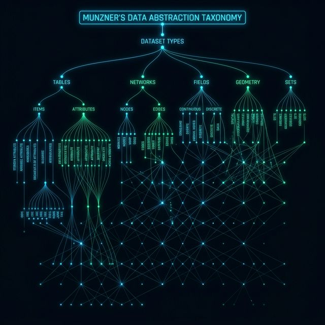

### 2.1 数据的五大基本构成

面对现实世界中动辄几万条记录的复杂表格，无论多智能的画图软件其实都很“笨”，它们无法一口吞下。因此，我们第一步要做的，就是像拆解乐高积木一样，把看似庞大的数据还原成最基础的“零件”。只有剥离出这些基础零件，我们才能在发号施令时精确地告诉 AI：“请把这个‘数据项’画成一个圆点，把它的‘属性’映射成圆点的颜色”。接下来要认识的这五种基本零件，就是可视化的底层基因。

> [VISUAL]
> *   **Slide**: `S13_Basic_Data_Types_Details`
> *   **Layout**: `Grid`
> *   **Scene**: 五张依次排列的高亮讲解卡片。分别展示：方块(Item)、量杯(Attribute)、连线(Link)、坐标系(Position)、网格(Grid)。
> *   **Text**: "从个体到整体"
> *   **List**: 
>     - 数据项
>     - 属性
>     - 链接
>     - 位置
>     - 网格
> *   **Caption**: "五大基本类型：数据重组的基础单元。"
> *   **Asset**: 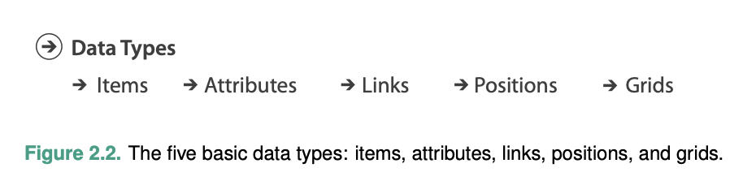
> *   **Source**: Textbook

为了让大家有直观的画面感，我们拿一个具体的场景来串联它们：
1.  **Item（数据项/对象）**：数据世界里的独立个体（通常是表格的一行）。例如：一个名叫“小明”的学生。
2.  **Attribute（属性/特征）**：这个个体身上的各种特征（通常是表格的一列）。例如：小明的“年龄”（整数）或“专业”（字符串）。
3.  **Link（链接/关系）**：两个个体之间的交互连线。例如：小明和另一位同学“互为好友”的关系。
4.  **Position（位置）**：物理空间上的绝对坐标。例如：小明当前打卡所在的“经纬度”。
5.  **Grid（网格）**：对连续空间进行“切片采样”的结构。现实世界是连续不断的，计算机无法存储无限个点。所以要计算小明头顶那片云的降雨量，气象局会用一张虚拟的“渔网”罩住天空，只记录每个网格交叉点上的数据。这张用来切分空间的“渔网”，就是 Grid。

> [VISUAL]
> *   **Slide**: `S13c_Data_Abstraction_Levels`
> *   **Layout**: `Center`
> *   **Scene**: 分层漏斗模型，从底层的 Item 向上装配 Attribute，再由 Link 串联。
> *   **Caption**: "数据抽象层级：从微粒到系统。"
> *   **Text**: "数据抽象层级：从微粒到系统。"
> *   **Asset**: 

这五个基本零件看起来很简单，但在实际工作中，它们是我们破解数据的核心武器。与其死记硬背，不如我们直接来实战演练一下，看看你能不能像机器一样，把复杂的现实业务瞬间拆解成“数据积木”：

> [VISUAL]
> *   **Slide**: `S13d_Data_Structure`
> *   **Layout**: `Comparison`
> *   **Scene**: 展示结构化数据与非结构化数据在存储器中物理排列形态对比的示意图。
> *   **Caption**: "数据的心智模型：从无序的混沌迷雾，到严丝合缝的结构化矩阵阵列。"
> *   **Asset**: 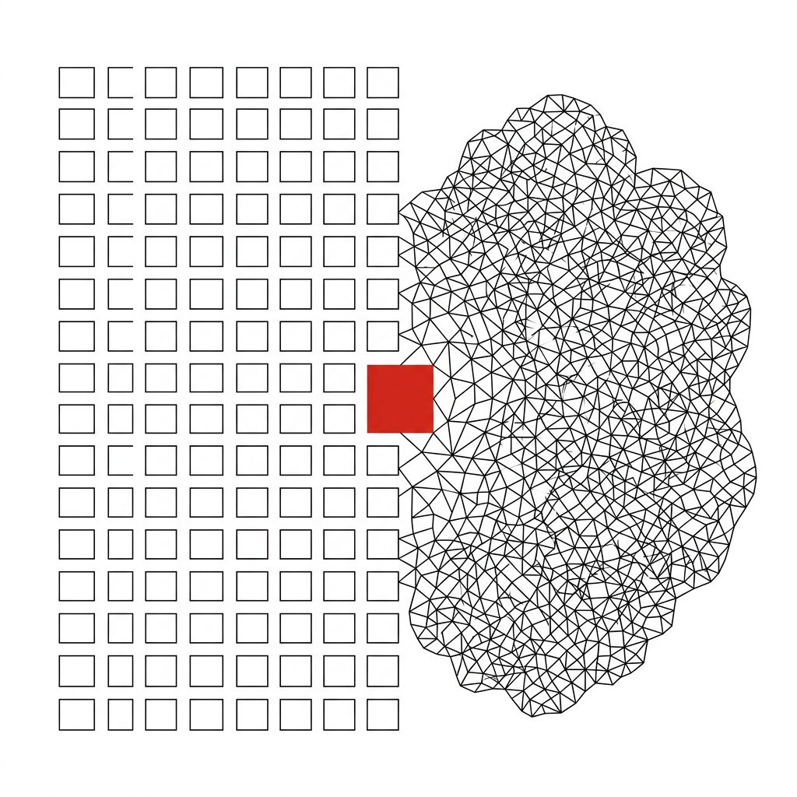

> [ACTIVITY]
> *   **Type**: `Quiz`
> *   **Duration**: `3min`
> *   **Desc**: 实战拆解：网约车派单系统的数据基因
> *   **Q**: 假设你现在是网约车平台的可视化工程师，屏幕上显示“一辆网约车正在前往接乘客”。请用刚才学的知识拆解这个场景：“司机”和“乘客”分别属于什么零件？他们手机上实时变化的“GPS坐标”属于什么？系统给他们派单匹配的这一刻，建立的“接送订单”又属于什么？
> *   **Options**: A. 都是 Item；都是 Grid；是 Attribute | B. 都是 Item；都是 Position；是 Link | C. 司机是 Item 乘客是 Attribute；是 Position；是 Link | D. 都是 Attribute；都是 Position；是 Grid
> *   **Answer**: `B`
> *   **Explain**: 司机和乘客都是独立的数据单元（Item），GPS 坐标提供的是绝对的物理空间位置（Position），而系统派单把这两个原本毫不相干的人连接在一起，这就构成了一条关系连线（Link）。当你能像这样瞬间看透业务表象，你就不再是看热闹的外行了。

> [VISUAL]
> *   **Slide**: `S13b_Data_Dimensions_Expansion`
> *   **Layout**: `Grid`
> *   **Scene**: 从单一圆点开始，衍生出连线、三维坐标，扩展为数据拓扑网。
> *   **Text**: "结构演化：从微观到宏观"
> *   **Caption**: "五种微观元素构筑出数据集的整体形态。"
> *   **Asset**: 

### 2.2 数据的四大分类

上述五个微观的“零件”就像乐高积木一样，拼装成了我们在日常工作中看到的所有数据集。你以为你在处理表格或是思维导图，但在机器眼里，它们只是一堆基本零件的不同组合。认清数据集属于哪一种“拼装模式”，决定了我们后续要选择什么样的可视化策略。

> [VISUAL]
> *   **Slide**: `S14_Dataset_Types`
> *   **Layout**: `Grid`
> *   **Scene**: 四格视图：二维表（Tables）、网络与树（Networks）、连续场（Fields）、几何多边形（Geometry）。
> *   **Text**: "四大数据集类型"
> *   **List**: 
>     - 二维表
>     - 网络与树
>     - 连续场
>     - 几何空间
> *   **Caption**: "洞悉数据集类型，是选择可视化策略的前提。"
> *   **Asset**: 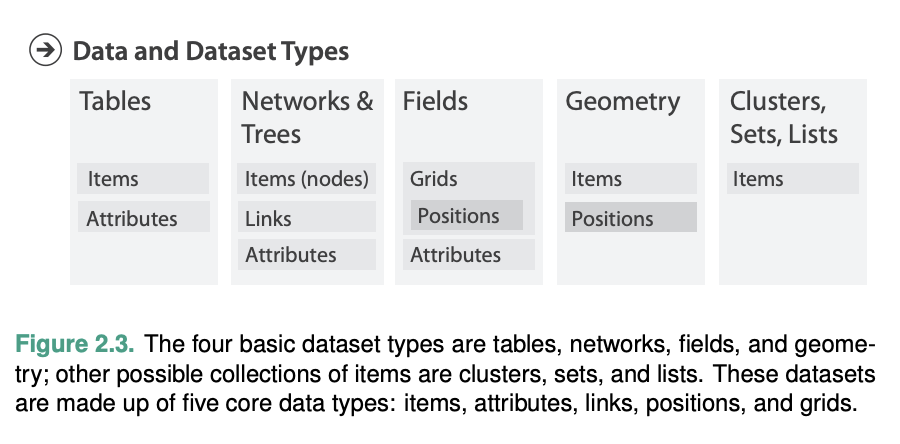
> *   **Source**: Textbook

1.  **Tables（表格）**：最常见的 Excel 表。它就是由 **Item（行对象）** 和 **Attribute（列特征）** 这两种基础零件拼装出来的。
2.  **Networks & Trees（网络与树）**：像思维导图或人际关系网。它是由 **Item（节点）** 和 **Link（连线）** 拼装出来的。

> [VISUAL]
> *   **Slide**: `S15_Continuous_Fields`
> *   **Layout**: `Split`
> *   **Scene**: 左侧：医疗 CT 扫描脑切片图；右侧：风洞气流风场压强演示。
> *   **Caption**: "连续场数据：在任意两点间都能细分出中间值。"
> *   **Text**: "连续场数据：在任意两点间都能细分出中间值。"
> *   **Asset**: 

3.  **Fields（连续场）**：比如天气预报的温度渐变图。其实气象站只有几个点，但电脑会自动把中间的空白填补上颜色，连成一片。

> [VISUAL]
> *   **Slide**: `S15a_Interpolation_Magic`
> *   **Layout**: `Center`
> *   **Scene**: 展示从稀疏离散的测量点，平滑生成色彩渐变的面图层。
> *   **Caption**: "电脑会自动在测量点之间填补色彩，生成无缝的连续图像。"
> *   **Text**: "自动填补：把离散的点连成面"
> *   **Asset**: 

4.  **Geometry（几何空间）**：比如纯粹的地图国家轮廓线，只有形状，没有附带的其他数值。

> [VISUAL]
> *   **Slide**: `S15b_MultiDimensional_Cube`
> *   **Layout**: `Grid`
> *   **Scene**: 三维立体数据魔方，每一面展示时间、空间、品类等不同维度的投影。
> *   **Text**: "多维表：跨越时空的交叉定位"
> *   **Caption**: "理解多维表的关键在于拆解多个坐标轴的联合标识。"
> *   **Asset**: 

生活中的数据大多是**多维表格**。比如一张超市小票，同时包含了时间、门店（地点）、商品、价格多个维度。理清数据，就像是在这些维度里找我们要看的角度。

> [VISUAL]
> *   **Slide**: `S15c_Receipt_Hypercube`
> *   **Layout**: `Center`
> *   **Scene**: 超市收据小票被解构成时间、地点、用户、SKU 四条交叉坐标轴。
> *   **Caption**: "降维解剖：一张小票背后的多维属性交叉。"
> *   **Text**: "降维解剖：一张小票背后的多维属性交叉。"
> *   **Asset**: 

> [VISUAL]
> *   **Slide**: `S15d_Data_Availability`
> *   **Layout**: `Split`
> *   **Scene**: 静态文件块对比源源不断流出的动态数据瀑布，展示图表坐标轴自适应机制。
> *   **Caption**: "静态文件与动态流：前端渲染架构需应对的数据更新差异。"
> *   **Text**: "静态文件与动态流：前端渲染架构需应对的数据更新差异。"
> *   **Asset**: 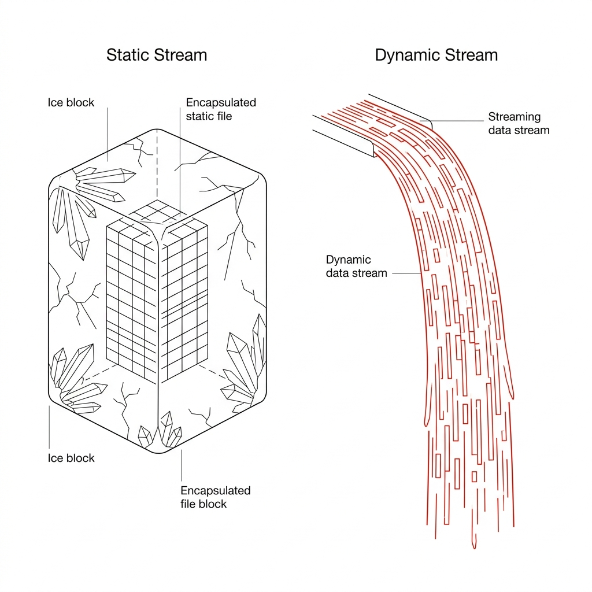

**静态数据 vs 动态数据**：
静态数据就是一次性发给你的 Excel 文件；动态数据则是源源不断滚动的实时数据流。

> [ACTIVITY]
> *   **Type**: `Quiz`
> *   **Duration**: `2min`
> *   **Desc**: 概念辨析：多维数据集的分类识别
> *   **Q**: 气象站收到一份实时更新的数据源，包含了“气象站编号”、“经纬度”、“每分钟刷新的风速值”以及“采集时间戳”。根据分类，这是什么类型的数据集？
> *   **Options**: A. 属于连续场（Fields），必须用插值算法渲染 | B. 这是一个包含多个变量特征的多维表格（Multidimensional Table），且处于动态流状态 | C. 包含经纬度，属于纯几何空间型（Geometry） | D. 气象站有空间距离，属于网络与树（Networks）
> *   **Answer**: `B`
> *   **Explain**: 虽然描述了风速并带有经纬度，但这提供的是以“气象站”为对象的独立记录清单，属于多维表格。由于是实时刷新，它处于动态流状态。

### 2.3 数据的三种类型：不是所有数字都能计算

这是画图时最容易犯错的地方。计算机眼里的数字和我们不同，有些数字只是一层伪装，绝不能用来做加减法！

> [VISUAL]
> *   **Slide**: `S16_Attribute_Types_Flowchart`
> *   **Layout**: `Split`
> *   **Scene**: 展现三种分类属性：独立的分类标签、阶层式的序数阶梯、精确度量的量化刻度尺。
> *   **Text**: "属性类别：分类型、序数型、量化型"
> *   **List**: 
>     - 分类型
>     - 序数型
>     - 量化型
> *   **Caption**: "判断法则：数据有高低顺序吗？能精确计算差值吗？"
> *   **Asset**: 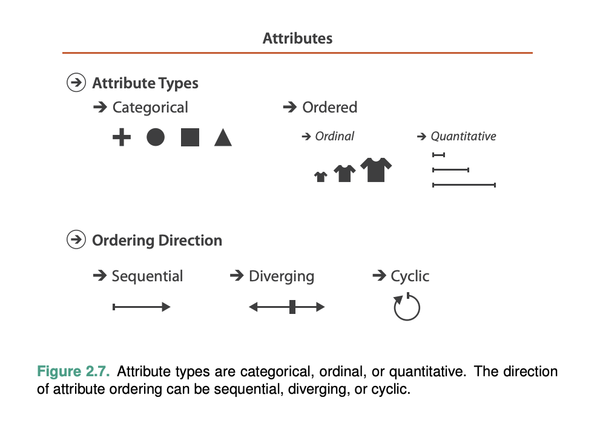
> *   **Source**: Textbook

> [VISUAL]
> *   **Slide**: `S16b_Number_Illusion`
> *   **Layout**: `Center`
> *   **Scene**: 三个外观相同的数字"1"，分别显露出：ID编码、VIP等级、和1公斤重量三种截然不同的内涵。
> *   **Caption**: "穿透数字表象：相同的数字外形，其计算法则可能天差地别。"
> *   **Text**: "穿透数字表象：相同的数字外形，其计算法则可能天差地别。"
> *   **Asset**: 

1. **Categorical（分类型 - 纯标签）**
完全没有大小、高低之分，**绝对不能进行任何加减计算**。
*   **例子**：学号、邮编、性别、专业名称。
*   **一招鲜记住**：把全班同学的学号相加求平均值，是一个毫无意义的荒谬操作！

> [VISUAL]
> *   **Slide**: `S17_The_Numbers_Trap`
> *   **Layout**: `Grid`
> *   **Scene**: 列表展示普通高校学号序列，红灯警报提示：“切勿迷信阿拉伯数字的伪装！”
> *   **Text**: "剥落伪装：不是所有数字都能计算"
> *   **Caption**: "将邮编或学号相加求平均，是典型的计算灾难。"
> *   **Asset**: 

2. **Ordinal（序数型 - 粗略排序）**
有高低顺序，但**不能做精确的数值计算**。
*   **例子**：衣服尺码（S、M、L）。你可以说 L 码比 M 码大，但不能算“L 减 M 等于几厘米”。电影的一星到五星评价也是同理。

> [VISUAL]
> *   **Slide**: `S18_Ordinal_Vs_Quantitative`
> *   **Layout**: `Split`
> *   **Scene**: 左侧：四件衣服尺码（S/M/L/XL），问题“L码比M码多几厘米？”；右侧：精准身高测量仪算式“180-160=20cm”。
> *   **Text**: "序数型 vs 量化型"
> *   **List**: 
>     - 序数型
>     - 量化型
> *   **Caption**: "序数仅有顺序，量化可作差值计算。"
> *   **Asset**: 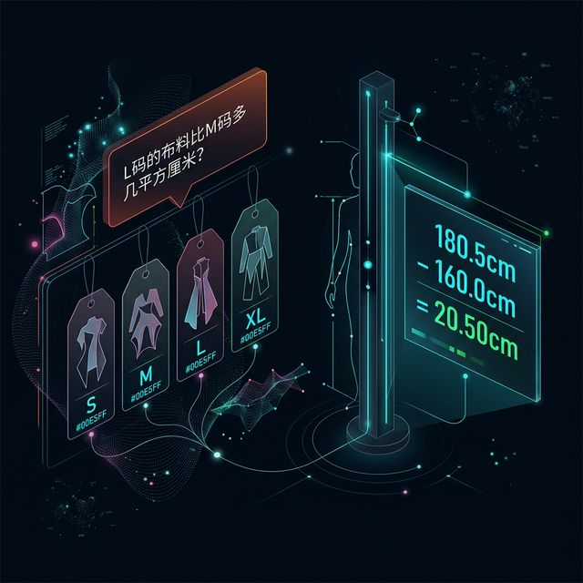

3. **Quantitative（量化型 - 真实数量）**
拥有精确的刻度，这是真正的数字，**支持精确的加减乘除**。
*   **例子**：身高、体重、销售额。180cm 减去 160cm 准确等于 20cm。

> [VISUAL]
> *   **Slide**: `S18b_Attribute_Trial`
> *   **Layout**: `Split`
> *   **Scene**: 数据清洗前的“属性定性分类”检查清单。
> *   **Caption**: "定性审判：清洗计算前，先敲定数据列的属性类别。"
> *   **Text**: "定性审判：清洗计算前，先敲定数据列的属性类别。"
> *   **Asset**: 

对于真正的数字（量化型数据），它还能细分为三种变化方向：

> [VISUAL]
> *   **Slide**: `S19_Sequential_Vs_Diverging`
> *   **Layout**: `Split`
> *   **Scene**: 左半边：单一线条从零点向高处单向延伸；右半边：以中心零轴为基准，数据向正负两极延伸（如红蓝分歧）。
> *   **Caption**: "单向延伸与两极发散模式。"
> *   **Text**: "单向延伸与两极发散模式。"
> *   **List**: 
>     - 单向顺序
>     - 发散型
>     - 周期型
> *   **Asset**: 
> *   **Source**: Textbook

*   **Sequential（单向顺序）**：从零开始，数值向一个方向越来越大（如年龄）。
*   **Diverging（双向发散）**：有一个中心零点，向正负两极延伸（如盈利和亏损）。
*   **Cyclic（周期型）**：像时钟一样转圈，23:59 之后是 00:00。画图时必须把它连成一个圆环，如果强行画成直线，折线图会在半夜突然跳崖砸向零点！

> [VISUAL]
> *   **Slide**: `S20_Cyclic_Clock`
> *   **Layout**: `Flow`
> *   **Scene**: 24 小时圆盘，展示 23:59 无缝平滑过渡到 00:00 的环形结构。
> *   **Caption**: "周期型数据必须平滑回环，避免首尾断裂。"
> *   **Text**: "周期型数据必须平滑回环，避免首尾断裂。"
> *   **Asset**: 

> [ACTIVITY]
> *   **Type**: `Quiz`
> *   **Duration**: `2min`
> *   **Desc**: 属性方向辨析：单向顺序数据的核心特征
> *   **Q**: 一家电商平台记录了用户自注册以来的“累计登录天数”。这个数据属于哪一种量化型变化方向？为什么？
> *   **Options**: A. 双向发散，因为天数有长有短 | B. 周期型，因为以天为单位循环 | C. 单向顺序，因为有绝对零点（0天）且只能向一个方向累加递增 | D. 分类型，因为它只是个数字标签
> *   **Answer**: `C`
> *   **Explain**: 累计天数从零开始，并且数值只会越来越大（向一个方向延伸），没有负数概念，符合典型的“单向顺序”特征。

> [ACTIVITY]
> *   **Type**: `Quiz`
> *   **Duration**: `2min`
> *   **Desc**: 视觉映射策略：单向顺序数据的色彩选择
> *   **Q**: 你正在制作一张全国各省“人口密度图”。在选择颜色时，哪种方案是正确的？
> *   **Options**: A. 用红色代表低密度，蓝色代表高密度（双向色板） | B. 统一使用蓝色，用颜色的深浅来代表密度的高低（单向渐变色板） | C. 随机给每个省份分配不同的鲜明颜色 | D. 使用彩虹色，颜色越丰富越好
> *   **Answer**: `B`
> *   **Explain**: 人口密度是典型的“单向顺序”数据（从 0 开始越来越高）。使用同一种颜色的深浅渐变（如浅蓝到深蓝），能最直观地让大脑感知到“数量”的单向增加。

> [VISUAL]
> *   **Slide**: `S19b_Diverging_Target`
> *   **Layout**: `Center`
> *   **Scene**: 极简的“双向发散”条形图线框图示，一根标红的中心轴代表 100% 达标线，两侧的条形分别向正负两极延伸。
> *   **Caption**: "以 100% 达标线为中心零轴，高于目标的向右延伸，低于目标的向左延伸。"
> *   **Text**: "寻找中心基准：100% 是双向发散的零点"
> *   **Asset**: 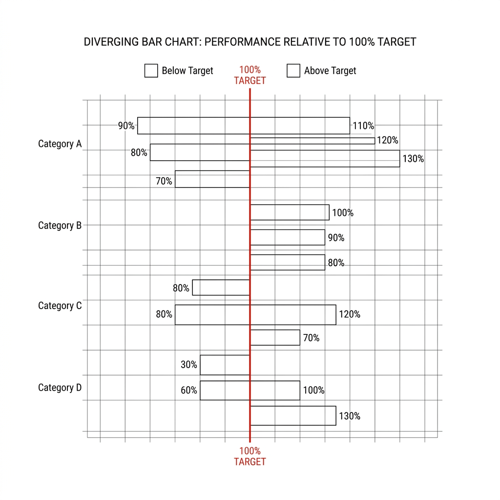

> [ACTIVITY]
> *   **Type**: `Quiz`
> *   **Duration**: `2min`
> *   **Desc**: 属性方向辨析：双向发散数据的关键基准
> *   **Q**: 公司让你制作一张“各部门年度业绩达成率”的图表，公司的目标达标线是 100%。如果使用双向发散型（Diverging）数据映射，你应该把哪个数值设定为“中心零轴”？
> *   **Options**: A. 0%（最低点） | B. 100%（目标达标线） | C. 50%（中位数） | D. 所有部门的平均值
> *   **Answer**: `B`
> *   **Explain**: 双向发散数据的核心是“有一个有意义的中心基准”。大家关心的是“超过目标”还是“未达标”，因此 100% 达标线就是中心点。高于 100% 往一种颜色延伸，低于 100% 往另一种颜色延伸。

> [ACTIVITY]
> *   **Type**: `Quiz`
> *   **Duration**: `2min`
> *   **Desc**: 案例诊断：强制套用单向逻辑的后果
> *   **Q**: 一位实习生把用户满意度调查（非常不满意、不满意、一般、满意、非常满意）映射成了一条从“极浅的红色”到“极深的红色”的单向渐变带。你觉得哪里不对？
> *   **Options**: A. 没毛病，深红色代表非常满意，很直观 | B. 颜色选错了，满意度必须用绿色 | C. 满意度有中心基点“一般”，应当使用红-灰-绿的“双向发散”色带，划清“喜欢”与“厌恶”的界限 | D. 满意度是纯文字，不能用颜色表示
> *   **Answer**: `C`
> *   **Explain**: 用户满意度本质是一个有中立态度（一般）的双向发散数据。用单一深浅色带会掩盖正负态度的质变边界，使用双向色带（红-中性-绿）能让人一眼看出偏好倾向。

> [ACTIVITY]
> *   **Type**: `Quiz`
> *   **Duration**: `2min`
> *   **Desc**: 陷阱规避：折线图上的半夜跳崖事件
> *   **Q**: 你在普通折线图的横轴上画出了 00:00 到 24:00 的心率变化图。当时间跨越 23:59 到下一秒时，如果不做特殊处理，折线上最可能会出现什么情况？
> *   **Options**: A. 折线会完美衔接成一个圆 | B. 毫无变化，正常向前走 | C. 00:00 会被电脑理解为坐标起点，导致折线瞬间从最右侧“跳崖式”砸回最左侧的原点 | D. 图表会自动切换为下一天的颜色
> *   **Answer**: `C`
> *   **Explain**: 时间循环是典型的周期型数据。如果强行把它塞进线性 X 轴，24点（即0点）会被绘制在坐标轴最左端，产生首尾断裂的跳崖视觉。对于周期数据，常需要采用环形映射（如极坐标）以保持连续性。

> [ACTIVITY]
> *   **Type**: `Quiz`
> *   **Duration**: `2min`
> *   **Desc**: 概念辨析：谁才是真正的周期循环
> *   **Q**: 下列哪组数据，如果不进行“环形处理（首尾相接）”，就会丢失重要的连续性信息，因此属于典型的“周期型”数据？
> *   **Options**: A. 员工进公司的累计工龄（0-30年） | B. 一年中四季的交替更迭（春夏秋冬） | C. 公司年度盈利与亏损明细 | D. 气象站监测的绝对降雨量
> *   **Answer**: `B`
> *   **Explain**: 四季交替像时钟一样，“冬天”过去又是“春天”，是一个闭环。如果在视觉上断开“冬”和“春”，就违背了循环连续性。工龄是单向延伸，盈亏是双向发散。

### 2.4 唯一标识符 (Key) 与 承载内容 (Value)

画图表前，必须分清哪一列用来“找人”，哪一列用来“装数值”。

> [VISUAL]
> *   **Slide**: `S21_Key_And_Value_Semantics`
> *   **Layout**: `Grid`
> *   **Scene**: 左侧工号字段漂浮着代表定位寻址的钥匙（Key），右侧数值字段被设计为装载体量的金库（Value）。
> *   **Text**: "唯一标识符 (Key) 与 承载内容 (Value)"
> *   **List**: 
>     - 标识符
>     - 承载内容
> *   **Caption**: "标识符必须精准对应并开启承载内容的保险柜。"
> *   **Asset**: 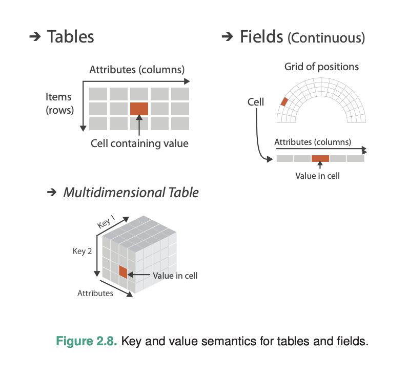
> *   **Source**: Textbook

*   **Key（唯一标识符）**：就像**快递单号**，**绝对不能重复**。它的作用是精准定位到唯一的一个对象。比如学号、身份证号、具体的门店编号。
*   **Value（承载内容）**：就像快递包裹里的物品重量或价值，是我们想要展示的具体数据内容。

> [VISUAL]
> *   **Slide**: `S21a_Key_Value_Functions`
> *   **Layout**: `Center`
> *   **Scene**: 代表 Key 的探针准确击中坐标网格上的点，随后释放出对应的 Value 数据量。
> *   **Caption**: "标识符与数值的明确分工。"
> *   **Text**: "标识符与数值的明确分工。"
> *   **Asset**: 

**常见陷阱：没有使用唯一的单号 (Key)**

> [VISUAL]
> *   **Slide**: `S21b_Key_Uniqueness_Demo`
> *   **Layout**: `Comparison`
> *   **Scene**: 左面：“学号”完美对应独立散点；右面：将“城市名称”作为 Key，导致不同人的数据点挤在一起重叠。
> *   **Text**: "定位必须唯一：防止点位重叠丢失"
> *   **Caption**: "用模糊的分类来定位，会导致画面上一大堆点叠成一个。"
> *   **Asset**: 

如果画散点图时，你用“城市名称”作为找人的 Key，因为一个城市有很多家门店，画图软件就会把同一个城市所有门店的点**全部叠在同一个位置上**，导致图上最后只剩下一个点！这叫“点位重叠丢失”。

> [VISUAL]
> *   **Slide**: `S20b_Key_Collision_Simulation`
> *   **Layout**: `Comparison`
> *   **Scene**: 左图：基于模糊标签渲染的光团挤成一团；右图：基于精准唯一标签渲染，光点排布清晰独立。
> *   **Text**: "唯一标识：防止数据点重叠"
> *   **Caption**: "唯一的标识符能确保每个点都能独立显示出来。"
> *   **Asset**: 

**一招鲜记住**：画点图时，一定要找一列绝对不会重复的“单号（如学号/工号）”来做 Key，这样才能保证每个人都有自己独立的位置。

> [VISUAL]
> *   **Slide**: `S22_Key_Value_Traps`
> *   **Layout**: `Grid`
> *   **Scene**: 界面因为定位键不唯一，导致几百个散点重叠合并成一个点的错误展示。
> *   **Caption**: "定位键不唯一，导致大量散点重叠丢失。"
> *   **Text**: "重叠丢失：没有唯一标识的后果"
> *   **Asset**: 

### 2.5 灵活缩放与总结

时间和空间都是可以“打包合并”看的。在时间上，把 30 个零散的“天”合并成 1 个“月”，就是从看微观细节，切换到了看宏观的大趋势。

> [VISUAL]
> *   **Slide**: `S23_Time_Hierarchy`
> *   **Layout**: `Center`
> *   **Scene**: 时间聚合展示，从“天”合并为“周”，再合并为“月”。
> *   **Caption**: "灵活缩放：在看细节和看大趋势之间切换。"
> *   **Text**: "灵活缩放：时间可以合并着看"
> *   **Asset**: 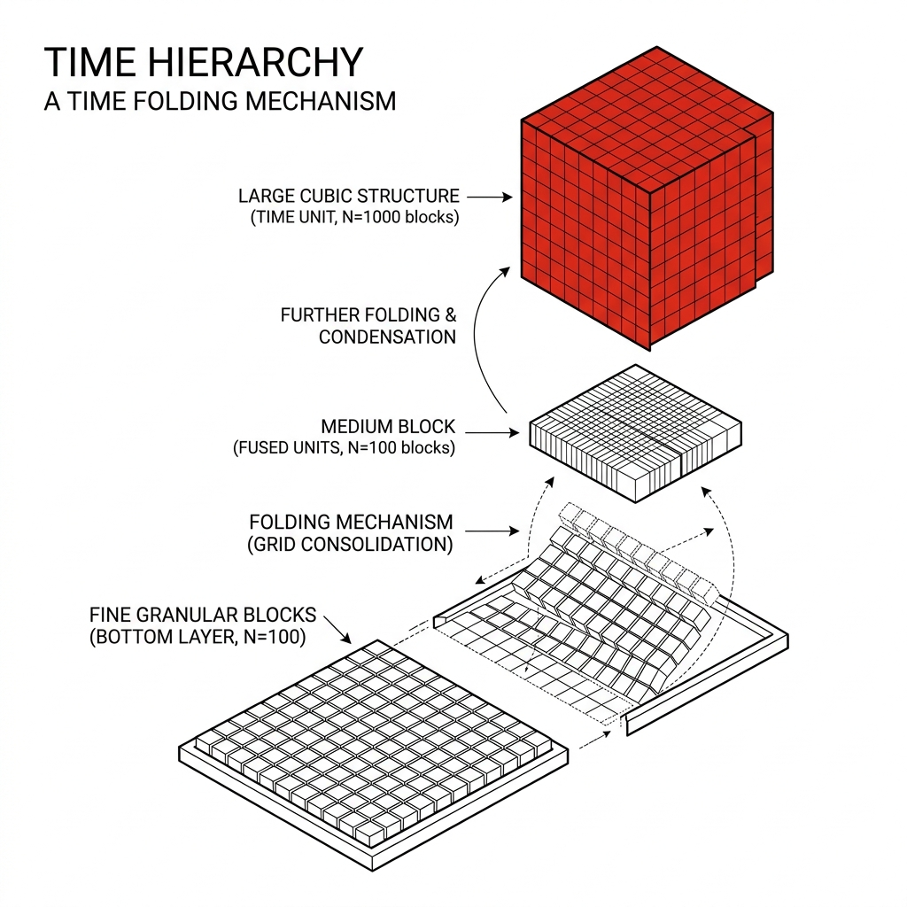

看清了数据“是什么 (What)”之后，下一章我们将深入挖掘分析数据“为了什么 (Why)”。

---

### 2.6 验证站2：属性判断练习

> [VISUAL]
> *   **Slide**: `S23b_Demo_Station_2`
> *   **Layout**: `Split`
> *   **Scene**: 左侧是 Excel 中的灾害数据，右侧是学生画出的数据属性分类树（指示哪些列是分类标签，哪些是数值）。
> *   **Caption**: "验证站 2：识别属性类别，识破隐藏的数据陷阱。"
> *   **Text**: "验证站 2：识别属性类别，识破隐藏的数据陷阱。"
> *   **Asset**: 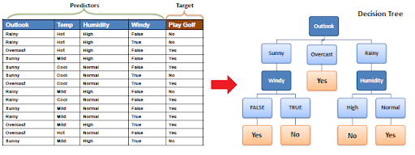

> [ACTIVITY]
> *   **Type**: `Workshop`
> *   **Duration**: `10min`
> *   **Desc**: 学生利用 AI 辅助，练习识别数据的三大类别，规避算术陷阱。
> *   **Steps**:
>     1. **数据观察**：打开源文件 [disaster_sample.xlsx](file:///Users/yamlam/Downloads/2025-2026-2 课程/信息可视化/weeks/W03_Data_Literacy/public/practice/disaster_sample.xlsx)，观察“区划代码”、“灾害等级”、“受灾人口”等列头。
>     2. **类别判定**：根据所学知识，分组讨论：为什么不能对“区划代码”做加法？（因为它是纯粹的 Categorical 分类标签）。
>     3. **AI 辅助确认**：将表头发送给 AI，让 AI 帮你判断它们分别属于 Categorical (分类型), Ordinal (序数型), 还是 Quantitative (量化型)。
>     4. **预防操作**：在 Excel 中，选中【区划代码】整列，将其强制修改为“文本”格式，彻底断绝后续发生错误加减法的可能性。
