## 模块 3: Why — 意图识别与重塑魔法 (35 分钟)
<!-- BUDGET: 4000 chars | SLIDES: ≥14 | STATUS: done -->
> [!NOTE] 核心标签回溯
> [task-abstraction-framework] [data-ethics] [anti-tech-hegemony] [hao-ch4-masterworks]

上一模块里，我们花了大力气拆解数据的"基因"——搞清楚了**分类**、**序数**、**量化**这些属性到底是什么意思，也明白了每条数据都有自己的**标识符**（用来区分"这是谁"）和对应的**内容**（用来回答"它是什么"）。这就是 Munzner 框架的第一层：**What**（数据长什么样）。现在我们进入第二层——**Why**，也就是：**弄清楚用户到底想怎么看数据**。

但光认识数据还远远不够。如果你天真地以为搞懂了数据结构就能直接画图，那你画出来的只是一具没有灵魂的数字骷髅——技术上没毛病，但谁也看不出你到底想说什么。

> [VISUAL]
> *   **Slide**: `S22a_Data_Skeleton`
> *   **Layout**: `Concept`
> *   **Scene**: 一具由绿色代码构成的冰冷数字骷髅，没有灵魂，无法传递任何情感与意图。
> *   **Caption**: "缺乏意图的图表：仅仅是数字骷髅，无法刺穿人类心智。"
> *   **Text**: "缺乏意图的图表：仅仅是数字骷髅，无法刺穿人类心智。"
> *   **Asset**: 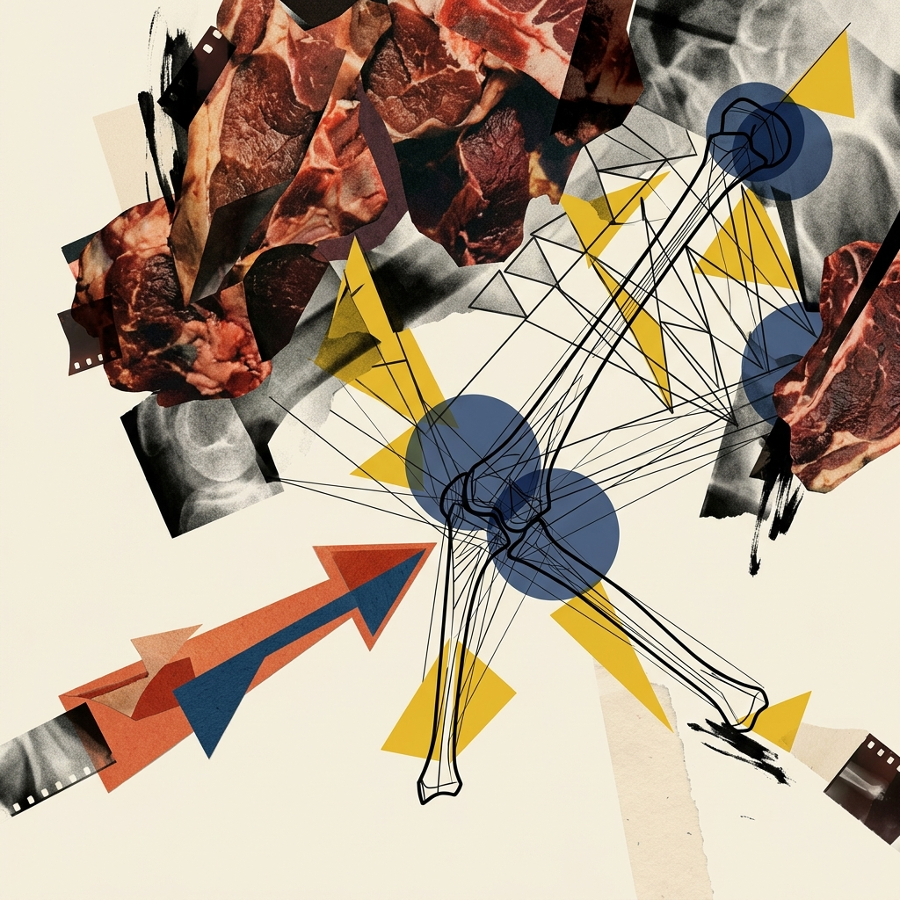

> [PHILOSOPHY] 人文锚点：信息设计师的真身是跨界翻译官
> 这个世界上最遥远的距离，不是大模型与底层代码的报错，而是"人类那充斥隐喻的业务语言"与"计算机极度理性的计算矩阵"之间的鸿沟。大模型听不懂"我要看清今年的动静"，绘图引擎也不在乎"异常波动预警"。在这个时代，信息可视化架构师的核心价值，就是扮演"跨界翻译官"！你必须冷酷地抽干甲方话语里的情绪水分，把复杂的领域概念，降维拆解为机器能够精准执行的通用操作指令。

> [VISUAL]
> *   **Slide**: `S22b_The_Lost_Analyst`
> *   **Layout**: `Full`
> *   **Scene**: 一个被成千上万份完美标注了"**分类**、**量化**"属性的整洁数据表格包围的数据分析师，手握着顶级的可视化开发工具，却双眼空洞地望着屏幕，不知从何画起。
> *   **Caption**: "最悲哀的迷失：你拥有了整个世界的原材料，却不知道客户要用它造什么船。"
> *   **Text**: "最悲哀的迷失：你拥有了整个世界的原材料，却不知道客户要用它造什么船。"
> *   **Asset**: 

举个例子：你手里有一份两千万条全国电商交易流水的数据。你该把它做成一张气势恢宏的"全国热力图"给投资人看？还是做成一块密密麻麻、全是下拉菜单和筛选器的"退货预警面板"给运营团队用？这两种做法技术上都没问题，但方向完全相反。问题出在哪？——你还没搞清楚**用户到底想怎么看数据**。

> [VISUAL]
> *   **Slide**: `S23_The_Why_Intent_Funnel`
> *   **Layout**: `Grid`
> *   **Scene**: 人类意图翻译机。左侧是甲方拍脑袋提出的抽象的愿望："我要在图里重要地看清今年的所有动静"；这愿望打入一台标着"Why 意图分流引擎"的铁盒子中，右侧输出了冷静的计算机交互执行动作指令。
> *   **Text**: "将凡人的愿望，压缩降维成执行指令网。"
> *   **Caption**: "将凡人的狂妄愿望，压缩降维成底层机器界面触发的执行指令网。"
> *   **Asset**: 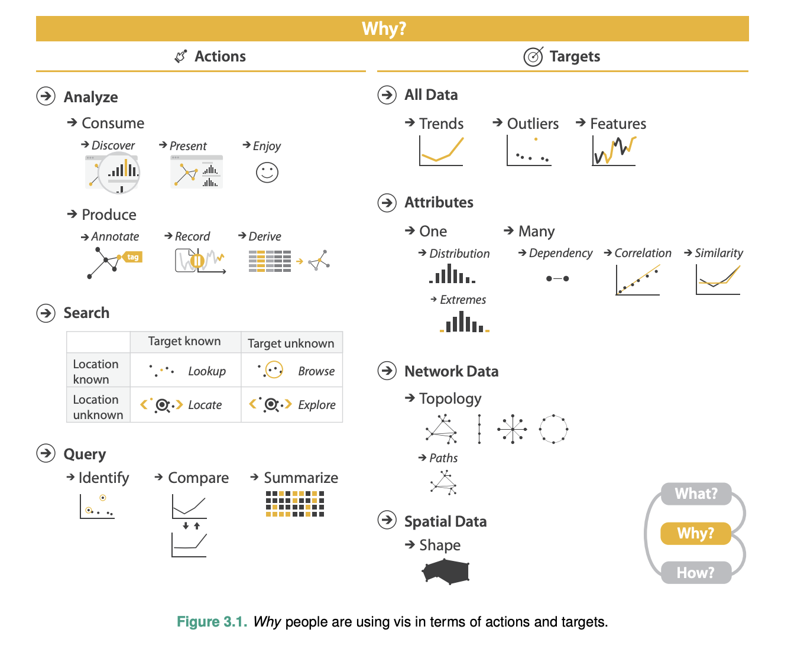
> *   **Source**: Textbook

这就是 Munzner 框架的第二层：**Why**。它的作用是把模糊的业务需求，拆解为计算机可以执行的三类操作——**第一步：想清楚大方向（Analyze）**、**搜索模式：四种不同的找法（Search）**和**鼠标交互的三种方式（Query）**。不管客户的需求多么天马行空，只要通过这个漏斗，最终都会变成具体的点击、缩放、对比和筛选。掌握了它，你就能把感性的需求翻译成理性的机器指令。

> [VISUAL]
> *   **Slide**: `S23b_Action_Trinity`
> *   **Layout**: `Grid`
> *   **Scene**: 意图的三级降维漏斗：顶层 Analyze，中层 Search，底层 Query。
> *   **Text**: "行动降维：解析、寻猎、微观操作"
> *   **Caption**: "行动降维三步曲：从高维解析到精准微操。"
> *   **List**: ["动作解析", "寻址模式", "微观反馈"]
> *   **Asset**: 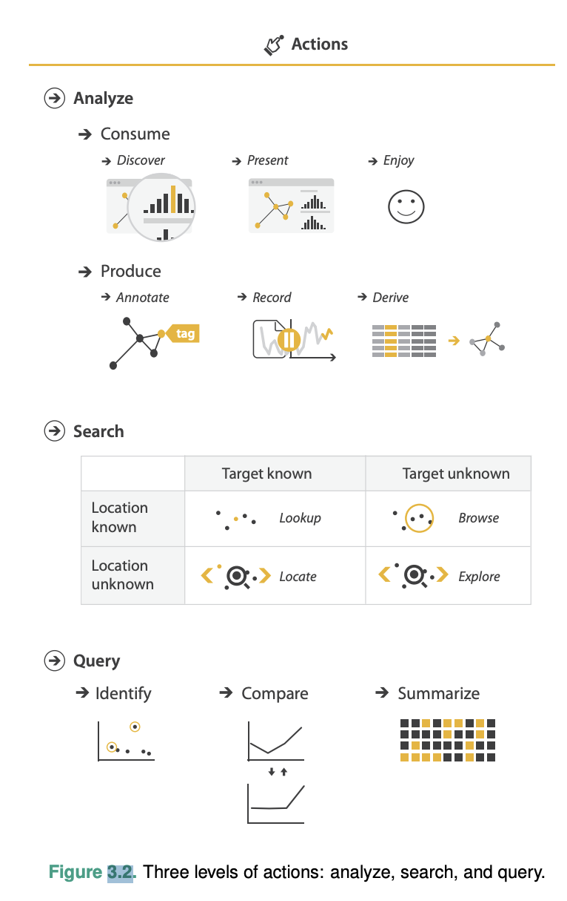
> *   **Source**: Textbook

### 3.1 第一步：想清楚大方向——三种使用心态决定设计基调

用户盯着屏幕的时候，他的心态处于哪种状态？是来汇报成果的，还是来挖掘未知的，亦或只是消遣？这直接决定了你的设计基调。

> [VISUAL]
> *   **Slide**: `S26_Analyze_Layer`
> *   **Layout**: `Grid`
> *   **Scene**: 三张面具。第一张：宣威者举着金牌大声夸耀；第二张：侦探在非常黑暗的洞窟内用放大镜搜索；第三张：游客带着耳机沉醉浅笑享受。
> *   **Text**: "解析受众面具：汇报、探索者、享受者"
> *   **List**: ["宣示展示", "幽暗发现", "消遣享受"]
> *   **Caption**: "认清分析受众所佩戴的面具：汇报者、探索者、抑或旁观的享受者。"
> *   **Asset**: 
> *   **Source**: Textbook

*   **Present（展示汇报）**：结论已经有了，现在就是要向全世界宣告。这种场景下，图表要像一记重锤——砍掉一切多余的交互按钮，数字要大、颜色要猛、信息要一眼看完。
    *   > [CASE STUDY] 纽约时报与《彭博商业周刊》的宣判式版面
        > 比如《纽约时报》发布总统大选结果时，绝不会给你什么"拖动时间轴看历史选票"的交互控件。它只用几乎占据屏幕三分之二的大面积红色或蓝色色块，配上巨大的无衬线粗体数字，像法官落锤一样一锤定音。这就是 Present 心态的最高体现——剥夺交互，只留震撼。

    > [VISUAL]
    > *   **Slide**: `S26a_Present_NYT`
    > *   **Layout**: `Image`
    > *   **Scene**: 模拟纽约时报大选版面：极简的红蓝大色块覆盖全图，配以极具冲击力的巨大粗体数字。没有任何冗余控件。
    > *   **Caption**: "Present 的极高独断力：剥夺交互，只留震撼。"
    > *   **Text**: "Present 的极高独断力：剥夺交互，只留震撼。"
    > *   **Asset**: 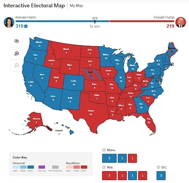

*   **Discover（探索发现）**：你手里是一堆刚拿到的、还没看过的数据，你要从中挖出隐藏的规律或异常。这时候图表不能追求"好看"，而是要追求"密度"——必须布满预警图层和各种筛选控件，不能漏掉任何一个异常信号。
    
    > [VISUAL]
    > *   **Slide**: `S24_Analyze_Discovery_Path`
    > *   **Layout**: `Split`
    > *   **Scene**: 一个被黑暗数据笼罩的雷达屏幕，一根红色的波形线突然刺破暗黑网格，爆闪出异常警告。
    > *   **Text**: "幽暗发现：在噪音中捕捉异动"
    > *   **Caption**: "分析不是为了证实，而是为了在未知中寻找刺伤眼球的异常。"
    > *   **Asset**: 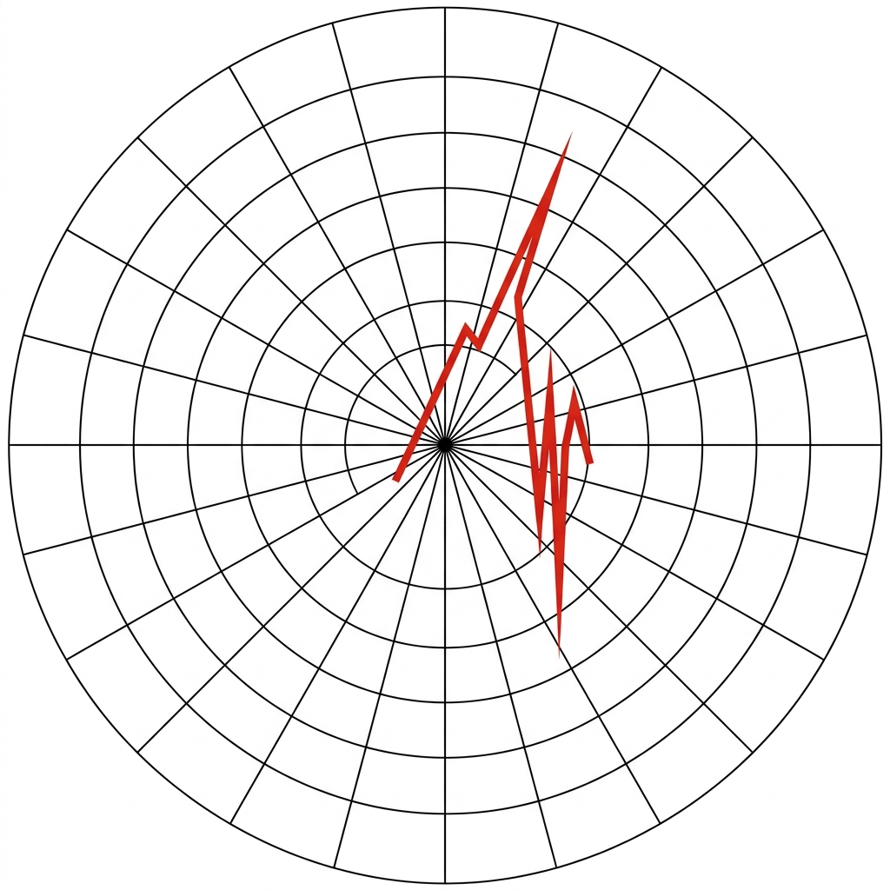

    > [VISUAL]
    > *   **Slide**: `S24a_Deep_Dive_Filters`
    > *   **Layout**: `Split`
    > *   **Scene**: 概念图：潜水员在黑暗深海中摸索，屏幕上布满极高密度的红色预警光点与层层叠加的筛选过滤面板框（代表深网探查）。
    > *   **Caption**: "深潜过滤网：无惧视觉过载，用致密的交互层层剥开数据深海的恶意伪装。"
    > *   **Text**: "深潜过滤网：无惧视觉过载，用致密的交互层层剥开数据深海的恶意伪装。"
    > *   **Asset**: 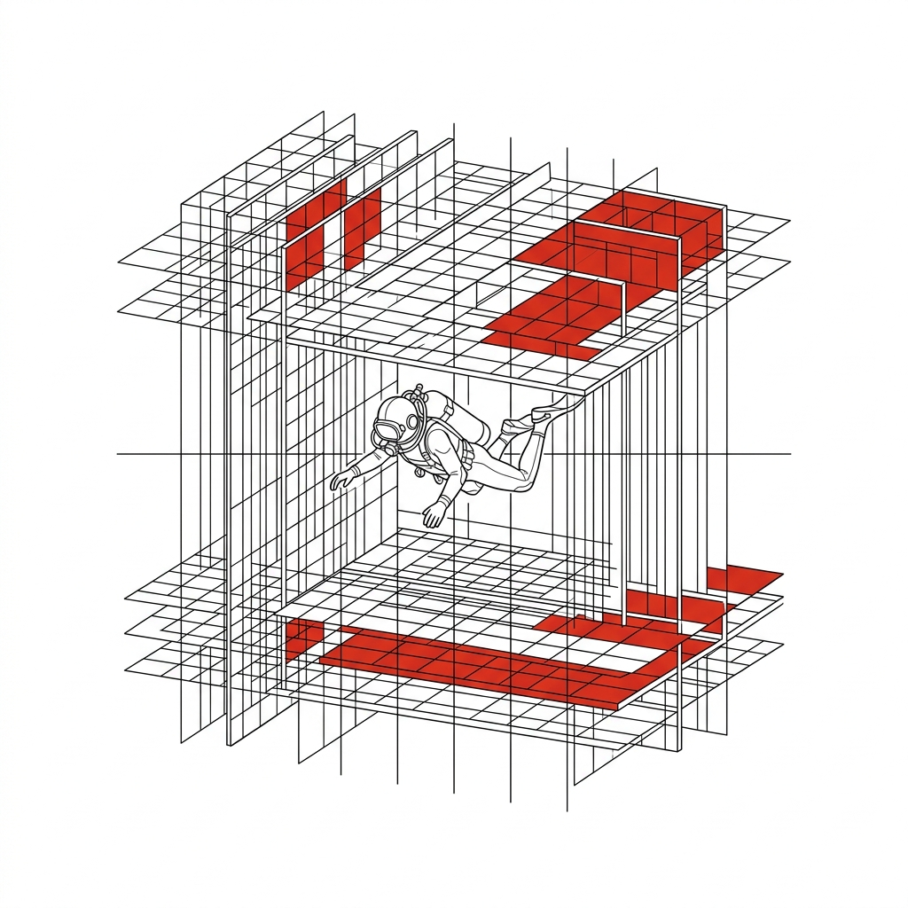

    *   > [CASE STUDY] 彭博金融数据终端（Bloomberg Terminal）的密集视场
        > 为什么金融交易员的屏幕总是密密麻麻、像黑客帝国一样挤满了 K 线和雷达网段，甚至有点"丑"？因为他们的心态就是 Discover！在探索模式下，"极简美学"反而是毒药。交易员需要在一块大屏上同时看到所有微弱的波动信号——一根在多张图表中同时出现共振的极细红线，可能就预示着下周的资本风暴。

    > [VISUAL]
    > *   **Slide**: `S24b_Bloomberg_Terminal`
    > *   **Layout**: `Image`
    > *   **Scene**: 彭博终端机界面的极高密度数据呈现。无数 K 线和散点并置，没有一丝留白。
    > *   **Caption**: "发现者的视场：摒弃美学留白，在极致密度的图层中压榨波动信号。"
    > *   **Text**: "发现者的视场：摒弃美学留白，在极致密度的图层中压榨波动信号。"
    > *   **Asset**: 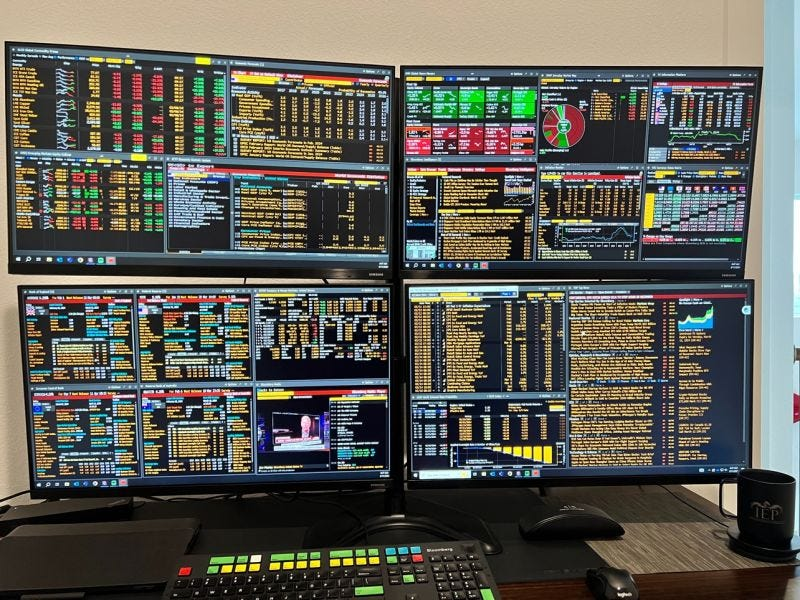

*   **Enjoy（消遣享受）**：用户不需要分析什么，也不需要做决策，他只是来放松的。这时候的设计要柔和、有趣、有情感共鸣——可以大量使用圆润的动画、丝滑的曲线和低对比度的马卡龙渐变色。
    
    > [VISUAL]
    > *   **Slide**: `S25_Enjoy_Spotify`
    > *   **Layout**: `Grid`
    > *   **Scene**: 柔和的星空渐变背景下，代表用户一年听歌记录的音符散点如流星雨般缓缓落下，轻柔且无压力。
    > *   **Text**: "消遣享受：抚慰情绪的数据浪漫"
    > *   **Caption**: "当数据褪去效率的外衣，它就是用来引发情感共鸣的时光切片。"
    > *   **Asset**: 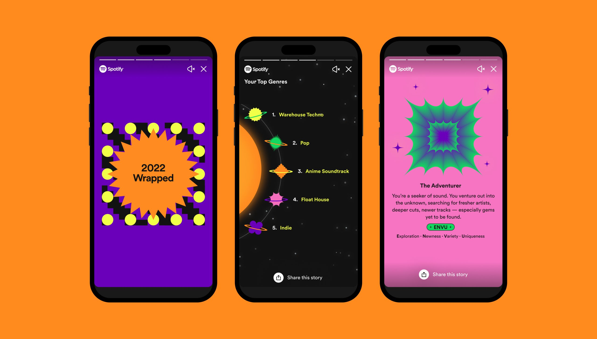

    *   > [CASE STUDY] Spotify Wrapped 的年度沉浸时光长卷
        > 每年年底刷爆朋友圈的 Spotify 或网易云年度听歌总结，就是 Enjoy 的代表。它把你全年几十万行播放日志，变成了一卷带着宇宙星轨、伴随粒子动效的时光漫游长图。你不需要去找什么异常，不需要跟谁攀比，只是戴着耳机划动屏幕，在柔美的视觉中感受岁月的流逝。

    > [VISUAL]
    > *   **Slide**: `S25b_Enjoy_Aesthetics`
    > *   **Layout**: `Concept`
    > *   **Scene**: 星轨、粒子、柔和马卡龙渐变构成的时光长卷。枯燥日志化为了美丽的光谱。
    > *   **Caption**: "柔化的数据隐喻：零压力的情感共鸣与时光漫游。"
    > *   **Text**: "柔化的数据隐喻：零压力的情感共鸣与时光漫游。"
    > *   **Asset**: 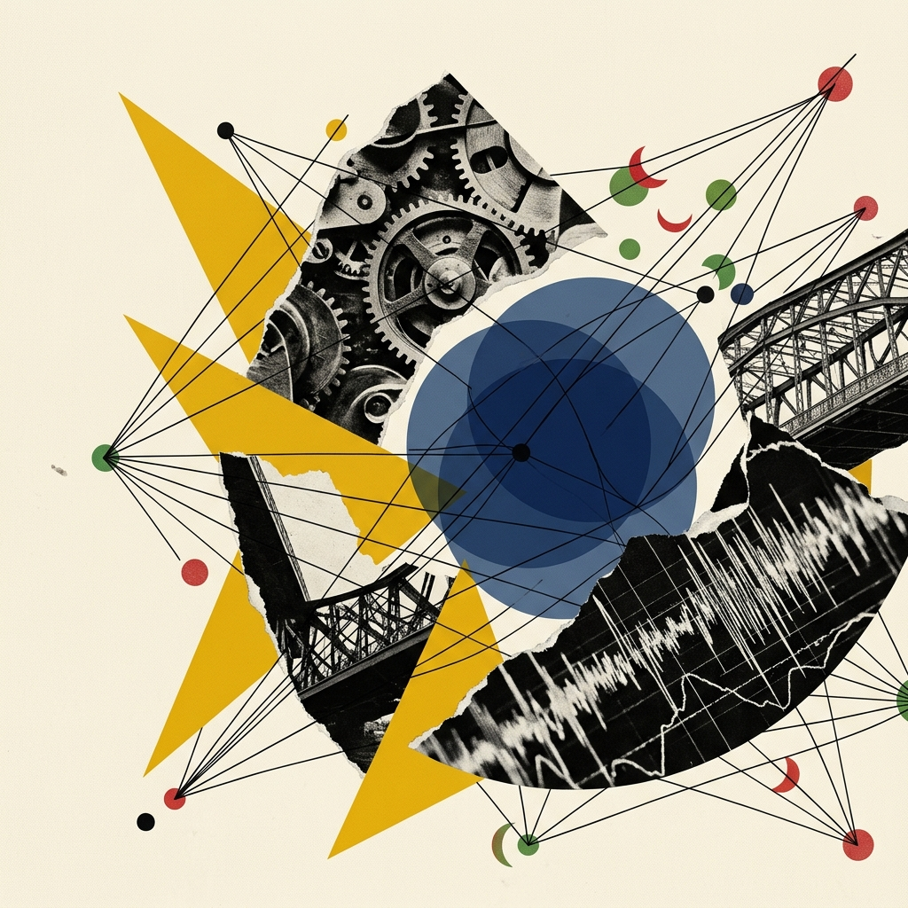

> [VISUAL]
> *   **Slide**: `S26b_Produce_Layer`
> *   **Layout**: `Split`
> *   **Scene**: 左半边是一双眼睛仅仅停留在观看屏幕上的消费数据（Consume）；右半边则是一只机械臂猛然伸出，在屏幕图海上重重盖下大红印章，并将其抽屉式归档（Produce）。
> *   **Caption**: "从被动的视界观察者，完全质变进化为掌握留痕主权与定义新**维度**的造物主引擎。"
> *   **Text**: "从被动的视界观察者，完全质变进化为掌握留痕主权与定义新**维度**的造物主引擎。"
> *   **Asset**: 
> *   **Source**: Textbook

除了上面三种"看数据"的心态（统称为消费型 Consume），Analyze 这一层还有一种"主动出击"的模式——**创生型（Produce）**：
*   **Annotate & Record（标注与记录）**：分析不能只靠肉眼"觉得看到了什么"。当你在复杂图表中发现了一个可疑区域时，用 Annotate（标注）给它打个视觉标签——就像你在 PDF 上画荧光笔一样。然后用 Record（记录）把当前画面截屏存档。这样你的发现就不会转头就忘，团队其他人也能沿着你的标注继续深挖。

> [VISUAL]
> *   **Slide**: `S26c_Annotate_Record`
> *   **Layout**: `Concept`
> *   **Scene**: 在一张庞大的网络图上，用户用鲜红的画笔圈出了一个微小异常群落（Annotate），随即将该画面如拍立得般快照定格封装入库（Record）。
> *   **Caption**: "创生型重击：标注以宣示主权，刻录以传承军火。"
> *   **Text**: "创生型重击：标注以宣示主权，刻录以传承军火。"
> *   **Asset**: 
> *   **Source**: Textbook

### 3.2 怎么找数据：四种搜索模式决定交互密度

搞清楚心态之后，下一个问题是：用户要找的东西，他知道长什么样吗？知道在图上的哪个位置吗？这两个问题的答案组合出四种搜索模式，直接决定了你要给界面装多少交互控件。

> [VISUAL]
> *   **Slide**: `S27_Search_Matrix`
> *   **Layout**: `Flow`
> *   **Scene**: 目标非常明确/目标特征完全模糊 vs 位置洞悉/位置遗失 的二维象限困境矩阵。
> *   **Text**: "探索者的四重困境：明确检索到混沌探索"
> *   **List**: ["明确检索", "迷雾定位", "大浪淘金", "混沌乱猎"]
> *   **Caption**: "探索者的四重困境：从完全掌控猎物到盲眼面对完全未知的领域。"
> *   **Asset**: 
> *   **Source**: Textbook

四种模式，对应四种完全不同的交互设计：

1.  **Lookup（精确查找）**：用户知道要找谁，也知道在哪。就像用拼音在通讯录里找人一样。这时候你只需要提供一个**搜索框**，让他直接输入关键词就行。
2.  **Locate（定位追踪）**：用户知道要找谁，但不知道在图上的哪个位置。想象一下在几千个密密麻麻的散点里找"阿里巴巴"——你得提供**悬停高亮**或者**条件着色**功能，让目标自动亮起来。

> [VISUAL]
> *   **Slide**: `S27c_Search_Lookup_Locate`
> *   **Layout**: `Split`
> *   **Scene**: 左侧：一个极简搜索框直接定位到目标点。右侧：全图变暗，只有符合条件的目标如星辰般爆闪（Hover/Filter）。
> *   **Caption**: "从直达靶心到点亮夜空：前两种轻量猎寻。"
> *   **Text**: "从直达靶心到点亮夜空：前两种轻量猎寻。"
> *   **Asset**: 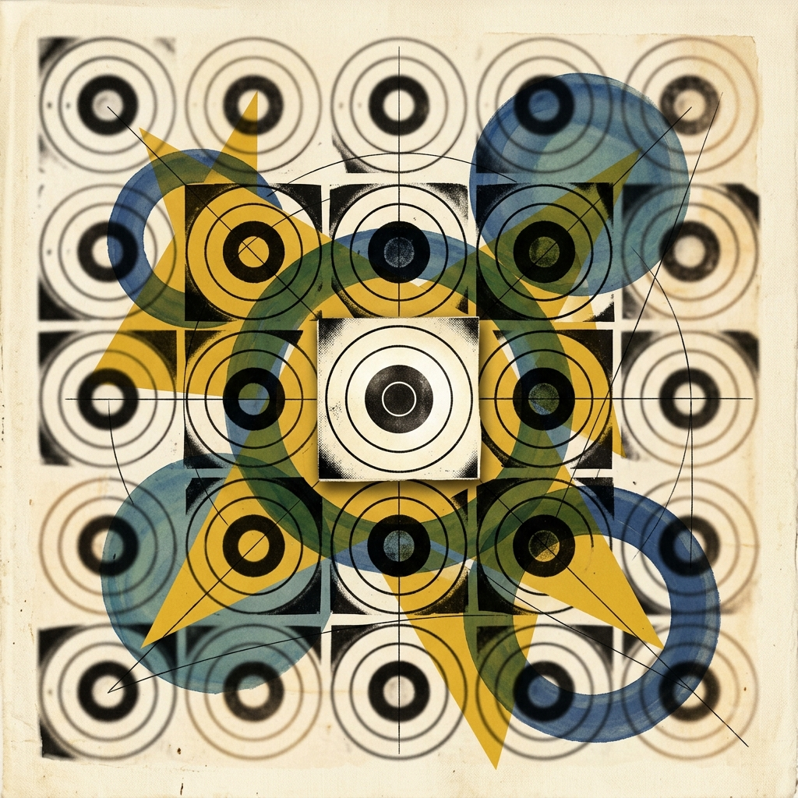

3.  **Browse（漫游扫描）**：用户没有明确目标，但凭经验直觉，他会去看图上最高的柱子、颜色最深的区域。这时候你需要提供**平滑缩放（Semantic Zooming）**和**拖拽平移**的画布，让他像老鹰巡视领地一样自由探索。
4.  **Explore（混沌探索）**：用户既不知道要找什么，也不知道从哪里下手。只有在这种最复杂的场景下，才需要搬出重武器——**用鼠标画圈圈选（Lasso Selection）**和**多图联动（Cross-Filtering）**，也就是点击一张图上的某个区间，其他所有图表同步高亮对应数据。你不需要自己写代码实现这些控件，但作为设计师，你必须知道在 Explore 场景下应该向工程师提出这类交互需求。

> [VISUAL]
> *   **Slide**: `S27d_Browse_Explore`
> *   **Layout**: `Split`
> *   **Scene**: 寻猎武器对比：左半边是巡航鹰眼的平滑缩放视域（Browse），右半边是在极度混沌中用套索和交叉过滤圈定猎物（Explore）。
> *   **Caption**: "从鹰眼巡航到混沌套索：面对完全未知的深渊，只有重武器能够自救。"
> *   **Text**: "从鹰眼巡航到混沌套索：面对完全未知的深渊，只有重武器能够自救。"
> *   **Asset**: 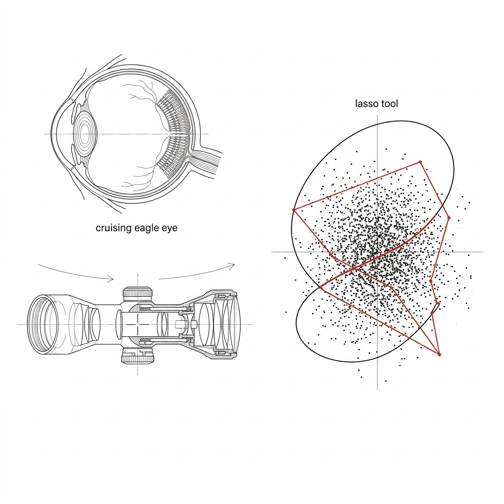

> [VISUAL]
> *   **Slide**: `S27b_Search_Interactions`
> *   **Layout**: `Split`
> *   **Scene**: 左侧：展现明确检索，即 Lookup 下的极简搜索框响应。右侧：展现混沌探索，即 Explore 下密密麻麻的框选、缩放、多重条件联动高亮组合技响应。
> *   **Caption**: "四种寻猎状态强制驱动出迥异的交互军火库。"
> *   **Text**: "四种寻猎状态强制驱动出迥异的交互军火库。"
> *   **Asset**: 

> [ACTIVITY]
> *   **Type**: `Quiz`
> *   **Duration**: `2min`
> *   **Desc**: 场景判定测试：四种寻猎搜索模式辨析
> *   **Q**: 当你在枯燥疲惫的高铁旅途上，随手打开微信朋友圈，漫无目的地滑动卡片瀑布流。你没有特定的寻找目标，完全是在凭直觉捞取能提供情绪价值的图文内容。根据 Munzner 的 Search 意图矩阵，这种行为最符合以下哪种模式？
> *   **Options**: A. Lookup（明确检索）：依赖精准文本输入框直接定位特定条目 | B. Locate（迷雾定位）：已知目标特征，在全局迷雾中通过高亮悬停手段追踪 | C. Browse（大浪淘金）：无明确指定目标，凭借直觉在平滑缩放或滚动的视场中扫荡特征 | D. Explore（混沌探索）：对目标特征与位置完全未知，需要动用多图联动或套索框选深层排查
> *   **Answer**: `C`
> *   **Explain**: 刷朋友圈的典型特征是"无确切指定目标"（排除需要靶心的 Lookup 和 Locate），但大脑带有潜意识的直觉特征偏好，只需单向滚动或平滑拖拽，不需要套索框选等多重联动探明工具（排除 Explore）。这完全符合 Browse 模式"凭直觉捞取"的特征定义。

这里有一个关键设计原则：**交互控件的复杂度必须匹配搜索模式的复杂度**。面对 Explore 的混沌困境，你当然要端出圈选、缩放、多图联动等重武器；但面对 Lookup 这种已经知道目标的场景，把那些复杂控件全堆上去就是杀鸡用牛刀——既浪费性能，又侮辱用户的智商。

### 3.3 鼠标交互的三种方式：看一个点、比两个点、看全局

漏斗继续收窄。搞清楚了大方向和搜索模式之后，最后落到用户鼠标实际点击的那个瞬间。**在 Query 这一层，用户做的事情就三种：**

> [VISUAL]
> *   **Slide**: `S28_Query_Types`
> *   **Layout**: `Grid`
> *   **Scene**: 一名探员不断切换眼镜视界距的操作：Identify (用放大镜聚焦烧灼一棵孤立野草)，Compare (瞳孔极限往复在两棵高树之间剧烈狂奔衡量极差)，Summarize (视距大幅后拉覆盖整片百万亩树林的星海)。
> *   **Text**: "微操落点：识别、比较、概览"
> *   **List**: ["指认识别", "对抗比较", "万象概览"]
> *   **Caption**: "微操审判的三部曲：极微观的点射、极惨烈的对决、壮阔的鸟瞰全貌。"
> *   **Asset**: 
> *   **Source**: Textbook

*   **Identify（看一个点）**：鼠标悬停在某个散点上，查看它的具体数值。比如"这个点对应的气温是多少度？"
*   **Compare（比两个点）**：视线在两个目标之间快速来回切换，比较它们的差距。用并列的柱形图比用圆环面积图更容易完成这种比较。
*   **Summarize（看全局）**：后退一步，不看细节，只看整体趋势和大盘走势。

> [VISUAL]
> *   **Slide**: `S28a1_Interaction_Friction`
> *   **Layout**: `Concept`
> *   **Scene**: 展示“交互阻尼（Interaction Friction）”过大导致用户心智崩溃的夸张示意图，重负拖拽着鼠标。
> *   **Caption**: "交互阻尼的诅咒：多余的点击与复杂的动画，如同绑在用户注意力上的铅块。"
> *   **Asset**: 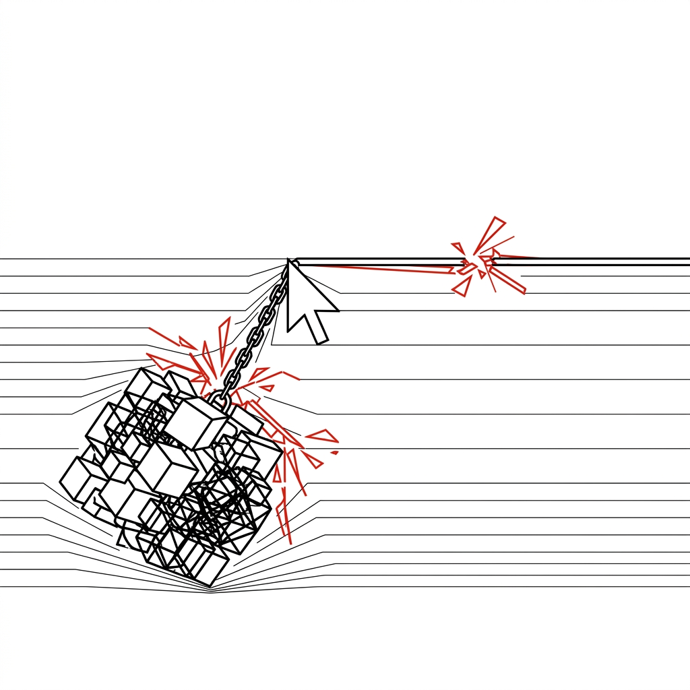

> [TEACHING MOMENT] Munzner 眼中的交互防坑指南：组件匹配的暴政
> 在这里，很多初学者会犯下非常致命的错误：把所有酷炫的交互组件不分青红皂白地全部堆砌上去。但根据 Tamara Munzner 的《Visualization Analysis and Design》核心指导原则，不同粒度的 Query 必须受到非常严格的 UI 节制：
>
> 1. **Identify 的节制**：当用户的 Query 意图仅仅是指认识别某个极小点阵的读数时，哪怕你只给他加上零点五秒的渐隐动画，或是强迫他先框选再查看，都是在反人类。最高效的做法是**悬停即显（Hover-to-tooltip）**，让交互阻尼趋近于零。
> 2. **Compare 的强链接**：当用户在 Compare 两个相隔甚远的柱图时。你确实不能靠他自己的记忆力去人肉对抗。你必须动用**跨维高亮（Cross-Highlight）**组件。一旦他点击其中一根柱子，远端的那根对照必须强制性同步爆闪发亮！
> 3. **Summarize 的空间让渡**：对于概览全局意图，任何干扰视线的小浮窗、任何微弱的鼠标悬停交互都是累赘。这里需要的只有**全局缩略小地图（Brush and Link）**，把最大面积的空间让渡给宏大的静态底图。不匹配的交互强大工具，不仅榨干了浏览器的内存，更强暴了使用者的心智。

> [VISUAL]
> *   **Slide**: `S28a_Component_Error`
> *   **Layout**: `Center`
> *   **Scene**: 荒谬的反人类 UI 报错场景：试图用复杂的渐隐动画和套索去执行简单的单点读数（Identify），导致阻尼拉满，旁边打上巨大红叉。
> *   **Caption**: "交互阻尼反噬：强迫用户用核武器去切黄油，就是对注意力资源的犯罪。"
> *   **Text**: "交互阻尼反噬：强迫用户用核武器去切黄油，就是对注意力资源的犯罪。"
> *   **Asset**: 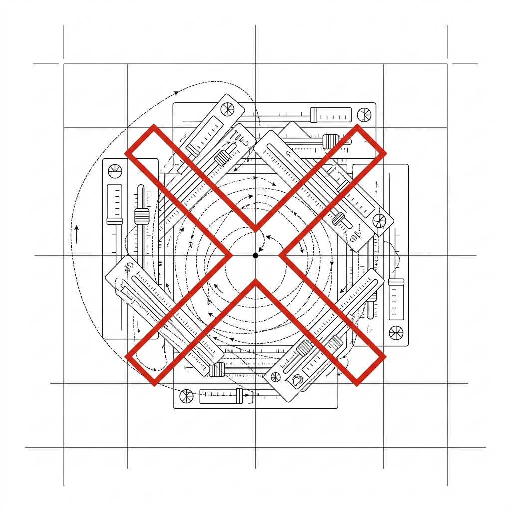

> [VISUAL]
> *   **Slide**: `S28c_UI_Restraint`
> *   **Layout**: `Concept`
> *   **Scene**: 交互阻尼曲线。Identify 是趋近于零的悬停即显，Compare 是强联动的跨维爆闪，Summarize 是彻底让渡空间的纯净视界。
> *   **Caption**: "组件匹配的暴政：不同粒度的意图必须受到严格的 UI 节制约束。"
> *   **Text**: "组件匹配的暴政：不同粒度的意图必须受到严格的 UI 节制约束。"
> *   **Asset**: 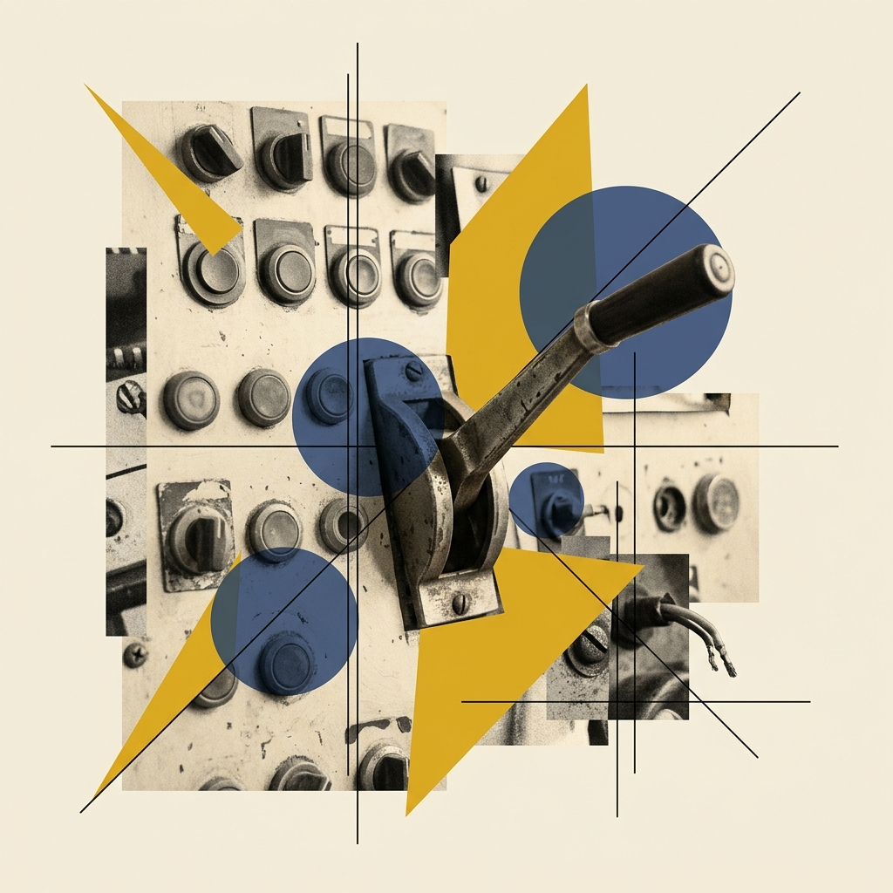

> [PHILOSOPHY] 人文锚点：技术霸权（Anti-Tech Hegemony）凝视下的无底交互深渊
> 当你在精心构筑这套从 Lookup 到 Explore 的交互漏斗时，请务必保持清醒。当今硅谷的科技巨头们，总是在终端界面上大量铺设极度丝滑的"混沌探索深渊（Explore）"与"消遣沉浸流（Enjoy）"动效。
> 
> 这背后掩藏的，实则是一套精密的注意力捕获机制。这就是所谓的"注意力经济"陷阱！他们通过诱导滑动阻尼机制和瀑布流深网，持续吸引你的注意力。让你在屏幕上多停留哪怕一秒，从而持续消耗用户有限的注意力资源。
> 
> 因此，你在布置交互闸门时，必须拥有反抗系统性凌霸的伦理界限底线心智：
> 当用户处于明确目标的 Lookup 意图时，请直接给他一个干脆的文字搜索框！绝不能用那些繁复叠加的炫目图表墙，把他囚禁在你为炫技编织的数据迷宫里。过度设计交互，就是对使用者智力和时间的谋杀。只有最克制的交互，才体现了最高级的技术悲悯。

### 3.4 目标聚焦：你到底在找什么模式？

> [VISUAL]
> *   **Slide**: `S28d_Targets_Layer`
> *   **Layout**: `Grid`
> *   **Scene**: 瞄准镜里套着的不是具体的数字，而是代表"趋势"、"异常点"和"拓扑结构"的几何抽象图形。
> *   **Caption**: "动作必须有其承受者：你到底在寻找什么模式？"
> *   **Text**: "目标层 (Targets)：动作的物理承受者"
> *   **List**: ["宏观趋势", "异常数据", "属性关系"]
> *   **Asset**: 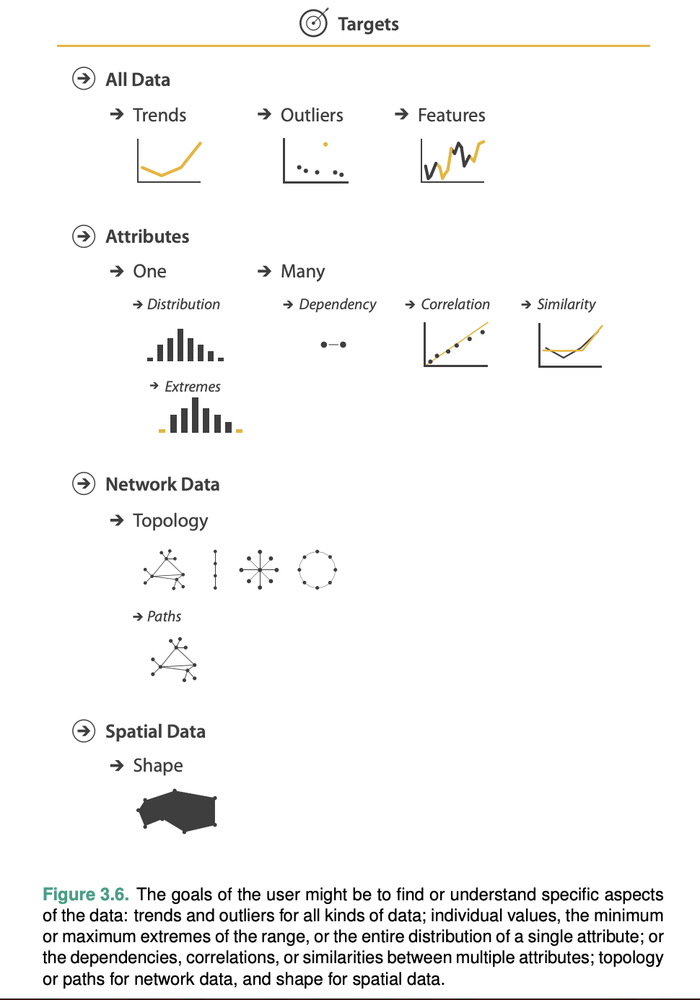
> *   **Source**: Textbook

Analyze、Search、Query 都是"动词"——描述用户要做什么。但光有动词不行，还得有"名词"，也就是**目标层（Targets）**：你到底在找什么？

> [VISUAL]
> *   **Slide**: `S28e1_Distribution_Extremes`
> *   **Layout**: `Diagram`
> *   **Scene**: 抽象几何分布图，展示目标分布（Distribution）和极值（Extremes）抽象特征。
> *   **Caption**: "锁定猎物特征：用科学的眼光剥离噪点，洞察数据群体分布的引力与极值刺客。"
> *   **Asset**: 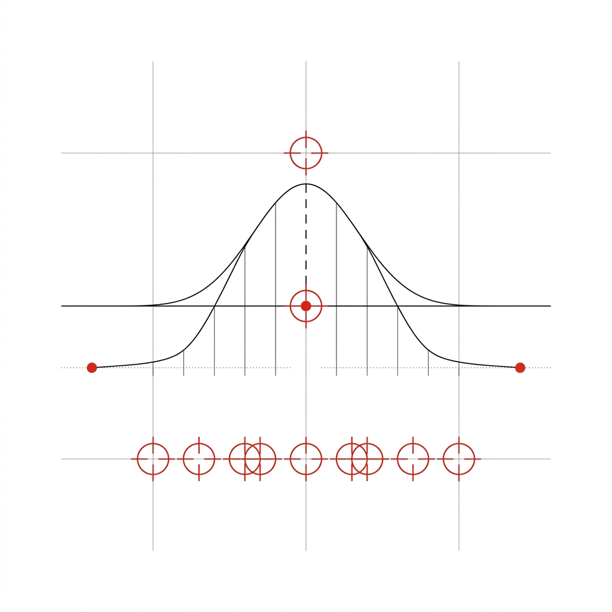

你跟 AI 说"帮我比较一下"，AI 会反问：比较什么？只有补全了目标——"比较两个市场的**异常值（Outliers）**"，或者"找出过去十年的**趋势（Trends）**"，这套指令才算完整。

不同类型的数据，要找的目标也不同：
*   **通用目标**：宏观的**趋势（Trends）**（数据的起伏走向）、**异常值（Outliers）**（脱离大部队的孤立点）、以及特定的**特征（Features）**。
*   **单属性目标**：**分布（Distribution）**（数据集中在头部还是长尾）、**极值（Extremes）**（最大值和最小值）。
*   **多属性目标**：两个变量之间是否存在**依赖关系（Dependency）**或**相关性（Correlation）**。
*   **网络与空间目标**：网络图里找**拓扑结构（Topology）**和**路径（Paths）**；地理数据里看几何**形状（Shape）**。

> [VISUAL]
> *   **Slide**: `S28e_Targets_Taxonomy`
> *   **Layout**: `Grid`
> *   **Scene**: Targets 图鉴：用精密几何框线将"趋势(波浪线)"、"异常(孤立红点)"、"拓扑(网络结构)"像标本一样分类装载展示。
> *   **Caption**: "猎物图鉴：你必须清晰知道，你要从数据深林里捕获的到底是什么标本。"
> *   **Text**: "猎物图鉴：你必须清晰知道，你要从数据深林里捕获的到底是什么标本。"
> *   **Asset**: 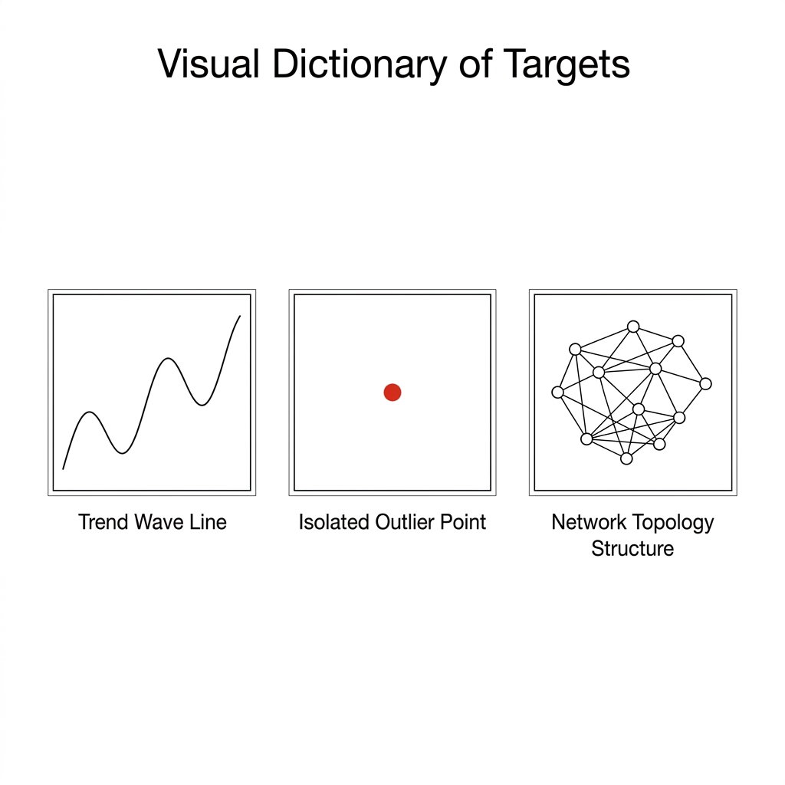

搞清楚了"动词+名词"的完整组合之后，我们就能进入数据重塑的终极手段了。

### 3.5 派生：用数学在原始数据里创造新维度

前面讲的 Analyze、Search、Query 都是面对现有数据做探测。但在 Munzner 框架的一个偏僻角落（Analyze-Produce 层级），藏着一个杀手锏——**派生（Derive）**。

> [VISUAL]
> *   **Slide**: `S28b_Derive_Concept`
> *   **Layout**: `Split`
> *   **Scene**: 左侧：一张包含"进口"和"出口"字段的基础数据表。右侧：一道强光闪过，两列数据碰撞后产生出一列全新的耀眼荧光绿数据柱——"贸易顺逆差"。
> *   **Caption**: "当原始数据无法讲述真相时，用数学逻辑创造出属于你的第一手全新度量！"
> *   **Text**: "当原始数据无法讲述真相时，用数学逻辑创造出属于你的第一手全新度量！"
> *   **Asset**: 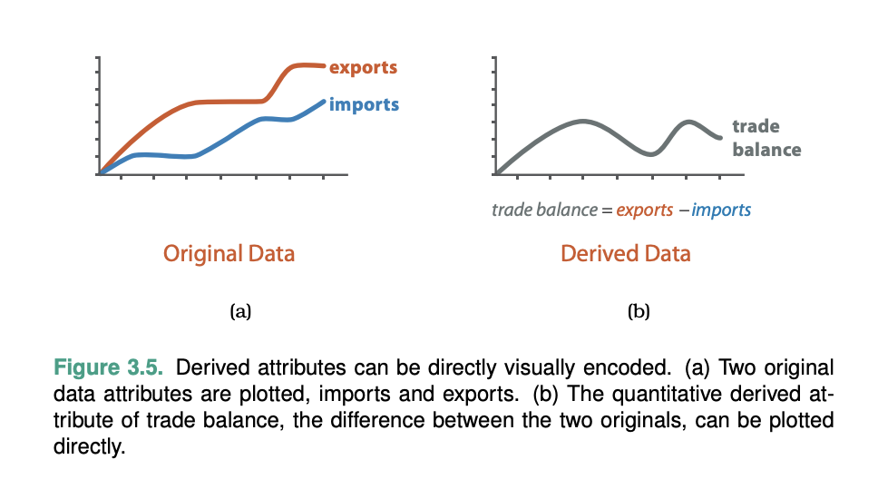
> *   **Source**: Textbook

派生的核心思路很狂：**永远不要只画你拿到的原始数据！** 如果原始数据画不出关键信息，你就应该动用数学逻辑，从中算出一个原本不存在的新指标，然后画这个新指标。

> [VISUAL]
> *   **Slide**: `S28e2_Minard_Map`
> *   **Layout**: `Image`
> *   **Scene**: 1869 年 Charles Minard 绘制的《拿破仑大军 1812 东征俄罗斯陨落图》。
> *   **Caption**: "视觉维度重塑的神作：用一根线条的粗细，控诉四十万人的生死与温度的深渊。"
> *   **Asset**: 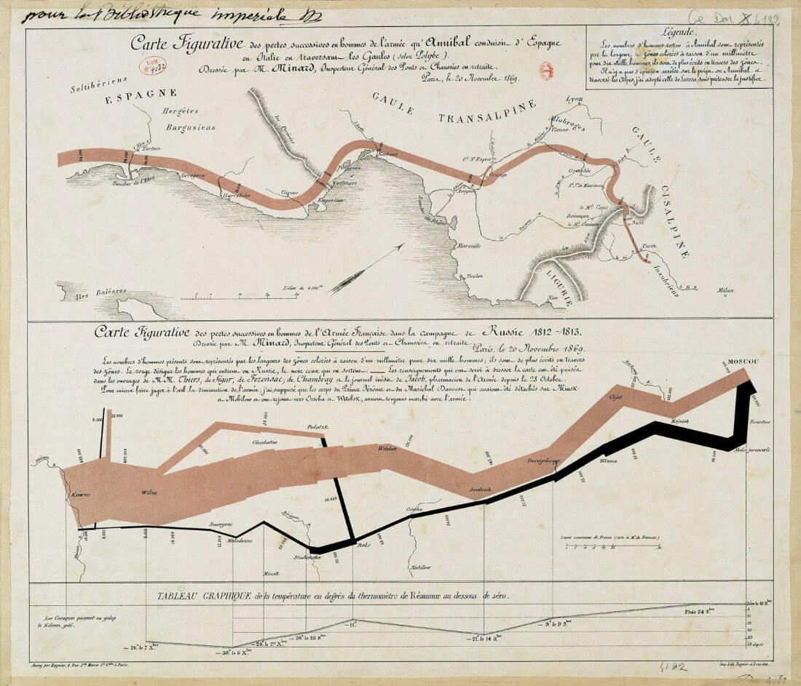

> [STORY TIME] 以 Derive 派生扭转生死洪荒的两次千古极意神作
>
> 第一幕：两个贸易大国，几十年的进出口数据。庸手的做法是把"进口额"和"出口额"各画一条线，摆在一起。但这种画法你根本看不出到底谁在赢。真正的高手怎么做？直接下一道算式："出口"减"进口"，派生出一个原表里根本不存在的新列——"贸易顺逆差"。然后只画这一条净差曲线。瞬间，两国经济角力的跌宕起伏一目了然。
>
> 第二幕更为经典。1869 年，Charles Minard 绘制了被公认为"地球上最伟大的统计图之一"——《拿破仑大军 1812 东征俄罗斯陨落图》。
>
> 四十二万人的庞大军团，从法国出发，挺进莫斯科，再惨烈撤回。Minard 没有画一张枯燥的"折损人数表"。他做了一件天才的事：在地理路线图上，派生出一条**宽度随军团人数同步萎缩**的流线带。出发时金带极为宽广；抵达莫斯科时已瘦骨嶙峋；撤退归来，仅剩一万人，线带几乎消失于纸面。这根随时间和空间变化而改变粗细的数据带，无声地控诉着一场人道灾难。
>
> 这就是派生的力量。你有权创造原始数据中不存在的新**维度**，进而**重塑**对历史的理解。

> [VISUAL]
> *   **Slide**: `S28g_Trade_Deficit_Derive`
> *   **Layout**: `Center`
> *   **Scene**: Derive 派生魔法演示：把平行的进出口两根灰线投入粉碎机，直接输出一条强烈的红色"顺逆差净额"折线。
> *   **Caption**: "创世主权：粉碎原始表格的平庸，提取直击命脉的全新度量。"
> *   **Text**: "创世主权：粉碎原始表格的平庸，提取直击命脉的全新度量。"
> *   **Asset**: 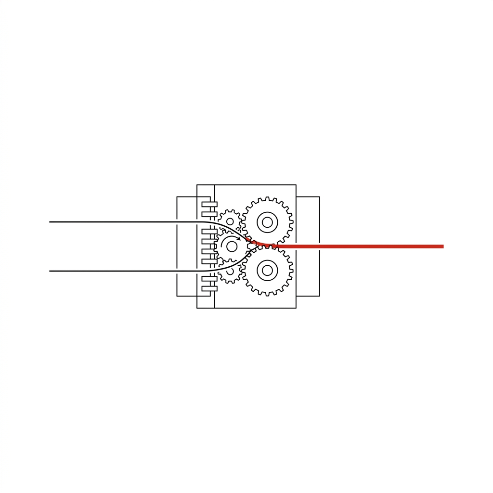

派生还能用来驯服超大网络图。面对五十万个节点的巨型网络，直接画出来就是一团恶心的"毛线球（Hairball）"。高手的做法是：先给每个节点打一个"重要性分数"——看它连接了多少个其他节点（这叫**度数 Degree**，你可以理解为"这个人有多少朋友"），然后根据分数砍掉四十九万五千个边缘节点，只留下五千个核心主干。一瞬间，黑色泥沼变成了一棵清晰的树状结构。

> [VISUAL]
> *   **Slide**: `S30_分级_Derive_Tree`
> *   **Layout**: `Comparison`
> *   **Scene**: 左图：一团密不透风、令人窒息的黑色节点毛线球；右图：通过分级数派生计算后，剔除了十万边缘节点，只留下一棵闪耀着光芒的清晰主干骨架树。
> *   **Text**: "网络派生：屠宰噪音，重塑主干"
> *   **Caption**: "派生过滤的残酷权威：它不是画全景，而是敢于解决九成的无意义关联。"
> *   **Asset**: 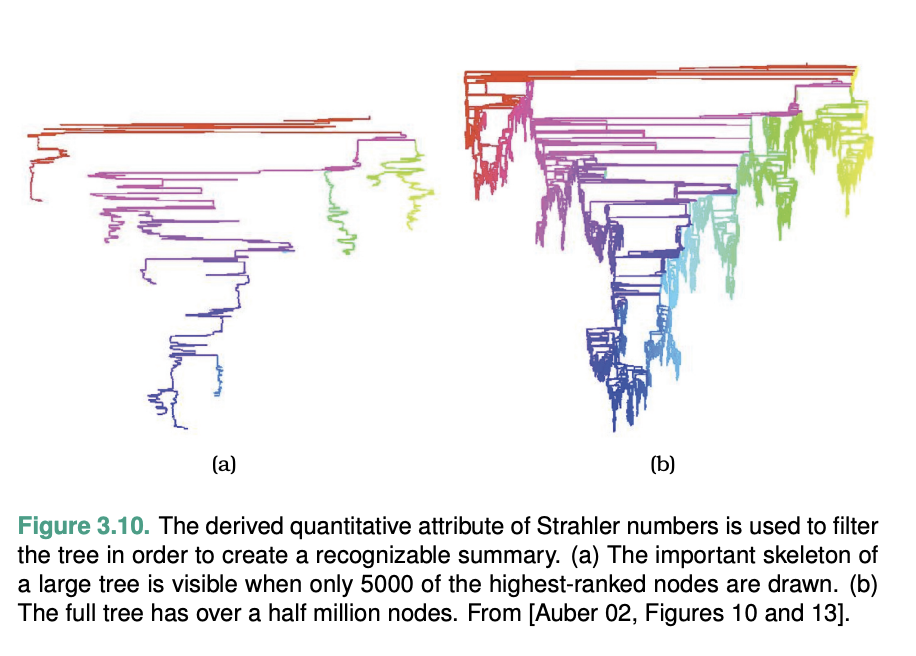
> *   **Source**: Textbook

在更高级的场景中，Derive 还能用于分析复杂的连续场数据——比如从风速数据中派生出气旋结构。这些我们会在后续课程中接触。

> [DID YOU KNOW] 派生 Derive 与预处理的数据鸿沟界线
> 有些初学者总是将其与前端框架的单纯遍历映射甚至粗浅的 Excel 公式混为一谈。绝非如此。Derive 的核心并不在于代码实现有多困难，而在于这是数据架构师脑海中第一次主动介入数据的主权宣示！
> 面对一份"进口与出口"大**宽表**，直接画出两条没有交集的平行折线，是机械码农的敷衍；而脑海中立刻闪过"这并不能揭示胜负本质"，从而动用算式推导出"顺逆差净额"并只画这一根净差红线，才是一位大宗师具备的商业嗅觉素养。Derive，永远是对死板原始数据集发起的一次智慧抗争。

来做个小测验，看看大家有没有 get 到这种架构师思维。

> [ACTIVITY]
> *   **Type**: `Quiz`
> *   **Duration**: `2min`
> *   **Desc**: 意图重塑：Derive 派生操作辨析
> *   **Q**: 某电商数据后台有一份包含"每日总访问量"和"每日总成交单数"的报表。运营总监要求看清"用户的购买转化效率波动"。作为数据架构师，你应该如何应用 Munzner 框架？
> *   **Options**: A. 使用 Search 层的 Browse 模式让总监自己缩放框选 | B. 使用 Query 层的 Compare 操作，将"访问量"和"成交数"用双柱状图并排呈现 | C. 动用 Derive 派生操作，用"成交数/访问量"计算出原表不存在的"转化率"，只画这一条转化率的折线图 | D. 调整 Analyze 层面的目标，把数据换成饼图
> *   **Answer**: `C`
> *   **Explain**: 并列呈现原始底牌（选项B）无法直观揭示"效率"本质。必须像大宗师一样动用 Derive（派生）计算出新的属性列，这是架构师介入数据主权、创造一阶度量的核心价值体现。

好，收回思绪。

> [VISUAL]
> *   **Slide**: `S29_Funnel_Combined`
> *   **Layout**: `Full`
> *   **Scene**: 三层巨大的铁制过滤重碾同轴相嵌、严密咬合运作，将高层的模糊愿望硬生生压片成了不能辩驳的计算机机械底层行动语言执行阵。
> *   **Caption**: "意图解码的连贯权威：通过三重审级，你终将获得主宰系统的终极机器语言发条。"
> *   **Text**: "意图解码的连贯权威：通过三重审级，你终将获得主宰系统的终极机器语言发条。"
> *   **Asset**: 

三个层级——Analyze（大方向）、Search（怎么找）、Query（怎么交互）——环环相扣，共同把模糊的需求转化为精确的机器指令。这不仅是一个设计框架，更是一种思维训练：在你打开任何代码编辑器之前，先在这张三级漏斗里走一圈。当你能清晰地说出"这是一个 Present 意图下的 Locate 场景，用户的 Query 是 Compare"，你就已经完成了设计中最有价值的工作。剩下的色彩、布局、交互，不过是这个决策的自然延伸。缺少意图定位，再华丽的图表也只是黑暗中射出的随机之箭；有了它，每一根像素的落地都有据可依。

> [VISUAL]
> *   **Slide**: `S29a_Info_Architect_Bridge`
> *   **Layout**: `Concept`
> *   **Scene**: 翻译官（信息架构师）站在代码和人类需求之间架起桥梁的隐喻概念图。
> *   **Caption**: "跨界翻译官的使命：在冰冷的代码指令与火热的人性需求之间，筑起认知桥梁。"
> *   **Asset**: 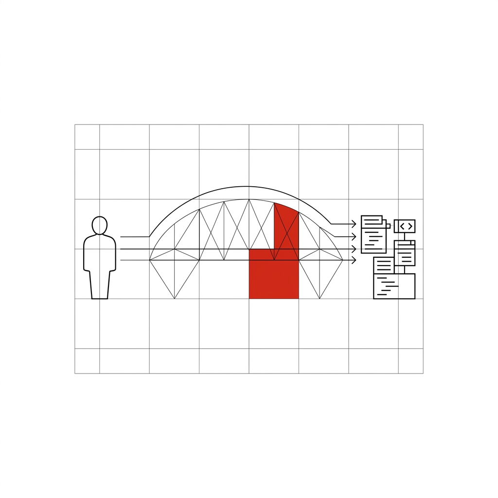

> [TEACHING MOMENT] Why 框架的设计师价值
> Munzner 的 Why 框架最深刻之处，在于它逼迫你问出一个最朴素也最难回答的问题：**「用户来这里是为了做什么？」**。从 Analyze 到 Query 的三级漏斗，本质上是把每一个主观的人类愿望，都翻译成了客观的、可执行的信号术语。这是连接数据与人类智慧的最后一公里。学会了这套语言，你就拥有了与任何甲方、工程师以及 AI，平等对话的共同词汇表——无论行业、无论领域。

这样，我们就完成了意图界定的全部推演。

> [VISUAL]
> *   **Slide**: `S29b_The_Trinity_Completed`
> *   **Layout**: `Concept`
> *   **Scene**: Analyze、Search、Query 三重齿轮严丝合缝地咬合在一起，爆发出耀眼的"机器可执行指令"蓝光。
> *   **Text**: "三重合一：将人类愿望翻译为无懈可击的代码指令。"
> *   **Caption**: "三重合一：将人类愿望翻译为无懈可击的代码指令。"
> *   **Asset**: 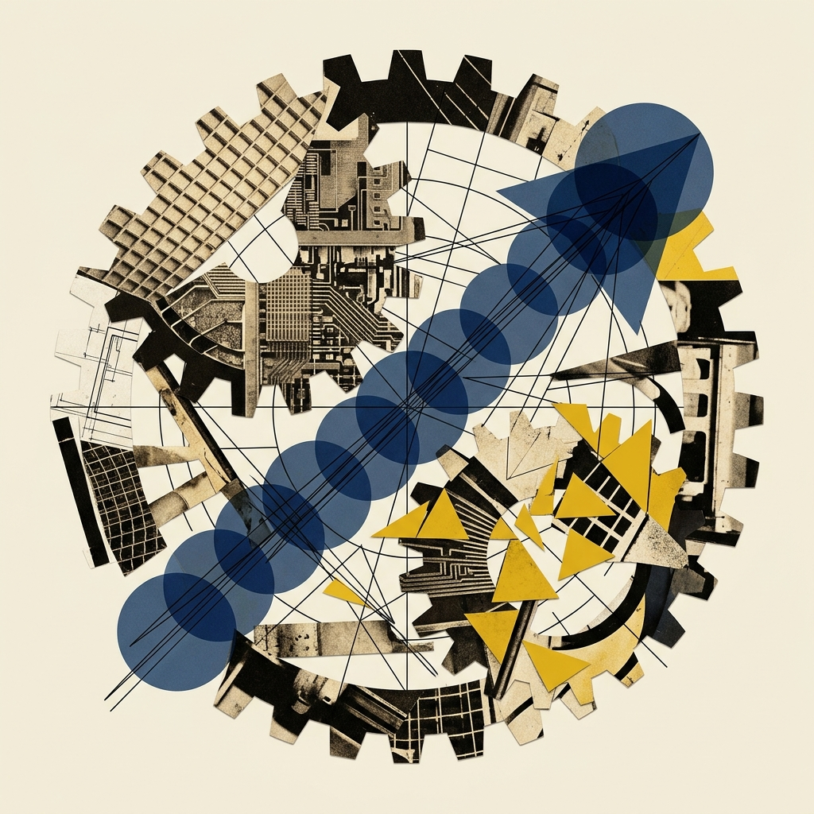

通过这个漏斗，你把散漫、矛盾的甲方需求，转译为精确的底层机器指令与交互结构。但这依然不够。光搞清楚数据长什么样（What）、用户想怎么看（Why），依旧救不活一个充满垃圾数据的项目。我们要解决最后一道也是最硬核的难关：荡平表格乱象的**行动纲领**。

全体肃立。随我拔剑，跨入本堂大课最终的决胜战场：**Tidy Data** 整洁**数据清洗**。
