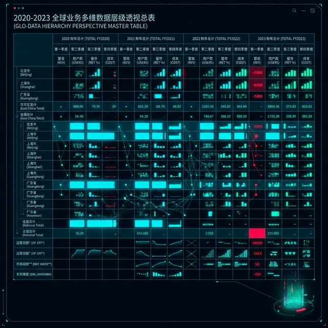
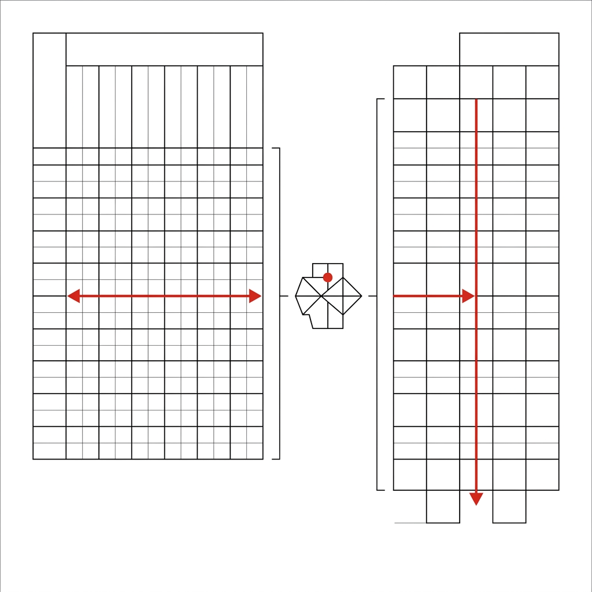

## 模块 4: 驯服混沌——Tidy Data 的核心方法 (30 分钟)
<!-- BUDGET: 3000 chars | SLIDES: ≥10 | STATUS: done -->

> [!NOTE] 核心标签回溯
> [tidy-data-ai-workflow] [data-abstraction-taxonomy] [data-ethics]

> [VISUAL]
> *   **Slide**: `S30_The_Real_World_Swamp`
> *   **Layout**: `Full`
> *   **Scene**: 数据架构师面对一张由合并单元格、多级表头和空值缝合而成的复杂数据表。
> *   **Caption**: "理论模型需要通过核心方法，才能拆解现实中的复杂数据。"
> *   **Text**: "理论模型需要通过核心方法，才能拆解现实中的复杂数据。"
> *   **Asset**: 

在前几个模块里，我们认识了数据。但现实中，我们拿到的表格往往是乱七八糟的。本节课将教你如何把杂乱的现实表格，整理成底层画图软件能直接解析的规范清单——这样 AI 调用这些工具时才不会报错。

### 4.1 宽表：人类的舒适区，机器的灾难区

> [VISUAL]
> *   **Slide**: `S31_The_Monstrous_Wide_Table`
> *   **Layout**: `Grid`
> *   **Scene**: 一张典型的层级透视总表（大宽表）。顶部有三层合并表头，横跨年份与季度，行混合了省份、总计及标注。
> *   **Caption**: "人类的阅读舒适区，往往是机器解析的障碍区。"
> *   **Text**: "大宽表：机器解析的障碍区"
> *   **Asset**: 

在日常创作和运营中，我们最喜欢看“宽表”。比如一张 B 站视频数据报表，顶部表头写着“2023上半年”、“2023下半年”，左侧写着“动画区”、“游戏区”，中间是各种合并单元格和花哨的底色。这种横向铺开的“大宽表”，极大迎合了人类一眼总览对比的阅读习惯。
但是，如果你把这种表直接丢给可视化画图软件，或让 AI 生成代码去读取，底层工具就会立刻崩溃报错。

### 4.2 为什么画图软件读不懂“宽表”？

> [VISUAL]
> *   **Slide**: `S32_The_Engine_Jam`
> *   **Layout**: `Split`
> *   **Scene**: 左侧：宽表被导入程序；右侧：系统报警 "Error: Multiple variable instances..."。
> *   **Caption**: "杂乱的结构一旦导入，底层画图引擎就会立刻罢工报错。"
> *   **Text**: "大宽表会让底层画图工具罢工报错"
> *   **Asset**: 

因为机器的脑回路和人不一样。在我们看来，“2023上半年”和“2023下半年”分列两旁很方便直观对比。但在机器眼里，它们其实都属于同一个特征维度——“时间”。

> [VISUAL]
> *   **Slide**: `S32b_SQL_Matrix_Mind`
> *   **Layout**: `Center`
> *   **Scene**: 机器眼里的正确表格：所有的具体年份，都必须老老实实呆在“年份”这一列下面。
> *   **Caption**: "机器的死脑筋：属于同一个属性的数据，必须在同一列之下。"
> *   **Text**: "机器的死脑筋：一列只能装一种东西"
> *   **Asset**: 

机器非常死脑筋：**属于同一类特征的东西，必须老老实实呆在同一列里。**如果宽表强行把它们拆成横向的好几列，机器在画“播放量随时间变化的折线图”时，就找不到一个统一的“时间轴”，只能罢工报错。

### 4.3 整理衣柜的法则：Tidy Data 三大原则

> [VISUAL]
> *   **Slide**: `S33_Enter_Hadley_Wickham`
> *   **Layout**: `Grid`
> *   **Scene**: 经典文献《Tidy Data》。
> *   **Caption**: "数据科学先驱 Hadley Wickham 提出的整洁数据规范。"
> *   **Text**: "Tidy Data：整洁数据规范"
> *   **Asset**: 

为了解决这个问题，数据科学家提出了“Tidy Data（整洁数据）”规范。你可以把它理解为“整理衣柜的三个铁律”。这里我们可以回顾一下之前学过的“数据基因组”（Item 与 Attribute）：
1.  **每个 Attribute 独立成一列**（变量成列）：“年份”、“价格”绝对不能混在同一列里，一列只装一种属性。
2.  **每个 Item 独立成一行**（观测成行）：每一行必须是一个完整的、独立的观测事件（人或事）。
3.  **每种观测单元独立成一表**（单表单元）：不要把全国的总计（宏观）和某个县的明细（微观）塞在同一张表里。

> [VISUAL]
> *   **Slide**: `S34a_Anti_Pattern_Demons`
> *   **Layout**: `Center`
> *   **Scene**: 盘踞在表格上的五种扭曲数据结构（代表列头混杂、变量寄生等反模式）。
> *   **Caption**: "格式反模式：在可视化前，必须清理这些由于阅读习惯产生的结构畸变。"
> *   **Text**: "格式反模式：清理结构畸变"
> *   **Asset**: 

**我们需要警惕五种常见的“脏数据”反模式**：
*   **列头是具体数值，而非变量名**：把列名叫做“1080P”或“4K”，实际上它们应该是“视频分辨率”这一列下的具体取值。
*   **多个变量强行捆绑在一列**：列名叫“iOS端_内购收入”，强行把平台（iOS）和指标（内购收入）绑在一起，必须拆解分离。
*   **变量同时存在于行和列中**：比如复杂的影视分镜时间表，把“本集总计时长”和具体每个镜头的时长混杂在同一列，导致结构界限模糊。
*   **多种观测粒度混杂在一张表**：游戏资产表里，不仅有每个 3D 道具的具体多边形面数（微观），还在每一行都冗余了“整个游戏的总研发预算”（宏观）。
*   **同一观测单元被分散在多张表**：比如把一部 12 集动画的数据，硬生生拆成“第1集_弹幕数据.csv”等 12 个零散的文件。

> [ACTIVITY]
> *   **Type**: `Quiz`
> *   **Duration**: `2min`
> *   **Desc**: 反模式识别：辨析违背 Tidy 原则的表头
> *   **Q**: 某独立游戏的数据报表中存在一列名为 `Steam_Positive_Reviews`（Steam 平台好评数），下方数值记录各个游戏的评价。根据 Tidy Data 原则，这主要违反了哪项铁律？
> *   **Options**: A. 列头使用了具体取值，而非变量名 | B. 同一列中强行融合了“分发平台”和“评价指标”两个属性 | C. 变量同时存在于行和列中 | D. 混杂了不同观测粒度的数据
> *   **Answer**: `B`
> *   **Explain**: `Steam_Positive_Reviews` 这一列同时捆绑了平台（Steam）和指标类型（好评数）两个特征。根据“每个 Attribute 独立成一列”的原则，这必须拆解为两列，否则机器在对比“Steam 与主机平台的差异”时将无法独立提取平台维度。

### 4.4 把宽表竖起来：长表的魔力 (Pivot Longer)

面对横向霸占很多列的宽表，我们只需要做一个动作：**把它竖过来**（在数据界这叫 Pivot Longer 宽转长）。
把横向排布的“2023上半年”、“2023下半年”统统收纳到统一叫作“时间”的一列中。这样一来，列数变少了，行数变长了，变成了名副其实的“长表”。

> [VISUAL]
> *   **Slide**: `S35b_Data_Binding_Loop`
> *   **Layout**: `Flow`
> *   **Scene**: 数据渲染示意图。机械夹爪每次抓起一行纯净长表数据，精准在画布上映射为一个点，循环流畅。
> *   **Caption**: "数据绑定：输入纯粹的长记录，获得丝滑的可视化渲染。"
> *   **Text**: "数据绑定：长表带来丝滑渲染"
> *   **Asset**: 

**一招鲜记住**：画图软件最喜欢吃“长表”。不管数据有 5 万行还是 10 万行，只要它是规范的长表，画图软件每次都能精准抓取其中一行画出一个点，绝不会报错卡顿。**长表，是通向可视化的唯一道路。**

### 4.5 让 AI 帮你做苦力：三段式指令

不要自己手动去 Excel 里复制粘贴改表格！我们可以直接利用 AI 帮我们把宽表转换成长表。但请记住核心心态转变：**不要对 AI 喊救命说“帮我洗数据”，而是要像一名数据架构师一样，给 AI 下达清晰的 Tidy Data 蓝图指令。** 为了防止 AI 胡编乱造，我们需要给它下达严苛的三段式指令：

> [VISUAL]
> *   **Slide**: `S10_AI_Clean_Prompt`
> *   **Layout**: `Split`
> *   **Scene**: 剖析高稳定性清洗 Prompt 的三段式金字塔结构。
> *   **List**: 
>     - 输入语境
>     - 目标骨架
>     - 约束法则
> *   **Text**: "AI 指令三要素：语境、骨架、约束"
> *   **Asset**: 

1.  **输入语境（Context）**：告诉 AI 这个原始表格有多乱（例如：有合并单元格、杂乱备注）。
2.  **目标骨架（Shape）**：直接命令 AI 最终生成的长表只能有哪几列（例如：视频分区、时间、播放量）。
3.  **约束法则（Constraints）**：下达死命令（例如：必须剔除总计行，直接输出文本格式，不要少字漏字）。

掌握了这个方法，你就可以把脏活累活全部交给 AI 搞定。

---

### 4.6 验证站3：一键重构实操

> [VISUAL]
> *   **Slide**: `S35c_Demo_Station_3`
> *   **Layout**: `Split`
> *   **Scene**: 屏幕左侧是有噪音的宽表，右侧是 AI Agent 原地清洗后生成的整洁长表。
> *   **Caption**: "验证站 3：人机协作完成混沌宽表到长表的规范化。"
> *   **Text**: "验证站 3：人机协作完成混沌宽表长表规范化。"
> *   **Asset**: 

> [ACTIVITY]
> *   **Type**: `Workshop`
> *   **Duration**: `20min`
> *   **Desc**: 学生利用三段式指令引导 AI 将宽表转换为长表。
> *   **Steps**:
>     1. **准备文件**：在 VSCode 中打开源数据文件 [bilibili_vlog_messy.csv](file:///Users/yamlam/Downloads/2025-2026-2 课程/信息可视化/weeks/W03_Data_Literacy/public/practice/bilibili_vlog_messy.csv)。复制一份并命名为 `tidy_vlog.csv`。
>     2. **起草指令**：参考 §4.5 的三段式法则，为 AI 起草一段指令，明确要求生成包含“视频分区、UP主类型、时间、播放量” 4 列的规范长表。
>     3. **一键重构**：唤醒 AI Agent，发送指令，让它在 `tidy_vlog.csv` 中直接原地改写文本。
>     4. **质量核查**：仔细检查 AI 生成的新表，看看多余的“全站总计”行和无关的空白/合并标记是否已被成功删除。

