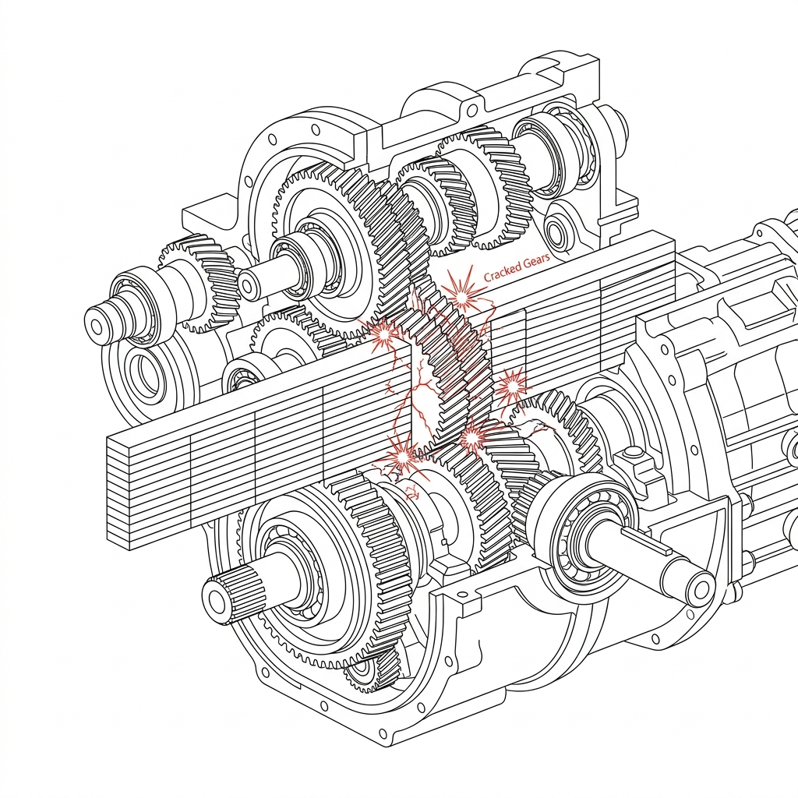

## 模块 4: 驯服混沌——Tidy Data 的核心方法 (30 分钟)
<!-- BUDGET: 3500 chars | SLIDES: ≥10 | STATUS: done -->
> [!NOTE] 核心标签回溯
> [tidy-data-ai-workflow] [data-abstraction-taxonomy] [data-ethics]

### 4.1 复杂困境：ERP 大宽表阻断机器解析逻辑

在前三个模块里，我们完成了一场大脑层面的数据心智**重塑**。但是，仅仅在脑海中完成**数据抽象**与任务拆解是不够的。现在我们要直面最真实的现实挑战：如何在不改变源端系统底座的情况下，强行降伏并重铸那些反人类的可怕野生表格。这也是连接理论概念与实战落地最关键的一座桥梁。

### 4.2 引擎崩溃：多级表头诱发渲染引擎灾难

> [VISUAL]
> *   **Slide**: `S30_The_Real_World_Swamp`
> *   **Layout**: `Full`
> *   **Scene**: 一名数据架构师手持 Tidy Data 方法论（**Tidy Data** 原则），面对着一头由无数合并单元格、错茬表头、空值和混合统计大计缝合而成的丑陋多头数据粘液怪兽。
> *   **Caption**: "理论在泥沼前显得苍白，你必须举起核心方法亲手拆解混沌实体。"
> *   **Text**: "理论在泥沼前显得苍白，你必须举起核心方法亲手拆解混沌实体。"
> *   **Asset**: 

请回想你从政府网站或公司 ERP 系统中拿到的原始表格。
在那些错位合并的单元格和嵌套表头面前，理论模型显得苍白无力。你必须亲自拆解这种多头聚合的数据怪兽，逼迫它吐出最干净的骨架维度，才能供大模型处理。

> [LIFE CONNECT] 困境中的财务大表：你被 ERP 报表强暴过吗？
> 每一个初入职场的数据分析师都经历过这非常困难的一幕：当你兴奋地打开业务部门发来的名为《集团三季度核心战报汇总.xlsx》时，你的瞳孔瞬间地震。你看到的不是清澈的数据矩阵，而是一张被人精心画成了“艺术品”的财务迷宫大宽图！
> 第一行是硕大华丽的居中标题，第二行合并了七个格子写着“华东区”，下面再细分“浙江、江苏、总计”；左侧行栏的表头甚至出现了“年度”与“环比增减幅”的诡异折叠！表格深处甚至荒唐地用浅黄底色和深红加粗字体来表达“需要重查”的隐秘信息，却连半个批注说明都没有！
> 当你颤抖着手把这份“艺术品”强行喂进哪怕全人类最顶级的 Claude 3.5 Sonnet 模型口中时，模型也会惨叫宕机。因为它根本不知道那一列既融合了年份，又融合了地区，还带着背景色数据的字符串到底算什么神仙属性。这就是我们真实面对的、复杂的 World Swamp（现实泥沼）。

> [VISUAL]
> *   **Slide**: `S31_The_Monstrous_Wide_Table`
> *   **Layout**: `Grid`
> *   **Scene**: 一张典型、复杂的层级透视总表（大**宽表**）。顶部有足足三层合并表头，横跨数界年份与季度。行则混合了省份、总计数值以及不知所谓的标注星号。
> *   **Caption**: "人类的阅读舒适区，恰是机器解析逻辑的百慕大三角。"
> *   **Text**: "大宽表：机器解析的百慕大三角"
> *   **Asset**: 

大部分人在工作中最习惯使用、潜意识认为理所当然的，就是这种横纵交织、自带美观排版与强力**聚合**展示效果的大**宽表**（Wide Data）。例如，横向的列不仅标示着 "2020", "2021", "2022" 等年份岁月刻度，还大量地将 "人口"、"GDP"、"增幅" 等迥异指标交织平铺组合在一起。由于大一统的阅读视角，这种**宽表**极大迎合了人类那一眼万年的宏大总览快感。

但这正是数据科学中最大的毒药！如果你不经处理就把这种杂冗表丢给 AI 或者商业智能（**BI**）工具，这就好比将一台精密的喷气式航发引擎强行塞进全是泥沙的沼泽。毫无疑问，等待你的将是毁灭性宕机。

### 4.3 整洁规则：三大极简法则重铸数据模具

> [VISUAL]
> *   **Slide**: `S32_The_Engine_Jam`
> *   **Layout**: `Split`
> *   **Scene**: 左半边是那张**宽表**被倒入了精密程序的处理漏斗中；右半边是齿轮卡死断裂爆火的画面，AI 在无助地弹窗报警 “Error: Multiple variable instances per record layout found.”
> *   **Caption**: "未降解的杂乱**维度**一旦入库，立刻引发算法引擎的连锁崩溃。"
> *   **Text**: "未降解的杂乱**维度**一旦入库，立刻引发算法引擎的连锁崩溃。"
> *   **Asset**: 

大**宽表**之所以会导致严重问题，在于它严重违反了关系型代数的单向单一**维度**流核心规则。在计算机处理器或者Excel 的透视表或筛选功能（SQL）查询机的心智眼里，“2020年”和“2021年”并不是两个截然不同、风马牛不相及的神奇平行物理宇宙，它们只属于同一个名为“核心时间切片变量。（Year）”主干下的两个平平无奇的子级属性切片节点。
然而，**宽表**却荒谬越权地将属于同一个变量的不同时间切片值，硬生生拆分成了数百个高高在上的一级平权列头。这就使得程序永远无法执行最基础的**聚合**交叉统计——因为它在列头上迷失了方向，找不到全盘统一收口的刻度发条。

> [VISUAL]
> *   **Slide**: `S32b_SQL_Matrix_Mind`
> *   **Layout**: `Concept`
> *   **Scene**: SQL 机器人的“视界”：所有的年份只是“Year”这个大抽屉里的一个个名牌，而不是各自独立的房间。宽表强行把名牌建成了房间，导致机器人找不到统一的收口。
> *   **Caption**: "关系型代数的核心规则：同一血缘的属性，只能屈居于单一的列维度之下。"
> *   **Text**: "关系型代数的核心规则：同一血缘的属性，只能屈居于单一的列维度之下。"
> *   **Asset**: 

> [DID YOU KNOW] 宽表引爆的 数据处理软件 极坠内存泄露严重问题
> 为什么 Python 数据科学生态中的 数据处理软件 引擎对大宽表深恶痛绝？
> 假设你有一份全国居民 10 年来的每日体温监测表。如果你按“宽表”格式，把十年的每一天作为横向超展开的 3650 个列头记录下来（例如列名是 `2020-01-01`, `2020-01-02`），这就等于同时强行命令 数据处理软件 在极珍贵的 数据表 处理池里挂载注册并维护 3650 个截然独立的内存数据系列（Series）句柄。
> 每当你只想简单地算一个跨月均值，底层引擎都要在成千上万个独立散乱的列指针之间疲于奔命地跳转寻址。不到几毫秒，这种低效的横向跳读就会抽干内存堆栈，爆出 `内存溢出错误` 甚至杀掉内核（Kernel Died）。宽表的本质，是对现代列式数据库存储原理的一场挑衅！

> [VISUAL]
> *   **Slide**: `S33_Enter_Hadley_Wickham`
> *   **Layout**: `Grid`
> *   **Scene**: 一本厚重古典文献书籍翻开，书页散发耀眼光芒。书页上印着 “**Tidy Data**” ，旁边的引言属名：Hadley Wickham。
> *   **Caption**: "终结混乱的数据圣经：R 语言大神 Hadley Wickham 的三条核心规则。"
> *   **Text**: "Tidy Data：终结混乱的数据圣经"
> *   **Asset**: 

为了解决长久以来的纠葛混乱，将混乱的原始数据整理为大模型乃至任何统计模块都能零歧义解析的统一标准格式，数据科学先驱 Hadley Wickham 提出了名震天下的整洁数据理念（Tidy Data）。他以无可辩驳的强硬口吻，定死了所有高维数据流向画纸前的极简重铸规范门槛。

### 4.4 空间折叠：以纵向行数换取统一属性列

> [VISUAL]
> *   **Slide**: `S34_Tidy_Data_Principles`
> *   **Layout**: `Grid`
> *   **Scene**: 三架非常标准化的高压模具冲压床，正在将形状怪异扭曲的宽表铁块逐步强硬冲压敲打成瘦长的直列标准钢轨长条。
> *   **List**: ["变量成列", "观测成行", "单表单元"]
> *   **Caption**: "这就是不容僭越的整洁标准法则模子：列为变量，行为观测，各归其位。"
> *   **Text**: "Tidy Data 三原则：变量成列，观测成行"
> *   **Asset**: 

不管你拿到的宽表长成多奇怪的异状，要想顺利通晓可视化的正确路径，这份数据就必须被打入这三个标准模具重新铸就：
1.  **每一个变量，独立成且仅成一单独笔直列**（Variable as Column）：这里 Wickham 提出的“变量（Variable）”，**在本质上完全等同于我们在 M02 模块中学习的 Munzner 框架底层的“属性（Attribute）”**。无论是国家、年份、品类还是利润值，绝不允许任何两个属性混杂同居合租在一个列槽口里。
2.  **每一个观测实体记录，独立成唯一的平铺行**（Observation as Row）：同理，此处的“观测（Observation）”，**正是我们此前烂熟于心的最核心独立粒子“条目（Item）”**。中国上海市在2022年的第一季度钢铁产量记录，它作为不可分割的一个独立条目，必须拥有横向完整贯穿的行段记录。
3.  **每一个类型的数据观测单元，单独存成一张干净表**（Unit as Table）：严禁把汽车销量走势图数字和月球表面陨石坑直径物理参数图谱强行杂揉杂交在一张物理 Excel Sheet 汪洋里同框展现。

> [TEACHING MOMENT] 五大野生怪诞数据反面模式大盘点
> Wickham 教授之所以伟大，是因为他穷尽一生精力抓住了困境中的这五头最常见、也最害人不浅的数据污染“异鬼”（Anti-patterns）。这就是你拿到原始档时必须警惕斩杀的五个毒蘑菇：
> 1.  **列头竟然是值，而不是变量名**：比如列名叫 `15-25岁` 和 `25-45岁`，这绝不该是列名，它们只是被隐藏的真神变量 `Age` 旗下的具体取值！
> 2.  **一个列槽里竟然硬塞了两个变量**：比如有个列叫 `Male_TB`，硬是把性别和疾病种类通过下划线强行嫁接捆绑成了四不像双头怪，必须毫不留情地切开拆为两列！
> 3.  **变量不知羞耻地同时寄生在行和列里**：行标写最小气温，列标写具体天数，这是矩阵代数灾难！
> 4.  **在同一张表里藏污纳垢放了不同观测粒度的数据**：行 1-10 记录的是每日详细销售单，第 11 行冷不丁冒出一条跨年度“全年国家级总计汇总”行，这完全破坏了粒度平权系统。
> 5.  **同一个观测单元被破碎地分布在多张表里**：2010 年数据存一个文件，2011 年存另一个文件，让你在渲染连贯折线时不得不发疯地手动拼接补缝。
>
> 牢牢盯死这五头恶鬼，一旦在原始文档中捕捉到它们的踪迹，立刻启动 Tidy 级净化！

> [VISUAL]
> *   **Slide**: `S34a_Anti_Pattern_Demons`
> *   **Layout**: `Center`
> *   **Scene**: 具象化的数据毒瘤：5只寄生虫般的怪物扭曲地盘踞在干净的数据表格上（代表列头充值、变量寄生等反模式）。
> *   **Caption**: "五大寄生毒瘤：在喂给机器前，必须斩杀这些人类阅读习惯带来的畸变。"
> *   **Text**: "五大寄生毒瘤：在喂给机器前，必须斩杀这些人类阅读习惯带来的畸变。"
> *   **Asset**: 

> [ACTIVITY]
> *   **Type**: `Quiz`
> *   **Duration**: `2min`
> *   **Desc**: 反模式识别：违背 Tidy 原则的双头怪
> *   **Q**: 在清理医疗数据源时，你发现表格中存在一列名为 `Male_TB` 的列头，该列下方的数值记录了对应地区罹患结核病的男性人数。根据 Hadley Wickham 的 Tidy Data 原则，这种表头设计违反了哪项核心禁忌？
> *   **Options**: A. 列头使用了具体的取值，而不是抽象的变量名 | B. 同一个列槽中强行塞入了“性别”和“疾病种类”两个独立的变量 | C. 变量同时寄生在行和列中，导致数据库渲染产生矩阵代数灾难 | D. 在同一张表中混杂了国家级与市级的不同观测粒度数据
> *   **Answer**: `B`
> *   **Explain**: `Male_TB` 这一列名同时包含了两个独立的属性维度：性别（Male）和疾病类型（TB）。根据 Tidy Data 的核心原则“每一个变量，独立成且仅成一单独笔直列（Variable as Column）”，这两个维度必须被拆解为两列（例如 Gender 列和 Disease 列），否则机器无法对性别或疾病进行独立的下钻与聚合。选项 B 准确指出了该反模式。

> [VISUAL]
> *   **Slide**: `S33b_Anti_Pattern_Visual`
> *   **Layout**: `Comparison`
> *   **Scene**: 左图：非常扭曲恶鬼般的脏数据宽表盘桓扭曲在屏幕中；右图：经过结构化处理后的一条根根分明、平整的 **Tidy Data** 钢化条列。
> *   **Caption**: "认清毒瘤，用严格手腕执行格式降维净化。"
> *   **Text**: "Tidy 净化：用严格手腕降维重组"
> *   **Asset**: 

要驱逐这些异鬼，在没有代码基础的时代，你只能被迫使用无穷尽的手工复制粘贴甚至手写复杂宏去人肉缝合洗刷。但现在，有了大语言模型，这一切被颠覆了。你不再是搬砖苦工，你是指挥算力引擎的数据架构先知。但前提是，你必须严谨地掌握“结构化 Prompt 指令”的三段释放核心规则。

> [VISUAL]
> *   **Slide**: `S34b_Prompt_Alchemy`
> *   **Layout**: `Concept`
> *   **Scene**: 数据架构师手持结构化 Prompt 指令书，指挥庞大的 AI 巨像执行重组数据的魔法。
> *   **Caption**: "指挥者的手杖：结构化的指令是驯服算力巨兽的唯一缰绳。"
> *   **Text**: "指挥者的手杖：结构化的指令是驯服算力巨兽的唯一缰绳。"
> *   **List**: ["指令定型", "精密微调", "终极验收"]
> *   **Asset**: 

> [CASE STUDY] 面对脏表大魔王的迭代快速处理对话实录
> 假设你拿到了一份含有恶心“中文多年份合并跨列表头”的省市十年统计宽表，正确的处理过程绝非一句没有灵魂的“帮我洗一下”。
> 
> 第一轮第一轮指令：“这是一份 2010-2020 年含合并单元格的省份 GDP 宽表。请将其完全折叠为 CSV **长表**，强硬切分成 Year, Province, GDP 三列。”这道精纯的指令，瞬间让 AI 端正身姿，明确理解了你的目标 Tidy 形状。
> 第二轮精密微调：“很好，但我发现输出的 Year 带有‘年’字后缀。请追加约束条件：清洗年份列只保留数字前缀；去除带有‘总计’字样污染的统计干扰行，仅保留最底层省市级实质实体**量化**点。”
> 第三轮终极验收入库：“完美。现在以无任何截断的 raw 字符串格式强压流出压出。”
> 
> 面对浑浊的垃圾填埋区，只有用这种夹杂着硬核属性术语（**长表**、CSV、重命名、丢弃空值）的精确指令，大模型才会收起散漫的脑补，成为你手下无可挑剔的数据重构车间。

在这个严苛标准下，原本文本框合并满天飞、横向霸占屏幕的超大宽表，会被机器无情地切分，然后纵向拉伸，重铸为一张列数极少、行数却呈几何级数暴涨的致密**长表**。这就是无坚不摧的 **Long Data（长整洁格式数据）**。

> [VISUAL]
> *   **Slide**: `S35_The_Pivot_Longer_Spell`
> *   **Layout**: `Split`
> *   **Scene**: 演示重要的矩阵转换：原有的数十个跨度年份列的表头瞬间坍塌瓦解融化，即 Melt，向下如瀑布般流淌跌落凝聚压缩成名为“时间属性”的单一窄列，与之对应的宽阔体量数据群随之被非常延展拉伸成不见底的长河结构。
> *   **Caption**: "伟大的**重塑**降维魔法：Pivot Longer (宽转长透视术)，用深度置换广度！"
> *   **Text**: "伟大的**重塑**降维魔法：Pivot Longer (宽转长透视术)，用深度置换广度！"
> *   **Asset**: 

数据界称这一操作为 Pivot Longer（宽转长）。它的本质是一场维度的置换：用行数的纵向暴增，去抹平列数的横向膨胀。原本占据数十列的庞大年份表头，统统坍塌融化，凝聚成一柱名为“年份”的窄列。由此诞生的纯净长表，将成为大模型的最优口粮，消除因复杂格式引发的解析歧义。

> [TEACHING MOMENT] 从图形学渲染机制，看长表的必然性
> 为什么 D3.js 和 ECharts 等工业级图表库，严酷地只接受这种反人类阅读的长整洁格式数据 (Long Data)？
> 请想象机器绘制图表时的底层数据绑定（Data Binding）逻辑：当引擎被命令绘制一张包含 50 个国家、跨越 10 年的变迁图形时，它真正在执行的，是一个机械化的遍历动作。如果强行喂一张杂糅宽表，当高速代码扫到第一行（平铺着 10 个年份的数据点）时，机器就会遭遇灾难——这一行究竟该揉捏成 1 个畸形球体，还是勉强劈裂成 10 个散点？脆弱的刻度尺映射（Scale）将因为列宽自身的多重性而瞬间撕扯崩溃。

> [VISUAL]
> *   **Slide**: `S35a_D3_Engine_Jam`
> *   **Layout**: `Center`
> *   **Scene**: 渲染引擎的物理崩溃：展示一个名为 D3 的精密齿轮引擎，被迫强行吞下一块带有 10 个年份的“宽表列块”，导致引擎齿轮爆火卡死。
> *   **Caption**: "引擎宕机：当机械化的遍历遭遇多重维度的宽表，渲染刻度尺将瞬间撕裂。"
> *   **Text**: "引擎宕机：当机械化的遍历遭遇多重维度的宽表，渲染刻度尺将瞬间撕裂。"
> *   **Asset**: 

### 4.5 渲染偏执：单向聚合流契合底层查询器

> [VISUAL]
> *   **Slide**: `S35c_Tidy_Before_After`
> *   **Layout**: `Split`
> *   **Scene**: 将同一份 10 年统计文件分别放入渲染器：左侧宽表引发警报和黑洞；右侧长表被顺畅吞入，立刻吐出一张耀眼的彩色多线条折线图。
> *   **Caption**: "引擎只认理科世界的冷酷矩阵流，长列表是一切绝美图表诞生的唯一入场券。"
> *   **Text**: "引擎只认理科世界的冷酷矩阵流，长列表是一切绝美图表诞生的唯一入场券。"
> *   **Asset**: 

进一步深挖至底层骨架，你会发现这种强迫症并不停留在绘图前端。现代数字技术大厦的根基——**SQL** 查询引擎库——对长表也有着绝对的偏执。在 SQL 系统眼中，不管是一年还是一百年跨度，只要全部时间切片都被乖巧地塞入唯一名为“Year”的长条**维度**内，它一记简单的 `GROUP BY` 聚合指令，就能在毫秒间，无情跨越并快速求出成千上万个宏大周期的聚合总和。这展现的正是 `ch13-reduce` 理念中关于数据项聚合与降维的核心操作精髓。

这既不是临时巧合，更不是工程师的妥协。这是因为，从底层硬件的汇编指令，到顶层交互的视觉呈现，整条算力数据链天生只接纳一维延伸的单一**维度**结构。这就是为什么你必须严格，强迫所有变种数据统统并入 **Tidy Data** 锁死的规范流程中。

> [VISUAL]
> *   **Slide**: `S35d_Group_By_Gatling`
> *   **Layout**: `Concept`
> *   **Scene**: SQL 引擎的 `GROUP BY` 指令化作一挺高效工具，在整齐划一的“Year”纵向槽口中扫射，瞬间得出所有聚合总和。
> *   **Caption**: "SQL 的执行偏好：唯有单维纵深的结构，才能承受住聚合运算的高速运算。"
> *   **Text**: "SQL 的执行偏好：唯有单维纵深的结构，才能承受住聚合运算的高速运算。"
> *   **Asset**: 

**Tidy Data 是一份写给未来自己的承诺**。今天多花五分钟将宽表折叠成长表，明天的可视化引擎和 AI 模型就能为你少走十个弯路。这种不被眼前便捷所诱惑、坚持以机器可读性为最高设计原则的数据素养，正是区分数据操作者与数据架构师的那道分水岭。格式不是技术细节，是你向所有下游工具传递的第一道、也是最关键的一道设计决策信号。

> [VISUAL]
> *   **Slide**: `S35b_Data_Binding_Loop`
> *   **Layout**: `Flow`
> *   **Scene**: D3 Data Binding 引擎工作示意图。一个名为 `.data(longData).enter().append('circle')` 的机械夹爪，每次抓起一行只含单一变量的纯净长数据行，精准无误地在画布上烙印出一个闪光数据散点，循环往复毫不卡滞。
> *   **Caption**: "循环渲染的硬核刚需：机器只懂原子级指令。给它最纯粹的长纪录，它还你百万级的丝滑渲染。"
> *   **Text**: "循环渲染的硬核刚需：机器只懂原子级指令。给它最纯粹的长纪录，它还你百万级的丝滑渲染。"
> *   **Asset**: 

> 但是，如果丢进显存的是隔绝分明的**长表**（国家、年份、品类、数值），哪怕行数暴涨到了 5 万行，机器每次读取的却是一个单一不可分割的观测原子！它只需闭眼机械化地抽取 X/Y 坐标，5 万个气泡就会平滑地喷放在画布上。机器集群从不惧怕海量行数，它唯一惧怕的，是人脑杂糅导致的维度错乱。**长表**，便是通往可视化终极渲染霸权的唯一门扉。

> [VISUAL]
> *   **Slide**: `S36_The_AI_Sigh_Of_Relief`
> *   **Layout**: `Full`
> *   **Scene**: 之前那个处于宕机卡死边缘的 AI 大脑，一旦接管读取到这份纯净瘦长的 Tidy **长表格**结构体，瞬间通体发散出舒畅通达的蓝光光晕，秒速没有阻滞地渲染出了一幅层次分明逻辑自恰的绝美复杂多维散点结构名画幅。
> *   **Caption**: "通畅的机器心流体验：结构理顺之后，AI 即刻展现高效的的渲染神迹。"
> *   **Text**: "通畅的机器心流体验：结构理顺之后，AI 即刻展现高效的的渲染神迹。"
> *   **Asset**: 

当你将这份标准长表递交到大模型手中时，卡顿与维度坍陷的谬误均会烟消云散。因为你提前替它铺平了认知底座架构，机器便能专注开展它的渲染本职。

这也是可视化的终极底牌：不要迷恋在最后一英里的图表皮囊上涂脂抹粉。决定成败的核心内功，永远在第一公里的底层架构重组里。你必须直面混沌的原始数据，亲自执行降维熔炼。

在进入最后冲刺前，我们用一个真实场景来检验一下：

> [ACTIVITY]
> *   **Type**: `Quiz`
> *   **Duration**: `2min`
> *   **Desc**: 渲染崩溃：宽转长透视抢救
> *   **Q**: 一位前端开发在使用 D3.js 渲染十年期各省市 GDP 趋势折线图时，发现内存瞬间被打满，页面卡死。排查后发现他传入的 JSON 数据中，包含了“2010年”、“2011年”直到“2020年”等数十个并列的列名。为了解决这个问题，根据 Tidy Data 原则，他必须对数据执行什么关键操作？
> *   **Options**: A. 动用 Derive 派生操作，算出十年总和以减少数据量 | B. 降低渲染帧率，减轻引擎压力 | C. 执行 Pivot Longer（宽转长）操作，将所有年份表头融化为单一的“年份”变量列 | D. 使用 SQL 的 GROUP BY 直接对原有的数十个年份列进行多线程聚合
> *   **Answer**: `C`
> *   **Explain**: 宽表会将同属于“时间”的属性作为独立列横向铺开，导致机器在数据绑定（Data Binding）时在多个指针间跳转跳读从而耗尽内存。必须执行 Pivot Longer（宽转长），将年份作为统一属性（变量成列），让机器每次读取一个结构一致的原子，才能实现丝滑渲染。

这周的**硬核底层理论基石**大盘即将完全收官。但在正式放逐你们踏入深坑实战战场之前，我们必须强行挂载掌握最后一项绝杀级关键指令投喂应用技术战术——即自然语言数据大表清理炼金术防线。
这是将 Munzner 的多维层递抽象哲学，与 **Tidy Data** 大清洗法则完美粘合的终极最终环节！它是我们将理论投入最终实践落地的收尾阀门！

> [VISUAL]
> *   **Slide**: `S36a_Bottom_Architecture`
> *   **Layout**: `Split`
> *   **Scene**: 左侧是一个满身泥泞的数据架构师正在熔炉旁重铸底层骨架铁骨（第一公里）；右侧是轻浮的画师在图表表面涂脂抹粉（最后一英里）。
> *   **Caption**: "内功的胜利：不要迷恋在最后一英里涂脂抹粉，去第一公里的泥沼中完成架构洗髓。"
> *   **Text**: "内功的胜利：不要迷恋在最后一英里涂脂抹粉，去第一公里的泥沼中完成架构洗髓。"
> *   **Asset**: 

> [VISUAL]
> *   **Slide**: `S36b_The_Last_Mile`
> *   **Layout**: `Concept`
> *   **Scene**: 一个分界线：起点是破烂泥泞的宽表泥沼，终点是插满鲜花的可视化大屏。一名架构师在起点的泥沼中艰难熔炼底层架构。
> *   **Caption**: "第一公里的生死战：不在最后一英里的图表皮囊上涂脂抹粉，而在第一公里的泥沼中完成架构洗髓。"
> *   **Text**: "第一公里的生死战：不在最后一英里的图表皮囊上涂脂抹粉，而在第一公里的泥沼中完成架构洗髓。"
> *   **Asset**: 

### 4.6 终极约束：三段式结构锁死大模型幻觉

在向顶级大语言模型下达数据**重塑**指令时，多数门外汉只会敷衍地写下一句："帮我清理一下这坨乱码和合并单元格"。
这种放养式指令的成功率极低。大模型一旦失去强制护栏，便会陷入发散的随机性，将宝贵的原始字段生生切毁。

真正的顶流数据架构师，必然只依靠冷酷严苛的 **"结构化**重塑** Prompt 结构"** 来发出指令。这个指令结构必须如严格地焊死三大禁区：

> [VISUAL]
> *   **Slide**: `S10_AI_Clean_Prompt`
> *   **Layout**: `Split`
> *   **Scene**: 剖析一个具有极高稳定性的清洗 Prompt 的金字塔三结构。
> *   **List**: ["输入语境", "目标骨架", "约束法则"]
> *   **Text**: "清洗 Prompt 三要素：Context, Shape, Constraints"
> *   **Asset**: 

> [CASE STUDY] 镇压狂暴大模型的结构化 Prompt 指令手段
>
> 让我们来见证真正能在深寒实战项目中，把一个发疯的表格收拾得服服帖帖的零误判指令体系范本大典：
>
> 1.  **Input Context（输入语境）**：一针见血地指出原始数据的病征。
>     * *"大模型听令：这附带传入的 CSV 是一份非标野生的大宽表。顶部列头错误地塞入了跨界值，内部夹杂着合并单元格遗留的空缺黑洞。最致命的是，第一列混淆标注了高维标签，而并非核心的市级下沉锚点**主键**（Key）。"*
> 2.  **Target Shape（目标骨架）**：利用权威定义框出最终结构。
>     * *"我不要你的擅自发挥。请执行 Pivot Longer 降维**派生**，将其压直重铸为金标准的 **Tidy Data 长表结构**。输出成品仅包含 4 条对齐的纯净属性：归属为**分类**型（Categorical）的地区变量 Region，归属为**序数**型的年份变量 Year，归属**分类**型的子类别变量 Category，以及归属**量化**型（Quantitative）的数值度量 GDP_Value。"*
> 3.  **Constraints（约束法则）**：布下绝不妥协的清洗核心规则。
>     * *"强制约束第一条：带有'年末汇总', '数据暂缺'的伪附属行，必须执行物理抹杀剔除。绝不允许将其混编进数值列。强制约束第二条：任何以星号包裹的杂项脚注，一经触碰立刻清空。给我返回那张没有血色的清洗结果表格代码。"*

明白了吗？在这场数据人机协作中，你必须扮演手持高维蓝图指令的统帅。而看似神通广大的大模型，不过是替你去实际工作里写复杂正则、执行机械化重组的执行工具。现在的你，早已经不是那个被一坨合并乱码逼得抱头痛哭的菜鸟了。立刻动手实践去大干一场！
