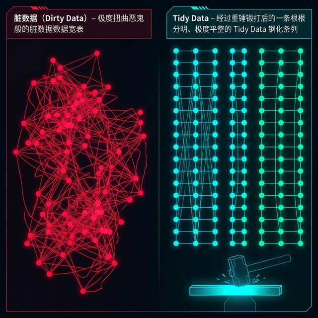

## 模块 4: 驯服混沌——Tidy Data 的真理之眼 (30 分钟)
<!-- BUDGET: 3500 chars | SLIDES: ≥10 | STATUS: done -->
> [!NOTE] 核心标签回溯
> [tidy-data-ai-workflow] [data-abstraction-taxonomy] [data-ethics]

在前三个模块里，我们完成了一场大脑层面的数据心智重塑。但是，仅仅在脑海中完成数据抽象与任务拆解是不够的。现在我们要直面最血淋淋的现实地狱：如何在不改变源端系统底座的情况下，强行降伏并重铸那些反人类的可怕野生表格。这也是连接理论概念与实战落地最关键的一座桥梁。

> [VISUAL]
> *   **Slide**: `S30_The_Real_World_Swamp`
> *   **Layout**: `Image`
> *   **Scene**: 一名全副武装的骑士（数据架构师）拿着一把闪耀着蓝光的利刃（Tidy Data 原则），面对着一头由无数合并单元格、错茬表头、空值和混合统计大计缝合而成的丑陋多头数据粘液怪兽。
> *   **Caption**: "理论在泥沼前显得苍白，你必须举起真理之剑亲手肢解混沌实体。"
> *   **Asset**: 

各位未来的数据操盘手，请闭上眼睛，狠狠回想一下你从政府开放网站，或是从公司内部那些跑着十年老旧代码的财务统揽 企业资源计划系统，也就是 **ERP** 系统里拿到过的第一手数据历史沉淀包袱总表。
理论模型在那里显得如此可笑且苍白无力。你必须亲手披挂上阵，举起结构化的真理之剑，在这个充满着极其反人类的错位跨行合并单元格、杂糅着无限嵌套错茬表头的混乱无底泥沼里，一寸一寸地撕开厚重的业务迷雾，亲自肢解那头可怕的多头聚合数据粘液怪兽，逼迫它吐出最干净的骨架维度来呈供大模型处理。

> [LIFE CONNECT] 深渊中的财务大表：你被 ERP 报表强暴过吗？
> 每一个初入职场的数据分析师都经历过这地狱般的一幕：当你极其兴奋地打开业务部门发来的名为《集团三季度绝对核心战报汇总.xlsx》时，你的瞳孔瞬间地震。你看到的不是冰冷清澈的数据矩阵，而是一张被人精心画成了“艺术品”的财务迷宫大宽图！
> 第一行是极其硕大华丽的居中大标题，第二行合并了七个格子写着“华东区”，下面再细分“浙江、江苏、总计”；而左侧行栏的表头甚至出现了“年度”与“环比增减幅”的诡异折叠！表格深处甚至还极其荒唐地用浅黄底色和深红加粗字体来表达“需要重查”的隐秘信息，却连半个批注说明都没有！
> 当你颤抖着手把这份“艺术品”强行喂进哪怕全人类最顶级的 Claude 3.5 Sonnet 模型口中时，模型也会惨叫宕机，因为它根本不知道那一列既融合了年份，又融合了地区，还带着背景色数据的字符串到底算什么神仙属性。这就是我们真实面对的、令人作呕的 World Swamp（现实泥沼）。

> [VISUAL]
> *   **Slide**: `S31_The_Monstrous_Wide_Table`
> *   **Layout**: `Grid`
> *   **Scene**: 一张极其典型、令人作呕的层级透视总表（大宽表）。顶部有足足三层合并表头，横跨数界年份与季度。行则混合了省份、总计数值以及不知所谓的标注星号。
> *   **Caption**: "人类的阅读舒适区，恰是机器解析逻辑的百慕大三角。"
> *   **Asset**: 

大部分人在工作中最习惯使用、潜意识认为理所当然的，就是这种横纵交织、自带美观排版与强力聚合展示效果的大宽表，也就是 **Wide Data**。例如，横向的列不仅标示着 "2020", "2021", "2022" 等年份岁月刻度，还疯狂地将 "人口"、"GDP"、"增幅" 等迥异指标交织平铺组合在一起。由于大一统的阅读视角，这种宽表极大迎合了人类那一眼万年的宏大总览快感。

但这正是数据科学中最大的毒药！如果你胆敢不经处理就把这种杂冗表丢给 AI 或者商业智能分析工具，也就是 **BI** 工具，这就好比你将一台构造精密的喷气式航发引擎强行塞进全是泥沙木屑的沼泽燃料。毫无疑问，等待你的绝对是毁灭性宕机。

> [VISUAL]
> *   **Slide**: `S32_The_Engine_Jam`
> *   **Layout**: `Split`
> *   **Scene**: 左半边是那张宽表被倒入了精密程序的处理漏斗中；右半边是齿轮卡死断裂爆火的画面，AI 在无助地弹窗报警 “Error: Multiple variable instances per record layout found.”
> *   **Caption**: "未降解的杂乱维度一旦入库，立刻引发算法引擎的连环堵塞殉爆。"
> *   **Asset**: 

大宽表之所以极度邪恶并被底层系统视作癌细胞，在于它严重违反了关系型代数的单向单一维度流铁血理论。在计算机处理器或者标准结构化查询语言，也就是 **SQL** 查询机的心智眼里，“2020年”和“2021年”并不是两个截然不同、风马牛不相及的神奇平行物理宇宙，它们只属于同一个名为“核心时间切片变量，也就是 **Year**”主干下的两个平平无奇的子级属性切片节点。
然而，宽表却荒谬越权地将属于同一个血缘变量的不同具体时间切片值，硬生生扯断拆分成了数百个极其高高在上的一级平权列头矩阵护卫。这就使得程序永远无法执行哪怕最基础的一键聚合交叉查统计——因为它在列头上迷失了方向，根本找不到全盘统一收口的那个标准刻度发条阀门。

> [DID YOU KNOW] 宽表引爆的 Pandas 极坠内存泄露核灾难
> 为什么 Python 数据科学生态中的 Pandas 引擎对大宽表深恶痛绝？
> 假设你有一份全国居民 10 年来的每日体温监测表。如果你按“宽表”格式，把十年的每一天作为横向超展开的 3650 个列头记录下来（例如列名是 `2020-01-01`, `2020-01-02`），这就等于同时强行命令 Pandas 在极珍贵的 DataFrame 处理池里挂载注册并维护 3650 个截然独立的内存数据系列（Series）句柄。
> 每当你哪怕只想极其简单地算一个跨月均值，底层 C++ 引擎都要在成千上万个相互独立且散乱的列指针之间疲于奔命地跳转寻址。不到几毫秒，这种极低效的横向跳读就会彻底抽干原本雄厚的内存堆栈，爆出惨烈的 `MemoryError` 甚至直接强行杀掉内核（Kernel Died）。宽表的本质，就是对现代列式数据库存储原理的一场赤裸裸的挑衅与凌辱！

> [VISUAL]
> *   **Slide**: `S33_Enter_Hadley_Wickham`
> *   **Layout**: `Grid`
> *   **Scene**: 一本厚重古典文献书籍翻开，书页散发神圣光芒。书页上印着 “Tidy Data” ，旁边的引言属名：Hadley Wickham。
> *   **Caption**: "终结混乱的数据圣经：R 语言大神 Hadley Wickham 的三大降维打击铁律。"
> *   **Asset**: 

为了斩断长久以来的纠葛混乱，将千疮百孔的野生网路强压成大模型乃至任何统计模块都能零歧义解析的统一神圣底牌，数据科学先驱 Hadley Wickham 提出了名震天下的整洁数据理念，也就是 **Tidy Data**。他以无可辩驳的强硬口吻，定死了所有高维数据流向画纸前的极简重铸规范门槛。

> [VISUAL]
> *   **Slide**: `S34_Tidy_Data_Principles`
> *   **Layout**: `Grid`
> *   **Scene**: 三架极度标准化的高压模具冲压床，正在将形状极其怪异扭曲的宽表铁块逐步强硬冲压敲打成极简瘦长的纯净直列标准钢轨长条。
> *   **List**: ["每列独占变量，即 Variable as Column", "每行独立观测，即 Observation as Row", "单表单一单元，即 Unit as Table"]
> *   **Caption**: "这就是不容僭越的整洁标准法则模子：列为变量，行为观测，各归其位。"
> *   **Asset**: 

不管你拿到的宽表长成多奇怪变异的肿瘤异状，要想顺利通晓可视化的神谕之路并且活下来，这份数据就必须被强行打入这个极其残忍断骨的三个铁血模子重新铸就：
1.  **每一个变量，独立成且仅成一单独笔直列**（Variable as Column）：无论是国家、年份、品类还是利润值，绝不允许任何两方混杂同居合租在一个列槽口里。
2.  **每一个观测实体记录，独立成唯一的平铺行**（Observation as Row）：中国上海市在2022年的第一季度钢铁产量记录，它必须拥有绝对独立完整的一段长线命理阵组合。
3.  **每一个类型的数据观测单元，单独存成一张干净表**（Unit as Table）：严禁把汽车销量走势图数字和月球表面陨石坑直径物理参数图谱强行杂揉杂交在一张物理 Excel Sheet 汪洋里同框展现。

> [TEACHING MOMENT] 五大野生怪诞数据反面模式大盘点
> Wickham 教授之所以伟大，是因为他穷尽一生精力抓住了深渊中的这五头最常见、也最害人不浅的数据污染“异鬼”（Anti-patterns），也就是你拿到原始档时必须警惕斩杀的五个毒蘑菇：
> 1.  **列头竟然是值，而不是变量名**：比如列名叫 `15-25岁` 和 `25-45岁`，这绝不该是列名，它们只是被隐藏的真神变量 `Age` 旗下的具体取值！
> 2.  **一个列槽里竟然硬塞了两个变量**：比如有个列叫 `Male_TB`，硬是把性别和疾病种类通过下划线强行嫁接捆绑成了四不像双头怪，必须毫不留情地切开拆为两列！
> 3.  **变量不知羞耻地同时寄生在行和列里**：行标写最小气温，列标写具体天数，这是矩阵代数灾难！
> 4.  **在同一张表里藏污纳垢放了不同观测粒度的数据**：行 1-10 记录的是每日详细销售单，第 11 行冷不丁冒出一条跨年度“全年国家级总计汇总”行，这完全破坏了粒度平权系统。
> 5.  **同一个观测单元被极其破碎地分布在多张表里**：2010 年数据存一个文件，2011 年存另一个文件，让你在渲染连贯折线时不得不发疯地手动拼接补缸缝合缝隙。
>
> 牢牢盯死这五头恶鬼，一旦在原始文档中捕捉到它们的踪迹，立刻启动 Tidy 级净化！

> [VISUAL]
> *   **Slide**: `S33b_Anti_Pattern_Visual`
> *   **Layout**: `Comparison`
> *   **Scene**: 左图：极度扭曲恶鬼般的脏数据宽表盘桓扭曲在屏幕中；右图：经过重锤锻打后的一条根根分明、极度平整的 Tidy Data 钢化条列。
> *   **Caption**: "认清毒瘤，用铁血手腕执行格式降维净化。"
> *   **Asset**: 

要驱逐这些异鬼，在没有任何代码基础的时代，你只能被迫在粗糙软件里生不如死地使用无穷尽的手工复制粘贴甚至手写复杂宏去人肉缝合洗刷。但现在，有了大语言模型，这一切完全被颠覆了。你不再是搬砖苦工，你是指挥最高算力魔法引擎作战的数据架构先知。但前提是，你必须绝对严谨地掌握“结构化 Prompt 咒语”的三段式炼金释放铁律。

> [CASE STUDY] 面对脏表大魔王的迭代极速猎杀对话实录
> 假设你拿到了一份含有极其恶心“中文多年份合并巨大跨列表头”的省市十年统计宽表废墟，正确的狩猎过程绝非一句毫无灵魂的“帮我洗一下”。
> 
> 第一轮降临打击：“这是一份 2010-2020 年含合并单元格的省份 GDP 宽表。请将其彻底折叠为 CSV 长表，强硬切分成 Year, Province, GDP 三列。”这道精纯的指令，瞬间让 AI 端正身姿，明确理解了你的目标 Tidy 形状。
> 第二轮精密微调：“很好，但我发现输出的 Year 带有‘年’字后缀。请追加约束条件：清洗年份列只保留数字前缀；去除带有‘总计’字样污染的统计干扰行，仅保留最底层省市级实质实体量化点。”
> 第三轮终极验收入库：“完美。现在以无任何截断的 raw 字符串格式强压流出压出。”
> 
> 面对极其浑浊的垃圾填埋区，只有用这种夹杂着坚硬物理属性术语（长表、CSV、三列、总计排除）的精确步步紧逼三段审问，大模型才会被逼迫收起散漫的瞎脑补能力，彻底沦为你手下最无可挑剔的数据黄金重构炼金剥离车间工厂。

在这个极为严苛的神圣审判标准下，原本文本框合并满天飞的横向霸占整个屏幕领域的超大宽阵总表，会被机器极其无情地横刀斩断，然后犹如面团般被强烈纵向下扯拉伸粉碎，重铸为一张列数被极限裁员极少、行数却疯狂呈几何万倍级数向着地壳深渊海量暴涨的极度致密长表序列，也就是传说中无坚不摧的 **Long Data（长整洁格式数据）**。

> [VISUAL]
> *   **Slide**: `S35_The_Pivot_Longer_Spell`
> *   **Layout**: `Split`
> *   **Scene**: 演示史诗级的矩阵转换：原有的数十个跨度年份列的表头瞬间坍塌瓦解融化，即 Melt，向下如瀑布般疯狂流淌跌落凝聚压缩成名为“时间属性”的单一窄列，与之对应的宽阔体量数据群随之被极度延展拉伸成不见底的长河阵列。
> *   **Caption**: "伟大的重塑降维魔法：Pivot Longer (宽转长透视术)，用深度置换广度！"
> *   **Asset**: 

数据界称这一壮举为 Pivot Longer，也就是宽表折叠转长。它的本质是一场剧烈维度的置换：用行数的纵向暴增，去强硬抵消抹平列数的横向虚张声势。原本占据数十列的庞大年份表头，统统坍塌融化，被逼迫向下流淌凝聚成一柱名为“年份”的窄列。经过这道犹如炼狱打铁的高压捶打，所有的字段列头只剩纯粹的单一属性，再无杂质蔓延。由此诞生的简练长表血肉，将成为大模型的最优口齿口粮，终结所有因庞大格式而爆发的歧义恶疾。

> [TEACHING MOMENT] 从图形学渲染机制，看长表的铁血必然性
> 为什么 D3.js 和 ECharts 等工业级图表库，极其严酷地只接受这种反人类阅读的的长整洁格式数据 (Long Data)？
> 请想象机器绘制图表时的底层轮询绑定（Data Binding）逻辑：当引擎被命令绘制一张包含 50 个国家、跨越 10 年的变迁图形时，它真正在执行的，是一个极其机械化的遍历动作。如果强行喂一张杂糅宽表，当高速代码扫到第一行（平铺着 10 个年份的数据点）时，机器内存就会遭遇灾难——这一行究竟该揉捏成 1 个畸形球体，还是勉强劈裂成 10 个散点？脆弱的刻度尺映射（Scale）将因为列宽自身的多重性而瞬间撕扯崩溃。

> [VISUAL]
> *   **Slide**: `S35c_Tidy_Before_After`
> *   **Layout**: `Split`
> *   **Scene**: 将同一份 10 年统计文件分别放入渲染器：左侧宽表状态引发全盘警报和数据黑洞；右侧长表被极度丝滑吞入，立刻吐出一张极其耀眼的彩色多线条折线序列图。
> *   **Caption**: "引擎只认理科世界的冷酷矩阵流，长列表是一切绝美图表诞生的唯一入场券。"
> *   **Asset**: 

进一步深挖至底层骨架血脉，你会发现这种强迫性症结并不仅仅停留在绘图前端。整座现代数字技术大厦的根基底盘——包括统治着海量数据吞吐生死的极核数据库大主脑 ，标准的结构化查询语言也就是 **SQL** 查询引擎库——对纯粹的长表都有着如同病态般的绝对嗜好偏执。在 SQL 的重型火炮系统眼中，不管是一年还是一百年跨度，只要全部时间切片都被老老实实折叠且乖巧地塞入唯一那根名为“Year”长条窄柱形槽口管线维度内，它一记极度简单的 `GROUP BY` 或求和聚合指令加特林猛烈扫射，就能在一瞬间且在极端的毫秒微秒微服极差间，无情跨越扫平并狠狠绝对碾压求出成千上万个跨越不同年份宏大周期的聚合总和。这展现的正是 `ch13-reduce` 理念中关于数据项聚合与降维的核心操作精髓。

这既不是某种临时巧合，更绝不是工程师的妥协让步计算。这是因为从最低阶硅基半导体逻辑电路图的汇编死板寻址指令，再直通直到最顶层的数据交互极致呈现艺术，整条主算力大江大河全权秩序数据链，天生并天然就只对缝接纳并且绝对臣服屈从于一维无间断单向延伸、血统无比纯正的单一结构维度阵列！这就是为什么作为能够操纵这些死物的新神明，你必须铁面无私坚守断臂残暴级地强迫并命令全宇宙的所有变种乱局结构数据，全部严格强制重折重叠并入归于到完全被 Tidy Data 锁死的这条钢铁强压模子主架构大河正道航线之中。

**Tidy Data 是一份写给未来自己的承诺**。今天多花五分钟将宽表折叠成长表，明天的可视化引擎和 AI 模型就能为你少走十个弯路。这种不被眼前便捷所诱惑、坚持以机器可读性为最高设计原则的数据素养，正是区分数据操作者与数据架构师的那道分水岭。格式不是技术细节，是你向所有下游工具传递的第一道、也是最关键的一道设计决策信号。

> [VISUAL]
> *   **Slide**: `S35b_Data_Binding_Loop`
> *   **Layout**: `Diagram`
> *   **Scene**: D3 Data Binding 引擎工作示意图。一个名为 `.data(longData).enter().append('circle')` 的机械夹爪，每次抓起一行只含单一变量的纯净长数据行，精准无误地在画布上烙印出一个闪光数据散点，循环往复毫不卡滞。
> *   **Caption**: "循环渲染的硬核刚需：机器只懂原子级指令。给它最纯粹的长纪录，它还你百万级的丝滑渲染。"
> *   **Asset**: 

> 但是，如果丢进显存的是只有 4 单列死板数据的长表（国家、年份、品类、数值隔绝分明），哪怕总体行数暴涨到了 5 万行，机器每次高频读取摄入的却是一个绝对单一不可分割的观测原子单元！它只需闭着眼睛毫秒级机械化地抽取 X/Y 坐标，5 万个气泡粒子流就会极其平滑地喷放映射在画布上。机器运算集群从不害怕海量行数，它唯一惧怕的，是人脑杂糅导致的列属性逻辑维度的杂交错乱。长表，便是通往可视化终极渲染霸权的唯一门扉。

> [VISUAL]
> *   **Slide**: `S36_The_AI_Sigh_Of_Relief`
> *   **Layout**: `Image`
> *   **Scene**: 之前那个处于宕机卡死边缘的 AI 大脑，一旦接管读取到这份纯净瘦长的 Tidy 长表格结构体，瞬间通体发散出舒畅通达的蓝光光晕，秒速毫无阻滞地渲染出了一幅层次分明逻辑自恰的绝美复杂多维散点阵列名画幅。
> *   **Caption**: "通畅的机器心流体验：结构理顺之后，AI 即刻展现碾压级的渲染神迹。"
> *   **Asset**: 

回望起点，当你将这份历尽重铸淬炼后的极精纯标准长表递交到大模型手中时，一切的卡顿、谬误、纬度坍陷惨案均会烟消云散。因为你提前替它铺平了认知底座架构！机器便能奔放无阻地调用 CPU 线程池，去专注开展它的宏图渲染本职。

这也是我们在数据可视化长河里教授给诸位的终极奥义底牌：不要迷恋在最后一英里的表层皮囊颜色图徽涂脂抹粉。真正决定生死成败巅峰高度功底的核心内功，永远在第一公里开端的底层维度架构破译重组洗骨换血大阵列里。你必须深处脏污混沌之地，以极强硬铁腕之姿亲自掌舵降维熔炼驯服。

这周的硬核底层理论基石大盘即将彻底收官。但在正式放逐你们踏入深坑实战战场之前，我们必须强行挂载掌握最后一项绝杀级核威慑指令投喂应用技术战术——即自然语言数据大表清理炼金术防线。
这是将 Munzner 的多维层递抽象哲学，与 Tidy Data 大清洗法则完美粘合的终极决战！它是我们将理论投入最终火力落地的收尾阀门！

在向当今这个星球上最顶配的巨型 AI 大语言模型（如 ChatGPT O1 星系大阵或是顶配 Claude 3.5 Sonnet 模型）下达底层数据重塑改写要求时，绝大多数门外汉架构师写出来的 Prompt 乞求信指令只会极其敷衍干瘪地写下一句："求你帮我清理一下这坨恶心的乱码和合并单元格"。
这种放养式指令的回复率和成功存活率绝对是极其惨不忍睹的修罗场。AI 引擎由于失去了强制护栏锚点，绝对会肆无忌惮地依靠它的多动症发散随机性，如同绞肉机般给你直接把宝贵的原始字段生生切毁乱割数据流面。

真正的顶流数据架构师，必然只依靠冷酷严苛的 **"结构化重塑 Prompt 阵列"** 来下放军权。这个指令结构必须如铁幕般焊死三大禁区：

> [VISUAL]
> *   **Slide**: `S10_AI_Clean_Prompt`
> *   **Layout**: `Code`
> *   **Scene**: 剖析一个具有极高稳定性的清洗 Prompt 的金字塔三结构。
> *   **Text**: "清洗 Prompt 三要素：Context, Shape, Constraints"
> *   **Asset**: 

> [CASE STUDY] 镇压狂暴大模型的结构化 Prompt 咒语铁拳
>
> 让我们来见证真正能在深寒实战项目中，把一个发疯的表格收拾得服服帖帖的零误判指令体系范本大典：
>
> 1.  **Input Context（输入病理场域绝对描述）**：极其尖锐且一针见血地全盘指出眼下宿主病征重症区（强迫你使用刚才刚学的学术级专业词汇痛击它）。
>     * *"大模型听令：这附带传入的废墟 CSV 是一份中国各省极度非标野生散秩的 **大宽表 (Wide Data)**。它的顶部列头极其可笑地同时塞进了'2021年'这种混杂跨界截维的值，其内部还夹杂着人为强制合并单元格所遗留导致的大孔径空缺黑洞列。最致命的是，它的第一列竟然混淆标注的是'东部/西部'类别高维标签而并非最关键核心不可失守的市级下沉锚点细支主键（Key）。"*
> 2.  **Target Shape（终极目标骨架极其精确勾画）**：利用 Munzner 大师级的权威定义强行框出最终毫无反抗余地的 Tidy 归宿结构底座。
>     * *"我不要你的任何擅自发挥。我要你立即强制执行极其狂暴的宽转长劈裂置换也就是 Pivot Longer 降维派生神术转化。请将其彻底无情碾碎展平压直，重铸为全球金标准的 **Tidy Data 长表阵列**。输出成品有且仅能包含 4 条绝对严格对齐的纯净属性变量矩阵骨干：归属为分类型（Categorical）的地区物理变量 Region，归属为序数单向延展型（Sequential Ordinal）的年份变量 Year，归属分类型的子类别变量 Category，以及绝对归属量化型（Quantitative）承压的数值度量池 GDP_Value。"*
> 3.  **Constraints（死亡越线拘束带条件阀门）**：如同布雷区一样，在全周边死角设置下防患越境触怒禁区的物理防爆指令网。
>     * *"强制约束法则第一条：那些在原行上被财务大妈写着'年末主汇总', '强求累加总和', '全省数据暂缺失'的混淆视听废弃伪附属行，必须立刻全部执行最高优先级的物理抹杀丢弃剔除，也就是 Drop 判决，绝不允许你手软发疯把它们当做可用数据给错误混编扔进死圣的 Value 数值列里。强制约束第二条：任何在此表凡是以星号特殊字符极其诡异被包裹标记的附属杂项脚注，一经触碰立刻统统暴力清空，不可有任何遗毒留下。给我极其干脆冷峻地返回那张毫无血色的清洗结果表格代码。"*

明白了吗？在这场极其血腥残酷的数据人机清剿搏杀中，你永远、永远是在扮演那位手持绝对威权高维蓝图指令图谱、高高在上的绝对意志暴君与统帅主将军。而即便是看似极其神通广大的智能 AI 大模型机器引擎，也不过只是那个替你满手泥污，去下深渊地狱战壕里执行无脑写复杂正则劈砍表达式规则、从而去执行极其无聊繁重全量机械化查剿清算和苦命全维重组体力活的底层大头苦力小兵。主次倒置的唯一报应结果，就是你被错乱的图纸拉入同坑阵毁约殉葬。

明白了吗？你在扮演那个掌握了蓝图的将军。AI 就是那个帮你写正则表达式执行批量清空和重组的小兵。现在的你，早已经不是那个被一坨合并乱码逼得抱头痛哭的菜鸟了。现在，立刻披挂上阵去大干一场！
