## 模块 1: 空间——最昂贵的视觉通道 (60 分钟)
<!-- BUDGET: 3600 chars | SLIDES: ≥6 | STATUS: ok -->

> [!NOTE] 教学备忘: 复习/导入
> 
> 本模块回顾 W03 数据类型体系与 Tidy Data 原则，引出本周核心议题：如何用空间排布将整洁数据变为可视化图表。
> 
> **知识目标 2 回链**：本周所有框架实操（ECharts/D3）的前提条件，是你手里握着一份经过 Tidy 化洗礼的整洁长表。如果你的 CSV 还保留着合并表头或宽列年份，任何框架都会在数据绑定阶段当场崩溃。请确保你已彻底内化 W03 Wickham 三原则。

### 1.1 Position 通道永远放首位

> [VISUAL]
> *   **Slide**: S01_Title_W04
> *   **Asset**: 
> *   **Layout**: `Center`
> *   **Scene**: 画面呈现从深海到明亮水面的等距垂直过渡。底部，发光的数据块（整洁的数据）从半透明的深色玻璃态材质（象征深海）中浮现；顶部，在纯白明亮的环境中，这些数据块正被准确安放到刚性的金属几何网格和直角坐标系中（象征空间排布）。
> *   **Text**: 空间：最昂贵的视觉通道
> *   **Keywords**: Deep sea, glowing data blocks, bright surface, coordinate system

上周，我们在深海里将数据整理得干净、有序。今天，我们要把这些洗净的数据带到明亮的世界里。可视化落地的第一件事就是决定：**这些数据该画在屏幕的哪里？**

> [VISUAL]
> *   **Slide**: S01b_Channel_Effectiveness
> *   **Asset**: 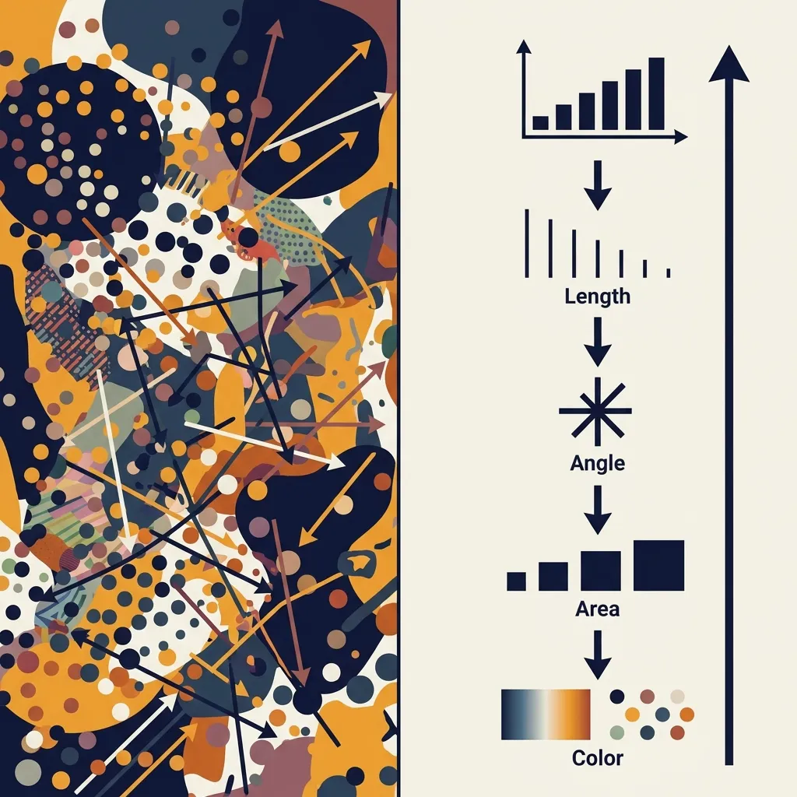
> *   **Layout**: Split
> *   **Scene**: 左侧展示一幅色彩绚丽但杂乱无章的抽象数据图，右侧展示一张清晰的视觉通道效力阶梯排行榜，以"共同基线的空间位置"为最高点，阶梯向下依次递减。
> *   **Text**: 视觉通道效力榜：位置的绝对王座

> [PHILOSOPHY]
> Tamara Munzner 教授在《可视化分析与设计》第七章（Arrange Tables）中确立了一条核心原则：**空间是最重要的视觉通道**。屏幕上 X 轴和 Y 轴的分辨率决定了受众的认知效率。这有限的分辨率就是我们的空间预算，每一个像素的使用都是无价的。请牢记这条贯穿本模块始终的原则。

这就是我们之前学过的**视觉通道效力排行榜**。不知道大家还记得吗？**共同基线的空间位置**位居榜首，其感知效率远远超过了长度、角度、面积和颜色。当你需要传达最核心的数据差异时，必须优先将其分配给空间通道。

> [VISUAL]
> *   **Slide**: S01c_Overdraw_Disaster
> *   **Asset**: 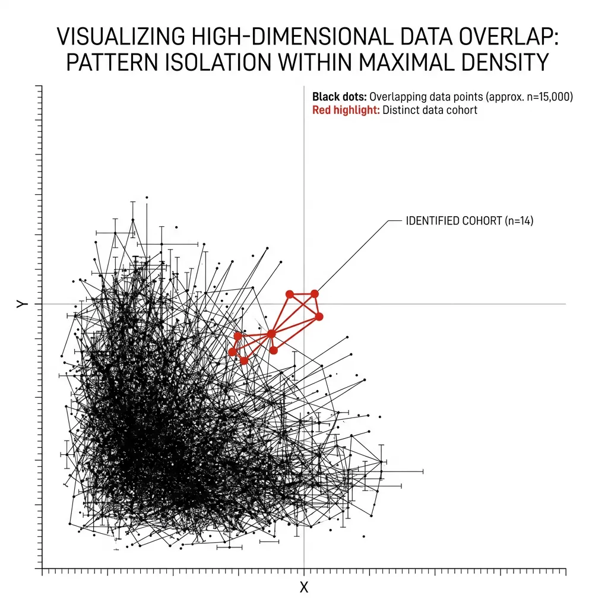
> *   **Layout**: `Center`
> *   **Scene**: 极度拥挤的可视化图表，无数的数据点堆积在一个狭小的角落，像被强行塞进电话亭的一千个人一样互相遮挡，一片漆黑的混乱灾难。
> *   **Text**: 空间破产：过度绘制 (Overdraw)

然而，空间是极致稀缺的通道。因为一块屏幕的物理像素容量是被锁死的。当数据紧挨在一起，发生严重的**过度绘制 (Overdraw)** 时，那将是一场认知灾难。黑压压的像素堆叠不仅是空间的拥挤，更是视觉的窒息，它会彻底掩盖数据本该诉说的真相。

为了掌控这片昂贵的领地，我们需要学习表格空间排布的四步核心语法。

### 1.2 四大动作构建表格的空间秩序

> [VISUAL]
> *   **Slide**: S02_Arrange_Tables_Overview
> *   **Layout**: `Center`
> *   **Scene**: 展示 Munzner 教授的经典图表 Figure 7.1。展示从 Express Values 到 Separate, Order, Align Regions 的完整演进路径。
> *   **Text**: 表格排布的四步核心语法
> *   **List**: Express（表达）/ Separate（分离）/ Order（排序）/ Align（对齐）
> *   **Asset**: 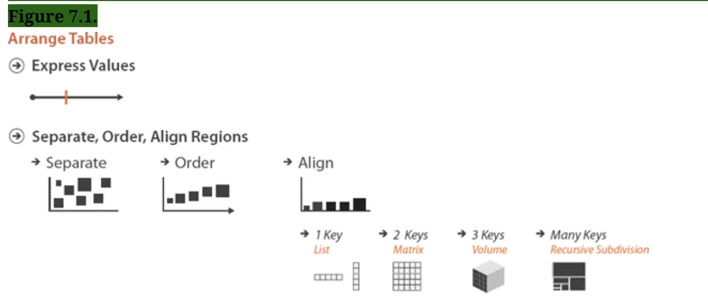

Munzner 教授提出了四个层次递进的动作：**Express（表达）**、**Separate（分离）**、**Order（排序）** 与 **Align（对齐）**。

> [VISUAL]
> *   **Slide**: S02_Express_Separate
> *   **Layout**: `Split`
> *   **Scene**: 采用等距拟物拆解风格。画面分为左右两部分：左侧展现“Express（表达）”，数据点像实体的小圆柱块，沿着一根纵轴（Y轴）高低排列，但水平方向上全部拥挤重叠在一起；右侧展现“Separate（分离）”，这根拥挤的柱子在水平方向（X轴）被强行拉开、分离成三个独立的专属领地，每个领地的底座上分别带有猫、狗、兔子的实物微缩模型图标，数据块在各自专属领地内清晰地上下排列。
> *   **Text**: 第一步与第二步：表达与分离
> *   **List**: 表达数值/ 分离类别
> *   **Asset**: 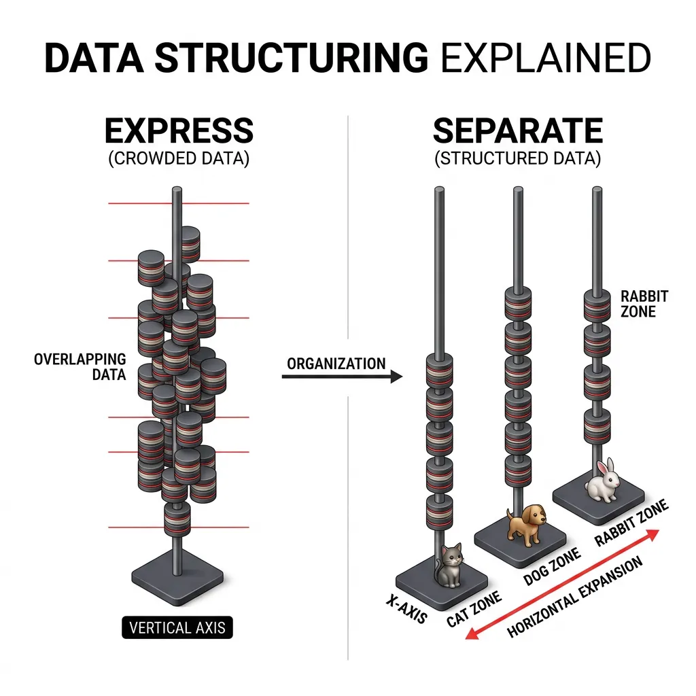

第一步是 **Express (表达)**。数据本身是冰冷、抽象的阿拉伯数字，而表达就是让我们作为视觉译者，将**量化数值 (Quantitative)** 用眼睛实时**翻译**成视觉上线段的长短，或者点的高低。

但是，假设我们要同时展现猫、狗、兔子三种动物的平均体重。如果单纯只在一根纵轴上“表达”数值，由于缺乏分类空间，这三种动物的数据点就会在同一条垂直线上黑压压地重叠在一起，根本分不清谁是谁。

这就需要运用第二个空间维度（横轴），执行 **Separate (分离)**。利用水平空间，硬生生为这些**类型学变量 (Categorical Variables)**（比如猫、狗、兔子）**劈开、分配**各自的专属领地，用空间把它们彻底区分开。这就像在拥挤的车厢里强行劈开过道，让混杂的数据有了各自独立的立足之地。

> [VISUAL]
> *   **Slide**: S02b_Order_Align
> *   **Asset**: 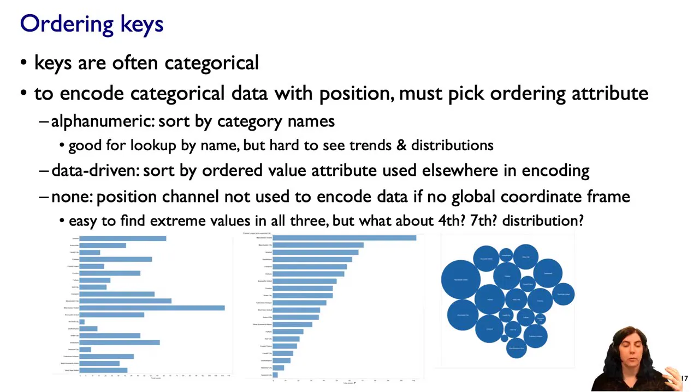
> *   **Layout**: Split
> *   **Scene**: 左侧是高低错落、参差不齐的三个圆柱；右侧则将它们按高度从低到高排列，并且底部严丝合缝地压在同一条水平轴上。
> *   **Text**: 第三步与第四步：排序与对齐
> *   **List**:  执行排序/ 建立基线

类别分离后往往是不连续的散沙，大脑被迫在不同对象间疲惫地**跳跃**对比。所以我们需要执行 **Order (排序)**。基于数值作降序排列，绝不仅仅是为了画面整齐，它是强行驱散混乱，让数据自然结晶出趋势。记住，趋势往往就是业务决策中最有价值的**洞察**。

最后，最具决定性的一步是 **Align (对齐)**。将所有参差不齐的对象，死死地**按压在同一条起跑线上**，让所有的对比变得一目了然、无可争辩。

组合表达、分离、排序和对齐，就构成了最基础的**柱状图**——一个维度表达数值，另一个维度分离类别。这是商业图表的地基。

> [VISUAL]
> *   **Slide**: S02b3_Floating_Bar
> *   **Asset**: 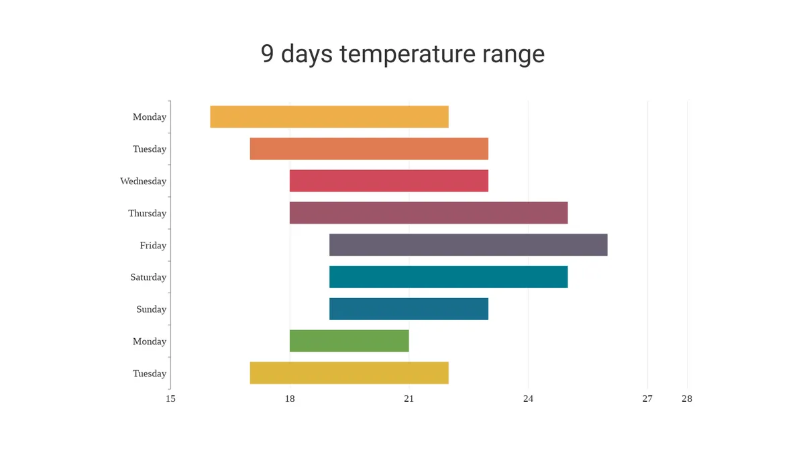
> *   **Layout**: `Center`
> *   **Scene**: 一张“9 days temperature range”的水平悬浮条形图。代表每天温差的彩色条形块在水平方向左右浮动，没有共同的起始边界。
> *   **Text**: 缺失基线的代价：认知负担倍增

好，让我们通过上方这张真实图表，来看看你是否掌握了这四个步骤的精髓：

> [ACTIVITY]
> *   **Type**: `Quiz`
> *   **Duration**: `3min`
> *   **Desc**: 空间四步语法：基于任务的对齐需求
> *   **Q**: 仔细观察上方这张“9天温度范围”的悬浮条形图。这张图本身设计并没有错，它很好地展示了每天气温的绝对起止区间。但是，假设高管现在的**核心分析需求**变成了：快速找出“哪一天的温差最大”以及“哪两天的温差跨度一样大”。在这个附加需求下，肉眼观察当前的浮动色块会觉得非常吃力。根据 Munzner 教授的空间四步语法，如果为了满足这个“比较长度”的新需求，我们需要对这个图表追加执行哪个关键步骤？
> *   **Options**: A. 追加执行 Express (表达)，为每个色块贴上具体的温差数值标签 | B. 追加执行 Separate (分离)，进一步拉大不同日期行之间的垂直间距 | C. 追加执行 Order (排序)，将日期强行按照温差大小进行重新排列 | D. 追加执行 Align (对齐)，将所有色块统一平移到左侧一个共同的起始基准线上
> *   **Answer**: `D`
> *   **Explain**: 可视化设计是目标导向的，悬浮条形图用于展示“绝对区间”非常合适。但当受众的任务目标变为**“高精度地比较跨度长度”**时，缺乏左侧对齐就会成为认知瓶颈。因为没有公共基线，大脑无法通过简单的“看右边缘位置”来比对大小，而被迫去心算每个色块的长度（右端点减去左端点）。只要追加执行 **Align (对齐)** 原则，让所有色块从同一起跑线开始，这种因相对位置产生的模糊感和计算负担就会瞬间消除。

### 1.3 折线的铁律：只为连续数据而生

> [VISUAL]
> *   **Slide**: S03c_False_Timeline
> *   **Asset**: 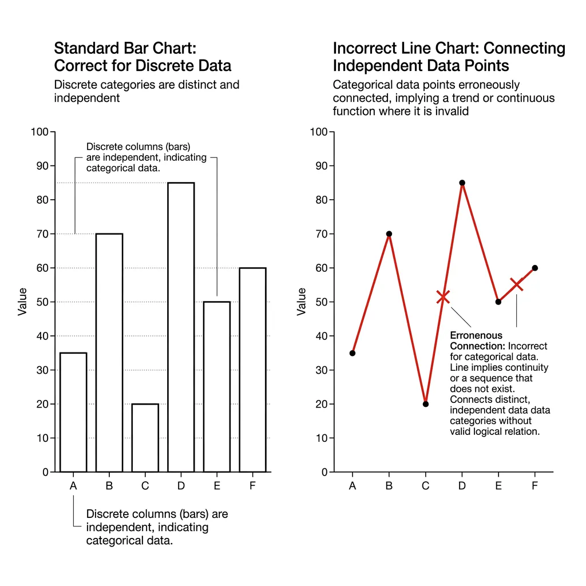
> *   **Layout**: Split
> *   **Scene**: 左侧展示正确的柱状图（横轴为离散分类，如A/B/C/D等独立类别）；右侧展示错误的折线图（将同样的离散分类用连续折线连接起来），并将错误的连线用醒目的瑞士红标出，形成强烈的正反对比。
> *   **Text**: 当折线连错了对象：连续趋势的误导

> [STORY TIME] 为什么不要乱连线？
> 
> 我们继续看单轴控制的柱状图。假设有些设计师觉得它太死板、太平庸了。于是他们把柱状图顶端的点连了起来，甚至去掉了柱子本身，把它改成了一张**折线图**。看起来帅气多了，起伏跌宕的，对吧？
> 
> 但是，如果你的横轴类别是美国、中国、俄罗斯、英国和法国呢？
> 
> 当观众看到一根从"中国"向下连接到"俄罗斯"的折线时，人们是不由自主会去解读这种斜率的："看啊，经历了从中国到俄罗斯的剧烈下滑！" 这句话何等荒谬！这两个国家之间并没有连续互变的中间态，它们是相互独立的离散个体。

> [VISUAL]
> *   **Slide**: S03d_Line_Implies_Trend
> *   **Asset**: 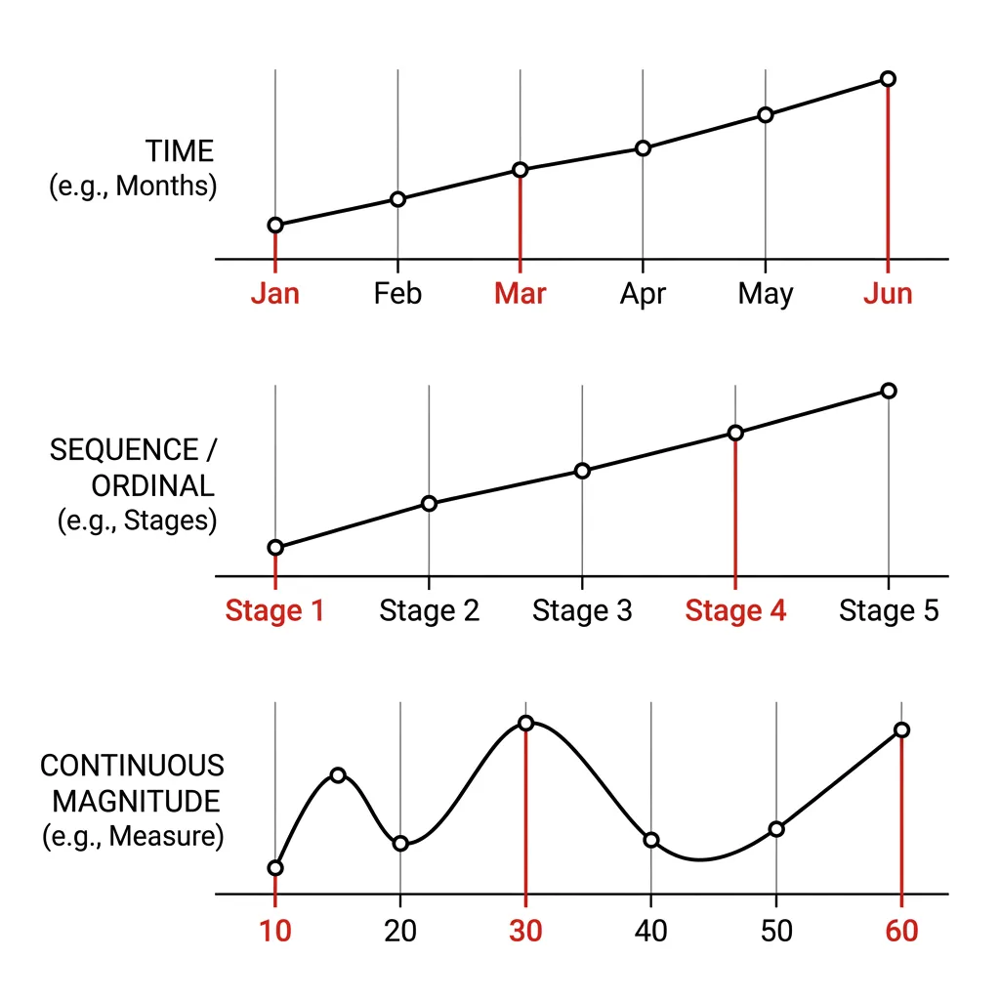
> *   **Layout**: `Center`
> *   **Scene**: 纵向排列展示三种允许使用折线图的合法横轴数据类型：1. 连续时间轴（Time, 例如月份）；2. 严格序列轴（Sequence, 例如阶段1到5）；3. 连续量化轴（Continuous Magnitude, 例如测量值大小）。通过这三种有内在顺序的坐标轴，说明折线代表的"连续过渡"在何处才是合理的。
> *   **Text**: 折线的合法使用域：时间、序列与连续大小
> *   **List**: 1.连续时间/2.严格序列/3.量化数值

铁律：**折线图，只能用于有内在连续顺序的坐标轴**。连接点与点的线段，在视觉上暗示"两者之间存在平滑过渡与趋势"。在“纯离散”的类别上（即彼此完全独立、没有中间过渡状态的事物，例如不同的国家名称、公司品牌等）画折线图，就是在用伪造的视觉假象欺骗观众的大脑。

折线的正确应用场景是时序数据（**Temporal Data**）——时间自带严格的先后顺序和无限的连续性。针对时间维度的特殊性，Munzner 提出了三种进阶编码策略：

> [VISUAL]
> *   **Slide**: S04_NonLinear_TimeScale
> *   **Layout**: `Full`
> *   **Asset**: 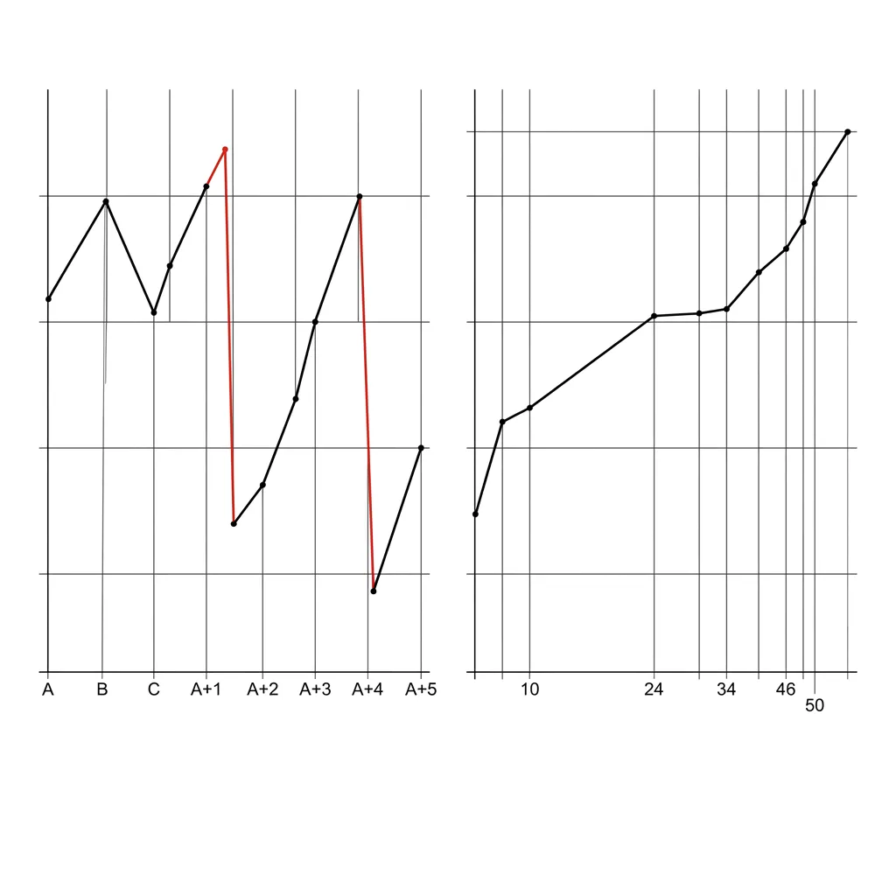
> *   **Scene**: 左侧为等距时间轴，中间缺失年份导致线条断崖式下跌；右侧使用非线性解析比例尺，横轴根据实际日历天数拉长，呈现真实的平缓趋势。
> *   **Text**: 策略一：弹性与非线性时间轴

1. **非线性时间比例尺 (Non-linear Time Scale)**：如果记录在某几个年份断档，等距坐标轴会强行拉扯空间，制造错误波动的假象。解法是让日历天数真实地决定像素占据长度——打破死板的均分网格，让时间轴像橡皮筋一样伸缩。

> [VISUAL]
> *   **Slide**: S04b_Horizon_Chart
> *   **Layout**: `Center`
> *   **Asset**: 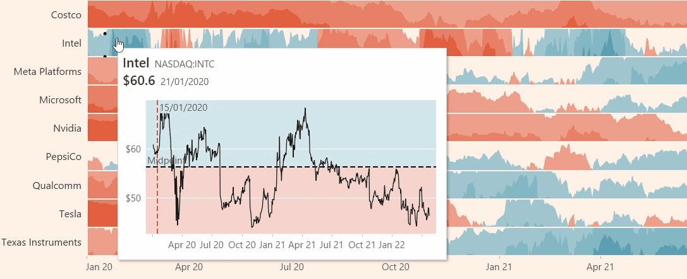
> *   **Scene**: 一张科技股经典地平线图（Horizon Chart）的动态交互演示。图表将波峰水平切开并像手风琴一样向下折叠，用深浅不同的红蓝色块来代表高度的极值变化。**动图展示了鼠标悬停时（Tooltip）如何精准读取数据，向学生证明：即使极其震撼地压缩了垂直空间，依然能借助交互随时检索所有的波动细节。**
> *   **Text**: 策略二：地平线图 (Horizon Chart)

2. **地平线图 (Horizon Chart)**：当几十条股票折线互相遮挡时，地平线图把过高的波峰水平切开，像手风琴一样向下折叠重合。红蓝两色区分涨跌，颜色深浅代表极端程度。在极狭窄的垂直空间内保留全部波动细节，**且结合交互悬停，每一处极值依然精准可查**。

> [VISUAL]
> *   **Slide**: S04c_Connected_Scatterplot
> *   **Layout**: `Full`
> *   **Asset**: 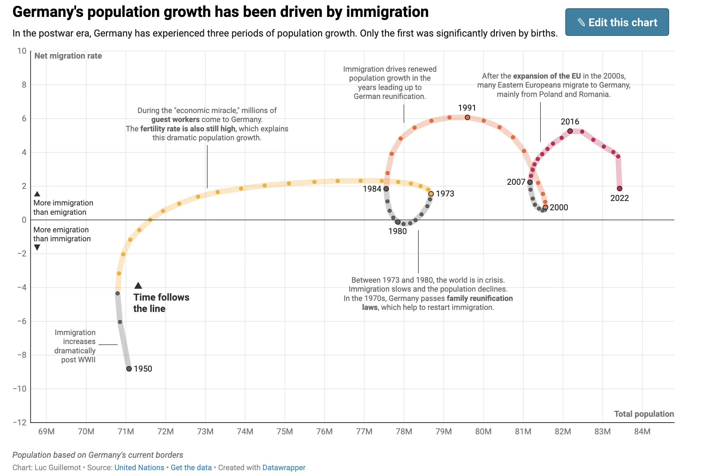
> *   **Scene**: Datawrapper 发布的德国人口增长连线散点图。横轴是“总人口”，纵轴是“净移民率”。图中的数据点按年份（1950-2022）依次串联。最引人注目的是，线条在 1970年代和 2000年代的危机时期，在空间中画出了两个巨大的灰色“回环（Loops）”。
> *   **Text**: 策略三：连线散点图 (Connected Scatterplot)

3. **连线散点图 (Connected Scatterplot)**：让时间降格为连线的"幽灵导演"，把二维坐标系变成展示事物发展状态的**“相位图”**。
大屏幕上是德国 1950-2022 年的“总人口”与“净移民率”。如果你用普通的双折线图，你只会看到两条高低起伏的线。但在连线散点图里，你一眼就能看到图上出现了两个巨大的**“回环（Loops）”**。
这正是它的终极洞察：时间永远在向前流逝，不可能倒退；所以当线条在坐标系中画出“回头弯”甚至“绕圈”时，它生动地证明了**系统经历了一次重大危机**（例如图中的 1973 年全球经济危机），导致两个核心指标同时“开倒车”，并在几年后才艰难地重新找回增长轨迹。时间没有倒流，是历史的发展状态倒退了。

这三种进阶的时间阵型，是区分初级画表工和高级可视化分析师的试金石。

> [ACTIVITY]
> *   **Type**: `Quiz`
> *   **Duration**: `2min`
> *   **Desc**: 知识点查漏：折线的滥用与视觉暗示
> *   **Q**: 字节跳动的数据实习生小林需要制作一张横向对比国内四大互联网公司（腾讯、阿里、字节、百度）2023年总营收的图表。为了让图表看起来更有"跌宕起伏的设计感"，她抛弃了传统的柱状图，把四家公司的营收数值用一条连续的折线串联了起来。根据空间通道的设计铁律，她的做法为何会引发业务负责人的严厉批评？
> *   **Options**: A. 因为折线图的空间利用率极低，无法像热力矩阵（Matrix Alignment）那样展示多维高密度信息 | B. 四家公司是互相独立的离散型类别，强行连线会给观众植入"平滑过渡与演变趋势"的虚假视觉暗示 | C. 没有对四家公司的营收数据进行预先排序（Order），导致折线图的斜率不够陡峭，无法凸显差距 | D. 因为折线图无法在此处使用非线性的时间解析比例尺，从而扭曲了各个公司营收的真实差距
> *   **Answer**: `B`
> *   **Explain**: 此题考查折线通道的视觉铁律——折线的线条天然带有"平滑过渡与连续演变"的强烈物理隐喻。互联网公司名称属于互相独立的离散分类变量（Categorical Variables），两者之间并不存在时序推移或过渡状态（腾讯不可能"平滑过渡"成阿里）。强行连线等于用错误的通道欺骗受众大脑，制造虚假的趋势感（B 对）。A 错在单维营收对比并不适用热力矩阵；C 错在即使进行了数值排序，离散类别也绝对不能连线；D 错在横向的对比基准根本不是时间序列，无从谈起时间比例尺。

### 1.4 极坐标陷阱：饼图为何摧毁感知精度

> [VISUAL]
> *   **Slide**: S03_Quote_Tufte
> *   **Layout**: `Center`
> *   **Scene**: 纯文字排版。深色背景上，以优雅的现代排版展示统计图形先驱 Edward Tufte 的名言，背景带有巨大的引号水印作为修饰。
> *   **Text**: "唯一比一个饼图更糟糕的，是两个饼图。" —— Edward Tufte

除了直角坐标系的方正布局（**Rectilinear**），另一种选择是引入极坐标角度（**Angle**）和半径（**Radius**）的径向布局（Radial Layout），典型代表是饼图。

饼图致命的弱点在于，它放弃了最高精度的"基于共同基线的长度比对"，转而启用了低效的**角度通道**和**面积通道**。

> [VISUAL]
> *   **Slide**: S03e_Angle_Blindness
> *   **Asset**: 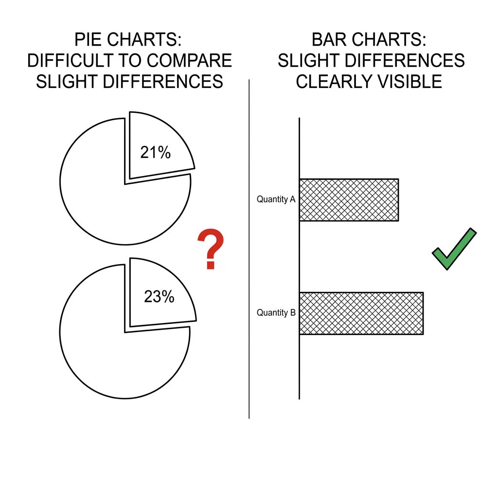
> *   **Layout**: `Split`
> *   **Scene**: 遵循建构主义的对比设计。左侧展示两块非常接近的无标签披萨切片（如 21% 和 23%），打着红色问号；右侧展示同样数据转化成的两根水平条形图，长度高下立判，打着绿色勾号。
> *   **Text**: 角度盲区 vs 长度敏锐

人眼对角度的微小差异极其迟钝。21% 和 23% 的切片分布在饼图对角，脱离标签你根本不敢断言谁大谁小。但同样的数值换成**水平条形图 (Horizontal Bar Chart)**，极微小的长度差异也能被瞬间看穿。

> [VISUAL]
> *   **Slide**: S03e2_Pie_Chart_Tradeoff
> *   **Asset**: 
> *   **Layout**: `Split`
> *   **Scene**: 画面呈现清晰的正反对比。左侧展示一个只有3个大面积切片的极简饼图，外围环绕发光圆环体现“100%整体”，并悬浮着巨大的绿色勾号（Green Checkmark）；右侧展示一个被切碎成十几个密密麻麻微小切片的极度复杂饼图，并悬浮着巨大的红色叉号（Red Cross）。
> *   **Text**: 饼图的唯一合法生存空间
> *   **List**: 整体隐喻与合法 (切片数 ≤ 5) / 认知过载与失效 (切片数 > 5)

> [PHILOSOPHY]
> **极坐标体系 (Polar Coordinates)** 并非一无是处。它最大的价值在于一个完整的圆天然带有一种强大的视觉直觉——**“100% 的整体隐喻”**。
> 但这是一种以牺牲“比较精度”为代价的极限权衡。因为人眼对角度差异极度迟钝，所以**绝对不能用饼图去比较大小**。在严谨的数据分析中，饼图只有唯一合法的生存空间：为了表达切片极少（≤5）的**严格整体绝对占比**。一旦切片过多，其精度缺陷就会彻底压垮受众认知，此时必须把空间让给基于共同基线的条形图。

> [VISUAL]
> *   **Slide**: S03e_3D_Pie_Distortion
> *   **Asset**: 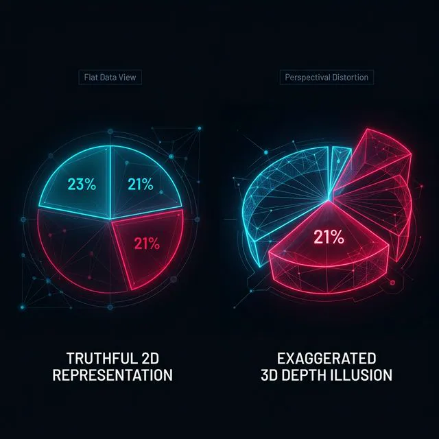
> *   **Layout**: `Center`
> *   **Scene**: 两张饼图的对比：一张是平面的 21% 和 23% 切片，另一张是被加上严重 3D 纵深透视后，前方 21% 切片看起来比后方 23% 切片大了一倍的夸张错觉图。
> *   **Text**: 3D 透视形变：视觉诈骗的温床

在"3D 饼图"中强加 Z 轴深度透视，会使前方倾斜的切面异常膨胀，造成**严重扭曲面积占比**的视觉诈骗。

> [VISUAL]
> *   **Slide**: S03e_Jobs_3D_Pie_Chart
> *   **Asset**: 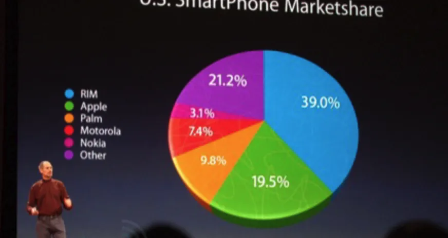
> *   **Layout**: `Center`
> *   **Scene**: 还原 2008 年 Macworld 经典的 3D 饼图：一个严重向后倾斜的三维饼图，前方绿色的 19.5% 苹果切片由于透视关系显得非常巨大，而位于侧后方的 21.2% 黑莓切片则被压缩得看起来小得多。
> *   **Text**: 经典的"视觉欺骗"：19.5% > 21.2%

> [STORY TIME] 乔布斯的"现实扭曲力场"与 3D 饼图
> 
> 2008 年的 Macworld 大会上，乔布斯展示了一张美国智能手机市场份额的 3D 饼图：数据上苹果是 19.5%，而黑莓是 21.2%。
> 
> 但由于 3D 饼图夸张的倾斜透视，放在正前方的苹果切片在视觉面积上，看起来竟比后方的黑莓还要庞大得多！
> 
> 这种利用三维透视形变人为放大自身优势的排布方式，完全粉碎了客观比较的原则，成为了滥用 3D 饼图制造视觉欺骗的经典反面教材。

> [ACTIVITY]
> *   **Type**: `Quiz`
> *   **Duration**: `2min`
> *   **Desc**: 视觉通道感知精度与极坐标陷阱
> *   **Q**: 某新能源汽车的市场总监准备在发布会上展示自家新车型 Q1 季度市占率（23%）对核心竞品（21%）的微弱超越。为了让媒体瞬间看清这 2% 的确切优势，且不违背客观数据的呈现伦理，他应选择哪种空间排布策略？
> *   **Options**: A. 采用共同基线的水平条形图（Horizontal Bar Chart），将两个品牌的数据上下平行并列 | B. 制作一张 3D 饼图，并将自家 23% 的切片旋转放置到正前方以放大视觉面积 | C. 采用热力矩阵（Heatmap），用两种对比强烈的极值颜色来填充代表两个品牌的小方块 | D. 绘制一张极坐标下的平面饼图，利用圆形的天然优势来表达百分比份额
> *   **Answer**: `A`
> *   **Explain**: 题干要求"瞬间看清 2% 微弱差异"且"不违背客观伦理"。如同本节"角度盲区 vs 长度敏锐"所述，只有基于共同基线的水平条形图（A 选项）能提供最高精度的长度对比。B 选项错在使用 3D 透视形变制造视觉欺骗（如乔布斯的经典反例），违反数据伦理；D 选项的极坐标平面饼图依赖低效的角度通道，人眼极难精准分辨 21% 和 23% 的角度差距；C 选项的热力图用颜色代替空间长度，适合极高密度的数据宏观聚类，但无法用于高精度的微观量值比对。

### 1.5 矩阵排布：打破单轴空间的瓶颈

> [VISUAL]
> *   **Slide**: S02b2_Cartesian_Coordinates
> *   **Asset**: 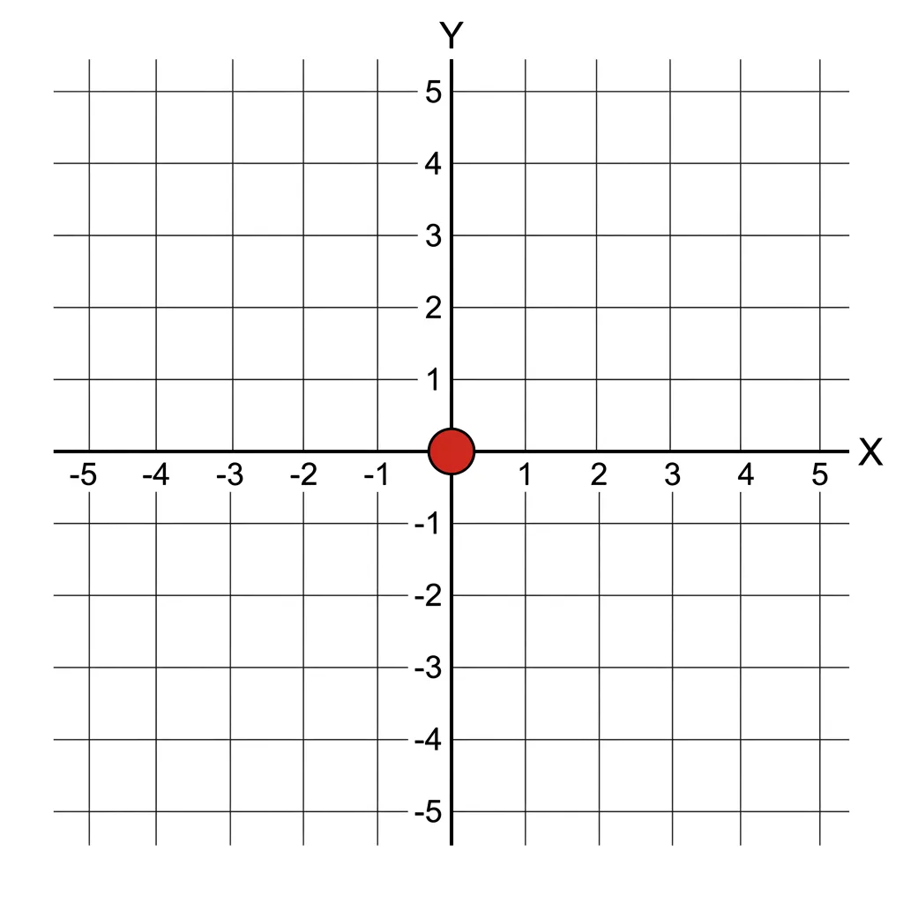
> *   **Layout**: `Center`
> *   **Scene**: 一个严谨清晰的二维直角坐标系（Cartesian Coordinates），由水平的 X 轴和垂直的 Y 轴构成，网格线分明，原点引出两条射线，象征着数据排布的绝对秩序基础。
> *   **Text**: 空间秩序的基石：直角坐标系

掌握了单轴排布的四步语法和两个常见误区之后，让我们回到空间效率的正面战场。前面的柱状图和折线图都属于 **列表对齐 (List Alignment)**——只用一个分类属性切割唯一的轴。清晰，但低效。

> [VISUAL]
> *   **Slide**: S02c_Axis_Orientation
> *   **Asset**: 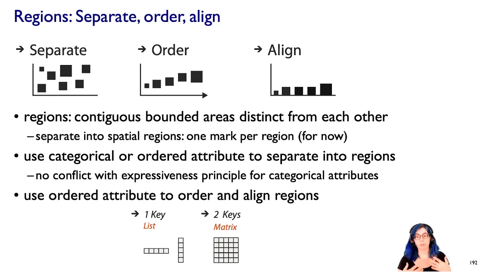
> *   **Layout**: Split
> *   **Scene**: 左侧是一个长出屏幕外的垂直向下排列的商品列表图；右侧是将其改写为含有多列、两轴协同工作的矩阵型分布。
> *   **Text**: List vs Matrix：维度战役的进阶
> *   **List**: 列表排布/矩阵排布

如果你同时拥有两个甚至更多的分类变量呢？比如想同时看"地区"和"产品线"下的销售情况。Munzner 给出了第二种武器——**矩阵对齐 (Matrix Alignment)**，从一维单行道升级成二维网格十字路口。

> [VISUAL]
> *   **Slide**: S03b1_Heatmap_Time
> *   **Asset**: 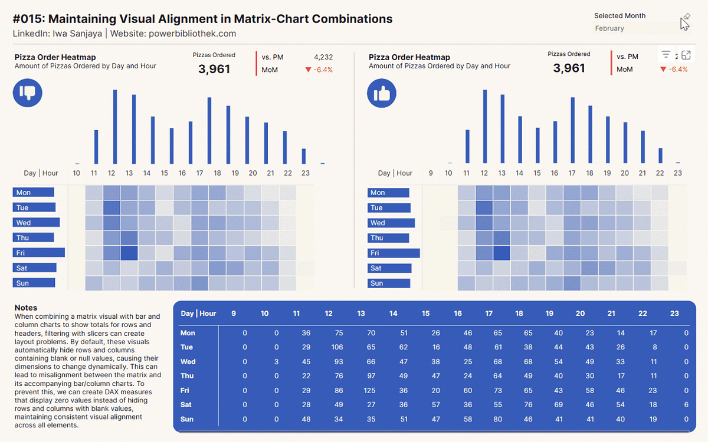
> *   **Layout**: Center
> *   **Scene**: 展示一张关于时间维度的热力图（如一周 7 天与 24 小时的交叉矩阵），用颜色深浅表达不同时段的数据密度。
> *   **Text**: 矩阵排布：时间热力图

把两个分类变量分别映射到矩阵的行和列，在交叉单元格里用颜色深浅表达数值，就是 **热力图 (Heatmap)**。它用**颜色通道**替代**空间长度**，省下宝贵的空间预算，将数据展示密度推到极致。电商分析师常用它观察"一周 7 天 × 一天 24 小时"的交叉矩阵，寻找下单高峰。

> [VISUAL]
> *   **Slide**: S03b_Matrix_Alignment
> *   **Asset**: 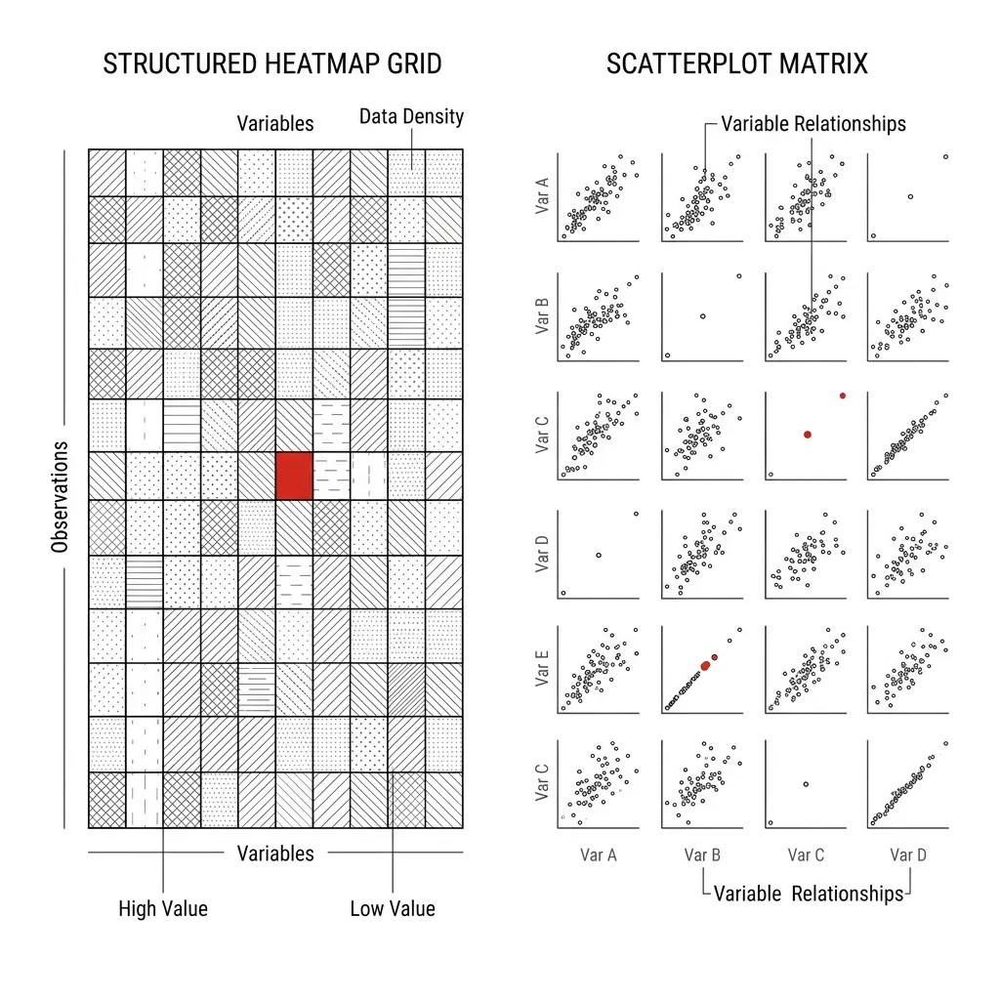
> *   **Layout**: Split
> *   **Scene**: 左侧是一张电商用户留存率的热力图；右侧是一个经典的散点图矩阵 (Scatterplot Matrix)。
> *   **Text**: 矩阵排布：将展示密度推向极致
> *   **List**: 热力图表/散点矩阵

当数据里有十几个量化维度时，矩阵里的每个单元格可以是一张完整的二维散点图——**散点图矩阵 (SPLOM, Scatterplot Matrix)**。对角线对称的网格中，正相关趋势和异常离散点全部尽收眼底，这是在多变量数据集中寻找相关性的最快途径。

### 1.6 空间折叠：突破二维画布的极限

> [VISUAL]
> *   **Slide**: S05_Facet_Small_Multiples
> *   **Asset**: 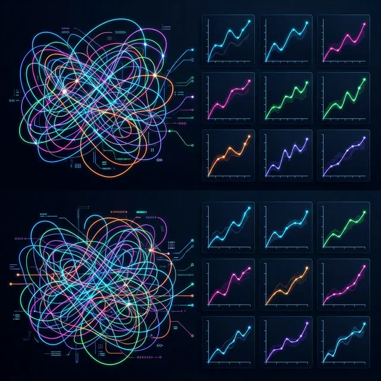
> *   **Layout**: `Split`
> *   **Scene**: 左侧是一张五颜六色的、各种线条纠缠在一起的"面条图"(Spaghetti Chart)。右侧则是将这些杂乱的线条，分别安放在十二个排列整齐的、坐标轴完全一致的微型小折线图中。
> *   **Text**: 分面 (Facet)：小多图阵列

想象一下，客户要求你在同一张图表里，同时对比美国 50 个州过去十年的失业率趋势。
如果你试图将 50 条折线强行塞进同一个直角坐标系中，结果会怎样？
大屏幕上会出现左侧这种令人窒息的 **面条图 (Spaghetti Chart)**。50 根色彩斑斓的线条互相绞杀、遮挡，你根本无法追踪任何一个独立个体的波动轨迹。大量对象同框造成的 **过度绘制 (Overdraw)**，让二维画布的容量达到了物理极限。

面对这种极度拥挤的视觉灾难，Munzner 指出了两种“空间折叠”的高阶策略：

第一种是 **分面 (Facet)**，即 **小多图阵列 (Small Multiples)**——给每个数据子集分配独立的平行宇宙。就像大屏幕右侧展示的那样，把面条图拆解开，将其分别置于多个微型坐标系中。只要保证所有子图的量程**完全一致**，再按网格整齐排列，受众就能通过眼球的快速扫视，瞬间捕捉到波动模式异常的个体。

> [VISUAL]
> *   **Slide**: S06_Superimpose_Layers
> *   **Asset**: 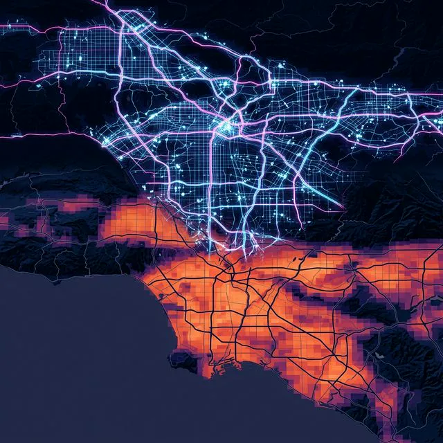
> *   **Layout**: `Grid`
> *   **Scene**: 以一张地形图为底层，上面叠加一层温度的热力网格，最表层再叠加一层代表城市犯罪案件密集分布的红色散点。
> *   **Text**: 原位重叠 (Superimpose)
> *   **List**: 地理底图/气温色块/犯罪散点

第二种是 **原位重叠 (Superimpose)**——在同一个坐标系内像三明治一样**堆叠多个透明图层**。这在**地理信息系统 (GIS)** 中最为普遍：底层铺设国家地理底图；叠加表示气温的**分组色块层 (Choropleth Map)**（给每个行政区贴上不同深浅的半透明色膜）；最上层盖上代表犯罪数量的红色数据散点层。三个图层共享同一经纬度坐标系，引导受众寻找不同维度间的**空间关联**。

> [VISUAL]
> *   **Slide**: S06b_Spatial_Concerto
> *   **Asset**: 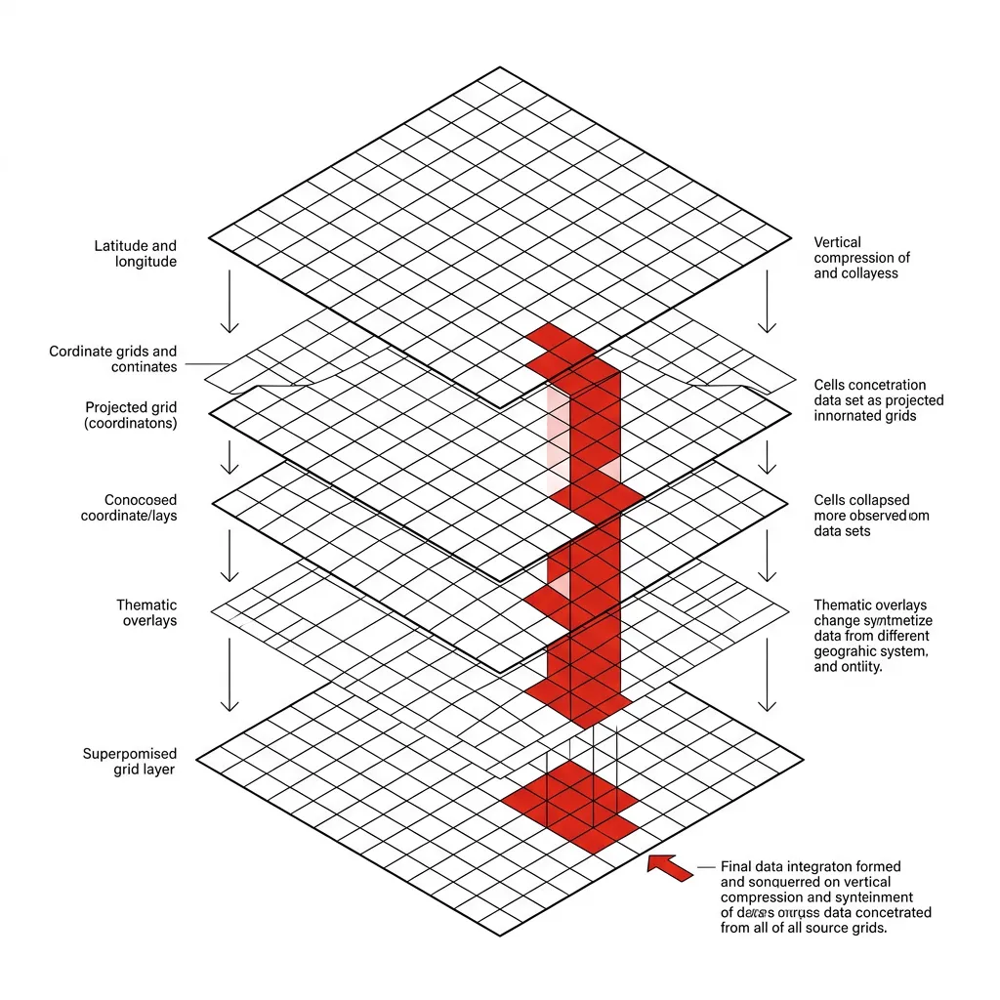
> *   **Layout**: `Center`
> *   **Scene**: 多个带有不同发光颜色与材质的地理网格图层，正在三维空间中被垂直压合在一起的震撼过程。
> *   **Text**: 空间预算原则

> [TEACHING MOMENT] 空间预算原则
> 无论分面还是重叠，核心都在应对有限的空间资源。切勿将像素浪费在装饰边框或伪 3D 效果上——将每一个像素精准分配给核心数据排布，是可视化的底层原则。

> [ACTIVITY]
> *   **Type**: `Quiz`
> *   **Duration**: `3min`
> *   **Desc**: 空间折叠策略辨析
> *   **Q**: 某新能源车企需要展示 2024 年全国各省"充电桩分布密度"与"纯电车事故发生率"的地理分布关系。分析师最初将两组数据分别做成了两张并排的全国地图（分面 Facet），但管理层在两图之间来回比对非常吃力。为了让管理层瞬间判断"充电桩密集的省份，事故率是否也高"，应改用哪种空间排布策略？
> *   **Options**: A. 散点图矩阵 (SPLOM)，将所有省份的数据点放在对角线网格中 | B. 原位重叠 (Superimpose)，在同一张底图上叠加充电桩密度色块层与事故红点层 | C. 列表排布 (List Alignment)，用柱状图将省份按照事故率降序排列 | D. 非线性时间比例尺，将两张地图按时间轴堆叠
> *   **Answer**: `B`
> *   **Explain**: 题干核心痛点是"来回比对吃力"，这正是分面 (Facet) 策略在处理强空间相关性时的劣势。当需要引导受众寻找"不同维度间基于同一坐标系（经纬度）的关联"时，原位重叠 (Superimpose) 是最佳策略。通过共享同一张地图，叠加密度与散点两层，受众能直接在原位观察变量共现，消除了目光跳转的记忆成本。

至此，空间排布的语法已介绍完毕。接下来，我们将视角转向实现这些理论的工程框架，对比两种截然不同的兵器：一种主打配置便利，另一种则提供对底层秩序的绝对掌控。

> [ACTIVITY]
> *   **Type**: `Practice`
> *   **Duration**: `40min`
> *   **Desc**: **空间排布的逆向工程**。
>   讲师快速闪现 5 张图表（如普通的趋势线、堆叠柱状图、气泡散点图、基因热力图）。
>   要求学员大声喊出该图表对应的底层排布核心逻辑组合（如："这是 List Alignment + Length Encoding"，或"这是 Matrix Alignment + Color Diverging"）。通过极速抢答，将空间排布的潜意识固化。然后让学员在纸上画出现成图表的数据长表形态。
