## 模块 2: D3 概念词典与数据绑定 (60 分钟)
<!-- BUDGET: 3200 chars | SLIDES: ≥5 | STATUS: done -->

### 2.1 两种设计哲学的分水岭

> [VISUAL]
> *   **Slide**: S06c_Declarative_vs_Imperative
> *   **Asset**: 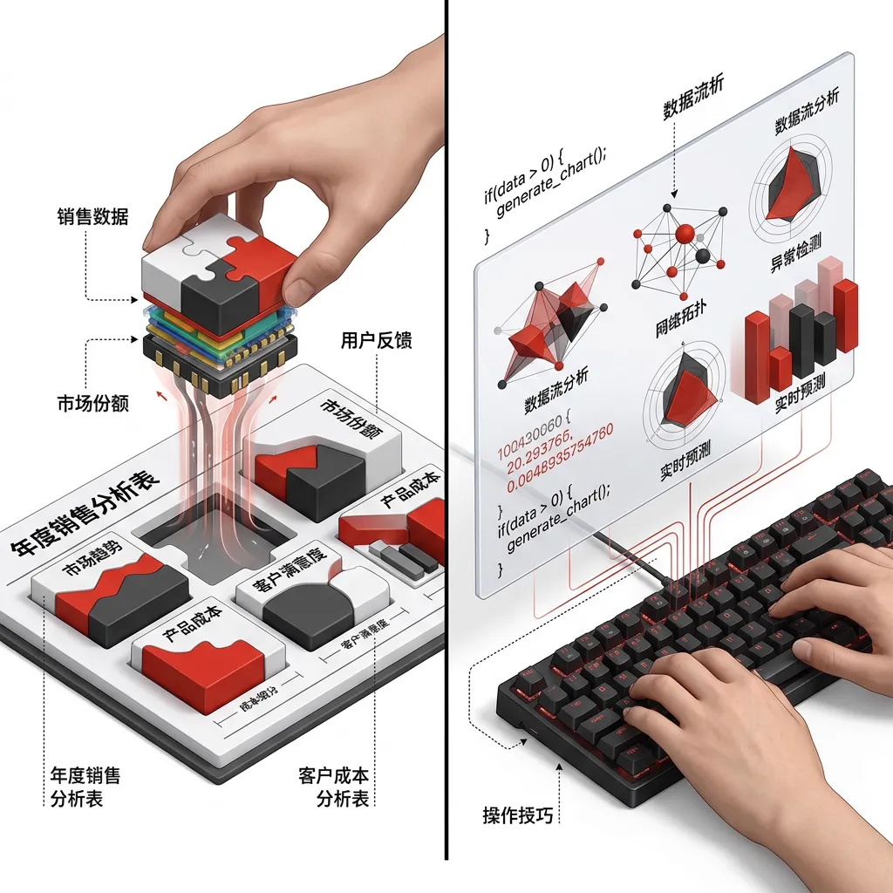
> *   **Layout**: `Split`
> *   **Scene**: 左侧是一只手将带有数据字段标签的积木块拖拽嵌入到预设图表模板的插槽中；右侧是一只手正在敲击键盘编写代码指令，随着代码输入，屏幕上动态生成由基础几何图形拼接而成的复杂数据图形。
> *   **Text**: 声明式与指令式：两种设计哲学的分水岭
> *   **List**: 声明式(What)/ 指令式(How)

在上一个模块中，我们学会了如何用空间排布的四步语法安排数据的视觉位置。现在的问题变成了：**用什么工具来实现这些排布？**

在当今的 Web 可视化生态中，存在两种截然不同的设计哲学——**声明式 (Declarative)** 与**指令式 (Imperative)**。还记得第一周我们用过的 **RAWGraphs** 吗？你只需要拖拽数据字段到"X 轴"和"颜色"的插槽里，图表就自动生成了。你完全不需要关心底层如何计算坐标、如何渲染像素——你只定义了**"我要什么"(What)**，工具帮你搞定**"怎么画"(How)**。这就是声明式范式的精髓。

> [TECH NOTE] 🧊 声明式的本质
> 声明式编程 (Declarative Paradigm) 的本质，是将**"What（我要什么）"**与**"How（怎么画）"**彻底解耦。就像你去高级餐厅，只需要告诉服务员"我要一份七分熟的牛排"（定义最终状态 What），而不需要跑到后厨手把手教厨师先热锅再撒盐（过程运算 How）。

> [VISUAL]
> *   **Slide**: S06d_Menu_vs_Kitchen
> *   **Asset**: 
> *   **Layout**: `Split`
> *   **Scene**: 左侧是一位顾客坐在高级餐厅里看着精美的菜单点菜（声明式）；右侧是戴着高帽的厨师在热火朝天的后厨亲自掌控火候、翻炒菜肴（指令式）。
> *   **Text**: 声明式如点菜，指令式如亲自下厨
> *   **List**: 声明式(点菜单)/ 指令式(进后厨)

然而，如果你立志成为顶尖的视觉叙事者，迟早会撞上声明式工具的**预设天花板**。当你需要的图表在菜单上根本不存在——比如让数据点像水滴一样受重力汇聚再炸裂——"点菜式"模式就彻底束手无策了。此时，你需要亲自走进厨房，接管**从数据到屏幕像素的每一层映射逻辑**。这就是 **D3.js** 的指令式世界——今天这个模块的主角。


### 2.1.5 急救包：HTML 的图层结构

> [VISUAL]
> *   **Slide**: S07a_DOM_Anatomy
> *   **Asset**: 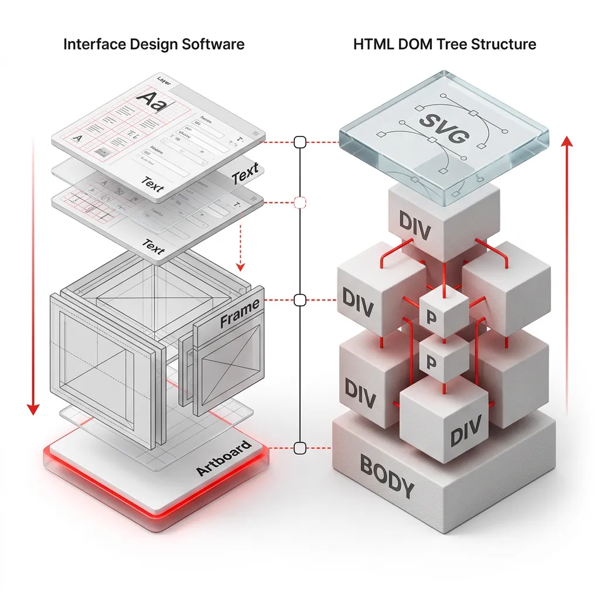
> *   **Layout**: `Split`
> *   **Scene**: 左侧是一个等距视角的界面设计软件模型，层叠的立体图层面板中展示了 Artboard、Frame 和 Text 等级结构；右侧是一棵具有实体空间感的 HTML DOM 树结构模型，`<body>` 作为底层厚重的基座，上面嵌套着带有标签的立体方块 `<div>`、`<p>` 和一块透明的玻璃材质 `<svg>` 画布区块。两者形成映射比对关系。
> *   **Text**: 网页的解剖学：HTML 就是代码版的图层面板
> *   **List**: Figma 图层/ HTML 标签/ DOM 树

在正式握住 D3 这把手术刀前，我们要先了解被解剖的“病人”——**网页的结构**。许多同学因为没有网页开发经验，在生成代码时完全不知道 AI 在说什么。
请记住这个最简单的类比：**网页代码里的 HTML，就是你在设计软件里用的图层面板**。

- **`<body>`**：相当于 Figma 里的顶级画布（Artboard），所有看得见的内容都在里面。
- **`<div>`**：相当于一个空白的 Frame，用来把其他元素打组装起来。
- **`<h1>` 到 `<h6>`**：相当于设计系统（Design System）中预设的各级文字样式（Text Styles），定义了从大标题到小标题的文字层级。
- **`<p>`** 和 **`<span>`**：相当于普通的文本图层（Text），专门用来放正文或片段文字。
- **`<svg>`**：这是一个超级特殊的透明画布（后文会详述），所有 D3 的形状都在这上面画。

在代码世界里，这种层层嵌套的图层结构，叫做 **DOM 树 (Document Object Model)**。要用 D3 画图，本质上就是写代码**在这些“图层”里塞入数据，然后改变它们的颜色和长宽**。如果你不知道页面上有什么“图层”，AI 给你写的代码你就无从下手去改。

### 2.1.6 急救包：设计与逻辑 (CSS & JS)

> [TEACHING MOMENT] 消除代码恐惧
> 许多同学看着 AI 生成的黑压压的代码会感到恐惧。其实，抛开复杂的逻辑，网页编程的基础元素极其简单。如果你会用 Figma，你就能理解它们。

> [VISUAL]
> *   **Slide**: S07a1_Web_Triad
> *   **Asset**: 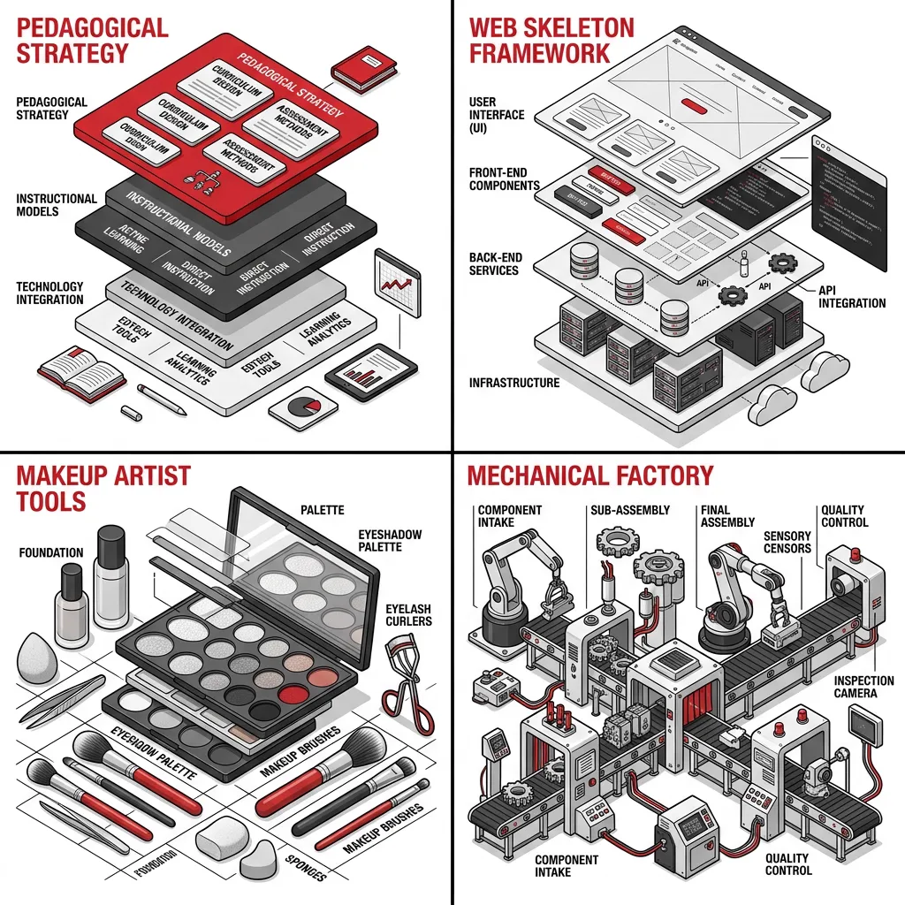
> *   **Layout**: `Grid`
> *   **Scene**: 极简几何风格的三组图标并排显示。左侧是一个简单的线框骨架（代表 HTML）；中间是一套精美的画笔和调色板，或者类似 Figma 的属性面板图标（代表 CSS）；右侧是一条正在运转的精密齿轮和传送带构成的微型流水线（代表 JavaScript）。
> *   **Text**: 网页三剑客：骨架、化妆师与流水线
> *   **List**: HTML(骨架)/ CSS(化妆师)/ JS(流水线)
> *   **Keywords**: web metaphor, skeleton, makeup artist, factory assembly line, HTML, CSS, JS

**HTML (标签语言)** 只是骨架，一个现代网页还需要 **样式** 和 **动能** 。在这里，我们用最简单的方式为你扫清后续学习的障碍：

**CSS (样式语言) = 网页的化妆师**：相当于 Figma 右侧的**属性面板**（Fill, Stroke, Corner Radius）。用 CSS 规则定义元素的颜色、间距。在后续代码中，当你看到 `.style("color", "red")` 时，它就是在调用这位化妆师。
**JavaScript (脚本语言) = 网页的加工流水线**：如果说 HTML 和 CSS 搭建了静止的舞台，那么 JS 就是让一切运转起来的工厂引擎。D3 魔法就是建立在 JS 之上的。在阅读 JS 代码时，你会频繁遇到这条流水线上的两个核心概念：

> [VISUAL]
> *   **Slide**: S07a1_JS_Core
> *   **Asset**: 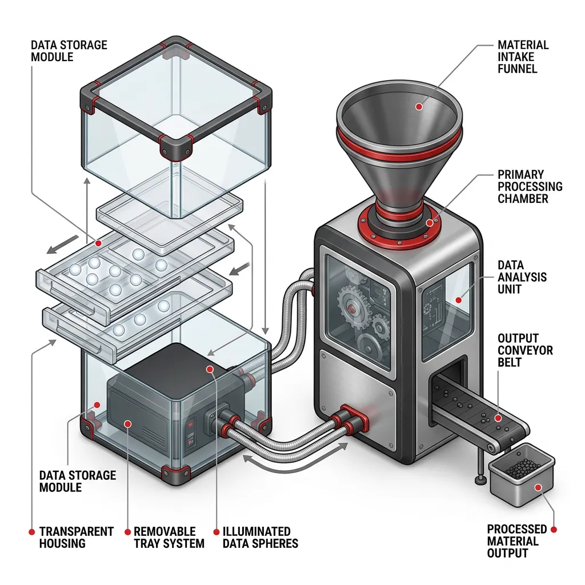
> *   **Layout**: `Split`
> *   **Scene**: 极简几何风格的插图。左侧是几个带有发光标签的透明收纳盒，里面装着发光的数据球；右侧是一台具有未来感的极简加工机器，顶部有一个漏斗吃进原料，右侧的出口吐出成品，机器侧面印着 `d => d`。
> *   **Text**: JS 核心引擎：收纳盒与加工机器
> *   **List**: 变量(收纳盒)/ 函数(加工机器)
> *   **Keywords**: storage box, variables, processing machine, function, d3.js, data pipeline
**变量 (Variables) = 装数据的收纳盒**：在代码里，你会看到 `var` 或 `let`，它们就像是贴了标签的收纳盒。里面可以装数字 (`Number`，如 10)、文本 (`String`，如 "Hello"，必须带引号)、或者一列数据的列表 (`Array`，如 `[5, 10, 15]`，用方括号括起来)。D3 画图，本质上就是处理这些装着数组的收纳盒。
**函数 (Function) = 具体的加工机器**：函数是一台机器，吃进去原料，吐出成品。特别注意在 D3 中随处可见的**箭头函数 (Arrow Function)** 形式 `d => d`。这其实是现代代码为了少打几个字发明的“极简版机器”，箭头左边是吃进去的数据，右边是吐出的结果。

> [VISUAL]
> *   **Slide**: S07a1_Console_Lab
> *   **Layout**: `Code`
> *   **Text**: Console 魔法三部曲

```javascript
// 实践任务：呼唤内置变量
document.body.style.background = "black";

// 实践任务：制造收纳盒与加工机器
let box = 10;
let machine = d => d * 2;
machine(box);

// 实践任务：批量加工数组
let dataset = [5, 10, 15];
dataset.map(machine);
```

> [ACTIVITY]
> *   **Type**: `Lab`
> *   **Duration**: `5min`
> *   **Desc**: Console 魔法三部曲：在浏览器中初尝代码控制权

> [GUIDE REFERENCE] 请配合学生《实践操作指南》中的【实践一】进行。重点提醒学生使用 CodePen 内部的 Console，**严禁按 F12**，以免污染外部编辑器 UI。

纸上谈兵不如亲手一试。请大家看着幻灯片上的代码，**并点击 CodePen 界面左下角的 Console 按钮**打开内置终端（注意：千万不要按 F12 打开浏览器的系统控制台，那会把外层的 CodePen 界面全部染黑！）。这是一个随时为你敞开的纯净沙盒，让我们一起来完成三个小实验：

**实践任务：呼唤系统内置的大变量**
不要以为变量都要我们自己造，浏览器其实已经为你准备好了一些“全局收纳盒”。在控制台输入幻灯片上的第一部分代码并回车，你会看到上方预览区的网页背景瞬间变黑！在这里，`document.body` 就是一个已声明好的巨型变量（代表整个页面），我们用代码直接修改了它的化妆师属性。

**实践任务：创造自己的收纳盒与加工机器**
现在，我们来定义属于自己的数据。按顺序输入幻灯片中间的三行代码，每敲一行按一次回车。控制台瞬间吐出 `20`。你亲手把数字装进了叫 `box` 的收纳盒，又造了一台名叫 `machine` 的翻倍机器，并让它成功运转！

**实践任务：让机器批量加工数组**
做数据可视化，我们很少只处理一个数字，而是处理一堆数字。让我们输入第三部分的数组代码。如何让刚才那台机器，一次性把这列数据全部翻倍？输入最后一行 `dataset.map(machine)` 并回车。控制台立刻吐出 `[10, 20, 30]`！你刚才使用的 `map`（映射）指令，正是整个 D3 "数据驱动"思想的绝对核心——对一组数据进行批量的加工转换。

> [VISUAL]
> *   **Slide**: S07a1_Learning_Resources
> *   **Layout**: `Center`
> *   **Scene**: 屏幕上以极简排版展示三个学习平台的网页地址和介绍卡片。
> *   **Text**: 课外补给站：零基础代码新手村
> *   **List**: MDN Web Docs (权威百科)/ freeCodeCamp (闯关实战)/ Scrimba (交互视频)
> *   **Keywords**: learning resources, MDN, freeCodeCamp, Scrimba

如果你想在课外时间系统掌握这门“魔法”，而不是完全依赖 AI，这里有业界最公认的零基础新手村，网址我已经放在幻灯片上了：

首先是 **[MDN Web Docs (Web 入门)](https://developer.mozilla.org/zh-CN/docs/Learn/Getting_started_with_the_web)**，它是前端开发者的权威大英百科全书。
其次是 **[freeCodeCamp (中文版)](https://www.freecodecamp.org/chinese/)**，这是一个免费的闯关式、项目驱动交互学习社区。
最后是 **[Scrimba (HTML & CSS)](https://scrimba.com/)**，这是最受设计师欢迎的交互式视频学习平台，你可以直接在视频里修改讲师的代码。

### 2.1.7 急救包：SVG 矢量图形引擎

> [VISUAL]
> *   **Slide**: S08b_SVG_Elements
> *   **Asset**: 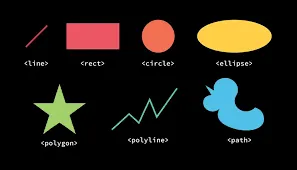
> *   **Layout**: `Image`
> *   **Scene**: 更有代表性的是线、方形、圆形、椭圆形、多边形、多边形线以及路径的阵列示意图。
> *   **Text**: SVG 基础图形与元素阵列

刚才我们用 HTML 搭建了网页骨架。但在数据可视化中，我们真正需要的是绘制**图形**。这也是为什么我们需要引入 **SVG (Scalable Vector Graphics，可缩放矢量图形)**——一种用代码描述几何形状的标准语言。

SVG 的基础元素就像画家的笔触，不同的笔触有着不同的参数来控制其形状与位置。

> [VISUAL]
> *   **Slide**: S08b1_SVG_Rect_Circle
> *   **Layout**: `Code`
> *   **Text**: 基础形状：矩形、圆形与椭圆
```xml
<!-- 矩形 -->
<rect x="10" y="10" width="30" height="30" />
<rect x="60" y="10" rx="10" ry="10" width="30" height="30" />

<!-- 圆形 -->
<circle cx="25" cy="75" r="20" />

<!-- 椭圆 -->
<ellipse cx="75" cy="75" rx="20" ry="5" />
```

**矩形 `<rect>`**
`<rect>` 元素在屏幕上绘制一个矩形。控制屏幕上矩形位置和形状的基本属性共有六项。代码中的第二个矩形设置了 `rx` 和 `ry` 参数，使其呈现圆角效果。若未设置，则默认值为 0。
*   **`x` / `y`**：矩形左上角的 x 和 y 坐标。
*   **`width` / `height`**：矩形的宽度和高度。
*   **`rx` / `ry`**：矩形圆角的 x 和 y 半径。

**圆形 `<circle>` 与椭圆 `<ellipse>`**
`<circle>` 元素绘制圆形，需要三个基本参数：
*   **`cx` / `cy`**：圆心的 x 和 y 坐标。
*   **`r`**：圆的半径。

`<ellipse>` 是圆形的更通用形式，你可以分别调整圆的 x 半径 `rx` 和 y 半径 `ry`（通常数学家称之为半长轴和半短轴）。

> [VISUAL]
> *   **Slide**: S08b2_SVG_Lines
> *   **Layout**: `Code`
> *   **Text**: 线性形状：线条、折线与多边形
```xml
<!-- 线条 -->
<line x1="10" y1="110" x2="50" y2="150" stroke="black" stroke-width="5" />

<!-- 折线 -->
<polyline points="60,110 65,120 70,115 75,130 80,125 85,140 90,135 95,150 100,145" />

<!-- 多边形 -->
<polygon points="50,160 55,180 70,180 60,190 65,205 50,195 35,205 40,190 30,180 45,180" />
```

**线条 `<line>`**
`<line>` 元素以两个点的坐标为参数，并在两点之间绘制一条直线。
*   **`x1` / `y1`**：第一个点的 x 和 y 坐标。
*   **`x2` / `y2`**：第二个点的 x 和 y 坐标。

**折线 `<polyline>` 与多边形 `<polygon>`**
`<polyline>` 是一组连接在一起的直线。由于点列表可能相当长，所有点都被包含在一个属性 `points` 中。
`<polygon>` 和 `<polyline>` 很像，不同的是，`<polygon>` 的路径在最后一个点处会自动回到第一个点，组成一个闭合图形（备注：没有圆角的矩形本质上也是一种多边形）。
*   **`points`**：点列表。每个数字必须用空格、逗号或换行符分隔。每个点必须包含 x 和 y 坐标。例如 `(0,0)` 和 `(1,1)` 可以写成 `0,0 1,1`。

> [VISUAL]
> *   **Slide**: S08b3_SVG_Path_Others
> *   **Layout**: `Code`
> *   **Text**: 终极武器与辅助元素：路径、文字与图层组
```xml
<!-- 路径 -->
<path d="M20,230 Q40,205 50,230 T90,230" fill="none" stroke="blue" stroke-width="5" />

<!-- 文字与图层组 -->
<g transform="translate(10, 10)">
  <text x="0" y="0">Hello SVG</text>
</g>
```

**路径 `<path>`**
`<path>` 可能是 SVG 中最常见、也最强大的形状。你可以用 `<path>` 元素绘制以上所有的形状，以及各种复杂的贝塞尔曲线。控制其形状仅需一个参数：
*   **`d`**：路径绘制所需的点列表及移动(M)、连线(Q/T等)等相关的指令信息。

**文字 `<text>` 与图层组 `<g>`**
除了几何形状，真正的可视化图表离不开文字标签和图层管理：
*   **`<text>`（文字）**：在画布上精确定位的文本标签。
*   **`<g>`（图层组）**：相当于 Figma 里的"打组 (Group)"，用来批量移动和变换一整组元素（通常配合 `transform` 属性进行组级别的平移和缩放）。

### 2.1.8 你的在线魔法工坊：CodePen 极速上手

> [VISUAL]
> *   **Slide**: S07a2_CodePen_Intro
> *   **Layout**: `Split`
> *   **Scene**: 左侧显示真实的 CodePen 界面截图（三个代码面板 HTML, CSS, JS 并排，并在 JS 面板中输入了基础的 D3 代码，下方预览区渲染出了不同大小的圆形），图片上附带“骨架”、“化妆师”、“数据流水线”的标注指示；右侧显示设置窗口（Settings -> JS），搜索栏中输入了 "d3" 并选中。
> *   **Text**: 零配置起飞：你的在线沙盒
> *   **List**: HTML: 骨架, CSS: 化妆师 JS: 加工流水线]
> *   **Asset**: 

对于完全没有碰过代码、甚至没听说过 VSCode 的同学来说，要求你在几分钟内配置好本地的开发环境是不人道的。这也是为什么，我们在本周为你准备了一个免安装、点开即玩的在线沙盒：**[CodePen](https://codepen.io)**。

CodePen 将网页的核心解剖为了三个面板，完美对应了我们在上一节提到的概念：
1.  **HTML 面板**：负责网页的**骨架**（比如放一个 `<svg>` 画布）。
2.  **CSS 面板**：负责网页的**样式**。
3.  **JS 面板**：这就是我们将要挥舞 D3 魔法棒的地方——你的**核心加工流水线**。

> [ACTIVITY]
> *   **Type**: `Lab`
> *   **Duration**: `3min`
> *   **Desc**: 徒手画圆：体验 SVG 标签

> [GUIDE REFERENCE] 请配合《实践操作指南》中的【实践二】进行。引导学生在完成输入后使用右键“检查”功能，通过 Elements 面板印证“透明图层”的直觉。

请在 CodePen 的 **HTML 面板** 中，手动输入一行刚才学的 SVG 代码：`<svg width="500" height="50"><circle cx="25" cy="25" r="20" fill="black" /></svg>`。
看！即使不需要 D3，你也能在预览区画出一个完美的黑色圆形！并且你可以右键它点击“检查”，在 Elements 面板里直接像图层一样修改 `r` 的数值体验变化。
**但现在问题来了**：如果我们要画 100 个随数据变化大小的圆呢？手写标签显然不现实。这就引出了我们即将登场的主角——用代码自动映射图形的 D3。

> [VISUAL]
> *   **Slide**: S07a3_CodePen_D3_Settings
> *   **Asset**: 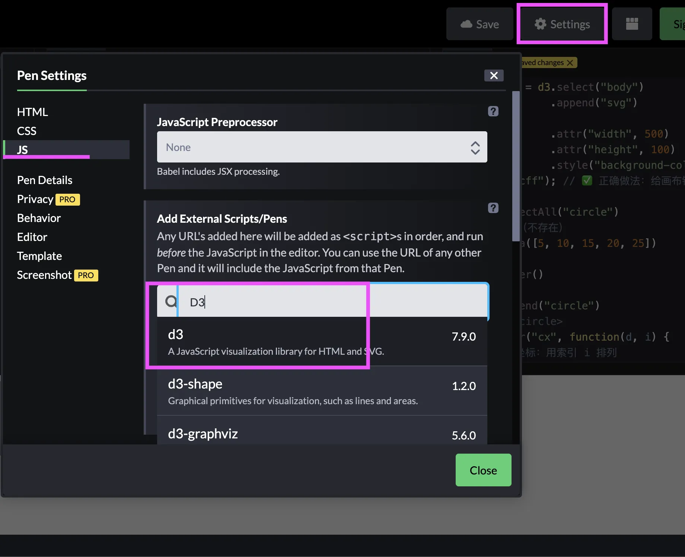
> *   **Layout**: `Image`
> *   **Scene**: CodePen 设置窗口真实截图。展示在 Settings 的 JS 选项卡中，于搜索栏输入 d3 并选中的加载操作。
> *   **Text**: 装备引擎：在 CodePen 中加载 D3

**如何开启 D3 模式？**
你只需要点击右上角的 **Settings (设置)**，切换到 **JS** 选项卡，在底部的搜索框中输入 `d3` 并选中，点击保存。恭喜你，你的沙盒已经装备了 D3 引擎。

从现在开始，本模块中出现的所有代码片段，你都可以直接复制并粘贴到 CodePen 的 **JS 面板** 中。无需刷新浏览器，你就能在下方的预览区实时看到数据变为图形的魔法。

### 2.2 Selection Chain：用文字抓取画布上的每一个元素

> [VISUAL]
> *   **Slide**: S07b_D3_Selection_Intro
> *   **Layout**: `Center`
> *   **Scene**: 极简几何纹身风格 (Tattoo flash design) 的插图，画面中心是一把带刻度的精密镊子，精准地夹住一个发光的数据节点，镊子周围环绕着极简的纹身图腾线条。
> *   **Text**: D3.js：指令式的精密镊子
> *   **Keywords**: d3.js, precision tweezers, tattoo flash, minimal geometric tattoo, SVG, selection
> *   **Asset**: 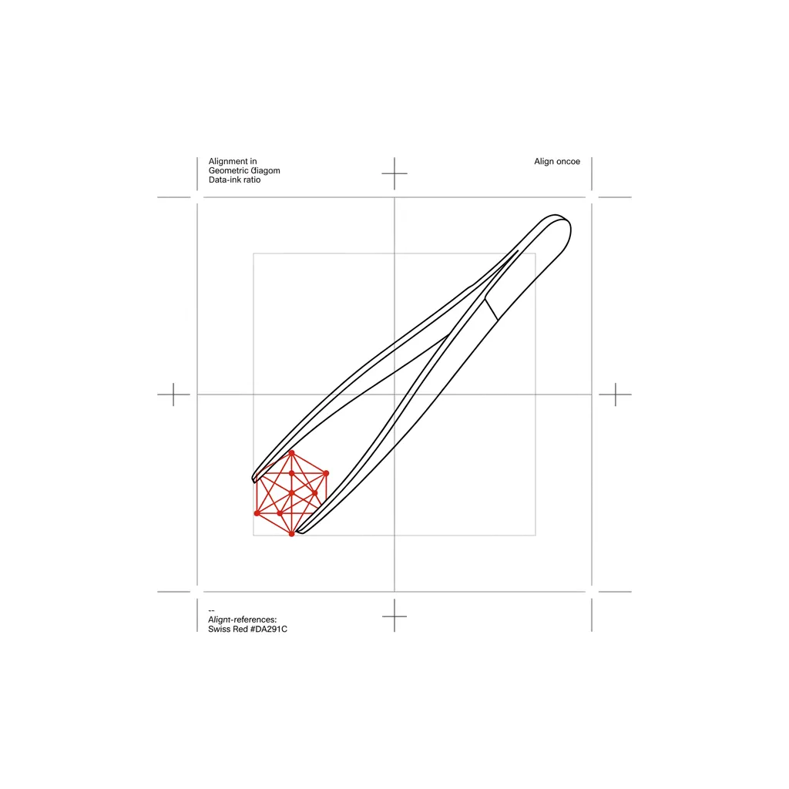

欢迎来到 **Data-Driven Documents (D3.js)** 的世界。D3 不提供任何现成的图表模板，它给你的是一把精密的**指令式镊子**——你必须亲手控制画布上每一个像素的生杀大权。它不像你用过的 Excel 或 RAWGraphs 那样可以一键生成柱状图，你需要用这把镊子，亲自去画布上挑选元素，然后赋予它们数据和属性。

要使用这把镊子，你首先得学会如何**抓取目标**。在 D3 中，这个动作叫做 **Selection（选择）**。它是所有后续数据映射和动态交互的基石，如果没有准确选中目标，你的数据就找不到附着的实体。

> [VISUAL]
> *   **Slide**: S07c_CSS_Selector_Grab
> *   **Asset**: 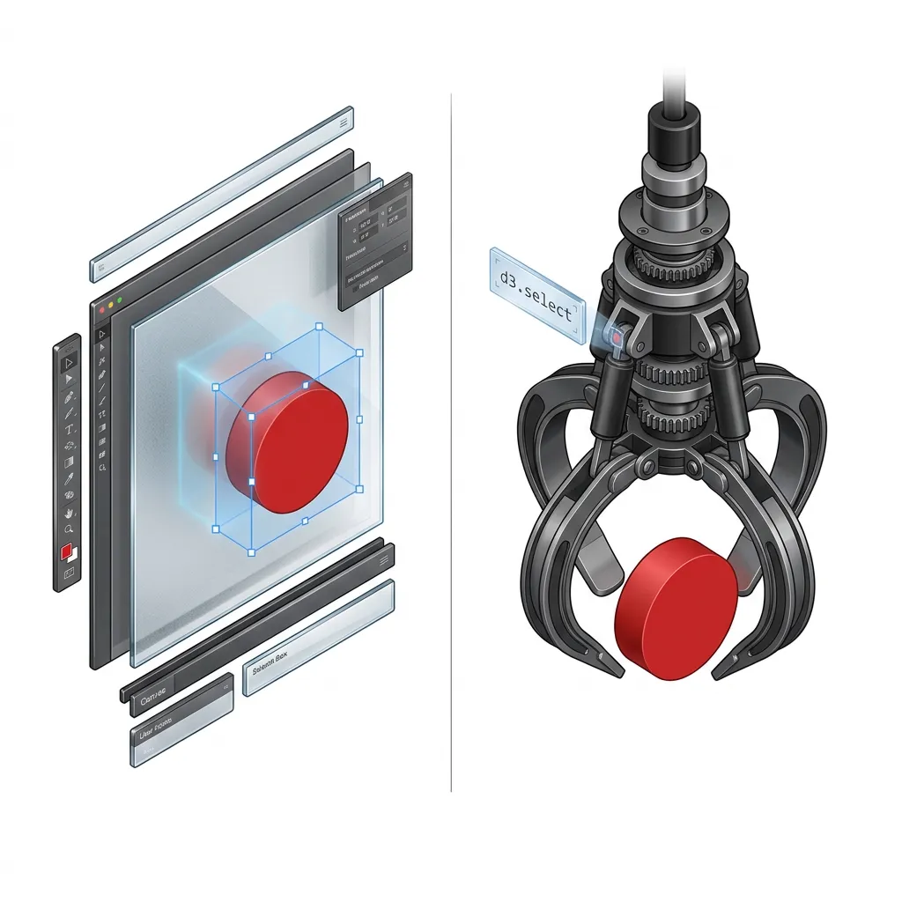
> *   **Layout**: `Comparison`
> *   **Scene**: 等距视角拟物对比图 (Isometric Comparison)。左侧：一块带有刻度网格的玻璃质感设计画布，鼠标指针正拖出一个发光的半透明框，选中了一个 3D 圆形组件；右侧：一把带有金属质感的精密机械夹爪，正准确地夹起同样的 3D 圆形组件，上方悬浮着发光的代码标牌 "d3.select('circle')"。
> *   **Text**: 选择：从鼠标框选到文字抓取
> *   **List**: Figma 框选/ D3 文字选择
> *   **Keywords**: isometric comparison, lasso select tool on glass canvas, mechanical precision grabber claw, d3.js code selection

> [LIFE CONNECT] 设计师的框选直觉
> 在 Figma 或 Illustrator 里，你习惯用鼠标框选一个图层来编辑它。D3 做的事情完全一样，只不过它用**文字**代替了鼠标：`d3.select("circle")` 就像你在图层面板中点击了名为 `circle` 的那个图层。

D3 的选择器借用了 CSS 选择器的语法——这是前端世界的通用语言。

> [VISUAL]
> *   **Slide**: S07d_Selector_Types
> *   **Layout**: `Code`
> *   **Text**: CSS 选择器：单体抓取 vs 批量抓取
> *   **Keywords**: d3.select, d3.selectAll, css selector
```javascript
// 单体抓取：精准抓取 ID 为 main 的唯一元素
d3.select("#main")

// 批量抓取：一次性抓取页面上所有的矩形 <rect>
d3.selectAll("rect")
```


而 D3 的真正魔法在于**链式调用 (Method Chaining)**——你可以像搭积木一样，把多个操作一步步串联起来：


> [VISUAL]
> *   **Slide**: S08a_Mike_Bostock_Github
> *   **Asset**: 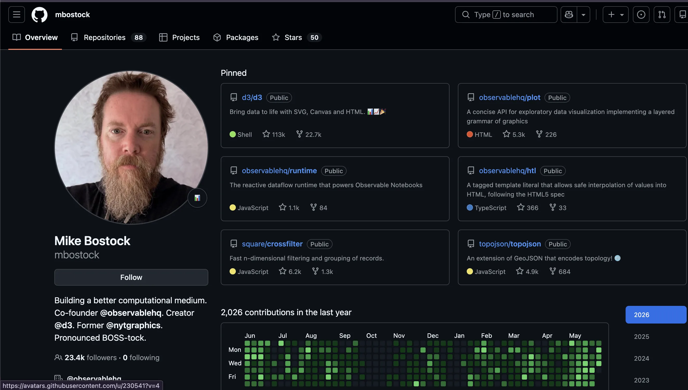
> *   **Layout**: `Image`
> *   **Scene**: D3.js 创始人 Mike Bostock 的 GitHub 主页真实截图。
> *   **Text**: 遇见创造者：Mike Bostock 与他的可视化宇宙

> [PHILOSOPHY]
> 链式调用的设计灵感来自 jQuery（前端 DOM 操作库的鼻祖）。D3 的创始人 Mike Bostock 曾在斯坦福大学 Jeff Heer 教授的可视化实验室工作，他的博士论文就在探索如何让数据可视化的代码变得像**写句子一样可读**。链式调用的每一个 `.` 就像英语中的一个逗号——"选择 body，然后插入段落，然后填入文字。"


> [VISUAL]
> *   **Slide**: S08_Selection_Chain
> *   **Layout**: `Code`
> *   **Text**: 链式调用：环环相扣的指令流水线
> *   **Keywords**: method chaining, d3 select, append, text, chain
```
d3.select("body")           // 第一步：抓取页面 body
  .append("p")              // 第二步：在 body 末尾插入一个新段落
  .text("Hello D3!");        // 第三步：在新段落中填入文字
```


这里有一条关键的**交接规则 (Handoff Rule)**——正如 Murray 教材中所强调的：链条中每一环的**输出类型**必须匹配下一环的**输入类型**。`select("body")` 输出一个指向 `body` 的引用，`append("p")` 接收这个引用并在其中插入新段落，然后输出指向新 `p` 的引用，`text()` 再接收这个引用来填写内容。如果中间某一环的输出和下一环期望的输入不匹配，整条链就像接力赛中的掉棒——直接崩溃。

### 2.3 Data Binding：数据如何附着在页面元素上

> [VISUAL]
> *   **Slide**: S08b_Data_Binding_Attach
> *   **Asset**: 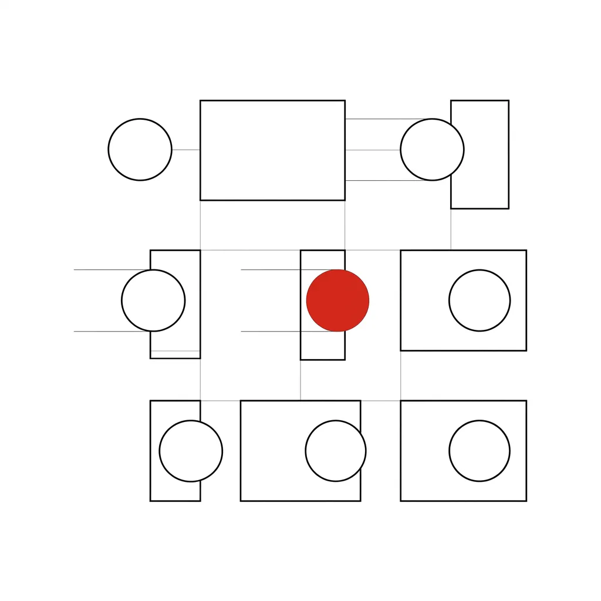
> *   **Layout**: `Center`
> *   **Scene**: 五个发光的数字小球 [5, 10, 15, 20, 25] 正在逐个飞向页面上的五个空白段落框，每个小球钻入框中后，框内亮起对应的数字。
> *   **Text**: Data Binding：把数据"粘"在页面元素上
> *   **Keywords**: data binding, data(), DOM, __data__, Murray Ch5

**(Pause: 3s)**

选择和链式调用只是第一步。D3 真正区别于其他工具的核心创新，是**数据绑定 (Data Binding)**——把一组数据**粘合**在 DOM 元素上。


> [VISUAL]
> *   **Slide**: S08b2_Murray_Quote
> *   **Layout**: `Code`
> *   **Scene**: 经典名言引用展示
> *   **Text**: 数据可视化的本质：映射

```text
Scott Murray 这句名言所说：

 "Data visualization is a process of mapping data to visuals. Data in, visual properties out." 数据可视化是将数据转化为视觉图形的过程。输入数据，输出视觉呈现效果。

—— Scott Murray, Interactive Data Visualization for the Web, Ch5
```
Murray 教材 (Ch5) 对此有一段精辟的定义：
通俗地说：数据可视化就是一个**映射过程**。数据进去，视觉属性出来。数字越大，柱子越高；特殊类别，颜色越亮。但在映射发生之前，数据必须先**附着**在页面元素上——这就是 D3 的 `data()` 方法在做的事。

#### 2.3.1 "选择还不存在的元素"——D3 最反直觉的设计

> [VISUAL]
> *   **Slide**: S08c_Enter_Paradox
> *   **Layout**: `Code`
> *   **Text**: 选择还不存在的东西？D3 最大的心理弯道
> *   **Keywords**: selectAll, empty selection, placeholder, enter, Murray Ch5

> [GUIDE REFERENCE] 请配合《实践操作指南》的【实践三】进行。提示学生**必须先清空 HTML 画布**，执行时带有 `.remove()` 的防御性代码，并引导学生体验拼写错误的“白屏静默失败”。

```javascript
// 防御性清理：每次重新运行前，清空旧画布，避免多重画布重叠的幽灵现象
d3.selectAll("svg").remove(); 

var dataset = [5, 10, 15, 20, 25];

d3.select("body").selectAll("p")  // ① 环顾全场：找所有的段落（目前是空的）
  .data(dataset)                   // ② 分发数据：5 个名牌
  .enter()                         // ③ 缺席宣告：发现没元素，竖起 5 个虚拟占位牌
  .append("p")                     // ④ 实体化：把占位牌变成真实的 <p> 元素
  .text("New paragraph!");         // ⑤ 填充内容
```

现在来到了 D3 最令人困惑的地方——你可能会问：**怎么能选择还不存在的元素？**

这正是 Murray 在 Ch5 中花大量篇幅解释的核心谜题。答案就藏在 D3 的 **enter()** 方法中。请看这段代码——D3 世界的**五步咒语**：


> [STORY TIME] 预定酒席的座位牌
> 想象你正在为一场晚宴布置圆桌。你手上有一份 5 人的宾客名单（dataset），但桌上此刻一把椅子都没有。第一步 `selectAll` 就像你环顾空桌——"这里应该有 5 个座位"。第二步 `data()` 把每位宾客的名牌分配到虚拟的座位上。第三步 `enter()` 发现"名牌比椅子多"，于是为每个缺椅子的名牌**竖起一根占位标记**。第四步 `append` 把标记变成真正的椅子。第五步 `text()` 把菜单放到每把椅子上。

让我们逐环拆解这条链：

- **`selectAll("p")`**：选择所有段落。因为还不存在，返回一个**空选择**。把它理解为"**即将诞生**的元素的占位声明"。
- **`.data(dataset)`**：数一数数据有 5 个值，然后循环 5 次，每次处理一个值。
- **`.enter()`**：检查当前 DOM 中有多少个 `p`（0 个）vs 数据有多少条（5 条）。发现 5 条数据都没有对应的元素，于是为每一条**创建一个占位符**。
- **`.append("p")`**：把每个占位符变成真正的 `<p>` 元素，插入 DOM。
- **`.text("New paragraph!")`**：给每个新元素填上文字。

> [ACTIVITY]
> *   **Type**: `Quiz`
> *   **Duration**: `2min`
> *   **Desc**: 概念测验：Enter 模式的核心逻辑
> *   **Q**: 新手开发者小王写了以下 D3 代码：`d3.select("body").selectAll("circle").data([10, 20, 30]).enter().append("circle")`。页面初始状态下不存在任何 `<circle>` 元素。执行后，DOM 中会出现几个 `<circle>` 元素？
> *   **Options**: A. 0 个，因为 `selectAll("circle")` 选到了空集，后续操作全部失效 | B. 1 个，因为 `select` 和 `selectAll` 只能选中单个元素 | C. 3 个，因为 `enter()` 为每条没有对应 DOM 元素的数据创建了占位符，`append` 将其变为真实节点 | D. 无法确定，取决于浏览器的渲染引擎
> *   **Answer**: C
> *   **Explain**: 正确答案是 C。这正是 D3 五步咒语的核心逻辑：`selectAll("circle")` 返回空选择（0 个元素），`.data([10, 20, 30])` 传入 3 条数据，`.enter()` 发现"3 条数据但 0 个元素"，于是创建 3 个占位符，`.append("circle")` 将每个占位符变为真正的 `<circle>` 元素。选项 A 的错误在于混淆了"空选择"和"操作失效"——空选择恰恰是 `enter()` 的触发条件。

### 2.4 Accessor Function：让数据驱动每一个视觉属性

> [VISUAL]
> *   **Slide**: S09_Accessor_Function
> *   **Asset**: 
> *   **Layout**: `Code`
> *   **Scene**: 左侧是五个已绑定数据的段落元素，每个元素旁边标注着 `__data__: 5`、`__data__: 10` 等。右侧是代码 `.text(function(d) { return d; })`，箭头指向每个段落依次显示出 "5"、"10"、"15"、"20"、"25"。
> *   **Text**: function(d)：从数据到视觉的翻译探针
> *   **Keywords**: accessor function, datum, d, function(d), Murray Ch5

```
.text(function(d) { return d; });
```

五步咒语虽然能批量生成元素，但目前每个段落的文字都一样——"New paragraph!"。如何让**每个元素显示自己专属的数据值**？

秘密武器是 Murray 教材中反复出现的**匿名函数探针 `function(d)`**。把最后一行改成：


刷新页面——五个段落分别显示 5、10、15、20、25！

这里的 **`d`（Datum）**，代表当前被处理的那一条数据。当 D3 循环到第三个元素时，`d` 就是 `15`。你可以把 `d` 想象成挂在每个元素脖子上的**专属铭牌**——它记录着这个元素绑定的数据值。

> [LIFE CONNECT] "数据想被拥抱"
> Murray 在 Ch5 中用了一个温暖的比喻：`d` 是一个**孤独的小占位符**，它需要一个**温暖的函数括号**来拥抱它。不能直接写 `.text(d)`——脱离了函数，`d` 就是 undefined（未定义）。只有被 `function(d) { ... }` 包裹时，D3 才能在循环的每一步把当前数据值注入给 `d`。在现代 JavaScript 中，我们常用更简洁的**箭头函数**写法：`d => d`，效果完全一致。

但 `function(d)` 的能力远不止返回原始数值。你可以在函数体内做**任何计算和条件判断**，实现数据到视觉的精确映射：

> [VISUAL]
> *   **Slide**: S09a_Accessor_Condition
> *   **Asset**: 
> *   **Layout**: `Code`
> *   **Scene**: 左侧是五个段落的渲染结果，数值 "5", "10", "15" 显示为黑色，而数值 "20", "25" 触发条件变成了醒目的红色。右侧是高亮的 D3 条件判断代码，一条分流线解释 `d > 15` 是如何将数据导向不同颜色出口的。
> *   **Text**: 逻辑探针：基于数据规则的视觉映射
> *   **Keywords**: conditional logic, mapping rules, data-driven styling

```
.style("color", function(d) {
    if (d > 15) {          // 如果数据值超过 15
        return "red";       // 文字变红——高亮异常值
    } else {
        return "black";     // 否则保持黑色
    }
});
```

D3 不仅支持 `.text()` 接受函数，**几乎所有设置属性的方法**——`.attr()`、`.style()`——都接受 `function(d)` 作为参数。这意味着你可以用数据驱动元素的**任何**视觉属性：位置、大小、颜色、透明度、形状……一切映射规则都由你亲手定义。

> [ACTIVITY]
> *   **Type**: `Quiz`
> *   **Duration**: `2min`
> *   **Desc**: 场景判断：Accessor 函数的使用
> *   **Q**: 设计师小雅想用 D3 画一组柱状图，要求柱子的高度等于数据值乘以 5，且数据值大于 20 的柱子填充红色，其余为蓝色。以下哪段代码能同时实现这两个需求？
> *   **Options**: A. `.attr("height", d * 5).attr("fill", "red")` | B. `.attr("height", function(d) { return d * 5; }).attr("fill", function(d) { return d > 20 ? "red" : "blue"; })` | C. `.attr("height", 100).style("color", function(d) { return d > 20; })` | D. `.attr("height", function(d) { return d; }).attr("fill", "blue")`
> *   **Answer**: B
> *   **Explain**: 正确答案是 B。`height` 通过 `function(d) { return d * 5; }` 实现数据值×5 的动态映射；`fill` 通过 `function(d) { return d > 20 ? "red" : "blue"; }` 实现条件颜色分流。选项 A 的 `d * 5` 会报错，因为 `d` 脱离了函数包裹就是 undefined（回忆"数据想被拥抱"的规则）。选项 C 高度写死为 100 且 `color` 属性不等于 SVG 的 `fill`。选项 D 高度未乘以 5 且颜色固定。

### 2.5 空间与形态：用数据驱动 SVG

刚才我们用 `append("p")` 驱动了段落文字。现在，结合我们在 2.1.7 节学过的 SVG 矢量画布，我们将五步咒语升级——不再生成静态的段落文字，而是用数据画出真正的几何图形：

> [VISUAL]
> *   **Slide**: S09b_SVG_Circles_Row
> *   **Asset**: 
> *   **Layout**: `Code`
> *   **Scene**: 左侧是最终生成的 SVG 渲染结果：一行由小到大的五个黑色圆形，依次排列在白色画布上，每个圆下方标注对应的半径数值；右侧是高亮的 D3 代码，重点用高亮线解释 `i` (index) 是如何推算 `cx` 位置的，而 `d` (datum) 是如何决定 `r` 半径大小的。
> *   **Text**: 空间与形态：用数据驱动 SVG 坐标
> *   **Keywords**: SVG circle, data-driven shapes, cx, cy, r, index function

> [GUIDE REFERENCE] 请配合《实践操作指南》的【实践四】进行。引导学生在执行后进行破坏性测试：删去 `i` 导致“坐标车祸”，删去 `function(d)` 导致“变量 d 丢失”。

```javascript
// 0. 防御性清理旧画布，并铺上一层浅灰底色方便观察边界
d3.selectAll("svg").remove(); 
d3.selectAll("p").remove();

var svg = d3.select("body")
            .append("svg")            // 创建 SVG 画布
            .attr("width", 500)
            .attr("height", 50)
            .style("background-color", "#f0f0f0"); // 给画布铺一层浅灰色背景

svg.selectAll("circle")               // ① 选择所有圆形（不存在）
   .data([5, 10, 15, 20, 25])         // ② 绑定数据
   .enter()                           // ③ 创建占位符
   .append("circle")                  // ④ 生成真实的 <circle>
   .attr("cx", function(d, i) {       // ⑤ 每个圆的 X 坐标：用索引 i 排列
       return (i * 50) + 25;
   })
   .attr("cy", 25)                    // 所有圆的 Y 坐标居中
   .attr("r", function(d) {           // 半径 = 数据值本身
       return d;
   });
```


注意代码中出现了第二个参数 **`i`（index）**——它是当前元素在数据集中的**序号**（从 0 开始）。在 `function(d, i)` 这个探针中，`d` 是数据本身的值，用来决定圆的半径大小；而 `i` 则是它在队伍里的位置索引。我们用 `i` 乘以 50 再加上固定的偏移量，来计算每个圆的水平 `cx` 坐标。这样一来，这五个大小不一的圆形，就能完美地在画布上从左到右整齐排开，互不重叠。这就是数据索引在空间排布中的典型应用。

### 2.6 设计师的排错利器：SVG 的透明性

> [VISUAL]
> *   **Slide**: S09c_SVG_Inspectable
> *   **Asset**: 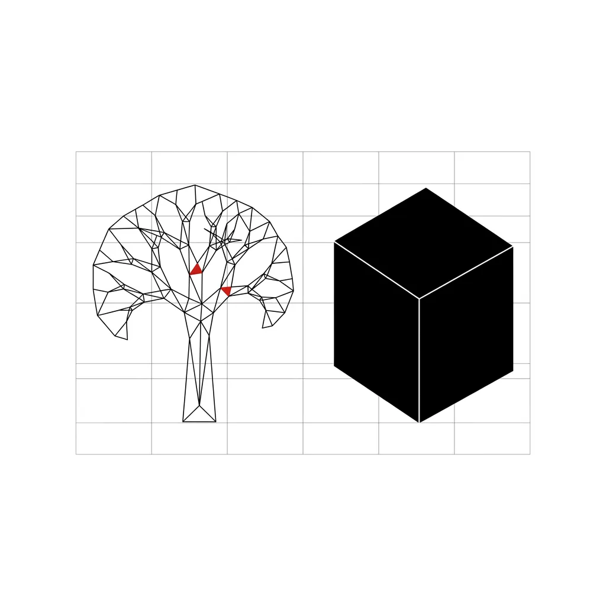
> *   **Layout**: `Comparison`
> *   **Scene**: 左侧是浏览器 DevTools 的 Elements 面板，展开的 DOM 树中清晰可见 `<svg>` → `<circle cx="25" cy="25" r="5">` → `<circle cx="75" cy="25" r="10">` 的层级结构，每个属性都可以直接点击编辑。右侧是 Canvas 渲染的图表，DevTools 中只显示一个黑盒般的 `<canvas>` 标签，内部没有任何可检查的子元素。
> *   **Text**: SVG 的透明性 vs Canvas 的黑盒
> *   **List**: SVG: DOM树结构清晰且可随时检查/ Canvas: 渲染为黑盒且没有任何子元素

这正是 D3 使用 SVG 而非 Canvas 的核心优势——**每一个视觉元素都是透明的、可检查的、可即时修改的**。

> [LIFE CONNECT] 图层面板 vs 合并后的 JPG
> 在 Photoshop 里，一份 PSD 文件保留着所有图层——你可以随时打开图层面板，点击任意一层进行修改。但如果你把它导出成 JPG，所有图层就被永久"烤"在一起了，再也无法单独编辑。SVG 就像是永远保持图层面板打开的 PSD——每一个 `<rect>`、`<circle>`、`<text>` 都是独立的、活生生的节点，你随时可以在浏览器的 DevTools 中直接检查和修改它们。

当你用 AI 生成了一段 D3 代码，图表的颜色不满意时，你**不需要回到代码里找 `fill` 属性**。直接按 F12 打开 DevTools，在 Elements 面板中找到那个 `<circle>` 元素，把 `r="5"` 改成 `r="20"`，画布上的圆形**立刻同步变大**。

对于 DMA 设计师来说，这意味着两个极具价值的能力：

1.  **排错直觉**：图表出了问题，直接在 DOM 树中定位到出错的元素，比在几百行代码中大海捞针快十倍。
2.  **资产提取**：D3 生成的 SVG 可以直接被 Adobe Illustrator、Figma 读取。你可以用 SVG Crowbar 等工具把浏览器上的图表"偷"下来，拖进设计软件进行二次包装——完美打通了从代码到设计的全链路。

### 2.7 小结：从今天起你握住的三把钥匙

> [TEACHING MOMENT] 肯定与升级
> D3 不是一个"更难用的图表库"。它是一把**视觉炼金术的手术刀**——让你在浏览器中拥有对每一个像素的绝对审查权。今天这个模块，你握住了三把核心钥匙：

1.  **Selection Chain（选择链）**——如何用文字抓取和操控页面元素，以及链式调用的交接规则。
2.  **Data Binding + Enter（数据绑定 + 进入模式）**——D3 的五步咒语：`selectAll → data → enter → append → attr`，让数据自动创建对应的视觉元素。
3.  **Accessor Function（取值探针）**——`function(d)` 和箭头函数 `d =>`，让每一个元素的视觉属性都由数据驱动。

> [TEACHING MOMENT] 预告：从沙盒到真正的开发环境
> CodePen 是一个完美的游乐场，它能让你零负担地体验 D3 的纯粹语法。但当我们未来需要加载数十万行的真实 CSV 格式的数据集时，沙盒就力不从心了。
> 
> 因此，在下一节课，我们将把 CodePen 中的魔法搬回你自己的电脑上。我们将教你安装属于你的本地实验室——**VSCode**，并引入强大的 AI 编程助手（Vibe Coding）。届时，你将见证 AI 是如何接管繁杂的数据清洗工作，而你只需掌控设计的方向。

下一个模块，我们将深入 D3 代码在真实运行中最容易翻车的三大陷阱——**倒置画布**（浏览器 Y 轴向下递增）、**比例尺**（如何将百万级数据压缩到 800 像素）、以及**数据绑定的三态生命周期 (Enter/Update/Exit)**。在那里，你会亲眼看到 AI 生成的 D3 代码是如何在这些陷阱中频繁坠毁的，并学会如何精准地引导 AI 修复它们。