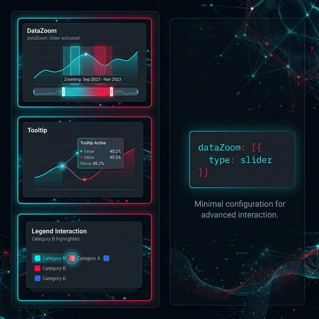

## 模块 2: ECharts 与选项宇宙 (60 分钟)
<!-- BUDGET: 1800 chars | SLIDES: ≥3 | STATUS: ok -->

> [VISUAL]
> *   **Slide**: S06c_Echarts_vs_D3
> *   **Asset**: 
> *   **Layout**: `Grid`
> *   **Scene**: 左侧是代表商业精英、工整参数的蓝色仪表盘控制中心，右侧是代表硬核极客、布满底层代码逻辑的暗黑编辑台。
> *   **Text**: 现代 Web 可视化的双城记

在现代 Web 可视化中，有两个绕不开的名字：ECharts 和 D3.js。
它们不仅仅是两个开源图表库，它们代表了两种截然不同、却又相爱相杀的工程师设计哲学。

我们首先来看占据国内商业前台 80% 江山的霸主——**Apache ECharts**。

> [CASE STUDY] 中国开源的全球影响力
> 你可能不知道，你即将驾驭的这个工具，有着一段令中国开源社区引以为傲的历程。ECharts 由百度前端团队于 2013 年发起，2018 年正式进入 Apache 软件基金会孵化器，并于 2021 年成功毕业成为 **Apache Top-Level Project (顶级项目)**——这是全球开源界的最高荣誉之一。
> 截至目前，ECharts 在 GitHub 上的 Stars 数极多，被 IBM、Amazon、Intel 等国际巨头企业广泛采用。它是中国开源社区，在世界前端可视化领域的标杆贡献——这意味着，当你今天用自然语言驱动 ECharts 生成图表时，你正站在中国工程师群体贡献的巨人肩膀上。
> 这种“中国原创，全球采纳”的路径，与我们这门课的 Vibe Coding 理念高度契合：不是被动地使用工具，而是理解工具背后的设计哲学，并以此增强技术自信与开源贡献意识。

> [VISUAL]
> *   **Slide**: S07_ECharts_Declarative
> *   **Asset**: 
> *   **Layout**: Split
> *   **Scene**: 左侧是一张高档餐厅的菜单，用户淡定地勾选了“七分熟、黑椒汁、配芦笋”的选项。右侧是 ECharts 那结构极其工整的 `option` JSON 对象结构。
> *   **Text**: 声明式编程：你只管点菜，大厨负责做

ECharts 采用的是声明式编程模型，英文叫作 **Declarative** 范式。
在这种范式下，你不需要告诉电脑“怎么画”。你不再需要去研究 Canvas 画布的像素网格，不需要去计算贝塞尔曲线的控制点坐标。
你更像是一个坐在餐厅里运筹帷幄的总裁，拿出一张名为 `option` 的 JSON 菜单，在上面疯狂打勾：

“我要 X 轴放时间。”
“我要 Y 轴放对数。”
“给我加上图例，放在右上角，字号 14px。”
“再加上一个缩放滑块。”

只要你写好这份 `option` 树状结构对象，然后通过 `myChart.setOption(option)` 递给 ECharts。它内置的底层渲染引擎（ZRender），就会默默在后台，用极其高效的 Canvas 技术（或 SVG），把一盘配置极其精美的菜肴端上桌。

### 2.1 解构 Option：ECharts 的级联架构

> [VISUAL]
> *   **Slide**: S08_ECharts_Option_Tree
> *   **Asset**: 
> *   **Layout**: `Flow`
> *   **Scene**: 剖析 Option 对象的树状图。根节点是 Option，枝干分出 `dataset`、`grid`、`xAxis`、`yAxis`、`series`、`visualMap` 等模块，像积木一样组装在一艘宇宙飞船上。
> *   **Text**: 解剖 Option 战舰的六大舱室

ECharts 如此强大的原因，在于它把图表抽象成了一组可插拔的模块（Components）。
一份完整的 `option` 就像是一艘高度工程化的战舰，主要由以下几个核心舱室构成：

1.  **Dataset (数据集)**：
    过去，人们习惯把数据写死在图表的类型里。但 ECharts 4.0 之后引入了强大的 `dataset` 架构。你把上周清洗好的二维表格一整个扔进 `dataset.source` 里面。后面的所有图表（不管你是画柱状还是饼图），全都可以直接通过索引来饮用这组数据。这达成了数据与表现的彻底分离。
2.  **Grid (网格)**：
    这就是我们第一排讲的空间排布控制台。`grid` 允许你在同一个 Canvas 舞台上，切分出好几个绝对定位的矩形区域。利用多组 `grid` 和多组坐标轴联动，你在刚才学的**小多图阵列**和**散点图矩阵**，在这里不过就是多配几个参数的事情。
3.  **Coordinate Systems (坐标系组件)**：
    图表必须有地基。你是要用直角坐标系的 `xAxis/yAxis`，还是极坐标系的 `radiusAxis/angleAxis`？或者是一套无界的地理投影轴？
> [VISUAL]
> *   **Slide**: S08b_VisualMap_Showcase
> *   **Asset**: 
> *   **Layout**: `Grid`
> *   **Scene**: 一张带有精美渐变色地图的中国省份数据展示，右下角有一个允许用户滑动筛选的颜色手柄图例。
> *   **Text**: VisualMap：掌控全局色彩的调色盘

4.  **VisualMap (视觉映射)**：
    我们上周讲过颜色映射（连续型 vs 分散型）。在 ECharts 中，你只需放入一个 `visualMap` 组件。设定 `min` 和 `max`，挑选 `inRange` 的颜色渐变器（比如从深蓝到深红）。ECharts 会自动生成一个自带交互图例的颜色映射条，接管全局的色彩表达。
5.  **Series (系列)**：
    这是决定图表最终形态的基因。
    在 ECharts 的宇宙里，其实画布上并没有真正独立存在的“柱状图库”或“折线图库”。一切都在同一个舞台上，而决定在这个坐标系上最终画什么形状的，是 `series` 数组中那个小小的 `type` 字段。你把 `type` 写成 `'bar'`，底层引擎就调用渲染矩形的方法。你改成 `'scatter'`，它就去画发光的圆点。你改成 `'heatmap'`，它就去铺设色块。这种高度收敛、统一的内核架构，使得无论图表的外表多么千变万化，其底层的参数配置逻辑（Option 字典树）永远保持一致。这就是声明式架构在复杂系统中最迷人的魅力。

### 2.2 免费的交互午餐

> [VISUAL]
> *   **Slide**: S08c_JQuery_Nightmare
> *   **Asset**: 
> *   **Layout**: `Grid`
> *   **Scene**: 一名满眼血丝的程序员在散发着荧光的屏幕前痛苦地手写着大量繁冗的代码，只为控制一个粗糙的网页游标滑块。
> *   **Text**: 手工时代的折磨与呼唤

> [STORY TIME] 徒手捏滑块的噩梦
> 我曾经在 jQuery 时代，试图为一个有着几万条时间序列的心电图，手写一个支持底部拖拽放大、支持双指捏合缩放的小滑块。一个熟练的前端工程师为了这个滑块，苦干了三天三夜，写了几百行逻辑，还要处理无数的鼠标悬停、坐标边界溢出、防抖节流的恶心 Bug。
> 而当我转投 ECharts 时，我震惊了。

> [VISUAL]
> *   **Slide**: S09_Free_Interaction_Lunch
> *   **Asset**: 
> *   **Layout**: `Split`
> *   **Scene**: 上半部分是一行简单的 JSON 代码 `dataZoom: [{ type: 'slider' }]`。下半部分是这行代码带来的，极其丝滑流畅的时间轴缩放动画演示。
> *   **Text**: 声明式暴力美学：一行代码买下三天工作量

为什么全球企业如此偏爱 ECharts？因为它内置的交互组件就是一场“免费赠送”的技术大派送。

在 ECharts 里，为了完成那个令我苦熬三天的底部滑块，你只需要在 Option 根节点里加上简简单单的一句：
`dataZoom: [{ type: 'slider' }]`

砰的一声。一个不仅支持鼠标拖拽、滚轮缩放、甚至支持移动端手势捏合的极品交互组件，就这样附着在你的坐标轴上了。这在 Munzner 教授的交互理论中，完美顺应了“概览加上下文 (Overview + Detail)”的设计模式。

同样，`tooltip: { trigger: 'axis' }` 就能立刻召唤出一根跟随鼠标移动的标尺线，并在旁边浮现出极其详尽的数据展示浮窗。
在这里，商业级的交互体验廉价得如同白开水。

### 2.3 Vibe Coding 的绝佳盟友

> [VISUAL]
> *   **Slide**: S09b_Vibe_Coding_Prompt
> *   **Asset**: 
> *   **Layout**: `Full`
> *   **Scene**: 屏幕中央展示一个正在输入的对话框，里面填充了专门针对 ECharts 撰写的极其工整、充满行话的精准 Prompt 指令词。
> *   **Text**: 用结构化的行话召唤 AI 大厨

因为 ECharts 全身都是结构严谨、基于配置规范的 JSON，你知道这意味着什么吗？
**它简直就是大语言模型最痴迷、最容易命中的格式集合。**

AI 生成复杂的业务判断逻辑可能会存在由于幻觉带来的漏洞，但如果你让 AI 填写一段符合官方 Schema 的 JSON，那绝对是它的拿手好戏。

> [ACTIVITY]
> *   **Type**: `Workshop`
> *   **Duration**: `50min`
> *   **Desc**: **AI 自动推演与 ECharts 声明式调参竞速**
>   (1) **极速拉起**：学员取出 W03 洗出的一份包含至少 3000 行带时间和分类维度的数据。使用提示词模板直接发难：“作为资深可视化架构师，基于附带 Tidy Data 数据，生成 ECharts 的完整单页面 HTML。要求：采用 Dataset 统一绑定数据；必须使用双 Y 轴结构呈现两种不同量纲的数值；强制开启深色主题 (`dark`)，并在底部集成 `dataZoom`。”
>   (2) **JSON 微操手术**：一旦 AI 把基础页面配好。要求学员立刻掐断向 AI 提问的念头。自己打开代码编辑器，对照官方配置手册，寻找 Option 里的参数并亲手注入灵魂。比如：在 `series` 中写入一个 `itemStyle`，使得数值大于 50 的柱子变成鲜艳的红色；或者定制 `tooltip` 的 `formatter` 回调函数，让提示框里的文字附加上美元符号并加粗。
>   (3) **同桌互评**：互相验证谁的“微操”修改最少，却让交互质感提升最大。

> [VISUAL]
> *   **Slide**: S09c_Echarts_Boundary
> *   **Asset**: 
> *   **Layout**: `Grid`
> *   **Scene**: 用户正试图用光标拉扯一根带有物理弹性的水晶柱子试图突破网格，但屏幕弹出了坚硬的配置项越界警告屏障。
> *   **Text**: 当标准菜单无法满足野心

它像魔法一样迅捷，界面开箱即用，极其稳定。
但它有一个致命的诅咒。

**一旦你偏离了它的标准模板库，你想玩点反常识的艺术创作时，这扇配置的大门就会瞬间锁死。**

如果你非要画一个“所有气泡都是一滴眼泪，并且像水滴一样，受地心引力影响，掉落在屏幕底部汇聚成海”的叙事动画。
你在 ECharts 那浩如烟海的菜单本里翻烂了也找不到选项。大厨会冷冷地告诉你：“菜单上没有这道菜，我不做。”

此时，你只能选择冲进厨房，夺下大厨手里的刀。
你需要抛下所有的配置保护罩，亲自接管从数据点到屏幕像素的每一场流血冲突。
你需要进入 **D3.js** 的世界。
