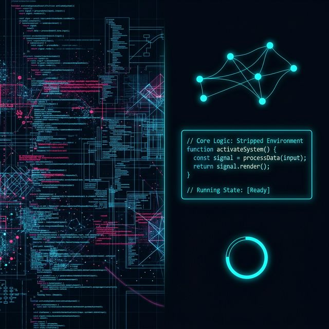

## 模块 4: Vibe Coding 排错工作流 (50 分钟)
<!-- BUDGET: 900 chars | SLIDES: ≥2 | STATUS: ok -->

当用大语言模型去撰写这种重度依赖空间位置、比例尺轴线以及多态渲染的 D3 代码时，失败率可以高达 40% 以上。不仅如此，页面轻则失去响应，重则整个图表变成乱如麻的四维生物残骸，或者完全惨白的神奇失踪。

很多人在这时，会在 AI 聊天框里绝望地咆哮：“报错了！图没了，赶紧给我重写一版！”
结果呢？大模型顺理成章地换了更晦涩难懂的底层写法，把原本微调就能跑通的代码，彻底改头换面。引入全新的不可控 Bug，陷入低效的死亡螺旋。

> [VISUAL]
> *   **Slide**: S16_Debug_Funnel
> *   **Asset**: 
> *   **Layout**: Card
> *   **Scene**: 漏斗模型。顶层：Console报错；中层：结构定位；底层：MRE隔离。
> *   **Text**: 驯服机器人的三层排错漏斗

一个合格的可视化架构师，懂得避免这种无效暴躁，懂得使用**排错漏斗策略**，对大模型开展高精度的微创手术。这套哲学不但适用于 D3 编程，也适用于任何，通过自然语言驱动复杂系统，驱动构建的工程体系中。

### 4.1 Layer 1：原样抄写 Console 审判单

既然画布是白屏，首先必定是浏览器抛出了错误。
按 F12 打开开发者工具里的 Console 界面，寻找那刺眼的红色字迹。这里的心法是：不要自己翻译！不要把“找不到元素”作为 Prompt 告诉 AI。直接原封不动复制报错流里最具指针意义的前几行英文。
当 AI 看到 `"Error: d3.timeParse is not a function at line 42"`。它瞬间就能根据自身训练库，自我开出一份最准确的查漏补缺药方。这是第一层漏斗——由医生读单，不要由患者口述。

### 4.2 Layer 2：结构化定位灯塔

如果没有任何报错红字，但坐标系依然消失了呢？
此时，我们必须升格为结构化定位指令：
`1. 目标预期：应该在画布底部展现 X 轴。`
`2. 实际行为：画布为空，审查元素发现 <g> 的 translate 坐标出现了负数，完全越界。`
`3. 现场代码提取：附上 margin 的定义 和 生成 X 轴的 5 行代码块`

> [VISUAL]
> *   **Slide**: S16b_Structural_Spotlight
> *   **Asset**: 
> *   **Layout**: Card
> *   **Scene**: 在代码的黑暗迷宫中，一道高强度显微镜聚光灯精准无误地锁定在茫茫数据海里的特定 5 行 BUG 代码上。
> *   **Text**: 结构化定位：打探照灯

这样写的好处是，你如同给 AI 戴上了高强度的显微探照灯，强行逼迫它只能在你锁定的这 5 行代码里寻找数学错误。

### 4.3 Layer 3：终极制裁 MRE (最小可复现示例)

> [VISUAL]
> *   **Slide**: S17_MRE_Isolation
> *   **Asset**: 
> *   **Layout**: Split
> *   **Scene**: 左侧是密密麻麻、布满几千行代码和复杂样式的死档屏；右侧是经过剥离后，只剩下五行核心代码和一个清爽运行环境的纯净界面。
> *   **Text**: 隔离病灶，才能施展精准打击

当你被成千上万行错综复杂的逻辑逼到绝境，前两层漏斗都彻底失效时，你需要动用可视化编程界最冷酷的终极拆解制裁武器。

> [STORY TIME] GitHub 的世纪排错悬案
> 在 D3 社区甚至 React 社区的 GitHub 历史 issue 区，每天都有上万名初级程序员贴入长达三千多行的代码文件，哭诉“我的图表渲染挂了，为什么？”。然而，这种工单几个月都不会被各路大神多看一眼。
> 为什么？因为噪音太大。没有任何一个高级工程师或高阶模型，愿意在别人的三千行意大利面条般纠缠的逻辑里去寻宝。只有那些将庞杂工程**断腕剥离**，剔除所有无关分支，仅仅保留出“触发 BUG 的 5 行核心骨干”，也就是提取出 MRE（最小可复现示例）的人，才能获得秒级的灵魂救赎。

> [VISUAL]
> *   **Slide**: S17b_Surgical_MRE
> *   **Asset**: 
> *   **Layout**: Card
> *   **Scene**: 用锐利的外科手术刀将一颗核心跳动的数据心脏，极其果断地从一团乱麻般的死亡死锁代码藤蔓中强行分离出来。
> *   **Text**: 排错杀手锏：断腕隔离

当你深陷沼泽、前两招都失效时。把那个长达三万行的数据强行截断成只有 3 行。把所有的炫彩动效、`tooltip` 悬浮框、所有的网格背景全部果断删除，连坐标轴也不要了。
只送一个最赤裸的环境进去：“在 3 个数据的数组下，纯粹的圆为什么没有画在画布上？”

当 AI 处理的代码量级从 500 行骤降到寥寥几十字，它的数学能力、逻辑推导能力会呈几何级数般的暴增。这就是 MRE 控制法的不可思议之处。通过建立这三重防线，你可以在大模型幻觉频发的雷区中稳步穿行，不仅能挽救自己几近失控的图表项目，更能反向培养出结构化、剥丝抽茧的高级工程直觉。

> [VISUAL]
> *   **Slide**: S17c_Navigating_Minefield
> *   **Asset**: 
> *   **Layout**: Card
> *   **Scene**: 在布满大模型幻觉与语法崩溃炸弹的广阔赛博雷区中，通过层层过滤器的防护网稳步前行的排错者身影。
> *   **Text**: 穿越模型幻觉的雷区

> [ACTIVITY]
> *   **Type**: `Workshop`
> *   **Duration**: `45min`
> *   **Desc**: **D3 幻觉抢修极限生存狂飙**。
>   (1) 讲师通过局域网，向所有机器分发一份含有极度隐蔽错误的残缺包庇代码。（如没有设定 SVG 容器边界、`scale` 域和数据类型强判定为 string 等）。
>   (2) 不许大呼小叫，禁止贴入整个文件询问。全班按小组对抗竞争，必须动用漏斗三连击——查红字、结构定位、MRE 阻断剥离法。通过最少 Prompt 次数让 AI 给出手术刀般精准的局部修正代码的组获胜。
>   (3) 复盘：胜利者分享：当你斩断了代码的牵绊，错误犹如水落石出的过程。

---

## 课后作业与综合演练
<!-- BUDGET: 0 chars | TYPE: activity | STATUS: exempt -->

> [VISUAL]
> *   **Slide**: S18_Final_Lab
> *   **Asset**: 
> *   **Layout**: Card
> *   **Scene**: 带有警报色和倒计时的数字黑客作战室全景，左右全息大屏分别展示着极简商业级面板与极其复杂前卫的高阶生成艺术图。
> *   **Text**: 大课挑战：双轨对决

> [ACTIVITY]
> *   **Type**: `Practice`
> *   **Duration**: `60min`
> *   **Desc**: **大课作业 (Lab Session)：双轨范式的降维打击**
>   在最后的一个小时里，我们将进行闭卷实操。采用上周清洗出的真实巨量 Tidy 数据集，挑战如下两种生成范式：
>   - **作品 A (ECharts 商业实战版)**：精准驱动生成高密度多轴组件（带 Zoom, 悬停联动 Tooltip, 图例筛选）。这代表你未来走向真实工业职场的最稳定交付底线。
>   - **作品 B D3 极客前卫版**：解脱图库的束缚，要求必须是极其小众、甚至违背常识的异形空间映射（雨点下坠图、蜂巢散点地图、弦图映射等）。这代表你在像素绝对权力主宰下的代码艺术极致张力。强制附上你与 AI 爆发最惨烈修复的回合交锋实录剖析。
>   提交 A+B 独立全包 HTML。

今天的课就到这里。大模型让生产工具无前所未有地唾手可得。
但请记住，工具使用手册已经不值钱。能看懂它隐形的数据骨架，能掌控像素背后的空间分配原则，并拥有绝地排错的漏斗思维的人类，永远不可替代。

> [VISUAL]
> *   **Slide**: S19_Human_Override
> *   **Asset**: 
> *   **Layout**: Card
> *   **Scene**: 一个眼神冷静坚定的人类正注视着疯狂运算试图自我接管的巨大服务器集群，手中紧紧握着一个不可替代的核心 Override 控制中枢。
> *   **Text**: 机器狂欢下的核心掌控

下周，我们将利用 D3 的这种绝对自由，为其注入灵魂动效，向着高级互动与情感沉浸迈进。
下周见！
