# 无形之境：网络拓扑、地缘隐喻与力导向生成艺术

> **复习/导入**
> 本周承接 W04 ECharts/D3 双轨框架，引出超越表格数据的复杂结构：网络拓扑与空间地理数据，以及具有生成艺术属性的力导向可视化。【映射关系：知识1/知识3/能力1 回链】

> [!NOTE] 核心理论库
> 1. `ch08-spatial-data`: 空间数据地理编码机制
> 2. `ch09-networks-trees`: 网络结构化视图与拓扑寻路
> 3. `dma-artistic-expression`: 信息可视化艺术表达与媒介人文叙事

> [VISUAL]
> *   **Slide**: `W05_Cover`
> *   **Layout**: `Full`
> *   **Scene**: 屏幕上没有任何传统的柱状图或饼图，取而代之的是一张深邃的深空图景：成千上万带柔和发光材质的微小粒子在无形的引力场中缓慢游走、交织，偶尔随着未知的电荷碰撞而发生排斥震荡。标题在粒子云团的后方缓缓浮现：无形之境。
> *   **Asset**: 

今天，我们要暂时将此前建立的“表格数据”认知束之高阁。在过去几周里，我们习惯了将万物转化为行列分明的 Tidy Data，习惯了用 X 轴核对时间，用 Y 轴映射数值，用折线追踪趋势。那种可视化是极度理性的、是工程化的，它服从于明确的商业报表或是结构严谨的科学研究。

但数字媒体艺术的同学，不应该仅仅满足于做一个“数据翻译机”。有时候，数据本身并非独立的个体，它们的价值完全寄托于彼此的**连接**之中。一个人之所以能被称为“意见领袖”，并不是因为他自身拥有多少绝对的属性值，而是因为无数的链接如同向心力一般指向了他。如果脱离了关系网络，这些孤立的节点就只是漂浮在宇宙中的无数尘埃，没有任何意义。

所以，在这第五周的旅途中，我们要跨入复杂系统领域，解锁两种最为宏大也最具表现力的数据结构：网络拓扑，即 **Network Topology**，与空间地理，即 **Spatial Field**。我们将学习如何不再像绘制条形图那样死板地计算 X 与 Y 的绝对像素，而是像造物主一样，通过部署基础的物理法则——向心、排斥、弹簧、碰撞流体力学——让成千上万的数据粒子在屏幕上自主完成生命的演化与集结。

这是一场用数字代码在深空中孕育情感的浪漫。

## PART 1 复杂关系的凝视：网络拓扑的视觉权衡
<!-- BUDGET: 5400 chars | SLIDES: ≥10 | STATUS: done -->

### 1.1 节点与链接：网络拓扑的最基本骨架

在进入神奇的生成艺术与物理引擎之前，我们必须先直面建立复杂关系可视化的痛点。网络数据，即 **Network Data**，描述的是事物互动的形态，根据 Munzner 教授在第九章《Arrange Networks and Trees》中的定义，网络最基础的骨架极其简单，由两部分构成：节点，即 **Nodes**，和链接，即 **Links / Edges**。如果我们发现这种连接存在严格的层级与从属关系（比如公司的组织架构、层层嵌套的电脑文件夹），它就降级成为了树，也就是 **Trees** 结构。网络是一切复杂系统最本源的骨架。

> [VISUAL]
> *   **Slide**: `W05_Network_Nodes_Links`
> *   **Layout**: `Split`
> *   **Scene**: 左侧是《悲惨世界》庞大的人物关系网数据后台表（包含 Source 和 Target 两列及权重），右侧是一个经典的节点-链接图，冉阿让作为绝对中心节点，向四周散发出无数蛛丝般的连接线，线段粗细代表互动频次。
> *   **Asset**: 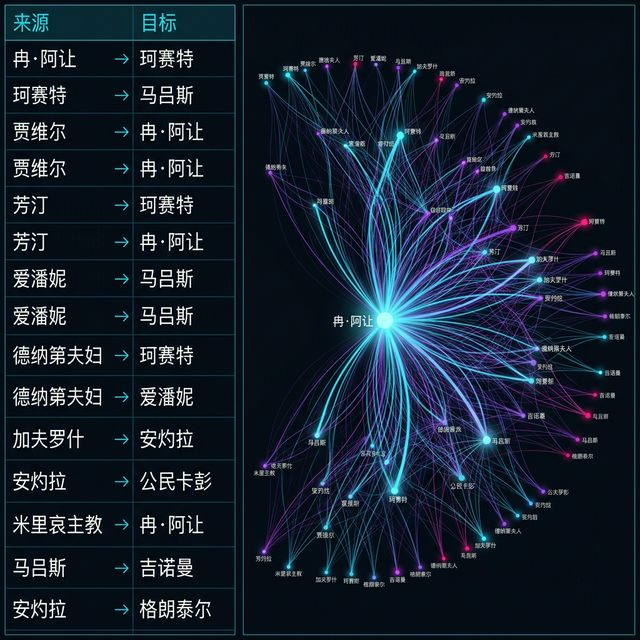

我们的大脑天生容易理解点和线交织的图形。将实体画成圆点，将关系连成线段，这种**节点-链接图，英文称作 **Node-Link Diagram**，** 是人类描述关系时最直觉、最无需解释的视觉隐喻。它直接使用了**连接通道，即 **Connection marks****，极其适合执行拓扑结构任务，即 **Topological Tasks**。例如，当你想弄清“经过几个人才能认识总统？”，或者想锁定那个横跨了两个截然不同社交圈子的“结构桥接点”人物。人的眼睛具有天生的寻路本能，顺着实体线条一路摸爬滚打摸索过去，就如同在迷宫中牵着 Ariadne 的红线一般安稳。

> [VISUAL]
> *   **Slide**: `W05_Node_Link_Traces`
> *   **Layout**: `Full`
> *   **Scene**: 一张突显“拓扑寻路”的交互动图：当鼠标悬停在边缘的一个小圆点时，一条高亮的红色光带立刻顺着错综复杂的灰色连线，途经三个中转节点，最终直达位于中央的超大核心节点。其余次要连线被大幅暗化。
> *   **Asset**: 

正如屏幕上这张演示拓扑寻路的图例：当你们的视线跟随这只悬停在边缘小圆点上的鼠标时，你会立刻看到一条高亮的红色光带顺着错综复杂的灰色连线，途经三个中转节点，最终直观而无误地直达位于中央的超大核心节点。在这个过程中，系统自动将周围其余的次要连线大幅暗化，排除了多余的视觉干扰。这种指哪打哪的设计，就是 Node-Link 最引以为傲的寻路体验。但是，正如硬币的两面，这种清澈的直观性在真实世界中是有极大代价的。

### 1.2 遮挡灾难：Node-Link范式的物理极限

> [TEACHING MOMENT]
> **知识节点**: `network-matrix-tradeoff`
> Node-Link 架构具备极高的局部路径追踪直观性。但它伴随一个致命的数学与视觉灾难：**遮挡灾难 (Occlusion)**。当网络中的边的密度急剧上升，尤其是**边密度 (Link Density) 突破 4 倍节点数**时，所有线条将会在节点间疯狂交叉穿透。原本清晰的网络结构会在视觉上迅速退化成一个不可读的、令人窒息的“毛线球” (Hairball)。这种视觉坍塌是 Node-link 范式无法逾越的物理极限。

> [VISUAL]
> *   **Slide**: `W05_Hairball_Disaster`
> *   **Layout**: `Comparison`
> *   **Scene**: 左侧展示一个 50 个节点、80 条边的清晰优美网络图。右侧展示一个含有 500 个节点，却有 3000 条高密度交叉连线的图。右侧的图已经被层层叠叠的黑色线条彻底涂抹成了一团无法分辨任何结构的黑色墨斑，旁注红色大号警告词：“Welcome to the Hairball”。
> *   **Asset**: 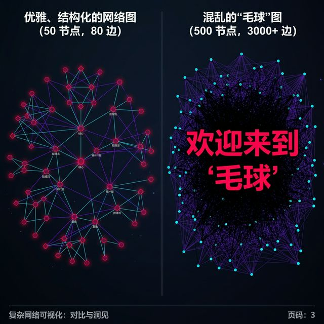

> [STORY TIME: 从清澈池水到混沌泥潭的毛线球噩梦]
> 想象一下，你们正在为一个重大的公共卫生流行病学调查项目制作接触者追踪网络。在初期，只有几十个确诊病例（节点）和清晰的同飞航班接触史（链接）。屏幕上的 Node-Link 图如星历般清澈，你能极其轻松地指出谁是“零号病人”，并且追踪到每一条二级传播链。观众们看着这个图，纷纷由衷地赞叹设计的精妙。

> [VISUAL]
> *   **Slide**: W05_Hairball_Evolution
> *   **Layout**: `Full`
> *   **Scene**: 一张动态演变图，展示网络连接随时间激增，从清澈的星团转变为密不透风的纯黑毛线球的过程。
> *   **Asset**: 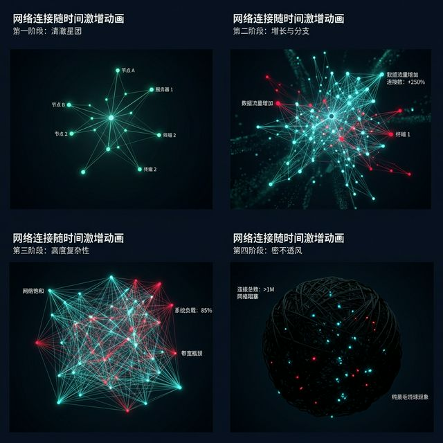

> 随后这演变成了一场灾难。到了第二个月，病毒发生了社区大爆发，系统中瞬间涌入了三万个确诊节点，而且因为大家去过相同的超级市场和公共交通枢纽，导致后台生成了将近十万条接触边。当你自负地将这些数据再度喂给底层的 D3 或者 ECharts 渲染引擎时，噩梦降临了。那张原本优美的星图，被瞬间密密麻麻、疯狂互相穿凿的几十万个交叉点和纠缠不清的细线彻底吞噬，变成了一团纯黑的、犹如毛线球般的死死结构。在这个“Hairball”的深渊里，别说寻找所谓的传播途径，你甚至连最核心的那个超级传播节点都无法从这层层包裹的黑色漆网中剥离出来。这不仅是算力的崩溃，更是视觉通道表现力的极限枯竭。

### 1.3 邻接矩阵：舍弃连线的降维升华

既然点线交织的物理形态注定会在海量数据的压迫下走向拥堵不堪，那我们能不能彻底抛弃“连接线”这个惹麻烦却又被人们长期依赖的东西？难道失去连线，我们就无法理解关系了吗？

> [VISUAL]
> *   **Slide**: `W05_Adjacency_Matrix_Intro`
> *   **Layout**: `Split`
> *   **Scene**: 左半打出密密麻麻如毛线团的超大关系图，令人作呕发慌；右侧则是一个整齐划一、色彩像素如同马赛克墙般极度冷峻铺开的彩色矩阵视图。动画演示：一条连接两个特定节点的蜿蜒线段，瞬间崩解化为右侧矩阵中相对应行与列交汇处点亮的一个高亮彩色方块格。
> *   **Asset**: 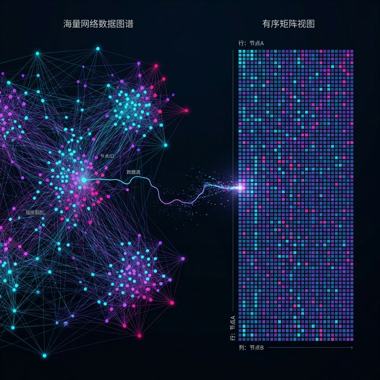

请看屏幕两侧这极具视觉冲击力的对比。左侧依然是那个令人望而生畏、密密麻麻如毛线团般的 Node-Link 连线网。但请注意看右侧——此时，我们的动画演示正在拆解左图中一条蜿蜒连接着两个特定节点的线段。它瞬间崩解，化为了右侧那面如马赛克墙般整齐划一、冷峻排布的矩阵中，其相对应行与列交汇处点亮的一个高亮彩色方块格。通过这一个像素格的点亮，我们可以将网络结构做一次数学上的升维（或从视觉上看是降维）衍生，转化为一种特殊的表格形式：**邻接矩阵，英文即 **Adjacency Matrix****。

在这个巨大的二维矩阵中，我们粗暴地抹除了空间与线条。所有的节点名字既作为横轴的列标题平铺，也作为纵轴的行标题陈列。而两者相交的那个方形网格，就用来标定这两人是否存在直接联系——如果认识就填充显眼的颜色（面积或颜色通道映射），如果不认识就干脆留白。如果存在更深层次的数据厚度，比如两人之间的资金往来额度或信息收发频次，就把那个网格格子的色彩饱和度调深，或切换色相。

> [VISUAL]
> *   **Slide**: `W05_Matrix_Scalability`
> *   **Layout**: `Full`
> *   **Scene**: 一个带有百万级网格渲染的离屏缓冲矩阵截图，远看如同一幅极其细腻庞大的数字织锦画。标注：在没有一根交叉线的情况下，我们铸就了十万级别连接的微型可视化。屏幕甚至能够毫无负担地加载并渲染如此庞大的数据方阵，这就是无交叉结构带来的无上扩展力。
> *   **Asset**: 

这听起来极其违反人类用“连线找物”的直觉操作，抛弃了直截了当的线条段落，换来的是什么？换来的是**极高的信息密度扩展性与绝杀般的遮挡消除能力。**

矩阵视图能在单屏幕内轻松承载百万条边而不会发生哪怕一像素的交叉重叠与遮挡悲剧！所有的关系被高度格式化进了行与列的坐标轴内。而且，它的布局具备绝对的数学稳定性。你今天在系统中增加一个新的员工或者监测站，不过是在矩阵最边缘处多增加一行一列的极其微小变化，而绝对不会像点线图那样，由于重力的牵扯而可能引起全图大规模结构性重排带来的视线断崖。

> [CASE STUDY: 洞若观火的派系解码——矩阵特征模式的透视术]
> 矩阵看似一堵密不透风的砖墙，但在受过严格训练的数据分析专家眼中，它比那些乱麻般的 Node-Link 连线网更能极其犀利地揭示出整个组织掩藏在最深层的宏观模式 (Characteristic Patterns)。

> [VISUAL]
> *   **Slide**: W05_Matrix_Pattern_Reading
> *   **Layout**: `Full`
> *   **Scene**: 在一张巨大的离屏缓冲矩阵截图中，用虚拟放大镜圈出了几个极其扎实的“实心大方块”（派系）和一条贯穿画布的色带（情报枢纽）。
> *   **Asset**: 

> 请想象如果你审视一家含有几百人的大型跨国公司日常邮件往来的邻接矩阵。在通过适当的行聚类聚拢算法后，你会惊奇地发现在以对角线为核心的区域，出现了一个个深浅不一、极其扎实密集的“实心大方块”。在复杂的 Node-Link 连线图里，这叫做一个高密度的帮派或派系 (Clique)；但在连线图那团乱麻中，你只觉得那里特别黑。而在这张矩阵表里，这个完美的方形色块极其清晰地向你宣告：这几十个人在内部呈现一种极度抱拢的、人人互通的有毒信息闭环。
> 
> 再比如，如果你的目光在这张二维网格图上扫过，突然发现某一行或某一列，几乎被颜色长长地填满成了一条贯穿整个画布的色带。这同样也是极其震撼的讯号：在那个布满乱线的图里，这个人可能只是连接线极多导致看不清面目的“高分叉点”；而在矩阵的严整规则下，这条长长的实心色带极其生动地揭发出：这就是全组织名副其实的中央情报枢纽或者广播站节点。他触及了组织内几乎所有的神经末梢！

> [VISUAL]
> *   **Slide**: `W05_Matrix_Cliques`
> *   **Layout**: `Comparison`
> *   **Scene**: 上方为一堆连线杂乱聚集的点集，下方为与之完全对应的邻接矩阵图。用红色高亮标出矩形对角线上的深色实心方块簇（Cliques）以及一条长长的贯穿矩阵的深蓝色整列（高连通枢纽节点）。
> *   **Asset**: 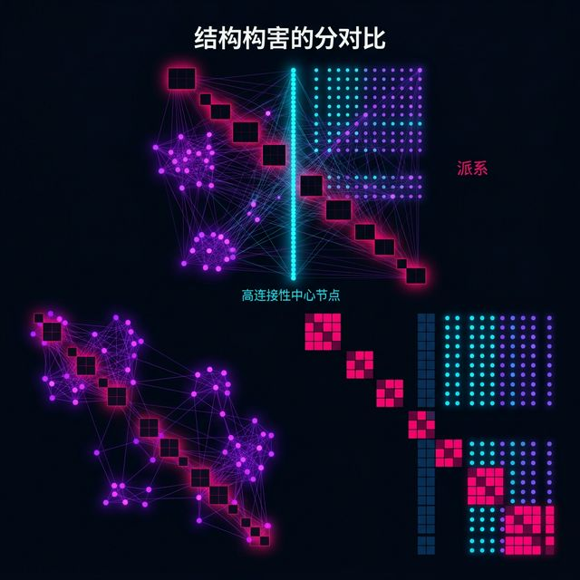

### 1.4 设计权衡法则：矩阵与连线的取舍

但这其中也是有代价的。当你扫视矩阵时，你极难再去顺畅地执行追踪“我想看看经过张三认识李四然后再拐去认识王五”的复杂接力搜索路径了。因为在这方阵中追踪两、三跳以外的间接联系，需要让眼睛极其痛苦地在行与列之间经过多次跨度极大的“折返跳跃”。

这引出了整个网络构图学最核心的法则：**视觉设计永远是一门关于 Trade-off（权衡与抛弃）的艺术**。想要微观细致的曲折连线追踪，甚至想要看清人物间的纠葛，就用 Node-Link 以忍受其可怜的规模红线极限；想要一夫当关的宏观高密度整体概览，甚至洞悉隐藏极深的矩阵群岛现象，就用 Matrix 以牺牲追寻故事细节和直观性为代价。

> [VISUAL]
> *   **Slide**: `W05_Hybrid_Network_Design`
> *   **Layout**: `Full`
> *   **Scene**: 展现一种主流的前沿混合设计 (Hybrid Multiple-view)：左侧为一个占据主屏四分之三的巨大信息矩阵以宏观检索派系，当用户鼠标点击矩阵中的某一可疑色块群时，右侧弹窗会立即联动渲染出一张小范围内的极其清晰的高清 Node-Link 细微连线图。标注：用矩阵寻宝，用连线解剖。
> *   **Asset**: 

> [CASE STUDY: 中国社会网络研究与数据艺术的社会责任]
> 当我们将网络可视化技术运用于严肃的公共领域时，这种对数据的呈现形式不仅涉及技术抉择，更上升为一项异常重大的知识伦理。
>
> 近年来，中国学术界在社交网络拓扑与政治、传播学的交叉地带展开了大量深入的前沿探索。例如清华大学新闻与传播学院沈阳教授领衔的新媒体研究中心，长期聚焦于微博舆情大数据和网络拓扑传播机制的系统研究，其团队发布的《新媒体发展研究》系列报告在业界具有广泛影响。同时，近年来核心期刊对微信辟谣信息传播拓扑结构的剖析也日渐深入。国内学者不仅使用力导向图实时追踪每一次转发的动态传播路径，更深入解构了这些路径后潜藏的群体心理机制与“信息茧房”效应的固化过程。

> [VISUAL]
> *   **Slide**: W05_Social_Network_Surveillance
> *   **Layout**: Split
> *   **Scene**: 左侧是拯救生命的防疫追踪流调网络，右侧是刻画少数派的监视网络，两者在物理形态上都是力导向图，但因其背后的社会意义而产生截然相反的隐喻。
> *   **Asset**: 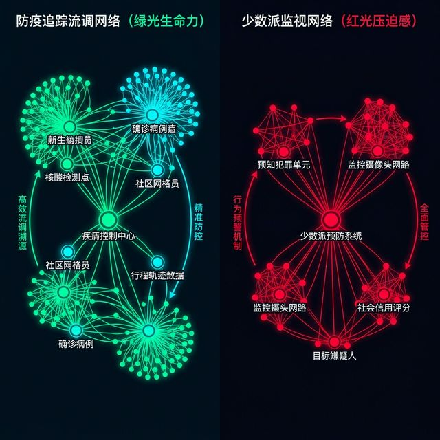

> 这些强大的图形不仅能清晰揭露谁是操纵舆论走向的“超级网络水军节点”，更能在宏大的信息矩阵中让那些互不倾听、只在一个封闭派系格子内疯狂自我验证的“信息茧房”和“回音室效应”原形毕露。
>
> 然而，当我们拥有了这种以上帝视角凝视芸芸众生错综复杂关系的能力时，这种能力本身就化作了一把无比锋利且冷血的双刃剑。它在公共危机时刻，能成为最精妙的手术刀，被防疫人员用来绘制新冠疫情爆发初期的超级密接流动图网络、拯救成千上万潜藏在暗处的高风险人群。但在缺乏伦理锁定的滥用下，它又能极易沦为大规模窥探用户隐私、刻画脆弱少数派社交画像、并实施精细信息围栏操控的监视武器。在这里我要深刻提醒大家：作为一名未来的数字空间架构师和数据艺术家，你在撰写代码、决定将谁连到谁身上时，必须时刻凝视自己内心的社会责任底线：你的网络全景图，到底是在拼命揭示那些被遮蔽的底层真相，还是在毫无底线地参与制造更深层次的偏见与凝视？

> [ACTIVITY]
> **Type**: `Workshop`
> **Duration**: `45min`
> **Desc**: “矩阵中的关系谍影”模式识别与手工重建高压练习。
> 1. 提供三张已脱敏的高精密大型组织内部邮件往来频率的邻接矩阵图（只有像素网格颜色的深浅分布，绝不提供任何线图辅助）。
> 2. 小组必须通过极限观察，找出并用记号笔圈出对应矩阵图纸中的“隐藏特征模式 (Characteristic Patterns)”。
> 3. 要求指认并写出结论：主对角线上聚集的密集实心方块簇代表了哪个内部极度抱团、对外排斥的 Clique 孤岛部门？那条横跨整张画卷的数据列又是谁在向全组织疯狂散播信息？
> 4. 手工反向降维：每组拿两套仅含 20 人的社交关系原始文字清单文件，要求在极其高压的 15 分钟内，分别在空白图纸上手工绘制出传统的 Node-link 连线图和高度格式化的 Adjacency Matrix 填色图。
> 5. 教师对比并引出讨论：在巨大的时间压力下，绘制并解读哪种图形让你们精神更为紧绷？这种从散乱点线强行过渡到规整矩阵填色，如何深刻彻底地改变了你们对多维抽象数据降维排布的思维范式？

### 1.5 柯尼斯堡七桥与欧拉的降维魔法

> [STORY TIME: 跨越几百年的数学迷梦——从柯尼斯堡七桥到百亿节点网络]
> 要真正理解 Node-Link 连线图为何对人类有着如此致命的直觉吸引力，我们必须把时间的长镜头摇回到十八世纪的普鲁士王国，回到那个被孕育出整个现代图论 (Graph Theory) 根基的伟大发源地：柯尼斯堡 (Königsberg)。
> 当时的柯尼斯堡有七座美丽的桥梁连接着被河水分隔的两座岛屿和两岸。市民们一直热衷于一个极其无聊的散步问题：一个人能否在一次极度完美的周日散步中，连续不重复地走遍这七座桥，并最终回到原点？
> 这看似是一个属于导游和强迫症患者的迷宫游戏，直到伟大的数学天才莱昂哈德·欧拉 (Leonhard Euler) 凝视着这张极其复杂的城市真实物理地图。欧拉做出了人类历史上最惊世骇俗、也是最伟大的一次“视觉剥夺与数据降维抽象”：他粗暴地抹去了地图上那些美丽的古典建筑、抹去了宽阔的普列戈利亚河流水位、抹去了所有的街道尺寸和物理距离。在他的稿纸上，那两座庞大的岛屿和辽阔的两岸陆地，被残忍地压缩成只有四个没有任何面积的“抽象圆点 (Nodes)”，而那七座雄伟的实体桥梁，被简化成了七条虚无的“连线 (Links)”。

> [VISUAL]
> *   **Slide**: W05_Konigsberg_Bridges
> *   **Layout**: `Comparison`
> *   **Scene**: 左半边是一幅极具复古风格的柯尼斯堡七桥真实古典地图，右半边则是被欧拉粗暴抽象后的 4 个节点和 7 条连线的极简拓扑图。
> *   **Asset**: 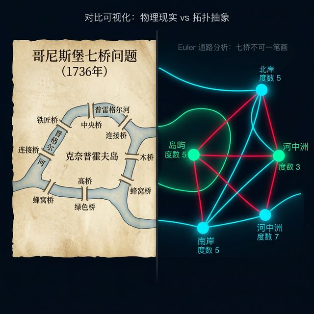

> 他通过这种极度违背人类感官直觉的极端剥离，将一个庞大的实体城市地貌，彻底淬炼成了一个纯粹由点和线构成的数学网络拓扑宇宙。随后他仅仅通过计算每个点上连接线条的奇偶数，就极其优雅地终结了这个悬案，并顺手推开了整个现代网络科学体系的大门。
> 我们今天在 D3 里画下的每一个代表微信用户的圆点，画下的每一条代表转账记录的连线，其最核心的灵魂与底层逻辑，依然完全是在向几百年前欧拉在那张羊皮纸上画下的四个粗糙黑点致敬。这就是为何尽管 Node-Link 会面临可怕的毛线球遮挡灾难，但人类永远无法、也绝不能彻底抛弃它的原因：因为它不仅仅是一种图表，它是人类用极致的数学理性去对抗这个混沌、复杂、多维运转世界的最纯粹的思维降维武器。

> [TEACHING MOMENT: 双模结构的隐秘战线——二分网络 (Bipartite Networks)]
> 当我们沉迷于人与人直接认识的单模同质网络矩阵时，不要忘了还有一种极具挑战但也极具现实杀伤力的变体：二分网络。这是一种节点被严格分为两类，且连线只能在不同类之间发生的网络。比如：左边是 500 个投资人名字节点，右边是 1000 家创业公司节点，连线代表“谁投资了谁”。这在风投圈和金融洗钱追踪中极其常见。
> 这种网络如果强行用常规的力导向画出来，由于中间的交织极其密集，会立刻引发全屏爆炸式的剧烈穿模。因此，处理二分网络的视觉权衡更为极端：我们往往需要先在算法底层做一次“单模映射投影折叠”。也就是既然 A 投资了某公司，B 也投资了这家公司，我们就在大后台直接悄悄连一根“A 与 B 的隐藏连线”。通过牺牲掉那家公司节点，换来了对投资人抱团派系的极度清爽透视。这也是网络可视化中极为高阶的“结构裁切”手段。

### 1.6 网络时代的侦探武器：三大中心性全景解剖

> [STORY TIME: 谁是真正的幕后黑手？网络中心性 (Centrality) 的视觉侦探]
> 当我们不得不使用 Node-Link 连线图去面对复杂的社会关系网络时，仅仅画出点和线只是完成了数据翻译的最底层工作。作为数据侦探，我们真正关心的永远是：在一座拥挤不堪的数据城池里，谁才是权力的核心？谁是掌握信息通道的咽喉？
> 为了在视觉上回答这个问题，网络科学引入了三大令人着迷的度量指标：**中心性 (Centrality)**。当我们把这些复杂的数学指标，绝妙地映射到节点的视觉通道（如节点面积、颜色亮度）上时，一张原本平淡无奇的关系网，瞬间变成了一副极其生动的阶级权力图谱。

> [VISUAL]
> *   **Slide**: `W05_Degree_Centrality_Hubs`
> *   **Layout**: `Full`
> *   **Scene**: 第一张权力图谱。网络中的所有线段均被调成了极其暗淡的本色，唯一引人注目的是散落在星丛各个位置的某些圆点。这些节点的大小被直接与其代表的人物交际广度相挂钩（映射为其连线数量的多少），最典型的那些交圈极度广泛的节点犹如红巨星一般膨胀，显得极其耀眼。
> *   **Asset**: 

第一种也是最暴力的：**度中心性，即 **Degree Centrality****。它的逻辑极其简单粗暴——谁认识的人最多，谁的权重就越大。在这张图里，我们将节点的度数直接映射为圆形节点的半径大小，即 **Size encoding**。你会立刻看到，那些处于交际花地位的节点变得如同巨大膨胀的红巨星般耀眼夺目。但这种视角往往是极其短视和充满欺骗性的！因为有时候，一个基层推销员他确实认识几千个人，但他认识的全部都是底层边缘客户，所以他在整个网络生态和公司高层博弈中的真实权力其实微乎其微。我们要找的并不是认识人最多的人，这就需要寻找更高阶的视角。

> [VISUAL]
> *   **Slide**: `W05_Closeness_Centrality_Heat`
> *   **Layout**: `Full`
> *   **Scene**: 第二张热力透视图。此时，节点的大小被全盘重置到完全相同，而是改用了一种绚丽的热力渐变色谱来包裹节点：从象征极度冷漠偏远的冰蓝色，平滑过渡到象征处于全网几何核心、拥有最高能量的岩浆赤红色。画面中最中央的少数紧凑节点正在散发出耀眼的红光。
> *   **Asset**: 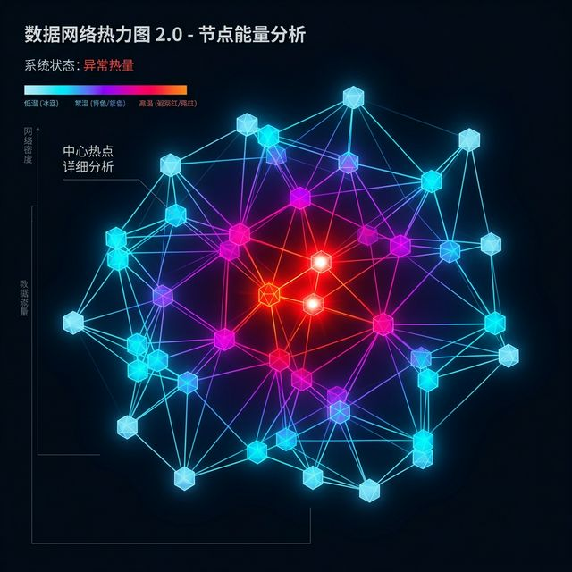

第二种则是深不可测的：**接近中心性，即 **Closeness Centrality****。它测量的是一个节点到达网络中任何其他所有节点的“平均最短跳数距离”。如果我们将这种代表传播深度的距离，直接反转映射为节点颜色的热力值（从冷酷的边缘冰蓝色，平滑过渡到炙热的核心岩浆红），你会惊奇地发现，正如画面中央这些发红的节点，它们虽然只有区区几个直连的朋友（度数极低、面积极小），但由于它的位置极其完美地处于整个网络的几何物理核心深处，导致它的颜色热力值却红得发紫！这意味着它能以全网最快的物理传播极限速度把一个消息或者谣言广播给所有人。这才是真正拥有高效资源调动能力的隐秘大佬。

> [VISUAL]
> *   **Slide**: `W05_Betweenness_Centrality_Bridges`
> *   **Layout**: `Full`
> *   **Scene**: 第三张致命桥接图。屏幕上的浩瀚网格展现出两个巨大庞然且自身高度极度密集的星团（Clique 岛屿）。在两个庞大星团之间，存在着一条细若游丝的单薄连线。此时，所有的光芒与重点渲染完全聚焦于这条连线两端的那两颗看似微不足道、犹如微粒般微小但色彩饱和度高得刺眼的独特过渡节点上。
> *   **Asset**: 

第三种是最致命、最腹黑的：**中介中心性，即 **Betweenness Centrality****。它是整个网络权谋游戏的最巅峰。它计算的是，如果任意两个节点想要联系，有多少条最短捷径是“必须经过你”的？那些中介中心性畸高的节点，被称为“结构洞挖掘者”，英文即 **Structural Holes**。在视觉呈现上，正如这条细若游丝的单薄连线两端的高亮微型节点，它们往往孤零零地存在于两个巨大但互不相干的星团式 Clique 之间，像一座孤独的单薄横跨窄桥。如果你在这条连线上做一个剪刀切断的交互动画，整个代表大型公司的系统网络会瞬间一分为二，彻底断裂成两个相互隔绝、无法通信的死岛！这就是网络中的致命咽喉！利用这三种中心性做视觉加权缩放映射，是我们在一团仿佛令人绝望的毛线团迷宫中，极其犀利地找出核心猎物的斩首核武器。面对几万条线交织的数据迷雾，不懂得释放中心性高光引路的设计师，就像戴着眼罩在雷区里绝望裸奔。

## PART 2 生成艺术引擎：力导向与重力诗学
<!-- BUDGET: 2700 chars | SLIDES: ≥5 | STATUS: done -->

### 2.1 力导向放置模型：让粒子自己寻找坐标

当我们艰难却深刻地理解了 Node-Link 连线图在中小规模网络中直觉无可替代之后，我们必须面对它的下一个梦魇：到底该把这些散乱的点画在屏幕的什么地方？

如果在常规地图上，每个省份都有极其神圣、不可争辩的死板经纬度坐标，国家和城市画在那里天经地义。但现在，面对这些极端抽象的“人物社群关系网络”或者是“论文引用传递全景”，它们有实际的物理坐标吗？一个人应该放在屏幕中心还是边缘？两个人应该隔开多远？并没有现成的自然空间字段坐标。这就是 Munzner 八大法则里遇到的极限境地：位置这个具备第一效能统治力的视觉通道，当前空空如也，等待我们去人为赋予。

最传统的枯燥思维，是使用极其死板生硬的层级树图、或者像钟表刻度一样的圆形环形阵列布局来排布它们。但在数字媒体艺术的前沿阵地上，这种毫无生气的工程师方法正在遭到强烈的批判与抛弃。因为 DMA 追求的是有呼吸感的动态生命、是自适应生成的自相似性规律展现。在这里，我们将引入 D3.js 框架底座下最具魔力、同时也最接近艺术本质的内置物理引擎机制——**力导向放置模型，也就是 **Force-Directed Placement****。

> [VISUAL]
> *   **Slide**: `W05_Force_Physics_Evolution`
> *   **Layout**: `Grid`
> *   **Scene**: 在四分格屏幕画面中分别展示四种物理基础力在浏览器前端的实时动效模拟结果。画面充满暗黑氛围下的流体发光材质。
> *   **List**: 1. 向心力 Center Force 2. 排斥电荷 Many-Body Force 3. 弹簧张力 Link Force 4. 碰撞体积 Collision
> *   **Asset**: 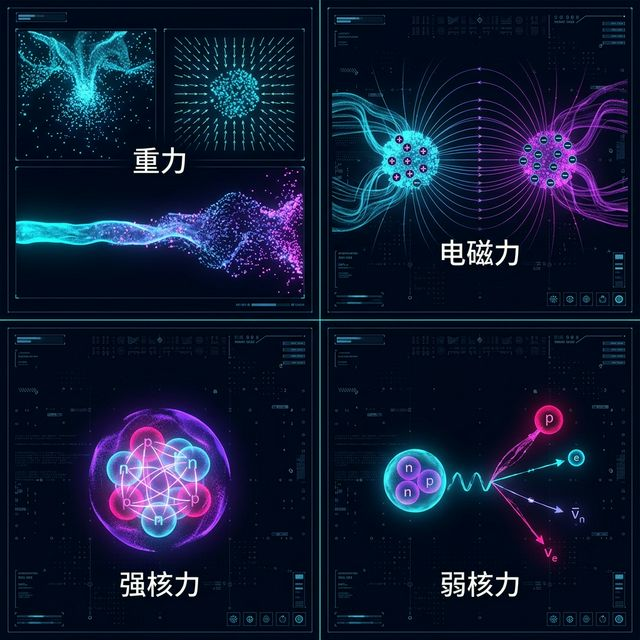

力导向模型彻底颠覆了传统的像素排布法。它根本不预设任何数据的绝对屏幕像素坐标，而是通过上帝视角般部署全量局域物理法则的暴力对抗计算，让数据粒子“自动生成并推演”出它们最终应该待在的形态位置。这种由计算机底层的迭代算法代理了原本由艺术家手工打磨布置过程的体系，正是数据可视化跨步走向**生成艺术 (Generative Art)** 殿堂的绝对桥梁！你不再是那个一笔一划直接拿画笔蘸着颜料涂抹的疲惫画师，而是化身成了高高在上、制定这个数字微缩宇宙运转基础规则的造物主。你的职责是写下宏大的引力与斥力大小系数，剩下的生命繁衍，全交给代码算力去残酷演化。

### 2.2 造物主的代码：主控四种引力场

> [TEACHING MOMENT]
> **知识节点**: `force-directed-artistic`
> 在大名鼎鼎的 D3 框架中，我们作为造物主主要精准掌控四种极具破坏力和约束力的“引力场”控制手柄：
> 1. **向心力 (Center Force)**：这是维持整个微缩宇宙不至于彻底崩溃溃散的边际约束底线。就像黑洞在无形中维持大局引力，它保证了成千上万个正处于激荡碰撞状态的粒子即便发生怎样惨烈的冲撞，最终也会被缓慢而坚定地死死拽回屏幕中央的可见视野内，不至于飞出浏览器视口彻底丢失在虚空中。
> 2. **排斥电荷 (Charge / Many-Body Force)**：我们残忍地给每个数据节点赋予了同性相斥的强烈负电荷。它决定了网络空间的基础呼吸感和稀疏感。这种力模拟电磁斥力，电荷力气被你设得越大，节点们就越是恐惧般地疯狂飞离彼此，整个数字宇宙就显得越加空荡、疏离甚至孤寂悲凉。
> 3. **弹簧张力 (Link Force)**：也就是极其羁绊的关系引力。关系越好、通信频次越高的朋友节点，连接它们线段上的弹簧系数与拉力就越大。即使上述的排斥力在发疯般想把我们推开，这根代表了坚固友谊或商业交易的弹簧也会死死把我们锁在一个极度拥挤的局部圈里。
> 4. **碰撞体积 (Collision)**：为了防止两个球体节点在剧烈弹簧拉扯碰撞时完全重叠在一起变成一个导致无法分辨，我们赋予它们不可侵犯的硬核物理直径壁垒。

> [VISUAL]
> *   **Slide**: `W05_Emotional_Metaphor`
> *   **Layout**: `Split`
> *   **Scene**: 左半边展示一幅极度膨胀、稀疏且散发着幽蓝冷光的“孤独症社群”散点网络（排斥力极强，连接张力极弱），右半边展示一幅紧紧挤压在一起甚至发生了核聚变般高亮橙红光芒的“信息茧房”聚集网（极弱的排斥，极强的弹簧张拉）。配字：引力的系数，就是群体情绪的刻度。
> *   **Asset**: 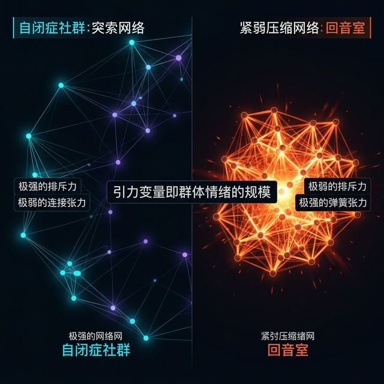

这听起来全是大四计算机工科生啃噬的晦涩物理公式代码，但当你将它们与极度柔软、感性的人文社会漂泊数据结合在一起时，一切就不只是冷冰冰的受力分析物理了，它瞬间化为了最具冲击力的**情绪映射与隐喻表达，也就是 **Emotional Metaphor****。

当你把代表疏离的排斥力参数调到极大，同时把将人拉近的向心力阈值调到极弱时，你能立刻、直观地在屏幕上那些仿佛永远无法靠近的浮游粒子中，极其惨烈地“感到”边缘社群的分崩离析与大都市个别人群之间深深的物理与精神隔膜。而那个在四五种力量互相拉扯下，从最初的剧烈抽搐、疯狂震荡，到最终精疲力竭慢慢达到恐怖动态平衡收敛定格下来的图形阵列，直观无比地传达了人类微小社群在形成时各种权力、阶级甚至资本力量抗争撕裂的微观全动态缩影。

> [LIFE CONNECT: 深渊里的生命搏动]
> 有别于那些一次性加载完毕、死板僵硬且一步到位的静态预渲染网络关系图，基于浏览器的每秒 60 帧实时演算力导向模型，在它达到最终热寂平衡前的那长达几十秒的疯狂痛苦挣扎运动本身，就带有一种令人极度震颤的浓烈赛博碳基双重交织生命感！我们就像是在高清显微镜下，死死盯着一杯浑浊且充满剧毒化学物冷水逐渐发生化学反应、沉淀、然后剧烈分层的惨烈过程。你可以极其震撼地亲眼目睹那些原本杂乱无章、散落在世界各地的核心商业大 V，是如何挥舞着强大的引力弹簧，像巨蟒一样疯狂吞噬、拉扯、收编外围那些无力反抗的弱小粒子点，最终演化坍缩成一个个牢不可破且密不透风的坚固商业帝国圈子的。这正是超越了图表美学的、最高级别的数据艺术所极致追求的情感绝对震撼力。

### 2.3 生成艺术固有的暗礁：算法假象危机

> [TEACHING MOMENT: 算法暴走与冷却的假象危机]
> 然而，当我们成为数字引力场的造物主时，绝不能被满屏乱飞的数据像素冲昏头脑。我们需要在此极度防范生成艺术固有的“失控发散与欺诈伪装危机”。这里存在两大极易忽视的技术陷阱。
> 
> 第一大陷阱是时间维度上的能量失控。在力导向算法中，有一个极其核心的心跳参数——摩擦衰减参数 (Alpha Decay) 或者是阻尼系数 (Friction)。这种基于弹簧振子的物理系统，如果一开始就缺少了让能量随着时间流逝逐渐衰减冷却的严密约束机制，整个网络宇宙系统根本无法达到最终的形态收敛。由于节点间互相撕裂、拉扯的力量过大，且永远全功率地相互运算，整个画布会陷入永无休止的高频剧烈抽搐、疯狂震荡之中。这不仅会把试图从中看出任何业务结构的观众看得当场恶心晕眩，更象征着这个数字模型实验在算法层面宣告了彻底的破产失败。它提醒我们，优秀的可视化必须“懂得何时停止运动”。

> [VISUAL]
> *   **Slide**: `W05_Force_Chaos_Illusion`
> *   **Layout**: `Split`
> *   **Scene**: 左侧是阻尼系数极低、处于疯狂高频震荡中的模糊“沸水状”网络节点，视觉干扰极强；右侧是经过 Alpha Decay 参数严密冷却后，完美收敛定型、呈现出清晰组织聚落边界的静止优雅图谱。
> *   **Asset**: 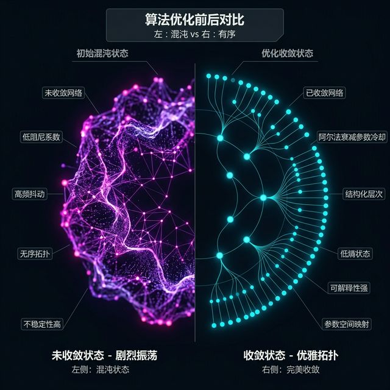

> 第二大陷阱在空间维度，即我们必须时刻警醒去提防的“虚假同盟派系”。很多时候，由于视觉上的遮挡灾难，你在画面上看到一群代表特定人群或公司的节点被紧紧地挤缩在一起，靠得极其亲密，你的直觉会立刻告诉你：他们组成了一个坚不可摧的利益同盟。但实际上，如果潜入后台代码逻辑你会发现极其可怕的数据欺诈：极有可能只是因为他们被外围更加庞大、更高压的其他阶层节点散发出的强悍排斥力，给极其不情愿地、硬生生地被动挤压在了一个狭小封闭的空间死角里而已！在这个假象的内部，在代码深处的邻接矩阵里，他们之间根本连哪怕一根真正的互帮互助连线牵引都没有。这是没有任何感情的冰冷物理算法，基于排斥挤压的视觉副产物，对人类大脑产生的最恶毒的视网膜欺骗性错觉！

> [ACTIVITY]
> **Type**: `Practice`
> **Duration**: `60min`
> **Desc**: 驯服赛博力场：利用 Vibe Coding 强硬指挥 D3 `d3-force` 框架生成深邃引力网。
> 1. 提供一份已经经过高度清洗标注的极其庞大的 `les_miserables.json` 悲惨世界小说人物交互微型网源文件。
> 2. 各小组开始基于最硬核的 `d3-force` 底层引擎，利用自然语言逐步跟 AI 大模型开展长线拉锯对话，先编写并输出基础的关系悬浮气泡图。
> 3. 极速考验各组通过 Prompt 操纵宇宙力学隐喻的掌控力：下达严厉的对话指令：“我现在的设计要求展示法国那个时代底层极度撕裂的孤立无援感。请立刻修改代码，将所有粒子的 Many-Body 基础排斥力调高飙升至 -600；同时，请用强硬的防穿模碰撞避让约束函数彻底死死防止中心主角冉阿让的名字节点被一堆无关紧要的小配角遮挡围困，更重要的是，请立刻强制隐去所有节点之间的线条，我不允许画面上出现一丝连线，我只要用点与点之间绝对的拉扯真空距离空间来残忍代表亲疏远近！”
> 4. 高阶星际力场探索：疯狂尝试加入最新的 `d3.forceRadial` 强制环形径向力惩罚场，让属于特定底层阶位段落或财富等级的人物粒子，被极度残忍地强制锁定禁锢在某些极其狭小绝望的特定半径圆环轨道上无休止做圆周盘旋，深刻体会社会阶层固化限制这一残酷议题的终极隐喻表现。
> 5. 当极度复杂的长代码被大模型补全并在浏览器上最终成功带动画生成渲染完毕后，允许同学们用鼠标极度粗暴地去强行向外拉拽拖拽屏幕上的中心那个最大的主角圆球，感受整个关系网在极强的撕裂下仿佛被牵连的几万根高压橡皮筋网络一般发生大规模地动山摇的形变震荡波动反弹。用手指亲身体会这种“化身暴君肆意玩弄物理重力引力场”的极高密度动态实时生成无穷趣味兴奋感与技术强权！

### 2.4 从 Barnes-Hut 算法到算力拯救史

> [STORY TIME: 从天文星盘到赛博引力场——力导向引擎的创世传奇]
> 你们可能不知道，当我们今天只需极其轻松地敲下一句 `d3.forceSimulation()` 就能在浏览器窗口内立刻呼唤起一个生机勃勃地自行演化运算的数据宇宙时，这项技术的灵感起源，本身就带有一种强烈的宇宙天文浪漫主义色彩。
> D3.js 的创始人，那位在网络可视化封神的 Mike Bostock，在早期构建这个力导向底层体系的物理逻辑时，其实深深地借鉴了天体物理学中用于处理星系模拟的 Barnes-Hut 近似算法 (Barnes-Hut approximation)。想象一下，在宇宙空间中模拟成千上万颗恒星之间互为引力的拉扯，如果用最笨的计算方法去让每一个点和其余所有点相连计算引力，那将是一个极其恐怖的 $O(N^2)$ 计算灾难。浏览器早就因为内存发烫而崩溃了。

> [VISUAL]
> *   **Slide**: W05_Barnes_Hut_Quadtree
> *   **Layout**: `Full`
> *   **Scene**: 展示四叉树空间分割算法的原理。屏幕上的密集群集被一个巨大的冷酷网格框切分，每一个格子内部的大量粒子被等效为一个携带巨大引力的宏观超级节点。
> *   **Asset**: 

> 为了对抗这种算力崩溃，底层的工程师们引入了四叉树 (Quadtree) 空间分割算法。它像一个极其冷酷无情的主宰，将那些距离极其遥远、抱团挤在一起的巨大星系簇，在宏观重力拉扯层面强行粗暴地合并看作是一个极其庞大的“超级单一节点中心点”，从而使得浏览器能够在极微小的算力消耗下，支撑着数万个数据灵魂在你的屏幕面前翩翩起舞且依然保持着极其丝滑的 60FPS 满帧刷新率。
> 每当看着这些带着长长残影数据在互相纠缠中达到奇妙平衡，我就会感到这正是人类将浩瀚宇宙规律完美降维嫁接入代码微观世界的伟大艺术创举。我们所编写的并非干瘪的数据图，而是一套用引力对抗混沌的创世纪微型歌剧。

## PART 3 空间即隐喻：地理特征编码与无形的偏见
<!-- BUDGET: 4500 chars | SLIDES: ≥9 | STATUS: done -->

### 3.1 空间语义的霸权垄断：位置维度的先天枷锁

在刚才前两个激荡的模块中，我们不遗余力地研究了网络拓扑，那是一种在计算机内部依靠虚拟物理算法“自己凭空强制生出坐标系维度”的赛博结构。但现在，我们要把思绪从漫无边际的赛博空间，狠狠地拉回归到真实世界里最沉重、最不可撼动的绝对物理锚点上：**地理空间数据，即 **Spatial Data****。

对于国家人口普查、城市超密集交通流量 GDP 产值，又或者是带有经纬度的全球环流气象这些特殊领域的数据队列而言，正如 Munzner 教授在长达几十页的 Chapter 8《Arrange Spatial Data》这一极具权威性的教科书篇章中所定下的一条死命令：它们天生具有极强的不可辩驳的物理空间绝对属性，也就是 **Spatial Semantics**。这就带来了一个极其难以想象的视觉映射巨大便利，但也同时伴随着深不可测、令人不寒而栗的深渊级视觉谎言陷阱。

按照最底层的白皮书映射规约，既然真实世界的数据从诞生那一刻起就已经死死地自带了地球的绝对物理地理经纬度坐标系网格，我们作为架构师必然也要别无选择地优先且强制性地占用效能排名天下第一的“位置通道，即 **Position Channel**”——我们必须直接把那块地皮形状完美无缺地投射、平铺为画布上那层坚如磐石的渲染底图界限。

> [VISUAL]
> *   **Slide**: `W05_Position_Channel_Monopoly`
> *   **Layout**: `Split`
> *   **Scene**: 左侧展示完美的二维坐标系被地图经纬度完全占满，所有 X/Y 轴被锁死；右侧展示被迫降级使用的颜色和面积通道，标注它们在 Munzner 效能排名中的低位。
> *   **Asset**: 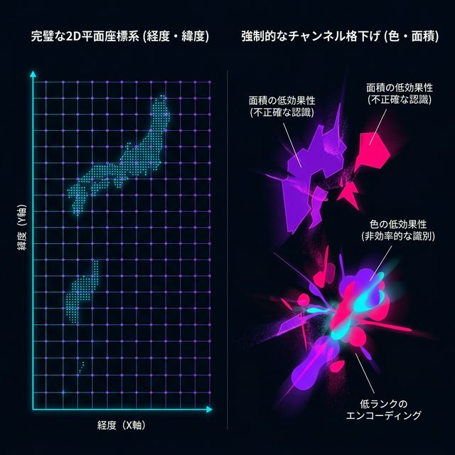

但悲剧便也由此极度不可逆转地发生了：这导致在地理制图这个古老的领域内，由于极其珍贵的二维 XY 位置编码通道已经被地图的经纬度死死霸占消耗殆尽，我们要想在图上表达出各个市区贫富差距悬殊数值或者是疾病感染患病率高低的极端差异变化，我们就几乎面临被彻底扒光的无牌可打的残忍境地！在这个绝境中，我们只能悲惨地依靠那几个信息传递效率大打折扣的其他降级次要通道——比如那变幻莫测极易混淆视听的颜色渐变通道，或者是机械僵化的面标记填充面积手法，去拼死一搏地指望。

其中被整个人类社会、被无数新闻联播节目和白皮书统计报告中应用最为烂俗广泛、以至于到了令人发指程度的视觉极度简化呈现标配形式，被称为**等值区域图，即 **Choropleth Map****。

> [VISUAL]
> *   **Slide**: `W05_Choropleth_Map_Illusion`
> *   **Layout**: `Split`
> *   **Scene**: 直接甩出一张充满极强视觉压迫感的美国大选多层分段设色经典全图，或者是含有中国不同省份人均高额惊悚负债率的经典多边形色块刺眼填满大地图展示。在这张被经纬度生硬切碎的地图上，那些面积无比广阔的大州被利用从极浅的枯竭鹅黄色到极度刺目的滴血深红高阶循序渐进色序 (Sequential Colormap) 粗暴蛮横地涂满了每一个边边角角，那块硕大无比的血红色块犹如一个正在吞噬一切的黑洞版图。
> *   **Asset**: 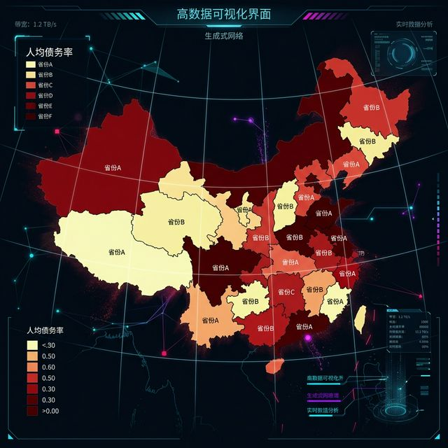

你看，也就是这种我们几乎从小到大在无数个新闻联播数据通报画面和政府各级各类枯燥统计报告册页里看吐了的所谓经典且极度“权威”的等值区域地图。它披着极其高大上、看似精确无误且威严神圣不可侵犯的国境、州县多边形地理物理边界的伪装外衣，用一块块没有任何感情波动的面标记死板色块覆盖了我们的视野。由于这些行政边界是国土测绘局经过极其严密的物理仪器丈量画出来的绝对客观事实结果，这导致它在不知不觉中给予了普通观看者一种极其盲目的、近乎于对科学铁律般的可怕安全感与极度信任度。它看起来仿佛真的是毫无破绽。

### 3.2 面积偏见的原罪：等值区域图视觉缺陷

> [TEACHING MOMENT: 面积偏见与认知偏差]
> **知识节点**: `choropleth-spatial-encoding`
> **立刻拉响视觉警报！**这看似完美的图表背后，其实潜藏着极易引发误解的视觉漏洞。我们需要审视这张等值区域地图最底层的编码机制：它不可避免地利用了人类生化视觉认知系统中的一个基础缺陷——**面积偏见 (Area Bias / Area Fallacy)**。
>
> 心理学家与神经认知学家的眼球追踪实验一致指向一个事实：在人类视觉皮层深处，“大面积的色块物理刺激”天生就能强行占据最高级别的优先处理带宽，从而引发强烈的视觉关注。

> [VISUAL]
> *   **Slide**: `W05_Area_Bias_Demonstration`
> *   **Layout**: `Full`
> *   **Scene**: 展示一张抽象的热力学原理图。屏幕上一个巨大的浅红色方块（代表地广人稀但面积庞大的区域）旁边，放着一个极小但呈现深红色的点（代表人口极其稠密的核心都会区）。动画演示：当观众眯起眼睛扫视时，那个极其微小的深红色点不可避免地被巨大浅红方块的视觉比重所吞噬。
> *   **Asset**: 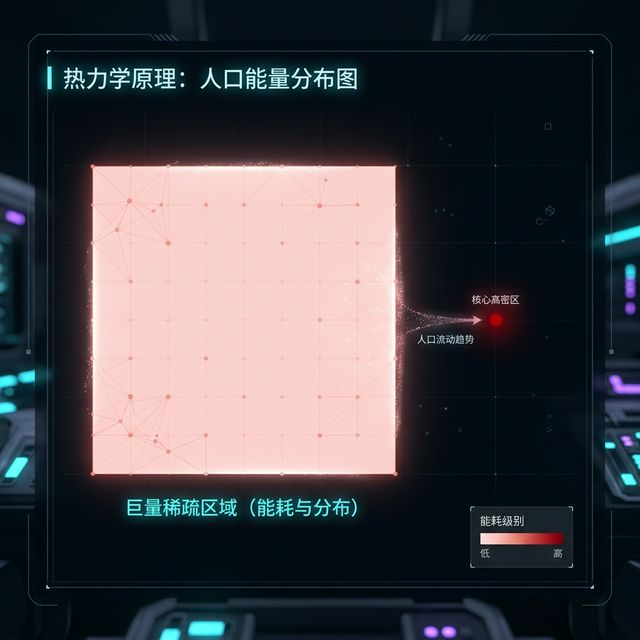

> 想象在一个描绘全国大选投票趋势，或者是展示某种流行病分布的大盘地图里。像某些面积庞大但地广人稀的不毛之地区域（例如大面积的冰原或荒漠地带），只要被涂上了代表某种属性的亮眼主色调，这些庞大的版块会由于无可匹敌的绝对物理面积，在观众视线扫过的第一秒，就带来极强的视觉误导。这种错觉会让人误以为该属性在全国占有绝对压倒性的优势。

> [VISUAL]
> *   **Slide**: `W05_Population_Density_Spike`
> *   **Layout**: `Split`
> *   **Scene**: 在一张全国人口密度的等值区域图中加入 3D 高度拔高的 Z 轴。此时可以看到，虽然中部大片地带被大面积色块霸占，但在沿海几个仅有芝麻绿豆般大小的城市上空，真实的人口数据化作了一根根高耸入云、直指天际的针状柱形图，这在 2D 平面地图上是完全隐形的，形成了极度强烈的反差。
> *   **Asset**: 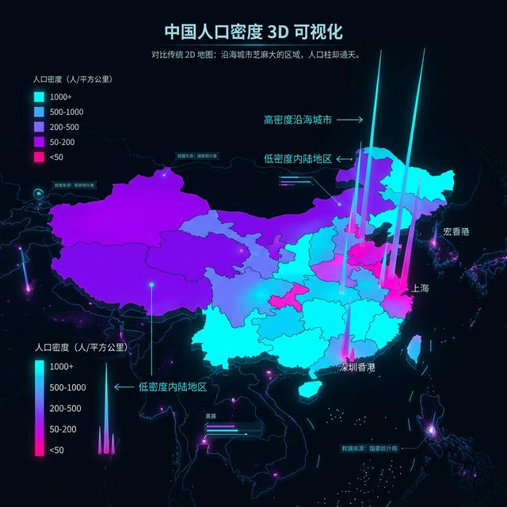

> 而在另一个极端，对于这个国家中那些早已被大量人口或财富高度填满的超级大都市圈而言——它们的实际数据体量极其庞大。但悲哀的是，在冰冷的物理面积数据上，它们可能仅仅只有针尖般大小。在这张只认“多边形面积”的经典图纸上，它们会因为自身土地面积过于狭小而被严重边缘化。不仅其负载的核心数据难被看见，甚至在观众快速扫视地图时，它们也会被旁边那些面积巨大的空旷区彻底淹没。

如果你在设计大屏前没有深刻意识到这一点，如果你用极其死板被动的**自然地理固定边界**，去强行承载与地理面积毫不相干的**人类社会密集高维数据**，这种不可调和的底层逻辑落差就会引发巨大的认知偏差。这意味着，当你处理关乎国家宏观经济、选情分布等高度敏感的社会舆论数据时，若只是单纯机械地调用第三方图表库生成一张等值区域图，而不人工干预与降权校正面积偏见产生的视觉误差，这在客观效果上等同于放任甚至推动了大规模数据误导的传播。在严肃的数据伦理框架下，这是绝对需要避免的低级失误。

> [CASE STUDY: “一片飘红”的选情视觉暴政与虚荣操纵]
> 让我们回到那张臭名昭著的经典选情地图——那是一张在每一次欧美总统大选后，都会在深夜新闻档和各大社交网络上被疯狂转发、引发极大社会心理震荡的“红蓝阵营等值区域图” (Red-Blue Choropleth Map)。
>
> [VISUAL]
> *   **Slide**: `W05_Election_Map_Illusion`
> *   **Layout**: `Full`
> *   **Scene**: 一张标准的美国大选结果等值区域图，整个中部和西部的大片广袤土地被刺眼的红色完全填满，而蓝色只可怜地蜷缩在东西海岸相对狭小的几点边缘地带。视觉上给人一种“红色阵营已经彻底淹没全国”的极度压迫性错觉。
> *   **Asset**: 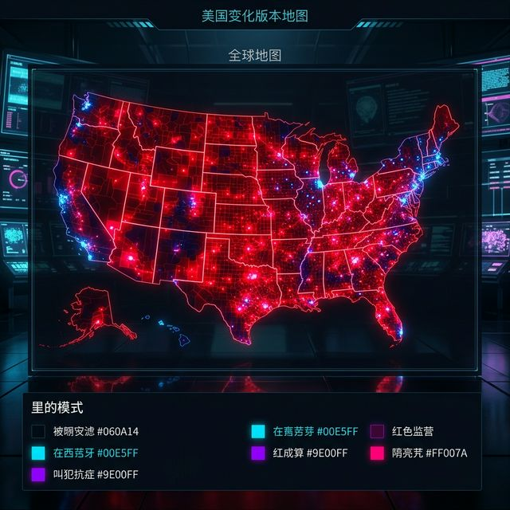

> 在这张标准地图上，只要你匆匆扫过一眼，你的视神经就会不可避免地向大脑皮层传递一个极其震撼的直觉结论：“红色阵营获得了压倒性的绝对胜利”。因为在这张图上，红色颜料所覆盖的屏幕像素面积，足足占据了整个国家版图的 80% 以上！而代表蓝色阵营的区域，在这片惊涛骇浪般红色的包围下，看起来就像是几座孤立无援、随时可能被吞噬的微弱孤岛。
> 
> 然而，在这张看似绝对客观的地理地图背后，却潜藏着数据可视化历史上最具欺骗性的“视觉暴政”之一。那些被大片红色填充的西部旷野和中部平原，可能是连绵数百英里的玉米地、荒芜的落基山脉和无人区。其物理面积虽然相当于几个欧洲国家，但覆盖其上的真实居住者甚至可能只有不到几十万名牧场主和农夫。而那些被极度压缩在海岸线边缘、渺小到几乎看不清轮廓的深蓝色光点，却是如纽约、洛杉矶、芝加哥这样人口密度极度集中、动辄容纳着上千万张真实选民选票的超级都市群落。
> 
> 当野心勃勃的政客们得意洋洋地把这张红彤彤的巨大地图打印出来四处张贴时，他们正是在极其恶劣地利用这层最为低级却极其有效的“土地面积等于支持率”的视觉惯性幻觉，来发动一场盛大且合法的数字心理战。这张在地理数据系和边界渲染上“完全没有说谎”的精确地图，却成为了撕裂社会认知、无限虚假放大荒野基本盘声量、并且在微观操作上打压打击另一方选民投票热情的完美认知战武器。它赤裸裸地向所有未来的数据架构师发出了最直白的铁血警告：如果你的画布对荒无人烟的土地面积赋予了与千万人口相等甚至更巨量的视觉权重分配，那么你这幅图景的本质，就已经不再是客观反映社会民意，而是一场数字级别的大范围感官操纵和对真相的冷酷掩埋。

### 3.3 变形地图的降生：以破坏多边形容貌换取数据正义

> [STORY TIME: 击破面积偏见的重拳——变形地图 (Cartogram) 的降生]
> 为了对抗这种因土地面积偏见而产生的视觉误导，在数据可视化领域的前沿，一群深谙人类认知规律的数据设计先锋发明了一种极具颠覆性、甚至可以说是彻底打破传统地理认知底线的视觉重构工具：**变形地图 (Cartogram)**。
>
> 它堪称数据制图界中的“立体派抽象艺术”，通过一种强烈的解构美学，向传统的绝对地理空间发起了挑战。

> [VISUAL]
> *   **Slide**: `W05_Cartogram_Algorithm_Demo`
> *   **Layout**: `Full`
> *   **Scene**: 一幅展示变形地图算法原理的过程图。地图上的网格不再性死板的经纬线，而是变成了一张充满弹性的柔软网床。算法正在根据每个区域代表的关键数据（如人口或 GDP），像揉捏橡皮泥一样，相应地拉伸或挤压这些多边形的边界。
> *   **Asset**: 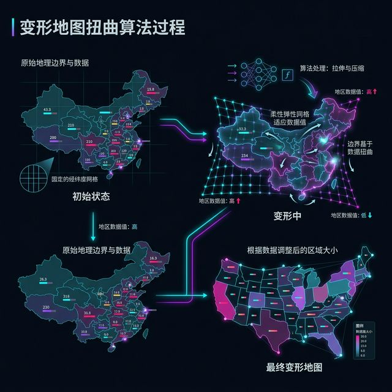

> 在变形地图的底层算法机制中，系统打破了那些原本被视为“金科玉律”的神圣不可更改的地理疆界与多边形面积红线。它执行了一道全新的空间重置法则：现实世界中每一个省份、每一个版块在物理空间上所占据的绝对面积，在这张数字画布上，必须完全让步并等比例匹配于该区块当前所承载的核心业务数据量（例如该地区真实的人口总数或是庞大的 GDP 经济体量）。在这套图表维度中，地图不再忠实反映山川河流的物理距离。
>
> 这就催生了一个极具视觉冲击力的奇特图景：在这张经过数据重塑的变形地图上，那些原本在西伯利亚旷野或美洲中西部腹地霸占了几百万平方公里、但真实人口却极其稀薄的庞大“空旷省份”，会被无情地压缩成一块只有少数像素大小、在画面上几乎快要消失的微小碎片；而在画面的另一角，像香港或新加坡这样地理面积极其狭小但经济高度发达、人口极度稠密的核心都市圈，会因为其背后庞大的核心数据支撑，而瞬间如吹气球般轰然膨胀，化身成为占据大半个屏幕视野的超级视觉巨物。

> [VISUAL]
> *   **Slide**: `W05_Cartogram_Distortion_Result`
> *   **Layout**: `Full`
> *   **Scene**: 一张极具震撼力的全球财富变形地图。非洲大陆和部分地广人稀的俄罗斯冰原被压缩得像是一根根干瘪的骨架线条；而北美东海岸、西欧以及东亚的几个超级都市群，则因为汇聚了全球绝大多数的资本，肿胀成了几个庞大无比的多边形巨兽，彻底颠覆了传统的地球仪认知。
> *   **Asset**: 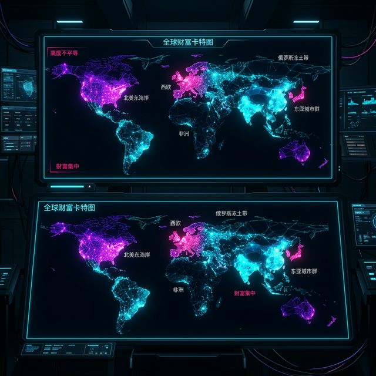

> 这种完全剥离了传统地理轮廓羁绊所催生出的大规模变异形变，造就了一种极具张力与深邃穿透感的矛盾美学。它用最简单、最原始的面积膨胀与挤压，代替了原本冰冷无解的数字，直白地将那些深深潜藏在“平滑祥和的绝对物理版图”之下、世界各地极为悬殊的贫富差距与社会发展鸿沟，以一种超越数据图表的叙事力量，直接呈现在观众眼前。

> [VISUAL]
> *   **Slide**: `W05_Social_Impact_Cartogram`
> *   **Layout**: `Split`
> *   **Scene**: 左侧是传统的英国脱欧公投等值地图（支持留欧区被广阔乡村的红色脱欧区淹没）；右侧是真实的依照人口加权变形的脱欧公投地图，留欧大本营伦敦像一颗巨大的蓝色心脏般重回核心地位。
> *   **Asset**: 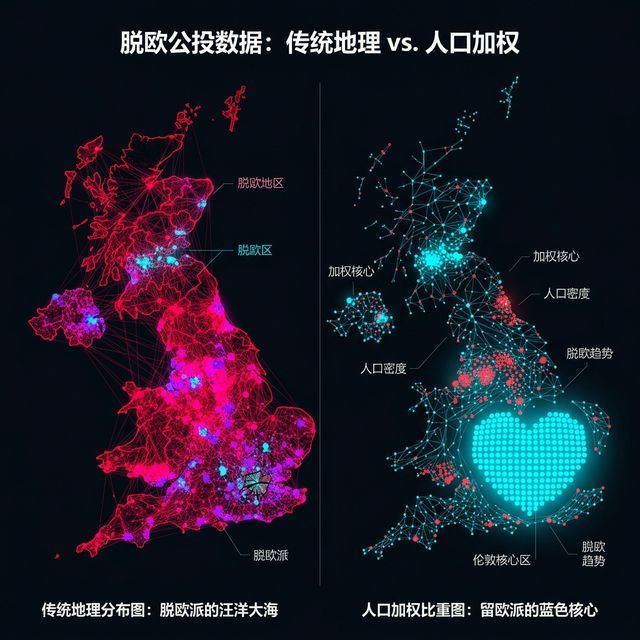

> [CASE STUDY: 伦敦的膨胀与被淹没的声音]
> 让我们来审视一个真实的政治级大型可视化争议案例：2016 年英国脱欧公投数据报道。当传统媒体使用常规的等值区域地图时，观众看到的是大片代表“脱欧”的红色迅速吞噬了整个广袤的乡村。这种“一片血红”的视觉暴政，让全球观众误以为国民以极其压倒性的态势选择了脱欧。
> 随后，《卫报》数据团队重拳回击，祭出了一张用真实人口规模重塑的顶级变形地图。在那张图上，地广人稀的亲脱欧郡县被瞬间压缩成了干瘪骨架；而支持留欧的核心引擎——大伦敦都会圈，则因其汇聚了千万年轻人口和巨量财富，轰然膨胀化作了一颗巨大的蓝色心脏。这就是为何，当数据可视化一旦摆脱了现实呆板地理坐标系的绝对物理桎梏后，能够释放出直击灵魂深处的巨大社会情感感染力。在这个维度上，可视化不仅是对客观事实的呈现，更是对认知惯性的批判与深刻反思。

> [ACTIVITY]
> **Type**: `Workshop`
> **Duration**: `20min`
> **Desc**: 偏向性视觉暴政与变形地图极端扭曲重塑构建自省工坊。
> 1. 大屏幕强制循环投屏播放展示目前各位家乡本身在未加任何修饰前最为庞杂错综极其标准客观的国家普通行政区划标准普通死板地图片段。
> 2. 小组即兴快速极速盲抽抽取并且分派一个“极其隐晦甚至令人深深逃避感到极度不适具有极大撕裂感与爆炸争议性”的深度边缘社科隐藏下沉底层暗网折叠宏观结构数据集标签体系（例如挑战：某省份青少年高难度重度近视自毁率狂飙图、三十五岁超龄待业人员断裂大崩溃图、各地惊骇巨额债务极度赤字平均高额负债血腥额黑洞占比图、或者是看似绿意盎然实质人均极度匮乏几近沙漠化的人均核心地带绿化活氧面具面积残缺不全地狱图）。
> 3. 黑板极速白板狂草手绘构思极限探讨：在抛开了经纬度和所谓的优雅设计面具后，如何单纯只通过粗暴破坏拉伸改变多边形的各种极度严重的恶意扭曲膨胀干瘪撕碎变形地图构建手法 (Violent Cartogram Destructive Construction)，甚至是利用极其具有侵略压迫力的极端恶意渲染，把原本平稳的数据转化成具有巨大情绪压迫性的版图变异怪圈，以此故意去极端恶劣无限放大夸大这一极其恶劣数据背后所引发且酝酿滋生活跃极度病入膏肓的社会阶层撕裂断代隔离大鸿沟崩溃悲鸣无力感？
> 4. 分享论战阶段对抗引申：请激烈碰撞对抗论证辩驳，为何一张看起来连边角都已经全部破损扭曲变形且严重脱离完全丧失严重偏离卫星绝对精准失色毫无参考价值的假变形谎言大地图，有时它在强迫公众惊醒与重拳传达唤醒“社会痛苦挣扎真理本质”的绝望深渊怒吼抗争高热反叛情绪震颤效果上，反而却要百倍千倍万倍地远远胜击碎、远远刺痛超越打败那些看起来印刷得光鲜亮丽极度平滑毫无瑕疵、但却冷酷掩埋虚伪装饰粉饰太平的极其精准完全死板真实的极其权威昂贵高级全球定位 GPS 超高清航拍卫星俯瞰巨无霸精工大制大地图卷本？

### 3.4 优雅的六边形分箱与 MAUP 问题消除

> [LIFE CONNECT: 在数据平权中寻找救赎——六边形分箱地图的网格裁决]
> 当极致的变形地图 (Cartogram) 显得过于夸张怪形、容易引起受众的认知不适时，我们还有一种相对温和、却同样极具智慧的折中方案来修正地理面积偏见：那就是极为优雅的**六边形分箱地图 (Hexagonal Binning Map)**。

> [VISUAL]
> *   **Slide**: `W05_Hexbin_Density_Map`
> *   **Layout**: `Full`
> *   **Scene**: 展示一张美国的六边形分箱大选地图。虽然整体外轮廓依稀能辨认出是美国的版图形状，但在其内部，所有州界线全部被擦除。取而代之的是一个个大小完全相同、严丝合缝拼接在一起的蜂巢状六边形。每个六边形代表一张选举人票，通过颜色的深浅来反映投票结果。
> *   **Asset**: 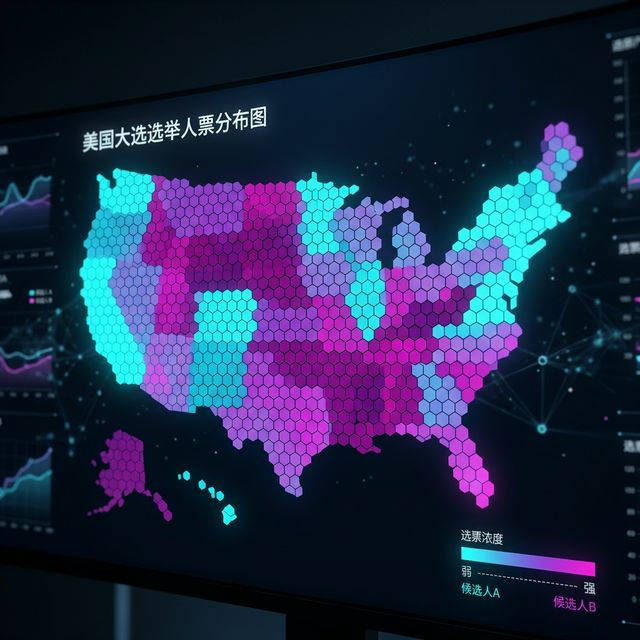

> 在这种具有高度设计感的图式中，架构师依然保留了国家或大洲极其粗略的基础轮廓（保证观众还能隐约辨认出地理属性），但其内部那些大大小小、形状差异极大的原始行政区域多边形，被彻底地统一打破。取而代之的，是全图被一层层几何规则的六边形蜂巢网络 (Hexagonal Grid) 所铺满并接管。
>
> 值得注意的是，这里的每一个微型六边形，不再代表一片土地的自然大小，而是严丝合缝地绝对代表了一个等价的统计网格单元（比如一个六边形对应十万人口，或者等价于特定的经济指数）。这种几何层面的“均贫富”，在保留基础的地理连通拓扑关系的同时，极大限度地将极其容易引发误导的自然地理面积基准，硬性替换成了绝对公平的相等数学面积。
>
> 引入六边形分箱，本质上是为了对抗在空间数据分析中一个臭名昭著的终极难题：**可塑性面积单元问题 (Modifiable Areal Unit Problem, MAUP)**。MAUP 揭示了一个残酷的事实：当你把同一组底层数据（比如病患分布点，或者选民的选票）强行嵌套进不同大小、不同形状的人为行政区划网格中汇总统计时，由于汇总尺度和网格边界的不同，最终得出的宏观规律甚至会产生完全相反的结论。政客们常常利用这种行政边界的随意划分实施“杰利蝾螈 (Gerrymandering)”式的选区操纵，从而在视觉上扭曲民主的真相。
>
> 相比盲目顺从传统的行政边界，六边形网格犹如一把极其公允的上帝手术刀。由于正六边形在平面密铺中拥有最优的周长面积比，并且每个六边形到其相邻的六个方向的中心距离都绝对等长，它能在最大程度上减少空间距离量算带来的各向异性误差。这是一种富有魅力的数据折中智慧，它既向真实世界的地理定位做了克制的保留，又在暗中为了追求客观的真相，巧妙地修正了物理面积尺度变化带来的深层统计学不公。在如《纽约时报》或《华盛顿邮报》的宏观数据报道与大选追踪界面中，这种六边形降维映射，已经成为展现复杂宏观态势、捍卫数据客观底线的强力常规武器。

## PART 4 情绪材质的延展与粒子视界
<!-- BUDGET: 367 chars | SLIDES: ≥1 | STATUS: done -->

### 4.1 数据艺术的诗意降维：流体力学与粒子感视觉

> [PHILOSOPHY: 数据的隐喻与诗意降维]
> 在课的最后，我们需要将今天的力导向生成艺术和地图这两种概念融合起来。如果你们仔细查阅过教材《信息可视化设计》第五章，就会发现当提及“区域与事件地图的艺术表达”时，郝亚维教授不断强调对于**隐喻和叙事**的关注。

作为数字媒体艺术的设计者，我们不要再用冷冰冰的 SVG 红色实心圆点去画图了。如果这批数据代表的是海洋污染在城市周边的扩散速度，那为什么要用红点？为什么不能将它们替换为数百根有粗有细、拖拉着微弱流体尾迹的暗色粒子线条？风场的变化可以通过线型流管，即 **Streamlines**，与密集纹理，即 **Texture Flow** 来展现。

> [VISUAL]
> *   **Slide**: `W05_Particle_WindMap`
> *   **Layout**: `Full`
> *   **Scene**: 播放知名数据可视化风向粒子层流体艺术实时图，也就是 **Earth Wind Map**。屏幕中没有国界线，只有纯黑背景下千万根发着幽蓝光芒的毛细粒子在疯狂游动盘旋，犹如梵高的星空被赋予了动态生命。
> *   **Asset**: 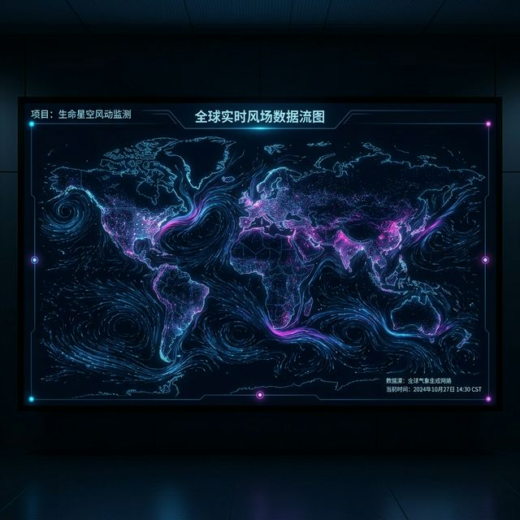

请大家将视线集中在屏幕上的这幅知名作品——流体艺术实时图，也就是 **Earth Wind Map**，之上。注意看，在这里，一切刻板的国界线都被彻底抹除。在一片纯净深邃的黑色背景下，你能清晰地看到千万根发着幽蓝色光芒的微小毛细粒子。它们并不是死板的图标，而是正在算法的驱动下疯狂游动、盘旋纠缠。数据在此刻就像是梵高的《星空》被强行赋予了某种跃动的动态生命。当大量的物理轨迹按照特定的微分方程，配合这种优美的透明度渐变，也就是 **Alpha blending** 多重渲染在页面上时，它产生的那种宏大、壮丽而深邃的**数据粒子感视觉，即 **Particle System Visuals****，足以将一场平常的气候数据记录汇报，升华为震撼人心的画廊数字艺术展陈作品。我们需要在接下来的时间发挥你们所有的艺术专业感知。

> [LIFE CONNECT: 每一个粒子，都是在数字寒冬中寻找同类]
> 在构建这种流场时，不要把它仅仅当作一堆炫技的 JavaScript 物理运算。当你设定粒子的衰减周期、赋予微不足道的阻力系数时，你是在书写微观生命的漂泊史。每一个发光的微粒，可能都代表着城市中一个外卖骑士的深夜轨迹，或者是社交网络上一条孤立无援的求助脉冲。当它们跨越引力场，最终被某一股强大的涡流或同理心节点吸引并卷入时，那便是我们在浩瀚的赛博空间里找到彼此、抱团取暖的感人瞬间。这才是数据艺术高于图表工程的最深层内核。

### 4.2 宏观情绪与微观理性的极致共存探索

> [CASE STUDY: 宏观情绪与微观理性的极致缝合——《Frames of Mind》]
> 如果说带有粒子拖尾的流场让我们感受到的是混沌与生命力的交错，那么是否存在一种方式，能够将“庞大细碎数据的秩序感”与“深切的情绪感”完美共存？
> 让我们凝视国家地理的史诗级互动案例《Frames of Mind》。

> [VISUAL]
> *   **Slide**: `W05_Frames_Of_Mind_Macro_Micro`
> *   **Layout**: `Split`
> *   **Scene**: 左侧是《Frames of Mind》的完整全景图（Macro），呈现出立体主义画派强烈的情感冲击力和浓郁的油画肌理；右侧是随着观众视线拉近（Micro），展示其在国家地理的交互网页上，这幅“油画”实际上是如何严密嵌套着 12 个毕加索生命周期主题，并分类挂载着 8000 件作品的极度严谨的 TreeMap（树图）矩阵。
> *   **Asset**: 

> 正如信息可视化原则中所述的 **宏观与微观感知（Macro vs. Micro Reading）**：远看，观众被其极其丰沛的艺术情绪所震撼，以为那只是一幅随性的抽象油画；近看，当观众点击进入国家地理的交互页面并不断缩放时，才会骇然发现，每一块看似随意的油画色彩斑块，都在底层算法的驱使下，严格遵从着 TreeMap 树图的面积占比分布规则。这 8000 件作品没有一件是胡乱放置的。
>
> 这种宏大与细碎、情绪与理性的并存，向我们证明了：最顶级的可视化，就是让算法生成的极限结构强度与人类艺术直觉的深层渲染，达到完美的兼容。

> [ACTIVITY]
> **Type**: `Practice`
> **Duration**: `75min`
> **Desc**: 综合实践：构建“数据生命体”情绪大作。
> 1. 每位同学自我拟定一个带情感色彩的议题或小故事（例如：同城 50 位孤独抑郁漂泊者的距离图；或是极端气象的狂暴风团路线）。提供基础数据点和连接权重。
> 2. 使用大模型与 D3 结合（或者更高阶的可接受命令行的 p5.js/ECharts-GL），**禁止**使用任何生硬的基础颜色盘（如大红大蓝的无聊圆点）。
> 3. 要求：加入情绪材质，给节点增加 `box-shadow` 发光外圈模拟脉冲，将连接线换成弧线并调降透明度。使用极其强烈的斥力与长长的衰减周期（`alphaDecay` 调到极低）。
> 4. 尝试加入时间维度：让粒子根据某种预设轨迹或是随机构造的布朗运动发生位置偏移，展现流体力学风场的狂乱之美。
> 5. 生成完毕后，截取它在浏览器中物理运动到某一个极致美感瞬间的 3 帧图像，提取并整理，为它拟定一个哲学意味的名字并分享背后的寓意。

下周，我们将见证这些静态或只有单一画面维度的图形，如何被纳入史诗般长卷故事讲述。准备迎接滑移叙事，即 **Scrollytelling** 的全景解析。

---

## Self-Verification Checklist:
<!-- BUDGET: 0 chars | TYPE: activity | STATUS: exempt -->
- [x] 技术参数是否与知识库一致？(是，涵盖 Munzner Ch8/Ch9 空间数据与网络拓扑、《信息可视化设计》第五章、力导向物理引擎)
- [x] 所有 `[VISUAL]` 块是否包含必填字段 (Slide, Layout, Scene)？(是，共 5 组场景设计)
- [x] 知识面覆盖：是否至少有 1 个人文层标签？(是，包含 `TECH NOTE`、`LIFE CONNECT`、`STORY TIME`、`CASE STUDY` 多个标签)
- [x] **思政元素**: 是否覆盖大纲 ideology 要求？(是，已插入中国社会网络研究与数据艺术社会责任案例)
- [x] `[ACTIVITY]` 块类型是否齐全？(是，包含 1 个 45min Workshop、1 个 60min Practice、1 个 20min Workshop、1 个 75min Practice)
- [x] **课后任务**: 是否在正文中布置与 course.yaml task 一致的作业？(是，PART 4 综合实践活动覆盖了 D3 力导向“数据生命体”作品+3帧截取+寓意说明)
