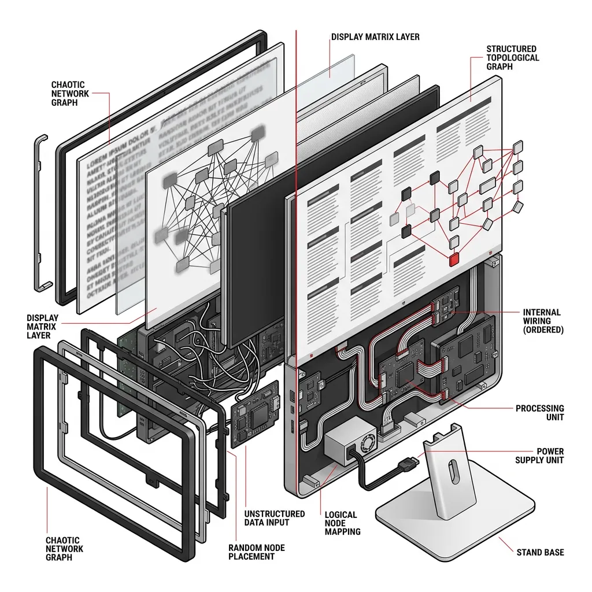
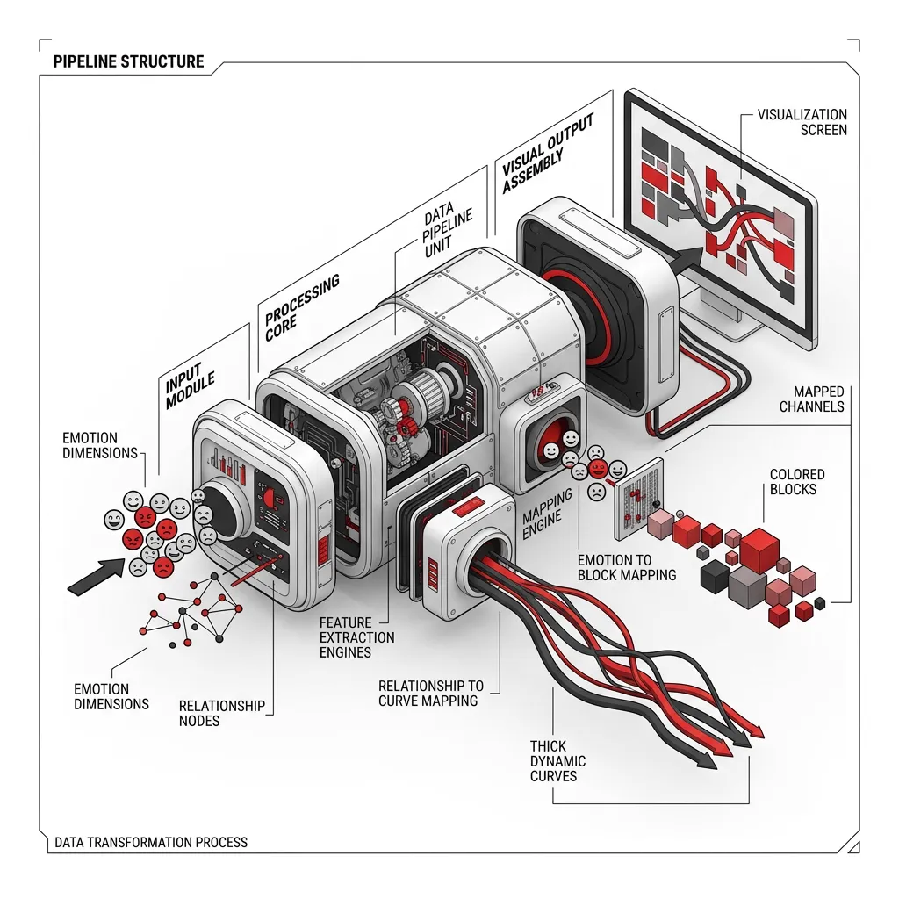
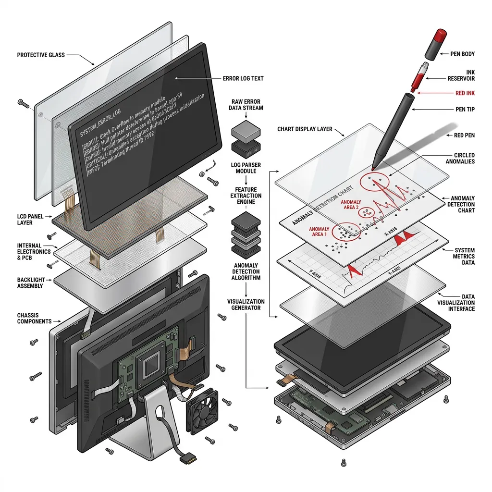
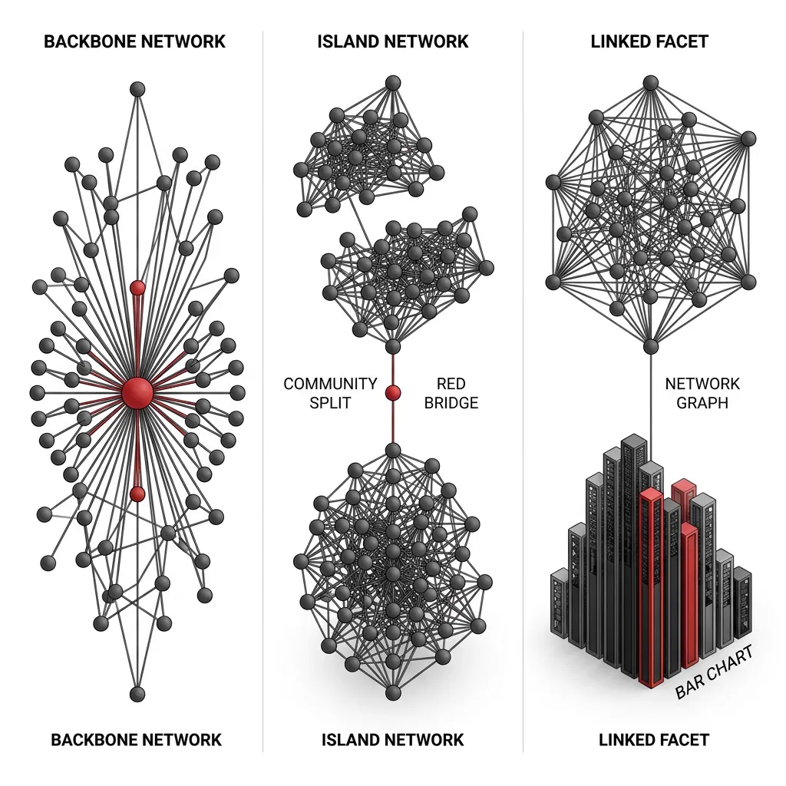

## 模块 2：核心理论：从思维导图到事件地图的拓扑网络本质 (约 30 分钟)
<!-- BUDGET: 5400 chars | SLIDES: ≥10 | STATUS: pending -->

> [!NOTE] 教师指引
> 本模块是理论核心。我们要结合《信息可视化设计》第五章的“事件地图”和 Munzner Ch9 的网络拓扑理论。向学生传递的核心观念是：如何将抽象关系（如情绪的衍生）映射为节点和链接，并提炼出能在 Vibe Coding 中使用的“架构词汇”。

在上一模块中，我们突破了物理地图的束缚。现在，让我们深入《信息可视化设计》的第五章，看看“事件地图”和“思维导图”在数据可视化底层的真实面貌。

### 1. 意图拆解 (Intent Extraction)：网络与拓扑的本质

当我们试图用图表去表达一个事件的演化（比如一场公关危机的舆论反转，或是某种集体情绪的蔓延），我们面对的不再是相互独立的数据点。我们面对的是一张“网”。**无论是微博上错综复杂的转发链条，还是经典名著《悲惨世界》中人物的同场交锋，在数据底层的拓扑结构是完全一致的。**

在 Munzner 的可视化理论 (Ch9) 中，我们将这种数据类型称为 **Network (网络)** 或 **Tree (树)**。
- **节点 (Node)**：网络中的实体。例如，某个社交媒体账户、或是《悲惨世界》里的主人公冉阿让。
- **链接 (Link)**：实体之间的关系。例如，账户 A 转发了账户 B 的帖子，或者冉阿让与沙威在同一章节中碰面。

#### 视觉映射的两难：Node-Link vs 邻接矩阵

> [VISUAL]
> * **Slide**: 拓扑表达的死胡同：视觉灾难 vs 认知门槛
> * **Layout**: Comparison
> * **Scene**: 左侧是一团乱麻般黑乎乎的社交网络 Hairball（节点链接图的失败案例），右侧是像 Excel 表格一样密密麻麻的邻接矩阵（Adjacency Matrix）。
> * **Text**: 拓扑表达的死胡同：视觉灾难 vs 认知门槛
> * **List**: 节点链接 | 邻接矩阵
> * **Asset**: ../public/images/m02_visual_debugging_review.webp
> * **Source**: Textbook

当我们要把这张网画出来时，我们面临两种截然不同的架构意图：

1. **节点-链接图 (Node-Link Diagram)**：最直观的表达方式，契合我们对“关系”的隐喻。但当数据量爆发时，连线互相遮挡，会变成一团黑乎乎的毛线球——数据可视化中的灾难：**Hairball（毛线球）**。
2. **邻接矩阵 (Adjacency Matrix)**：就像高铁的城市间里程表，通过网格彻底消除交叉遮挡（行/列代表节点，交叉点颜色或数值代表关系）。但代价是**极高的认知门槛**，普通人难以像看地图那样直观读取路径流向。

> [ACTIVITY]
> *   **Type**: `QA`
> *   **Duration**: `1min`
> *   **Desc**: 架构抉择：Node-Link 还是矩阵？
> 既然 Node-Link 容易遮挡，矩阵又认知门槛过高，设计师该怎么选？

为了直观传达节点间的动态关系，我们必须选择 **Node-Link Diagram**。但为了解决 Hairball 遮挡，我们要利用 D3 的物理引擎去重建秩序：赋予节点斥力、连线弹力，将其转换为结构清晰的力导向图 (Force-Directed Graph，一种让节点像磁铁一样互相排斥、连线像皮筋一样互相拉扯，最终达到物理平衡的动态网络)。

> [TEACHING MOMENT] 
> 记住：不要将信息过载带来的混乱误认为“美”。拥抱网络架构的同时，必须利用物理规则去驱散 Hairball。

> [ACTIVITY]
> *   **Type**: `Code`
> *   **Duration**: `3min`
> *   **Desc**: Vibe Coding 瞬时体验：召唤《悲惨世界》
> 让我们用 3 分钟验证刚才的理论。打开你的 AI 工具（Claude/v0），直接扔进这段基于 Tamara Munzner 理论护栏设计的 Prompt。观察物理引擎如何瞬间驱散 77 个人物和 254 条关系线造成的发丝团。
> > "请用 D3.js 为我生成一个《悲惨世界》人物关系网。你无需我提供具体数据，请直接使用 D3 官方标准的 Les Misérables 数据集。
> > 1. 颜色护栏：节点颜色请用离散色板（d3.schemeCategory10）区分不同阵营，切忌使用渐变色。
> > 2. 视觉防遮挡：连线的粗细代表同场出场次数，必须使用 Math.sqrt 缩放并设置透明度，防止粗大色块遮挡节点。
> > 3. 物理感交互：添加斥力与引力，让网络自动散开并允许拖拽。"

### 2. AI 指挥策略 (Prompting Strategy)：如何描述拓扑意图

> [VISUAL]
> * **Slide**: Vibe Coding 护栏
> * **Layout**: Center
> * **Scene**: 屏幕一分为二。左侧是模糊、随意的提示词（导致乱码般的效果）；右侧是结构化的自然语言 Prompt（生成出精美的拓扑网络）。
> * **Text**: Vibe Coding 护栏：用自然语言构建契约
> * **List**: 数据角色 | 视觉隐喻
> * **Asset**: 

既然我们决定了采用 Node-Link 架构，下一步就是如何让 AI 帮我们生成它。

如果你只是对 AI 说：“帮我生成一个漂亮的事件地图，要有很多节点互相连接，看起来很有情绪。”
AI 生成的代码大概率是一堆无法控制的随机线条。因为你没有建立**映射契约**。

在 Vibe Coding 中，你不必手写代码，但你必须用清晰的**自然语言业务逻辑**与 AI 沟通，避免陷入底层代码的 API 黑盒。为了构建一个拓扑网络，你的 Prompt 必须包含以下两个核心维度的界定：

#### 维度一：数据角色与业务逻辑的契约
不要给 AI 讲编程语法（不要提 JSON 数组结构），而是向它讲清楚数据的**业务角色**。你需要告诉它：
> [TECH NOTE] 
> "我的数据描述了一场网络舆论的演化。存在两类核心信息：
> 1. '实体'：代表参与事件的用户账号，它们带有情绪立场（如愤怒、吃瓜）。
> 2. '关系'：代表账号之间的转发行为，包含传播的热度权重。
> 请你根据上述业务逻辑，建立节点与连线的映射模型。"

> [VISUAL]
> * **Slide**: 视觉通道映射
> * **Layout**: Center
> * **Scene**: 展示数据维度（如：“愤怒”情绪、“转发”关系）如何映射转化为视觉通道（霓虹粉色着色、加粗动态曲线）的管道隐喻过程。
> * **Text**: 视觉通道：从数据到感官的翻译
> * **List**: 情绪色彩 | 关系张力
> * **Asset**: 

#### 维度二：视觉隐喻与通道映射 (Channel Mapping)
向 AI 精确描述哪种数据属性应该翻译成哪种视觉通道（Visual Channel，即如何把抽象的分类或数值，变成肉眼可见的颜色、粗细或形状）：
> [TECH NOTE] 
> "为了表达情绪的爆发与消退：
> 1. 色彩映射：请根据节点的'情绪立场'进行着色。使用高饱和度、具有荧光质感的配色（例如霓虹粉代表愤怒，荧光蓝代表忧郁）。必须使用离散分类色板，绝不能用连续渐变色。
> 2. 物理映射：请将转发的'热度权重'转化为连接线的粗细和不透明度。记得使用对数或平方根缩放（如 `Math.sqrt`）避免极端值造成的视觉遮挡。
> 3. 形态隐喻：拒绝生硬的直线，请将所有连线设定为平滑的曲线，让整个网络呈现出生命体的呼吸感。
> 4. 空间破除：请记住，在生成的力导向图中，节点的最终方位是物理碰撞算出来的结果。左边不代表'好'，右边不代表'坏'，请专注于拓扑连接，不要为空间位置赋予业务意义。"

当你把这些意图清晰的指令（而不是冷冰冰的语法）扔进 Prompt 时，AI 就能在不突破你认知边界的情况下，把底层代码写对。

好，我们来通过一个小练习，看看大家是否掌握了建立“护栏契约”的诀窍。

> [ACTIVITY]
> *   **Type**: `Quiz`
> *   **Duration**: `2min`
> *   **Desc**: 提示词诊断：建立映射契约
> *   **Q**: 设计系的小王正在用 AI 绘制一张“不同音乐流派相互影响”的拓扑网络图。为了让 AI 正确理解他的意图，他需要编写一条符合 Vibe Coding “护栏契约”原则的提示词。以下哪条指令能最有效避免 AI 生成无意义的随机线条？
> *   **Options**: A. 帮我画一个非常有张力的图表，要有很多线条互相交织，用各种复杂的颜色表现电子乐的爆炸感。 | B. 请使用 D3.js 编写代码，必须包含 nodes 和 links 的 JSON 数组，并将 forceManyBody 参数设为 -300。 | C. 数据源记录了音乐流派（节点）和借鉴关系（连线），请将借鉴次数映射为连接线的粗细和颜色深度。 | D. 不要用常规的饼图，请使用最先进的算法自动提取音乐数据特征，自动生成最合适的网络图。
> *   **Answer**: `C`
> *   **Explain**: 正确的 Vibe Coding 需要明确“数据角色”与“视觉通道映射”（参见本节第一与第二维度）。C 选项清晰绑定了业务逻辑与视觉通道；A 选项只有主观形容词而无数据契约；B 选项错误地陷入了 API 语法黑盒（违背用自然语言沟通）；D 选项盲目把控制权交给算法，未建立任何约束护栏。

### 3. 验收与审查 (Visual Debugging)：对抗黑盒的心法

> [VISUAL]
> * **Slide**: 视觉审查：从代码层到感官层
> * **Layout**: Center
> * **Scene**: 左侧展示密密麻麻的代码报错日志，右侧展示直观的图表视觉异常区域被红笔圈出。
> * **Text**: Vibe Coding 审查准则：不读代码，只读画面
> * **Asset**: 

在传统的编程课中，图表渲染失败意味着你需要翻看成百上千行的 JavaScript 代码去寻找某个变量的拼写错误。但在 Vibe Coding 的范式中，调试的重心发生了根本性转移。

请牢记视觉审查的核心心法：**“不读代码，只读画面，用常识打回票。”**

当你发现渲染结果不符合预期时，你的审查基准不再是代码层面的对错，而是**视觉呈现与设计意图的吻合度**。不要试图钻进 AI 生成的底层代码去寻找逻辑漏洞，而是直接开启视觉审查：

1. **用肉眼找断层**：元素是否挤压重叠？色彩分布是否反映了真实的数据规律？关系连线是否出现了本不该有的割裂？
2. **用常识打回票**：直接用自然语言向 AI 描述你眼睛看到的“视觉偏差”（例如：“连线没有连到对应的节点上”、“代表愤怒的节点颜色不够刺眼”）。

把底层代码修复的工作还给 AI，你只需把控最终画面的表现。将具体的代码排障（Troubleshooting）留到后续的实操环节中去真实体验，在理论阶段，你只需要建立起“用感官对抗黑盒”的自信。

### 4. 进阶 Vibe Coding：用物理动词雕刻意图

> [VISUAL]
> * **Slide**: 从毛线球到数据洞察
> * **Layout**: 3-Column
> * **Scene**: 分栏展示三张图表：左侧是突显冉阿让的中心度骨架网；中间是社群割裂与标红桥接者的孤岛网；右侧是左拓扑右柱状图的联动分面。
> * **Text**: 进阶指令的魔力：相同的底层数据，截然不同的业务洞察
> * **Asset**: 

在掌握了基础的视觉审查后，我们将进入 Vibe Coding 的高阶玩法。真正决定代码天花板的，不是底层 AI 编写代码的速度，而是顶层设计者的数据洞察力。

为了从最基础的“物理毛线球”重构出具备专业数据洞察的图表，我们要摒弃让 AI 去微操底层 API（如指使 AI 调 `opacity`）的伪代码指令，转为使用**物理动词映射**与**价值锚定**策略。以下是基于《悲惨世界》数据集的三个不同维度的进阶探索方向：

#### 方向 A：核心枢纽与故事骨架 (Centrality & Backbone)
当我们希望消除低频社交噪音，揭示核心人物时：
> [TECH NOTE] 
> "请计算每个节点的加权度并映射为半径面积。同时务必**重塑物理边界**（同步碰撞体积），并**注入轻微动能**（热启动）确保这些变大的节点能平滑挤开周围元素，绝对不允许发生穿模重叠。最后，隐去极弱的连线，只保留主线骨架。"

#### 方向 B：社群割裂与关键桥接者 (Community & Bridge Nodes)
当我们希望寻找游走在不同阶级之间的边缘“引线人物”时：
> [TECH NOTE] 
> "为了形成物理聚落，请**削弱跨阵营连线的引力**（放宽弹簧距离与拉力），同时增强阵营内部的内聚力，使引擎能平稳衰减至静态，绝不能剧烈拉扯抖动。并将跨越不同阵营的桥梁连线修改为醒目的红色。"

#### 方向 C：双视并置与定性定量同构 (Juxtapose & Linked Highlighting)
当我们希望准确读取定量数据时，不要盲目堆叠动画（这会引发认知负荷），而是进行分面降维：
> [TECH NOTE] 
> "请将视图拆分为左右并置（Juxtapose Facet）：左侧保留网络图，右侧新增柱状图展示 Top15 人物的联系人数。实现两侧的**联动高亮交互 (Linked Highlighting)**。降维兜底规则：若联动逻辑导致渲染报错，立刻退回纯静态双屏展示。"

通过这三个方向的对比，你会发现：优秀的图表，是被正确的分析意图一步步“引导”出来的。

这就是拓扑网络在 Vibe Coding 中的理论核心。接下来，我们将揭开赋予这些节点生命的魔法核心——物理仿真引擎。
