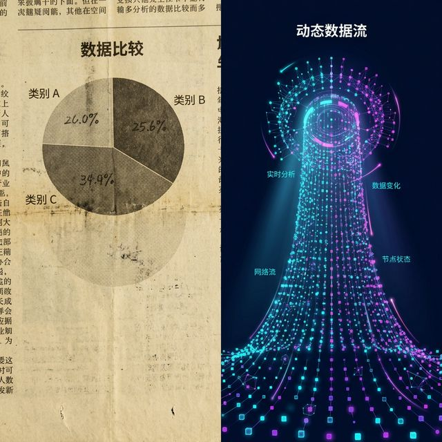
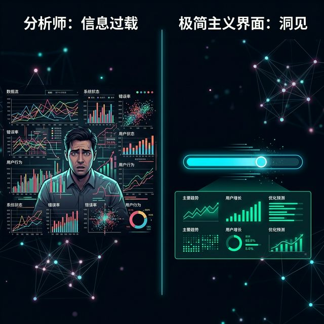
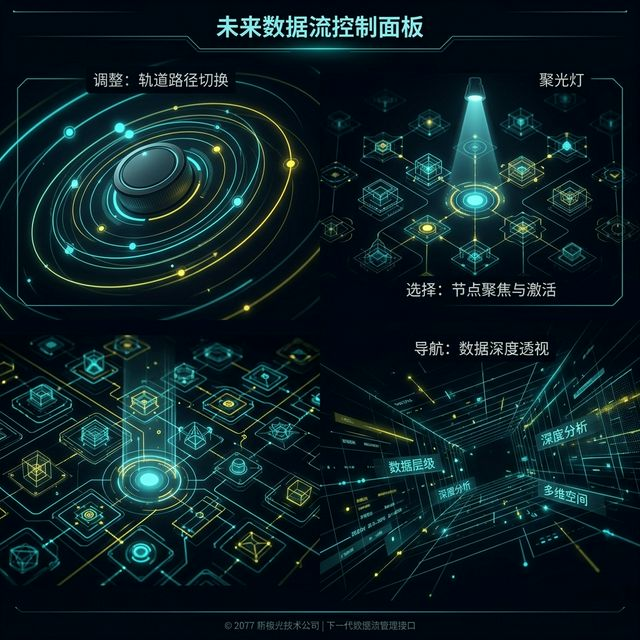
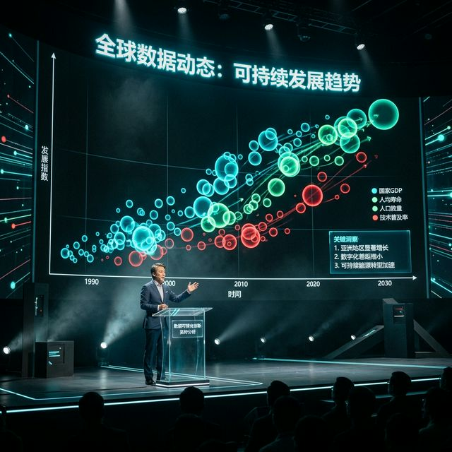
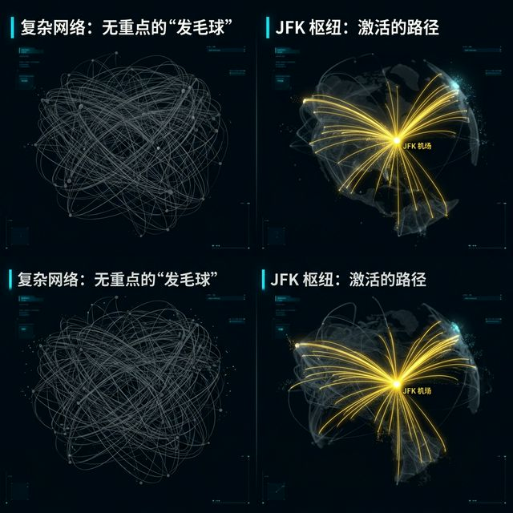
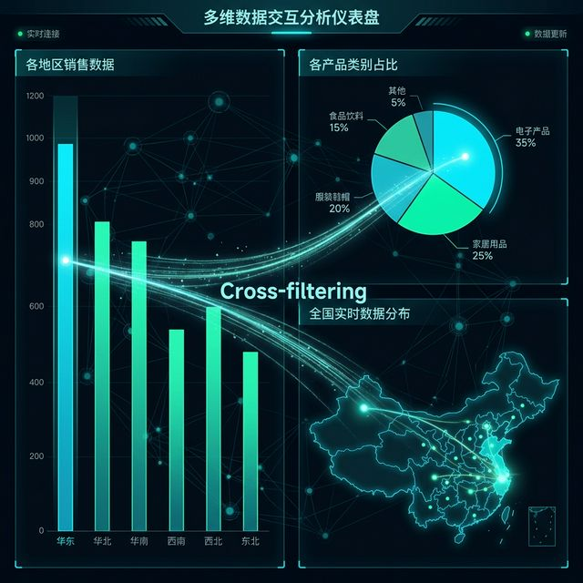
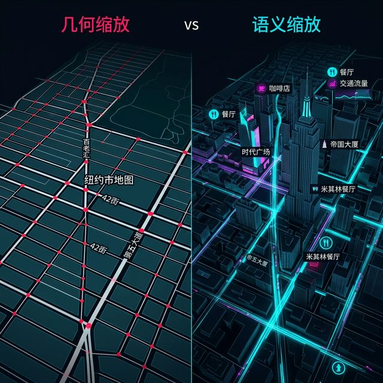
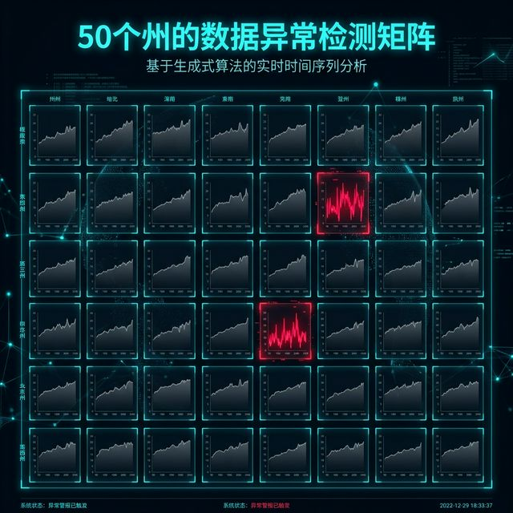
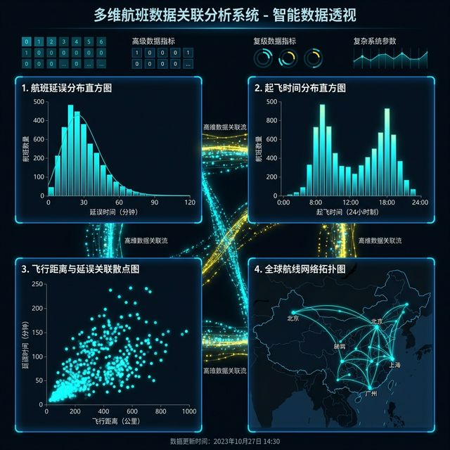

## 模块 1: 打破第四面墙：从"看"数据到"玩"数据的感官觉醒 (30 分钟)
<!-- BUDGET: 7200 chars | SLIDES: ≥14 | STATUS: done -->

> [!NOTE] 教学阶段：复习/导入
> 本模块回顾 W05 力导向与空间数据编码，引出交互在多维数据展示中的必要性，以及滚动叙事的设计方法论。

> [VISUAL]
> *   **Slide**: `S01_Title_W06`
> *   **Layout**: `Title`
> *   **Scene**: 左半边是印在旧报纸上的一张静态饼图；右半边是深色模式屏幕上，一串数据流随着鼠标滚轮向下滑动，像多米诺骨牌一样连续重组、变形、变色，呈现出极具生命力的动态视效。
> *   **Text**: "滑动揭秘：以现代滚动叙事导演数据图景"
> *   **Asset**: 

在过去五周的课程里，我们像钟表匠一样，精心挑选标记（Marks），精准打磨通道（Channels）。我们学习了如何像艺术家一样雕琢留白与隐喻。

我们甚至在上周深入了力导向图的深渊，尝试用物理学的引力来驯服复杂的网络图景。但直到上周围止，我们在做的其实都是同一件事：制造一张"完美的照片"。

照片很美，但照片是死的。

随着我们处理的数据变得越来越具有侵略性，数据的维度变得庞大且互相关联。比如，当你需要展示全球 200 个国家在过去 100 年间的经济、寿命、碳排放变迁时。

**(Pause: 3s)**

如果你试图把所有的自变量和因变量，强行塞进一张 2D 的静态图纸里，结果不外乎两种：要么读者因为通道超载而陷入"视觉瘫痪"，要么由于极致精简而丢失了故事中那些波澜壮阔的起伏细节。

这时候，我们需要打破"第四面墙"：引入时间的维度，让使用者参与进来。这就是信息可视化设计至关重要的一环——交互（Interaction）。

> [VISUAL]
> *   **Slide**: `S01b_The_Cognitive_Relief`
> *   **Layout**: `Split`
> *   **Scene**: 左侧是一位看着复杂的满屏图表抓狂的分析师；右侧是一个干净的界面，只有一个滑块，随着滑块拖动，图表中的数据如拨云见日般清晰。
> *   **Caption**: 交互的本质不是炫技，而是认知的减负。
> *   **Asset**: 

很多人对交互的理解，停留在网页前端设计师为了"炫技"加上的几个悬停动效（Hover），或者是点击后弹出的工具提示（Tooltip）。但这远远不够。

交互的本质，是将认知负荷从人类的大脑，转移到计算机的内存中去。

当你面对几万个数据点时，你不需要用眼睛去死死盯住你要找的那一个，你只需要用手滑动一下控制器。这种手眼协作的控制感，极大地拓宽了我们处理信息的带宽。

在这方面，人机交互领域的先驱，提出了一句著名的话。

[PHILOSOPHY: Shneiderman 信息探索箴言]
美国马里兰大学的计算机科学家 Ben Shneiderman 在 1996 年提出了一句如同"圣经"般的箴言：**"Overview first, zoom and filter, then details-on-demand."（先看全局，缩放和过滤，然后按需获取细节。）**
这句话揭示了人类获取信息的天然心理模型：我们总是先确认自己在哪儿，然后再一步步剥开洋葱的心。如果上来就给你无尽的细节，这叫信息轰炸；只有用户自己主动索要的细节，才叫洞察。

> [VISUAL]
> *   **Slide**: `S02_Interaction_Taxonomy`
> *   **Layout**: `Grid`
> *   **Scene**: 屏幕呈现一座高科技控制台。上方写着"改变 (Change)"，下方有排布旋钮与滑块；左下写着"选择 (Select)"，下方有聚光灯的图标；右下写着"导航 (Navigate)"，下方有可缩放的三维摄像机视角。
> *   **Caption**: Tamara Munzner：掌握交互设计的三大操作族，就是掌握了魔法遥控器。
> *   **Asset**: 

在可视化理论权威 Tamara Munzner 的框架中，交互操作 (也就是 `ch11-manipulate` 核心操作框架族) 被分为了三大魔法操作族。她认为，所有的交互，无论它在代码层面上多么复杂，归根结底都在做这三件事：改变视图、选择元素、或者在数据中导航。

**第一族：改变视图 (Change View over Time)**

最直接的交互，就是顺应变量发生的改变。

我们在同一个屏幕上，上一秒用散点图展示 GDP，下一秒将其丝滑地重新散列，组装成反映人口随纬度分布的柱状图。当使用者拖拽数据列时，利用空间位置的重排，或者英文叫 Reorder，来发掘新的模式。

> [VISUAL]
> *   **Slide**: `S02b_Hans_Rosling_Magic`
> *   **Layout**: `Image`
> *   **Scene**: Hans Rosling 在 TED 舞台上，背后是著名的 Gapminder 气泡动画，代表一个个国家的各色气泡在 200 年的时间轴上飞速上升和游走。
> *   **Search**: `Hans Rosling TED Gapminder presentation bubble chart`
> *   **Asset**: 

大家一定在社交网络上刷到过这样一段著名的 TED 演讲。

[CASE STUDY: Hans Rosling 的 200 国气泡]
瑞典公共卫生学家 Hans Rosling，用一个简单的气泡动画，震撼了世界。他将横轴设为财富，纵轴设为寿命，而气泡代表国家。随着他在台上按下"播放"键，或者是随着用户自己在时间条上的拖拽……
你会亲眼看到，在 1918 年西班牙大流感爆发时，所有的气泡如同遭遇了重锤，齐刷刷地向下跌落。
在那短暂的一秒钟里，"寿命下降"不再是一个冰冷的数据指标，而是一场触目惊心的集体命运坠落。

这就是"改变视图"的绝对统治力。但这里的关键，并不是把 A 图变成了 B 图。

**关键在于动画过渡 (Animated Transitions)。**

人类的大脑非常讨厌"跳切 (Jump Cut)"。如果画面瞬间从 A 变成 B，你可能完全记不住是谁挪到了哪里。

> [TECH NOTE: 动画过渡的心理学]
> 当图形的位置发生跳切时，人类的视觉跟踪系统会瞬间失效，这被称为**物体恒常性断裂 (Breakdown of Object Constancy)**。为了修复这个断裂，大脑必须重新扫描画面，强行建立新的映射，这会消耗极高的计算资源。
> 而一个持续 500 到 1000 毫秒的平滑动效，能让眼睛死死锁住目标。

如果是一个持续 800 毫秒的平滑动效，让你亲眼看着那颗象征"中国"的红色气泡，随着年份推移，从左下角的贫穷阵营，一路逆袭飙升至右上方的发展奇迹阵营……
这种视觉追踪所带来的震撼，是不可磨灭的。

**第二族：选择元素 (Select Elements)**

刚才的改变视图，是让数据动起来。而第二族"选择"，则是让数据"静下来"。

在这个信息过载的时代，"高亮某物"实质上就是"暗化其他"。

> [VISUAL]
> *   **Slide**: `S03_Select_and_Filter`
> *   **Layout**: `Split`
> *   **Scene**: 左侧是一张密密麻麻的航空路线图（Hairball），令人眼晕。右侧，用户的鼠标停留在一个名为"JFK"的节点上，与之无关的数千条航线全部变成了低明度的幽灵般灰色，而与 JFK 相连的几十条航线则闪耀着金黄色的光芒。
> *   **Text**: "选择：在混沌中打下聚光灯"
> *   **Asset**: 

通过单选、多选甚至用鼠标套索刷选，也就是 Brushing，我们在满屏的混沌中打下一束聚光灯。

这种高亮绝对不仅是加粗，它可以是让无关数据全部变成低明度的冷灰色，而让焦点目标依然呈现出高饱和度的品牌色系。此时，你不再是被动的数据接受者，你拥有了屏蔽噪音的特权。

但切记，高亮手段若使用粗暴的颜色更改，原有的颜色编码信息就会被临时"摧毁"。

> [VISUAL]
> *   **Slide**: `S03b_Cross_Filtering`
> *   **Layout**: `Diagram`
> *   **Scene**: 一个带有三个图表的联动仪表盘：柱状图、饼图、地图。当在柱状图点击"2023年"时，一道光芒迅速传导至饼图和地图，它们立刻自动刷新，只显示 2023 年下的细分数据。这种联动称为 Cross-filtering。
> *   **Text**: "联动高亮 (Brushing and Linking)：牵一发而动全身"
> *   **Asset**: 

选择操作的高阶形态，叫做联动高亮。

当屏幕上同时并置着散点图、柱状图和地图时，你在散点图上圈选了一批异常值，旁边的地图会立刻亮起这批异常值所对应的地理位置。这种跨视图的交互，能瞬间暴露出隐藏的因果关联。

**第三族：导航 (Navigate)**

我们将屏幕视为一扇小窗户，而数据是一座无边无际的巨大迷宫。我们需要带着观众去漫游。

在地图应用中，最常见的操作是几何缩放，Geometric Zoom，就像在地图迷雾中走近。这非常直观，你放大，东西变大。

> [VISUAL]
> *   **Slide**: `S04_Navigation_Zoom`
> *   **Layout**: `Split`
> *   **Scene**: 一个动态演示。左半边是几何缩放：放大一张纽约地图，街道越来越宽，但依然只有那么几条线。右半边是语义缩放：放大同样的地图，当放大到一定程度，原本的街道线条瞬间解体，变成了详细的街区房屋建模和餐厅图标，甚至显示出了交通拥堵的红绿线。
> *   **Asset**: 

但我们在数据维度最常用、也最强大的，叫做语义缩放，Semantic Zoom。

试想远看它是一条时间线上的波动折线，当你滚轮放大到极值时，那条波动的折线自动瓦解，变成了每一天具体事件的新闻标题矩阵。

当你再放大进去，新闻标题甚至展开成了包含照片的画廊。

**(Pause: 2s)**

大家听懂区别了吗？几何缩放，只是改变了像素的**物理尺寸**；而语义缩放，随着你可用的屏幕像素增多，事物的**意义表现形式**直接发生了质变。它从宏观的趋势，无缝切换到了微观的个体。

> [VISUAL]
> *   **Slide**: `S04b_Small_Multiples`
> *   **Layout**: `Grid`
> *   **Scene**: 不是一个大图表旁边带一堆下拉框，而是直接在屏幕上整齐横向排布了整整 50 个细小的折线图，代表美国 50 个州。一眼望去，不需要任何点击，立刻能发现其中有两个州的折线形状与众不同（红色高亮）。
> *   **Text**: "妥协的艺术：与其点击切换，不如一眼看穿"
> *   **Asset**: 

讲到这里，你们可能已经跃跃欲试，想要给你们所有的项目加上狂野的缩放、复杂的刷选引擎和漫游镜头。

停一下。

> [TECH NOTE: 小倍数——不用交互也能多视图协调]
> **知识节点**: `ch12-facets`
> 在你急于给所有图表都加上缩放和筛选之前，请记住 Munzner 第十二章提出的一个暴力的优雅替代方案：**小倍数 (Small Multiples)**，或者叫 Trellis Plot。
> 它的核心思想简单——与其用交互来动态切换不同条件的视图，不如直接把所有条件的图表并排摆在一张画布上，让读者的眼球自行扫描比较。

这种并置策略在展示多个国家、多个年份的对比趋势时，效率往往是最高的。大家有没有想过为什么？

因为它完全绕开了交互的**认知成本**。

你不需要去寻找隐藏到底在哪里的筛选按钮，你不需要点击五次才能看清楚五个省份的差异。你的眼球以每秒几十次的扫视速度，瞬间完成了全部的信息吞吐。

所以，当你的项目需要同时对比多个维度、且每个维度的图表结构完全相同时，优先考虑小倍数。

交互是一把双刃剑，盲目滥用的后果是不堪设想的。

> [CASE STUDY]
> *   **Type**: `Discussion`
> *   **Duration**: `20min`
> *   **Desc**: **"被交互逼疯的瞬间"——反面灾难赏析。**
> **执行流程**：在大屏幕上分享几个真实的失败交互案例：
> 1. 一个复杂的 3D 节点网络图，用户鼠标一滚，镜头直接冲进了黑洞死胡同，彻底迷失方向（缺乏"约束导航"）。
> 2. 一个散点图的年度切演动画，同时有上百个彩色气泡交叉乱飞，仿佛是在播放彩票开奖画面，毫无信息洞察可言（动画滥用导致的人类眼球跟踪失败）。
> 3. 一个强迫用户必须通过繁琐的多级下拉菜单，才能看清数据概貌的政府开放数据门户。
> 
> 通过这三个反面教材的讨论，让学生们深刻认识到本节课的最后一次警告：**交互是为了减轻认知负荷，而不是制造新的视觉灾难。**

**Shneiderman 交互真言的深度解构**

刚才我们提到了马里兰大学的 Ben Shneiderman 教授提出的"交互真言"：**"Overview first, zoom and filter, then details-on-demand."** 这句话在信息可视化领域的地位，几乎等同于物理学中的牛顿定律。为什么这十个英文单词具有如此统治级的力量？

让我们通过一个具体的日常认知测试来理解它。

[CASE STUDY: 寻找属于你的房子]
想象一下，你来到一套房屋中介系统前，你想在庞大的纽约市寻找一套预算在 150 万美元以内、距离中央公园步行 10 分钟、且带有两个卧室的公寓。数据库里有整整 20 万套在售房源。

**反面教材（没有 Overview）**：系统一上来就显示了一个巨大的表格，第一行是一套 1000 万的别墅，第二行是一套 50 万的破旧公寓。你只能不停地翻页，每页 50 条。这种设计违背了人类认知的基本常识，因为用户在进入细节之前，对"整体的水温"毫无概念。

**Shneiderman 的解法**：
1. **Overview First（先看全局）**：一开始，屏幕上是一张完整的纽约地图，上面密密麻麻地覆盖着 20 万个半透明的微观点阵。用户一眼就能看出曼哈顿中城最密集、价格最贵（红色最深）。这不仅给了用户上下文，更重要的是给了他们一种"尽在掌握"的安全感。
2. **Zoom and Filter（缩放与过滤）**：用户没有去点击任何一个具体的点。他们拉动了一个名为"价格"的滑块，上限设定为 150 万。在这个瞬间，地图上 80% 的红点像星辰陨落一样暗淡或者消失了。接着，他们圈选了中央公园周边。此时，目标从 20 万缩小到了 300 个。
3. **Details-on-Demand（按需获取细节）**：只有到了最后一步，用户才把鼠标悬停在其中一个孤立的蓝点上，屏幕旁边滑出一个面板，显示这套房子的照片、具体地址和历史成交价。

大家看懂这个过程了吗？

交互并不是"给数据加上各种可点击的按钮"，交互是**沿着人类认知漏斗，逐级释放计算资源的艺术**。

如果一上来就加载 20 万套房子的全部照片（Details），你的浏览器会直接崩溃，你的大脑也会崩溃。每一次交互动作（滑动、缩放、点击），都是用户给系统下达的一道**"降噪指令"**。用户通过自己的手部动作，主动把那些不需要的噪音切削掉，直到核心的信息像水落石出般浮现。

[PHILOSOPHY: 交互的控制感与多巴胺]
心理学研究表明，当系统的变化是由用户的主动操作立即触发时，即便这个变化在视觉上非常复杂，用户也不会感到困惑。这被称为**具身认知 (Embodied Cognition)**。
当你拖拽价格滑块，看着地图上的色块随之消退时，你的大脑会将鼠标的物理位移与数据的视觉消退产生一种神经上的映射绑定。这种"我控制了数据"的力量感，会促使多巴胺的分泌，让枯燥的数据分析变成一种类似游戏的探索过程。这也就是为什么"玩数据"比"看数据"更容易让人上瘾。

**Select 族的高阶魔法：跨视图联动 (Cross-Filtering)**

理解了认知漏斗之后，我们再来深入看看刚才提到的第二大操作族：选择 (Select)。

选择最核心的痛点在于：我们的多维数据，往往不是只用一张图就能画完的。比如刚才的纽约房产数据，我们可能同时需要一张展示地理位置的"散点地图"，一张展示价格分布的"直方图"，以及一张展示各个年代建成的房屋数量的"南丁格尔玫瑰图"。

当这些图表孤立存在时，你只能看到单一维度的切面。而 Select 族最震撼的高阶应用，叫做**跨视图联动高亮 (Brushing and Linking 或 Cross-Filtering)**。

> [VISUAL]
> *   **Slide**: `S03c_Cross_Filtering_Deep_Dive`
> *   **Layout**: `Quadrant`
> *   **Scene**: 屏幕上分成四个象限，分别显示：1. 航班晚点时间直方图；2. 一天中起飞时间的直方图；3. 飞行距离的散点图；4. 航空公司航线的地图。四个象限的数据是高度连通的。
> *   **Text**: "跨视图联动：切开多维度的手术刀"
> *   **Asset**: 

大家看这张图。假设这是全美国一千万条航班的数据。

现在，你对数据产生了一个疑问："是不是在晚上深夜起飞的航班，更容易遭遇严重的晚点？"

在传统的静态图表中，你要回答这个问题非常麻烦。你要去写一段 SQL 语句：`SELECT * FROM flights WHERE departure_time > '22:00'`，然后把新的结果画成图。每次提出一个新假设，你就要重新跑一次代码。

而借助于跨视图联动，这变成了一秒钟的动作：
你在"一天中起飞时间"的那个柱状图上，用鼠标**刷选（Brush）**出 22:00 到次日 04:00 的区域。这就像用刷子在画布上抹了一笔。
就在你松开鼠标的瞬间，奇迹发生了：
旁边的"晚点时间直方图"里，所有非深夜航班的数据立刻褪色变成浅灰色。保留下来的高亮部分明显向右侧（也就是晚点 120 分钟以上的高危区）发生了灾难性的倾斜。
不仅如此，下方的地图上，几百条深夜由于大雪或调度拥堵而晚点的死亡航线，像血管一样暴突出来，变成了刺眼的深红色。

这就是跨视图联动的魔力。你在图 A 中做出的**选择 (Select)**，成为了图 B、图 C 和图 D 的**过滤器 (Filter)**。用户不需要懂任何一行数据库代码，他们只是在图形上"圈地"，就能以每秒钟 10 次的极高频率，不断提出假设、验证假设。

这已经不是在看图了，这是在用数据做手术。

**Navigate 族的深海漫游：从 Pad++ 到今天**

讲到 Navigate 导航操作族，刚才我们提到了语义缩放（Semantic Zoom）。为了让大家深刻理解这个概念，我必须给大家讲一段人机交互史上的古老传说。

[STORY TIME: Pad++ 与无限缩放画布]
在 1990 年代初，当时大家还在用着笨重呆板的 Windows 3.1 视窗操作系统，所有的软件都被局限在那些带着灰色边框、需要点击最小化最大化的框框里。
这时候，新墨西哥大学的一群极客，开发出了一个震惊世界的研究系统，叫做 **Pad++**。这可能是有史以来第一个真正实现无限缩放的无边界画布。
当你打开 Pad++ 时，屏幕上只有一个日历的方块。你把鼠标指向"10月24日"，猛推滚轮放大，日历的数字慢慢散开，里面出现了你那一天的待办事项文本。你继续对准"开会"这行字放大，文本的字母散开，里面藏着那天会议的几十页幻灯片。你再对着其中一页幻灯片的图表放大，图表展现出了底层的原始 Excel 数据集。

Pad++ 虽然因为当时的硬件性能限制未能普及成为大众操作系统，但它确立了一个伟大的理念：**信息不应该被放在不同的"文件夹"或"新窗口"里，它们应该被全部铺在一张巨大无比的、有层次的地图上。用户不需要切换应用，只要去"缩放 (Zoom)"和"平移 (Pan)"就够了。**

**(Pause: 3s)**

这个理念在几十年后，孕育了一种我们每天都在使用的伟大产品：Google Maps 谷歌地图，以及后来风靡设计圈的 Figma 画布软件，甚至是你们在用的 Miro 白板。

在数据可视化中，语义缩放的极致，就是信息的"渐进式披露 (Progressive Disclosure)"。

> [VISUAL]
> *   **Slide**: `S04c_Information_Scent`
> *   **Layout**: `Image`
> *   **Scene**: 屏幕展示了一个用户在错综复杂的数据森林中寻路的示意图。每个数据节点散发着一种被称为"信息气味 (Information Scent)"的微光，引导用户决定应该放大查看哪个区域。
> *   **Search**: `information foraging theory information scent navigation visual`
> *   **Asset**: 

但当我们构建这样一个无限缩放的数据宇宙时，我们面临着一个致命的问题：在这个黑暗的森林里，如果没有路标，用户怎么知道该往哪里放大？如果他放大了一段毫无价值的平淡折线，他就会感到无比沮丧。

在交互设计理论中，这涉及到了**信息觅食理论 (Information Foraging Theory)** 中的一个绝佳概念：**信息气味 (Information Scent)**。

这是一种来自生物学狩猎行为的隐喻。一只狼在森林里寻找猎物，它依靠的是空气中的气味线索。如果气味变浓，它就继续前进；如果气味消失，它就立刻掉头。

在 Navigate 操作中，你的图表必须散发出强烈的"信息气味"。比如，在宏观的概览下，你看到某一处散点图聚集得特别密集，颜色异常红，这里就散发着极高的数据异常气味。用户会不自觉地把滚轮推向那里，去放大查看。这里不仅有气味，而且有**悬念**。

如果你设计的一个互动大屏，所有的柱子都平整得像尺子一样，到处都是千篇一律的灰色。这说明系统毫无信息气味，系统"死了"。用户扫一眼之后，绝对不会进行任何一次点击或缩放，这就是失败的导航设计。

我们在设计交互架构时，必须像一个老练的设局人，在关键节点的转角处，精心布置这些诱人的气味线索，用微妙的红色高亮或波动的动画，诱导读者的手指滚动滑轮去探索。

**交互的终局：为什么我们需要克制？**

在我们谈论了这三大炫目的魔法（改变、选择、导航）之后，我们必须把视线拉回到现实。

在过去的几年里，由于 ECharts 和 D3.js 这样的框架变得越来越易用，再加上现在 LLM (大语言模型) 自动生成代码的能力，整个前端世界陷入了一种"交互成瘾症"的癫狂状态。

任何一个饼图都要加上悬浮变大的动画；任何一个地球模型都要加上鼠标自由旋转的手感；哪怕是简单的年份比较，也要做成一个拉杆滑块。

这种"交互成瘾症"不仅浪费了研发时间，而且败坏了读者的阅读体验。

> [VISUAL]
> *   **Slide**: `S05_Interaction_Fatigue`
> *   **Layout**: `Split`
> *   **Scene**: 左侧是一张简洁、通过颜色高亮直接标出结论的静态《华尔街日报》版图表；右侧是一个有着 20 多个复选框和 5 根滑轨下拉菜单的"探索式仪表盘"控制台，让人望而生畏。
> *   **Text**: "设计的克制：不要逼迫读者去'工作'"
> *   **Asset**: 

对于大众读者而言，当他们在手机上刷新闻时，他们的耐心通常只有 3 到 5 秒钟。如果你在一开始就扔出一个带有 10 个筛选按钮的庞大图表，并且不提供任何默认的结论，他们只会感到一种强烈的**认知阻力**。读者会觉得自己不是在看新闻，而是被强迫去一个陌生的系统里"上夜班"。

在这种情况下，最好的交互，就是"没有交互"。

这就是我们一再强调的，用空间换交互的策略。这正是之前提到的"小倍数"（Small Multiples）所倡导的核心哲学。

如果我们把眼光投向国内顶尖的数据新闻媒体，比如澎湃新闻的"美数课"栏目，或者第一财经的"DT财经"，你会发现他们在日常的资讯图表中，克制对复杂点击和深度导航的使用。

[CASE STUDY: 澎湃美数课的克制美学与本土表达]
澎湃新闻的"美数课"曾经做过一篇关于中国高铁网络扩展的重磅数据新闻。理论上，这完全可以做成一个让用户自由拖拽的时间抽滑块，外加一个无限放大的三维地球。
但是他们没有这么做。
他们的策略是：在一开始，直接用震撼的长图文，连续排出四张静态的中国版图卡片（分别对应 2008 年、2012 年、2016 年、2020 年）。八横八纵的红色血脉是如何在中国这片广袤的大地上生根发芽、连点成网的，读者只需要不断地向下滑动屏幕，视线扫过这四张图，一秒钟就能看出国家基建的狂飙突进。
这个案例深刻地告诉我们：数据新闻不是给专业分析师准备的 BI（商业智能）系统。我们的目标是讲好**中国故事**，而不是让读者去操作复杂的控制台。读者需要的是一个清晰的、带有情感温度的叙事，而不是一个冷冰冰的筛选器。

**(Pause: 2s)**

克制，才是最高级的指导原则。

你只能在确保这种交互动作能够带来**指数级的信息收益**，并且能够产生强烈的情感共鸣或者难以磨灭的"心流体验"时，才去动用这把昂贵的手术刀。

否则，你就是在用花架子去掩饰你贫乏的叙事能力。

**结语与实战预演**

本模块我们花了整整一个小时，彻底拆解了"第四面墙"的运行机制。我们不仅看到了数据可以如何流动，更重要的是，我们弄清楚了人眼和大脑，在面对这些流动的数据时，究竟在经历怎样的心理考验。

> [VISUAL]
> *   **Slide**: `S06_Module_Summary`
> *   **Layout**: `List`
> *   **Scene**: 黑底白字，像是一个宣言。
> *   **List**:
>   *   改变、选择、导航：这是你手中仅有的三把扳手。
>   *   过滤噪音、聚焦信号：这是你唯一需要达成的目标。
>   *   先总览，后细节：这是不可违背的人性规律。
>   *   若非必要，绝不增添实体：这是设计的黄金克制法则。
> *   **Asset**: 

这就是你们作为一名数据可视化界面架构师的底层方法论。

不过，纸上得来终觉浅。仅仅通过我的几张幻灯片和几段讲解，你们肯定还无法切肤地感受到，那些失败的交互是如何摧毁一个本来很棒的数据集的。

为了让大家把今天的理论彻底刻在骨子里，我们现在正式进入今天第一场最刺激的灾难赏析环节。我给大家搜集了一系列足以让任何一个有点审美的人当场崩溃的、来自于真实世界的可视化失败案例。

接下来的 20 分钟，舞台交给你们。

> [CASE STUDY]
> *   **Type**: `Discussion`
> *   **Duration**: `20min`
> *   **Desc**: **"被交互逼疯的瞬间"——反面灾难赏析大会。**
> 
> **执行流程与规则说明**：
> 1.  我将在背后的大屏幕上，依次放出三件来自政府公开网站或传统企业年报的真实"史诗级交互灾难"作品。
> 2.  针对第一个案例（一个充满断头路、一点鼠标就失重旋转的 3D 星系状知识图谱），全班分为左右两个大组。左组找出它违背了 Shneiderman 交互真言的哪一条；右组思考如果把它降维拉平，应该如何拯救它。
> 3.  第二个案例（一个同时交织了上百种颜色的散点图，且所有点都在无规律地横跳乱飞）。请两组中的前排同学闭上眼睛听音乐《野蜂飞舞》，在音乐结束时睁眼看大屏幕 3 秒钟，随后告诉我你们记住了哪一个数据点（答案是：肯定一个都记不住，以此实证"物体恒常性断裂"的灾难）。
> 4.  第三个案例（一个多级折叠菜单深不可测的、每次点击加载耗时 5 秒的数据仪表盘）。大家一起讨论：这个界面的"信息气味"（Information Scent）究竟断在了哪一步？如果是你，你会如何在概览层给用户抛下诱饵？
> 
> **教学目标归位**：
> 通过这 20 分钟的地狱级鉴赏，每一位同学都要在这个充满欢笑声和吐槽声的工作坊里，牢牢记住：交互是为了减轻人类的认知负荷，而不是制造新一轮的视觉刑罚。把所有为了炫技而添加的冗余点击，全部拿掉！
---
