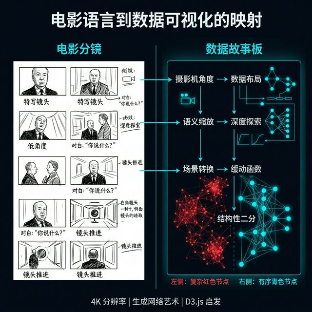
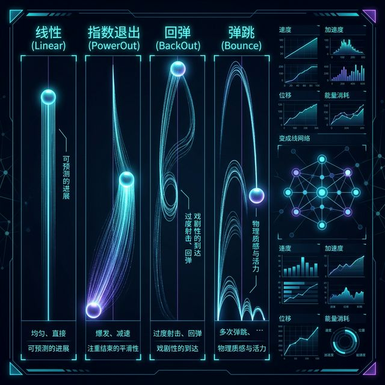
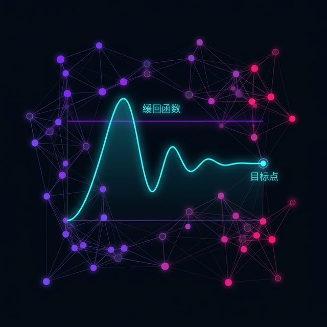
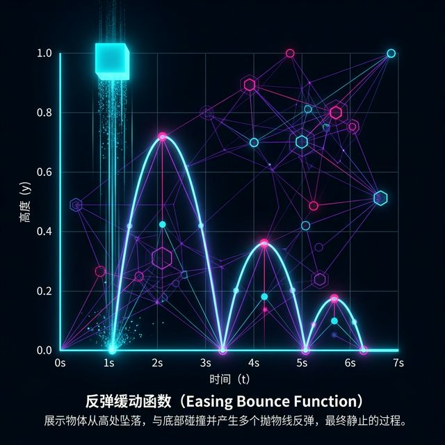
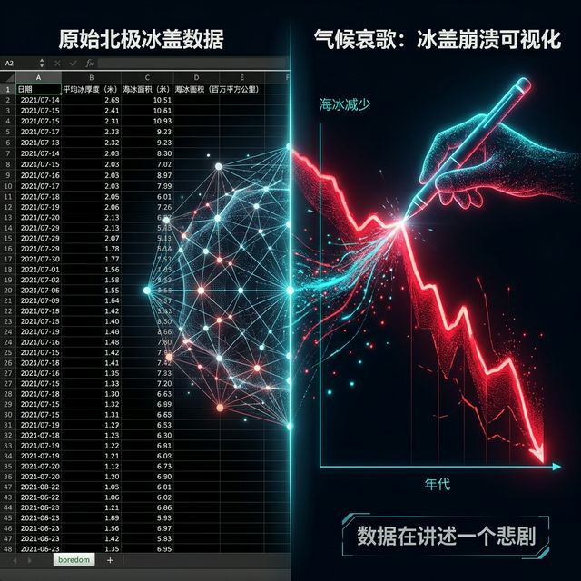
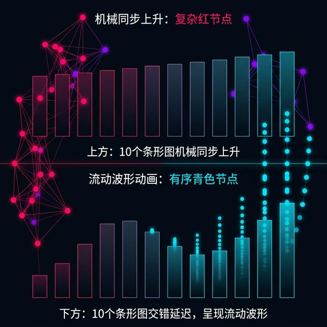

## 模块 3: 运筹帷幄——动效分镜与时空编排法 (20 分钟)
<!-- BUDGET: 9000 chars | SLIDES: ≥9 | STATUS: done -->

### 3.1 影感降维：赋予数据图表电影感

刚才的 Module 2，我们把数据可视化从"画报纸"变成了一台复杂的"电影首映场"。但是，一部电影是怎么拍出来的？

导演拿着剧本直接去现场开机吗？绝不可能。中间必须有一个桥梁：**分镜脚本（Storyboard）**。

在你们大二学习的《视听语言》课程中，你们学过专业的电影分镜表：景别是全景还是特写、机位是俯视还是仰视、镜头是推拉摇移、时值是几秒钟。在电影工业里，这个环节将剧作家纯主观的文字脑补，翻译成了摄影师、灯光师、剪辑师可以严格复刻的精准机位坐标图纸。这一步是把感性装入理性框架的最关键转换阀门。

> [VISUAL]
> *   **Slide**: `S18_Film_vs_Data_Storyboard`
> *   **Layout**: `Split`
> *   **Scene**: 左半边是经典的希区柯克手绘电影分镜稿（旁边标注着机位、景别和对白）；右半边是完全对应的"数据分镜表"：机位对应了图表的 Layout，景别对应了语义 Zoom 的层级，推拉摇移对应了图表的过渡动效（ease 缓动曲线），而对白对应了叙事层文本。
> *   **Text**: "数据导演：将视听语言降维映射到代码表"
> *   **Asset**: 

在这里，我要求你们完成一次跨学科的降维映射。这要求你们将大脑的运转模式，从"讲故事"强行切换到"算坐标"。

在信息可视化的 Scrollytelling 架构里，你的浏览器视口，就是电影机位。而你图表库里的那些配置项（比如 ECharts 的 100 多种 options 参数设置，比如 D3 的 enter/update/exit 操作队列），就是你的现场群演调度和天光灯光控制台。

如果没有一张严谨的数据分镜表，你一坐到编译器面前就会彻底迷失。你会分不清到底哪一句话该触发哪一次颜色的变化，最终你会因为思维负载过高，而写出一堆毫无逻辑的、如同精神分裂般的疯狂滚动效果：一会儿把地图翻过来，一会儿让柱状图红绿闪烁，最后页面被卡死崩盘。

[CASE STUDY: 电影线索法引入数据图景]
在《信息可视化设计》教材（郝亚维）关于"动态变奏"的理论延展中，很多前沿学者引入了电影线索法。一页优秀的数据滚动图文，它的开机第一幕必然是一个或吸引力的 **起幅（Establishing Shot）**。
比如上来展现的是一张 1900 年荒芜的地球夜间灯光图，奠定了工业化初期的底色基调。它告诉读者这件事情在什么宏观背景下发生。
随后，随着每一次滚动，其实就是一次 **切分镜头（Cut）** 或 **平移过渡（Wipe/Pan）**。这种节奏，必须要在工程师写下一行代码前，在白领纸上被干脆利索地死死地画出来。没有分镜表，就没有交互权。

这种"降维打击"的能力，要求我们不能仅仅沉溺于数据的精确度，而必须学会掌控读者的心理节奏。数据不仅需要被看见，更需要被感受（Felt）。这就需要我们在设计之初，就将观众的情感起伏纳入分镜表的考量。例如，在揭示一个令人痛心的社会问题数据时，镜头不应是快速切换，而应是缓慢推近，给予读者足够的心理缓冲去消化那份沉重。

### 3.2 三维切片：数据图表动作指挥棒

那么，这张专属于数据可视化的分镜表长什么样？为了让大家直截了当地把灵感落地，而不是陷入不知如何下笔的空泛境地。我给大家总结了一套名为**"数据动作指挥棒：三维切片模型"** 的实操法则。

> [VISUAL]
> *   **Slide**: `S19_Three_Dimensional_Deconstruction`
> *   **Layout**: `Grid`
> *   **Scene**: 一个带有 X, Y, Z 三个粗壮轴线的三维空间直角坐标系模型。X轴用亮眼的绿色写着"Trigger（我讲什么）"，Y轴用明黄色拉出"Render（你看到什么）"，Z轴用冰冷的幽蓝色刻着"Code（机器做什么）"。
> *   **Text**: "数据动作指挥棒：X/Y/Z 三维模型"
> *   **Asset**: 

在绘制你的分镜手稿时，无论你用的是 Excel 还是白板，你必须为每一个互动滚屏操作划定这三个绝对清晰的维度（X/Y/Z 轴），缺一不可。这三个维度不仅是工程层面的划分，更是认知层面的解构。

1.  **X 轴 - 触发指令（用户动作/文案对白）**
    这是事件的第一推动力。我们说 Scrollytelling 是由文字推进的，那么这里就是填那个即将去撞击触发线的核心句子。读者往下滚动了，屏幕中间这句主标题《但是，在 2008 年的金融危机，一切都变了》进入了正中视线雷达探测范围。这就是整个剧组听到的那声高亢清脆的"Action"拍摄口令。你的 X 轴越有张力，你的故事就越能抓人。在这个阶段，每一个字都需要经过千锤百炼，因为它是唤醒沉睡图表的魔咒。

2.  **Y 轴 - 视觉呈相（画面应当做出的改变）**
    这是最终给读者看到的电影成片渲染画面结局。它完全是基于上一条 X 轴的那句口令作为导火索燃烧后的爆炸盛况。你的大脑里必须要构思出画面该发生什么并且用纯大白话记录在表格里。比如你会写下："原本红艳艳的一路高歌上升折线，突然像断崖一样齐刷刷地掉到底部，同时为了强调这种恐怖的肃杀感，背景要变成刺眼警报般的红色，其他无关的股票全部要变暗成为灰色的幽灵线迹"。这其实就是向大家展示了你最原始朴素但是敏锐的审美主张。

3.  **Z 轴 - 机器指令（参数传递）**
    这是最工程化、最无情冰冷的一步。你要把刚才 Y 轴那句充满文艺气息激情四射的"断崖、变红、变暗"，强行通过你所掌握的 API 文档词汇表，生硬甚至死板地强制翻译成底下 ECharts 能够听懂的参数。比如写进你的白板格子里：`xAxis: {min: 2007, max: 2009}`（用来截断时间线）、`series.itemStyle: {color: "#ff0000"}`（全部置换掉映射色系变红）、`markArea`（插入高危背景区）。没有任何诗意，全是无情的键值对。

**(Pause: 2s)**

大家听到了吗？这就是从一个充满激情的文科叙事生，转变为一名冰冷精确的前端架构师的唯一思维隧道。
没有 X，就没有触发的契机源头，你的图表就是个死死钉在墙上的植物人；
没有 Y，你的东西就丧失了可视化的审美灵魂，只是在干瘪地刷新着无聊的数据；
没有 Z，你所有的雄心壮志跟绝妙想法都只是一堆在放空炮无法落地的幻影，根本写不进哪怕任何一行代码里去。

只有将这三个维度在你的脑海中、在你的草稿纸上完美统一，你才能说你真正掌握了 Scrollytelling 的核心奥义。这是一种对信息的多维度的绝对控制力。

> [VISUAL]
> *   **Slide**: `S20_Storyboard_Practice`
> *   **Layout**: `Split`
> *   **Scene**: 展示一张真实的工业级 Scrollytelling 分镜表（JSON/Excel混排表格巨幅特写），表头清晰列出令人苏爽的工程化秩序排列：Step编号序列、Trigger文本(X)、视觉描述意象(Y)、图表Options变更(Z)、缓动曲线类型(Ease-emotion type)。
> *   **Caption**: 别写代码，先填表。填满这张表，你就赢了百分之八十。
> *   **Asset**: 

当你把你的文章切成 10 句话，你其实就得到了 10 个 Step 的天然触发点切片缝隙。你强迫自己痛苦但又理性去填完这 10 个 Step 对应的 X/Y/Z 轴格子。这就相当于竣工交付了一份完美无缺、甚至具备法律效力的工程蓝图。不仅如此，它由于高度解耦，它甚至是结构化的、可以下一秒钟立即丢给 AI 直接无缝对接编译为标准 JSON 配置文件的元资产（Meta Assets）。在这条降纬链道上，人类设计师的不可替代权威性体现得淋漓尽致。

### 3.3 缓动情绪：赋予数据物理的生命

在我们完成分镜蓝图后，将其落实到渲染引擎时，有一个容易被忽略的核心配置项：**Ease 缓动函数（Easing Function）**。

在默认情况下，计算机底层处理位移使用的是 `linear`（线性匀速插值）。这意味着元素会以恒定速度机械地移动到终点，缺乏真实的物理反馈。这违背了人类对物理世界的基本直觉。

[PHILOSOPHY: 缓动函数即情感]
自然界中真实物体的运动受制于惯性和摩擦力，必然经历加速与减速的过程。
在经典动画十二原则中，"Slow In and Slow Out" (缓入缓出) 正是模拟这种物理特质的关键。对于数据可视化而言，**缓动函数（Ease Function）**是调节叙事节奏、赋予数据元素物理重量感的工具。数据不仅需要到达准确的坐标，更需要在这段路径中表达出特定的视觉情绪。

在 D3.js 和 GSAP 等动画引擎中，内置了丰富的缓动算法。我们需要理解它们背后的**物理隐喻（Physical Metaphor）**，以契合不同的演出需求。

> [VISUAL]
> *   **Slide**: `S21_Easing_Psychology`
> *   **Layout**: `Grid`
> *   **Scene**: 四组动态圆球展示不同缓动曲线的效果，每个圆球上方悬浮相应的数学曲线函数图谱。
> *   **Text**: "数据的性格特征：通过缓动函数构建物理隐喻"
> *   **Asset**: 

**1. `Power / Sine / Quad` (平滑过渡基准曲线)**

这是工业界应用最广的基底缓动系。它们通过极函数的包络，提供平滑自然的加速与减速反馈。
为迎合不同的交互预期，它们被细分为 `ease-in`（缓入）、`ease-out`（缓出）和 `ease-in-out`（缓入缓出）。
需要注意的是：在面向大众终端的滚动交互中，通常建议**优先使用 `ease-out`**。原因在于，用户的滚动操作是触发动作的指令，系统需要即时给出初始的高速响应，随后再平滑减速至终点位置。如果滥用 `ease-in` 的缓慢起步，用户在零点几秒的视觉延迟中容易误判为设备卡顿。

**2. `Back` (蓄力回弹曲线)**

> [VISUAL]
> *   **Slide**: `S21b_Easing_Back`
> *   **Layout**: `Flow`
> *   **Scene**: 一个带有动感尾迹的元素执行 Back 缓动：它略微超越目标界线后，通过具有弹性的阻尼振荡，最终稳稳吸附于目标点。
> *   **Text**: "Back 函数：创造具有张力的物理反馈"
> *   **Asset**: 

这是一种带有戏剧张力的缓动函数。
当为元素指定 `ease: "back.out"` 时，该元素在到达目标点前会保持较高速度，冲过警戒线后，再像一根被拉伸的橡皮筋一样，经过短暂的回弹震荡锁定在目标刻度。
这种带有韧性的微小阻尼反馈，大幅增强了界面的操控质感，适用于希望引起快速视觉聚焦的重点数据强调。

**3. `Bounce` (重力弹跳曲线)**

> [VISUAL]
> *   **Slide**: `S21c_Easing_Bounce`
> *   **Layout**: `Flow`
> *   **Scene**: 演示 Bounce 缓动的物理模型图：一个沉重的色块落下，接触底部坐标轴后产生几次明显的抛物线弹跳，最终静止。
> *   **Text**: "Bounce 函数：模拟高重力场景的情绪爆发"
> *   **Asset**: 

`Bounce` 提供了一种强烈的视觉重量感，它模拟了物体从高处坠落并撞击坚硬地面的物理形变与回弹。
在常规的严肃商业图表中通常需谨慎使用。但在可视化例如股市暴跌、灾难性指标断崖式下行等具有强烈情感爆发力的场景时，配以 `bounce.out` 会使得数据立柱在触底时产生沉重的视觉冲击力。

合理的参数调整不仅仅是修改颜色，更是**赋予图表符合叙事语境的物理引力**，从而完成专业化的视觉编排。

### 3.4 现场推演：气候演变的三维分镜

空谈理论不如实战演习。我们立刻进入气候演变数据长卷的案例实战。

> [VISUAL]
> *   **Slide**: `S22_Climate_Data_Case`
> *   **Layout**: `Split`
> *   **Scene**: 左半区大图为北冰洋科考队记录的夏末冰盖覆盖总面积趋势表，呈断层式下降。右半区展示架构师的工程演算拆解过程。
> *   **Text**: "打板开机：用三维模型解剖北极冰盖的衰败趋势"
> *   **Asset**: 

假设我们将这份全球冰盖衰减数据集，运用 Scrollytelling 三层架构结合分镜法投射出来，其工程拆解如下：

**【Step 1: 建立和平纪元基准线 (Establishing Shot)】**
*   **X (触发文本)**："在过去的三亿多年里，地球被这层古老厚实的冰盖保卫着，它是过滤星球热量的免疫中枢。"
*   **Y (视觉呈现)**：展现横向延伸的大蓝底温和面积折线，线条波动平缓。通过宁静的视觉基调，为后续的巨变铺设反差底色。
*   **Z (代码指令)**：`xAxis: {min: 1900, max: 1950}`（锁定时间域）；`series.areaStyle: {opacity: 0.8, color: '#e0f7fa'}`（提供极地冷霜色盘）。
*   **Ease (缓动调校)**：采用 `linear` 或克制的 `sine.inOut`，维持画面平稳无波。

**【Step 2: 工业纪元的大势衰竭】**
*   **X (触发文本)**："直到 1980 年工业爆发，这道过滤屏障出现了不可逆转的衰退。"
*   **Y (视觉呈现)**：伴随滚动，蓝色底域陡转直下，象征冰盖面积的深红色曲线快速下坠，触碰底部极值。
*   **Z (代码指令)**：`xAxis: {min: 1980, max: 2023}`；启动色彩阈值突变：`visualMap: [{min: 警戒阈值, max: 安全均值, inRange: {color: ['blue', 'red']}}]`。
*   **Ease (缓动调校)**：果断介入 `ease: "power3.out"`。让红线下落时拥有极强的初始势能，后续进入长尾减速阶段，利用缓动特性拉长坠落的视觉残留。

通过控制文本（X）引入背景，利用视觉（Y）渲染走势，再利用底层图表引擎与缓动指令（Z）完成精准定格。这才是操控可视化架构的数据闭环。

### 3.5 脑暴劈斩：实战手绘重型大分镜

废话少说理论结案。我们立刻开启真实试炼。我不要求你们现在就去电脑上用 npm 一行行搭依赖库抓狂，那是明天的课。今天，你们要在最原始的白板上，打一场脑暴白刃战！

> [CASE STUDY]
> *   **Type**: `Workshop`
> *   **Duration**: `25min`
> *   **Desc**: **"分镜狂魔集训"：手绘你的三维数据斩骨剧本。**
> 
> **实战规则与流程**：
> 1.  **领取战卷**：每组领取一张 A1 巨幅白板纸和彩色便签纸。
> 2.  **剧本抽签**：从我给的库中认领三个宏大议题之一，比如《生死时速心梗急救图景》或者是《绝望狂飙：疫情肉菜物价大盘飙升》。
> 3.  **极刑切分挑战**：25 分钟限定内，严格使用"三维切片模型"，残忍果断地斩出绝对不少于 **4 个连续的滚动触发节点巨幕**。
> 4.  **强硬定刑指标考核**：X 轴叙事不准多于两句话且充满极高恐怖张力；Y 轴必须有深度 Zoom 和惹眼的色彩突围且标出背后的 Ease 理由；Z 轴哪怕用伪码也得把被杀鸡取卵操控的确切属性（像系列 color 大组或 markArea 防区）点出。
> 5.  时间一到，不准带电脑，徒手画纸大喊登台路演，手眼心齐并为全系生讲述出你的那一场深空数据绝美崩塌盛宴。

准备好你们充血发烫的白板笔。在这接下来的剧痛磨合极压空间里，用你们手上的图纸去彻底定鼎降服并框套住这些狂放不羁的多维信息深渊巨物吧。现在，立刻开战！

---

> [TEACHING MOMENT]
> 当多个数据标签需要在一瞬间同时出现在视野中，如果它们保持绝对一致的动画轨迹和起始时间，给人的感觉是什么？

### 3.6 交错魔法：打破机械的时间群组
在数据可视化的动效设计中，绝对的整齐划一往往等同于机械与僵硬。当我们需要展示一组同类数据（例如一组柱状图、一群散点群体、或是地图上的多个光爆点）时，引入时间纬度的微小错位，是提升视觉有机度（Organic Feel）的关键手法。这种技术被称为 `Stagger`（交错）。

> [VISUAL]
> *   **Slide**: `S22b_Stagger_Effect`
> *   **Layout**: `Comparison`
> *   **Scene**: 对比图。上方是十个柱状图同时、匀速上升，像一堵墙；下方是十个柱状图以 `stagger: 0.05s` 的延迟依次上升，像微风拂过麦浪般的阶梯状波浪流动。
> *   **Text**: "Stagger 魔法：打破机械的整齐划一"
> *   **Asset**: 

> [CASE STUDY]
> 打开代码演示窗，我们现在有一个包含 50 个节点的散点图。
> 尝试修改动画配置参数：将 `delay` 设置为一个固定值，然后再将 `delay` 设置为 `(index) => index * 0.02`。体会这行简单的代码是如何赋予群体数据以生命力的。

交错动画不仅仅能带来视觉美感，它还具备引导视觉路径（Visual Flowing）的功能。通过有意识地控制交错的顺序（从左到右、从大到小、或者从核心向边缘辐射），设计师可以巧妙地牵引读者的视线，让他们自然而然地按照预设的优先级去读取数据群组。

### 3.7 链路编排：控制复杂因果的时间轴
不仅是独立元素的微观动效，在宏大的数据叙事中，我们常常需要多个复杂的动作按因果逻辑依次发生：首先，背景地图淡入；随后，主要航线绘制；接着，关键节点的数据气泡膨胀爆开；最后，旁侧的说明性文字逐字浮现。

这种连锁反应不能依赖原始的乱麻式回调函数（Callback Hell）去管理。必须引入强大的时间轴对象（Timeline），将所有这些独立的动作封装成有序的切片（Clips），并以线性（甚至重叠）的序列链接起来。这正是导演思维在工程代码层面的直接物理映射。你控制了 Timeline，就控制了整部数据电影的命运。

> [TEACHING MOMENT]
> 如果我们在时间轴序列中，让下一个动画在当前动画播放到 80% 时就开始提前切入（Overlap），这与完全等待当前动画结束后再开始，会对整体节奏感产生什么影响？

通过配置精准的时间偏移参数（如 `"-=0.2"`），可以让不同数据元素的演化产生交叠，从而营造出一种连续、紧凑、绝不拖沓的专业节奏感。
