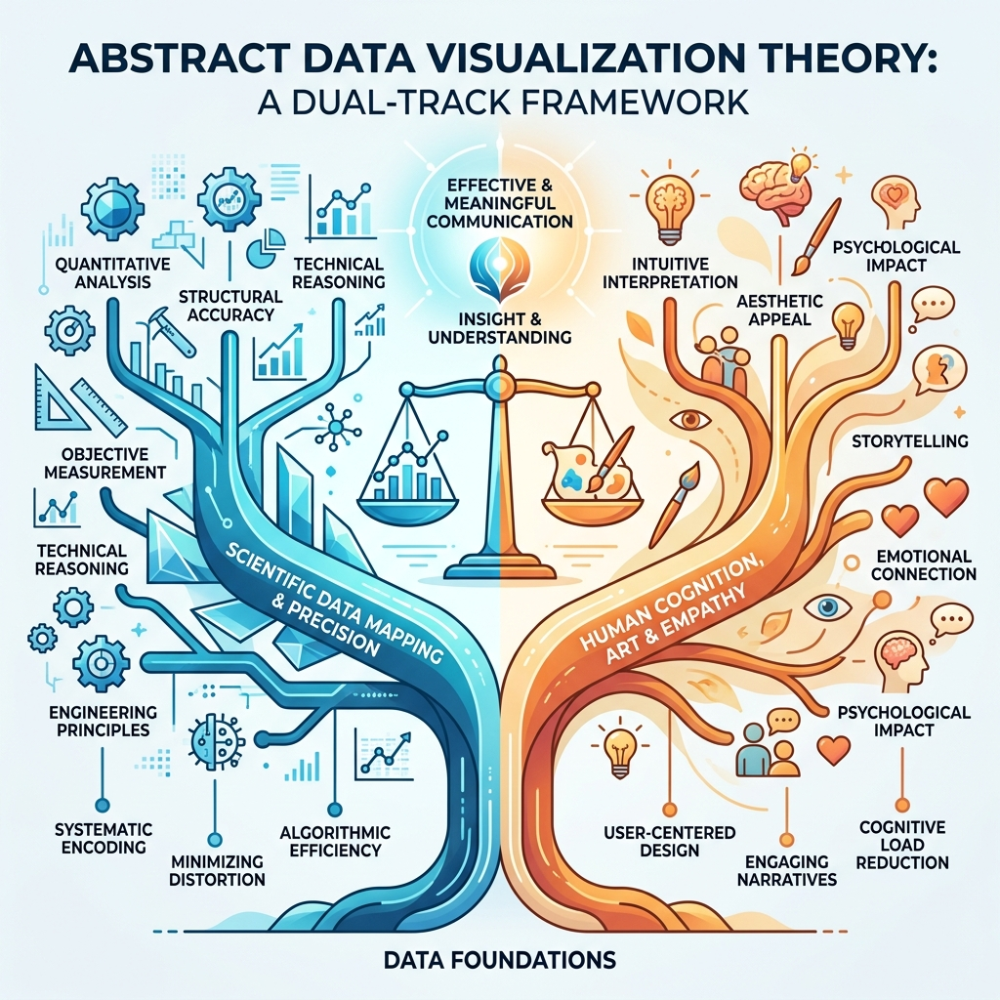
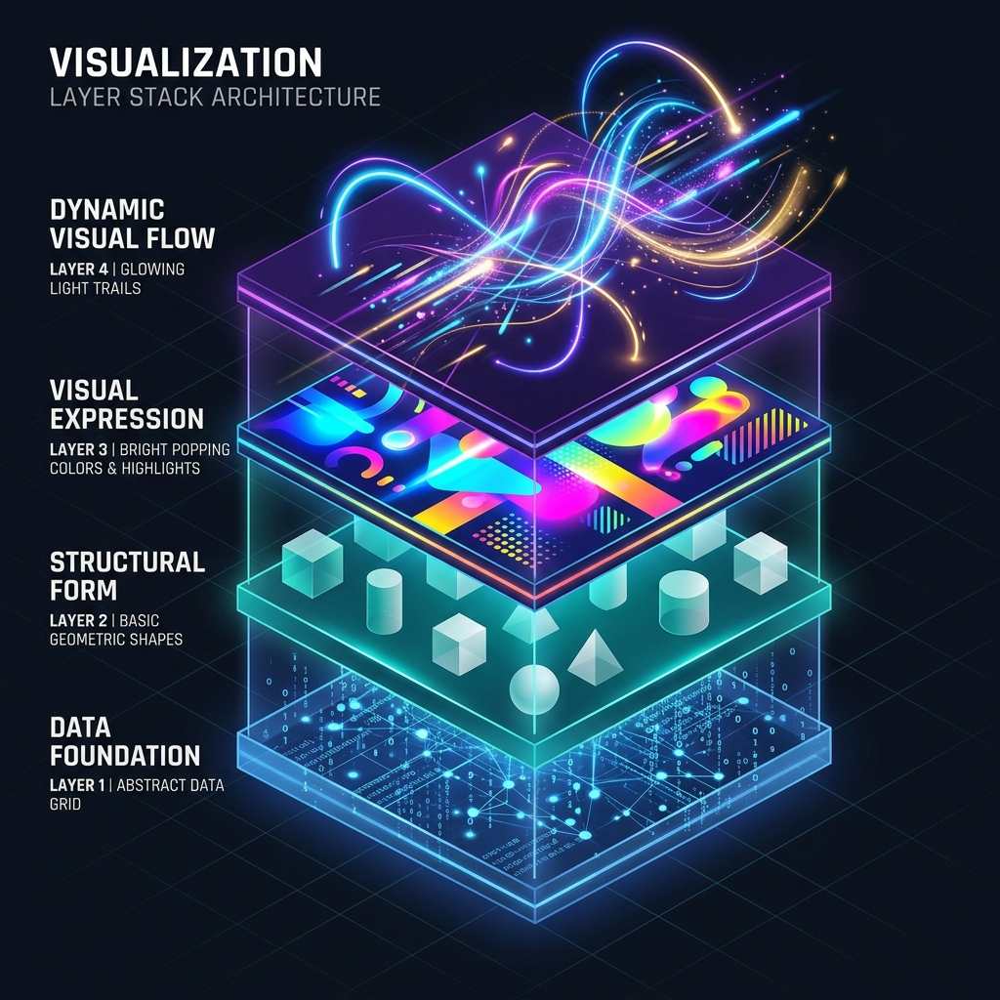
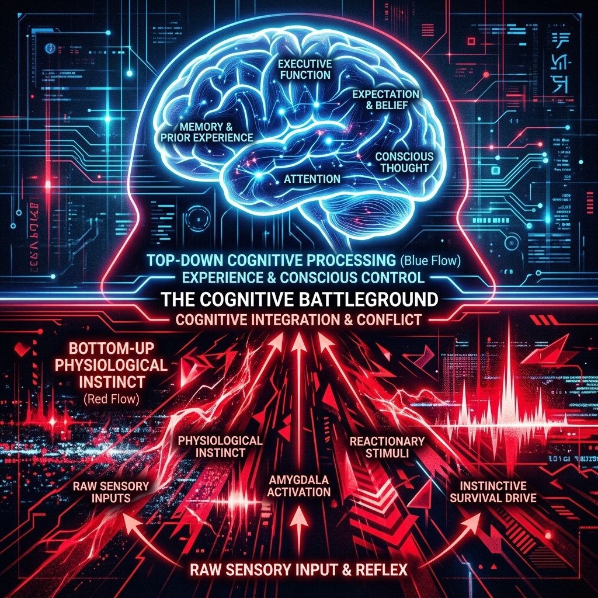

## 模块 0：课程核心架构与“1+3”双轨制体系 (约 15 分钟)
<!-- BUDGET: 2700 chars | SLIDES: ≥5 | STATUS: done -->
<!-- SKELETON:
模块 0：课程核心架构与“1+3”双轨制体系 (约 15 分钟)
-- 核心论断：顶级的信息可视化必须是科学数据骨架与艺术认知皮囊的结合（1+3层级）。
-- 情感入口：面对两本截然不同的教材（一本冰冷的代码理论，一本感性的设计排版），同学们可能会感到割裂和困惑。
-- 金字塔支撑：
   -- 支撑点 1：理工科的设计框架（Munzner）——解决准确性与科学性（骨骼与肌肉）。
   -- 支撑点 2：人文科的认知框架（郝亚维）——解决同理心与沟通效率（皮囊与灵魂）。
   -- 支撑点 3：“1+3”层级架构——逻辑骨架（建构）-> 原子编码（映射）-> 视觉落点（抓取）-> 叙事流向（引导）。
-- 视觉序列：Full (双轨对比) -> Center (提问：为什么都要学？) -> Grid (四个层级的逐层解构)
-- 出口悬念：既然核心规律理清了，那么世界上最顶级的可视化作品，是如何完美践行这四个层级的呢？
-->

> [LIFE CONNECT]
在正式开启“大师作品逆向工程”之前，我们需要先达成一个共识。作为设计专业的学生，我们习惯了“视觉至上”。拿到设计需求时，第一反应往往是：用什么主色调？排版怎么做才有冲击力？我们深信，好看的皮囊足以征服一切。

> [WARNING]
但在数据可视化领域，如果只靠“艺术直觉”而缺乏科学映射的约束，结果往往是一场灾难。

> [VISUAL]
> *   **Heading**: 反面案例：路透社佛罗里达州枪击案图表
> *   **Scene**: 路透社2014年发布的“佛罗里达州枪击案死亡人数”图表原图。图表特征为Y轴倒置（0在最上方），数据曲线用血红色填充形成“滴血”的视觉假象。
> *   **Layout**: `Center`
> *   **Source**: `External`
> *   **Asset**: 

> [ACTIVITY]
> *   **Type**: `QA`
> *   **Duration**: `2min`
> *   **Desc**: 引入真实灾难案例（路透社佛罗里达枪击案图表）
> *   **Q**: 给大家看一个真实的灾难级作品。这张 2014 年路透社发布的图表，运用了极具情感冲击力的血红色，形状像鲜血流淌，视觉极度抓人。但大家仔细看，这幅“绝美”的作品向公众传递了一个什么样的事实？
> *   **Answer**: 一眼看过去，大家都以为在 2005 年“不退让法”颁布后，枪击死亡人数大幅下降了。但如果你盯着 Y 轴看三秒，你会毛骨悚然——它的 Y 轴是**倒置**的（0 在最上面）。客观数据其实在疯狂飙升，但强烈的“滴血”视觉假象却在大规模误导公众认知。这就是“有皮囊无骨骼”的代价：**越有冲击力的视觉，越是高效的谎言机器。**

> [TECH NOTE]
为了避免这种灾难，我们在本门课程中必须同时引入两套截然不同、甚至看起来有些矛盾的法则——这就是贯穿全课的**“双轨制理论”**。

> [VISUAL]
> *   **Heading**: 课程的双轨制理论
> *   **Scene**: 双轨制理论架构树状对比图，使用对立色调（冷蓝代表科学的精确，暖橙代表艺术的感性）。左侧分支标明“骨骼：严谨的科学映射”，右侧分支标明“灵魂：感性的视觉认知”。
> *   **List**: 科学骨架, 艺术皮囊
> *   **Layout**: `Split`
> *   **Asset**: 

### 1.1 科学定调：严谨映射构筑客观真相

左边，是以 Tamara Munzner 为代表的**理工科工程思维**。
说大白话，它的首要任务就是“绝不撒谎”。它不管图表好不好看，只在乎数据准不准。在真正开始做图前，它要求我们像拿尺子量东西一样，用严格的数学规则把所有数据都框在同一个标准里。这样一来，数据里那些乱七八糟的干扰信息（也就是跟核心结论无关的噪音）就被统统过滤掉了，直接把最客观的真相“逼”出来。这套框架保证了图表绝对诚实，它构成了整个可视化作品的“科学骨骼”。

> [ACTIVITY]
> *   **Type**: `Quiz`
> *   **Duration**: `2min`
> *   **Desc**: 测试学生对“科学定调/理工科工程框架”首要任务的理解
> *   **Q**: 某实习生负责向客户汇报本季度的市场份额。他做了一张极其精美的 3D 饼图，色彩搭配完美，但四个部分的百分比加起来竟然达到了 120%。根据本课程的“双轨制理论”，这个错误主要违背了哪个框架的要求？
> *   **Options**: A. 关注认知体验的人文框架 | B. 关注数据映射的理工框架 | C. 关注视觉落点的底层本能 | D. 关注叙事引导的经验驱动
> *   **Answer**: B
> *   **Explain**: 饼图总和超出 100% 属于底层的数学规则和映射逻辑错误。Tamara Munzner 的理工框架首要任务是“避坑求真”，要求用严谨的数学规则呈现客观数据。该实习生虽然做好了属于人文框架的“皮囊”（色彩搭配精美，排除 A 选项），但属于理工框架的“骨骼”（数学准确性）却完全崩塌。

### 1.2 人文主张：同理认知赋予视觉灵魂

右边，是以郝亚维教授及认知心理学为代表的**以人为本的人文框架**。
一旦骨架搭建完毕，它就负责探讨人类大脑如何感知信息：色彩如何激发情绪，版式如何**劈开**视觉层级（即通过空间与大小决定先看谁、后看谁的阅读主次秩序），特殊形状如何**瞬间劫持**用户的注意力。它赋予冷冰冰的数据以同理心和沟通力，是可视化的“认知灵魂”。

> [PHILOSOPHY]
**没有科学骨骼的艺术是谎言，没有艺术灵魂的科学是停尸房。真正顶尖的信息可视化，是用理性的手术刀剖开真相，再用感性的皮囊讲述故事。**

所以，我们选用这两本教材，正是为了把**“理工科的缜密数据映射”**与**“人文科的艺术认知心理”**紧密结合。

> [ACTIVITY]
> *   **Type**: `Quiz`
> *   **Duration**: `2min`
> *   **Desc**: 测试学生对双轨制（骨骼与灵魂）缺陷的诊断能力
> *   **Q**: 某同学在设计“早高峰交通拥堵图”时，严格抓取了真实的拥堵指数，数据映射极其精准。但在配色上，他使用了经典的红绿对比，导致全班 8% 的红绿色弱人群完全看不懂。根据“双轨制”理论，这个作品缺失了什么？
> *   **Options**: A. 理工框架要求的数据精准映射 | B. 人文框架要求的认知同理心 | C. 科学骨架追求的绝对客观性 | D. 艺术皮囊带来的视觉冲击力
> *   **Answer**: B
> *   **Explain**: 该同学能保证数据精准，说明已具备“科学骨骼”（排除A和C）；但他忽略了受众特殊的生理视觉限制（色盲/色弱群体的认知体验），属于“人文的灵魂/皮囊”缺失。D选项（视觉冲击力）是表面现象，核心在于缺乏对“人类大脑如何感知信息”的同理心。参见上方关于艺术框架“探讨人类大脑如何感知信息”的论述。

### 1.3 架构解剖：四大维次叠加认知深度

融合这套“双轨制”思维后，我们可以将所有信息可视化设计，重新定义为一个**从抽象到具体、从骨骼到表皮的“Z 轴深度架构”**（想象我们戴上 3D 眼镜，把原本平面的图表沿 Z 轴垂直拆解，像千层蛋糕一样分成四个依次叠加的透明图层）。它包含四个像盖楼一样逐层浇筑的维次：

> [VISUAL]
> *   **Heading**: “1+3”层级架构模型
> *   **Scene**: 3D Z轴层级叠加动画。从底部的纯数据网格（Layer 1），升起基础的几何图形（Layer 2），接着图形爆发出醒目的色彩与高光（Layer 3），最后出现引导视线的动态光轨（Layer 4）。
> *   **List**: 逻辑骨架, 视觉映射, 注意落点, 叙事引导
> *   **Layout**: `Center` -> `Full` 动态展开
> *   **Asset**: 

**第一层：逻辑骨架层 (Logic & Structure)。**
拿到原始数据后，第一步不是打开设计软件，而是理清数据的前因后果，剔除无关数据（噪音），搭建逻辑骨架。它决定了作品是传递真实洞察，还是仅有视觉外壳。

**第二层：视觉映射层 (Visual Mapping)。**
将抽象数字精准“翻译”为可视的**标记与通道**（通俗来说，就是决定用什么“形状”承载数据，比如点、线、面；以及用什么“视觉变量”来区分数值，比如长短、大小、颜色深浅）。这不是为了好看，而是通过科学的映射规则呈现客观趋势，确保受众不被错误的图表欺骗。

> [VISUAL]
> *   **Heading**: 第三、四层：认知加工的双向驱动
> *   **Scene**: 局部特写 3D 层级图的 Layer 3 和 Layer 4。画面切分为上下两部分：下半部分展示高频闪烁的红光（Bottom-up），上半部分展示一个戴眼镜的人脑轮廓，正顺着光轨寻找线索（Top-down）。右下角标明引用出处：Colin Ware, Perception for Design。
> *   **List**: 生理本能, 经验驱动
> *   **Layout**: `Center`
> *   **Asset**: 

**第三层：注意落点层 (Attention & Salience)。**
过去大家觉得这层靠的是“艺术直觉”，但用认知科学的术语来说，这叫**“自下而上加工”（Bottom-up Processing）**。说大白话就是：这是大脑的**生理本能反射**。比如在一堆灰点中突然出现一个红点，你的眼睛根本不受控制，在 0.1 秒内就会被强行拉过去。通过高对比度颜色或突兀形状，我们是在直接“劫持”受众的视觉神经，完成**瞬间锁定**，强制他们聚焦核心。

**第四层：叙事引导层 (Narrative & Flow)。**
锁定眼球后，我们通过排版与留白铺设**视觉动线**（即引导观众目光游走的隐形路径）。这在科学上叫**“自上而下加工”（Top-down Processing）**。说大白话，这就是**经验驱动**。当观众顺着你预埋的线索（比如标题的大小、箭头的指向）往下看时，他们是在调动自己过去的阅读习惯和认知经验，主动去寻找意义。就像讲故事一样，一步步推导至最终结论。

> [ACTIVITY]
> *   **Type**: `Quiz`
> *   **Duration**: `2min`
> *   **Desc**: 测试学生对“1+3”层级架构具体应用场景的判断能力
> *   **Q**: 某数据分析师正在制作一份“近五年全国新能源汽车销量”报告。他先梳理了各省的增长逻辑，接着用不同长短的柱形代表销量，最后将“销量翻倍的省份”对应的柱子改为了极其醒目的荧光红色。根据“1+3层级架构”，将特定柱子标为红色这个动作，最核心是在处理哪一层的诉求？
> *   **Options**: A. 逻辑骨架层 (Logic & Structure) | B. 视觉映射层 (Visual Mapping) | C. 注意落点层 (Attention & Salience) | D. 叙事引导层 (Narrative & Flow)
> *   **Answer**: C
> *   **Explain**: 将特定数据标为荧光红，利用高对比度瞬间锁定视线，目的是在 0.1 秒内抓住眼球，正属于第三层“注意落点层”的核心特征。迷惑项重点剖析：A项“逻辑骨架”体现在前期梳理省份增长逻辑；B项“视觉映射”体现在用柱形长短代表客观销量（注：若全局用不同颜色区分省份分类，属于 B 层映射；但单点强对比高亮意在夺目，归属 C 层）；D项“叙事引导”则需要连续的动线铺设，单靠一根红柱无法完成叙事。参见上方关于四层架构定义的论述，每一次设计动作均需各司其职。

前两层是理工科的骨架，后两层是人文科的灵魂。掌握了这把拆解优秀作品的“手术刀”，接下来，让我们进入今天的重头戏：逆向解构大师作品。
