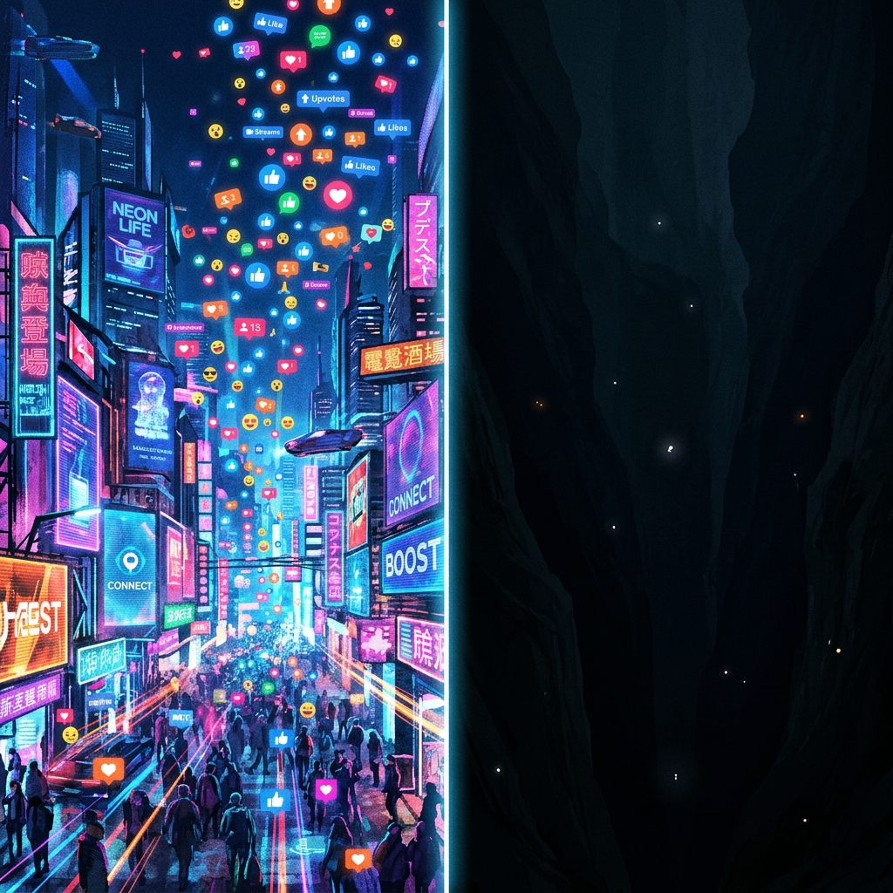
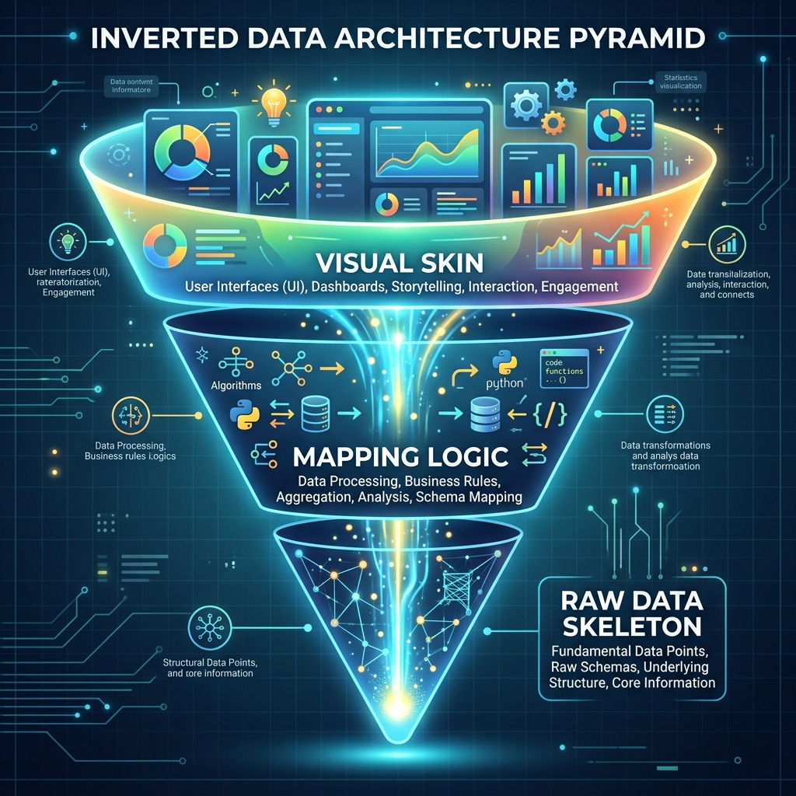

## 模块 1：逆向解构大师作品的映射机制 (约 30 分钟)
<!-- BUDGET: 5400 chars | SLIDES: ≥10 | STATUS: done -->
<!-- SKELETON:
模块 1：逆向解构大师作品的映射机制 (约 30 分钟)
-- 核心论断：震撼的可视化作品不是天马行空的涂鸦，而是精密“数据骨架”与精妙“视觉映射”的双重推演。
-- 情感入口：面对顶尖神作时，很多人觉得“我画不出来是因为我没艺术细胞”，其实是因为没掌握逆向解构的“手术刀”。
-- 金字塔支撑：
   -- 支撑点 1：解构《解构藏文》（上海大学）——用“符号化映射”解构文字的时空隐喻。
   -- 支撑点 2：解构《Award Puzzle》（向帆）——用“AI 聚类”与“交互查询”对庞大油画数据的深度追问。
   -- 支撑点 3：解构《Invisible Pixel》（江南大学）——用“前注意落点”与“情感叙事”为快手扶贫用户画的数据肖像。
   -- 支撑点 4：解构彼得·格兰迪与张圣焕的“拟物与幽默”——用极致简单的版式布局，打破医学科普与生活的门槛。
-- 视觉序列：Full (神作震撼全貌) -> Split (数据骨架与视觉皮囊对比) -> Grid (多个作品的降维排布)
-- 出口悬念：这些大师用不同手段解决了小范围或生活化的问题。如果我们要挑战更庞大、更具社会责任感的宏大议题，又该怎么做？
-->

既然我们已经掌握了“1+3层级架构”这把分析的“手术刀”，接下来，我们将看看顶尖的信息可视化大师是如何完美践行这四个层级的。

进入今天的重头戏：逆向解构大师作品。

面对顶尖的可视化神作，很多人的第一反应是“我缺乏艺术细胞”。但**震撼的可视化作品从来不是天马行空的涂鸦，而是精密“数据骨架”与精妙“视觉映射”的双重推演。** 觉得无从下手，仅仅是因为缺少一套标准的“逆向工程”解剖法。

今天，我们将运用 Munzner 的 What-Why-How 原理（也就是拆解“手头有什么数据”、“受众要完成什么任务”以及“用怎样的视觉形式呈现”），逆向解构四个不同维度的顶尖作品。

> [VISUAL]
> *   **Slide**: 逆向工程解剖法
> *   **Heading**: 逆向解构的四把手术刀
> *   **Scene**: 多块屏幕同时亮起，快速闪过《解构藏文》、《Award Puzzle》和《紫菜包饭》的画面，最后定格在屏幕中央，一把解剖刀将画面劈开，露出底层的线框骨架。
> *   **List**: 符号映射, 降维挤压, 注意落点, 扁平幽默
> *   **Text**: 逆向工程：从惊艳的皮囊，剥离出理性的骨架。
> *   **Layout**: `Center`
> *   **Search**: 解构藏文 可视化, Award Puzzle 向帆
> *   **Asset**: 

### 第一刀：解构《解构藏文》的符号化映射

我们来看第一个经典案例，由上海大学上海美术学院团队创作的《解构藏文》。

> [VISUAL]
> *   **Slide**: 藏文解构骨架
> *   **Heading**: 第一刀：符号化映射
> *   **Scene**: 展示《解构藏文》的整体视觉。复杂的藏文诗歌如同繁星一样散落在星空中，文字笔画被拆解成飘逸的线条和点阵，充满了神秘的宗教氛围。
> *   **List**: 数据, 任务, 映射
> *   **Text**: 案例 1：《解构藏文》——文字的符号化解构。
> *   **Layout**: `Full`
> *   **Asset**: 

初看它像一幅当代艺术画，但如果我们用“1+3层级架构”的**逻辑骨架层（What 和 Why）**去反问它，会发现其内核十分严谨：

**What（数据是什么）**：它处理的不是数字，而是藏文诗歌的文本数据、笔画结构以及拼写规则。
**Why（受众的任务是什么）**：它试图让完全不懂藏语的观众，能够理解藏文的构造之美和藏文化的时空延展。

既然逻辑骨架锁定了，它是如何做**视觉映射层（How）**的呢？

> [VISUAL]
> *   **Slide**: 藏文视觉映射
> *   **Scene**: 放大画面细节，将屏幕对半分。左侧是原始的单线藏文字体，右侧是可视化作品中被转化为各种具有空间感几何图形的藏文符号。接着画面上浮现出虚线，将散落的几何符号连接成一个整体结构。
> *   **List**: 符号映射, 连通性
> *   **Text**: 映射逻辑：将语言规则转译为几何生长。
> *   **Layout**: `Split`
> *   **Asset**: 

这就是该作品的核心突破：**符号化映射（说白了，就是把枯燥的语法规则变成一套可以任意拼搭的“乐高积木”）**。它摒弃了图表模板，将表示元音、辅音的组件视为不同颜色的原子。

为什么这些散落的符号没有变成一锅粥？这里用到的是认知科学中的**格式塔原理（Gestalt）——连通性（Connectedness）**。就像看夜空中的星座，只要几个星星有规律地排列或被隐形的线连着，我们的大脑就会“自动脑补”出一个完整的图案。通过空间维度的有序排布，它将线性的文字阅读转变为立体的空间探索，用视觉直观传达了藏语的结构与韵律。

> [ACTIVITY]
> *   **Type**: `Quiz`
> *   **Duration**: `2min`
> *   **Desc**: 符号化映射思维应用
> *   **Q**: 某音乐平台设计师小李正在构思“年度听歌报告”。为了让用户直观感受到自己一年中音乐品味的情绪起伏，他决定摒弃传统的柱状图。以下哪种设计方案最符合《解构藏文》中“符号化映射”的核心思路？
> *   **Options**: A. 统计全年听歌总时长，用一个巨大的发光数字直接展示在屏幕中央 | B. 将每首常听歌曲的专辑封面按播放时间顺序直接排列，形成一面网格照片墙 | C. 将不同音乐流派设定为特定形状（如爵士是波浪，摇滚是锯齿），根据收听习惯生成一片动态生长的几何森林 | D. 提供一个带下拉菜单的表格，让用户自行勾选并排序播放量最高的十首曲目
> *   **Answer**: `C`
> *   **Explain**: “符号化映射”的关键在于摒弃原始素材的直接堆砌和死板的传统图表，将基础属性转译为具有表意功能的“视觉原子”（如本题中的特定几何形状），并通过空间关系构建叙事。选项 C 将音乐流派转译为几何形态并以生长态势展现，完美契合该思路；A 只是枯燥的数据陈列，B 是未经转译的原始素材拼贴，D 则是传统的交互查询界面。这正是用视觉原子重塑数据模样的核心体现。

### 第二刀：解构《Award Puzzle》的数据追问

如果我们说《解构藏文》更偏向艺术和文化传达，那么向帆团队的《Award Puzzle》（数据追问）则是纯粹的“硬核数据追问与解析”。

> [VISUAL]
> *   **Slide**: Award Puzzle全景
> *   **Scene**: 屏幕呈现《Award Puzzle》的鸟瞰视角。数千张全国美展的油画作品被缩小成了密密麻麻的彩色小斑点，按某种规律排列成一幅巨大而抽象的点阵星图。
> *   **List**: 逻辑骨架, 视觉映射, 叙事引导
> *   **Text**: 案例 2：《Award Puzzle》——机器视角的艺术史。
> *   **Layout**: `Full`
> *   **Asset**: 

面对数千张油画，普通的看展方式是一张张浏览。但《Award Puzzle》的**逻辑骨架层**执行了一次极具颠覆性的“数据刺杀”：

> [CASE STUDY]
> 清华美院的向帆教授对“全国美展”这一中国最高权威的美术展览产生了强烈好奇。她没有选择写批判长文，而是联合工程师，用算法将两千多张殿堂级获奖油画“无情”地降维成一个个彩色斑点。当神圣的艺术品被剥离外衣，隐藏在奖项背后的“权力审美”与“主流色调”密码瞬间在点阵中无处遁形。

**What（数据是什么）**：数千张油画的像素、色调、构图、题材标签，以及它们最终是否获奖的结果。
**Why（受众的任务是什么）**：用冰冷的机器视角，完成一次对传统艺术权威的追问——到底什么样的画更容易拿奖？

> [ACTIVITY]
> *   **Type**: `QA`
> *   **Duration**: `2min`
> *   **Desc**: 视觉映射挑战
> *   **Q**: 如果你是设计师，手头有 5000 张油画和它们的获奖结果，你会用什么图表去“映射”这组数据，让观众一眼看出规律？
> *   **Answer**: （开放性）有同学可能会说用柱状图统计颜色，用饼图统计题材。但这都会丢失画作本身的直观属性。向帆团队的方案是保留画作本身，仅仅剥离它的坐标和尺寸。

在**视觉映射层**，向帆团队摒弃了枯燥的统计表，但也深知普通人无法用肉眼提取 5000 张图片的宏观色彩。他们借助基础的图像处理算法进行了一次暴力的**“降维挤压”**。

> [TECH NOTE] 
> **动作与价值锚定：暴力挤压与重组**
> 想象你手里有一台像素榨汁机。他们不是去分析画里到底画了什么，而是直接把每张庞大的油画**压缩**成只有 1x1 像素的彩色小斑点——滤掉所有的叙事、人物和风景，只榨取最纯粹的一滴“主题色”颜料。然后，把这 5000 滴颜料按色系**重新堆叠**在黑色的背景板上。
> 
> **消除具象细节，不仅是解决物理屏幕空间的拥挤，更是为了强行驱散艺术作品中那些令人分心的“故事”，让被掩盖的审美权力规则（评委究竟偏爱什么色系）自然结晶出唯一的真相。**

> [VISUAL]
> *   **Slide**: Award Puzzle交互
> *   **Scene**: 视角拉近，展示交互界面。当鼠标悬停在某个彩色小斑点上时，该斑点会放大显现出具体的油画细节，同时旁边亮起关联的属性维度线条。
> *   **List**: 鸟瞰全景, 细节观察
> *   **Text**: 视觉引导：焦点+上下文的无缝切换。
> *   **Layout**: `Center`
> *   **Asset**: 

在**叙事引导层**，作品运用了“焦点+上下文（Focus+Context）”的交互隐喻。**用大白话来说，这就像是给观众递了一把可以在“看森林”和“盯树木”之间无缝切换的放大镜**：拉远时观测“冷色调易获奖”的宏观森林（上下文），拉近时精确查看单幅作品的肌理树木（焦点）。这正是用算法骨架撑起的数据叙事。

### 第三刀：解构《Invisible Pixel》的前注意落点

接下来看江南大学的《Invisible Pixel》，这是一个极具社会关怀的数据叙事作品。

> [VISUAL]
> *   **Slide**: Invisible Pixel全景
> *   **Scene**: 展示《Invisible Pixel》中由快手短视频转化而成的全息数据景观。贫困地区的活跃用户生成的内容，被映射成高低起伏的数据山脉和光斑。
> *   **List**: 逻辑骨架, 数据来源, 核心任务
> *   **Text**: 案例 3：《Invisible Pixel》——为边缘发声。
> *   **Layout**: `Full`
> *   **Asset**: 

它的**逻辑骨架**聚焦于社会关怀：
**What（数据）**：快手平台上海量贫困地区用户的视频描述文字与活跃数据。
**Why（任务）**：让主流社会“看见”被折叠的乡村群体，理解他们的生命力与诉求。

> [VISUAL]
> *   **Slide**: 隐形的像素
> *   **Scene**: 屏幕对切。左侧是一座喧嚣明亮的赛博朋克风格“流量广场”，布满鲜艳的色彩和点赞图标；右侧则是被阴影笼罩的深渊，里面漂浮着微弱、黯淡的光点，象征那些不被看见的“隐形像素”。
> *   **Layout**: `Split`
> *   **Asset**: 

> [STORY TIME]
> 想象一下，在算法主导的流量时代，互联网就像一座日夜喧嚣的巨型广场。每天有数以亿计光鲜亮丽的舞蹈、搞笑段子被推上热门，但在广场的阴暗角落里，还有另一群人。他们可能是四川甘孜在海拔四千米雪线上艰难采挖松茸的藏族姑娘，可能是贵州黎平大山深处看着满地柑橘烂掉而无计可施的留守老人，也可能是试图通过笨拙的“村播”改变整座村庄命运的驻村干部。
> 
> 在庞大的快手数据洪流中，他们发出的微弱呼救与期盼，往往因为缺乏包装和滤镜，瞬间就被淹没，成为屏幕上无人问津的“隐形像素”（Invisible Pixel）。江南大学的设计团队敏锐地捕捉到了这种**数字时代的残忍反差**：最需要流量来救命的边缘群体，往往最不懂得如何讨好流量算法。既然正常的渠道发不出声音，团队决定用可视化的力量，在冰冷的数据深渊里进行一次悲壮的“打捞”。当某位老农绝望的求助被提取出来，并在全息屏幕上化作刺眼夺目的高光点时，它就不再是一行苍白的文本，而是一个真实的生命在向你绝地呼唤。

> [VISUAL]
> *   **Slide**: 情绪高光映射
> *   **Scene**: 特写数据山脉中的某些突兀的高光点。当光斑放大时，背后浮现出具体扶贫用户的短视频切片（例如：粗糙的双手捧着干瘪的农作物，或是风霜皲裂的脸庞对着镜头局促地笑着）。
> *   **Text**: 注意力落点层：用高光刺痛观众。
> *   **Layout**: `Split`
> *   **Asset**: 

在这个作品中，**注意力落点层**发挥了决定性作用。面对海量的非结构化文本（也就是那些没有华丽包装、错字连篇甚至语无伦次的日常大白话），设计师深知：如果只是把这些求助数据做成传统的饼图或柱状图，它们依然是冷冰冰的统计数字，根本无法击穿圈层、唤起主流社会的共情。因此，他们利用自然语言处理中的“情感分析”技术，做了一次极具痛感的物理级数据转译。

**通俗地说，就是给每个乡村用户发出的挣扎与呼喊“称重”（把看不见的虚拟情绪，变成占地方、有重量、带温度的实体积木）。**

> [VISUAL]
> *   **Slide**: 情绪词称重
> *   **Scene**: 动画演示：左侧飘落几粒轻飘飘的沙子，标记为“日常记录”；右侧重重砸下几个发着刺眼红光、巨大且沉重的铁块，上面刻着“滞销”、“救命”、“烂在树上”。铁块砸下时，底部的数据网格发生剧烈变形。
> *   **Layout**: `Split`
> *   **Asset**: 

他们在算法中赋予了不同词汇以特定的物理属性：普通的日常记录如同一粒沙子，而那些包含“滞销”、“烂在树上”、“借钱”、“救救”等极其绝望或迫切求助的词汇，则被赋予了极其沉重的质量与极高的能量阈值。

当几万条这样的数据被倾倒进虚拟的三维空间时，奇迹发生了：那些沉重苦涩的求助声**暴力地向上挤压**地表，硬生生顶起了一座座幽暗深邃的数据山脉。而那些情绪浓度最高、最令人揪心的节点，被强行注入了极高对比度的“刺眼发光体”。

在零点一秒的“前注意加工阶段”（Preattentive Processing），这种强烈的**视觉显著性**就像黑夜深渊中突然射出的一盏高压探照灯，瞬间捕获了你的视线。你根本不需要去逐行阅读文字，你的生理本能就会被那刺眼的光芒“烫伤”。此时，你看到的不再是一组无聊的坐标点，而是一个个在数字折叠空间里奋力挣扎、试图冲破黑暗的真实灵魂。

来，我们用这个非常重要的生理本能，做一个小的情境测试。

> [ACTIVITY]
> *   **Type**: `Quiz`
> *   **Duration**: `2min`
> *   **Desc**: 视觉显著性与前注意加工
> *   **Q**: 假设你正在设计城市晚高峰拥堵地图，为了利用“前注意加工”让交警瞥一眼（0.1秒）就能瞬间锁定严重车祸路口，你应采用哪种视觉映射方案？
> *   **Options**: A. 在事故节点添加详细的文本数据标签 | B. 设定全局为暗灰底色，事故路口用高亮红点 | C. 使用粗细不一的线条代表路况拥堵程度 | D. 将所有路段均采用不同深浅的渐变色块
> *   **Answer**: `B`
> *   **Explain**: “前注意加工”依赖大脑对颜色突变、亮度反差的瞬间本能反应。高亮红点对比暗灰色（选项B）创造了极强的视觉显著性。相比之下，阅读文本标签（选项A）和分辨渐变深浅（选项C、D）都需要调用耗时的注意力进行搜索，无法实现“一眼刺痛”。这正是本节《Invisible Pixel》中用高光点处理核心信息的逻辑。

### 第四刀：彼得·格兰迪与张圣焕的几何扁平与幽默

前面三个作品都很宏大、很深刻。那如果我们处理的是最日常的生活数据，或者儿童科普知识呢？

来看韩国设计师张圣焕的《紫菜包饭》和彼得·格兰迪的《健康的嘴》。

> [VISUAL]
> *   **Slide**: 生活化科普
> *   **Scene**: 屏幕切成网格状，并排展示张圣焕《紫菜包饭》的食材拆解说明图，以及彼得·格兰迪《健康的嘴》中大面积色块构成的幽默人体牙齿剖面图。
> *   **List**: 紫菜包饭, 健康的嘴
> *   **Text**: 案例 4：生活化科普的巧妙转译。
> *   **Layout**: `Grid`
> *   **Asset**: 

> [ACTIVITY]
> *   **Type**: `Quiz`
> *   **Duration**: `2min`
> *   **Desc**: 复杂信息降维策略
> *   **Q**: 面对医学或精密食谱这种“高认知门槛”的数据，两位设计师都不约而同地采用了一种反常识的映射策略。你认为是以下哪一种？
> *   **Options**: A. 使用最精确的 3D 渲染技术 | B. 用扁平的几何插画替代真实照片 | C. 加入大量的解释性小字 | D. 堆砌条形图
> *   **Answer**: `B`
> *   **Explain**: 真实的高精度医学图片会引起不适（血腥），而文字说明又过于枯燥。他们采用了极致的扁平化（Flat Design）与几何抽象，把令人畏惧的器官变成了可爱的色块拼贴。

在**视觉映射层**，他们掌握了一个反直觉的杀手锏：**视觉脱敏与幽默化转译（就像给苦涩的硬核知识药丸裹上一层轻松可爱的彩色糖衣）。**

> [VISUAL]
> *   **Slide**: 视觉脱敏策略
> *   **Scene**: 将彼得·格兰迪作品中的某个牙齿插画放大，展示它没有血肉模糊的真实纹理，而是被剥离成几块高纯度对比色的几何块，像积木一样干净。
> *   **List**: 剥离细节, 纯色几何, 视觉脱敏
> *   **Text**: 视觉脱敏：用扁平几何消解认知恐惧。
> *   **Layout**: `Center`
> *   **Asset**: 

格兰迪去掉了所有令人不适的阴影和生物学细节，进行了极致的**符号化抽象（Symbolic Abstraction，打个比方，就是把真实得带血丝的心脏，画成情人节卡片上那颗圆润干净的红心）**。真实的高精度医学图会唤起大脑的“恐惧防御”，而通过扁平化降维，将器官转译成玩具般的纯色几何块，则瞬间卸下了观众的防备心。这种用童话般的视觉皮囊包裹硬核医学骨架的做法，不仅降低了阅读门槛，更赋予了数据一种幽默感。

### 阶段小结与过渡悬念

刚才解构的四个作品，无论主题是复杂的 AI 聚类还是轻松的儿童科普，都在践行“1+3层级”的逆向法则：

> [VISUAL]
> *   **Slide**: 逆向法则漏斗
> *   **Scene**: 屏幕中心出现一个倒立的漏斗（或金字塔），代表“逆向工程”。从顶端的“视觉皮囊”一层层向下剖析，最后落在最底层的“数据骨架”。每一层亮起时，配上刚才四部作品的闪回切片。
> *   **List**: 逻辑骨架, 视觉映射, 叙事引导
> *   **Text**: 逆向法则：从表象回归底层逻辑。
> *   **Layout**: `Center`
> *   **Asset**: 

纵观上述四个作品，这些大师**通过“符号化映射”重塑阅读空间，通过“降维挤压”剥离噪音谎言，通过“视觉显著性”瞬间刺痛神经，通过“几何脱敏”消解认知恐惧**。

> [TEACHING MOMENT]
> **核心结论 (Core Insight)**
> 这就是逆向解构的终极意义：**大师的才华或许无法复制，但他们将“抽象数据”翻译为“物理视觉”的映射动作，是可以被拆解、借鉴并重组的结构化武器。** 只要掌握了这把手术刀，你们就能为任何枯燥的数据找到最锋利的视觉皮囊。

> [ACTIVITY]
> *   **Type**: `Quiz`
> *   **Duration**: `2min`
> *   **Desc**: 逆向解构四把手术刀的综合诊断
> *   **Q**: 某新闻团队策划了一篇名为“折叠的急诊室”的数据报道，手里有两份棘手的素材：一是 1 万份毫无头绪的长篇文字病历，二是大量引起生理不适的血腥抢救现场照片。为了让大众读者既不感到恐惧，又能一秒看懂“不同病症的抢救频率极度不均”，设计师应当依次挥出哪两把“手术刀”？
> *   **Options**: A. 运用“符号化映射”将文字转为几何，并保留照片的“前注意落点” | B. 运用“降维挤压”榨取病症标签的频率分布，再运用“视觉脱敏”将血腥照片转译为扁平几何 | C. 使用“焦点+上下文”交互让读者自行翻阅所有病历，并对照片打马赛克 | D. 提取“前注意落点”的高光词汇直接陈列，并使用 3D 渲染增强抢救现场的真实感
> *   **Answer**: `B`
> *   **Explain**: 题干面临双重挑战：如何处理海量冗杂病历、如何消除血腥照片的恐惧感。面对 1 万份非结构化病历文本，必须通过“降维挤压”无情过滤掉无用的杂音，只榨取出反映频率的“病症标签”；面对血腥照片带来的心理防御机制，必须依靠“视觉脱敏”（如替换为极简的纯色几何块）来消解观众的认知恐惧。选项 B 完美匹配了这两个经典映射动作的本质。其他选项不仅徒增认知负荷，还会导致读者的直接流失。

### 宏大议题的另一面：当“神作”遭遇文化水土不服

> [VISUAL]
> *   **Slide**: 认知断层
> *   **Scene**: 屏幕左侧保留刚才四个成功案例的微缩图，右侧浮现出教材中《塑料灾难》、《美国移民年轮》等西方神作，中间出现一道象征“认知语境”的断层裂缝，并打上红色的“落地失败”警告标签。
> *   **Text**: 认知断层：为什么完美的解法换了土壤会失效？
> *   **Layout**: `Split`
> *   **Asset**: 

刚才我们解构的这几个绝佳案例，要么是国内团队基于本土语境的在地化探索，要么是无需复杂背景常识的极简科普，它们在此时此地的课堂里运作得非常完美。

但这可能会给大家造成一个幻觉：**是不是只要“映射逻辑”完美，这套公式就能包打天下？**

答案是否定的。请大家翻开教材第四章末尾，那里列举了 12 个极其震撼的国际顶尖案例（如《塑料灾难》、《美国移民年轮》等）。面对这些探讨宏大社会议题的西方神作，同学们的本能反应往往是“直接照抄它的视觉形式”。然而，如果不加甄别地生搬硬套，一旦脱离了其原生的文化土壤和受众阅读习惯，极易在国内语境下遭遇灾难性的“落地失败”。

这背后隐藏着巨大的认知鸿沟与文化差异。

为了避开这些坑，把冰冷的数据讲得充满中国式的人文关怀，又该怎么做？

让我们进入下一个专属排雷模块：**M02 国际神作的避坑与反思**。我们将结合两位大师的理论，逐一解剖这 12 个巅峰案例，扒开其华丽的视觉外衣，看清它们在“认知负荷、排版密度、数据鸿沟与情感共鸣”上的四大致命死角。
