## M02 国际神作的避坑与反思

### 撕开神作滤镜：为什么照抄“西方范式”会惨烈翻车？

> [VISUAL]
> *   **Slide**: 警告：水土不服的“神作”陷阱
> *   **Scene**: 屏幕显示一组动态拼接画面。左侧是《纽约时报》、《国家地理》等极具视觉冲击力的金奖信息图表；突然，画面右侧重重盖上一个鲜红的“警告标志”（类似施工危险警告），背景色调瞬间变暗。
> *   **Text**: 警告：水土不服的“神作”陷阱
> *   **Asset**: 

同学们，前面我们看了很多被奉为**“神作”的国际经典大厂案例**。不可否认，它们在**数据抽象**和**图形算法**上达到了顶峰。但当我们试图把这些顶配的**“西方范式”**直接搬运到我们的**期末作业**或真实项目中时，往往会遭遇惨烈的**“翻车”**。

今天，我们换个视角。我们将带上 Tamara Munzner 的 **VAD（可视化分析与设计）理论**这把“解剖刀”，并结合郝亚维老师强调的**东方设计视角**，来给这些国际大作“挑挑刺”。

我们将从**四大弊端**入手，看看这些“神作”究竟在哪些地方埋下了**认知地雷**。

---

### 避免通道超载：别让大脑的视觉内存“宕机”

> [VISUAL]
> *   **Slide**: 认知负荷极限：别让大脑的视觉内存“宕机”
> *   **Scene**: 屏幕展示一个“大脑宕机”的隐喻动画：一个透明的大脑模型内部，原本有序流动的光流因为瞬间涌入太多颜色、形状和大小不一的几何体，导致光流堵塞、“滋滋”作响并闪烁红光。
> *   **Text**: 认知负荷极限：别让大脑的视觉内存“宕机”
> *   **Asset**: 

> [TEACHING MOMENT]
> 并不是变量一多，大脑就一定会“宕机”，关键看这些变量会不会“打架”。根据 Ware 提出的“整体与分离维度”（Integral vs. Separable Dimensions）理论，有些属性（比如宽度和高度）放在一起，大脑会强行把它们融合成一个整体（面积），这就像把红蓝颜料混成了紫色，眼睛再也无法剥离（Integral）；而有些属性（比如位置和颜色）放在一起，大脑可以独立把它们拆开来读取，就像一个人同时戴着帽子和围巾，互不干扰（Separable）。当我们把互相冲突的维度强行绑定时，灾难就发生了，这就是所谓的“通道超载”。

> [CASE STUDY]
> **《卫星：在轨 60 年》、《社会晴雨表》与《2015 年孕产妇死亡率》**

> [VISUAL]
> *   **Slide**: 维度打架：大脑无法拆解的复合通道
> *   **Scene**: 屏幕展示《卫星：在轨 60 年》密集的星轨点阵。随后切出动画，演示 Integral 维度（宽度+高度=面积的强制融合）与 Separable 维度（位置+颜色的独立识别）的对比机制。
> *   **List**: 整体维度, 分离维度
> *   **Text**: 维度冲突：不要把会打架的属性强行拼在一起。
> *   **Asset**: 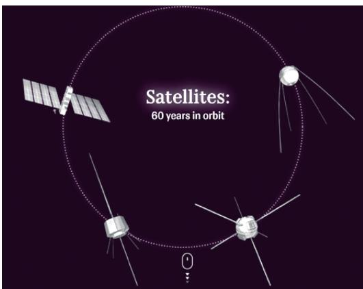

大家看这幅太空漫游图。作者同时动用了**尺寸（表征质量）**、**颜色（表征国家界别）**和**位置（表征高度与时间）**。由于错误地混合了整体与分离维度，视觉通道发生了激烈的竞争。这就好比让两个在打架的人合唱，你的眼睛根本无法在同一秒内把这三层信息并行解码。

> [VISUAL]
> *   **Slide**: 离散色彩超载：突破短时记忆极限
> *   **Scene**: 画面快速切到《社会晴雨表》几十种令人眼晕的离散色块，营造出一种“信息过载”的眩晕感。
> *   **Text**: 离散色彩超载：突破短时记忆极限
> *   **Asset**: 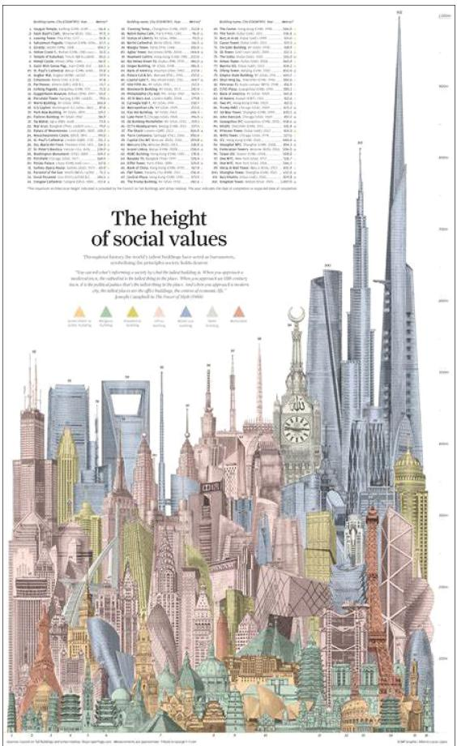

而在《社会晴雨表》中，为了区分复杂的社会分类，作者动用了几十种离散色彩。这远超人脑“7±2”的短时记忆极限。你实际上只能看到一堆斑斓的色块堆砌，根本建立不起清晰的分类索引。

> [VISUAL]
> *   **Slide**: 极端空间形变：摧毁固有的心智模型
> *   **Scene**: 画面切换到《孕产妇死亡率》扭曲变形的花瓣地图，红色动画高亮其为了适配数据而强行揉捏、扭曲的拓扑边界。
> *   **Text**: 极端空间形变：摧毁固有的心智模型
> *   **Asset**: 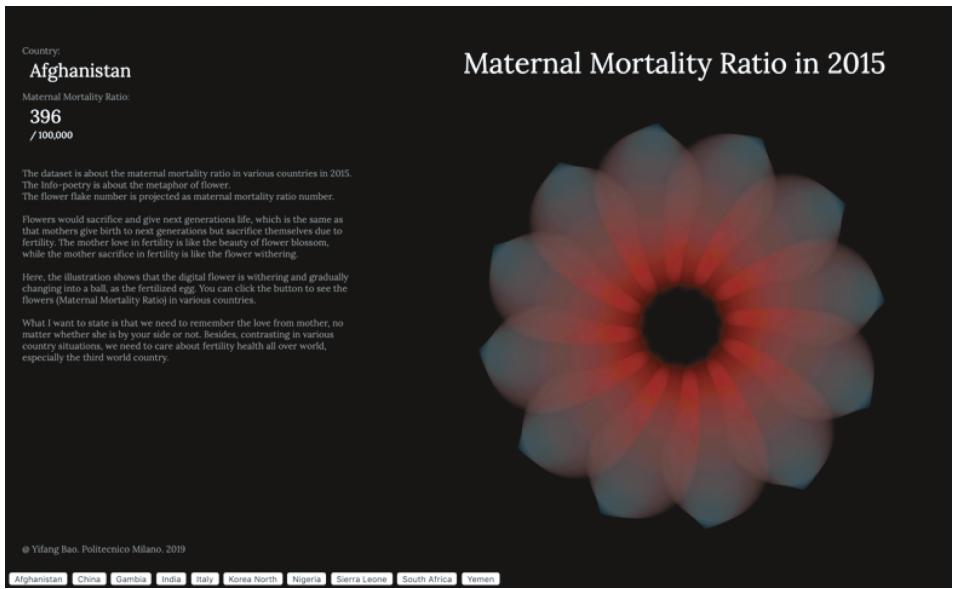

同样导致认知崩溃的还有密度设计实验室的《2015 年孕产妇死亡率》。它试图用形变的拓扑地图（即不按真实地理面积，而是根据数据大小强行揉捏、扭曲边界的变形地图）展现悲剧，但这种极端的物理形变直接碾碎了受众脑海中固有的地理心智模型；再加上色彩明度的双重编码，让本该严肃的读取任务变得极其困难。

> [ACTIVITY]
> *   **Type**: `Quiz`
> *   **Duration**: `2min`
> *   **Desc**: 测试学生对通道超载理论的情境应用与诊断能力

> **Q：设计师小林在为某快消品牌制作销售战报时，使用了一张高度复合的图表：X轴代表月份，Y轴代表利润率，不仅用气泡的面积代表销售额，用 8 种颜色代表 8 个大区，还给气泡加上了表示“是否达标”的斜线纹理。总监看后表示完全抓不住重点。根据 Tamara 的理论，这图让大脑“宕机”的核心原因是什么？**
> - (A) 画面同时启用了位置、面积、颜色、纹理等多层视觉通道，远远超出了人脑短时记忆并行解码的极限。
> - (B) 气泡的面积变化容易产生视觉欺骗，导致总监无法直接读出销售额的精确绝对数值。
> - (C) 图表使用了圆形气泡而非规则网格，导致了“极端空间形变”，摧毁了总监原有的阅读心智模型。
> - (D) 强行将定性数据（是否达标）与定量数据（利润率）混排，破坏了数据的客观表达。
> **Answer**: A
> **Explain**: 正确答案是 A。根据本节提到的“通道超载”（Channel Overload）效应，在一个画面内并发调用过多的视觉通道会让受众眼睛无所适从、大脑直接宕机。B 选项提到的面积误读确实是气泡图的弱点，但并非造成“全局看不懂”的核心原因；C 选项中的“极端空间形变”特指为适配数据强行扭曲真实地理拓扑规律（如变形地图），气泡图并不属于此类。在设计中必须克制叠加属性的欲望，谨记把最重要的指标留给“位置”或“长度”。

---

### 警惕排版水土不服：给中文语境的“黑块”留出呼吸空间

> [TEACHING MOMENT]
> 西方设计的排版往往依赖英文字母的线形特征和低视觉黑度（即排版整体看起来透气轻盈、不发闷）。把英文字母直接替换成中文方块字，灾难就开始了。

> [CASE STUDY]
> **《体育场馆信息图》、《阿曼苏丹国养蜂信息图》、《猎人和猎物》与《在博尔德生活和工作学习的费用是多少》**

> [VISUAL]
> *   **Slide**: 黑块效应：汉字方块需要更多的负空间呼吸
> *   **Scene**: 画面从中间劈开进行 A/B 对比《体育场馆信息图》。左侧是原版西式网格的密集英文排版，呈现轻盈的浅灰度；右侧通过打字机动画，将英文字母硬塞替换成实心的中文黑体字。汉字密密麻麻挤在一起，像一块块生硬的黑色“膏药”。随后飞入《阿曼苏丹国养蜂信息图》作为补充案例。
> *   **Text**: 黑块效应：汉字方块需要更多的负空间呼吸
> *   **Asset**: 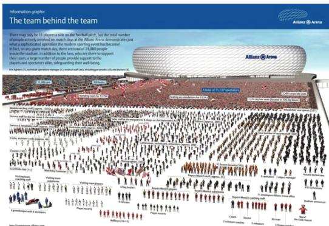
> *   **Asset 2**: 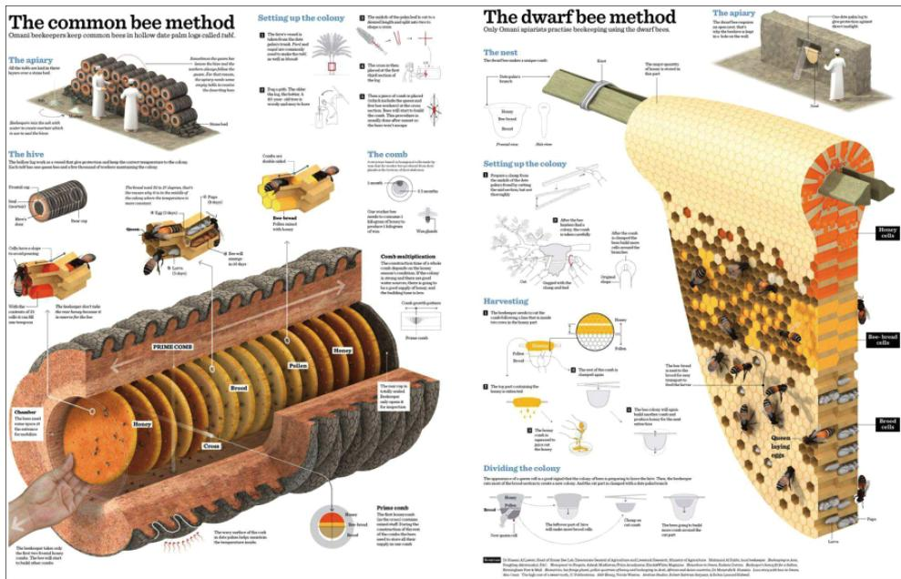

《体育场馆信息图》采用了典型的德式解剖风格（即像外科手术图解般极其严密、冷峻且充满密集指示线的制图风格）。西文排版下，密密麻麻的引线和文字呈现出理性的灰度；但当我们把它们翻译成中文方块字时，因为汉字笔画密集，版面立刻变得拥堵，形成一块块生硬的黑色结块，侵吞了原本就稀缺的呼吸空间。充满中东花纹的《阿曼苏丹国养蜂信息图》也面临同样的困境：密集的装饰图样与中文结合极度生硬。

> [VISUAL]
> *   **Slide**: 视觉噪音与呆板网格：失去焦点的排版
> *   **Scene**: 展示《猎人和猎物》中密集的“游击排版”；然后画面滑向《在博尔德生活和工作学习的费用是多少》的超市货架式网格排版，用红圈标出其缺乏视觉中心的均等方块结构。
> *   **Text**: 视觉噪音与呆板网格：失去焦点的排版
> *   **Asset**: 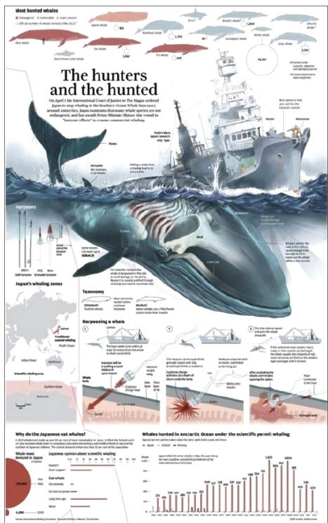
> *   **Asset 2**: 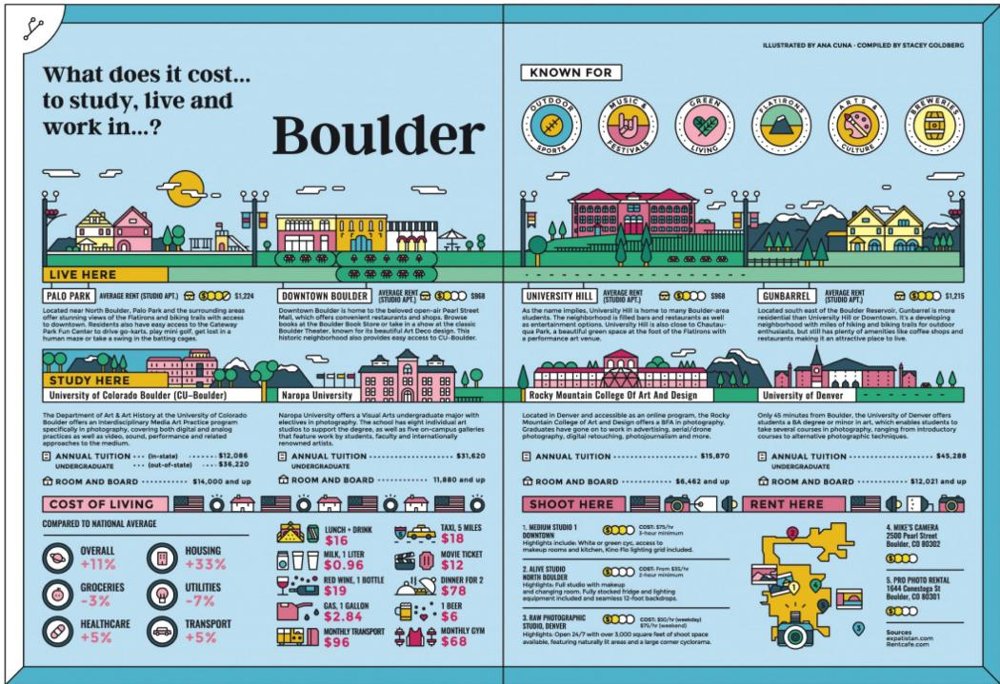

《猎人和猎物》中“见缝插针”式的游击排版，在中文语境下为了保证识别度，字号无法无限缩小。一旦硬塞就会产生极其严重的**视觉噪音**。而像安娜·库阿的《在博尔德生活和工作学习的费用是多少》，它的等分网格排版像超市货架一样平行阵列，缺乏“主-次-辅”的聚焦。一旦将这种排版填充为均等宽高的汉字，就会丧失英文字符长短不一的留白节奏，显得极度呆板窒息。

受众的眼球在密集的文字和图形间来回横跳（高频视觉扫视），找不到明确的逻辑中心。我们在做中文可视化时，必须学会大刀阔斧地进行视觉降噪，为文字留出足够的喘息空间，用负空间强行驱赶干扰项，让核心信息自动“站”出来。

> [ACTIVITY]
> *   **Type**: `Quiz`
> *   **Duration**: `2min`
> *   **Desc**: 测试学生对中西文排版密度差异与“黑块效应”的情境诊断能力

> **Q：校学生会宣传部的小李接到任务，要将一份获得国际红点奖的英文版“校园急救指南”信息图表直接汉化成中文海报。他严谨地保留了原版的极细灰线网格与密集的段落布局，仅仅把英文字母替换成了同样字号的中文黑体字。结果打印出来后，同学们反馈“看得人喘不过气，满眼黑压压的一片，根本找不到急救电话在哪”。根据中文语境下的排版水土不服现象，这份海报翻车的最核心原因是什么？**
> - (A) 汉字方块的笔画密度远大于英文字母，直接替换会导致版面充斥生硬的“黑块”，挤压了负空间，引发强烈的视觉噪音。
> - (B) 英文的解剖风格制图法会强制把分离维度转化为整体维度，导致学生在寻找急救电话时发生通道超载。
> - (C) 直接汉化摧毁了学生原本对急救指南的心智模型，必须通过扭曲的拓扑地图来重新引发共情。
> - (D) 极细灰线网格在中文语境下缺乏深度线索（Depth Cues），让平面排版产生了视觉遮挡错觉。
> **Answer**: A
> **Explain**: 正确答案是 A。正如本节《体育场馆信息图》的案例，西文排版的轻盈感来自于字母的线形特征和天生的字间距。当直接替换为笔画密集的中文方块字时，就会产生结块发闷的“黑块效应”。如果不通过大刀阔斧的降噪和增加留白来释放“呼吸空间”，受众就会在满屏的视觉噪音中迷失焦点。B、C、D 选项分别乱用了“通道超载”、“心智模型/拓扑变形”和“3D深度线索”等其他章节的概念，看似专业，但与中英文字体密度的排版差异毫无关联。

---

### 警惕炫技陷阱：别让复杂算法与 3D 建模扭曲了数据真相

有时候，神作之所以是神作，是因为底层跑了硬核的生成算法，或者动用了宏大的 3D 渲染。但这对于普通读者来说，反而成了一道不可逾越的认知鸿沟与视觉欺骗。

> [CASE STUDY]
> **《美国移民年轮》与《洛杉矶及芝加哥的收入差距》**

> [VISUAL]
> *   **Slide**: 算法鸿沟：普通人无法反推的“衍生数据”
> *   **Scene**: 屏幕展示《美国移民年轮》复杂的极坐标系膨胀动画，用红色虚线标出时间轴向外层层卷起时，外环被指数级放大的视觉面积，揭示衍生数据的认知陷阱。
> *   **Text**: 算法鸿沟：普通人无法反推的“衍生数据”
> *   **Asset**: 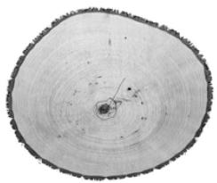

看这幅《美国移民年轮》。它彻底抛弃了直观的条形统计，用细胞元胞自动机算法生成了复杂的年轮。技术极其硬核，但它违背了**表达性原则（Expressiveness Principle，即图表必须客观、准确地传达原始数据，不能多也不能少）**。
极坐标系的几何规律会让外环面积自然放大（即把数据像年轮一样向外层层卷起后，越往外圈，同样的数值被摊饼一样撑开的视觉面积就越大），导致近代移民的视觉体量被严重夸大。普通受众根本无法在脑海中反推这种**衍生数据（Derived Data，即经过底层数学转换、不再是原始直观形态的数据）**的生成逻辑。

> [VISUAL]
> *   **Slide**: 滥用的假 3D：缺失深度线索的视觉灾难
> *   **Scene**: 切换到《洛杉矶及芝加哥收入差距》的高耸 3D 矩阵，镜头旋转，用红色阴影高亮后排被高柱体严重遮挡的“低收入洼地”。随后动画浮现出缺失的“投射阴影”和“运动视差”线索。
> *   **List**: 视觉遮挡, 深度线索
> *   **Text**: 翻车的不是 3D 本身，而是你造了一个缺失线索的“假 3D”。
> *   **Asset**: 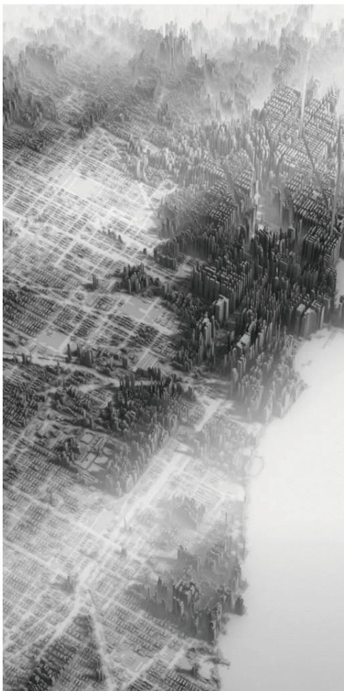

再看《洛杉矶及芝加哥的收入差距》。这是教科书级别的**滥用 3D（Unjustified 3D）**。富裕阶层的高耸柱子造成了致命的“视觉遮挡”，把背后的低收入洼地彻底掩埋。

这里需要澄清一点，根据 Ware 的理论，**3D 并不是万恶之源**。当你的数据本身就在物理空间里运动时（比如洋流轨迹、大脑神经元），用 3D 没毛病。但它之所以翻车，是因为作者造了一个“假 3D”——他没有给大脑提供判断深度的重要线索（**Depth Cues**），比如“投射阴影”（图上的柱子没有影子）或者“运动视差”（你没法旋转它看背面）。在缺乏深度线索的三维透视下，“近大远小”的错觉让不同深度的柱子彻底失去了定量比较的可能。

> [TEACHING MOMENT]
> 炫技如果没有提供相匹配的深度线索，反而摧毁了数据的准确性，这就是舍本逐末。

> [ACTIVITY]
> *   **Type**: `Quiz`
> *   **Duration**: `2min`
> *   **Desc**: 诊断学生对 3D 视觉遮挡与透视失真陷阱的识别能力

> **Q：实习生小王在市政府的年度财政报告中，做了一张包含全国各省份 GDP 的 3D 立体柱状地图，认为这样显得很“高端大气”。但主管立刻驳回了这份图表。结合滥用 3D 的反面案例，主管最可能指出的核心缺陷是什么？**
> - (A) 3D 透视带来的“近大远小”规律，彻底破坏了柱子高度之间原本客观的定量比较关系。
> - (B) 立体地图的生成往往依赖复杂的衍生数据，市民必须掌握高等数学才能看懂转换逻辑。
> - (C) 3D 柱状地图将原本连续的地理空间打碎成了离散的立体块，超出了人脑“7±2”的短时记忆极限。
> - (D) 省份之间距离过近导致多重通道超载，引发了观众短期视觉记忆的全面崩溃。
> **Answer**: A
> **Explain**: 正确答案是 A。正如本节《洛杉矶及芝加哥的收入差距》案例所示，滥用 3D 会不可避免地带来“视觉遮挡”和“透视形变”，让远处的柱子显得比近处的矮，完全摧毁了数据进行定量比较的可能性。B 选项错在衍生数据通常是类似“极坐标外扩”的数学变形，而非 3D 透视本身；C 选项和 D 选项混淆了“通道超载”或“短时记忆极限”的概念，立体地图最大的罪魁祸首是视觉遮挡与映射失真，而不是颜色数量或并发通道过多。

---

### 找回被抹去的人文温度：让冷峻数据产生情感共鸣

最后，我们来看看东西方视角在底层哲学上的最大差异。

> [CASE STUDY]
> **《塑料灾难》、《紫禁城的历史》与《探索海洋》**

> [VISUAL]
> *   **Slide**: 情感断层：被冷硬测算图表冲淡的悲剧
> *   **Scene**: 屏幕首先聚焦《塑料灾难》上半部分极具情感张力的“塑料袋冰山”；随后视线下移，用红框圈出底部如工程图纸般密不透风的科学测算表。
> *   **Text**: 情感断层：被冷硬测算图表冲淡的悲剧
> *   **Asset**: 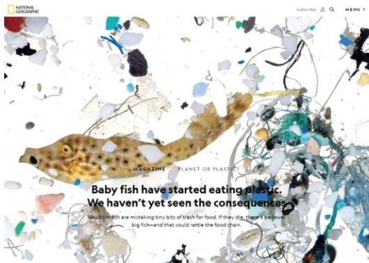

前面我们一直在强调数据的客观与准确，这是科学的底线。但这并不意味着，每一张图表都要长得像冷冰冰的实验室报告。尤其在涉及环保、灾难等社会议题时，如果在视觉上完全剥离了人的情感，哪怕底层数据再精确，也会变成一堆无人问津的数字废料。

比如《塑料灾难》这幅图的“冰山”隐喻惊为天人，但其败笔在于底部铺陈了极其繁杂、冷硬的科学图表和网络连线。这种“上帝视角”的工程制图思维，强行把观众从沉重的情绪中拉出，严重冲淡了主图营造的悲剧色彩。

> [VISUAL]
> *   **Slide**: 知识切片与测绘图：剥离了想象与威严感
> *   **Scene**: 屏幕闪过《探索海洋》的密集标注，最后定格在《紫禁城的历史》那张冷漠的资产测绘式 3D 散布图上，揭示过度理性带来的情感剥离。
> *   **Text**: 知识切片与测绘图：剥离了想象与威严感
> *   **Asset**: 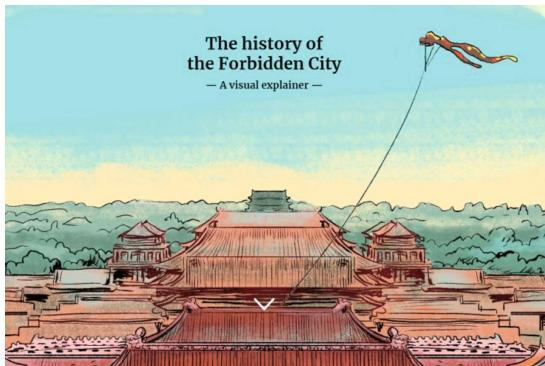
> *   **Asset 2**: 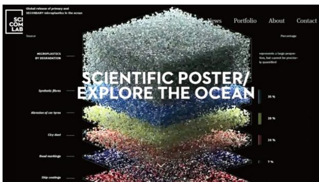

苏珊·兰迪的《探索海洋》也犯了同样的错误。它以百科全书的冷漠姿态将海洋物种切片展示，满图密布生硬的学术标注，完全剥离了对海洋“神秘、包容”的情感共鸣与留白想象。再看《紫禁城的历史》，海外团队试图用精密的散布式轴测图（一种去除近大远小透视变形、像工程图纸一样等比例平铺展现所有建筑细节的三维制图法）穷尽每一片砖瓦。结果，紫禁城被降格成了一张庞大的“房产测绘图”，完全丧失了东方文化中“天人合一、礼制秩序”的威严感。

> [TEACHING MOMENT]
> 西方的可视化往往追求极致理性和全景客观，但这容易剥夺人性深处的温度。

> [VISUAL]
> *   **Slide**: 东方审美背后的科学：视觉查询经济学
> *   **Scene**: 屏幕展示一幅极具东方留白意境的水墨画，画面中央只有简单直击人心的核心意象。随后叠加数据分析图层，显示其“视觉查询成本（Visual Query Cost）”极低。
> *   **List**: 查询成本, 短时记忆
> *   **Text**: 留白不是故弄玄虚，而是为了把找数据的成本降到最低。
> *   **Asset**: 

> 郝亚维老师强调，东方审美推崇“虚实相生”和“借物喻理”。这听起来很玄乎，但用 Ware 的科学理论解释，这叫**“降低视觉查询成本（Visual Query Cost）”**——视觉查询成本就好比大脑在画面里“翻箱倒柜”找线索所消耗的脑力卡路里。
> 所谓的留白，就是把屋里的杂物全清空，只在空荡荡的桌面上留一盏聚光灯打在唯一重要的核心意象上，大刀阔斧地砍掉冗余次级数据，不让观众在图表里玩“大家来找茬”的耗电游戏。当看图的检索成本降到最低，大脑才不会因为寻找数据而过载，才有闲置的短时记忆带宽去调取个人的生活经验与情感（即刚才我们讲的自上而下加工），从而让主视觉成为一种无声的控诉，其情感穿透力远胜于千言万语。

> [ACTIVITY]
> *   **Type**: `Quiz`
> *   **Duration**: `2min`
> *   **Desc**: 测试学生对“上帝视角测绘图”与“东方人文共情”差异的诊断能力

> **Q：在设计关于“濒危动物生存现状”的网页可视化时，某同学绘制了一张极其详尽的解剖测绘图：图上布满密密麻麻的骨骼参数引线，以及随时间变化的复杂极坐标系散点。虽然数据极其精确，但指导老师认为这幅作品“缺乏打动人心的力量”。结合“人文温度与东方审美”理论，这幅作品的核心问题在哪？**
> - (A) 缺乏对动物模型的高精度 3D 渲染，导致受众无法建立直观的空间心智模型。
> - (B) 动用了过多离散色彩来区分不同物种的骨骼，导致受众陷入通道超载的晕眩。
> - (C) 采用了冷硬的“上帝视角”工程图纸思维，剥离了悲剧的情感共鸣，缺乏虚实相生的留白。
> - (D) 未能把定性的情感元素转化为精确的“衍生数据”，导致图表丧失了客观表达的科学性。
> **Answer**: C
> **Explain**: 正确答案是 C。正如《探索海洋》与《紫禁城的历史》的翻车教训，当设计师用极度理性的全景客观和密集的学术标注来填满画面时，往往会切断受众的情感代入通道。东方审美强调“虚实相生”，通过克制的留白和聚焦核心意象来唤起共情，而非做一张冰冷的“房产测绘图”。A 选项错在鼓吹 3D，这是我们要规避的陷阱；B 选项强行套用“通道超载”理论，但不符合题干“参数引线和坐标”的问题本质；D 选项错在“把情感转化为精确数据”恰好是理科工程思维的典型执念。

---

> [VISUAL]
> *   **Slide**: 防翻车自查清单
> *   **Scene**: 屏幕显示一张带有红色勾选框的避坑检查单，逐项浮现核心排雷指标。
> *   **Text**: 防翻车自查清单
> *   **List**:
>     - 慎用 3D
>     - 警惕黑块
>     - 唤起共情

> [ACTIVITY]
> **防翻车自查清单**
> 回顾你正在进行的项目草图，问自己三个问题：
> 1. 我的画面里有没有多余的 3D 和滥用的色彩分类？
> 2. 如果把文本换成中文黑体，版面会“窒息”吗？
> 3. 我的设计是在冰冷地罗列数据，还是能唤起某种共情？

> 把这份“避坑指南”时刻放在心上。优秀的可视化，是为了降低门槛、传递温度，而不是制造新的认知迷宫。
