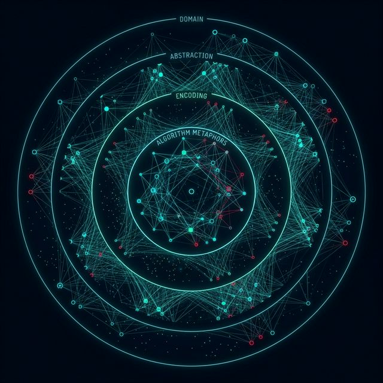
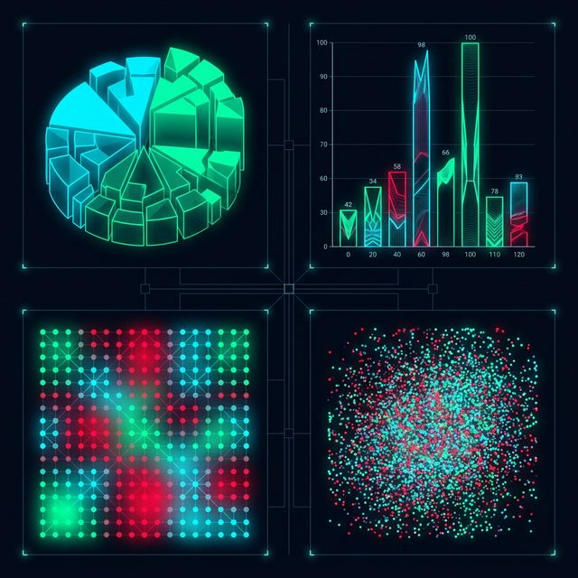

## 模块 2: 嵌套模型 —— 防御设计的级联崩塌 (60 分钟)
<!-- BUDGET: 3000 chars | SLIDES: >=5 | STATUS: done -->

> [VISUAL]
> *   **Slide**: `S02_Nested_Model`
> *   **Asset**: 
> *   **Layout**: `Flow`
> *   **Scene**: 屏幕中央显示一个倒立的金字塔，或者是四个同心圆圈嵌套层。每一层都像一道安检门。从外到内标注：领域层、抽象层、编码层、算法层。
> *   **Text**: "Munzner 嵌套验证模型：设计崩溃是如何发生的？"

当你被某个宏大议题激发热情，比如决定做一个关于全球海洋微塑料污染的项目时，你很容易冲动地打开 VS Code 或 AI 框，开始让它画一个超级酷炫的 3D 旋转海洋星球。

打住。请强行遏制住自己写下第一行代码的冲动。在《可视化分析与设计》(Munzner 2014) 的第四章中，提出了一道针对数据工作者极其苛刻的防护网：**嵌套验证模型**，英文叫 **Nested Model of Validation**。

看屏幕上这个倒金字塔——从外到内四道安检门，每一道都有自己的生存威胁。这套模型极其残忍地把可视化设计拆解为四个严格依附的层级。每一个层级，都有自己专属的“生存威胁 (Threats to Validity)”。你必须逐级验证，不可逾越。越往深处走，纠错的成本就几何级数攀升。

### 2.1 领域防线：定位受众的真实痛点

处于金字塔最外层、涵盖面积最广的，是领域情况层。在这个层级，没有任何代码，也没有任何图表。我们要问的终极问题也是最致命的：**你到底想帮哪一群特定的受众，看清什么具体的问题？**

> [VISUAL]
> *   **Slide**: `S02b_Domain_Threats`
> *   **Asset**: 
> *   **Layout**: `Split`
> *   **Scene**: 左侧是一位焦头烂额的医生看着复杂的 3D 全息大屏；右侧是一位医生看着清晰的 2D 变色报警器迅速行动。
> *   **Text**: "领域层的威胁：你真的懂他们在痛什么吗？"

像大屏幕左侧这张充满幻觉的医用 3D 全息大屏，就是没有搞清核心患者需求导致的可怕结果。分秒必争的抢救现场，三维全息设计不仅加载缓慢，甚至会因信息过载而致命。相反，右侧那个极其简陋的平面红黄变色报警器，一秒钟就能唤起值班长的注意力。这才是真正符合一线医疗现场的完美设计。很多项目一上来就沉迷于技术栈的炫技，却完全屏蔽了最终用户在真实的物理环境里，到底处于什么样的焦灼运转状态。

> [TECH NOTE: 领域层的威胁 —— "错误问题"]
> 领域的最大威胁是“Wrong Problem（错误问题）”。
> 比如你兴致冲冲地给一个医院急诊室的护士长设计了一套极尽复杂的三维交互病例拓扑图。结果护士长说：“我们这里是抢救一线，只需要一张用红黄色块标出危重等级的 Excel 列表，你的 3D 图加载需要五秒，这五秒钟会拖慢抢救速度。”
> 你根本没有搞清楚目标用户的真实诉求，这叫误解了核心需求。如果这一层选错了对象，整个项目就会失去存在意义。

就像左侧那张充满幻觉的全息图，当我们面对宏大社会议题时，第一层失败是重灾区。比如你想做一个全球碳排放变迁的项目以警醒世人。你假想的受众是“无相关专业背景的普通公众”。结果你在页面上堆满了密密麻麻的 IPCC 气象学专业术语、诸如“反照率反馈”、“气溶胶强迫”。你使用了科学家同行之间交流的严谨语言去和普通白领、中学生对话。

不管这个图表画得多精确，由于超出了受众的认知负荷极限，这就是在领域层找错了对话对象。

验证这一层的标准方法，绝对不是坐在电脑前冥思苦想。你必须去接触真实的世界，作深度访谈、或者查阅该领域资深从业者的痛点报告。你必须确认这个“需求”是目标受众身上真实流血的伤口，而绝非你为了炫耀技术而脑补出来的假想敌。

### 2.2 抽象防线：厘清数据类型的核心目标

穿过第一道安检门，我们确认了需求真实且有意义。现在来到第二层：把具体的领域痛点，翻译成大一统的数学与行为抽象。

我们要把带有泥土气息的情感问题，变成冰冷的、可以被计算机处理的**数据类型**，英文叫 **Data Type**；并穷举出用户的**目标任务**，也就是 **Task**。

> [VISUAL]
> *   **Slide**: `S03_Abstraction_Fail`
> *   **Asset**: 
> *   **Layout**: `Split`
> *   **Scene**: 左侧显示杂乱无章的 Web 网页爬网图（如同乱麻），右侧显示一个极简的 Google 搜索框。
> *   **Text**: "灾难级别的心智模型 vs 高效的任务抽象"

看到右侧极其清爽的搜索框了吗？而左侧这张如同发丝死死纠缠的蜘蛛网，就是抽象层崩溃的绝佳墓志铭。当我们看到它时，大脑本能地想要逃离。

对于这团乱麻，我就要问一个直击灵魂的问题：为什么你要让用户去理解一张全域的树状拓扑图，如果他的任务仅仅是想查找一条具体的记录？

> [TECH NOTE: 抽象层的威胁 —— "错误抽象"]
> 在千禧年初 Web 可视化前沿探索期，部分人机交互专家觉得“人在庞大的网页链接迷宫中很容易迷路（Lost in hyperspace）”。所以他们试图大包大揽，把整个大学的网页拓扑图做成了漫天繁星的 3D 节点互联图，骄傲地呈现给用户。
> 这就是典型的 **“Wrong Abstraction（错误抽象）”**。普通用户要找一个教务处入口，真的需要在脑海中建立起全校服务器的拓扑结构模型吗？不需要，Google 的一根搜索框，也就是一次"精准匹配查询"的任务抽象，就解决了问题。

强行展示并不需要的数据关系，是给受众大脑徒增的负担。你必须深入骨髓地想清楚：用户是要看整体的**分布规律 (Distribution)**，还是找出一个可疑的**异常死角 (Outlier)**？如果目标是对比各国军费增速，你的数据应该抽成一条带有时间序列线索的连续场。如果目标是寻找跨国公司的利益输送网络，那么网络拓扑图才是你的解药。

这个取舍绝不是随意拍脑袋。回想第三周我们学过的数据抽象框架：面对原始 CSV，首先要辨别字段是定量的、有序的还是分类的。不同数据类型天然对应着不同的视觉通道与图表形态。如果你强行把离散分类数据塞进连续渐变色谱，那就等于用锤子拧螺丝——两败俱伤。

很多时候，学生项目之所以无法打动人心，不是因为你画得丑，而是因为你选错了 Tidy Data 的解构方式。把时间当成横轴，还是把地域当成主要分类维度，在抽象这一层，就已经决定了你作品的叙事生死。

### 2.3 编码防线：拒绝视觉通道的感官谎言

第三层，也就是最引人注目的这一层，正是我们这学期大部分技术课程花费最多精力耕耘的地方。你怎么画这根柱子？怎么把刚才抽象好的维度映射到颜色、形状、尺寸上？怎么做滚动的鼠标交互？

这层的威胁叫 **“Wrong Idiom（错误表达）”**。你的底层逻辑和数据整理得很完美，但你的画笔对观众撒谎了。

> [VISUAL]
> *   **Slide**: `S03b_Encoding_Error_Gallery`
> *   **Asset**: 
> *   **Layout**: `Grid`
> *   **Scene**: 2x2 网格，展示四个经典的错误编码：夸张变形的3D饼图、截断Y轴以制造恐慌的条形图、彩虹色带误用、过度重叠变成一团漆黑的散点图。
> *   **Text**: "视觉编码的谋杀现场：谎言与视觉偏见"

大家看这些经典的“犯罪现场”。用 3D 饼图来展示 20 个类别的面积，在前端渲染时近大远小的透视法则会让近处原本数据极小的薄片，看起来比远处的大类还要庞大。在第四周，为了极力凸显两组微小变量的差异，错误地利用截断断层或使用对数比例尺，导致底层群众微小的数值高度在屏幕上变成了 0。这无异于在视觉上强行抹杀了一部分人的存在，这是有违数据诚信的不容原谅的污点。

> [STORY TIME: 被彩虹色带蒙蔽的诊断]
> 我们来看一个非常致命的真实医学案例。在医学磁共振成像 (MRI) 普及的早期，很多显示软件喜欢用看似绚丽斑斓的“彩虹色带 (Rainbow Colormap)”来映射血流速度或者肿瘤密度。
> 结果医生发现，彩虹色谱从绿色过渡到黄色的那一小块区域，肉眼看起来亮度提升得极为突兀。这种视觉通道亮度的非线性突变，在图像上生生地伪造出了一条假的物理边界。这导致很多医生第一眼误以为那就是肿瘤病灶的物理边缘。
> 我们之前学习过，颜色映射应该是均匀呈现的、非突变的。视觉通道的感官滥用，在这里已经不是好不好看的问题，而是人命关天的问题。

要验证这层设计的好坏，方法往往是退后一步，借助前人的认知心理法则。去做极其简单的闭眼模拟实验或者可用性测试：比如把你的设计递给室友，挡住图例，问他：“第一眼你觉得最大的一块在哪里？” 如果他猜不出，你的视觉通道映射就彻底失败了。

### 2.4 算法防线：对抗算力透支的级联崩塌

走过前三层，我们终于确立了扎实的数据和视觉地基。最终，我们来到了最深、最底层的一道安检门——代码与算法层。这里，完全是程序员统治的物理领地。

算法层的威胁极其直白、粗暴且致命：**“Too Slow（太慢 / 就算能跑也卡爆）”**。

> [VISUAL]
> *   **Slide**: `S03c_Algorithm_Crash`
> *   **Asset**: 
> *   **Layout**: `Split`
> *   **Scene**: 左边是一台冒出黑烟的老旧服务器或渲染卡死的浏览器标签页；右边是经典而令人绝望的“页面无响应”系统崩溃弹窗。
> *   **Text**: "当算力无法承载你的视觉野心"

想象一下，如果你在第一层的宏大社会问题选得惊天地泣鬼神，随后你产生了一个疯狂的绝妙想法——把涵盖 50 年的全球气候演变数据，共计 100 多万条海洋温度异常采样点，全部用 SVG（可缩放矢量图形）的节点，在这个单页应用里一次性地砸在地图上。

当普通用户满怀敬畏地点击那个 URL 时——就像右图展示的那样——浏览器风扇开始狂躁咆哮，内存瞬间被吃干抹净。五秒钟后，网页直接弹出了一个无可挽回的“页面无响应”系统级崩溃弹窗。所有宏大的故事与人文愿景瞬间化为乌有，直接坠入毁灭的深渊。这就属于底层算力不足以支撑上层业务野心的设计灾难。

**我们该如何验证算法层？** 最有效的方法是用数学法则武装自己。你必须计算节点的数据规模时间复杂度，又或者尽早介入极限压力测试 (Stress Test)。如果你发现 D3 绑定了几万个 DOM 节点后，浏览器每秒渲染帧率掉到了可怜的 10 帧以下，你就要立即果断地做出取舍：是花费大量学习成本向 Canvas 或者 WebGL 技术栈迁移，还是忍痛回到第二层的安检门（抽象层），老老实实地利用聚合算法先做一个抽样池分布？

> [CASE STUDY: 级联失败的审判]
> 嵌套模型能够成为经典的根本原因，在于这套法则的残酷无情性：**上游层的错误选择，必然毫无保留地级联崩塌 (Cascade) 到所有下游层。**
> 这就犹如我们去建造一栋直插云霄的摩天大楼。如果你的第一层（领域情况）找错了受众假想敌，把顶级商务写字楼建在了荒无人烟的沙漠。那么，即使你第二层的电梯动线抽象设计得极其完美，第三层外墙玻璃颜色调得比极光还好看，第四层大堂的感应门代码优化得飞快且毫无 bug——最终这座大楼依然是一堆毫无意义的建筑垃圾。因为根本没人用它。
> 在以往历届信息可视化大作业中，很多同学犯的最典型“跳层陷阱”，就是完全跳过前两层，直接从网上拿着一个炫酷至极的 D3 星球大屏开源模板开始疯狂地调整色彩代码和阴影（这实质上是第三层和第四层的工作）。他们完全没空去思考这一堆闪闪发光的像素星图到底在尝试解决什么领域的认知痛点。这在最终课程评审时，将直接遭遇滑铁卢。

> [TECH NOTE: 两条进攻路线与验证的双重时态]
> Munzner 在第四章还给出了一条极其实用的行军指南：面对可视化设计，存在两条截然相反的进攻路线。
> **问题驱动 (Problem-driven)**——从最外层的领域情况出发，一路向内推进。你先找到真实用户的真实痛点，再去抽象数据、设计编码、优化算法。这正是我们今天综合项目要走的路线。
> **技术驱动 (Technique-driven)**——从底层的编码或算法出发，向外论证应用场景。比如有人发明了一种全新的网络布局算法，然后再去寻找适合它的数据和用户。
> 对于你们的大作业，毫无疑问是问题驱动。千万不要因为手里有一堆炫酷的 D3 模板就反过来找问题去匹配技术——那是本末倒置。
> 此外，每一层的验证也分为两种时态：**即时验证 (Immediate)**（比如在领域层做访谈、在编码层基于认知原则论证设计决策）和**下游验证 (Downstream)**（比如部署后观察目标用户是否真的采用了你的工具）。在你们的项目中，One Pager 互评就是领域层和抽象层的即时验证，而下周的作品发布与全班展示则属于下游验证。

有了这套严密的防线，接下来我们要通过工作坊把理论转化为纸面上的契约。

> [ACTIVITY]
> *   **Type**: `Workshop`
> *   **Duration**: `45min`
> *   **Desc**: **撰写项目生死状：“四层 One Pager”**。
>   (1) 继续上一环节的小组，针对刚选定的社会议题和数据集，撰写一页纸的架构审查。要求严格按照四层回答：
>   - Layer 1（领域）：我们到底在帮什么群体揭示什么隐秘的规律？
>   - Layer 2（抽象）：我们需要从 CSV 里洗出哪几个维度的 Tidy 字段？目标任务是看分布还是变迁？
>   - Layer 3（编码）：我们初步打算用什么样的视觉通道？地理加气泡？极坐标？
>   - Layer 4（算法）：由于数据达到近十万条，我们是不是得让 AI 选则能够扛得起高性能的 Canvas 模式或做数据抽样？
>   (2) 下发互评，小组间交换纸张挑刺儿，一旦发现哪一层存在致命的“WrongThreats（潜在威胁），立即用红笔画叉。

---
