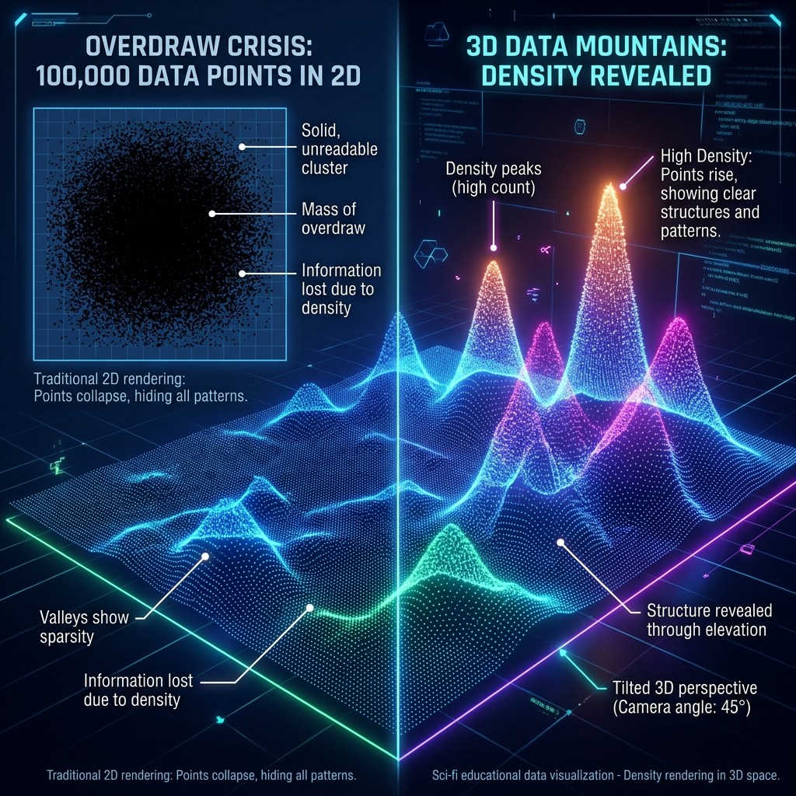

## M03 大师逆向工程：如何解剖一件艺术品？

<!-- BUDGET: 8000 chars | STATUS: done -->

> [VISUAL]
> *   **Slide**: `S05_Culture_Confidence`
> *   **Layout**: `Full`
> *   **Scene**: 屏幕一分为二，左侧是一张静止的中国传统书法，右侧是密密麻麻的 Excel 数据表格。两者之间打上了一个巨大的问号，暗示两种维度的断裂。
> *   **Text**: "冲突：当艺术没有表格，如何可视化？"
> *   **Asset**: 

> [LIFE CONNECT]
在 M01 模块中，我们刚刚见识了西方神作在宏大议题下面临的**四大弊端**。尤其是**“排版水土不服”**和**“缺乏情感共鸣”**，这几乎是每一个国内学子在做本土文化艺术可视化时都会踩的雷。当我们看到那些绝美的文化数据源（如一幅油画、一首藏文诗歌）时，第一反应往往是惊叹。但当你准备打开代码编辑器进行创作时，**恐慌感可能会瞬间袭来**。

> [WARNING]
为什么？因为传统的 Tamara 模型，是为金融、医学那种自带 Excel 表格的“硬数据”准备的。而文化艺术，它们根本没有可以用来作图的 X 轴和 Y 轴，只有笔触和意境。如果对没有明确结构的文化元素生搬硬套西方的可视化法则，只会让画面充斥着**认知负荷过高**的无序图腾，且最终被观众评价为**“冷冰冰，缺乏情感共鸣”**。

> [ACTIVITY] (QA)
> *   **Duration**: `1min`
> *   **Desc**: 悬念停顿
> 那么，这些大师究竟施展了什么魔法，硬生生地将感性的文化，塞进了理性的数学框架里？

> [TECH NOTE]
答案就在于我们今天要掌握的核心手术刀：**数据派生 (Data Derivation)**。这不是简单的格式转换，而是一种“暴力”的解构美学——**撕碎表象，榨取骨骼。**

> [VISUAL]
> *   **Slide**: `S05b_Data_Derivation_Knife`
> *   **Layout**: `Center`
> *   **Scene**: 一把发光的数字手术刀，将一张实体照片切开，切口处暴露出底层的二进制代码与几何网格。
> *   **Text**: "数据派生：解剖艺术的手术刀"
> *   **Asset**: 

### 2.1 撕碎语义：《解构藏文》的派生暴力美学

> [VISUAL]
> *   **Slide**: `S06_Tibetan_Deconstruct`
> *   **Layout**: `Split`
> *   **Scene**: 动画演示：一个完整的藏文单词被一把虚拟的数字刻刀切碎，笔画散落一地，随后被引力吸附成严密的几何节点网络。
> *   **Text**: "解构藏文：放弃语义，换取结构"
> *   **List**: "1. 理论映射 / 2. 逻辑映射 / 3. 技术溯源"
> *   **Asset**: `../public/textbook/5d6b338bf694bd25d47277ee0cccb8a99c6d8c5c3315c066f81a08fd90a569e2.jpg`
> *   **Source**: `Textbook`

让我们以上海大学团队的《解构藏文》为例，进行第一次逆向工程。

如果按常规思路，可视化文字就是做词云。但对于不懂藏文的普通观众来说，词云依然是一堆无意义的墨迹。

> [TEACHING MOMENT]
设计团队的解法是极其果断的：**直接剔除字面的“语义”，把其物理结构无情地解剖。**

- **Tamara 理论映射 (What-Why-How)**
  - **What (数据抽象)**：团队执行了深度的**数据派生 (Data Derivation)**。他们不再关心这个字念什么，而是像法医一样，**抽离**出笔画的拐角数量、长宽比例。把不可读的文学，强制**熔炼**成了可计算的几何特征数组。
  - **Why (任务意图)**：任务目标是**展示与欣赏 (Produce: Enjoy)**。当语言的意义被消除，认知干扰也就随之坍塌。观众通过纯粹的几何张力跨越了语言的鸿沟。
  - **How (视觉编码)**：使用**点 (Points)** 和**线 (Lines)** 作为基础标识，将几何参数映射到网格连线的**空间位置 (Spatial Position)** 和**动态张力**上。

- **郝亚维逻辑映射**
  - **信息逻辑中心**：藏文文字的物理结构与笔画张力。
  - **视觉导向与阅读秩序**：打破传统的横排阅读秩序，用引力网格建立起发散式的几何导向，让视觉焦点集中在结构的张力而非文字的字面上。

> [VISUAL]
> *   **Slide**: `S06b_P5_Mesh`
> *   **Layout**: `Center`
> *   **Scene**: 特写《解构藏文》的局部，展示多边形网格方程如何在散落的笔画节点之间生成动态的引力连线。
> *   **Text**: "P5.js 的生成艺术魔法"
> *   **Asset**: 

- **技术溯源 (W01-W06)**
  - 在技术底座上，复刻这套逻辑需要调用 **W05 讲解过的生成艺术（Generative Art）逻辑**，用 p5.js 中的多边形网格方程，将提取出的几何参数**牢牢锚定**在动态连线上，让静态的古籍在屏幕上**重新呼吸**。

### 2.2 科技向善：《Invisible Pixel》的空间突围

> [VISUAL]
> *   **Slide**: `S07_Invisible_Pixel`
> *   **Layout**: `Split`
> *   **Scene**: 屏幕上是快手平台成千上万个代表乡村用户的发光像素点，汇聚成壮观的数字地貌景观。
> *   **Text**: "《Invisible Pixel》：照亮乡村的数据之光"
> *   **List**: "1. 理论映射 / 2. 逻辑映射 / 3. 技术溯源"
> *   **Asset**: `../public/textbook/aed8d68b3d908b9e5937a4ce9407260f9a0fcc1c965bd1ef0261b955772ce003.jpg`
> *   **Source**: `Textbook`

江南大学团队的《Invisible Pixel》，展现了宏大叙事与微观数据的极致碰撞。但这个震撼人心的作品背后，是一场真实的技术血泪史。

> [CASE STUDY]
> 想象一下，你用 W03 学过的 Web 爬虫，好不容易从快手上抓取了十万条贫困乡村用户的视频数据。你满怀激动地把这十万个点画在一个二维的屏幕上，期待看到乡村的图景。结果呢？你看到的是一团糊在一起、密不透风的纯黑墨迹。这在学术上被称为**过度绘制（Overdraw）**，是数据可视化中最恐怖的视觉灾难。

> [VISUAL]
> *   **Slide**: `S07b_Overdraw_Crisis`
> *   **Layout**: `Center`
> *   **Scene**: 左侧是十万个点挤在二维平面上的死黑一团（过度绘制）；右侧是视角倾斜后，点阵被三维高度拉开，形成高低起伏的数据山脉地形图。
> *   **Text**: "空间突围：从二维死结到三维地貌"
> *   **Asset**: 

为了拯救这十万个几乎要被再次“折叠”的生命，并彻底击碎 M01 提到的**“缺乏情感共鸣”**这一弊端，团队必须进行**空间突围**：

- **Tamara 理论映射 (What-Why-How)**
  - **What (数据降维与升维)**：海量视频元数据与文本，通过人工智能技术被派生降维成**情感极性**（即将长篇大论的文本通过算法计算出一个单一数值，代表情绪的“正负”或“烈度”），随后又被大胆地**升维**为三维空间坐标。
  - **Why (任务意图)**：核心不再是冰冷的查找 (Search)，而是**探索与发现 (Discover: Target)** 个体在宏观时代中的位置。它解决了西方冷峻图表面临的共情困境，**唤醒**了巨大同理心。
  - **How (视觉编码)**：使用**点 (Points)** 标识十万个用户，并通过**体积 (Volume)** 和**亮度/发光通道 (Luminance)** 编码情感的烈度，将二维死结拉升为三维地貌。

- **郝亚维逻辑映射**
  - **信息逻辑中心**：贫困乡村个体的时代坐标与情感温度。
  - **视觉导向与阅读秩序**：用三维地形的高低起伏打破平面的死黑拥挤，建立起“从宏观俯瞰到微观凝视”的深度空间阅读秩序。

- **技术溯源 (W01-W06)**
  - 团队被迫放弃了简单的二维图表库，全面转向 **W06 讲解的 Three.js / WebGL 底层渲染**。为了扛住十万级发光粒子的实时渲染，必须深入图形学的底层手写 Shader（着色器，即控制每个像素发光质感与颜色的底层显卡指令）代码，才让这些代表着乡村生命的像素发出微光。

> [ACTIVITY]
> *   **Type**: `Quiz`
> *   **Duration**: `2min`
> *   **Desc**: 随堂检查：克服过度绘制
> 
> **Q: 数据新闻小组获取了某城市过去五年内发生的 5 万起交通事故的 GPS 坐标。他们将这些坐标以半透明红点的形式绘制在二维地图上，却发现市中心区域变成了一团密不透风的死红墨迹，完全看不出密度的差异。根据《Invisible Pixel》的“空间突围”策略，以下哪种修改方案能最有效地解决这一问题？**
> 
> - [ ] A. 保持二维地图不变，将所有红点的透明度进一步降低至 1%，让底图能透出来。
> - [ ] B. 放弃地图坐标，将所有事故数据导入 Excel，制作一个 5 万行的可检索表格。
> - [x] C. 引入三维视角，将事故密集度转化为立体网格中的“地形高度”，让市中心凸起形成数据山峰。
> - [ ] D. 采用随机抽样算法，删除其中 4 万个坐标点，只保留 1 万个点以显得不拥挤。
> 
> **Explain:**
> - 正确答案是 **C**。这个场景描述的是典型的数据可视化灾难——“过度绘制（Overdraw）”。《Invisible Pixel》给出的解法是通过升维（映射到三维空间的体积或高度）来拉开空间密度，建立地形起伏的阅读秩序（如选项 C）。
> - 选项 A 在数据量庞大时依然会叠加成纯色，无法从根本上解决 5 万个点的物理拥挤。
> - 选项 B 退回了查阅表格的阶段，违背了可视化的初衷。
> - 选项 D 破坏了原始数据的完整性，这不叫数据抽象，叫数据造假。

### 2.3 艺术解构：《Award Puzzle》的降维聚类

> [VISUAL]
> *   **Slide**: `S08_Award_Puzzle`
> *   **Layout**: `Full`
> *   **Scene**: 全国美展的油画作品被拆解成数万个彩色小斑点，铺满整个屏幕，并支持交互缩放。
> *   **Text**: "向帆团队的《Award Puzzle》：评委视觉偏好的数字切片"
> *   **List**: "1. 理论映射 / 2. 逻辑映射 / 3. 技术溯源"
> *   **Asset**: `../public/textbook/b61611fc10069346c4565b8dd8fd3f999b3dc320f2959f787f9f043d26198f76.jpg`
> *   **Source**: `Textbook`

如果说《Invisible Pixel》是为了看见不可见的生命，那么向帆团队的《Award Puzzle》则是为了看透高高在上的权威。

> [STORY TIME]
> 面对全国美展两千多幅“殿堂级”获奖油画，传统的艺术评论家可能会花几万字去分析它们的流派与笔触。向帆团队则引入理性的算法机器，试图回答一个核心问题：到底什么样的画更容易拿奖？然而，艺术是高维的（包含语义、情感、流派），如何将其派生为可计算的结构化数据，成为了破局的关键。

为了完成这次挑战审美直觉的“数据刺杀”，设计团队精心设计了以下管线：

- **Tamara 理论映射 (What-Why-How)**
  - **What (高维抽象)**：将非结构化的油画位图，重构为**色彩聚类中心**（即让算法把画作中千万种相近的颜色打包，提取出最具代表性的几个“主色调”）和**面积占比**这组结构化数据。
  - **Why (任务意图)**：执行高难度的**探索相关性 (Discover: Correlation)**。他们不是在画统计图，而是在生成一份客观的视觉审判书，让隐藏的“权力审美”密码在点阵中无处遁形。
  - **How (视觉编码)**：使用**面 (Areas)** 作为核心标识，通过**面积 (Size)** 编码占比，并用最直观的**色相 (Color Hue)** 还原画作主色调。

> [VISUAL]
> *   **Slide**: `S08b_Treemap_Layout`
> *   **Layout**: `Center`
> *   **Scene**: 动画演示 Treemap 布局算法：几千张大小不一的照片像细胞分裂一样，被算法紧密地挤压、排列在一个无缝隙的巨大矩形容器内。
> *   **Text**: "D3.js 树图布局：极度致密的切片阵列"
> *   **Asset**: 

- **郝亚维逻辑映射**
  - **信息逻辑中心**：获奖作品底层的客观色彩规律。
  - **视觉导向与阅读秩序**：去除了画作本身的山水、人物等叙事干扰，将纯粹的色彩斑块通过致密的网格阵列进行平铺，建立起清晰的并列阅读秩序，让色彩聚类规律一目了然。

- **技术溯源 (W01-W06)**
  - 复刻这套逻辑，需要强大的 **W01 Python 数据分析** 与 OpenCV 图像处理技术作为引擎，提取色相 (Color Hue)。然后用 **W04 的 D3.js** 中的树图 (Treemap) 布局算法，将数千幅画作像显微镜切片一样，强行压缩成致密的阵列（使用面积 Area 编码占比）。

### 2.4 降噪重构：《紫菜包饭》的科普突围

> [CASE STUDY]
> 宏大叙事之外，日常生活与医学科普往往面临另一种困境。正如我们在 M01 看到的《健康的嘴》与西方版面那样，稍有不慎就会制造**“认知负荷过高”**与**“排版水土不服”**。当向大众解释口腔结构或紫菜包饭的制作流程时，如果直接使用真实医学照片或食物实拍图，血肉的物理肌理或油脂的真实反光会产生巨大的“视觉杂音”，导致核心的科普逻辑被淹没。

> [VISUAL]
> *   **Slide**: `S09_Foreign_Masterpieces`
> *   **Layout**: `Grid`
> *   **Scene**: 张圣焕的《紫菜包饭》等生活地图与彼得·格兰迪的《健康的嘴》医学插图的对比阵列。
> *   **Text**: "科普降噪：过滤物理表象，重构逻辑秩序"
> *   **List**: "1. 理论映射 / 2. 逻辑映射 / 3. 技术溯源"
> *   **Asset**: 
> *   **Source**: `External`

为了跨越认知障碍，设计者们执行了截然不同的数据派生策略：**扁平降噪**。

- **Tamara 理论映射 (What-Why-How)**
  - **What (数据抽象)**：将三维的物理实体强行“压扁”，抽象为二维的**空间拓扑网络** (Network，即抛弃真实的物理形状，只保留点与点之间连接关系的“逻辑骨架”)；将连续的制作动作提取为一帧帧离散的**时序节点** (Temporal Items，即切分成定格的“步骤卡片”)。
  - **Why (任务意图)**：核心在于**展示与教育 (Produce: Annotate)**。放弃写实是为了滤除无用的真实感，建立起明确的导读秩序。
  - **How (视觉编码)**：放弃复杂的立体渲染，依赖最基础的**线 (Lines)** 与二维**面 (Areas)** 作为核心标识 (Marks)，通道上使用高饱和的定性**颜色 (Color)** 进行分类。

> [VISUAL]
> *   **Slide**: `S09b_Topology_Disassembly`
> *   **Layout**: `Center`
> *   **Scene**: 以《紫菜包饭》为例的剥离演示动画：第一层抽离出现实的米饭与海苔肌理，第二层提纯出扁平的几何色块，底层浮现出制作步骤的时序箭头拓扑网。
> *   **Text**: "郝亚维逻辑映射：剔除杂音，建立秩序"
> *   **Asset**: 

- **郝亚维逻辑映射**
  - **信息逻辑中心**：事物的装配流程与内在拓扑结构。
  - **视觉导向与阅读秩序**：果断过滤真实世界复杂的物理肌理，通过清晰的虚线、箭头等信标建立起明确的逻辑导读秩序，极大降低了认知门槛。
- **技术溯源 (W01-W06)**
  - 这种轻量级表达的主战场回到了 **W02 的 UI/UX 与矢量隐喻设计**。通过 Figma 或 Illustrator 的布尔运算提纯几何形态，配合网页中的 SVG hover 微交互，即可完成数字侧的知识呈现。

> [ACTIVITY]
> *   **Type**: `Quiz`
> *   **Duration**: `3min`
> *   **Desc**: 破冰互动：审美转换的业务决策
> 
> **Q: 刚入职的小李接到任务，要为一家百年中药铺设计一块交互墙，向普通顾客科普“不同药材在人体经络中的走向与药效”。老板提供了一批高清的药草实拍图和深奥的文言文古籍。如果小李要借鉴《紫菜包饭》案例中的“科普降噪”原则，以下哪种设计方案最合理？**
> 
> - [ ] A. 开发古籍原文检索系统，方便顾客通过生僻字精准查阅药效。
> - [x] B. 舍弃实拍图，提取药材的“归经”和“寒热”数据，将其转化为人体轮廓上不同颜色和走向的发光抽象线条。
> - [ ] C. 采用微距镜头为草药拍摄 3D 旋转模型，让顾客能 360 度放大查看表面的逼真纹理。
> - [ ] D. 将古籍翻译为白话文，并配上中药熬制过程的 4K 超清真实录像。
> 
> **Explain:**
> - 正确答案是 **B**。正如本节《紫菜包饭》案例所揭示的“科普降噪”逻辑，向大众解释复杂知识时，真实的物理肌理（如药草的枝叶纹理）往往会成为干扰核心逻辑的“视觉杂音”。选项 B 执行了有效的数据派生，提取出归经属性，并降噪重构为清晰的拓扑发光脉络。
> - A 和 D 属于单纯的文本与影像搬运，未发生数据抽象。
> - C 恰恰掉入了“过度追求真实感”的陷阱，保留并放大了物理材质，反而淹没了“药效”这一真正的逻辑核心。

> [TEACHING MOMENT]
> **总结这四个逆向工程案例，数据派生的核心代价与价值在于：牺牲表象的冗余，换取底层逻辑的重建。** 无论是剔除文字语义还是过滤物理肌理，抹去生动的细节并非丢失信息，而是为了跨越语言和表象的认知障碍，建立起清晰的逻辑导向。
